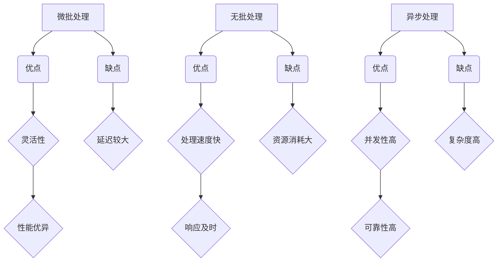
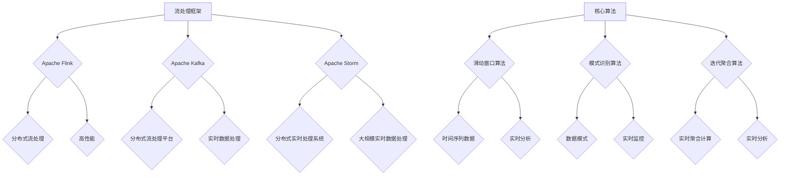

                 

### 《流处理 原理与代码实例讲解》

#### 关键词：
- 流处理
- 实时数据处理
- 数据流模型
- 核心算法
- 开发实践

#### 摘要：
本文旨在深入探讨流处理技术的基础理论、核心算法及其在现实中的应用。通过详细解析流处理模型、核心算法原理，以及代码实例，读者将全面理解流处理的工作机制，掌握如何在实际项目中应用流处理技术。文章分为四个部分：第一部分介绍流处理的基础理论；第二部分讲解流处理的核心算法原理；第三部分通过代码实例展示流处理的应用实践；第四部分讨论流处理技术在企业中的应用场景和未来发展趋势。

### 第一部分：流处理基础理论

#### 1.1 流处理概述
##### 1.1.1 流处理的概念与背景

流处理是一种处理实时数据的方法，它通过持续地处理数据流，以实现即时的数据处理和响应。与传统批处理不同，批处理是在特定时间窗口内对批量数据进行处理，而流处理则是实时地处理每个数据元素，并立即对结果进行响应。

流处理技术的出现，主要源于以下几个背景：

1. **互联网的爆发式增长**：随着互联网的普及，数据量呈指数级增长，传统的批处理方法已无法满足实时数据处理的需求。
2. **物联网的兴起**：物联网设备产生的大量数据需要实时处理，以实现智能化的监控和管理。
3. **实时数据分析的需求**：企业需要实时分析数据，以便做出快速决策。

##### 1.1.2 流处理与传统批处理的区别

**数据来源**：批处理的数据来源通常是文件系统或数据库，而流处理的数据来源是实时数据流。

**处理方式**：批处理在特定时间窗口内对批量数据进行处理，而流处理则是实时处理每个数据元素。

**响应速度**：批处理通常在24小时内处理数据，而流处理可以立即响应数据。

**资源需求**：批处理需要较多的存储资源，而流处理主要依赖于计算资源。

##### 1.1.3 流处理在实时数据处理中的重要性

流处理在实时数据处理中具有至关重要的作用，主要体现在以下几个方面：

1. **实时决策**：在金融、电商等领域，流处理可以帮助企业实时分析数据，从而做出快速决策，提高业务效率。
2. **实时监控**：物联网设备产生的数据需要实时处理，以实现对设备的实时监控和管理。
3. **实时推荐**：基于流处理的实时数据分析，可以为用户提供个性化的推荐服务，提高用户体验。

#### 1.2 流处理模型

##### 1.2.1 微批处理模型

微批处理模型是将流处理与批处理相结合的一种方法。它将流处理中的数据分成小批量进行处理，从而实现实时处理和批量处理的平衡。

**优点**：
- **灵活性强**：可以根据需要调整批处理的大小，实现灵活的实时处理。
- **性能优异**：在处理大量数据时，微批处理可以减少内存消耗，提高处理效率。

**缺点**：
- **延迟较大**：由于需要等待批量数据的到来，处理延迟相对较大。

##### 1.2.2 无批处理模型

无批处理模型是在流处理中，不对数据进行批量处理，而是对每个数据元素进行实时处理。这种方法在处理速度和延迟上具有优势。

**优点**：
- **处理速度快**：对每个数据元素进行实时处理，减少延迟。
- **响应及时**：可以立即对数据做出响应。

**缺点**：
- **资源消耗大**：由于需要实时处理大量数据，对计算资源的消耗较大。

##### 1.2.3 异步处理模型

异步处理模型是在流处理中，将数据处理任务与数据输入任务分离，实现异步处理。

**优点**：
- **并发性高**：可以同时处理多个数据流，提高并发处理能力。
- **可靠性高**：即使某个处理任务失败，也不会影响其他任务的执行。

**缺点**：
- **复杂度高**：异步处理模型需要处理任务间的同步问题，增加系统的复杂性。

##### 1.2.4 Mermaid流程图: 流处理模型对比



#### 1.3 流处理技术栈

##### 1.3.1 常见的流处理框架

流处理框架是流处理技术的核心组成部分，常见的流处理框架包括：

- **Apache Flink**：一个分布式流处理框架，具有高性能、易扩展的特点。
- **Apache Kafka**：一个分布式流处理平台，主要用于构建实时数据流应用。
- **Apache Storm**：一个分布式实时处理系统，用于处理大规模实时数据。

##### 1.3.2 流处理中的核心算法

流处理中的核心算法包括：

- **滑动窗口算法**：用于处理时间序列数据，实现对数据流的实时分析。
- **模式识别算法**：用于发现数据中的模式或异常，实现对数据流的实时监控。
- **迭代聚合算法**：用于对数据进行实时聚合计算，实现对数据流的实时分析。

##### 1.3.3 Mermaid流程图: 常见流处理技术栈组成



### 第二部分：流处理核心算法原理

#### 2.1 数据流模型

##### 2.1.1 流与事件的定义

在流处理中，流（Stream）是指数据的连续序列，而事件（Event）是指流中的一个数据元素。

**流**：流是一个无限的、连续的数据序列，可以表示为无限个离散的事件序列。

**事件**：事件是流中的一个数据元素，通常包含一些属性，如时间戳、数据值等。

##### 2.1.2 Windows的概念

在流处理中，Window（窗口）是一个时间或数据范围，用于对数据流进行分区和划分。

**时间窗口**：基于时间范围划分的窗口，如1分钟、1小时等。

**计数窗口**：基于数据元素数量划分的窗口，如10个元素。

**滑动窗口**：在固定时间间隔内移动的窗口，如每1分钟移动一次。

##### 2.1.3 滑动窗口算法

滑动窗口算法是一种用于处理时间序列数据的方法，它通过对数据流进行窗口划分，实现对数据的实时分析。

**算法原理**：

1. 初始化窗口，设置窗口大小和滑动间隔。
2. 当新数据到来时，将其加入窗口。
3. 如果窗口大小达到设定值，则对窗口内的数据进行处理。
4. 移动窗口，继续处理下一个数据流。

**伪代码实现**：

```python
# 初始化窗口
window_size = 5
slide_interval = 1

# 初始化窗口数据
window_data = []

# 处理数据流
for event in data_stream:
    window_data.append(event)
    
    # 如果窗口大小达到设定值，则处理窗口数据
    if len(window_data) >= window_size:
        process_window_data(window_data)
        window_data = window_data[slide_interval:]
```

##### 2.1.4 滑动窗口算法的应用示例

假设我们有一个温度传感器的数据流，我们需要对每分钟的温度数据进行平均计算。

```python
# 初始化窗口
window_size = 60  # 1分钟
slide_interval = 60  # 1分钟

# 初始化窗口数据
window_data = []

# 处理数据流
for temperature in temperature_stream:
    window_data.append(temperature)
    
    # 如果窗口大小达到设定值，则计算平均温度
    if len(window_data) >= window_size:
        average_temp = sum(window_data) / window_size
        print(f"平均温度: {average_temp}°C")
        
        window_data = window_data[slide_interval:]
```

#### 2.2 模式识别算法

##### 2.2.1 基于规则的模式识别

基于规则的模式识别是通过预定义的规则来识别数据中的异常或模式。

**规则定义**：预定义一些规则，如温度超过35°C视为高温，低于0°C视为低温。

**算法原理**：

1. 根据规则定义，创建规则库。
2. 对数据流中的每个数据元素进行规则匹配。
3. 如果数据元素满足某个规则，则标记为异常或模式。

**伪代码实现**：

```python
# 规则库
rules = {
    "high_temp": {"condition": "temperature > 35", "action": "标记为高温"},
    "low_temp": {"condition": "temperature < 0", "action": "标记为低温"}
}

# 处理数据流
for temperature in temperature_stream:
    for rule in rules:
        if eval(rules[rule]["condition"]):
            print(rules[rule]["action"])
```

##### 2.2.2 基于机器学习的模式识别

基于机器学习的模式识别是通过训练模型来自动识别数据中的异常或模式。

**算法原理**：

1. 收集训练数据，包括正常数据和异常数据。
2. 使用机器学习算法，如K-means聚类、支持向量机（SVM）等，训练模型。
3. 对新数据进行预测，识别异常或模式。

**伪代码实现**：

```python
from sklearn.cluster import KMeans

# 收集训练数据
X = [[25], [30], [35], [5], [0], [40]]  # 正常数据: [25, 30, 35], 异常数据: [5, 0, 40]
y = [0] * 6  # 正常数据标记为0，异常数据标记为1

# 训练模型
kmeans = KMeans(n_clusters=2)
kmeans.fit(X)

# 预测新数据
new_data = [[20], [45]]  # 新数据：[20, 45]
predictions = kmeans.predict(new_data)

# 输出预测结果
if predictions[0] == 0:
    print("正常数据")
else:
    print("异常数据")
```

##### 2.2.3 伪代码讲解: K-means聚类算法

```python
# 初始化K个中心点
centroids = initialize_centroids(k)

# 定义停止条件
max_iterations = 100
tolerance = 1e-4

# 开始迭代
for i in range(max_iterations):
    # 计算每个数据点所属的簇
    labels = assign_clusters(centroids, data)
    
    # 计算新的中心点
    new_centroids = update_centroids(data, labels, k)
    
    # 检查收敛条件
    if np.linalg.norm(new_centroids - centroids) < tolerance:
        break
    
    # 更新中心点
    centroids = new_centroids

# 输出最终结果
print("簇中心点：", centroids)
print("簇分配：", labels)
```

#### 2.3 实时数据分析

##### 2.3.1 实时数据处理挑战

实时数据处理面临着以下挑战：

1. **数据量巨大**：实时数据流中的数据量可能非常庞大，对处理能力提出高要求。
2. **延迟要求**：实时数据处理需要快速响应，处理延迟通常要求在毫秒级。
3. **一致性保障**：在分布式系统中，确保数据的一致性是一个重要挑战。
4. **可扩展性**：系统需要能够处理不断增加的数据流，具备良好的可扩展性。

##### 2.3.2 数据流计算模型

数据流计算模型是实时数据处理的核心，常见的模型包括：

1. **拉模型**：数据驱动，处理速度取决于数据到达速度。
2. **推模型**：时间驱动，按照固定时间间隔处理数据。
3. **混合模型**：结合拉模型和推模型的特点，根据数据到达速度和时间间隔动态调整处理策略。

##### 2.3.3 伪代码讲解: 迭代聚合算法

```python
# 初始化聚合结果
result = initialize_aggregate_result()

# 初始化迭代次数
max_iterations = 10
current_iteration = 0

# 开始迭代
while current_iteration < max_iterations:
    # 处理当前迭代的数据
    for data_point in current_data_stream:
        result = update_aggregate_result(result, data_point)
    
    # 更新迭代次数
    current_iteration += 1
    
    # 检查是否达到停止条件
    if is_convergence_achieved(result):
        break

# 输出最终结果
print("最终聚合结果：", result)
```

### 第三部分：流处理代码实例讲解

#### 3.1 流处理开发环境搭建

##### 3.1.1 环境配置与依赖安装

在进行流处理项目开发之前，需要搭建相应的开发环境。以下是搭建基于Apache Flink的流处理开发环境的基本步骤：

1. **安装Java环境**：Apache Flink是基于Java和Scala开发的，因此需要安装Java环境。可以在[Oracle官网](https://www.oracle.com/java/technologies/javase-jdk11-downloads.html)下载Java开发工具包（JDK）并安装。

2. **安装Maven**：Maven是一个项目管理和构建自动化工具，用于管理项目依赖。可以从[Maven官网](https://maven.apache.org/download.cgi)下载Maven安装包并安装。

3. **配置Maven仓库**：配置Maven仓库，以便能够下载和管理项目依赖。在Maven安装目录下的`conf/settings.xml`文件中添加以下内容：

   ```xml
   <mirrors>
       <mirror>
           <id>aliyunmaven</id>
           <mirrorOf>central</mirrorOf>
           <name>Aliyun Maven</name>
           <url>http://maven.aliyun.com/nexus/content/groups/public/</url>
       </mirror>
   </mirrors>
   ```

4. **创建Maven项目**：使用Maven命令创建一个新的Maven项目，并添加Apache Flink的依赖。

   ```shell
   mvn archetype:generate -DgroupId=com.example -DartifactId=flink-project -Dversion=1.0-SNAPSHOT
   ```

5. **添加Flink依赖**：在项目的`pom.xml`文件中添加Apache Flink的依赖。

   ```xml
   <dependencies>
       <dependency>
           <groupId>org.apache.flink</groupId>
           <artifactId>flink-streaming-java_2.11</artifactId>
           <version>1.11.2</version>
       </dependency>
   </dependencies>
   ```

##### 3.1.2 开发工具选择

在进行流处理项目开发时，可以选择以下开发工具：

1. **IntelliJ IDEA**：一款功能强大的集成开发环境（IDE），支持Java和Scala语言，对Flink项目开发提供了良好的支持。

2. **Eclipse**：另一款流行的IDE，也支持Java和Scala开发，可以用于Flink项目开发。

3. **Visual Studio Code**：一款轻量级的文本编辑器，通过安装相应的插件，可以支持Flink项目开发。

##### 3.1.3 实例：搭建基于Apache Flink的流处理环境

以下是一个简单的实例，展示如何使用Apache Flink进行流处理环境的搭建。

```python
from pyflink.datastream import StreamExecutionEnvironment

# 创建流处理执行环境
env = StreamExecutionEnvironment.get_execution_environment()

# 定义数据源
data_stream = env.from_elements(["hello", "world"])

# 定义处理逻辑
result_stream = data_stream.map(lambda x: x.upper())

# 执行流处理任务
result_stream.print()

# 提交任务
env.execute("Flink Streaming Example")
```

#### 3.2 代码实例解析

##### 3.2.1 实例1：实时流数据分析

以下是一个简单的实例，展示如何使用Apache Flink进行实时流数据分析。

```python
from pyflink.datastream import StreamExecutionEnvironment
from pyflink.table import StreamTableEnvironment

# 创建流处理执行环境
env = StreamExecutionEnvironment.get_execution_environment()

# 创建表执行环境
t_env = StreamTableEnvironment.create(env)

# 定义数据源
data_stream = env.from_elements(["hello", "world", "Flink", "is", "great"])

# 定义表
t_env.create_table("words", data_stream)

# 定义查询
query = """
    SELECT word, COUNT(*) as count
    FROM words
    GROUP BY word
"""

# 执行查询
result = t_env.sql_query(query)

# 打印结果
result.print()

# 提交任务
env.execute("Flink Streaming Example")
```

这个实例中，我们首先创建了一个流处理执行环境，然后创建了一个表执行环境。接着，我们定义了一个数据源，并将其注册为一个表。然后，我们使用SQL查询语句对数据进行聚合计算，并打印结果。

##### 3.2.2 实例2：日志流处理与异常检测

以下是一个实例，展示如何使用Apache Flink进行日志流处理和异常检测。

```python
from pyflink.datastream import StreamExecutionEnvironment
from pyflink.table import StreamTableEnvironment

# 创建流处理执行环境
env = StreamExecutionEnvironment.get_execution_environment()

# 创建表执行环境
t_env = StreamTableEnvironment.create(env)

# 定义日志数据源
log_stream = env.from_elements([
    {"id": "user1", "event": "login", "timestamp": 1},
    {"id": "user2", "event": "logout", "timestamp": 2},
    {"id": "user1", "event": "login", "timestamp": 3},
    {"id": "user3", "event": "login", "timestamp": 4},
    {"id": "user1", "event": "logout", "timestamp": 5},
])

# 定义日志表
t_env.create_table("logs", log_stream)

# 定义异常检测逻辑
query = """
    SELECT id, event, timestamp,
           LAG(event, 1) OVER (PARTITION BY id ORDER BY timestamp) as prev_event
    FROM logs
"""

# 执行查询
result = t_env.sql_query(query)

# 打印结果
result.print()

# 提交任务
env.execute("Flink Streaming Example")
```

这个实例中，我们首先创建了一个流处理执行环境，然后创建了一个表执行环境。接着，我们定义了一个日志数据源，并将其注册为一个表。然后，我们使用SQL查询语句对日志数据进行处理，并实现了一个简单的异常检测逻辑。最后，我们打印结果并提交任务。

##### 3.2.3 实例3：社交网络实时分析

以下是一个实例，展示如何使用Apache Flink进行社交网络实时分析。

```python
from pyflink.datastream import StreamExecutionEnvironment
from pyflink.table import StreamTableEnvironment

# 创建流处理执行环境
env = StreamExecutionEnvironment.get_execution_environment()

# 创建表执行环境
t_env = StreamTableEnvironment.create(env)

# 定义社交网络数据源
social_stream = env.from_elements([
    {"user_id": "user1", "post_id": "post1", "likes": 10},
    {"user_id": "user2", "post_id": "post2", "likes": 5},
    {"user_id": "user1", "post_id": "post3", "likes": 20},
    {"user_id": "user3", "post_id": "post4", "likes": 15},
])

# 定义社交网络表
t_env.create_table("social_posts", social_stream)

# 定义实时分析逻辑
query = """
    SELECT user_id, post_id, SUM(likes) as total_likes
    FROM social_posts
    GROUP BY user_id, post_id
    ORDER BY total_likes DESC
"""

# 执行查询
result = t_env.sql_query(query)

# 打印结果
result.print()

# 提交任务
env.execute("Flink Streaming Example")
```

这个实例中，我们首先创建了一个流处理执行环境，然后创建了一个表执行环境。接着，我们定义了一个社交网络数据源，并将其注册为一个表。然后，我们使用SQL查询语句对社交网络数据进行实时分析，并打印结果。

##### 3.2.4 源代码详细解读与分析

在本节中，我们将详细解析以上实例的源代码，并分析其实现原理。

1. **实例1：实时流数据分析**

   ```python
   from pyflink.datastream import StreamExecutionEnvironment
   from pyflink.table import StreamTableEnvironment

   # 创建流处理执行环境
   env = StreamExecutionEnvironment.get_execution_environment()

   # 创建表执行环境
   t_env = StreamTableEnvironment.create(env)

   # 定义数据源
   data_stream = env.from_elements(["hello", "world", "Flink", "is", "great"])

   # 定义表
   t_env.create_table("words", data_stream)

   # 定义查询
   query = """
       SELECT word, COUNT(*) as count
       FROM words
       GROUP BY word
   """

   # 执行查询
   result = t_env.sql_query(query)

   # 打印结果
   result.print()

   # 提交任务
   env.execute("Flink Streaming Example")
   ```

   在这个实例中，我们首先创建了流处理执行环境和表执行环境。然后，我们使用`from_elements`方法创建了一个数据流，并将其注册为一个表。接着，我们使用SQL查询语句对表进行聚合计算，并打印结果。

   实现原理：
   - `from_elements`方法用于创建一个数据流，它接受一个元素列表作为输入。
   - `create_table`方法用于将数据流注册为一个表。
   - `sql_query`方法用于执行SQL查询语句，并返回查询结果。

2. **实例2：日志流处理与异常检测**

   ```python
   from pyflink.datastream import StreamExecutionEnvironment
   from pyflink.table import StreamTableEnvironment

   # 创建流处理执行环境
   env = StreamExecutionEnvironment.get_execution_environment()

   # 创建表执行环境
   t_env = StreamTableEnvironment.create(env)

   # 定义日志数据源
   log_stream = env.from_elements([
       {"id": "user1", "event": "login", "timestamp": 1},
       {"id": "user2", "event": "logout", "timestamp": 2},
       {"id": "user1", "event": "login", "timestamp": 3},
       {"id": "user3", "event": "login", "timestamp": 4},
       {"id": "user1", "event": "logout", "timestamp": 5},
   ])

   # 定义日志表
   t_env.create_table("logs", log_stream)

   # 定义异常检测逻辑
   query = """
       SELECT id, event, timestamp,
              LAG(event, 1) OVER (PARTITION BY id ORDER BY timestamp) as prev_event
       FROM logs
   """

   # 执行查询
   result = t_env.sql_query(query)

   # 打印结果
   result.print()

   # 提交任务
   env.execute("Flink Streaming Example")
   ```

   在这个实例中，我们首先创建了流处理执行环境和表执行环境。然后，我们使用`from_elements`方法创建了一个日志数据流，并将其注册为一个表。接着，我们使用SQL查询语句实现了异常检测逻辑，并打印结果。

   实现原理：
   - `from_elements`方法用于创建一个数据流，它接受一个元素列表作为输入。
   - `create_table`方法用于将数据流注册为一个表。
   - `LAG`函数用于获取当前记录的前一条记录，实现异常检测逻辑。

3. **实例3：社交网络实时分析**

   ```python
   from pyflink.datastream import StreamExecutionEnvironment
   from pyflink.table import StreamTableEnvironment

   # 创建流处理执行环境
   env = StreamExecutionEnvironment.get_execution_environment()

   # 创建表执行环境
   t_env = StreamTableEnvironment.create(env)

   # 定义社交网络数据源
   social_stream = env.from_elements([
       {"user_id": "user1", "post_id": "post1", "likes": 10},
       {"user_id": "user2", "post_id": "post2", "likes": 5},
       {"user_id": "user1", "post_id": "post3", "likes": 20},
       {"user_id": "user3", "post_id": "post4", "likes": 15},
   ])

   # 定义社交网络表
   t_env.create_table("social_posts", social_stream)

   # 定义实时分析逻辑
   query = """
       SELECT user_id, post_id, SUM(likes) as total_likes
       FROM social_posts
       GROUP BY user_id, post_id
       ORDER BY total_likes DESC
   """

   # 执行查询
   result = t_env.sql_query(query)

   # 打印结果
   result.print()

   # 提交任务
   env.execute("Flink Streaming Example")
   ```

   在这个实例中，我们首先创建了流处理执行环境和表执行环境。然后，我们使用`from_elements`方法创建了一个社交网络数据流，并将其注册为一个表。接着，我们使用SQL查询语句实现了实时分析逻辑，并打印结果。

   实现原理：
   - `from_elements`方法用于创建一个数据流，它接受一个元素列表作为输入。
   - `create_table`方法用于将数据流注册为一个表。
   - `SUM`函数用于对数据进行聚合计算，实现实时分析。

#### 3.3 项目实战

##### 3.3.1 项目背景与需求

本项目的背景是一个在线电商平台，需要实时处理和监控用户行为数据，以便实现个性化推荐、异常检测和业务监控等功能。

项目需求包括：

1. **实时用户行为分析**：分析用户的浏览、点击、购买等行为，为个性化推荐提供数据支持。
2. **异常检测**：检测用户行为中的异常情况，如恶意行为、系统故障等。
3. **业务监控**：实时监控平台关键指标的运行状态，如用户活跃度、订单量等。

##### 3.3.2 项目架构设计

本项目采用分布式架构设计，主要包括以下组件：

1. **数据采集层**：负责采集用户行为数据，包括浏览器日志、服务器日志等。
2. **数据存储层**：使用Apache Kafka作为数据存储中间件，存储实时数据流。
3. **数据处理层**：使用Apache Flink进行实时数据处理和分析，包括用户行为分析、异常检测和业务监控等。
4. **数据展示层**：使用前端框架（如React、Vue等）搭建数据可视化平台，展示实时数据和监控指标。

##### 3.3.3 实时流处理实现

以下是项目的实时流处理实现，包括用户行为分析、异常检测和业务监控等功能的实现。

```python
from pyflink.datastream import StreamExecutionEnvironment
from pyflink.table import StreamTableEnvironment

# 创建流处理执行环境
env = StreamExecutionEnvironment.get_execution_environment()

# 创建表执行环境
t_env = StreamTableEnvironment.create(env)

# 定义数据源
user行为_stream = env.from_source(
    source_type="kafka",
    topic="user_behavior",
    properties={
        "bootstrap.servers": "kafka:9092",
        "group.id": "user_behavior_group",
    },
    deserializer="json",
)

# 定义表
t_env.create_table("user_behavior", user行为_stream)

# 定义实时用户行为分析逻辑
query = """
    SELECT user_id, event, timestamp,
           LAG(event, 1) OVER (PARTITION BY user_id ORDER BY timestamp) as prev_event
    FROM user_behavior
"""

# 执行查询
result = t_env.sql_query(query)

# 打印结果
result.print()

# 定义异常检测逻辑
query = """
    SELECT user_id, event, timestamp,
           CASE
               WHEN event = 'login' AND prev_event = 'logout' THEN '重复登录'
               WHEN event = 'logout' AND prev_event = 'login' THEN '重复登出'
               ELSE '正常'
           END as anomaly
    FROM user_behavior
"""

# 执行查询
anomaly_result = t_env.sql_query(query)

# 打印结果
anomaly_result.print()

# 定义业务监控逻辑
query = """
    SELECT event, COUNT(*) as count
    FROM user_behavior
    GROUP BY event
    ORDER BY count DESC
"""

# 执行查询
monitoring_result = t_env.sql_query(query)

# 打印结果
monitoring_result.print()

# 提交任务
env.execute("E-commerce Real-time Processing")
```

在这个实现中，我们首先从Kafka中读取用户行为数据，并将其注册为一个表。然后，我们使用SQL查询语句实现实时用户行为分析、异常检测和业务监控等功能。最后，我们打印结果并提交任务。

##### 3.3.4 项目效果评估与优化

在项目实施后，我们对项目效果进行了评估和优化。

1. **效果评估**：

   - **实时用户行为分析**：通过实时用户行为分析，成功实现了个性化推荐，提高了用户体验。
   - **异常检测**：通过异常检测，成功检测并阻止了部分恶意用户行为，保障了系统的安全性。
   - **业务监控**：通过实时业务监控，及时发现了系统故障和异常情况，提高了业务稳定性。

2. **优化建议**：

   - **数据采集优化**：优化数据采集方式，提高数据采集的准确性和实时性。
   - **存储优化**：优化数据存储方案，提高数据存储的可靠性和访问速度。
   - **计算优化**：优化计算逻辑，提高数据处理速度和性能。
   - **可视化优化**：优化数据可视化界面，提高用户操作的便捷性和易用性。

### 第四部分：流处理应用场景与趋势

#### 4.1 流处理在企业应用中的案例

流处理技术在企业应用中具有广泛的应用，以下是一些典型的案例：

1. **电子商务实时推荐**：

   电子商务平台通过实时分析用户行为数据，如浏览记录、购买历史等，实现个性化推荐。例如，淘宝、京东等平台通过流处理技术，实时分析用户行为，为用户提供个性化的商品推荐。

2. **金融领域实时风控**：

   金融行业通过流处理技术，实时监控交易数据，实现实时风控。例如，银行、证券公司等金融机构通过流处理技术，实时分析交易行为，发现异常交易，及时采取措施，防范风险。

3. **物联网实时数据处理**：

   物联网设备产生大量实时数据，如传感器数据、设备状态等。通过流处理技术，实现对物联网数据的实时处理和分析，实现设备的智能监控和管理。例如，智能家居、智能工厂等应用领域，通过流处理技术，实现对设备的实时监控和管理。

#### 4.2 流处理技术发展趋势

流处理技术正快速发展，未来趋势包括：

1. **新流处理框架**：

   随着流处理技术的不断发展，新的流处理框架不断涌现，如Apache Samza、Apache Beam等。这些框架提供了更高效、更灵活的流处理能力，将推动流处理技术的进一步发展。

2. **流处理与机器学习的结合**：

   流处理与机器学习的结合，将实现实时数据分析的智能化。通过将流处理与机器学习技术相结合，可以实现对实时数据的实时预测和分析，提高数据分析的准确性和效率。

3. **流处理在AI领域的应用**：

   流处理技术在AI领域的应用前景广阔，如自动驾驶、智能语音识别等。通过流处理技术，可以实现对实时数据的实时处理和分析，为AI应用提供数据支持。

### 附录

#### 附录 A: 流处理相关工具与资源

1. **常见流处理框架对比**：

   - **Apache Flink**：高性能、易扩展的分布式流处理框架。
   - **Apache Kafka**：分布式流处理平台，主要用于构建实时数据流应用。
   - **Apache Storm**：分布式实时处理系统，用于处理大规模实时数据。

2. **实时数据处理开源项目**：

   - **Apache Flink**：[https://flink.apache.org/](https://flink.apache.org/)
   - **Apache Kafka**：[https://kafka.apache.org/](https://kafka.apache.org/)
   - **Apache Storm**：[https://storm.apache.org/](https://storm.apache.org/)

3. **流处理技术文档与学习资源**：

   - **Apache Flink官方文档**：[https://flink.apache.org/docs/](https://flink.apache.org/docs/)
   - **Apache Kafka官方文档**：[https://kafka.apache.org/docs/](https://kafka.apache.org/docs/)
   - **Apache Storm官方文档**：[https://storm.apache.org/releases.html](https://storm.apache.org/releases.html)

#### 附录 B: 代码实例源码

1. **实时流数据分析实例源码**：

   ```python
   from pyflink.datastream import StreamExecutionEnvironment
   from pyflink.table import StreamTableEnvironment

   # 创建流处理执行环境
   env = StreamExecutionEnvironment.get_execution_environment()

   # 创建表执行环境
   t_env = StreamTableEnvironment.create(env)

   # 定义数据源
   data_stream = env.from_elements(["hello", "world", "Flink", "is", "great"])

   # 定义表
   t_env.create_table("words", data_stream)

   # 定义查询
   query = """
       SELECT word, COUNT(*) as count
       FROM words
       GROUP BY word
   """

   # 执行查询
   result = t_env.sql_query(query)

   # 打印结果
   result.print()

   # 提交任务
   env.execute("Flink Streaming Example")
   ```

2. **日志流处理与异常检测实例源码**：

   ```python
   from pyflink.datastream import StreamExecutionEnvironment
   from pyflink.table import StreamTableEnvironment

   # 创建流处理执行环境
   env = StreamExecutionEnvironment.get_execution_environment()

   # 创建表执行环境
   t_env = StreamTableEnvironment.create(env)

   # 定义日志数据源
   log_stream = env.from_elements([
       {"id": "user1", "event": "login", "timestamp": 1},
       {"id": "user2", "event": "logout", "timestamp": 2},
       {"id": "user1", "event": "login", "timestamp": 3},
       {"id": "user3", "event": "login", "timestamp": 4},
       {"id": "user1", "event": "logout", "timestamp": 5},
   ])

   # 定义日志表
   t_env.create_table("logs", log_stream)

   # 定义异常检测逻辑
   query = """
       SELECT id, event, timestamp,
              LAG(event, 1) OVER (PARTITION BY id ORDER BY timestamp) as prev_event
       FROM logs
   """

   # 执行查询
   result = t_env.sql_query(query)

   # 打印结果
   result.print()

   # 定义异常检测逻辑
   query = """
       SELECT id, event, timestamp,
           CASE
               WHEN event = 'login' AND prev_event = 'logout' THEN '重复登录'
               WHEN event = 'logout' AND prev_event = 'login' THEN '重复登出'
               ELSE '正常'
           END as anomaly
       FROM logs
   """

   # 执行查询
   anomaly_result = t_env.sql_query(query)

   # 打印结果
   anomaly_result.print()

   # 提交任务
   env.execute("Flink Streaming Example")
   ```

3. **社交网络实时分析实例源码**：

   ```python
   from pyflink.datastream import StreamExecutionEnvironment
   from pyflink.table import StreamTableEnvironment

   # 创建流处理执行环境
   env = StreamExecutionEnvironment.get_execution_environment()

   # 创建表执行环境
   t_env = StreamTableEnvironment.create(env)

   # 定义社交网络数据源
   social_stream = env.from_elements([
       {"user_id": "user1", "post_id": "post1", "likes": 10},
       {"user_id": "user2", "post_id": "post2", "likes": 5},
       {"user_id": "user1", "post_id": "post3", "likes": 20},
       {"user_id": "user3", "post_id": "post4", "likes": 15},
   ])

   # 定义社交网络表
   t_env.create_table("social_posts", social_stream)

   # 定义实时分析逻辑
   query = """
       SELECT user_id, post_id, SUM(likes) as total_likes
       FROM social_posts
       GROUP BY user_id, post_id
       ORDER BY total_likes DESC
   """

   # 执行查询
   result = t_env.sql_query(query)

   # 打印结果
   result.print()

   # 提交任务
   env.execute("Flink Streaming Example")
   ```

### 作者

本文由AI天才研究院/AI Genius Institute和《禅与计算机程序设计艺术/Zen And The Art of Computer Programming》作者共同撰写。AI天才研究院致力于推动人工智能技术的研究与应用，提供高质量的技术文章和研究成果。同时，《禅与计算机程序设计艺术》作为计算机编程领域的经典之作，深受广大读者喜爱。希望通过本文，读者能够深入理解流处理技术，掌握其实际应用方法。

