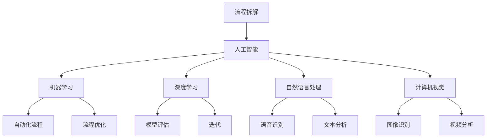

                 

# 《流程拆解与AI的应用》

> 关键词：流程拆解、人工智能、应用、优化、自动化、创新

> 摘要：本文将探讨流程拆解与人工智能（AI）的深度融合。通过详细剖析流程拆解的基本概念、AI在流程拆解中的核心作用，以及AI在流程自动化、优化和创新中的应用，本文旨在展示AI如何助力流程拆解，提升企业效率和创新能力。

## 目录

### 第一部分：理解流程拆解与AI

#### 第1章：流程拆解的基本概念

1.1 流程拆解的定义与目的

1.2 流程拆解的关键步骤

1.3 流程拆解在不同领域的应用

#### 第2章：AI在流程拆解中的作用

2.1 AI的基本原理与应用

2.2 机器学习在流程拆解中的应用

2.3 深度学习与流程拆解

#### 第3章：流程拆解与AI的核心概念

3.1 数据预处理与特征提取

3.2 流程建模与优化

3.3 模型评估与迭代

#### 第4章：AI流程拆解的实际案例

4.1 案例一：制造业流程拆解与优化

4.2 案例二：金融服务流程拆解与风控

4.3 案例三：物流与供应链管理流程拆解

### 第二部分：AI在流程拆解中的具体应用

#### 第5章：AI在流程自动化中的应用

5.1 自动化流程设计

5.2 自动化流程的AI实现

5.3 自动化流程的监控与维护

#### 第6章：AI在流程优化中的应用

6.1 流程效率分析

6.2 流程成本控制

6.3 流程质量提升

#### 第7章：AI在流程创新中的应用

7.1 创新流程的概念与方法

7.2 AI驱动的流程创新实践

7.3 创新流程的可持续性评估

#### 第8章：AI流程拆解的未来展望

8.1 AI流程拆解的技术发展趋势

8.2 AI流程拆解对行业的影响

8.3 AI流程拆解的未来方向

### 附录

#### 附录A：常用AI流程拆解工具与平台

A.1 AI流程拆解工具概述

A.2 主流AI流程拆解平台介绍

A.3 AI流程拆解工具使用指南

#### 附录B：流程拆解与AI的关键术语解释

B.1 关键术语定义

B.2 术语关系图示

B.3 关键术语应用举例

## 第1章：流程拆解的基本概念

### 1.1 流程拆解的定义与目的

流程拆解是一种系统化的方法，通过将复杂流程分解为更小、更易于管理的子流程，以实现更好的理解和优化。它通常涉及识别流程中的每个步骤、活动、决策点和输入输出，以便更好地理解流程的工作原理。

流程拆解的目的主要有以下几点：

1. **理解流程**：通过分解流程，可以更清晰地理解流程的每个组成部分及其相互作用。
2. **优化流程**：通过识别流程中的瓶颈和低效部分，可以对其进行优化，以提高整体效率和效果。
3. **改进流程**：流程拆解可以帮助识别流程中的缺陷和问题，从而进行改进。
4. **支持决策**：通过流程拆解，可以获得有关流程的性能指标和关键指标，以便更好地支持决策。

### 1.2 流程拆解的关键步骤

流程拆解通常包括以下关键步骤：

1. **确定流程边界**：首先，需要明确流程的范围和边界，包括流程的输入和输出。
2. **绘制流程图**：使用流程图工具，如Mermaid，绘制流程的各个步骤、活动、决策点和输入输出。
3. **识别子流程**：将复杂流程分解为更小的子流程，以便更详细地分析和管理。
4. **定义输入输出**：为每个子流程定义输入和输出，以便明确每个步骤的需求和结果。
5. **分析性能指标**：收集和计算流程的性能指标，如时间、成本、质量等，以评估流程的效率。
6. **优化流程**：根据分析结果，识别瓶颈和低效部分，并提出优化方案。
7. **实施改进**：根据优化方案，实施改进措施，并对流程进行监控和评估。

### 1.3 流程拆解在不同领域的应用

流程拆解在不同领域有着广泛的应用，以下是几个典型的例子：

1. **制造业**：通过流程拆解，可以优化生产流程，提高生产效率和质量。例如，在汽车制造业中，通过流程拆解和优化，可以缩短生产周期，降低生产成本。
2. **金融服务**：在金融行业中，流程拆解可以帮助优化客户服务流程，提高客户满意度。例如，通过流程拆解，可以识别客户服务流程中的瓶颈和低效部分，并提出优化方案。
3. **物流与供应链管理**：在物流与供应链管理中，流程拆解可以优化物流流程和供应链管理流程，提高物流效率和降低成本。例如，通过流程拆解，可以优化库存管理流程，减少库存成本。
4. **信息技术**：在信息技术领域，流程拆解可以用于优化软件开发和维护流程。例如，通过流程拆解，可以识别软件开发中的瓶颈和低效部分，并提出优化方案。

## 第2章：AI在流程拆解中的作用

### 2.1 AI的基本原理与应用

人工智能（AI）是指由计算机实现的智能行为，它模拟人类思维过程，使计算机能够感知、理解和处理复杂信息。AI的基本原理包括以下几个方面：

1. **机器学习**：通过训练模型，使计算机能够从数据中学习，并预测未来行为。
2. **深度学习**：一种特殊的机器学习方法，通过多层神经网络来模拟人脑的学习过程。
3. **自然语言处理**：使计算机能够理解和生成人类语言，用于语音识别、文本分析等。
4. **计算机视觉**：使计算机能够理解和解析视觉信息，用于图像识别、视频分析等。

AI在流程拆解中的应用主要体现在以下几个方面：

1. **自动化流程**：使用机器学习模型，可以自动化流程中的重复性任务，减少人工干预，提高效率。
2. **优化流程**：通过分析流程数据，AI可以识别瓶颈和低效部分，并提出优化方案。
3. **预测流程**：使用预测模型，可以预测流程中的未来行为，以便提前做好准备。

### 2.2 机器学习在流程拆解中的应用

机器学习在流程拆解中的应用非常广泛，以下是几个典型的应用场景：

1. **流程识别**：使用监督学习模型，如决策树、支持向量机等，可以识别流程中的各个步骤和活动。
2. **流程优化**：使用回归模型，如线性回归、岭回归等，可以分析流程中的关键性能指标，并预测优化方案。
3. **流程预测**：使用时间序列模型，如ARIMA、LSTM等，可以预测流程中的未来行为。

### 2.3 深度学习与流程拆解

深度学习是AI的一个分支，它在处理大规模数据和高维数据时具有显著优势。在流程拆解中，深度学习可以用于以下几个方面：

1. **图像识别**：通过卷积神经网络（CNN），可以识别流程图中的各个元素和关系。
2. **文本分析**：通过循环神经网络（RNN）和Transformer模型，可以分析流程描述文本，提取关键信息。
3. **序列建模**：通过长短时记忆网络（LSTM）和门控循环单元（GRU），可以建模流程中的时间序列数据。

## 第3章：流程拆解与AI的核心概念

### 3.1 数据预处理与特征提取

数据预处理是流程拆解与AI应用的重要环节。它包括以下步骤：

1. **数据清洗**：去除数据中的噪声和错误，确保数据质量。
2. **数据整合**：将不同来源的数据整合在一起，形成统一的数据集。
3. **数据转换**：将数据转换为适合机器学习模型的格式，如数值化、归一化等。

特征提取是数据预处理的重要步骤，它旨在从原始数据中提取出对模型有用的特征。特征提取的方法包括：

1. **统计特征提取**：如平均值、标准差、相关性等。
2. **特征选择**：通过过滤法、包裹法、嵌入式法等方法，选择对模型影响最大的特征。
3. **特征生成**：通过聚合、分解、变换等方法，生成新的特征。

### 3.2 流程建模与优化

流程建模是将流程的各个部分用数学模型表示出来，以便进行优化。流程建模通常包括以下步骤：

1. **定义流程变量**：确定流程中的输入、输出和中间变量。
2. **建立数学模型**：使用线性规划、整数规划、混合整数规划等方法，建立流程的数学模型。
3. **优化目标**：确定优化的目标函数，如最小化成本、最大化效率等。

流程优化是流程建模的重要应用，它旨在找到最优的流程配置和运行策略。流程优化的方法包括：

1. **贪婪算法**：通过逐次选择局部最优解，逐步逼近全局最优解。
2. **遗传算法**：模拟自然进化过程，通过交叉、变异等操作，找到全局最优解。
3. **模拟退火算法**：通过模拟物理退火过程，逐步减少搜索空间，找到全局最优解。

### 3.3 模型评估与迭代

模型评估是流程拆解与AI应用的重要环节，它旨在评估模型的性能和有效性。常用的评估指标包括：

1. **准确率**：预测正确的样本数占总样本数的比例。
2. **召回率**：预测正确的正样本数占总正样本数的比例。
3. **F1分数**：综合考虑准确率和召回率的综合指标。

模型迭代是优化模型性能的重要方法，它通过不断调整模型参数和结构，提高模型的性能。模型迭代的步骤包括：

1. **数据重分**：将数据集分为训练集、验证集和测试集，用于训练、验证和测试模型。
2. **模型调整**：根据验证集的结果，调整模型参数和结构。
3. **模型评估**：使用测试集评估模型性能，确保模型在实际应用中的有效性。

## 第4章：AI流程拆解的实际案例

### 4.1 案例一：制造业流程拆解与优化

制造业是一个典型的流程拆解与优化的应用场景。以下是一个制造业流程拆解与优化的实际案例：

1. **流程识别**：使用机器学习模型，对生产流程中的各个步骤和活动进行识别，如原材料采购、生产制造、质量控制等。
2. **流程优化**：使用优化算法，如遗传算法，对生产流程中的关键参数进行调整，以最小化生产成本、最大化生产效率。
3. **模型评估**：使用验证集和测试集，评估优化后的生产流程的性能，确保优化效果。

### 4.2 案例二：金融服务流程拆解与风控

金融服务流程拆解与风控是一个复杂的任务，以下是一个金融服务流程拆解与风控的实际案例：

1. **流程识别**：使用自然语言处理技术，对金融服务流程的描述文本进行分析，提取出关键信息和流程步骤。
2. **流程建模**：使用深度学习模型，如卷积神经网络（CNN）和循环神经网络（RNN），对金融服务流程进行建模，以识别潜在的风险和异常。
3. **风险控制**：使用模型预测结果，对金融服务流程进行监控，及时发现潜在风险，并采取相应的风控措施。

### 4.3 案例三：物流与供应链管理流程拆解

物流与供应链管理流程拆解旨在优化物流流程和供应链管理流程，提高物流效率和降低成本。以下是一个物流与供应链管理流程拆解的实际案例：

1. **流程识别**：使用流程图工具，如Mermaid，绘制物流与供应链管理流程的各个步骤和活动。
2. **流程建模**：使用机器学习模型，如决策树和支持向量机（SVM），对物流与供应链管理流程中的关键性能指标进行分析，以识别瓶颈和低效部分。
3. **流程优化**：根据分析结果，提出优化方案，如调整物流路线、优化库存管理策略等。

## 第二部分：AI在流程拆解中的具体应用

### 第5章：AI在流程自动化中的应用

### 5.1 自动化流程设计

自动化流程设计是AI在流程拆解中的关键应用之一。通过自动化流程设计，可以快速构建和调整流程，提高工作效率。自动化流程设计的关键步骤包括：

1. **流程建模**：使用流程图工具，如Mermaid，绘制流程的各个步骤和活动。
2. **自动化流程构建**：使用编程语言和工具，如Python和RPA工具，实现流程的自动化执行。
3. **自动化流程调整**：根据实际情况，调整流程的参数和结构，以优化流程性能。

### 5.2 自动化流程的AI实现

自动化流程的AI实现是将AI技术与自动化流程设计相结合，以提高流程的智能化水平。以下是自动化流程的AI实现的步骤：

1. **数据收集**：收集流程执行过程中的数据，如时间、成本、质量等。
2. **数据预处理**：对收集到的数据进行预处理，如数据清洗、整合和特征提取。
3. **模型训练**：使用机器学习模型，如决策树、支持向量机和深度学习模型，对预处理后的数据进行训练。
4. **模型部署**：将训练好的模型部署到自动化流程中，以实现智能化的流程执行。

### 5.3 自动化流程的监控与维护

自动化流程的监控与维护是确保流程稳定运行的重要环节。以下是自动化流程的监控与维护的关键步骤：

1. **性能监控**：使用性能监控工具，如Prometheus和Grafana，实时监控自动化流程的性能指标，如响应时间、错误率等。
2. **故障检测**：使用机器学习模型，如异常检测模型，识别自动化流程中的异常情况。
3. **维护与优化**：根据监控和故障检测结果，对自动化流程进行维护和优化，以保持流程的高效运行。

### 第6章：AI在流程优化中的应用

### 6.1 流程效率分析

流程效率分析是AI在流程优化中的重要应用。通过流程效率分析，可以识别流程中的瓶颈和低效部分，并提出优化方案。以下是流程效率分析的步骤：

1. **数据收集**：收集流程执行过程中的数据，如时间、成本、质量等。
2. **数据预处理**：对收集到的数据进行预处理，如数据清洗、整合和特征提取。
3. **效率分析**：使用机器学习模型，如线性回归和决策树，对预处理后的数据进行效率分析，以识别瓶颈和低效部分。
4. **优化方案**：根据效率分析结果，提出优化方案，如调整流程结构、优化流程参数等。

### 6.2 流程成本控制

流程成本控制是AI在流程优化中的另一个重要应用。通过流程成本控制，可以降低流程成本，提高企业盈利能力。以下是流程成本控制的步骤：

1. **数据收集**：收集流程执行过程中的数据，如时间、成本、资源消耗等。
2. **数据预处理**：对收集到的数据进行预处理，如数据清洗、整合和特征提取。
3. **成本分析**：使用机器学习模型，如线性回归和决策树，对预处理后的数据进行成本分析，以识别成本高昂的部分。
4. **成本控制**：根据成本分析结果，制定成本控制策略，如优化流程结构、降低资源消耗等。

### 6.3 流程质量提升

流程质量提升是AI在流程优化中的另一个重要应用。通过流程质量提升，可以确保流程的高质量和稳定性。以下是流程质量提升的步骤：

1. **数据收集**：收集流程执行过程中的数据，如时间、成本、质量等。
2. **数据预处理**：对收集到的数据进行预处理，如数据清洗、整合和特征提取。
3. **质量分析**：使用机器学习模型，如线性回归和决策树，对预处理后的数据进行质量分析，以识别质量问题的来源。
4. **质量提升**：根据质量分析结果，制定质量提升策略，如优化流程结构、改进质量检测方法等。

### 第7章：AI在流程创新中的应用

### 7.1 创新流程的概念与方法

创新流程是指通过系统的方法和工具，发现、开发和应用新思路、新产品、新服务或新流程的过程。创新流程的概念与方法包括：

1. **需求识别**：通过市场调研、用户反馈等方式，识别潜在的需求和问题。
2. **创意生成**：通过头脑风暴、组合创新等方法，生成新的创意和解决方案。
3. **创意筛选**：对创意进行评估和筛选，确定最具潜力和可行性的创意。
4. **原型开发**：开发原型，验证创意的可行性和实用性。
5. **试点推广**：在试点环境中推广原型，收集用户反馈，进一步优化和改进。

### 7.2 AI驱动的流程创新实践

AI驱动的流程创新实践是指利用AI技术，如机器学习、自然语言处理、计算机视觉等，推动流程创新的实践。以下是AI驱动的流程创新实践的步骤：

1. **需求分析**：使用自然语言处理技术，分析用户需求，提取关键信息。
2. **创意生成**：使用机器学习模型，如生成对抗网络（GAN），生成新的创意和解决方案。
3. **创意评估**：使用机器学习模型，如决策树和支持向量机（SVM），对创意进行评估和筛选。
4. **原型开发**：使用计算机视觉技术，如卷积神经网络（CNN），开发原型，验证创意的可行性和实用性。
5. **试点推广**：在试点环境中推广原型，收集用户反馈，进一步优化和改进。

### 7.3 创新流程的可持续性评估

创新流程的可持续性评估是指评估创新流程的可持续性，以确保创新流程的长期发展。以下是创新流程的可持续性评估的步骤：

1. **可持续性指标**：确定创新流程的可持续性指标，如成本、资源消耗、环境影响等。
2. **数据收集**：收集创新流程执行过程中的数据，如时间、成本、资源消耗等。
3. **可持续性分析**：使用机器学习模型，如线性回归和决策树，对收集到的数据进行可持续性分析，评估创新流程的可持续性。
4. **优化与改进**：根据可持续性分析结果，提出优化和改进措施，提高创新流程的可持续性。

### 第8章：AI流程拆解的未来展望

### 8.1 AI流程拆解的技术发展趋势

随着AI技术的不断发展，AI流程拆解在未来将呈现出以下技术发展趋势：

1. **深度学习的普及**：深度学习技术在流程拆解中的应用将越来越广泛，特别是针对大规模数据和高维数据的处理。
2. **增强学习的应用**：增强学习技术将逐步应用于流程拆解，通过持续学习和适应，提高流程拆解的效率和准确性。
3. **多模态数据融合**：多模态数据融合技术将得到广泛应用，通过整合不同类型的数据，提高流程拆解的全面性和准确性。
4. **自主决策系统的兴起**：自主决策系统将逐步取代传统的流程拆解方法，实现更高效、更智能的流程拆解。

### 8.2 AI流程拆解对行业的影响

AI流程拆解将对各行各业产生深远影响，主要体现在以下几个方面：

1. **提升效率**：AI流程拆解将大幅提升企业运营效率，减少人力成本，提高生产效率和服务质量。
2. **优化决策**：AI流程拆解将为企业提供更准确、更全面的流程数据，支持更科学的决策。
3. **创新驱动**：AI流程拆解将激发企业的创新活力，推动新产品、新服务和新流程的开发。
4. **行业变革**：AI流程拆解将推动各行业的数字化转型和升级，引发行业变革。

### 8.3 AI流程拆解的未来方向

AI流程拆解的未来方向将主要集中在以下几个方面：

1. **智能化**：未来AI流程拆解将更加智能化，通过深度学习和自主决策系统，实现更高效、更准确的流程拆解。
2. **集成化**：AI流程拆解将与其他技术（如物联网、区块链等）进行集成，实现跨领域、跨系统的流程拆解。
3. **个性化**：未来AI流程拆解将更加个性化，根据企业的特点和需求，提供定制化的流程拆解方案。
4. **可持续性**：未来AI流程拆解将更加关注可持续性，通过优化流程、降低成本、减少资源消耗，实现绿色、可持续发展。

## 附录A：常用AI流程拆解工具与平台

### A.1 AI流程拆解工具概述

在AI流程拆解中，常用的工具和平台包括：

1. **Mermaid**：用于绘制流程图的Markdown语法。
2. **TensorFlow**：用于构建和训练机器学习模型的开放源代码库。
3. **PyTorch**：用于构建和训练深度学习模型的开放源代码库。
4. **Kubernetes**：用于容器编排和自动化流程部署的平台。
5. **Jenkins**：用于自动化构建和部署的持续集成平台。

### A.2 主流AI流程拆解平台介绍

以下是几个主流的AI流程拆解平台：

1. **IBM Watson Studio**：提供数据预处理、机器学习模型训练和流程优化的全方位服务。
2. **Google Cloud AI Platform**：提供云端的AI流程拆解服务，包括数据预处理、模型训练和部署。
3. **Amazon SageMaker**：提供完整的AI流程拆解服务，包括数据预处理、模型训练和部署。

### A.3 AI流程拆解工具使用指南

以下是使用AI流程拆解工具的简要指南：

1. **Mermaid**：使用Markdown语法，通过简单的文本描述，绘制流程图。
2. **TensorFlow**：通过Python代码，构建和训练机器学习模型。
3. **PyTorch**：通过Python代码，构建和训练深度学习模型。
4. **Kubernetes**：通过命令行工具，编排和部署容器化应用。
5. **Jenkins**：通过Web界面，配置和运行自动化构建和部署流程。

## 附录B：流程拆解与AI的关键术语解释

### B.1 关键术语定义

以下是流程拆解与AI中的一些关键术语及其定义：

1. **流程拆解**：将复杂流程分解为更小、更易于管理的子流程，以实现更好的理解和优化。
2. **人工智能（AI）**：由计算机实现的智能行为，包括机器学习、深度学习、自然语言处理等。
3. **机器学习**：一种人工智能技术，通过训练模型，使计算机能够从数据中学习，并预测未来行为。
4. **深度学习**：一种特殊的机器学习方法，通过多层神经网络来模拟人脑的学习过程。
5. **自然语言处理**：使计算机能够理解和生成人类语言，用于语音识别、文本分析等。
6. **计算机视觉**：使计算机能够理解和解析视觉信息，用于图像识别、视频分析等。
7. **自动化流程**：使用计算机技术，实现流程的自动化执行，减少人工干预。
8. **流程优化**：通过分析流程数据，识别瓶颈和低效部分，并提出优化方案，以提高流程效率。
9. **模型评估**：使用验证集和测试集，评估模型的性能和有效性。
10. **迭代**：通过不断调整模型参数和结构，提高模型的性能。

### B.2 术语关系图示

以下是流程拆解与AI中关键术语之间的关系图示：

### B.3 关键术语应用举例

以下是流程拆解与AI中关键术语的应用举例：

1. **流程拆解**：在制造业中，通过流程拆解，可以优化生产流程，提高生产效率和质量。
2. **人工智能**：在金融行业中，使用人工智能技术，可以自动化客户服务流程，提高客户满意度。
3. **机器学习**：在物流与供应链管理中，使用机器学习模型，可以优化物流流程，提高物流效率。
4. **深度学习**：在医疗行业中，使用深度学习模型，可以自动化医学图像分析，提高诊断准确率。
5. **自然语言处理**：在客户服务中，使用自然语言处理技术，可以自动化处理客户咨询，提高响应速度。
6. **计算机视觉**：在安防行业中，使用计算机视觉技术，可以自动化监控视频，识别异常行为。
7. **自动化流程**：在服务业中，使用自动化流程，可以自动化处理订单和支付，提高工作效率。
8. **流程优化**：在制造业中，通过流程优化，可以降低生产成本，提高生产效率。
9. **模型评估**：在金融行业中，使用模型评估，可以确保风控模型的准确性和有效性。
10. **迭代**：在软件开发中，通过迭代，可以不断优化软件功能，提高用户满意度。

