                 

# 文章标题: 消费品行业信息化整体建设和管理工作

> 关键词：消费品行业、信息化建设、云计算、大数据、物联网、数字化转型

> 摘要：本文系统地阐述了消费品行业信息化整体建设和管理工作，从核心概念、技术架构、战略规划、项目管理到成功案例分析，全面覆盖了消费品行业信息化的各个方面。通过深入探讨信息化建设的发展历程、核心技术、管理策略以及未来趋势，旨在为从业人员提供理论与实践的指导。

## 引言

消费品行业作为国民经济的重要组成部分，随着科技的飞速发展，正面临着前所未有的变革与机遇。信息化建设作为推动消费品行业转型升级的重要手段，已成为行业发展的核心驱动力。本文旨在系统地介绍消费品行业信息化整体建设和管理工作，从核心概念、技术架构、战略规划、项目管理到成功案例分析，全面覆盖消费品行业信息化的各个方面。

本文结构如下：

- 第一部分：消费品行业信息化整体建设概述，包括发展历程与现状、核心技术与架构。
- 第二部分：消费品行业信息化管理工作，包括战略规划与实施、项目管理与团队协作、效果评估与持续改进。
- 第三部分：消费品行业信息化案例分析，包括国内及国际成功案例解析。
- 第四部分：消费品行业信息化未来趋势与展望。

## 第一部分: 消费品行业信息化整体建设概述

### 第1章: 消费品行业信息化发展历程与现状

消费品行业信息化建设经历了从初期的电子化、自动化到现在的互联网化和智能化的发展历程。这一过程不仅改变了传统消费品行业的运营模式，也极大地提升了行业整体效率。

#### 信息化初期的消费品行业

在信息化初期，消费品行业主要进行了电子化和自动化的探索。电子化主要体现在企业内部的信息系统建设，如ERP（企业资源计划）、CRM（客户关系管理）等系统的引入。自动化则主要体现在生产线的自动化改造，如采用PLC（可编程逻辑控制器）进行生产流程控制。

#### 电子化和自动化在消费品行业中的应用

电子化在消费品行业中的应用，使得企业的管理更加精细化，数据更加透明。ERP系统帮助企业实现供应链的全程管理，提高库存周转率，降低运营成本。CRM系统则帮助企业更好地了解客户需求，提高客户满意度，提升市场竞争力。

自动化生产线的应用，则使得生产效率大幅提升，生产质量更加稳定。通过PLC等自动化设备，生产流程得以高效运行，减少了人为干预，降低了生产成本。

#### 互联网时代的消费品行业信息化

随着互联网的普及，消费品行业迎来了信息化建设的第三次浪潮。这一阶段，企业开始将互联网技术融入到信息化建设中，实现电子商务、社交电商等新模式。

电子商务平台如天猫、京东等，改变了消费者的购物方式，也改变了企业的销售模式。企业可以通过电商平台直接触达消费者，减少中间环节，提高利润空间。

社交电商的兴起，如微信小程序、拼多多等，进一步丰富了电子商务的生态。通过社交网络，企业可以更快速地传播产品信息，吸引更多消费者。

#### 消费品行业信息化的现状

当前，消费品行业信息化建设已进入智能化阶段。大数据、云计算、物联网等新兴技术正在被广泛应用于消费品行业，推动行业向数字化转型。

大数据技术帮助企业实现精准营销，通过数据分析和挖掘，了解消费者行为，优化产品设计和营销策略。

云计算技术则为企业提供弹性、高效、安全的数据存储和处理能力，降低IT成本，提高数据处理效率。

物联网技术则通过智能传感器、智能设备等，实现供应链的全程监控，提高供应链管理效率。

#### 消费品行业信息化的发展趋势

未来，消费品行业信息化建设将继续向智能化、数字化转型。人工智能、区块链等新兴技术也将被广泛应用，进一步推动行业变革。

智能化主要体现在生产、销售、服务等各个环节的自动化、智能化。通过人工智能技术，企业可以实现智能生产、智能配送、智能服务等，提高整体运营效率。

数字化转型则是指企业将所有业务流程数字化，实现数据的互联互通，构建数字化商业模式。数字化转型将使得企业更加灵活、敏捷，更好地适应市场变化。

### 消费品行业信息化的核心概念与联系

在消费品行业信息化建设中，以下几个核心概念起着至关重要的作用：

- **电子化管理**：企业通过信息化手段实现管理流程的数字化，提高管理效率。
- **自动化生产**：通过自动化设备和技术，实现生产过程的自动化，提高生产效率。
- **供应链管理**：通过信息化手段实现供应链的全程管理，提高供应链效率。
- **客户关系管理**：通过信息化手段，实现客户信息的全面收集、分析和应用，提高客户满意度。
- **数据挖掘与分析**：通过大数据技术，对海量数据进行挖掘和分析，为企业决策提供数据支持。

这些核心概念之间的联系可以用Mermaid流程图表示：

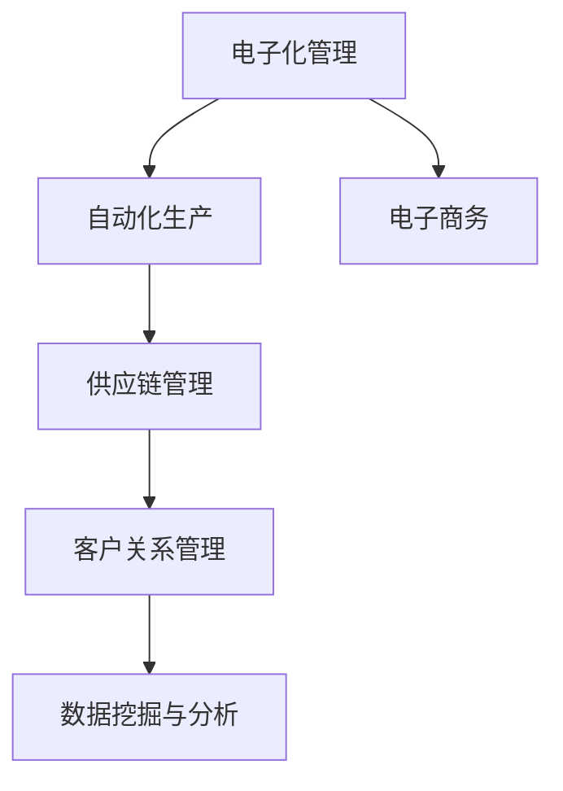

#### 信息化建设与业务流程的深度融合

信息化建设不仅仅是技术的引入，更是与业务流程的深度融合。通过信息化手段，企业可以实现业务流程的自动化、智能化，提高整体运营效率。

例如，在供应链管理中，通过信息化手段，企业可以实现从原材料采购、生产、仓储到配送的全程管理。通过数据实时监控和分析，企业可以快速响应市场需求，优化库存管理，降低运营成本。

在客户关系管理中，通过信息化手段，企业可以实现对客户信息的全面收集和分析，为客户提供个性化的服务和体验。通过客户数据的挖掘和分析，企业可以了解客户需求，优化产品设计和营销策略。

总之，信息化建设与业务流程的深度融合，不仅提高了企业运营效率，也提升了企业的核心竞争力。

### 第2章: 消费品行业信息化核心技术与架构

消费品行业信息化建设离不开核心技术的支持。云计算、大数据、物联网等技术在消费品行业的应用，不仅提升了企业的运营效率，也为行业带来了新的商业模式。

#### 云计算与大数据技术在消费品行业中的应用

云计算技术具有弹性、高效、安全的特点，广泛应用于消费品行业的各个环节。企业可以通过云计算平台，实现数据的存储、处理和分析，降低IT成本，提高数据处理效率。

大数据技术在消费品行业中的应用主要体现在数据挖掘和数据分析上。通过对海量数据的挖掘和分析，企业可以了解市场趋势、消费者行为，优化产品设计和营销策略。

以下是一个大数据处理流程的伪代码示例：

```python
# 大数据处理流程伪代码
def data_processing(data):
    # 数据清洗
    clean_data = data_cleaning(data)
    # 数据转换
    transformed_data = data_conversion(clean_data)
    # 数据分析
    analysis_results = data_analysis(transformed_data)
    return analysis_results
```

#### 物联网与传感器技术在供应链管理中的应用

物联网技术通过智能传感器和智能设备，实现对供应链的全程监控和管理。传感器技术可以实时采集供应链各环节的数据，如库存、温度、湿度等，确保供应链的稳定运行。

以下是一个物联网传感器数据采集和处理流程的Mermaid流程图：

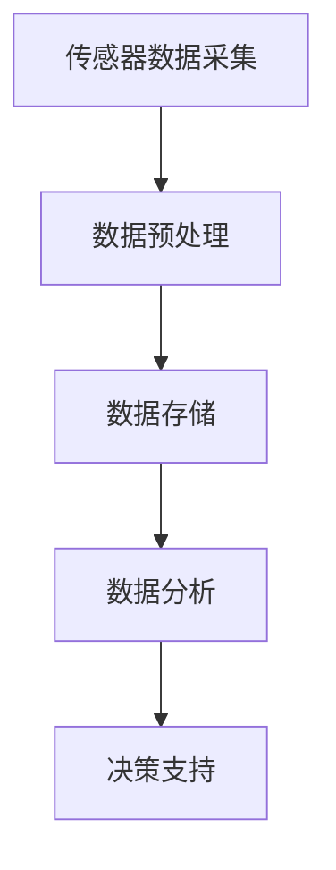

#### 信息化核心技术与业务流程的深度融合

信息化核心技术与业务流程的深度融合，是提升企业运营效率的关键。通过云计算、大数据、物联网等技术，企业可以实现业务流程的自动化、智能化。

例如，在供应链管理中，通过物联网技术，企业可以实现对库存的实时监控，根据库存情况自动调整采购计划，优化库存管理。通过大数据分析，企业可以预测市场需求，提前做好生产准备，提高生产效率。

以下是一个供应链管理流程的Mermaid流程图：

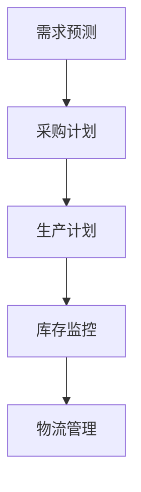

#### 信息化架构设计原则与案例分析

信息化架构设计是确保信息化建设成功的关键。在设计原则方面，应遵循模块化、可扩展、安全可靠等原则。

以下是一个消费品行业信息化架构设计的Mermaid流程图：

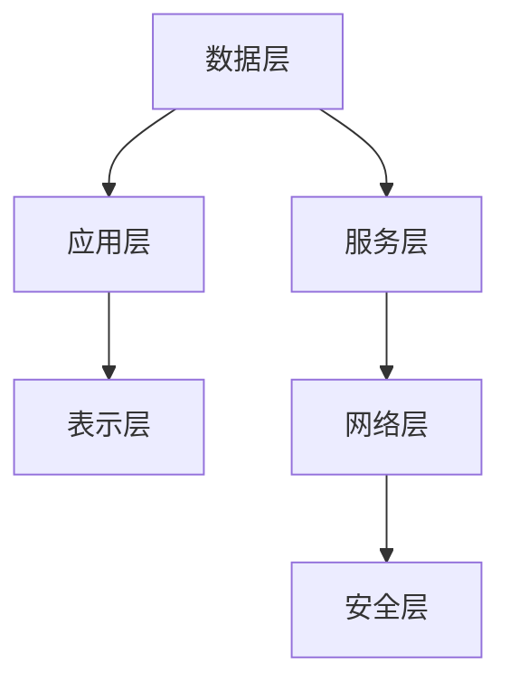

案例分析：

- **案例一：某大型消费品企业**：该企业通过信息化手段，实现了供应链的全程管理，提高了供应链效率，降低了运营成本。
- **案例二：某新兴消费品企业**：该企业通过大数据技术，实现了精准营销，优化了产品设计和营销策略，提升了市场竞争力。

### 第二部分: 消费品行业信息化管理工作

#### 第3章: 消费品行业信息化战略规划与实施

信息化战略规划是消费品行业信息化建设的基础。一个成功的信息化战略规划需要明确企业的信息化目标和路径，以及资源配置和风险管理策略。

#### 信息化战略规划的制定

制定信息化战略规划的关键步骤包括：

1. **明确信息化目标**：根据企业的发展战略，明确信息化建设的总体目标和具体目标，如提升供应链效率、优化客户关系管理、提高生产自动化水平等。

2. **评估现有信息化水平**：对企业的现有信息化水平进行评估，分析存在的问题和不足，为制定战略规划提供依据。

3. **制定信息化路径**：根据信息化目标，制定具体的实施步骤和时间表，如引入新系统、升级现有系统、培训员工等。

4. **资源配置**：明确信息化建设的资源需求，包括人力、资金、技术等，确保资源合理配置。

5. **风险管理**：评估信息化建设过程中的潜在风险，制定相应的风险管理策略，如风险识别、风险评估、风险应对等。

以下是一个信息化战略规划的Mermaid流程图：

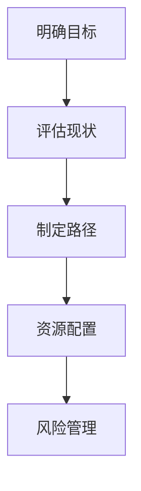

#### 信息化实施过程中的管理与协调

信息化实施过程是一个复杂的过程，涉及到多个部门和环节。为了确保信息化项目的成功实施，需要建立有效的项目管理和协调机制。

1. **项目管理体系**：建立信息化项目管理组织，明确项目责任人、项目经理和团队成员的职责和权限。

2. **项目计划**：制定详细的项目计划，包括项目目标、任务分工、时间表和预算等，确保项目有序推进。

3. **风险管理**：对项目实施过程中可能出现的风险进行识别、评估和应对，确保项目风险在可控范围内。

4. **沟通与协调**：建立有效的沟通机制，确保项目团队之间、项目团队与相关部门之间的信息畅通，及时解决问题。

以下是一个信息化实施过程中的Mermaid流程图：

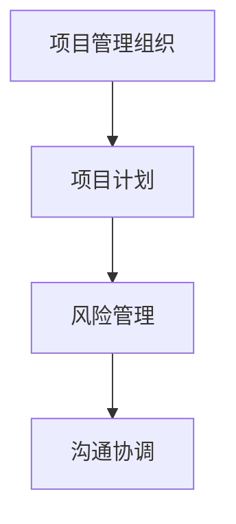

#### 信息化风险管理

信息化项目风险是指在项目实施过程中可能出现的负面影响，如项目延误、成本超支、质量不达标等。为了有效管理信息化风险，需要采取以下措施：

1. **风险识别**：通过项目评审、风险评估等方式，识别项目实施过程中可能出现的风险。

2. **风险评估**：对识别出的风险进行评估，分析风险的概率和影响程度。

3. **风险应对**：根据风险评估结果，制定相应的风险应对策略，如风险规避、风险减轻、风险转移等。

以下是一个信息化风险管理的Mermaid流程图：

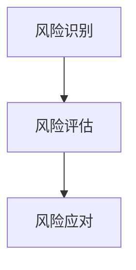

#### 第4章: 消费品行业信息化项目管理与团队协作

信息化项目管理是确保信息化项目按计划、高质量完成的必要手段。有效的信息化项目管理需要运用科学的项目管理方法，建立高效的团队协作机制。

#### 信息化项目管理方法

选择适合的信息化项目管理方法，对于项目的成功至关重要。常见的信息化项目管理方法包括：

1. **瀑布模型**：瀑布模型是一种传统的项目管理方法，强调顺序执行项目任务，适用于需求明确、变更较少的项目。

2. **敏捷开发**：敏捷开发强调快速迭代、持续交付，适用于需求变化频繁、注重产品交付的项目。

3. **六西格玛**：六西格玛是一种质量管理方法，通过减少过程变异，提高过程能力，适用于需要高度质量保证的项目。

以下是一个信息化项目管理的Mermaid流程图：

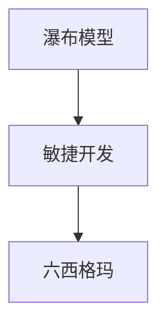

#### 信息化团队协作与沟通

信息化项目的成功不仅依赖于科学的项目管理方法，还需要高效的团队协作与沟通。建立良好的团队协作机制，有助于提高项目执行效率，确保项目顺利进行。

1. **团队建设**：建立高效团队，明确团队成员的职责和角色，促进团队成员之间的相互信任和协作。

2. **沟通机制**：建立有效的沟通机制，确保团队成员之间、项目团队与相关利益相关者之间的信息畅通，及时解决问题。

3. **知识共享**：鼓励团队成员分享知识和经验，提高团队整体能力，为项目成功奠定基础。

以下是一个信息化团队协作与沟通的Mermaid流程图：

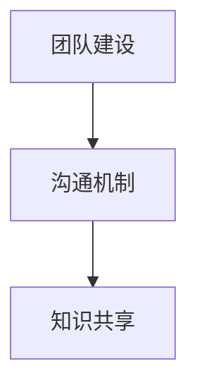

#### 信息化培训与知识共享

信息化培训是提高员工技能和知识水平的重要手段。通过信息化培训，员工可以掌握新技术的应用方法，提高工作效率，为信息化项目的成功提供保障。

1. **培训内容**：根据信息化项目的需求和员工的技能水平，制定合理的培训内容，包括新技术、新工具、新流程等。

2. **培训方式**：采用多样化的培训方式，如在线培训、现场培训、实操培训等，提高培训效果。

3. **知识共享平台**：建立知识共享平台，鼓励员工分享经验和知识，提高团队整体能力。

以下是一个信息化培训与知识共享的Mermaid流程图：

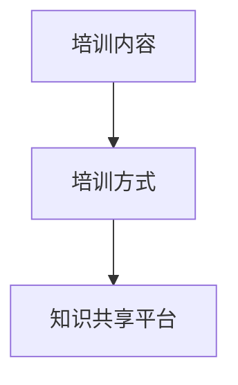

#### 第5章: 消费品行业信息化效果评估与持续改进

信息化效果评估是衡量信息化项目成果的重要手段。通过信息化效果评估，企业可以了解信息化项目对业务流程的改善程度，发现项目中的不足，为持续改进提供依据。

#### 信息化效果评估方法

信息化效果评估主要包括以下方法：

1. **关键绩效指标（KPI）**：设定关键绩效指标，如项目成本、项目进度、项目质量等，对信息化项目进行量化评估。

2. **用户满意度调查**：通过用户满意度调查，了解用户对信息化项目的满意程度，评估项目效果。

3. **成本效益分析**：对信息化项目的投资回报率（ROI）进行计算，评估信息化项目的经济效益。

以下是一个信息化效果评估的Mermaid流程图：

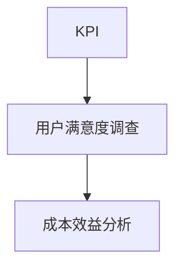

#### 信息化持续改进策略

持续改进是信息化项目成功的关键。通过不断优化信息化系统，企业可以提高运营效率，提升市场竞争力。

1. **定期评估**：定期对信息化项目进行效果评估，发现问题和不足，制定改进措施。

2. **用户反馈**：收集用户反馈，了解用户需求，为系统优化提供依据。

3. **技术创新**：跟踪信息技术的发展趋势，引入新技术、新工具，提高信息化系统的性能和可靠性。

以下是一个信息化持续改进策略的Mermaid流程图：

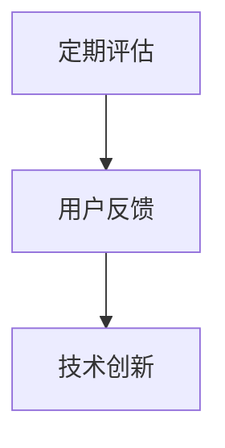

#### 信息化与业务发展的深度融合

信息化与业务发展的深度融合，是企业实现数字化转型的重要途径。通过信息化手段，企业可以实现业务流程的自动化、智能化，提高运营效率，实现业务增长。

1. **业务流程优化**：通过信息化手段，对业务流程进行优化，提高业务流程的效率和质量。

2. **数据驱动决策**：通过大数据技术，对业务数据进行挖掘和分析，为企业决策提供数据支持。

3. **客户关系管理**：通过信息化手段，实现客户信息的全面收集和分析，优化客户关系管理，提高客户满意度。

以下是一个信息化与业务发展的深度融合的Mermaid流程图：

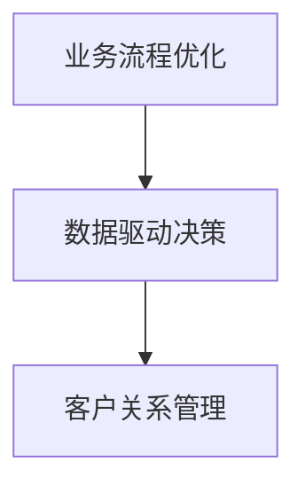

### 第三部分: 消费品行业信息化案例分析

#### 第6章: 消费品行业信息化成功案例解析

消费品行业信息化成功案例众多，这些案例不仅展示了信息化技术在行业中的应用效果，也为其他企业提供了有益的借鉴。

#### 国内消费品行业信息化成功案例

**案例一：某大型消费品企业**

某大型消费品企业通过实施信息化项目，实现了供应链的全程管理。通过引入ERP系统和物流管理系统，该企业实现了从采购、生产、仓储到配送的全程信息化管理，提高了供应链效率，降低了运营成本。

**案例二：某新兴消费品企业**

某新兴消费品企业通过大数据技术和人工智能技术，实现了精准营销和个性化推荐。通过对消费者数据的分析和挖掘，该企业优化了产品设计和营销策略，提高了市场竞争力。

#### 国际消费品行业信息化成功案例

**案例三：某国际知名消费品企业**

某国际知名消费品企业通过数字化转型，实现了业务流程的自动化和智能化。通过引入物联网技术和云计算技术，该企业实现了供应链的全程监控和管理，提高了运营效率，降低了成本。

**案例四：某全球消费品企业**

某全球消费品企业通过信息化手段，实现了全球化运营。通过建立全球化数据中心和云计算平台，该企业实现了全球业务的数据共享和协同办公，提高了企业竞争力。

#### 案例启示与借鉴

从上述成功案例中，我们可以得出以下启示和借鉴：

1. **信息化建设要结合企业实际情况**：每个企业的信息化需求和发展阶段不同，信息化建设要结合企业实际情况，制定合理的规划。

2. **注重数据驱动**：大数据技术和人工智能技术的应用，可以为企业的决策提供数据支持，帮助企业优化业务流程，提高运营效率。

3. **持续改进**：信息化建设不是一蹴而就的，需要持续改进和优化。通过定期评估和用户反馈，及时发现问题，优化系统性能。

4. **安全合规**：在信息化建设中，要重视信息安全，确保数据安全和合规性，防止信息泄露和违规操作。

### 第四部分: 消费品行业信息化未来趋势与展望

#### 第7章: 消费品行业信息化未来趋势与展望

消费品行业信息化未来将继续向智能化、数字化转型。以下是一些重要的趋势和展望：

#### 人工智能在消费品行业中的应用

人工智能技术在消费品行业的应用将越来越广泛，主要体现在以下几个方面：

1. **智能生产**：通过人工智能技术，实现生产过程的自动化和智能化，提高生产效率和质量。

2. **智能物流**：通过人工智能技术，优化物流路径和配送策略，提高物流效率。

3. **智能客服**：通过人工智能技术，实现智能客服系统，提高客户服务水平和满意度。

以下是一个智能生产线的Mermaid流程图：

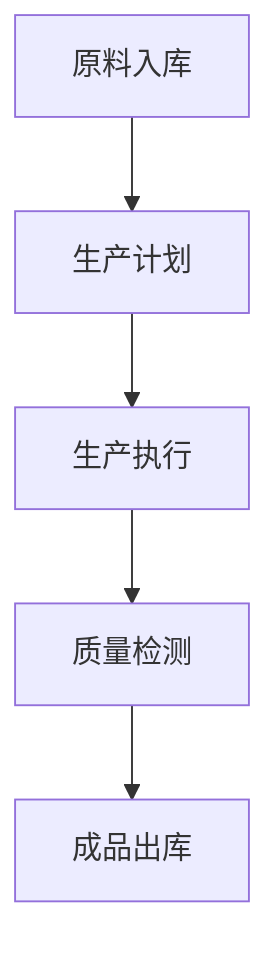

#### 大数据技术在消费品行业中的应用

大数据技术在消费品行业的应用将越来越深入，主要体现在以下几个方面：

1. **消费者行为分析**：通过大数据技术，分析消费者行为，优化产品设计和营销策略。

2. **供应链优化**：通过大数据技术，优化供应链各环节，提高供应链效率。

3. **风险控制**：通过大数据技术，预测市场风险，采取相应的风险控制措施。

以下是一个供应链优化的大数据应用的Mermaid流程图：

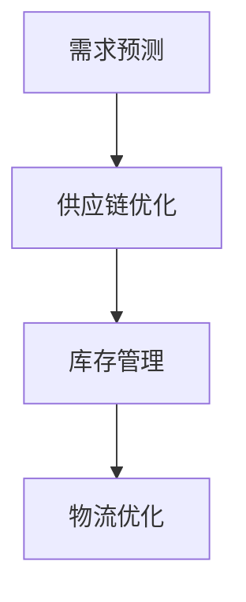

#### 物联网技术在消费品行业中的应用

物联网技术在消费品行业的应用将越来越普及，主要体现在以下几个方面：

1. **智能供应链**：通过物联网技术，实现对供应链的全程监控和管理，提高供应链效率。

2. **智能设备管理**：通过物联网技术，实现对设备的实时监控和维护，提高设备运行效率。

3. **智能生产监控**：通过物联网技术，实现对生产过程的实时监控，提高生产效率和质量。

以下是一个智能供应链的物联网应用的Mermaid流程图：

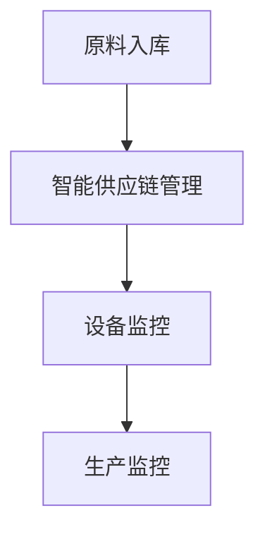

#### 新零售与智慧物流

新零售和智慧物流是消费品行业信息化的重要方向，主要体现在以下几个方面：

1. **线上线下融合**：通过新零售模式，实现线上线下融合，提高销售额。

2. **智慧物流**：通过智慧物流，实现快速配送和精准配送，提高客户满意度。

3. **智能营销**：通过智能营销，实现精准营销和个性化推荐，提高营销效果。

以下是一个新零售与智慧物流的Mermaid流程图：

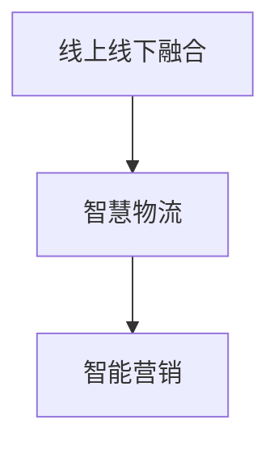

#### 消费品行业信息化面临的挑战与机遇

消费品行业信息化在发展过程中面临以下挑战和机遇：

1. **技术变革**：随着人工智能、大数据、物联网等新技术的不断涌现，企业需要不断跟进技术变革，提升信息化水平。

2. **数据安全**：随着数据量的不断增大，数据安全成为信息化建设的重要挑战。

3. **数字化转型**：数字化转型是企业发展的必然趋势，企业需要积极拥抱数字化转型，实现业务模式的创新。

4. **政策法规**：随着信息化程度的提高，企业需要遵守相关的政策法规，确保信息安全和合规性。

#### 消费品行业信息化未来展望

消费品行业信息化未来将朝着智能化、数字化、全球化的方向发展。企业需要紧跟技术变革，加强信息化建设，提升核心竞争力。同时，企业还需要关注政策法规，确保信息化建设的合规性。通过信息化手段，企业可以实现业务流程的自动化、智能化，提高运营效率，实现可持续增长。

### 附录

#### 附录A: 消费品行业信息化相关工具与技术资源

1. **云计算平台介绍**

   - **阿里云**：提供全面的云计算服务，包括计算、存储、网络、安全等。
   - **腾讯云**：提供云服务器、数据库、人工智能等云服务。
   - **华为云**：提供云计算、大数据、人工智能等全方位的云服务。

2. **大数据分析工具与平台**

   - **Hadoop**：一个分布式数据存储和处理框架。
   - **Spark**：一个高速的分布式计算引擎。
   - **TensorFlow**：一个开源的机器学习库。

3. **物联网开发框架与传感器技术**

   - **IoT.js**：一个基于JavaScript的物联网开发框架。
   - **MQTT**：一种轻量级的消息传输协议。
   - **RFID**：一种用于物品识别的传感器技术。

4. **信息化参考书籍与文献**

   - 《大数据时代：生活、工作与思维的大变革》
   - 《人工智能：一种现代的方法》
   - 《物联网导论》

5. **消费品行业信息化标准与规范**

   - 《消费品行业信息化技术规范》
   - 《消费品行业信息安全技术规范》
   - 《消费品行业电子商务技术规范》

### 作者

**作者：AI天才研究院/AI Genius Institute & 禅与计算机程序设计艺术 /Zen And The Art of Computer Programming**

