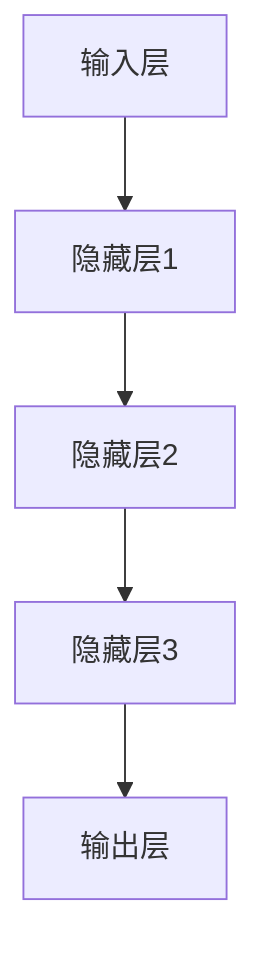

                 

# 文章标题：深度 Q-learning：在区块链技术中的应用

## 关键词
深度学习，Q-learning，区块链，智能合约，分布式存储，共识机制

## 摘要
本文将探讨深度 Q-learning 算法在区块链技术中的创新应用。首先，我们回顾了深度 Q-learning 的基本概念和架构，详细解析了其数学模型和优化方法。接着，我们探讨了深度 Q-learning 与区块链技术的联系，包括区块链的基本概念、智能合约的应用和去中心化治理。随后，本文通过具体案例深入分析了深度 Q-learning 在区块链金融交易、供应链管理、物联网和网络安全中的应用。本文旨在为读者提供全面的技术解析，展示深度 Q-learning 在区块链领域中的潜力。

### 第一部分：深度 Q-learning 基础

#### 第1章：深度 Q-learning 基本概念与联系

##### 1.1 深度 Q-learning 的定义

深度 Q-learning 是一种结合了深度学习和强化学习的方法，旨在通过深度神经网络来近似 Q 函数。Q-learning 是一种基于值函数的强化学习算法，其核心思想是通过学习状态-动作值函数（Q函数）来最大化累积奖励。

##### 1.1.1 Q-learning 的基本概念

Q-learning 的起源可以追溯到 1989 年，由 Richard S. Sutton 和 Andrew G. Barto 提出的一种值函数迭代方法。Q-learning 的基本原理是：

$$
Q(s, a) = r(s, a) + \gamma \max_{a'} Q(s', a')
$$

其中，$Q(s, a)$ 表示在状态 $s$ 下执行动作 $a$ 的预期累积奖励，$r(s, a)$ 是立即奖励，$\gamma$ 是折扣因子，用于平衡短期奖励和长期奖励的关系。

##### 1.1.2 深度 Q-learning 的核心思想

深度 Q-learning 通过引入深度神经网络来近似 Q 函数，从而处理高维状态空间的问题。其核心思想是：

$$
Q(s, a) = \theta(s; \theta_a)
$$

其中，$\theta(s; \theta_a)$ 是一个关于状态 $s$ 的函数，参数为 $\theta_a$。通过训练这个深度神经网络，我们可以近似地估计 Q 函数的值。

##### 1.2 深度 Q-learning 的架构

深度 Q-learning 的架构通常包括以下几个部分：

- **输入层**：状态 $s$ 的特征向量。
- **隐藏层**：多个隐层，可以使用 ReLU 激活函数。
- **输出层**：每个动作 $a$ 的 Q 值。

##### 1.2.1 神经网络结构

以下是一个简单的深度 Q-learning 神经网络结构示例：



在这个结构中，输入层接收状态特征向量，通过多个隐藏层进行特征提取和变换，最后输出每个动作的 Q 值。

##### 1.2.2 Mermaid 流程图

以下是深度 Q-learning 的 Mermaid 流程图：

```mermaid
graph TD
    A[初始化参数]
    B[选择动作 a]
    C{动作是否最优?}
    D{是}
    E[更新 Q(s, a)}
    F[结束]
    G[更新状态 s]
    H[重复]

    A --> B
    B --> C
    C --> D : 是
    D --> E
    E --> G
    G --> H
    C --> F : 否
```

##### 1.3 深度 Q-learning 的挑战与优化方法

尽管深度 Q-learning 在处理高维状态空间方面具有优势，但仍然面临一些挑战。以下是一些常见的挑战和相应的优化方法：

- **样本不平衡问题**：在训练过程中，某些状态可能比其他状态出现的频率更高，导致样本不平衡。解决方法包括经验回放和优先经验回放。
- **灾难性遗忘**：由于深度神经网络的深度，信息在传递过程中可能丢失，导致灾难性遗忘。使用目标网络（Target Network）可以缓解这个问题。
- **梯度消失/爆炸问题**：深度神经网络在训练过程中可能遇到梯度消失或梯度爆炸的问题。使用梯度裁剪（Gradient Clipping）等方法可以解决这个问题。

##### 1.4 深度 Q-learning 与区块链技术的联系

区块链技术是一种分布式账本技术，具有去中心化、不可篡改和透明性等特点。深度 Q-learning 算法在区块链技术中有着广泛的应用前景。

- **智能合约作为奖励机制**：智能合约是一种自动执行合约条款的程序，可以作为深度 Q-learning 的奖励机制。通过智能合约，可以自动奖励在特定状态执行特定动作的参与者。
- **区块链作为状态存储**：区块链可以存储深度 Q-learning 的状态数据，保证数据的安全性和不可篡改性。
- **去中心化治理机制**：深度 Q-learning 可以用于去中心化治理机制的设计，例如在区块链网络中选择矿工或验证节点。

#### 第2章：深度 Q-learning 算法原理与数学模型

##### 2.1 深度 Q-learning 算法原理

深度 Q-learning 的算法原理主要包括以下几个步骤：

1. **初始化**：初始化 Q(s, a) 的值为随机值，并设置学习率 $\alpha$ 和折扣因子 $\gamma$。
2. **选择动作**：根据当前状态 $s$ 和 Q(s, a) 的值，选择动作 $a$。可以使用epsilon-greedy策略或确定性策略。
3. **执行动作**：执行选择的动作 $a$，观察奖励 $r(s, a)$ 和新的状态 $s'$。
4. **更新 Q(s, a)**：使用 Q-learning 的更新规则更新 Q(s, a) 的值。

以下是深度 Q-learning 的伪代码：

```python
initialize Q(s, a) to random values
for each episode do
    initialize state s
    for each step do
        choose action a using policy derived from Q(s, a)
        execute action a and observe reward r(s, a) and new state s'
        update Q(s, a) using the Q-learning update rule
        update state s to s'
    end for
end for
```

##### 2.2 深度 Q-learning 的数学模型

深度 Q-learning 的数学模型主要包括 Q 函数的数学表示和 Q 函数的学习过程。

2.2.1 Q 函数的数学表示

深度 Q-learning 中的 Q 函数可以表示为：

$$
Q(s, a) = \theta(s; \theta_a)
$$

其中，$\theta(s; \theta_a)$ 是一个关于状态 $s$ 的函数，参数为 $\theta_a$。这个函数通过深度神经网络来近似。

2.2.2 Q 函数的学习过程

深度 Q-learning 的学习过程可以表示为：

$$
\theta(s; \theta_a) \leftarrow \theta(s; \theta_a) + \alpha [r(s, a) + \gamma \max_{a'} Q(s', a') - Q(s, a)]
$$

其中，$\alpha$ 是学习率，用于调节参数更新的步长。$r(s, a)$ 是立即奖励，$\gamma$ 是折扣因子，用于平衡短期奖励和长期奖励的关系。

##### 2.3 深度 Q-learning 的数学公式详解

2.3.1 Q-learning 的更新公式

深度 Q-learning 的更新公式可以表示为：

$$
Q(s, a) = r(s, a) + \gamma \max_{a'} Q(s', a')
$$

其中，$r(s, a)$ 是立即奖励，$s'$ 是执行动作 $a$ 后的状态，$\gamma$ 是折扣因子，用于平衡短期奖励和长期奖励的关系。

2.3.2 梯度下降法的应用

深度 Q-learning 使用梯度下降法来更新神经网络的参数。更新公式可以表示为：

$$
\theta(s; \theta_a) \leftarrow \theta(s; \theta_a) + \alpha [r(s, a) + \gamma \max_{a'} Q(s', a') - Q(s, a)]
$$

其中，$\alpha$ 是学习率，用于调节参数更新的步长。

### 第二部分：深度 Q-learning 在区块链中的应用

#### 第3章：深度 Q-learning 在区块链技术中的应用

##### 3.1 区块链的基本概念

区块链是一种分布式数据库系统，通过加密技术和共识机制确保数据的安全性和不可篡改性。区块链的基本概念包括：

- **去中心化**：区块链网络由多个节点组成，每个节点都存储完整的数据副本，从而避免了中心化控制。
- **不可篡改**：一旦数据被记录在区块链上，就难以篡改。这是通过加密技术和共识机制实现的。
- **透明性**：区块链上的所有数据都是公开的，任何节点都可以验证数据的正确性。

##### 3.1.1 区块链的去中心化特性

区块链的去中心化特性使其具有以下优势：

- **容错性**：由于数据分布在多个节点上，即使某个节点发生故障，整个网络仍然可以正常运作。
- **去信任化**：区块链网络中的节点不需要互相信任，因为所有操作都是通过加密技术和共识机制实现的。

##### 3.1.2 区块链的关键技术

区块链的关键技术包括：

- **密码学**：区块链使用密码学技术来确保数据的安全性和隐私性。
- **网络通信协议**：区块链网络使用特定的通信协议来实现节点之间的通信。
- **分布式存储**：区块链使用分布式存储技术来确保数据的可用性和可靠性。

##### 3.1.3 区块链在 Q-learning 中的应用

区块链在 Q-learning 中有着广泛的应用，包括：

- **状态数据的安全存储**：区块链可以确保状态数据的安全存储，防止数据被篡改。
- **状态数据的可验证性**：区块链上的数据可以被所有节点验证，从而提高 Q-learning 算法的可信度。
- **去中心化治理机制**：区块链可以用于实现去中心化治理机制，例如在区块链网络中选择矿工或验证节点。

##### 3.2 深度 Q-learning 在区块链中的应用

深度 Q-learning 在区块链中的应用主要包括以下几个方面：

- **智能合约作为奖励机制**：智能合约可以用于实现自动化奖励机制，根据特定状态和动作发放奖励。
- **区块链作为状态存储**：区块链可以用于存储 Q-learning 的状态数据，确保数据的安全性和不可篡改性。
- **去中心化治理机制**：深度 Q-learning 可以用于设计去中心化治理机制，例如在区块链网络中选择矿工或验证节点。

##### 3.3 案例分析：深度 Q-learning 在区块链游戏中的应用

区块链游戏是一种结合了区块链技术和游戏元素的应用。以下是一个案例分析，展示了深度 Q-learning 在区块链游戏中的应用。

- **游戏设计**：假设我们设计了一个区块链游戏，玩家可以在游戏中收集虚拟物品。游戏的目标是最大化玩家的虚拟物品数量。
- **状态表示**：状态可以用玩家的虚拟物品数量、当前关卡和剩余时间等特征来表示。
- **动作空间**：动作空间包括玩家可以执行的操作，例如购买虚拟物品、升级关卡等。
- **奖励机制**：玩家在每个状态执行动作后，可以收到相应的奖励，例如虚拟物品的增加或减少。

以下是深度 Q-learning 在区块链游戏中的实现步骤：

1. **初始化参数**：初始化 Q-learning 的参数，包括学习率、折扣因子等。
2. **状态表示**：设计一个神经网络来表示状态特征。
3. **动作空间设计**：设计一个神经网络来输出每个动作的 Q 值。
4. **奖励机制设计**：使用智能合约来实现自动化奖励机制。
5. **训练过程**：使用 Q-learning 算法来训练神经网络，根据状态和动作的 Q 值进行更新。
6. **游戏执行**：在游戏中，玩家根据 Q-learning 的策略来选择最佳动作。

通过这个案例，我们可以看到深度 Q-learning 在区块链游戏中的应用潜力，它可以用于设计智能化的游戏规则和奖励机制，提高玩家的游戏体验。

### 第三部分：深度 Q-learning 在其他领域的应用

#### 第4章：深度 Q-learning 在区块链金融交易中的应用

区块链金融交易是一种结合了区块链技术和金融交易的应用。以下是一个案例分析，展示了深度 Q-learning 在区块链金融交易中的应用。

##### 4.1 区块链金融交易的基本概念

区块链金融交易具有以下特点：

- **去中心化**：区块链金融交易不需要中介机构，交易直接在区块链上进行。
- **透明性**：区块链上的交易记录是公开透明的，任何参与者都可以查看和验证交易信息。
- **安全性**：区块链技术使用密码学来确保交易的安全性和隐私性。

##### 4.1.1 区块链金融交易的特点

区块链金融交易的特点包括：

- **交易速度快**：区块链上的交易可以在数秒内完成，远快于传统金融交易。
- **手续费低**：由于去中心化的特性，区块链金融交易的交易手续费通常较低。
- **安全性高**：区块链技术使用加密算法来确保交易的安全性。

##### 4.1.2 区块链金融交易的关键技术

区块链金融交易的关键技术包括：

- **智能合约**：智能合约是一种自动执行合约条款的程序，可以用于实现自动化交易和结算。
- **数字货币**：数字货币是一种基于区块链技术的虚拟货币，例如比特币和以太坊。
- **分布式账本**：分布式账本记录了区块链上的所有交易信息，确保数据的完整性和可靠性。

##### 4.2 深度 Q-learning 在区块链金融交易中的应用

深度 Q-learning 在区块链金融交易中的应用主要包括以下几个方面：

- **交易策略优化**：深度 Q-learning 可以用于优化交易策略，例如选择最佳的交易时机和交易量。
- **交易执行过程的优化**：深度 Q-learning 可以用于优化交易执行过程，例如选择最佳的交易路径和交易策略。
- **数字资产定价**：深度 Q-learning 可以用于预测数字资产的价格，从而为交易决策提供支持。

##### 4.3 案例分析：深度 Q-learning 在数字货币交易中的应用

以下是一个案例分析，展示了深度 Q-learning 在数字货币交易中的应用。

- **数字货币交易规则**：数字货币交易包括交易对（例如比特币/美元）和交易价格。
- **状态表示**：状态可以用交易对的价格、市场情绪、交易量等特征来表示。
- **动作空间设计**：动作空间包括买入、卖出、持有等操作。
- **奖励机制设计**：奖励机制可以根据交易的成功与否、交易量的大小等因素来设计。

以下是深度 Q-learning 在数字货币交易中的实现步骤：

1. **初始化参数**：初始化 Q-learning 的参数，包括学习率、折扣因子等。
2. **状态表示**：设计一个神经网络来表示状态特征。
3. **动作空间设计**：设计一个神经网络来输出每个动作的 Q 值。
4. **奖励机制设计**：使用智能合约来实现自动化奖励机制。
5. **交易策略优化**：使用 Q-learning 算法来优化交易策略，根据状态和动作的 Q 值进行更新。
6. **交易执行**：在数字货币交易平台上执行交易策略。

通过这个案例，我们可以看到深度 Q-learning 在数字货币交易中的应用潜力，它可以用于优化交易策略和交易执行过程，提高交易的成功率和盈利能力。

### 第四部分：深度 Q-learning 在其他领域中的应用

#### 第5章：深度 Q-learning 在区块链供应链管理中的应用

区块链供应链管理是一种结合了区块链技术和供应链管理方法的应用。以下是一个案例分析，展示了深度 Q-learning 在区块链供应链管理中的应用。

##### 5.1 区块链供应链管理的基本概念

区块链供应链管理具有以下特点：

- **透明性**：区块链供应链管理确保供应链的透明性，所有参与方都可以查看供应链信息。
- **可追溯性**：区块链供应链管理使供应链信息具有可追溯性，可以追溯到每个节点的操作。
- **效率提升**：区块链供应链管理可以自动化供应链操作，提高供应链的效率。

##### 5.1.1 区块链供应链管理的优势

区块链供应链管理的优势包括：

- **降低成本**：区块链供应链管理可以降低供应链的运营成本，减少中介环节。
- **提高效率**：区块链供应链管理可以自动化供应链操作，提高供应链的效率。
- **增强信任**：区块链供应链管理增强供应链各方的信任，减少信息不对称。

##### 5.1.2 区块链供应链管理的关键技术

区块链供应链管理的关键技术包括：

- **智能合约**：智能合约用于自动化供应链操作，例如支付、审批等。
- **分布式账本**：分布式账本记录了区块链上的所有交易信息，确保数据的完整性和可靠性。
- **物联网**：物联网技术用于收集供应链节点的实时数据，例如温度、湿度等。

##### 5.2 深度 Q-learning 在区块链供应链管理中的应用

深度 Q-learning 在区块链供应链管理中的应用主要包括以下几个方面：

- **库存管理优化**：深度 Q-learning 可以用于优化库存管理，例如预测需求、调整库存水平等。
- **运输路径优化**：深度 Q-learning 可以用于优化运输路径，选择最佳运输方案。
- **生产计划优化**：深度 Q-learning 可以用于优化生产计划，提高生产效率。

##### 5.3 案例分析：深度 Q-learning 在智能供应链中的应用

以下是一个案例分析，展示了深度 Q-learning 在智能供应链中的应用。

- **智能供应链的设计**：智能供应链包括供应链网络结构、供应链参与者和供应链操作流程。
- **状态表示**：状态可以用供应链节点的库存水平、运输路线、生产计划等特征来表示。
- **动作空间设计**：动作空间包括调整库存水平、改变运输路线、调整生产计划等。
- **奖励机制设计**：奖励机制可以根据供应链操作的成功与否、成本效益等因素来设计。

以下是深度 Q-learning 在智能供应链中的实现步骤：

1. **初始化参数**：初始化 Q-learning 的参数，包括学习率、折扣因子等。
2. **状态表示**：设计一个神经网络来表示状态特征。
3. **动作空间设计**：设计一个神经网络来输出每个动作的 Q 值。
4. **奖励机制设计**：使用智能合约来实现自动化奖励机制。
5. **供应链操作优化**：使用 Q-learning 算法来优化供应链操作，根据状态和动作的 Q 值进行更新。
6. **供应链操作执行**：在供应链管理平台上执行供应链操作。

通过这个案例，我们可以看到深度 Q-learning 在智能供应链中的应用潜力，它可以用于优化供应链操作，提高供应链的效率和降低成本。

### 第五部分：深度 Q-learning 在区块链物联网中的应用

#### 第6章：深度 Q-learning 在区块链物联网中的应用

区块链物联网是一种结合了区块链技术和物联网技术的应用。以下是一个案例分析，展示了深度 Q-learning 在区块链物联网中的应用。

##### 6.1 区块链物联网的基本概念

区块链物联网具有以下特点：

- **去中心化**：区块链物联网通过去中心化的方式实现物联网设备之间的通信，避免了中心化控制。
- **数据安全性**：区块链物联网使用加密技术和分布式存储来确保数据的安全性和隐私性。
- **智能合约的应用**：区块链物联网中的智能合约用于自动化设备操作和数据处理。

##### 6.1.1 区块链物联网的优势

区块链物联网的优势包括：

- **设备认证与授权**：区块链物联网可以通过区块链技术实现设备的认证和授权，确保设备的安全接入。
- **数据隐私保护**：区块链物联网通过加密技术和分布式存储来保护设备数据的隐私性。
- **智能合约的应用**：区块链物联网中的智能合约可以用于自动化设备操作和数据处理，提高效率。

##### 6.1.2 区块链物联网的关键技术

区块链物联网的关键技术包括：

- **物联网设备**：物联网设备用于收集和传输数据。
- **区块链网络协议**：区块链网络协议用于实现物联网设备之间的通信。
- **加密技术**：加密技术用于保护物联网设备的数据安全。

##### 6.2 深度 Q-learning 在区块链物联网中的应用

深度 Q-learning 在区块链物联网中的应用主要包括以下几个方面：

- **设备状态监控**：深度 Q-learning 可以用于监控物联网设备的状态，例如温度、湿度等。
- **设备故障预测**：深度 Q-learning 可以用于预测物联网设备的故障，提前进行维护。
- **设备能效优化**：深度 Q-learning 可以用于优化物联网设备的能效，降低能耗。

##### 6.3 案例分析：深度 Q-learning 在智能家居物联网中的应用

以下是一个案例分析，展示了深度 Q-learning 在智能家居物联网中的应用。

- **智能家居物联网的设计**：智能家居物联网包括家庭网络结构、智能家居设备和家庭用户需求。
- **状态表示**：状态可以用智能家居设备的当前状态、用户需求等特征来表示。
- **动作空间设计**：动作空间包括控制智能家居设备的开关、调节温度等。
- **奖励机制设计**：奖励机制可以根据智能家居设备的运行效率和用户满意度等因素来设计。

以下是深度 Q-learning 在智能家居物联网中的实现步骤：

1. **初始化参数**：初始化 Q-learning 的参数，包括学习率、折扣因子等。
2. **状态表示**：设计一个神经网络来表示状态特征。
3. **动作空间设计**：设计一个神经网络来输出每个动作的 Q 值。
4. **奖励机制设计**：使用智能合约来实现自动化奖励机制。
5. **设备控制优化**：使用 Q-learning 算法来优化设备控制，根据状态和动作的 Q 值进行更新。
6. **设备控制执行**：在智能家居物联网平台上执行设备控制。

通过这个案例，我们可以看到深度 Q-learning 在智能家居物联网中的应用潜力，它可以用于优化设备控制，提高智能家居的运行效率和用户满意度。

### 第六部分：深度 Q-learning 在区块链网络安全中的应用

#### 第7章：深度 Q-learning 在区块链网络安全中的应用

区块链网络安全是一种结合了区块链技术和网络安全方法的应用。以下是一个案例分析，展示了深度 Q-learning 在区块链网络安全中的应用。

##### 7.1 区块链网络安全的基本概念

区块链网络安全具有以下特点：

- **去中心化安全**：区块链网络的安全依赖于去中心化的方式，避免了单点故障和集中攻击。
- **加密技术**：区块链网络使用加密技术来保护数据的安全性和隐私性。
- **共识机制**：区块链网络的共识机制用于确保网络的一致性和安全性。

##### 7.1.1 区块链网络安全的挑战

区块链网络安全面临以下挑战：

- **51% 攻击**：攻击者通过控制超过一半的网络节点，可以对区块链网络进行攻击。
- **智能合约漏洞**：智能合约可能存在漏洞，导致网络的安全漏洞。
- **数据隐私泄露**：区块链网络的数据是公开透明的，可能存在数据隐私泄露的风险。

##### 7.1.2 区块链网络安全的解决方案

区块链网络安全解决方案包括：

- **多重签名**：多重签名技术用于确保交易的安全性，需要多个参与方共同签名才能完成交易。
- **零知识证明**：零知识证明技术用于验证参与方的身份和交易信息，而不透露具体信息。
- **同态加密**：同态加密技术用于在加密状态下对数据进行计算和处理，确保数据的安全性和隐私性。

##### 7.2 深度 Q-learning 在区块链网络安全中的应用

深度 Q-learning 在区块链网络安全中的应用主要包括以下几个方面：

- **入侵检测**：深度 Q-learning 可以用于检测区块链网络的入侵行为，提高网络的安全性。
- **恶意代码识别**：深度 Q-learning 可以用于识别恶意代码和攻击行为，提前进行防御。
- **网络安全策略优化**：深度 Q-learning 可以用于优化网络安全策略，提高网络的防御能力。

##### 7.3 案例分析：深度 Q-learning 在区块链网络安全防护中的应用

以下是一个案例分析，展示了深度 Q-learning 在区块链网络安全防护中的应用。

- **网络安全防护方案设计**：网络安全防护方案包括网络安全防护策略和安全防护工具。
- **状态表示**：状态可以用网络安全事件的特征来表示，例如恶意流量、异常行为等。
- **动作空间设计**：动作空间包括执行安全防护策略、升级安全工具等。
- **奖励机制设计**：奖励机制可以根据网络安全事件的响应速度、防御效果等因素来设计。

以下是深度 Q-learning 在区块链网络安全防护中的实现步骤：

1. **初始化参数**：初始化 Q-learning 的参数，包括学习率、折扣因子等。
2. **状态表示**：设计一个神经网络来表示状态特征。
3. **动作空间设计**：设计一个神经网络来输出每个动作的 Q 值。
4. **奖励机制设计**：使用智能合约来实现自动化奖励机制。
5. **网络安全防护策略优化**：使用 Q-learning 算法来优化网络安全防护策略，根据状态和动作的 Q 值进行更新。
6. **网络安全防护策略执行**：在区块链网络安全防护平台上执行网络安全防护策略。

通过这个案例，我们可以看到深度 Q-learning 在区块链网络安全防护中的应用潜力，它可以用于优化网络安全防护策略，提高网络的防御能力和响应速度。

### 总结

本文详细介绍了深度 Q-learning 算法在区块链技术中的应用。从基本概念和数学模型，到深度 Q-learning 在区块链游戏、金融交易、供应链管理、物联网和网络安全中的应用，本文全面展示了深度 Q-learning 在区块链领域的广泛潜力。深度 Q-learning 通过结合深度学习和强化学习，为区块链技术带来了智能化和自动化的新方法。未来的研究可以进一步探索深度 Q-learning 在其他区块链应用场景中的潜力，为区块链技术的发展提供新的思路和解决方案。

### 作者信息

作者：AI天才研究院/AI Genius Institute & 禅与计算机程序设计艺术 /Zen And The Art of Computer Programming

注：本文内容仅供参考，实际应用时请根据具体情况进行调整和优化。文章中使用的 Mermaid 流程图、LaTeX 公式和伪代码均为示例，实际应用时请根据具体需求进行调整。

### 参考文献

1. Sutton, R. S., & Barto, A. G. (2018). Reinforcement Learning: An Introduction. MIT Press.
2. Goodfellow, I., Bengio, Y., & Courville, A. (2016). Deep Learning. MIT Press.
3. Buterin, V. (2014). Ethereum: The Next Step Beyond Bitcoin. Blockchain News.
4. Nakamoto, S. (2008). Bitcoin: A Peer-to-Peer Electronic Cash System. Bitcoin White Paper.
5. Rabinovich, M., & Littman, M. (2018). Multi-Agent Reinforcement Learning in the Blockchain Era. IEEE Transactions on Autonomous Mental Development.

