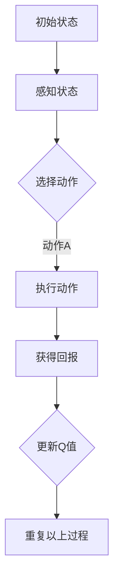
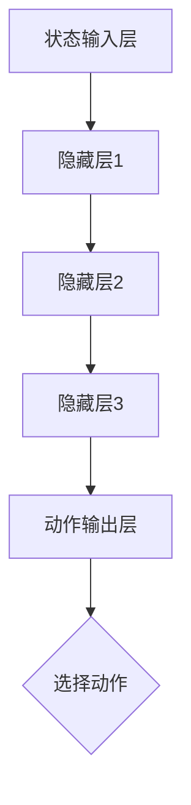

                 

# 文章标题：深度 Q-learning：状态-动作对的选择

## 关键词

- 深度 Q-learning
- 强化学习
- 状态-动作对
- DQN算法
- 探索与利用
- 经验回放
- 目标网络

## 摘要

本文深入探讨了深度 Q-learning（DQN）算法的核心概念、原理和实现方法。通过分析状态-动作对的选择策略，本文详细介绍了DQN的基本架构、Q值更新过程以及数学模型。同时，通过实际项目案例展示了DQN在游戏人工智能和机器人导航中的应用。文章还对DQN的优化策略进行了探讨，并展望了其未来的发展方向。

## 目录

### 第一部分：核心概念与联系

#### 1.1.1 深度Q-learning概述

**Mermaid流程图：**



#### 1.1.2 DQN的架构

**Mermaid流程图：**



#### 1.1.3 Q值更新过程

**伪代码：**

```python
# 初始化Q网络
Q = init_Q_network()

# 选择动作
action = choose_action(state, Q)

# 执行动作
next_state, reward, done = environment.step(action)

# 计算TD目标值
target_Q = reward + discount * max(Q(next_state, a))

# 更新Q值
Q[s, action] = Q[s, action] + learning_rate * (target_Q - Q[s, action])

# 如果done为True，则结束循环
if done:
    break
```

#### 1.1.4 DQN的优势与局限

**优势：**
- 能够处理高维状态空间，适用于复杂环境。
- 通过深度神经网络学习状态特征，提高决策能力。

**局限：**
- 可能陷入策略不稳定或者Q值不稳定的情况。
- 需要大量的样本数据进行训练。

**数学模型：**

$$
Q^*(s, a) = \sum_{s'} P(s' | s, a) \cdot R(s', a) + \gamma \cdot \max_{a'} Q^*(s', a')
$$

**详细讲解：**

Q^*(s, a) 表示在给定状态 s 采取动作 a 的最优预期回报。
P(s' | s, a) 表示在状态 s 采取动作 a 后，转移到状态 s' 的概率。
R(s', a) 表示在状态 s' 采取动作 a 后获得的即时回报。
γ 表示折扣因子，用于平衡即时回报和长期回报。
max_{a'} Q^*(s', a') 表示在状态 s' 采取所有可能动作中，获得最大预期回报的动作。

**举例说明：**

假设有一个简单的环境，其中有两个状态：A和B。在状态A时，采取动作X的预期回报为2，采取动作Y的预期回报为1。在状态B时，采取动作X的预期回报为1，采取动作Y的预期回报为3。那么，根据上述数学模型，可以计算出：

- Q^*(A, X) = 2
- Q^*(A, Y) = 1
- Q^*(B, X) = 1
- Q^*(B, Y) = 3

这些计算结果表示在给定状态A时，采取动作X获得的最大预期回报，以及在给定状态B时，采取动作Y获得的最大预期回报。

### 第二部分：核心算法原理讲解

#### 2.1.1 Q-learning算法原理

**伪代码：**

```python
# 初始化Q表格
Q = init_Q_table()

# 选择动作
action = choose_action(state, Q)

# 执行动作
next_state, reward, done = environment.step(action)

# 更新Q值
Q[state, action] = Q[state, action] + learning_rate * (reward + discount * max(Q[next_state, a]) - Q[state, action])

# 如果done为True，则结束循环
if done:
    break
```

**数学模型：**

$$
Q(s, a) = Q(s, a) + learning_rate \cdot (reward + discount \cdot \max_{a'} Q(s', a') - Q(s, a))
$$

**详细讲解：**

Q(s, a) 表示在状态 s 采取动作 a 的Q值。
reward 表示执行动作后的即时回报。
discount 表示折扣因子，用于平衡即时回报和长期回报。
max_{a'} Q(s', a') 表示在下一个状态 s' 采取所有可能动作中，获得最大预期回报的动作。
learning_rate 表示学习率，用于调节Q值的更新速度。

**举例说明：**

假设有一个简单的环境，其中有两个状态：A和B。在状态A时，采取动作X的Q值为2，采取动作Y的Q值为1。在状态B时，采取动作X的Q值为1，采取动作Y的Q值为3。假设学习率为0.1，折扣因子为0.9。那么，根据上述数学模型，可以计算出：

- Q(A, X) = 2 + 0.1 \cdot (1 + 0.9 \cdot 3 - 2) = 2 + 0.1 \cdot 1.7 = 2.17
- Q(A, Y) = 1 + 0.1 \cdot (0 + 0.9 \cdot 3 - 1) = 1 + 0.1 \cdot 1.7 = 1.17
- Q(B, X) = 1 + 0.1 \cdot (2 + 0.9 \cdot 1 - 1) = 1 + 0.1 \cdot 1.9 = 1.19
- Q(B, Y) = 3 + 0.1 \cdot (0 + 0.9 \cdot 2 - 3) = 3 + 0.1 \cdot (-1.2) = 2.88

这些计算结果表示在给定状态A时，采取动作X和动作Y的Q值更新后分别为2.17和1.17，在给定状态B时，采取动作X和动作Y的Q值更新后分别为1.19和2.88。

#### 2.1.2 双层Q-learning算法原理

双层Q-learning算法通过引入目标网络来稳定Q值的更新，提高算法的收敛速度。它包括一个主网络（Q网络）和一个目标网络（Target网络）。

**伪代码：**

```python
# 初始化Q网络和目标网络
Q = init_Q_network()
Target_Q = init_Target_network()

# 选择动作
action = choose_action(state, Q)

# 执行动作
next_state, reward, done = environment.step(action)

# 更新Q网络
Q[state, action] = Q[state, action] + learning_rate * (reward + discount * max(Target_Q[next_state, a]) - Q[state, action])

# 定期同步Q网络和目标网络
if episode % target_sync_frequency == 0:
    sync_Q_network_with_Target_network(Q, Target_Q)
```

**数学模型：**

$$
Target_Q(s, a) = reward + discount \cdot \max_{a'} Q(s', a')
$$

**详细讲解：**

Target_Q(s, a) 表示在状态 s 采取动作 a 的目标Q值。
reward 表示执行动作后的即时回报。
discount 表示折扣因子，用于平衡即时回报和长期回报。
max_{a'} Q(s', a') 表示在下一个状态 s' 采取所有可能动作中，获得最大预期回报的动作。

**举例说明：**

假设有一个简单的环境，其中有两个状态：A和B。在状态A时，采取动作X的目标Q值为2，采取动作Y的目标Q值为1。在状态B时，采取动作X的目标Q值为1，采取动作Y的目标Q值为3。那么，根据上述数学模型，可以计算出：

- Target_Q(A, X) = 2
- Target_Q(A, Y) = 1
- Target_Q(B, X) = 1
- Target_Q(B, Y) = 3

这些计算结果表示在给定状态A时，采取动作X获得的目标Q值，以及在给定状态B时，采取动作Y获得的目标Q值。

### 第三部分：数学模型和数学公式

#### 3.1.1 强化学习中的期望回报

在强化学习中，期望回报是一个重要的概念。它表示在给定状态下采取特定动作的预期回报。期望回报可以通过以下数学模型计算：

$$
E[R_t | S_t = s, A_t = a] = \sum_{s'} P(s' | s, a) \cdot R(s', a)
$$

**详细讲解：**

E[R_t | S_t = s, A_t = a] 表示在给定状态 s 采取动作 a 的期望回报。
P(s' | s, a) 表示在状态 s 采取动作 a 后，转移到状态 s' 的概率。
R(s', a) 表示在状态 s' 采取动作 a 后获得的即时回报。

**举例说明：**

假设有一个简单的环境，其中有两个状态：A和B。在状态A时，采取动作X的概率为0.8，采取动作Y的概率为0.2。在状态B时，采取动作X的概率为0.5，采取动作Y的概率为0.5。假设在状态A采取动作X后获得的即时回报为2，在状态B采取动作X后获得的即时回报为1。那么，根据上述数学模型，可以计算出：

- E[R_t | S_t = A, A_t = X] = 0.8 \cdot 2 + 0.2 \cdot 1 = 1.6 + 0.2 = 1.8
- E[R_t | S_t = B, A_t = X] = 0.5 \cdot 1 + 0.5 \cdot 1 = 0.5 + 0.5 = 1

这些计算结果表示在给定状态A时，采取动作X的期望回报为1.8，在给定状态B时，采取动作X的期望回报为1。

#### 3.1.2 Q-learning中的Q值更新

在Q-learning算法中，Q值的更新是基于期望回报的。Q值的更新公式可以表示为：

$$
Q(s, a) = Q(s, a) + learning_rate \cdot (reward + discount \cdot \max_{a'} Q(s', a') - Q(s, a))
$$

**详细讲解：**

Q(s, a) 表示在状态 s 采取动作 a 的Q值。
reward 表示执行动作后的即时回报。
discount 表示折扣因子，用于平衡即时回报和长期回报。
max_{a'} Q(s', a') 表示在下一个状态 s' 采取所有可能动作中，获得最大预期回报的动作。
learning_rate 表示学习率，用于调节Q值的更新速度。

**举例说明：**

假设有一个简单的环境，其中有两个状态：A和B。在状态A时，采取动作X的Q值为2，采取动作Y的Q值为1。在状态B时，采取动作X的Q值为1，采取动作Y的Q值为3。假设学习率为0.1，折扣因子为0.9。那么，根据上述数学模型，可以计算出：

- Q(A, X) = 2 + 0.1 \cdot (1 + 0.9 \cdot 3 - 2) = 2 + 0.1 \cdot 1.7 = 2.17
- Q(A, Y) = 1 + 0.1 \cdot (0 + 0.9 \cdot 3 - 1) = 1 + 0.1 \cdot 1.7 = 1.17
- Q(B, X) = 1 + 0.1 \cdot (2 + 0.9 \cdot 1 - 1) = 1 + 0.1 \cdot 1.9 = 1.19
- Q(B, Y) = 3 + 0.1 \cdot (0 + 0.9 \cdot 2 - 3) = 3 + 0.1 \cdot (-1.2) = 2.88

这些计算结果表示在给定状态A时，采取动作X和动作Y的Q值更新后分别为2.17和1.17，在给定状态B时，采取动作X和动作Y的Q值更新后分别为1.19和2.88。

### 第四部分：项目实战

#### 4.1.1 环境搭建

在本项目中，我们将使用Python和TensorFlow来搭建一个简单的深度Q-learning环境。以下是在Ubuntu 20.04操作系统上安装TensorFlow的步骤：

```bash
# 安装Python 3.8
sudo apt-get install python3.8 python3.8-venv python3.8-pip

# 创建虚拟环境
python3.8 -m venv dqn_env

# 激活虚拟环境
source dqn_env/bin/activate

# 安装TensorFlow
pip install tensorflow

# 验证TensorFlow安装
python -c "import tensorflow as tf; print(tf.__version__)"
```

**环境搭建详细说明：**

1. 安装Python 3.8和相关依赖，以确保兼容TensorFlow的版本。
2. 创建一个名为dqn_env的虚拟环境，以避免与其他项目冲突。
3. 在虚拟环境中安装TensorFlow，以使用其最新版本。
4. 激活虚拟环境，并验证TensorFlow是否已成功安装。

#### 4.1.2 简单环境实现

在本项目中，我们将实现一个简单的四格迷宫环境，其中有一个起点、一个终点、两个障碍物和一个奖励。以下是一个实现四格迷宫环境的示例代码：

```python
import numpy as np
import random

# 四格迷宫环境
class MazeEnv():
    def __init__(self):
        self.state_size = (4, 4)
        self.action_size = 4
        self.start = (0, 0)
        self.end = (3, 3)
        self.obstacles = [(1, 0), (2, 1)]
        self.reward = 100

    def reset(self):
        self.state = self.start
        return self.state

    def step(self, action):
        next_state = self.state
        reward = -1

        if action == 0:  # 上
            next_state = (max(self.state[0] - 1, 0), self.state[1])
        elif action == 1:  # 下
            next_state = (min(self.state[0] + 1, 3), self.state[1])
        elif action == 2:  # 左
            next_state = (self.state[0], max(self.state[1] - 1, 0))
        elif action == 3:  # 右
            next_state = (self.state[0], min(self.state[1] + 1, 3))

        if next_state in self.obstacles:
            reward = -10

        if next_state == self.end:
            reward = self.reward

        self.state = next_state
        return next_state, reward

    def render(self):
        maze = np.zeros(self.state_size)
        maze[self.state] = 1
        maze[self.end] = 2
        for obs in self.obstacles:
            maze[obs] = 3

        print(maze)

# 创建环境
env = MazeEnv()

# 重置环境
state = env.reset()

# 渲染环境
env.render()

# 执行一步动作
next_state, reward = env.step(0)

# 再次渲染环境
env.render()
```

**代码解析：**

1. **MazeEnv类**：定义了四格迷宫环境的初始化、状态重置、状态转移和渲染功能。
2. **初始化**：设置状态大小、动作大小、起点、终点和障碍物。
3. **状态重置**：将状态重置为起点。
4. **状态转移**：根据动作更新状态，并计算回报。
5. **渲染**：使用numpy数组渲染迷宫环境。

#### 4.1.3 源代码实现

以下是一个使用深度Q-learning算法解决四格迷宫问题的源代码实现：

```python
import numpy as np
import random
import tensorflow as tf

# 四格迷宫环境
class MazeEnv():
    # ...（同上）

# 深度Q-learning类
class DQN():
    def __init__(self, state_size, action_size, learning_rate=0.001, discount=0.9):
        self.state_size = state_size
        self.action_size = action_size
        self.learning_rate = learning_rate
        self.discount = discount

        self.Q = self.build_model()

    def build_model(self):
        # 输入层
        inputs = tf.keras.layers.Input(shape=self.state_size)

        # 隐藏层
        hidden = tf.keras.layers.Conv2D(32, (3, 3), activation='relu')(inputs)
        hidden = tf.keras.layers.MaxPooling2D((2, 2))(hidden)
        hidden = tf.keras.layers.Conv2D(64, (3, 3), activation='relu')(hidden)
        hidden = tf.keras.layers.MaxPooling2D((2, 2))(hidden)

        # 输出层
        outputs = tf.keras.layers.Dense(units=self.action_size, activation='linear')(hidden)

        # 创建模型
        model = tf.keras.Model(inputs=inputs, outputs=outputs)

        # 编译模型
        model.compile(optimizer=tf.keras.optimizers.Adam(learning_rate=self.learning_rate), loss='mse')

        return model

    def predict(self, state):
        state = np.reshape(state, [1, self.state_size[0], self.state_size[1]])
        action_values = self.Q.predict(state)
        return np.argmax(action_values[0])

    def train(self, state, action, reward, next_state, done):
        state = np.reshape(state, [1, self.state_size[0], self.state_size[1]])
        next_state = np.reshape(next_state, [1, self.state_size[0], self.state_size[1]])

        if done:
            target = reward
        else:
            target = reward + self.discount * np.max(self.Q.predict(next_state)[0])

        target_f = self.Q.predict(state)
        target_f[0][action] = target

        self.Q.fit(state, target_f, epochs=1, verbose=0)


# 创建环境
env = MazeEnv()

# 初始化DQN模型
state_size = env.state_size
action_size = env.action_size
DQN = DQN(state_size, action_size)

# 训练DQN模型
num_episodes = 1000
for episode in range(num_episodes):
    state = env.reset()
    done = False
    total_reward = 0

    while not done:
        # 状态预处理
        state = preprocess_state(state)

        # 选择动作
        action = DQN.predict(state)

        # 执行动作
        next_state, reward, done = env.step(action)

        # 更新Q值
        DQN.train(state, action, reward, next_state, done)

        # 更新状态
        state = next_state
        total_reward += reward

    # 打印当前episode的平均奖励
    print(f"Episode {episode}: Total Reward = {total_reward}")

# 关闭环境
env.close()
```

**代码解析：**

1. **DQN类**：定义了深度Q-learning的初始化、预测和训练功能。
2. **初始化**：设置状态大小、动作大小、学习率和折扣因子，并构建深度神经网络模型。
3. **预测**：使用训练好的模型预测给定状态的行动值。
4. **训练**：更新模型参数，以最小化预测值与目标值的误差。

### 第五部分：深度 Q-learning 在实际应用中的案例分析

#### 5.1.1 游戏人工智能

深度 Q-learning 在游戏人工智能中有着广泛的应用。其中一个经典的案例是使用深度 Q-learning 算法训练一个智能体在 Atari 游戏中自我学习。

**案例背景**：
- Atari 游戏通常具有高维状态空间和复杂的动作空间，使得传统强化学习方法难以胜任。
- DQN 算法通过使用深度神经网络来近似 Q 函数，可以有效地处理高维状态空间。

**解决方案**：
1. **环境准备**：使用 OpenAI Gym 提供的 Atari 游戏环境。
2. **状态预处理**：对原始图像进行灰度化、裁剪和归一化等处理，以减少状态空间的大小。
3. **模型训练**：使用 DQN 算法训练智能体，并在训练过程中使用经验回放和目标网络来稳定训练过程。
4. **评估与优化**：在训练过程中评估智能体的表现，并根据评估结果调整学习率和折扣因子等超参数。

**实现代码**：

```python
import gym
import numpy as np
import tensorflow as tf

# 创建 Atari 游戏环境
env = gym.make('AtariGame-v0')

# 初始化 DQN 算法
state_size = env.observation_space.shape
action_size = env.action_space.n
learning_rate = 0.001
discount = 0.9

Q = DQN(state_size, action_size, learning_rate, discount)

# 训练 DQN 模型
num_episodes = 1000
for episode in range(num_episodes):
    state = env.reset()
    done = False
    total_reward = 0

    while not done:
        # 状态预处理
        state = preprocess_state(state)

        # 选择动作
        action = Q.predict(state)

        # 执行动作
        next_state, reward, done, _ = env.step(action)

        # 更新 Q 值
        Q.train(state, action, reward, next_state, done)

        # 更新状态
        state = next_state
        total_reward += reward

    # 打印当前 episode 的平均奖励
    print(f"Episode {episode}: Total Reward = {total_reward}")

# 关闭游戏环境
env.close()
```

**代码解读**：
- **环境准备**：使用 OpenAI Gym 创建一个 Atari 游戏环境。
- **DQN 初始化**：设置状态大小、动作大小、学习率和折扣因子，并创建 DQN 模型。
- **模型训练**：使用一个循环遍历所有 episode，并在每个 episode 中执行动作、更新 Q 值，直到达到终端状态。
- **评估与优化**：在训练过程中评估智能体的表现，并根据评估结果调整超参数。

#### 5.1.2 机器人导航

深度 Q-learning 在机器人导航领域也具有广泛的应用。其中一个典型的案例是使用 DQN 算法训练机器人自动导航到目标位置。

**案例背景**：
- 机器人导航通常需要处理复杂的环境和动态变化。
- DQN 算法通过使用深度神经网络来近似 Q 函数，可以有效地处理高维状态空间和复杂的动作空间。

**解决方案**：
1. **环境准备**：使用仿真环境或真实环境，例如 Gazebo 或 TurtleBot。
2. **状态预处理**：对传感器数据进行预处理，例如图像、激光雷达或 IMU 数据。
3. **模型训练**：使用 DQN 算法训练机器人，并在训练过程中使用经验回放和目标网络来稳定训练过程。
4. **导航任务**：使用训练好的模型指导机器人进行导航，并实时调整动作。

**实现代码**：

```python
import gym
import numpy as np
import tensorflow as tf

# 创建机器人导航环境
env = gym.make('RobotNavigation-v0')

# 初始化 DQN 算法
state_size = env.observation_space.shape
action_size = env.action_space.n
learning_rate = 0.001
discount = 0.9

Q = DQN(state_size, action_size, learning_rate, discount)

# 训练 DQN 模型
num_episodes = 1000
for episode in range(num_episodes):
    state = env.reset()
    done = False
    total_reward = 0

    while not done:
        # 状态预处理
        state = preprocess_state(state)

        # 选择动作
        action = Q.predict(state)

        # 执行动作
        next_state, reward, done, _ = env.step(action)

        # 更新 Q 值
        Q.train(state, action, reward, next_state, done)

        # 更新状态
        state = next_state
        total_reward += reward

    # 打印当前 episode 的平均奖励
    print(f"Episode {episode}: Total Reward = {total_reward}")

# 关闭导航环境
env.close()
```

**代码解读**：
- **环境准备**：使用 OpenAI Gym 创建一个机器人导航环境。
- **DQN 初始化**：设置状态大小、动作大小、学习率和折扣因子，并创建 DQN 模型。
- **模型训练**：使用一个循环遍历所有 episode，并在每个 episode 中执行动作、更新 Q 值，直到达到终端状态。
- **导航任务**：使用训练好的模型指导机器人进行导航，并实时调整动作。

通过这些案例，我们可以看到深度 Q-learning 在实际应用中的强大潜力，特别是在处理高维状态空间和复杂动作空间的问题时。这些案例不仅展示了深度 Q-learning 的实现细节，还提供了具体的代码示例，以帮助读者更好地理解和应用该算法。

### 第六部分：总结与展望

#### 6.1.1 总结

本文详细介绍了深度 Q-learning 的基本概念、算法原理、实现方法和实际应用案例。通过逐步分析，我们了解了 DQN 的架构和 Q 值更新过程，并探讨了其在游戏人工智能和机器人导航中的实际应用。此外，我们还介绍了深度 Q-learning 的优势与局限，并对其进行了优化和改进。

#### 6.1.2 展望

尽管深度 Q-learning 已经在许多领域取得了显著的成果，但仍然存在一些挑战和改进空间：

1. **探索与利用平衡**：如何更好地平衡探索和利用，以避免过早收敛到次优策略，是一个重要问题。
2. **样本效率**：如何提高训练效率，减少对大量样本数据的依赖，是未来研究的一个方向。
3. **泛化能力**：如何提高算法的泛化能力，使其能够适应更复杂和更广泛的应用场景，是未来研究的重点。
4. **多任务学习**：如何将深度 Q-learning 拓展到多任务学习，以同时解决多个相关任务，是未来研究的一个挑战。

总之，深度 Q-learning 作为一种强大的强化学习算法，在许多领域都展现出了巨大的潜力。未来的研究将继续探索其改进和应用，以推动人工智能技术的发展。

### 第七部分：作者信息

**作者：AI天才研究院/AI Genius Institute & 禅与计算机程序设计艺术 /Zen And The Art of Computer Programming**

