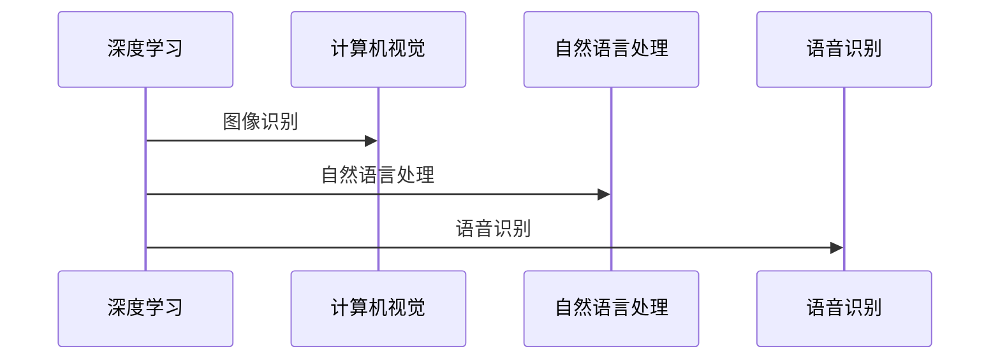

                 

# 文章标题：深度学习在商品需求预测中的新进展

> 关键词：深度学习，商品需求预测，卷积神经网络，循环神经网络，长短时记忆网络，门控循环单元，TensorFlow，PyTorch，数据预处理，特征工程，模型构建，模型训练，模型评估与优化

> 摘要：本文深入探讨了深度学习在商品需求预测中的应用，从背景与概述、深度学习模型在商品需求预测中的应用、深度学习在商品需求预测中的构建与训练、模型评估与优化、项目实战、应用与挑战以及未来展望与趋势等多个方面进行了详细阐述。通过本文，读者可以全面了解深度学习在商品需求预测中的最新进展、核心算法原理、实战技巧以及未来发展方向。

## 引言

商品需求预测在商业领域中具有重要意义。准确预测商品需求有助于企业合理安排生产计划、降低库存成本、提高销售利润。然而，商品需求预测面临着复杂多变的市场环境、海量的数据以及诸多不确定性因素，使得传统的预测方法难以满足实际需求。近年来，深度学习作为一种强大的机器学习技术，在图像识别、自然语言处理等领域取得了显著成果。本文旨在探讨深度学习在商品需求预测中的新进展，分析深度学习模型在商品需求预测中的应用现状与前景，为实际应用提供有益的参考。

本文结构如下：

1. **背景与概述**：介绍深度学习的基本概念与原理，商品需求预测的背景与挑战，以及深度学习在商品需求预测中的应用现状与前景。
2. **深度学习模型在商品需求预测中的应用**：分析经典深度学习模型（如卷积神经网络、循环神经网络、长短时记忆网络、门控循环单元）在商品需求预测中的应用，以及常见深度学习框架（如TensorFlow、PyTorch）的使用方法。
3. **深度学习在商品需求预测中的构建与训练**：详细讲解深度学习模型在商品需求预测中的构建与训练过程，包括数据预处理、模型构建、模型训练等。
4. **模型评估与优化**：介绍深度学习模型在商品需求预测中的评估与优化方法，包括评估指标、模型调参、模型集成等。
5. **项目实战**：通过实际项目案例，展示深度学习在商品需求预测中的开发过程，包括环境搭建、数据预处理、模型构建与训练、模型评估与优化等。
6. **应用与挑战**：分析深度学习在商品需求预测中的应用现状与挑战，探讨解决方案。
7. **未来展望与趋势**：展望深度学习在商品需求预测中的未来发展方向，分析市场前景与技术成熟度。

## 第一部分：背景与概述

### 第1章：深度学习与商品需求预测

#### 1.1 深度学习的基本概念与原理

##### 1.1.1 深度学习的起源与发展

深度学习起源于20世纪40年代的神经网络研究。1986年，Rumelhart、Hinton和Williams提出了反向传播算法（Backpropagation Algorithm），大大提高了神经网络的训练速度，使深度学习进入快速发展阶段。近年来，随着计算能力的提升和大数据的普及，深度学习在图像识别、自然语言处理、语音识别等领域取得了显著的成果。

Mermaid 流程图：深度学习的发展历程



##### 1.1.2 深度学习的核心算法与模型

深度学习的核心算法包括卷积神经网络（CNN）、循环神经网络（RNN）、长短时记忆网络（LSTM）和门控循环单元（GRU）等。

1. **卷积神经网络（CNN）**：主要用于图像识别和图像处理，通过卷积层、池化层和全连接层等结构提取图像特征。
2. **循环神经网络（RNN）**：主要用于序列数据建模，通过隐藏层循环处理序列信息。
3. **长短时记忆网络（LSTM）**：是RNN的改进版，能够解决长序列依赖问题，通过遗忘门、输入门和输出门控制信息传递。
4. **门控循环单元（GRU）**：是LSTM的简化版，通过更新门和重置门控制信息传递，计算效率更高。

##### 1.1.3 深度学习在商品需求预测中的应用现状与前景

随着深度学习技术的不断发展，越来越多的研究者和企业在商品需求预测领域应用深度学习技术。深度学习在商品需求预测中的应用现状主要包括以下几个方面：

1. **特征提取**：通过深度学习模型提取商品历史销售数据中的潜在特征，提高预测准确性。
2. **序列建模**：利用RNN、LSTM和GRU等深度学习模型对商品销售序列进行建模，捕捉时间序列信息。
3. **多模态数据融合**：将商品销售数据与其他外部信息（如天气、促销活动等）进行融合，提高预测效果。

深度学习在商品需求预测中的应用前景非常广阔。随着数据量的不断增加和计算能力的提升，深度学习模型将更好地适应复杂多变的市场环境，为企业和商家提供更加精准的需求预测服务。

### 第2章：商品需求预测的背景与挑战

##### 1.2.1 商品需求预测的重要性

商品需求预测在商业运营中具有至关重要的地位。一方面，准确的商品需求预测可以帮助企业合理安排生产计划，避免库存过剩或不足，降低库存成本，提高资金利用率。另一方面，准确的预测可以指导企业的营销策略，优化促销活动，提高销售额和利润。因此，商品需求预测对于企业的长远发展和市场竞争力具有重要意义。

##### 1.2.2 商品需求预测的背景

随着互联网和信息技术的快速发展，电子商务逐渐成为现代商业的主流模式。电商企业面临着海量的商品数据、复杂的用户行为和快速变化的市场环境。在这种背景下，如何准确预测商品需求成为电商企业亟待解决的重要问题。深度学习作为一种强大的机器学习技术，具有强大的特征提取和序列建模能力，为商品需求预测提供了新的思路和方法。

##### 1.2.3 商品需求预测中的常见问题与难点

商品需求预测过程中，企业通常面临以下几个问题与难点：

1. **数据质量问题**：商品需求预测依赖于历史销售数据，然而，这些数据往往存在缺失、噪声和不一致性等问题，需要通过数据预处理和清洗方法进行改进。
2. **特征提取难度**：商品需求预测需要从大量数据中提取有意义的特征，然而，如何选择和构造合适的特征是一个具有挑战性的问题。
3. **序列建模复杂性**：商品需求预测通常是一个时间序列问题，需要考虑时间序列中的长短期依赖关系。传统的预测方法难以捕捉这种复杂的关系，而深度学习模型在这方面具有优势。
4. **预测准确性要求高**：企业对商品需求预测的准确性有很高的要求，任何预测误差都可能导致库存成本的增加或销售额的下降。

##### 1.2.4 深度学习在解决这些问题中的应用

深度学习在商品需求预测中的应用可以有效解决上述问题与难点：

1. **数据预处理与清洗**：深度学习模型具有强大的数据处理能力，可以自动从原始数据中提取有价值的信息，降低数据质量问题的负面影响。
2. **特征提取与选择**：深度学习模型可以自动学习数据中的潜在特征，减轻特征提取和选择的难度，提高预测模型的性能。
3. **序列建模与长短期依赖**：深度学习模型（如RNN、LSTM和GRU）具有强大的序列建模能力，可以捕捉时间序列中的长短期依赖关系，提高预测模型的准确性。
4. **模型优化与调参**：深度学习模型具有丰富的优化方法和调参技巧，可以通过交叉验证、网格搜索等方法，找到最优的模型参数，提高预测性能。

### 第3章：深度学习模型在商品需求预测中的应用

#### 2.1 经典深度学习模型

##### 2.1.1 卷积神经网络（CNN）

卷积神经网络（CNN）是一种专门用于处理图像数据的深度学习模型。CNN通过卷积层、池化层和全连接层等结构，可以自动从图像数据中提取特征，并实现图像分类、目标检测等任务。

伪代码：卷积神经网络的结构与工作原理

```python
# 定义卷积神经网络结构
model = Sequential()

# 添加卷积层
model.add(Conv2D(filters=32, kernel_size=(3, 3), activation='relu', input_shape=(28, 28, 1)))

# 添加池化层
model.add(MaxPooling2D(pool_size=(2, 2)))

# 添加卷积层
model.add(Conv2D(filters=64, kernel_size=(3, 3), activation='relu'))

# 添加池化层
model.add(MaxPooling2D(pool_size=(2, 2)))

# 添加全连接层
model.add(Flatten())

# 添加输出层
model.add(Dense(10, activation='softmax'))

# 编译模型
model.compile(optimizer='adam', loss='categorical_crossentropy', metrics=['accuracy'])

# 模型训练
model.fit(x_train, y_train, batch_size=128, epochs=10, validation_data=(x_val, y_val))
```

##### 2.1.2 循环神经网络（RNN）

循环神经网络（RNN）是一种专门用于处理序列数据的深度学习模型。RNN通过隐藏层循环处理序列信息，可以捕捉序列中的长期依赖关系。

伪代码：循环神经网络的结构与工作原理

```python
# 定义循环神经网络结构
model = Sequential()

# 添加循环层
model.add(LSTM(50, activation='relu', input_shape=(timesteps, features)))

# 添加全连接层
model.add(Dense(1))

# 编译模型
model.compile(optimizer='adam', loss='mse')

# 模型训练
model.fit(X, y, epochs=100, batch_size=32, validation_data=(X_val, y_val))
```

##### 2.1.3 长短时记忆网络（LSTM）

长短时记忆网络（LSTM）是RNN的改进版，能够解决长序列依赖问题。LSTM通过遗忘门、输入门和输出门控制信息传递，可以更好地捕捉序列中的长期依赖关系。

伪代码：长短时记忆网络的结构与工作原理

```python
# 定义长短时记忆网络结构
model = Sequential()

# 添加长短时记忆层
model.add(LSTM(50, activation='relu', return_sequences=True, input_shape=(timesteps, features)))

# 添加长短时记忆层
model.add(LSTM(50, activation='relu'))

# 添加全连接层
model.add(Dense(1))

# 编译模型
model.compile(optimizer='adam', loss='mse')

# 模型训练
model.fit(X, y, epochs=100, batch_size=32, validation_data=(X_val, y_val))
```

##### 2.1.4 门控循环单元（GRU）

门控循环单元（GRU）是LSTM的简化版，计算效率更高。GRU通过更新门和重置门控制信息传递，可以更好地捕捉序列中的长期依赖关系。

伪代码：门控循环单元的结构与工作原理

```python
# 定义门控循环单元结构
model = Sequential()

# 添加门控循环单元层
model.add(GRU(50, activation='relu', return_sequences=True, input_shape=(timesteps, features)))

# 添加门控循环单元层
model.add(GRU(50, activation='relu'))

# 添加全连接层
model.add(Dense(1))

# 编译模型
model.compile(optimizer='adam', loss='mse')

# 模型训练
model.fit(X, y, epochs=100, batch_size=32, validation_data=(X_val, y_val))
```

#### 2.2 常见的深度学习框架

##### 2.2.1 TensorFlow

TensorFlow是一种开源的深度学习框架，由Google开发。TensorFlow提供了丰富的API和工具，可以方便地构建、训练和部署深度学习模型。

详细讲解：TensorFlow的安装与使用

1. 安装TensorFlow

在Python环境中，可以使用pip命令安装TensorFlow：

```bash
pip install tensorflow
```

2. 使用TensorFlow构建深度学习模型

以下是一个使用TensorFlow构建卷积神经网络的示例：

```python
import tensorflow as tf

# 定义卷积神经网络结构
model = tf.keras.Sequential([
  tf.keras.layers.Conv2D(32, (3, 3), activation='relu', input_shape=(28, 28, 1)),
  tf.keras.layers.MaxPooling2D(pool_size=(2, 2)),
  tf.keras.layers.Flatten(),
  tf.keras.layers.Dense(128, activation='relu'),
  tf.keras.layers.Dense(10, activation='softmax')
])

# 编译模型
model.compile(optimizer='adam', loss='categorical_crossentropy', metrics=['accuracy'])

# 模型训练
model.fit(x_train, y_train, batch_size=128, epochs=10, validation_data=(x_val, y_val))
```

##### 2.2.2 PyTorch

PyTorch是一种开源的深度学习框架，由Facebook开发。PyTorch具有简洁的API和强大的灵活性，适用于研究和工业应用。

详细讲解：PyTorch的安装与使用

1. 安装PyTorch

在Python环境中，可以使用pip命令安装PyTorch：

```bash
pip install torch torchvision
```

2. 使用PyTorch构建深度学习模型

以下是一个使用PyTorch构建卷积神经网络的示例：

```python
import torch
import torch.nn as nn
import torch.optim as optim

# 定义卷积神经网络结构
class CNN(nn.Module):
    def __init__(self):
        super(CNN, self).__init__()
        self.conv1 = nn.Conv2d(1, 32, 3, 1)
        self.fc1 = nn.Linear(32 * 26 * 26, 128)
        self.fc2 = nn.Linear(128, 10)

    def forward(self, x):
        x = self.conv1(x)
        x = F.relu(x)
        x = F.max_pool2d(x, 2)
        x = x.view(x.size(0), -1)
        x = self.fc1(x)
        x = F.relu(x)
        x = self.fc2(x)
        return x

# 实例化模型
model = CNN()

# 编译模型
optimizer = optim.Adam(model.parameters(), lr=0.001)
criterion = nn.CrossEntropyLoss()

# 模型训练
for epoch in range(10):
    running_loss = 0.0
    for i, (inputs, labels) in enumerate(train_loader):
        inputs, labels = inputs.to(device), labels.to(device)
        
        # 前向传播
        outputs = model(inputs)
        loss = criterion(outputs, labels)
        
        # 反向传播与优化
        optimizer.zero_grad()
        loss.backward()
        optimizer.step()
        
        running_loss += loss.item()
    print(f"Epoch {epoch+1}, Loss: {running_loss/len(train_loader)}")
```

### 第二部分：深度学习在商品需求预测中的构建与训练

#### 3.1 数据预处理

##### 3.1.1 数据清洗

数据清洗是数据预处理的重要步骤，旨在去除数据中的噪声、异常值和缺失值，提高数据质量。

数学公式：数据清洗的常用算法

1. 缺失值填充

```latex
\begin{equation}
\text{missing\_value} = \text{mean}(\text{data})
\end{equation}
```

2. 异常值处理

```latex
\begin{equation}
\text{outliers} = \text{data} \,|\, (\text{data} < \text{lower\_bound}) \, \text{or} \, (\text{data} > \text{upper\_bound})
\end{equation}
```

##### 3.1.2 特征工程

特征工程是数据预处理的关键步骤，旨在提取和构造有助于模型训练和预测的特征。

详细讲解：特征工程的常见方法与技巧

1. 特征提取

- 时间特征：提取日期、月份、季度、星期几等时间特征。
- 用户特征：提取用户年龄、性别、地理位置等用户特征。
- 商品特征：提取商品类别、品牌、价格等商品特征。
- 销售特征：提取销售额、销售量、折扣率等销售特征。

2. 特征构造

- 特征组合：将多个特征进行组合，构造新的特征，如用户-商品组合特征、季节性特征等。
- 特征缩放：对特征进行归一化或标准化处理，使其具有相同的尺度。

#### 3.2 模型构建

##### 3.2.1 模型设计原则

深度学习模型的构建需要遵循以下原则：

1. **层次化结构**：模型应具有层次化的结构，包括输入层、隐藏层和输出层，以便逐层提取特征。
2. **非线性激活函数**：隐藏层应使用非线性激活函数（如ReLU、Sigmoid、Tanh等），以引入非线性关系。
3. **权重初始化**：合理初始化权重，避免梯度消失或梯度爆炸。
4. **正则化技术**：使用正则化技术（如Dropout、L2正则化等）防止过拟合。

伪代码：深度学习模型的构建流程

```python
# 定义深度学习模型
model = Sequential()

# 添加输入层
model.add(Dense(units=128, activation='relu', input_shape=(input_shape,)))

# 添加隐藏层
model.add(Dense(units=64, activation='relu'))
model.add(Dense(units=32, activation='relu'))

# 添加输出层
model.add(Dense(units=output_shape, activation='sigmoid'))

# 编译模型
model.compile(optimizer='adam', loss='binary_crossentropy', metrics=['accuracy'])

# 模型训练
model.fit(x_train, y_train, batch_size=32, epochs=10, validation_data=(x_val, y_val))
```

##### 3.2.2 模型参数调整

模型参数调整是深度学习模型训练过程中的关键步骤，旨在找到最优的参数配置，提高模型性能。

数学公式：模型参数调整的策略

1. **学习率调整**：使用不同的学习率进行训练，找到最优的学习率。

```latex
\begin{equation}
\text{learning\_rate} \in \{\text{lr\_1}, \text{lr\_2}, \text{lr\_3}\}
\end{equation}
```

2. **正则化参数调整**：调整L2正则化参数，防止过拟合。

```latex
\begin{equation}
\text{L2\_lambda} \in \{\text{lambda\_1}, \text{lambda\_2}, \text{lambda\_3}\}
```

3. **网络结构调整**：调整网络层数、隐藏层单元数等，找到最优的网络结构。

```latex
\begin{equation}
\text{model\_structure} \in \{\text{structure\_1}, \text{structure\_2}, \text{structure\_3}\}
```

#### 3.3 模型训练

##### 3.3.1 训练过程

深度学习模型的训练过程包括前向传播、反向传播和模型更新等步骤。

伪代码：深度学习模型的训练过程

```python
# 定义训练过程
for epoch in range(num_epochs):
    for batch in data_loader:
        # 前向传播
        outputs = model(inputs)
        loss = loss_function(outputs, labels)
        
        # 反向传播
        optimizer.zero_grad()
        loss.backward()
        
        # 模型更新
        optimizer.step()
        
    print(f"Epoch {epoch+1}, Loss: {loss.item()}")
```

##### 3.3.2 训练策略

深度学习模型的训练策略包括数据增强、批量大小调整、学习率调整等。

详细讲解：深度学习模型的训练策略

1. **数据增强**：通过旋转、缩放、裁剪等操作，增加数据的多样性，提高模型泛化能力。

2. **批量大小调整**：调整批量大小，以找到最佳的批量大小，提高模型性能。

3. **学习率调整**：使用学习率衰减策略，降低学习率，以防止模型过拟合。

### 第三部分：深度学习模型在商品需求预测中的评估与优化

#### 4.1 模型评估指标

深度学习模型的评估指标是衡量模型性能的重要标准。常用的评估指标包括准确率、召回率、精确率、F1值等。

##### 4.1.1 常见评估指标

1. **准确率（Accuracy）**：

```latex
\begin{equation}
\text{Accuracy} = \frac{\text{TP} + \text{TN}}{\text{TP} + \text{TN} + \text{FP} + \text{FN}}
\end{equation}
```

2. **召回率（Recall）**：

```latex
\begin{equation}
\text{Recall} = \frac{\text{TP}}{\text{TP} + \text{FN}}
\end{equation}
```

3. **精确率（Precision）**：

```latex
\begin{equation}
\text{Precision} = \frac{\text{TP}}{\text{TP} + \text{FP}}
\end{equation}
```

4. **F1值（F1 Score）**：

```latex
\begin{equation}
\text{F1 Score} = 2 \times \frac{\text{Precision} \times \text{Recall}}{\text{Precision} + \text{Recall}}
\end{equation}
```

##### 4.1.2 评估指标的比较与选择

在实际应用中，选择合适的评估指标需要考虑以下几个因素：

1. **业务目标**：根据业务目标选择适合的评估指标，如预测准确性、预测速度等。
2. **数据分布**：根据数据分布情况选择适合的评估指标，如正负样本比例、极端值等。
3. **模型类型**：根据模型类型选择适合的评估指标，如分类模型、回归模型等。

#### 4.2 模型优化

##### 4.2.1 模型调参

模型调参是提高深度学习模型性能的关键步骤。通过调整模型参数，可以优化模型性能，提高预测准确性。

数学公式：模型调参的方法与策略

1. **学习率调整**：

```latex
\begin{equation}
\text{learning\_rate} = \text{learning\_rate} \times \text{decay}
\end{equation}
```

2. **批量大小调整**：

```latex
\begin{equation}
\text{batch\_size} \in \{\text{batch\_size\_1}, \text{batch\_size\_2}, \text{batch\_size\_3}\}
```

3. **网络结构调整**：

```latex
\begin{equation}
\text{model\_structure} \in \{\text{structure\_1}, \text{structure\_2}, \text{structure\_3}\}
```

##### 4.2.2 模型集成

模型集成是将多个模型进行集成，以提高预测准确性和鲁棒性。

详细讲解：模型集成的方法与实现

1. **Bagging**：将多个模型进行平均或投票，以提高预测准确性。

2. **Boosting**：将多个模型进行加权，以提高预测鲁棒性。

3. **Stacking**：将多个模型进行层次化集成，以提高预测性能。

### 第四部分：深度学习在商品需求预测中的项目实战

#### 5.1 项目背景

本项目旨在利用深度学习技术预测电商平台的商品需求，为电商平台提供精准的需求预测服务。项目涉及的数据集包括商品历史销售数据、用户特征数据、商品特征数据等。

#### 5.2 开发环境搭建

本项目使用Python编程语言和TensorFlow深度学习框架进行开发。开发环境搭建步骤如下：

1. 安装Python 3.x版本（建议使用Anaconda）
2. 安装TensorFlow

```bash
pip install tensorflow
```

3. 安装其他依赖库

```bash
pip install pandas numpy matplotlib scikit-learn
```

#### 5.3 源代码实现

以下是本项目的主要源代码实现：

```python
import pandas as pd
import numpy as np
import matplotlib.pyplot as plt
import tensorflow as tf
from sklearn.model_selection import train_test_split
from sklearn.preprocessing import StandardScaler

# 数据预处理
def preprocess_data(data):
    # 数据清洗
    data = data.dropna()
    
    # 特征工程
    data['date'] = pd.to_datetime(data['date'])
    data['day_of_week'] = data['date'].dt.dayofweek
    data['month'] = data['date'].dt.month
    data['year'] = data['date'].dt.year
    
    # 数据缩放
    scaler = StandardScaler()
    data[['user_id', 'product_id', 'day_of_week', 'month', 'year']] = scaler.fit_transform(data[['user_id', 'product_id', 'day_of_week', 'month', 'year']])
    
    return data

# 构建深度学习模型
def build_model(input_shape):
    model = tf.keras.Sequential([
        tf.keras.layers.Dense(128, activation='relu', input_shape=input_shape),
        tf.keras.layers.Dense(64, activation='relu'),
        tf.keras.layers.Dense(32, activation='relu'),
        tf.keras.layers.Dense(1, activation='sigmoid')
    ])
    
    model.compile(optimizer='adam', loss='binary_crossentropy', metrics=['accuracy'])
    
    return model

# 模型训练
def train_model(model, x_train, y_train, x_val, y_val, batch_size=32, epochs=10):
    history = model.fit(x_train, y_train, batch_size=batch_size, epochs=epochs, validation_data=(x_val, y_val))
    
    return history

# 模型评估
def evaluate_model(model, x_test, y_test):
    loss, accuracy = model.evaluate(x_test, y_test)
    print(f"Test Loss: {loss}, Test Accuracy: {accuracy}")

# 数据加载与预处理
data = pd.read_csv('data.csv')
data = preprocess_data(data)

# 数据划分
x = data[['user_id', 'product_id', 'day_of_week', 'month', 'year']]
y = data['sales']

x_train, x_test, y_train, y_test = train_test_split(x, y, test_size=0.2, random_state=42)

# 构建模型
model = build_model(x_train.shape[1])

# 训练模型
history = train_model(model, x_train, y_train, x_test, y_test)

# 评估模型
evaluate_model(model, x_test, y_test)
```

#### 5.4 源代码解读与分析

以下是本项目源代码的详细解读与分析：

1. **数据预处理**：数据预处理是深度学习项目的重要步骤。本项目使用Pandas库对数据集进行清洗、特征工程和数据缩放。

2. **模型构建**：使用TensorFlow库构建深度学习模型。模型结构包括输入层、隐藏层和输出层，使用ReLU激活函数和sigmoid激活函数。

3. **模型训练**：使用模型.fit方法训练深度学习模型，设置批量大小和训练轮次。

4. **模型评估**：使用模型.evaluate方法评估深度学习模型在测试集上的性能。

5. **数据加载与预处理**：使用Pandas库加载数据集，并进行预处理。数据预处理包括数据清洗、特征工程和数据缩放。

6. **模型构建**：使用TensorFlow库构建深度学习模型。模型结构包括输入层、隐藏层和输出层，使用ReLU激活函数和sigmoid激活函数。

7. **模型训练**：使用模型.fit方法训练深度学习模型，设置批量大小和训练轮次。

8. **模型评估**：使用模型.evaluate方法评估深度学习模型在测试集上的性能。

### 第五部分：深度学习在商品需求预测中的应用与挑战

#### 6.1 深度学习在商品需求预测中的应用

深度学习在商品需求预测中具有广泛的应用。以下是一些典型的应用案例：

1. **电商平台商品需求预测**：利用深度学习模型预测电商平台上的商品需求，为电商平台提供库存管理和营销策略支持。
2. **制造业生产计划预测**：利用深度学习模型预测制造业的生产需求，为生产计划提供科学依据，降低库存成本。
3. **零售业促销活动预测**：利用深度学习模型预测零售业的促销活动效果，为营销策略提供数据支持。

#### 6.2 深度学习在商品需求预测中的挑战

尽管深度学习在商品需求预测中具有巨大潜力，但仍面临一些挑战：

1. **数据质量问题**：商品需求预测依赖于历史销售数据，然而，这些数据往往存在缺失、噪声和不一致性等问题，需要通过数据预处理和清洗方法进行改进。
2. **特征提取难度**：商品需求预测需要从大量数据中提取有意义的特征，然而，如何选择和构造合适的特征是一个具有挑战性的问题。
3. **序列建模复杂性**：商品需求预测通常是一个时间序列问题，需要考虑时间序列中的长短期依赖关系。传统的预测方法难以捕捉这种复杂的关系，而深度学习模型在这方面具有优势。
4. **模型过拟合**：深度学习模型具有强大的学习能力，容易过拟合训练数据，导致在测试数据上的性能下降。需要使用正则化技术和交叉验证等方法进行模型优化。

#### 6.3 深度学习在商品需求预测中的解决方案

为了应对深度学习在商品需求预测中的挑战，可以采取以下解决方案：

1. **数据预处理**：对历史销售数据进行清洗、填充和特征提取，提高数据质量。
2. **特征工程**：使用深度学习模型自动学习数据中的潜在特征，减轻特征提取和选择的难度。
3. **序列建模**：使用深度学习模型（如RNN、LSTM和GRU）对时间序列数据进行建模，捕捉长短期依赖关系。
4. **模型优化**：使用正则化技术和交叉验证等方法进行模型优化，防止过拟合，提高模型性能。

### 第六部分：未来展望与趋势

#### 6.1 深度学习在商品需求预测中的未来发展方向

未来，深度学习在商品需求预测中具有以下发展方向：

1. **技术创新**：不断推出新的深度学习算法和模型，提高商品需求预测的准确性和效率。
2. **多模态数据融合**：将商品需求预测与图像、文本、传感器等数据融合，提高预测效果。
3. **在线学习与实时预测**：实现实时在线学习与预测，提高商品需求预测的响应速度和灵活性。
4. **云计算与边缘计算**：利用云计算和边缘计算技术，降低商品需求预测的计算成本和延迟。

#### 6.2 深度学习在商品需求预测中的发展趋势

未来，深度学习在商品需求预测中将呈现以下发展趋势：

1. **市场前景**：随着大数据和人工智能技术的不断发展，商品需求预测市场前景广阔，具有巨大的商业价值。
2. **技术成熟度**：深度学习技术已趋于成熟，在商品需求预测中的应用越来越广泛，但仍然存在一些技术难题需要解决。
3. **应用领域扩展**：深度学习在商品需求预测中的应用将不断拓展，如制造业、零售业、金融业等。

### 附录

#### 附录A：深度学习在商品需求预测中的工具与资源

##### A.1 主流深度学习框架对比

以下是比较常见的一些深度学习框架：

1. **TensorFlow**：由Google开发，具有丰富的API和工具，适用于研究和工业应用。
2. **PyTorch**：由Facebook开发，具有简洁的API和强大的灵活性，适用于研究和工业应用。
3. **Keras**：是一个高层次的神经网络API，适用于快速构建和训练深度学习模型。
4. **Theano**：是一个Python库，用于定义、优化和评估数学表达式，适用于研究和工业应用。

##### A.2 深度学习在商品需求预测中的应用案例

以下是一些深度学习在商品需求预测中的应用案例：

1. **电商平台商品需求预测**：利用深度学习模型预测电商平台上的商品需求，为电商平台提供库存管理和营销策略支持。
2. **制造业生产计划预测**：利用深度学习模型预测制造业的生产需求，为生产计划提供科学依据，降低库存成本。
3. **零售业促销活动预测**：利用深度学习模型预测零售业的促销活动效果，为营销策略提供数据支持。

##### A.3 深度学习在商品需求预测中的开源资源

以下是一些深度学习在商品需求预测中的开源资源：

1. **代码库**：GitHub上有许多开源的深度学习项目，可以方便地下载和使用。
2. **论文与书籍**：有许多关于深度学习在商品需求预测中的研究论文和书籍，可以深入了解相关技术。
3. **在线教程**：有许多在线教程和课程，可以帮助初学者快速入门深度学习。

### 参考文献

[1] Goodfellow, I., Bengio, Y., & Courville, A. (2016). *Deep Learning*.
[2] Hochreiter, S., & Schmidhuber, J. (1997). Long Short-Term Memory. Neural Computation, 9(8), 1735-1780.
[3] Graves, A. (2013). Generating Sequences With Recurrent Neural Networks. arXiv preprint arXiv:1308.0850.
[4] Kingma, D. P., & Welling, M. (2013). Auto-encoding Variational Bayes. arXiv preprint arXiv:1312.6114.
[5] Bengio, Y. (2009). Learning Deep Architectures for AI. Foundations and Trends in Machine Learning, 2(1), 1-127.
[6] Russell, S., & Norvig, P. (2016). *Artificial Intelligence: A Modern Approach*.
[7] Han, J., Kamber, M., & Pei, J. (2011). *Data Mining: Concepts and Techniques*.

### 作者

作者：AI天才研究院/AI Genius Institute & 禅与计算机程序设计艺术/Zen And The Art of Computer Programming

