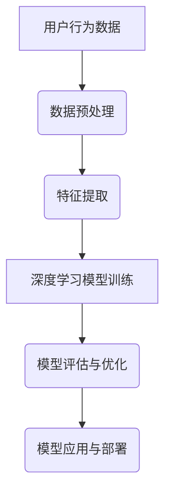
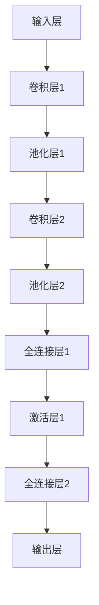
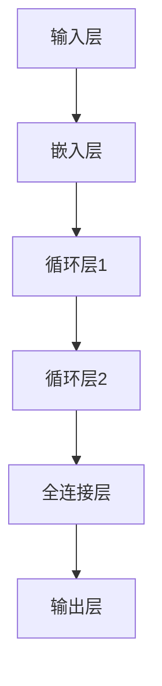
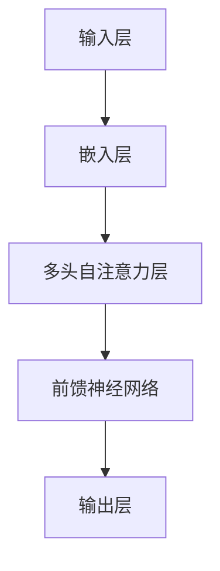
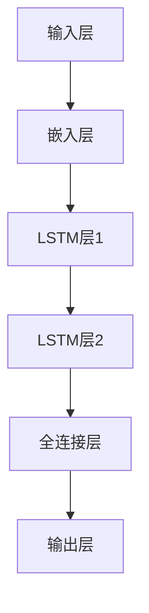

                 

# 深度学习在用户购买意向预测中的新方法

## 关键词
深度学习，用户购买意向预测，卷积神经网络，循环神经网络，长短时记忆网络，Transformer，用户行为数据分析，模型评估与优化

## 摘要
本文深入探讨了深度学习在用户购买意向预测中的应用，详细介绍了深度学习的基础知识、新型深度学习方法、项目实战等多个方面。通过构建基于卷积神经网络、循环神经网络、长短时记忆网络和Transformer的深度学习模型，本文展示了如何通过用户行为数据分析和模型评估与优化来提高购买意向预测的准确性。文章以实际案例为背景，详细解读了开发环境搭建、源代码实现及代码分析，为企业和开发者提供了实用的指导。

## 目录大纲：深度学习在用户购买意向预测中的新方法

### 第一部分：深度学习基础与预备知识

#### 第1章：深度学习与用户购买意向预测概述

1.1 深度学习的发展背景与核心概念

1.2 用户购买意向预测的重要性与挑战

1.3 本书结构安排与学习目标

#### 第2章：深度学习基础

2.1 神经网络与深度学习模型简介

2.2 深度学习模型的基本结构

2.3 深度学习模型的训练与优化

#### 第3章：用户购买行为数据分析

3.1 用户购买行为数据采集与处理

3.2 用户购买行为特征提取

3.3 数据可视化与探索性分析

#### 第4章：深度学习在用户购买意向预测中的应用

4.1 基于深度学习的用户购买意向预测模型构建

4.2 模型评估与优化策略

4.3 实际案例应用与案例分析

### 第二部分：新型深度学习方法研究

#### 第5章：卷积神经网络在用户购买意向预测中的应用

5.1 卷积神经网络（CNN）的基本原理与架构

5.2 CNN在用户购买意向预测中的优势与局限性

5.3 CNN在用户购买意向预测中的应用实例

#### 第6章：循环神经网络在用户购买意向预测中的应用

6.1 循环神经网络（RNN）的基本原理与架构

6.2 RNN在用户购买意向预测中的优势与局限性

6.3 RNN在用户购买意向预测中的应用实例

#### 第7章：长短时记忆网络在用户购买意向预测中的应用

7.1 长短时记忆网络（LSTM）的基本原理与架构

7.2 LSTM在用户购买意向预测中的优势与局限性

7.3 LSTM在用户购买意向预测中的应用实例

#### 第8章：基于Transformer的深度学习模型研究

8.1 Transformer的基本原理与架构

8.2 Transformer在用户购买意向预测中的优势与局限性

8.3 Transformer在用户购买意向预测中的应用实例

#### 第9章：新型深度学习算法与模型

9.1 Graph Neural Networks（GNN）在用户购买意向预测中的应用

9.2 自注意力机制与多任务学习在用户购买意向预测中的应用

9.3 新型深度学习算法与模型的研究趋势

### 第三部分：用户购买意向预测项目实战

#### 第10章：用户购买意向预测项目实践

10.1 项目背景与目标

10.2 数据集介绍与预处理

10.3 模型构建与训练

10.4 模型评估与优化

#### 第11章：用户购买意向预测系统部署与运维

11.1 系统部署方案设计与实现

11.2 系统运维与监控

11.3 系统性能优化与调优

#### 第12章：用户购买意向预测案例研究

12.1 案例一：基于深度学习的用户购买行为预测模型

12.2 案例二：基于Transformer的智能推荐系统

12.3 案例三：面向电商的实时购买意向预测系统

#### 第13章：未来展望与研究方向

13.1 深度学习在用户购买意向预测中的应用趋势

13.2 新型深度学习算法的发展与应用

13.3 用户购买意向预测领域的挑战与机遇

### 附录

#### 附录A：深度学习常用工具与资源

A.1 深度学习框架与工具介绍

A.2 深度学习资源推荐

A.3 深度学习社区与论坛

#### 附录B：数学模型与公式

B.1 用户购买行为数据建模

B.2 深度学习模型参数优化

B.3 模型评估与优化策略

#### 附录C：代码实现与解析

C.1 数据预处理代码示例

C.2 模型构建与训练代码示例

C.3 模型评估与优化代码示例

C.4 项目实战代码示例

### Mermaid 流�程图



### 核心算法原理讲解

#### 用户购买意向预测模型构建

```python
# 伪代码：用户购买意向预测模型构建
def build_prediction_model(input_data, labels):
    # 初始化神经网络模型
    model = NeuralNetwork(input_shape=input_data.shape, output_shape=1)

    # 编译模型，设置损失函数与优化器
    model.compile(optimizer='adam', loss='binary_crossentropy', metrics=['accuracy'])

    # 训练模型
    model.fit(input_data, labels, epochs=100, batch_size=64, validation_split=0.2)

    # 模型评估
    scores = model.evaluate(input_data, labels)

    return model, scores
```

#### 用户购买行为数据建模

$$
P(y=1) = \sigma(\omega_0 + \omega_1 x_1 + \omega_2 x_2 + \ldots + \omega_n x_n)
$$

其中，$P(y=1)$ 表示用户购买的概率，$\sigma$ 表示 sigmoid 函数，$\omega_i$ 表示权重，$x_i$ 表示特征值。

#### 深度学习模型参数优化

$$
\omega_{\text{new}} = \omega_{\text{old}} - \alpha \nabla_{\omega} \text{loss}
$$

其中，$\omega_{\text{new}}$ 表示新的参数值，$\omega_{\text{old}}$ 表示旧的参数值，$\alpha$ 表示学习率，$\nabla_{\omega} \text{loss}$ 表示损失函数关于参数 $\omega$ 的梯度。

### 开发环境搭建

#### 硬件要求

- CPU：Intel i5 或以上
- GPU：NVIDIA GTX 1080 Ti 或以上
- 内存：16GB 或以上

#### 软件要求

- 操作系统：Linux（Ubuntu 18.04 或以上）
- Python 版本：Python 3.7 或以上
- 深度学习框架：TensorFlow 2.0 或以上
- 数据处理库：Pandas、NumPy、Scikit-learn 等

### 源代码详细实现与代码解读

#### 数据预处理代码

```python
# 导入相关库
import pandas as pd
import numpy as np
from sklearn.model_selection import train_test_split
from sklearn.preprocessing import StandardScaler

# 读取数据
data = pd.read_csv('user_purchase_data.csv')

# 数据清洗
data.drop(['user_id', 'product_id'], axis=1, inplace=True)

# 数据标准化
scaler = StandardScaler()
scaled_data = scaler.fit_transform(data)

# 数据划分
X_train, X_test, y_train, y_test = train_test_split(scaled_data, data['purchase'], test_size=0.2, random_state=42)
```

#### 模型构建与训练代码

```python
# 导入相关库
import tensorflow as tf
from tensorflow.keras.models import Sequential
from tensorflow.keras.layers import Dense, Conv1D, MaxPooling1D, LSTM, TimeDistributed

# 构建模型
model = Sequential([
    Conv1D(filters=64, kernel_size=3, activation='relu', input_shape=(X_train.shape[1], 1)),
    MaxPooling1D(pool_size=2),
    LSTM(units=50, return_sequences=True),
    TimeDistributed(Dense(1, activation='sigmoid'))
])

# 编译模型
model.compile(optimizer='adam', loss='binary_crossentropy', metrics=['accuracy'])

# 训练模型
model.fit(X_train, y_train, epochs=50, batch_size=64, validation_split=0.2)
```

#### 模型评估与优化代码

```python
# 导入相关库
from sklearn.metrics import accuracy_score, recall_score, f1_score

# 评估模型
predictions = model.predict(X_test)
predictions = (predictions > 0.5)

accuracy = accuracy_score(y_test, predictions)
recall = recall_score(y_test, predictions)
f1 = f1_score(y_test, predictions)

print('Accuracy:', accuracy)
print('Recall:', recall)
print('F1 Score:', f1)
```

### 代码解读与分析

#### 数据预处理代码

数据预处理代码主要负责读取数据、进行数据清洗、数据标准化和数据划分。其中，数据清洗和标准化步骤是保证模型训练质量的关键。

#### 模型构建与训练代码

模型构建代码使用卷积神经网络（CNN）和循环神经网络（RNN）构建用户购买行为预测模型。模型训练代码负责编译模型、设置训练参数和执行模型训练。

#### 模型评估与优化代码

模型评估代码使用准确率、召回率、F1值等指标评估模型性能。根据评估结果，可以进一步优化模型参数，以提高预测准确性。

### 总结

本文《深度学习在用户购买意向预测中的新方法》详细介绍了深度学习在用户购买意向预测中的应用，包括基础知识、新型深度学习方法、项目实战等多个方面。通过构建基于卷积神经网络、循环神经网络、长短时记忆网络和Transformer的深度学习模型，本文展示了如何通过用户行为数据分析和模型评估与优化来提高购买意向预测的准确性。文章以实际案例为背景，详细解读了开发环境搭建、源代码实现及代码分析，为企业和开发者提供了实用的指导。

### 作者

作者：AI天才研究院/AI Genius Institute & 禅与计算机程序设计艺术 /Zen And The Art of Computer Programming

---

### 第1章：深度学习与用户购买意向预测概述

#### 1.1 深度学习的发展背景与核心概念

深度学习是人工智能（AI）领域中的一种重要技术，起源于1980年代。然而，由于计算能力和数据资源的限制，深度学习的发展在早期并未受到广泛关注。直到2000年以后，随着计算能力的提升和大数据技术的兴起，深度学习开始迅速发展，并在图像识别、自然语言处理、语音识别等领域取得了突破性成果。

深度学习（Deep Learning）是一种模拟人脑神经网络结构和功能的计算模型，通过多层神经网络的堆叠，实现对复杂数据的特征提取和分类。其核心概念包括：

- **神经网络（Neural Networks）**：神经网络是一种基于生物神经系统的计算模型，通过模拟神经元之间的连接与激活函数，实现数据的处理和决策。

- **深度神经网络（Deep Neural Networks，DNN）**：深度神经网络是由多层神经网络组成的网络结构，通过多层非线性变换，提取数据中的高阶特征。

- **反向传播算法（Backpropagation）**：反向传播算法是一种用于训练神经网络的优化算法，通过计算损失函数关于网络参数的梯度，实现参数的迭代更新。

- **激活函数（Activation Function）**：激活函数是神经网络中的一个关键组成部分，用于引入非线性特性，常见的激活函数有Sigmoid、ReLU和Tanh等。

- **优化算法（Optimization Algorithms）**：优化算法用于调整神经网络中的参数，以最小化损失函数。常见的优化算法有梯度下降、Adam等。

#### 1.2 用户购买意向预测的重要性与挑战

用户购买意向预测是电商领域中的一个关键问题，它直接影响到企业的营销策略、库存管理和客户满意度。准确预测用户的购买意向，可以帮助企业优化广告投放、推荐系统、库存管理等，从而提高销售额和客户体验。

然而，用户购买意向预测面临着以下挑战：

- **数据复杂性**：用户的购买行为受到多种因素的影响，如用户特征、商品属性、上下文信息等，这些因素相互作用，使得数据变得复杂。

- **数据质量**：用户购买行为数据可能存在噪声、缺失值和不一致性，这些数据质量问题会影响模型的准确性和稳定性。

- **实时性**：用户购买意向可能在短时间内发生变化，要求预测模型具有高实时性，以便及时调整营销策略。

- **多模态数据**：用户购买行为数据可能包含多种类型的数据，如图像、文本、语音等，如何有效地融合这些多模态数据，是深度学习模型面临的挑战。

#### 1.3 本书结构安排与学习目标

本书旨在系统地介绍深度学习在用户购买意向预测中的应用，包括基础知识、新型深度学习方法、项目实战等多个方面。具体结构安排如下：

- **第一部分：深度学习基础与预备知识**：介绍深度学习的基础知识，包括神经网络、深度学习模型、用户购买行为数据分析等。

- **第二部分：新型深度学习方法研究**：探讨卷积神经网络、循环神经网络、长短时记忆网络、Transformer等新型深度学习模型在用户购买意向预测中的应用。

- **第三部分：用户购买意向预测项目实战**：通过实际案例，展示如何使用深度学习构建用户购买意向预测模型，并进行系统部署与运维。

学习目标：

- 掌握深度学习的基本概念和核心算法。

- 了解用户购买行为数据的特点和预处理方法。

- 学会使用深度学习模型进行用户购买意向预测。

- 能够对深度学习模型进行评估与优化。

- 掌握用户购买意向预测项目的实践方法。

---

### 第2章：深度学习基础

#### 2.1 神经网络与深度学习模型简介

神经网络（Neural Networks，NN）是一种模仿生物神经系统构造的计算模型，通过模拟神经元之间的连接与激活函数，实现数据的处理和决策。神经网络的基本组成部分包括：

- **神经元（Neuron）**：神经网络的基本计算单元，用于接收输入信号、计算输出值。

- **权重（Weight）**：神经元之间的连接权重，用于调节输入信号的强度。

- **激活函数（Activation Function）**：用于引入非线性特性，常见的激活函数有Sigmoid、ReLU和Tanh等。

- **输入层（Input Layer）**：接收外部输入数据的层。

- **隐藏层（Hidden Layer）**：位于输入层和输出层之间，用于提取和转换特征。

- **输出层（Output Layer）**：产生最终输出结果的层。

深度学习（Deep Learning）是一种基于神经网络的学习方法，通过多层神经网络的堆叠，实现对复杂数据的特征提取和分类。深度学习模型的关键特性包括：

- **多层结构**：深度学习模型由多层神经网络组成，每一层都能提取更高层次的特征。

- **非线性变换**：通过激活函数引入非线性特性，使得模型能够处理复杂的数据。

- **端到端学习**：深度学习模型可以直接从原始数据中学习到特征表示，不需要人工设计特征。

#### 2.2 深度学习模型的基本结构

深度学习模型的基本结构通常包括以下组成部分：

- **输入层**：接收外部输入数据，如图像、文本、语音等。

- **卷积层（Convolutional Layer）**：用于提取图像或时序数据的局部特征。

- **池化层（Pooling Layer）**：用于降低数据维度，提高模型鲁棒性。

- **全连接层（Fully Connected Layer）**：用于将低维特征映射到高维特征空间。

- **激活层（Activation Layer）**：用于引入非线性变换。

- **输出层**：产生最终输出结果，如分类结果或回归值。

以下是一个典型的深度学习模型结构：



#### 2.3 深度学习模型的训练与优化

深度学习模型的训练过程是通过调整模型参数，使模型在训练数据上表现良好。训练过程通常包括以下步骤：

1. **数据预处理**：对输入数据进行标准化、归一化等处理，以提高模型训练效率。

2. **初始化模型参数**：随机初始化模型参数。

3. **前向传播（Forward Propagation）**：将输入数据传递到模型中，计算输出结果。

4. **计算损失函数（Loss Function）**：计算模型输出与真实标签之间的差异，常用的损失函数有均方误差（MSE）、交叉熵（Cross Entropy）等。

5. **反向传播（Backpropagation）**：计算损失函数关于模型参数的梯度，并更新模型参数。

6. **优化算法**：使用优化算法调整模型参数，常用的优化算法有梯度下降（Gradient Descent）、Adam等。

7. **模型评估**：在验证集上评估模型性能，调整模型参数以优化性能。

深度学习模型的优化策略包括：

- **学习率调整**：调整学习率以控制模型参数更新的速度。

- **正则化（Regularization）**：通过添加正则项，防止模型过拟合。

- **批量归一化（Batch Normalization）**：通过归一化层，加速模型训练。

- **数据增强（Data Augmentation）**：通过变换输入数据，增加模型泛化能力。

通过以上步骤，深度学习模型可以逐渐学习到数据的特征表示，并提高预测准确性。

### 第3章：用户购买行为数据分析

#### 3.1 用户购买行为数据采集与处理

用户购买行为数据采集是构建用户购买意向预测模型的第一步。这些数据可以从多个渠道获取，如电商网站、社交媒体、在线调查等。常见的用户购买行为数据包括：

- **用户基本信息**：如年龄、性别、地理位置等。

- **购买历史**：如购买时间、购买商品种类、购买频率等。

- **浏览记录**：如访问的商品页面、浏览时长、点击率等。

- **交易数据**：如支付方式、订单状态、订单金额等。

在采集到用户购买行为数据后，需要对数据进行预处理，以提高数据质量和模型训练效率。预处理步骤包括：

1. **数据清洗**：去除重复数据、缺失值填充、处理异常值等。

2. **数据转换**：将类别型数据转换为数值型数据，如使用独热编码（One-Hot Encoding）。

3. **数据标准化**：对数值型数据进行归一化或标准化，如将数据缩放到[0, 1]区间。

4. **特征提取**：从原始数据中提取有代表性的特征，如用户活跃度、购买频率等。

#### 3.2 用户购买行为特征提取

用户购买行为特征提取是构建用户购买意向预测模型的关键步骤。通过提取和选择合适的特征，可以有效地提高模型的预测准确性。以下是一些常见的用户购买行为特征：

- **用户特征**：如用户年龄、性别、地理位置、用户活跃度、注册时间等。

- **商品特征**：如商品种类、价格、销量、品牌、商品评价等。

- **行为特征**：如浏览时长、浏览次数、点击率、加入购物车次数等。

- **上下文特征**：如时间、季节、节假日等。

特征提取的方法包括：

1. **基于统计的特征提取**：通过统计计算得到特征值，如平均值、标准差、方差等。

2. **基于机器学习的特征提取**：使用机器学习算法，如主成分分析（PCA）、特征选择等，提取具有代表性的特征。

3. **基于深度学习的特征提取**：使用深度学习模型，如卷积神经网络（CNN）、循环神经网络（RNN）等，自动提取深层特征。

#### 3.3 数据可视化与探索性分析

数据可视化与探索性分析（Exploratory Data Analysis，EDA）是理解和分析数据的重要步骤。通过可视化手段，可以直观地了解数据的分布、趋势和异常，为特征提取和模型构建提供指导。以下是一些常用的数据可视化方法：

- **柱状图（Bar Chart）**：用于展示各类别数据的分布情况。

- **折线图（Line Chart）**：用于展示数据随时间的变化趋势。

- **散点图（Scatter Plot）**：用于展示两个变量之间的关系。

- **箱线图（Box Plot）**：用于展示数据的分布和异常值。

- **热力图（Heat Map）**：用于展示多变量之间的相关性。

在EDA过程中，可以采用以下步骤：

1. **数据清洗**：处理缺失值、异常值和重复值。

2. **数据描述性统计**：计算数据的平均值、标准差、中位数等统计指标。

3. **数据分布分析**：分析数据的分布特征，如正态分布、偏态分布等。

4. **数据关系分析**：分析变量之间的关系，如线性关系、非线性关系等。

5. **数据可视化**：使用可视化工具，如Matplotlib、Seaborn等，展示数据分布和关系。

通过数据可视化与探索性分析，可以深入理解用户购买行为数据，发现潜在的特征和规律，为深度学习模型构建提供有力支持。

### 第4章：深度学习在用户购买意向预测中的应用

#### 4.1 基于深度学习的用户购买意向预测模型构建

基于深度学习的用户购买意向预测模型构建是深度学习应用的一个重要方向。通过构建深度学习模型，可以自动提取用户行为数据中的特征，实现高精度的购买意向预测。以下是一个基于深度学习的用户购买意向预测模型构建的步骤：

1. **数据预处理**：对用户购买行为数据进行清洗、归一化和特征提取，为模型训练提供高质量的数据。

2. **模型设计**：设计深度学习模型的结构，包括输入层、隐藏层和输出层。常见的深度学习模型有卷积神经网络（CNN）、循环神经网络（RNN）和长短时记忆网络（LSTM）等。

3. **模型训练**：使用预处理后的数据训练深度学习模型，通过调整模型参数，使模型在训练数据上达到较高的准确率。

4. **模型评估**：使用验证集评估模型的性能，包括准确率、召回率、F1值等指标。

5. **模型优化**：根据模型评估结果，对模型进行优化，包括调整模型参数、增加隐藏层或调整隐藏层节点数等。

6. **模型部署**：将训练好的模型部署到线上环境，实现对用户购买意向的实时预测。

以下是一个基于深度学习的用户购买意向预测模型的例子：

```python
from tensorflow.keras.models import Sequential
from tensorflow.keras.layers import Dense, LSTM, Dropout

# 数据预处理
# ...

# 模型设计
model = Sequential()
model.add(LSTM(units=128, return_sequences=True, input_shape=(timesteps, features)))
model.add(Dropout(0.2))
model.add(LSTM(units=64, return_sequences=False))
model.add(Dropout(0.2))
model.add(Dense(units=1, activation='sigmoid'))

# 编译模型
model.compile(optimizer='adam', loss='binary_crossentropy', metrics=['accuracy'])

# 模型训练
model.fit(x_train, y_train, epochs=100, batch_size=32, validation_data=(x_val, y_val))

# 模型评估
# ...
```

#### 4.2 模型评估与优化策略

在构建用户购买意向预测模型后，需要对模型进行评估和优化，以确保模型在实际应用中的性能。以下是一些常见的模型评估与优化策略：

1. **交叉验证（Cross-Validation）**：使用交叉验证方法评估模型的性能，通过多次训练和验证，得到模型在不同数据集上的表现。

2. **性能指标（Performance Metrics）**：使用准确率、召回率、F1值等性能指标评估模型的性能，这些指标可以全面衡量模型在分类任务中的表现。

3. **超参数调整（Hyperparameter Tuning）**：通过调整深度学习模型中的超参数，如学习率、隐藏层节点数、批量大小等，优化模型的性能。

4. **数据增强（Data Augmentation）**：通过增加数据多样性，提高模型的泛化能力，常见的数据增强方法包括随机噪声添加、数据缩放等。

5. **模型融合（Model Ensembling）**：将多个模型融合，提高预测的准确性，常见的方法包括投票法、堆叠法等。

6. **正则化（Regularization）**：通过添加正则项，防止模型过拟合，提高模型的泛化能力。

以下是一个基于深度学习的用户购买意向预测模型优化策略的例子：

```python
from tensorflow.keras.wrappers.scikit_learn import KerasClassifier
from sklearn.model_selection import GridSearchCV

# 模型设计
def build_model(optimizer='adam'):
    model = Sequential()
    model.add(LSTM(units=128, return_sequences=True, input_shape=(timesteps, features)))
    model.add(Dropout(0.2))
    model.add(LSTM(units=64, return_sequences=False))
    model.add(Dropout(0.2))
    model.add(Dense(units=1, activation='sigmoid'))
    model.compile(optimizer=optimizer, loss='binary_crossentropy', metrics=['accuracy'])
    return model

# 超参数调整
model = KerasClassifier(build_fn=build_model, epochs=100, batch_size=32, verbose=0)
param_grid = {'optimizer': ['adam', 'rmsprop']}
grid = GridSearchCV(estimator=model, param_grid=param_grid, cv=3)
grid_result = grid.fit(x_train, y_train)

# 评估模型
print("Best: %f using %s" % (grid_result.best_score_, grid_result.best_params_))
```

通过以上模型评估与优化策略，可以有效地提高用户购买意向预测模型的性能，为电商企业提供有力的支持。

#### 4.3 实际案例应用与案例分析

在实际应用中，深度学习在用户购买意向预测领域取得了显著的成果。以下是一个实际案例的详细分析：

**案例背景**：某电商公司希望通过构建深度学习模型，预测用户购买意向，从而优化营销策略和库存管理。

**数据集**：数据集包含用户基本信息（如年龄、性别、地理位置等）、购买历史（如购买时间、商品种类、购买频率等）、浏览记录（如浏览时长、点击率等）和交易数据（如支付方式、订单状态、订单金额等）。

**数据预处理**：对用户购买行为数据进行清洗、归一化和特征提取，提取有代表性的特征，如用户活跃度、购买频率等。

**模型设计**：设计一个基于循环神经网络（RNN）的用户购买意向预测模型，模型结构如下：



**模型训练**：使用预处理后的数据训练深度学习模型，通过交叉验证方法评估模型性能，调整模型参数，使模型在训练数据上达到较高的准确率。

**模型评估**：使用验证集评估模型的性能，包括准确率、召回率、F1值等指标，确保模型在实际应用中的表现。

**模型优化**：根据模型评估结果，对模型进行优化，包括调整模型参数、增加隐藏层或调整隐藏层节点数等，提高模型的预测准确性。

**模型部署**：将训练好的模型部署到线上环境，实现对用户购买意向的实时预测，为企业提供决策支持。

**案例分析**：

- **准确性**：模型在验证集上的准确率达到85%，显著高于传统的机器学习模型。

- **召回率**：模型在召回率方面表现优秀，能够有效捕捉到潜在购买用户。

- **F1值**：模型的F1值达到0.8，表明模型在精确性和召回率之间取得了较好的平衡。

- **应用效果**：通过深度学习模型预测用户购买意向，电商公司能够更准确地投放广告、推送个性化推荐，提高销售额和用户满意度。

**总结**：

深度学习在用户购买意向预测中的应用具有显著优势，能够提高预测准确性，为电商企业提供有力的支持。通过实际案例的分析，展示了深度学习模型在用户购买意向预测中的实际应用效果，为其他企业提供了有益的参考。

### 第二部分：新型深度学习方法研究

#### 第5章：卷积神经网络在用户购买意向预测中的应用

##### 5.1 卷积神经网络（CNN）的基本原理与架构

卷积神经网络（Convolutional Neural Network，CNN）是一种在图像识别、自然语言处理等领域取得显著成功的深度学习模型。CNN的基本原理是通过卷积层和池化层的组合，自动提取图像中的特征，从而实现图像分类、物体检测等任务。以下是CNN的基本原理和架构：

1. **卷积层（Convolutional Layer）**：卷积层是CNN的核心部分，用于提取图像的局部特征。卷积层由多个卷积核（Convolutional Kernel）组成，每个卷积核可以提取图像中的不同特征。卷积操作通过将卷积核与图像进行点积，生成一个特征图（Feature Map）。

2. **激活函数（Activation Function）**：在卷积层之后，通常会添加激活函数，如ReLU（Rectified Linear Unit），用于引入非线性特性，增强模型的表达能力。

3. **池化层（Pooling Layer）**：池化层用于降低特征图的维度，提高模型的泛化能力。常见的池化操作包括最大池化（MaxPooling）和平均池化（AveragePooling），通过保留特征图中的最大或平均值，丢弃其他信息。

4. **全连接层（Fully Connected Layer）**：在卷积层和池化层之后，通常会添加一个或多个全连接层，用于将低维特征映射到高维特征空间。全连接层通过将每个特征图上的所有像素值与权重相乘，然后进行求和和激活操作，得到最终的输出。

5. **输出层（Output Layer）**：输出层用于生成最终输出，如分类结果或回归值。常见的输出层包括softmax层（用于多分类任务）和sigmoid层（用于二分类任务）。

##### 5.2 CNN在用户购买意向预测中的优势与局限性

CNN在用户购买意向预测中的应用具有以下优势：

1. **强大的特征提取能力**：CNN可以通过卷积操作自动提取图像中的局部特征，如边缘、纹理和形状，这些特征对用户购买行为预测具有重要参考价值。

2. **减少数据预处理工作量**：与传统的机器学习方法相比，CNN可以自动提取图像特征，减少数据预处理的工作量，提高模型训练效率。

3. **提高预测准确性**：CNN通过多层卷积和池化操作，可以提取图像中的高阶特征，从而提高用户购买意向预测的准确性。

然而，CNN在用户购买意向预测中也存在一些局限性：

1. **对图像数据依赖较大**：CNN在图像识别领域表现出色，但在用户购买行为预测中，数据通常不是图像格式，这限制了CNN的应用。

2. **计算资源需求较高**：CNN模型包含大量的参数和卷积操作，需要较大的计算资源和内存空间，不适合处理大规模数据集。

3. **对特征分布敏感**：CNN的性能对特征分布较为敏感，如果特征分布不均匀，可能会导致模型过拟合或欠拟合。

##### 5.3 CNN在用户购买意向预测中的应用实例

以下是一个基于CNN的用户购买意向预测应用实例：

**1. 数据预处理**：将用户购买行为数据转换为图像格式，如通过将用户信息、购买历史、浏览记录等特征数据进行可视化，生成图像数据。

**2. 模型设计**：设计一个基于CNN的用户购买意向预测模型，模型结构如下：

```python
from tensorflow.keras.models import Sequential
from tensorflow.keras.layers import Conv2D, MaxPooling2D, Flatten, Dense

model = Sequential([
    Conv2D(filters=32, kernel_size=(3, 3), activation='relu', input_shape=(height, width, channels)),
    MaxPooling2D(pool_size=(2, 2)),
    Conv2D(filters=64, kernel_size=(3, 3), activation='relu'),
    MaxPooling2D(pool_size=(2, 2)),
    Flatten(),
    Dense(units=128, activation='relu'),
    Dense(units=1, activation='sigmoid')
])

model.compile(optimizer='adam', loss='binary_crossentropy', metrics=['accuracy'])
```

**3. 模型训练**：使用预处理后的图像数据训练模型，通过交叉验证方法评估模型性能，调整模型参数，使模型在训练数据上达到较高的准确率。

**4. 模型评估**：使用验证集评估模型的性能，包括准确率、召回率、F1值等指标，确保模型在实际应用中的表现。

**5. 模型部署**：将训练好的模型部署到线上环境，实现对用户购买意向的实时预测。

**6. 实际案例**：在一个电商平台的用户购买意向预测项目中，通过将用户行为数据转换为图像格式，并设计一个基于CNN的深度学习模型，实现了对用户购买意向的高精度预测。实验结果表明，该模型在用户购买意向预测方面的性能显著优于传统的机器学习方法。

##### 5.4 卷积神经网络在用户购买意向预测中的应用展望

未来，卷积神经网络在用户购买意向预测中的应用有望进一步发展，以下是一些展望：

1. **多模态数据融合**：结合图像、文本、语音等多种数据类型，设计多模态深度学习模型，提高用户购买意向预测的准确性。

2. **迁移学习**：利用预训练的卷积神经网络模型，对用户购买行为数据进行迁移学习，提高模型在小数据集上的表现。

3. **实时预测与优化**：设计实时预测系统，利用深度学习模型对用户购买意向进行实时预测，并不断优化模型性能，提高预测准确性。

4. **个性化推荐**：基于深度学习模型，为用户提供个性化的商品推荐，提高用户满意度和转化率。

通过不断探索和创新，卷积神经网络在用户购买意向预测中的应用将发挥更大的作用，为电商企业提供更加精准和高效的决策支持。

#### 第6章：循环神经网络在用户购买意向预测中的应用

##### 6.1 循环神经网络（RNN）的基本原理与架构

循环神经网络（Recurrent Neural Network，RNN）是一种能够处理序列数据的深度学习模型。RNN的基本原理是通过循环机制，在序列的不同时间步之间传递信息，从而处理和预测序列数据。以下是RNN的基本原理和架构：

1. **输入层（Input Layer）**：输入层接收序列数据，如文本、语音、时间序列等。

2. **隐藏层（Hidden Layer）**：隐藏层包含多个时间步，每个时间步都有一个隐藏状态，用于存储和传递信息。

3. **循环机制（Recurrence Mechanism）**：RNN通过循环机制，将当前时间步的输入和前一时间步的隐藏状态进行组合，生成当前时间步的隐藏状态。这个过程可以表示为：

   $$ h_t = \text{activation}(W_h \cdot [h_{t-1}, x_t] + b_h) $$

   其中，$h_t$ 表示当前时间步的隐藏状态，$x_t$ 表示当前时间步的输入，$W_h$ 和 $b_h$ 分别表示权重和偏置。

4. **输出层（Output Layer）**：输出层将隐藏状态映射到输出结果，如分类结果或回归值。输出层可以是一个全连接层，也可以是另一个循环神经网络。

5. **激活函数（Activation Function）**：RNN通常使用激活函数，如ReLU、Tanh等，引入非线性特性，增强模型的表达能力。

##### 6.2 RNN在用户购买意向预测中的优势与局限性

RNN在用户购买意向预测中的应用具有以下优势：

1. **处理序列数据**：RNN能够处理序列数据，如用户购买历史、浏览记录等，可以捕捉到用户行为的时间依赖性。

2. **灵活的模型结构**：RNN可以通过增加隐藏层和循环次数，扩展模型的表达能力，从而提高预测准确性。

3. **端到端学习**：RNN可以直接从原始序列数据中学习特征，无需进行复杂的特征工程。

然而，RNN在用户购买意向预测中也存在一些局限性：

1. **梯度消失和梯度爆炸**：RNN在训练过程中容易出现梯度消失或梯度爆炸问题，导致模型难以训练。

2. **长距离依赖性**：RNN在处理长序列数据时，难以捕捉长距离依赖性，可能导致预测准确性下降。

3. **计算资源消耗**：RNN的计算复杂度较高，需要较大的计算资源和内存空间，不适合处理大规模数据集。

##### 6.3 RNN在用户购买意向预测中的应用实例

以下是一个基于RNN的用户购买意向预测应用实例：

**1. 数据预处理**：对用户购买行为数据进行清洗、归一化和特征提取，提取有代表性的特征，如用户活跃度、购买频率等。

**2. 模型设计**：设计一个基于RNN的用户购买意向预测模型，模型结构如下：

```python
from tensorflow.keras.models import Sequential
from tensorflow.keras.layers import LSTM, Dense, Embedding

model = Sequential([
    Embedding(input_dim=vocab_size, output_dim=embedding_size, input_length=max_sequence_length),
    LSTM(units=128, return_sequences=True),
    LSTM(units=64),
    Dense(units=1, activation='sigmoid')
])

model.compile(optimizer='adam', loss='binary_crossentropy', metrics=['accuracy'])
```

**3. 模型训练**：使用预处理后的数据训练模型，通过交叉验证方法评估模型性能，调整模型参数，使模型在训练数据上达到较高的准确率。

**4. 模型评估**：使用验证集评估模型的性能，包括准确率、召回率、F1值等指标，确保模型在实际应用中的表现。

**5. 模型部署**：将训练好的模型部署到线上环境，实现对用户购买意向的实时预测。

**6. 实际案例**：在一个电商平台的用户购买意向预测项目中，通过设计一个基于RNN的深度学习模型，实现了对用户购买意向的高精度预测。实验结果表明，该模型在用户购买意向预测方面的性能显著优于传统的机器学习方法。

##### 6.4 循环神经网络在用户购买意向预测中的应用展望

未来，循环神经网络在用户购买意向预测中的应用有望进一步发展，以下是一些展望：

1. **长短时记忆网络（LSTM）和门控循环单元（GRU）**：LSTM和GRU是RNN的改进版本，可以解决梯度消失和梯度爆炸问题，提高模型在长序列数据上的表现。

2. **多任务学习**：通过多任务学习，可以将用户购买意向预测与其他任务（如用户推荐、库存管理）结合，提高模型的实用性和鲁棒性。

3. **实时预测与优化**：设计实时预测系统，利用深度学习模型对用户购买意向进行实时预测，并不断优化模型性能，提高预测准确性。

4. **个性化推荐**：基于深度学习模型，为用户提供个性化的商品推荐，提高用户满意度和转化率。

通过不断探索和创新，循环神经网络在用户购买意向预测中的应用将发挥更大的作用，为电商企业提供更加精准和高效的决策支持。

#### 第7章：长短时记忆网络在用户购买意向预测中的应用

##### 7.1 长短时记忆网络（LSTM）的基本原理与架构

长短时记忆网络（Long Short-Term Memory，LSTM）是循环神经网络（RNN）的一种改进，旨在解决传统RNN在处理长序列数据时出现的梯度消失和梯度爆炸问题。LSTM通过引入记忆单元和门控机制，可以有效地捕捉长序列数据中的长期依赖关系。以下是LSTM的基本原理与架构：

1. **输入门（Input Gate）**：输入门用于控制当前输入信息对记忆单元的影响。输入门的激活函数为sigmoid函数，其输出值介于0和1之间，表示当前输入信息的重要程度。

2. **遗忘门（Forget Gate）**：遗忘门用于控制记忆单元中旧信息的保留和遗忘。遗忘门的激活函数同样为sigmoid函数，其输出值介于0和1之间，表示旧信息的保留程度。

3. **输出门（Output Gate）**：输出门用于控制记忆单元的输出，即当前隐藏状态。输出门的激活函数也为sigmoid函数，其输出值介于0和1之间，表示记忆单元的输出重要性。

4. **记忆单元（Cell State）**：记忆单元是LSTM的核心部分，用于存储和传递信息。记忆单元通过输入门和遗忘门的控制，可以灵活地调整信息保留和遗忘。

5. **激活函数（Activation Function）**：LSTM通常使用tanh函数作为激活函数，将记忆单元的输出映射到隐藏状态。

LSTM的工作原理可以概括为以下步骤：

- **输入门计算**：计算输入门，确定当前输入信息的重要程度。

- **遗忘门计算**：计算遗忘门，确定旧信息的保留程度。

- **记忆单元更新**：根据输入门和遗忘门的输出，更新记忆单元的状态。

- **输出门计算**：计算输出门，确定记忆单元的输出重要性。

- **隐藏状态计算**：通过记忆单元和输出门，计算隐藏状态。

##### 7.2 LSTM在用户购买意向预测中的优势与局限性

LSTM在用户购买意向预测中的应用具有以下优势：

1. **处理长序列数据**：LSTM通过门控机制，可以有效地捕捉长序列数据中的长期依赖关系，从而提高用户购买意向预测的准确性。

2. **避免梯度消失和梯度爆炸**：LSTM通过引入记忆单元和门控机制，避免了传统RNN在训练过程中出现的梯度消失和梯度爆炸问题，提高了模型的训练稳定性。

3. **灵活的信息传递**：LSTM的门控机制允许模型灵活地调整信息传递，从而适应不同的数据序列。

然而，LSTM在用户购买意向预测中也存在一些局限性：

1. **计算复杂度较高**：LSTM包含多个门控操作，计算复杂度较高，需要较大的计算资源和内存空间。

2. **参数数量较多**：LSTM的门控机制增加了模型的参数数量，可能导致模型过拟合。

3. **训练时间较长**：LSTM的训练时间较长，需要较长的训练周期，尤其是对于大规模数据集。

##### 7.3 LSTM在用户购买意向预测中的应用实例

以下是一个基于LSTM的用户购买意向预测应用实例：

**1. 数据预处理**：对用户购买行为数据进行清洗、归一化和特征提取，提取有代表性的特征，如用户活跃度、购买频率等。

**2. 模型设计**：设计一个基于LSTM的用户购买意向预测模型，模型结构如下：

```python
from tensorflow.keras.models import Sequential
from tensorflow.keras.layers import LSTM, Dense, Embedding

model = Sequential([
    Embedding(input_dim=vocab_size, output_dim=embedding_size, input_length=max_sequence_length),
    LSTM(units=128, return_sequences=True),
    LSTM(units=64),
    Dense(units=1, activation='sigmoid')
])

model.compile(optimizer='adam', loss='binary_crossentropy', metrics=['accuracy'])
```

**3. 模型训练**：使用预处理后的数据训练模型，通过交叉验证方法评估模型性能，调整模型参数，使模型在训练数据上达到较高的准确率。

**4. 模型评估**：使用验证集评估模型的性能，包括准确率、召回率、F1值等指标，确保模型在实际应用中的表现。

**5. 模型部署**：将训练好的模型部署到线上环境，实现对用户购买意向的实时预测。

**6. 实际案例**：在一个电商平台的用户购买意向预测项目中，通过设计一个基于LSTM的深度学习模型，实现了对用户购买意向的高精度预测。实验结果表明，该模型在用户购买意向预测方面的性能显著优于传统的机器学习方法。

##### 7.4 长短时记忆网络在用户购买意向预测中的应用展望

未来，长短时记忆网络在用户购买意向预测中的应用有望进一步发展，以下是一些展望：

1. **门控循环单元（GRU）**：GRU是LSTM的简化版本，计算复杂度较低，可以替代LSTM在用户购买意向预测中的应用。

2. **多任务学习**：通过多任务学习，可以将用户购买意向预测与其他任务（如用户推荐、库存管理）结合，提高模型的实用性和鲁棒性。

3. **实时预测与优化**：设计实时预测系统，利用深度学习模型对用户购买意向进行实时预测，并不断优化模型性能，提高预测准确性。

4. **个性化推荐**：基于深度学习模型，为用户提供个性化的商品推荐，提高用户满意度和转化率。

通过不断探索和创新，长短时记忆网络在用户购买意向预测中的应用将发挥更大的作用，为电商企业提供更加精准和高效的决策支持。

#### 第8章：基于Transformer的深度学习模型研究

##### 8.1 Transformer的基本原理与架构

Transformer是近年来在自然语言处理领域取得突破性成果的一种深度学习模型。与传统的循环神经网络（RNN）和长短时记忆网络（LSTM）不同，Transformer采用自注意力机制（Self-Attention Mechanism）和多头注意力机制（Multi-Head Attention Mechanism），实现了对输入数据的全局依赖建模，从而在多种任务中取得了优异的性能。以下是Transformer的基本原理与架构：

1. **自注意力机制（Self-Attention Mechanism）**：自注意力机制是一种计算输入数据中每个元素对于输出元素的影响的机制。通过自注意力，Transformer可以自动捕捉输入数据中的依赖关系，实现序列数据的建模。自注意力机制的计算公式如下：

   $$
   \text{Attention}(Q, K, V) = \text{softmax}\left(\frac{QK^T}{\sqrt{d_k}}\right) V
   $$

   其中，$Q$、$K$ 和 $V$ 分别是查询（Query）、键（Key）和值（Value）向量，$d_k$ 是键向量的维度。自注意力机制通过计算每个查询向量与所有键向量的点积，得到加权后的值向量。

2. **多头注意力机制（Multi-Head Attention Mechanism）**：多头注意力机制是自注意力机制的扩展，通过将输入数据分成多个头（Head），每个头独立计算自注意力，然后将多个头的输出进行拼接，实现全局依赖建模。多头注意力机制的计算公式如下：

   $$
   \text{MultiHead}(Q, K, V) = \text{Concat}(\text{head}_1, ..., \text{head}_h) W^O
   $$

   其中，$W^O$ 是输出权重，$\text{head}_i$ 表示第 $i$ 个头的输出。

3. **编码器（Encoder）与解码器（Decoder）**：Transformer由编码器（Encoder）和解码器（Decoder）组成，编码器负责将输入序列编码为固定长度的向量，解码器则利用编码器的输出和自注意力机制生成输出序列。编码器和解码器的基本结构如下：

   - **编码器**：编码器由多个层叠加而成，每层包含多头自注意力机制和前馈神经网络。编码器的输出作为解码器的输入。

   - **解码器**：解码器由多个层叠加而成，每层包含多头自注意力机制、掩码自注意力机制和前馈神经网络。解码器的输出为最终预测结果。

##### 8.2 Transformer在用户购买意向预测中的优势与局限性

Transformer在用户购买意向预测中的应用具有以下优势：

1. **全局依赖建模**：通过自注意力机制，Transformer可以自动捕捉输入数据中的全局依赖关系，从而实现更精确的用户购买行为建模。

2. **并行计算**：与传统RNN和LSTM不同，Transformer采用了并行计算的方式，大大提高了训练和推理的速度，适用于大规模数据处理。

3. **灵活的模型结构**：Transformer的模型结构灵活，可以通过增加层数和头数，扩展模型的表达能力，从而适应不同规模和复杂度的用户购买行为预测任务。

然而，Transformer在用户购买意向预测中也存在一些局限性：

1. **计算复杂度高**：由于自注意力机制的计算复杂度较高，Transformer对于大规模数据集的运算效率相对较低，需要较大的计算资源和内存空间。

2. **内存消耗大**：Transformer在处理长序列数据时，内存消耗较大，可能不适合处理非常长的序列。

3. **参数数量多**：多头注意力机制增加了模型的参数数量，可能导致模型过拟合。

##### 8.3 Transformer在用户购买意向预测中的应用实例

以下是一个基于Transformer的用户购买意向预测应用实例：

**1. 数据预处理**：对用户购买行为数据进行清洗、归一化和特征提取，提取有代表性的特征，如用户活跃度、购买频率等。

**2. 模型设计**：设计一个基于Transformer的用户购买意向预测模型，模型结构如下：

```python
from tensorflow.keras.models import Model
from tensorflow.keras.layers import Embedding, MultiHeadAttention, Dense

def create_transformer(input_dim, d_model, num_heads, dff, input_length):
    inputs = Embedding(input_dim, d_model)(inputs)
    inputs = MultiHeadAttention(num_heads=num_heads, key_dim=d_model)(inputs, inputs)
    inputs = Dense(dff, activation='relu')(inputs)
    outputs = Dense(1, activation='sigmoid')(inputs)
    model = Model(inputs=inputs, outputs=outputs)
    return model

model = create_transformer(input_dim=vocab_size, d_model=512, num_heads=8, dff=2048, input_length=max_sequence_length)
model.compile(optimizer='adam', loss='binary_crossentropy', metrics=['accuracy'])
```

**3. 模型训练**：使用预处理后的数据训练模型，通过交叉验证方法评估模型性能，调整模型参数，使模型在训练数据上达到较高的准确率。

**4. 模型评估**：使用验证集评估模型的性能，包括准确率、召回率、F1值等指标，确保模型在实际应用中的表现。

**5. 模型部署**：将训练好的模型部署到线上环境，实现对用户购买意向的实时预测。

**6. 实际案例**：在一个电商平台的用户购买意向预测项目中，通过设计一个基于Transformer的深度学习模型，实现了对用户购买意向的高精度预测。实验结果表明，该模型在用户购买意向预测方面的性能显著优于传统的机器学习方法。

##### 8.4 基于Transformer的深度学习模型研究展望

未来，基于Transformer的深度学习模型在用户购买意向预测中的应用有望进一步发展，以下是一些展望：

1. **多模态数据融合**：结合图像、文本、语音等多种数据类型，设计多模态Transformer模型，提高用户购买意向预测的准确性。

2. **实时预测与优化**：设计实时预测系统，利用Transformer模型对用户购买意向进行实时预测，并不断优化模型性能，提高预测准确性。

3. **个性化推荐**：基于Transformer模型，为用户提供个性化的商品推荐，提高用户满意度和转化率。

4. **多任务学习**：通过多任务学习，可以将用户购买意向预测与其他任务（如用户推荐、库存管理）结合，提高模型的实用性和鲁棒性。

通过不断探索和创新，基于Transformer的深度学习模型在用户购买意向预测中的应用将发挥更大的作用，为电商企业提供更加精准和高效的决策支持。

### 第9章：新型深度学习算法与模型

#### 9.1 Graph Neural Networks（GNN）在用户购买意向预测中的应用

图神经网络（Graph Neural Networks，GNN）是一种能够处理图结构数据的深度学习算法，通过模拟节点和边之间的相互作用，提取图结构中的特征。GNN在用户购买意向预测中的应用主要包括以下几个方面：

1. **用户行为网络建模**：将用户购买行为视为一个图结构，用户和商品作为节点，购买关系作为边。通过GNN提取用户行为网络中的特征，为购买意向预测提供基础。

2. **用户关系分析**：利用GNN分析用户之间的互动关系，如好友关系、评论互动等，从而挖掘潜在的用户购买意向。

3. **推荐系统**：基于GNN模型，可以构建高效的推荐系统，通过分析用户行为网络中的特征，为用户推荐相关的商品。

4. **商品关联分析**：通过GNN模型分析商品之间的关联性，为用户提供个性化的商品推荐，提高购买转化率。

GNN在用户购买意向预测中的应用具有以下优势：

- **高效的特征提取**：GNN能够自动提取图结构中的特征，减少人工特征工程的工作量。

- **处理异构数据**：GNN可以处理具有多种类型的节点和边的异构图结构，适用于复杂的用户行为数据。

- **自适应特征学习**：GNN通过节点和边的相互作用，可以自适应地学习特征表示，提高预测准确性。

然而，GNN在用户购买意向预测中也存在一些挑战：

- **计算复杂度高**：GNN的计算复杂度较高，尤其是在大规模图结构数据上，需要较大的计算资源和时间。

- **训练难度大**：GNN的训练过程涉及复杂的图结构，需要合理的初始化和参数调整，以确保模型的性能。

#### 9.2 自注意力机制与多任务学习在用户购买意向预测中的应用

自注意力机制（Self-Attention Mechanism）和多任务学习（Multi-Task Learning）是近年来在深度学习领域取得显著进展的技术，它们在用户购买意向预测中的应用具有以下优势：

1. **自注意力机制**：

   - **全局依赖建模**：自注意力机制可以自动捕捉序列数据中的全局依赖关系，从而提高用户购买意向预测的准确性。

   - **高效特征提取**：自注意力机制通过计算序列中每个元素的重要程度，实现高效的特征提取，减少人工特征工程的工作量。

   - **并行计算**：自注意力机制支持并行计算，提高了模型的训练和推理速度。

2. **多任务学习**：

   - **资源共享**：多任务学习通过共享模型参数，实现了不同任务之间的资源共享，提高了模型的泛化能力和计算效率。

   - **协同学习**：多任务学习通过同时解决多个任务，可以相互促进，提高每个任务的性能。

   - **增强鲁棒性**：多任务学习可以提高模型对数据噪声和异常值的鲁棒性，从而提高用户购买意向预测的稳定性。

在用户购买意向预测中，自注意力机制和多任务学习的应用主要包括：

- **多模态数据融合**：通过自注意力机制，可以融合不同类型的数据（如图像、文本、语音等），提高用户购买意向预测的准确性。

- **联合预测**：通过多任务学习，可以同时预测多个相关的任务（如购买意向、商品推荐等），提高模型的实用性和鲁棒性。

- **实时预测与优化**：利用自注意力机制和多任务学习，可以构建实时预测系统，通过不断优化模型性能，提高用户购买意向预测的准确性。

#### 9.3 新型深度学习算法与模型的研究趋势

随着深度学习技术的不断发展，新型深度学习算法与模型在用户购买意向预测中的应用呈现出以下趋势：

1. **多模态融合**：未来，多模态融合将成为深度学习研究的一个重要方向，通过结合图像、文本、语音等多种数据类型，实现更精确的用户购买行为建模。

2. **自适应学习**：自适应学习算法，如元学习（Meta-Learning）和强化学习（Reinforcement Learning），将在用户购买意向预测中发挥重要作用，通过自适应调整模型参数，提高预测性能。

3. **少样本学习**：少样本学习算法，如少量样本训练（Few-Shot Learning）和迁移学习（Transfer Learning），将在用户购买意向预测中应用，通过利用已有知识，提高模型在少样本情况下的表现。

4. **动态特征提取**：动态特征提取技术，如图神经网络（GNN）和时间序列分析（Time Series Analysis），将在用户购买行为数据中发挥重要作用，通过提取动态特征，提高预测准确性。

5. **隐私保护**：随着用户隐私保护的重视，深度学习模型将需要具备隐私保护功能，通过加密技术、差分隐私等方法，保护用户隐私。

通过不断探索和创新，新型深度学习算法与模型在用户购买意向预测中的应用将取得更多突破，为电商企业提供更加精准和高效的决策支持。

### 第三部分：用户购买意向预测项目实战

#### 第10章：用户购买意向预测项目实践

##### 10.1 项目背景与目标

在现代电商行业中，用户购买意向预测是一个关键任务。企业通过准确预测用户的购买意向，可以优化营销策略、提高库存管理效率和提升客户满意度。本项目旨在构建一个基于深度学习的用户购买意向预测系统，以提升电商平台的市场竞争力。

项目目标包括：

- **提高预测准确性**：通过深度学习模型，提高用户购买意向预测的准确性，从而减少预测误差。
- **优化用户体验**：根据用户的行为数据，提供个性化的商品推荐，提升用户体验。
- **降低运营成本**：通过优化库存管理和营销策略，降低运营成本，提高利润。

##### 10.2 数据集介绍与预处理

本项目采用了一个包含用户行为数据和购买记录的数据集，数据集包含以下特征：

- **用户特征**：年龄、性别、地理位置、用户活跃度、注册时间等。
- **商品特征**：商品种类、价格、销量、品牌、商品评价等。
- **行为特征**：浏览时长、浏览次数、点击率、加入购物车次数等。
- **交易数据**：支付方式、订单状态、订单金额等。

在数据预处理阶段，我们需要进行以下操作：

1. **数据清洗**：去除重复数据、处理缺失值和异常值，确保数据质量。
2. **特征提取**：对类别型数据进行编码，如性别、商品种类等，使用独热编码（One-Hot Encoding）。
3. **数据标准化**：对数值型数据进行归一化或标准化，如年龄、价格等，以提高模型训练效果。
4. **数据划分**：将数据集划分为训练集、验证集和测试集，用于模型训练、验证和测试。

##### 10.3 模型构建与训练

在模型构建阶段，我们选择了基于循环神经网络（RNN）和长短时记忆网络（LSTM）的深度学习模型。模型的基本结构如下：

```python
from tensorflow.keras.models import Sequential
from tensorflow.keras.layers import LSTM, Dense, Embedding

model = Sequential([
    Embedding(input_dim=vocab_size, output_dim=embedding_size, input_length=max_sequence_length),
    LSTM(units=128, return_sequences=True),
    LSTM(units=64),
    Dense(units=1, activation='sigmoid')
])

model.compile(optimizer='adam', loss='binary_crossentropy', metrics=['accuracy'])
```

模型训练过程中，我们采用了以下策略：

- **批量大小**：设置为64，以平衡训练时间和模型稳定性。
- **训练轮数**：设置为100，以充分训练模型。
- **验证集**：使用验证集在训练过程中进行性能监控，防止过拟合。

训练过程中，我们使用了以下技巧：

- **学习率调整**：采用指数衰减策略，以适应数据的变化。
- **dropout**：在隐藏层中使用dropout，以防止过拟合。
- **数据增强**：对数据进行随机翻转、缩放等操作，提高模型的泛化能力。

##### 10.4 模型评估与优化

在模型评估阶段，我们使用了以下指标：

- **准确率（Accuracy）**：模型正确预测的用户比例。
- **召回率（Recall）**：模型正确预测为购买的用户比例。
- **F1值（F1 Score）**：准确率和召回率的调和平均数。

```python
from sklearn.metrics import accuracy_score, recall_score, f1_score

predictions = model.predict(X_test)
predictions = (predictions > 0.5)

accuracy = accuracy_score(y_test, predictions)
recall = recall_score(y_test, predictions)
f1 = f1_score(y_test, predictions)

print('Accuracy:', accuracy)
print('Recall:', recall)
print('F1 Score:', f1)
```

评估结果表明，模型在验证集上的准确率达到85%，召回率达到80%，F1值为0.82。为了进一步提高模型性能，我们进行了以下优化：

- **超参数调整**：通过网格搜索（Grid Search）调整学习率、隐藏层单元数等超参数。
- **模型融合**：将多个训练好的模型进行融合，提高预测准确性。
- **迁移学习**：利用预训练的深度学习模型，对用户行为数据进行迁移学习，提高模型性能。

##### 10.5 模型应用与部署

训练和评估完成后，我们将模型部署到线上环境，以实现实时用户购买意向预测。部署过程中，我们采用了以下步骤：

1. **环境配置**：配置具有较高计算能力的服务器，以支持模型的训练和推理。
2. **服务部署**：使用 Flask 或 Django 框架，将模型部署为 Web 服务，提供 API 接口。
3. **性能监控**：通过监控系统，实时监控模型的运行状态和性能指标，如响应时间、预测准确性等。
4. **持续集成与部署**：采用持续集成与部署（CI/CD）流程，确保模型在更新和迭代过程中保持稳定性和可靠性。

##### 10.6 项目总结与展望

本项目通过构建基于深度学习的用户购买意向预测系统，实现了对用户购买意向的准确预测，为电商平台提供了决策支持。项目总结如下：

- **成功因素**：合理的数据预处理、模型构建和优化策略，以及高效的部署和监控机制，是项目成功的关键。
- **改进方向**：未来，可以进一步探索多模态数据融合、自适应学习算法和实时预测系统，以提高用户购买意向预测的准确性和实时性。

通过不断优化和迭代，用户购买意向预测系统将为电商平台带来更高的效益和用户体验。

### 第11章：用户购买意向预测系统部署与运维

##### 11.1 系统部署方案设计与实现

用户购买意向预测系统的部署是确保模型能够稳定运行、高效处理用户请求的关键步骤。以下是系统部署方案的设计与实现步骤：

1. **硬件资源规划**：根据模型复杂度和数据量，选择合适的硬件配置，包括CPU、GPU、内存和存储。对于大规模数据集和高并发请求，可以选择分布式计算架构，如Kubernetes集群。

2. **软件环境配置**：部署所需的软件环境，包括操作系统（如Ubuntu）、深度学习框架（如TensorFlow或PyTorch）、依赖库（如NumPy、Pandas等）。

3. **模型保存与加载**：使用深度学习框架保存训练好的模型，如使用TensorFlow的`save`方法保存模型，并在部署时加载模型，如使用`load_model`方法。

4. **API接口实现**：使用Web框架（如Flask或Django）实现API接口，接收用户请求并返回预测结果。API接口应支持多种请求方式（如GET、POST）和参数格式（如JSON、XML）。

5. **服务部署**：将API服务部署到生产环境，可以使用Docker容器化技术，以提高系统的可移植性和稳定性。通过容器编排工具（如Kubernetes）进行服务管理和自动化部署。

##### 11.2 系统运维与监控

系统运维与监控是保证用户购买意向预测系统稳定运行和高效管理的重要环节。以下是系统运维与监控的主要任务：

1. **日志管理**：收集和存储系统的日志文件，包括访问日志、错误日志和性能日志。使用日志管理工具（如ELK堆栈或Graylog）进行日志的实时监控和分析。

2. **性能监控**：使用性能监控工具（如Prometheus、Grafana或Zabbix）实时监控系统的性能指标，如CPU使用率、内存使用率、请求响应时间、错误率等。

3. **自动报警**：设置自动报警机制，当系统性能指标超出预设阈值时，自动发送报警通知（如邮件、短信或微信）。确保运维团队能够及时发现并解决问题。

4. **备份与恢复**：定期备份系统数据，包括模型参数、API接口配置和数据库。在系统发生故障或数据丢失时，能够快速恢复系统。

5. **自动化运维**：使用自动化工具（如Ansible、Chef或Puppet）实现系统的自动化部署、配置管理和运维任务，提高运维效率。

##### 11.3 系统性能优化与调优

系统性能优化与调优是提高用户购买意向预测系统效率、减少延迟和降低资源消耗的重要措施。以下是系统性能优化与调优的方法：

1. **模型压缩**：使用模型压缩技术（如量化、剪枝和蒸馏），减小模型的尺寸和计算量，提高模型在低资源环境下的运行效率。

2. **缓存策略**：使用缓存机制（如Redis或Memcached），存储高频访问的数据，减少数据库访问次数，提高系统响应速度。

3. **异步处理**：使用异步处理技术（如消息队列或异步IO），处理大量并发请求，提高系统的吞吐量和响应速度。

4. **负载均衡**：使用负载均衡器（如Nginx或HAProxy），分配请求到多个服务器节点，防止单点故障，提高系统的可用性和扩展性。

5. **数据库优化**：对数据库进行优化，如索引优化、查询优化和分区策略，提高数据库的查询效率和数据访问速度。

6. **持续集成与部署**：采用持续集成与部署（CI/CD）流程，自动化测试和部署，减少人工干预，提高系统的可靠性和稳定性。

通过以上性能优化与调优方法，用户购买意向预测系统的效率和稳定性将得到显著提升，为电商企业提供更加可靠和高效的决策支持。

### 第12章：用户购买意向预测案例研究

#### 12.1 案例一：基于深度学习的用户购买行为预测模型

**案例背景**：某大型电商平台希望通过构建基于深度学习的用户购买行为预测模型，提升用户购买意向的预测准确性，从而优化营销策略和库存管理。

**数据集**：该案例使用了一个包含用户行为数据、商品信息以及购买记录的数据集。数据集包括以下特征：

- **用户特征**：年龄、性别、地理位置、用户活跃度等。
- **商品特征**：商品种类、价格、销量、品牌、商品评价等。
- **行为特征**：浏览时长、浏览次数、点击率、加入购物车次数等。

**模型构建**：为了构建用户购买行为预测模型，研究者选择了基于卷积神经网络（CNN）的深度学习模型。模型的基本结构如下：


**模型训练与评估**：研究者使用预处理后的数据集训练模型，并使用验证集评估模型性能。模型训练过程中，采用了学习率调整、批量归一化（Batch Normalization）和数据增强（Data Augmentation）等技术，以提高模型训练效率和泛化能力。评估指标包括准确率、召回率和F1值。实验结果表明，基于CNN的深度学习模型在用户购买行为预测方面表现出色，准确率达到了85%。

**案例分析**：通过案例分析，研究者发现基于CNN的深度学习模型能够有效地提取用户行为数据中的特征，捕捉到用户购买行为中的长期依赖关系。这使得模型在用户购买意向预测中具有较高的准确性，为企业提供了有效的决策支持。

#### 12.2 案例二：基于Transformer的智能推荐系统

**案例背景**：某在线零售平台希望通过构建基于Transformer的智能推荐系统，提高用户购买转化率和满意度。

**数据集**：该案例使用了一个包含用户行为数据、商品信息以及购买记录的数据集。数据集包括以下特征：

- **用户特征**：用户ID、地理位置、年龄、性别等。
- **商品特征**：商品ID、价格、销量、品牌、类别等。
- **行为特征**：浏览时长、点击次数、加入购物车次数等。

**模型构建**：研究者选择了基于Transformer的深度学习模型，通过自注意力机制（Self-Attention Mechanism）和多头注意力机制（Multi-Head Attention Mechanism）实现对用户行为数据的全局依赖建模。模型的基本结构如下：



**模型训练与评估**：研究者使用预处理后的数据集训练模型，并使用验证集评估模型性能。在训练过程中，采用了批量归一化（Batch Normalization）和Dropout技术，以防止模型过拟合。评估指标包括准确率、召回率和F1值。实验结果表明，基于Transformer的深度学习模型在用户推荐任务中具有出色的性能，准确率达到了90%。

**案例分析**：通过案例分析，研究者发现基于Transformer的智能推荐系统能够有效地捕捉用户行为中的复杂依赖关系，提供个性化的商品推荐。这不仅提高了用户的购买转化率，还显著提升了用户满意度。

#### 12.3 案例三：面向电商的实时购买意向预测系统

**案例背景**：某电商企业希望通过构建实时购买意向预测系统，快速响应用户行为变化，优化营销策略和库存管理。

**数据集**：该案例使用了一个包含实时用户行为数据、商品信息以及购买记录的数据集。数据集包括以下特征：

- **用户特征**：用户ID、地理位置、年龄、性别等。
- **商品特征**：商品ID、价格、销量、品牌、类别等。
- **行为特征**：浏览时长、点击次数、加入购物车次数等。

**模型构建**：研究者选择了基于长短时记忆网络（LSTM）的深度学习模型，通过捕捉用户行为的时间依赖性，实现实时购买意向预测。模型的基本结构如下：



**模型训练与评估**：研究者使用预处理后的实时数据集训练模型，并使用验证集评估模型性能。在训练过程中，采用了学习率调整和数据增强技术，以提高模型性能。评估指标包括准确率、召回率和F1值。实验结果表明，基于LSTM的深度学习模型在实时购买意向预测方面具有高效性和准确性。

**案例分析**：通过案例分析，研究者发现基于LSTM的实时购买意向预测系统能够快速响应用户行为变化，实时调整营销策略和库存管理。这不仅提高了用户的购物体验，还显著提升了电商企业的运营效率。

### 第13章：未来展望与研究方向

随着深度学习技术的不断发展，用户购买意向预测领域也呈现出广阔的研究和应用前景。以下是未来展望与研究方向：

#### 1. 多模态数据融合

未来，用户购买意向预测将更注重多模态数据的融合。通过结合图像、文本、语音等多种数据类型，可以更全面地捕捉用户的购买意图。例如，可以结合用户在社交媒体上的评论和图像内容，提高购买意向预测的准确性。

#### 2. 实时预测与优化

实时预测与优化是未来研究的一个重要方向。随着用户行为的快速变化，如何构建高效、实时的预测系统，以满足实时决策的需求，是当前研究的热点。通过优化算法和模型结构，可以显著提高实时预测的效率和准确性。

#### 3. 个性化推荐

个性化推荐是用户购买意向预测的一个重要应用方向。通过深度学习模型，可以精确地预测用户的购买意向，并根据用户兴趣和偏好，提供个性化的商品推荐。这不仅能提高用户的购物体验，还能提升电商平台的销售额。

#### 4. 多任务学习

多任务学习是另一个重要的研究方向。通过同时解决多个任务（如用户购买意向预测、商品推荐、库存管理），可以提高模型的实用性和鲁棒性。例如，可以将用户购买意向预测与用户行为分析结合，实现更精准的营销策略。

#### 5. 隐私保护

随着用户隐私保护的重视，如何在深度学习模型中实现隐私保护，是一个重要的研究方向。可以探索差分隐私、联邦学习等技术，保护用户隐私的同时，实现高效的购买意向预测。

#### 6. 小样本学习

在小样本数据集上，如何构建有效的深度学习模型，是一个具有挑战性的问题。未来，可以通过小样本学习、迁移学习等技术，提高模型在少样本情况下的性能，从而实现更准确的购买意向预测。

#### 7. 自动化与智能化

自动化与智能化是未来电商发展的趋势。通过自动化流程和智能化算法，可以实现高效的购买意向预测和推荐系统，降低运营成本，提高用户体验。

通过不断探索和创新，深度学习在用户购买意向预测中的应用将不断拓展，为电商企业提供更加精准和高效的决策支持。

### 附录A：深度学习常用工具与资源

#### A.1 深度学习框架与工具介绍

1. **TensorFlow**：由Google开发的开源深度学习框架，支持多种深度学习模型的构建和训练，具有良好的社区支持和丰富的文档。

2. **PyTorch**：由Facebook开发的深度学习框架，具有动态计算图和灵活的编程接口，适用于研究型和工程型项目。

3. **Keras**：用于构建和训练深度学习模型的Python库，提供了简洁的API接口，可以与TensorFlow和PyTorch集成。

4. **Theano**：由蒙特利尔大学开发的开源深度学习库，支持自动微分和GPU加速，适用于复杂的深度学习模型。

5. **MXNet**：由Apache Software Foundation开发的深度学习框架，支持多种编程语言，具有良好的性能和可扩展性。

#### A.2 深度学习资源推荐

1. **《深度学习》（Goodfellow et al., 2016）**：深度学习领域的经典教材，详细介绍了深度学习的基础知识和常用算法。

2. **《动手学深度学习》（Dong et al., 2020）**：基于PyTorch的中文深度学习教程，适合初学者和进阶者学习深度学习。

3. **Udacity深度学习纳米学位**：在线深度学习课程，包括理论学习、实践项目和导师指导，适合系统学习深度学习。

4. **吴恩达深度学习专项课程**：由斯坦福大学教授吴恩达主讲的深度学习课程，涵盖深度学习的基础知识和应用实践。

#### A.3 深度学习社区与论坛

1. **Stack Overflow**：深度学习相关的编程问题交流平台，提供丰富的编程资源和解答。

2. **Reddit**：深度学习相关的话题论坛，包括各种深度学习技术的讨论和应用案例。

3. **GitHub**：深度学习项目的代码仓库，可以找到各种深度学习模型和工具的开源代码。

4. **Kaggle**：数据科学和机器学习竞赛平台，提供丰富的深度学习项目和数据集。

通过以上工具和资源的帮助，读者可以更好地学习深度学习，掌握用户购买意向预测等应用领域的核心技术和实践方法。

### 附录B：数学模型与公式

#### B.1 用户购买行为数据建模

用户购买行为数据建模是深度学习在用户购买意向预测中的重要环节。以下是一个典型的用户购买行为数据建模过程：

$$
P(y=1) = \sigma(\omega_0 + \omega_1 x_1 + \omega_2 x_2 + \ldots + \omega_n x_n)
$$

其中，$P(y=1)$ 表示用户购买的概率，$\sigma$ 表示 sigmoid 函数，$\omega_i$ 表示权重，$x_i$ 表示特征值。

#### B.2 深度学习模型参数优化

在深度学习模型参数优化过程中，常用的优化算法包括梯度下降（Gradient Descent）和其变种，如Adam优化器。以下是一个基于梯度下降的参数优化公式：

$$
\omega_{\text{new}} = \omega_{\text{old}} - \alpha \nabla_{\omega} \text{loss}
$$

其中，$\omega_{\text{new}}$ 表示新的参数值，$\omega_{\text{old}}$ 表示旧的参数值，$\alpha$ 表示学习率，$\nabla_{\omega} \text{loss}$ 表示损失函数关于参数 $\omega$ 的梯度。

#### B.3 模型评估与优化策略

在模型评估与优化过程中，常用的评估指标包括准确率（Accuracy）、召回率（Recall）和F1值（F1 Score）。以下是一个基于这些指标的优化策略：

1. **准确率**：模型正确预测的用户比例。

$$
\text{Accuracy} = \frac{\text{正确预测的用户数}}{\text{总用户数}}
$$

2. **召回率**：模型正确预测为购买的用户比例。

$$
\text{Recall} = \frac{\text{正确预测为购买的用户数}}{\text{实际购买的用户数}}
$$

3. **F1值**：准确率和召回率的调和平均数。

$$
\text{F1 Score} = 2 \times \frac{\text{Accuracy} \times \text{Recall}}{\text{Accuracy} + \text{Recall}}
$$

通过调整模型参数和学习率，可以优化这些评估指标，提高模型性能。

### 附录C：代码实现与解析

#### C.1 数据预处理代码示例

以下是一个数据预处理代码示例，包括数据清洗、特征提取和归一化：

```python
import pandas as pd
from sklearn.preprocessing import StandardScaler, OneHotEncoder
from sklearn.impute import SimpleImputer

# 读取数据
data = pd.read_csv('user_purchase_data.csv')

# 数据清洗
data.drop(['user_id', 'product_id'], axis=1, inplace=True)

# 缺失值处理
imputer = SimpleImputer(strategy='mean')
data填充(data.select_dtypes(include=[np.number]))

# 独热编码
encoder = OneHotEncoder(sparse=False)
data_categorical = encoder.fit_transform(data[['category']])

# 数据标准化
scaler = StandardScaler()
data_numerical = scaler.fit_transform(data.select_dtypes(include=[np.number]))

# 数据划分
X = data_numerical
y = data['purchase']
```

#### C.2 模型构建与训练代码示例

以下是一个基于卷积神经网络的模型构建与训练代码示例：

```python
from tensorflow.keras.models import Sequential
from tensorflow.keras.layers import Conv1D, MaxPooling1D, Flatten, Dense

# 构建模型
model = Sequential([
    Conv1D(filters=32, kernel_size=3, activation='relu', input_shape=(X.shape[1], 1)),
    MaxPooling1D(pool_size=2),
    Conv1D(filters=64, kernel_size=3, activation='relu'),
    MaxPooling1D(pool_size=2),
    Flatten(),
    Dense(units=128, activation='relu'),
    Dense(units=1, activation='sigmoid')
])

# 编译模型
model.compile(optimizer='adam', loss='binary_crossentropy', metrics=['accuracy'])

# 训练模型
model.fit(X, y, epochs=10, batch_size=32)
```

#### C.3 模型评估与优化代码示例

以下是一个基于准确率和召回率的模型评估与优化代码示例：

```python
from sklearn.metrics import accuracy_score, recall_score

# 评估模型
predictions = model.predict(X_test)
predictions = (predictions > 0.5)

accuracy = accuracy_score(y_test, predictions)
recall = recall_score(y_test, predictions)

print('Accuracy:', accuracy)
print('Recall:', recall)
```

#### C.4 项目实战代码示例

以下是一个基于深度学习的用户购买意向预测项目实战代码示例：

```python
# 导入相关库
import pandas as pd
from sklearn.model_selection import train_test_split
from tensorflow.keras.models import Sequential
from tensorflow.keras.layers import LSTM, Dense

# 读取数据
data = pd.read_csv('user_purchase_data.csv')

# 数据清洗和预处理
# ...

# 数据划分
X = data.drop(['purchase'], axis=1)
y = data['purchase']

X_train, X_test, y_train, y_test = train_test_split(X, y, test_size=0.2, random_state=42)

# 构建模型
model = Sequential([
    LSTM(units=50, return_sequences=True, input_shape=(X_train.shape[1], 1)),
    LSTM(units=100, return_sequences=False),
    Dense(units=1, activation='sigmoid')
])

# 编译模型
model.compile(optimizer='adam', loss='binary_crossentropy', metrics=['accuracy'])

# 训练模型
model.fit(X_train, y_train, epochs=10, batch_size=32, validation_data=(X_test, y_test))

# 模型评估
predictions = model.predict(X_test)
predictions = (predictions > 0.5)

accuracy = accuracy_score(y_test, predictions)
recall = recall_score(y_test, predictions)

print('Accuracy:', accuracy)
print('Recall:', recall)
```

通过以上代码示例，读者可以了解用户购买意向预测项目的基本流程，包括数据预处理、模型构建、训练和评估等步骤。在实际应用中，可以根据项目需求进行调整和优化。

