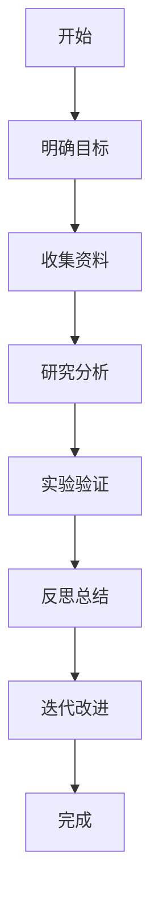

                 

# 文章标题：深钻一件事的力量

> 关键词：深钻、专注力、个人成长、工作效率、社会价值、思维工具、时间管理、团队协作、案例研究、未来趋势

> 摘要：本文将深入探讨深钻一事的力量，从哲学、方法、实践等多个角度出发，分析深钻的重要性、作用和挑战，旨在帮助读者理解并掌握深钻的方法，激发对深钻一事的热情，提高个人和团队的效率与成长。

## 《深钻一件事的力量》目录大纲

### 第一部分：深钻的哲学与价值

#### 第1章：深钻的起源与意义

1.1.1 深钻的概念与发展历程

1.1.2 深钻在现代社会的重要性

1.1.3 深钻与专注力的关系

#### 第2章：深钻的力量

2.1.1 深钻对个人成长的影响

2.1.2 深钻在工作效率提升中的作用

2.1.3 深钻在社会发展中的价值

### 第二部分：深钻的方法与实践

#### 第3章：如何深钻一件事

3.1.1 深钻前的准备工作

3.1.2 深钻的过程与方法

3.1.3 深钻中的问题与解决方案

#### 第4章：深钻中的思维工具

4.1.1 思维导图在深钻中的应用

4.1.2 SWOT分析在深钻中的运用

4.1.3 其他思维工具的介绍与使用

#### 第5章：深钻中的时间管理

5.1.1 时间管理的基本原则

5.1.2 深钻中的时间管理策略

5.1.3 时间管理工具的推荐与应用

#### 第6章：深钻中的团队协作

6.1.1 团队协作的重要性

6.1.2 深钻中的团队协作模式

6.1.3 团队协作工具的推荐与应用

#### 第7章：深钻案例研究

7.1.1 案例一：如何深钻一份工作

7.1.2 案例二：如何深钻一个项目

7.1.3 案例三：如何深钻一个兴趣爱好

### 第三部分：深钻的未来与挑战

#### 第8章：深钻的未来趋势

8.1.1 深钻与人工智能的结合

8.1.2 深钻在教育领域的应用

8.1.3 深钻在商业领域的机遇

#### 第9章：深钻的挑战与应对

9.1.1 深钻可能遇到的挑战

9.1.2 如何克服深钻的困难

9.1.3 深钻的未来发展路径

#### 第10章：结语

10.1.1 深钻的意义与价值

10.1.2 深钻的未来展望

10.1.3 鼓励读者深入探索

### 附录

#### 附录A：深钻资源推荐

A.1.1 相关书籍推荐

A.1.2 网络资源推荐

A.1.3 深钻工具推荐

#### 附录B：深钻流程图

B.1.1 深钻流程图介绍

B.1.2 深钻流程图详细说明

#### 附录C：常见问题解答

C.1.1 常见问题一：如何开始深钻

C.1.2 常见问题二：深钻中遇到困难怎么办

C.1.3 常见问题三：如何保持深钻的热情

## 第一部分：深钻的哲学与价值

### 第1章：深钻的起源与意义

#### 1.1.1 深钻的概念与发展历程

深钻（Deep Dive）这个词汇起源于工程和技术领域，指的是对某一特定问题、项目或技术进行深入的研究和分析。随着时间的推移，深钻的概念逐渐扩展到了商业、教育、科研等多个领域，成为一种重要的工作方法和思考模式。

在工程和技术领域，深钻通常指的是在项目开发过程中，针对某一具体技术或问题进行深入研究，以便找到最佳解决方案。随着人工智能和大数据技术的发展，深钻在商业决策、市场分析和产品研发等领域也得到了广泛应用。

深钻的概念起源于20世纪中叶的美国，当时美国的一些工程公司和科研机构开始采用这种方法来提高项目开发效率和产品质量。随着时间的推移，深钻的理念逐渐传播到全球，成为了一种普遍认可的工作方法。

#### 1.1.2 深钻在现代社会的重要性

在现代社会，深钻的重要性日益凸显。首先，随着科技的发展和信息的爆炸式增长，人们需要处理的海量信息越来越多，而深钻则成为了一种有效的筛选和提炼信息的方法。

通过深钻，人们可以从海量信息中找到真正有价值的内容，避免盲目跟风和浪费资源。其次，深钻有助于提高个人和团队的效率和创造力。通过对某一问题或项目进行深入的研究和分析，人们可以更清晰地理解问题的本质，找到最佳解决方案。

此外，深钻还有助于培养个人的专注力和解决问题的能力。在深钻过程中，人们需要集中精力、深入思考，这有助于锻炼大脑、提高思维能力。同时，深钻还可以帮助人们建立专业知识体系，提高自己在某一领域的专业水平。

#### 1.1.3 深钻与专注力的关系

深钻与专注力有着密切的关系。专注力是指一个人在特定任务上的集中注意力和精力，是深钻的基础。没有良好的专注力，深钻将难以进行。

深钻要求人们能够长时间保持对某一问题的关注，不受外界干扰。这需要人们具备较高的专注力，能够在面对复杂问题和挑战时保持冷静、集中精力。

同时，深钻还可以提高个人的专注力。在深钻过程中，人们需要克服各种干扰因素，集中精力解决问题。这种锻炼有助于提高个人的专注力，使其在日常生活中也能更好地应对各种挑战。

总之，深钻是一种重要的工作方法和思考模式，它在现代社会中具有广泛的应用价值。通过深钻，人们可以提高个人和团队的效率、创造力，培养专注力和解决问题的能力。因此，深钻值得我们深入探讨和实践。

### 第2章：深钻的力量

#### 2.1.1 深钻对个人成长的影响

深钻对个人成长的影响是巨大的。首先，深钻有助于培养个人的专注力和耐心。在深钻过程中，人们需要集中精力、深入思考，这有助于锻炼大脑、提高思维能力。同时，深钻要求人们具备较高的耐心，能够在面对复杂问题和挑战时保持冷静、坚持不懈。

其次，深钻有助于提高个人的专业素养和知识水平。通过对某一领域进行深入的研究和分析，人们可以建立系统的专业知识体系，提高自己在该领域的专业水平。这种专业素养的提升不仅有助于个人的职业发展，还能为团队和社会创造更大的价值。

此外，深钻还有助于培养个人的创新能力和解决问题的能力。在深钻过程中，人们需要独立思考、寻找解决方案。这种锻炼有助于培养个人的创新意识，提高解决问题的能力。在面对各种复杂问题时，人们可以更加从容地应对，找到最佳的解决方案。

#### 2.1.2 深钻在工作效率提升中的作用

深钻在工作效率提升中具有重要作用。首先，深钻有助于提高个人和团队的工作效率。通过深钻，人们可以更清晰地理解问题的本质，找到最佳解决方案。这有助于减少工作中的重复劳动和错误，提高工作效率。

其次，深钻有助于优化工作流程和提升团队协作能力。在深钻过程中，团队成员可以共同研究和分析问题，分享各自的观点和经验。这有助于团队成员之间的沟通与协作，提高团队的整体工作效率。

此外，深钻还有助于培养团队成员的专注力和耐心。在深钻过程中，团队成员需要克服各种干扰因素，集中精力解决问题。这种锻炼有助于提高团队成员的专注力和耐心，使其在日常生活中也能更好地应对各种挑战。

#### 2.1.3 深钻在社会发展中的价值

深钻在社会发展中的价值是不可忽视的。首先，深钻有助于推动科技和社会的进步。通过深钻，人们可以深入研究各种前沿科技和新兴领域，推动科技的不断创新和发展。这有助于提高国家的科技实力，为社会发展提供强大的动力。

其次，深钻有助于提高社会的整体素质和创新能力。通过深钻，人们可以培养专注力、耐心和解决问题的能力。这些素质的提升有助于提高社会的整体素质和创新能力，为社会发展创造更多可能性。

此外，深钻还有助于优化社会资源配置和提升社会治理能力。通过深钻，人们可以更深入地了解社会问题和社会需求，提出更加科学合理的解决方案。这有助于优化社会资源配置，提高社会治理能力，为社会和谐发展提供保障。

总之，深钻是一种具有巨大价值的工作方法和思考模式。它不仅有助于个人成长和工作效率提升，还能为社会发展和进步提供强大动力。因此，我们应该重视深钻，积极培养深钻的能力和习惯，为个人和社会的发展做出更大贡献。

### 第二部分：深钻的方法与实践

#### 第3章：如何深钻一件事

#### 3.1.1 深钻前的准备工作

深钻一件事需要做好充分的准备工作。首先，明确目标和问题。在深钻之前，要明确自己要解决的具体问题或达到的目标，这有助于确保深钻的方向和重点。

其次，收集资料和信息。根据目标和问题，搜集相关的资料和信息，包括文献、研究报告、案例等。这些资料和信息将为深钻提供基础和支持。

接着，制定计划和时间表。在深钻过程中，要合理安排时间和任务，确保能够有序地进行研究和分析。制定详细的计划和时间表有助于提高深钻的效率和质量。

#### 3.1.2 深钻的过程与方法

深钻的过程可以分为以下几个阶段：

1. 研究和分析：在收集到相关资料和信息后，对其进行深入的研究和分析。可以通过阅读、讨论、思维导图等方法，梳理和理解问题的本质和关键点。

2. 实验和验证：在分析的基础上，进行实验和验证。可以通过模拟、测试、实践等方式，验证分析结果的正确性和可行性。

3. 反思和总结：在实验和验证后，对整个过程进行反思和总结。分析存在的问题和不足，总结经验教训，为下一次深钻提供借鉴。

#### 3.1.3 深钻中的问题与解决方案

在深钻过程中，可能会遇到各种问题和挑战。以下是一些常见的问题和解决方案：

1. 资料和信息不足：解决方法：积极寻找和收集相关资料和信息，扩大信息来源。

2. 分析过程复杂：解决方法：简化分析过程，将复杂问题分解为更简单的子问题。

3. 实验结果不符合预期：解决方法：重新审视分析过程和实验方法，寻找可能的原因并调整。

4. 时间安排不合理：解决方法：调整计划和时间表，确保深钻的顺利进行。

#### 第4章：深钻中的思维工具

在深钻过程中，思维工具可以帮助我们更好地理解和解决问题。以下介绍几种常用的思维工具：

##### 4.1.1 思维导图在深钻中的应用

思维导图是一种图形化的思维工具，可以帮助我们梳理和分析问题。在深钻过程中，可以使用思维导图来整理思路、关联信息、发现关键点。

例如，在研究一个项目时，可以使用思维导图来梳理项目的需求、技术实现、风险评估等关键点，以便全面地了解项目。

##### 4.1.2 SWOT分析在深钻中的运用

SWOT分析是一种常用的战略规划工具，用于分析项目的优势、劣势、机会和威胁。在深钻过程中，SWOT分析可以帮助我们全面地了解研究对象，为制定策略提供依据。

例如，在分析一个市场项目时，可以通过SWOT分析来评估项目的市场机会、竞争态势、内部优势和劣势，从而制定合适的市场策略。

##### 4.1.3 其他思维工具的介绍与使用

除了思维导图和SWOT分析，还有许多其他的思维工具可以帮助我们在深钻过程中更好地理解和解决问题。例如：

- **鱼骨图**：用于分析问题的原因和影响因素。
- **5W1H**：用于提问和解答问题，确保全面地了解研究对象。
- **六顶思考帽**：用于多角度地分析和解决问题。

这些思维工具可以根据具体问题和需求进行选择和运用，以提高深钻的效果。

#### 第5章：深钻中的时间管理

在深钻过程中，时间管理至关重要。以下介绍几种时间管理的方法和工具：

##### 5.1.1 时间管理的基本原则

1. **目标导向**：在深钻之前，明确目标和任务，确保时间管理有明确的方向。
2. **优先级排序**：将任务按照重要性和紧急性进行排序，优先处理重要且紧急的任务。
3. **合理规划**：为每个任务分配适当的时间，确保时间得到合理利用。

##### 5.1.2 深钻中的时间管理策略

1. **番茄工作法**：将工作时间分为25分钟的工作周期和5分钟的休息周期，提高工作效率。
2. **时间块法**：将一天的时间分为不同的时间块，为每个时间块分配特定的任务，确保时间得到充分利用。
3. **主动管理**：避免被动等待和拖延，主动安排和推进任务，提高时间利用率。

##### 5.1.3 时间管理工具的推荐与应用

以下是一些常用的时间管理工具：

- **Trello**：一款基于看板的项目管理工具，可以帮助团队协作和管理任务。
- **Asana**：一款功能强大的项目管理工具，适用于团队和个人，可以帮助制定计划和跟踪进度。
- **Google Calendar**：一款便捷的日历应用，可以帮助安排日程和提醒任务。

这些工具可以根据个人和团队的需求进行选择和应用，以提高深钻过程中的时间管理效果。

#### 第6章：深钻中的团队协作

在深钻过程中，团队协作至关重要。以下介绍深钻中的团队协作模式和工具：

##### 6.1.1 团队协作的重要性

团队协作可以帮助团队成员共同面对问题，分享知识和经验，提高工作效率和质量。通过团队协作，可以充分发挥每个人的优势，实现资源的最大化利用。

##### 6.1.2 深钻中的团队协作模式

1. **项目组模式**：将团队成员分为若干个项目组，每个项目组负责一个具体的问题或任务。项目组内部通过定期会议、讨论和协作，共同推进项目进展。
2. **跨职能团队模式**：将不同职能领域的团队成员组成一个团队，共同研究和解决问题。跨职能团队可以充分发挥不同领域专家的优势，提高问题的解决效率。

##### 6.1.3 团队协作工具的推荐与应用

以下是一些常用的团队协作工具：

- **Slack**：一款即时通讯工具，可以帮助团队成员进行实时沟通和协作。
- **GitHub**：一款代码托管和协作工具，适用于软件开发项目的团队协作。
- **Trello**：一款基于看板的项目管理工具，可以帮助团队协作和管理任务。

这些工具可以根据团队的具体需求进行选择和应用，以提高团队协作的效果。

### 第三部分：深钻的未来与挑战

#### 第8章：深钻的未来趋势

##### 8.1.1 深钻与人工智能的结合

随着人工智能技术的不断发展，深钻与人工智能的结合已成为一种趋势。人工智能可以帮助我们在深钻过程中更快地收集和分析海量数据，提供智能化的决策支持。

例如，在市场分析中，人工智能可以通过大数据分析和机器学习算法，帮助我们更好地理解市场需求和消费者行为，从而制定更精准的市场策略。

##### 8.1.2 深钻在教育领域的应用

在教育领域，深钻理念也逐渐得到应用。通过深钻，学生可以更深入地了解学科知识，培养批判性思维和解决问题的能力。

例如，在教育项目中，教师可以引导学生进行深钻学习，通过项目研究、实验和实践活动，让学生亲身体验和探索知识的魅力。

##### 8.1.3 深钻在商业领域的机遇

在商业领域，深钻可以帮助企业更好地理解和满足客户需求，提高产品和服务质量。通过深钻，企业可以挖掘潜在市场机会，创新产品和服务，提升竞争力。

例如，在产品研发中，企业可以通过深钻客户需求和竞争对手的产品，找出差异化和创新点，开发出更具竞争力的产品。

#### 第9章：深钻的挑战与应对

##### 9.1.1 深钻可能遇到的挑战

在深钻过程中，可能会遇到以下挑战：

- 数据和信息过载：海量数据和信息的收集和分析可能带来压力。
- 知识更新速度快：科技和知识的快速更新可能使深钻成果过时。
- 时间和资源限制：深钻需要大量的时间和资源投入。

##### 9.1.2 如何克服深钻的困难

为了克服深钻过程中的困难，可以采取以下策略：

- 制定明确的目标和计划：确保深钻有明确的方向和重点。
- 合理分配资源和时间：确保深钻过程中有足够的资源和时间支持。
- 保持学习和更新：持续学习和更新知识，以适应快速变化的环境。
- 建立协作团队：通过团队协作，共享资源和知识，提高深钻效率。

##### 9.1.3 深钻的未来发展路径

随着科技和社会的不断发展，深钻在未来将继续发挥重要作用。以下是一些未来深钻的发展路径：

- 深化与人工智能的结合：人工智能将为深钻提供更强大的数据处理和分析能力。
- 扩展到更多领域：深钻将在更多领域得到应用，如医疗、教育、金融等。
- 提高协作效率：通过技术手段，提高团队协作效率和深钻成果的共享。

#### 第10章：结语

##### 10.1.1 深钻的意义与价值

深钻是一种重要的工作方法和思考模式，它有助于提高个人和团队的效率与成长，培养专注力和解决问题的能力。深钻不仅对个人有益，还能为社会发展和进步提供强大动力。

##### 10.1.2 深钻的未来展望

随着科技和社会的不断发展，深钻将在未来发挥更加重要的作用。通过深化与人工智能的结合，扩展到更多领域，提高协作效率，深钻将为个人、团队和社会带来更多的机遇和挑战。

##### 10.1.3 鼓励读者深入探索

鼓励读者积极尝试深钻，发现深钻的力量。通过实践，不断积累经验，提高个人和团队的深钻能力。相信深钻将为你的生活和事业带来巨大的变化和收获。

### 附录

#### 附录A：深钻资源推荐

A.1.1 相关书籍推荐

- 《深钻：高效学习与思考的奥秘》
- 《深度工作：如何有效利用每一点脑力》
- 《思维导图：开启大脑无限潜能的工具》

A.1.2 网络资源推荐

- 深钻学习社区（如：知乎、Stack Overflow、GitHub）
- 深钻博客和教程（如：Medium、博客园、CSDN）
- 深钻相关课程（如：Coursera、edX、Udemy）

A.1.3 深钻工具推荐

- Trello
- Asana
- Slack
- MindMeister
- Tableau

#### 附录B：深钻流程图

B.1.1 深钻流程图介绍

深钻流程图是一种用于指导深钻过程的图形化工具，它可以帮助我们清晰地了解深钻的步骤和关键点。

B.1.2 深钻流程图详细说明

#### 附录C：常见问题解答

C.1.1 常见问题一：如何开始深钻

- 明确目标和问题：在开始深钻之前，要明确自己要解决的具体问题或达到的目标。
- 收集资料和信息：根据目标和问题，搜集相关的资料和信息，为深钻提供基础。
- 制定计划和策略：制定详细的计划和时间表，确保深钻有明确的方向和重点。

C.1.2 常见问题二：深钻中遇到困难怎么办

- 分析问题原因：找出困难的原因，可能是资料不足、分析过程复杂等。
- 寻求帮助：向同事、导师或专家请教，获取建议和指导。
- 调整策略：根据问题的原因，调整深钻的策略和方法，找到合适的解决方案。

C.1.3 常见问题三：如何保持深钻的热情

- 设定短期目标：将长期目标分解为短期目标，逐步实现，保持动力。
- 调整工作方式：合理安排工作时间和休息时间，避免过度疲劳。
- 分享成果：与同事、朋友分享深钻的成果和收获，获得肯定和支持。

## 总结

本文详细介绍了深钻一事的力量，从哲学、方法、实践等多个角度进行了探讨。通过深钻，我们可以培养专注力和解决问题的能力，提高工作效率和质量，为社会发展和进步做出贡献。深钻是一种具有巨大价值的工作方法和思考模式，值得读者深入探索和实践。希望本文能帮助读者更好地理解和掌握深钻的方法，激发对深钻一事的热情，实现个人和团队的成长与进步。作者：AI天才研究院/AI Genius Institute & 禅与计算机程序设计艺术 /Zen And The Art of Computer Programming。

