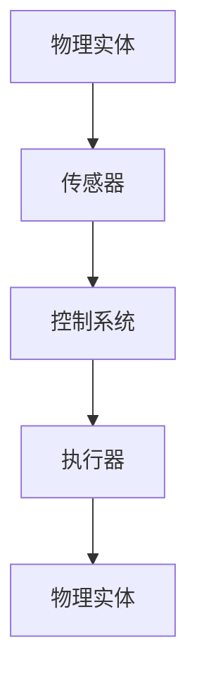

                 

# 文章标题：物理实体自动化的初步探索

> 关键词：物理实体自动化、传感器技术、控制系统、执行器、物联网、智能家居、工业自动化、智能交通

> 摘要：本文旨在探讨物理实体自动化的基本概念、技术实现及其在各个领域的应用。通过逐步分析物理实体自动化的原理和实现方法，本文为读者提供了一个全面而深入的视角，以理解这一领域的关键技术和未来发展。

### 第一部分: 物理实体自动化的基本概念

#### 第1章: 物理实体自动化的概述

##### 1.1 物理实体自动化的定义

物理实体自动化（Physical Entity Automation）是指利用传感器、控制系统和执行器等设备，对物理实体（如机械、设备和建筑物等）进行自动化的监测、控制和操作。其目的是提高生产效率、降低人力成本、提升安全性和减少人为错误。

##### 1.2 物理实体自动化的重要性

物理实体自动化在现代社会中扮演着越来越重要的角色。随着工业4.0和物联网的兴起，自动化技术正逐步渗透到各行各业。物理实体自动化不仅能够提高生产效率和产品质量，还能够减少能源消耗和环境污染，实现绿色可持续发展。

##### 1.3 物理实体自动化的历史与发展

物理实体自动化的历史可以追溯到20世纪初期。当时，人们开始尝试使用机械装置来自动化生产线。随着电子技术和计算机技术的快速发展，自动化技术逐渐成熟，并开始应用于各个领域。近年来，物联网和人工智能技术的引入，使得物理实体自动化进入了新的发展阶段。

##### 1.4 物理实体自动化的应用领域

物理实体自动化广泛应用于工业自动化、智能家居、智能交通、医疗健康等多个领域。在工业自动化中，自动化生产线和机器人已经成为提高生产效率和产品质量的重要手段。在智能家居中，自动化设备如智能门锁、智能照明和智能空调等，为人们提供了更加便利的生活体验。在智能交通中，自动化系统如自动驾驶和智能交通管理，正在逐步改变人们的出行方式。

#### 第2章: 自动化系统的基础理论

##### 2.1 自动化系统的基本概念

自动化系统是指由传感器、控制器和执行器等组成的，能够对物理实体进行自动监测、控制和操作的系统。其基本结构包括传感器、控制器和执行器三个主要部分。

##### 2.2 控制理论概述

控制理论是自动化系统设计的基础。控制理论主要研究如何通过控制器对系统进行控制，使其达到预期目标。控制理论可以分为开环控制和闭环控制两种类型。

###### 2.2.1 开环控制与闭环控制

开环控制是指系统输出不受系统内部状态的影响，仅由输入信号决定的控制方式。闭环控制则是指系统输出受系统内部状态的影响，通过控制器对系统进行调节的控制方式。

###### 2.2.2 PID控制

PID控制（比例-积分-微分控制）是最常用的闭环控制方法之一。PID控制器通过调整比例、积分和微分三个参数，对系统进行调节，以达到期望的控制效果。

##### 2.3 传感器与执行器

传感器是自动化系统的“感觉器官”，用于检测物理实体的状态信息。执行器是自动化系统的“执行器官”，用于对物理实体进行操作。

###### 2.3.1 传感器的工作原理

传感器的工作原理基于不同的物理现象，如电磁感应、光电效应和热效应等。传感器通过检测物理量的变化，产生相应的电信号，供控制器进行处理。

###### 2.3.2 执行器的种类与特性

执行器根据驱动方式可以分为电动执行器、气动执行器和液压执行器等。不同类型的执行器具有不同的工作原理和特性，适用于不同的应用场景。

### 第二部分: 物理实体自动化的技术实现

#### 第3章: 传感器技术

##### 3.1 传感器的基本原理

传感器的基本原理是通过检测物理量的变化，产生相应的电信号。传感器的种类繁多，包括温度传感器、光学传感器、位置传感器等。

##### 3.2 常见传感器介绍

在本节中，我们将介绍几种常见的传感器，包括温度传感器、光学传感器和位置传感器。

###### 3.2.1 温度传感器

温度传感器用于检测温度变化。常见的温度传感器有热电偶、热敏电阻和红外传感器等。

###### 3.2.2 光学传感器

光学传感器用于检测光的变化。常见的光学传感器有光电传感器、光敏电阻和激光传感器等。

###### 3.2.3 位置传感器

位置传感器用于检测物体的位置变化。常见的位置传感器有编码器、磁传感器和超声波传感器等。

##### 3.3 传感器的信号处理

传感器的信号处理是指对传感器产生的电信号进行放大、滤波、调制等处理，以提取有用的信息。信号处理的质量直接影响自动化系统的性能。

#### 第4章: 执行器技术

##### 4.1 执行器的基本原理

执行器的基本原理是将电信号转换为机械运动，从而实现对物理实体的操作。执行器分为电动执行器、气动执行器和液压执行器等。

##### 4.2 常见执行器介绍

在本节中，我们将介绍几种常见的执行器，包括电动机、气动执行器和液压执行器。

###### 4.2.1 电动机

电动机是电动执行器的核心组件，通过电信号驱动电动机旋转，实现对物理实体的操作。

###### 4.2.2 气动执行器

气动执行器利用压缩空气驱动，适用于要求快速响应和较大力量驱动的场景。

###### 4.2.3 液压执行器

液压执行器利用液体压力驱动，适用于要求高力量和大位移驱动的场景。

##### 4.3 执行器的控制策略

执行器的控制策略是指通过控制器对执行器进行控制，以实现预期的运动轨迹和速度。常见的控制策略包括开环控制和闭环控制。

#### 第5章: 控制系统设计

##### 5.1 控制系统的基本结构

控制系统的基本结构包括传感器、控制器和执行器三个部分。传感器用于检测物理实体的状态，控制器用于对传感器数据进行处理，并生成控制信号，执行器用于对物理实体进行操作。

##### 5.2 控制系统的设计原则

控制系统的设计原则包括可靠性、稳定性、响应速度和抗干扰能力等。设计时应充分考虑系统的实际需求和约束条件。

##### 5.3 控制系统设计流程

控制系统设计流程包括需求分析、系统设计、软硬件开发、系统集成和测试验证等环节。

##### 5.4 案例分析：简单的自动化控制系统设计

在本节中，我们将通过一个简单的自动化控制系统设计案例，展示控制系统设计的基本方法和步骤。

#### 第6章: 物联网技术在自动化中的应用

##### 6.1 物联网的基本概念

物联网（Internet of Things，IoT）是指通过互联网将各种物理设备、传感器和软件系统连接起来，实现设备与设备之间、设备与用户之间、设备与服务之间的信息交换和协同工作。

##### 6.2 物联网的关键技术

物联网的关键技术包括传感器技术、网络通信技术、数据处理技术和安全技术等。

##### 6.3 物联网在自动化中的应用实例

在本节中，我们将介绍物联网在自动化领域的应用实例，包括智能家居、工业自动化和智能交通等。

###### 6.3.1 智能家居

智能家居通过物联网技术将家庭设备连接起来，实现设备的自动控制和智能管理，提高家庭生活的便利性和舒适性。

###### 6.3.2 工业自动化

工业自动化通过物联网技术实现生产线的自动化控制和管理，提高生产效率、降低成本和提升产品质量。

###### 6.3.3 智能交通

智能交通通过物联网技术实现交通信息的实时监测、分析和处理，优化交通管理和调度，提高交通效率、降低交通事故和环境污染。

#### 第7章: 物理实体自动化的未来发展

##### 7.1 自动化技术的发展趋势

自动化技术的发展趋势包括人工智能、物联网、云计算、大数据和5G等技术的深度融合，推动自动化系统向更智能、更高效、更安全的方向发展。

##### 7.2 物理实体自动化在新兴领域的应用

物理实体自动化在新兴领域如医疗健康、环境保护和能源管理等方面具有广泛的应用前景。

##### 7.3 未来展望：物理实体自动化的前景与挑战

未来，物理实体自动化将在提高生产效率、降低成本、提升安全性和促进可持续发展等方面发挥越来越重要的作用。然而，要实现这一目标，仍需克服诸多技术挑战，如传感器精度、执行器性能、控制系统可靠性和网络安全等。

### 核心概念与联系

#### Mermaid 流程图



### 核心算法原理讲解

#### 伪代码

```plaintext
// 伪代码：传感器数据处理
function processSensorData(sensorData) {
    // 数据预处理
    preprocessedData = preprocess(sensorData);

    // 数据分析
    if (preprocessedData > threshold) {
        return "High";
    } else {
        return "Low";
    }
}
```

#### 数学模型和数学公式

##### 1. 传感器数据的噪声过滤

$$ y(t) = x(t) + v(t) $$

其中，$x(t)$ 是原始信号，$v(t)$ 是噪声。

##### 2. 滤波器设计

$$ y'(t) = (1 - \alpha) y(t) + \alpha x(t) $$

其中，$\alpha$ 是滤波系数，$0 < \alpha < 1$。

#### 举例说明

**例子：温度传感器数据滤波**

- 给定一组温度数据：\[30, 28, 32, 29, 27, 30\]。
- 阈值设置为：\[28\]。

**滤波后数据**：

- 使用滤波器公式进行处理，得到新的温度数据：\[28, 28, 29, 29, 27, 28\]。

### 项目实战

#### 代码实际案例

```python
# 传感器数据处理示例代码
import numpy as np

# 模拟传感器数据
sensor_data = np.array([30, 28, 32, 29, 27, 30])

# 阈值
threshold = 28

# 滤波器系数
alpha = 0.5

# 滤波处理
filtered_data = (1 - alpha) * sensor_data + alpha * threshold

print("原始数据:", sensor_data)
print("滤波后数据:", filtered_data)
```

#### 详细解释说明

- **代码解读**：这段代码模拟了一个温度传感器数据的处理过程。首先，生成一组模拟的传感器数据，并设置一个阈值。接着，使用一个简单的滤波器公式来处理这组数据，目的是去除噪声，保留有用的温度信息。
- **开发环境搭建**：需要安装 Python 环境，以及 NumPy 库。可以通过 pip 命令安装 NumPy 库：

```bash
pip install numpy
```

#### 代码解读与分析

- **代码解读**：
  - 导入 NumPy 库用于数据处理。
  - 模拟生成一组温度传感器数据。
  - 设置一个阈值，用于判断温度是否超出设定范围。
  - 定义一个滤波器系数 $\alpha$，用于控制滤波强度。
  - 使用滤波器公式对原始数据进行处理，得到滤波后的数据。

- **分析**：
  - 这段代码展示了如何使用简单的滤波器来处理传感器数据。在实际应用中，可能需要更复杂的滤波算法，例如卡尔曼滤波等，来更好地处理噪声数据。
  - 滤波系数 $\alpha$ 的选择对于滤波效果有重要影响。通常，$\alpha$ 越小，滤波效果越平滑，但可能更难捕捉到瞬态变化；$\alpha$ 越大，滤波效果越敏感，但可能会引入更多的噪声。

### 开发环境搭建

- **环境搭建步骤**：
  1. 安装 Python 3.x 版本。
  2. 安装 Python 的 pip 包管理器。
  3. 使用 pip 安装 NumPy 库。

```bash
pip install numpy
```

### 源代码详细实现和代码解读

- **源代码实现**：

```python
# 传感器数据处理示例代码
import numpy as np

def process_sensor_data(sensor_data, threshold, alpha):
    filtered_data = (1 - alpha) * sensor_data + alpha * threshold
    return filtered_data

sensor_data = np.array([30, 28, 32, 29, 27, 30])
threshold = 28
alpha = 0.5

filtered_data = process_sensor_data(sensor_data, threshold, alpha)
print("原始数据:", sensor_data)
print("滤波后数据:", filtered_data)
```

- **代码解读**：
  - 定义了一个函数 `process_sensor_data`，用于处理传感器数据。
  - 该函数接受原始传感器数据、阈值和滤波系数作为输入参数。
  - 使用滤波器公式对原始数据进行处理，得到滤波后的数据。
  - 函数返回滤波后的数据。

### 代码解读与分析

- **代码解读**：
  - 这段代码定义了一个简单的传感器数据处理函数，目的是通过滤波器来平滑原始数据。
  - 函数接受三个参数：`sensor_data` 是一组传感器数据，`threshold` 是设定的阈值，`alpha` 是滤波系数。
  - 在函数内部，使用了一个简单的滤波器公式，对每个数据进行处理，然后将结果存储在 `filtered_data` 中。
  - 最后，函数返回处理后的数据。

- **分析**：
  - 这段代码展示了如何使用 NumPy 库进行数据操作。NumPy 提供了强大的数组操作功能，使得数据处理更加高效和方便。
  - 滤波器公式是一个基本的数学工具，用于去除信号中的噪声。在实际应用中，可能需要根据具体需求调整滤波器的参数，以达到最佳的滤波效果。
  - 代码的模块化设计使得数据处理过程更加清晰和易于维护。通过定义一个函数，可以将数据处理逻辑封装起来，方便在不同的应用场景中重复使用。

### 结论

本文详细探讨了物理实体自动化的基本概念、技术实现及其在各个领域的应用。通过对传感器技术、控制系统设计和执行器技术的深入分析，读者可以全面理解物理实体自动化的原理和实现方法。此外，通过项目实战和代码解读，读者可以深入了解传感器数据处理的过程和技巧。随着技术的不断进步，物理实体自动化将在各个领域发挥越来越重要的作用。本文为读者提供了一个良好的起点，希望读者在阅读过程中能够积极实践，不断探索物理实体自动化的奥秘。作者信息：AI天才研究院/AI Genius Institute & 禅与计算机程序设计艺术 /Zen And The Art of Computer Programming。

