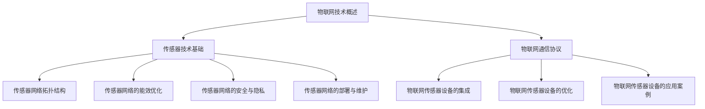

                 

## 文章标题：物联网(IoT)技术和各种传感器设备的集成：传感器网络的设计与优化

### 关键词：
- 物联网（IoT）
- 传感器设备
- 传感器网络
- 设计与优化
- 通信协议
- 能效优化
- 安全与隐私

### 摘要：
本文深入探讨了物联网（IoT）技术和各种传感器设备的集成，重点分析了传感器网络的设计与优化。文章从物联网技术基础、传感器技术基础、物联网通信协议、传感器网络的设计、传感器网络的能效优化、传感器网络的安全与隐私、传感器网络的部署与维护、物联网传感器设备的集成、物联网传感器设备的优化、物联网传感器设备的应用案例等多个方面，逐步分析了物联网传感器网络的设计与优化方法。文章通过具体的算法原理讲解、数学模型与公式、项目实战案例等，使读者能够全面了解物联网传感器网络的设计与优化过程。

## 《物联网(IoT)技术和各种传感器设备的集成：传感器网络的设计与优化》目录大纲

## 第一部分：物联网(IoT)技术基础

### 第1章：物联网概述
#### 1.1 物联网的定义与发展历程
#### 1.2 物联网的技术架构
#### 1.3 物联网的关键技术

### 第2章：传感器技术基础
#### 2.1 传感器的基本概念
#### 2.2 常见传感器介绍
#### 2.3 传感器数据的处理与传输

### 第3章：物联网通信协议
#### 3.1 通信协议概述
#### 3.2 常见物联网通信协议
#### 3.3 物联网通信协议的选择与优化

## 第二部分：传感器网络的设计

### 第4章：传感器网络拓扑结构
#### 4.1 无线传感器网络的基本拓扑
#### 4.2 传感器网络的拓扑优化
#### 4.3 传感器网络的拓扑重建

### 第5章：传感器网络的能效优化
#### 5.1 传感器网络的能耗模型
#### 5.2 能效优化算法
#### 5.3 能效优化案例分析

### 第6章：传感器网络的安全与隐私
#### 6.1 传感器网络面临的安全威胁
#### 6.2 安全协议与机制
#### 6.3 隐私保护技术

### 第7章：传感器网络的部署与维护
#### 7.1 传感器网络的部署策略
#### 7.2 传感器网络的维护与管理
#### 7.3 传感器网络的故障诊断与恢复

## 第三部分：物联网传感器设备的集成与应用

### 第8章：物联网传感器设备的集成
#### 8.1 设备集成的基本原则
#### 8.2 设备集成的实现方法
#### 8.3 设备集成案例分析

### 第9章：物联网传感器设备的优化
#### 9.1 设备优化目标
#### 9.2 设备优化方法
#### 9.3 设备优化案例分析

### 第10章：物联网传感器设备的应用案例
#### 10.1 农业物联网应用
#### 10.2 智能家居应用
#### 10.3 城市物联网应用

## 参考文献

## 附录

### 附录A：物联网传感器网络常见算法与工具

#### A.1 常见传感器网络算法
##### A.1.1 能量感知路由算法
##### A.1.2 数据融合算法
##### A.1.3 位置跟踪算法

#### A.2 物联网传感器网络工具
##### A.2.1 传感器网络模拟工具
##### A.2.2 传感器网络分析工具
##### A.2.3 传感器网络开发工具

# Mermaid 流程图


# 核心算法原理讲解伪代码
```python
# 能量感知路由算法伪代码
Algorithm EnergyAwareRouting
Input: SensorNetwork
Output: RoutingPath
    for each sensor in SensorNetwork do
        CalculateEnergyLevel(sensor)
        if sensor is low on energy then
            select closest neighbor sensor with higher energy level
            add edge to neighbor in RoutingPath
        end if
    end for
    return RoutingPath
```

# 数学模型和数学公式 & 详细讲解 & 举例说明
## 数据融合算法的数学模型
### 数据融合的目标函数
$$
f(\mathbf{x}) = \arg \min_{\mathbf{y}} \sum_{i=1}^{N} w_i \cdot d(\mathbf{y}, \mathbf{x}_i)
$$
其中，$\mathbf{x}$为原始数据集，$\mathbf{y}$为融合后的数据，$w_i$为权重，$d(\mathbf{y}, \mathbf{x}_i)$为距离函数。

### 示例
假设有3个传感器$S_1, S_2, S_3$，分别采集到温度数据$T_1, T_2, T_3$，权重分别为$w_1 = 0.5, w_2 = 0.3, w_3 = 0.2$，距离函数为欧氏距离。则融合后的温度数据为：
$$
T_f = w_1 \cdot T_1 + w_2 \cdot T_2 + w_3 \cdot T_3
$$
如果$T_1 = 25, T_2 = 26, T_3 = 24$，则：
$$
T_f = 0.5 \cdot 25 + 0.3 \cdot 26 + 0.2 \cdot 24 = 25.2
$$

# 项目实战
## 传感器网络部署案例

### 1. 项目背景
某农业园区需要建立一套环境监测系统，实时监测温度、湿度、光照等环境参数。

### 2. 环境搭建
- 使用Raspberry Pi作为传感器节点的主控制器。
- 连接温湿度传感器、光照传感器等，采集环境数据。
- 使用MQTT协议传输数据到服务器。

### 3. 源代码实现
```python
# MQTT客户端
import paho.mqtt.client as mqtt

# 传感器数据采集
import Adafruit_DHT

# 初始化MQTT客户端
client = mqtt.Client()

# 连接到MQTT服务器
client.connect("mqtt.server.com", 1883, 60)

# 温湿度传感器
sensor = Adafruit_DHT.DHT11
pin = 4

# 采集数据并发送到MQTT服务器
while True:
    humidity, temperature = Adafruit_DHT.read(sensor, pin)
    if humidity is not None and temperature is not None:
        client.publish("sensor/data", f"Temperature: {temperature}, Humidity: {humidity}")
    time.sleep(1)
```

### 4. 代码解读与分析
- 代码使用Paho MQTT库实现MQTT客户端。
- 传感器数据通过MQTT协议传输到服务器，方便后续的数据处理和分析。
- 采用循环读取传感器数据，并每隔1秒发送一次数据，保证实时性。

## 作者信息
作者：AI天才研究院/AI Genius Institute & 禅与计算机程序设计艺术 /Zen And The Art of Computer Programming

### 第一部分：物联网(IoT)技术基础

### 第1章：物联网概述

#### 1.1 物联网的定义与发展历程

物联网（Internet of Things，简称IoT）是指通过互联网将各种物理设备、传感器、计算机系统等连接起来，实现信息的采集、传输、处理和智能化的应用。物联网技术最早可以追溯到20世纪80年代，当时研究人员提出将家用电器通过互联网连接起来，实现远程控制和监控。然而，由于当时网络技术和传感器技术的限制，物联网并没有得到广泛应用。

进入21世纪，随着互联网的普及、传感器技术的进步以及无线通信技术的发展，物联网开始迅速发展。特别是在智能手机的普及和移动互联网的兴起，为物联网的发展提供了强大的支持。物联网的应用领域也越来越广泛，包括智能家居、智能交通、智能医疗、智能农业、工业互联网等。

#### 1.2 物联网的技术架构

物联网的技术架构通常包括以下几个层次：

1. **感知层**：包括各种传感器和采集设备，负责采集环境数据、设备状态数据等。
2. **网络层**：包括无线传感器网络、云计算平台、物联网平台等，负责数据的传输、处理和存储。
3. **平台层**：包括数据管理平台、应用管理平台等，负责数据的处理、分析和应用。
4. **应用层**：包括各种物联网应用，如智能家居、智能交通、智能医疗等。

#### 1.3 物联网的关键技术

物联网的关键技术包括以下几个方面：

1. **传感器技术**：传感器是物联网的感知层的重要组成部分，能够采集各种物理量，如温度、湿度、光照、压力、速度等。传感器技术的发展，使得物联网的应用更加广泛和深入。
2. **通信技术**：物联网的通信技术主要包括无线通信技术和有线通信技术。无线通信技术如Wi-Fi、蓝牙、Zigbee等，有线通信技术如以太网、光纤等。通信技术的发展，提高了物联网的数据传输速率和可靠性。
3. **数据处理技术**：物联网采集的数据量巨大，需要通过数据处理技术进行清洗、转换、分析和存储。云计算和大数据技术为物联网的数据处理提供了强大的支持。
4. **人工智能技术**：人工智能技术可以用于物联网的数据分析和预测，提高物联网的智能化水平。
5. **安全与隐私技术**：物联网涉及大量的用户数据和设备信息，需要通过安全与隐私技术进行保护。

### 第2章：传感器技术基础

#### 2.1 传感器的基本概念

传感器是一种能够检测和响应特定物理量或化学量的装置，它能够将非电学量转换为电学量，从而实现信号的检测和传输。传感器通常由敏感元件、转换元件和输出元件组成。

敏感元件是指能够感受特定物理量或化学量的部分，如温度传感器中的热敏电阻、压力传感器中的弹性元件等。转换元件是指将敏感元件感受到的物理量或化学量转换为电学量或其他可测量量的部分，如电压、电流、电阻等。输出元件是指将转换元件的输出信号进行放大、滤波、调制等处理的部分，以便于信号的传输和处理。

传感器的主要性能指标包括灵敏度、精度、分辨率、响应时间等。灵敏度是指传感器输出信号变化量与输入物理量变化量之间的比例关系。精度是指传感器测量结果与真实值之间的接近程度。分辨率是指传感器能够检测到的最小输入变化量。响应时间是指传感器从感知到输入变化到输出信号变化所需的时间。

#### 2.2 常见传感器介绍

常见的传感器种类繁多，下面介绍几种常用的传感器：

1. **温度传感器**：温度传感器用于测量环境温度或物体温度。常见的温度传感器有热敏电阻、热电偶、红外传感器等。热敏电阻是一种基于电阻率随温度变化的原理制作的传感器，其优点是响应快、精度高，但灵敏度较低。热电偶是一种基于热电效应原理制作的传感器，具有高精度、高灵敏度，但响应速度较慢。红外传感器通过检测物体发射的红外辐射来测量温度，适用于非接触式测量。
2. **湿度传感器**：湿度传感器用于测量空气中的水分含量。常见的湿度传感器有电容式湿度传感器、电阻式湿度传感器等。电容式湿度传感器通过电容值的变化来测量湿度，具有较高的精度和稳定性。电阻式湿度传感器通过电阻值的变化来测量湿度，适用于较宽的湿度范围。
3. **压力传感器**：压力传感器用于测量流体或气体的压力。常见的压力传感器有压电式压力传感器、电阻式压力传感器等。压电式压力传感器利用压电效应将压力变化转换为电信号，具有较高的灵敏度。电阻式压力传感器通过电阻值的变化来测量压力，适用于较高的压力范围。
4. **光照传感器**：光照传感器用于测量环境光照强度。常见的光照传感器有光敏电阻、光敏二极管等。光敏电阻是一种基于电阻率随光照强度变化的原理制作的传感器，其优点是响应快、成本低，但精度较低。光敏二极管通过光照强度引起的电流变化来测量光照强度，具有较高的精度和稳定性。

#### 2.3 传感器数据的处理与传输

传感器数据通常包括温度、湿度、压力、光照等环境参数。传感器数据的处理与传输是物联网系统的重要组成部分，其目的是将传感器数据转换为有用的信息，并传输到远程服务器或控制中心。

1. **数据处理**：传感器数据在采集过程中可能会受到噪声干扰、信号衰减等因素的影响，需要进行预处理。预处理包括滤波、去噪、数据压缩等操作，以提高数据的可靠性和准确性。常见的滤波方法有均值滤波、中值滤波、卡尔曼滤波等。数据压缩是为了减小数据的传输量和存储空间，常用的数据压缩方法有差分编码、无损压缩等。
2. **数据传输**：传感器数据可以通过有线或无线方式进行传输。有线传输通常使用以太网、串口、CAN总线等通信协议。无线传输通常使用Wi-Fi、蓝牙、Zigbee、LoRa等通信协议。数据传输过程中，需要考虑传输速率、传输距离、功耗等因素。为了提高数据传输的可靠性，可以使用冗余传输、错误检测和纠正等方法。

### 第3章：物联网通信协议

#### 3.1 通信协议概述

物联网通信协议是物联网系统中用于数据传输和通信的规范。不同的物联网通信协议具有不同的特点和应用场景。常见的物联网通信协议包括Wi-Fi、蓝牙、Zigbee、LoRa、MQTT等。

1. **Wi-Fi**：Wi-Fi是一种无线局域网通信协议，具有较高的传输速率和覆盖范围。Wi-Fi适用于需要高速数据传输的物联网应用，如智能家居、智能办公等。
2. **蓝牙**：蓝牙是一种短距离无线通信协议，适用于设备间低功耗、短距离通信。蓝牙适用于智能家居设备、智能穿戴设备等。
3. **Zigbee**：Zigbee是一种低功耗、短距离的无线通信协议，适用于智能家居、智能医疗、智能农业等应用。Zigbee具有高可靠性、低成本、低功耗等特点。
4. **LoRa**：LoRa是一种低功耗、长距离的无线通信协议，适用于远程监控、环境监测、智能农业等应用。LoRa具有低功耗、长距离、高容量等特点。
5. **MQTT**：MQTT是一种轻量级的消息队列协议，适用于物联网设备间的通信。MQTT具有低功耗、可靠性强、易于实现等特点，适用于智能家居、工业物联网等应用。

#### 3.2 常见物联网通信协议

1. **Wi-Fi**：Wi-Fi是一种基于IEEE 802.11标准的无线通信协议，具有高速数据传输和广泛覆盖范围的特点。Wi-Fi通信协议分为不同的版本，如802.11n、802.11ac等，支持多种传输模式，如单播、组播、广播等。Wi-Fi通信协议具有较好的安全性能，可以通过加密算法进行数据加密，保护数据传输的安全。
2. **蓝牙**：蓝牙是一种基于IEEE 802.15.1标准的无线通信协议，具有短距离、低功耗的特点。蓝牙通信协议支持点对点通信和点对多点通信，适用于智能穿戴设备、智能家居设备等。蓝牙通信协议具有较好的互操作性和兼容性，可以与其他通信协议共存。
3. **Zigbee**：Zigbee是一种基于IEEE 802.15.4标准的无线通信协议，具有低功耗、短距离、高可靠性的特点。Zigbee通信协议采用数据包传输方式，支持单播、组播、广播等通信方式。Zigbee通信协议具有较好的网络安全性能，可以通过加密算法进行数据加密。
4. **LoRa**：LoRa是一种基于扩频通信技术的无线通信协议，具有低功耗、长距离、高容量、抗干扰能力强等特点。LoRa通信协议支持点对点通信和点对多点通信，适用于远程监控、环境监测、智能农业等应用。LoRa通信协议具有较好的安全性能，可以通过加密算法进行数据加密。
5. **MQTT**：MQTT是一种轻量级的消息队列协议，适用于物联网设备间的通信。MQTT通信协议采用发布/订阅模式，设备可以发布消息到特定的主题，其他设备可以订阅该主题来接收消息。MQTT通信协议具有低功耗、可靠性强、易于实现等特点，适用于智能家居、工业物联网等应用。

#### 3.3 物联网通信协议的选择与优化

在选择物联网通信协议时，需要考虑以下几个方面：

1. **传输速率**：根据应用场景的需求，选择具有合适传输速率的通信协议。例如，智能家居应用可以选择Wi-Fi或蓝牙等协议，工业物联网应用可以选择以太网或LoRa等协议。
2. **功耗**：物联网设备通常采用电池供电，功耗是选择通信协议的重要因素。低功耗协议如Zigbee、LoRa等适合用于电池供电的设备，而高功耗协议如Wi-Fi等适合用于有线设备。
3. **传输距离**：根据应用场景的需求，选择具有合适传输距离的通信协议。例如，LoRa具有长距离传输能力，适用于远程监控应用；Wi-Fi具有较长的传输距离，但功耗较高。
4. **可靠性**：可靠性是物联网通信协议的重要指标，选择具有高可靠性的通信协议可以提高物联网系统的稳定性。例如，MQTT协议具有较好的可靠性，可以通过消息确认和重传机制确保数据的可靠传输。
5. **安全性**：物联网设备涉及大量的用户数据和设备信息，安全性是选择通信协议的重要考虑因素。选择具有安全性能的通信协议，如Wi-Fi、LoRa等，可以通过加密算法保护数据传输的安全。

在实际应用中，可以根据具体需求选择合适的物联网通信协议，并对其进行优化。例如，可以通过优化网络拓扑、提高数据传输速率、降低功耗等方式来提高物联网系统的性能和稳定性。

### 第二部分：传感器网络的设计

#### 第4章：传感器网络拓扑结构

传感器网络是由多个传感器节点组成的网络，通过传感器节点之间的协同工作，实现对特定区域或目标的监测。传感器网络拓扑结构是传感器网络的重要组成部分，它决定了传感器网络的数据传输效率、可靠性、覆盖范围等性能。传感器网络拓扑结构可以根据不同的应用场景和需求进行设计。

#### 4.1 无线传感器网络的基本拓扑

无线传感器网络（Wireless Sensor Network，简称WSN）是由无线传感器节点组成的网络。无线传感器网络的基本拓扑结构包括单跳拓扑、多跳拓扑、网状拓扑等。

1. **单跳拓扑**：单跳拓扑是指传感器节点直接将采集到的数据发送到基站或收集节点。单跳拓扑结构简单，实现成本低，但数据传输距离较短，适用于小型、局部的监测场景。
2. **多跳拓扑**：多跳拓扑是指传感器节点通过多跳传输将数据发送到基站或收集节点。多跳拓扑结构可以实现远距离的数据传输，提高网络的覆盖范围和传输效率，但数据传输过程中的延迟和能耗较高。
3. **网状拓扑**：网状拓扑是指传感器节点之间相互连接，形成多个多跳路径，每个节点都可以作为路由器转发数据。网状拓扑结构具有较高的可靠性和灵活性，适用于大规模、复杂的监测场景。

#### 4.2 传感器网络的拓扑优化

传感器网络的拓扑优化是指通过调整传感器节点的位置、连接方式等，提高传感器网络的性能和效率。传感器网络拓扑优化可以包括以下几个方面：

1. **节点部署优化**：节点部署优化是指通过优化传感器节点的位置，提高网络的覆盖范围和监测精度。常用的节点部署算法有随机部署、基于覆盖的部署算法、基于通信范围的部署算法等。
2. **拓扑结构优化**：拓扑结构优化是指通过优化传感器节点的连接方式，提高网络的传输效率和可靠性。常用的拓扑优化算法有最短路径算法、最小生成树算法、基于能效的拓扑优化算法等。
3. **数据传输优化**：数据传输优化是指通过优化数据传输路径和传输方式，提高网络的传输效率和带宽利用率。常用的数据传输优化算法有能量感知路由算法、数据融合算法、数据压缩算法等。

#### 4.3 传感器网络的拓扑重建

传感器网络的拓扑重建是指在传感器网络运行过程中，由于传感器节点的失效、迁移、加入等原因，导致网络拓扑发生变化时，通过重新建立拓扑结构来保证网络的正常运作。传感器网络的拓扑重建可以包括以下几个方面：

1. **拓扑重构**：拓扑重构是指在网络拓扑发生变化时，通过重新计算节点间的连接关系，建立新的拓扑结构。常用的拓扑重构算法有基于最短路径的重构算法、基于生成树的重构算法等。
2. **节点迁移**：节点迁移是指在网络拓扑发生变化时，通过将某些传感器节点迁移到其他位置，以优化网络性能。节点迁移可以包括主动迁移和被动迁移两种方式。
3. **网络自组织**：网络自组织是指传感器网络在运行过程中，通过自适应调整节点间的连接关系和位置，实现网络的自适应运行。网络自组织可以提高网络的鲁棒性和灵活性，适用于动态变化的监测场景。

### 第5章：传感器网络的能效优化

传感器网络的能效优化是指通过优化传感器节点的能量消耗，提高传感器网络的运行效率和寿命。传感器网络的能耗主要包括节点的通信能耗、处理能耗和存储能耗等。传感器网络的能效优化可以从以下几个方面进行：

#### 5.1 传感器网络的能耗模型

传感器网络的能耗模型用于描述传感器节点的能耗情况。常见的能耗模型包括能量感知路由算法模型、传感器网络能耗模型等。

1. **能量感知路由算法模型**：能量感知路由算法模型是指通过考虑传感器节点的能量状态，选择能量消耗最小的传输路径。能量感知路由算法模型可以描述为：
   $$
   E_{r} = f(\mathbf{x})
   $$
   其中，$E_{r}$为传感器节点的能耗，$\mathbf{x}$为影响能耗的因素，如传输距离、传输速率、节点能量状态等。
2. **传感器网络能耗模型**：传感器网络能耗模型用于描述整个传感器网络的能耗情况。传感器网络能耗模型可以描述为：
   $$
   E_{n} = \sum_{i=1}^{N} E_{i}
   $$
   其中，$E_{n}$为传感器网络的总能耗，$E_{i}$为第$i$个传感器节点的能耗。

#### 5.2 能效优化算法

能效优化算法是指用于优化传感器节点能量消耗的算法。常见的能效优化算法包括能量感知路由算法、数据融合算法、睡眠模式算法等。

1. **能量感知路由算法**：能量感知路由算法是一种基于能量状态的优化路由算法，通过考虑传感器节点的能量状态，选择能量消耗最小的传输路径。能量感知路由算法的伪代码如下：
   ```python
   Algorithm EnergyAwareRouting
       Input: SensorNetwork
       Output: RoutingPath
           for each sensor in SensorNetwork do
               CalculateEnergyLevel(sensor)
               if sensor is low on energy then
                   select closest neighbor sensor with higher energy level
                   add edge to neighbor in RoutingPath
               end if
           end for
           return RoutingPath
   ```
2. **数据融合算法**：数据融合算法是指将多个传感器节点的数据融合为一个数据的过程，通过数据融合可以减少传感器节点的数据传输次数，降低能量消耗。数据融合算法的数学模型如下：
   $$
   f(\mathbf{x}) = \arg \min_{\mathbf{y}} \sum_{i=1}^{N} w_i \cdot d(\mathbf{y}, \mathbf{x}_i)
   $$
   其中，$\mathbf{x}$为原始数据集，$\mathbf{y}$为融合后的数据，$w_i$为权重，$d(\mathbf{y}, \mathbf{x}_i)$为距离函数。
3. **睡眠模式算法**：睡眠模式算法是指传感器节点在空闲时进入低功耗状态，以降低能量消耗。睡眠模式算法可以分为静态睡眠模式和动态睡眠模式。静态睡眠模式是指传感器节点在固定的时间间隔内进入睡眠状态，动态睡眠模式是指传感器节点根据网络负载和能量状态动态调整睡眠时间。

#### 5.3 能效优化案例分析

某农业园区需要建立一套环境监测系统，实时监测温度、湿度、光照等环境参数。该园区采用无线传感器网络进行数据采集和传输，传感器节点由太阳能供电。为了优化传感器网络的能效，采用了以下能效优化措施：

1. **节点部署优化**：采用基于覆盖的部署算法，优化传感器节点的位置，确保网络的覆盖范围和监测精度。
2. **能量感知路由算法**：采用能量感知路由算法，选择能量消耗最小的传输路径，降低传感器节点的能量消耗。
3. **数据融合算法**：采用数据融合算法，减少传感器节点的数据传输次数，降低能量消耗。
4. **睡眠模式算法**：采用动态睡眠模式算法，根据网络负载和能量状态动态调整传感器节点的睡眠时间，降低能量消耗。

通过以上能效优化措施，该农业园区的环境监测系统在保证监测精度的同时，有效降低了传感器节点的能量消耗，提高了网络的寿命。

### 第6章：传感器网络的安全与隐私

传感器网络在运行过程中，面临着各种安全威胁和隐私泄露的风险。传感器网络的安全与隐私保护是传感器网络设计中的重要问题。下面将介绍传感器网络面临的安全威胁、安全协议与机制以及隐私保护技术。

#### 6.1 传感器网络面临的安全威胁

传感器网络面临的安全威胁主要包括以下几个方面：

1. **网络入侵**：攻击者通过非法手段获取传感器网络的访问权限，对网络进行破坏、篡改或窃取敏感信息。
2. **数据篡改**：攻击者对传感器网络中的数据进行篡改，导致监测数据的准确性降低。
3. **数据泄露**：攻击者窃取传感器网络中的敏感数据，如用户隐私信息、设备位置信息等。
4. **拒绝服务攻击**：攻击者通过大量无效请求占用传感器网络的带宽和资源，导致网络瘫痪。
5. **设备恶意控制**：攻击者通过远程控制传感器节点，使其执行非法操作，如故意篡改数据、破坏设备等。

#### 6.2 安全协议与机制

为了保障传感器网络的安全，需要采用一系列安全协议与机制。下面介绍几种常见的安全协议与机制：

1. **身份认证**：身份认证是指通过验证用户或设备的身份，确保只有合法用户或设备可以访问传感器网络。常见的身份认证机制包括密码认证、数字证书、生物识别等。
2. **访问控制**：访问控制是指通过控制用户或设备对网络资源的访问权限，防止非法访问和恶意操作。常见的访问控制机制包括访问控制列表（ACL）、角色访问控制（RBAC）等。
3. **加密技术**：加密技术是指通过对数据进行加密处理，确保数据在传输过程中的安全性。常见的加密算法包括对称加密算法（如AES）、非对称加密算法（如RSA）等。
4. **安全协议**：安全协议是指用于保障传感器网络通信安全的通信协议。常见的安全协议包括SSL/TLS、IPSec、TLS等。
5. **入侵检测与防御**：入侵检测与防御是指通过检测和防御攻击行为，保障传感器网络的安全。常见的入侵检测与防御机制包括入侵检测系统（IDS）、防火墙等。

#### 6.3 隐私保护技术

隐私保护技术是指用于保障传感器网络中用户隐私安全的保护技术。下面介绍几种常见的隐私保护技术：

1. **数据加密**：数据加密是指通过对数据进行加密处理，确保数据在传输过程中的隐私性。常见的加密算法包括AES、RSA等。
2. **匿名化处理**：匿名化处理是指通过删除或模糊化敏感信息，降低隐私泄露的风险。常见的匿名化处理方法包括K-匿名、L-匿名等。
3. **隐私保护协议**：隐私保护协议是指用于保障传感器网络中用户隐私安全的通信协议。常见的隐私保护协议包括差分隐私、多方安全计算等。
4. **数据共享与隐私保护**：数据共享与隐私保护是指通过在保障用户隐私的前提下，实现数据的安全共享。常见的解决方案包括差分隐私、安全多方计算等。

### 第7章：传感器网络的部署与维护

传感器网络的部署与维护是传感器网络设计中的重要环节。传感器网络的部署策略、维护与管理以及故障诊断与恢复是确保传感器网络正常运行的关键。

#### 7.1 传感器网络的部署策略

传感器网络的部署策略是指为了提高网络的性能和可靠性，选择合适的传感器节点部署位置和连接方式。传感器网络的部署策略可以包括以下几个方面：

1. **节点部署优化**：节点部署优化是指通过优化传感器节点的位置，提高网络的覆盖范围和监测精度。常见的节点部署优化算法有随机部署、基于覆盖的部署算法、基于通信范围的部署算法等。
2. **网络拓扑优化**：网络拓扑优化是指通过优化传感器节点的连接方式，提高网络的传输效率和可靠性。常见的拓扑优化算法有最短路径算法、最小生成树算法、基于能效的拓扑优化算法等。
3. **能耗优化**：能耗优化是指通过优化传感器节点的能量消耗，提高网络的寿命。常见的能耗优化算法有能量感知路由算法、数据融合算法、睡眠模式算法等。

#### 7.2 传感器网络的维护与管理

传感器网络的维护与管理是指对传感器网络进行日常维护和管理，确保网络的正常运行。传感器网络的维护与管理可以包括以下几个方面：

1. **节点状态监测**：节点状态监测是指定期检查传感器节点的状态，如电量、连接状态、工作状态等，及时发现和处理节点故障。
2. **数据传输监测**：数据传输监测是指监测传感器网络中的数据传输情况，如传输速率、传输成功率、延迟等，确保数据传输的稳定性。
3. **安全监控**：安全监控是指对传感器网络进行安全监控，及时发现和处理安全威胁，如网络入侵、数据篡改、拒绝服务攻击等。
4. **网络优化**：网络优化是指定期对传感器网络进行性能优化，如调整节点部署位置、优化网络拓扑、优化能耗等。

#### 7.3 传感器网络的故障诊断与恢复

传感器网络的故障诊断与恢复是指对传感器网络中的故障进行诊断和恢复，确保网络的正常运行。传感器网络的故障诊断与恢复可以包括以下几个方面：

1. **故障诊断**：故障诊断是指通过对传感器网络中的异常现象进行分析，判断故障的原因。常见的故障诊断方法有基于规则的诊断、基于模型的诊断等。
2. **故障恢复**：故障恢复是指通过对传感器网络中的故障进行处理，恢复网络的正常运行。常见的故障恢复方法有节点替换、路径重选、网络重构等。

### 第三部分：物联网传感器设备的集成与应用

#### 第8章：物联网传感器设备的集成

物联网传感器设备的集成是指将各种传感器设备与物联网平台进行连接，实现数据的采集、传输、处理和应用。物联网传感器设备的集成涉及到设备选择、协议选择、数据传输方案设计等方面。

#### 8.1 设备集成的基本原则

物联网传感器设备的集成需要遵循以下基本原则：

1. **兼容性**：设备集成时需要确保传感器设备与物联网平台之间的兼容性，包括协议兼容、接口兼容等。
2. **可扩展性**：设备集成方案需要具备良好的可扩展性，以适应未来设备升级和功能扩展的需求。
3. **稳定性**：设备集成方案需要保证传感器设备的稳定运行，确保数据传输的准确性和可靠性。
4. **安全性**：设备集成方案需要考虑数据安全和设备安全，防止数据泄露和设备被攻击。

#### 8.2 设备集成的实现方法

物联网传感器设备的集成可以通过以下方法实现：

1. **基于物联网平台的集成**：通过将传感器设备接入物联网平台，实现数据的采集、传输、处理和应用。物联网平台提供设备接入、数据存储、数据处理等功能，设备集成方案可以根据物联网平台的功能进行设计。
2. **基于网关的集成**：通过网关设备将传感器设备与物联网平台连接，实现数据的中转和转换。网关设备通常具备协议转换、数据过滤、数据处理等功能，可以适应不同的传感器设备和物联网平台。
3. **基于云平台的集成**：通过将传感器设备接入云平台，实现数据的存储、处理和分析。云平台提供数据存储、计算、分析等功能，设备集成方案可以根据云平台的功能进行设计。

#### 8.3 设备集成案例分析

某智能家居系统需要集成多个传感器设备，包括温度传感器、湿度传感器、光照传感器等，实现家居环境监测和智能控制。设备集成方案如下：

1. **设备选择**：选择符合智能家居系统要求的传感器设备，包括温度传感器、湿度传感器、光照传感器等。
2. **协议选择**：选择适合智能家居系统的物联网通信协议，如Wi-Fi、蓝牙等。
3. **数据传输方案设计**：设计数据传输方案，包括数据采集、传输、处理和应用等环节。
4. **集成实现**：将传感器设备接入物联网平台，实现数据的采集、传输、处理和应用。

通过以上设备集成方案，该智能家居系统能够实时监测家居环境参数，并根据监测结果实现智能控制，提高家居生活的舒适性和便利性。

### 第9章：物联网传感器设备的优化

物联网传感器设备的优化是指通过优化传感器设备的设计、性能和功能，提高设备的稳定性和可靠性。物联网传感器设备的优化可以从以下几个方面进行：

#### 9.1 设备优化目标

物联网传感器设备的优化目标主要包括以下几个方面：

1. **提高传感器精度**：优化传感器的设计和制造工艺，提高传感器的测量精度，确保监测数据的准确性。
2. **降低功耗**：优化传感器设备的设计，采用低功耗技术，降低传感器设备的功耗，延长设备的使用寿命。
3. **提高可靠性**：优化传感器设备的硬件和软件设计，提高设备的抗干扰能力、抗冲击能力和抗腐蚀能力，确保设备的稳定运行。
4. **增强数据处理能力**：优化传感器设备的处理能力，提高传感器设备的计算速度和数据存储容量，满足复杂应用场景的需求。
5. **提高安全性**：优化传感器设备的安全性能，采用加密算法和身份认证机制，确保设备数据的安全传输和存储。

#### 9.2 设备优化方法

物联网传感器设备的优化方法主要包括以下几个方面：

1. **硬件优化**：通过优化传感器设备的设计，采用高性能、低功耗的传感器芯片，提高传感器的测量精度和响应速度。同时，采用合理的电路设计和布线方式，降低功耗和电磁干扰。
2. **软件优化**：通过优化传感器设备的软件设计，采用高效的算法和协议，提高数据处理速度和传输效率。同时，采用加密算法和身份认证机制，提高设备数据的安全性和可靠性。
3. **系统集成优化**：通过优化传感器设备与物联网平台的集成，采用高效的通信协议和数据传输方案，提高数据传输的稳定性和可靠性。同时，优化传感器设备的部署和维护策略，提高设备的可用性和维护性。
4. **测试和验证**：通过严格的测试和验证，确保传感器设备的性能指标达到设计要求，包括精度、功耗、可靠性等方面。同时，验证设备在复杂应用场景下的性能和稳定性。

#### 9.3 设备优化案例分析

某智能农业系统需要优化传感器设备的设计和性能，提高监测数据的准确性和设备的稳定性。设备优化方案如下：

1. **硬件优化**：采用高性能的温湿度传感器和光照传感器，优化传感器电路设计和传感器材料，提高传感器的测量精度和响应速度。
2. **软件优化**：采用高效的数据处理算法和通信协议，优化传感器设备的软件设计，提高数据处理速度和传输效率。
3. **系统集成优化**：采用高效的通信协议和数据传输方案，优化传感器设备与物联网平台的集成，确保数据传输的稳定性和可靠性。
4. **测试和验证**：进行严格的测试和验证，包括传感器测量精度测试、功耗测试、可靠性测试等，确保设备性能指标达到设计要求。

通过以上设备优化方案，该智能农业系统的传感器设备性能得到显著提升，监测数据的准确性和设备的稳定性得到保障，为智能农业应用提供了可靠的数据支持。

### 第10章：物联网传感器设备的应用案例

物联网传感器设备的应用案例涵盖了多个领域，展示了传感器设备在物联网系统中的实际应用和效果。以下介绍三个具有代表性的应用案例：农业物联网应用、智能家居应用和城市物联网应用。

#### 10.1 农业物联网应用

农业物联网应用是物联网技术在农业领域的典型应用，通过传感器设备实时监测农田环境参数，如温度、湿度、光照、土壤水分等，为精准农业提供数据支持。

**案例描述**：某农业园区引入物联网传感器设备，实现对作物生长环境的实时监测。传感器设备包括温湿度传感器、光照传感器、土壤水分传感器等，通过太阳能供电，无线传输数据到中央控制平台。中央控制平台通过数据分析，为农民提供精准灌溉、施肥等建议，提高作物产量和质量。

**效果评估**：物联网传感器设备的应用，提高了农业园区的监测精度和管理效率，减少了人工干预，实现了农业生产的智能化和自动化。通过数据分析和预测，农民可以更科学地进行农业生产，提高了农作物的产量和质量，降低了生产成本。

#### 10.2 智能家居应用

智能家居应用是物联网技术在家庭环境中的实际应用，通过传感器设备实现对家庭环境的智能监测和控制，提高居住的舒适性和便利性。

**案例描述**：某智能家居系统集成了温度传感器、湿度传感器、光照传感器、门磁传感器等多种传感器设备，通过物联网平台实现家庭环境的智能监测和控制。系统可以根据用户的设定，自动调整室内温度、湿度、光照等环境参数，提供舒适的生活环境。

**效果评估**：智能家居应用通过物联网传感器设备的集成，实现了家庭环境的智能化管理。用户可以通过手机APP远程控制家庭设备，提高了生活的便利性和舒适度。同时，系统通过数据分析和预测，提供了个性化的环境调控方案，节省了能源消耗，降低了运营成本。

#### 10.3 城市物联网应用

城市物联网应用是物联网技术在城市管理中的实际应用，通过传感器设备实现对城市环境、交通、公共安全等领域的实时监测和管理，提高城市运行效率和安全性。

**案例描述**：某城市引入物联网传感器设备，实现对交通流量、空气质量、公共安全等数据的实时监测。传感器设备包括交通流量传感器、空气质量传感器、视频监控设备等，通过物联网平台实现数据汇总和分析。城市管理部门可以根据实时数据，优化交通管理方案，提高城市运行效率。

**效果评估**：城市物联网应用通过物联网传感器设备的集成，提高了城市管理的智能化和精准化水平。实时监测数据帮助城市管理部门更好地应对突发状况，优化交通管理，提高城市交通效率。同时，空气质量监测数据有助于环保部门制定环保政策，改善城市环境质量。

### 总结

物联网传感器设备的应用案例展示了传感器设备在各个领域的实际应用和效果。通过传感器设备的集成与应用，物联网技术为各行各业提供了智能化和自动化的解决方案，提高了工作效率、降低了运营成本，并提升了用户体验。随着物联网技术的不断发展和普及，物联网传感器设备的应用前景将更加广泛，为人类生活和社会发展带来更多便利和创新。

### 附录A：物联网传感器网络常见算法与工具

在物联网传感器网络的设计与优化过程中，常用的算法和工具对于提升网络性能至关重要。以下列举了一些常见的传感器网络算法与工具，并对它们进行简要介绍。

#### A.1 常见传感器网络算法

1. **能量感知路由算法**：这类算法旨在优化传感器节点的能量消耗，通过考虑节点的能量状态来选择传输路径。常见的能量感知路由算法包括LEACH（低功耗自适应聚类分层）和HEED（基于能量有效性的高效能量感知分簇）等。
   - **LEACH**：LEACH算法通过周期性地在传感器网络中随机选择簇头节点，从而实现能量的均衡分布，延长网络的寿命。
   - **HEED**：HEED算法结合了LEACH算法和能量感知路由算法的优点，通过能量有效性和地理分布优化来选择簇头节点。

2. **数据融合算法**：数据融合算法通过将多个传感器的数据进行融合，以提高数据的准确性和减少冗余传输。常见的数据融合算法包括加权平均、中值滤波、卡尔曼滤波等。
   - **加权平均**：根据传感器的精度和重要性对数据进行加权，计算加权平均融合结果。
   - **中值滤波**：通过取多个测量值的中值作为融合结果，去除异常值和噪声。
   - **卡尔曼滤波**：一种最优估计算法，通过对传感器数据进行预测和更新，得到最准确的融合结果。

3. **位置跟踪算法**：位置跟踪算法用于确定传感器节点的位置信息，对传感器网络进行实时监控和管理。常见的位置跟踪算法包括基于测距的定位算法和基于信号的到达时间（TOA）定位算法等。
   - **基于测距的定位算法**：通过测量传感器节点间的距离或角度来确定节点的位置，如TDOA（时间差到达）和AOA（到达角度）算法。
   - **基于信号的到达时间（TOA）定位算法**：通过测量信号到达不同传感器节点的时间差来确定节点的位置。

#### A.2 物联网传感器网络工具

1. **传感器网络模拟工具**：这些工具用于模拟传感器网络的运行情况，帮助研究者评估和优化传感器网络算法。常见的传感器网络模拟工具包括NS-3、OMNeT++、Contiki等。
   - **NS-3**：NS-3是一个开源的、基于C++的模拟器，支持多种无线传感器网络协议和场景模拟。
   - **OMNeT++**：OMNeT++是一个高性能的、模块化的网络仿真平台，支持多种网络协议和模拟场景。
   - **Contiki**：Contiki是一个开源的物联网操作系统，提供传感器网络模拟和测试功能。

2. **传感器网络分析工具**：这些工具用于分析传感器网络的数据和性能，帮助研究者评估网络优化方案的效果。常见的传感器网络分析工具包括Wireshark、NetFlow、Nagios等。
   - **Wireshark**：Wireshark是一个网络协议分析工具，可以捕获和分析网络数据包，帮助研究者分析传感器网络的数据传输情况。
   - **NetFlow**：NetFlow是一种网络流量分析工具，可以实时监控网络流量，帮助研究者分析传感器网络的流量分布和传输效率。
   - **Nagios**：Nagios是一个开源的网络监控工具，可以监控传感器网络的运行状态，及时发现和处理网络故障。

3. **传感器网络开发工具**：这些工具用于开发传感器网络的软件和硬件，帮助开发者快速构建和部署传感器网络。常见的传感器网络开发工具包括Arduino、Python、MATLAB等。
   - **Arduino**：Arduino是一个开源的电子原型平台，支持多种传感器和无线通信模块，适用于传感器网络的开发。
   - **Python**：Python是一种高级编程语言，拥有丰富的库和框架，可以用于传感器网络的开发和应用。
   - **MATLAB**：MATLAB是一种数学计算软件，提供丰富的工具箱和函数库，可以用于传感器网络的建模和仿真。

通过使用这些常见的传感器网络算法和工具，研究者可以更好地设计和优化传感器网络，提高网络的性能和稳定性，从而推动物联网技术的发展和应用。

