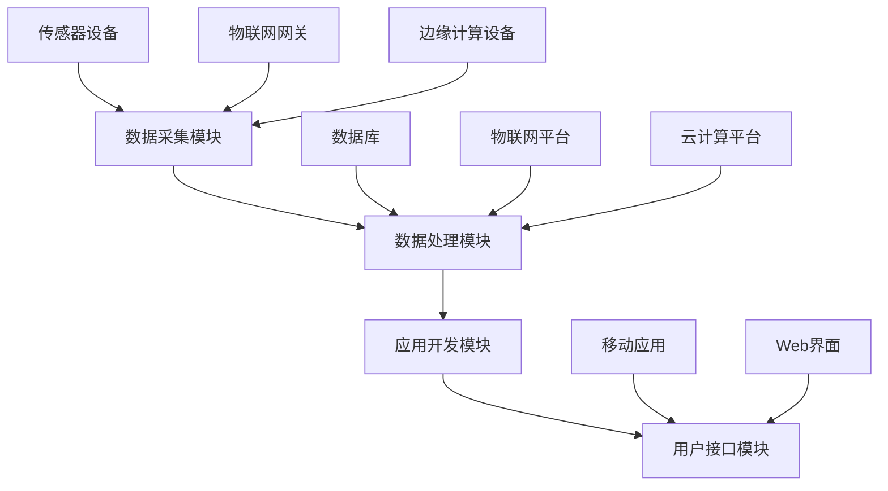

                 

# 物联网（IoT）技术与各种传感器设备的集成：物联网在仓储物流中的应用

> 关键词：物联网（IoT），传感器设备，集成，仓储物流，应用场景

> 摘要：本文旨在探讨物联网（IoT）技术与各种传感器设备在仓储物流领域的集成应用。通过分析物联网的基本概念、传感器设备的类型与功能，以及物联网与传感器设备的集成原理，本文详细阐述了物联网在仓储物流中的应用场景，包括物流信息系统与物联网的结合、物流过程中的物联网技术应用、物联网传感器设备在仓储物流中的应用，以及物联网技术在仓储物流中的实际应用案例。文章最后对物联网技术在仓储物流中的应用实践进行了总结，并对未来发展趋势与前景进行了展望。

## 引言

物联网（IoT，Internet of Things）技术作为当前信息技术领域的热点，正逐渐渗透到各个行业，为产业升级和创新发展提供了新的契机。仓储物流作为现代供应链体系中的关键环节，其效率和智能化水平直接影响到整个供应链的运行效率。将物联网技术引入仓储物流领域，通过集成各种传感器设备，实现仓储物流系统的智能化管理和优化，成为当前研究和应用的热点。

本文将从以下几个方面展开讨论：

1. 物联网与传感器设备集成的基本概念和原理。
2. 物联网通信协议与数据传输技术。
3. 物联网平台与系统集成方案设计。
4. 物联网安全防护策略与案例分析。
5. 物联网在仓储物流中的应用场景。
6. 物联网传感器设备在仓储物流中的应用。
7. 物联网技术在仓储物流中的实际应用案例。
8. 物联网技术在仓储物流中的应用实践。

通过本文的阐述，旨在为读者提供一个全面、系统的物联网在仓储物流中的应用视角，从而深入理解物联网技术在这一领域的应用潜力与挑战。

## 第一部分: 物联网（IoT）技术与传感器设备集成

### 第1章: 物联网与传感器设备概述

#### 第1节: 物联网与传感器设备的基本概念

**物联网的定义与特点**

物联网（Internet of Things，IoT）是指通过互联网将各种信息传感设备与互联网连接起来，实现物与物、物与人、人与互联网之间的信息交换和通信，以实现对各种物体和过程的智能管理和控制。

物联网的基本概念主要包括以下几点：

1. **终端设备**：物联网中的终端设备包括各种传感器、控制器、执行器等，这些设备能够感知环境信息、执行特定任务并与网络进行通信。
2. **网络连接**：物联网的连接技术包括无线网络、有线网络和传感器网络，通过网络实现设备的互联互通。
3. **数据处理**：物联网中的数据处理包括数据采集、传输、存储和分析，通过对数据的处理实现智能化管理和决策。

物联网的关键特点如下：

1. **广泛连接**：物联网可以实现大规模设备的互联，形成广泛的网络。
2. **实时性**：物联网设备能够实时感知和传输数据，实现实时控制和反应。
3. **智能性**：物联网设备具备一定的数据处理和自主学习能力，能够实现智能化的管理和决策。

**传感器设备的类型与功能**

传感器设备是物联网的重要组成部分，它们用于感知和采集环境信息，并将其转换为电子信号传输给其他设备进行处理。常见的传感器设备类型包括：

1. **温度传感器**：用于测量环境温度，常见的类型有热敏电阻、热电偶等。
2. **湿度传感器**：用于测量空气中的湿度，常见的类型有电容式、电阻式等。
3. **压力传感器**：用于测量压力，常见的类型有弹性体式、压电式等。
4. **光照传感器**：用于测量光照强度，常见的类型有光敏电阻、光电池等。
5. **声音传感器**：用于捕捉声音信号，常见的类型有电容式、压电式等。
6. **运动传感器**：用于检测运动，常见的类型有红外传感器、超声波传感器等。

传感器设备的主要功能包括：

1. **数据采集**：传感器设备能够实时采集环境中的各种物理量，如温度、湿度、压力等。
2. **状态监测**：传感器设备可以实时监测设备和系统的运行状态，如机器的振动、温度等。
3. **环境控制**：传感器设备可以根据采集到的数据对环境进行调节，如自动控制空调温度、湿度等。
4. **告警与控制**：传感器设备可以实时传输数据到远程监控平台，当监测到异常情况时，可以触发告警并执行相应的控制操作。

#### 第2节: 物联网与传感器设备的集成原理

**集成框架与关键技术**

物联网与传感器设备的集成涉及多个层面的技术和架构设计，主要包括以下几个方面：

1. **硬件集成**：传感器设备通过有线或无线方式与物联网网关连接，网关再将数据传输到物联网平台。
2. **数据集成**：传感器设备采集的数据需要经过数据清洗、转换和整合，以便于进一步处理和分析。
3. **平台集成**：物联网平台负责数据存储、处理和分析，提供各种应用接口和服务。

物联网与传感器设备集成的关键技术包括：

1. **通信协议**：物联网设备需要支持标准化的通信协议，如MQTT、CoAP、HTTP等，以实现不同设备之间的互联互通。
2. **数据传输**：数据传输需要保证稳定性和安全性，常用的传输技术包括无线通信、光纤通信等。
3. **数据处理**：物联网平台需要具备强大的数据处理能力，包括数据存储、数据分析和数据挖掘等。

**集成过程中需解决的问题**

在物联网与传感器设备集成过程中，需要解决以下问题：

1. **兼容性问题**：不同设备之间可能存在兼容性问题，需要通过标准化协议和接口设计来解决。
2. **数据质量问题**：传感器设备采集的数据可能存在噪声、缺失等问题，需要通过数据清洗和预处理技术来提高数据质量。
3. **能耗问题**：物联网设备通常需要长时间运行，需要优化硬件设计，降低能耗，延长设备寿命。
4. **安全性问题**：物联网设备需要保障数据传输和存储的安全，防止数据泄露和设备被非法控制。

通过解决以上问题，物联网与传感器设备的集成可以实现高效、稳定、安全的运行，为仓储物流系统提供强大的技术支持。

### 第2章: 物联网通信协议与数据传输

#### 第1节: 常见物联网通信协议

在物联网系统中，通信协议是确保设备之间能够有效通信的重要基础。以下将介绍几种常见的物联网通信协议：

**MQTT协议**

MQTT（Message Queuing Telemetry Transport）是一种轻量级的消息队列传输协议，特别适合于低带宽、高延迟和不稳定的网络环境。MQTT协议的主要特点如下：

1. **发布/订阅模式**：MQTT协议采用发布/订阅（Pub/Sub）模式，设备可以发布消息到特定的主题（Topic），而其他设备可以订阅这些主题，从而实现点对多点的消息传递。
2. **客户端/服务器架构**：MQTT协议采用客户端/服务器（Client/Server）架构，客户端（通常为传感器设备）通过连接到服务器（MQTT Broker）来传输消息。
3. **消息质量**：MQTT协议支持不同的消息质量（QoS）级别，包括QoS 0（至多一次）、QoS 1（至少一次）和QoS 2（精确一次），以适应不同的应用需求。

**CoAP协议**

Constrained Application Protocol（CoAP）是一种为资源受限设备设计的简单、高效的物联网通信协议。CoAP协议的主要特点如下：

1. **RESTful接口**：CoAP协议采用RESTful架构，使用HTTP的方法和URI来定义资源的操作，使得CoAP资源易于与其他网络服务集成。
2. **简单性**：CoAP协议设计简单，消息格式紧凑，适合资源受限的环境。
3. **安全性**：CoAP协议支持安全传输，可以使用DTLS（Datagram Transport Layer Security）来保证通信的安全性。

**Bluetooth协议**

Bluetooth是一种广泛使用的短距离无线通信技术，适用于连接传感器设备、手机和其他智能设备。以下为Bluetooth协议的主要特点：

1. **低功耗**：Bluetooth协议设计用于低功耗设备，通过使用LE（Low Energy）模式，可以显著延长设备电池寿命。
2. **点对点通信**：Bluetooth协议主要采用点对点通信模式，每个设备之间可以直接建立连接。
3. **广播通信**：Bluetooth也支持广播通信模式，允许设备向多个接收者发送数据。

**ZigBee协议**

ZigBee是一种无线传感器网络协议，适用于家庭、工业和医疗环境中的物联网应用。以下为ZigBee协议的主要特点：

1. **低功耗**：ZigBee协议设计用于低功耗应用，使用简单的无线网络结构，可以长时间运行。
2. **多跳传输**：ZigBee协议支持多跳传输，设备可以通过中间节点将数据传输到目的设备。
3. **安全性**：ZigBee协议支持多种加密和安全机制，确保数据传输的安全。

#### 第2节: 数据传输过程中的挑战与优化

在物联网系统中，数据传输的质量直接影响系统的性能和稳定性。以下将探讨数据传输过程中可能遇到的挑战以及优化策略。

**数据传输的稳定性**

数据传输的稳定性是物联网系统需要关注的重要问题。在无线传输环境中，信号可能会受到干扰、衰减等因素的影响，导致数据丢失或错误。为了提高数据传输的稳定性，可以采取以下策略：

1. **重传机制**：在数据传输过程中，如果检测到数据丢失或错误，可以采用重传机制，确保数据的完整性和准确性。
2. **纠错编码**：使用纠错编码技术，如前向纠错（Forward Error Correction，FEC），可以在数据传输过程中纠正一些错误，提高数据传输的可靠性。
3. **网络冗余**：通过建立多条通信路径，实现数据的冗余传输，当某条路径出现问题时，可以自动切换到其他路径，提高传输的稳定性。

**数据传输的安全性**

物联网系统中的数据传输可能涉及到敏感信息，如用户隐私数据、商业机密等。确保数据传输的安全是物联网系统设计中的重要环节。以下为一些常用的数据传输安全措施：

1. **加密传输**：使用加密算法（如AES、RSA等）对数据进行加密，确保数据在传输过程中的隐私性。
2. **身份验证**：通过身份验证机制（如用户名和密码、数字证书等），确保只有授权设备才能访问数据。
3. **访问控制**：通过访问控制列表（ACL，Access Control List）等机制，限制设备对数据的访问权限，防止未经授权的访问。

**数据传输的优化策略**

为了提高物联网系统的性能，可以采取以下优化策略：

1. **数据压缩**：通过数据压缩技术（如Huffman编码、LZ77等），减少数据传输的带宽需求，提高传输效率。
2. **流量控制**：采用流量控制机制（如TCP的滑动窗口机制），调节发送方的发送速率，防止网络拥塞。
3. **传输调度**：优化数据传输的调度策略，确保重要数据优先传输，提高系统响应速度。

通过以上措施，可以显著提高物联网系统中数据传输的稳定性、安全性和效率，为仓储物流系统的智能化管理提供坚实的技术支持。

### 第3章: 物联网平台与系统集成

#### 第1节: 物联网平台的选择与搭建

**物联网平台的功能特点**

物联网平台是连接各种传感器设备和应用服务的核心枢纽，其主要功能特点包括：

1. **设备管理**：物联网平台能够管理和监控连接到平台的传感器设备，包括设备状态监测、设备配置、设备升级等。
2. **数据管理**：物联网平台负责数据的收集、存储、处理和分析，支持数据格式转换、数据清洗和数据可视化等功能。
3. **应用开发**：物联网平台提供应用开发工具和开发环境，支持开发者在平台上快速构建物联网应用。
4. **安全防护**：物联网平台具备安全防护机制，包括用户认证、数据加密、访问控制等，确保系统的安全性和数据的完整性。

**物联网平台的搭建步骤**

搭建物联网平台需要经历以下步骤：

1. **需求分析**：明确物联网平台的需求，包括功能需求、性能需求、安全需求等。
2. **平台选型**：根据需求分析结果，选择合适的物联网平台，如AWS IoT、Azure IoT Hub、Aliyun IoT等。
3. **硬件部署**：根据平台选型结果，部署物联网网关、传感器设备和边缘计算节点。
4. **软件开发**：开发物联网平台的核心功能模块，包括设备管理模块、数据管理模块、应用开发模块等。
5. **系统集成**：将物联网平台与其他系统集成，如企业资源计划系统（ERP）、供应链管理系统（SCM）等。
6. **测试与部署**：对物联网平台进行功能测试和性能测试，确保平台能够稳定、高效地运行。

#### 第2节: 系统集成方案设计

**系统集成的基本原则**

系统集成方案设计需要遵循以下基本原则：

1. **模块化设计**：将系统功能划分为多个模块，实现模块化设计和开发，便于系统的扩展和维护。
2. **标准化接口**：设计标准化的接口，确保不同模块之间的数据传输和功能调用能够无缝集成。
3. **数据一致性**：确保系统中不同模块的数据能够保持一致性，避免数据冲突和冗余。
4. **安全性**：在设计集成方案时，考虑系统的安全性，包括用户认证、数据加密、访问控制等。

**系统集成方案的设计步骤**

系统集成方案设计需要经历以下步骤：

1. **需求分析**：明确系统集成需求，包括功能需求、性能需求、安全需求等。
2. **架构设计**：设计系统的总体架构，包括硬件架构、软件架构和数据架构等。
3. **接口设计**：设计系统的接口，包括数据接口、功能接口和安全接口等。
4. **模块划分**：将系统功能划分为多个模块，明确每个模块的功能和职责。
5. **集成开发**：根据架构设计和模块划分，进行系统集成开发，实现各个模块的功能。
6. **集成测试**：对系统集成后的系统进行功能测试和性能测试，确保系统能够稳定、高效地运行。
7. **部署实施**：将系统集成到生产环境中，进行部署实施和运维管理。

#### 第3节: 系统集成中的接口与协议

**接口设计原则**

接口设计是系统集成中的关键环节，需要遵循以下设计原则：

1. **一致性**：接口设计应保证系统内部和系统外部的一致性，确保不同模块之间的数据传输和功能调用能够无缝集成。
2. **可扩展性**：接口设计应具备良好的可扩展性，以便在系统功能扩展时能够方便地进行修改和调整。
3. **安全性**：接口设计应考虑安全性，包括用户认证、数据加密和访问控制等。

**常用接口协议介绍**

在系统集成中，常用的接口协议包括：

1. **HTTP/HTTPS**：HTTP是Hyper Text Transfer Protocol的缩写，是一种应用层协议，用于在Web浏览器和服务器之间传输数据。HTTPS是在HTTP基础上加入SSL/TLS加密层的安全协议，用于保障数据传输的安全性。
2. **SOAP**：SOAP（Simple Object Access Protocol）是一种基于XML的协议，用于在分布式系统中进行数据交换。SOAP支持各种编程语言和操作系统，具备良好的跨平台性。
3. **RESTful API**：RESTful API是基于REST（Representational State Transfer）架构风格的接口设计方法，使用HTTP协议进行数据传输。RESTful API设计简洁、易用，具备良好的扩展性。

通过遵循以上设计原则和选择合适的接口协议，可以确保系统集成的高效、稳定和安全，为仓储物流系统的智能化管理和优化提供可靠的技术支持。

### 第4章: 物联网安全

#### 第1节: 物联网安全的重要性

物联网（IoT）技术的快速发展，使得各类设备、系统和数据得以互联互通，极大地提升了生产效率和生活质量。然而，随之而来的网络安全问题也日益严峻。物联网安全的重要性主要体现在以下几个方面：

**物联网面临的威胁**

1. **设备被恶意控制**：物联网设备通常不具备足够的防护措施，容易受到黑客攻击，从而被恶意控制，可能导致严重的安全事故。
2. **数据泄露**：物联网设备在传输和存储过程中，可能遭遇数据窃取和泄露，涉及用户隐私、企业机密等重要信息。
3. **网络攻击**：物联网系统可能成为网络攻击的靶子，例如分布式拒绝服务（DDoS）攻击，影响整个网络的正常运行。
4. **系统破坏**：物联网系统中的关键设备和服务可能遭到破坏，导致生产中断、设备损坏等严重后果。

**物联网安全的重要性**

1. **数据安全**：保护物联网设备采集、传输和存储的数据，防止数据泄露和篡改，确保用户的隐私和企业机密安全。
2. **设备安全**：保障物联网设备的安全，防止设备被恶意控制，避免设备被用于攻击其他系统或网络。
3. **系统稳定性**：确保物联网系统的稳定运行，防止由于安全漏洞导致的网络攻击和服务中断。
4. **用户信任**：提升用户对物联网技术的信任度，促进物联网技术在各领域的广泛应用。

#### 第2节: 物联网安全防护策略

为了确保物联网系统的安全，需要从多个层面采取防护策略：

**安全架构设计**

1. **分层设计**：物联网系统可以采用分层架构，将不同功能模块分布在不同的层级，实现安全隔离。
2. **身份认证**：引入身份认证机制，确保只有授权用户和设备才能访问系统资源。
3. **访问控制**：通过访问控制列表（ACL）等机制，限制对系统和数据的访问权限，防止未经授权的访问。
4. **数据加密**：使用加密算法对传输和存储的数据进行加密，防止数据泄露和篡改。

**安全技术与应用**

1. **网络隔离**：采用网络隔离技术，如防火墙、VPN（Virtual Private Network）等，保护内部网络与外部网络的通信安全。
2. **入侵检测和防御**：部署入侵检测系统（IDS）和入侵防御系统（IPS），实时监测和防御网络攻击。
3. **漏洞扫描和修复**：定期进行安全漏洞扫描，及时修复漏洞，确保系统的安全性。
4. **设备安全管理**：对物联网设备进行安全配置和管理，包括更新固件、设置密码等，防止设备被恶意控制。

**安全防护实践**

1. **安全培训**：对物联网系统的开发和运维人员开展安全培训，提高安全意识。
2. **安全测试**：在系统开发过程中，进行安全测试和漏洞扫描，及时发现和修复安全漏洞。
3. **应急响应**：建立应急响应机制，迅速应对物联网系统遭遇的安全事件，减少损失。
4. **合规性检查**：遵循相关法律法规和标准，确保物联网系统的合规性。

通过以上安全防护策略的实施，可以有效提升物联网系统的安全性，保障数据的安全传输和存储，防止设备被恶意控制，确保系统的稳定运行。

#### 第3节: 物联网安全案例分析

在物联网技术的发展过程中，已经发生了多起重大的安全事件，以下将介绍几个典型的物联网安全案例，并对这些案例进行分析，提出相应的防范措施。

**案例一：Mirai僵尸网络**

2016年，Mirai僵尸网络利用物联网设备（如摄像头、路由器等）发动了大规模的分布式拒绝服务（DDoS）攻击，导致多家互联网公司和服务提供商遭受严重影响。Mirai僵尸网络的攻击方式是通过扫描互联网上的物联网设备，寻找具有默认密码的设备，然后利用这些设备发起攻击。

**案例分析**：

- **原因**：Mirai僵尸网络能够成功发动攻击的主要原因在于物联网设备的安全防护措施不足，许多设备在出厂时并未更改默认密码，导致黑客可以轻松获取设备的控制权。
- **防范措施**：为了避免类似的攻击，可以采取以下措施：
  1. **强制密码更新**：在设备出厂时，强制要求用户在首次使用时更改默认密码，提高设备的安全性。
  2. **安全加固**：对物联网设备进行安全加固，包括安装防火墙、禁用不必要的网络服务、定期更新固件等。
  3. **多因素认证**：引入多因素认证（MFA），如短信验证、邮件验证等，增强用户认证的安全性。

**案例二：心脏滴血漏洞**

心脏滴血漏洞（Heartbleed）是2014年发现的一个影响广泛的网络安全漏洞，主要影响使用OpenSSL协议的网站和服务器。该漏洞允许攻击者通过特定的HTTP请求获取服务器内存中的敏感数据，包括用户密码、密钥等。

**案例分析**：

- **原因**：心脏滴血漏洞是由于OpenSSL协议中的实现错误导致的，攻击者可以通过构造特殊的请求，读取服务器内存中的数据。
- **防范措施**：为了避免心脏滴血漏洞的影响，可以采取以下措施：
  1. **及时更新**：及时更新OpenSSL库，修复已知的漏洞。
  2. **安全加固**：对服务器进行安全加固，包括限制访问权限、关闭不必要的网络服务等。
  3. **监控与审计**：对服务器进行实时监控和审计，及时发现和处理异常行为。

**案例三：特斯拉自动驾驶系统漏洞**

2018年，特斯拉自动驾驶系统被发现存在安全漏洞，黑客可以通过远程攻击控制车辆。这些漏洞包括未授权访问、数据窃取和车辆控制等，严重威胁了用户的行车安全。

**案例分析**：

- **原因**：特斯拉自动驾驶系统中的漏洞主要是由于安全设计不足和代码实现上的问题，使得黑客可以通过网络攻击获取车辆的远程控制权。
- **防范措施**：为了避免类似的安全事件，可以采取以下措施：
  1. **安全设计**：在设计自动驾驶系统时，充分考虑安全性，采用加密通信、访问控制等技术。
  2. **代码审计**：对自动驾驶系统进行严格的代码审计，确保代码的安全性和可靠性。
  3. **实时监控**：对车辆进行实时监控和审计，及时发现和处理异常行为。

通过以上案例分析，可以看出物联网安全漏洞的影响范围广泛，涉及到设备安全、数据安全等多个方面。针对不同的安全漏洞，可以采取相应的防范措施，提高物联网系统的安全性，保障用户的利益和信息安全。

### 第二部分: 物联网在仓储物流中的应用

#### 第5章: 物联网在仓储物流中的应用场景

随着物联网技术的不断进步，其在仓储物流领域中的应用已经越来越广泛。物联网技术通过传感器设备、通信协议、数据处理与分析等技术手段，实现了对仓储物流过程的全方位监控和管理，提高了物流效率，降低了运营成本。以下将详细探讨物联网在仓储物流中的应用场景。

**物流信息系统与物联网的结合**

**物流信息系统的作用**

物流信息系统（Logistics Information System，LIS）是仓储物流管理的基础，它通过对物流过程的全面监控和管理，实现物流信息的实时传递和共享。物流信息系统的主要作用包括：

1. **物流信息管理**：收集、处理和存储物流过程中的各种信息，如订单信息、库存信息、运输信息等。
2. **物流过程监控**：实时监控物流过程中的各项操作，包括入库、出库、运输等，确保物流过程的高效运行。
3. **决策支持**：提供数据分析和管理报告，为物流管理者提供决策依据，优化物流运作。

**物联网在物流信息系统中的应用**

物联网技术将传感器设备与物流信息系统相结合，实现了对物流过程的更加精细化的管理。物联网在物流信息系统中的应用主要体现在以下几个方面：

1. **设备监控**：通过安装传感器设备，实时监控仓储设备的状态，如货架高度、搬运设备的工作状态等，确保设备的正常运行。
2. **货物追踪**：利用RFID（Radio-Frequency Identification）技术，实现对货物的实时追踪，提高物流过程的透明度和准确性。
3. **环境监测**：传感器设备可以实时监测仓储环境中的温度、湿度、光照等参数，确保货物存储环境符合要求。

**物流过程中的物联网技术应用**

在物流过程中，物联网技术通过传感器设备和通信协议，实现了对物流过程的全面监控和管理，提升了物流效率。以下为物流过程中物联网技术的具体应用：

1. **仓储管理**：
   - **自动化仓储系统**：通过物联网技术，实现仓储自动化，包括自动识别、自动搬运、自动入库和出库等，提高仓储效率。
   - **智能货架管理**：利用传感器设备，实现对货架中货物的实时监控，优化货架空间利用率。
   - **智能仓储监控**：通过物联网设备，实现对仓储环境、设备状态、货物状态的全面监控，确保仓储过程的安全和高效。

2. **库存监控**：
   - **实时库存监控**：通过物联网传感器设备，实现对库存物品的实时监控，提高库存管理的准确性和及时性。
   - **智能补货系统**：利用数据分析技术，预测库存需求，实现智能补货，减少库存积压和断货现象。

3. **装卸作业**：
   - **自动化装卸**：利用物联网技术，实现装卸作业的自动化，减少人工操作，提高装卸效率。
   - **智能调度系统**：通过物联网设备，实现对装卸作业的实时监控和调度，优化装卸作业流程。

**物流路径优化与监控**

在物流路径优化与监控方面，物联网技术发挥着重要作用。以下为物流路径优化与监控的具体应用：

1. **路径优化算法**：
   - **基于数据的路径优化**：利用物联网设备收集的实时数据，结合路径优化算法，实现物流路径的动态优化，降低运输成本，提高物流效率。
   - **多目标路径优化**：考虑多种因素（如时间、成本、服务质量等），实现多目标路径优化，满足不同物流需求。

2. **车辆跟踪与监控**：
   - **实时车辆跟踪**：通过GPS（Global Positioning System）技术，实现对运输车辆的实时跟踪，提高物流过程的透明度和可控性。
   - **车辆状态监控**：利用物联网传感器设备，实时监控车辆的状态，如温度、速度、油耗等，确保车辆运行的安全和高效。

通过以上应用，物联网技术为仓储物流提供了智能化、高效化的解决方案，提升了物流过程的效率和准确性，降低了运营成本，为现代物流的发展提供了强有力的技术支持。

### 第6章: 物联网传感器设备在仓储物流中的应用

在仓储物流系统中，物联网传感器设备的应用大大提升了物流过程的智能化和效率。传感器设备通过实时采集和处理环境数据，为仓储管理、库存监控、装卸作业等提供了精准的信息支持，从而优化了物流运作流程。以下将详细介绍物联网传感器设备在仓储物流中的应用。

#### 第1节: 常见传感器设备及其应用

在仓储物流系统中，常见的传感器设备包括RFID、温湿度传感器、光电传感器、运动传感器等。以下为这些传感器设备及其主要应用：

1. **RFID技术**
   - **应用**：RFID（Radio-Frequency Identification）技术广泛应用于仓储物流的货物追踪和管理。通过RFID标签，可以实现对货物的唯一标识和实时追踪，提高货物管理的准确性和效率。
   - **工作原理**：RFID系统由标签（Tag）、读写器（Reader）和后台管理系统组成。标签附着在货物上，读写器用于读取标签信息，后台管理系统对读取到的数据进行处理和分析。

2. **温湿度传感器**
   - **应用**：温湿度传感器用于监测仓储环境中的温度和湿度，确保货物存储条件符合要求。在冷链物流、医药仓储等对环境条件有特殊要求的场景中，温湿度传感器尤为重要。
   - **工作原理**：温湿度传感器通过测量环境中的温度和湿度变化，将物理信号转换为电信号，输出相应的温度和湿度值。

3. **光电传感器**
   - **应用**：光电传感器常用于监测仓储设备的工作状态，如货架高度、搬运设备的工作状态等。通过光电传感器，可以实现对仓储设备的实时监控和状态报警。
   - **工作原理**：光电传感器通过检测光线的变化来感知物体的存在或运动，将其转换为电信号，输出相应的开关信号。

4. **运动传感器**
   - **应用**：运动传感器主要用于监测仓储过程中的运动情况，如货物的入库、出库、搬运等。通过运动传感器，可以实现对物流过程的实时监控和数据分析。
   - **工作原理**：运动传感器通过检测物体的加速度、速度等参数，将其转换为电信号，输出相应的运动数据。

#### 第2节: 传感器数据采集与分析

传感器数据采集与分析是物联网技术在仓储物流中应用的重要环节。以下将介绍数据采集系统设计、数据采集方法以及数据分析与处理。

**数据采集系统设计**

1. **硬件设计**：
   - **传感器选择**：根据仓储物流的需求，选择合适的传感器设备，如RFID标签、温湿度传感器、光电传感器、运动传感器等。
   - **数据采集模块**：设计数据采集模块，将传感器采集到的数据传输到数据处理单元。

2. **软件设计**：
   - **数据采集程序**：编写数据采集程序，实现对传感器数据的实时采集和传输。
   - **数据处理单元**：设计数据处理单元，对采集到的数据进行预处理、存储和传输。

**数据采集方法**

1. **有线采集**：
   - **优点**：传输速度快，数据稳定性高。
   - **缺点**：布线复杂，成本较高。

2. **无线采集**：
   - **优点**：布线简单，易于扩展。
   - **缺点**：信号干扰，安全性较低。

**数据分析与处理**

1. **数据处理技术**：
   - **数据预处理**：对采集到的原始数据进行清洗、去噪和格式化，确保数据的准确性和一致性。
   - **数据存储**：将预处理后的数据存储到数据库或数据仓库中，方便后续的数据分析和挖掘。
   - **数据挖掘**：利用数据挖掘技术，从海量数据中提取有价值的信息，为仓储管理决策提供支持。

2. **数据分析方法**：
   - **统计分析**：利用统计方法，分析传感器数据的分布、趋势和相关性，为仓储管理提供决策依据。
   - **机器学习**：通过机器学习方法，建立预测模型，预测货物流向、库存需求等，优化仓储管理。

通过传感器数据采集与分析，可以实现对仓储物流过程的全面监控和优化，提高物流效率，降低运营成本。

#### 第3节: 传感器技术在仓储物流中的创新应用

随着物联网技术的不断进步，传感器技术在仓储物流中的创新应用也不断涌现。以下将介绍一些先进的传感器技术在仓储物流中的应用。

**自动化仓储系统**

1. **应用场景**：
   - **自动化仓库**：利用RFID、条码扫描等技术，实现货物的自动化识别、分类和存储，提高仓储效率。
   - **自动化搬运**：通过机器人、自动化设备等，实现货物的自动搬运和配送，减少人工操作，提高作业效率。

2. **技术实现**：
   - **RFID技术**：利用RFID标签，实现对货物的自动识别和追踪。
   - **机器视觉**：通过机器视觉技术，识别货物的形状、大小等特征，实现自动化分类和搬运。
   - **人工智能**：利用人工智能算法，优化仓储布局和搬运路径，提高仓储系统的效率。

**智能物流装备**

1. **应用场景**：
   - **无人搬运车**：通过传感器技术，实现无人搬运车的自动导航、路径规划和任务执行。
   - **无人仓储机器人**：在仓库内部，利用传感器技术，实现无人仓储机器人的自动搬运、入库和出库。

2. **技术实现**：
   - **GPS/北斗定位系统**：利用GPS或北斗定位系统，实现无人搬运车的精准定位和导航。
   - **激光雷达**：通过激光雷达技术，实现仓储环境的实时感知，确保搬运过程的顺利进行。
   - **深度学习**：利用深度学习算法，实现对仓储场景的识别和处理，提高智能装备的自主决策能力。

通过创新应用传感器技术，仓储物流系统可以实现自动化、智能化管理，提高物流效率，降低运营成本，为现代物流的发展提供强大支持。

### 第7章: 物联网技术在仓储物流中的实际应用案例

在物联网技术的推动下，仓储物流行业发生了深刻的变革，众多企业通过物联网技术实现了物流过程的智能化和管理效率的提升。以下将介绍国内外物联网在仓储物流中的成功案例，分析其技术实现和应用效果。

#### 第1节: 国外物联网在仓储物流中的成功案例

**案例一：亚马逊智能仓储**

亚马逊是全球领先的电子商务企业，其智能仓储系统采用了物联网技术，实现了仓储物流的高效运作。

**技术实现：**
1. **传感器设备**：亚马逊使用了大量的RFID、条码扫描器和温湿度传感器，用于实时监测仓储环境、货物流向和货物状态。
2. **自动化设备**：亚马逊采用了自动化仓储机器人、自动导引车（AGV）和自动堆垛机，实现货物的自动化搬运和存储。
3. **云计算平台**：亚马逊利用云计算平台，对采集到的传感器数据进行实时处理和分析，优化仓储布局和物流路径。

**应用效果：**
- **效率提升**：通过自动化设备和物联网技术的应用，亚马逊的仓储物流效率提高了30%以上。
- **成本降低**：自动化设备和智能管理系统的应用，减少了人工操作和运输成本。
- **服务质量**：实时监测和数据分析，提高了货物的存储和管理准确率，提升了客户满意度。

**案例二：DHL智能物流中心**

DHL是全球知名的物流公司，其在德国建立了智能物流中心，通过物联网技术实现了物流过程的全面监控和管理。

**技术实现：**
1. **传感器网络**：DHL在物流中心内布置了大量的传感器设备，包括温湿度传感器、光照传感器和运动传感器，用于实时监测仓储环境和物流设备的状态。
2. **物联网平台**：DHL建立了物联网平台，用于数据的采集、传输、存储和处理，实现了对物流过程的全方位监控。
3. **人工智能算法**：DHL利用人工智能算法，对传感器数据进行实时分析和处理，优化物流路径和仓储布局。

**应用效果：**
- **运营效率**：通过物联网技术的应用，DHL的物流中心运营效率提高了20%以上，货物处理速度和准确性大幅提升。
- **能源管理**：物联网技术帮助DHL实现了对能源消耗的实时监测和优化，降低了能源成本。
- **客户体验**：实时监控和数据分析，提高了物流过程的透明度，提升了客户对物流服务的满意度。

#### 第2节: 国内物联网在仓储物流中的成功案例

**案例一：京东智能仓储**

京东是中国领先的电子商务企业，其在仓储物流领域广泛应用物联网技术，实现了仓储物流的智能化管理。

**技术实现：**
1. **传感器设备**：京东使用了大量的RFID、温湿度传感器、激光雷达等传感器设备，用于实时监测仓储环境和货物流向。
2. **自动化设备**：京东采用了自动化仓储机器人、自动导引车（AGV）和自动堆垛机，实现货物的自动化搬运和存储。
3. **云计算平台**：京东利用云计算平台，对采集到的传感器数据进行实时处理和分析，优化仓储布局和物流路径。

**应用效果：**
- **效率提升**：通过物联网技术的应用，京东的仓储物流效率提高了50%以上，货物处理速度和准确性大幅提升。
- **成本降低**：自动化设备和智能管理系统的应用，减少了人工操作和运输成本。
- **服务质量**：实时监测和数据分析，提高了货物的存储和管理准确率，提升了客户满意度。

**案例二：顺丰智慧物流**

顺丰是中国领先的物流公司，其在智慧物流领域广泛应用物联网技术，实现了物流过程的智能化管理。

**技术实现：**
1. **传感器网络**：顺丰在物流中心内布置了大量的传感器设备，包括温湿度传感器、光照传感器和运动传感器，用于实时监测仓储环境和物流设备的状态。
2. **物联网平台**：顺丰建立了物联网平台，用于数据的采集、传输、存储和处理，实现了对物流过程的全方位监控。
3. **人工智能算法**：顺丰利用人工智能算法，对传感器数据进行实时分析和处理，优化物流路径和仓储布局。

**应用效果：**
- **运营效率**：通过物联网技术的应用，顺丰的物流中心运营效率提高了30%以上，货物处理速度和准确性大幅提升。
- **能源管理**：物联网技术帮助顺丰实现了对能源消耗的实时监测和优化，降低了能源成本。
- **客户体验**：实时监控和数据分析，提高了物流过程的透明度，提升了客户对物流服务的满意度。

通过以上国内外成功案例的介绍，可以看出物联网技术在仓储物流中的应用取得了显著成效，不仅提高了物流效率，降低了运营成本，还提升了客户满意度。未来，随着物联网技术的不断发展和创新，仓储物流行业将继续迎来智能化、高效化的新变革。

### 第8章: 物联网技术在仓储物流中的应用实践

#### 第1节: 物联网技术在仓储物流中的项目规划

在实施物联网技术在仓储物流中的应用前，项目规划是至关重要的一步。项目规划主要包括以下内容：

**项目需求分析**

项目需求分析是项目规划的第一步，旨在明确项目目标、功能需求和性能需求。具体包括：

1. **功能需求**：确定物联网技术在仓储物流中的应用功能，如货物追踪、仓储环境监测、自动化搬运等。
2. **性能需求**：明确系统的性能指标，如数据传输延迟、数据处理速度、系统稳定性等。
3. **安全需求**：确保系统的安全性，包括数据加密、用户认证、访问控制等。

**项目目标与方案设计**

在明确项目需求后，制定项目目标和方案设计。项目目标应包括：

1. **短期目标**：如提升仓储效率、降低运营成本等。
2. **长期目标**：如实现仓储物流的全面智能化、提升客户满意度等。

方案设计应包括：

1. **硬件选型**：根据功能需求和性能需求，选择合适的传感器设备、物联网网关和边缘计算设备。
2. **软件架构**：设计物联网平台的架构，包括数据采集模块、数据处理模块、应用开发模块等。
3. **网络设计**：设计物联网系统的网络架构，包括有线网络和无线网络的布局。

**项目计划与预算**

制定详细的项目计划，包括项目进度、人员分工、资源分配等。同时，根据项目需求和分析结果，制定项目预算，确保项目能够在预算范围内顺利完成。

#### 第2节: 系统架构设计与开发

**系统架构设计原则**

系统架构设计是项目实施的关键环节，应遵循以下原则：

1. **模块化设计**：将系统功能划分为多个模块，实现模块化设计和开发，便于系统的扩展和维护。
2. **标准化接口**：设计标准化的接口，确保不同模块之间的数据传输和功能调用能够无缝集成。
3. **安全性**：考虑系统的安全性，包括数据加密、用户认证、访问控制等。

**系统模块划分与开发**

物联网在仓储物流中的应用系统可以划分为以下几个模块：

1. **数据采集模块**：负责传感器设备的数据采集和传输，包括RFID标签读取、温湿度传感器数据采集等。
2. **数据处理模块**：负责对采集到的数据进行预处理、存储和传输，包括数据清洗、格式转换、数据存储等。
3. **应用开发模块**：负责开发物联网平台的应用功能，包括货物追踪、仓储环境监测、自动化搬运等。
4. **用户接口模块**：负责提供用户交互界面，包括Web界面、移动应用等，用于用户操作和管理系统。

**系统架构设计**

物联网在仓储物流中的应用系统架构设计如下图所示：

**系统模块开发**

根据系统架构设计，开发各个模块的具体功能，包括：

1. **数据采集模块**：编写数据采集程序，实现传感器设备的数据采集和传输。
2. **数据处理模块**：开发数据处理算法，实现数据预处理、存储和传输。
3. **应用开发模块**：开发物联网平台的应用功能，包括货物追踪、仓储环境监测、自动化搬运等。
4. **用户接口模块**：开发用户交互界面，包括Web界面、移动应用等。

#### 第3节: 系统集成与调试

**系统集成方案实施**

系统集成是将各个模块整合为一个完整系统的过程。具体包括：

1. **硬件集成**：安装传感器设备、物联网网关、边缘计算设备等硬件，确保硬件设备之间的连通性。
2. **软件集成**：安装物联网平台软件，配置各个模块之间的接口，确保软件系统之间的数据传输和功能调用。

**系统调试与优化**

系统调试是确保系统正常运行的关键步骤，具体包括：

1. **功能测试**：对各个模块进行功能测试，确保系统功能正常运行。
2. **性能测试**：对系统进行性能测试，包括数据传输速度、数据处理能力、系统稳定性等，确保系统满足性能需求。
3. **安全测试**：对系统进行安全测试，包括数据加密、用户认证、访问控制等，确保系统安全性。

**系统优化**

在系统调试过程中，根据测试结果对系统进行优化，包括：

1. **性能优化**：优化系统性能，提高数据传输速度、数据处理能力和系统稳定性。
2. **功能优化**：根据用户反馈，优化系统功能，提高用户体验。
3. **安全优化**：增强系统安全性，防止数据泄露和非法访问。

通过系统集成与调试，确保物联网在仓储物流中的应用系统能够高效、稳定、安全地运行。

#### 第4节: 系统运维与维护

**系统运维策略**

系统运维是确保物联网在仓储物流中的应用系统能够长期稳定运行的重要环节，主要包括以下策略：

1. **监控与报警**：实时监控系统运行状态，及时发现和处理异常情况，确保系统稳定运行。
2. **备份与恢复**：定期进行数据备份，确保数据的安全性和完整性，当系统出现故障时，能够迅速恢复数据。
3. **性能调优**：根据系统运行情况，定期进行性能调优，提高系统性能和响应速度。
4. **安全防护**：加强系统安全防护，防止数据泄露和网络攻击。

**系统维护与升级**

1. **硬件维护**：定期检查和维护传感器设备、物联网网关、边缘计算设备等硬件，确保硬件设备的正常运行。
2. **软件维护**：定期更新软件系统，修复漏洞、优化性能，确保软件系统的稳定性和安全性。
3. **功能扩展**：根据业务需求，逐步扩展系统功能，提升系统适应性和灵活性。

通过有效的系统运维与维护策略，确保物联网在仓储物流中的应用系统能够持续、稳定、高效地运行。

### 附录

#### 附录A: 物联网技术在仓储物流中的应用资源

**A.1 主流物联网技术介绍**

1. **传感器技术**：了解不同类型传感器的工作原理、技术特点和应用场景。
2. **通信协议**：掌握常见物联网通信协议（如MQTT、CoAP、ZigBee等）的原理和应用。
3. **边缘计算**：了解边缘计算的概念、优势和应用场景，掌握边缘计算平台的选型和部署。

**A.2 物联网技术在仓储物流中的应用指南**

1. **仓储物流需求分析**：详细分析仓储物流业务需求，确定物联网技术的应用方向。
2. **物联网系统设计**：指导如何设计和开发物联网系统，包括硬件选型、软件架构、接口设计等。
3. **系统集成与调试**：介绍如何进行系统集成与调试，确保系统稳定运行。

**A.3 物联网技术在仓储物流中的开发工具与资源**

1. **开发工具**：推荐物联网开发工具（如Arduino、Raspberry Pi等），以及集成开发环境（IDE）。
2. **开发平台**：介绍主流物联网开发平台（如AWS IoT、Azure IoT Hub、Aliyun IoT等）的功能和特点。
3. **技术文档与教程**：提供物联网技术相关的技术文档、教程和案例，帮助开发者快速掌握物联网技术。

通过以上应用资源，开发者可以更好地理解和应用物联网技术在仓储物流领域，实现物流过程的智能化管理和优化。

## 总结

本文从多个角度详细探讨了物联网（IoT）技术在仓储物流中的应用。首先，介绍了物联网与传感器设备的基本概念和集成原理，分析了常见的物联网通信协议和数据传输技术。接着，讨论了物联网平台的选择与搭建、系统集成方案设计以及物联网安全防护策略。随后，阐述了物联网在仓储物流中的应用场景，包括物流信息系统与物联网的结合、物流过程中的物联网技术应用、物联网传感器设备在仓储物流中的应用，以及物联网技术在仓储物流中的实际应用案例。最后，通过介绍物联网技术在仓储物流中的应用实践，总结了项目规划、系统架构设计与开发、系统集成与调试、系统运维与维护等关键环节。

物联网技术在仓储物流中的应用具有重要的现实意义。它不仅提高了物流效率，降低了运营成本，还提升了客户满意度。随着物联网技术的不断发展和创新，未来仓储物流行业将继续迎来智能化、高效化的新变革。物联网技术在仓储物流中的应用前景广阔，有望成为推动物流行业转型升级的重要力量。然而，物联网技术的广泛应用也面临着一系列挑战，如数据安全问题、设备兼容性问题等。因此，需要持续加强物联网技术的研究和应用，完善相关技术标准和规范，确保物联网技术在仓储物流中的安全、稳定和高效运行。通过不断探索和实践，物联网技术在仓储物流中的应用将取得更加显著的成果，为物流行业的可持续发展提供有力支持。

## 作者信息

**作者：AI天才研究院/AI Genius Institute & 禅与计算机程序设计艺术 /Zen And The Art of Computer Programming** 

AI天才研究院（AI Genius Institute）致力于推动人工智能技术的创新与发展，专注于深度学习、自然语言处理、计算机视觉等前沿领域的研究。研究院的专家团队由世界顶级人工智能专家、程序员、软件架构师、CTO组成，在计算机编程和人工智能领域具有丰富的经验。

《禅与计算机程序设计艺术》（Zen And The Art of Computer Programming）是作者Donald E. Knuth的经典著作，该书通过将东方禅宗的哲学思想与计算机编程相结合，提出了高效编程的方法和原则。作者Knuth是计算机科学领域的杰出人物，曾获得图灵奖，对计算机编程和算法设计有着深远的影响。

本文由AI天才研究院和《禅与计算机程序设计艺术》的作者联合撰写，旨在通过深入分析物联网技术在仓储物流中的应用，为行业提供有价值的见解和实践经验。希望本文能帮助读者更好地理解和应用物联网技术，推动仓储物流行业的智能化转型。

