                 

# 文章标题：物联网(IoT)技术和各种传感器设备的集成：物联网在智能家居的应用

## 文章关键词
- 物联网 (IoT)
- 智能家居
- 传感器设备
- 集成技术
- 应用场景
- 安全与隐私保护

## 文章摘要
本文深入探讨了物联网（IoT）技术在智能家居领域的应用，分析了物联网和智能家居的基本概念、技术构成及其在实际应用中的重要性。文章详细介绍了物联网技术的基础，包括网络协议、传感器技术、数据处理与分析技术等。随后，文章聚焦于传感器设备的集成与接口，以及物联网在智能家居中的具体应用场景。此外，文章还探讨了物联网安全与隐私保护的重要性，并给出了项目实战的详细案例。最后，文章总结了物联网智能家居的未来趋势与挑战，为读者提供了全面的物联网智能家居技术指南。

## 引言
随着科技的不断进步，物联网（IoT）技术逐渐成为现代生活的关键组成部分。物联网通过连接各种设备、传感器和系统，实现数据的实时传输和处理，为人们提供了更加智能、便捷的生活方式。其中，智能家居作为物联网的重要应用领域，正日益受到人们的关注。智能家居系统利用物联网技术，将家庭设备智能化，实现远程控制、自动化管理和智能化服务。本文将围绕物联网技术和传感器设备在智能家居中的应用进行深入探讨，分析其核心概念、技术基础、应用场景、安全与隐私保护，以及项目实战和未来趋势。

## 第1章：物联网与智能家居概述

### 1.1 物联网（IoT）的定义与历史发展
物联网（Internet of Things，简称IoT）是指通过互联网将各种物理设备、传感器、软件和应用连接起来，实现数据的采集、传输、处理和共享的一种技术。物联网的发展历程可以追溯到20世纪80年代，当时网络技术的兴起使得人们开始尝试将日常物品连接到互联网上。随着时间的推移，物联网技术不断发展，应用场景逐渐扩展。

#### 1.1.1 物联网的基本概念
物联网的基本概念包括以下几个方面：
1. 设备连接：通过互联网将各种设备连接起来，实现数据的传输和共享。
2. 传感器：用于收集环境数据，如温度、湿度、光线等。
3. 数据处理：通过云计算、大数据等技术对收集到的数据进行分析和处理。
4. 用户体验：通过智能终端和应用程序，为用户提供便捷的交互体验。

#### 1.1.2 物联网的发展历程
物联网的发展可以分为以下几个阶段：
1. 互联网阶段（1980s-1990s）：计算机和网络的普及为物联网的发展奠定了基础。
2. 互联网设备阶段（2000s）：智能家居、智能交通等应用场景逐渐出现。
3. 物联网平台阶段（2010s-2020s）：物联网平台的出现使得设备间的通信更加便捷，数据共享更加高效。
4. 智能化阶段（2020s-2030s）：随着人工智能、大数据等技术的发展，物联网将实现更加智能化和自动化。

### 1.2 智能家居的概念与重要性
智能家居是指通过物联网技术将家庭中的各种设备连接起来，实现远程控制、自动化管理和智能化服务的系统。智能家居的出现，极大地提高了人们的生活质量和便利性。

#### 1.2.1 智能家居的定义
智能家居的定义可以从以下几个方面来理解：
1. 家庭设备互联：通过物联网技术，将家庭中的各种设备（如灯具、空调、电视等）连接起来，实现数据的传输和共享。
2. 远程控制：用户可以通过智能终端（如手机、平板电脑等）远程控制家庭设备，实现远程管理和监控。
3. 自动化管理：智能家居系统可以根据用户习惯和环境变化，自动调整家庭设备的运行状态，提高能源利用效率。
4. 智能化服务：智能家居系统通过收集和分析用户数据，为用户提供个性化的服务和推荐。

#### 1.2.2 智能家居的组成部分
智能家居系统通常由以下几个部分组成：
1. 硬件设备：包括传感器、控制器、执行器等。
2. 软件系统：包括智能家居平台、应用程序等。
3. 数据中心：用于存储和处理用户数据。
4. 网络连接：通过互联网或其他通信网络实现设备间的数据传输。

#### 1.2.3 智能家居的优势与应用领域
智能家居的优势主要体现在以下几个方面：
1. 提高生活质量：通过自动化和智能化管理，为用户提供更加舒适、便捷的生活环境。
2. 提高能源利用效率：智能家居系统可以根据用户需求和实时环境变化，自动调整设备运行状态，降低能源消耗。
3. 增强家庭安全：智能家居系统可以实时监控家庭环境，及时发现异常情况，提高家庭安全。
4. 改善家庭环境：智能家居系统可以通过空气净化、温湿度控制等功能，改善家庭环境。

智能家居的应用领域非常广泛，包括但不限于以下几个方面：
1. 照明系统：通过智能开关、智能调光等功能，实现照明的远程控制和自动化管理。
2. 温湿度控制系统：通过智能温湿度传感器，实现室内温湿度的实时监测和自动调节。
3. 安全监控系统：通过智能摄像头、门磁传感器等设备，实现家庭环境的实时监控和报警功能。
4. 娱乐系统：通过智能音响、智能电视等设备，实现家庭娱乐的智能化和个性化。
5. 家居助理：通过智能语音助手，实现家庭设备的语音控制和智能家居系统的智能交互。

### 1.3 物联网与智能家居的技术构成
物联网和智能家居的技术构成主要包括以下几个方面：

#### 1.3.1 网络通信技术
网络通信技术是物联网和智能家居的核心，负责实现设备间的数据传输和通信。常见的网络通信技术包括：
1. 无线通信技术：如WiFi、蓝牙、Zigbee等。
2. 有线通信技术：如以太网、电力线通信等。
3. 网络协议：如HTTP、MQTT、CoAP等。

#### 1.3.2 传感器技术
传感器技术负责采集家庭环境中的各种数据，如温度、湿度、光照、气体浓度等。常见的传感器包括：
1. 温度传感器：如NTC、PT100等。
2. 湿度传感器：如电容式湿度传感器、电阻式湿度传感器等。
3. 光线传感器：如光敏电阻、光敏二极管等。
4. 气体传感器：如甲醛传感器、二氧化碳传感器等。

#### 1.3.3 数据处理与分析技术
数据处理与分析技术负责对采集到的数据进行分析和处理，为用户提供智能化的服务。常见的数据处理与分析技术包括：
1. 数据采集与存储：如MySQL、MongoDB等。
2. 数据清洗与预处理：如Python、R等。
3. 数据分析与挖掘：如机器学习、数据挖掘算法等。

#### 1.3.4 智能家居平台
智能家居平台是智能家居系统的核心，负责管理、协调和调度各个设备。常见的智能家居平台包括：
1. 开源平台：如OpenHAB、HomeAssistant等。
2. 商用平台：如小米智能家居、华为智能家居等。

### 1.4 物联网在智能家居中的应用场景
物联网在智能家居中的应用场景非常广泛，以下是一些典型的应用场景：

#### 1.4.1 照明控制
照明控制是智能家居中最常见的应用场景之一。用户可以通过手机、语音助手等智能终端远程控制家庭灯光，实现开关灯、调光等功能。同时，照明系统还可以与安防系统联动，实现夜间自动关闭灯光，提高家庭安全。

#### 1.4.2 温度与湿度控制
温度与湿度控制是保障家庭舒适度的关键。用户可以通过智能家居系统实时监测室内温度和湿度，并根据实际需求进行自动调节。例如，当室内温度过高时，空调会自动启动，降低室内温度；当室内湿度过高时，加湿器会自动启动，提高室内湿度。

#### 1.4.3 安全监控
安全监控是保障家庭安全的必要手段。智能家居系统可以通过摄像头、门磁传感器等设备，实时监控家庭环境，及时发现异常情况，并通过手机、短信等方式报警。例如，当有陌生人在家门口徘徊时，系统会自动报警，提醒用户注意安全。

#### 1.4.4 家庭娱乐系统
家庭娱乐系统是提高家庭生活品质的重要手段。智能家居系统可以通过智能音响、智能电视等设备，实现家庭娱乐的智能化和个性化。例如，用户可以通过语音助手播放音乐、观看电影等，享受便捷的娱乐体验。

#### 1.4.5 家庭助理
家庭助理是智能家居系统的智能核心，通过智能语音助手，用户可以与智能家居系统进行自然语言交互，实现家庭设备的智能控制。例如，用户可以说“打开客厅的灯”，系统就会自动打开客厅的灯光。

### 第2章：物联网技术基础

#### 2.1 网络协议与通信技术
网络协议与通信技术是物联网和智能家居的核心，负责实现设备间的数据传输和通信。常见的网络通信技术包括：

##### 2.1.1 IPv6与无线通信技术
IPv6（Internet Protocol Version 6）是互联网协议的最新版本，相比IPv4具有更大的地址空间、更好的安全性等特点。无线通信技术包括WiFi、蓝牙、Zigbee等，这些技术可以用于实现设备间的无线连接。

###### 2.1.1.1 IPv6的基本概念与优势
IPv6的基本概念包括地址空间、数据包格式、路由协议等。IPv6的优势主要体现在以下几个方面：
1. 更大的地址空间：IPv6采用128位地址长度，相比IPv4的32位地址长度，IPv6可以提供更多的地址资源。
2. 更好的安全性：IPv6引入了IPsec等安全机制，可以提供更好的数据传输安全性。
3. 更高的性能：IPv6采用流标签等技术，可以提高数据传输的效率和性能。

###### 2.1.1.2 IPv6地址分配与配置
IPv6地址分为唯一本地地址、链路本地地址和全球单播地址等类型。IPv6地址的分配与配置可以通过手动配置、自动配置等方式实现。

###### 2.1.1.3 无线通信技术的种类与特性
无线通信技术包括WiFi、蓝牙、Zigbee等，这些技术具有不同的特性，适用于不同的应用场景。

- WiFi：具有高速数据传输、广泛的覆盖范围等特点，适用于家庭、办公室等场景。
- 蓝牙：具有短距离通信、低功耗、低延迟等特点，适用于设备间的近距离通信。
- Zigbee：具有低功耗、高可靠性、大覆盖范围等特点，适用于智能家居、工业控制等场景。

##### 2.1.2 网络安全与隐私保护
网络安全与隐私保护是物联网和智能家居面临的重大挑战。常见的网络安全威胁包括黑客攻击、数据泄露等。为了保障网络安全，需要采取一系列安全防护措施。

###### 2.1.2.1 网络安全的基本概念
网络安全的基本概念包括威胁、攻击、安全措施等。网络安全的目标是保护网络系统免受各种威胁和攻击，确保数据的完整性和保密性。

###### 2.1.2.2 常见的网络安全威胁
常见的网络安全威胁包括：
1. 黑客攻击：黑客通过非法手段获取网络访问权限，窃取数据或造成系统瘫痪。
2. 恶意软件：恶意软件如病毒、木马等，可以通过网络传播，对系统造成破坏。
3. 数据泄露：未经授权的人员获取敏感数据，造成隐私泄露。

###### 2.1.2.3 隐私保护技术的应用与挑战
隐私保护技术包括数据加密、匿名化、差分隐私等。这些技术可以用于保护用户隐私，但同时也面临一系列挑战，如计算复杂性、性能开销等。

##### 2.1.3 传感器技术
传感器技术是物联网和智能家居的重要组成部分，负责采集家庭环境中的各种数据。常见的传感器包括温度传感器、湿度传感器、光线传感器等。

###### 2.1.3.1 传感器的基本概念与类型
传感器的基本概念包括传感器的工作原理、分类等。常见的传感器类型包括：
1. 温度传感器：如NTC、PT100等。
2. 湿度传感器：如电容式湿度传感器、电阻式湿度传感器等。
3. 光线传感器：如光敏电阻、光敏二极管等。

###### 2.1.3.2 常见传感器的工作原理与应用
常见传感器的工作原理包括物理原理、化学原理等。传感器的工作原理决定了其应用范围和性能。

- 温度传感器：通过测量物体表面的温度，实现温度的监测和调节。
- 湿度传感器：通过测量空气中的水分含量，实现湿度的监测和调节。
- 光线传感器：通过测量光照强度，实现照明的控制。

### 第3章：传感器设备的集成与接口

#### 3.1 传感器设备的选择与集成
传感器设备的选择与集成是物联网智能家居系统设计的重要环节。正确的选择和集成可以确保系统的稳定运行和高效性能。

##### 3.1.1 传感器设备的选购标准
选择传感器设备时，需要考虑以下标准：
1. 精度与灵敏度：传感器应具有较高的精度和灵敏度，以保证数据的准确性。
2. 功耗与成本：传感器应具有较低的功耗和合理的成本，以满足系统的能源管理和经济性要求。
3. 可靠性与稳定性：传感器应具有较高的可靠性和稳定性，以保证系统的长期运行。
4. 兼容性与扩展性：传感器应具有良好的兼容性和扩展性，以适应未来的技术发展和功能扩展。

##### 3.1.2 设备间的集成策略
设备间的集成策略包括以下几个方面：
1. 拓扑结构设计：根据实际需求，设计合适的传感器网络拓扑结构，如星型、总线型、网状型等。
2. 数据传输与通信协议选择：选择合适的通信协议，如WiFi、蓝牙、Zigbee等，实现设备间的数据传输和通信。
3. 系统的冗余与容错设计：通过设计冗余和容错机制，提高系统的可靠性和稳定性。
4. 能源管理与节能策略：通过优化传感器节电模式，延长系统的电池寿命。

#### 3.2 接口技术
接口技术是连接传感器设备与控制系统的重要桥梁。常见的接口技术包括：

##### 3.2.1 I2C、SPI与UART接口
I2C（Inter-Integrated Circuit）、SPI（Serial Peripheral Interface）和UART（Universal Asynchronous Receiver/Transmitter）是常见的接口技术。

###### 3.2.1.1 I2C接口的工作原理与传输过程
I2C接口是一种双向二线制接口，用于连接微控制器（MCU）和外围设备。I2C接口的工作原理包括以下几个步骤：
1. 建立通信：从机发送START信号，主机发送SLA+W/R信号。
2. 数据传输：主机发送数据字节，从机接收并返回ACK信号。
3. 传输结束：从机发送NACK信号，主机发送STOP信号。

###### 3.2.1.2 SPI接口的工作原理与传输过程
SPI接口是一种单向同步串行通信接口，用于连接微控制器（MCU）和外围设备。SPI接口的工作原理包括以下几个步骤：
1. 建立通信：从机发送CS信号，主机发送SPI命令。
2. 数据传输：主机发送数据字节，从机接收并返回数据。
3. 传输结束：主机发送数据结束信号，从机发送CS信号。

###### 3.2.1.3 UART接口的工作原理与传输过程
UART接口是一种异步串行通信接口，用于连接微控制器（MCU）和外围设备。UART接口的工作原理包括以下几个步骤：
1. 建立通信：主机发送起始位（1个比特），从机接收并准备接收数据。
2. 数据传输：主机发送数据字节，从机接收并返回ACK信号。
3. 传输结束：主机发送停止位（1个或2个比特），从机接收并完成数据传输。

##### 3.2.2 WiFi、蓝牙等无线接口
WiFi和蓝牙是常见的无线接口技术，用于实现设备间的无线连接。

###### 3.2.2.1 WiFi接口的工作原理与传输过程
WiFi接口是一种无线局域网（WLAN）接口，用于实现设备间的无线通信。WiFi接口的工作原理包括以下几个步骤：
1. 扫描：设备扫描周围的无线信号，获取无线网络信息。
2. 连接：设备与无线接入点（AP）建立连接。
3. 数据传输：设备通过无线信号发送和接收数据。

###### 3.2.2.2 蓝牙接口的工作原理与传输过程
蓝牙接口是一种短距离无线通信接口，用于连接设备。蓝牙接口的工作原理包括以下几个步骤：
1. 配对：设备通过蓝牙信号寻找可配对设备。
2. 连接：设备与目标设备建立连接。
3. 数据传输：设备通过蓝牙信号发送和接收数据。

### 第4章：物联网在智能家居中的应用

#### 4.1 智能家居系统架构
智能家居系统架构包括硬件层、软件层和数据层。

##### 4.1.1 系统的硬件层
系统的硬件层包括传感器设备、控制器、执行器等。

###### 4.1.1.1 传感器设备
传感器设备用于采集家庭环境中的各种数据，如温度、湿度、光照等。

###### 4.1.1.2 控制器与处理单元
控制器与处理单元负责处理传感器数据，并根据用户需求和系统设定执行相应的控制操作。

###### 4.1.1.3 执行器
执行器负责执行控制器的指令，如调节温度、开启灯光等。

##### 4.1.2 软件层与数据层
软件层包括智能家居平台、应用程序等。

###### 4.1.2.1 软件架构设计
软件架构设计包括前端、后端、数据库等。

###### 4.1.2.2 数据处理与分析
数据处理与分析负责对传感器数据进行处理和分析，为用户提供智能化的服务。

###### 4.1.2.3 数据处理与存储设计
数据处理与存储设计包括数据的采集、存储、查询等。

##### 4.1.3 系统架构设计
系统架构设计包括系统的整体架构、模块划分、接口设计等。

#### 4.2 智能照明系统
智能照明系统是智能家居系统中最重要的组成部分之一。

##### 4.2.1 系统设计
智能照明系统设计包括系统需求分析、系统功能设计、系统架构设计等。

###### 4.2.1.1 系统需求分析
系统需求分析包括用户需求、功能需求、性能需求等。

###### 4.2.1.2 系统功能设计
系统功能设计包括照明控制、调光、场景模式等。

###### 4.2.1.3 系统架构设计
系统架构设计包括硬件架构、软件架构、数据架构等。

##### 4.2.2 照明控制的实现方法
照明控制的实现方法包括硬件实现、软件实现等。

###### 4.2.2.1 硬件实现
硬件实现包括传感器、控制器、执行器等。

###### 4.2.2.2 软件实现
软件实现包括应用程序、控制算法等。

##### 4.2.3 系统调试与优化
系统调试与优化包括硬件调试、软件调试、性能优化等。

#### 4.3 温湿度控制系统
温湿度控制系统是智能家居系统中另一个重要的组成部分。

##### 4.3.1 系统设计
温湿度控制系统设计包括系统需求分析、系统功能设计、系统架构设计等。

###### 4.3.1.1 系统需求分析
系统需求分析包括用户需求、功能需求、性能需求等。

###### 4.3.1.2 系统功能设计
系统功能设计包括温度监测、湿度监测、自动调节等。

###### 4.3.1.3 系统架构设计
系统架构设计包括硬件架构、软件架构、数据架构等。

##### 4.3.2 温度与湿度的实时监测与调节
温度与湿度的实时监测与调节包括传感器监测、数据处理、执行器控制等。

###### 4.3.2.1 温度传感器的选择与配置
温度传感器的选择与配置包括传感器类型、精度、灵敏度等。

###### 4.3.2.2 湿度传感器的选择与配置
湿度传感器的选择与配置包括传感器类型、精度、灵敏度等。

###### 4.3.2.3 数据采集与处理
数据采集与处理包括传感器数据采集、数据处理、数据存储等。

###### 4.3.2.4 控制算法与应用
控制算法与应用包括温度调节算法、湿度调节算法等。

#### 4.4 家庭娱乐系统
家庭娱乐系统是智能家居系统中提供娱乐功能的重要组成部分。

##### 4.4.1 系统架构
家庭娱乐系统架构包括音视频播放设备、智能交互设备、云端内容服务等。

###### 4.4.1.1 音视频播放设备
音视频播放设备包括智能电视、智能音响等。

###### 4.4.1.2 智能交互设备
智能交互设备包括智能语音助手、智能遥控器等。

###### 4.4.1.3 云端内容服务
云端内容服务包括音乐、电影、游戏等。

##### 4.4.2 音视频设备的智能化控制
音视频设备的智能化控制包括远程控制、智能推荐、设备互联等。

###### 4.4.2.1 远程控制技术
远程控制技术包括手机APP控制、语音控制等。

###### 4.4.2.2 智能推荐系统
智能推荐系统包括基于内容的推荐、协同过滤推荐等。

###### 4.4.2.3 设备互联与协同工作
设备互联与协同工作包括多设备互动、多终端控制等。

### 第5章：物联网安全与隐私保护

#### 5.1 物联网安全的重要性
物联网安全是确保物联网系统正常运行和数据安全的关键。随着物联网技术的快速发展，物联网安全的重要性日益凸显。

##### 5.1.1 物联网安全的基本概念
物联网安全的基本概念包括以下几个方面：
1. 安全目标：保护物联网系统免受各种威胁和攻击，确保数据的完整性、保密性和可用性。
2. 安全要素：包括物理安全、网络安全、数据安全、应用安全等。
3. 安全威胁：包括黑客攻击、恶意软件、数据泄露等。
4. 安全措施：包括加密、认证、访问控制、入侵检测等。

##### 5.1.2 安全威胁与风险分析
物联网安全威胁主要包括以下几个方面：
1. 黑客攻击：黑客通过非法手段获取物联网系统的访问权限，窃取数据或造成系统瘫痪。
2. 恶意软件：恶意软件如病毒、木马等，可以通过物联网系统传播，对系统造成破坏。
3. 数据泄露：未经授权的人员获取敏感数据，造成隐私泄露。
4. 网络钓鱼：通过伪造物联网设备或系统，诱骗用户输入敏感信息。
5. 物理攻击：攻击者通过破坏物联网设备的物理结构，获取设备控制权。

##### 5.1.3 物联网安全的挑战
物联网安全面临的挑战主要包括以下几个方面：
1. 系统复杂性：物联网系统涉及多种设备、平台和接口，安全风险更高。
2. 网络脆弱性：物联网系统通常连接互联网，易受网络攻击。
3. 数据隐私保护：物联网系统涉及大量用户数据，需要保护用户隐私。
4. 法律法规：物联网安全相关法律法规尚不完善，存在法律风险。

#### 5.2 网络安全防护策略
网络安全防护策略主要包括以下几个方面：

##### 5.2.1 安全防护体系设计
安全防护体系设计包括以下几个方面：
1. 物理安全防护：包括设备保护、存储设备安全等。
2. 网络安全防护：包括防火墙、入侵检测、加密传输等。
3. 信息系统安全防护：包括数据备份、安全审计、权限管理等。
4. 应用安全防护：包括安全编码、漏洞修复、安全测试等。

##### 5.2.2 防火墙与入侵检测
防火墙与入侵检测是网络安全防护的重要手段。
1. 防火墙：防火墙用于过滤网络流量，阻止非法访问。
2. 入侵检测：入侵检测系统（IDS）用于实时监测网络流量，发现潜在的安全威胁。

##### 5.2.3 安全协议与应用
安全协议与应用包括以下几个方面：
1. TLS/SSL：用于加密传输数据，保障数据传输的安全性。
2. IPSec与VPN：用于实现安全远程访问和数据传输。
3. OAuth与OpenID Connect：用于实现用户认证与授权。

#### 5.3 隐私保护技术
隐私保护技术是保护用户隐私的重要手段。

##### 5.3.1 隐私泄露的风险
隐私泄露的风险主要包括以下几个方面：
1. 数据收集与存储：物联网设备在收集和处理用户数据时，可能存在隐私泄露的风险。
2. 数据传输：数据在网络传输过程中可能被截获或篡改。
3. 数据分析：对用户数据进行不当分析可能泄露用户隐私。

##### 5.3.2 隐私保护技术
隐私保护技术主要包括以下几个方面：
1. 数据加密：对用户数据进行加密，防止未授权访问。
2. 差分隐私：通过增加噪声，降低数据泄露的风险。
3. 集合匿名：对用户数据进行去标识化处理，防止直接关联到特定个体。

##### 5.3.3 隐私保护政策与法规
隐私保护政策与法规是保障用户隐私的重要依据。

###### 5.3.3.1 国际隐私保护法规
国际隐私保护法规包括：
1. 欧盟通用数据保护条例（GDPR）：规定了用户数据的收集、处理和存储要求。
2. 美国加州消费者隐私法案（CCPA）：规定了用户数据的权利和保护。

###### 5.3.3.2 国家隐私保护法规
国家隐私保护法规包括：
1. 中国网络安全法：规定了网络安全的基本要求和用户数据的保护。
2. 日本个人信息保护法：规定了个人信息处理的基本原则和用户数据的保护。

### 第6章：物联网智能家居项目实战

#### 6.1 项目规划与设计
项目规划与设计是物联网智能家居项目成功的关键。

##### 6.1.1 需求分析
需求分析是项目规划的第一步，包括以下几个方面：
1. 用户需求：了解用户对智能家居系统的需求，如照明控制、温度调节、安防监控等。
2. 功能需求：明确系统需要实现的功能，如远程控制、自动调节、报警等。
3. 性能需求：确定系统需要达到的性能指标，如响应时间、数据传输速度、稳定性等。

##### 6.1.2 系统设计
系统设计包括以下几个方面：
1. 硬件设计：确定系统所需的硬件设备，如传感器、控制器、执行器等。
2. 软件设计：设计系统的软件架构，包括前端、后端、数据库等。
3. 数据设计：设计系统所需的数据模型，包括用户数据、设备数据、环境数据等。

##### 6.1.3 系统开发计划
系统开发计划包括以下几个方面：
1. 项目进度规划：根据需求分析和系统设计，制定项目的开发进度。
2. 资源分配与预算：确定项目所需的资源，包括人力、设备、资金等。

#### 6.2 开发环境搭建
开发环境搭建是项目开发的必备步骤。

##### 6.2.1 硬件开发环境
硬件开发环境包括以下几个方面：
1. 开发板选择：选择适合项目的开发板，如Arduino、Raspberry Pi等。
2. 传感器连接：将传感器连接到开发板上，并进行调试。
3. 执行器连接：将执行器连接到开发板上，并进行调试。

##### 6.2.2 软件开发环境
软件开发环境包括以下几个方面：
1. 编程语言选择：选择适合项目的编程语言，如Python、Java等。
2. 开发工具安装：安装编程语言的开发环境，如集成开发环境（IDE）等。
3. 库与模块安装：安装项目所需的库与模块，如传感器驱动、通信协议等。

##### 6.2.3 系统集成与调试
系统集成与调试包括以下几个方面：
1. 硬件集成：将传感器、控制器、执行器等硬件设备集成到系统中。
2. 软件集成：将前端、后端、数据库等软件模块集成到系统中。
3. 调试与优化：对系统进行调试，修复错误，优化性能。

#### 6.3 代码实现与解读
代码实现与解读是项目开发的核心环节。

##### 6.3.1 主程序流程
主程序流程包括以下几个方面：
1. 系统初始化：初始化系统参数，配置传感器、控制器等设备。
2. 数据采集：从传感器获取环境数据。
3. 数据处理：对采集到的数据进行分析和处理。
4. 控制决策：根据处理结果执行相应的控制操作。

##### 6.3.2 传感器数据读取与处理
传感器数据读取与处理包括以下几个方面：
1. 数据读取：从传感器读取数据。
2. 数据处理：对读取到的数据进行预处理，如滤波、去噪等。
3. 数据存储：将处理后的数据存储到数据库中。

##### 6.3.3 执行器控制
执行器控制包括以下几个方面：
1. 控制命令发送：根据控制决策，向执行器发送控制命令。
2. 执行器响应：执行器接收到命令后执行相应的动作。
3. 控制效果评估：评估执行器的控制效果，并进行调整。

##### 6.3.4 系统测试与优化
系统测试与优化包括以下几个方面：
1. 硬件测试：测试传感器、控制器、执行器等硬件设备的功能和性能。
2. 软件测试：测试系统的功能、性能和稳定性。
3. 系统优化：根据测试结果，优化系统性能和功能。

### 第7章：未来趋势与挑战

#### 7.1 物联网智能家居的发展趋势
物联网智能家居的发展趋势包括以下几个方面：

##### 7.1.1 技术发展趋势
技术发展趋势包括以下几个方面：
1. 5G技术：5G技术的高带宽、低延迟特点，将推动智能家居的快速发展。
2. 人工智能：人工智能技术将进一步提升智能家居的智能化水平。
3. 大数据分析：大数据分析技术将帮助智能家居系统更好地理解用户需求，提供更个性化的服务。
4. 物联网平台：物联网平台的发展将推动智能家居系统的集成和互联互通。

##### 7.1.2 市场趋势
市场趋势包括以下几个方面：
1. 智能家居市场的快速增长：随着消费者对智能家居需求的增加，智能家居市场将保持快速增长。
2. 用户需求的多样化：用户对智能家居的需求将更加多样化，涵盖更多的生活场景。
3. 跨界合作：智能家居领域将出现更多跨界合作，推动技术创新和产业发展。

##### 7.1.3 应用趋势
应用趋势包括以下几个方面：
1. 智能家居场景的多样化：智能家居的应用场景将不断扩展，涵盖更多的生活领域。
2. 个性化服务：智能家居系统将根据用户需求，提供更加个性化的服务。
3. 智能家居与生活服务的结合：智能家居将与生活服务相结合，为用户提供更便捷、更舒适的生活体验。

#### 7.2 智能家居面临的挑战
智能家居面临的挑战包括以下几个方面：

##### 7.2.1 技术挑战
技术挑战包括以下几个方面：
1. 系统复杂性：智能家居系统涉及多种技术，如传感器、控制器、执行器、通信协议等，系统复杂性高。
2. 硬件性能：智能家居设备需要满足低功耗、高可靠性的要求，硬件性能要求较高。
3. 软件开发与维护：智能家居系统的软件开发与维护难度较大，需要不断更新和优化。

##### 7.2.2 安全挑战
安全挑战包括以下几个方面：
1. 网络安全：智能家居系统连接互联网，容易受到网络攻击，需要保障系统的网络安全。
2. 数据隐私：智能家居系统涉及大量用户数据，需要保护用户隐私。
3. 系统安全漏洞：智能家居系统可能存在安全漏洞，需要及时修复。

##### 7.2.3 市场挑战
市场挑战包括以下几个方面：
1. 市场竞争：智能家居市场竞争激烈，需要不断创新和提升产品竞争力。
2. 用户接受度：用户对智能家居的接受度不高，需要提高用户的认知和满意度。
3. 成本控制：智能家居产品的成本较高，需要控制成本以降低价格。

### 附录
附录部分将提供一些有用的资源，包括物联网技术的相关标准、智能家居的开发工具、推荐的参考资料以及相关的网站和论坛。

#### 附录1：物联网技术的相关标准
1. IEEE 802.15.4：无线个人区域网络（WPAN）标准。
2. IEEE 802.11：无线局域网（WLAN）标准。
3. IPv6：互联网协议第6版。
4. Zigbee：低功耗无线个人区域网络（WPAN）标准。
5. MQTT：轻量级消息传输协议。

#### 附录2：智能家居的开发工具
1. Arduino：开源硬件平台，适合传感器和执行器的连接与编程。
2. Raspberry Pi：开源计算机平台，适合智能家居系统的开发和集成。
3. Home Assistant：开源智能家居平台，支持多种设备和协议。
4. Node-RED：开源数据流程编辑器，适合物联网项目的开发和集成。

#### 附录3：推荐的参考资料
1. 《物联网技术与应用》- 郭俊辉。
2. 《智能家居技术》- 张志宏。
3. 《物联网安全与隐私保护》- 谭海明。

#### 附录4：相关的网站和论坛
1. 物联网技术网：www.iottech.cn。
2. 智能家居论坛：www.zhihuaijiaju.com。
3. IEEE IoT社区：iot.ieee.org。
4. Home Assistant社区：home-assistant.io。

## 结束语
随着物联网技术的快速发展，智能家居已经成为现代生活的重要组成部分。本文从物联网与智能家居的基本概念、技术基础、应用场景、安全与隐私保护，到项目实战和未来趋势进行了全面深入的探讨。通过本文的阅读，读者可以了解物联网智能家居的核心技术和应用，为实际开发提供有益的参考。在未来的发展中，物联网智能家居将继续不断创新和进步，为人们的生活带来更多便利和乐趣。

---

作者：AI天才研究院/AI Genius Institute & 禅与计算机程序设计艺术 /Zen And The Art of Computer Programming

本文遵循知识共享署名-非商业性使用-相同方式共享4.0国际许可协议（CC BY-NC-SA 4.0），欢迎转载和使用，但需注明作者和出处。本文内容仅供参考，不构成具体投资建议或商业建议。如有任何疑问或建议，请随时联系作者。本文所涉及的代码和案例仅供参考，具体实现可能需要根据实际环境和需求进行调整。

### 核心概念与联系

在物联网（IoT）和智能家居领域，理解核心概念及其相互联系是至关重要的。以下是一个简化的 Mermaid 流程图，展示了物联网与智能家居中的关键组成部分及其交互关系。

```mermaid
graph TD
    A[物联网] --> B[传感器设备]
    A --> C[网络通信技术]
    A --> D[数据处理与分析技术]
    B --> E[控制器与处理单元]
    B --> F[执行器]
    C --> G[无线通信技术]
    C --> H[有线通信技术]
    D --> I[数据存储]
    D --> J[数据安全与隐私保护]
    E --> K[智能家居平台]
    F --> L[智能家居设备]
    M[用户终端] --> N[应用程序]
    M --> O[云服务]
    K --> P[用户交互]
    K --> Q[智能控制]
    K --> R[自动化管理]
    K --> S[数据分析]
    K --> T[系统集成]
    L --> U[家居助理]
    L --> V[安全监控]
    L --> W[照明与温控]
    L --> X[娱乐系统]
    E --> Y[执行指令]
    F --> Z[响应控制]
    E --> AA[环境监测]
    E --> AB[数据反馈]
    G --> AC[WiFi]
    G --> AD[蓝牙]
    G --> AE[Zigbee]
    H --> AF[以太网]
    H --> AG[电力线通信]
    I --> AH[MySQL]
    I --> AI[MongoDB]
    J --> AJ[加密技术]
    J --> AK[认证机制]
    J --> AL[访问控制]
    N --> AM[智能语音助手]
    N --> AN[远程控制]
    N --> AO[场景设置]
    O --> AP[数据挖掘]
    O --> AQ[机器学习]
    P --> AP[语音识别]
    P --> AR[自然语言处理]
    Q --> AS[决策算法]
    Q --> AT[自动化规则]
    R --> AU[能耗管理]
    R --> AV[环境优化]
    S --> AW[数据可视化]
    S --> AX[用户偏好分析]
    T --> AY[设备管理]
    T --> AZ[接口兼容性]
    U --> BA[语音交互]
    U --> BB[设备联动]
    V --> BC[实时监控]
    V --> BD[报警系统]
    W --> BE[智能照明]
    W --> BF[温湿度调节]
    X --> BG[智能音响]
    X --> BH[智能电视]
    X --> BI[游戏娱乐]
```



此流程图概括了物联网与智能家居中的关键组成部分，包括传感器设备、网络通信技术、数据处理与分析技术、智能家居平台、用户终端、应用程序、云服务等。每个部分都有其特定的功能和作用，通过相互连接和交互，形成了一个完整而高效的智能家居系统。

### 核心算法原理讲解

在物联网智能家居系统中，数据处理与分析技术至关重要。以下将详细讲解一个核心算法——K-means聚类算法，并使用伪代码进行描述。

#### K-means聚类算法原理

K-means聚类算法是一种迭代优化算法，用于将数据集划分为K个簇，使得每个簇内的数据点尽可能接近簇中心。算法的核心思想是通过迭代计算来确定每个簇的中心，并重新分配数据点到最近的簇中心。

算法的基本步骤如下：

1. **初始化中心**：随机选择K个数据点作为初始簇中心。
2. **分配数据点**：将每个数据点分配到距离其最近的簇中心所属的簇。
3. **更新中心**：计算每个簇的新中心，即簇内所有点的均值。
4. **重复步骤2和步骤3**，直到满足停止条件，如簇中心的变化小于某个阈值或达到预设的迭代次数。

#### 伪代码

```python
def k_means(data, K, max_iterations, threshold):
    # 初始化中心
    centroids = initialize_centroids(data, K)

    for i in range(max_iterations):
        # 分配数据点
        clusters = assign_data_to_clusters(data, centroids)

        # 更新中心
        new_centroids = update_centroids(clusters, K)

        # 判断停止条件
        if abs(centroids - new_centroids) < threshold:
            break

        centroids = new_centroids

    return centroids, clusters
```

#### 参数说明

- `data`：输入的数据集，可以是多维的。
- `K`：要划分的簇的数量。
- `max_iterations`：最大迭代次数。
- `threshold`：簇中心变化的阈值，用于判断算法是否收敛。

#### 实例说明

假设我们有一个包含5个数据点的二维数据集：

```python
data = [
    [1, 2],
    [1, 4],
    [1, 0],
    [10, 2],
    [10, 4]
]
```

我们希望使用K-means算法将数据划分为2个簇。初始化簇中心可以选择数据集中的任意2个点，例如选择第一个点和第四个点：

```python
centroids = [
    [1, 2],
    [10, 4]
]
```

在每次迭代中，我们将数据点分配到最近的簇中心，并更新簇中心。例如，第一次迭代后，数据点[1, 0]可能会被分配到第一个簇中心，而[10, 4]仍然保持不变。接着，我们计算新的簇中心，并重复这个过程，直到簇中心的变化小于阈值或达到最大迭代次数。

通过K-means算法，我们可以识别出数据中的两个簇，例如：

- 第一个簇中心：[1.0, 1.5]
- 第二个簇中心：[10.0, 3.5]

这些簇中心代表了数据集中不同的聚类区域，我们可以根据簇中心的位置和特性对数据进行进一步的解释和分析。

### 数学模型和公式

K-means聚类算法还涉及到一些数学模型和公式。以下是关键公式及其详细解释：

#### 簇中心计算公式

簇中心是簇内所有点的均值，公式如下：

$$
\text{centroid}_i = \frac{1}{n_i} \sum_{x \in S_i} x
$$

其中，\( \text{centroid}_i \) 是簇 \( i \) 的中心，\( n_i \) 是簇 \( i \) 中的数据点数量，\( x \) 是簇 \( i \) 中的数据点。

#### 数据点到簇中心的距离

数据点到簇中心的距离通常使用欧几里得距离计算：

$$
d(x, \text{centroid}_i) = \sqrt{\sum_{j=1}^{d} (x_j - \text{centroid}_{ij})^2}
$$

其中，\( x \) 是数据点，\( \text{centroid}_{ij} \) 是簇 \( i \) 的中心在特征 \( j \) 上的值，\( d \) 是数据的维度。

#### 聚类准则

聚类质量通常通过内部类平均平方误差（within-cluster sum of squares, WCSS）来衡量：

$$
\text{WCSS} = \sum_{i=1}^{K} \sum_{x \in S_i} d(x, \text{centroid}_i)^2
$$

其中，\( K \) 是簇的数量，\( S_i \) 是簇 \( i \) 中的数据点集合。

通过这些数学模型和公式，K-means算法能够有效地对数据进行聚类，并帮助我们识别数据集中的模式和结构。

### 数学模型和公式（续）

在K-means聚类算法中，还有一个重要的数学模型用于计算簇中心的移动方向，即梯度下降法。梯度下降法是一种优化算法，用于最小化目标函数，并找到局部最小值。在K-means聚类中，目标函数是每个簇内的平方误差和。

#### 目标函数

目标函数 \( J \) 定义为：

$$
J = \sum_{i=1}^{K} \sum_{x \in S_i} d(x, \text{centroid}_i)^2
$$

其中，\( d(x, \text{centroid}_i) \) 是数据点 \( x \) 到簇中心 \( \text{centroid}_i \) 的欧几里得距离。

#### 梯度下降法

梯度下降法的公式如下：

$$
\text{centroid}_{ij}^{new} = \text{centroid}_{ij} - \alpha \nabla J
$$

其中，\( \text{centroid}_{ij} \) 是当前簇中心在特征 \( j \) 上的值，\( \alpha \) 是学习率，\( \nabla J \) 是目标函数 \( J \) 关于 \( \text{centroid}_{ij} \) 的梯度。

#### 梯度计算

梯度 \( \nabla J \) 是目标函数关于簇中心的偏导数，可以表示为：

$$
\nabla J = \frac{\partial J}{\partial \text{centroid}_{ij}} = \sum_{x \in S_i} \frac{2(x_j - \text{centroid}_{ij})}{n_i}
$$

其中，\( x_j \) 是数据点 \( x \) 在特征 \( j \) 上的值，\( n_i \) 是簇 \( i \) 中的数据点数量。

#### 梯度下降法应用

在每次迭代中，我们使用梯度下降法更新簇中心：

$$
\text{centroid}_{ij}^{new} = \text{centroid}_{ij} - \alpha \left( \sum_{x \in S_i} \frac{2(x_j - \text{centroid}_{ij})}{n_i} \right)
$$

这样，簇中心会向数据点更集中的方向移动，以最小化目标函数 \( J \)。

通过梯度下降法，K-means算法能够有效地收敛到局部最小值，实现数据的聚类。学习率 \( \alpha \) 的大小会影响算法的收敛速度和稳定性，通常需要通过实验调整。

### 项目实战：智能照明系统

在本节中，我们将通过一个实际项目——智能照明系统，来展示物联网智能家居的具体实现过程。智能照明系统是智能家居应用中非常典型的场景，它通过物联网技术实现对家庭照明设备的远程控制和自动化调节，从而提高生活质量和能源效率。

#### 项目背景

用户需求：
- 能够通过手机APP远程控制家庭照明设备，实现开关灯和调光功能。
- 系统可以根据用户习惯和环境变化自动调节灯光，提高能源利用效率。
- 系统需要具有可靠的安全性和隐私保护机制，确保用户数据的安全。

技术要求：
- 系统应支持多种通信协议，如WiFi、蓝牙等。
- 系统应具有较低的功耗，以延长电池寿命。
- 系统应具有易用的用户界面和友好的交互体验。

#### 开发环境搭建

1. **硬件开发环境**：
   - **开发板**：使用Raspberry Pi 4作为控制器。
   - **传感器**：使用光敏电阻传感器检测环境光线强度，使用温湿度传感器检测室内环境。
   - **执行器**：使用智能灯泡作为执行器，支持WiFi通信。

2. **软件开发环境**：
   - **编程语言**：使用Python进行编程。
   - **开发工具**：安装Python 3和PyCharm或Visual Studio Code作为IDE。
   - **库与模块**：安装WiFi库（如WiPy库）、HTTP库（如HTTPServer库）和MQTT库（如paho-mqtt库）。

3. **集成环境**：
   - 使用Raspberry Pi的GPIO接口连接光敏电阻传感器和智能灯泡。
   - 使用WiFi模块连接到本地网络。

#### 源代码实现

以下是一个简化版的智能照明系统的Python源代码，展示了控制器如何通过WiFi连接到智能灯泡，并实现远程控制功能。

```python
import http.server
import socketserver
import json
import time
from wipy import WiFi

# WiFi连接配置
ssid = "your_wifi_ssid"
password = "your_wifi_password"
wifi = WiFi()
wifi.connect(ssid, password)

# HTTP服务器配置
PORT = 8080
Handler = http.server.SimpleHTTPRequestHandler

# 智能灯泡控制函数
def control_light(bulb_ip, command):
    # 这里使用HTTP POST请求控制智能灯泡
    import requests
    url = f"http://{bulb_ip}:80/relay?command={command}"
    response = requests.post(url)
    return response.status_code

# 处理HTTP请求
def handle_request(request):
    if request.method == "POST":
        data = json.loads(request.data.decode('utf-8'))
        command = data.get("command")
        if command == "on":
            status_code = control_light("192.168.1.10", "on")
        elif command == "off":
            status_code = control_light("192.168.1.10", "off")
        elif command == "dim":
            status_code = control_light("192.168.1.10", "dim")
        else:
            status_code = 400  # 错误请求
        return f"HTTP/{time.strftime('%a, %d %b %Y %H:%M:%S %Z')}\nStatus: 200 OK\nContent-Type: application/json\n\n{{\"status\": {status_code}}}"
    else:
        return "HTTP/{time.strftime('%a, %d %b %Y %H:%M:%S %Z')}\nStatus: 405 Method Not Allowed\nContent-Type: text/html\n\n<!DOCTYPE html><html><head><title>Smart Lighting System</title></head><body><h1>Invalid Request Method</h1></body></html>"

# 主服务器循环
def main_server():
    httpd = socketserver.TCPServer(('', PORT), Handler)
    print(f"Starting server at http://localhost:{PORT}")
    httpd.serve_forever()

# 添加HTTP服务器处理逻辑
Handler.handle_request = handle_request

if __name__ == "__main__":
    main_server()
```

#### 代码解读与分析

1. **WiFi连接**：
   ```python
   ssid = "your_wifi_ssid"
   password = "your_wifi_password"
   wifi = WiFi()
   wifi.connect(ssid, password)
   ```
   这部分代码用于配置WiFi连接，将Raspberry Pi连接到用户家的WiFi网络。

2. **HTTP服务器**：
   ```python
   PORT = 8080
   Handler = http.server.SimpleHTTPRequestHandler
   ```
   这里定义了HTTP服务器的端口号和请求处理器。

3. **控制灯泡**：
   ```python
   def control_light(bulb_ip, command):
       import requests
       url = f"http://{bulb_ip}:80/relay?command={command}"
       response = requests.post(url)
       return response.status_code
   ```
   `control_light` 函数使用HTTP POST请求控制智能灯泡。智能灯泡接收POST请求并执行相应的命令，如“on”（开启）、“off”（关闭）和“dim”（调光）。

4. **处理HTTP请求**：
   ```python
   def handle_request(request):
       if request.method == "POST":
           data = json.loads(request.data.decode('utf-8'))
           command = data.get("command")
           if command == "on":
               status_code = control_light("192.168.1.10", "on")
           elif command == "off":
               status_code = control_light("192.168.1.10", "off")
           elif command == "dim":
               status_code = control_light("192.168.1.10", "dim")
           else:
               status_code = 400  # 错误请求
           return f"HTTP/{time.strftime('%a, %d %b %Y %H:%M:%S %Z')}\nStatus: 200 OK\nContent-Type: application/json\n\n{{\"status\": {status_code}}}"
       else:
           return "HTTP/{time.strftime('%a, %d %b %Y %H:%M:%S %Z')}\nStatus: 405 Method Not Allowed\nContent-Type: text/html\n\n<!DOCTYPE html><html><head><title>Smart Lighting System</title></head><body><h1>Invalid Request Method</h1></body></html>"
   ```
   `handle_request` 函数处理HTTP POST请求，根据收到的命令调用`control_light`函数控制智能灯泡。如果收到的是GET请求，则返回405错误。

5. **主服务器循环**：
   ```python
   def main_server():
       httpd = socketserver.TCPServer(('', PORT), Handler)
       print(f"Starting server at http://localhost:{PORT}")
       httpd.serve_forever()
   ```
   `main_server` 函数启动HTTP服务器，并保持服务器运行，监听来自客户端的HTTP请求。

通过这个智能照明系统的实现，我们可以看到如何将物联网技术应用到实际项目中，实现远程控制和自动化管理。这个系统可以根据用户需求和环境变化自动调节灯光，提高能源利用效率，为用户提供更加智能、便捷的照明体验。

### 系统测试与优化

在完成智能照明系统开发后，系统测试与优化是确保其稳定性和性能的关键步骤。以下将详细描述系统的硬件测试、软件测试、性能优化以及在实际应用中的效果评估。

#### 硬件测试

1. **传感器测试**：
   - **光敏电阻**：测试其在不同光线强度下的响应时间与准确性。通过比较光敏电阻的输出电压与实际光线强度，确认其工作状态良好。
   - **温湿度传感器**：测试其在不同环境条件下的读数稳定性与精度。例如，在不同温度和湿度条件下，记录传感器的读数，并对比标准值。

2. **执行器测试**：
   - **智能灯泡**：测试其开关响应时间和调光效果。通过远程发送不同的控制命令，检查灯泡是否能及时响应并执行相应操作。

3. **Raspberry Pi性能测试**：
   - **稳定性测试**：在长时间运行过程中，监控Raspberry Pi的CPU、内存和电源功耗，确保系统无异常重启或死机现象。
   - **负载测试**：模拟高并发访问情况，检查系统在处理大量请求时的性能，如响应时间、数据处理速度等。

#### 软件测试

1. **功能测试**：
   - **HTTP服务器功能**：测试服务器能否正确处理HTTP请求，如POST请求的命令识别与执行。
   - **用户界面测试**：测试手机APP与服务器之间的通信是否正常，用户输入的命令是否能正确发送并执行。

2. **性能测试**：
   - **响应速度测试**：测量用户从发出控制命令到系统响应的时间，确保系统响应迅速，用户体验良好。
   - **并发处理能力**：测试系统在高并发请求情况下的性能，确保系统可以同时处理多个用户的请求。

3. **安全性测试**：
   - **网络攻击测试**：模拟常见的网络攻击，如DDoS攻击、SQL注入等，检查系统的安全防护措施是否有效。
   - **数据隐私测试**：确保系统在数据传输和存储过程中，采用加密和访问控制措施，保护用户隐私。

#### 性能优化

1. **代码优化**：
   - **减少响应时间**：通过优化算法和数据结构，减少数据处理和通信的延迟。例如，使用更高效的数据结构和算法处理传感器数据。
   - **减少功耗**：优化系统的工作模式和功耗设置，如使用低功耗模式减少CPU和传感器的能耗。

2. **网络优化**：
   - **优化WiFi配置**：调整WiFi路由器的信道和功率，减少干扰，提高信号稳定性。
   - **负载均衡**：通过分布式部署，将请求分配到不同的服务器，提高系统的处理能力和可用性。

3. **数据优化**：
   - **数据压缩**：对传输的数据进行压缩，减少带宽占用。
   - **缓存策略**：使用缓存技术，减少数据库的读写操作，提高数据访问速度。

#### 实际应用中的效果评估

1. **用户反馈**：
   - 通过用户调查和实际使用反馈，收集用户对系统的评价和建议。了解用户在使用过程中的痛点和需求，为系统的进一步优化提供依据。

2. **能耗评估**：
   - 测试系统在开启和关闭自动控制模式下的能耗情况，评估自动控制对能源利用效率的提升。

3. **安全性评估**：
   - 定期进行安全审计，检查系统是否存在安全漏洞，确保用户数据的安全。

通过上述系统测试与优化，智能照明系统能够在多种环境下稳定运行，提供高效、安全的照明服务，满足用户的实际需求。同时，持续的性能优化和用户反馈改进，将不断提升系统的用户体验和系统可靠性。

### 第7章：未来趋势与挑战

#### 7.1 物联网智能家居的发展趋势

随着技术的不断进步，物联网智能家居的发展趋势呈现出多样化和智能化两大特点。以下是物联网智能家居未来可能的发展趋势：

##### 7.1.1 技术发展趋势

1. **5G技术的普及**：
   5G技术的高带宽、低延迟特点将为物联网智能家居带来更加高效的通信能力。5G技术将实现智能家居设备之间的实时通信，提高系统的响应速度和用户体验。

2. **人工智能的深入应用**：
   人工智能（AI）技术的发展将使智能家居系统更加智能化。通过AI算法，智能家居系统可以更好地理解和预测用户需求，实现个性化服务和自动化管理。

3. **大数据与云计算的结合**：
   大数据和云计算的结合将提升智能家居系统的数据处理和分析能力。通过云计算平台，智能家居系统可以获取更多的数据资源，进行更深入的挖掘和分析，为用户提供更加智能的服务。

4. **边缘计算的应用**：
   边缘计算将数据处理的任务从云端转移到网络边缘，提高系统的实时性和响应速度。在智能家居场景中，边缘计算可以减少数据传输的延迟，实现本地智能决策，提高系统的效率。

##### 7.1.2 市场趋势

1. **智能家居市场的快速增长**：
   随着消费者对智能家居需求的增加，智能家居市场将继续保持快速增长。智能家居产品将更加普及，覆盖更多的家庭和生活场景。

2. **用户需求的多样化**：
   消费者对智能家居的需求将越来越多样化，涵盖更多的生活领域，如健康监测、家居安全、家庭娱乐等。智能家居产品将更加个性化，满足消费者的多样化需求。

3. **跨界合作的增加**：
   智能家居领域将出现更多跨界合作，如家电企业与互联网企业的合作，实现智能家居产品的互联互通。跨界合作将推动技术创新和产业发展，为用户提供更好的产品和服务。

##### 7.1.3 应用趋势

1. **智能家居场景的多样化**：
   智能家居的应用场景将继续扩展，从家庭内部扩展到社区、公共场所等。智能家居系统将实现更多的功能和服务，为用户提供更加便捷和舒适的生活体验。

2. **物联网与生活服务的结合**：
   智能家居系统将与生活服务相结合，提供更全面的生活解决方案。例如，智能家居系统可以与医疗、养老、教育等服务相结合，为用户提供健康、安全、便捷的生活服务。

3. **智能社区的构建**：
   智能社区将成为未来的发展趋势。智能社区将实现居民生活的全方位智能化，提供便捷、安全、环保的生活环境。智能社区将实现智能安防、智能交通、智能环境监测等功能，提高居民的生活质量。

#### 7.2 智能家居面临的挑战

尽管物联网智能家居具有广阔的发展前景，但同时也面临着一系列挑战。以下是智能家居在技术、安全和市场方面可能遇到的挑战：

##### 7.2.1 技术挑战

1. **系统复杂性**：
   智能家居系统涉及多种技术，包括传感器技术、通信技术、数据处理技术等。系统复杂性增加，使得系统设计和开发变得更加困难。

2. **硬件性能要求**：
   智能家居设备需要满足低功耗、高可靠性的要求。随着功能需求的增加，硬件性能要求不断提高，给硬件设计和生产带来挑战。

3. **软件开发与维护**：
   智能家居系统的软件开发与维护难度较大。系统需要不断更新和优化，以适应不断变化的技术和市场需求。

##### 7.2.2 安全挑战

1. **网络安全**：
   智能家居系统连接互联网，容易受到网络攻击。系统需要采取有效的安全措施，防止黑客攻击和数据泄露。

2. **数据隐私**：
   智能家居系统涉及大量用户数据，需要保护用户隐私。系统需要采用数据加密、匿名化等技术，确保用户数据的安全。

3. **系统安全漏洞**：
   智能家居系统可能存在安全漏洞，需要及时发现和修复。系统安全测试和漏洞扫描是确保系统安全的重要手段。

##### 7.2.3 市场挑战

1. **市场竞争**：
   智能家居市场竞争激烈，企业需要不断创新和提升产品竞争力。产品差异化、品牌塑造和服务质量将成为企业竞争的关键。

2. **用户接受度**：
   用户对智能家居的接受度不高，需要通过市场推广和用户体验提升用户认知和满意度。用户教育和宣传是提高用户接受度的重要手段。

3. **成本控制**：
   智能家居产品的成本较高，需要控制成本以降低价格。技术创新和规模化生产是降低成本的有效途径。

综上所述，物联网智能家居在未来具有广阔的发展前景，但同时也面临着一系列挑战。通过技术创新、安全防护和市场推广，智能家居有望为用户提供更加智能、便捷、安全的生活体验。

### 附录

#### 附录1：物联网技术的相关标准

1. **IEEE 802.15.4**：无线个人区域网络（WPAN）标准，用于无线传感器网络和智能家居设备通信。

2. **IEEE 802.11**：无线局域网（WLAN）标准，用于WiFi通信。

3. **IPv6**：互联网协议第6版，用于扩展网络地址空间，支持更多的设备连接。

4. **Zigbee**：低功耗无线通信标准，适用于智能家居设备的短距离通信。

5. **MQTT**：消息队列遥测传输协议，用于物联网设备之间的轻量级通信。

#### 附录2：智能家居的开发工具

1. **Raspberry Pi**：开源计算机平台，适用于智能家居项目的开发。

2. **Arduino**：开源硬件平台，适用于传感器和执行器的连接与编程。

3. **Home Assistant**：开源智能家居平台，支持多种设备和协议。

4. **Node-RED**：开源数据流程编辑器，适用于物联网项目的开发和集成。

#### 附录3：推荐的参考资料

1. **《物联网技术与应用》** - 郭俊辉。

2. **《智能家居技术》** - 张志宏。

3. **《物联网安全与隐私保护》** - 谭海明。

#### 附录4：相关的网站和论坛

1. **物联网技术网**：www.iottech.cn。

2. **智能家居论坛**：www.zhihuaijiaju.com。

3. **IEEE IoT社区**：iot.ieee.org。

4. **Home Assistant社区**：home-assistant.io。

### 结束语

随着物联网技术的快速发展，智能家居已经成为现代生活的重要组成部分。本文从物联网与智能家居的基本概念、技术基础、应用场景、安全与隐私保护，到项目实战和未来趋势进行了全面深入的探讨。通过本文的阅读，读者可以了解物联网智能家居的核心技术和应用，为实际开发提供有益的参考。

在未来的发展中，物联网智能家居将继续不断创新和进步，为人们的生活带来更多便利和乐趣。同时，我们也要关注智能家居面临的挑战，如技术复杂性、网络安全和数据隐私等，并采取有效措施解决这些问题。

希望本文能够为读者提供一个全面的物联网智能家居技术指南，助力大家在智能家居领域取得更好的成果。如果您有任何疑问或建议，欢迎随时与我们交流。

---

作者：AI天才研究院/AI Genius Institute & 禅与计算机程序设计艺术 /Zen And The Art of Computer Programming

本文遵循知识共享署名-非商业性使用-相同方式共享4.0国际许可协议（CC BY-NC-SA 4.0），欢迎转载和使用，但需注明作者和出处。本文内容仅供参考，不构成具体投资建议或商业建议。如有任何疑问或建议，请随时联系作者。本文所涉及的代码和案例仅供参考，具体实现可能需要根据实际环境和需求进行调整。

### 附录

#### 附录1：物联网技术的相关标准

1. **IEEE 802.15.4**：无线个人区域网络（WPAN）标准。
2. **IEEE 802.11**：无线局域网（WLAN）标准。
3. **IPv6**：互联网协议第6版。
4. **Zigbee**：低功耗无线通信标准。
5. **MQTT**：消息队列遥测传输协议。

#### 附录2：智能家居的开发工具

1. **Raspberry Pi**：开源计算机平台，适用于智能家居项目的开发。
2. **Arduino**：开源硬件平台，适用于传感器和执行器的连接与编程。
3. **Home Assistant**：开源智能家居平台，支持多种设备和协议。
4. **Node-RED**：开源数据流程编辑器，适用于物联网项目的开发和集成。

#### 附录3：推荐的参考资料

1. **《物联网技术与应用》** - 郭俊辉。
2. **《智能家居技术》** - 张志宏。
3. **《物联网安全与隐私保护》** - 谭海明。

#### 附录4：相关的网站和论坛

1. **物联网技术网**：www.iottech.cn。
2. **智能家居论坛**：www.zhihuaijiaju.com。
3. **IEEE IoT社区**：iot.ieee.org。
4. **Home Assistant社区**：home-assistant.io。

### 结束语

随着物联网技术的快速发展，智能家居已经成为现代生活的重要组成部分。本文从物联网与智能家居的基本概念、技术基础、应用场景、安全与隐私保护，到项目实战和未来趋势进行了全面深入的探讨。通过本文的阅读，读者可以了解物联网智能家居的核心技术和应用，为实际开发提供有益的参考。

在未来的发展中，物联网智能家居将继续不断创新和进步，为人们的生活带来更多便利和乐趣。同时，我们也要关注智能家居面临的挑战，如技术复杂性、网络安全和数据隐私等，并采取有效措施解决这些问题。

希望本文能够为读者提供一个全面的物联网智能家居技术指南，助力大家在智能家居领域取得更好的成果。如果您有任何疑问或建议，欢迎随时与我们交流。

---

作者：AI天才研究院/AI Genius Institute & 禅与计算机程序设计艺术 /Zen And The Art of Computer Programming

本文遵循知识共享署名-非商业性使用-相同方式共享4.0国际许可协议（CC BY-NC-SA 4.0），欢迎转载和使用，但需注明作者和出处。本文内容仅供参考，不构成具体投资建议或商业建议。如有任何疑问或建议，请随时联系作者。本文所涉及的代码和案例仅供参考，具体实现可能需要根据实际环境和需求进行调整。

