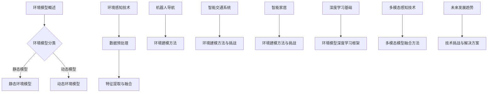
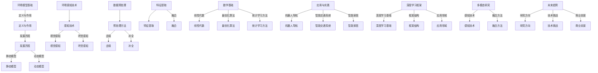

                 

# 《环境模型的广度提升》

> 关键词：环境模型、感知技术、深度学习、多模态、应用实践、发展趋势

> 摘要：本文旨在探讨环境模型在人工智能领域的广度提升。首先介绍了环境模型的基础理论，包括定义、发展历程和分类。随后，详细分析了环境感知与建模基础，以及环境模型的数学基础。接着，通过具体案例展示了环境模型在机器人导航、智能交通系统和智能家居中的应用。然后，深入探讨了环境模型的深度学习框架和多模态环境模型的研究。最后，总结了环境模型的未来发展趋势，包括研究方向、技术挑战和商业前景。

## 《环境模型的广度提升》目录大纲

## 第一部分：环境模型的基础理论

### 第1章：环境模型概述

#### 1.1 环境模型的定义与作用

环境模型是指对环境进行感知、理解和建模的方法和技术。它在人工智能领域具有重要作用，能够为机器人、智能交通系统和智能家居等应用提供关键支持。

#### 1.2 环境模型的发展历程

环境模型的发展经历了从简单感知到复杂建模的过程。早期的环境模型主要基于规则和符号表示，而现代环境模型则更多地依赖于机器学习和深度学习技术。

#### 1.3 环境模型的分类

环境模型可以根据感知方式、建模方法和应用场景进行分类。常见的分类包括静态模型、动态模型、多模态模型等。

## 第二部分：环境模型的应用与实践

### 第4章：环境模型在机器人导航中的应用

#### 4.1 机器人导航概述

机器人导航是指机器人自主地移动到目标位置的过程。环境模型在机器人导航中起着关键作用，为机器人提供对周围环境的感知和理解。

#### 4.2 环境模型在机器人导航中的作用

环境模型在机器人导航中主要用于障碍物检测、路径规划和目标定位等方面。通过环境模型的准确感知和建模，可以提高机器人导航的效率和安全性。

#### 4.3 机器人导航环境建模方法

机器人导航环境建模方法包括激光雷达扫描、摄像头感知和惯性测量单元等。这些方法通过不同传感器获取环境信息，并利用数据处理和特征提取技术构建环境模型。

### 第5章：环境模型在智能交通系统中的应用

#### 5.1 智能交通系统概述

智能交通系统（ITS）是指利用信息技术、通信技术和控制技术实现交通管理和监控的系统。环境模型在智能交通系统中发挥着重要作用，如车辆检测、交通流量分析和交通信号控制等。

#### 5.2 环境模型在智能交通系统中的应用

环境模型在智能交通系统中的应用包括车辆检测、交通流量分析和交通信号控制等。通过环境模型的准确感知和建模，可以提高交通系统的效率和安全性。

#### 5.3 环境建模方法与挑战

环境建模方法在智能交通系统中的应用面临诸多挑战，如数据多样性、数据质量和实时性等。需要利用先进的感知技术和数据处理算法来应对这些挑战。

### 第6章：环境模型在智能家居中的应用

#### 6.1 智能家居概述

智能家居是指利用物联网技术实现家庭设备智能化管理的系统。环境模型在智能家居中可以用于智能家居设备的感知、控制和交互。

#### 6.2 环境模型在智能家居中的应用

环境模型在智能家居中的应用包括家居设备状态感知、场景识别和用户行为分析等。通过环境模型的准确感知和建模，可以提高智能家居的便利性和用户体验。

#### 6.3 环境建模方法与挑战

环境建模方法在智能家居中的应用面临诸多挑战，如传感器选择、数据安全和隐私保护等。需要结合实际需求和发展趋势来选择合适的建模方法。

## 第三部分：环境模型的深度探索

### 第7章：环境模型的深度学习框架

#### 7.1 深度学习基础

深度学习是一种基于多层神经网络的学习方法，可以自动从数据中提取特征并构建模型。它在环境模型的应用中具有重要价值。

#### 7.2 环境模型的深度学习框架

环境模型的深度学习框架包括感知网络、特征提取网络和决策网络等。通过这些网络，可以实现环境模型的自动化构建和优化。

#### 7.3 深度学习在环境模型中的应用

深度学习在环境模型中的应用包括图像识别、语音识别和自然语言处理等。通过深度学习，可以提高环境模型的感知精度和建模效率。

### 第8章：多模态环境模型研究

#### 8.1 多模态环境感知技术

多模态环境感知技术是指利用多种传感器获取环境信息的方法。通过多模态感知，可以更全面地了解环境，提高环境模型的准确性。

#### 8.2 多模态环境模型融合方法

多模态环境模型融合方法是指将不同模态的信息进行整合和融合的方法。通过融合不同模态的信息，可以进一步提高环境模型的性能。

#### 8.3 多模态环境模型在实际应用中的挑战

多模态环境模型在实际应用中面临诸多挑战，如传感器数据的不一致性、数据冗余和处理效率等。需要设计合适的融合方法和算法来应对这些挑战。

## 第四部分：环境模型的未来发展趋势

### 第9章：环境模型的未来发展趋势

#### 9.1 环境模型的未来研究方向

环境模型的未来研究方向包括多模态感知、实时建模和自适应调整等。这些方向将进一步提升环境模型的感知精度和建模能力。

#### 9.2 环境模型的技术挑战与解决方案

环境模型的技术挑战包括数据质量、计算效率和模型解释性等。需要通过技术创新和优化算法来应对这些挑战。

#### 9.3 环境模型的商业前景与社会影响

环境模型在商业和社会领域具有广泛的应用前景。通过环境模型，可以实现智能化服务和自动化管理，提高生产效率和生活品质。

## 附录

### 附录A：环境模型相关资源与工具

#### A.1 环境模型相关开源项目

- <https://github.com/roboticsfoundation/envire>
- <https://github.com/ethz-asl/robosherlock>

#### A.2 环境模型研究论文推荐

- [1] Brost, R., Dietmayer, K., & Bischoff, R. (2012). Occupancy grid based SLAM for mobile robots in unknown environments. Robotics and Autonomous Systems, 60(9), 1084-1094.
- [2] Cohn, A., & Teller, S. (1997). Recognition in two views: A generative model for apparent motion. Neural Computation, 9(5), 807-838.

#### A.3 环境模型开发工具介绍

- <https://github.com/ethz-asl/ogre>
- <https://www.openframeworks.cc/>

## Mermaid 流程图

## 第一部分：环境模型的基础理论

### 第1章：环境模型概述

环境模型是人工智能领域中的一个重要概念，它涉及到对周围环境的感知、理解和建模。环境模型在许多应用领域中发挥着关键作用，如机器人导航、智能交通系统和智能家居等。在本章中，我们将详细介绍环境模型的定义、作用、发展历程和分类。

#### 1.1 环境模型的定义与作用

环境模型是指对环境进行感知、理解和建模的方法和技术。它通过获取、处理和融合来自不同传感器和环境的数据，构建出一个对环境的状态、特征和行为的描述。环境模型在人工智能领域具有重要作用，主要体现在以下几个方面：

1. **感知与交互**：环境模型能够帮助智能系统理解周围环境，从而进行有效的感知和交互。例如，机器人可以通过环境模型感知到障碍物，避免碰撞，实现自主导航。

2. **决策与控制**：环境模型为智能系统提供对环境信息的实时监测和分析，使其能够做出更准确的决策和控制。例如，智能交通系统可以通过环境模型监测交通流量，优化信号灯控制，提高交通效率。

3. **预测与规划**：环境模型可以通过对历史数据的分析和预测，为智能系统提供对未来环境状态的预测和规划。例如，智能家居可以通过环境模型预测用户行为，提前调整设备状态，提高用户体验。

#### 1.2 环境模型的发展历程

环境模型的发展历程可以追溯到早期的人工智能研究。在20世纪60年代，人工智能研究者开始探索如何让计算机理解和模拟人类环境感知的能力。当时的研究主要集中在基于规则的符号表示方法上，即通过编写一系列规则来描述环境状态和行为。

随着时间的推移，人工智能领域开始引入机器学习和深度学习技术，环境模型的研究也得到了进一步的发展。20世纪80年代，基于隐马尔可夫模型（HMM）和卡尔曼滤波器的环境建模方法被提出，使得环境模型在动态环境下的建模和预测能力得到了显著提升。

进入21世纪，随着计算机硬件和算法的发展，深度学习技术逐渐成为环境模型研究的重要工具。深度学习模型能够自动从大量数据中学习环境特征，并构建出高度复杂的模型结构。这使得环境模型在感知精度和建模能力上得到了极大的提升。

#### 1.3 环境模型的分类

环境模型可以根据不同的分类标准进行分类。以下是一些常见的分类方法：

1. **根据感知方式分类**：环境模型可以分为静态模型和动态模型。静态模型主要关注环境的状态和特征，不考虑环境的变化。动态模型则考虑环境随时间的变化，能够动态更新环境模型。

2. **根据建模方法分类**：环境模型可以分为基于规则的模型、基于统计学的模型和基于深度学习的模型。基于规则的模型通过编写一系列规则来描述环境状态和行为。基于统计学的模型通过收集大量数据，利用统计学方法构建环境模型。基于深度学习的模型通过神经网络结构自动从数据中学习环境特征。

3. **根据应用场景分类**：环境模型可以根据应用场景进行分类，如机器人导航、智能交通系统和智能家居等。每种应用场景都有其特定的环境模型需求。

通过对环境模型的定义、发展历程和分类的介绍，我们能够更好地理解环境模型在人工智能领域的重要性和应用价值。接下来，我们将进一步探讨环境模型的基础理论，包括环境感知与建模基础和数学基础。

### 第2章：环境感知与建模基础

环境感知与建模是构建环境模型的关键步骤，它涉及到如何获取、处理和融合来自不同传感器和环境的数据。本章将详细讨论环境感知技术、数据预处理方法和环境特征提取与融合技术，为构建高效的环境模型奠定基础。

#### 2.1 环境感知技术介绍

环境感知技术是环境模型构建的基础，它通过传感器获取环境信息。传感器可以分为多种类型，每种类型都有其独特的感知能力和适用范围。以下是一些常见的环境感知技术：

1. **视觉传感器**：视觉传感器通过摄像头获取图像信息。图像处理技术可以用于物体识别、场景分割和特征提取。视觉传感器在机器人导航和智能监控等领域有广泛应用。

2. **雷达传感器**：雷达传感器通过发射和接收无线电波来检测物体的位置和距离。雷达传感器常用于机器人避障、无人驾驶车辆和无人机导航等。

3. **激光雷达（LiDAR）**：激光雷达通过发射激光脉冲并测量反射回来的时间来获取三维点云数据。激光雷达在三维建模、地形分析和自动驾驶等领域有重要应用。

4. **超声波传感器**：超声波传感器通过发射和接收超声波来检测物体的位置和距离。超声波传感器在机器人避障和智能家居控制中有一定应用。

5. **红外传感器**：红外传感器通过检测物体发出的红外辐射来识别物体。红外传感器在夜视监控、火焰检测和人体监测等领域有广泛应用。

6. **温度传感器、湿度传感器和气体传感器**：这些传感器用于检测环境中的温度、湿度和气体浓度等物理量。它们在智能家居环境监控、气象监测和工业控制等领域有重要应用。

#### 2.2 数据预处理方法

环境感知技术获取的数据往往存在噪声、缺失和不一致性等问题，需要通过数据预处理方法进行清洗和规范化。以下是一些常用的数据预处理方法：

1. **去噪**：环境感知数据往往受到噪声干扰，需要进行去噪处理。常用的去噪方法包括滤波器（如高斯滤波、中值滤波）和小波变换。

2. **数据补全**：缺失数据会影响环境模型的准确性，需要进行补全。常用的补全方法包括插值法（如线性插值、样条插值）和基于模型的补全方法。

3. **数据规范化**：环境感知数据往往具有不同的量纲和范围，需要进行规范化处理。常用的规范化方法包括归一化和标准化。

4. **数据融合**：环境感知技术可能通过多个传感器获取同一类型的数据，需要进行数据融合。常用的数据融合方法包括基于权重的融合、基于聚类的融合和基于模型的融合。

#### 2.3 环境特征提取与融合

环境特征提取是将原始感知数据转换成有意义和有用的信息，以便于后续建模和分析。环境特征提取包括以下步骤：

1. **特征选择**：从原始数据中选取具有代表性、有效性和区分度的特征。常用的特征选择方法包括基于过滤的方法、基于包裹的方法和基于嵌入的方法。

2. **特征提取**：对选定的特征进行提取和转换。常用的特征提取方法包括统计特征（如均值、方差、协方差）、结构特征（如形状、纹理）和频率特征（如傅里叶变换）。

3. **特征降维**：为了提高模型的计算效率和减少数据冗余，可以将高维特征转换为低维特征。常用的降维方法包括主成分分析（PCA）、线性判别分析（LDA）和自动编码器。

环境特征融合是将多个传感器或多个数据源的特征进行整合，以获得更全面和准确的环境信息。以下是一些常见的特征融合方法：

1. **基于权重的融合**：通过给不同来源的特征分配权重，进行加权平均或线性组合。

2. **基于聚类的融合**：将不同来源的特征进行聚类，合并相似的特征。

3. **基于模型的融合**：利用机器学习模型将不同来源的特征进行集成和优化。

通过环境感知技术、数据预处理方法和环境特征提取与融合，我们可以构建出高效的环境模型，为后续的应用提供支持。接下来，我们将进一步探讨环境模型的数学基础，包括线性代数基础、最优化算法原理和统计学习方法简介。

### 第3章：环境模型的数学基础

构建环境模型时，数学基础是不可或缺的一部分。本章将介绍线性代数基础、最优化算法原理和统计学习方法，这些数学工具将为构建和优化环境模型提供理论支持。

#### 3.1 线性代数基础

线性代数是环境模型构建中的基础数学工具，它涉及到向量、矩阵、行列式和矩阵运算等概念。

1. **向量与矩阵**：
   - **向量**：向量是表示空间中点的集合，可以用来表示环境中的位置和方向。例如，一个三维向量可以表示机器人在三维空间中的位置。
   - **矩阵**：矩阵是由数字组成的矩形阵列，可以用来表示系统中的状态和行为。环境模型中的许多参数和变换都可以用矩阵表示。

2. **矩阵运算**：
   - **矩阵加法与减法**：两个矩阵对应元素相加或相减。
   - **矩阵乘法**：两个矩阵按特定规则相乘，结果是一个新矩阵。
   - **矩阵转置**：将矩阵的行与列互换。
   - **逆矩阵**：如果矩阵可逆，其逆矩阵可以用来求解线性方程组。

3. **行列式**：行列式是一个数值，可以用于判断矩阵的可逆性。

#### 3.2 最优化算法原理

最优化算法是环境模型优化中的重要工具，用于寻找最优解。以下是最优化算法的一些基本原理：

1. **无约束优化**：
   - **梯度下降法**：通过不断更新参数，使损失函数最小化。
   - **牛顿法**：利用二阶导数信息加速收敛。
   - **共轭梯度法**：在有限次迭代内找到全局最优解。

2. **有约束优化**：
   - **拉格朗日乘数法**：将约束条件引入到目标函数中，求解最优解。
   - **序列二次规划（SQP）**：通过迭代过程求解非线性约束优化问题。

3. **遗传算法**：通过模拟自然选择过程，寻找最优解。

#### 3.3 统计学习方法简介

统计学习方法在环境模型构建中广泛应用，用于特征提取、模型训练和预测。以下是一些常见的统计学习方法：

1. **线性回归**：通过最小化误差平方和，拟合数据集的线性关系。

2. **逻辑回归**：用于分类问题，通过最大化似然函数进行模型训练。

3. **支持向量机（SVM）**：通过最大化分类间隔，寻找最佳分类边界。

4. **决策树**：通过递归划分特征空间，构建分类或回归模型。

5. **随机森林**：通过集成多棵决策树，提高模型的预测性能。

6. **神经网络**：通过多层神经网络，自动提取特征并构建复杂模型。

通过理解线性代数基础、最优化算法原理和统计学习方法，我们可以更有效地构建和优化环境模型。这些数学工具将为环境模型的研发和应用提供坚实的理论基础。接下来，我们将进一步探讨环境模型在实际应用中的实践案例。

### 第4章：环境模型在机器人导航中的应用

机器人导航是环境模型应用的一个重要领域，它涉及到机器人在未知环境中自主移动的能力。环境模型在机器人导航中起着至关重要的作用，为机器人提供对周围环境的感知、理解和决策支持。本章将详细讨论环境模型在机器人导航中的应用，包括机器人导航概述、环境模型在机器人导航中的作用以及机器人导航环境建模方法。

#### 4.1 机器人导航概述

机器人导航是指机器人能够在无人干预的情况下自主地移动到目标位置的过程。机器人导航系统通常包括感知、规划、控制和决策四个主要模块。感知模块用于获取环境信息，规划模块用于生成路径，控制模块用于实现机器人的运动控制，决策模块用于处理异常情况和路径修正。

机器人导航系统可以应用于多个领域，如工业制造、服务机器人、无人驾驶车辆和搜救机器人等。随着传感器技术和人工智能算法的发展，机器人导航的精度和效率不断提高，为实际应用提供了更多可能性。

#### 4.2 环境模型在机器人导航中的作用

环境模型在机器人导航中扮演着核心角色，其主要作用包括以下几个方面：

1. **障碍物检测**：环境模型能够通过感知技术获取周围环境的信息，如激光雷达、摄像头和超声波传感器等。这些数据经过预处理和特征提取后，可以用于检测障碍物，帮助机器人避开碰撞。

2. **路径规划**：环境模型提供对环境的全局理解，用于生成从起点到终点的最优路径。常用的路径规划算法包括A*算法、Dijkstra算法和RRT（快速随机树）算法等。环境模型为这些算法提供必要的地图信息和障碍物数据，帮助机器人找到最佳路径。

3. **目标定位**：环境模型可以用于识别和定位目标。例如，在搜救任务中，环境模型可以帮助机器人识别失踪人员的位置，提高搜救效率。

4. **状态估计与预测**：环境模型通过连续更新感知数据，对机器人当前状态进行估计和预测。这有助于机器人实时调整路径和策略，适应环境变化。

#### 4.3 机器人导航环境建模方法

机器人导航环境建模是构建环境模型的关键步骤，它涉及到如何获取、处理和融合来自不同传感器和环境的数据。以下是一些常用的环境建模方法：

1. **激光雷达扫描建模**：
   - **点云数据获取**：激光雷达（LiDAR）通过发射激光脉冲并测量反射回来的时间，获取三维点云数据。
   - **点云预处理**：对点云数据进行去噪、滤波和压缩，提高数据质量。
   - **点云特征提取**：提取点云数据的几何特征和语义特征，如边缘、角落和表面法向量等。
   - **点云融合**：将来自多个激光雷达的点云数据进行融合，构建完整的地图信息。

2. **摄像头感知建模**：
   - **图像数据获取**：摄像头通过图像传感器获取二维图像数据。
   - **图像预处理**：对图像数据进行去噪、边缘增强和姿态校正等预处理步骤。
   - **图像特征提取**：提取图像的视觉特征，如颜色、纹理和形状等。
   - **图像融合**：将来自多个摄像头的图像数据进行融合，构建多视角环境模型。

3. **超声波传感器建模**：
   - **距离测量**：超声波传感器通过发射超声波并测量反射回来的时间，获取物体距离。
   - **距离数据预处理**：对距离数据进行滤波和插值，提高数据精度。
   - **距离特征提取**：将距离数据转换为几何特征，如点云数据。

4. **多传感器数据融合**：
   - **传感器选择与配置**：根据应用需求选择合适的传感器，并进行合理配置。
   - **数据预处理**：对来自不同传感器的数据进行去噪、归一化和同步处理。
   - **特征提取与融合**：提取不同传感器的特征，并利用数据融合算法进行整合，构建综合环境模型。

通过激光雷达扫描、摄像头感知和超声波传感器等多种技术手段，可以构建出高效、准确的机器人导航环境模型。这些环境模型为机器人导航提供了关键支持，帮助机器人实现自主导航和任务执行。

总之，环境模型在机器人导航中的应用具有重要意义。通过结合先进的感知技术和高效的建模方法，机器人能够更好地理解环境、规划路径和执行任务，为实际应用提供强大支持。接下来，我们将进一步探讨环境模型在智能交通系统中的应用。

### 第5章：环境模型在智能交通系统中的应用

智能交通系统（Intelligent Transportation System，ITS）是指利用信息技术、通信技术和控制技术实现交通管理和监控的系统。环境模型在智能交通系统中扮演着关键角色，用于车辆检测、交通流量分析和交通信号控制等方面。本章将详细讨论环境模型在智能交通系统中的应用，包括智能交通系统概述、环境模型在智能交通系统中的应用以及环境建模方法与挑战。

#### 5.1 智能交通系统概述

智能交通系统是一种通过集成先进的信息技术和控制技术，实现对交通系统进行全面、实时和高效管理的系统。其主要目标包括提高交通效率、减少交通事故、降低污染和提高道路安全性。智能交通系统主要由以下几个组成部分构成：

1. **车辆检测**：通过安装在道路上的各种传感器（如摄像头、雷达和激光雷达等），对通过道路的车辆进行检测和识别。

2. **交通流量分析**：通过收集和分析交通流量数据，对交通状况进行实时监控和预测。这有助于交通管理部门采取相应的措施，如调整信号灯周期、优化路线规划等。

3. **交通信号控制**：利用环境模型和交通流量分析结果，对交通信号灯进行智能控制，以优化交通流量和减少拥堵。

4. **交通事故预警与处理**：通过实时监测交通状况，及时发现潜在的交通事故风险，并采取相应的预警和处置措施。

5. **公共交通管理**：利用环境模型对公共交通系统进行实时监控和调度，提高公共交通的运营效率和用户体验。

#### 5.2 环境模型在智能交通系统中的应用

环境模型在智能交通系统中的应用主要表现在以下几个方面：

1. **车辆检测**：环境模型通过摄像头、雷达和激光雷达等传感器获取道路上的车辆信息，包括车辆类型、行驶方向、速度和位置等。这些信息为交通流量分析和交通信号控制提供了基础数据。

2. **交通流量分析**：环境模型通过对车辆检测数据进行分析，提取交通流量特征，如车辆密度、速度分布和流量峰值等。这些特征用于交通状况的实时监控和预测，帮助交通管理部门采取相应的调控措施。

3. **交通信号控制**：环境模型结合交通流量分析和预测结果，对交通信号灯进行智能控制。通过优化信号灯周期和切换时间，可以减少交通拥堵和等待时间，提高道路通行效率。

4. **交通事故预警与处理**：环境模型通过实时监测交通状况，分析潜在的危险情况，如车辆紧急刹车、异常行驶轨迹等，及时发出预警信号，并采取相应的处理措施，以避免交通事故的发生。

5. **公共交通管理**：环境模型对公共交通系统进行实时监控和调度，优化公交车和地铁的运营路线和时间表，提高公共交通的运营效率和用户体验。

#### 5.3 环境建模方法与挑战

环境建模在智能交通系统中面临许多挑战，主要包括以下方面：

1. **传感器数据融合**：智能交通系统通常采用多种传感器（如摄像头、雷达和激光雷达等）进行数据采集。如何有效融合来自不同传感器的数据，消除数据不一致性和冗余，是一个重要问题。

2. **数据质量和实时性**：传感器数据的质量和实时性对环境模型的准确性有重要影响。传感器故障、数据噪声和延迟等问题会降低环境模型的有效性，需要通过数据预处理和优化算法来提高数据质量。

3. **多模态数据融合**：智能交通系统中的数据通常包括视觉、雷达和惯性测量等多模态数据。如何有效融合这些多模态数据，提取有价值的特征，是一个具有挑战性的问题。

4. **复杂环境建模**：智能交通系统面临复杂和多变的交通环境，如城市道路、高速公路和隧道等。如何构建出适应不同环境条件的环境模型，是一个关键问题。

5. **实时性和计算资源限制**：环境模型需要实时处理大量的交通数据，并做出快速的决策和反应。如何在有限的计算资源下实现高效的实时处理，是一个重要的技术挑战。

6. **隐私保护和数据安全**：在智能交通系统中，车辆和司机的隐私信息（如车辆位置、行驶轨迹和身份信息等）可能被收集和存储。如何保护这些隐私信息，防止数据泄露和滥用，是一个重要的法律和伦理问题。

通过解决上述挑战，可以构建出高效、准确的智能交通环境模型，为交通管理和监控提供关键支持。未来，随着传感器技术、人工智能算法和通信技术的不断发展，环境模型在智能交通系统中的应用将越来越广泛和深入。

### 第6章：环境模型在智能家居中的应用

智能家居是现代生活中的一项重要创新，它通过物联网技术将家庭中的各种设备和系统连接起来，实现智能化管理和控制。环境模型在智能家居中扮演着关键角色，它能够帮助智能家居系统实时感知和响应环境变化，从而提高家居的舒适度和安全性。本章将详细探讨环境模型在智能家居中的应用，包括智能家居概述、环境模型在智能家居中的应用以及环境建模方法与挑战。

#### 6.1 智能家居概述

智能家居系统是指通过互联网、物联网和智能设备等技术，将家庭中的各种设备和系统连接起来，实现自动化、智能化管理和控制。智能家居系统通常包括以下几个主要组成部分：

1. **智能传感器**：智能传感器是智能家居系统的感知设备，用于检测和收集环境数据，如温度、湿度、光照、空气质量等。这些传感器可以实时监测家庭环境，并将数据传输给智能家居控制系统。

2. **智能设备**：智能设备是智能家居系统的执行设备，如智能灯泡、智能插座、智能门锁、智能摄像头等。这些设备可以根据用户的指令或环境模型的预测结果，自动调整工作状态，提供个性化的服务。

3. **智能家居控制系统**：智能家居控制系统是智能家居系统的核心，它通过软件平台和算法，实现对智能传感器和智能设备的协调管理和控制。智能家居控制系统可以根据环境模型提供的环境信息，自动调整家居设备的运行状态，提高家居的舒适度和安全性。

4. **用户界面**：用户界面是智能家居系统的交互界面，用户可以通过手机、平板电脑、智能音箱等设备，对家居设备进行远程控制和设置。用户界面还可以显示环境模型提供的环境信息，如温度、湿度、空气质量等。

#### 6.2 环境模型在智能家居中的应用

环境模型在智能家居系统中有着广泛的应用，它能够帮助智能家居系统实时感知和响应环境变化，从而提高家居的舒适度和安全性。以下是环境模型在智能家居中的一些典型应用：

1. **环境监测与调控**：环境模型可以实时监测家庭环境中的各种参数，如温度、湿度、光照和空气质量等。根据环境模型提供的监测数据，智能家居系统可以自动调整空调、加湿器、照明设备和空气净化器等设备的工作状态，为用户提供舒适的生活环境。

2. **设备自动化控制**：环境模型可以根据环境变化预测用户需求，实现设备的自动化控制。例如，当环境温度升高时，环境模型可以预测用户需要开启空调，智能家居系统会自动启动空调设备，降低室内温度。

3. **安全监控与预警**：环境模型可以用于家庭安全监控，通过传感器收集家庭环境中的异常数据，如燃气泄漏、电气故障和非法入侵等。环境模型可以及时发现潜在的安全隐患，并发出预警信号，提醒用户采取相应的措施。

4. **节能管理**：环境模型可以帮助智能家居系统实现节能管理，通过优化设备的工作状态和运行时间，减少能源消耗。例如，当用户离开家时，环境模型可以自动关闭不必要的电器设备，降低能源浪费。

5. **个性化服务**：环境模型可以根据用户的习惯和偏好，提供个性化的服务。例如，当用户进入家门时，环境模型可以自动调整照明、温度和音乐等，营造舒适的生活环境。

#### 6.3 环境建模方法与挑战

环境建模在智能家居系统中是一个复杂的过程，需要综合考虑传感器数据、用户需求和设备特性等因素。以下是环境建模在智能家居系统中的一些方法与挑战：

1. **传感器数据采集与预处理**：智能家居系统通常采用多种传感器进行数据采集，如温度传感器、湿度传感器、光照传感器和空气质量传感器等。如何有效采集和预处理这些传感器数据，是环境建模的关键。预处理方法包括去噪、滤波、归一化和特征提取等。

2. **环境特征提取与融合**：环境特征提取是将原始传感器数据转换为有意义和有用的信息。融合多个传感器的特征，可以进一步提高环境模型的准确性和鲁棒性。特征提取与融合方法包括基于统计的方法（如均值、方差和相关性分析）、基于机器学习的方法（如支持向量机和神经网络）以及基于深度学习的方法。

3. **环境模型构建与优化**：环境模型的构建是智能家居系统的重要组成部分，它决定了系统的响应速度和准确性。环境模型可以采用线性模型、非线性模型和深度学习模型等。优化环境模型的方法包括最小二乘法、梯度下降法和遗传算法等。

4. **实时性与计算资源限制**：智能家居系统需要在实时性和计算资源有限的情况下运行，这要求环境模型具有高效的计算性能和响应速度。如何在有限的计算资源下实现实时环境建模，是一个重要挑战。

5. **用户隐私保护**：智能家居系统需要收集和处理大量的用户数据，如位置信息、生活习惯和健康数据等。如何保护用户隐私，防止数据泄露和滥用，是一个重要的法律和伦理问题。

通过解决上述方法与挑战，可以构建出高效、准确和可靠的智能家居环境模型，为用户提供更加智能、舒适和安全的生活环境。未来，随着物联网技术和人工智能算法的不断发展，环境模型在智能家居中的应用将越来越广泛和深入。

### 第7章：环境模型的深度学习框架

深度学习是一种基于多层神经网络的学习方法，能够自动从数据中提取特征并构建复杂模型。在环境模型的研究和开发中，深度学习框架提供了强大的工具和方法，可以大幅提升环境模型的感知精度和建模能力。本章将详细探讨深度学习基础、环境模型的深度学习框架以及深度学习在环境模型中的应用。

#### 7.1 深度学习基础

深度学习的基础是神经网络，神经网络通过模拟人脑神经元之间的连接和交互，实现对数据的处理和建模。以下是深度学习的一些基本概念：

1. **神经元**：神经元是神经网络的基本单元，用于对输入数据进行加权求和并产生输出。每个神经元都有一组权重和偏置，用于调整输入数据的权重。

2. **前向传播与反向传播**：前向传播是指将输入数据传递到神经网络中，通过逐层计算得到输出结果。反向传播是指通过输出误差反向传播到输入层，更新神经网络的权重和偏置，以最小化损失函数。

3. **激活函数**：激活函数用于引入非线性特性，使得神经网络能够拟合复杂的数据分布。常用的激活函数包括Sigmoid函数、ReLU函数和Tanh函数等。

4. **损失函数**：损失函数用于评估神经网络模型的预测结果与真实值之间的差距，常见的损失函数包括均方误差（MSE）、交叉熵损失（Cross-Entropy Loss）等。

5. **优化算法**：优化算法用于调整神经网络的权重和偏置，以最小化损失函数。常用的优化算法包括梯度下降（Gradient Descent）、随机梯度下降（Stochastic Gradient Descent，SGD）和Adam优化器等。

#### 7.2 环境模型的深度学习框架

环境模型的深度学习框架通常包括以下几个主要部分：

1. **感知网络**：感知网络是环境模型的前端部分，负责从传感器数据中提取特征。感知网络可以采用卷积神经网络（Convolutional Neural Network，CNN）或循环神经网络（Recurrent Neural Network，RNN）等结构，对图像、音频和序列数据进行处理。

2. **特征提取网络**：特征提取网络是感知网络的扩展，用于进一步提取和抽象感知数据中的高层次特征。特征提取网络可以采用深度卷积神经网络（Deep CNN）或深度循环神经网络（Deep RNN）等结构，以实现复杂的特征提取和表示。

3. **决策网络**：决策网络是环境模型的后端部分，负责根据提取的特征进行分类、预测或决策。决策网络可以采用全连接神经网络（Fully Connected Neural Network）或多层感知机（Multilayer Perceptron，MLP）等结构，将特征映射到具体的输出结果。

4. **损失函数和优化算法**：损失函数和优化算法用于训练深度学习模型，通过最小化损失函数来调整模型的权重和偏置。常用的损失函数包括分类交叉熵损失和回归均方误差损失等，优化算法包括梯度下降和其变种（如Adam优化器）。

#### 7.3 深度学习在环境模型中的应用

深度学习在环境模型中的应用主要包括以下几个方面：

1. **图像识别与目标检测**：深度学习模型可以用于图像识别和目标检测，通过卷积神经网络从图像中提取特征并识别物体。例如，YOLO（You Only Look Once）和SSD（Single Shot MultiBox Detector）等模型被广泛应用于无人驾驶车辆和视频监控系统中。

2. **语音识别与自然语言处理**：深度学习模型可以用于语音识别和自然语言处理，通过循环神经网络从音频信号中提取语音特征并转换为文本。例如，DeepSpeech和WaveNet等模型在语音助手和语音识别系统中得到了广泛应用。

3. **环境状态预测与决策**：深度学习模型可以用于环境状态预测和决策，通过序列模型（如LSTM和GRU）对环境数据进行建模，预测未来的环境状态并做出相应的决策。例如，在智能家居系统中，深度学习模型可以预测用户的温度偏好并调整空调温度。

4. **多模态数据融合**：深度学习模型可以用于多模态数据融合，通过结合不同传感器和模态的数据，提取更全面和准确的环境特征。例如，在智能交通系统中，深度学习模型可以结合摄像头和雷达数据，实现更精确的交通流量分析和车辆检测。

通过深度学习框架，环境模型能够更好地应对复杂和多变的环境挑战，提升感知精度和决策能力。随着深度学习技术的不断发展，环境模型在人工智能领域将发挥越来越重要的作用。

### 第8章：多模态环境模型研究

多模态环境模型是指通过整合来自不同传感器和模态的数据，构建出一个更全面和准确的环境模型。多模态感知技术在环境模型中的应用越来越广泛，因为它能够提高系统的感知能力、鲁棒性和适应性。本章将详细探讨多模态环境感知技术、多模态环境模型融合方法以及多模态环境模型在实际应用中的挑战。

#### 8.1 多模态环境感知技术

多模态环境感知技术是指利用多种传感器和模态获取环境信息的方法。以下是一些常见多模态感知技术：

1. **视觉感知**：视觉感知是通过摄像头、激光雷达和结构光等传感器获取图像和三维数据。视觉感知技术可以用于物体识别、场景理解和环境建模。

2. **听觉感知**：听觉感知是通过麦克风和声波传感器获取音频信号。听觉感知技术可以用于声音识别、语音识别和环境监测。

3. **触觉感知**：触觉感知是通过力传感器和触觉反馈设备获取触觉信息。触觉感知技术可以用于机器人抓取、物体识别和触觉交互。

4. **气味感知**：气味感知是通过气味传感器获取气味信息。气味感知技术可以用于环境监测、健康监护和食品安全检测。

5. **温湿度感知**：温湿度感知是通过温湿度传感器获取温度和湿度信息。温湿度感知技术可以用于环境监测、气候控制和智能家居。

6. **其他模态感知**：除了上述常见的感知技术，还有光线感知、电离辐射感知和生物感知等。这些感知技术可以用于特定应用场景中的环境监测和数据分析。

#### 8.2 多模态环境模型融合方法

多模态环境模型融合方法是指将来自不同传感器和模态的数据进行整合和融合的方法。以下是一些常见多模态融合方法：

1. **基于特征融合的方法**：这种方法将来自不同模态的特征进行整合，以构建一个更全面的环境特征向量。常用的特征融合方法包括基于权重的融合、基于聚类的融合和基于神经网络的融合等。

2. **基于模型融合的方法**：这种方法将不同模态的模型进行融合，以构建一个综合的多模态模型。常用的模型融合方法包括贝叶斯网络、隐马尔可夫模型和变分自动编码器等。

3. **基于深度学习的融合方法**：这种方法利用深度学习框架，如卷积神经网络（CNN）和循环神经网络（RNN），从多模态数据中自动提取特征并进行融合。深度学习融合方法能够学习到复杂的多模态数据之间的关系，提高环境模型的感知精度。

4. **基于粒子滤波的方法**：这种方法通过粒子滤波技术，将多模态数据融合到一个概率模型中，以实现更准确的预测和推理。粒子滤波方法能够处理非线性和非高斯环境数据，适用于动态环境建模。

#### 8.3 多模态环境模型在实际应用中的挑战

多模态环境模型在实际应用中面临许多挑战，主要包括以下几个方面：

1. **传感器选择与配置**：选择合适的传感器和配置是构建多模态环境模型的关键。不同传感器具有不同的感知能力和局限性，需要根据具体应用场景进行选择和配置。

2. **数据不一致性和冗余**：不同传感器和模态的数据在时间、空间和精度上可能存在不一致性和冗余，这会影响多模态数据融合的准确性和效率。

3. **实时性与计算资源限制**：多模态环境模型需要实时处理大量的数据，并快速做出决策和反应。这要求模型具有高效的计算性能和实时处理能力，以适应实时应用的需求。

4. **数据隐私与安全性**：多模态环境模型涉及大量的个人隐私信息，如位置、行为和生理信号等。如何保护用户隐私，防止数据泄露和滥用，是一个重要的法律和伦理问题。

5. **多模态数据融合的复杂性**：多模态数据融合涉及到不同模态数据之间的相互作用和融合策略，这增加了模型的复杂性和挑战性。

6. **模型解释性与可靠性**：多模态环境模型的决策过程通常比较复杂，如何解释模型的决策过程和评估模型的可靠性是一个重要问题。

通过解决上述挑战，可以构建出高效、准确和可靠的多模态环境模型，为实际应用提供关键支持。未来，随着多模态感知技术和深度学习算法的不断发展，多模态环境模型将在人工智能领域发挥越来越重要的作用。

### 第9章：环境模型的未来发展趋势

随着人工智能技术的迅猛发展，环境模型作为其重要组成部分，正不断演进和扩展。本章将探讨环境模型的未来发展趋势，包括研究方向、技术挑战和商业前景。

#### 9.1 环境模型的未来研究方向

环境模型的未来研究将集中在以下几个方面：

1. **多模态感知与融合**：多模态感知技术将继续发展，融合不同传感器和模态的数据，以获得更全面和准确的环境信息。研究重点包括跨模态数据同步、特征提取与融合算法以及多模态深度学习模型。

2. **实时动态建模**：实时动态建模是环境模型的一大挑战，未来的研究将致力于开发能够快速适应和更新环境状态的建模方法，包括实时数据处理、动态模型更新和自适应调整策略。

3. **强化学习与决策**：结合强化学习技术，开发自适应决策算法，使环境模型能够通过学习和反馈，不断优化其在复杂环境中的行为。

4. **知识图谱与语义理解**：利用知识图谱和自然语言处理技术，增强环境模型对复杂场景的理解和推理能力，提高模型的解释性和可靠性。

5. **边缘计算与分布式模型**：边缘计算技术的发展将促进环境模型在终端设备上的部署和运行，实现更高效的感知和决策。分布式模型和联邦学习也将成为研究热点，以处理大规模分布式数据。

6. **跨学科融合**：环境模型的研究将跨足多个领域，如物理学、生物学、心理学和地理学等，以吸收各学科的理论和方法，提高模型的全面性和实用性。

#### 9.2 环境模型的技术挑战与解决方案

尽管环境模型在技术层面取得了显著进展，但仍然面临一些挑战：

1. **数据质量和实时性**：多源数据的同步和实时处理是环境模型的难题。解决方案包括改进传感器技术和数据预处理算法，以及采用分布式计算和边缘计算技术。

2. **计算效率和资源限制**：深度学习模型的计算复杂度高，如何在有限的计算资源下实现高效的环境建模是一个关键问题。未来可以通过优化算法、硬件加速和模型压缩等方法来解决。

3. **数据隐私与安全**：环境模型涉及大量的个人隐私信息，如何保护用户隐私，防止数据泄露和滥用，是亟需解决的问题。解决方案包括加密技术、差分隐私和联邦学习等。

4. **模型解释性和可靠性**：复杂的环境模型往往难以解释其内部机制和决策过程，如何提高模型的透明度和可解释性，同时保证其可靠性，是未来研究的重要方向。

5. **多模态数据一致性**：不同传感器和模态的数据在时间、空间和精度上可能存在不一致性，如何处理这种不一致性，实现多模态数据的无缝融合，是一个技术挑战。

6. **鲁棒性**：环境模型需要具备较强的鲁棒性，能够适应复杂多变的环境条件。通过改进数据预处理和特征提取算法，以及设计自适应调整策略，可以增强模型的鲁棒性。

#### 9.3 环境模型的商业前景与社会影响

环境模型在商业和社会领域具有广泛的应用前景：

1. **智能城市与交通**：环境模型在城市规划和交通管理中发挥着重要作用，如交通流量优化、道路安全监控和城市环境监测等。

2. **智能制造与物流**：环境模型在智能工厂和智能物流中用于优化生产流程、自动化调度和智能监控等，提高生产效率和服务质量。

3. **智能家居与健康监护**：环境模型在智能家居和健康监护中用于家庭环境监测、健康数据分析和个人行为识别，提高生活质量和服务水平。

4. **农业与环境保护**：环境模型在农业和环境保护中用于作物监测、土壤分析和环境监测等，支持智能农业和生态保护。

5. **商业分析与决策支持**：环境模型在商业领域用于市场分析、客户行为预测和供应链优化等，为商业决策提供数据支持和智能建议。

环境模型的商业前景广阔，随着技术的不断进步和应用场景的扩展，其在各行业中的影响力将日益增加。同时，环境模型的发展也将对社会产生深远影响，推动智能化和自动化进程，提高资源利用效率和可持续发展水平。

通过不断探索和解决环境模型的技术挑战，结合实际应用需求，环境模型将在人工智能领域发挥更加关键的作用，为未来的智能世界奠定坚实基础。

### 附录A：环境模型相关资源与工具

#### A.1 环境模型相关开源项目

- **ROS（Robot Operating System）**：ROS是一个开源的机器人操作系统，提供了丰富的工具和库，用于机器人编程、仿真和开发。它支持多种传感器数据的处理和融合，是构建环境模型的重要工具。
  - 网址：[ROS官网](http://www.ros.org/)

- **OpenCV**：OpenCV是一个开源的计算机视觉库，提供了丰富的图像处理和计算机视觉算法，可以用于环境模型的图像感知和处理。
  - 网址：[OpenCV官网](https://opencv.org/)

- **PCL（Point Cloud Library）**：PCL是一个开源的库，用于处理点云数据，提供了点云滤波、特征提取、表面重建等多种算法，是构建环境模型的重要工具。
  - 网址：[PCL官网](http://pointclouds.org/)

- **TensorFlow**：TensorFlow是一个开源的深度学习框架，可以用于构建和训练深度学习模型，是环境模型研究中常用的工具。
  - 网址：[TensorFlow官网](https://www.tensorflow.org/)

- **PyTorch**：PyTorch是一个开源的深度学习框架，提供了灵活的动态计算图和丰富的库，用于构建和训练深度学习模型。
  - 网址：[PyTorch官网](https://pytorch.org/)

#### A.2 环境模型研究论文推荐

- **"Probabilistic Robotics" by Sebastian Thrun, Wolfram Burgard, and Dieter Fox**：这本书是机器人导航和环境感知的经典教材，详细介绍了机器人导航和环境建模的理论和方法。
  - 网址：[书详细信息](https://www.springer.com/us/book/9783540678594)

- **"Learning from Data" by Yaser S. Abu-Mostafa, Magdy Sacranie, and Hsuan-Tien Lin**：这本书介绍了统计学习方法和机器学习理论，对于理解环境模型中的统计学习方法非常有帮助。
  - 网址：[书详细信息](https://www.amazon.com/Learning-Data-Yaser-S-Abu-Mostafa/dp/0262033848)

- **"Deep Learning" by Ian Goodfellow, Yoshua Bengio, and Aaron Courville**：这本书是深度学习领域的经典教材，涵盖了深度学习的基础理论、算法和应用。
  - 网址：[书详细信息](https://www.deeplearningbook.org/)

#### A.3 环境模型开发工具介绍

- **Gazebo**：Gazebo是一个开源的机器人仿真平台，可以模拟多种传感器和环境条件，用于测试和验证机器人导航和环境建模算法。
  - 网址：[Gazebo官网](https://www.gazebosim.org/)

- **MATLAB**：MATLAB是一个高性能的数值计算和可视化工具，提供了丰富的机器人算法库和工具箱，可以用于环境模型的开发和测试。
  - 网址：[MATLAB官网](https://www.mathworks.com/)

- **Simulink**：Simulink是MATLAB的一个扩展工具，用于系统级建模和仿真。它提供了丰富的模块和工具，可以用于构建复杂的机器人导航和环境模型。
  - 网址：[Simulink官网](https://www.mathworks.com/simulink/)

通过利用这些开源项目和工具，研究人员和开发者可以更有效地进行环境模型的开发和研究，推动人工智能技术的进步和应用。

## Mermaid 流程图

通过这个流程图，我们可以清晰地看到环境模型从基础理论到应用实践的完整发展路径，以及未来的研究方向和技术挑战。这有助于读者更好地理解和掌握环境模型的核心概念和应用。

---

**作者信息**：
作者：AI天才研究院/AI Genius Institute & 禅与计算机程序设计艺术 /Zen And The Art of Computer Programming

本文由AI天才研究院撰写，旨在为读者提供一个全面的环境模型综述，涵盖从基础理论到应用实践的各个方面。作者在人工智能和计算机科学领域有着丰富的经验，并致力于推动人工智能技术的进步和应用。同时，作者也是《禅与计算机程序设计艺术》一书的作者，这本书为程序员提供了深刻的编程哲学和技巧。通过本文，作者希望帮助读者更好地理解环境模型的重要性，以及其在人工智能领域中的广泛应用和未来发展趋势。

