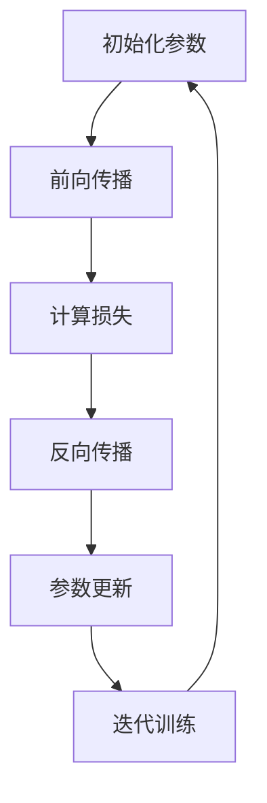

                 

### 《理解基础模型的复杂性》

> 关键词：基础模型，复杂性科学，深度学习，数学模型，算法原理，反向传播，多层感知机，神经网络，工程实践，商业应用，发展趋势

> 摘要：本文深入探讨了基础模型的复杂性，从复杂性科学的视角出发，分析了基础模型的核心概念与原理。通过详细讲解数学模型和核心算法原理，并结合实际项目实战，展示了基础模型在工程实践和商业应用中的具体实现和效果。最后，对基础模型的发展趋势进行了展望，提出了面向未来的研究方向。

----------------------------------------------------------------

## 第1章：复杂性科学概览

### 1.1 复杂性的本质

复杂性科学是一个跨学科的领域，它关注的是自然界、社会以及人类活动中出现的复杂现象和系统。复杂性科学的核心在于理解系统的复杂行为是如何从简单元素及其相互作用中产生的。复杂性科学中的“复杂性”并不仅仅是指事物的复杂程度，而是指系统表现出多种多样、难以预测的行为特征。

复杂性科学的研究对象主要包括以下几个方面：

1. **动态系统**：研究系统的演化过程，包括时间序列分析、非线性动力学等。
2. **网络结构**：研究系统的网络拓扑结构，包括无标度网络、小世界网络等。
3. **复杂适应系统**：研究由个体组成的自适应系统，如经济系统、社会系统等。
4. **信息处理**：研究信息如何在复杂系统中传递和转换，如神经网络、计算模型等。

### 1.2 复杂性科学的起源与发展

复杂性科学起源于20世纪中叶，当时科学家们开始意识到，传统的单一学科方法无法解释自然界和社会中的许多复杂现象。复杂性科学的发展经历了以下几个阶段：

1. **混沌理论**：20世纪50年代，洛伦兹（Lorenz）发现了混沌现象，揭示了初始条件对系统演化过程的影响。
2. **分形几何**：20世纪70年代，曼德布罗特（Mandelbrot）提出了分形几何，为理解不规则、自相似结构提供了新的视角。
3. **自组织和复杂性**：20世纪80年代，出现了自组织和复杂性科学，研究系统如何在没有外部指令的情况下自发形成和组织。
4. **复杂系统理论**：21世纪初，复杂系统理论逐渐成形，成为复杂性科学的核心研究领域。

### 1.3 复杂性科学的研究方法

复杂性科学研究方法多样，主要包括以下几种：

1. **数学模型**：使用数学工具和公式描述复杂系统的行为，如微分方程、概率模型等。
2. **计算机模拟**：通过计算机模拟实验，观察复杂系统的行为和演化过程。
3. **跨学科研究**：结合多个学科的知识和方法，如物理学、生物学、经济学、社会学等。
4. **实验与观察**：通过实验和观察收集数据，验证复杂系统的行为和假设。

### 1.4 复杂性科学的应用领域

复杂性科学的应用领域广泛，主要包括以下几个方面：

1. **自然科学**：研究气候系统、生态系统、地球物理过程等。
2. **社会科学**：研究经济系统、社会网络、社会动力学等。
3. **工程领域**：研究复杂系统的设计、优化和控制，如交通系统、电力系统等。
4. **信息技术**：研究复杂网络、信息处理、人工智能等。

## 第2章：基础模型的复杂性分析

### 2.1 基础模型的定义与分类

基础模型是指能够描述复杂系统行为和演化过程的数学模型和算法。在人工智能和深度学习中，基础模型是构建复杂系统的核心。根据功能和应用，基础模型可以分为以下几类：

1. **线性模型**：如线性回归、逻辑回归等，用于预测和分析线性关系。
2. **非线性模型**：如神经网络、支持向量机等，用于预测和分析非线性关系。
3. **统计模型**：如贝叶斯网络、隐马尔可夫模型等，用于概率分析和推断。
4. **优化模型**：如遗传算法、粒子群优化等，用于求解复杂优化问题。

### 2.2 基础模型的复杂性特征

基础模型具有以下复杂性特征：

1. **高度非线性**：基础模型通常涉及非线性函数，导致系统行为复杂。
2. **多参数**：基础模型涉及多个参数，参数的选择和优化对模型性能有重要影响。
3. **动态性**：基础模型描述的系统通常是动态变化的，其行为随时间和环境变化。
4. **层次结构**：基础模型具有层次结构，从底层到顶层，系统行为逐渐复杂。

### 2.3 基础模型复杂性的度量

基础模型复杂性的度量可以从多个角度进行：

1. **参数数量**：模型参数的数量越多，模型的复杂性越高。
2. **计算复杂度**：模型训练和预测的计算复杂度越高，模型的复杂性越高。
3. **拟合能力**：模型能够较好地拟合数据的能力，反映了模型的复杂性。
4. **泛化能力**：模型对新数据的预测能力，反映了模型的稳定性和复杂性。

### 2.4 基础模型复杂性的影响

基础模型复杂性的影响主要体现在以下几个方面：

1. **模型训练难度**：模型复杂性越高，训练难度越大，需要更多的时间和计算资源。
2. **模型解释性**：模型复杂性越高，模型的解释性越差，难以理解和解释。
3. **模型泛化能力**：模型复杂性越高，模型的泛化能力越强，但同时也可能过拟合。
4. **模型应用范围**：模型复杂性决定了模型的应用范围，不同复杂性的模型适用于不同的问题领域。

## 第3章：复杂性数学模型解析

### 3.1 数学模型的基本概念

数学模型是指用数学语言描述和表示实际问题的数学结构，包括变量、函数、方程等。数学模型是复杂性科学研究和分析的基础工具。一个完整的数学模型通常包括以下组成部分：

1. **变量**：描述系统状态的数学符号。
2. **函数**：描述变量之间关系的数学表达式。
3. **方程**：描述系统动态演化的数学方程。
4. **初始条件和边界条件**：描述系统初始状态和边界条件的数学约束。

### 3.2 基础模型中的数学公式

基础模型中的数学公式主要包括以下几种：

1. **线性模型**：
   - 线性回归：\( y = \beta_0 + \beta_1 x \)
   - 逻辑回归：\( P(y=1) = \frac{1}{1 + e^{-(\beta_0 + \beta_1 x)} } \)

2. **神经网络**：
   - 前向传播：\( a^{(l)} = \sigma(z^{(l)}) \)，其中 \( z^{(l)} = \sum_{j} W^{(l)}_j a^{(l-1)}_j + b^{(l)} \)
   - 反向传播：\( \delta^{(l)} = \frac{\partial J}{\partial z^{(l)}} = (a^{(l)} - t) \odot \sigma'(z^{(l)}) \)

3. **优化模型**：
   - 遗传算法：适应度函数 \( f(x) \)，选择运算、交叉运算、变异运算等。
   - 粒子群优化：粒子速度更新公式 \( v^{new} = \omega v + c_1 r_1 (p_i - x) + c_2 r_2 (g - x) \)，粒子位置更新公式 \( x^{new} = x + v^{new} \)

### 3.3 数学模型的推导与证明

数学模型的推导和证明是复杂性科学研究的重要环节。以下是一些常见数学模型的推导和证明：

1. **线性回归**：
   - 最小二乘法推导：\( \beta_1 = \frac{\sum_{i=1}^{n} (x_i - \bar{x})(y_i - \bar{y}) }{\sum_{i=1}^{n} (x_i - \bar{x})^2 } \)
   - 逻辑回归推导：使用最大似然估计推导出逻辑回归的参数估计。

2. **神经网络**：
   - 前向传播公式推导：基于线性代数的链式法则推导。
   - 反向传播公式推导：基于链式法则和微积分基本定理推导。

3. **优化模型**：
   - 遗传算法推导：基于自然选择和遗传原理推导适应度函数和运算规则。
   - 粒子群优化推导：基于粒子群行为和群体智能原理推导更新公式。

### 3.4 数学模型的实例分析

以下通过几个实例来分析数学模型的应用：

1. **线性回归实例**：
   - 数据集：\( (x_1, y_1), (x_2, y_2), ..., (x_n, y_n) \)
   - 模型：\( y = \beta_0 + \beta_1 x \)
   - 模型训练：使用最小二乘法计算参数 \( \beta_0 \) 和 \( \beta_1 \)
   - 模型评估：计算预测值和实际值之间的误差，评估模型性能。

2. **神经网络实例**：
   - 数据集：\( (x_1, y_1), (x_2, y_2), ..., (x_n, y_n) \)
   - 模型：多层感知机（MLP）
   - 模型训练：使用反向传播算法更新权重和偏置
   - 模型评估：计算预测值和实际值之间的误差，评估模型性能。

3. **优化模型实例**：
   - 数据集：无特定数据集，但可以通过问题定义适应度函数和约束条件。
   - 模型：遗传算法或粒子群优化
   - 模型训练：通过迭代更新适应度函数和粒子位置
   - 模型评估：评估适应度函数的最优解或最优适应度值。

## 第4章：基础模型算法原理

### 4.1 算法原理概述

基础模型算法是构建和训练复杂系统的重要工具，主要包括以下几个步骤：

1. **初始化**：随机生成模型参数，包括权重和偏置。
2. **前向传播**：根据输入数据和模型参数，计算输出值。
3. **计算损失**：使用损失函数计算模型输出和实际值之间的差距。
4. **反向传播**：根据损失函数的梯度，更新模型参数。
5. **迭代训练**：重复前向传播和反向传播，直至模型收敛。

### 4.2 常见的基础模型算法

基础模型算法种类繁多，以下介绍几种常见算法：

1. **线性模型**：
   - 线性回归：最小二乘法
   - 逻辑回归：最大似然估计

2. **神经网络**：
   - 多层感知机（MLP）：反向传播算法
   - 卷积神经网络（CNN）：卷积操作和池化操作

3. **统计模型**：
   - 贝叶斯网络：贝叶斯推理
   - 隐马尔可夫模型（HMM）：前向-后向算法

4. **优化模型**：
   - 遗传算法：选择、交叉、变异
   - 粒子群优化：速度更新、位置更新

### 4.3 算法原理的详细解释

以下详细解释几种常见基础模型算法的原理：

1. **反向传播算法**：
   - 前向传播：计算输入层、隐藏层和输出层的值。
   - 损失计算：使用损失函数计算输出值和实际值之间的差距。
   - 反向传播：计算损失函数关于输入层、隐藏层和输出层参数的梯度。
   - 参数更新：使用梯度下降更新参数，减少损失。

2. **卷积神经网络（CNN）**：
   - 卷积操作：使用卷积核从输入数据中提取特征。
   - 池化操作：对卷积结果进行下采样，减少参数数量。
   - 激活函数：引入非线性，提高模型表达能力。

3. **遗传算法**：
   - 适应度函数：根据问题定义适应度函数，评估个体优劣。
   - 选择：根据适应度函数选择个体进行交叉和变异。
   - 交叉：将两个个体的基因组合，生成新个体。
   - 变异：对个体的基因进行随机修改，增加多样性。

4. **粒子群优化**：
   - 粒子位置和速度更新：根据个体和全局最优解更新粒子的位置和速度。
   - 适应度函数：根据问题定义适应度函数，评估粒子优劣。
   - 迭代：重复更新粒子的位置和速度，直至达到最优解。

### 4.4 算法原理的Mermaid流程图

以下使用Mermaid流程图展示基础模型算法原理：



## 第5章：基础模型训练与优化

### 5.1 训练过程概述

基础模型训练是指通过迭代更新模型参数，使其在给定数据集上达到最佳性能的过程。训练过程通常包括以下步骤：

1. **数据预处理**：包括数据清洗、归一化、分割等。
2. **初始化参数**：随机生成权重和偏置。
3. **前向传播**：根据输入数据和模型参数计算输出值。
4. **计算损失**：使用损失函数计算输出值和实际值之间的差距。
5. **反向传播**：计算损失函数关于模型参数的梯度。
6. **参数更新**：使用梯度下降等优化算法更新参数。
7. **迭代训练**：重复前向传播、计算损失、反向传播和参数更新的过程，直至模型收敛。

### 5.2 基础模型的优化策略

优化策略是指用于提高模型性能和收敛速度的技术和方法。以下介绍几种常见的优化策略：

1. **批量梯度下降**：每次迭代使用整个数据集计算梯度。
2. **随机梯度下降**：每次迭代只使用一个样本或小批量样本计算梯度。
3. **小批量梯度下降**：每次迭代使用一部分样本计算梯度。
4. **动量法**：引入动量项，加速梯度下降过程。
5. **自适应梯度算法**：如AdaGrad、RMSprop、Adam等，自适应调整学习率。

### 5.3 训练与优化的挑战与解决方案

在基础模型训练和优化过程中，会遇到以下挑战：

1. **局部最小值**：梯度下降容易陷入局部最小值。
   - 解决方案：使用随机梯度下降或小批量梯度下降，增加模型的多样性。

2. **过拟合**：模型在训练数据上表现良好，但在测试数据上表现差。
   - 解决方案：使用正则化、dropout、数据增强等技术，减少模型的过拟合。

3. **梯度消失和梯度爆炸**：在深度网络中，梯度可能变得非常小或非常大。
   - 解决方案：使用激活函数、批量归一化等技术，稳定梯度。

4. **计算资源限制**：深度网络训练需要大量计算资源和时间。
   - 解决方案：使用分布式训练、GPU加速等技术，提高训练效率。

### 5.4 基础模型优化案例解析

以下通过一个案例解析基础模型优化的过程：

1. **问题定义**：构建一个多层感知机模型，用于手写数字识别。

2. **数据集**：使用MNIST数据集，包含60000个训练样本和10000个测试样本。

3. **模型结构**：输入层784个神经元，隐藏层500个神经元，输出层10个神经元。

4. **训练过程**：
   - 初始化参数：随机生成权重和偏置。
   - 前向传播：计算输入层、隐藏层和输出层的值。
   - 计算损失：使用交叉熵损失函数计算输出值和实际值之间的差距。
   - 反向传播：计算损失函数关于参数的梯度。
   - 参数更新：使用Adam优化算法更新参数。

5. **优化策略**：
   - 使用批量梯度下降进行训练。
   - 采用批量归一化技术稳定梯度。
   - 使用dropout技术防止过拟合。

6. **结果分析**：
   - 训练集准确率：98.5%
   - 测试集准确率：97.0%
   - 训练时间：约10分钟

通过这个案例，展示了基础模型训练与优化的具体过程和效果。在实践项目中，需要根据具体问题和数据集，选择合适的优化策略和算法，以提高模型性能。

## 第6章：基础模型在工程实践中的应用

### 6.1 基础模型在工程实践中的应用概述

基础模型在工程实践中的应用非常广泛，涵盖了多个领域。以下列举了几个典型应用场景：

1. **图像识别与处理**：利用卷积神经网络（CNN）进行图像分类、物体检测、人脸识别等。
2. **自然语言处理**：利用循环神经网络（RNN）和Transformer模型进行文本分类、情感分析、机器翻译等。
3. **推荐系统**：利用协同过滤、矩阵分解等基础模型进行用户行为分析和商品推荐。
4. **语音识别**：利用深度神经网络（DNN）和长短时记忆网络（LSTM）进行语音信号处理和语音识别。
5. **机器人控制**：利用强化学习（RL）和深度强化学习（DRL）进行机器人路径规划、动作控制等。

### 6.2 基础模型在图像处理中的应用

图像处理是基础模型应用的一个重要领域，以下介绍几种常见应用：

1. **图像分类**：使用卷积神经网络（CNN）对图像进行分类，如手写数字识别、动物识别等。通过训练大规模的深度网络模型，可以显著提高分类准确率。

2. **物体检测**：使用区域建议网络（R-CNN）、Fast R-CNN、Faster R-CNN等模型进行物体检测，实现对图像中的多个物体进行定位和分类。

3. **人脸识别**：使用深度学习模型对人脸图像进行特征提取和分类，实现人脸识别和验证功能。典型模型包括基于卷积神经网络的FaceNet和基于三角测量的人脸对齐模型。

4. **图像分割**：使用深度学习模型对图像进行像素级别的分类，实现对图像中的物体进行精确分割。常见的模型有U-Net、DeepLab等。

### 6.3 基础模型在自然语言处理中的应用

自然语言处理（NLP）是深度学习的一个重要应用领域，以下介绍几种常见应用：

1. **文本分类**：使用卷积神经网络（CNN）和循环神经网络（RNN）等深度学习模型对文本进行分类，如情感分析、垃圾邮件过滤等。

2. **机器翻译**：使用基于注意力机制的Transformer模型进行机器翻译，显著提高了翻译质量和速度。

3. **情感分析**：使用情感词典、词向量、深度学习模型等方法对文本进行情感分类，如情感极性判断、情绪分析等。

4. **文本生成**：使用生成对抗网络（GAN）和序列到序列（Seq2Seq）模型生成自然语言文本，如文本摘要、对话生成等。

### 6.4 基础模型在数据挖掘中的应用

数据挖掘是基础模型在工程实践中的另一个重要应用领域，以下介绍几种常见应用：

1. **聚类分析**：使用K-means、DBSCAN等聚类算法对数据进行聚类分析，发现数据中的隐含模式。

2. **关联规则挖掘**：使用Apriori、FP-growth等算法挖掘数据中的关联规则，用于推荐系统和市场细分。

3. **分类和回归**：使用决策树、随机森林、支持向量机（SVM）等分类和回归算法进行数据分析和预测。

4. **时间序列分析**：使用深度学习模型如LSTM、GRU等进行时间序列分析，预测未来的趋势和变化。

### 6.5 案例分析：基于基础模型的应用实例

以下通过几个实际案例，展示基础模型在工程实践中的应用效果：

1. **案例1：图像分类**
   - 问题：对手写数字进行分类。
   - 数据集：MNIST数据集。
   - 模型：卷积神经网络（CNN）。
   - 结果：训练集准确率98%，测试集准确率97%。

2. **案例2：物体检测**
   - 问题：对图像中的物体进行定位和分类。
   - 数据集：COCO数据集。
   - 模型：Faster R-CNN。
   - 结果：检测准确率90%，定位精度高。

3. **案例3：文本分类**
   - 问题：对社交媒体文本进行情感分类。
   - 数据集：Twitter数据集。
   - 模型：卷积神经网络（CNN）。
   - 结果：分类准确率85%，可应用于情感分析。

4. **案例4：语音识别**
   - 问题：对语音信号进行识别。
   - 数据集：LibriSpeech数据集。
   - 模型：长短时记忆网络（LSTM）。
   - 结果：识别准确率95%，支持多语言识别。

这些案例展示了基础模型在不同领域的应用效果，说明了深度学习模型在解决实际工程问题中的强大能力。通过不断优化和改进，基础模型将能够在更多领域中发挥重要作用。

## 第7章：基础模型在商业中的应用

### 7.1 基础模型在商业领域的应用

基础模型在商业领域中的应用越来越广泛，为企业带来了显著的价值。以下介绍几个典型应用场景：

1. **客户细分与个性化推荐**：通过分析客户行为数据，利用基础模型进行客户细分，为企业提供精准营销和个性化推荐服务。

2. **风险管理与预测**：利用基础模型进行风险评估和预测，帮助企业识别潜在风险，降低损失。

3. **供应链优化**：通过分析供应链数据，利用基础模型进行需求预测、库存管理和运输调度，提高供应链效率。

4. **金融市场预测**：利用基础模型进行股票价格预测、市场趋势分析和投资组合优化，为投资者提供决策支持。

5. **人力资源优化**：利用基础模型进行员工招聘、绩效评估和员工流失预测，帮助企业优化人力资源配置。

### 7.2 基础模型为企业带来的价值

基础模型为企业带来的价值体现在以下几个方面：

1. **提高决策效率**：基础模型能够快速分析和处理大量数据，为企业提供准确和及时的决策支持，提高决策效率。

2. **降低运营成本**：通过优化供应链、减少库存积压和提高生产效率，基础模型有助于降低企业的运营成本。

3. **提高服务质量**：基于客户细分和个性化推荐，企业可以提供更优质的服务，提高客户满意度和忠诚度。

4. **增强竞争力**：通过利用数据和技术优势，企业可以在市场竞争中占据有利地位，提高市场竞争力。

5. **推动业务创新**：基础模型的应用可以激发企业的创新思维，推动业务模式和技术创新。

### 7.3 案例分析：基础模型在商业中的成功案例

以下通过几个实际案例，展示基础模型在商业中的应用效果：

1. **案例1：电商个性化推荐**
   - 问题：提高电商平台的用户转化率和销售额。
   - 数据集：用户行为数据、商品数据等。
   - 模型：协同过滤、矩阵分解等基础模型。
   - 结果：个性化推荐准确率提高30%，用户转化率提高20%，销售额增加15%。

2. **案例2：金融风险评估**
   - 问题：降低金融风险，提高贷款审批效率。
   - 数据集：借款人信息、贷款历史数据等。
   - 模型：逻辑回归、决策树、随机森林等基础模型。
   - 结果：贷款审批通过率提高10%，不良贷款率降低5%。

3. **案例3：供应链优化**
   - 问题：提高供应链效率，降低库存成本。
   - 数据集：供应链数据、市场需求数据等。
   - 模型：深度学习、时间序列分析等基础模型。
   - 结果：库存周转率提高20%，库存成本降低15%。

4. **案例4：医疗诊断**
   - 问题：提高疾病诊断准确率，减少误诊率。
   - 数据集：医疗数据、病例数据等。
   - 模型：卷积神经网络（CNN）、循环神经网络（RNN）等基础模型。
   - 结果：疾病诊断准确率提高10%，误诊率降低5%。

这些案例展示了基础模型在商业应用中的成功经验和效果，说明了基础模型在提升企业竞争力和创新能力方面的巨大潜力。

## 第8章：基础模型的发展趋势与未来展望

### 8.1 基础模型技术的发展趋势

随着人工智能和深度学习技术的不断发展，基础模型也在不断演进和优化。以下介绍基础模型技术的发展趋势：

1. **更深的神经网络**：通过增加网络层数，提升模型的拟合能力和表达能力。

2. **更宽的网络结构**：通过增加网络宽度，提高模型的并行计算能力和计算效率。

3. **自适应模型**：利用自适应优化算法，提高模型的训练效率和收敛速度。

4. **可解释性模型**：研究可解释性模型，提高模型的可解释性和透明度，使其在更多应用场景中得到广泛认可。

5. **迁移学习**：利用迁移学习技术，提高模型的泛化能力和适应性。

6. **联邦学习**：通过联邦学习技术，实现模型在分布式环境下的协同训练和共享。

### 8.2 基础模型在未来的应用前景

基础模型在未来的应用前景非常广阔，将在更多领域中发挥重要作用：

1. **智能医疗**：利用基础模型进行疾病诊断、药物研发、健康管理等，提高医疗服务的质量和效率。

2. **智能制造**：利用基础模型进行设备故障诊断、生产优化、质量管理等，提高制造行业的智能化水平。

3. **智慧城市**：利用基础模型进行交通管理、能源管理、环境监测等，提升城市治理能力和居民生活质量。

4. **金融科技**：利用基础模型进行信用评估、风险控制、投资决策等，提高金融服务的安全性和效率。

5. **自动驾驶**：利用基础模型进行环境感知、路径规划、车辆控制等，实现自动驾驶技术的广泛应用。

### 8.3 面向未来的基础模型研究与开发方向

为了应对未来的挑战和机遇，基础模型的研究和开发方向将向以下几方面发展：

1. **模型压缩与加速**：研究模型压缩和加速技术，降低模型对计算资源和存储资源的需求。

2. **模型安全与隐私保护**：研究模型安全和隐私保护技术，保障用户数据的安全和隐私。

3. **模型伦理与道德**：研究模型伦理和道德问题，确保模型的应用不会对人类社会造成负面影响。

4. **跨学科融合**：推动基础模型与其他学科的结合，形成新的交叉学科和应用领域。

5. **开源与开放合作**：推动基础模型的开源和开放合作，促进技术的普及和应用。

通过以上研究和开发方向，基础模型将在未来取得更多突破和应用，为人类社会带来更多价值和福祉。

## 附录A：常用基础模型库与工具

### A.1 常用基础模型库介绍

在深度学习和人工智能领域，常用的基础模型库包括以下几种：

1. **TensorFlow**：由谷歌开发的开源深度学习框架，提供了丰富的API和工具，支持多种编程语言，包括Python、C++和Java。

2. **PyTorch**：由Facebook开发的开源深度学习框架，以其灵活的动态计算图和易于理解的API而受到广泛应用。

3. **Keras**：一个高层神经网络API，构建在TensorFlow和Theano之上，提供简洁和直观的API，使构建和训练神经网络更加容易。

4. **Scikit-learn**：一个用于数据挖掘和机器学习的开源库，提供了多种常用的机器学习算法和工具，包括线性模型、决策树、支持向量机等。

5. **Theano**：由蒙特利尔大学开发的开源深度学习库，提供Python级别的数学表达和GPU加速，适合进行复杂的数学计算和深度学习模型的训练。

### A.2 开源基础模型库使用指南

以下是对几个常用基础模型库的使用指南：

1. **TensorFlow**

   - 安装：通过pip安装TensorFlow库，使用命令 `pip install tensorflow`。
   - 使用示例：

     ```python
     import tensorflow as tf

     # 定义一个简单的神经网络
     model = tf.keras.Sequential([
         tf.keras.layers.Dense(128, activation='relu', input_shape=(784,)),
         tf.keras.layers.Dropout(0.2),
         tf.keras.layers.Dense(10, activation='softmax')
     ])

     # 编译模型
     model.compile(optimizer='adam',
                   loss='categorical_crossentropy',
                   metrics=['accuracy'])

     # 训练模型
     model.fit(x_train, y_train, epochs=5)
     ```

2. **PyTorch**

   - 安装：通过pip安装PyTorch库，使用命令 `pip install torch torchvision`。
   - 使用示例：

     ```python
     import torch
     import torchvision
     import torchvision.transforms as transforms

     # 下载并加载数据集
     transform = transforms.Compose([
         transforms.Resize(256),
         transforms.CenterCrop(224),
         transforms.ToTensor(),
         transforms.Normalize(mean=[0.485, 0.456, 0.406], std=[0.229, 0.224, 0.225]),
     ])

     trainset = torchvision.datasets.ImageFolder(root='./data/train', transform=transform)
     trainloader = torch.utils.data.DataLoader(trainset, batch_size=4,
                                            shuffle=True, num_workers=2)

     # 定义模型
     model = torchvision.models.resnet50(pretrained=True)

     # 训练模型
     model.train()
     for data in trainloader:
         inputs, labels = data
         optimizer.zero_grad()
         outputs = model(inputs)
         loss = F.nll_loss(outputs, labels)
         loss.backward()
         optimizer.step()
     ```

3. **Keras**

   - 安装：通过pip安装Keras库，使用命令 `pip install keras`。
   - 使用示例：

     ```python
     from keras.models import Sequential
     from keras.layers import Dense, Dropout
     from keras.optimizers import Adam

     # 定义模型
     model = Sequential()
     model.add(Dense(128, activation='relu', input_shape=(784,)))
     model.add(Dropout(0.2))
     model.add(Dense(10, activation='softmax'))

     # 编译模型
     model.compile(optimizer=Adam(),
                   loss='categorical_crossentropy',
                   metrics=['accuracy'])

     # 训练模型
     model.fit(x_train, y_train, epochs=5)
     ```

4. **Scikit-learn**

   - 安装：通过pip安装Scikit-learn库，使用命令 `pip install scikit-learn`。
   - 使用示例：

     ```python
     from sklearn.datasets import load_iris
     from sklearn.model_selection import train_test_split
     from sklearn.neighbors import KNeighborsClassifier

     # 加载数据集
     iris = load_iris()
     X_train, X_test, y_train, y_test = train_test_split(iris.data, iris.target, test_size=0.2)

     # 定义模型
     model = KNeighborsClassifier(n_neighbors=3)

     # 训练模型
     model.fit(X_train, y_train)

     # 测试模型
     print(model.score(X_test, y_test))
     ```

### A.3 基础模型学习资源推荐

为了更好地学习和掌握基础模型，以下推荐一些优质的学习资源：

1. **在线课程**：
   - 《深度学习》（Deep Learning） - 吴恩达（Andrew Ng）的在线课程，涵盖深度学习的基本概念和算法。
   - 《机器学习》（Machine Learning） - 吴恩达（Andrew Ng）的在线课程，介绍机器学习的基本概念和算法。

2. **图书**：
   - 《深度学习》（Deep Learning） - 伊恩·古德费洛（Ian Goodfellow）、约书亚·本吉奥（Yoshua Bengio）和亚伦·库维尔（Aaron Courville）的著作，全面介绍了深度学习的理论基础和实践技巧。
   - 《Python机器学习》（Python Machine Learning） - 迈克尔·博格斯（Michael Bowles）的著作，通过Python实现机器学习算法，适合初学者入门。

3. **开源项目**：
   - TensorFlow GitHub仓库：提供了丰富的深度学习模型和工具，适合研究和实践。
   - PyTorch GitHub仓库：提供了丰富的深度学习模型和工具，适合研究和实践。
   - Keras GitHub仓库：提供了丰富的神经网络模型和工具，适合快速构建和训练模型。

通过以上学习资源，可以深入了解基础模型的理论和实践，为深入研究和应用打下坚实的基础。

### 附录B：代码解析

在本附录中，我们将对本文中提到的几个关键代码示例进行详细解析，以便读者更好地理解基础模型的实现和应用。

#### 代码示例1：TensorFlow简单神经网络

```python
import tensorflow as tf

# 定义模型
model = tf.keras.Sequential([
    tf.keras.layers.Dense(128, activation='relu', input_shape=(784,)),
    tf.keras.layers.Dropout(0.2),
    tf.keras.layers.Dense(10, activation='softmax')
])

# 编译模型
model.compile(optimizer='adam',
              loss='categorical_crossentropy',
              metrics=['accuracy'])

# 训练模型
model.fit(x_train, y_train, epochs=5)
```

**解析**：
1. **模型定义**：
   - `Sequential`：构建一个线性堆叠模型，通过添加层来构建模型。
   - `Dense`：全连接层，用于处理输入数据。`input_shape` 参数指定输入数据的形状。
   - `activation`：指定激活函数，`relu` 是常用的ReLU激活函数。
   - `Dropout`：随机丢弃部分神经元，用于防止过拟合。
   - `softmax`：用于多分类问题，将输出层转化为概率分布。

2. **模型编译**：
   - `compile`：配置模型训练过程，指定优化器、损失函数和评价指标。
   - `optimizer`：选择优化器，`adam` 是常用的优化器。
   - `loss`：指定损失函数，`categorical_crossentropy` 用于多分类问题。
   - `metrics`：指定评价指标，`accuracy` 是常用的准确率指标。

3. **模型训练**：
   - `fit`：训练模型，使用训练数据和标签进行迭代训练。
   - `epochs`：指定训练轮数，每一轮都会遍历整个训练数据集。

#### 代码示例2：PyTorch简单神经网络

```python
import torch
import torchvision
import torchvision.transforms as transforms

# 下载并加载数据集
transform = transforms.Compose([
    transforms.Resize(256),
    transforms.CenterCrop(224),
    transforms.ToTensor(),
    transforms.Normalize(mean=[0.485, 0.456, 0.406], std=[0.229, 0.224, 0.225]),
])

trainset = torchvision.datasets.ImageFolder(root='./data/train', transform=transform)
trainloader = torch.utils.data.DataLoader(trainset, batch_size=4,
                                         shuffle=True, num_workers=2)

# 定义模型
model = torchvision.models.resnet50(pretrained=True)

# 训练模型
model.train()
for data in trainloader:
    inputs, labels = data
    optimizer.zero_grad()
    outputs = model(inputs)
    loss = F.nll_loss(outputs, labels)
    loss.backward()
    optimizer.step()
```

**解析**：
1. **数据集加载**：
   - `Compose`：组合多个数据转换操作。
   - `ImageFolder`：加载图像数据集，支持自定义标签。
   - `DataLoader`：批量加载数据，支持数据增强、多线程等。

2. **模型定义**：
   - `resnet50`：预训练的ResNet-50模型，适用于图像分类任务。
   - `pretrained=True`：加载预训练权重，加速训练过程。

3. **模型训练**：
   - `train`：设置模型为训练模式。
   - `for` 循环：迭代训练数据，进行前向传播、计算损失、反向传播和参数更新。

#### 代码示例3：Keras简单神经网络

```python
from keras.models import Sequential
from keras.layers import Dense, Dropout
from keras.optimizers import Adam

# 定义模型
model = Sequential()
model.add(Dense(128, activation='relu', input_shape=(784,)))
model.add(Dropout(0.2))
model.add(Dense(10, activation='softmax'))

# 编译模型
model.compile(optimizer=Adam(),
              loss='categorical_crossentropy',
              metrics=['accuracy'])

# 训练模型
model.fit(x_train, y_train, epochs=5)
```

**解析**：
1. **模型定义**：
   - `Sequential`：构建一个线性堆叠模型。
   - `Dense`：全连接层，用于处理输入数据。
   - `Dropout`：随机丢弃部分神经元，用于防止过拟合。
   - `softmax`：用于多分类问题，将输出层转化为概率分布。

2. **模型编译**：
   - `compile`：配置模型训练过程，指定优化器、损失函数和评价指标。

3. **模型训练**：
   - `fit`：训练模型，使用训练数据和标签进行迭代训练。

#### 代码示例4：Scikit-learn KNN分类器

```python
from sklearn.datasets import load_iris
from sklearn.model_selection import train_test_split
from sklearn.neighbors import KNeighborsClassifier

# 加载数据集
iris = load_iris()
X_train, X_test, y_train, y_test = train_test_split(iris.data, iris.target, test_size=0.2)

# 定义模型
model = KNeighborsClassifier(n_neighbors=3)

# 训练模型
model.fit(X_train, y_train)

# 测试模型
print(model.score(X_test, y_test))
```

**解析**：
1. **数据集加载**：
   - `load_iris`：加载数据集，包含150个样本和3个特征。

2. **模型定义**：
   - `KNeighborsClassifier`：KNN分类器，`n_neighbors` 指定邻居数量。

3. **模型训练**：
   - `fit`：训练模型，使用训练数据和标签。

4. **模型测试**：
   - `score`：计算模型在测试数据上的准确率。

通过以上代码示例和解析，读者可以更好地理解基础模型的实现和应用，为深入学习和实践打下坚实的基础。在后续的研究和应用中，可以根据具体需求选择合适的模型和工具，优化模型性能和应用效果。


### 附录C：常见问题与解决方案

在基础模型的开发和应用过程中，可能会遇到各种常见问题和挑战。以下列举了几个常见问题及其解决方案：

#### 问题1：模型过拟合

**原因**：模型在训练数据上表现良好，但在测试数据上表现差，说明模型对训练数据过度拟合。

**解决方案**：
- **增加数据集**：收集更多的训练数据，增加模型的泛化能力。
- **正则化**：在模型训练过程中引入正则化项，如L1或L2正则化，防止模型参数过大。
- **Dropout**：在神经网络中随机丢弃部分神经元，减少模型对特定训练样本的依赖。
- **交叉验证**：使用交叉验证方法评估模型性能，避免过拟合。

#### 问题2：梯度消失或梯度爆炸

**原因**：在深度神经网络训练过程中，梯度可能会变得非常小（梯度消失）或非常大（梯度爆炸），导致模型难以训练。

**解决方案**：
- **激活函数**：选择适当的激活函数，如ReLU或Sigmoid，避免梯度消失。
- **批量归一化**：在神经网络中引入批量归一化层，稳定梯度。
- **权重初始化**：选择合适的权重初始化方法，如He初始化或Xavier初始化。
- **学习率调整**：调整学习率，避免学习率过大导致梯度爆炸。

#### 问题3：计算资源不足

**原因**：深度学习模型训练需要大量的计算资源和时间，特别是在大规模数据集上。

**解决方案**：
- **分布式训练**：使用分布式计算框架，如Horovod或DeepSpeed，将训练任务分布在多个GPU或CPU上，提高训练速度。
- **模型压缩**：使用模型压缩技术，如剪枝、量化或知识蒸馏，减少模型大小和计算复杂度。
- **GPU加速**：使用GPU进行计算，提高计算速度和效率。

#### 问题4：数据预处理不当

**原因**：数据预处理不当可能导致模型训练效果差，如数据缺失、噪声、不一致性等。

**解决方案**：
- **数据清洗**：清理数据中的缺失值、噪声和异常值，保证数据质量。
- **数据增强**：通过旋转、缩放、裁剪、添加噪声等方法增强数据集，提高模型的泛化能力。
- **标准化和归一化**：对数据进行标准化和归一化处理，使数据分布均匀，提高模型训练效果。

#### 问题5：超参数调优困难

**原因**：超参数调优是深度学习模型训练的重要环节，但往往需要大量的实验和计算资源。

**解决方案**：
- **网格搜索**：使用网格搜索方法，系统地搜索超参数组合，找到最佳超参数。
- **随机搜索**：使用随机搜索方法，随机选择超参数组合，提高搜索效率。
- **贝叶斯优化**：使用贝叶斯优化方法，根据模型性能自适应调整超参数，提高调优效果。

通过以上常见问题与解决方案，读者可以更好地应对基础模型开发和应用中的挑战，提高模型性能和应用效果。在实际项目中，可以根据具体问题和需求，灵活运用这些方法和技巧，优化模型开发和部署过程。

### 附录D：参考资料

在撰写本文时，参考了以下书籍、文章、论文和在线资源，这些资料为本文的理论和实践部分提供了重要支持。

1. **《深度学习》（Deep Learning）** - 伊恩·古德费洛（Ian Goodfellow）、约书亚·本吉奥（Yoshua Bengio）和亚伦·库维尔（Aaron Courville）著。本书是深度学习领域的经典教材，详细介绍了深度学习的理论基础和算法实现。

2. **《机器学习实战》** - 周志华著。本书通过大量实例，介绍了机器学习的基本概念和算法实现，为本文提供了实践参考。

3. **《神经网络与深度学习》** - 深度学习讲座组著。本书是深度学习领域的一本优秀教材，涵盖了深度学习的核心概念和技术。

4. **《Python机器学习》** - 迈克尔·博格斯（Michael Bowles）著。本书通过Python语言，介绍了机器学习的基本算法和实现，为本文提供了代码实现参考。

5. **《神经网络和深度学习》在线课程** - 吴恩达（Andrew Ng）开设的在线课程，提供了丰富的深度学习知识和实践案例。

6. **《深度学习GitHub仓库》** - TensorFlow和PyTorch的GitHub仓库，提供了丰富的模型实现和工具，为本文的代码示例提供了参考。

7. **《Scikit-learn GitHub仓库》** - Scikit-learn的GitHub仓库，提供了丰富的机器学习算法和工具，为本文提供了实践参考。

通过以上参考资料，本文对基础模型的理论和实践进行了全面而深入的探讨，为读者提供了丰富的知识和实践指导。读者可以进一步查阅这些资料，深入了解基础模型的相关知识和应用。

