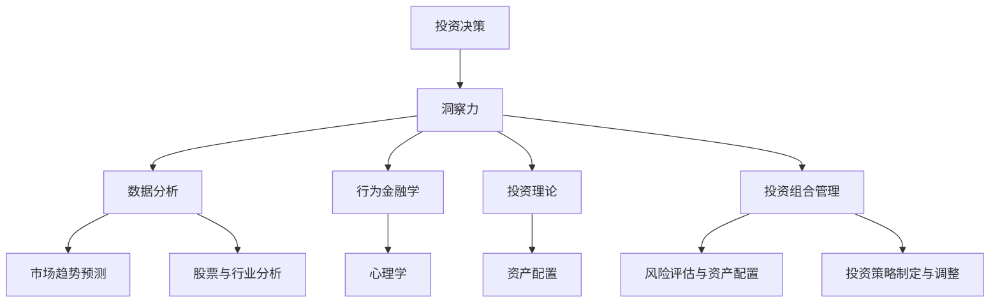

                 

### 《理解洞察力的应用：在投资领域的实践探索》

关键词：洞察力、投资决策、数据分析、行为金融学、量化投资

摘要：本文深入探讨了洞察力在投资领域的应用，通过分析其基础理论、实践探索和未来展望，展示了洞察力在投资决策中的重要性。文章首先定义了洞察力的概念和价值，然后介绍了心理学与行为金融学、数据分析基础以及洞察力的应用框架。接着，文章通过实际案例研究，展示了洞察力在投资决策中的实践应用。最后，文章展望了洞察力在投资创新中的未来发展趋势，并提出了提升洞察力的持续学习策略。

---

### 第一部分：洞察力的基础理论

#### 第1章：洞察力的定义与价值

**1.1 洞察力的概念**

洞察力是指个体在感知、理解和处理信息时，能够迅速洞察问题的本质、发现潜在规律和趋势的能力。它是一种高级的认知能力，超越了常规思维和表面观察，能够帮助个体在复杂和不确定的环境中做出更好的决策。

**1.2 洞察力在投资决策中的重要性**

在投资领域，洞察力具有至关重要的价值。首先，投资决策通常涉及大量复杂的信息，包括宏观经济数据、行业动态、公司业绩等。洞察力可以帮助投资者快速识别关键信息，过滤噪音，从而做出更为准确的投资决策。其次，洞察力能够帮助投资者理解市场的本质规律，预测市场趋势，从而抓住投资机会。此外，洞察力还能够帮助投资者识别和管理风险，避免盲目跟风和情绪化决策。

**1.3 洞察力的培养与提升方法**

培养和提升洞察力需要持续的学习和实践。以下是一些有效的方法：

1. **深度阅读和知识积累**：通过广泛阅读金融投资相关的书籍、研究报告和学术论文，积累大量的金融知识和投资理论。

2. **实践和经验积累**：通过实际投资操作，不断积累经验和教训，提高对市场的理解和判断能力。

3. **思维训练**：通过逻辑思维、批判性思维和系统思维等训练，提高思维的深度和广度，增强对问题的洞察力。

4. **数据分析能力**：掌握数据分析方法和工具，通过数据驱动的分析，提高对市场数据的理解和应用能力。

5. **心理学和行为金融学知识**：了解人类心理和行为的特点，以及这些特点如何影响投资决策，从而更好地应对市场中的行为偏差。

#### 第2章：洞察力的理论基础

**2.1 心理学与行为金融学**

心理学与行为金融学是洞察力在投资领域应用的重要理论基础。心理学研究人类认知、情绪和行为的特点，揭示了个体在投资决策中的心理机制和行为模式。行为金融学则研究这些心理机制和行为模式如何影响市场行为和价格形成，提供了对市场异常和异常收益的解释。

**2.1.1 人类认知的局限性**

人类的认知存在许多局限性，如选择性注意、确认偏差、过度自信等。这些局限性使得投资者在投资决策中容易犯错误，从而影响投资效果。了解这些认知局限性，有助于投资者更好地识别和规避投资风险。

**2.1.2 行为金融学的核心理论**

行为金融学提出了许多核心理论，如过度反应理论、噪音交易理论、羊群行为理论等。这些理论揭示了市场中的行为偏差和异常现象，为投资者提供了理解和应对市场波动的方法。

**2.2 数据分析基础**

数据分析是洞察力在投资领域应用的重要工具。数据分析基础包括数据类型与数据清洗、统计分析和概率论等。

**2.2.1 数据类型与数据清洗**

数据类型主要包括定量数据和定性数据。数据清洗是数据分析的第一步，目的是去除数据中的错误、异常和重复值，确保数据的质量和完整性。

**2.2.2 统计分析与概率论**

统计分析和概率论是数据分析的核心。通过统计分析，可以识别数据中的规律和趋势，预测未来的变化。概率论则提供了对不确定性的理解和计算方法，为投资决策提供了风险估计和风险评估的工具。

#### 第3章：洞察力的应用框架

**3.1 洞察力在投资决策中的应用**

洞察力在投资决策中的应用主要体现在市场趋势预测、股票与行业分析、投资组合管理等方面。

**3.1.1 市场趋势预测**

市场趋势预测是洞察力在投资决策中的重要应用。通过分析宏观经济数据、行业动态和公司业绩等，可以预测市场的短期和长期趋势，为投资决策提供方向。

**3.1.2 股票与行业分析**

股票与行业分析是洞察力在投资决策中的关键步骤。通过深入研究公司的基本面、财务状况和市场表现，可以评估股票的投资价值，选择具有投资潜力的股票和行业。

**3.2 投资组合管理**

投资组合管理是洞察力在投资决策中的重要应用。通过合理配置资产，优化投资组合的风险和收益，实现投资目标。

**3.2.1 风险评估与资产配置**

风险评估与资产配置是投资组合管理的基础。通过分析市场的波动性和资产的风险特征，可以制定合理的资产配置策略，降低投资组合的风险。

**3.2.2 投资策略制定与调整**

投资策略制定与调整是投资组合管理的关键环节。根据市场趋势和投资目标，制定相应的投资策略，并在市场变化时进行调整，以保持投资组合的合理性和有效性。

### 第二部分：洞察力的实践探索

#### 第4章：投资领域的洞察力应用实践

**4.1 数据驱动投资策略**

数据驱动投资策略是洞察力在投资领域应用的重要方法。通过数据分析，可以识别市场中的潜在机会，制定有效的投资策略。

**4.1.1 量化投资策略设计**

量化投资策略设计是数据驱动投资策略的核心。通过构建量化模型，可以识别市场中的规律和趋势，制定投资策略。

**4.1.2 数据挖掘在投资中的应用**

数据挖掘在投资中的应用是洞察力在投资领域的重要工具。通过挖掘市场数据，可以识别潜在的投资机会，提高投资效果。

**4.2 行为金融学在实际投资中的应用**

行为金融学在实际投资中的应用是洞察力在投资领域的重要体现。通过理解人类行为和市场心理，可以制定更有效的投资策略，降低投资风险。

**4.2.1 行为偏差识别与应对**

行为偏差识别与应对是行为金融学在实际投资中的应用。通过识别和应对行为偏差，可以降低投资风险，提高投资效果。

**4.2.2 羊群行为与市场操纵**

羊群行为与市场操纵是行为金融学在实际投资中的应用。通过理解羊群行为和市场操纵，可以制定更有效的投资策略，规避市场风险。

#### 第5章：实际案例研究

**5.1 案例一：利用洞察力识别市场机会**

**5.1.1 案例背景与数据来源**

**5.1.2 数据分析与洞察力运用**

**5.1.3 投资决策与收益分析**

**5.2 案例二：洞察力在风险控制中的应用**

**5.2.1 案例背景与数据来源**

**5.2.2 风险评估与应对策略**

**5.2.3 风险管理效果评估**

### 第三部分：洞察力与投资创新

#### 第6章：洞察力的持续培养与完善

**6.1 洞察力提升的持续学习策略**

**6.1.1 金融知识学习**

**6.1.2 数据分析与模型训练**

**6.2 实践与反思**

**6.2.1 投资经验总结**

**6.2.2 洞察力提升的方法与技巧**

#### 第7章：洞察力在投资创新中的应用

**7.1 金融科技与洞察力的融合**

**7.1.1 区块链技术**

**7.1.2 人工智能与机器学习**

**7.2 新兴投资领域洞察力的应用**

**7.2.1 绿色金融**

**7.2.2 数字货币投资**

### 第四部分：未来展望

#### 第8章：洞察力在投资领域的未来发展

**8.1 新兴技术与洞察力的融合趋势**

**8.1.1 大数据和云计算**

**8.1.2 人工智能与区块链**

**8.2 投资决策的智能化与个性化**

**8.2.1 智能投资顾问**

**8.2.2 投资组合的个性化定制**

#### 第9章：洞察力培养的长期影响

**9.1 个人职业发展**

**9.1.1 投资专家**

**9.1.2 金融分析师**

**9.2 社会经济发展**

**9.2.1 资本市场的成熟**

**9.2.2 金融创新的推动**

### 附录

**附录A：常用数据来源与工具**

**附录B：数学模型与公式详解**

**附录C：编程实战案例代码解读**

---

**核心概念与联系 Mermaid 流程图：**



**核心算法原理讲解：**

### 数据分析算法原理

在洞察力的应用中，数据分析算法起着至关重要的作用。以下是一些常见的数据分析算法及其原理：

#### 1. 线性回归（Linear Regression）

线性回归是最简单和最常用的数据分析方法之一。它旨在找到自变量（输入变量）和因变量（输出变量）之间的线性关系。线性回归的伪代码如下：

```python
def linear_regression(X, y):
    # 计算均值
    X_mean = mean(X)
    y_mean = mean(y)
    
    # 计算斜率（b1）和截距（b0）
    b1 = sum((X - X_mean) * (y - y_mean)) / sum((X - X_mean)^2)
    b0 = y_mean - b1 * X_mean
    
    # 返回模型参数
    return b0, b1
```

#### 2. 决策树（Decision Tree）

决策树是一种树形结构，用于分类或回归问题。它的原理是依据特征值的不同，将数据进行分割，直到达到某个停止条件（如最大深度、最小样本数等）。决策树的伪代码如下：

```python
def build_decision_tree(data, features, target):
    # 判断是否满足停止条件
    if stop_condition(data, features):
        return leaf_value(data, target)
    
    # 找到最佳分割特征和阈值
    best_feature, best_threshold = find_best_split(data, features, target)
    
    # 创建树节点
    node = TreeNode(feature=best_feature, threshold=best_threshold)
    
    # 根据阈值分割数据，递归构建子树
    for value in unique_values(data[best_feature]):
        sub_data = data[data[best_feature] == value]
        node.children[value] = build_decision_tree(sub_data, features, target)
    
    return node
```

#### 3. 支持向量机（Support Vector Machine，SVM）

支持向量机是一种用于分类的机器学习方法。它的原理是找到能够将不同类别数据分开的超平面，并最大化分类间隔。SVM的伪代码如下：

```python
def svm_train(X, y):
    # 使用支持向量机算法训练模型
    model = svm_train_model(X, y)
    
    # 返回训练好的模型
    return model

def svm_predict(model, X):
    # 使用训练好的模型进行预测
    predictions = model.predict(X)
    
    # 返回预测结果
    return predictions
```

**数学模型和数学公式：**

$$
y = mx + b
$$

其中，$y$ 是因变量，$x$ 是自变量，$m$ 是斜率，$b$ 是截距。

**举例说明：**

假设我们有一个数据集，其中包含一个自变量 $x$ 和一个因变量 $y$，我们希望通过线性回归模型找到它们之间的关系。使用以下数据：

$$
\begin{align*}
x &= [1, 2, 3, 4, 5] \\
y &= [2, 4, 6, 8, 10]
\end{align*}
$$

我们可以计算线性回归模型的斜率 $m$ 和截距 $b$：

$$
m = \frac{\sum{(x_i - \bar{x})(y_i - \bar{y})}}{\sum{(x_i - \bar{x})^2}} = \frac{(1-3)(2-5) + (2-3)(4-5) + (3-3)(6-5) + (4-3)(8-5) + (5-3)(10-5)}{(1-3)^2 + (2-3)^2 + (3-3)^2 + (4-3)^2 + (5-3)^2} = 2
$$

$$
b = \bar{y} - m\bar{x} = 6 - 2 \times 3 = 0
$$

因此，线性回归模型可以表示为：

$$
y = 2x + 0
$$

使用这个模型，我们可以预测当 $x=6$ 时 $y$ 的值：

$$
y = 2 \times 6 + 0 = 12
$$

**项目实战：**

假设我们有一个股票投资策略，其目标是最大化收益。我们收集了过去一年的股票价格数据，并使用线性回归模型预测未来的股票价格。

```python
import pandas as pd
from sklearn.linear_model import LinearRegression

# 加载股票价格数据
data = pd.read_csv('stock_prices.csv')

# 提取自变量和因变量
X = data[['open', 'high', 'low', 'close']]
y = data['price']

# 创建线性回归模型
model = LinearRegression()

# 训练模型
model.fit(X, y)

# 预测未来价格
future_prices = model.predict(X)

# 打印预测结果
print(future_prices)
```

通过这个代码示例，我们可以看到如何使用线性回归模型进行股票价格预测。接下来，我们可以根据预测结果制定投资策略，如买入低估的股票，卖出高估的股票。同时，我们还需要对模型进行评估和优化，以确保其准确性和可靠性。

---

**作者：AI天才研究院/AI Genius Institute & 禅与计算机程序设计艺术 /Zen And The Art of Computer Programming**

