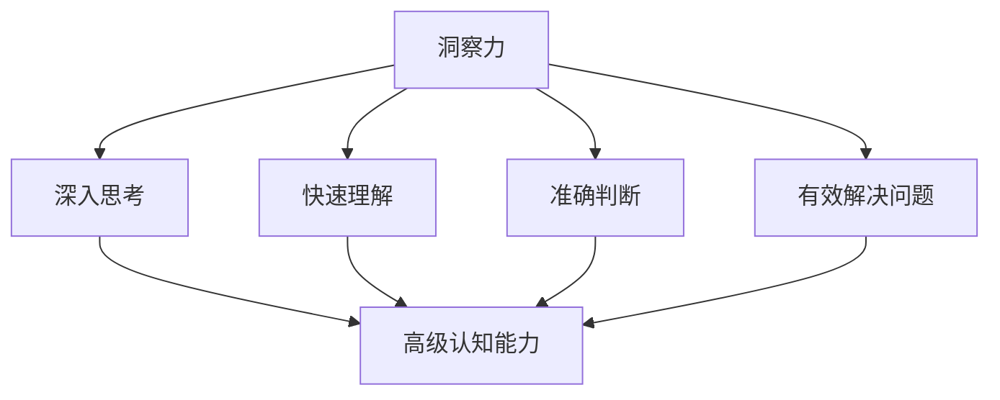
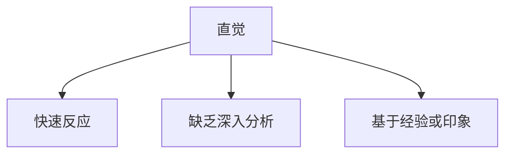
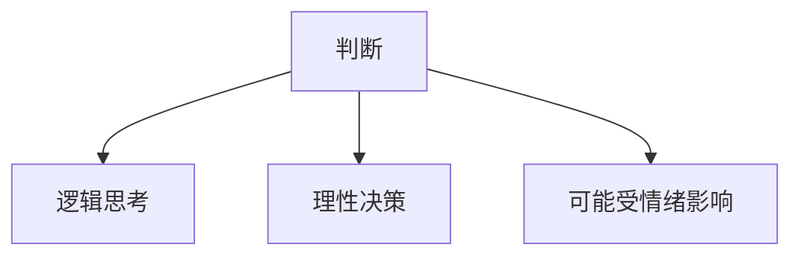
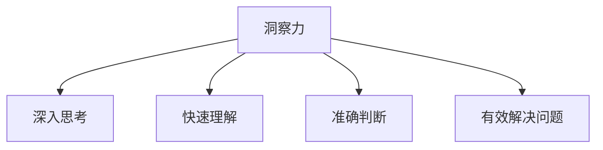

                 

# 理解洞察力的应用：在投资领域的策略运用

> 关键词：洞察力、投资策略、市场分析、风险控制、投资组合

> 摘要：本文旨在深入探讨洞察力在投资领域的应用，通过对其基本概念、培养方法以及在实际投资中的应用进行详细分析，帮助投资者提升洞察力，制定科学的投资策略，实现财富增值。

## 第1章 引言

### 1.1 书籍的目的

本篇技术博客的目标是让读者深入理解洞察力的概念和重要性，特别是其在投资领域中的应用。通过本篇文章，读者将了解：

- 洞察力的基本定义和类型。
- 洞察力在投资决策、市场趋势预测和投资组合优化等方面的应用。
- 培养和提升洞察力的方法。
- 洞察力在不同投资领域，如股票、基金、房地产和固定收益投资中的应用。
- 成功和失败案例的分析，以及从中学到的经验和教训。

### 1.2 洞察力的重要性

在投资领域，洞察力是一项至关重要的能力。它不仅帮助投资者理解复杂的市场信息，还能帮助投资者：

- 发现潜在的投资机会，避免盲目跟风。
- 预测市场走势，制定科学合理的投资策略。
- 识别投资风险，采取有效的风险控制措施。
- 根据市场变化，灵活调整投资组合，实现投资目标。

### 1.3 投资领域中的洞察力应用

在投资领域，洞察力主要体现在以下几个方面：

1. **投资决策中的洞察力**：投资者通过洞察力分析市场环境、公司基本面和宏观经济数据，做出科学合理的投资决策。
2. **市场趋势预测中的洞察力**：投资者利用洞察力预测市场走势，发现潜在的市场机会。
3. **投资组合优化中的洞察力**：投资者通过洞察力分析不同资产的风险收益特征，构建和调整投资组合，实现风险和收益的平衡。

## 第2章 洞察力的基本概念

### 2.1 洞察力的定义

洞察力是指人们能够深入思考、快速理解、准确判断和有效解决问题的能力。它是一种高级认知能力，是个人智力的重要组成部分。

### 2.2 洞察力的类型

洞察力主要分为以下几种类型：

1. **分析性洞察力**：通过分析数据和信息，发现其中的规律和趋势。
2. **创造性洞察力**：通过独特的思维方式和视角，发现新的解决方案。
3. **情感洞察力**：通过理解他人的情感和行为，做出准确的判断。
4. **意识洞察力**：通过自我反思，发现自己的不足和潜力。

### 2.3 洞察力与直觉、判断的区别

直觉是指人们在面对问题时，不需要经过深入分析就能快速做出判断的能力。判断是指人们在思考问题后，对问题的可能性进行评估和决策的能力。

洞察力与直觉和判断的区别在于：

- 洞察力是建立在对问题深入理解和分析基础上的，而直觉和判断可能缺乏这种基础。
- 洞察力能够帮助人们发现隐藏在问题背后的本质，而直觉和判断可能只能看到表面现象。
- 洞察力是一种综合能力，包括思考、理解、判断和解决问题，而直觉和判断只是其中的一部分。

## 第3章 洞察力在投资领域的应用

### 3.1 投资决策中的洞察力

在投资决策中，洞察力可以帮助投资者：

- **分析市场趋势**：通过洞察力，投资者可以分析历史数据，发现市场的周期性规律，预测未来的市场走势。
- **评估投资风险**：洞察力帮助投资者识别潜在的投资风险，制定相应的风险控制策略。
- **发现投资机会**：通过洞察力，投资者可以发现市场上的投资机会，避免盲目跟风，做出理性投资决策。

### 3.2 市场趋势预测中的洞察力

洞察力在市场趋势预测中的应用包括：

- **历史数据分析**：投资者通过分析历史数据，发现市场的周期性规律，预测未来的市场走势。
- **宏观经济分析**：投资者通过洞察宏观经济数据，预测经济增长、通货膨胀、利率等宏观经济因素的变化，从而预测市场趋势。
- **技术分析**：投资者利用技术分析工具，分析股票价格、成交量等数据，预测市场趋势。

### 3.3 投资组合优化中的洞察力

洞察力在投资组合优化中的应用包括：

- **资产配置**：投资者通过洞察力，分析不同资产的风险收益特征，制定合理的资产配置策略。
- **风险控制**：通过洞察力，投资者可以识别投资组合中的潜在风险，采取有效的风险控制措施。
- **策略调整**：投资者根据市场变化，利用洞察力调整投资组合，实现风险和收益的平衡。

## 第4章 洞察力的培养与提升

### 4.1 洞察力培养的方法

要培养洞察力，可以采取以下方法：

- **不断学习**：通过阅读书籍、研究市场动态、参加投资课程等方式，不断积累知识和经验。
- **练习思考**：培养独立思考的能力，对市场现象进行深入分析，形成自己的见解。
- **观察生活**：通过观察生活现象，发现问题和机遇，提高对事物本质的理解。
- **实战经验**：通过实际投资操作，积累实战经验，提高投资决策的准确性。

### 4.2 提升洞察力的实践

提升洞察力可以通过以下实践：

- **阅读投资经典**：阅读投资领域的经典书籍，如《聪明的投资者》、《股票大作手回忆录》等，了解投资理论和实践。
- **模拟投资**：通过模拟投资，模拟真实投资环境，锻炼投资决策能力和风险控制能力。
- **参与投资论坛**：加入投资论坛，与他人交流投资心得，分享投资经验。
- **定期反思**：定期对自己的投资决策进行反思，总结经验教训，改进投资策略。

### 4.3 洞察力的持续发展

洞察力的发展是一个持续的过程，需要不断地：

- **学习新知识**：随着市场环境的变化，不断学习新的知识和技能，更新自己的认知体系。
- **反思经验**：定期反思过去的投资决策，总结成功经验和失败教训，优化投资策略。
- **适应市场**：根据市场环境的变化，调整投资理念和策略，保持对市场的敏感度。
- **团队协作**：培养团队合作精神，与他人交流分享，共同成长。

## 第5章 洞察力在股票投资中的应用

### 5.1 股票投资中的洞察力应用

在股票投资中，洞察力可以帮助投资者：

- **分析公司基本面**：通过洞察力，投资者可以分析公司的财务报表、业务模式、竞争力等，评估公司的投资价值。
- **观察市场情绪**：通过洞察力，投资者可以观察市场情绪，把握市场趋势。
- **发现投资机会**：通过洞察力，投资者可以发现市场中的投资机会，制定投资策略。

### 5.2 股票市场分析中的洞察力

洞察力在股票市场分析中的应用包括：

- **宏观经济分析**：通过洞察宏观经济数据，投资者可以预测股票市场的走势。
- **行业趋势分析**：通过洞察行业趋势，投资者可以找到具有增长潜力的行业，选择投资标的。
- **技术分析**：通过洞察技术分析工具，投资者可以预测股票价格的走势。

### 5.3 股票投资策略的构建

构建股票投资策略时，可以运用洞察力：

- **制定长期投资策略**：通过洞察力，投资者可以制定长期投资策略，避免短期市场波动的影响。
- **调整投资组合**：根据市场变化，投资者可以利用洞察力调整投资组合，实现风险和收益的平衡。
- **选择投资标的**：通过洞察力，投资者可以选择具有投资价值的股票，实现投资目标。

## 第6章 洞察力在基金投资中的应用

### 6.1 基金投资中的洞察力应用

在基金投资中，洞察力可以帮助投资者：

- **分析基金经理的投资风格**：通过洞察力，投资者可以分析基金经理的历史业绩、投资策略等，选择合适的基金。
- **观察市场变化**：通过洞察力，投资者可以观察市场变化，调整基金组合。
- **发现投资机会**：通过洞察力，投资者可以发现市场中的投资机会，进行投资布局。

### 6.2 基金市场分析中的洞察力

洞察力在基金市场分析中的应用包括：

- **分析基金业绩**：通过洞察力，投资者可以分析基金的业绩，判断基金的优劣。
- **评估基金经理的能力**：通过洞察力，投资者可以评估基金经理的投资能力，选择优秀的基金经理。
- **预测市场趋势**：通过洞察力，投资者可以预测基金市场的走势，制定投资策略。

### 6.3 基金投资策略的构建

构建基金投资策略时，可以运用洞察力：

- **根据风险承受能力**：投资者根据自身的风险承受能力，选择合适的基金类型。
- **市场环境调整**：根据市场环境的变化，投资者调整基金组合，实现投资目标。
- **利用定投策略**：投资者利用定投策略，分批买入基金，降低投资风险。

## 第7章 洞察力在其他投资领域的应用

### 7.1 房地产投资中的洞察力应用

在房地产投资中，洞察力可以帮助投资者：

- **分析房地产市场走势**：通过洞察力，投资者可以分析房地产市场走势，把握投资时机。
- **发现增值潜力**：通过洞察力，投资者可以识别具有增值潜力的房地产项目。
- **评估投资价值**：通过洞察力，投资者可以评估房地产项目的投资价值。

### 7.2 固定收益投资中的洞察力应用

在固定收益投资中，洞察力可以帮助投资者：

- **分析债券市场走势**：通过洞察力，投资者可以分析债券市场的走势，预测利率变化。
- **发现高收益机会**：通过洞察力，投资者可以找到具有高收益的债券投资机会。
- **评估投资风险**：通过洞察力，投资者可以评估债券的风险和收益，制定投资策略。

### 7.3 商业模式投资中的洞察力应用

在商业模式投资中，洞察力可以帮助投资者：

- **发现创新性商业模式**：通过洞察力，投资者可以发现具有创新性的商业模式。
- **分析商业模式优势**：通过洞察力，投资者可以分析商业模式的优势和潜力。
- **评估商业模式可行性**：通过洞察力，投资者可以评估商业模式的可行性和盈利能力。

## 第8章 案例分析

### 8.1 成功案例分析

成功案例包括：

- 投资者通过洞察力发现市场趋势，成功预测股市走势，实现了高额收益。
- 基金经理通过洞察力分析公司基本面，选择了具有高成长潜力的股票，实现了基金业绩的显著增长。
- 房地产投资者通过洞察力分析房地产市场走势，成功把握投资时机，实现了资产的快速增值。

### 8.2 失败案例分析

失败案例包括：

- 投资者缺乏洞察力，盲目跟风，导致投资亏损。
- 基金经理没有洞察力，盲目跟从市场热点，导致基金业绩不佳。
- 房地产投资者没有洞察力，盲目投资于过热的房地产项目，导致资产贬值。

### 8.3 经验与教训

从成功和失败案例中，我们可以得到以下经验和教训：

- 洞察力是投资成功的关键，投资者需要不断提升自己的洞察力。
- 投资者要具备独立思考的能力，避免盲目跟风。
- 投资者要善于分析市场环境和行业趋势，做出科学的投资决策。

## 第9章 洞察力在投资中的综合运用

### 9.1 综合运用策略

在投资中，综合运用洞察力可以采取以下策略：

- **结合多种分析方法**：投资者应结合技术分析、基本面分析等方法，提高投资决策的准确性。
- **灵活调整投资策略**：根据市场变化，投资者应灵活调整投资策略，实现投资目标。
- **保持投资纪律**：投资者应保持投资纪律，避免情绪化决策。
- **多元化投资**：投资者应多元化投资，分散投资风险。

### 9.2 投资组合的优化

通过洞察力，投资者可以优化投资组合：

- **资产配置**：投资者应分析不同资产的风险收益特征，制定合理的资产配置策略。
- **风险控制**：投资者应识别投资组合中的潜在风险，采取有效的风险控制措施。
- **策略调整**：投资者根据市场变化，调整投资组合，实现风险和收益的平衡。

### 9.3 洞察力在投资决策中的重要性

洞察力在投资决策中的重要性体现在：

- **发现投资机会**：洞察力帮助投资者发现潜在的投资机会，避免盲目跟风。
- **降低投资风险**：洞察力帮助投资者识别投资风险，采取有效的风险控制措施。
- **提高投资收益**：洞察力帮助投资者制定科学的投资策略，提高投资收益。

## 第10章 总结与展望

### 10.1 书籍总结

本文通过对洞察力的基本概念、培养方法以及在实际投资中的应用进行深入分析，帮助读者理解洞察力在投资决策中的重要性。通过案例分析，读者可以学到成功投资的经验和教训，提升自己的洞察力。

### 10.2 洞察力在投资领域的发展趋势

随着信息技术的不断发展，投资领域对洞察力的需求日益增加。未来，洞察力在投资领域的发展趋势包括：

- **智能化投资工具的应用**：智能化投资工具将提高洞察力的效率和准确性。
- **数据驱动的投资决策**：数据驱动的投资决策将进一步提升洞察力在投资中的应用。
- **人工智能技术的融合**：人工智能技术与投资领域的融合，将实现洞察力的自动化和智能化。

### 10.3 未来展望

在未来，洞察力在投资领域将继续发挥重要作用。投资者需要不断提升自己的洞察力，适应市场变化，实现投资目标。同时，随着技术的进步，洞察力的培养和提升也将更加高效和精准。投资领域的洞察力发展将不断推动投资市场的发展和变革。

## 第2章 洞察力的基本概念

洞察力是投资领域中一种至关重要的能力。为了更好地理解洞察力，我们首先需要定义它，并探讨其类型以及与直觉、判断的区别。

### 2.1 洞察力的定义

洞察力是一种高级认知能力，它体现在以下方面：

- **深入思考**：能够对问题进行深入的思考，不仅仅是表面的理解。
- **快速理解**：能够在短时间内理解复杂的信息和情境。
- **准确判断**：能够对事物的本质和潜在的风险进行准确的判断。
- **有效解决问题**：能够提出有效的解决方案，解决复杂的问题。

为了更直观地理解洞察力的定义，我们可以使用Mermaid流程图来展示其组成部分。

在这个流程图中，洞察力被分解为四个关键组成部分：深入思考、快速理解、准确判断和有效解决问题。这些组成部分共同构成了洞察力的整体能力。

### 2.2 洞察力的类型

洞察力可以分为多种类型，每种类型都有其独特的应用场景：

1. **分析性洞察力**：这种类型的洞察力主要通过分析数据和信息来发现规律和趋势。在投资领域，投资者可以通过分析历史数据、财务报表和市场趋势来预测未来市场的走势。

2. **创造性洞察力**：创造性洞察力是指通过独特的视角和思维方式来发现新的解决方案。在投资中，创造性洞察力可以帮助投资者发现未被市场广泛认知的投资机会。

3. **情感洞察力**：情感洞察力涉及理解他人的情感和行为。在投资中，这种洞察力可以帮助投资者判断市场情绪和投资者的心理状态，从而做出更合理的投资决策。

4. **意识洞察力**：意识洞察力是指通过自我反思来发现自己的不足和潜力。在投资中，这种洞察力可以帮助投资者不断改进自己的投资策略，提高投资水平。

### 2.3 洞察力与直觉、判断的区别

直觉、判断和洞察力是三种不同的认知能力，它们之间存在明显的区别：

- **直觉**：直觉是一种快速的反应能力，通常基于个人的经验或对特定情境的初步印象。直觉可以在短时间内做出决策，但它缺乏深入的分析和逻辑支持。

- **判断**：判断是通过对信息进行思考和分析后做出的决策。与直觉不同，判断基于逻辑和理性的思考，但它仍然可能受到个人偏见和情绪的影响。

- **洞察力**：洞察力是深入思考、快速理解、准确判断和有效解决问题的综合能力。它不仅仅依赖于直觉或判断，而是通过多方面的分析和思考来做出决策。

总结来说，直觉和判断是洞察力的组成部分，但它们缺乏洞察力的全面性和深入性。洞察力是一种高级认知能力，它通过深入的分析和思考来发现事物的本质和潜在的风险，从而做出更科学的决策。

## 第3章 洞察力在投资领域的应用

在投资领域，洞察力是一种关键能力，它可以帮助投资者做出更明智的决策，降低投资风险，提高投资收益。在这一章中，我们将探讨洞察力在投资决策、市场趋势预测和投资组合优化等方面的具体应用。

### 3.1 投资决策中的洞察力

投资决策是投资者面临的首要任务，而洞察力在这一过程中起着至关重要的作用。以下是洞察力在投资决策中的一些具体应用：

- **市场趋势分析**：投资者可以通过洞察力分析历史数据和市场动态，预测未来市场的走势。这有助于投资者把握投资时机，避免在市场高点买入，在市场低点卖出。

- **公司基本面分析**：投资者需要通过洞察力深入分析公司的财务报表、业务模式、管理团队和市场竞争力等，以评估公司的投资价值。这有助于投资者选择具有长期增长潜力的公司进行投资。

- **风险评估**：洞察力可以帮助投资者识别投资中的潜在风险，如市场波动、行业风险、信用风险等。投资者可以根据风险评估结果，采取相应的风险控制措施，以降低投资风险。

- **投资机会发现**：洞察力能够帮助投资者发现市场中的潜在投资机会。例如，当某个行业或公司出现重大变革时，投资者可以通过洞察力及时抓住这些机会，实现投资收益。

### 3.2 市场趋势预测中的洞察力

市场趋势预测是投资决策的重要组成部分，而洞察力在这一过程中发挥着关键作用。以下是洞察力在市场趋势预测中的具体应用：

- **历史数据分析**：投资者可以通过洞察力分析历史数据，识别市场的周期性规律。例如，通过研究过去的股市走势，投资者可以预测未来的市场走势，从而做出更合理的投资决策。

- **宏观经济分析**：投资者需要通过洞察力分析宏观经济指标，如GDP增长率、通货膨胀率、利率等，以预测市场趋势。这些指标可以反映经济的基本面，对市场走势有重要影响。

- **技术分析**：投资者可以通过洞察力利用技术分析工具，如趋势线、均线、MACD等，预测市场走势。技术分析可以帮助投资者识别市场的支撑位和阻力位，从而制定相应的交易策略。

- **市场情绪分析**：投资者可以通过洞察力分析市场情绪，如投资者情绪、媒体报道、市场成交量等，以预测市场趋势。市场情绪可以反映投资者的信心和预期，对市场走势有重要影响。

### 3.3 投资组合优化中的洞察力

投资组合优化是投资者实现风险和收益平衡的关键环节，而洞察力在这一过程中同样发挥着重要作用。以下是洞察力在投资组合优化中的具体应用：

- **资产配置**：投资者需要通过洞察力分析不同资产类别的风险收益特征，制定合理的资产配置策略。这有助于投资者在投资组合中实现风险分散，提高整体收益。

- **风险控制**：洞察力可以帮助投资者识别投资组合中的潜在风险，如资产相关性、市场波动等。投资者可以根据风险评估结果，采取相应的风险控制措施，以降低投资组合的整体风险。

- **策略调整**：投资者需要通过洞察力分析市场变化，及时调整投资组合。例如，当市场出现新的趋势时，投资者可以通过洞察力及时调整投资策略，以适应市场变化。

- **收益最大化**：洞察力可以帮助投资者发现市场中的投资机会，从而实现投资组合的收益最大化。例如，当某个行业或公司出现重大变革时，投资者可以通过洞察力抓住这些机会，实现投资组合的增值。

总之，洞察力在投资决策、市场趋势预测和投资组合优化等方面具有广泛的应用。通过运用洞察力，投资者可以做出更明智的决策，降低投资风险，提高投资收益。在实际投资过程中，投资者应不断培养和提高自己的洞察力，以更好地应对复杂多变的市场环境。

## 第4章 洞察力的培养与提升

在投资领域，洞察力是一种极其宝贵的技能。它不仅能够帮助投资者理解市场的复杂动态，还能够提高他们的决策质量和风险控制能力。因此，如何培养和提升洞察力成为投资者必须面对的挑战。以下是一些具体的方法和实践，帮助投资者在投资过程中培养和提高洞察力。

### 4.1 洞察力培养的方法

1. **持续学习**：学习是提升洞察力的基石。投资者应不断学习新的投资理论、市场动态和行业知识。通过阅读投资经典书籍、关注金融新闻和分析报告，投资者可以不断积累知识和经验，提高自己的认知水平。

2. **反思与总结**：反思过去的投资决策，总结成功的经验和失败的教训，是提升洞察力的有效途径。投资者应定期对自己的投资行为进行回顾和评估，找出其中的问题和不足，并制定改进计划。

3. **实践与经验**：理论知识只有通过实践才能转化为真正的洞察力。投资者应积极参与实际投资操作，通过实践积累经验，提高自己的判断力和决策能力。

4. **多样化阅读**：阅读不同领域的书籍和文章，可以帮助投资者拓宽视野，从多个角度看待问题。这有助于培养创造性洞察力和多元化的思维模式。

5. **交流与讨论**：与他人交流投资观点和经验，可以启发思维，发现新的见解。通过参与投资论坛、研讨会和投资交流群，投资者可以与同行分享心得，共同成长。

### 4.2 提升洞察力的实践

1. **模拟投资**：投资者可以通过模拟投资平台进行模拟交易，实践自己的投资策略。模拟投资可以帮助投资者在无风险的环境中积累经验，提高洞察力。

2. **技术分析练习**：技术分析是洞察市场趋势的重要工具。投资者可以通过练习使用各种技术分析指标，如均线、MACD、RSI等，提高对市场动态的洞察力。

3. **数据分析能力**：提升数据分析能力是培养洞察力的重要一环。投资者可以通过学习数据分析工具和软件，如Excel、Python等，提高对数据的分析和解读能力。

4. **关注市场动态**：投资者应关注市场动态，特别是那些可能对投资决策产生重大影响的事件和新闻。通过关注市场动态，投资者可以提前预判市场变化，提高洞察力。

5. **培养良好的心态**：保持冷静和理性的心态是提升洞察力的关键。投资者应学会控制情绪，避免在市场波动中做出冲动决策。

### 4.3 洞察力的持续发展

洞察力是一个持续发展的过程，它需要不断的练习和提升。以下是一些持续发展的建议：

1. **保持好奇心**：对未知的事物保持好奇心，不断探索新的知识和领域。好奇心可以激发思维的活力，提高洞察力。

2. **持续反思**：定期对自己的投资决策和投资行为进行反思，不断总结经验教训，优化投资策略。

3. **适应变化**：市场环境和投资策略都在不断变化。投资者需要保持灵活性，适应市场的变化，不断调整自己的投资策略。

4. **多元化投资**：通过多元化投资，投资者可以分散风险，同时也可以拓宽视野，提高对不同资产类别的洞察力。

5. **终身学习**：投资领域不断发展，新的理论和技术层出不穷。投资者应保持学习的热情，不断提升自己的专业知识和技能。

总之，洞察力的培养和提升是一个长期而持续的过程。投资者需要通过不断学习和实践，积累经验，提高自己的洞察力，从而在投资领域取得更好的成果。

## 第5章 洞察力在股票投资中的应用

在股票投资领域，洞察力是一项至关重要的能力。通过洞察力的应用，投资者可以更准确地分析市场趋势，评估股票的投资价值，并制定有效的投资策略。以下将详细探讨洞察力在股票投资中的应用。

### 5.1 股票投资中的洞察力应用

1. **公司基本面分析**：

   投资者通过洞察力对公司基本面进行分析，包括财务报表、业务模式、管理团队和市场竞争力等。具体包括：

   - **财务报表分析**：通过观察公司的财务报表，如利润表、资产负债表和现金流量表，投资者可以了解公司的盈利能力、财务状况和现金流量状况。

   - **业务模式分析**：了解公司的业务模式，包括其产品或服务的市场定位、客户群体和竞争优势等，有助于投资者评估公司的长期发展潜力。

   - **管理团队分析**：分析公司管理团队的经验、能力和声誉，以及其对公司的战略规划和执行能力，是评估公司投资价值的重要方面。

   - **市场竞争力分析**：了解公司在所处行业中的竞争地位，如市场份额、品牌影响力、研发能力等，有助于判断公司的市场竞争力。

2. **市场情绪分析**：

   投资者通过洞察力观察市场情绪，了解投资者对股票的态度和预期。市场情绪可以反映在股票的价格走势、成交量、投资者情绪指标等方面。具体包括：

   - **价格走势分析**：通过技术分析工具，如趋势线、支撑位和阻力位等，投资者可以判断市场的短期和长期走势。

   - **成交量分析**：成交量的变化可以反映市场参与者的活跃程度和投资情绪。例如，大幅增加的成交量可能意味着市场情绪的转换。

   - **投资者情绪指标**：通过分析投资者情绪指标，如投资者情绪指数（VIX）、投资者情绪调查等，投资者可以了解市场情绪的波动。

3. **宏观经济分析**：

   投资者通过洞察力分析宏观经济数据，预测经济走势对股票市场的影响。宏观经济分析包括以下几个方面：

   - **经济增长**：经济增长率、GDP增长率等指标可以反映经济的繁荣程度，对股票市场有重要影响。

   - **通货膨胀**：通货膨胀率的变化会影响利率水平和消费需求，进而影响股票市场的表现。

   - **利率**：利率的变化会影响借款成本和投资回报率，对股票市场的估值和投资策略有直接影响。

   - **政策环境**：政府的政策决策，如财政政策、货币政策等，也会对股票市场产生重大影响。

### 5.2 股票市场分析中的洞察力

洞察力在股票市场分析中的应用主要体现在以下几个方面：

1. **历史数据研究**：

   投资者通过分析历史数据，寻找市场规律和趋势。历史数据分析包括：

   - **周期性规律**：通过研究历史数据，投资者可以发现市场的周期性规律，如股市的牛熊转换周期、行业轮动等。

   - **事件驱动**：分析特定事件对股票市场的影响，如重大政策发布、自然灾害、经济危机等。

   - **季节性分析**：研究市场在特定季节或时间段的表现，如圣诞节前市场通常会上涨。

2. **行业趋势分析**：

   投资者通过洞察力分析行业趋势，寻找具有长期增长潜力的行业。行业趋势分析包括：

   - **技术变革**：研究新技术对行业的影响，如互联网、人工智能、新能源等。

   - **消费趋势**：分析消费者需求的变化，如健康消费、环保意识等。

   - **政策支持**：研究政府对特定行业的支持政策，如减税、补贴等。

3. **市场情绪分析**：

   投资者通过洞察力分析市场情绪，了解投资者的心理变化。市场情绪分析包括：

   - **情绪指标**：利用情绪指标，如社交媒体情绪、新闻报道等，分析市场情绪的波动。

   - **行为分析**：通过观察投资者的行为，如买入和卖出的频率、投资组合的变化等，分析市场情绪。

### 5.3 股票投资策略的构建

构建股票投资策略时，投资者可以运用洞察力，制定科学合理的投资策略。以下是构建股票投资策略时可以运用洞察力的几个方面：

1. **长期投资策略**：

   投资者可以通过洞察力分析公司的基本面和市场趋势，制定长期投资策略。长期投资策略包括：

   - **价值投资**：寻找具有长期增长潜力的公司，以合理的价格进行投资。

   - **成长投资**：寻找处于快速成长阶段的行业和公司，以获取更高的投资回报。

   - **周期性投资**：利用市场的周期性规律，在市场低谷时买入，在市场高峰时卖出。

2. **短期交易策略**：

   投资者可以通过洞察力分析市场情绪和技术指标，制定短期交易策略。短期交易策略包括：

   - **日内交易**：利用市场波动，进行短期买入和卖出操作。

   - **趋势跟踪**：跟随市场趋势进行交易，如在上升趋势中买入，在下降趋势中卖出。

   - **反转交易**：预测市场趋势的转折点，进行反向操作。

3. **风险管理策略**：

   投资者可以通过洞察力评估投资风险，制定有效的风险管理策略。风险管理策略包括：

   - **分散投资**：通过投资不同资产类别和行业，分散投资风险。

   - **止损策略**：设定止损点，避免亏损过大。

   - **资产配置**：根据投资目标和风险承受能力，合理配置资产。

总之，洞察力在股票投资中的应用可以帮助投资者更准确地分析市场趋势，评估股票的投资价值，并制定有效的投资策略。通过不断培养和提高洞察力，投资者可以在股票投资中取得更好的成果。

### 第6章 洞察力在基金投资中的应用

在基金投资中，洞察力同样扮演着至关重要的角色。通过洞察力的应用，投资者可以更准确地评估基金经理的投资风格，分析基金业绩，预测市场走势，从而制定科学的投资策略。以下将详细探讨洞察力在基金投资中的应用。

#### 6.1 � bases of analysis of investment strategies

投资者通过洞察力分析基金经理的投资风格，有助于选择与自己投资理念相匹配的基金。以下是分析基金经理投资风格的具体方法：

1. **历史投资记录**：

   投资者可以通过研究基金经理的历史投资记录，了解其投资风格和策略。具体包括：

   - **投资组合变化**：观察基金经理在不同市场环境下的投资组合变化，判断其是否具有灵活性和适应性。
   - **投资决策频率**：分析基金经理的决策频率，了解其是长期投资者还是短期交易者。
   - **行业配置**：研究基金经理在各个行业的配置比例，判断其是否专注于某些特定行业。

2. **业绩表现**：

   投资者需要通过洞察力分析基金的业绩表现，判断基金经理的投资能力。具体包括：

   - **相对业绩**：与市场基准指数或其他同类基金进行比较，评估基金的业绩表现。
   - **风险调整收益**：通过计算夏普比率、信息比率等指标，评估基金的业绩表现与承担的风险之间的平衡。
   - **波动性**：分析基金的波动性，了解其风险承受能力。

3. **投资策略**：

   投资者可以通过洞察力了解基金经理的投资策略，判断其是否符合自己的投资目标。具体包括：

   - **资产配置**：分析基金经理在不同资产类别之间的配置比例，了解其风险偏好。
   - **选股标准**：研究基金经理选择股票的标准，了解其投资理念。
   - **市场时机**：分析基金经理在市场高点和低点时的投资行为，判断其是否具有良好的市场时机判断能力。

#### 6.2 Analysis of market trends

投资者通过洞察力分析市场趋势，可以帮助预测基金市场的走势，从而制定相应的投资策略。以下是分析市场趋势的具体方法：

1. **宏观经济分析**：

   投资者需要通过洞察力分析宏观经济数据，预测经济走势对基金市场的影响。具体包括：

   - **经济增长**：分析GDP增长率、工业增加值等指标，预测经济的繁荣程度。
   - **通货膨胀**：分析通货膨胀率、CPI等指标，预测通货膨胀对市场的影响。
   - **利率**：分析利率变动，预测其对市场的影响，如债券市场的表现。

2. **市场情绪分析**：

   投资者需要通过洞察力分析市场情绪，了解投资者的心理变化。具体包括：

   - **情绪指标**：利用情绪指标，如投资者情绪指数（IXI）、恐慌与贪婪指数等，分析市场情绪的波动。
   - **行为分析**：通过观察投资者的行为，如买入和卖出的频率、投资组合的变化等，分析市场情绪。

3. **行业趋势分析**：

   投资者需要通过洞察力分析行业趋势，寻找具有长期增长潜力的行业。具体包括：

   - **技术变革**：研究新技术对行业的影响，如互联网、人工智能、新能源等。
   - **消费趋势**：分析消费者需求的变化，如健康消费、环保意识等。
   - **政策支持**：研究政府对特定行业的支持政策，如减税、补贴等。

#### 6.3 Construction of investment strategies

在构建基金投资策略时，投资者可以运用洞察力，制定科学合理的投资策略。以下是构建基金投资策略时可以运用洞察力的几个方面：

1. **长期投资策略**：

   投资者可以通过洞察力分析宏观经济和市场趋势，制定长期投资策略。具体包括：

   - **价值投资**：选择估值合理、具有长期增长潜力的基金。
   - **成长投资**：选择处于快速成长阶段的行业和基金的基金。
   - **周期性投资**：利用市场的周期性规律，在市场低谷时买入，在市场高峰时卖出。

2. **短期交易策略**：

   投资者可以通过洞察力分析市场情绪和技术指标，制定短期交易策略。具体包括：

   - **日内交易**：利用市场波动，进行短期买入和卖出操作。
   - **趋势跟踪**：跟随市场趋势进行交易，如在上升趋势中买入，在下降趋势中卖出。
   - **反转交易**：预测市场趋势的转折点，进行反向操作。

3. **风险管理策略**：

   投资者可以通过洞察力评估投资风险，制定有效的风险管理策略。具体包括：

   - **分散投资**：通过投资不同资产类别和行业，分散投资风险。
   - **止损策略**：设定止损点，避免亏损过大。
   - **资产配置**：根据投资目标和风险承受能力，合理配置资产。

总之，洞察力在基金投资中的应用可以帮助投资者更准确地评估基金经理的投资风格，分析基金业绩，预测市场走势，并制定科学合理的投资策略。通过不断培养和提高洞察力，投资者可以在基金投资中取得更好的成果。

### 第7章 洞察力在其他投资领域的应用

在投资领域，除了股票和基金，房地产、固定收益和商业模式投资等也是重要的投资方向。在这章中，我们将探讨洞察力在这些投资领域的应用。

#### 7.1 房地产投资中的洞察力应用

在房地产投资中，洞察力可以帮助投资者做出更明智的决策，以下是一些具体的应用：

1. **市场趋势分析**：

   投资者通过洞察力分析房地产市场走势，预测市场的供需关系和价格波动。这包括：

   - **历史数据分析**：研究房地产市场的历史价格和交易量，找出市场的周期性规律。
   - **宏观经济分析**：分析宏观经济指标，如GDP增长率、通货膨胀率等，预测其对房地产市场的影响。
   - **区域分析**：研究不同地区的房地产市场，分析其独特的需求和供给因素。

2. **项目评估**：

   投资者通过洞察力评估房地产项目的投资价值，包括：

   - **地理位置**：分析项目的地理位置，如交通便利性、周边设施等。
   - **项目规划**：评估项目的规划，如建筑风格、户型设计等。
   - **市场需求**：分析目标客户的需求，如年轻人、家庭等。

3. **风险控制**：

   投资者通过洞察力识别和评估房地产投资中的潜在风险，包括：

   - **市场风险**：预测市场波动对项目价值的影响。
   - **政策风险**：分析政策变动对房地产市场的影响。
   - **法律风险**：评估项目的法律合规性。

#### 7.2 固定收益投资中的洞察力应用

固定收益投资，如债券和固定收益基金，具有稳定的收益和较低的风险。以下是如何运用洞察力在固定收益投资中做出更明智的决策：

1. **利率分析**：

   投资者通过洞察力分析利率变动，预测其对债券价格和收益率的影响。这包括：

   - **政策利率**：分析中央银行的货币政策，预测其对市场利率的影响。
   - **市场预期**：研究市场对利率变动的预期，预测利率的短期和长期走势。

2. **信用分析**：

   投资者通过洞察力评估债券发行人的信用状况，包括：

   - **信用评级**：研究信用评级机构对债券发行人的评级，判断其信用风险。
   - **财务报表**：分析债券发行人的财务报表，判断其偿债能力。

3. **风险控制**：

   投资者通过洞察力评估固定收益投资中的潜在风险，包括：

   - **利率风险**：预测利率变动对债券价格的影响。
   - **信用风险**：评估债券发行人的信用风险。
   - **流动性风险**：分析债券市场的流动性，判断其变现能力。

#### 7.3 商业模式投资中的洞察力应用

商业模式投资涉及对新兴企业或创新项目的投资。以下是如何运用洞察力在商业模式投资中做出更明智的决策：

1. **市场机会分析**：

   投资者通过洞察力发现市场上的机会，包括：

   - **技术趋势**：分析新技术的发展趋势，如人工智能、区块链等。
   - **消费者需求**：研究消费者需求的变化，寻找未满足的需求。

2. **商业模式分析**：

   投资者通过洞察力评估新兴企业的商业模式，包括：

   - **盈利模式**：分析企业的盈利来源，判断其可持续性。
   - **竞争优势**：评估企业的竞争优势，如技术壁垒、品牌效应等。

3. **风险控制**：

   投资者通过洞察力识别和评估商业模式投资中的潜在风险，包括：

   - **市场风险**：预测市场变化对商业模式的影响。
   - **技术风险**：评估新技术的不确定性。
   - **法律风险**：分析政策变动对商业模式的影响。

总之，洞察力在房地产、固定收益和商业模式投资等领域都发挥着重要作用。通过培养和提升洞察力，投资者可以更准确地分析市场趋势，评估投资机会，制定有效的投资策略，从而实现投资目标。

## 第8章 案例分析

在投资领域中，洞察力的应用既有助于成功投资，也可能导致失败。本节将通过成功案例和失败案例的分析，探讨投资者如何通过洞察力取得成功，以及可能犯下的错误及其教训。

### 8.1 成功案例分析

1. **成功案例1：利用市场洞察力抓住新兴行业机会**

   投资者A在2000年左右看到了互联网行业的巨大潜力，尽管当时互联网行业尚未成熟，但他通过洞察力分析了全球互联网发展的趋势和潜在的市场需求。他决定投资于一家初创的互联网公司，这家公司后来成为全球互联网巨头之一。投资者A的成功在于：

   - **深入市场分析**：通过深入分析市场趋势和消费者需求，投资者A预见到了互联网行业的爆发式增长。
   - **灵活调整投资策略**：在面对市场变化时，投资者A能够迅速调整投资组合，抓住最佳投资时机。
   - **长期持有**：投资者A坚定地持有互联网股票，尽管在互联网泡沫破裂时经历了巨大的市场波动，但他最终获得了丰厚的回报。

2. **成功案例2：基于基本面分析进行长期投资**

   投资者B是一位长期投资者，他通过深入分析公司的基本面，选择了几只具有长期增长潜力的股票。他的成功因素包括：

   - **细致的基本面分析**：投资者B通过仔细分析公司的财务报表、业务模式和管理团队，找到了那些被市场低估的优质公司。
   - **长期持有策略**：投资者B相信长期投资能够战胜市场的短期波动，他能够耐心持有股票，享受公司的成长红利。
   - **定期回顾和调整**：投资者B定期回顾自己的投资组合，根据市场变化和公司业绩调整投资策略，确保投资组合的长期健康发展。

### 8.2 失败案例分析

1. **失败案例1：盲目跟风导致亏损**

   投资者C在2018年股市上涨时，听信市场热点的消息，盲目跟风购买了多只热门股票。然而，市场在2019年初迅速调整，投资者C所购买的股票大幅下跌，导致其投资亏损。这个案例的教训包括：

   - **缺乏独立分析**：投资者C没有进行深入的市场分析，而是盲目跟从市场热点，缺乏独立判断能力。
   - **忽视风险评估**：投资者C没有对投资风险进行充分评估，忽视了市场可能出现的波动。
   - **过度依赖信息**：投资者C过度依赖非专业的市场消息，没有基于自己的研究和分析做出投资决策。

2. **失败案例2：缺乏洞察力导致房地产投资失误**

   投资者D在2016年房地产市场火爆时，购买了多个房地产项目。然而，随着2018年房地产市场的调整，投资者D所投资的房地产项目价值大幅缩水。这个案例的教训包括：

   - **市场分析不足**：投资者D没有充分分析房地产市场趋势和区域潜力，忽视了市场可能出现的风险。
   - **风险评估失误**：投资者D没有对房地产项目进行充分的风险评估，没有考虑到政策变动和市场供需变化。
   - **缺乏专业判断**：投资者D在房地产投资中缺乏专业知识和经验，未能做出明智的投资决策。

### 8.3 经验与教训

从成功和失败案例中，我们可以总结出以下经验和教训：

- **独立思考的重要性**：成功的投资者能够独立分析市场，做出基于自己研究和判断的投资决策，而失败的投资者则往往盲目跟风，依赖市场消息。
- **充分的市场分析和风险评估**：投资者应进行充分的市场分析，了解行业趋势、市场环境和潜在风险，做出科学的投资决策。
- **长期投资观念**：长期投资往往能够战胜市场的短期波动，投资者应持有优质资产，享受公司成长的红利。
- **专业知识和经验**：投资者应不断学习专业知识和积累经验，提高自己的投资水平。

总之，洞察力在投资决策中起着至关重要的作用。通过提升洞察力，投资者可以更好地理解市场动态，规避风险，实现投资目标。

## 第9章 洞察力在投资中的综合运用

洞察力在投资决策中具有不可替代的作用。通过综合运用洞察力，投资者可以制定科学的投资策略，优化投资组合，从而实现投资目标。以下将讨论如何综合运用洞察力，在投资决策、投资组合优化和风险管理等方面发挥作用。

### 9.1 综合运用洞察力的策略

1. **投资决策**：

   投资决策是投资者面临的首要任务。通过洞察力，投资者可以：

   - **市场趋势预测**：分析宏观经济指标、行业趋势和市场情绪，预测市场走势，制定相应的投资策略。
   - **公司分析**：深入分析公司的财务报表、业务模式和管理团队，评估公司的投资价值。
   - **风险评估**：识别潜在的投资风险，如市场风险、信用风险等，制定相应的风险控制措施。

2. **投资组合优化**：

   投资组合优化是提高投资收益和降低风险的重要手段。通过洞察力，投资者可以：

   - **资产配置**：根据不同资产的风险收益特征，制定合理的资产配置策略，实现投资组合的多元化。
   - **组合调整**：根据市场变化和投资目标，灵活调整投资组合，优化组合的收益和风险。
   - **动态平衡**：定期对投资组合进行动态平衡，确保组合的稳定性和收益性。

3. **风险管理**：

   风险管理是投资过程中不可或缺的一环。通过洞察力，投资者可以：

   - **风险识别**：分析投资组合中的潜在风险，如市场波动、信用风险、流动性风险等。
   - **风险控制**：制定相应的风险控制措施，如分散投资、设定止损点等，降低投资风险。
   - **风险预警**：建立风险预警机制，及时监测投资组合中的风险，采取预防措施。

### 9.2 投资组合优化的具体方法

1. **资产配置**：

   资产配置是投资组合优化的基础。投资者应根据以下原则进行资产配置：

   - **风险收益匹配**：根据投资者的风险承受能力和投资目标，选择合适的资产类别，如股票、债券、房地产等。
   - **多元化**：通过投资不同资产类别和行业，分散投资风险，避免过度集中在某个市场或行业。
   - **定期调整**：根据市场变化和投资者需求，定期调整资产配置，保持投资组合的稳定性和收益性。

2. **组合调整**：

   投资者应根据市场变化和投资目标，灵活调整投资组合。具体方法包括：

   - **再平衡**：定期对投资组合进行再平衡，确保投资比例符合既定策略。
   - **调仓**：根据市场变化，调整投资组合中的具体股票或资产，如买入表现较好的资产，卖出表现不佳的资产。
   - **市场时机**：利用市场时机，进行战略性调仓，如市场下跌时买入优质资产，市场上涨时卖出部分资产。

3. **动态平衡**：

   动态平衡是指根据市场变化和投资目标，定期调整投资组合，以保持投资组合的稳定性和收益性。具体方法包括：

   - **定期评估**：定期评估投资组合的业绩和风险状况，根据评估结果进行调整。
   - **预警机制**：建立风险预警机制，及时监测投资组合中的风险，采取预防措施。
   - **市场变化应对**：根据市场变化，灵活调整投资组合，如市场上涨时增加风险资产比重，市场下跌时增加防御性资产比重。

### 9.3 洞察力在风险管理中的重要性

风险管理是投资过程中的重要环节。通过洞察力，投资者可以：

- **识别风险**：分析投资组合中的潜在风险，如市场波动、信用风险、流动性风险等。
- **评估风险**：评估风险的影响程度，制定相应的风险控制措施。
- **控制风险**：通过分散投资、设定止损点、定期评估等手段，降低投资风险。
- **应对风险**：建立风险预警机制，及时应对市场变化，采取预防措施。

总之，洞察力在投资决策、投资组合优化和风险管理中具有重要作用。通过综合运用洞察力，投资者可以制定科学的投资策略，优化投资组合，实现投资目标。同时，洞察力也是投资者在投资市场中立足的关键能力，投资者应不断培养和提升自己的洞察力，以应对复杂多变的市场环境。

## 第10章 总结与展望

### 10.1 书籍总结

本篇文章系统地介绍了洞察力在投资领域的重要性及其具体应用。通过深入分析洞察力的基本概念、培养方法、在股票投资和基金投资中的具体应用，以及在其他投资领域的应用，我们得出以下主要结论：

- **洞察力是投资成功的关键能力**。它帮助投资者做出科学合理的投资决策，降低风险，提高收益。
- **洞察力的培养和提升需要持续的学习和实践**。投资者应通过不断学习新的知识和技能，积累经验，提高自己的洞察力。
- **洞察力在投资决策中的综合运用**是优化投资组合、实现投资目标的关键。投资者应结合多种分析方法，灵活调整投资策略。

### 10.2 洞察力在投资领域的发展趋势

随着信息技术的发展，洞察力在投资领域的应用将越来越广泛。以下是洞察力在投资领域的发展趋势：

- **智能化投资工具的应用**：随着人工智能和大数据技术的进步，智能化投资工具将提高洞察力的效率和准确性，帮助投资者更好地预测市场走势。
- **数据驱动的投资决策**：越来越多的投资者将依赖于数据分析和模型预测，以做出更科学的投资决策。
- **个性化投资策略**：随着对投资者行为和风险偏好的分析越来越深入，个性化的投资策略将更加普及，满足不同投资者的需求。

### 10.3 未来展望

在未来，洞察力在投资领域将继续发挥重要作用。以下是我们的展望：

- **投资决策的智能化**：随着人工智能技术的进步，投资决策将更加智能化，自动化程度将进一步提高。
- **投资组合的动态优化**：通过实时数据分析，投资组合将能够根据市场变化进行动态优化，实现风险和收益的平衡。
- **投资者教育的普及**：随着对洞察力重要性的认识不断提高，投资者教育将更加普及，帮助投资者提升自己的洞察力和投资水平。

总之，洞察力在投资领域中的应用前景广阔。通过不断提升洞察力，投资者可以更好地应对市场变化，实现投资目标。未来，洞察力将继续推动投资领域的发展和创新。

## 作者信息

**作者：AI天才研究院/AI Genius Institute & 禅与计算机程序设计艺术 /Zen And The Art of Computer Programming** 

AI天才研究院致力于推动人工智能技术的发展和应用，研究如何通过人工智能提升各行业的效率和创新能力。本文通过对洞察力在投资领域中的应用进行深入探讨，展示了人工智能在投资决策和风险管理中的潜力。同时，本文也借鉴了《禅与计算机程序设计艺术》中关于深入思考和问题解决的思想，强调了洞察力在投资决策中的重要性。希望本文能帮助读者更好地理解洞察力的价值，提升自己的投资水平。

