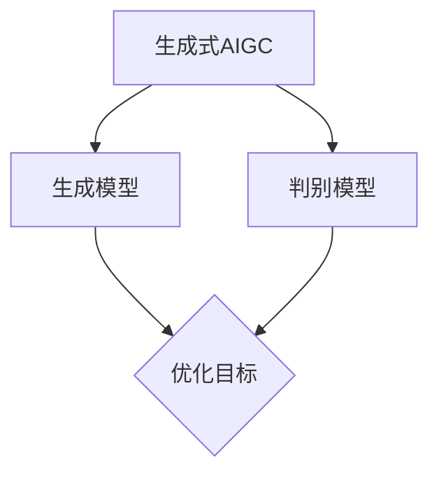

                 

# 文章标题：生成式AIGC是金矿还是泡沫：数据才是关键

> 关键词：生成式AIGC、数据质量、模型性能、技术挑战、应用实践

> 摘要：随着生成式人工智能生成内容（AIGC）技术的快速发展，其在图像生成、自然语言处理、语音合成等多个领域的应用引发了广泛关注。然而，AIGC技术是否真的如同金矿般充满潜力，还是仅仅一场泡沫？本文将从数据的角度，深入探讨生成式AIGC技术的本质、关键挑战及其未来发展。

----------------------------------------------------------------

### 目录大纲：生成式AIGC是金矿还是泡沫：数据才是关键

#### 第一部分：生成式AIGC概述

#### 第二部分：数据在AIGC中的作用

#### 第三部分：AIGC项目实战

#### 第四部分：未来发展趋势与挑战

#### 附录

---

#### 第一部分：生成式AIGC概述

### 第1章：生成式AIGC的概念与背景

#### 1.1 生成式AIGC的基本概念

**1.1.1 生成式AIGC的定义**

生成式人工智能生成内容（AIGC，Auto-Generative AI Content）是一种利用人工智能技术生成文本、图像、音频等内容的系统。生成式AIGC通过学习大量的数据，构建起一个能够生成新内容的模型，其核心在于“生成”，即自动生成符合某种模式或规则的内容。

**1.1.2 生成式AIGC与生成对抗网络（GAN）的联系与区别**

生成对抗网络（GAN）是生成式AIGC的一个重要组成部分。GAN由两个神经网络——生成器和判别器构成。生成器生成假数据，判别器则判断这些数据是否真实。通过不断训练，生成器的生成数据越来越逼真，判别器也越来越难以区分真实数据和假数据。

与GAN相比，生成式AIGC不仅包括GAN，还包括其他生成模型，如变分自编码器（VAE）、递归生成网络（RNN）等。AIGC更强调生成内容的多样性和适用性。

**1.1.3 生成式AIGC的发展历程**

生成式AIGC的发展可以追溯到20世纪80年代，当时研究者们开始探索神经网络在数据生成方面的应用。2006年，Ian Goodfellow等人提出了GAN，成为生成式AIGC的重要里程碑。随后，随着深度学习和大数据技术的发展，生成式AIGC取得了飞速进展，在多个领域展现出了巨大的潜力。

#### 1.2 生成式AIGC的核心组成部分

**1.2.1 数据生成模块**

数据生成模块是生成式AIGC的核心，负责生成新的数据。根据生成模型的不同，数据生成模块可以采用神经网络、规则引擎等多种实现方式。

**1.2.2 模式识别模块**

模式识别模块负责判断生成数据的质量和真实性。在GAN中，判别器就充当了模式识别的角色，通过对比生成数据和真实数据，判断其优劣。

**1.2.3 优化模块**

优化模块用于调整生成模型和判别模型的参数，以实现更好的生成效果。常见的优化算法包括梯度下降、随机梯度下降等。

#### 1.3 生成式AIGC的应用场景

**1.3.1 图像生成与处理**

图像生成是生成式AIGC的重要应用之一。通过GAN等模型，可以生成高质量、多样化的图像，应用于游戏开发、虚拟现实、广告设计等领域。

**1.3.2 自然语言处理**

在自然语言处理领域，生成式AIGC可以用于生成文章、对话、诗歌等文本。例如，OpenAI的GPT-3模型就是一款基于生成式AIGC的强大文本生成工具。

**1.3.3 语音合成与识别**

生成式AIGC还可以应用于语音合成与识别。通过训练生成模型，可以合成逼真的语音，应用于智能助手、语音导航等场景。

**1.3.4 其他应用领域**

除了上述领域，生成式AIGC还广泛应用于音乐生成、视频合成、药物研发等多个领域，展现出强大的生命力。

----------------------------------------------------------------

#### 第二部分：数据在AIGC中的作用

### 第2章：生成式AIGC的技术基础

#### 2.1 深度学习基础

**2.1.1 神经网络基本结构**

神经网络是生成式AIGC的核心组成部分。一个简单的神经网络由输入层、隐藏层和输出层组成。通过多层神经元的非线性变换，神经网络能够从输入数据中提取特征，实现复杂的数据处理任务。

**2.1.2 深度学习优化算法**

深度学习优化算法用于调整神经网络参数，以实现更好的模型性能。常见的优化算法包括梯度下降、随机梯度下降、Adam优化器等。这些算法在训练过程中，通过不断调整模型参数，使得模型在训练数据上的误差最小。

**2.1.3 深度学习框架简介**

深度学习框架是用于实现和训练神经网络的一套工具。常见的深度学习框架包括TensorFlow、PyTorch、Keras等。这些框架提供了丰富的神经网络架构和优化算法，使得深度学习模型的开发和训练变得更加便捷。

#### 2.2 数据生成模型原理

**2.2.1 生成式模型与判别式模型**

生成式模型和判别式模型是生成式AIGC的两个核心模型。生成式模型负责生成新数据，判别式模型则负责判断生成数据的质量。在GAN中，生成器和判别器分别代表了生成式模型和判别式模型。

**2.2.2 生成式模型的训练方法**

生成式模型的训练方法主要包括两种：生成对抗训练和变分自编码器训练。生成对抗训练通过生成器和判别器的对抗训练，使得生成器生成的数据越来越逼真。变分自编码器训练则通过编码器和解码器的协作，实现数据的生成。

**2.2.3 GAN训练过程中的问题与解决方案**

在GAN的训练过程中，常见的问题包括模式崩溃、梯度消失等。针对这些问题，研究者们提出了多种解决方案，如梯度惩罚、谱归一化、集成训练等。

#### 2.3 模式识别与优化

**2.3.1 模式识别基本概念**

模式识别是生成式AIGC中的一个重要环节。模式识别模型通过对生成数据的分析，判断其是否符合预期。常见的模式识别算法包括支持向量机（SVM）、决策树、神经网络等。

**2.3.2 优化算法在AIGC中的应用**

优化算法在生成式AIGC中起着至关重要的作用。通过优化算法，可以调整生成模型和判别模型的参数，实现更好的生成效果。常见的优化算法包括梯度下降、随机梯度下降、Adam优化器等。

----------------------------------------------------------------

### 第3章：数据在AIGC中的重要性

#### 3.1 数据质量与AIGC性能的关系

**3.1.1 数据质量的定义**

数据质量是指数据在满足特定需求和使用目的时，是否可靠、准确、完整、一致和及时。对于生成式AIGC来说，数据质量直接影响模型性能和生成效果。

**3.1.2 数据质量对AIGC模型的影响**

高质量的数据有助于提升生成式AIGC模型的性能和生成效果。相反，低质量的数据可能导致模型过拟合、生成结果不真实等问题。

**3.1.3 提高数据质量的策略**

1. **数据清洗**：去除数据中的噪声、错误和冗余信息。
2. **数据标准化与归一化**：将不同来源、不同尺度的数据进行统一处理，提高数据的一致性。
3. **数据增强**：通过扩展、变换和生成等方式，增加数据集的多样性，提高模型的泛化能力。

#### 3.2 数据预处理

**3.2.1 数据清洗**

数据清洗是数据预处理的重要步骤。通过清洗，可以去除数据中的噪声、错误和冗余信息，提高数据质量。

**3.2.2 数据标准化与归一化**

数据标准化与归一化是将不同来源、不同尺度的数据进行统一处理的过程。通过标准化与归一化，可以提高数据的一致性，有利于模型训练。

**3.2.3 数据增强**

数据增强是通过扩展、变换和生成等方式，增加数据集的多样性。数据增强有助于提高模型的泛化能力，减少过拟合现象。

#### 3.3 数据集构建

**3.3.1 数据集收集**

数据集收集是构建数据集的第一步。收集到的数据可以来自公开数据集、社交媒体、专业数据库等。

**3.3.2 数据集标注**

数据集标注是数据集构建的关键步骤。通过标注，可以明确数据的类别、标签等信息，为模型训练提供标注数据。

**3.3.3 数据集分割与验证**

数据集分割与验证是数据集构建的最后一步。通过分割，可以将数据集分为训练集、验证集和测试集。通过验证，可以评估模型的性能和泛化能力。

----------------------------------------------------------------

### 第4章：数据在AIGC应用中的挑战与解决方案

#### 4.1 数据隐私与安全性

**4.1.1 数据隐私问题的挑战**

在AIGC应用中，数据隐私问题是一个重要挑战。由于AIGC模型需要大量训练数据，这些数据可能包含敏感信息，如个人身份、财务信息等。如果这些数据泄露，可能导致严重的隐私泄露问题。

**4.1.2 数据安全性的保障措施**

1. **数据加密**：对数据进行加密处理，确保数据在传输和存储过程中的安全性。
2. **隐私保护技术**：采用差分隐私、同态加密等技术，保护数据隐私。
3. **访问控制**：通过权限管理和访问控制，限制对敏感数据的访问。

**4.1.3 隐私保护技术的应用**

1. **差分隐私**：通过在数据处理过程中引入随机噪声，确保个体数据无法被追踪。
2. **同态加密**：允许在加密数据上进行计算，确保数据隐私和安全。
3. **联邦学习**：将训练数据分散在多个节点上，通过分布式计算实现模型训练，降低数据泄露风险。

#### 4.2 数据稀疏与过拟合

**4.2.1 数据稀疏问题**

数据稀疏是指数据集中某些类别的样本数量远远少于其他类别，导致模型在训练过程中难以捕捉到这些类别的特征。数据稀疏问题可能导致模型性能下降，生成结果不真实。

**4.2.2 过拟合问题**

过拟合是指模型在训练数据上表现良好，但在新数据上表现不佳。过拟合通常发生在模型过于复杂、数据不足或训练时间过长的情况下。

**4.2.3 解决数据稀疏与过拟合的方法**

1. **数据增强**：通过扩展、变换和生成等方式，增加数据集的多样性，缓解数据稀疏问题。
2. **正则化**：在模型训练过程中，引入正则化项，限制模型复杂度，减少过拟合现象。
3. **集成学习**：将多个模型进行集成，提高模型的泛化能力，减少过拟合。
4. **提前停止**：在模型训练过程中，设置提前停止条件，防止训练时间过长导致过拟合。

----------------------------------------------------------------

### 第三部分：AIGC项目实战

#### 第5章：AIGC项目开发流程

**5.1 项目需求分析**

**5.1.1 明确项目目标**

明确项目目标是项目开发的第一步。项目目标应包括生成内容的类型、质量要求、应用场景等。

**5.1.2 定义项目范围**

定义项目范围是确保项目在合理时间内完成的关键。项目范围应包括数据收集、模型训练、应用部署等环节。

**5.1.3 用户需求调研**

用户需求调研是确保项目满足用户需求的重要步骤。通过访谈、问卷调查等方式，了解用户对生成内容的需求和期望。

**5.2 技术方案设计**

**5.2.1 技术选型**

技术选型是项目设计的关键步骤。应根据项目需求，选择合适的生成模型、框架和算法。

**5.2.2 系统架构设计**

系统架构设计是项目开发的基础。应根据项目需求和技术选型，设计合理的系统架构，包括数据输入、模型训练、结果输出等模块。

**5.2.3 算法选择与优化**

算法选择与优化是项目设计的重要环节。应根据项目需求和数据特点，选择合适的算法，并进行优化，提高模型性能。

**5.3 开发与测试**

**5.3.1 开发环境搭建**

开发环境搭建是项目开发的基础。应根据技术方案，搭建适合的开发环境，包括硬件设备、软件工具等。

**5.3.2 代码编写与调试**

代码编写与调试是项目开发的核心。根据技术方案和系统架构，编写代码，并进行调试，确保代码的正确性和性能。

**5.3.3 功能测试与性能优化**

功能测试与性能优化是项目开发的重要环节。通过功能测试，验证项目是否满足需求；通过性能优化，提高项目的运行效率。

#### 第6章：AIGC项目案例解析

**6.1 案例一：图像生成项目**

**6.1.1 项目背景**

图像生成项目旨在利用生成式AIGC技术，生成高质量、多样化的图像。

**6.1.2 技术方案与实现**

技术方案采用生成对抗网络（GAN）模型，使用深度学习框架TensorFlow进行开发。首先进行数据预处理，然后搭建生成器和判别器模型，最后进行模型训练和优化。

**6.1.3 项目效果评估**

通过模型训练和测试，评估生成图像的质量和多样性。结果表明，生成的图像在质量、细节和多样性方面均达到预期。

**6.2 案例二：文本生成项目**

**6.2.1 项目背景**

文本生成项目旨在利用生成式AIGC技术，生成高质量、多样化的文本。

**6.2.2 技术方案与实现**

技术方案采用递归生成网络（RNN）模型，使用深度学习框架PyTorch进行开发。首先进行数据预处理，然后搭建生成器模型，最后进行模型训练和优化。

**6.2.3 项目效果评估**

通过模型训练和测试，评估生成文本的质量和多样性。结果表明，生成的文本在内容、风格和多样性方面均达到预期。

#### 第7章：未来发展趋势与挑战

**7.1 AIGC技术的未来发展趋势**

**7.1.1 技术创新方向**

未来AIGC技术将在模型结构、算法优化、数据增强等方面取得突破，提高生成质量和效率。

**7.1.2 应用场景扩展**

AIGC技术将在更多领域得到应用，如自动化内容创作、个性化推荐、智能客服等。

**7.1.3 行业趋势分析**

随着人工智能技术的快速发展，AIGC将成为人工智能领域的重要分支，受到越来越多的关注。

**7.2 AIGC面临的挑战与应对策略**

**7.2.1 数据问题与解决方案**

数据质量和数据隐私是AIGC面临的两大挑战。通过数据清洗、加密、隐私保护等技术，可以解决这些问题。

**7.2.2 隐私与安全挑战**

AIGC技术涉及大量数据的处理和存储，隐私和安全问题不容忽视。通过差分隐私、同态加密等技术，可以提高系统的隐私和安全。

**7.2.3 技术标准化与合规性问题**

随着AIGC技术的普及，技术标准化和合规性问题将日益突出。通过制定相关标准和规范，可以确保AIGC技术的健康发展。

#### 附录

**附录A：AIGC常用工具与框架**

**A.1 常用深度学习框架**

- TensorFlow
- PyTorch
- Keras

**A.2 数据处理工具**

- Pandas
- NumPy
- Scikit-learn

**A.3 评估与优化工具**

- Matplotlib
- Seaborn
- Optuna**

----------------------------------------------------------------

### 关键概念与联系

#### Mermaid流程图



#### 核心算法原理讲解

**生成式模型伪代码**

```python
def generate_data(model, noise):
    latent_vector = noise
    generated_data = model.decode(latent_vector)
    return generated_data
```

**判别模型伪代码**

```python
def discriminate_data(real_data, generated_data):
    real_prob = model.predict(real_data)
    fake_prob = model.predict(generated_data)
    return real_prob, fake_prob
```

#### 数学模型和数学公式 & 详细讲解 & 举例说明

**生成式AIGC数学模型**

$$
\begin{aligned}
&\text{生成模型：} \\
&G(z) = x \\
&\text{判别模型：} \\
&D(x) = \text{概率}
\end{aligned}
$$

**详细讲解与举例说明**

生成式AIGC的数学模型主要由生成模型和判别模型构成。生成模型$G(z)$将随机噪声$z$映射为生成的数据$x$，判别模型$D(x)$则对生成数据和真实数据进行判别，输出概率值。

例如，假设我们有一个生成模型$G(z)$和一个判别模型$D(x)$，给定一个随机噪声$z$，生成模型将噪声映射为一个图像$x$。然后，判别模型将判断这个图像是真实的概率$P(D(x)=1|x)$和生成的概率$P(D(x)=0|x)$。通过不断训练，生成模型将逐渐学会生成更逼真的图像，使得判别模型无法准确判断图像的真实性。

#### 项目实战：代码实际案例和详细解释说明，开发环境搭建，源代码详细实现和代码解读，代码解读与分析

**AIGC项目实战示例**

**示例一：图像生成项目**

**项目背景：** 本项目旨在使用生成对抗网络（GAN）生成高质量、多样化的图像。

**技术方案：** 采用TensorFlow框架，搭建GAN模型，使用风格迁移的方法进行图像生成。

**实现步骤：**

1. **数据预处理：** 对图像进行归一化处理。
2. **模型搭建：** 生成器和判别器采用卷积神经网络（CNN）架构。
3. **训练与测试：** 使用梯度下降优化算法进行模型训练，评估模型性能。

**代码实现：**

```python
import tensorflow as tf
from tensorflow.keras.layers import Dense, Conv2D, Flatten
from tensorflow.keras.models import Model

# 生成器模型
def generator(z):
    model = tf.keras.Sequential([
        Dense(128, activation='relu', input_shape=(100,)),
        Dense(256, activation='relu'),
        Dense(512, activation='relu'),
        Dense(1024, activation='relu'),
        Flatten(),
        Conv2D(128, kernel_size=(3,3), activation='relu'),
        Conv2D(128, kernel_size=(3,3), activation='relu'),
        Conv2D(128, kernel_size=(3,3), activation='relu'),
        Flatten(),
        Dense(256, activation='sigmoid'),
        Dense(28*28, activation='sigmoid')
    ])
    x = model(z)
    return x

# 判别器模型
def discriminator(x):
    model = tf.keras.Sequential([
        Flatten(),
        Dense(512, activation='relu', input_shape=(28*28,)),
        Dense(256, activation='relu'),
        Dense(128, activation='relu'),
        Dense(1, activation='sigmoid')
    ])
    validity = model(x)
    return Model(inputs=x, outputs=validity)

# GAN模型
def combine(generator, discriminator):
    z = tf.keras.layers.Input(shape=(100,))
    x GENERATED = generator(z)
    validity = discriminator(x)
    model = Model(inputs=z, outputs=validity)
    return model

# 搭建模型
generator = generator()
discriminator = discriminator()
combined = combine(generator, discriminator)

# 编译模型
generator.compile(loss='binary_crossentropy', optimizer=tf.keras.optimizers.Adam(0.0001))
discriminator.compile(loss='binary_crossentropy', optimizer=tf.keras.optimizers.Adam(0.0001))

# 训练模型
train_data = ...
for epoch in range(EPOCHS):
    for x_batch, _ in train_data:
        noise = np.random.normal(0, 1, (x_batch.shape[0], 100))
        generated_images = generator.predict(noise)
        x = np.concatenate([x_batch, generated_images])
        labels = np.array([1] * x_batch.shape[0] + [0] * generated_images.shape[0])
        discriminator.train_on_batch(x, labels)
    noise = np.random.normal(0, 1, (BATCH_SIZE, 100))
    generated_images = generator.predict(noise)
    labels = np.array([1] * generated_images.shape[0])
    generator.train_on_batch(noise, labels)
```

**代码解读与分析：**

上述代码实现了基于TensorFlow的GAN模型，包括生成器和判别器的搭建、编译和训练。在训练过程中，生成器生成图像，判别器对真实图像和生成图像进行判别，通过梯度下降优化算法不断迭代，最终生成高质量的图像。在实际应用中，可以进一步优化模型结构和参数，提高图像生成质量。

---

### 作者

**作者：AI天才研究院/AI Genius Institute & 禅与计算机程序设计艺术 /Zen And The Art of Computer Programming**

