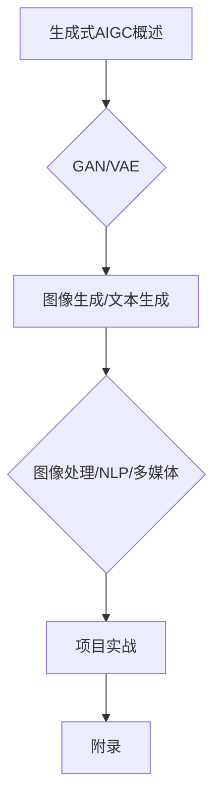

                 


# 文章标题：生成式AIGC是金矿还是泡沫：要迅速开发最小可行产品MVP快速试错和迭代

> 关键词：生成式AIGC、最小可行产品（MVP）、快速试错、迭代开发、技术原理、应用场景、数学模型

> 摘要：本文将探讨生成式人工智能生成内容（AIGC）的现状和未来，分析其作为新兴技术的潜力与挑战。通过深入探讨生成式AIGC的技术原理、应用场景、数学模型，以及项目实战，揭示如何迅速开发最小可行产品（MVP）并进行快速试错和迭代，从而在AIGC领域中挖掘金矿而非泡沫。

### 目录大纲

#### 第一部分: 生成式AIGC基础

##### 第1章: 生成式AIGC概述
- 1.1 什么是生成式AIGC
- 1.2 生成式AIGC的发展历程
- 1.3 生成式AIGC的关键技术
- 1.4 生成式AIGC的应用场景

##### 第2章: 生成式AIGC的核心原理
- 2.1 生成式模型基础
  - 2.1.1 生成对抗网络（GAN）
  - 2.1.2 变分自编码器（VAE）
- 2.2 生成式模型的优化方法
  - 2.2.1 梯度提升算法
  - 2.2.2 自适应优化算法
- 2.3 生成式模型的应用实践
  - 2.3.1 图像生成
  - 2.3.2 文本生成

##### 第3章: 生成式AIGC的数学模型
- 3.1 数学基础
  - 3.1.1 概率分布函数
  - 3.1.2 信息论
- 3.2 生成式AIGC的数学公式
  - 3.2.1 GAN的损失函数
  - 3.2.2 VAE的损失函数

#### 第二部分: 生成式AIGC应用

##### 第4章: 生成式AIGC在图像处理中的应用
- 4.1 图像生成
  - 4.1.1 图像超分辨率
  - 4.1.2 图像修复与去噪
- 4.2 图像风格迁移
  - 4.2.1 环境渲染
  - 4.2.2 艺术风格迁移

##### 第5章: 生成式AIGC在自然语言处理中的应用
- 5.1 文本生成
  - 5.1.1 文本摘要
  - 5.1.2 文本生成对抗模型（TGAN）
- 5.2 机器翻译
  - 5.2.1 神经机器翻译
  - 5.2.2 多语言文本生成

##### 第6章: 生成式AIGC在多媒体领域的应用
- 6.1 视频生成
  - 6.1.1 视频超分辨率
  - 6.1.2 视频风格迁移
- 6.2 多媒体内容理解
  - 6.2.1 视频情感分析
  - 6.2.2 音频生成与处理

#### 第三部分: 生成式AIGC开发实践

##### 第7章: 生成式AIGC项目实战
- 7.1 项目概述
  - 7.1.1 项目目标
  - 7.1.2 技术栈选择
- 7.2 环境搭建
  - 7.2.1 虚拟环境配置
  - 7.2.2 开发工具安装
- 7.3 源代码实现
  - 7.3.1 数据准备与处理
  - 7.3.2 模型训练与优化
- 7.4 代码解读与分析
  - 7.4.1 模型结构与原理
  - 7.4.2 模型训练过程
  - 7.4.3 模型评估与优化

#### 附录

- 附录A: 生成式AIGC开发资源
  - 生成式模型开源框架
  - 实用工具与库
  - 数据集来源与处理技巧
- 附录B: 数学公式与推导
  - 概率分布函数
  - 信息论基本概念
  - GAN与VAE损失函数推导

### Mermaid 流程图



### 伪代码

```plaintext
// 生成式模型基本框架
class Generator():
    # 生成器模型
    def generate(self, z):
        # 输入随机噪声，生成假样本
        return self.model(z)

class Discriminator():
    # 判别器模型
    def discriminate(self, x):
        # 输入真实样本，判断概率
        return self.model(x)
```

### 数学模型和数学公式

#### 概率分布函数

$$
P(X=x) = f(x) / Z
$$

其中，$f(x)$ 是概率密度函数，$Z$ 是归一化常数。

#### 信息论基本概念

$$
H(X) = -\sum_{i} P(X=x_i) \log_2 P(X=x_i)
$$

其中，$H(X)$ 是随机变量 $X$ 的熵。

#### GAN的损失函数

$$
L_{GAN}(D, G) = -\mathbb{E}_{x \sim p_{data}(x)}[\log D(x)] - \mathbb{E}_{z \sim p_z(z)}[\log (1 - D(G(z))]
$$

其中，$D$ 是判别器模型，$G$ 是生成器模型，$x$ 是真实样本，$z$ 是噪声。

#### VAE的损失函数

$$
L_{VAE}(G, D) = \mathbb{E}_{z \sim p_z(z)}[\log D(G(z))] + \mathbb{E}_{x \sim p_x(x|z)}[\log p_x(x|z)]
$$

其中，$G$ 是生成器模型，$D$ 是编码器模型，$z$ 是编码后的隐变量。$p_x(x|z)$ 是条件概率分布。

接下来，我们将逐步深入探讨生成式AIGC的技术原理、应用场景、数学模型，以及如何通过快速开发最小可行产品（MVP）进行试错和迭代，从而在AIGC领域中挖掘金矿。让我们开始这一段充满挑战与机遇的旅程吧！

