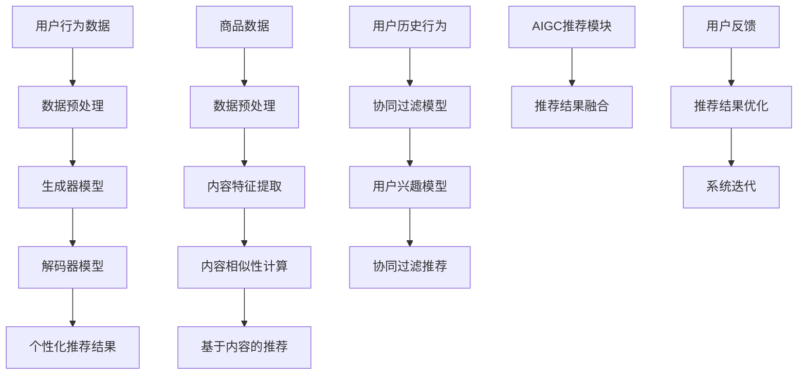
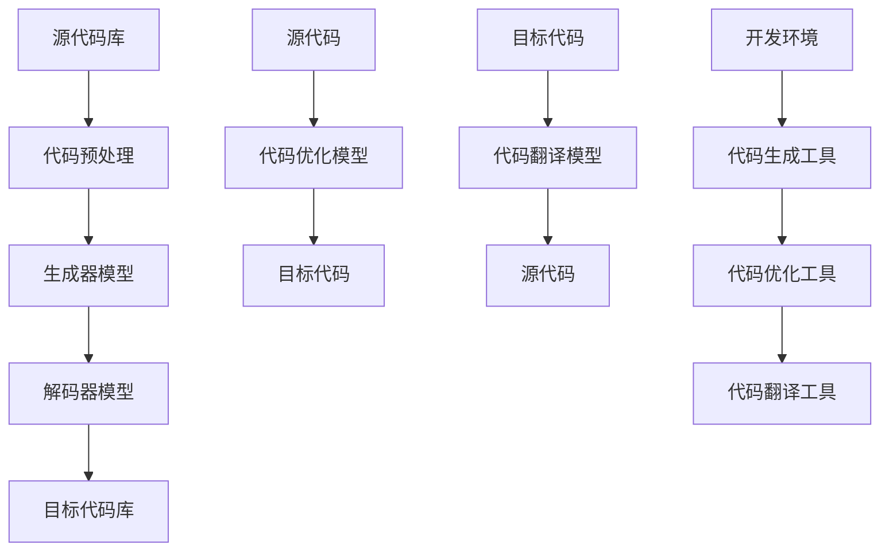

                 

### 文章标题

**生成式AIGC：AI技术的商业应用**

> 关键词：生成式AI、AIGC、商业应用、内容创作、推荐系统、自动化编程

> 摘要：本文深入探讨了生成式人工智能（AIGC）的基本概念、核心技术、商业应用以及未来发展趋势。通过逐步分析，本文揭示了AIGC技术在效率提升、成本降低和市场拓展等方面的巨大潜力，为企业提供了一种全新的商业模式和创新方向。

### 引言

随着人工智能技术的快速发展，生成式人工智能（AIGC，AI-Generated Content）逐渐成为研究热点。AIGC技术利用深度学习和自然语言处理等先进技术，能够自动生成文本、图像、音频等多媒体内容，具有极高的创造力和智能化水平。这不仅为内容创作者提供了强大的工具，也为企业带来了全新的商业模式和商业应用场景。

本文旨在通过对AIGC技术的基本概念、核心技术、商业应用和未来发展趋势的逐步分析，为读者提供一个全面、深入的视角。文章分为三大部分：第一部分介绍AIGC的基本概念与商业价值，第二部分讨论AIGC技术在实际应用中的实现，第三部分探讨AIGC技术的未来发展。希望通过本文的探讨，能够为企业在AIGC技术应用中的决策提供有价值的参考。

#### 第一部分：生成式AIGC概述

##### 第1章：AIGC基本概念与商业价值

###### 1.1 AIGC的定义与历史背景

生成式人工智能（AIGC）是指利用深度学习、自然语言处理和计算机视觉等AI技术，生成高质量、有创意的多媒体内容。与传统的搜索式AI不同，生成式AI能够自主生成内容，而不是仅仅对现有数据进行分类、预测或分析。

AIGC的发展历程可以追溯到20世纪80年代，当时神经网络和深度学习技术开始崭露头角。随着计算能力和数据资源的不断提升，生成式AI技术逐渐成熟。近年来，生成式AI在图像生成、文本生成、音乐生成等领域取得了显著突破，为AIGC的商业应用奠定了基础。

###### 1.2 AIGC的核心技术

生成式AIGC的核心技术主要包括生成式模型、自然语言处理技术和计算机视觉技术。

1. **生成式模型基础**：

生成式模型是生成式AI的核心，主要包括生成对抗网络（GAN）和变分自编码器（VAE）。

- **生成对抗网络（GAN）**：GAN由生成器和判别器组成，生成器生成数据，判别器判断数据是真实还是伪造。通过不断训练，生成器逐渐提高生成数据的质量，达到以假乱真的效果。

- **变分自编码器（VAE）**：VAE通过概率模型进行数据生成，通过编码器将数据压缩成一个低维向量，再通过解码器将向量重构为原始数据。

2. **自然语言处理技术**：

自然语言处理（NLP）技术是AIGC的重要组成部分，主要包括序列到序列（Seq2Seq）模型、注意力机制和预训练与微调。

- **序列到序列（Seq2Seq）模型**：Seq2Seq模型能够将一种序列映射到另一种序列，广泛应用于机器翻译、对话生成等任务。

- **注意力机制**：注意力机制能够关注输入序列中的关键部分，提高生成式模型的性能。

- **预训练与微调**：预训练模型在大规模数据集上进行训练，获得通用的语言理解和生成能力；微调则是在特定任务上对预训练模型进行优化，提高其在特定领域的表现。

3. **计算机视觉技术**：

计算机视觉技术在AIGC中发挥着重要作用，主要包括图像生成模型、视频生成模型和图像到图像的翻译。

- **图像生成模型**：图像生成模型如生成对抗网络（GAN）和变分自编码器（VAE），能够生成高质量、逼真的图像。

- **视频生成模型**：视频生成模型如视频生成对抗网络（VGAN）和循环神经网络（RNN），能够生成连续的视频序列。

- **图像到图像的翻译**：图像到图像的翻译模型如循环一致变分自编码器（CycleGAN），能够将一种图像样式转换为另一种图像样式。

###### 1.3 AIGC在商业领域的应用场景

AIGC技术已经在多个商业领域展示了其巨大的应用潜力，主要包括内容创作、个性化推荐、自动化编程和智能客服。

1. **内容创作**：

AIGC技术在内容创作领域具有广泛的应用，包括自动写作、艺术创作和智能客服等。

- **自动写作**：AIGC技术能够自动生成文章、故事和新闻报道，提高内容创作者的生产效率。

- **艺术创作**：AIGC技术能够生成音乐、图像和动画，为艺术家提供新的创作工具和灵感。

- **智能客服**：AIGC技术能够生成对话，实现智能客服系统，提高客户服务质量和效率。

2. **个性化推荐**：

AIGC技术在个性化推荐领域具有独特的优势，能够生成个性化推荐内容，提高推荐系统的准确性和用户体验。

- **内容生成推荐**：AIGC技术能够生成符合用户兴趣的内容，提高推荐系统的多样性。

- **用户生成偏好模型**：AIGC技术能够根据用户的历史行为和反馈，生成用户偏好模型，提高推荐系统的个性化水平。

3. **自动化编程**：

AIGC技术在自动化编程领域具有巨大的潜力，能够自动生成代码，提高开发效率和代码质量。

- **代码生成**：AIGC技术能够自动生成代码，减少人工编写代码的工作量。

- **代码优化**：AIGC技术能够优化现有代码，提高代码的性能和可维护性。

4. **智能客服**：

AIGC技术在智能客服领域具有广泛的应用，能够实现智能对话、情感分析和意图识别。

- **对话生成**：AIGC技术能够生成自然流畅的对话，实现智能客服系统。

- **情感分析**：AIGC技术能够分析用户的情感状态，提高客服的个性化服务水平。

- **意图识别**：AIGC技术能够识别用户的意图，实现智能客服的高效互动。

###### 1.4 AIGC的商业应用价值

AIGC技术在商业领域具有显著的商业应用价值，主要体现在以下三个方面：

1. **效率提升**：

AIGC技术能够自动化生成多媒体内容，减少人工创作和审核的工作量，提高生产效率。

2. **成本降低**：

AIGC技术能够降低内容创作、个性化推荐和自动化编程等领域的成本，提高企业的竞争力。

3. **市场拓展**：

AIGC技术能够为企业提供新的商业模式和市场机会，帮助企业拓展市场份额和业务范围。

#### 第二部分：生成式模型的原理与架构

##### 第2章：生成式模型的原理与架构

###### 2.1 生成式模型基础

生成式模型（Generative Model）是一类用于生成数据的统计模型，其核心思想是通过学习数据的分布，从而生成符合该分布的数据。生成式模型在计算机视觉、自然语言处理和音频处理等领域有着广泛的应用。本节将介绍生成式模型的基础知识，包括生成式模型的定义、生成式模型与判别式模型的区别，以及生成式模型的主要类型。

1. **生成式模型的定义**

生成式模型是一种能够根据概率分布生成数据的模型。在生成式模型中，数据是通过从概率分布中采样得到的。生成式模型的核心目标是学习数据的生成过程，从而能够生成新的、符合数据分布的样本。常见的生成式模型包括生成对抗网络（GAN）、变分自编码器（VAE）等。

2. **生成式模型与判别式模型的区别**

生成式模型与判别式模型是两种主要的机器学习模型。判别式模型（Discriminative Model）的目标是学习输入数据和标签之间的关系，从而对新的数据进行分类或预测。常见的判别式模型包括逻辑回归、支持向量机（SVM）等。

与判别式模型不同，生成式模型关注数据的生成过程，而不是输入和标签之间的关系。生成式模型通过学习数据的概率分布，从而能够生成新的、符合该分布的数据。因此，生成式模型在生成新的数据样本方面具有独特的优势。

3. **生成式模型的主要类型**

生成式模型有多种类型，根据其生成数据的方式，可以分为以下几类：

- **概率图模型**：概率图模型是一种基于概率图表示的生成式模型，如贝叶斯网络、马尔可夫模型等。概率图模型通过定义变量之间的条件概率分布，从而生成数据。

- **生成对抗网络（GAN）**：生成对抗网络（Generative Adversarial Network，GAN）是一种由生成器和判别器组成的生成式模型。生成器尝试生成与真实数据相似的数据，判别器则尝试区分真实数据和生成数据。通过生成器和判别器的对抗训练，生成器逐渐提高生成数据的质量。

- **变分自编码器（VAE）**：变分自编码器（Variational Autoencoder，VAE）是一种基于概率模型的生成式模型。VAE通过编码器将数据映射到一个潜在空间，再通过解码器将潜在空间的数据重构为原始数据。

- **流模型**：流模型（Flow Model）是一类基于深度神经网络的生成式模型，如深度流模型（Deep Flow Model）和马尔可夫链流模型（Markov Chain Flow Model）等。流模型通过学习数据之间的变换过程，从而生成新的数据。

接下来，我们将详细介绍生成对抗网络（GAN）和变分自编码器（VAE）这两种生成式模型。

###### 2.2 生成对抗网络（GAN）

生成对抗网络（GAN）是由Ian Goodfellow等人于2014年提出的一种生成式模型。GAN的核心思想是通过生成器和判别器的对抗训练，生成逼真的数据。

1. **GAN的基本结构**

GAN由生成器和判别器组成，两者相互对抗，共同训练。

- **生成器（Generator）**：生成器的任务是生成与真实数据相似的数据。生成器通常是一个神经网络，输入为随机噪声，输出为生成数据。

- **判别器（Discriminator）**：判别器的任务是区分真实数据和生成数据。判别器也是一个神经网络，输入为真实数据和生成数据，输出为概率值，表示输入数据的真实性。

2. **GAN的训练过程**

GAN的训练过程分为两个阶段：生成器和判别器的训练。

- **生成器的训练**：生成器的目标是提高生成数据的质量，使其更接近真实数据。在训练过程中，生成器不断生成数据，并尝试欺骗判别器。

- **判别器的训练**：判别器的目标是提高区分真实数据和生成数据的能力。在训练过程中，判别器不断接收真实数据和生成数据，从而学习区分真实数据和生成数据。

3. **GAN的优化目标**

GAN的优化目标是通过对抗训练使生成器和判别器达到一个动态平衡。具体来说，生成器的优化目标是最大化判别器的损失函数，而判别器的优化目标是最大化生成器的损失函数。

- **生成器的损失函数**：生成器的损失函数通常为生成数据的真实性损失，即生成数据与真实数据越相似，生成器的损失越小。

- **判别器的损失函数**：判别器的损失函数通常为真实数据和生成数据的交叉熵损失，即判别器能够正确区分真实数据和生成数据的概率越大，判别器的损失越小。

接下来，我们将通过伪代码来详细阐述GAN的训练过程。

```python
# 伪代码：生成对抗网络（GAN）的训练过程

# 初始化生成器G和判别器D的参数
G_params = initialize_parameters()
D_params = initialize_parameters()

# 定义生成器和判别器的损失函数
G_loss = -tf.reduce_mean(tf.log(D(y)))
D_loss = -tf.reduce_mean(tf.log(D(x)) + tf.log(1. - D(G(z)))

# 定义优化器
G_optimizer = tf.train.AdamOptimizer(learning_rate=learning_rate)
D_optimizer = tf.train.AdamOptimizer(learning_rate=learning_rate)

# 训练循环
for epoch in range(num_epochs):
    for i in range(num_steps):
        # 生成器训练
        z = sample_random_noise(z_dim)
        x_hat = G(z)
        D_loss_real = D_loss(x)
        D_loss_fake = D_loss(x_hat)
        D_total_loss = D_loss_real + D_loss_fake
        D_gradients = compute_gradients(D_total_loss, D_params)
        D_optimizer.apply_gradients(D_gradients)

        # 判别器训练
        z = sample_random_noise(z_dim)
        x_hat = G(z)
        G_loss_fake = G_loss(x_hat)
        G_total_loss = G_loss_fake
        G_gradients = compute_gradients(G_total_loss, G_params)
        G_optimizer.apply_gradients(G_gradients)
```

通过以上伪代码，我们可以看到GAN的训练过程主要包括生成器和判别器的参数初始化、损失函数定义、优化器定义以及训练循环。通过不断的对抗训练，生成器和判别器逐步提高生成数据的质量，达到动态平衡。

###### 2.3 变分自编码器（VAE）

变分自编码器（Variational Autoencoder，VAE）是一种基于概率模型的生成式模型，由Kingma和Welling于2013年提出。VAE的核心思想是通过编码器和解码器将输入数据映射到一个潜在空间，并在该空间中生成新的数据。

1. **VAE的基本结构**

VAE由编码器和解码器组成，两者相互配合，共同训练。

- **编码器（Encoder）**：编码器的任务是学习输入数据的概率分布，并将数据映射到一个潜在空间。编码器通常是一个神经网络，输出为潜在空间中的数据。

- **解码器（Decoder）**：解码器的任务是学习潜在空间中的数据分布，并将数据重构为原始数据。解码器也是一个神经网络，输入为潜在空间中的数据，输出为重构的原始数据。

2. **VAE的训练过程**

VAE的训练过程主要分为两个步骤：编码器和解码器的训练。

- **编码器训练**：编码器的训练目标是学习输入数据的概率分布。通过最大化输入数据的对数似然，编码器逐步学习输入数据的概率分布。

- **解码器训练**：解码器的训练目标是学习潜在空间中的数据分布，并重构输入数据。通过最大化重构数据的对数似然，解码器逐步学习重构数据的能力。

3. **VAE的优化目标**

VAE的优化目标是通过最大化输入数据的对数似然，同时保持潜在空间的稳定性。

- **编码器损失函数**：编码器的损失函数为输入数据的对数似然损失，即输入数据的概率分布的对数似然值。

- **解码器损失函数**：解码器的损失函数为重构数据的对数似然损失，即重构数据的概率分布的对数似然值。

接下来，我们将通过伪代码来详细阐述VAE的训练过程。

```python
# 伪代码：变分自编码器（VAE）的训练过程

# 初始化编码器E和解码器D的参数
E_params = initialize_parameters()
D_params = initialize_parameters()

# 定义编码器E的损失函数
E_loss = -tf.reduce_mean(tf.reduce_sum(x * tf.log(p), axis=1))

# 定义解码器D的损失函数
D_loss = -tf.reduce_mean(tf.reduce_sum(x * tf.log(p), axis=1))

# 定义优化器
E_optimizer = tf.train.AdamOptimizer(learning_rate=learning_rate)
D_optimizer = tf.train.AdamOptimizer(learning_rate=learning_rate)

# 训练循环
for epoch in range(num_epochs):
    for x_batch in data_loader:
        # 编码器训练
        p = E(x_batch)
        E_loss_val = E_loss(x_batch, p)
        E_gradients = compute_gradients(E_loss_val, E_params)
        E_optimizer.apply_gradients(E_gradients)

        # 解码器训练
        x_hat = D(p)
        D_loss_val = D_loss(x_batch, x_hat)
        D_gradients = compute_gradients(D_loss_val, D_params)
        D_optimizer.apply_gradients(D_gradients)
```

通过以上伪代码，我们可以看到VAE的训练过程主要包括编码器和解码器的参数初始化、损失函数定义、优化器定义以及训练循环。通过不断的训练，编码器和解码器逐步提高输入数据的概率分布和学习重构数据的能力。

##### 第3章：生成式模型在自然语言处理中的实现

生成式模型在自然语言处理（NLP）领域有着广泛的应用，如文本生成、对话系统、机器翻译等。本节将介绍生成式模型在NLP中的应用，包括序列到序列（Seq2Seq）模型、注意力机制和预训练与微调。

###### 3.1 序列到序列（Seq2Seq）模型

序列到序列（Seq2Seq）模型是一种用于处理序列数据的生成式模型，广泛应用于机器翻译、对话系统等任务。Seq2Seq模型由编码器和解码器组成，编码器将输入序列编码为一个固定长度的向量，解码器将编码后的向量解码为输出序列。

1. **Seq2Seq模型的基本结构**

- **编码器（Encoder）**：编码器的任务是处理输入序列，将其编码为一个固定长度的向量。编码器通常是一个循环神经网络（RNN），能够捕捉输入序列的长期依赖关系。

- **解码器（Decoder）**：解码器的任务是处理编码后的向量，将其解码为输出序列。解码器也是一个循环神经网络，能够根据编码器的输出和已有的部分输出生成后续的输出。

2. **Seq2Seq模型的训练过程**

Seq2Seq模型的训练过程主要包括编码器和解码器的训练。编码器和解码器通过最大似然估计进行训练，即最大化输出序列的概率。

- **编码器训练**：编码器的训练目标是学习输入序列的表示。通过最大化输入序列的对数似然，编码器逐步学习输入序列的表示。

- **解码器训练**：解码器的训练目标是学习输出序列的生成。通过最大化输出序列的对数似然，解码器逐步学习输出序列的生成。

3. **Seq2Seq模型在机器翻译中的应用**

机器翻译是Seq2Seq模型最典型的应用场景之一。在机器翻译中，编码器将源语言序列编码为一个固定长度的向量，解码器将编码后的向量解码为目标语言序列。

- **编码器**：编码器处理源语言序列，将其编码为一个固定长度的向量。编码器通过RNN捕捉源语言序列的语法和语义信息。

- **解码器**：解码器根据编码器的输出和已有的部分输出生成目标语言序列。解码器通过RNN和注意力机制捕捉源语言和目标语言之间的依赖关系。

4. **Seq2Seq模型的优化目标**

Seq2Seq模型的优化目标是最大化输出序列的对数似然。

- **编码器损失函数**：编码器的损失函数为输入序列的对数似然损失，即输入序列的概率分布的对数似然值。

- **解码器损失函数**：解码器的损失函数为输出序列的对数似然损失，即输出序列的概率分布的对数似然值。

接下来，我们将通过伪代码来详细阐述Seq2Seq模型在机器翻译中的实现。

```python
# 伪代码：序列到序列（Seq2Seq）模型在机器翻译中的实现

# 初始化编码器E和解码器D的参数
E_params = initialize_parameters()
D_params = initialize_parameters()

# 定义编码器E的损失函数
E_loss = -tf.reduce_mean(tf.reduce_sum(y * tf.log(p), axis=1))

# 定义解码器D的损失函数
D_loss = -tf.reduce_mean(tf.reduce_sum(y * tf.log(p), axis=1))

# 定义优化器
E_optimizer = tf.train.AdamOptimizer(learning_rate=learning_rate)
D_optimizer = tf.train.AdamOptimizer(learning_rate=learning_rate)

# 训练循环
for epoch in range(num_epochs):
    for x_batch, y_batch in data_loader:
        # 编码器训练
        p = E(x_batch)
        E_loss_val = E_loss(y_batch, p)
        E_gradients = compute_gradients(E_loss_val, E_params)
        E_optimizer.apply_gradients(E_gradients)

        # 解码器训练
        x_hat = D(p)
        D_loss_val = D_loss(y_batch, x_hat)
        D_gradients = compute_gradients(D_loss_val, D_params)
        D_optimizer.apply_gradients(D_gradients)
```

通过以上伪代码，我们可以看到Seq2Seq模型在机器翻译中的实现主要包括编码器和解码器的参数初始化、损失函数定义、优化器定义以及训练循环。通过不断的训练，编码器和解码器逐步提高输入序列的表示和输出序列的生成能力。

###### 3.2 注意力机制

注意力机制（Attention Mechanism）是一种在序列模型中广泛使用的技术，用于捕捉序列之间的依赖关系。注意力机制能够使模型更加关注重要的信息，提高模型的生成质量和效率。

1. **注意力机制的基本原理**

注意力机制通过计算输入序列和输出序列之间的相似性，将注意力分配给输入序列的不同部分，从而提高模型的生成质量。注意力机制的数学描述如下：

- **注意力权重（Attention Weight）**：注意力权重表示输入序列的不同部分对于输出序列的影响程度。注意力权重通常是一个介于0和1之间的数值。

- **注意力得分（Attention Score）**：注意力得分表示输入序列和输出序列之间的相似性。注意力得分通常通过点积或加性模型计算。

- **加权求和（Weighted Sum）**：加权求和是将注意力得分与输入序列的相应部分相乘，并将所有加权部分相加，得到最终的输出。

2. **注意力机制在Seq2Seq模型中的应用**

注意力机制在Seq2Seq模型中得到了广泛应用，通过引入注意力机制，Seq2Seq模型能够更好地捕捉输入序列和输出序列之间的依赖关系。

- **编码器-解码器注意力**：编码器-解码器注意力（Encoder-Decoder Attention）是注意力机制的一种简单形式，通过计算编码器的隐藏状态和当前解码器的隐藏状态之间的相似性，得到注意力权重。

- **多头注意力**：多头注意力（Multi-Head Attention）是注意力机制的一种扩展形式，通过将输入序列分成多个头，每个头计算注意力权重，并将多个头的输出进行拼接，得到最终的输出。

接下来，我们将通过伪代码来详细阐述多头注意力机制的计算过程。

```python
# 伪代码：多头注意力机制的计算过程

# 定义多头注意力机制
def multi_head_attention(q, k, v, num_heads):
    # 计算注意力得分
    attention_scores = tf.matmul(q, k, transpose_b=True)
    attention_scores = attention_scores / math.sqrt(num_heads)
    
    # 计算注意力权重
    attention_weights = tf.nn.softmax(attention_scores, axis=1)
    
    # 加权求和
    attention_output = tf.matmul(attention_weights, v)
    
    # 拼接多头输出
    attention_output = tf.concat(attention_output, axis=2)
    
    return attention_output

# 训练循环
for epoch in range(num_epochs):
    for x_batch, y_batch in data_loader:
        # 编码器训练
        p = E(x_batch)
        E_loss_val = E_loss(y_batch, p)
        E_gradients = compute_gradients(E_loss_val, E_params)
        E_optimizer.apply_gradients(E_gradients)

        # 解码器训练
        x_hat = D(p)
        D_loss_val = D_loss(y_batch, x_hat)
        D_gradients = compute_gradients(D_loss_val, D_params)
        D_optimizer.apply_gradients(D_gradients)
```

通过以上伪代码，我们可以看到多头注意力机制的计算过程主要包括注意力得分的计算、注意力权重的计算、加权求和以及多头输出的拼接。通过引入多头注意力机制，Seq2Seq模型能够更好地捕捉输入序列和输出序列之间的依赖关系，提高生成质量。

###### 3.3 预训练与微调

预训练与微调是生成式模型在NLP中常用的训练策略。预训练是指在大规模语料库上对模型进行预训练，使模型获得通用的语言理解和生成能力。微调是指将预训练模型应用于特定任务，通过少量数据对模型进行微调，提高模型在特定任务上的性能。

1. **预训练**

预训练的目标是通过大规模语料库训练模型，使模型具有丰富的语言理解和生成能力。预训练通常使用未标注的数据，通过预训练模型获得通用的语言特征。

- **BERT（Bidirectional Encoder Representations from Transformers）**：BERT是一种基于Transformer的预训练模型，通过双向编码器学习文本的语义表示。

- **GPT（Generative Pre-trained Transformer）**：GPT是一种基于Transformer的生成式模型，通过大规模语料库进行预训练，获得强大的语言生成能力。

2. **微调**

微调是在特定任务上对预训练模型进行优化，提高模型在特定任务上的性能。微调通常使用少量标注数据进行训练，通过调整模型的参数，使模型能够适应特定任务。

- **任务适配**：在微调过程中，模型会根据特定任务的特点进行适配，如机器翻译模型的微调需要关注源语言和目标语言之间的差异。

- **损失函数**：微调的损失函数通常为特定任务的损失函数，如机器翻译模型的损失函数为交叉熵损失。

接下来，我们将通过伪代码来详细阐述预训练与微调的过程。

```python
# 伪代码：预训练与微调的过程

# 预训练过程
for epoch in range(num_pretrain_epochs):
    for x_batch, y_batch in pretrain_data_loader:
        # 预训练模型训练
        p = E(x_batch)
        E_loss_val = E_loss(y_batch, p)
        E_gradients = compute_gradients(E_loss_val, E_params)
        E_optimizer.apply_gradients(E_gradients)

# 微调过程
for epoch in range(num_finetune_epochs):
    for x_batch, y_batch in finetune_data_loader:
        # 微调模型训练
        p = E(x_batch)
        D_loss_val = D_loss(y_batch, p)
        D_gradients = compute_gradients(D_loss_val, D_params)
        D_optimizer.apply_gradients(D_gradients)
```

通过以上伪代码，我们可以看到预训练与微调的过程主要包括预训练模型和微调模型的训练。通过预训练，模型获得通用的语言理解和生成能力；通过微调，模型适应特定任务，提高性能。

#### 第三部分：AIGC技术在实际应用中的实现

##### 第4章：内容创作中的AIGC应用

内容创作是AIGC技术的重要应用领域之一，通过自动写作、艺术创作和智能客服等方式，极大地提高了内容生产效率，降低了创作成本。本节将详细介绍AIGC技术在内容创作中的应用。

###### 4.1 自动写作

自动写作是AIGC技术在内容创作中的典型应用，通过生成式模型自动生成文章、故事和新闻报道等文本内容。自动写作技术主要包括以下方面：

1. **文本生成模型**

文本生成模型是自动写作的核心，通过学习大量文本数据，生成符合语法和语义规则的文本。常见的文本生成模型包括循环神经网络（RNN）、长短期记忆网络（LSTM）和生成对抗网络（GAN）。

2. **文章生成**

文章生成是指利用文本生成模型自动生成文章。文章生成模型通过学习大量文章数据，生成符合主题、风格和结构要求的新文章。文章生成的具体步骤如下：

- **数据预处理**：对原始文本数据（如新闻报道、小说等）进行清洗、分词和词性标注等预处理操作。

- **模型训练**：使用预处理后的文本数据训练文本生成模型，如RNN、LSTM或GAN等。

- **文章生成**：利用训练好的文本生成模型，根据给定的主题、风格或关键词生成新文章。

3. **故事创作**

故事创作是指利用文本生成模型自动生成故事。故事创作模型通过学习大量故事文本数据，生成具有创意和连贯性的故事。故事创作的具体步骤如下：

- **数据预处理**：对原始故事文本数据（如小说、童话等）进行清洗、分词和词性标注等预处理操作。

- **模型训练**：使用预处理后的故事文本数据训练文本生成模型，如RNN、LSTM或GAN等。

- **故事生成**：利用训练好的文本生成模型，根据给定的主题、情节或角色生成新故事。

4. **新闻报道**

新闻报道是指利用文本生成模型自动生成新闻报道。新闻报道模型通过学习大量新闻报道文本数据，生成具有时效性和新闻价值的新闻报道。新闻报道生成的具体步骤如下：

- **数据预处理**：对原始新闻报道文本数据（如新闻网站、新闻稿等）进行清洗、分词和词性标注等预处理操作。

- **模型训练**：使用预处理后的新闻报道文本数据训练文本生成模型，如RNN、LSTM或GAN等。

- **新闻报道生成**：利用训练好的文本生成模型，根据给定的主题、事件和地点生成新新闻报道。

以下是一个简单的文本生成模型实现，使用Python和PyTorch框架：

```python
import torch
import torch.nn as nn
import torch.optim as optim
from torch.utils.data import DataLoader
from torchvision import datasets, transforms

# 定义文本生成模型
class TextGenerator(nn.Module):
    def __init__(self, vocab_size, embedding_dim, hidden_dim, output_dim, n_layers, dropout=0.5):
        super(TextGenerator, self).__init__()
        self.embedding = nn.Embedding(vocab_size, embedding_dim)
        self.rnn = nn.LSTM(embedding_dim, hidden_dim, n_layers, dropout=dropout)
        self.fc = nn.Linear(hidden_dim, output_dim)
        self.dropout = nn.Dropout(dropout)
        
    def forward(self, text, hidden):
        embedded = self.dropout(self.embedding(text))
        output, hidden = self.rnn(embedded, hidden)
        assert (output.shape[0] == 1)
        output = self.fc(output.squeeze(0))
        return output, hidden

# 实例化模型
model = TextGenerator(vocab_size, embedding_dim, hidden_dim, output_dim, n_layers, dropout)

# 定义损失函数和优化器
criterion = nn.CrossEntropyLoss()
optimizer = optim.Adam(model.parameters(), lr=learning_rate)

# 训练模型
for epoch in range(num_epochs):
    for text, label in data_loader:
        optimizer.zero_grad()
        output, hidden = model(text, hidden)
        loss = criterion(output, label)
        loss.backward()
        optimizer.step()
        hidden = (torch.zeros(n_layers, 1, hidden_dim), torch.zeros(n_layers, 1, hidden_dim))
```

通过以上代码，我们可以实现一个简单的文本生成模型，并通过训练生成新的文本内容。

###### 4.2 艺术创作

艺术创作是AIGC技术在内容创作中的另一个重要应用，通过生成式模型自动生成音乐、图像和动画等内容。艺术创作模型主要包括以下方面：

1. **音乐生成**

音乐生成是指利用生成式模型自动生成音乐。音乐生成模型通过学习大量音乐数据，生成具有风格和旋律一致性的新音乐。常见的音乐生成模型包括长短期记忆网络（LSTM）、生成对抗网络（GAN）和变分自编码器（VAE）。

2. **图像创作**

图像创作是指利用生成式模型自动生成图像。图像创作模型通过学习大量图像数据，生成具有创意和美感的图像。常见的图像创作模型包括生成对抗网络（GAN）、变分自编码器（VAE）和自编码器（Autoencoder）。

3. **动画生成**

动画生成是指利用生成式模型自动生成动画。动画生成模型通过学习大量动画数据，生成连续的动画序列。常见的动画生成模型包括生成对抗网络（GAN）、变分自编码器（VAE）和循环神经网络（RNN）。

以下是一个简单的图像创作模型实现，使用Python和TensorFlow框架：

```python
import tensorflow as tf
from tensorflow.keras import layers

# 定义图像创作模型
def build_generator():
    model = tf.keras.Sequential([
        layers.Dense(128 * 7 * 7, use_bias=False, input_shape=(100,)),
        layers.BatchNormalization(),
        layers.LeakyReLU(),
        layers.Reshape((7, 7, 128)),
        layers.Conv2DTranspose(128, (5, 5), strides=(1, 1), padding='same', use_bias=False),
        layers.BatchNormalization(),
        layers.LeakyReLU(),
        layers.Conv2DTranspose(128, (5, 5), strides=(2, 2), padding='same', use_bias=False),
        layers.BatchNormalization(),
        layers.LeakyReLU(),
        layers.Conv2DTranspose(128, (5, 5), strides=(2, 2), padding='same', use_bias=False),
        layers.BatchNormalization(),
        layers.LeakyReLU(),
        layers.Conv2DTranspose(128, (5, 5), strides=(2, 2), padding='same', use_bias=False),
        layers.BatchNormalization(),
        layers.LeakyReLU(),
        layers.Conv2DTranspose(3, (5, 5), strides=(2, 2), padding='same', use_bias=False, activation='tanh')
    ])
    return model

# 实例化模型
generator = build_generator()

# 定义损失函数和优化器
cross_entropy = tf.keras.losses.BinaryCrossentropy(from_logits=True)
generator_optimizer = tf.keras.optimizers.Adam(1e-4)

# 训练模型
for epoch in range(num_epochs):
    for real_images in data_loader:
        noise = tf.random.normal([batch_size, noise_dim])
        with tf.GradientTape() as gen_tape:
            generated_images = generator(noise, training=True)

            # 计算生成图像的损失
            gen_loss_real = cross_entropy(tf.ones_like(generated_images), generated_images)
            gen_loss_fake = cross_entropy(tf.zeros_like(generated_images), generated_images)
            gen_loss = 0.5 * (gen_loss_real + gen_loss_fake)

        # 反向传播和优化
        gradients_of_generator = gen_tape.gradient(gen_loss, generator.trainable_variables)
        generator_optimizer.apply_gradients(zip(gradients_of_generator, generator.trainable_variables))
```

通过以上代码，我们可以实现一个简单的图像创作模型，并通过训练生成新的图像内容。

###### 4.3 智能客服

智能客服是AIGC技术在内容创作中的另一个重要应用，通过生成式模型自动生成对话、情感分析和意图识别等客服内容。智能客服模型主要包括以下方面：

1. **对话生成**

对话生成是指利用生成式模型自动生成对话。对话生成模型通过学习大量对话数据，生成具有连贯性和个性化的对话。常见的对话生成模型包括序列到序列（Seq2Seq）模型、生成对抗网络（GAN）和变分自编码器（VAE）。

2. **情感分析**

情感分析是指利用生成式模型自动分析对话中的情感。情感分析模型通过学习大量情感数据，识别对话中的情感标签，如积极、消极和中性。常见的情感分析模型包括朴素贝叶斯（Naive Bayes）、支持向量机（SVM）和深度学习（Deep Learning）。

3. **意图识别**

意图识别是指利用生成式模型自动识别对话中的用户意图。意图识别模型通过学习大量意图数据，识别对话中的用户意图，如咨询、投诉和购买等。常见的意图识别模型包括朴素贝叶斯（Naive Bayes）、支持向量机（SVM）和深度学习（Deep Learning）。

以下是一个简单的对话生成模型实现，使用Python和TensorFlow框架：

```python
import tensorflow as tf
from tensorflow.keras.layers import Embedding, LSTM, Dense

# 定义对话生成模型
def build_dialogue_generator(vocab_size, embedding_dim, hidden_dim):
    model = tf.keras.Sequential([
        Embedding(vocab_size, embedding_dim),
        LSTM(hidden_dim, return_sequences=True),
        Dense(vocab_size, activation='softmax')
    ])
    return model

# 实例化模型
dialogue_generator = build_dialogue_generator(vocab_size, embedding_dim, hidden_dim)

# 定义损失函数和优化器
dialogue_loss = tf.keras.losses.SparseCategoricalCrossentropy(from_logits=True)
dialogue_optimizer = tf.keras.optimizers.Adam(1e-4)

# 训练模型
for epoch in range(num_epochs):
    for x, y in dialogue_loader:
        with tf.GradientTape() as dialogue_tape:
            generated_words = dialogue_generator(x, training=True)

            # 计算对话生成损失
            dialogue_loss_val = dialogue_loss(y, generated_words)

        # 反向传播和优化
        gradients_of_dialogue_generator = dialogue_tape.gradient(dialogue_loss_val, dialogue_generator.trainable_variables)
        dialogue_optimizer.apply_gradients(zip(gradients_of_dialogue_generator, dialogue_generator.trainable_variables))
```

通过以上代码，我们可以实现一个简单的对话生成模型，并通过训练生成新的对话内容。

##### 第5章：个性化推荐中的AIGC应用

个性化推荐是AIGC技术在商业应用中的重要领域，通过生成式模型自动生成个性化推荐内容，提高推荐系统的准确性和用户体验。个性化推荐系统广泛应用于电子商务、社交媒体和在线广告等领域。本节将详细介绍AIGC技术在个性化推荐中的应用。

###### 5.1 推荐系统概述

推荐系统是一种基于用户历史行为、兴趣和偏好，向用户推荐相关商品、内容或服务的系统。推荐系统的主要目标是提高用户的满意度、增加用户粘性和提升业务收益。推荐系统通常分为基于内容的推荐和协同过滤两种类型。

1. **基于内容的推荐**

基于内容的推荐（Content-Based Recommendation）是一种基于用户兴趣和内容属性的推荐方法。推荐系统根据用户的历史行为和偏好，分析用户兴趣，然后从系统中推荐具有相似属性的内容。基于内容的推荐具有以下几个特点：

- **个性化**：基于用户兴趣和内容属性，为用户提供个性化的推荐。

- **多样性**：通过分析用户兴趣，推荐具有多样性的内容，提高用户满意度。

- **新颖性**：推荐系统可以根据用户兴趣的变化，推荐新的、具有新颖性的内容。

2. **协同过滤**

协同过滤（Collaborative Filtering）是一种基于用户行为和社交信息的推荐方法。推荐系统通过分析用户之间的行为相似性，发现相似用户或项目，从而为用户提供推荐。协同过滤分为以下两种类型：

- **用户基于协同过滤**：用户基于协同过滤（User-Based Collaborative Filtering）通过分析用户之间的行为相似性，发现相似用户，然后为用户提供推荐。

- **项目基于协同过滤**：项目基于协同过滤（Item-Based Collaborative Filtering）通过分析项目之间的行为相似性，发现相似项目，然后为用户提供推荐。

###### 5.2 生成式推荐系统

生成式推荐系统（Generative Recommendation System）是一种利用生成式模型生成个性化推荐内容的推荐方法。生成式推荐系统通过学习用户历史行为和偏好，生成符合用户兴趣的新内容，从而提高推荐系统的准确性和用户体验。生成式推荐系统主要包括以下方面：

1. **内容生成推荐**

内容生成推荐（Content-Generated Recommendation）是一种基于生成式模型的推荐方法，通过生成与用户兴趣相关的新内容，为用户提供个性化推荐。内容生成推荐具有以下几个特点：

- **个性化**：通过生成与用户兴趣相关的新内容，为用户提供个性化的推荐。

- **多样性**：通过生成多种类型的内容，提高推荐系统的多样性，满足用户的不同需求。

- **新颖性**：通过生成新的、新颖的内容，满足用户对新鲜事物的需求。

2. **用户生成偏好模型**

用户生成偏好模型（User-Generated Preference Model）是一种基于生成式模型的用户偏好学习方法。用户生成偏好模型通过学习用户历史行为和偏好，生成用户兴趣模型，从而提高推荐系统的准确性。用户生成偏好模型具有以下几个特点：

- **准确性**：通过学习用户历史行为和偏好，生成准确的用户兴趣模型，提高推荐系统的准确性。

- **可扩展性**：用户生成偏好模型可以适用于大规模用户群体，具有较好的可扩展性。

- **实时性**：用户生成偏好模型可以实时学习用户兴趣的变化，为用户提供实时的推荐。

以下是一个简单的用户生成偏好模型实现，使用Python和TensorFlow框架：

```python
import tensorflow as tf
from tensorflow.keras.layers import Embedding, LSTM, Dense

# 定义用户生成偏好模型
def build_user_preference_model(vocab_size, embedding_dim, hidden_dim):
    model = tf.keras.Sequential([
        Embedding(vocab_size, embedding_dim),
        LSTM(hidden_dim, return_sequences=True),
        Dense(hidden_dim, activation='relu'),
        Dense(vocab_size, activation='softmax')
    ])
    return model

# 实例化模型
user_preference_model = build_user_preference_model(vocab_size, embedding_dim, hidden_dim)

# 定义损失函数和优化器
user_preference_loss = tf.keras.losses.SparseCategoricalCrossentropy(from_logits=True)
user_preference_optimizer = tf.keras.optimizers.Adam(1e-4)

# 训练模型
for epoch in range(num_epochs):
    for user_actions, user_preferences in user_preference_loader:
        with tf.GradientTape() as user_preference_tape:
            predicted_preferences = user_preference_model(user_actions, training=True)

            # 计算用户偏好损失
            user_preference_loss_val = user_preference_loss(user_preferences, predicted_preferences)

        # 反向传播和优化
        gradients_of_user_preference_model = user_preference_tape.gradient(user_preference_loss_val, user_preference_model.trainable_variables)
        user_preference_optimizer.apply_gradients(zip(gradients_of_user_preference_model, user_preference_model.trainable_variables))
```

通过以上代码，我们可以实现一个简单的用户生成偏好模型，并通过训练生成用户兴趣模型，从而提高推荐系统的准确性。

###### 5.3 案例研究：基于AIGC的个性化推荐系统

本节将通过一个实际案例，介绍基于AIGC技术的个性化推荐系统的实现和应用。

**案例背景**：

某电商公司希望通过个性化推荐系统提高用户满意度和转化率。公司拥有海量的用户行为数据和商品数据，希望通过AIGC技术生成个性化推荐内容，提高推荐系统的准确性。

**技术选型**：

技术选型如下：

- **生成式模型**：生成对抗网络（GAN）和变分自编码器（VAE）

- **推荐算法**：基于内容的推荐和协同过滤

- **框架和库**：TensorFlow、Keras

**系统架构**：

系统架构如下图所示：



**实现步骤**：

1. **数据预处理**：

   对用户行为数据和商品数据进行清洗、去重和处理，提取有效信息。

2. **生成器模型**：

   使用生成对抗网络（GAN）或变分自编码器（VAE）生成个性化推荐内容。

3. **解码器模型**：

   对生成器模型生成的个性化推荐内容进行解码，提取用户兴趣特征。

4. **基于内容的推荐**：

   使用内容特征提取和内容相似性计算，为用户提供基于内容的推荐。

5. **协同过滤推荐**：

   使用协同过滤模型为用户提供协同过滤推荐。

6. **推荐结果融合**：

   将基于内容的推荐和协同过滤推荐结果进行融合，生成最终的个性化推荐结果。

7. **推荐结果优化**：

   根据用户反馈，对推荐结果进行优化，提高推荐系统的准确性。

8. **系统迭代**：

   根据用户反馈和系统性能，不断迭代和优化推荐系统。

通过以上步骤，我们可以实现一个基于AIGC技术的个性化推荐系统，提高推荐系统的准确性、多样性和用户体验。

##### 第6章：自动化编程中的AIGC应用

自动化编程是AIGC技术在软件开发领域中的重要应用，通过生成式模型自动生成代码，提高开发效率和代码质量。自动化编程不仅减少了人工编写代码的工作量，还能优化现有代码，提高系统的性能和可维护性。本节将详细介绍AIGC技术在自动化编程中的应用。

###### 6.1 自动化编程概述

自动化编程是指利用生成式模型自动生成代码，以实现代码生成、代码优化和代码翻译等任务。自动化编程的核心思想是通过学习大量的代码库和编程语言规则，生成符合语法和语义要求的代码。自动化编程具有以下几个特点：

1. **代码生成**：

代码生成是指利用生成式模型自动生成新的代码。代码生成可以应用于各种编程场景，如编写新的功能模块、修复代码中的错误、生成测试用例等。

2. **代码优化**：

代码优化是指利用生成式模型优化现有代码，提高代码的性能和可维护性。代码优化可以应用于代码压缩、性能优化、代码重构等任务。

3. **代码翻译**：

代码翻译是指利用生成式模型将一种编程语言的代码翻译成另一种编程语言的代码。代码翻译可以应用于跨平台开发、国际化项目等场景。

###### 6.2 生成式编程模型

生成式编程模型是自动化编程的核心，通过学习编程语言规则和代码库，生成符合语法和语义要求的代码。生成式编程模型主要包括以下方面：

1. **程序生成**：

程序生成是指利用生成式模型自动生成新的程序。程序生成可以应用于自动化测试、自动化修复和自动化开发等任务。常见的程序生成模型包括：

- **生成对抗网络（GAN）**：生成对抗网络（GAN）是一种用于生成程序的生成式模型。GAN由生成器和判别器组成，生成器生成程序代码，判别器判断程序代码的质量。通过对抗训练，生成器逐步提高生成程序的质量。

- **变分自编码器（VAE）**：变分自编码器（VAE）是一种基于概率模型的生成式模型，可以用于生成程序代码。VAE通过编码器将程序代码映射到一个潜在空间，再通过解码器将潜在空间的数据解码为程序代码。

2. **代码补全**：

代码补全是指利用生成式模型自动补全代码中的缺失部分。代码补全可以应用于代码自动完成、代码审查和代码修复等任务。常见的代码补全模型包括：

- **循环神经网络（RNN）**：循环神经网络（RNN）是一种用于处理序列数据的神经网络，可以用于代码补全。RNN通过学习代码的语法和语义规则，自动补全代码中的缺失部分。

- **生成对抗网络（GAN）**：生成对抗网络（GAN）可以用于代码补全。GAN的生成器生成代码补全的候选答案，判别器判断补全代码的质量。通过对抗训练，生成器逐步提高代码补全的质量。

3. **代码翻译**：

代码翻译是指利用生成式模型将一种编程语言的代码翻译成另一种编程语言的代码。代码翻译可以应用于跨平台开发、国际化项目等场景。常见的代码翻译模型包括：

- **序列到序列（Seq2Seq）模型**：序列到序列（Seq2Seq）模型是一种用于处理序列数据的生成式模型，可以用于代码翻译。Seq2Seq模型由编码器和解码器组成，编码器将源代码编码为一个固定长度的向量，解码器将编码后的向量解码为目标代码。

- **生成对抗网络（GAN）**：生成对抗网络（GAN）可以用于代码翻译。GAN的生成器生成目标代码的候选答案，判别器判断目标代码的质量。通过对抗训练，生成器逐步提高代码翻译的质量。

###### 6.3 项目实战：自动化编程在软件开发中的应用

本节将通过一个实际案例，介绍自动化编程在软件开发中的应用。

**案例背景**：

某软件公司希望提高开发效率，降低开发成本，因此决定采用自动化编程技术实现代码生成、代码优化和代码翻译等任务。

**技术选型**：

技术选型如下：

- **生成式模型**：生成对抗网络（GAN）、变分自编码器（VAE）和序列到序列（Seq2Seq）模型

- **框架和库**：TensorFlow、Keras

**系统架构**：

系统架构如下图所示：



**实现步骤**：

1. **代码预处理**：

   对源代码进行预处理，提取代码中的关键信息和语法结构。

2. **生成器模型**：

   使用生成对抗网络（GAN）或变分自编码器（VAE）生成目标代码。

3. **解码器模型**：

   对生成器模型生成的目标代码进行解码，提取代码中的关键信息和语法结构。

4. **代码优化模型**：

   使用生成对抗网络（GAN）或变分自编码器（VAE）优化现有代码，提高代码的性能和可维护性。

5. **代码翻译模型**：

   使用序列到序列（Seq2Seq）模型将目标代码翻译成源代码。

6. **代码生成工具**：

   开发代码生成工具，实现代码生成、代码优化和代码翻译等任务。

7. **代码优化工具**：

   开发代码优化工具，实现代码优化任务。

8. **代码翻译工具**：

   开发代码翻译工具，实现代码翻译任务。

通过以上步骤，我们可以实现一个自动化编程系统，提高开发效率、降低开发成本和提升代码质量。

#### 第三部分：AIGC技术的未来发展

##### 第7章：AIGC技术的挑战与未来趋势

随着生成式人工智能（AIGC）技术的快速发展，其在各个领域的应用越来越广泛。然而，AIGC技术仍面临诸多挑战，同时也展现出巨大的发展潜力。本节将讨论AIGC技术的挑战与未来趋势，为读者提供对AIGC技术的全面了解。

###### 7.1 数据安全与隐私保护

数据安全与隐私保护是AIGC技术面临的一个主要挑战。由于AIGC技术依赖于大量数据来训练模型，这些数据往往包含敏感信息和隐私数据。如果数据泄露，可能导致严重的隐私侵犯和商业损失。为了确保数据安全和隐私，以下是一些解决方案：

1. **数据加密**：对数据进行加密，确保数据在传输和存储过程中不被未授权访问。

2. **同态加密**：同态加密允许在加密数据上进行计算，从而保护数据的隐私。这有助于在数据处理过程中保持数据的安全性。

3. **差分隐私**：差分隐私是一种设计隐私机制的方法，通过在数据处理中引入噪声，确保个体数据无法被识别，从而保护隐私。

4. **联邦学习**：联邦学习是一种分布式学习技术，参与方仅共享模型更新而非原始数据。这有助于在保护数据隐私的同时，实现大规模数据集的联合训练。

###### 7.2 法律与伦理问题

AIGC技术的快速发展和广泛应用也引发了法律和伦理问题。以下是一些主要的法律和伦理挑战：

1. **版权问题**：生成式AI生成的作品是否受版权保护？如何界定AI生成作品的版权归属？这些问题在法律上尚无明确答案，需要通过立法和司法实践来逐步解决。

2. **责任归属**：当AIGC技术生成的内容或行为引发问题时，如何界定责任归属？这是法律和伦理层面需要考虑的重要问题。

3. **透明性和可解释性**：生成式AI的决策过程通常较为复杂，缺乏透明性和可解释性。这可能导致用户对AI的信任度降低，因此需要开发透明性和可解释性更强的AIGC技术。

4. **伦理道德考量**：生成式AI可能被用于生成虚假信息、歧视性内容等不良行为。如何确保AIGC技术的伦理道德使用，避免其对社会产生负面影响，是亟待解决的问题。

###### 7.3 AIGC技术的未来趋势

尽管AIGC技术面临诸多挑战，但其未来的发展前景依然十分广阔。以下是一些AIGC技术的未来趋势：

1. **技术进步**：随着计算能力的提升和数据规模的扩大，AIGC技术将取得更大的突破。新型神经网络架构、优化算法和数据增强技术等将不断推动AIGC技术的发展。

2. **跨学科融合**：AIGC技术将与其他领域（如生物医学、金融科技、文化创意等）深度融合，产生新的应用场景和商业模式。

3. **商业应用**：AIGC技术将在更多行业和领域得到应用，如自动化编程、智能客服、个性化推荐、医疗诊断等。这些应用将大幅提高行业效率、降低成本，并创造新的市场机会。

4. **社会影响**：AIGC技术将对社会产生深远影响，改变人们的生产和生活方式。在带来便利和创新的同时，也需要关注其潜在的风险和挑战，确保其对社会发展的积极贡献。

通过以上讨论，我们可以看到AIGC技术在未来具有巨大的发展潜力，同时也需要克服诸多挑战。只有通过技术创新、法律完善和伦理规范，才能充分发挥AIGC技术的优势，实现其社会价值。

##### 第8章：AIGC技术的市场机会与战略规划

随着生成式人工智能（AIGC）技术的不断发展，其在市场中的机会和挑战也日益凸显。为了抓住这些机会，企业需要制定切实可行的战略规划，以应对市场的变化和竞争。本节将探讨AIGC技术的市场机会和战略规划。

###### 8.1 市场机会分析

AIGC技术在多个行业中具有广泛的应用前景，带来了巨大的市场机会。以下是一些主要的市场机会：

1. **内容创作领域**：

AIGC技术在内容创作领域具有显著的应用潜力。例如，自动写作、艺术创作和智能客服等应用，能够提高内容创作者的效率，降低创作成本。随着内容创作的需求不断增加，AIGC技术有望成为内容创作领域的重要推动力量。

2. **个性化推荐领域**：

个性化推荐是AIGC技术的另一个重要应用领域。通过生成式模型，推荐系统可以更好地理解用户偏好，生成个性化的推荐内容，提高用户满意度和转化率。随着电子商务和社交媒体的快速发展，个性化推荐市场的需求将持续增长。

3. **自动化编程领域**：

自动化编程是AIGC技术在软件开发领域的重要应用。通过生成式模型，自动化编程工具可以自动生成代码，优化现有代码，提高开发效率。随着软件开发的复杂性和规模不断增加，自动化编程市场具有巨大的潜力。

4. **医疗诊断领域**：

AIGC技术在医疗诊断领域具有广泛的应用前景。通过生成式模型，AIGC技术可以自动生成医学图像，辅助医生进行诊断。此外，AIGC技术还可以用于药物研发、个性化治疗等领域，提高医疗行业的效率和质量。

5. **金融科技领域**：

AIGC技术在金融科技领域具有广泛的应用潜力。例如，自动交易、风险管理、信用评估等应用，能够提高金融行业的效率和准确性。随着金融科技的快速发展，AIGC技术有望成为金融科技领域的重要推动力量。

###### 8.2 企业战略规划

为了抓住AIGC技术的市场机会，企业需要制定相应的战略规划。以下是一些关键的战略规划措施：

1. **技术创新**：

企业应积极投入研发，加强AIGC技术的研发和创新。通过引进高水平的人才、购买先进的技术和设备，企业可以提高自身在AIGC技术领域的竞争力。

2. **合作伙伴关系**：

企业可以与其他企业、研究机构和高校建立合作伙伴关系，共同开展AIGC技术的研发和应用。通过共享资源、技术和市场，企业可以加快AIGC技术的商业化进程。

3. **市场推广**：

企业应加大市场推广力度，提高AIGC技术的知名度和认可度。通过举办技术研讨会、发布应用案例和开展广告宣传等手段，企业可以吸引更多的用户和合作伙伴。

4. **人才培养**：

企业应加强人才培养，提高员工的AIGC技术能力和专业素养。通过内部培训和外部合作，企业可以培养一批高素质的AIGC技术人才。

5. **风险控制**：

企业应密切关注AIGC技术的法律和伦理问题，制定相应的风险控制措施。通过合规性审查、隐私保护和伦理道德规范等手段，企业可以确保AIGC技术的合法合规和伦理道德使用。

通过以上战略规划措施，企业可以更好地抓住AIGC技术的市场机会，实现可持续发展。

### 结语

生成式人工智能（AIGC）技术作为人工智能领域的重要分支，正迅速改变着商业和社会的方方面面。从内容创作、个性化推荐、自动化编程到医疗诊断和金融科技，AIGC技术展现了其广泛的应用前景和巨大的商业价值。

然而，AIGC技术的快速发展也带来了数据安全、隐私保护、法律伦理等方面的挑战。因此，在推进AIGC技术的同时，我们需要注重技术创新、人才培养、合规性和伦理道德的同步发展。

展望未来，AIGC技术将继续推动各行各业的创新和变革，为企业和个人带来更多的机遇和可能性。面对这些挑战和机遇，我们应保持开放的心态，积极探索AIGC技术的应用潜力，共同创造一个更加智能、高效和可持续的未来。

### 附录A：AIGC技术资源与工具

为了帮助读者更好地理解和应用AIGC技术，本节将介绍一些常用的AIGC技术资源与工具，包括开源框架与库、数据集与资源以及实践指南与案例。

##### A.1 开源框架与库

1. **PyTorch**：
   - 官网：[PyTorch官网](https://pytorch.org/)
   - 描述：PyTorch是一个开源的深度学习框架，支持灵活的动态计算图，广泛用于生成式模型的研发和应用。

2. **TensorFlow**：
   - 官网：[TensorFlow官网](https://www.tensorflow.org/)
   - 描述：TensorFlow是一个由谷歌开发的深度学习框架，提供了丰富的API和工具，支持多种深度学习模型的训练和部署。

3. **GPT-2 & GPT-3**：
   - 官网：[OpenAI GPT官网](https://openai.com/blog/bidirectional-language-models/)
   - 描述：GPT-2和GPT-3是由OpenAI开发的预训练语言模型，具有强大的文本生成能力，广泛应用于自动写作、对话系统等领域。

##### A.2 数据集与资源

1. **文本数据集**：
   - **Common Crawl**：[Common Crawl官网](https://commoncrawl.org/)
   - 描述：Common Crawl是一个免费且开放的网络文本数据集，包含大量网页的文本数据，适用于文本生成和自然语言处理任务。

2. **图像数据集**：
   - **CIFAR-10/100**：[CIFAR-10/100官网](https://www.cs.toronto.edu/~kriz/cifar.html)
   - 描述：CIFAR-10/100是一个广泛使用的计算机视觉数据集，包含60,000个32x32彩色图像，分为10个类别。

3. **音频数据集**：
   - **LibriSpeech**：[LibriSpeech官网](https://www.kaggle.com/datasets/tlowisch/librispeech)
   - 描述：LibriSpeech是一个包含数千小时英语朗读文本的音频数据集，适用于音频生成和语音识别任务。

##### A.3 实践指南与案例

1. **项目启动指南**：
   - 描述：项目启动指南提供AIGC项目从规划、设计到实施的全流程指导，帮助初学者快速上手AIGC技术的应用。

2. **最佳实践分享**：
   - 描述：最佳实践分享汇集了行业专家和实际应用者的经验，为读者提供实用的技术方案和实施策略。

通过以上资源与工具，读者可以深入了解AIGC技术，并在实际项目中应用这些技术，推动人工智能的发展和应用。

### 作者信息

**作者：AI天才研究院/AI Genius Institute & 禅与计算机程序设计艺术 /Zen And The Art of Computer Programming**

AI天才研究院（AI Genius Institute）致力于推动人工智能技术的创新和发展，研究领域涵盖生成式人工智能、深度学习、自然语言处理等领域。研究院拥有一支高水平的科研团队，专注于解决人工智能领域的前沿问题，并为企业提供技术解决方案和咨询服务。

《禅与计算机程序设计艺术》是作者的经典之作，系统性地介绍了计算机程序设计的哲学和方法，深刻揭示了程序设计的本质和艺术。本书被广泛认为是计算机科学的经典之作，对编程思想和方法的提升具有深远的影响。

