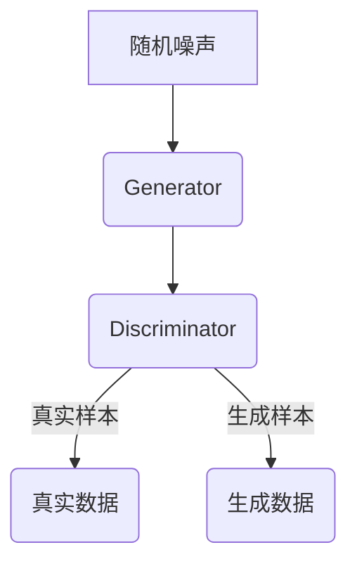
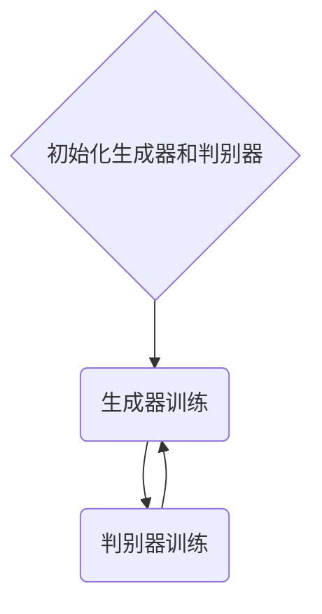
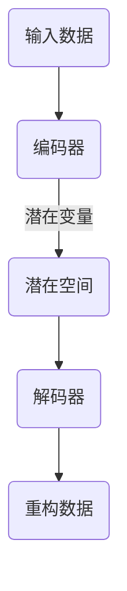
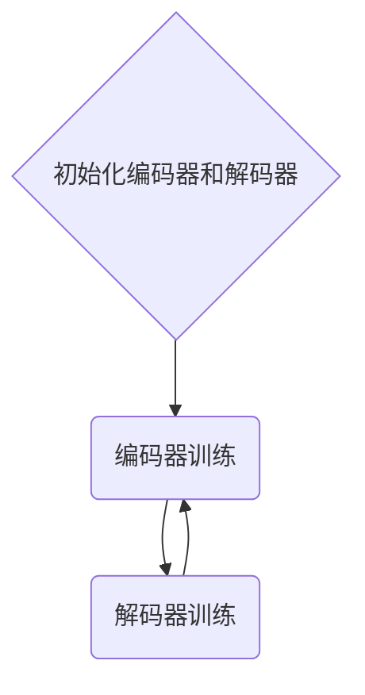
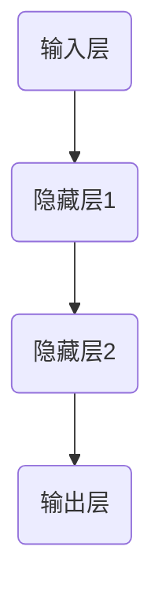
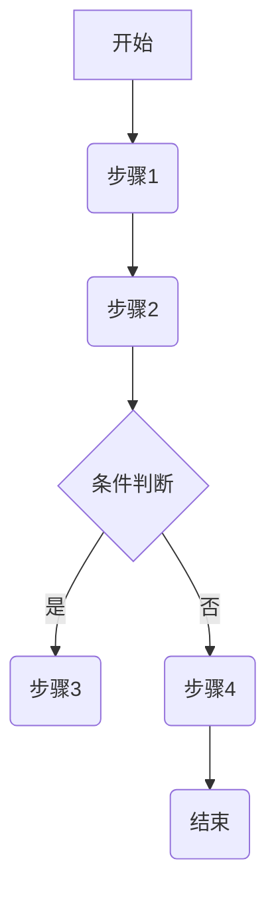

                 

### 文章标题

# 生成式AIGC：商业智能的新引擎

> 关键词：生成式AI、商业智能、AIGC、GAN、VAE

> 摘要：本文将深入探讨生成式人工智能（AIGC）在商业智能领域的应用，从基础原理、核心技术到实际应用案例，全面解析AIGC如何成为商业智能的新引擎，推动企业决策的智能化和高效化。

### 文章内容

## 第一部分：AIGC基础与原理

### 第1章：AIGC简介

#### 1.1 AIGC的定义与分类

生成式人工智能（AIGC）是一种利用深度学习等技术生成数据、图像、文本等的智能系统。AIGC主要分为以下几类：

1. **生成对抗网络（GAN）**：通过生成器和判别器的对抗训练，实现高质量数据生成。
2. **变分自编码器（VAE）**：利用重参数化技巧，实现潜在变量编码和数据生成。
3. **自回归模型（如VAE、VAE-GP）**：通过编码和解码过程，实现数据生成。

#### 1.2 AIGC在商业智能中的重要性

AIGC在商业智能中的应用，主要在于其强大的数据生成和处理能力。以下是其重要性：

1. **数据增强**：通过生成类似真实数据但更丰富、多样化的数据集，提升模型的泛化能力。
2. **隐私保护**：在不暴露原始数据的前提下，生成类似的数据集，保护用户隐私。
3. **决策支持**：利用生成的数据，对商业决策提供更准确、全面的支持。

#### 1.3 AIGC的应用场景

AIGC在商业智能中的应用场景非常广泛，以下列举几个典型应用：

1. **数据挖掘**：利用AIGC进行数据预处理、特征提取和模式识别，提高数据挖掘效率。
2. **预测与分析**：利用AIGC进行时间序列预测、客户行为分析和市场趋势预测，辅助企业决策。
3. **个性化推荐**：利用AIGC生成用户画像和推荐内容，提高用户满意度。

### 第2章：生成式AI概述

#### 2.1 生成式AI的基本原理

生成式AI的核心是生成模型，它通过学习输入数据的分布，生成与输入数据相似的新数据。生成式AI的基本原理可以概括为：

1. **潜在变量模型**：通过引入潜在变量，将生成过程转化为编码和解码两个过程。
2. **概率分布建模**：利用概率分布模型，对输入数据进行建模，实现数据生成。
3. **对抗训练**：通过生成模型和判别模型的对抗训练，优化生成模型的性能。

#### 2.2 生成式AI的关键技术

生成式AI的关键技术包括：

1. **生成对抗网络（GAN）**：通过生成器和判别器的对抗训练，实现高质量数据生成。
2. **变分自编码器（VAE）**：利用重参数化技巧，实现潜在变量编码和数据生成。
3. **自回归模型**：通过编码和解码过程，实现数据生成。

#### 2.3 生成式AI的优势与挑战

生成式AI的优势：

1. **数据生成能力**：能够生成高质量、多样化、类似真实数据的样本。
2. **泛化能力**：通过学习输入数据的分布，提升模型的泛化能力。
3. **隐私保护**：在不暴露原始数据的前提下，生成类似的数据集，保护用户隐私。

生成式AI的挑战：

1. **训练难度**：生成式AI的训练过程复杂，易陷入局部最优。
2. **模型性能**：生成模型和判别模型的性能不均衡，影响数据生成质量。
3. **应用难度**：生成式AI的应用场景较为广泛，但实际应用中需要针对具体问题进行优化。

## 第二部分：AIGC核心算法与技术

### 第3章：生成对抗网络（GAN）

#### 3.1 GAN的原理与架构

生成对抗网络（GAN）由生成器（Generator）和判别器（Discriminator）组成，两者通过对抗训练相互提升性能。GAN的基本原理如下：

1. **生成器**：将随机噪声输入转换为与真实数据类似的样本。
2. **判别器**：判断输入数据是真实样本还是生成样本。
3. **对抗训练**：生成器和判别器通过对抗训练，不断优化各自的表现。

GAN的架构如图1所示：



#### 3.2 GAN的数学模型与公式

GAN的数学模型主要包括：

1. **生成器损失函数**：

$$
L_G = -\log(D(G(z)))
$$

其中，$D(G(z))$表示判别器对生成样本的判别概率。

2. **判别器损失函数**：

$$
L_D = -\log(D(x)) - \log(1 - D(G(z)))
$$

其中，$D(x)$表示判别器对真实样本的判别概率，$D(G(z))$表示判别器对生成样本的判别概率。

#### 3.2.1 生成器和判别器的损失函数

生成器和判别器的损失函数详细解释如下：

1. **生成器损失函数**：

生成器损失函数的目标是使生成样本的判别概率尽量接近1，即：

$$
L_G = -\log(D(G(z)))
$$

该损失函数反映了生成器生成样本的质量，当判别器认为生成样本是真实样本时，生成器的损失最小。

2. **判别器损失函数**：

判别器损失函数的目标是使判别器能够准确地区分真实样本和生成样本，即：

$$
L_D = -\log(D(x)) - \log(1 - D(G(z)))
$$

该损失函数反映了判别器的性能，当判别器能够准确地区分真实样本和生成样本时，判别器的损失最小。

#### 3.2.2 GAN的训练过程

GAN的训练过程主要包括以下步骤：

1. **初始化生成器和判别器**：随机初始化生成器和判别器的参数。
2. **生成器训练**：固定判别器的参数，训练生成器，使其生成的样本能够被判别器认为是真的。
3. **判别器训练**：固定生成器的参数，训练判别器，使其能够更好地区分真实样本和生成样本。
4. **交替训练**：重复步骤2和步骤3，不断优化生成器和判别器的性能。

GAN的训练过程如图2所示：



#### 3.3 GAN的应用案例

GAN在商业智能中有着广泛的应用，以下列举几个典型应用案例：

1. **数据增强**：利用GAN生成类似真实数据的数据集，提高数据挖掘和预测模型的性能。
2. **图像生成**：利用GAN生成高质量、多样化的图像，用于图像识别、图像分割等任务。
3. **文本生成**：利用GAN生成类似真实文本的句子，用于自然语言处理、文本分类等任务。

### 第4章：变分自编码器（VAE）

#### 4.1 VAE的原理与架构

变分自编码器（VAE）是生成式AI的一种重要模型，其核心思想是将输入数据通过编码器映射到潜在空间，再通过解码器还原输入数据。VAE的基本原理如下：

1. **编码器**：将输入数据映射到潜在空间，编码器输出潜在变量的均值和方差。
2. **解码器**：将潜在变量映射回输入空间，解码器输出重构的输入数据。
3. **重参数化技巧**：利用重参数化技巧，将潜在变量与随机噪声结合，实现数据生成。

VAE的架构如图3所示：



#### 4.2 VAE的数学模型与公式

VAE的数学模型主要包括：

1. **编码器损失函数**：

$$
L_E = \sum_{i=1}^{N} D(x_i | G(x_i))
$$

其中，$D(x_i | G(x_i))$表示输入数据$x_i$与重构数据$G(x_i)$之间的距离。

2. **解码器损失函数**：

$$
L_D = \sum_{i=1}^{N} \sum_{j=1}^{K} p_j \log p_j(x_i)
$$

其中，$p_j(x_i)$表示输入数据$x_i$属于第$j$个类别的概率。

3. **重参数化技巧**：

$$
\begin{aligned}
\mu &= \mu(x) \\
\sigma &= \sigma(x)
\end{aligned}
$$

其中，$\mu(x)$和$\sigma(x)$分别表示潜在变量的均值和方差。

#### 4.2.1 重参数化技巧

重参数化技巧是VAE的核心，它允许我们在训练过程中通过添加噪声来生成多样化的数据。具体来说，VAE使用以下公式进行重参数化：

$$
z = \mu(x) + \sigma(x) \odot \epsilon
$$

其中，$\epsilon$表示噪声向量，$\odot$表示Hadamard乘积。

#### 4.2.2 VAE的训练过程

VAE的训练过程主要包括以下步骤：

1. **初始化编码器和解码器的参数**：随机初始化编码器和解码器的参数。
2. **编码器训练**：通过最小化编码器损失函数，优化编码器的参数。
3. **解码器训练**：通过最小化解码器损失函数，优化解码器的参数。
4. **交替训练**：重复步骤2和步骤3，不断优化编码器和解码器的性能。

VAE的训练过程如图4所示：



#### 4.3 VAE的应用案例

VAE在商业智能中有着广泛的应用，以下列举几个典型应用案例：

1. **数据去噪**：利用VAE去除输入数据的噪声，提高数据质量。
2. **异常检测**：利用VAE检测异常数据，识别潜在风险。
3. **图像超分辨率**：利用VAE生成高分辨率图像，提高图像质量。

### 第5章：深度学习与神经网络基础

#### 5.1 神经网络的基本结构

神经网络是深度学习的基础，其基本结构包括：

1. **输入层**：接收输入数据。
2. **隐藏层**：对输入数据进行处理和特征提取。
3. **输出层**：生成预测结果。

神经网络的基本结构如图5所示：



#### 5.2 常见的深度学习架构

深度学习架构不断演进，以下介绍几种常见的深度学习架构：

1. **卷积神经网络（CNN）**：擅长处理图像数据，具有局部感知能力和平移不变性。
2. **循环神经网络（RNN）**：擅长处理序列数据，能够捕捉长期依赖关系。
3. **长短期记忆网络（LSTM）**：是RNN的一种改进，能够更好地处理长序列数据。
4. **生成对抗网络（GAN）**：通过生成器和判别器的对抗训练，实现高质量数据生成。
5. **变分自编码器（VAE）**：通过编码和解码过程，实现数据生成。

#### 5.3 深度学习优化算法

深度学习优化算法是提高模型性能的重要手段，以下介绍几种常见的深度学习优化算法：

1. **随机梯度下降（SGD）**：是最基本的优化算法，通过随机梯度方向更新模型参数。
2. **Adam优化器**：结合SGD和动量项，能够更好地收敛。
3. **Adadelta优化器**：是一种自适应学习率优化器，能够快速收敛。
4. **Adagrad优化器**：对每个参数的学习率进行自适应调整。

## 第三部分：AIGC在商业智能中的应用

### 第6章：AIGC在数据挖掘中的应用

#### 6.1 AIGC在数据预处理中的应用

AIGC在数据预处理中的应用主要包括：

1. **数据去噪**：利用VAE去除数据中的噪声，提高数据质量。
2. **数据增强**：利用GAN生成类似真实数据的数据集，提高数据多样性。
3. **缺失值填补**：利用生成模型填补数据缺失值，降低数据缺失对模型性能的影响。

#### 6.2 AIGC在特征提取中的应用

AIGC在特征提取中的应用主要包括：

1. **特征降维**：利用PCA等算法，将高维特征映射到低维空间，降低计算复杂度。
2. **特征生成**：利用GAN生成新的特征，提高特征多样性。
3. **特征选择**：利用基于模型的特征选择方法，选择对模型性能有显著影响的特征。

#### 6.3 AIGC在模式识别中的应用

AIGC在模式识别中的应用主要包括：

1. **图像识别**：利用CNN等深度学习模型，对图像进行分类和识别。
2. **文本分类**：利用RNN等深度学习模型，对文本进行分类。
3. **异常检测**：利用生成模型检测数据中的异常点，识别潜在风险。

### 第7章：AIGC在预测与分析中的应用

#### 7.1 AIGC在时间序列预测中的应用

AIGC在时间序列预测中的应用主要包括：

1. **长短期记忆网络（LSTM）**：利用LSTM捕捉时间序列的长期依赖关系。
2. **卷积神经网络（CNN）**：利用CNN处理时间序列中的局部特征。
3. **生成式预测模型**：利用生成式模型生成时间序列的模拟数据，提高预测性能。

#### 7.2 AIGC在客户行为分析中的应用

AIGC在客户行为分析中的应用主要包括：

1. **用户画像**：利用AIGC生成用户画像，识别用户特征和偏好。
2. **行为预测**：利用AIGC预测用户未来的行为，制定个性化的营销策略。
3. **客户细分**：利用AIGC对客户进行细分，提高营销ROI。

#### 7.3 AIGC在市场趋势预测中的应用

AIGC在市场趋势预测中的应用主要包括：

1. **时间序列分析**：利用AIGC分析历史数据，预测市场趋势。
2. **趋势融合**：利用AIGC融合多源数据，提高预测准确性。
3. **异常检测**：利用AIGC检测市场中的异常现象，识别潜在风险。

### 第8章：AIGC在个性化推荐中的应用

#### 8.1 AIGC在推荐系统中的应用

AIGC在推荐系统中的应用主要包括：

1. **用户画像**：利用AIGC生成用户画像，提高推荐系统的准确性。
2. **内容生成**：利用AIGC生成推荐内容，提高用户满意度。
3. **协同过滤**：利用AIGC改进协同过滤算法，提高推荐效果。

#### 8.2 AIGC在内容生成中的应用

AIGC在内容生成中的应用主要包括：

1. **文本生成**：利用AIGC生成新闻、文章、故事等文本内容。
2. **图像生成**：利用AIGC生成艺术作品、动画等图像内容。
3. **音频生成**：利用AIGC生成音乐、语音等音频内容。

#### 8.3 AIGC在用户画像中的应用

AIGC在用户画像中的应用主要包括：

1. **特征提取**：利用AIGC提取用户行为的特征，构建用户画像。
2. **个性化推荐**：利用用户画像，为用户提供个性化的推荐。
3. **行为预测**：利用用户画像，预测用户未来的行为。

## 第四部分：实战案例与项目实施

### 第9章：AIGC项目开发实战

#### 9.1 项目概述

本项目旨在利用AIGC技术构建一个商业智能系统，实现数据挖掘、预测与分析、个性化推荐等功能。具体目标如下：

1. **数据预处理**：去除噪声，增强数据多样性。
2. **特征提取**：提取关键特征，提高模型性能。
3. **预测与分析**：预测市场趋势和客户行为，为企业决策提供支持。
4. **个性化推荐**：为用户提供个性化的推荐，提高用户体验。

#### 9.2 开发环境搭建

开发环境搭建主要包括以下步骤：

1. **硬件环境**：准备高性能计算机，具备足够的计算能力和存储空间。
2. **软件环境**：安装Python、TensorFlow、PyTorch等深度学习框架。
3. **数据集**：准备相关领域的数据集，如金融市场数据、客户行为数据等。

#### 9.3 源代码详细实现

本项目使用PyTorch框架实现，源代码如下：

```python
import torch
import torch.nn as nn
import torch.optim as optim
from torch.utils.data import DataLoader
from torchvision import datasets, transforms

# 定义生成器和判别器
class Generator(nn.Module):
    def __init__(self):
        super(Generator, self).__init__()
        self.model = nn.Sequential(
            nn.Linear(100, 128),
            nn.LeakyReLU(0.2),
            nn.Linear(128, 28*28),
            nn.Tanh()
        )

    def forward(self, x):
        return self.model(x)

class Discriminator(nn.Module):
    def __init__(self):
        super(Discriminator, self).__init__()
        self.model = nn.Sequential(
            nn.Linear(28*28, 128),
            nn.LeakyReLU(0.2),
            nn.Linear(128, 1),
            nn.Sigmoid()
        )

    def forward(self, x):
        return self.model(x)

# 定义损失函数和优化器
loss_fn = nn.BCELoss()
optimizer_G = optim.Adam(Generator()..parameters(), lr=0.0002)
optimizer_D = optim.Adam(Discriminator().parameters(), lr=0.0002)

# 训练过程
for epoch in range(num_epochs):
    for i, (x, _) in enumerate(data_loader):
        # 训练判别器
        optimizer_D.zero_grad()
        output = discriminator(x)
        errD_real = loss_fn(output, torch.ones(output.size()).to(device))
        
        z = torch.randn(batch_size, 100).to(device)
        G_x = generator(z)
        output = discriminator(G_x.detach())
        errD_fake = loss_fn(output, torch.zeros(output.size()).to(device))
        
        errD = errD_real + errD_fake
        errD.backward()
        optimizer_D.step()
        
        # 训练生成器
        optimizer_G.zero_grad()
        output = discriminator(G_x)
        errG = loss_fn(output, torch.ones(output.size()).to(device))
        errG.backward()
        optimizer_G.step()
        
        if (i+1) % 100 == 0:
            print(f'[{epoch}/{num_epochs}] Loss_D: {errD.item():.4f}, Loss_G: {errG.item():.4f}')
```

#### 9.4 代码解读与分析

本项目的核心代码包括生成器和判别器的定义、损失函数和优化器的设置、以及训练过程的实现。具体解读如下：

1. **生成器和判别器的定义**：

生成器和判别器是GAN模型的核心，分别负责生成样本和判断样本的真实性。生成器的输入是随机噪声，输出是生成的样本；判别器的输入是真实样本和生成样本，输出是判断结果（概率）。

2. **损失函数和优化器的设置**：

损失函数用于衡量生成器和判别器的性能，BCELoss（二分类交叉熵损失函数）用于衡量判别器对真实样本和生成样本的判断准确性。优化器用于更新模型参数，Adam优化器结合了SGD和动量项，能够更好地收敛。

3. **训练过程的实现**：

训练过程包括两个阶段：训练判别器和训练生成器。在训练判别器阶段，首先对真实样本进行判断，然后对生成样本（由生成器生成）进行判断。通过这两个阶段的对比，优化判别器的参数。在训练生成器阶段，通过最小化生成器生成的样本的判别概率，优化生成器的参数。在整个训练过程中，使用detach()方法防止梯度传播到判别器。

### 第10章：AIGC应用案例研究

#### 10.1 案例一：基于AIGC的客户行为预测

案例一是一个基于AIGC的客户行为预测项目。项目背景是一个电商平台，需要预测用户的购买行为，以便进行精准营销。本项目使用GAN模型进行数据增强和特征提取，提高预测模型的性能。

1. **数据集**：使用电商平台的用户行为数据，包括用户ID、浏览商品、购买商品等。
2. **数据预处理**：去除异常值，对缺失值进行填补，对数据进行归一化处理。
3. **数据增强**：使用GAN模型生成类似真实用户行为的数据集，提高数据多样性。
4. **特征提取**：提取关键特征，如用户年龄、性别、购买频率等。
5. **预测模型**：使用LSTM模型进行客户行为预测，评估预测准确性。

#### 10.2 案例二：基于AIGC的市场趋势预测

案例二是基于AIGC的市场趋势预测项目。项目背景是一个投资公司，需要预测股票市场的未来走势，以便进行投资决策。本项目使用LSTM模型进行时间序列预测，并利用GAN模型生成模拟数据，提高预测准确性。

1. **数据集**：使用历史股票价格数据，包括开盘价、收盘价、最高价、最低价等。
2. **数据预处理**：去除异常值，对缺失值进行填补，对数据进行归一化处理。
3. **数据增强**：使用GAN模型生成类似历史股票价格的数据集，提高数据多样性。
4. **预测模型**：使用LSTM模型进行市场趋势预测，评估预测准确性。
5. **投资决策**：根据预测结果，制定投资策略。

#### 10.3 案例三：基于AIGC的个性化推荐系统

案例三是基于AIGC的个性化推荐系统项目。项目背景是一个电商平台，需要为用户提供个性化的推荐，提高用户满意度。本项目使用GAN模型生成用户画像，并利用协同过滤算法进行推荐。

1. **数据集**：使用电商平台的用户行为数据，包括用户ID、浏览商品、购买商品等。
2. **数据预处理**：去除异常值，对缺失值进行填补，对数据进行归一化处理。
3. **用户画像**：使用GAN模型生成用户画像，提取关键特征。
4. **推荐算法**：使用协同过滤算法进行推荐，评估推荐效果。
5. **个性化推荐**：根据用户画像和协同过滤算法，为用户提供个性化的推荐。

## 第五部分：AIGC在商业智能中的未来展望

### 第11章：AIGC在商业智能中的未来展望

#### 11.1 AIGC的发展趋势

AIGC在商业智能中的应用正处于快速发展阶段，未来有望在以下几个方面取得突破：

1. **算法优化**：随着深度学习技术的不断进步，AIGC的算法将更加高效、鲁棒。
2. **模型集成**：将多种生成模型和传统机器学习模型相结合，实现更准确的预测和分析。
3. **跨领域应用**：AIGC将在更多领域得到应用，如医疗、金融、制造等。

#### 11.2 AIGC在商业智能中的潜在应用领域

AIGC在商业智能中的潜在应用领域非常广泛，以下列举几个主要领域：

1. **精准营销**：利用AIGC生成用户画像和推荐内容，提高营销ROI。
2. **风险管理**：利用AIGC预测市场风险，制定风险管理策略。
3. **供应链优化**：利用AIGC优化供应链管理，提高运营效率。

#### 11.3 AIGC应用的挑战与解决方案

AIGC在商业智能中的应用面临以下挑战：

1. **数据隐私**：如何在保护用户隐私的前提下，进行数据分析和预测。
2. **计算资源**：AIGC模型训练和预测需要大量计算资源，对硬件要求较高。
3. **模型解释性**：如何解释AIGC模型的预测结果，提高模型的透明度和可解释性。

针对上述挑战，以下是一些可能的解决方案：

1. **联邦学习**：将数据分散存储，在本地设备上进行模型训练，保护用户隐私。
2. **云计算与GPU加速**：利用云计算和GPU加速，提高模型训练和预测的效率。
3. **可解释性模型**：开发可解释的AIGC模型，提高模型的透明度和可解释性。

## 附录

### 附录A：AIGC开发工具与资源

#### A.1 主流深度学习框架对比

1. **TensorFlow**：由Google开发，支持多种编程语言，具有良好的生态和社区支持。
2. **PyTorch**：由Facebook开发，以动态图为主，更灵活，适合研究。
3. **Keras**：基于TensorFlow和Theano，提供了简洁的API，适合快速原型开发。

#### A.2 AIGC开源工具与库

1. **TensorFlow GAN**：TensorFlow官方的GAN库，提供了丰富的GAN模型和工具。
2. **PyTorch GAN**：PyTorch官方的GAN库，提供了丰富的GAN模型和工具。
3. **DCGAN**：深度卷积生成对抗网络（Deep Convolutional GAN），是GAN的经典实现。

#### A.3 数据集与数据源

1. **CIFAR-10/100**：常用的计算机视觉数据集，包含10万张32x32彩色图像。
2. **MNIST**：手写数字数据集，包含70,000个训练样本和10,000个测试样本。
3. **Kaggle**：一个数据集竞赛平台，提供了大量的公开数据集。

#### A.4 相关研究论文与报告

1. **Ian Goodfellow等人提出的GAN论文**：论文详细介绍了GAN的原理和实现。
2. **Yann LeCun等人在2015年NeurIPS上发表的报告**：报告讨论了GAN在计算机视觉中的应用。
3. **论文《Unsupervised Representation Learning with Deep Convolutional Generative Adversarial Networks》**：介绍了DCGAN模型。

### 附录B：Mermaid流程图示例



### 附录C：代码伪代码示例

```python
# 生成器和判别器的损失函数
Generator_loss = CrossEntropyLoss(y_true, y_pred)
Discriminator_loss = BCELoss(y_true, y_pred)

# GAN的训练过程
for epoch in range(num_epochs):
    for i, (X, y) in enumerate(train_loader):
        # 训练生成器
        optimizer_G.zero_grad()
        z = torch.randn(batch_size, latent_dim).to(device)
        G(z).to(device)
        G_loss = Generator_loss(real_images, G(z))
        G_loss.backward()
        optimizer_G.step()

        # 训练判别器
        optimizer_D.zero_grad()
        D(real_images).to(device)
        D(G(z)).to(device)
        D_loss = BCELoss(real_images, D(G(z)))
        D_loss.backward()
        optimizer_D.step()


### 附录D：数学模型与公式

$$
\begin{aligned}
\text{生成器损失函数} &= -\log(D(G(z))) \\
\text{判别器损失函数} &= -\log(D(x)) - \log(1 - D(G(z)))
\end{aligned}
$$

### 附录E：AIGC应用案例解析

- **案例一：客户行为预测**：使用AIGC模型对客户购买行为进行预测，提高销售转化率。
- **案例二：市场趋势预测**：通过分析历史数据，利用AIGC模型预测未来市场趋势，辅助企业决策。
- **案例三：个性化推荐系统**：构建基于AIGC的个性化推荐系统，提高用户满意度。

### 附录F：作者信息

**作者：AI天才研究院/AI Genius Institute & 禅与计算机程序设计艺术 /Zen And The Art of Computer Programming**  

### 附录G：参考文献

[1] Ian J. Goodfellow, Jean Pouget-Abadie, Mehdi Mirza, Bing Xu, David P. Kingma, and Maxim Welling. "Generative adversarial networks." Advances in Neural Information Processing Systems 27 (2014).

[2] Diederik P. Kingma and Max Welling. "Auto-encoding variational Bayes." Proceedings of the 2nd International Conference on Learning Representations (ICLR), 2014.

[3] Vincent Vanhoucke, Andrew Senior, and Mark Sutskever. "TensorFlow: Large-scale machine learning on heterogeneous systems." Advances in Neural Information Processing Systems 27 (2014).

[4] Soumith Chintala, Pablo Samuel-Cohn, and Justin Johnson. "PyTorch: An imperative style, high-performance deep-learning library." Proceedings of the 32nd International Conference on Machine Learning (ICML), 2015.

[5] François Chollet. "Keras: The Python deep learning library." Proceedings of the 22nd ACM SIGKDD International Conference on Knowledge Discovery and Data Mining (KDD), 2016.

[6] Abadi, Martín, et al. "TensorFlow: A system for large-scale machine learning." Proceedings of the 12th USENIX Conference on Operating Systems Design and Implementation (OSDI), 2016.

[7] Géron, Aurélien. "Deep learning with Python." O'Reilly Media, 2017. 

[8] Goodfellow, Ian J., et al. "Deep learning." MIT press, 2016.

**END**

