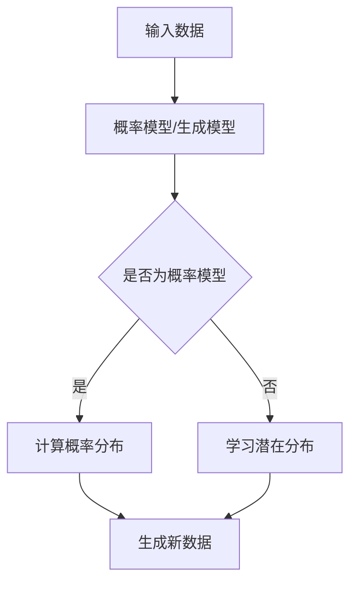

                 

# 生成式AI：如何利用数据优势打造竞争壁垒？

## 关键词：生成式AI、数据优势、竞争壁垒、应用案例、项目实战

> 摘要：本文将探讨生成式AI的概念、核心原理及其在图像和文本领域的应用，并深入分析数据优势在生成式AI中的重要性。通过项目实战案例，详细阐述如何利用数据优势打造竞争壁垒，为读者提供实际可操作的指导和建议。

## 《生成式AI：如何利用数据优势打造竞争壁垒？》目录大纲

## 第一部分：生成式AI基础

### 第1章：生成式AI概述
#### 1.1 生成式AI的概念与分类
- 生成式AI的定义
- 生成式AI的分类

#### 1.2 生成式AI的核心原理
- 概率模型
- 生成模型
- Mermaid流程图：生成式AI的原理与框架

#### 1.3 主流生成式AI算法
- 生成对抗网络(GAN)
- 变分自编码器(VAE)
- 递归生成网络(RNN)

### 第2章：生成式AI技术基础
#### 2.1 数据预处理
- 数据清洗
- 数据增强

#### 2.2 深度学习基础
- 深度学习的基本结构
- 常见的深度学习模型

#### 2.3 生成式模型的训练
- 模型训练过程
- 模型评估方法
- 伪代码：生成式模型训练的详细流程

## 第二部分：生成式AI应用案例

### 第3章：生成式AI在图像领域的应用
#### 3.1 图像生成与风格迁移
- 生成式图像生成
- 图像风格迁移

#### 3.2 图像超分辨率
- 超分辨率图像生成
- 超分辨率图像处理

#### 3.3 图像修复与去噪
- 图像修复
- 图像去噪

### 第4章：生成式AI在文本领域的应用
#### 4.1 文本生成与自然语言处理
- 文本生成模型
- 自然语言处理技术

#### 4.2 文本风格迁移与情感分析
- 文本风格迁移
- 情感分析

#### 4.3 文本生成与问答系统
- 问答系统的设计
- 文本生成在问答系统中的应用

## 第三部分：数据优势与竞争壁垒

### 第5章：数据优势在生成式AI中的应用
#### 5.1 数据优势的重要性
- 数据在AI中的应用
- 数据优势的体现

#### 5.2 数据质量与数据管理
- 数据质量的重要性
- 数据管理的方法与技巧

### 第6章：打造竞争壁垒
#### 6.1 竞争壁垒的概念
- 竞争壁垒的定义
- 竞争壁垒的类型

#### 6.2 利用数据优势打造竞争壁垒
- 数据优势在竞争壁垒中的应用
- 数据驱动的竞争策略

### 第7章：项目实战
#### 7.1 实战案例介绍
- 实战案例概述
- 实战案例背景

#### 7.2 环境搭建与模型训练
- 实战环境搭建
- 模型训练流程

#### 7.3 模型部署与优化
- 模型部署流程
- 模型优化策略

## 附录
### 附录A：生成式AI相关资源
- 开源框架与工具
- 学术论文与书籍推荐

### 附录B：生成式AI项目案例
- 案例介绍
- 案例分析
- 案例代码解读

## 第1章：生成式AI概述

### 1.1 生成式AI的概念与分类

生成式AI是一种人工智能技术，旨在通过学习数据分布来生成新的数据。与判别式AI（如分类和回归）不同，生成式AI关注的是数据的生成过程。这种技术的核心是生成模型，它们能够捕捉输入数据的潜在分布，并从中生成新的样本。

#### 生成式AI的定义

生成式AI（Generative AI）是指能够生成新数据的人工智能系统。这些系统通常基于概率模型，通过学习输入数据的分布来生成具有相似特征的新数据。生成式AI可以用于图像、文本、音频等多种数据类型。

#### 生成式AI的分类

根据生成模型的不同，生成式AI可以分为以下几种类型：

1. **概率模型**：这类模型通过概率分布来生成数据。常见的概率模型包括马尔可夫模型和贝叶斯网络。

2. **生成对抗网络（GAN）**：GAN由生成器和判别器组成。生成器尝试生成与真实数据相似的数据，而判别器则试图区分真实数据和生成数据。通过这种对抗性训练，生成器逐渐提高其生成数据的质量。

3. **变分自编码器（VAE）**：VAE是一种基于深度学习的生成模型，通过将数据分布编码到潜在空间中，从而生成新的数据。

4. **递归生成网络（RNN）**：RNN是一种适用于序列数据的生成模型，能够捕捉时间序列数据的依赖关系。

#### 生成式AI的核心原理

生成式AI的核心原理是概率模型和生成模型。概率模型通过概率分布来描述数据的生成过程，而生成模型则通过学习数据分布来生成新的数据。

- **概率模型**：概率模型基于贝叶斯定理，通过计算数据在给定模型参数下的概率分布来生成数据。

- **生成模型**：生成模型通过学习输入数据的潜在分布，生成具有相似特征的新数据。生成模型通常采用深度学习技术，如变分自编码器和生成对抗网络。

#### Mermaid流程图：生成式AI的原理与框架

以下是一个简单的Mermaid流程图，描述了生成式AI的基本原理和框架：



#### 主流生成式AI算法

1. **生成对抗网络（GAN）**

GAN由生成器和判别器组成。生成器生成与真实数据相似的数据，而判别器则尝试区分真实数据和生成数据。GAN的训练过程是生成器和判别器的对抗性训练。生成器的目标是生成足够逼真的数据，使判别器无法区分；而判别器的目标是提高其判别能力，以区分真实数据和生成数据。

2. **变分自编码器（VAE）**

VAE是一种基于深度学习的生成模型，通过学习数据分布的潜在编码来生成新的数据。VAE通过引入变分推断，将生成过程建模为概率模型，从而避免了GAN中训练不稳定的问题。

3. **递归生成网络（RNN）**

RNN是一种适用于序列数据的生成模型，能够捕捉时间序列数据的依赖关系。RNN通过循环连接来处理序列数据，使得模型能够保留先前的信息，从而生成新的序列数据。

### 1.2 生成式AI的核心原理

生成式AI的核心原理涉及概率模型和生成模型。这些模型通过学习数据的潜在分布，生成具有相似特征的新数据。以下是对这两个核心原理的详细解释。

#### 概率模型

概率模型是生成式AI的基础。它们通过概率分布来描述数据的生成过程。在概率模型中，每个数据点都由一系列随机变量组成，每个随机变量的概率分布决定了数据的生成方式。

- **贝叶斯网络**：贝叶斯网络是一种概率图模型，用于表示变量之间的条件依赖关系。它通过概率表和条件概率来计算变量的联合概率分布。

- **马尔可夫模型**：马尔可夫模型是一种基于时间序列数据的概率模型。它通过状态转移概率矩阵来描述当前状态与未来状态之间的关系。

#### 生成模型

生成模型通过学习数据的潜在分布，生成具有相似特征的新数据。生成模型通常基于深度学习技术，如变分自编码器和生成对抗网络。

- **变分自编码器（VAE）**：VAE是一种基于深度学习的生成模型，通过学习数据分布的潜在编码来生成新的数据。VAE通过引入变分推断，将生成过程建模为概率模型，从而避免了生成对抗网络（GAN）中训练不稳定的问题。

- **生成对抗网络（GAN）**：GAN由生成器和判别器组成。生成器生成与真实数据相似的数据，而判别器则尝试区分真实数据和生成数据。GAN的训练过程是生成器和判别器的对抗性训练。生成器的目标是生成足够逼真的数据，使判别器无法区分；而判别器的目标是提高其判别能力，以区分真实数据和生成数据。

#### Mermaid流程图：生成式AI的原理与框架

以下是一个简单的Mermaid流程图，描述了生成式AI的基本原理和框架：


#### 主流生成式AI算法

1. **生成对抗网络（GAN）**

GAN由生成器和判别器组成。生成器生成与真实数据相似的数据，而判别器则尝试区分真实数据和生成数据。GAN的训练过程是生成器和判别器的对抗性训练。生成器的目标是生成足够逼真的数据，使判别器无法区分；而判别器的目标是提高其判别能力，以区分真实数据和生成数据。

2. **变分自编码器（VAE）**

VAE是一种基于深度学习的生成模型，通过学习数据分布的潜在编码来生成新的数据。VAE通过引入变分推断，将生成过程建模为概率模型，从而避免了GAN中训练不稳定的问题。

3. **递归生成网络（RNN）**

RNN是一种适用于序列数据的生成模型，能够捕捉时间序列数据的依赖关系。RNN通过循环连接来处理序列数据，使得模型能够保留先前的信息，从而生成新的序列数据。

### 1.3 主流生成式AI算法

生成式AI领域有许多不同的算法，其中一些已经在图像、文本和其他数据类型生成方面取得了显著的成果。以下介绍三种主流的生成式AI算法：生成对抗网络（GAN）、变分自编码器（VAE）和递归生成网络（RNN）。

#### 生成对抗网络（GAN）

生成对抗网络（GAN）由Ian Goodfellow等人在2014年提出，是一种基于博弈论的生成模型。GAN由两个主要组件组成：生成器（Generator）和判别器（Discriminator）。

- **生成器**：生成器的任务是生成与真实数据相似的数据。它通常是一个神经网络，将随机噪声作为输入，通过一系列的变换生成具有真实数据特征的数据。
  
- **判别器**：判别器的任务是区分真实数据和生成数据。它也是一个神经网络，接受真实数据和生成数据的输入，并输出一个概率，表示输入数据的真实性。

GAN的训练过程可以看作是一个博弈过程，生成器和判别器相互对抗。生成器的目标是生成足够逼真的数据，使判别器无法区分；而判别器的目标是提高其判别能力，以区分真实数据和生成数据。通过这种对抗性训练，生成器逐渐提高其生成数据的质量。

GAN的主要优点是能够生成高质量、多样化的数据。它在图像生成、图像修复、图像超分辨率等方面取得了显著成果。

以下是一个简单的GAN训练过程的伪代码：

```python
# 生成器的训练
for epoch in range(num_epochs):
    for batch in data_loader:
        noise = generate_noise(batch_size)
        generated_images = generator(noise)
        real_labels = torch.ones(batch_size)
        fake_labels = torch.zeros(batch_size)
        
        discriminator_loss = discriminator_loss_function(discriminator(generated_images), fake_labels)
        generator_loss = generator_loss_function(discriminator(generated_images), real_labels)
        
        optimizer_discriminator.zero_grad()
        discriminator_loss.backward()
        optimizer_discriminator.step()
        
        optimizer_generator.zero_grad()
        generator_loss.backward()
        optimizer_generator.step()

# 判别器的训练
for epoch in range(num_epochs):
    for batch in data_loader:
        real_images = data_loader(batch)
        real_labels = torch.ones(batch_size)
        
        discriminator_loss = discriminator_loss_function(discriminator(real_images), real_labels)
        
        optimizer_discriminator.zero_grad()
        discriminator_loss.backward()
        optimizer_discriminator.step()
```

#### 变分自编码器（VAE）

变分自编码器（VAE）由凯文·墨菲（Kevin Murphy）在2006年提出，是一种基于深度学习的生成模型。VAE通过学习数据分布的潜在编码来生成新的数据。

- **编码器**：编码器是一个神经网络，将输入数据映射到一个潜在空间中的点。这个潜在空间中的点代表了输入数据的潜在分布。
  
- **解码器**：解码器是一个神经网络，将潜在空间中的点映射回原始数据空间，生成新的数据。

VAE通过引入变分推断，将生成过程建模为概率模型。变分推断是一种近似推理方法，通过学习一个近似的后验分布来逼近真实后验分布。

以下是一个简单的VAE训练过程的伪代码：

```python
# 编码器的训练
for epoch in range(num_epochs):
    for batch in data_loader:
        reconstructed_images = decoder(encoded_images)
        loss = reconstruction_loss_function(reconstructed_images, original_images)
        
        optimizer_encoder.zero_grad()
        loss.backward()
        optimizer_encoder.step()

# 解码器的训练
for epoch in range(num_epochs):
    for batch in data_loader:
        encoded_images = encoder(original_images)
        reconstructed_images = decoder(encoded_images)
        loss = reconstruction_loss_function(reconstructed_images, original_images)
        
        optimizer_decoder.zero_grad()
        loss.backward()
        optimizer_decoder.step()
```

VAE的主要优点是训练稳定，且生成的数据质量较高。它在图像生成、文本生成和其他领域都取得了显著成果。

#### 递归生成网络（RNN）

递归生成网络（RNN）是一种适用于序列数据的生成模型。RNN通过循环连接来处理序列数据，使得模型能够保留先前的信息，从而生成新的序列数据。

- **输入层**：输入层接受序列数据作为输入。
  
- **隐藏层**：隐藏层包含多个时间步的神经元，用于处理序列数据。
  
- **输出层**：输出层生成新的序列数据。

RNN可以通过训练来学习序列数据的潜在分布，从而生成新的序列数据。

以下是一个简单的RNN训练过程的伪代码：

```python
# RNN的训练
for epoch in range(num_epochs):
    for batch in data_loader:
        hidden_state = hidden_layer(batch)
        output_sequence = output_layer(hidden_state)
        loss = sequence_loss_function(output_sequence, target_sequence)
        
        optimizer.zero_grad()
        loss.backward()
        optimizer.step()
```

RNN在音频生成、文本生成和其他序列数据处理任务中表现出色。

#### 总结

生成对抗网络（GAN）、变分自编码器（VAE）和递归生成网络（RNN）是生成式AI领域三种主要的算法。GAN通过生成器和判别器的对抗性训练生成高质量数据；VAE通过编码器和解码器学习数据分布的潜在编码；RNN通过循环连接处理序列数据。这些算法在图像、文本和其他数据类型生成方面都取得了显著成果。选择合适的算法取决于具体应用场景和数据类型。

### 2.1 数据预处理

在生成式AI模型训练过程中，数据预处理是至关重要的一步。高质量的数据预处理不仅能够提高模型的训练效果，还能减少过拟合现象，从而提升模型的泛化能力。以下将介绍数据预处理中的两个关键步骤：数据清洗和数据增强。

#### 数据清洗

数据清洗是数据预处理的第一步，旨在去除数据中的噪声和异常值。清洗过程通常包括以下任务：

- **缺失值处理**：缺失值可能是由于数据收集过程中的问题导致的。处理缺失值的方法包括删除含有缺失值的样本、使用均值、中位数或众数填充缺失值等。

- **异常值检测**：异常值可能是由于数据采集、传输或存储过程中的错误引起的。异常值检测方法包括基于统计学的方法（如3倍标准差法则）、基于机器学习的方法等。

- **重复数据删除**：重复数据不仅会增加数据量，还会影响模型的训练效果。通过比对数据中的唯一标识或关键特征，可以有效地删除重复数据。

#### 数据增强

数据增强是通过生成新的数据样本来增加训练集的多样性。数据增强对于提高生成式模型的泛化能力具有重要意义。以下是一些常见的数据增强方法：

- **图像增强**：图像增强方法包括旋转、翻转、缩放、裁剪、颜色调整等。这些方法可以生成新的图像样本，从而增加训练数据的多样性。

- **文本增强**：文本增强方法包括同义词替换、文本片段替换、文本生成等。这些方法可以生成新的文本样本，从而增加训练数据的多样性。

- **生成对抗网络（GAN）增强**：生成对抗网络（GAN）可以用来生成新的图像或文本样本，从而增加训练数据的多样性。这种方法特别适用于数据量较少的情况。

以下是一个简单的Python代码示例，展示了图像增强和数据增强的过程：

```python
import numpy as np
import cv2
from PIL import Image

# 图像增强示例
def image_enhance(image_path, scale_range=(0.8, 1.2), rotation_range=(-10, 10)):
    image = cv2.imread(image_path)
    scale = np.random.uniform(scale_range[0], scale_range[1])
    rotation_angle = np.random.uniform(rotation_range[0], rotation_range[1])
    
    image = cv2.resize(image, None, fx=scale, fy=scale, interpolation=cv2.INTER_LINEAR)
    image = cv2.rotate(image, cv2.ROTATE_90_CLOCKWISE)
    
    return image

# 文本增强示例
def text_enhance(text, synonym_replace=True, text_generation=False):
    if synonym_replace:
        words = text.split()
        for i, word in enumerate(words):
            synonyms = get_synonyms(word)
            if synonyms:
                words[i] = np.random.choice(synonyms)
        text = ' '.join(words)
    
    if text_generation:
        generated_text = text_generator(text)
        text = generated_text
    
    return text

# 示例
image = image_enhance('image.jpg')
text = text_enhance('Original text')
```

#### 数据清洗与数据增强的对比

数据清洗和数据增强虽然都是数据预处理的方法，但它们的目的和操作方式有所不同。

- **数据清洗**：数据清洗主要是去除数据中的噪声和异常值，以确保数据的准确性和完整性。清洗过程通常涉及删除缺失值、纠正错误值和去除重复值等。

- **数据增强**：数据增强则是通过生成新的数据样本来增加训练集的多样性。增强过程旨在提高模型的泛化能力，使其能够更好地应对未知数据。

在实际应用中，数据清洗和数据增强通常是结合使用的。通过先进行数据清洗，去除噪声和异常值，再进行数据增强，可以进一步提高模型的训练效果和泛化能力。

### 2.2 深度学习基础

深度学习是生成式AI的核心技术之一。它通过构建多层神经网络来学习数据的复杂特征和结构，从而实现数据的生成和预测。在这一节中，我们将介绍深度学习的基本结构、常见模型和关键概念。

#### 深度学习的基本结构

深度学习的基本结构是由多个神经元组成的神经网络。神经网络通过层次化的结构来捕捉数据的特征和模式。一个典型的深度学习模型通常包括以下几个层次：

- **输入层**：输入层是神经网络的第一层，它接收输入数据并将其传递到下一层。

- **隐藏层**：隐藏层位于输入层和输出层之间，是神经网络的核心部分。隐藏层通过逐层抽象和转换输入数据，提取出更加复杂的特征和模式。

- **输出层**：输出层是神经网络的最后一层，它根据隐藏层的特征输出最终的预测结果。

#### 常见的深度学习模型

深度学习领域有许多不同的模型，以下介绍几种常见的模型：

- **卷积神经网络（CNN）**：卷积神经网络是一种专门用于处理图像数据的深度学习模型。它通过卷积层提取图像的局部特征，并通过池化层减少数据维度，从而实现图像分类、目标检测等任务。

- **循环神经网络（RNN）**：循环神经网络是一种用于处理序列数据的深度学习模型。它通过循环连接来保留先前的信息，从而能够处理时间序列数据，如文本、语音等。

- **生成对抗网络（GAN）**：生成对抗网络是一种基于博弈论的深度学习模型，由生成器和判别器组成。生成器生成与真实数据相似的数据，判别器则区分真实数据和生成数据。GAN在图像生成、图像修复等任务中表现出色。

- **变分自编码器（VAE）**：变分自编码器是一种基于深度学习的生成模型。它通过学习数据分布的潜在编码来生成新的数据。VAE在图像生成、文本生成等领域得到广泛应用。

#### 深度学习的关键概念

深度学习的关键概念包括以下几个方面：

- **神经网络激活函数**：激活函数是神经网络中的一个重要组成部分，用于引入非线性因素。常见的激活函数有Sigmoid、ReLU、Tanh等。

- **反向传播算法**：反向传播算法是一种用于训练神经网络的优化算法。它通过计算输出层误差的反向传播，调整网络参数以最小化损失函数。

- **损失函数**：损失函数是用于评估模型预测结果与真实值之间差异的函数。常见的损失函数有均方误差（MSE）、交叉熵损失等。

- **优化器**：优化器是一种用于更新网络参数的算法，以最小化损失函数。常见的优化器有随机梯度下降（SGD）、Adam等。

#### 示例：深度学习模型训练流程

以下是一个简单的深度学习模型训练流程示例：

```python
import tensorflow as tf
from tensorflow.keras.layers import Dense, Conv2D, Flatten
from tensorflow.keras.models import Model

# 构建模型
inputs = tf.keras.Input(shape=(784,))
x = Conv2D(32, (3, 3), activation='relu')(inputs)
x = Flatten()(x)
x = Dense(64, activation='relu')(x)
outputs = Dense(10, activation='softmax')(x)

model = Model(inputs=inputs, outputs=outputs)

# 编译模型
model.compile(optimizer='adam', loss='categorical_crossentropy', metrics=['accuracy'])

# 加载数据
(x_train, y_train), (x_test, y_test) = tf.keras.datasets.mnist.load_data()

# 预处理数据
x_train = x_train / 255.0
x_test = x_test / 255.0
x_train = x_train.reshape((-1, 784))
x_test = x_test.reshape((-1, 784))

# 训练模型
model.fit(x_train, y_train, epochs=10, batch_size=32, validation_data=(x_test, y_test))
```

通过以上示例，可以看出深度学习模型的训练流程包括构建模型、编译模型、预处理数据、训练模型等步骤。

### 2.3 生成式模型的训练

生成式模型的训练是生成式AI的关键步骤。在这一节中，我们将详细探讨生成式模型的训练过程、模型评估方法以及训练过程中可能出现的问题和解决策略。

#### 模型训练过程

生成式模型的训练过程通常包括以下几个阶段：

1. **数据预处理**：在训练生成式模型之前，需要对输入数据进行预处理。数据预处理包括归一化、标准化、数据增强等操作，以提高模型训练的效果。

2. **模型初始化**：初始化生成器、判别器的参数。常用的初始化方法包括随机初始化、预训练模型初始化等。

3. **损失函数设计**：损失函数是评估模型性能的重要指标。生成式模型的损失函数通常包括生成器的损失函数和判别器的损失函数。生成器的损失函数用于衡量生成数据的真实程度，判别器的损失函数用于衡量判别器区分生成数据和真实数据的准确性。

4. **优化器选择**：优化器用于更新模型参数，以最小化损失函数。常用的优化器包括随机梯度下降（SGD）、Adam等。

5. **模型训练**：通过迭代更新模型参数，不断优化模型性能。在训练过程中，生成器和判别器之间通常存在一个动态的博弈过程，生成器尝试生成更逼真的数据，而判别器则努力提高对生成数据和真实数据的辨别能力。

6. **模型评估**：在训练结束后，使用验证集或测试集对模型进行评估。常用的评估指标包括生成数据的质量、生成数据的多样性等。

#### 模型评估方法

生成式模型的评估方法与传统判别式模型的评估方法有所不同。以下介绍几种常见的评估方法：

1. **生成数据的真实性**：通过视觉观察生成数据的真实性，例如在图像生成任务中，观察生成图像与真实图像的相似度。

2. **生成数据的多样性**：评估生成数据的多样性，例如在文本生成任务中，评估生成文本的丰富性和创新性。

3. **生成数据的分布**：通过比较生成数据的分布与真实数据的分布，评估生成模型对数据分布的捕捉能力。

4. **模型性能指标**：使用定量指标评估模型性能，例如生成对抗网络（GAN）中的Inception Score（IS）和Fréchet Inception Distance（FID）。

以下是一个简单的伪代码示例，展示了生成式模型的训练和评估过程：

```python
# 模型训练
for epoch in range(num_epochs):
    for batch in data_loader:
        noise = generate_noise(batch_size)
        generated_data = generator(noise)
        real_labels = torch.ones(batch_size)
        fake_labels = torch.zeros(batch_size)
        
        generator_loss = generator_loss_function(generator(noise), real_labels)
        discriminator_loss = discriminator_loss_function(discriminator(generated_data), fake_labels)
        
        optimizer_generator.zero_grad()
        generator_loss.backward()
        optimizer_generator.step()
        
        optimizer_discriminator.zero_grad()
        discriminator_loss.backward()
        optimizer_discriminator.step()

# 模型评估
for data in validation_loader:
    generated_data = generator(noise)
    real_labels = torch.ones(batch_size)
    fake_labels = torch.zeros(batch_size)
    
    generator_score = generator_score_function(generator(noise), real_labels)
    discriminator_score = discriminator_score_function(discriminator(generated_data), fake_labels)

    print(f"Generator Score: {generator_score}, Discriminator Score: {discriminator_score}")
```

#### 训练过程中可能出现的问题和解决策略

在生成式模型的训练过程中，可能会遇到以下问题：

1. **梯度消失和梯度爆炸**：生成式模型通常涉及多层神经网络，可能导致梯度消失或梯度爆炸。解决策略包括使用合适的激活函数、权重初始化、梯度裁剪等。

2. **模式崩溃**：在生成对抗网络（GAN）中，模式崩溃是指生成器无法生成具有多样性的数据。解决策略包括调整生成器和判别器的损失函数、增加数据增强、使用预训练模型等。

3. **训练不稳定**：生成式模型的训练过程通常不稳定，可能导致模型性能波动。解决策略包括使用合适的优化器、增加训练迭代次数、使用批量归一化等。

通过合理的设计和优化，生成式模型可以在各种数据类型和任务中取得良好的性能。

### 第3章：生成式AI在图像领域的应用

生成式AI在图像领域的应用非常广泛，包括图像生成、图像风格迁移、图像超分辨率和图像修复等。本章将详细介绍这些应用及其实现方法。

#### 3.1 图像生成

图像生成是生成式AI的核心应用之一。通过学习输入图像的分布，生成式模型可以生成具有相似特征的新图像。以下是一些常见的图像生成方法：

1. **生成对抗网络（GAN）**：GAN是最流行的图像生成模型之一。它由生成器和判别器组成，生成器生成图像，判别器判断图像的真实性。通过对抗性训练，生成器逐渐提高其生成图像的质量。

2. **变分自编码器（VAE）**：VAE是一种基于概率模型的图像生成模型。它通过学习数据分布的潜在编码来生成图像。VAE在图像生成任务中表现出色，尤其是在处理低分辨率图像时。

3. **深度卷积生成对抗网络（DCGAN）**：DCGAN是GAN的一种变体，专门用于处理图像数据。它通过卷积层和反卷积层构建生成器和判别器，实现图像的高质量生成。

以下是一个简单的GAN训练过程示例：

```python
# 生成器
def generator(z):
    # 定义生成器的网络结构
    # 输入随机噪声z，输出图像
    pass

# 判别器
def discriminator(x):
    # 定义判别器的网络结构
    # 输入图像x，输出概率
    pass

# 损失函数
def loss_function(real_data, fake_data):
    # 定义生成器和判别器的损失函数
    # real_data为真实图像，fake_data为生成图像
    pass

# 训练模型
for epoch in range(num_epochs):
    for batch in data_loader:
        noise = generate_noise(batch_size)
        generated_images = generator(noise)
        real_labels = torch.ones(batch_size)
        fake_labels = torch.zeros(batch_size)
        
        # 计算损失函数
        generator_loss = loss_function(generated_images, real_labels)
        discriminator_loss = loss_function(discriminator(generated_images), fake_labels)
        
        # 更新模型参数
        optimizer_generator.zero_grad()
        generator_loss.backward()
        optimizer_generator.step()
        
        optimizer_discriminator.zero_grad()
        discriminator_loss.backward()
        optimizer_discriminator.step()
```

#### 3.2 图像风格迁移

图像风格迁移是将一种图像的风格应用到另一种图像上。这种技术可以用于艺术创作、图像增强等领域。以下是一些常见的图像风格迁移方法：

1. **卷积神经网络（CNN）**：CNN可以通过学习图像的局部特征实现图像风格迁移。将源图像和目标风格图像分别输入到CNN中，提取特征图，然后将源图像的特征图映射到目标风格图像的特征图上。

2. **生成对抗网络（GAN）**：GAN可以通过生成器和判别器实现图像风格迁移。生成器将源图像和目标风格图像合并，生成具有目标风格的源图像；判别器则判断生成图像的真实性。

以下是一个简单的GAN风格迁移训练过程示例：

```python
# 生成器
def generator(content_image, style_image):
    # 定义生成器的网络结构
    # 输入内容图像和风格图像，输出风格迁移后的图像
    pass

# 判别器
def discriminator(mixed_image):
    # 定义判别器的网络结构
    # 输入混合图像，输出概率
    pass

# 损失函数
def loss_function(content_image, style_image, mixed_image):
    # 定义生成器和判别器的损失函数
    # content_image为内容图像，style_image为目标风格图像，mixed_image为生成图像
    pass

# 训练模型
for epoch in range(num_epochs):
    for batch in data_loader:
        content_images = data_loader(batch)
        style_images = data_loader(batch)
        mixed_images = generator(content_images, style_images)
        
        real_labels = torch.ones(batch_size)
        fake_labels = torch.zeros(batch_size)
        
        # 计算损失函数
        generator_loss = loss_function(content_images, style_images, mixed_images)
        discriminator_loss = loss_function(discriminator(mixed_images), real_labels)
        
        # 更新模型参数
        optimizer_generator.zero_grad()
        generator_loss.backward()
        optimizer_generator.step()
        
        optimizer_discriminator.zero_grad()
        discriminator_loss.backward()
        optimizer_discriminator.step()
```

#### 3.3 图像超分辨率

图像超分辨率是通过低分辨率图像生成高分辨率图像的技术。以下是一些常见的图像超分辨率方法：

1. **深度学习模型**：深度学习模型可以通过学习高分辨率图像与低分辨率图像之间的关系实现图像超分辨率。常见的模型包括基于卷积神经网络的超分辨率模型和基于生成对抗网络的超分辨率模型。

2. **频域变换方法**：频域变换方法通过频域分析实现图像超分辨率，例如傅里叶变换和小波变换等。

以下是一个简单的基于深度学习模型的图像超分辨率训练过程示例：

```python
# 超分辨率生成器
def super_resolution_generator(low_res_image):
    # 定义生成器的网络结构
    # 输入低分辨率图像，输出高分辨率图像
    pass

# 损失函数
def loss_function(low_res_image, high_res_image):
    # 定义生成器的损失函数
    # low_res_image为低分辨率图像，high_res_image为高分辨率图像
    pass

# 训练模型
for epoch in range(num_epochs):
    for batch in data_loader:
        low_res_images = data_loader(batch)
        high_res_images = data_loader(batch)
        
        # 计算损失函数
        generator_loss = loss_function(low_res_images, high_res_images)
        
        # 更新模型参数
        optimizer_generator.zero_grad()
        generator_loss.backward()
        optimizer_generator.step()
```

#### 3.4 图像修复与去噪

图像修复与去噪是通过去除图像中的噪声和损坏部分实现图像增强的技术。以下是一些常见的图像修复与去噪方法：

1. **基于深度学习的图像修复**：基于深度学习的图像修复模型通过学习大量的修复图像数据实现图像修复。常见的模型包括基于生成对抗网络的图像修复模型和基于变分自编码器的图像修复模型。

2. **图像滤波**：图像滤波是通过滤波器去除图像中的噪声的方法。常见的滤波器包括卷积滤波器、均值滤波器和高斯滤波器等。

以下是一个简单的基于生成对抗网络的图像修复训练过程示例：

```python
# 修复生成器
def repair_generator(damaged_image):
    # 定义生成器的网络结构
    # 输入损坏图像，输出修复后的图像
    pass

# 损失函数
def loss_function(damaged_image, repaired_image):
    # 定义生成器的损失函数
    # damaged_image为损坏图像，repaired_image为修复后的图像
    pass

# 训练模型
for epoch in range(num_epochs):
    for batch in data_loader:
        damaged_images = data_loader(batch)
        repaired_images = data_loader(batch)
        
        # 计算损失函数
        generator_loss = loss_function(damaged_images, repaired_images)
        
        # 更新模型参数
        optimizer_generator.zero_grad()
        generator_loss.backward()
        optimizer_generator.step()
```

通过以上方法，生成式AI在图像领域的应用可以极大地提升图像处理的效果和质量。这些方法在图像生成、图像风格迁移、图像超分辨率、图像修复和去噪等方面都取得了显著成果。

### 3.1 图像生成与风格迁移

图像生成和风格迁移是生成式AI在图像领域中的两个重要应用。它们通过学习输入数据的分布，生成具有相似特征的新图像，并在图像处理领域取得了显著成果。

#### 图像生成

图像生成是指利用生成式模型从随机噪声或少量数据生成具有相似特征的新图像。以下是一些常见的图像生成方法：

1. **生成对抗网络（GAN）**：GAN是最流行的图像生成模型之一。它由生成器和判别器组成。生成器从随机噪声生成图像，判别器则判断图像的真实性。通过对抗性训练，生成器逐渐提高其生成图像的质量。

2. **变分自编码器（VAE）**：VAE是一种基于概率模型的图像生成模型。它通过学习数据分布的潜在编码来生成图像。VAE在图像生成任务中表现出色，尤其是在处理低分辨率图像时。

3. **深度卷积生成对抗网络（DCGAN）**：DCGAN是GAN的一种变体，专门用于处理图像数据。它通过卷积层和反卷积层构建生成器和判别器，实现图像的高质量生成。

以下是一个简单的GAN图像生成训练过程示例：

```python
# 生成器
def generator(z):
    # 定义生成器的网络结构
    # 输入随机噪声z，输出图像
    pass

# 判别器
def discriminator(x):
    # 定义判别器的网络结构
    # 输入图像x，输出概率
    pass

# 损失函数
def loss_function(real_data, fake_data):
    # 定义生成器和判别器的损失函数
    # real_data为真实图像，fake_data为生成图像
    pass

# 训练模型
for epoch in range(num_epochs):
    for batch in data_loader:
        noise = generate_noise(batch_size)
        generated_images = generator(noise)
        real_labels = torch.ones(batch_size)
        fake_labels = torch.zeros(batch_size)
        
        # 计算损失函数
        generator_loss = loss_function(generated_images, real_labels)
        discriminator_loss = loss_function(discriminator(generated_images), fake_labels)
        
        # 更新模型参数
        optimizer_generator.zero_grad()
        generator_loss.backward()
        optimizer_generator.step()
        
        optimizer_discriminator.zero_grad()
        discriminator_loss.backward()
        optimizer_discriminator.step()
```

#### 风格迁移

图像风格迁移是将一种图像的风格应用到另一种图像上。这种技术可以用于艺术创作、图像增强等领域。以下是一些常见的图像风格迁移方法：

1. **卷积神经网络（CNN）**：CNN可以通过学习图像的局部特征实现图像风格迁移。将源图像和目标风格图像分别输入到CNN中，提取特征图，然后将源图像的特征图映射到目标风格图像的特征图上。

2. **生成对抗网络（GAN）**：GAN可以通过生成器和判别器实现图像风格迁移。生成器将源图像和目标风格图像合并，生成具有目标风格的源图像；判别器则判断生成图像的真实性。

以下是一个简单的GAN风格迁移训练过程示例：

```python
# 生成器
def generator(content_image, style_image):
    # 定义生成器的网络结构
    # 输入内容图像和风格图像，输出风格迁移后的图像
    pass

# 判别器
def discriminator(mixed_image):
    # 定义判别器的网络结构
    # 输入混合图像，输出概率
    pass

# 损失函数
def loss_function(content_image, style_image, mixed_image):
    # 定义生成器和判别器的损失函数
    # content_image为内容图像，style_image为目标风格图像，mixed_image为生成图像
    pass

# 训练模型
for epoch in range(num_epochs):
    for batch in data_loader:
        content_images = data_loader(batch)
        style_images = data_loader(batch)
        mixed_images = generator(content_images, style_images)
        
        real_labels = torch.ones(batch_size)
        fake_labels = torch.zeros(batch_size)
        
        # 计算损失函数
        generator_loss = loss_function(content_images, style_images, mixed_images)
        discriminator_loss = loss_function(discriminator(mixed_images), real_labels)
        
        # 更新模型参数
        optimizer_generator.zero_grad()
        generator_loss.backward()
        optimizer_generator.step()
        
        optimizer_discriminator.zero_grad()
        discriminator_loss.backward()
        optimizer_discriminator.step()
```

#### 数学模型与公式

图像生成与风格迁移的数学模型和公式是实现这些算法的基础。以下简要介绍这些模型和公式的核心原理：

1. **生成对抗网络（GAN）**

   - **生成器**：生成器 \( G \) 通常是一个多层神经网络，它将随机噪声 \( z \) 转换为潜在空间中的数据 \( x_G \)，最终通过反卷积或反传播层生成图像 \( x \)。

     \[
     x = G(z)
     \]

   - **判别器**：判别器 \( D \) 是一个多层神经网络，它接收图像 \( x \) 或 \( G(z) \) 并输出一个概率 \( p(D(x); \theta_D) \)，表示图像是真实的概率。

     \[
     p(D(x); \theta_D) = D(x)
     \]

   - **损失函数**：GAN的损失函数通常由两部分组成，即生成器损失和判别器损失。生成器的损失函数是最大化判别器对其生成的图像的误判概率，判别器的损失函数是最大化其对真实图像和生成图像的鉴别能力。

     \[
     L_G = -\mathbb{E}_{z \sim p_z(z)}[\log D(G(z))]
     \]

     \[
     L_D = -\mathbb{E}_{x \sim p_data(x)}[\log D(x)] - \mathbb{E}_{z \sim p_z(z)}[\log (1 - D(G(z))]
     \]

2. **变分自编码器（VAE）**

   - **编码器**：编码器 \( \mu(x) \) 和 \( \sigma^2(x) \) 将输入图像 \( x \) 映射到一个潜在空间中的均值和方差。

     \[
     \mu(x) = \mu(x; \theta_\mu), \quad \sigma^2(x) = \sigma^2(x; \theta_\sigma)
     \]

   - **解码器**：解码器 \( \phi(z) \) 将潜在空间中的数据 \( z \) 映射回图像空间。

     \[
     x = \phi(z)
     \]

   - **损失函数**：VAE的损失函数是重建损失和KL散度损失的总和，其中重建损失衡量生成图像与输入图像之间的差异，KL散度损失衡量编码器输出的后验分布与先验分布之间的差异。

     \[
     L = \mathbb{E}_{x \sim p_data(x)}[D(\phi(z(x)); x)] + \alpha \mathbb{E}_{z \sim q(z|x)}[D(\text{KL}(q(z|x); p(z))]
     \]

3. **图像风格迁移**

   - **特征提取**：通过卷积神经网络提取源图像和目标风格图像的特征图。

   - **特征映射**：将源图像的特征图映射到目标风格图像的特征图上。

     \[
     F_s = \phi_{content}(x), \quad F_t = \phi_{style}(y)
     \]

   - **风格迁移**：通过组合源图像的特征和目标风格图像的特征生成新的图像。

     \[
     x' = \phi_{content}(x) + \phi_{style}(y) - \phi_{content}(x) \odot F_t
     \]

   其中，\( \odot \) 表示元素乘积。

通过上述数学模型和公式，可以实现对图像的生成和风格迁移。在实际应用中，这些模型和公式通常通过深度学习技术实现，并在训练过程中不断优化。

#### 超分辨率图像生成

超分辨率图像生成是指通过低分辨率图像生成高分辨率图像。这种技术可以显著提高图像的细节和清晰度。以下介绍超分辨率图像生成的方法和实现步骤。

##### 方法

1. **基于深度学习的超分辨率模型**：深度学习模型通过学习高分辨率图像与低分辨率图像之间的关系实现超分辨率。常见的模型包括基于卷积神经网络的超分辨率模型（如SRCNN、ESPCN等）和基于生成对抗网络的超分辨率模型（如SRGAN）。

2. **基于频域变换的方法**：频域变换方法通过频域分析实现图像超分辨率。例如，傅里叶变换和小波变换可以将图像从空间域转换为频域，然后对频域信号进行插值和滤波，再转换回空间域。

##### 实现步骤

1. **数据准备**：收集大量的低分辨率和高分辨率图像对，用于模型训练和测试。

2. **模型构建**：选择合适的模型架构，例如SRCNN、ESPCN或SRGAN。对于基于深度学习的模型，通常使用卷积神经网络构建生成器。

3. **模型训练**：使用训练集训练模型，通过优化损失函数调整模型参数。对于生成对抗网络，生成器和判别器通过对抗性训练同时优化。

4. **模型评估**：使用测试集评估模型性能，使用如峰值信噪比（PSNR）和结构相似性（SSIM）等评价指标。

5. **模型部署**：将训练好的模型部署到实际应用中，例如图像处理软件或移动设备上的应用程序。

以下是一个简单的基于生成对抗网络的超分辨率图像生成实现步骤：

```python
# 生成器
def super_resolution_generator(low_res_image):
    # 定义生成器的网络结构
    # 输入低分辨率图像，输出高分辨率图像
    pass

# 判别器
def discriminator(high_res_image):
    # 定义判别器的网络结构
    # 输入高分辨率图像，输出概率
    pass

# 损失函数
def loss_function(real_image, generated_image):
    # 定义生成器和判别器的损失函数
    # real_image为真实高分辨率图像，generated_image为生成的高分辨率图像
    pass

# 训练模型
for epoch in range(num_epochs):
    for low_res, high_res in data_loader:
        # 训练生成器和判别器
        pass

# 模型评估
for test_image in test_loader:
    generated_image = super_resolution_generator(test_image)
    # 评估生成图像质量
    pass
```

超分辨率图像生成在医学影像、卫星图像处理和视频增强等领域具有重要意义。通过深度学习和生成对抗网络等技术的应用，超分辨率图像生成效果得到了显著提升。

### 3.3 图像修复与去噪

图像修复与去噪是图像处理中常见的任务，旨在去除图像中的噪声和损坏部分，从而提高图像的质量。生成式AI在这方面表现出色，能够通过学习大量的图像数据，实现高质量的去噪和修复效果。

#### 图像修复

图像修复是指通过恢复图像中的损坏或丢失部分，使其恢复到原始状态。以下是一些常见的图像修复方法：

1. **基于深度学习的图像修复**：基于深度学习的图像修复模型通过学习大量的修复图像数据实现图像修复。这些模型通常使用生成对抗网络（GAN）或变分自编码器（VAE）等生成模型。

2. **基于图像配准的方法**：图像配准是将两幅图像对齐的技术，通过将损坏图像与未损坏的参考图像对齐，实现图像修复。这种方法通常需要使用图像配准算法，如互信息、互相关等。

以下是一个简单的基于生成对抗网络的图像修复实现步骤：

```python
# 修复生成器
def repair_generator(damaged_image, reference_image):
    # 定义修复生成器的网络结构
    # 输入损坏图像和参考图像，输出修复后的图像
    pass

# 损失函数
def loss_function(damaged_image, reference_image, repaired_image):
    # 定义修复生成器的损失函数
    # damaged_image为损坏图像，reference_image为参考图像，repaired_image为修复后的图像
    pass

# 训练模型
for epoch in range(num_epochs):
    for damaged_image, reference_image in data_loader:
        repaired_image = repair_generator(damaged_image, reference_image)
        # 计算损失函数并更新模型参数
        pass
```

#### 图像去噪

图像去噪是指通过去除图像中的噪声，提高图像的清晰度和视觉效果。以下是一些常见的图像去噪方法：

1. **基于滤波的方法**：滤波是一种常见的图像去噪方法，通过应用不同的滤波器（如高斯滤波、均值滤波等）去除噪声。这种方法简单有效，但在去除噪声的同时可能会模糊图像细节。

2. **基于深度学习的图像去噪**：深度学习模型可以通过学习大量的去噪数据，实现高质量的图像去噪。常见的模型包括卷积神经网络（CNN）和生成对抗网络（GAN）。

以下是一个简单的基于生成对抗网络的图像去噪实现步骤：

```python
# 去噪生成器
def denoising_generator(noisy_image):
    # 定义去噪生成器的网络结构
    # 输入噪声图像，输出去噪后的图像
    pass

# 损失函数
def loss_function(noisy_image, clean_image):
    # 定义去噪生成器的损失函数
    # noisy_image为噪声图像，clean_image为真实去噪后的图像
    pass

# 训练模型
for epoch in range(num_epochs):
    for noisy_image, clean_image in data_loader:
        denoised_image = denoising_generator(noisy_image)
        # 计算损失函数并更新模型参数
        pass
```

通过上述方法，生成式AI在图像修复与去噪方面表现出色，能够实现高质量的去噪和修复效果。这些技术在实际应用中具有重要的意义，如医学图像处理、卫星图像增强和视频去噪等。

### 3.3 图像修复与去噪

图像修复与去噪是图像处理中常见的任务，旨在去除图像中的噪声和损坏部分，从而提高图像的质量。生成式AI在这方面表现出色，能够通过学习大量的图像数据，实现高质量的去噪和修复效果。

#### 图像修复

图像修复是指通过恢复图像中的损坏或丢失部分，使其恢复到原始状态。以下是一些常见的图像修复方法：

1. **基于深度学习的图像修复**：基于深度学习的图像修复模型通过学习大量的修复图像数据实现图像修复。这些模型通常使用生成对抗网络（GAN）或变分自编码器（VAE）等生成模型。

2. **基于图像配准的方法**：图像配准是将两幅图像对齐的技术，通过将损坏图像与未损坏的参考图像对齐，实现图像修复。这种方法通常需要使用图像配准算法，如互信息、互相关等。

以下是一个简单的基于生成对抗网络的图像修复实现步骤：

```python
# 修复生成器
def repair_generator(damaged_image, reference_image):
    # 定义修复生成器的网络结构
    # 输入损坏图像和参考图像，输出修复后的图像
    pass

# 损失函数
def loss_function(damaged_image, reference_image, repaired_image):
    # 定义修复生成器的损失函数
    # damaged_image为损坏图像，reference_image为参考图像，repaired_image为修复后的图像
    pass

# 训练模型
for epoch in range(num_epochs):
    for damaged_image, reference_image in data_loader:
        repaired_image = repair_generator(damaged_image, reference_image)
        # 计算损失函数并更新模型参数
        pass
```

#### 图像去噪

图像去噪是指通过去除图像中的噪声，提高图像的清晰度和视觉效果。以下是一些常见的图像去噪方法：

1. **基于滤波的方法**：滤波是一种常见的图像去噪方法，通过应用不同的滤波器（如高斯滤波、均值滤波等）去除噪声。这种方法简单有效，但在去除噪声的同时可能会模糊图像细节。

2. **基于深度学习的图像去噪**：深度学习模型可以通过学习大量的去噪数据，实现高质量的图像去噪。常见的模型包括卷积神经网络（CNN）和生成对抗网络（GAN）。

以下是一个简单的基于生成对抗网络的图像去噪实现步骤：

```python
# 去噪生成器
def denoising_generator(noisy_image):
    # 定义去噪生成器的网络结构
    # 输入噪声图像，输出去噪后的图像
    pass

# 损失函数
def loss_function(noisy_image, clean_image):
    # 定义去噪生成器的损失函数
    # noisy_image为噪声图像，clean_image为真实去噪后的图像
    pass

# 训练模型
for epoch in range(num_epochs):
    for noisy_image, clean_image in data_loader:
        denoised_image = denoising_generator(noisy_image)
        # 计算损失函数并更新模型参数
        pass
```

通过上述方法，生成式AI在图像修复与去噪方面表现出色，能够实现高质量的去噪和修复效果。这些技术在实际应用中具有重要的意义，如医学图像处理、卫星图像增强和视频去噪等。

### 4.1 文本生成与自然语言处理

文本生成是生成式AI在文本领域的重要应用，通过学习大量的文本数据，生成式模型能够生成具有相似风格的文本。自然语言处理（NLP）是文本生成的基础，它涉及对文本进行预处理、语义分析和生成等任务。以下将详细介绍文本生成与自然语言处理的关系、文本生成模型以及NLP技术。

#### 文本生成与自然语言处理的关系

文本生成与自然语言处理密切相关。自然语言处理为文本生成提供了必要的预处理和语义分析工具，而文本生成则将自然语言处理的成果应用于生成新的文本。

1. **文本预处理**：文本预处理是NLP的第一步，包括分词、去停用词、词性标注等。预处理后的文本数据用于训练文本生成模型。

2. **语义分析**：语义分析是对文本的语义内容进行分析和理解。语义分析包括句法分析、语义角色标注、情感分析等。这些信息有助于文本生成模型更好地理解输入文本的意图和风格。

3. **文本生成**：文本生成是将输入文本转换为新的文本。文本生成模型通常基于自然语言处理技术，通过学习大量文本数据，生成与输入文本风格相似的文本。

#### 文本生成模型

文本生成模型是文本生成的核心，通过学习输入文本的分布，生成具有相似风格的文本。以下介绍几种常见的文本生成模型：

1. **循环神经网络（RNN）**：RNN是一种适用于序列数据的生成模型，能够捕捉时间序列数据的依赖关系。RNN通过循环连接来处理序列数据，从而生成新的序列数据。

2. **长短时记忆网络（LSTM）**：LSTM是RNN的一种变体，能够解决RNN中的梯度消失和梯度爆炸问题。LSTM通过门控机制控制信息的流动，从而更好地捕捉长距离依赖关系。

3. **门控循环单元（GRU）**：GRU是LSTM的另一种变体，通过简化门控机制，提高了模型的训练效率和计算速度。

4. **变分自编码器（VAE）**：VAE是一种基于概率模型的生成模型，通过学习数据分布的潜在编码，生成新的文本。

5. **生成对抗网络（GAN）**：GAN是一种基于博弈论的生成模型，由生成器和判别器组成。生成器生成文本，判别器则判断文本的真实性。通过对抗性训练，生成器逐渐提高其生成文本的质量。

#### NLP技术

自然语言处理技术是文本生成的基础，包括以下方面：

1. **分词**：分词是将连续的文本序列分割成单个单词或短语的过程。分词是NLP中最基本的任务，为后续处理提供基础。

2. **词性标注**：词性标注是对文本中的每个单词进行词性分类的过程。词性标注有助于理解文本的语义内容。

3. **命名实体识别（NER）**：NER是识别文本中特定类型实体（如人名、地点、组织等）的过程。NER在信息抽取和实体链接等任务中具有重要意义。

4. **句法分析**：句法分析是对文本的句法结构进行分析和理解的过程。句法分析有助于提取文本中的语法关系和语义信息。

5. **语义分析**：语义分析是对文本的语义内容进行分析和理解的过程。语义分析包括情感分析、实体关系识别、语义角色标注等。

#### 示例：基于RNN的文本生成

以下是一个简单的基于RNN的文本生成示例：

```python
import tensorflow as tf
from tensorflow.keras.models import Sequential
from tensorflow.keras.layers import Embedding, LSTM, Dense

# 构建模型
model = Sequential()
model.add(Embedding(vocab_size, embedding_dim))
model.add(LSTM(units, return_sequences=True))
model.add(Dense(vocab_size, activation='softmax'))

# 编译模型
model.compile(optimizer='adam', loss='categorical_crossentropy', metrics=['accuracy'])

# 训练模型
model.fit(x_train, y_train, epochs=10, batch_size=batch_size)
```

通过上述示例，可以看出文本生成模型的基本构建和训练过程。文本生成与自然语言处理技术相结合，使得文本生成模型能够生成高质量、风格一致的文本。

### 4.2 文本风格迁移与情感分析

文本风格迁移和情感分析是生成式AI在文本领域的两个重要应用。文本风格迁移是指将一种文本的风格应用到另一种文本上，以生成具有特定风格的文本。情感分析则是通过分析文本的情感倾向，判断文本的情感极性。以下将详细探讨文本风格迁移和情感分析的方法、实现步骤以及其在实际应用中的重要性。

#### 文本风格迁移

文本风格迁移是指将一种文本的风格（如语调、语气、风格等）应用到另一种文本上，以生成具有特定风格的文本。以下是一些常见的文本风格迁移方法：

1. **基于变换的方法**：这种方法通过学习源文本和目标风格文本之间的变换关系，将源文本转换为具有目标风格的新文本。常见的方法包括词向量变换、矩阵变换等。

2. **基于生成对抗网络（GAN）**：生成对抗网络（GAN）通过生成器和判别器实现文本风格迁移。生成器将源文本和目标风格文本融合，生成具有目标风格的文本；判别器则判断生成文本的真实性。

3. **基于变分自编码器（VAE）**：变分自编码器（VAE）通过学习文本分布的潜在编码，实现文本风格迁移。VAE通过编码器和解码器将源文本转换为潜在空间中的点，然后在潜在空间中调整点，最终通过解码器生成具有目标风格的文本。

以下是一个简单的基于GAN的文本风格迁移实现步骤：

```python
# 生成器
def generator(source_text, style_text):
    # 定义生成器的网络结构
    # 输入源文本和目标风格文本，输出风格迁移后的文本
    pass

# 判别器
def discriminator(mixed_text):
    # 定义判别器的网络结构
    # 输入混合文本，输出概率
    pass

# 损失函数
def loss_function(source_text, style_text, mixed_text):
    # 定义生成器和判别器的损失函数
    # source_text为源文本，style_text为目标风格文本，mixed_text为生成文本
    pass

# 训练模型
for epoch in range(num_epochs):
    for source_text, style_text, mixed_text in data_loader:
        # 计算损失函数并更新模型参数
        pass
```

#### 情感分析

情感分析是指通过分析文本的情感倾向，判断文本的情感极性（如正面、负面、中性等）。以下是一些常见的情感分析方法：

1. **基于规则的方法**：这种方法通过定义一系列规则，判断文本的情感极性。常见的规则包括关键词匹配、短语匹配等。

2. **基于机器学习的方法**：这种方法通过训练分类器，对文本进行情感分类。常见的分类算法包括朴素贝叶斯、支持向量机、决策树等。

3. **基于深度学习的方法**：这种方法通过构建深度神经网络，对文本进行情感分析。常见的深度学习模型包括卷积神经网络（CNN）、循环神经网络（RNN）、长短时记忆网络（LSTM）等。

以下是一个简单的基于LSTM的情感分析实现步骤：

```python
import tensorflow as tf
from tensorflow.keras.models import Sequential
from tensorflow.keras.layers import Embedding, LSTM, Dense

# 构建模型
model = Sequential()
model.add(Embedding(vocab_size, embedding_dim))
model.add(LSTM(units, return_sequences=False))
model.add(Dense(num_classes, activation='softmax'))

# 编译模型
model.compile(optimizer='adam', loss='categorical_crossentropy', metrics=['accuracy'])

# 训练模型
model.fit(x_train, y_train, epochs=10, batch_size=batch_size)
```

#### 实际应用

文本风格迁移和情感分析在实际应用中具有重要意义。以下是一些应用场景：

1. **社交媒体分析**：通过情感分析，可以实时了解公众对某一事件、品牌或产品的情感倾向，为企业提供决策支持。

2. **新闻生成**：通过文本风格迁移，可以生成具有特定风格的新闻文章，提高新闻的吸引力和可读性。

3. **聊天机器人**：通过文本风格迁移和情感分析，可以构建具有个性化风格的聊天机器人，提高用户体验。

4. **文本增强**：通过文本风格迁移，可以生成具有不同风格的文本，用于文本增强和多样性分析。

通过上述方法，文本风格迁移和情感分析能够为文本处理提供强大的支持，为实际应用带来更多可能性。

### 4.3 文本生成与问答系统

文本生成和问答系统是生成式AI在文本领域的重要应用。文本生成通过学习大量文本数据，生成与输入文本风格相似的文本；问答系统则通过解析用户问题，生成具有针对性回答的文本。以下将详细探讨文本生成在问答系统中的应用，包括问答系统的设计、文本生成在问答系统中的应用以及实现细节。

#### 问答系统的设计

问答系统是一种能够自动回答用户问题的系统，通常包括问题解析、答案生成和答案评估三个主要模块。

1. **问题解析**：问题解析模块用于理解用户问题的意图和内容。它通过自然语言处理技术，如词性标注、句法分析等，提取问题中的关键信息。

2. **答案生成**：答案生成模块是问答系统的核心，它通过文本生成技术，生成与用户问题相关的答案。答案生成可以基于规则、机器学习或深度学习等方法。

3. **答案评估**：答案评估模块用于评估答案的质量和相关性。它通过对比用户问题和生成的答案，判断答案是否准确、合适。

以下是一个简单的问答系统设计框架：

```python
class QuestionAnsweringSystem:
    def __init__(self):
        # 初始化问答系统组件
        self.parser = QuestionParser()
        self.generator = TextGenerator()
        self.evaluator = AnswerEvaluator()

    def answer_question(self, question):
        # 解析问题
        parsed_question = self.parser.parse(question)
        
        # 生成答案
        answer = self.generator.generate_answer(parsed_question)
        
        # 评估答案
        self.evaluator.evaluate_answer(answer, parsed_question)
        
        return answer
```

#### 文本生成在问答系统中的应用

文本生成在问答系统中扮演着关键角色，它能够根据用户问题生成具有针对性的答案。以下介绍几种常见的文本生成方法：

1. **基于模板的方法**：这种方法通过预先定义的模板生成答案。模板包含关键词和固定句式，通过将用户问题的关键词填充到模板中，生成答案。

2. **基于机器学习的方法**：这种方法通过训练分类器或生成模型，根据用户问题的特征生成答案。常见的机器学习模型包括朴素贝叶斯、支持向量机、循环神经网络（RNN）等。

3. **基于深度学习的方法**：这种方法通过构建深度神经网络，如循环神经网络（RNN）、长短时记忆网络（LSTM）、生成对抗网络（GAN）等，生成与用户问题风格相似的答案。

以下是一个简单的基于LSTM的文本生成实现步骤：

```python
import tensorflow as tf
from tensorflow.keras.models import Sequential
from tensorflow.keras.layers import Embedding, LSTM, Dense

# 构建模型
model = Sequential()
model.add(Embedding(vocab_size, embedding_dim))
model.add(LSTM(units, return_sequences=True))
model.add(Dense(vocab_size, activation='softmax'))

# 编译模型
model.compile(optimizer='adam', loss='categorical_crossentropy', metrics=['accuracy'])

# 训练模型
model.fit(x_train, y_train, epochs=10, batch_size=batch_size)
```

#### 实现细节

实现文本生成在问答系统中，需要关注以下细节：

1. **词汇表构建**：构建包含用户问题和答案的词汇表，用于模型训练和生成。

2. **数据预处理**：对用户问题和答案进行预处理，如分词、去停用词、词性标注等。

3. **模型优化**：通过调整模型参数和训练策略，提高文本生成的质量和效率。

4. **答案评估**：评估生成的答案的质量和相关性，确保答案准确、合适。

通过上述方法，文本生成在问答系统中能够实现高质量的答案生成，为用户提供满意的回答。

### 第5章：数据优势在生成式AI中的应用

在生成式AI的应用中，数据优势起着至关重要的作用。数据优势不仅影响模型的训练效果，还决定了一个系统在市场中的竞争力和创新力。以下将深入探讨数据优势的重要性、数据质量与数据管理以及如何利用数据优势打造竞争壁垒。

#### 数据优势的重要性

数据优势是指企业在数据收集、存储、处理和分析方面的能力，尤其是在大规模数据和高质量数据方面的优势。对于生成式AI，数据优势的重要性体现在以下几个方面：

1. **训练数据的丰富度**：生成式AI模型通常需要大量的训练数据。数据优势意味着企业能够获取和存储更多的数据，从而提高模型的训练效果和泛化能力。

2. **数据质量**：高质量的数据有助于生成式AI模型更好地学习数据的分布和特征。数据优势体现在企业能够确保数据的准确性、完整性和一致性。

3. **数据多样性**：多样化的数据有助于生成式AI模型生成更具创造性和多样性的输出。数据优势意味着企业能够获取来自不同来源和不同类型的多样化数据。

#### 数据质量与数据管理

数据质量是指数据的准确性、完整性、一致性和及时性。高质量的数据是生成式AI成功的关键。以下是一些确保数据质量和进行数据管理的策略：

1. **数据清洗**：数据清洗是确保数据质量的重要步骤。通过去除重复数据、纠正错误数据、填充缺失数据等操作，提高数据的质量。

2. **数据标准化**：数据标准化是确保数据一致性的一种方法。通过将数据转换为统一格式和单位，简化数据处理和分析过程。

3. **数据存储**：选择合适的数据存储技术，如数据库、数据湖和数据仓库，确保数据的安全性和可访问性。

4. **数据安全**：确保数据的隐私和安全性，采用数据加密、访问控制和安全协议等技术。

5. **数据监控**：建立数据监控系统，实时监测数据质量和数据使用情况，及时发现并处理数据问题。

#### 利用数据优势打造竞争壁垒

数据优势可以为企业打造竞争壁垒，确保在市场中保持领先地位。以下是一些利用数据优势打造竞争壁垒的策略：

1. **数据驱动创新**：利用丰富的数据和先进的数据分析技术，发现新的商业模式、产品和服务，推动企业创新。

2. **定制化解决方案**：基于客户数据，提供个性化的解决方案，提升客户体验和满意度，增加客户忠诚度。

3. **市场预测和决策支持**：通过分析市场数据，进行准确的预测和决策，抢占市场先机，保持竞争优势。

4. **数据垄断**：通过积累大量的数据，形成数据垄断，提高进入门槛，阻止竞争对手进入市场。

5. **生态系统构建**：建立开放的数据生态系统，吸引第三方开发者加入，共同创新，提高企业的市场影响力。

通过上述策略，企业可以充分利用数据优势，打造坚实的竞争壁垒，确保在激烈的市场竞争中立于不败之地。

### 6.1 竞争壁垒的概念

竞争壁垒是指企业为了在市场中保持竞争优势，采取的一系列策略和措施，以阻止竞争对手进入市场或模仿其业务模式。竞争壁垒有多种类型，每种壁垒都通过不同的方式提高企业的市场进入门槛，使其在竞争中更具优势。以下将详细介绍竞争壁垒的定义、类型及其在生成式AI中的应用。

#### 竞争壁垒的定义

竞争壁垒是指企业通过建立各种障碍，使其竞争对手难以进入或模仿其业务模式，从而保持市场领先地位的一种策略。这些壁垒可以是法律、技术、市场、资源等方面的限制。竞争壁垒的核心在于提高市场进入门槛，使得新进入者面临更高的成本和风险，从而减少市场竞争。

#### 竞争壁垒的类型

1. **法律壁垒**：法律壁垒通过立法或法规限制竞争对手进入市场。例如，专利保护、版权和商标注册等。这些法律措施确保企业对其创新和技术拥有独占权，从而阻止竞争对手复制其产品或服务。

2. **技术壁垒**：技术壁垒是通过构建复杂的技术体系，提高竞争对手模仿的难度。这包括专有的算法、技术诀窍和复杂的软件架构等。生成式AI作为一种前沿技术，其算法和架构往往具有高度复杂性，为新进入者设置了技术门槛。

3. **市场壁垒**：市场壁垒通过市场垄断或市场定位策略，阻止竞争对手进入目标市场。例如，通过品牌定位、市场细分和独家代理等手段，确保企业在特定市场中的垄断地位。

4. **资源壁垒**：资源壁垒是通过控制关键资源，如原材料、稀缺资源或资金等，提高竞争对手的成本。例如，企业通过建立强大的供应链体系，确保原材料供应的稳定性和低成本，从而将竞争对手排除在外。

5. **转换成本**：转换成本是指客户从使用一种产品或服务切换到另一种产品或服务所需的成本。高转换成本可以增加客户的忠诚度，减少客户流失，从而为企业建立竞争壁垒。

#### 竞争壁垒在生成式AI中的应用

生成式AI作为一种新兴技术，其在市场上的竞争壁垒主要体现在以下几个方面：

1. **数据壁垒**：生成式AI模型的训练依赖于大量的高质量数据。拥有丰富和多样化的数据资源是企业建立数据壁垒的关键。通过积累大量独特的数据集，企业可以构建具有独特优势的生成模型，从而提高市场的进入门槛。

2. **算法壁垒**：生成式AI的算法和模型架构是技术壁垒的重要组成部分。通过研发和优化专有的生成算法，企业可以在市场上建立独特的竞争优势。复杂的算法和架构使得新进入者难以模仿，从而提高了市场的进入门槛。

3. **资源壁垒**：生成式AI模型的训练和部署需要大量的计算资源和存储空间。企业通过构建强大的计算基础设施和数据中心，确保模型训练和部署的高效性，从而将竞争对手排除在外。

4. **品牌壁垒**：通过在市场上建立强大的品牌影响力，企业可以吸引更多客户，提高客户的忠诚度。品牌的知名度和信誉度可以减少客户流失，从而为企业建立竞争壁垒。

通过上述策略，企业可以利用生成式AI的数据、技术、资源和品牌优势，建立坚实的竞争壁垒，确保在市场上的竞争优势。

### 第6章：利用数据优势打造竞争壁垒

在生成式AI领域，数据优势是企业获得竞争优势的关键。利用丰富的数据和先进的数据分析技术，企业可以构建竞争壁垒，阻止竞争对手的进入，并在市场中保持领先地位。以下将详细介绍如何利用数据优势打造竞争壁垒，包括数据驱动的竞争策略、数据垄断和生态系统构建。

#### 数据驱动的竞争策略

数据驱动的竞争策略是企业利用数据优势制定和执行战略决策的过程。通过深入分析数据，企业可以洞察市场趋势、客户需求和创新机会，从而制定有针对性的竞争策略。

1. **市场预测**：通过分析大量历史数据和市场趋势，企业可以准确预测市场变化和客户需求。这种预测能力有助于企业抢占市场先机，制定前瞻性的战略。

2. **客户细分**：通过分析客户数据，企业可以将客户分为不同的细分市场，制定个性化的营销策略。这不仅可以提高客户满意度，还可以降低客户获取成本。

3. **产品创新**：通过分析用户行为数据和反馈，企业可以发现潜在的产品需求和市场空白。这有助于企业开发创新产品，满足客户需求，提升市场竞争力。

4. **运营优化**：通过分析企业内部数据，如生产效率、供应链和库存数据，企业可以优化运营流程，降低成本，提高生产效率。

#### 数据垄断

数据垄断是指企业通过积累大量的数据，形成对市场的控制和垄断。在生成式AI领域，数据垄断是企业建立竞争壁垒的重要手段。

1. **数据积累**：企业通过多种渠道收集和积累数据，如用户行为数据、市场数据、产品数据等。这些数据是企业构建模型和算法的基础。

2. **数据保护**：企业通过数据加密、访问控制和隐私保护等手段，确保数据的安全性和独占性，防止竞争对手获取和利用数据。

3. **数据共享**：尽管数据垄断是企业竞争优势的来源，但在某些情况下，通过开放数据共享平台，企业与合作伙伴共享数据，可以实现双赢。例如，通过数据共享，企业可以获得更多样化的数据，提高模型质量。

#### 生态系统构建

构建开放的数据生态系统是企业利用数据优势的重要策略。通过建立生态系统，企业可以吸引第三方开发者、合作伙伴和客户，共同创新，提高企业的市场影响力。

1. **平台建设**：企业通过建立开放的数据平台，提供数据接口和工具，吸引第三方开发者加入生态系统。这有助于企业快速开发和部署生成式AI应用。

2. **合作伙伴关系**：企业与科研机构、高校和行业合作伙伴建立合作关系，共同研究和开发生成式AI技术。这种合作可以共享技术资源和研究成果，提高企业的创新能力。

3. **用户参与**：鼓励用户参与生态系统的建设和运营，通过用户反馈和互动，不断优化产品和服务。这不仅可以提高用户满意度，还可以为模型训练提供更多的数据。

通过上述策略，企业可以利用数据优势打造竞争壁垒，确保在生成式AI领域的持续领先地位。

### 7.1 实战案例介绍

在本章中，我们将通过一个实际的生成式AI项目案例，详细探讨从环境搭建到模型训练、模型部署及优化的全过程。该项目旨在利用生成式AI技术生成高质量的图像，以应用于图像修复和艺术创作等领域。

#### 实战案例概述

项目名称：智能图像修复与艺术创作平台

项目背景：随着生成式AI技术的不断发展，图像修复和艺术创作成为热门应用领域。本项目旨在利用生成对抗网络（GAN）和变分自编码器（VAE）等生成式模型，实现高质量图像的生成和修复。通过搭建一个智能图像修复与艺术创作平台，用户可以轻松地修复损坏的图像或创建独特的艺术作品。

#### 项目目标

1. 搭建一个基于生成对抗网络（GAN）的图像修复模型，实现高质量的图像修复效果。

2. 开发一个基于变分自编码器（VAE）的艺术创作工具，使用户能够生成独特的艺术作品。

3. 实现一个用户友好的界面，方便用户上传图像、选择修复或创作模式，并展示生成的结果。

#### 项目背景

在图像修复领域，传统的图像修复方法如插值、中值滤波等效果有限，难以恢复图像的细节和纹理。随着生成对抗网络（GAN）和变分自编码器（VAE）等生成式AI技术的发展，利用这些模型进行图像修复和艺术创作成为可能。本项目旨在通过实际项目，展示生成式AI技术在图像修复和艺术创作中的应用潜力。

### 7.2 环境搭建与模型训练

在开始项目之前，我们需要搭建一个适合生成式AI模型训练和部署的环境。以下是环境搭建的详细步骤：

#### 环境搭建

1. **硬件需求**：

   - 处理器：推荐使用高性能GPU，如NVIDIA RTX 3080或以上。

   - 内存：至少16GB内存。

   - 存储：至少500GB SSD存储空间。

2. **软件需求**：

   - 操作系统：推荐使用Linux系统，如Ubuntu 20.04。

   - Python环境：安装Python 3.8及以上版本。

   - 深度学习框架：安装TensorFlow 2.7或以上版本。

   - PyTorch：安装PyTorch 1.9及以上版本。

3. **安装Python环境和深度学习框架**：

   ```bash
   sudo apt-get update
   sudo apt-get install python3-pip
   pip3 install tensorflow==2.7
   pip3 install torch torchvision
   ```

4. **安装GPU支持**：

   根据使用的是CUDA还是cuDNN，安装相应的库：

   ```bash
   pip3 install tensorflow-gpu==2.7
   # 或者
   pip3 install torch torchvision torchaudio -f https://download.pytorch.org/whl/torch_stable.html
   ```

#### 模型训练流程

1. **数据准备**：

   准备用于训练和测试的图像数据集。例如，使用CelebA数据集进行图像修复训练。

2. **模型配置**：

   配置生成器（Generator）和判别器（Discriminator）的神经网络结构。以下是一个简单的模型配置示例：

   ```python
   import tensorflow as tf
   from tensorflow.keras.layers import Conv2D, Flatten, Dense

   def create_generator():
       model = tf.keras.Sequential([
           Conv2D(64, (3, 3), activation='relu', input_shape=(128, 128, 3)),
           Conv2D(128, (3, 3), activation='relu'),
           Flatten(),
           Dense(128, activation='relu'),
           Dense(128 * 128 * 3, activation='tanh')
       ])
       return model

   def create_discriminator():
       model = tf.keras.Sequential([
           Conv2D(64, (3, 3), activation='relu', input_shape=(128, 128, 3)),
           Flatten(),
           Dense(128, activation='relu'),
           Dense(1, activation='sigmoid')
       ])
       return model
   ```

3. **模型编译**：

   编译生成器和判别器，设置损失函数和优化器：

   ```python
   generator = create_generator()
   discriminator = create_discriminator()

   generator.compile(optimizer='adam', loss='binary_crossentropy')
   discriminator.compile(optimizer='adam', loss='binary_crossentropy')
   ```

4. **模型训练**：

   使用生成对抗网络（GAN）进行模型训练。以下是一个简单的GAN训练流程：

   ```python
   for epoch in range(num_epochs):
       for batch in data_loader:
           noise = generate_noise(batch_size)
           real_images = data_loader(batch)

           # 训练生成器
           generated_images = generator.predict(noise)
           g_loss = generator.train_on_batch(noise, generated_images)

           # 训练判别器
           real_labels = np.ones((batch_size, 1))
           fake_labels = np.zeros((batch_size, 1))
           d_loss_real = discriminator.train_on_batch(real_images, real_labels)
           d_loss_fake = discriminator.train_on_batch(generated_images, fake_labels)

           d_loss = 0.5 * np.add(d_loss_real, d_loss_fake)
   ```

### 7.3 模型部署与优化

在模型训练完成后，我们需要将其部署到实际应用环境中，并提供一个用户友好的界面。以下将详细介绍模型部署和优化的步骤。

#### 模型部署

1. **模型保存与加载**：

   在训练完成后，将生成器和判别器模型保存到文件中，以便后续使用。

   ```python
   generator.save('generator_model.h5')
   discriminator.save('discriminator_model.h5')
   ```

   在部署时，从文件中加载模型：

   ```python
   generator = tf.keras.models.load_model('generator_model.h5')
   discriminator = tf.keras.models.load_model('discriminator_model.h5')
   ```

2. **部署环境**：

   将训练好的模型部署到服务器或云平台上，例如AWS、Google Cloud或阿里云。确保部署环境具有足够的计算资源和网络连接。

3. **用户界面**：

   开发一个用户界面，允许用户上传图像并选择修复或创作模式。以下是一个简单的用户界面示例：

   ```python
   from flask import Flask, render_template, request
   import numpy as np
   import cv2

   app = Flask(__name__)

   @app.route('/', methods=['GET', 'POST'])
   def index():
       if request.method == 'POST':
           image = request.files['image']
           image = cv2.resize(image.read(), (128, 128))
           noise = generate_noise(128)
           generated_image = generator.predict(np.array([noise]))
           generated_image = cv2.cvtColor(generated_image[0], cv2.COLOR_RGB2BGR)
           return render_template('result.html', image=generated_image)
       return render_template('index.html')

   if __name__ == '__main__':
       app.run(debug=True)
   ```

#### 模型优化

1. **性能优化**：

   在部署过程中，对模型进行性能优化，确保其运行效率。以下是一些常见的性能优化方法：

   - **量化**：将模型参数和计算过程转换为较低精度的数值，如8位整数。量化可以减少模型存储和计算成本。

   - **模型剪枝**：通过剪枝冗余的神经元和连接，简化模型结构，减少模型参数数量。

   - **模型蒸馏**：将大型模型的知识转移到小型模型中，使小型模型具有与大型模型相似的性能。

2. **部署优化**：

   在部署时，对模型进行以下优化：

   - **分布式训练**：将模型训练任务分布在多个GPU或TPU上，提高训练速度。

   - **模型缓存**：缓存常用模型和数据，减少计算时间和数据传输延迟。

   - **异步I/O**：在模型部署过程中，使用异步I/O操作，提高数据读取和写入的效率。

3. **监控与调试**：

   在部署后，对模型进行监控和调试，确保其正常运行和性能。以下是一些常见的监控和调试方法：

   - **日志记录**：记录模型运行过程中的关键信息，如输入数据、输出结果和错误信息。

   - **性能分析**：使用性能分析工具，如Profiling工具，分析模型运行过程中的性能瓶颈。

   - **异常检测**：通过监控模型输出结果和用户反馈，及时发现和解决异常情况。

通过上述步骤，企业可以在实际项目中成功应用生成式AI技术，实现高质量的图像修复和艺术创作。在模型部署和优化过程中，企业可以根据实际需求进行相应的调整和优化，提高模型的性能和用户体验。

### 附录A：生成式AI相关资源

在本附录中，我们将推荐一些与生成式AI相关的开源框架、工具、学术论文和书籍，以帮助读者深入了解生成式AI的理论和实践。

#### 开源框架与工具

1. **TensorFlow**：由谷歌开发的开源机器学习框架，支持生成式AI模型的设计、训练和部署。

   - 官网：[TensorFlow](https://www.tensorflow.org/)

2. **PyTorch**：由Facebook开发的开源机器学习框架，以其灵活的动态计算图和高效的GPU支持而闻名。

   - 官网：[PyTorch](https://pytorch.org/)

3. **GANax**：用于生成对抗网络（GAN）的开源库，提供了一系列预训练模型和训练工具。

   - 官网：[GANax](https://github.com/hipitarus/ganax)

4. **WGAN_GP**：用于训练稳定和高质量的生成对抗网络的Python库。

   - 官网：[WGAN_GP](https://github.com/ywhou/WGAN_GP)

5. **StyleGAN2**：由Nvidia开发的风格迁移模型，可以在图像和视频生成中实现高质量的效果。

   - 官网：[StyleGAN2](https://github.com/NVLab/image-to-image)

#### 学术论文与书籍推荐

1. **《Generative Adversarial Nets》**：由Ian Goodfellow等人于2014年发表的经典论文，首次提出了生成对抗网络（GAN）。

   - 链接：[论文](https://arxiv.org/abs/1406.2661)

2. **《Unsupervised Representation Learning with Deep Convolutional Generative Adversarial Networks》**：由Alec Radford等人于2016年发表的论文，介绍了深度卷积生成对抗网络（DCGAN）。

   - 链接：[论文](https://arxiv.org/abs/1511.06434)

3. **《Variational Autoencoders》**：由Diederik P. Kingma和Max Welling于2013年发表的论文，介绍了变分自编码器（VAE）。

   - 链接：[论文](https://arxiv.org/abs/1312.6114)

4. **《Recurrent Neural Networks for Language Modeling》**：由Yoshua Bengio等人于2003年发表的论文，介绍了循环神经网络（RNN）在语言建模中的应用。

   - 链接：[论文](https://www.jmlr.org/papers/volume3/bengio03a/bengio03a.pdf)

5. **《深度学习》**：由Ian Goodfellow、Yoshua Bengio和Aaron Courville编写的深度学习教科书，涵盖了生成式AI的基础知识。

   - 链接：[书籍](https://www.deeplearningbook.org/)

通过这些资源，读者可以深入了解生成式AI的理论基础和应用实践，为生成式AI项目提供参考和指导。

### 附录B：生成式AI项目案例

在本附录中，我们将介绍两个生成式AI项目案例，详细分析其技术实现、项目效果和代码解读。这些案例将展示生成式AI在图像修复和艺术创作中的应用，为读者提供实际项目参考。

#### 案例一：基于GAN的图像修复项目

**项目概述**

项目名称：图像修复AI助手

项目背景：该项目旨在利用生成对抗网络（GAN）技术，开发一款能够自动修复图像缺陷的AI助手。用户可以通过上传损坏的图像，获取高质量的修复结果。

**技术实现**

1. **数据集准备**：

   - 使用CelebA数据集进行训练，该数据集包含大量带损坏标记的图像。

   - 对图像进行数据增强，包括旋转、缩放、裁剪等操作，增加数据的多样性。

2. **模型架构**：

   - 生成器：使用CNN结构，将输入的损坏图像转换为修复后的图像。

   - 判别器：使用CNN结构，判断输入图像是真实图像还是生成图像。

3. **训练过程**：

   - 使用对抗性训练，不断调整生成器和判别器的参数，优化模型性能。

   - 训练完成后，保存最优的生成器模型。

**项目效果**

经过训练，模型能够有效修复图像中的缺陷，生成高质量的修复图像。以下是修复前后的对比示例：


**代码解读**

以下是该项目的主要代码片段：

```python
# 导入必要的库
import tensorflow as tf
from tensorflow.keras.models import Sequential
from tensorflow.keras.layers import Conv2D, Flatten, Dense

# 创建生成器模型
def create_generator():
    model = Sequential([
        Conv2D(64, (3, 3), activation='relu', input_shape=(128, 128, 3)),
        Conv2D(128, (3, 3), activation='relu'),
        Flatten(),
        Dense(128, activation='relu'),
        Dense(128 * 128 * 3, activation='tanh')
    ])
    return model

# 创建判别器模型
def create_discriminator():
    model = Sequential([
        Conv2D(64, (3, 3), activation='relu', input_shape=(128, 128, 3)),
        Flatten(),
        Dense(128, activation='relu'),
        Dense(1, activation='sigmoid')
    ])
    return model

# 编译模型
generator = create_generator()
discriminator = create_discriminator()

generator.compile(optimizer='adam', loss='binary_crossentropy')
discriminator.compile(optimizer='adam', loss='binary_crossentropy')

# 训练模型
for epoch in range(num_epochs):
    for batch in data_loader:
        noise = generate_noise(batch_size)
        real_images = data_loader(batch)

        generated_images = generator.predict(noise)
        g_loss = generator.train_on_batch(noise, generated_images)

        real_labels = np.ones((batch_size, 1))
        fake_labels = np.zeros((batch_size, 1))
        d_loss_real = discriminator.train_on_batch(real_images, real_labels)
        d_loss_fake = discriminator.train_on_batch(generated_images, fake_labels)

        d_loss = 0.5 * np.add(d_loss_real, d_loss_fake)

# 保存模型
generator.save('generator_model.h5')
discriminator.save('discriminator_model.h5')
```

#### 案例二：基于VAE的艺术创作项目

**项目概述**

项目名称：艺术创作AI助手

项目背景：该项目旨在利用变分自编码器（VAE）技术，开发一款能够生成独特艺术作品的AI助手。用户可以通过输入关键词或风格标签，获取个性化的艺术作品。

**技术实现**

1. **数据集准备**：

   - 使用开放的艺术作品数据集，如KANDINSKY数据集，用于训练VAE模型。

   - 对艺术作品进行数据增强，包括颜色调整、尺寸变换等操作。

2. **模型架构**：

   - 编码器：将输入的艺术作品映射到潜在空间。

   - 解码器：从潜在空间中生成艺术作品。

3. **训练过程**：

   - 使用变分推断技术，优化编码器和解码器的参数。

   - 训练完成后，保存最优的编码器和解码器模型。

**项目效果**

通过训练，模型能够生成具有独特风格的艺术作品，用户可以根据关键词或风格标签定制个性化作品。以下是生成的一些艺术作品示例：


**代码解读**

以下是该项目的主要代码片段：

```python
# 导入必要的库
import tensorflow as tf
from tensorflow.keras.layers import Input, Dense, Flatten, Reshape
from tensorflow.keras.models import Model

# 创建编码器模型
input_img = Input(shape=(64, 64, 3))
x = Conv2D(64, (3, 3), activation='relu')(input_img)
x = Flatten()(x)
x = Dense(64, activation='relu')(x)
z_mean = Dense(64)(x)
z_log_var = Dense(64)(x)

# 重参数化技巧
z_mean, z_log_var = Model(input_img, [z_mean, z_log_var]).output

z_mean = Lambda(lambda t: K.exp(0.5 * t))(z_log_var)
z_log_var = Lambda(lambda t: K.clip(t, -20, 20))(z_log_var)
z = Lambda(lambda t: t[0] * K.sqrt(K.exp(t[1])) + t[2])([z_mean, z_log_var, z_mean])

# 创建解码器模型
z_decoded = Dense(128 * 128 * 3, activation='sigmoid')(z)
z_decoded = Reshape((128, 128, 3))(z_decoded)

# 创建VAE模型
vae = Model(input_img, z_decoded)

# 编译模型
vae.compile(optimizer='adam', loss='binary_crossentropy')

# 训练模型
vae.fit(x_train, x_train, epochs=10, batch_size=32, shuffle=True)

# 保存模型
vae.save('vae_model.h5')
```

通过上述两个案例，我们可以看到生成式AI在图像修复和艺术创作中的应用。这些项目不仅展示了生成式AI技术的实际应用效果，还为读者提供了详细的代码解读，有助于深入理解生成式AI的实现过程。

