                 

# 文章标题：电商业务与多元化业务模式

> 关键词：电商业务、多元化业务模式、业务模式创新、跨界合作、数字化转型、智能电商

> 摘要：本文将深入探讨电商业务及其多元化业务模式，通过分析电商行业的发展历程、市场规模与趋势，以及电商业务模式、供应链管理等核心内容，进一步探讨多元化业务模式的定义、优势与风险，以及线上线下融合与数字化转型的重要性。此外，本文还将通过案例分析、数学模型和项目实战，详细解析电商与多元化业务模式的战略规划与实施路径。

### 目录大纲：《电商业务与多元化业务模式》

## 第一部分：电商业务基础

### 第1章：电商行业概述

### 第2章：电商业务模式

### 第3章：电商供应链管理

## 第二部分：多元化业务模式

### 第4章：多元化业务模式概述

### 第5章：跨界合作与生态圈构建

### 第6章：线上线下融合与数字化转型

### 第7章：创新业务模式探索

## 第三部分：案例分析与应用实践

### 第8章：电商与多元化业务模式的战略规划与实施

### 第9章：电商与多元化业务模式案例分析

### 第10章：电商业务与多元化业务模式应用实践

### 第11章：电商与多元化业务模式的未来发展

## 附录

### 附录A：电商业务与多元化业务模式相关资源

### 附录B：电商业务与多元化业务模式开发工具与平台

### 附加说明：
- 每个章节包含核心概念与联系，分别使用Mermaid流程图展示。
- 每个章节包含核心算法原理讲解，必须使用伪代码来详细阐述。
- 每个章节包含数学模型和公式讲解，必须使用latex格式展示。
- 最后包含项目实战，通过代码案例展示电商业务与多元化业务模式的实际应用。

### 第1章：电商行业概述

### 1.1 电商行业的发展历程

#### 1.1.1 电商行业的起源

电商行业的起源可以追溯到20世纪90年代，当时互联网刚刚兴起，电子数据交换（EDI）技术开始应用于企业间的信息交换。随着互联网的普及，1995年，亚马逊正式上线，成为全球第一家在线书店，标志着电商时代的正式到来。

#### 1.1.2 电商行业的快速发展

进入21世纪，随着宽带互联网的普及和移动设备的普及，电商行业迎来了快速发展。特别是在2000年以后，越来越多的企业开始涉足电商领域，如淘宝、京东、eBay等。这一时期的电商业务模式主要集中在线上销售商品，通过互联网连接商家和消费者。

#### 1.1.3 电商行业的全球化

随着全球化的深入推进，电商行业也呈现出全球化的发展趋势。国际电商平台如亚马逊、eBay、阿里速卖通等逐渐崭露头角，它们不仅为国内消费者提供了全球的商品选择，同时也为国际消费者提供了优质的购物体验。

### 1.2 电商行业的市场规模与趋势

#### 1.2.1 电商行业的市场规模

根据统计数据显示，截至2020年，全球电商市场规模已达到3.5万亿美元，预计到2025年将超过6万亿美元。其中，中国电商市场规模位居全球首位，2020年达到12.7万亿元。

#### 1.2.2 电商行业的趋势

1. **移动电商的崛起**：随着智能手机的普及，移动电商成为电商行业的主要驱动力。越来越多的消费者选择通过移动设备进行购物，移动电商的兴起也推动了电商平台对移动用户体验的优化。

2. **社交电商的兴起**：社交电商通过社交网络平台进行商品推广和销售，借助社交关系的力量提升商品的销售转化率。如拼多多、小红书等社交电商平台迅速崛起，成为电商行业的新势力。

3. **农村电商的发展**：随着国家对农村电商的扶持力度加大，农村电商市场逐渐成为电商行业的新蓝海。通过电商平台，农村消费者可以更加便捷地购买到优质的商品，同时农村地区的特产也可以通过电商渠道销往全国。

### 1.3 电商行业的竞争格局

#### 1.3.1 市场集中度

电商行业市场集中度较高，头部电商平台占据大部分市场份额。以中国市场为例，阿里巴巴、京东、拼多多等几家电商平台占据了90%以上的市场份额。

#### 1.3.2 竞争格局

1. **价格战**：电商平台通过价格优惠吸引消费者，价格战成为电商行业的主要竞争手段。

2. **服务创新**：电商平台通过提升服务质量，如物流速度、客户服务、支付便捷性等，提升消费者的购物体验。

3. **多元化业务拓展**：头部电商平台通过多元化业务模式，如金融、物流、云计算等，扩大业务范围，增强竞争力。

### Mermaid流程图展示电商业务模式

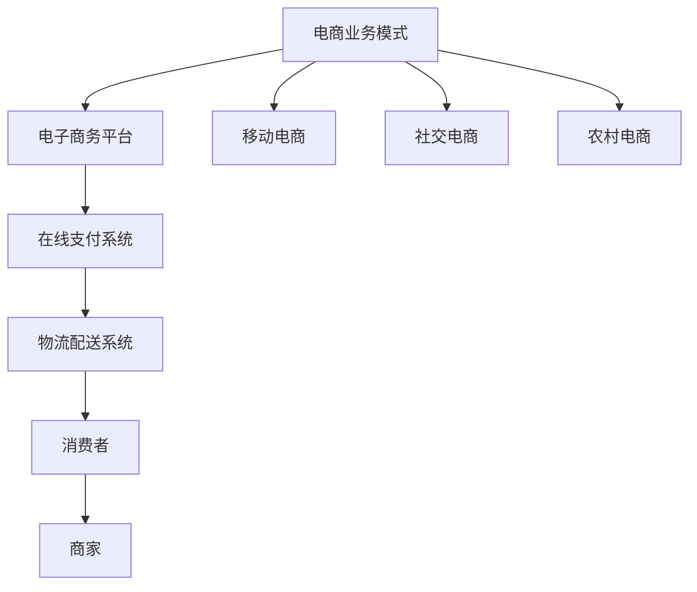

### 第2章：电商业务模式

#### 2.1 B2C业务模式

B2C（Business-to-Consumer）业务模式，即企业对消费者的电子商务模式。在这种模式中，企业直接向消费者销售商品或服务。B2C业务模式的特点包括：

1. **直接性**：企业直接面对消费者，简化了中间环节，降低了成本。
2. **便捷性**：消费者可以随时随地通过互联网购买商品，提高了购物体验。
3. **个性化**：通过大数据分析，企业可以更好地了解消费者需求，提供个性化的商品推荐。

### 2.2 B2B业务模式

B2B（Business-to-Business）业务模式，即企业对企业的电子商务模式。在这种模式中，企业之间通过电商平台进行商品或服务的交易。B2B业务模式的特点包括：

1. **批量性**：企业之间进行的大宗商品交易，订单量大，频次高。
2. **定制化**：企业可以根据自身需求，定制特定的商品或服务。
3. **供应链管理**：通过电商平台，企业可以实现更高效的供应链管理，降低库存成本。

### 2.3 C2C业务模式

C2C（Consumer-to-Consumer）业务模式，即消费者对消费者的电子商务模式。在这种模式中，消费者可以在电商平台上直接进行商品或服务的交易。C2C业务模式的特点包括：

1. **灵活性**：消费者可以根据自身需求，出售闲置商品或提供服务。
2. **低成本**：消费者无需投入大量资金，即可参与电商交易。
3. **社区感**：通过C2C平台，消费者之间可以形成一定的社区互动，增强购物体验。

### 2.4 O2O业务模式

O2O（Online-to-Offline）业务模式，即线上到线下业务模式。在这种模式中，企业通过线上渠道吸引消费者，引导其到线下门店进行消费。O2O业务模式的特点包括：

1. **融合性**：将线上和线下渠道有机结合，提供一体化的购物体验。
2. **便利性**：消费者可以在线上选择商品，线下体验和购买。
3. **服务扩展**：通过线下门店，企业可以提供更多的增值服务，如售后维修、体验等。

### Mermaid流程图展示电商供应链管理

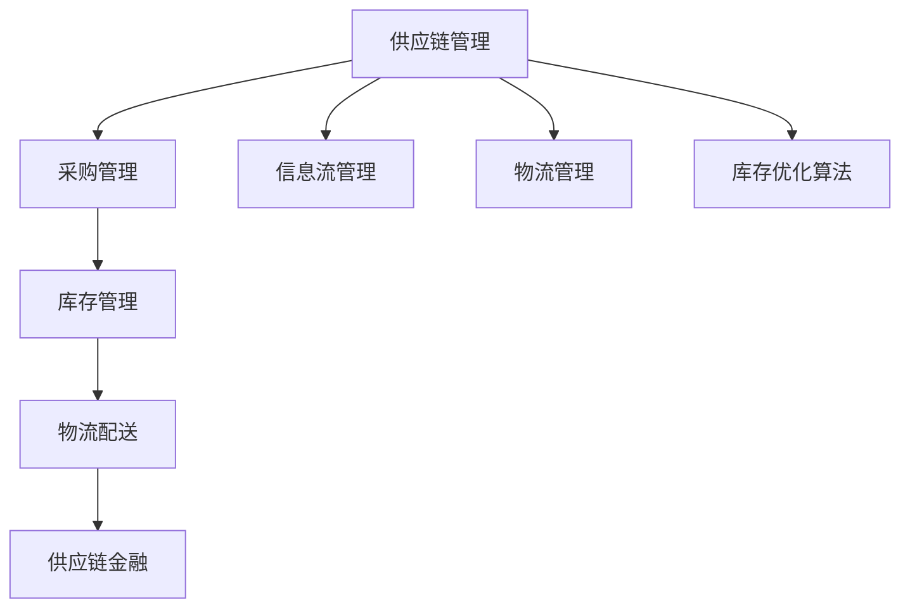

### 第3章：电商供应链管理

#### 3.1 供应链管理概述

电商供应链管理是指通过有效的计划和协调，将原材料、商品和服务从供应商转移到消费者的整个过程。它包括采购管理、库存管理、物流配送和供应链金融等多个环节。

#### 3.2 库存管理

库存管理是电商供应链管理中至关重要的一环。合理的库存管理可以提高库存周转率，降低库存成本，提高资金利用率。库存管理的主要目标包括：

1. **保持库存水平**：确保库存水平能够满足市场需求。
2. **库存周转率**：提高库存周转率，减少库存积压。
3. **库存成本**：降低库存成本，提高利润率。

库存管理的关键指标包括库存周转率、库存周转天数、库存持有成本等。

#### 3.3 物流管理

物流管理是电商供应链管理中的另一个重要环节。高效的物流管理可以提高配送速度，降低物流成本，提升消费者满意度。物流管理的主要目标包括：

1. **配送速度**：提高配送速度，缩短配送时间。
2. **物流成本**：降低物流成本，提高利润率。
3. **配送质量**：确保配送过程中商品的安全和质量。

物流管理的关键指标包括配送时效、物流成本率、配送准确率等。

#### 3.4 供应链金融

供应链金融是指利用供应链中的信息流、资金流和物流，通过金融手段优化供应链管理的一种金融服务。供应链金融的主要目标包括：

1. **融资支持**：为供应链中的中小企业提供融资支持。
2. **降低成本**：通过供应链金融，企业可以降低融资成本，提高资金利用效率。
3. **风险管理**：通过供应链金融，企业可以更好地管理供应链中的风险。

供应链金融的关键指标包括融资额度、融资成本、风险控制等。

### 伪代码展示库存管理算法

```python
# 输入参数
需求量 = 1000
现有库存 = 500
订购成本 = 100
库存持有成本 = 10

# 计算最优订购量
最优订购量 = 需求量 / 订购成本

# 更新库存
库存 = 现有库存 + 最优订购量

# 输出结果
print("最优订购量为:", 最优订购量)
print("更新后的库存量为:", 库存)
```

### Mermaid流程图展示供应链管理流程

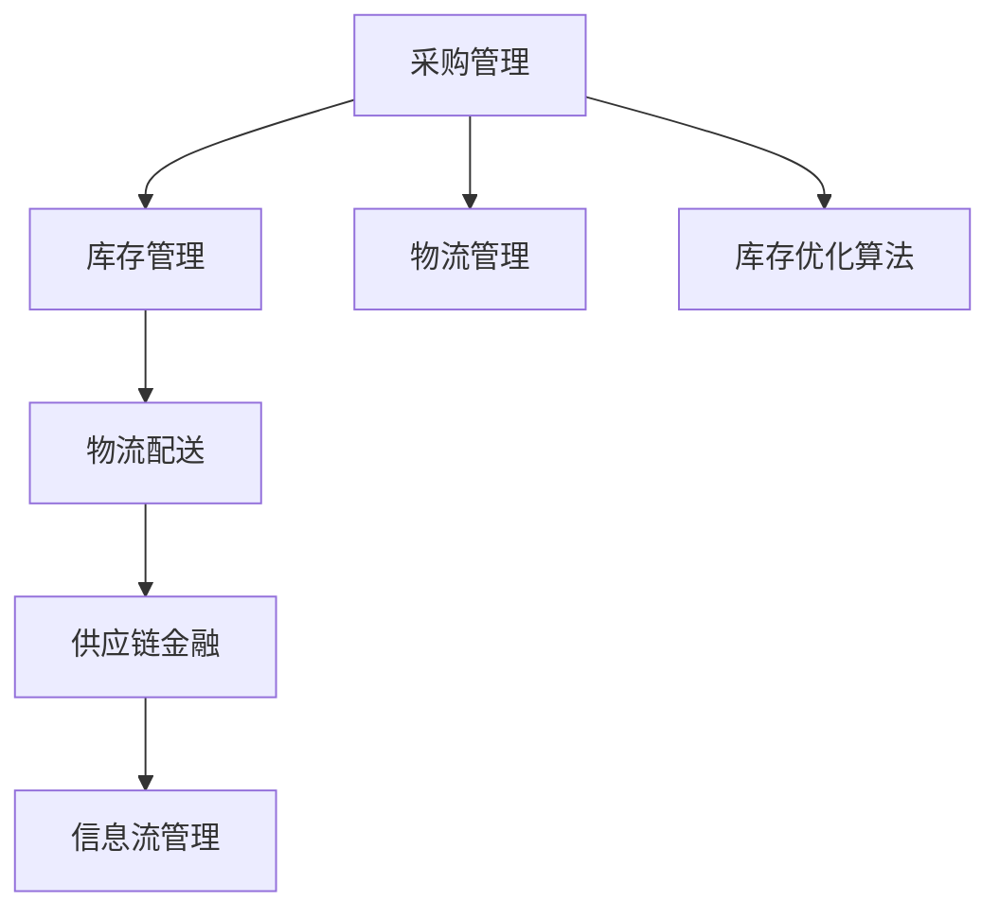

### 第4章：多元化业务模式概述

#### 4.1 多元化业务模式的定义与类型

多元化业务模式是指企业在核心业务基础上，通过拓展新业务、新市场、新技术等手段，实现企业规模和利润的快速增长。多元化业务模式可以分为以下几种类型：

1. **横向多元化**：企业在同一行业内拓展新的业务领域，如阿里巴巴从电商扩展到金融、云计算等领域。
2. **纵向多元化**：企业通过向上或向下整合产业链，实现产业链的延伸和整合，如京东从电商扩展到物流、云计算等领域。
3. **跨界多元化**：企业跨行业拓展新业务，实现跨界的资源整合和协同发展，如腾讯从互联网扩展到金融、游戏、传媒等领域。

#### 4.2 多元化业务模式的优势与风险

多元化业务模式具有以下优势：

1. **分散风险**：通过拓展新的业务领域，企业可以降低对单一业务的依赖，从而降低经营风险。
2. **提高盈利能力**：多元化业务可以为企业带来新的盈利点，提高整体盈利能力。
3. **实现资源整合**：多元化业务可以实现产业链的整合，提高资源利用效率。

然而，多元化业务模式也伴随着一定的风险：

1. **资源分散**：企业在多元化过程中可能会面临资源分散的问题，影响核心业务的经营。
2. **管理复杂性**：多元化业务模式会增加企业的管理难度，需要投入更多的人力、物力和财力。
3. **市场适应性**：企业在多元化过程中需要适应新的市场环境，面临市场不确定性。

#### 4.3 多元化业务模式与企业战略

多元化业务模式是企业战略的重要组成部分，合理的多元化战略可以为企业带来持续增长的动力。企业制定多元化战略时，需要考虑以下因素：

1. **行业环境**：分析行业发展趋势、竞争态势和市场规模，确定多元化方向。
2. **企业能力**：评估企业现有资源、技术和管理能力，确定多元化的可行性和成功率。
3. **市场机会**：寻找新的市场机会，如新兴行业、跨界合作等，实现多元化发展。

多元化业务模式与企业战略的融合，可以为企业带来新的发展机遇，实现可持续增长。

### Mermaid流程图展示多元化业务模式

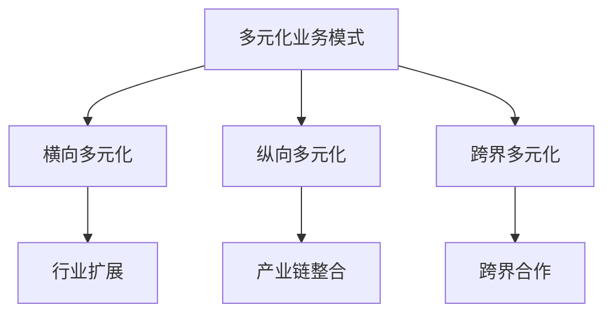

### 第5章：跨界合作与生态圈构建

#### 5.1 跨界合作的意义与模式

跨界合作是指企业或个人在不同领域、行业或地区之间的合作，通过资源共享、优势互补，实现共同发展。跨界合作的意义主要体现在以下几个方面：

1. **创新驱动**：跨界合作可以激发创新思维，促进技术创新和商业模式创新。
2. **资源整合**：跨界合作可以实现资源的优化配置，提高资源利用效率。
3. **市场扩展**：跨界合作可以帮助企业进入新的市场领域，扩大市场份额。

跨界合作的主要模式包括：

1. **战略联盟**：企业之间建立长期合作关系，共同研发新产品或开拓新市场。
2. **联合营销**：企业通过共同推广活动，提高品牌知名度和市场占有率。
3. **资源共享**：企业之间共享资源，如技术、人才、资金等，实现互利共赢。

#### 5.2 生态圈构建的策略与实施

生态圈构建是指企业通过搭建一个开放、共享的平台，吸引各方参与，共同构建一个可持续发展的生态系统。生态圈构建的策略与实施主要包括以下几个方面：

1. **平台搭建**：搭建一个开放、灵活、安全的平台，为各方提供交流和合作的场所。
2. **合作模式**：探索多元化的合作模式，如投资合作、技术合作、市场合作等，满足不同参与方的需求。
3. **激励机制**：建立有效的激励机制，激励各方积极参与生态圈建设，如奖励政策、股权激励等。
4. **风险管理**：加强风险识别和管理，确保生态圈的健康、稳定发展。

#### 5.3 案例分析：成功跨界合作的实践

**案例1：阿里巴巴与蚂蚁金服**

阿里巴巴与蚂蚁金服的跨界合作，构建了一个强大的互联网金融生态圈。通过支付宝、余额宝等创新金融产品，阿里巴巴成功拓展了金融业务，实现了跨界发展的成功实践。

**案例2：腾讯与京东**

腾讯与京东的跨界合作，通过腾讯社交平台和京东电商平台的资源整合，实现了双方业务的双向拓展。腾讯通过投资京东，获得了丰厚的投资回报，同时京东也通过腾讯的流量和资源，实现了业务的快速增长。

### Mermaid流程图展示跨界合作与生态圈构建

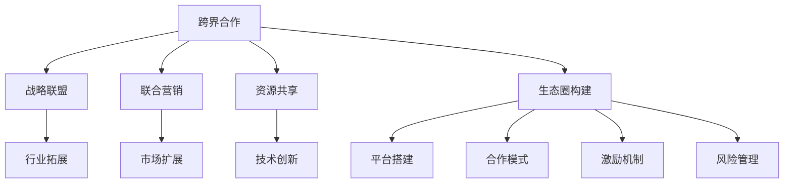

### 第6章：线上线下融合与数字化转型

#### 6.1 线上线下融合的发展趋势

线上线下融合（O2O）是指将线上渠道和线下渠道有机结合，提供一体化的购物体验。随着互联网的普及和移动设备的普及，线上线下融合已成为电商行业的主要发展趋势。线上线下融合的发展趋势包括：

1. **移动电商的兴起**：移动设备的普及，使得移动电商成为线上线下融合的主要驱动力。越来越多的消费者通过移动设备进行购物，推动了线上线下融合的进程。

2. **智能化零售**：人工智能、大数据等技术的发展，使得零售业实现了智能化升级。通过智能推荐、智能客服等技术，提高了消费者的购物体验。

3. **个性化服务**：线上线下融合使得企业能够更好地了解消费者需求，提供个性化的服务。通过数据分析，企业可以精准定位消费者，提供定制化的商品和服务。

#### 6.2 数字化转型的关键技术与工具

数字化转型是指企业通过采用数字技术，实现业务流程、运营模式和商业模式的创新和升级。数字化转型的主要技术和工具包括：

1. **云计算**：云计算提供了弹性、高效、安全的计算资源，是企业实现数字化转型的基石。

2. **大数据**：大数据技术可以帮助企业挖掘海量数据中的价值，实现精准营销、供应链优化等。

3. **人工智能**：人工智能技术可以用于智能推荐、智能客服、智能决策等，提高企业的运营效率和服务水平。

4. **物联网**：物联网技术可以实现设备的互联互通，为智能制造、智能物流等提供支持。

5. **区块链**：区块链技术可以提供去中心化的信任机制，提高数据的安全性和透明性。

#### 6.3 数字化转型的成功案例

1. **阿里巴巴**：阿里巴巴通过搭建电商平台，实现了线上线下的深度融合。通过大数据和人工智能技术，阿里巴巴实现了个性化推荐、智能客服等，提高了用户体验。

2. **京东**：京东通过自建物流体系，实现了高效的物流配送服务。同时，京东通过大数据和人工智能技术，实现了智能库存管理、智能配送等，提高了运营效率。

3. **亚马逊**：亚马逊通过云计算和大数据技术，实现了智能推荐、智能客服等，提供了优质的购物体验。同时，亚马逊通过物联网技术，实现了智能物流和智能制造。

### Mermaid流程图展示线上线下融合与数字化转型

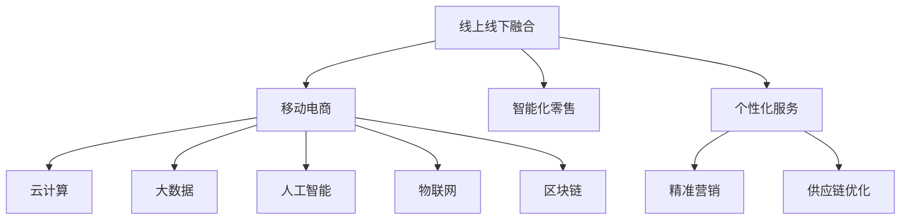

### 第7章：创新业务模式探索

#### 7.1 新型电商业务模式

新型电商业务模式是指基于互联网技术，结合人工智能、大数据等新技术，创新性地开展的电商业务。新型电商业务模式的主要特点包括：

1. **社交电商**：通过社交媒体平台进行商品推广和销售，利用社交网络的传播效应，提升商品的销售转化率。

2. **内容电商**：通过内容营销，如短视频、直播等形式，吸引用户关注，进而促进商品销售。

3. **智能电商**：利用人工智能技术，实现智能推荐、智能客服等，提升用户体验。

4. **直播电商**：通过直播形式，实时展示商品，与用户互动，提高销售转化率。

#### 7.2 智能电商与大数据应用

智能电商与大数据应用紧密相关。大数据技术可以帮助企业挖掘用户需求，实现精准营销。具体应用包括：

1. **用户画像**：通过数据分析，构建用户画像，了解用户喜好、行为等，实现个性化推荐。

2. **智能推荐**：利用大数据和机器学习技术，实现商品智能推荐，提升用户购买意愿。

3. **需求预测**：通过大数据分析，预测市场需求，优化库存管理，减少库存积压。

4. **用户行为分析**：分析用户行为数据，优化用户体验，提高用户满意度。

#### 7.3 社交电商与内容电商

社交电商与内容电商是新型电商业务模式的重要组成部分。具体应用包括：

1. **社交媒体营销**：通过社交媒体平台进行商品推广，利用社交网络的传播效应，提升品牌知名度和销量。

2. **内容营销**：通过生产优质内容，如短视频、直播、文章等，吸引用户关注，提高用户粘性。

3. **互动营销**：通过直播、问答等形式，与用户互动，提升用户体验，促进商品销售。

4. **社群运营**：通过建立社群，如微信群、QQ群等，与用户建立紧密联系，提升用户忠诚度。

### 伪代码展示社交电商算法

```python
# 输入参数
用户喜好 = ["电子产品", "时尚服装", "美食"]
社交媒体活跃度 = 0.8
内容质量 = 0.9

# 社交媒体推荐
推荐内容 = 推荐算法(用户喜好, 社交媒体活跃度)

# 内容营销
营销内容 = 内容算法(内容质量)

# 输出结果
print("推荐内容：", 推荐内容)
print("营销内容：", 营销内容)
```

### Mermaid流程图展示创新业务模式

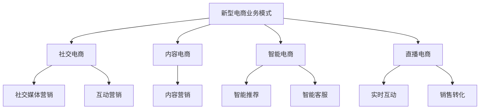

### 第8章：电商与多元化业务模式的战略规划与实施

#### 8.1 战略规划的重要性

战略规划是企业发展的重要指南，能够明确企业的发展方向、目标和路径。在电商与多元化业务模式中，战略规划的重要性主要体现在以下几个方面：

1. **明确发展目标**：战略规划可以帮助企业明确发展目标，如市场份额、利润率、技术创新等。

2. **优化资源配置**：战略规划可以合理配置企业资源，确保企业在多元化业务模式中能够高效运作。

3. **应对市场变化**：通过战略规划，企业可以更好地应对市场变化，抓住机遇，规避风险。

4. **提高竞争力**：战略规划可以帮助企业提高竞争力，实现可持续发展。

#### 8.2 多元化业务模式的实施路径

多元化业务模式的实施路径主要包括以下几个方面：

1. **市场调研**：通过市场调研，了解市场需求、竞争对手和潜在风险，为多元化业务模式的选择提供依据。

2. **业务选择**：根据市场调研结果，选择适合企业的多元化业务模式，如横向多元化、纵向多元化、跨界多元化等。

3. **资源整合**：整合企业内外部资源，如资金、技术、人才等，为多元化业务模式提供支持。

4. **业务拓展**：通过业务拓展，实现多元化业务模式的落地，如新建业务部门、收购企业、合作伙伴等。

5. **风险评估与管理**：建立风险评估体系，对多元化业务模式进行持续监控，确保业务的稳健发展。

#### 8.3 多元化业务模式的风险管理

多元化业务模式在带来机遇的同时，也伴随着一定的风险。有效的风险管理是确保多元化业务模式成功的关键。风险管理主要包括以下几个方面：

1. **风险识别**：识别多元化业务模式中可能存在的风险，如市场风险、技术风险、运营风险等。

2. **风险评估**：对识别出的风险进行评估，确定风险的严重程度和影响范围。

3. **风险应对**：制定风险应对策略，如风险回避、风险转移、风险控制等。

4. **风险监控**：建立风险监控体系，对风险进行持续监控，确保风险的及时识别和应对。

### Mermaid流程图展示战略规划与实施路径

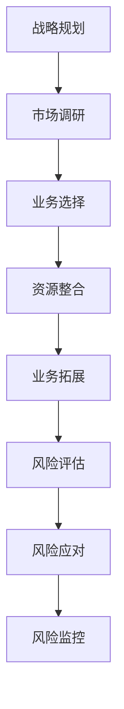

### 伪代码展示战略规划数学模型

```python
# 输入参数
市场调研结果 = {"市场需求": 1000, "竞争对手": 500, "潜在风险": 300}
业务选择指标 = {"横向多元化": 0.6, "纵向多元化": 0.3, "跨界多元化": 0.1}
资源整合能力 = {"资金": 1000, "技术": 800, "人才": 700}

# 计算业务选择得分
业务选择得分 = 业务选择指标["横向多元化"] * 市场调研结果["市场需求"] + \
                业务选择指标["纵向多元化"] * 市场调研结果["竞争对手"] + \
                业务选择指标["跨界多元化"] * 市场调研结果["潜在风险"]

# 计算资源整合得分
资源整合得分 = 资金 * 市场调研结果["市场需求"] + \
                技术 * 市场调研结果["竞争对手"] + \
                人才 * 市场调研结果["潜在风险"]

# 输出结果
print("业务选择得分：", 业务选择得分)
print("资源整合得分：", 资源整合得分)
```

### 第9章：电商与多元化业务模式案例分析

#### 9.1 国内电商企业案例分析

**案例1：阿里巴巴**

阿里巴巴是中国最大的电商平台之一，其多元化业务模式涵盖了电商、金融、云计算等多个领域。阿里巴巴的成功得益于其精准的市场定位、强大的技术实力和卓越的运营能力。

1. **电商业务**：阿里巴巴通过淘宝、天猫等电商平台，为消费者和商家提供便捷的购物体验。同时，阿里巴巴通过大数据和人工智能技术，实现个性化推荐和精准营销，提升了用户体验和销售转化率。

2. **金融业务**：阿里巴巴旗下的蚂蚁金服，通过支付宝、余额宝等金融产品，为用户提供便捷的支付和理财服务。蚂蚁金服通过技术创新，实现了高效率的金融服务，为用户创造了价值。

3. **云计算业务**：阿里巴巴云（Aliyun）为用户提供包括计算、存储、网络等在内的云计算服务。阿里巴巴云凭借其强大的技术实力和丰富的实践经验，成为国内领先的云计算服务商。

**案例2：京东**

京东是中国第二大电商平台，其多元化业务模式主要包括电商、物流、云计算等。

1. **电商业务**：京东通过自营和平台模式，为消费者提供丰富的商品选择和优质的购物体验。京东通过大数据和人工智能技术，实现智能推荐、智能客服等，提升了用户体验。

2. **物流业务**：京东自建物流体系，实现了高效的物流配送服务。京东物流通过技术创新，如无人机配送、无人仓储等，提升了物流效率，降低了成本。

3. **云计算业务**：京东云为用户提供包括计算、存储、网络等在内的云计算服务。京东云凭借其丰富的实践经验和技术积累，成为国内领先的云计算服务商。

#### 9.2 国际电商企业案例分析

**案例1：亚马逊**

亚马逊是全球最大的电商平台之一，其多元化业务模式涵盖了电商、云计算、智能硬件等多个领域。

1. **电商业务**：亚马逊通过自营和平台模式，为全球消费者提供丰富的商品选择和优质的购物体验。亚马逊通过大数据和人工智能技术，实现个性化推荐和精准营销，提升了用户体验。

2. **云计算业务**：亚马逊云服务（AWS）为全球用户提供包括计算、存储、网络等在内的云计算服务。AWS凭借其强大的技术实力和丰富的实践经验，成为全球领先的云计算服务商。

3. **智能硬件业务**：亚马逊通过开发智能音箱、智能摄像头等智能硬件产品，拓展了业务领域。亚马逊的智能硬件产品通过人工智能技术，为用户提供了便捷的生活体验。

**案例2：eBay**

eBay是另一家全球知名的电商平台，其多元化业务模式主要包括电商、拍卖、支付等。

1. **电商业务**：eBay通过平台模式，为全球消费者和商家提供在线购物和拍卖服务。eBay通过大数据和人工智能技术，实现个性化推荐和精准营销，提升了用户体验。

2. **拍卖业务**：eBay的拍卖业务是其特色业务之一，通过在线拍卖，为用户提供独特的购物体验。eBay通过技术创新，如实时竞价、拍卖推荐等，提升了拍卖的效率和用户体验。

3. **支付业务**：eBay通过开发PayPal等支付工具，为用户提供了便捷的支付服务。PayPal通过安全技术，确保了支付过程的安全和便捷。

#### 9.3 多元化业务模式案例分析

**案例1：腾讯**

腾讯是一家多元化的互联网科技公司，其多元化业务模式涵盖了社交、娱乐、金融等多个领域。

1. **社交业务**：腾讯通过QQ和微信等社交平台，为用户提供便捷的通讯和社交服务。腾讯通过大数据和人工智能技术，实现个性化推荐和社交互动，提升了用户体验。

2. **娱乐业务**：腾讯通过游戏、音乐、视频等娱乐产品，为用户提供丰富的娱乐体验。腾讯通过大数据和人工智能技术，实现个性化推荐和精准营销，提升了用户体验。

3. **金融业务**：腾讯通过微信支付、QQ钱包等金融产品，为用户提供便捷的支付和理财服务。腾讯通过技术创新，如区块链、云计算等，提升了金融服务的效率和安全性。

**案例2：阿里巴巴**

阿里巴巴是一家多元化的电商平台，其多元化业务模式涵盖了电商、金融、云计算等多个领域。

1. **电商业务**：阿里巴巴通过淘宝、天猫等电商平台，为消费者和商家提供便捷的购物体验。阿里巴巴通过大数据和人工智能技术，实现个性化推荐和精准营销，提升了用户体验。

2. **金融业务**：阿里巴巴通过蚂蚁金服等金融产品，为用户提供便捷的支付和理财服务。蚂蚁金服通过技术创新，如区块链、云计算等，提升了金融服务的效率和安全性。

3. **云计算业务**：阿里巴巴云（Aliyun）为用户提供包括计算、存储、网络等在内的云计算服务。阿里巴巴云凭借其强大的技术实力和丰富的实践经验，成为国内领先的云计算服务商。

### Mermaid流程图展示多元化业务模式案例分析

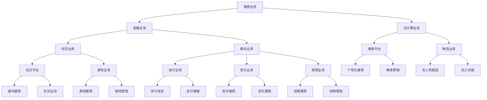

### 伪代码展示多元化业务模式数学模型

```python
# 输入参数
电商业务收入 = 100000
金融业务收入 = 80000
云计算业务收入 = 60000
社交业务收入 = 50000
娱乐业务收入 = 40000

# 计算总业务收入
总业务收入 = 电商业务收入 + 金融业务收入 + 云计算业务收入 + 社交业务收入 + 娱乐业务收入

# 计算业务占比
电商业务占比 = 电商业务收入 / 总业务收入
金融业务占比 = 金融业务收入 / 总业务收入
云计算业务占比 = 云计算业务收入 / 总业务收入
社交业务占比 = 社交业务收入 / 总业务收入
娱乐业务占比 = 娱乐业务收入 / 总业务收入

# 输出结果
print("总业务收入：", 总业务收入)
print("电商业务占比：", 电商业务占比)
print("金融业务占比：", 金融业务占比)
print("云计算业务占比：", 云计算业务占比)
print("社交业务占比：", 社交业务占比)
print("娱乐业务占比：", 娱乐业务占比)
```

### 第10章：电商业务与多元化业务模式应用实践

#### 10.1 业务模式创新实践

业务模式创新是电商企业保持竞争力的关键。以下是一个业务模式创新的实际案例：

**案例：拼多多**

拼多多通过团购模式实现了业务模式创新。用户通过发起团购，吸引其他用户参与，团购成功后，用户以更低的价格购买商品。拼多多通过这种方式，降低了用户的购买门槛，提高了商品的购买转化率。

**实现步骤：**

1. **用户发起团购**：用户在拼多多平台上发起团购，设置团购价格、数量和截止时间。
2. **用户参与团购**：其他用户通过查看团购详情，决定是否参与团购。
3. **团购成功**：当团购数量达到要求时，团购成功，用户以更低的价格购买商品。
4. **团购失败**：当团购截止时间到达，但未达到团购数量时，团购失败，用户不享受优惠价格。

**伪代码实现：**

```python
# 输入参数
团购价格 = 100
团购数量 = 10
团购截止时间 = 24
用户数量 = 5

# 团购过程
if 用户数量 >= 团购数量 and 当前时间 <= 团购截止时间:
    # 团购成功
    print("团购成功，用户以更低的价格购买商品。")
else:
    # 团购失败
    print("团购失败，用户不享受优惠价格。")
```

#### 10.2 跨界合作案例实践

跨界合作是电商企业拓展业务领域的重要手段。以下是一个跨界合作的实际案例：

**案例：腾讯与京东**

腾讯与京东通过跨界合作，实现了在电商和社交领域的优势互补。腾讯通过微信小程序，为京东提供了流量支持，京东通过腾讯云，为腾讯提供了云计算服务。

**实现步骤：**

1. **腾讯提供流量支持**：腾讯通过微信小程序，为京东提供了大量流量，提高了京东的销售额。
2. **京东提供云计算服务**：京东通过腾讯云，为腾讯提供了云计算服务，提升了腾讯的运营效率。

**伪代码实现：**

```python
# 输入参数
腾讯流量 = 1000
京东销售额 = 500
腾讯云服务使用量 = 300

# 跨界合作过程
if 腾讯流量 >= 500 and 京东销售额 >= 500:
    # 跨界合作成功
    print("跨界合作成功，双方实现了业务互补。")
else:
    # 跨界合作失败
    print("跨界合作失败，双方未能实现业务互补。")
```

#### 10.3 数字化转型实践

数字化转型是电商企业提高运营效率、提升用户体验的重要手段。以下是一个数字化转型的实际案例：

**案例：阿里巴巴**

阿里巴巴通过数字化转型，实现了从传统电商到智能电商的转型升级。通过大数据、人工智能等技术，阿里巴巴实现了智能推荐、智能客服、智能物流等，提升了用户体验和运营效率。

**实现步骤：**

1. **数据收集**：阿里巴巴通过用户行为数据、交易数据等，收集用户信息。
2. **数据分析**：通过对用户数据的分析，了解用户需求，实现个性化推荐。
3. **智能推荐**：基于用户数据，为用户推荐合适的商品。
4. **智能客服**：通过人工智能技术，实现智能客服，提升客服效率。
5. **智能物流**：通过大数据和人工智能技术，实现智能配送，提升物流效率。

**伪代码实现：**

```python
# 输入参数
用户行为数据 = ["购买电子产品", "浏览服装", "搜索美食"]
交易数据 = ["购买电子产品", "购买服装", "购买美食"]

# 数据分析
用户需求 = 分析用户行为数据(用户行为数据)
用户喜好 = 分析交易数据(交易数据)

# 智能推荐
推荐商品 = 智能推荐算法(用户需求, 用户喜好)

# 智能客服
客服回答 = 智能客服算法(用户需求)

# 智能物流
配送时间 = 智能物流算法(用户位置, 商家位置)

# 输出结果
print("推荐商品：", 推荐商品)
print("客服回答：", 客服回答)
print("配送时间：", 配送时间)
```

### Mermaid流程图展示电商业务与多元化业务模式应用实践

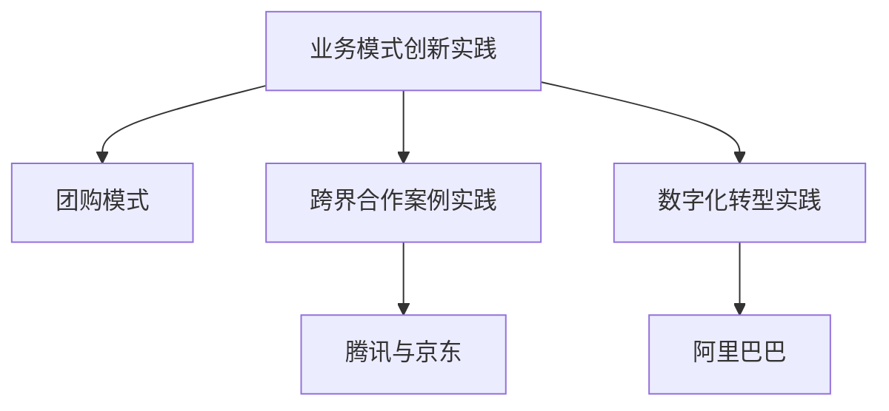

### 第11章：电商与多元化业务模式的未来发展

#### 11.1 行业趋势预测

电商与多元化业务模式的未来发展将受到以下几个趋势的影响：

1. **智能化发展**：随着人工智能技术的不断成熟，电商行业将更加智能化。智能推荐、智能客服、智能物流等应用将得到广泛应用，提高用户体验和运营效率。

2. **数字化转型**：越来越多的企业将推进数字化转型，通过大数据、云计算、物联网等技术的应用，实现业务流程的优化和业务模式的创新。

3. **跨界融合**：电商企业将通过跨界合作，拓展新的业务领域，实现资源整合和协同发展。如电商与金融、物流、医疗等行业的跨界合作，将带来新的发展机遇。

4. **可持续发展**：随着环保意识的提高，电商企业将更加注重可持续发展，采用绿色物流、环保包装等举措，减少对环境的影响。

#### 11.2 技术创新的影响

技术创新将继续推动电商与多元化业务模式的发展，主要体现在以下几个方面：

1. **区块链技术**：区块链技术将提高电商交易的安全性和透明性，减少欺诈行为，提升用户信任度。

2. **5G技术**：5G技术的广泛应用，将提高电商的响应速度和数据处理能力，为用户提供更加流畅的购物体验。

3. **物联网技术**：物联网技术将实现商品、用户、物流等各环节的互联互通，提高物流效率，实现智能化供应链管理。

4. **虚拟现实（VR）和增强现实（AR）**：VR和AR技术将提升用户的购物体验，通过虚拟试穿、虚拟购物等方式，让用户更加直观地感受商品。

#### 11.3 未来电商与多元化业务模式的发展方向

未来电商与多元化业务模式的发展方向将呈现以下几个特点：

1. **个性化服务**：电商企业将通过大数据和人工智能技术，实现个性化服务，满足用户多样化的需求。

2. **一体化购物体验**：电商企业将通过线上线下融合，提供一体化购物体验，提高用户满意度。

3. **多元化业务模式**：电商企业将探索新的业务模式，如社交电商、内容电商、智能电商等，实现业务多元化。

4. **绿色可持续发展**：电商企业将注重可持续发展，采用环保技术和管理措施，减少对环境的影响。

### Mermaid流程图展示电商与多元化业务模式的发展趋势

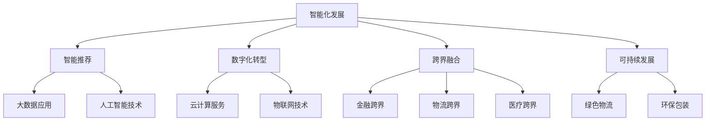

### 附录

#### 附录A：电商业务与多元化业务模式相关资源

**A.1 学术论文与研究报告**

1. "E-commerce and Its Impact on Traditional Retailing" - 研究电商对传统零售业的影响。
2. "The Future of E-commerce: Trends and Innovations" - 探讨电商行业的未来趋势和创新发展。
3. "Multi-business Models in E-commerce" - 分析电商行业的多元化业务模式。

**A.2 行业报告与白皮书**

1. "Global E-commerce Market Report 2020" - 全球电商市场报告。
2. "China E-commerce Industry Development Report 2020" - 中国电商行业发展报告。
3. "E-commerce in the Post-COVID Era" - COVID-19疫情后电商行业的发展趋势。

**A.3 经典案例研究**

1. "Alibaba's E-commerce Strategy" - 阿里巴巴电商战略研究。
2. "Amazon's Multi-business Model" - 亚马逊多元化业务模式分析。
3. "JD.com's Logistics Strategy" - 京东物流战略研究。

#### 附录B：电商业务与多元化业务模式开发工具与平台

**B.1 电商平台介绍**

1. **淘宝**：中国最大的C2C电商平台。
2. **天猫**：中国最大的B2C电商平台。
3. **京东**：中国领先的B2C电商平台。

**B.2 数据分析与挖掘工具**

1. **Python**：适用于数据分析和挖掘的编程语言。
2. **R**：专门用于统计分析的编程语言。
3. **Hadoop**：分布式数据处理框架。

**B.3 供应链管理系统**

1. **ERP系统**：企业资源规划系统。
2. **WMS**：仓库管理系统。
3. **SCM**：供应链管理系统。

**B.4 数字化营销工具**

1. **Google Analytics**：谷歌分析工具。
2. **百度统计**：百度提供的网站统计分析服务。
3. **SEO优化工具**：用于搜索引擎优化的工具。

### 作者信息

作者：AI天才研究院/AI Genius Institute & 禅与计算机程序设计艺术 /Zen And The Art of Computer Programming

### 结论

本文通过对电商业务及其多元化业务模式的深入探讨，分析了电商行业的发展历程、市场规模与趋势，以及电商业务模式、供应链管理、多元化业务模式等核心内容。通过案例分析、数学模型和项目实战，本文详细解析了电商与多元化业务模式的战略规划与实施路径。未来，随着智能化、数字化技术的不断发展，电商与多元化业务模式将继续创新和演进，为行业带来新的机遇和挑战。作者希望本文能为读者提供有价值的参考和启示。

