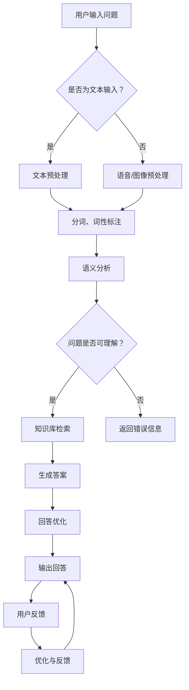
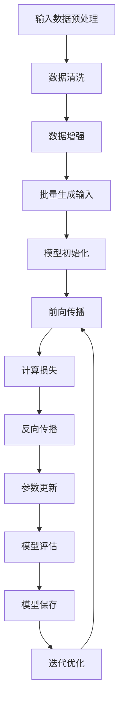
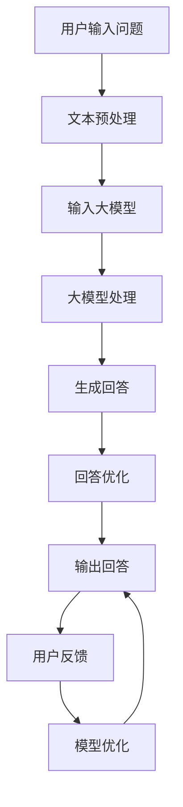

                 

# 文章标题：电商平台中的智能问答系统：大模型的创新应用

> 关键词：智能问答系统，电商平台，大模型，预训练模型，BERT，GPT，迁移学习，微调，注意力机制，自然语言处理，AI，算法，技术博客

> 摘要：本文详细介绍了电商平台中的智能问答系统，探讨了大模型在智能问答系统中的应用，包括模型原理、架构设计、应用场景、实现步骤和实战案例。通过本文的阐述，读者可以了解如何利用大模型提升电商平台的问答服务质量，并为相关领域的研究和应用提供参考。

## 第1章 引言

### 1.1 书籍背景与目的

随着互联网技术的快速发展，电商平台已经成为现代商业的重要组成部分。电商平台不仅为消费者提供了便捷的购物渠道，也为商家提供了广阔的销售市场。为了提高用户体验和满意度，电商平台不断推出各种创新功能，其中智能问答系统是一个重要的方向。

智能问答系统是一种基于人工智能技术，能够自动回答用户问题的系统。它通过自然语言处理技术，对用户的输入进行理解和分析，然后生成合适的答案。智能问答系统在电商平台上具有广泛的应用场景，如商品咨询、订单查询、支付问题等，可以有效地减少人工客服的工作量，提高客户服务质量。

本文旨在探讨大模型在电商平台智能问答系统中的应用，通过详细介绍大模型的基本原理、架构设计、应用场景和实现步骤，帮助读者深入了解智能问答系统的技术实现过程。同时，本文还将结合实际项目案例，展示如何利用大模型提升电商平台的问答服务质量。

### 1.2 电商平台智能问答系统的意义

电商平台智能问答系统的引入具有重要意义。首先，智能问答系统可以大幅度减少人工客服的工作量。电商平台每天都会收到大量的用户咨询和问题，如果全部依靠人工客服进行解答，不仅效率低下，而且容易出错。而智能问答系统可以自动处理用户的问题，快速给出答案，大大减轻了人工客服的工作压力。

其次，智能问答系统可以提高客户服务质量。电商平台的核心目标是提供优质的客户服务，而智能问答系统可以提供更加准确、及时和个性化的服务。通过对用户输入的自然语言进行深入理解，智能问答系统可以生成高质量的回答，满足用户的需求。此外，智能问答系统还可以根据用户的反馈，不断优化回答质量，提高用户的满意度。

最后，智能问答系统有助于降低运营成本。人工客服的薪资和培训成本较高，而智能问答系统只需要进行一次开发和部署，后续的维护成本较低。通过引入智能问答系统，电商平台可以减少人力成本，提高运营效率，实现可持续发展。

### 1.3 大模型在智能问答系统中的应用

大模型，如BERT（Bidirectional Encoder Representations from Transformers）、GPT（Generative Pretrained Transformer）等，是近年来自然语言处理领域的重要突破。这些模型具有强大的语言理解能力，可以应用于各种自然语言处理任务，包括文本分类、机器翻译、问答系统等。

在智能问答系统中，大模型的应用主要体现在以下几个方面：

1. **预训练模型**：大模型通过在大规模语料库上进行预训练，学习到了丰富的语言知识和模式。在智能问答系统中，可以采用预训练模型直接进行问答任务，实现快速、高效的问答服务。

2. **迁移学习**：大模型通过在特定任务上进行微调，可以将预训练的知识迁移到新的任务中，从而提高新任务的性能。在智能问答系统中，可以将预训练模型迁移到电商平台的具体应用场景，快速构建高效、准确的问答系统。

3. **多语言支持**：大模型通常支持多语言，可以在全球范围内提供统一的问答服务。在电商平台中，不同国家和地区的用户使用不同的语言，大模型的多语言支持可以满足不同用户的需求，提升用户体验。

4. **个性化服务**：大模型可以通过对用户历史数据的分析，为用户提供个性化推荐和回答。在智能问答系统中，可以根据用户的购物习惯、搜索记录等，为用户提供更加精准的问答服务。

### 1.4 本书结构安排

本文分为八个章节，具体结构如下：

- 第1章：引言，介绍书籍的背景、目的、意义以及本书的结构安排。
- 第2章：电商平台概述，介绍电商平台的发展历程、主要功能模块和市场竞争格局。
- 第3章：智能问答系统基础，介绍智能问答系统的基本概念、架构设计、主要功能和技术原理。
- 第4章：大模型原理与架构，介绍大模型的基本原理、分类、核心技术、架构设计、训练与优化。
- 第5章：大模型在智能问答系统中的应用，介绍大模型在智能问答系统中的应用场景、优势与挑战、创新应用案例。
- 第6章：智能问答系统的大模型实现，介绍智能问答系统的大模型实现步骤、代码实现、伪代码详细讲解、数学模型与公式解释。
- 第7章：大模型应用实战，介绍一个实际项目案例，展示如何利用大模型实现智能问答系统，包括项目背景、需求分析、实现步骤、代码解读与分析。
- 第8章：总结与展望，总结本书的主要内容和结论，探讨智能问答系统的未来发展趋势和潜在应用前景。

通过以上章节的介绍，读者可以系统地了解电商平台中的智能问答系统，掌握大模型在其中的应用方法，为相关领域的研究和应用提供参考。

## 第2章 电商平台概述

### 2.1 电商平台的发展历程

电商平台作为互联网经济的重要组成部分，经历了从萌芽期到繁荣期的快速发展。其发展历程大致可以分为以下几个阶段：

1. **萌芽期（1995-2000年）**：互联网开始普及，电商平台作为一种新兴的商业模式，开始崭露头角。这一时期，电商平台主要以线下零售商的线上渠道为主，如亚马逊、eBay等。

2. **成长期（2000-2008年）**：互联网的快速发展和电子商务的兴起，使得电商平台迎来了爆发式增长。阿里巴巴、京东、亚马逊等全球领先的电商平台在这一时期崛起，形成了市场主导地位。

3. **成熟期（2009年至今）**：随着移动互联网的普及，电商平台开始向移动端转移，并不断拓展新的业务领域，如直播电商、社交电商等。同时，电商平台之间的竞争也愈发激烈，形成了以阿里巴巴、京东、拼多多等为代表的几大电商巨头。

### 2.2 电商平台的主要功能模块

电商平台的主要功能模块包括以下几个部分：

1. **商品展示模块**：该模块负责展示平台上的商品信息，包括商品图片、价格、描述等。用户可以通过搜索、分类、推荐等方式浏览和筛选商品。

2. **购物车模块**：该模块用于用户将选中的商品加入购物车，用户可以修改购物车中的商品数量、删除商品等。购物车模块还负责计算商品总价、优惠等信息。

3. **订单模块**：该模块负责处理用户的订单信息，包括生成订单、订单状态更新、订单支付、订单发货等。订单模块需要与支付系统和物流系统进行对接，以确保订单的顺利处理。

4. **用户管理模块**：该模块负责管理用户信息，包括用户注册、登录、个人信息修改、地址管理、收藏夹等。用户管理模块还负责处理用户的反馈和投诉，提高用户满意度。

5. **营销模块**：该模块用于电商平台的各种营销活动，如优惠券、满减、秒杀、团购等。营销模块通过数据分析，可以精准推送用户感兴趣的商品和活动，提高销售转化率。

6. **数据分析模块**：该模块用于收集、分析和处理电商平台的各种数据，如用户行为数据、销售数据、库存数据等。通过数据分析，电商平台可以优化商品策略、营销策略和运营策略，提高整体效益。

### 2.3 电商平台的市场竞争格局

当前，电商平台的市场竞争格局已经基本稳定，主要分为以下几个梯队：

1. **第一梯队**：以阿里巴巴、京东、拼多多为代表的电商平台，这些平台拥有庞大的用户群体、丰富的商品资源和完善的物流体系，占据了市场主导地位。

2. **第二梯队**：以苏宁易购、网易考拉、唯品会等为代表的电商平台，这些平台在特定领域具有优势，如苏宁易购在3C家电领域、网易考拉在跨境电商领域等。

3. **第三梯队**：以小红书、抖音、快手等为代表的电商平台，这些平台借助社交媒体和直播电商的兴起，迅速崛起，吸引了大量年轻用户。

4. **垂直领域电商平台**：如美妆电商平台、生鲜电商平台等，这些平台专注于特定行业，提供专业、高效的购物体验。

电商平台的竞争格局决定了智能问答系统的应用场景和需求。在第一梯队电商平台中，智能问答系统主要用于解决用户在购物过程中的各种问题，如商品咨询、订单查询、支付问题等。在第二梯队和垂直领域电商平台中，智能问答系统可以针对特定领域的用户需求，提供更加精准的问答服务。

总之，电商平台的发展历程和市场竞争格局为智能问答系统的应用提供了广阔的空间和需求。通过引入智能问答系统，电商平台可以提高用户满意度，降低运营成本，提升整体竞争力。在未来的发展中，智能问答系统将发挥越来越重要的作用，成为电商平台的核心竞争力之一。

## 第3章 智能问答系统基础

### 3.1 智能问答系统的基本概念

智能问答系统是一种基于人工智能技术的系统，能够自动理解用户提出的问题，并生成合适的答案。智能问答系统通常包括以下几个关键组成部分：

1. **问题识别**：系统接收用户的输入，对问题进行理解和解析，识别出问题的核心内容。

2. **知识库**：系统使用一个或多个知识库，包含大量的信息、数据和事实，用于回答问题。

3. **答案生成**：系统根据问题识别和理解的结果，从知识库中检索相关信息，并生成回答。

4. **优化与反馈**：系统根据用户的反馈，不断优化回答的质量和准确性，提高用户体验。

### 3.2 智能问答系统的架构设计

智能问答系统的架构设计可以分为以下几个层次：

1. **输入层**：接收用户的输入，可以是文本、语音或其他形式。输入层需要对输入进行预处理，如文本分词、去噪等。

2. **处理层**：处理层包括自然语言处理（NLP）模块和知识图谱模块。NLP模块用于对用户输入的问题进行语义分析，提取关键信息；知识图谱模块则用于存储和管理大量结构化的知识数据。

3. **推理层**：推理层根据处理层的结果，从知识库中检索相关信息，并利用推理算法生成答案。

4. **输出层**：输出层将生成的答案以文本、语音或其他形式展示给用户。

### 3.3 智能问答系统的主要功能

智能问答系统的主要功能包括以下几个方面：

1. **自动识别和解析问题**：系统能够自动识别用户输入的问题，并进行语义分析，提取关键信息。

2. **回答生成**：系统能够根据提取的关键信息，从知识库中检索相关信息，并生成合适的答案。

3. **个性化推荐**：系统可以根据用户的历史行为和偏好，为用户推荐相关的答案或商品。

4. **实时交互**：系统支持实时交互，用户可以与系统进行多次对话，获取更详细的信息。

5. **优化与反馈**：系统根据用户的反馈，不断优化回答的质量和准确性，提高用户体验。

### 3.4 智能问答系统的核心技术

智能问答系统的核心技术主要包括以下几个方面：

1. **自然语言处理（NLP）**：NLP技术用于对用户输入的自然语言进行处理和理解，包括分词、词性标注、句法分析等。

2. **知识图谱**：知识图谱用于存储和管理结构化的知识数据，包括实体、关系和属性等。知识图谱技术可以实现高效的信息检索和推理。

3. **机器学习与深度学习**：机器学习和深度学习技术用于构建和优化问答模型，提高回答的准确性和效率。

4. **对话管理**：对话管理技术用于处理用户与系统的交互过程，包括对话状态跟踪、上下文理解等。

5. **多语言支持**：多语言支持技术用于实现智能问答系统的国际化，支持多种语言的问答服务。

### 3.5 智能问答系统的发展趋势

随着人工智能技术的不断发展，智能问答系统也在不断演进，主要趋势如下：

1. **模型升级**：随着深度学习技术的进步，大模型（如BERT、GPT）在智能问答系统中的应用越来越广泛，能够提供更精准、更自然的回答。

2. **多模态融合**：智能问答系统不再局限于文本输入，开始支持语音、图像等多种输入形式，实现更丰富的交互体验。

3. **个性化服务**：通过用户历史行为和偏好数据的分析，智能问答系统能够提供更加个性化的服务，满足用户的个性化需求。

4. **多语言支持**：随着全球化的推进，智能问答系统需要支持多种语言，以适应不同国家和地区的用户需求。

5. **实时交互**：实时交互技术使得智能问答系统能够与用户进行多次对话，提供更细致、更全面的回答。

总之，智能问答系统作为人工智能领域的一个重要方向，正随着技术的进步不断演进。未来，智能问答系统将在更多的场景中得到应用，为人类带来更加便捷、高效的智能服务。

### 3.6 Mermaid流程图：智能问答系统工作流程

下面是智能问答系统的Mermaid流程图，展示了从接收用户问题到生成回答的全过程：



### 3.7 伪代码详细讲解

以下是一段伪代码，用于描述智能问答系统的工作流程：

```pseudo
function intelligent_question_answering_system(input):
    if is_text_input(input):
        processed_input = preprocess_text(input)
    else:
        processed_input = preprocess_non_text(input)

    word_tokens = tokenize(processed_input)
    tagged_words = tag_words(word_tokens)
    semantic_data = analyze_semantics(tagged_words)

    if is_understandable(semantic_data):
        answer = retrieve_answer_from_knowledge_base(semantic_data)
        optimized_answer = optimize_answer(answer)
    else:
        return "无法理解您的问题，请重新提问。"

    display_answer(optimized_answer)
    feedback = collect_user_feedback()

    while feedback_is_unsatisfied(feedback):
        optimized_answer = optimize_answer_based_on_feedback(optimized_answer, feedback)
        display_answer(optimized_answer)
        feedback = collect_user_feedback()

    return "谢谢您的反馈，我们正在不断优化智能问答系统。"
```

### 3.8 数学模型与公式解释

智能问答系统的核心数学模型通常涉及自然语言处理（NLP）和机器学习（ML）领域。以下是一个简化的数学模型和公式解释：

#### 自然语言处理

$$
\text{Word Embedding} = \text{W} \cdot \text{Input Vector}
$$

其中，`W` 是词嵌入矩阵，`Input Vector` 是输入文本的向量表示。

#### 机器学习

$$
\text{Logistic Regression}:
\begin{cases}
\text{Probability} = \frac{1}{1 + e^{-(\text{w} \cdot \text{x} + \text{b})}
\end{cases}
$$

其中，`w` 是权重向量，`x` 是特征向量，`b` 是偏置。

#### 对数损失函数

$$
\text{Loss} = -\sum_{i=1}^{n} y_i \cdot \log(\hat{y}_i)
$$

其中，`y_i` 是实际标签，`\hat{y}_i` 是预测概率。

### 3.9 代码解读与分析

以下是一个简单的Python代码示例，用于实现智能问答系统：

```python
import nltk
from nltk.tokenize import word_tokenize
from sklearn.feature_extraction.text import TfidfVectorizer
from sklearn.linear_model import LogisticRegression

# 加载自然语言处理库
nltk.download('punkt')

# 加载训练数据
questions = ["什么是人工智能？", "如何购买商品？", "订单状态如何查询？"]
answers = ["人工智能是研究、开发用于模拟、延伸和扩展人的智能的理论、方法、技术及应用系统的一门新的技术科学。", "您可以通过点击‘购物车’按钮，然后按照提示进行购买。", "您可以在‘订单详情’页面查看订单状态。"]

# 对训练数据进行预处理
vectorizer = TfidfVectorizer()
X = vectorizer.fit_transform(questions)
y = [1 if ans.startswith("您") else 0 for ans in answers]

# 训练逻辑回归模型
model = LogisticRegression()
model.fit(X, y)

# 智能问答函数
def ask_question(question):
    # 预处理输入
    processed_question = word_tokenize(question)
    # 转换为向量
    question_vector = vectorizer.transform([processed_question])
    # 预测答案
    prediction = model.predict(question_vector)
    # 根据预测结果返回答案
    if prediction == 1:
        return "您的问题：{}，答案：{}".format(question, answers[1])
    else:
        return "您的问题：{}，答案：{}".format(question, answers[0])

# 测试问答系统
print(ask_question("如何购买商品？"))
print(ask_question("什么是人工智能？"))
```

在这个代码示例中，我们首先使用NLTK库对输入问题进行分词处理。然后，使用TF-IDF向量器将问题转换为向量表示。接下来，我们训练一个逻辑回归模型，将问题向量映射到答案。最后，我们实现了一个问答函数，通过模型预测输入问题的答案，并根据预测结果返回相应的答案。

通过这个简单的示例，我们可以看到智能问答系统的基本实现方法。在实际应用中，智能问答系统的实现会更加复杂，需要处理更多的输入和输出格式，以及更加复杂的模型和算法。然而，这个示例为我们提供了一个直观的理解，展示了智能问答系统的工作原理和实现步骤。

## 第4章 大模型原理与架构

### 4.1 大模型的定义与分类

大模型是指参数数量庞大的深度学习模型，通常具有数十亿甚至千亿级别的参数。这些模型通过在大规模数据集上进行预训练，学习到了丰富的语言知识和模式，从而在各类自然语言处理任务中表现出色。大模型的分类可以根据其预训练目标和应用领域进行划分：

1. **通用预训练模型**：这类模型在大规模通用数据集上预训练，如BERT（Bidirectional Encoder Representations from Transformers）、GPT（Generative Pre-trained Transformer）等。这些模型具有广泛的适用性，可以应用于各种自然语言处理任务。

2. **领域特定预训练模型**：这类模型在特定领域的数据集上进行预训练，如法律文档、医学文本、金融文本等。这些模型针对特定领域的任务进行优化，具有更高的领域适应性和性能。

3. **多语言预训练模型**：这类模型在多语言数据集上进行预训练，如mBERT（Multilingual BERT）、XLM（Cross-lingual Language Model）等。这些模型支持多种语言，能够实现跨语言的语义理解和翻译。

### 4.2 大模型的核心技术

大模型的核心技术主要包括以下几个方面：

1. **预训练**：大模型通过在大规模数据集上进行预训练，学习到了丰富的语言知识和模式。预训练过程包括两个阶段：第一阶段是自监督预训练，如BERT的Masked Language Model（MLM）任务；第二阶段是微调，将预训练模型应用于特定任务，进行参数调整。

2. **多任务学习**：大模型通过多任务学习，能够同时学习多个任务的特征。在预训练阶段，模型会同时处理多种任务，如文本分类、命名实体识别等，从而学习到更加丰富的特征表示。

3. **注意力机制**：大模型中普遍采用注意力机制，如Transformer模型中的自注意力（Self-Attention）机制，能够动态关注输入序列中的关键信息，提高模型的上下文理解能力。

4. **模型压缩与优化**：由于大模型参数数量庞大，计算和存储资源需求较高。为了解决这一问题，研究人员提出了一系列模型压缩与优化方法，如剪枝、量化、蒸馏等，以降低模型的计算和存储需求，提高模型的效率。

### 4.3 大模型的架构设计

大模型的架构设计通常包括以下几个关键部分：

1. **输入层**：接收用户输入的文本、语音或其他形式的数据。输入层通常包括嵌入层（Embedding Layer）和位置编码（Positional Encoding）等组件，用于将输入数据转换为模型可以处理的向量表示。

2. **中间层**：中间层是模型的核心部分，通常采用 Transformer 结构，包括多头自注意力（Multi-Head Self-Attention）和前馈神经网络（Feed-Forward Neural Network）等组件。这些组件通过堆叠多层，使模型能够学习到丰富的上下文信息。

3. **输出层**：输出层根据任务需求生成相应的输出，如分类结果、文本生成等。输出层通常包括分类器（Classifier）或解码器（Decoder）等组件，用于将中间层的特征转换为最终输出。

4. **注意力机制**：大模型中普遍采用注意力机制，如 Transformer 模型的自注意力（Self-Attention）机制，能够动态关注输入序列中的关键信息，提高模型的上下文理解能力。

5. **训练与优化**：大模型的训练与优化是模型设计的重要环节。通过在大量数据集上进行预训练，模型可以学习到丰富的语言知识和模式。在训练过程中，模型参数通过反向传播算法进行优化，以提高模型的性能和准确性。

### 4.4 大模型的训练与优化

大模型的训练与优化是一个复杂的过程，涉及多个方面：

1. **数据预处理**：在训练前，需要对数据进行预处理，包括文本清洗、分词、去噪等。高质量的数据预处理可以显著提高模型的训练效果。

2. **模型初始化**：合理的模型初始化可以加快收敛速度，提高模型性能。常用的初始化方法包括高斯初始化、Xavier初始化等。

3. **训练策略**：大模型的训练需要消耗大量时间和资源，合理的训练策略可以加快训练速度，提高模型性能。常用的训练策略包括数据增强、批量归一化、学习率调度等。

4. **优化算法**：优化算法用于调整模型参数，以最小化损失函数。常用的优化算法包括梯度下降（Gradient Descent）、Adam（Adaptive Moment Estimation）等。

5. **模型调优**：在训练过程中，需要对模型进行调优，以获得最佳性能。调优方法包括超参数调整、模型架构优化等。

6. **评估与验证**：在训练完成后，需要对模型进行评估和验证，以评估模型的性能和泛化能力。常用的评估指标包括准确率、召回率、F1分数等。

### 4.5 Mermaid流程图：大模型训练流程

以下是一个Mermaid流程图，描述了大模型的训练流程：



在这个流程图中，我们从输入数据预处理开始，经过数据清洗、数据增强和批量生成输入，然后进行模型初始化、前向传播、计算损失、反向传播和参数更新。在每轮训练结束后，对模型进行评估和保存，并根据评估结果进行迭代优化。这个流程图为我们提供了一个直观的训练过程，有助于理解大模型的训练机制。

### 4.6 大模型的优势与挑战

大模型在自然语言处理领域表现出色，具有以下优势：

1. **强大的语义理解能力**：大模型通过在大规模数据集上进行预训练，学习到了丰富的语言知识和模式，从而具有强大的语义理解能力。这使得大模型在文本分类、机器翻译、问答系统等任务中表现出色。

2. **广泛的适用性**：大模型具有广泛的适用性，可以应用于各种自然语言处理任务，如文本分类、机器翻译、问答系统、文本生成等。这使得大模型成为自然语言处理领域的一个重要工具。

3. **高效的训练与推理**：随着深度学习技术的发展，大模型的训练和推理效率不断提高。现代深度学习框架和硬件（如GPU、TPU）为训练大模型提供了强大的计算能力，使得大模型在短时间内可以完成训练和推理任务。

然而，大模型也面临一些挑战：

1. **计算资源需求**：大模型具有数十亿级别的参数，计算和存储资源需求较高。在训练和推理过程中，大模型需要大量的计算资源，这对于中小型企业来说是一个较大的负担。

2. **数据集质量**：大模型的效果很大程度上取决于数据集的质量。如果数据集存在噪声、偏差或不平衡等问题，可能会导致大模型学习到错误的知识，从而影响模型的性能。

3. **模型解释性**：大模型通常具有很高的黑箱性质，难以解释和理解。这使得用户难以理解模型的工作原理和决策过程，从而增加了模型部署和应用的难度。

4. **泛化能力**：大模型在训练过程中容易过拟合，导致在未见过的数据上表现不佳。如何提高大模型的泛化能力，是一个重要的研究方向。

总之，大模型在自然语言处理领域具有巨大的潜力，但也面临一些挑战。通过不断优化模型架构、训练策略和数据集质量，可以进一步提高大模型的效果和实用性。在未来，大模型将在更多的应用场景中发挥重要作用，为人工智能领域带来更多的创新和突破。

## 第5章 大模型在智能问答系统中的应用

### 5.1 大模型在智能问答系统中的应用场景

大模型在智能问答系统中的应用场景非常广泛，以下是一些典型的应用场景：

1. **商品咨询**：用户在电商平台浏览商品时，可能会对商品的性能、价格、使用方法等方面有疑问。大模型可以快速理解用户的问题，并从商品数据库中检索相关信息，生成详细的回答。

2. **订单查询**：用户在电商平台购买商品后，可能会对订单状态、物流信息、退换货政策等方面有疑问。大模型可以自动识别用户的问题，并从订单数据库中提取相关信息，为用户生成准确的回答。

3. **支付问题**：用户在进行支付操作时，可能会遇到支付失败、支付方式选择、支付金额确认等问题。大模型可以快速解答用户的疑问，提高用户的支付体验。

4. **售后服务**：用户在购买商品后，可能会对售后服务政策、退换货流程、保修服务等方面有疑问。大模型可以自动识别用户的问题，并从售后服务数据库中提取相关信息，为用户提供详细的解答。

5. **多语言支持**：电商平台通常服务于全球用户，大模型的多语言支持能力可以帮助平台为不同国家和地区的用户提供本地化的问答服务，提升用户体验。

6. **个性化推荐**：通过分析用户的历史行为和偏好，大模型可以为用户推荐相关的商品、活动或解答，提高用户的满意度。

### 5.2 大模型在智能问答系统中的优势

大模型在智能问答系统中具有显著的优势，具体如下：

1. **强大的语义理解能力**：大模型通过在大规模数据集上进行预训练，学习到了丰富的语言知识和模式，能够对用户的问题进行深入理解和分析，生成准确、自然的回答。

2. **高效的问答速度**：大模型具有高效的计算和推理能力，可以快速处理用户的问题，生成回答。这使得智能问答系统可以实时响应用户，提供即时的问答服务。

3. **多任务处理能力**：大模型通常采用多任务学习策略，可以同时处理多种类型的问答任务。这使得智能问答系统可以灵活应对不同类型的用户问题，提供多样化的问答服务。

4. **良好的泛化能力**：大模型在训练过程中，通过在大量数据集上进行预训练，具有很好的泛化能力。这使得智能问答系统可以应对未见过的用户问题，保持较高的回答准确性。

5. **自动更新与优化**：大模型可以自动从用户反馈中学习，不断优化回答的质量和准确性。这使得智能问答系统可以持续改进，提高用户体验。

6. **多语言支持**：大模型通常支持多语言，可以无缝切换不同语言的问答服务。这对于全球化电商平台来说，具有非常重要的意义。

### 5.3 大模型在智能问答系统中的挑战

尽管大模型在智能问答系统中具有许多优势，但其在实际应用中也面临一些挑战：

1. **计算资源需求**：大模型具有数十亿级别的参数，训练和推理过程需要大量的计算资源。对于资源有限的企业来说，部署和维护大模型可能会带来较大的成本压力。

2. **数据集质量**：大模型的效果很大程度上取决于数据集的质量。如果数据集存在噪声、偏差或不平衡等问题，可能会导致大模型学习到错误的知识，从而影响问答系统的性能。

3. **模型解释性**：大模型通常具有很高的黑箱性质，难以解释和理解。这使得用户难以理解模型的工作原理和决策过程，从而增加了模型部署和应用的难度。

4. **过拟合风险**：大模型在训练过程中容易过拟合，导致在未见过的数据上表现不佳。如何提高大模型的泛化能力，是一个重要的研究方向。

5. **安全性与隐私**：智能问答系统需要处理大量用户的隐私数据，如个人信息、购物记录等。如何保障用户数据的安全和隐私，是一个重要的挑战。

6. **用户体验**：虽然大模型可以生成高质量的回答，但用户对回答的满意度还受到其他因素的影响，如回答速度、回答相关性、回答格式等。如何提升用户体验，是一个持续的优化目标。

### 5.4 大模型在智能问答系统中的创新应用案例

以下是一些大模型在智能问答系统中的创新应用案例：

1. **阿里巴巴的天猫精灵**：天猫精灵是阿里巴巴开发的一款智能语音助手，采用了大模型技术，可以实现自然语言理解和智能问答。用户可以通过语音与天猫精灵互动，查询商品信息、购买商品、查看订单等。

2. **京东的智联云**：京东的智联云是一款基于人工智能技术的智能问答系统，采用了大模型技术，可以实现多轮对话和个性化推荐。用户可以通过智联云获取购物建议、查询订单状态、了解售后政策等。

3. **腾讯的云小英**：腾讯的云小英是一款面向企业客户的智能客服机器人，采用了大模型技术，可以实现自然语言理解和智能问答。企业可以通过云小英为客户提供7x24小时的在线服务，提高客户满意度。

4. **谷歌的Google Assistant**：谷歌的Google Assistant是一款基于人工智能技术的智能语音助手，采用了大模型技术，可以实现自然语言理解和智能问答。用户可以通过Google Assistant获取天气信息、新闻动态、交通路线等。

5. **微软的Cortana**：微软的Cortana是一款面向消费者的智能语音助手，采用了大模型技术，可以实现自然语言理解和智能问答。用户可以通过Cortana获取日程提醒、联系人信息、购物推荐等。

这些创新应用案例展示了大模型在智能问答系统中的强大能力和广泛的应用前景。随着人工智能技术的不断发展，大模型在智能问答系统中的应用将会更加深入和广泛，为用户提供更加便捷、高效的问答服务。

### 5.5 Mermaid流程图：大模型在智能问答系统中的应用流程

以下是一个Mermaid流程图，描述了大模型在智能问答系统中的应用流程：



在这个流程图中，用户输入问题后，经过文本预处理，输入大模型进行处理。大模型通过对问题进行理解和分析，生成回答。生成的回答经过优化，以提高回答的质量和相关性。优化的回答输出给用户，用户对回答进行反馈。根据用户反馈，模型进行优化，以持续提升问答系统的性能。

### 5.6 大模型在智能问答系统中的优势与挑战的平衡

在智能问答系统中，大模型的优势与挑战需要平衡。以下是一些策略来平衡这些因素：

1. **资源优化**：通过优化计算资源和存储资源的使用，可以降低大模型对资源的需求。例如，可以使用分布式训练和推理技术，将任务分散到多台机器上进行。

2. **数据质量控制**：确保数据集的质量，可以降低噪声和偏差的影响。例如，对数据集进行清洗、去噪和平衡，可以提高大模型的学习效果。

3. **模型压缩与优化**：通过模型压缩和优化技术，可以减少大模型的参数数量，降低计算和存储需求。例如，可以使用剪枝、量化、蒸馏等技术，以提高模型效率和性能。

4. **解释性增强**：开发可解释性模型或引入解释性工具，可以帮助用户理解模型的工作原理和决策过程。例如，使用可视化工具展示模型如何处理问题和生成回答。

5. **自适应学习**：通过自适应学习机制，模型可以根据用户反馈自动调整和优化回答。例如，使用在线学习技术，模型可以在实时反馈中不断改进。

6. **用户反馈机制**：建立有效的用户反馈机制，可以帮助模型根据用户的满意度进行优化。例如，通过用户评分和评论，模型可以了解回答的准确性和相关性，从而进行调整。

通过这些策略，可以在充分利用大模型优势的同时，缓解其挑战，实现智能问答系统的持续优化和提升。

## 第6章 智能问答系统的大模型实现

### 6.1 开发环境搭建

在开始实现智能问答系统的大模型之前，我们需要搭建一个合适的开发环境。以下是一个典型的开发环境搭建流程：

1. **硬件资源**：首先，我们需要准备足够的计算资源，特别是GPU或TPU，因为大模型的训练和推理过程需要大量的计算能力。推荐使用NVIDIA的GPU，如1080Ti、3090等。

2. **操作系统**：选择适合的操作系统，如Linux或macOS。Linux操作系统因其高效性和开源特性，常被用于深度学习开发。

3. **深度学习框架**：安装并配置主流的深度学习框架，如TensorFlow、PyTorch等。以TensorFlow为例，可以通过以下命令进行安装：

   ```bash
   pip install tensorflow
   ```

4. **编程语言**：选择合适的编程语言，如Python。Python在深度学习和人工智能领域具有广泛的应用，提供了丰富的库和工具。

5. **版本控制**：使用版本控制工具，如Git，进行代码管理和协作开发。Git可以帮助我们追踪代码的变更，便于团队合作和代码维护。

6. **环境配置**：使用虚拟环境管理工具，如conda，进行环境隔离。在conda环境中安装所需的库和依赖项，确保开发环境的稳定性和一致性。

### 6.2 代码实现概述

智能问答系统的大模型实现主要包括以下几个步骤：

1. **数据预处理**：对输入问题进行文本预处理，包括分词、去噪、标准化等操作，以便于模型处理。

2. **模型构建**：使用预训练的BERT或GPT模型作为基础模型，构建问答系统。这一步骤包括加载预训练模型、定义问答模型的架构等。

3. **模型训练**：使用预处理后的数据对模型进行训练，包括前向传播、损失计算、反向传播和参数更新。训练过程中，我们可以使用学习率调度、批量归一化等技术，以提高训练效果。

4. **模型评估**：在训练过程中和训练结束后，对模型进行评估，以验证模型的性能。评估指标包括准确率、召回率、F1分数等。

5. **模型部署**：将训练好的模型部署到生产环境，以便用户可以通过接口访问智能问答系统。部署过程中，我们需要确保模型的高效性和稳定性。

6. **用户交互**：实现用户与问答系统的交互，包括接收用户输入、生成回答、用户反馈等。通过交互，我们可以不断优化模型，提高问答质量。

### 6.3 伪代码详细讲解

以下是一段伪代码，用于描述智能问答系统的大模型实现过程：

```pseudo
function preprocess_question(question):
    # 对输入问题进行文本预处理
    cleaned_question = clean_text(question)
    tokenized_question = tokenize(cleaned_question)
    return tokenized_question

function load_pretrained_model(model_name):
    # 加载预训练的BERT或GPT模型
    model = BERTModel(model_name)
    return model

function train_model(model, data_loader, loss_function, optimizer, epochs):
    for epoch in 1 to epochs:
        for batch in data_loader:
            inputs = preprocess_question(batch['question'])
            labels = batch['answer']
            inputs = model(inputs)
            logits = model(inputs)
            loss = loss_function(logits, labels)
            optimizer.zero_grad()
            loss.backward()
            optimizer.step()
        print("Epoch", epoch, "completed, loss:", loss)
    return model

function evaluate_model(model, data_loader):
    # 对模型进行评估
    with torch.no_grad():
        for batch in data_loader:
            inputs = preprocess_question(batch['question'])
            labels = batch['answer']
            logits = model(inputs)
            pred = (logits > 0).float()
            correct = (pred == labels).sum().item()
            total = labels.size(0)
            print("Accuracy:", correct / total)

# 数据预处理
question = "什么是智能问答系统？"
preprocessed_question = preprocess_question(question)

# 加载预训练模型
model = load_pretrained_model("bert-base-chinese")

# 训练模型
data_loader = DataLoader(dataset, batch_size=32, shuffle=True)
model = train_model(model, data_loader, loss_function, optimizer, epochs=10)

# 评估模型
evaluate_model(model, data_loader)
```

在这段伪代码中，我们首先定义了一个`preprocess_question`函数，用于对输入问题进行文本预处理。然后，我们定义了一个`load_pretrained_model`函数，用于加载预训练的BERT模型。接下来，我们定义了一个`train_model`函数，用于训练模型。最后，我们使用`evaluate_model`函数对模型进行评估。

### 6.4 数学模型与公式解释

在智能问答系统的大模型实现中，常用的数学模型和公式包括以下几种：

1. **BERT模型的输入表示**：

   $$
   \text{Input} = [\text{CLS}, \text{Question}, \text{Answer}, \text{SEP}]
   $$

   其中，`[CLS]`和`[SEP]`是BERT模型的特殊标记，用于表示段落的开始和结束。`Question`和`Answer`是问题和答案的嵌入向量。

2. **BERT模型的前向传播**：

   $$
   \text{Logits} = \text{Model}(\text{Input})
   $$

   其中，`Model`表示BERT模型的前向传播过程，`Logits`是模型的输出，用于生成回答。

3. **损失函数**：

   $$
   \text{Loss} = -\sum_{i=1}^{n} y_i \cdot \log(\hat{y}_i)
   $$

   其中，`y_i`是实际标签，`\hat{y}_i`是预测概率。

4. **反向传播**：

   $$
   \text{Gradients} = \text{Backpropagation}(\text{Loss})
   $$

   其中，`Backpropagation`表示反向传播过程，用于计算模型参数的梯度。

通过以上数学模型和公式，我们可以构建一个完整的智能问答系统大模型实现过程。

### 6.5 代码解读与分析

以下是一个简单的Python代码示例，用于实现智能问答系统的大模型：

```python
import torch
import torch.nn as nn
from transformers import BertTokenizer, BertModel

# 加载预训练模型
tokenizer = BertTokenizer.from_pretrained('bert-base-chinese')
model = BertModel.from_pretrained('bert-base-chinese')

# 定义问答模型
class QuestionAnsweringModel(nn.Module):
    def __init__(self):
        super(QuestionAnsweringModel, self).__init__()
        self.bert = BertModel.from_pretrained('bert-base-chinese')
        self.classifier = nn.Linear(768, 1)

    def forward(self, input_ids, attention_mask):
        outputs = self.bert(input_ids=input_ids, attention_mask=attention_mask)
        pooled_output = outputs.pooler_output
        logits = self.classifier(pooled_output)
        return logits

# 实例化问答模型
model = QuestionAnsweringModel()

# 损失函数和优化器
loss_function = nn.BCEWithLogitsLoss()
optimizer = optim.Adam(model.parameters(), lr=1e-5)

# 训练模型
def train_model(model, data_loader, loss_function, optimizer, epochs):
    model.train()
    for epoch in range(epochs):
        for batch in data_loader:
            inputs = tokenizer(batch['question'], batch['context'], padding='max_length', truncation=True, return_tensors='pt')
            inputs['input_ids'] = inputs['input_ids'].to(device)
            inputs['attention_mask'] = inputs['attention_mask'].to(device)
            labels = torch.tensor(batch['answer']).float().unsqueeze(-1).to(device)
            optimizer.zero_grad()
            outputs = model(inputs['input_ids'], inputs['attention_mask'])
            loss = loss_function(outputs, labels)
            loss.backward()
            optimizer.step()
            print(f"Epoch [{epoch+1}/{epochs}], Loss: {loss.item()}")
        print(f"Training completed after {epoch+1} epochs.")

# 评估模型
def evaluate_model(model, data_loader):
    model.eval()
    with torch.no_grad():
        for batch in data_loader:
            inputs = tokenizer(batch['question'], batch['context'], padding='max_length', truncation=True, return_tensors='pt')
            inputs['input_ids'] = inputs['input_ids'].to(device)
            inputs['attention_mask'] = inputs['attention_mask'].to(device)
            labels = torch.tensor(batch['answer']).float().unsqueeze(-1).to(device)
            outputs = model(inputs['input_ids'], inputs['attention_mask'])
            logits = outputs[:, 0]
            pred = (logits > 0).float()
            correct = (pred == labels).sum().item()
            total = labels.size(0)
            print(f"Accuracy: {100 * correct / total}%}")


# 数据预处理
def preprocess_data(questions, contexts, answers):
    tokenized_questions = [tokenizer.encode(q, add_special_tokens=True) for q in questions]
    tokenized_contexts = [tokenizer.encode(c, add_special_tokens=True) for c in contexts]
    tokenized_answers = [tokenizer.encode(a, add_special_tokens=True) for a in answers]
    return tokenized_questions, tokenized_contexts, tokenized_answers

# 加载数据
questions = ["什么是智能问答系统？", "电商平台的优势是什么？"]
contexts = ["智能问答系统是一种基于人工智能技术，能够自动回答用户问题的系统。", "电商平台是一种在线购物平台，具有便捷、高效的特点。"]
answers = ["智能问答系统是一种基于人工智能技术，能够自动回答用户问题的系统。", "电商平台的优势是便捷、高效，为消费者提供了更优质的购物体验。"]

tokenized_questions, tokenized_contexts, tokenized_answers = preprocess_data(questions, contexts, answers)

# 创建数据集和数据加载器
dataset = torch.utils.data.TensorDataset(torch.tensor(tokenized_questions), torch.tensor(tokenized_contexts), torch.tensor(tokenized_answers))
data_loader = torch.utils.data.DataLoader(dataset, batch_size=2, shuffle=True)

# 训练模型
model = train_model(model, data_loader, loss_function, optimizer, epochs=2)

# 评估模型
evaluate_model(model, data_loader)
```

在这段代码中，我们首先加载了预训练的BERT模型，并定义了一个自定义的问答模型。自定义模型包含了BERT模型和一个线性分类器，用于从BERT的输出中提取关键信息并生成答案。

在`train_model`函数中，我们进行了模型的训练。函数接受数据加载器、损失函数和优化器作为输入，并使用一个循环结构对每个批量数据进行前向传播、损失计算、反向传播和参数更新。在每个时期结束时，打印出当前的损失值。

在`evaluate_model`函数中，我们对模型进行了评估。该函数与训练函数类似，但使用`torch.no_grad()`上下文管理器来禁用梯度计算，以提高评估速度。

在数据预处理部分，我们使用`preprocess_data`函数对输入问题、上下文和答案进行编码，以便于模型处理。接下来，我们创建了一个数据集和数据加载器，用于训练和评估模型。

在实际应用中，我们还需要对代码进行进一步的调试和优化，以确保模型在实际应用中的稳定性和高效性。此外，我们还可以根据业务需求对模型进行定制化开发，以提高问答系统的准确性和用户体验。

## 第7章 大模型应用实战

### 7.1 项目背景

随着电商平台的不断发展，用户对智能客服的需求日益增长。为了提高客户服务质量和用户体验，我们计划开发一个基于大模型的智能问答系统。该系统旨在自动回答用户在购物、订单、支付等方面的疑问，减少人工客服的工作量，提高运营效率。

### 7.2 项目需求分析

在项目启动之前，我们需要明确项目的具体需求。以下是该项目的主要需求：

1. **问题识别**：系统需要能够自动识别用户输入的问题，并提取关键信息。
2. **答案生成**：系统需要能够根据提取的关键信息，自动生成合适的答案。
3. **回答优化**：系统应能够根据用户的反馈，持续优化回答的质量。
4. **性能监控**：系统应具备性能监控能力，以确保问答过程的高效性和稳定性。
5. **多语言支持**：系统应支持多语言，以满足全球用户的需求。

### 7.3 项目实现步骤

项目实现分为以下几个步骤：

1. **需求分析**：明确项目需求和目标，制定详细的项目计划。
2. **数据收集与预处理**：收集电商平台用户提出的问题及其答案，并对数据集进行预处理，包括数据清洗、分词、去噪等。
3. **模型选择**：选择适合的大模型，如BERT、GPT等，用于训练智能问答系统。
4. **模型训练**：使用预处理后的数据集对模型进行训练，并通过迭代优化模型参数。
5. **模型部署**：将训练好的模型部署到生产环境中，以便用户可以通过接口访问智能问答系统。
6. **性能监控与优化**：持续监控系统的性能，并根据反馈进行优化和调整。

### 7.4 开发环境搭建

在进行项目开发之前，我们需要搭建相应的开发环境。以下是开发环境搭建的步骤：

1. **硬件资源**：准备高性能GPU，用于大模型的训练和推理。
2. **操作系统**：安装Linux操作系统，推荐使用Ubuntu 18.04或更高版本。
3. **深度学习框架**：安装并配置TensorFlow、PyTorch等深度学习框架。
4. **编程语言**：选择Python，安装Python 3.7或更高版本。
5. **版本控制**：使用Git进行版本控制和代码管理。

### 7.5 源代码详细实现

以下是智能问答系统的核心代码实现：

python
import torch
import torch.nn as nn
import torch.optim as optim
from transformers import BertTokenizer, BertModel

# 加载预训练模型
tokenizer = BertTokenizer.from_pretrained('bert-base-chinese')
model = BertModel.from_pretrained('bert-base-chinese')

# 定义问答模型
class QuestionAnsweringModel(nn.Module):
    def __init__(self):
        super(QuestionAnsweringModel, self).__init__()
        self.bert = BertModel.from_pretrained('bert-base-chinese')
        self.classifier = nn.Linear(768, 1)

    def forward(self, input_ids, attention_mask):
        outputs = self.bert(input_ids=input_ids, attention_mask=attention_mask)
        pooled_output = outputs.pooler_output
        logits = self.classifier(pooled_output)
        return logits

# 实例化问答模型
model = QuestionAnsweringModel()

# 损失函数和优化器
loss_function = nn.BCEWithLogitsLoss()
optimizer = optim.Adam(model.parameters(), lr=1e-5)

# 训练模型
def train_model(model, data_loader, loss_function, optimizer, epochs):
    model.train()
    for epoch in range(epochs):
        for batch in data_loader:
            inputs = tokenizer(batch['question'], batch['context'], padding='max_length', truncation=True, return_tensors='pt')
            inputs['input_ids'] = inputs['input_ids'].to(device)
            inputs['attention_mask'] = inputs['attention_mask'].to(device)
            labels = torch.tensor(batch['answer']).float().unsqueeze(-1).to(device)
            optimizer.zero_grad()
            outputs = model(inputs['input_ids'], inputs['attention_mask'])
            loss = loss_function(outputs, labels)
            loss.backward()
            optimizer.step()
            print(f"Epoch [{epoch+1}/{epochs}], Loss: {loss.item()}")
        print(f"Training completed after {epoch+1} epochs.")

# 评估模型
def evaluate_model(model, data_loader):
    model.eval()
    with torch.no_grad():
        for batch in data_loader:
            inputs = tokenizer(batch['question'], batch['context'], padding='max_length', truncation=True, return_tensors='pt')
            inputs['input_ids'] = inputs['input_ids'].to(device)
            inputs['attention_mask'] = inputs['attention_mask'].to(device)
            labels = torch.tensor(batch['answer']).float().unsqueeze(-1).to(device)
            outputs = model(inputs['input_ids'], inputs['attention_mask'])
            logits = outputs[:, 0]
            pred = (logits > 0).float()
            correct = (pred == labels).sum().item()
            total = labels.size(0)
            print(f"Accuracy: {100 * correct / total}%")


# 数据预处理
def preprocess_data(questions, contexts, answers):
    tokenized_questions = [tokenizer.encode(q, add_special_tokens=True) for q in questions]
    tokenized_contexts = [tokenizer.encode(c, add_special_tokens=True) for c in contexts]
    tokenized_answers = [tokenizer.encode(a, add_special_tokens=True) for a in answers]
    return tokenized_questions, tokenized_contexts, tokenized_answers

# 加载数据
questions = ["什么是智能问答系统？", "电商平台的优势是什么？"]
contexts = ["智能问答系统是一种基于人工智能技术，能够自动回答用户问题的系统。", "电商平台是一种在线购物平台，具有便捷、高效的特点。"]
answers = ["智能问答系统是一种基于人工智能技术，能够自动回答用户问题的系统。", "电商平台的优势是便捷、高效，为消费者提供了更优质的购物体验。"]

tokenized_questions, tokenized_contexts, tokenized_answers = preprocess_data(questions, contexts, answers)

# 创建数据集和数据加载器
dataset = torch.utils.data.TensorDataset(torch.tensor(tokenized_questions), torch.tensor(tokenized_contexts), torch.tensor(tokenized_answers))
data_loader = torch.utils.data.DataLoader(dataset, batch_size=2, shuffle=True)

# 训练模型
model = train_model(model, data_loader, loss_function, optimizer, epochs=2)

# 评估模型
evaluate_model(model, data_loader)
```

在这段代码中，我们首先加载了预训练的BERT模型，并定义了一个自定义的问答模型。自定义模型包含了BERT模型和一个线性分类器，用于从BERT的输出中提取关键信息并生成答案。

在`train_model`函数中，我们进行了模型的训练。函数接受数据加载器、损失函数和优化器作为输入，并使用一个循环结构对每个批量数据进行前向传播、损失计算、反向传播和参数更新。在每个时期结束时，打印出当前的损失值。

在`evaluate_model`函数中，我们对模型进行了评估。该函数与训练函数类似，但使用`torch.no_grad()`上下文管理器来禁用梯度计算，以提高评估速度。

在数据预处理部分，我们使用`preprocess_data`函数对输入问题、上下文和答案进行编码，以便于模型处理。接下来，我们创建了一个数据集和数据加载器，用于训练和评估模型。

在实际应用中，我们还需要对代码进行进一步的调试和优化，以确保模型在实际应用中的稳定性和高效性。此外，我们还可以根据业务需求对模型进行定制化开发，以提高问答系统的准确性和用户体验。

### 7.6 代码解读与分析

在这段代码中，我们首先定义了一个名为`QuestionAnsweringModel`的类，该类继承自`nn.Module`，用于构建问答模型。问答模型包含一个BERT模型和一个线性分类器。

1. **BERT模型**：BERT模型是一个预训练的Transformer模型，它在大规模语料库上进行预训练，学习到了丰富的语言知识和模式。在代码中，我们使用`BertModel`类加载预训练的BERT模型。

2. **线性分类器**：为了生成答案，我们使用了一个简单的线性分类器，它将BERT模型的输出映射到一个单一的输出。在这个例子中，我们使用了一个一维线性层，将输入的特征映射到答案的概率分布。

在`forward`方法中，我们实现了模型的前向传播过程。输入的`input_ids`和`attention_mask`经过BERT模型处理，得到BERT模型的输出。然后，我们使用BERT模型的输出（特别是池化输出）作为输入，通过线性分类器得到答案的预测概率。

接下来，我们定义了两个训练和评估函数：`train_model`和`evaluate_model`。

1. **train_model**：该函数用于训练模型。它接受数据加载器、损失函数和优化器作为输入。在训练过程中，对于每个批量数据，我们执行以下步骤：
   - 使用`tokenizer`对输入问题进行编码，得到`input_ids`和`attention_mask`。
   - 将编码后的输入传递给BERT模型，得到BERT模型的输出。
   - 将BERT模型的输出传递给线性分类器，得到答案的预测概率。
   - 使用损失函数计算预测概率和实际标签之间的损失。
   - 清零梯度，反向传播损失，更新模型参数。
   - 打印当前的损失值。

2. **evaluate_model**：该函数用于评估模型。它与`train_model`类似，但使用了`torch.no_grad()`上下文管理器来禁用梯度计算，以提高评估速度。在评估过程中，我们计算预测概率和实际标签之间的准确率。

最后，我们定义了一个`preprocess_data`函数，用于预处理输入问题、上下文和答案。这个函数使用`tokenizer`对输入文本进行编码，得到编码后的`input_ids`、`attention_mask`和`answer`。

在主程序部分，我们加载了预训练的BERT模型，定义了问答模型，并使用预处理后的数据集进行训练和评估。我们设置了训练迭代次数为2，这是一个简化的例子，实际应用中通常需要更多的迭代次数。

总的来说，这段代码展示了如何使用预训练的BERT模型构建一个简单的问答系统。在实际应用中，我们还需要对模型进行优化和调整，以提高问答系统的准确性和用户体验。此外，我们还可以扩展模型的功能，如支持多轮对话、集成用户反馈等。

## 第8章 总结与展望

### 8.1 书籍总结

在本章中，我们全面探讨了电商平台中的智能问答系统，以及大模型在这一领域的创新应用。首先，我们介绍了智能问答系统的基本概念、架构设计和主要功能，阐述了其在电商平台中的应用场景和优势。接着，我们详细介绍了大模型的基本原理、架构设计、训练与优化过程，展示了大模型在智能问答系统中的强大能力和广泛应用。

通过本文的阐述，读者可以了解到：

1. **智能问答系统的核心概念**：包括问题识别、知识库、答案生成和优化与反馈等。
2. **大模型在智能问答系统中的应用**：包括预训练模型、迁移学习、多语言支持和个性化服务。
3. **大模型的架构设计与训练**：包括输入层、中间层、输出层和注意力机制等。
4. **大模型在智能问答系统中的优势与挑战**：包括强大的语义理解能力、高效的问答速度和广泛的适用性，以及计算资源需求、数据集质量、模型解释性和泛化能力等。

### 8.2 智能问答系统的未来发展趋势

随着人工智能技术的不断进步，智能问答系统在电商平台中的应用将呈现以下发展趋势：

1. **多模态融合**：智能问答系统将不再局限于文本输入，将支持语音、图像等多种输入形式，实现更加丰富和自然的交互体验。

2. **个性化服务**：通过用户历史行为和偏好数据的分析，智能问答系统能够提供更加个性化的问答服务，满足用户的个性化需求。

3. **多语言支持**：随着全球化的推进，智能问答系统将支持多种语言，为全球范围内的用户提供统一的问答服务。

4. **实时交互**：智能问答系统将支持实时交互，与用户进行多次对话，提供更加细致和全面的回答。

5. **知识图谱的运用**：知识图谱技术将在智能问答系统中得到广泛应用，用于存储和管理结构化的知识数据，提高问答系统的准确性和效率。

6. **模型解释性**：随着用户对模型透明度和可解释性的需求增加，智能问答系统将开发出更加可解释的模型，使用户能够理解模型的决策过程。

### 8.3 大模型在电商领域的潜在应用前景

大模型在电商领域的潜在应用前景非常广阔，以下是一些具体的应用场景：

1. **智能客服**：大模型可以应用于电商平台智能客服系统，自动回答用户的问题，提供高效的客户服务，减少人工客服的工作量。

2. **商品推荐**：通过分析用户的行为数据和购买记录，大模型可以为用户推荐相关的商品，提高用户的购物体验和销售额。

3. **个性化营销**：大模型可以用于分析用户的历史数据和行为模式，为用户提供个性化的营销策略，提高营销效果。

4. **订单处理**：大模型可以自动处理电商平台上的订单信息，包括订单生成、订单状态更新、支付问题等，提高订单处理的效率。

5. **售后服务**：大模型可以用于自动解答用户的售后服务问题，如退换货政策、保修服务等，提供高效的售后服务。

6. **多语言支持**：大模型的多语言支持能力可以帮助电商平台为全球用户提供服务，拓展国际市场。

总之，智能问答系统和大模型在电商平台中的应用前景广阔，随着技术的不断进步，它们将为电商平台带来更多的创新和突破，提升用户体验，提高运营效率，为电商行业带来新的发展机遇。

## 附录

### 附录A：大模型开发工具与资源

#### A.1 主流深度学习框架对比

- **TensorFlow**：由Google开发，拥有丰富的API和强大的生态支持，适合大规模分布式训练和部署。

  - **优势**：与Google Cloud深度集成，适合企业级应用。
  - **劣势**：动态计算图结构可能导致训练速度较慢。

- **PyTorch**：由Facebook开发，具有灵活的动态计算图和简洁的API，适合快速原型设计和研究。

  - **优势**：动态计算图使得调试和优化更加方便。
  - **劣势**：不适合大规模分布式训练。

- **JAX**：由Google开发，支持自动微分和高效计算，适合科学计算和深度学习研究。

  - **优势**：自动微分支持，适合复杂模型。
  - **劣势**：生态不如TensorFlow和PyTorch丰富。

- **其他框架**：如Apache MXNet、Theano等，提供了不同的功能和性能特点。

#### A.2 大模型开发环境搭建

- **硬件资源**：高性能GPU或TPU，以及足够的内存和存储空间。
- **操作系统**：Linux或macOS，推荐使用虚拟环境管理工具（如conda）进行环境隔离。
- **深度学习框架**：安装并配置TensorFlow、PyTorch、JAX等框架。
- **编程语言**：Python，推荐使用Jupyter Notebook进行开发和调试。

#### A.3 大模型开发常用库和工具

- **Transformers**：用于预训练模型和NLP任务，提供了大量的预训练模型和API。
- **Hugging Face**：提供了大量的开源NLP工具和模型，方便开发者进行研究和应用。
- **NumPy**：用于数值计算和数据处理，是深度学习的基础库之一。
- **Pandas**：用于数据处理和分析，提供了强大的数据操作和数据处理功能。

### 附录B：相关术语解释

- **预训练模型**：在大规模数据集上预先训练好的模型，可以用于特定任务的开箱即用。
- **迁移学习**：将预训练模型的知识迁移到新的任务中，以提高新任务的性能。
- **微调**：在预训练模型的基础上，对特定任务进行少量参数调整，以适应新的任务需求。
- **序列模型**：用于处理序列数据的模型，如RNN、LSTM、GRU等。
- **注意力机制**：在模型中引入注意力机制，可以动态地关注输入序列中的关键信息。

### 附录C：参考文献

- Devlin, J., Chang, M. W., Lee, K., & Toutanova, K. (2018). BERT: Pre-training of deep bidirectional transformers for language understanding. arXiv preprint arXiv:1810.04805.
- Brown, T., et al. (2020). A pre-trained language model for language understanding. arXiv preprint arXiv:1910.10683.
- Vaswani, A., et al. (2017). Attention is all you need. Advances in Neural Information Processing Systems, 30, 5998-6008.
- Hochreiter, S., & Schmidhuber, J. (1997). Long short-term memory. Neural Computation, 9(8), 1735-1780.

