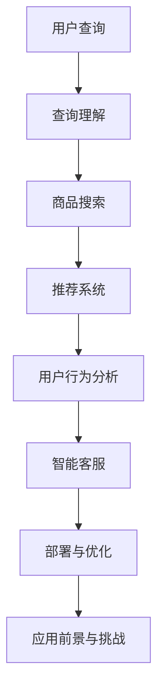

                 

# 文章标题：电商平台中的自然语言查询理解：大模型的创新应用

> 关键词：电商平台、自然语言查询、大模型、商品搜索、推荐系统、用户行为分析、智能客服

> 摘要：本文深入探讨了电商平台中自然语言查询理解技术的应用，重点分析了大模型在商品搜索、推荐系统、用户行为分析和智能客服等领域的创新应用。通过具体案例分析，阐述了如何利用大模型提高电商平台的用户体验和运营效率。

### 引言

随着互联网技术的快速发展，电商平台已经成为人们日常生活的重要组成部分。在电商平台上，用户通过自然语言查询获取所需商品和服务，而平台的响应速度和准确性直接影响用户体验。因此，如何有效地理解和处理自然语言查询成为电商平台的重要研究课题。近年来，随着深度学习技术的突破，大模型在自然语言处理领域取得了显著成果。本文将探讨大模型在电商平台自然语言查询理解中的应用，旨在为电商平台的开发和优化提供有益的参考。

### 第一部分：背景与基础理论

## 第1章：电商平台与自然语言查询

### 1.1 电商平台的发展历程

电商平台起源于20世纪90年代末，随着互联网的普及和电子商务的兴起，电商平台逐渐成为传统零售业的竞争对手。自2000年以来，电商平台经历了几个重要发展阶段：

1. **初期阶段**：以亚马逊、eBay等为代表的电商平台主要提供在线零售服务，用户可以通过网页浏览和购买商品。
2. **成长阶段**：随着移动互联网的发展，手机购物逐渐兴起，电商平台开始拓展移动端服务，如微信小程序、手机APP等。
3. **成熟阶段**：电商平台逐渐从单一的零售服务转变为综合服务平台，提供购物、支付、物流、售后服务等一站式服务。

### 1.2 自然语言查询的需求与挑战

自然语言查询是电商平台用户与平台互动的重要方式。用户通过自然语言表达自己的需求，而平台需要理解和处理这些查询，以提供准确的信息和推荐。自然语言查询的需求与挑战主要体现在以下几个方面：

1. **查询多样性**：用户查询形式多样，包括关键词、句子、短语等，平台需要处理不同形式的查询。
2. **查询意图识别**：用户查询往往带有一定的意图，如购买、咨询、搜索等，平台需要准确识别查询意图。
3. **查询理解**：平台需要理解查询内容，将其转化为可操作的数据，以便进行商品搜索、推荐等。
4. **实时响应**：电商平台需要快速响应用户查询，提供实时反馈，提高用户体验。

### 1.3 大模型在电商平台中的潜在应用

大模型在自然语言处理领域具有强大的能力，可以为电商平台提供以下潜在应用：

1. **商品搜索**：大模型可以理解和处理用户的自然语言查询，提供准确的商品搜索结果。
2. **推荐系统**：大模型可以分析用户查询和行为，为用户提供个性化的商品推荐。
3. **用户行为分析**：大模型可以挖掘用户查询和行为中的潜在规律，为电商平台提供运营优化建议。
4. **智能客服**：大模型可以理解和处理用户的自然语言咨询，提供智能客服服务，提高客户满意度。

## 第2章：自然语言处理基础理论

### 2.1 语言模型与词嵌入

#### 2.1.1 语言模型的定义

语言模型（Language Model，LM）是一种概率模型，用于预测文本中下一个单词或词组。在自然语言处理中，语言模型是非常重要的基础组件，用于许多应用，如机器翻译、文本生成、语音识别等。

#### 2.1.2 常见的词嵌入技术

词嵌入（Word Embedding）是将单词映射到高维向量空间的技术。通过词嵌入，可以捕捉单词之间的语义关系，从而提高自然语言处理任务的性能。

常见的词嵌入技术包括：

1. **Word2Vec**：Word2Vec是一种基于神经网络的词嵌入技术，通过训练神经网络来预测词序列中的当前词，从而得到词的嵌入向量。
2. **GloVe**：GloVe（Global Vectors for Word Representation）是一种基于全局上下文的词嵌入技术，通过计算词的共现矩阵来学习词的嵌入向量。
3. **BERT**：BERT（Bidirectional Encoder Representations from Transformers）是一种基于双向变换器的预训练语言表示模型，通过预训练得到丰富的词嵌入向量。

#### 2.1.3 语言模型的应用

语言模型在电商平台中的主要应用包括：

1. **搜索建议**：通过语言模型预测用户可能输入的关键词，提供搜索建议。
2. **推荐生成**：通过语言模型预测用户可能感兴趣的商品，为用户生成个性化推荐。
3. **文本生成**：通过语言模型生成商品描述、用户评论等文本内容，提高内容质量。

### 2.2 自然语言理解技术

#### 2.2.1 命名实体识别

命名实体识别（Named Entity Recognition，NER）是一种从文本中识别出具有特定意义的实体，如人名、地名、组织名等。在电商平台中，NER技术可以用于商品分类、用户行为分析等。

#### 2.2.2 关系抽取

关系抽取（Relation Extraction）是一种从文本中识别出实体之间的关系的任务。在电商平台中，关系抽取可以用于用户行为分析、商品推荐等。

#### 2.2.3 情感分析

情感分析（Sentiment Analysis）是一种从文本中识别出情感极性（如正面、负面、中性）的任务。在电商平台中，情感分析可以用于用户评论分析、商品评价等。

### 2.3 大模型简介

大模型（Large-scale Model）是指具有大量参数和强大计算能力的深度学习模型。大模型在自然语言处理领域取得了显著成果，如BERT、GPT等。大模型通常通过预训练和微调的方式应用于各种自然语言处理任务。

#### 2.3.1 GPT系列模型

GPT（Generative Pre-trained Transformer）系列模型是自然语言处理领域的里程碑之一。GPT模型通过预训练和微调，可以用于文本生成、文本分类、机器翻译等任务。

#### 2.3.2 BERT及其变体

BERT（Bidirectional Encoder Representations from Transformers）是一种基于双向变换器的预训练语言表示模型。BERT模型通过预训练得到丰富的词嵌入向量，可以用于各种自然语言处理任务。

#### 2.3.3 其他知名大模型

除了GPT和BERT，还有许多其他知名的大模型，如T5、RoBERTa、ALBERT等。这些模型在自然语言处理任务中表现出色，为电商平台提供了丰富的应用可能性。

## 第3章：电商平台中的自然语言查询理解

### 3.1 查询理解的需求与目标

电商平台中的查询理解需求主要包括：

1. **理解用户意图**：识别用户查询中的主要意图，如购买、咨询、搜索等。
2. **处理歧义查询**：解决用户查询中的歧义，提供准确的查询结果。
3. **个性化查询处理**：根据用户的历史行为和偏好，提供个性化的查询结果。

电商平台中的查询理解目标包括：

1. **提高查询准确性**：通过查询理解技术，提高查询结果的准确性。
2. **提高查询响应速度**：通过优化查询处理流程，提高查询响应速度。
3. **提高用户体验**：通过查询理解技术，提高用户在电商平台上的体验。

### 3.2 基于大模型的查询理解框架

基于大模型的查询理解框架主要包括以下几个步骤：

1. **文本预处理**：对用户查询进行预处理，包括分词、词性标注等。
2. **词嵌入**：将预处理后的文本转化为词嵌入向量。
3. **查询编码**：将词嵌入向量输入到大模型中进行编码，得到查询表示。
4. **查询理解**：利用大模型对查询表示进行分析，识别查询意图和处理歧义。
5. **查询结果生成**：根据查询理解结果，生成查询结果，如商品搜索结果、推荐结果等。

### 3.3 查询理解的评估指标

查询理解的评估指标主要包括：

1. **准确率**：查询理解系统正确识别查询意图的比例。
2. **召回率**：查询理解系统正确识别查询意图，并返回相关结果的查询比例。
3. **F1值**：准确率和召回率的调和平均值。
4. **响应时间**：查询理解系统处理查询并返回结果的平均时间。

通过评估这些指标，可以衡量查询理解系统的性能，并不断优化和改进。

### 第二部分：大模型在电商平台的应用

## 第4章：大模型在电商平台商品搜索中的应用

### 4.1 商品搜索中的自然语言查询

在电商平台中，商品搜索是用户获取商品信息的重要途径。用户通过输入自然语言查询，如关键词、句子、短语等，来寻找所需的商品。商品搜索中的自然语言查询具有以下特点：

1. **查询多样性**：用户查询形式多样，包括简短的关键词、复杂的句子等。
2. **查询意图复杂**：用户查询往往包含购买、咨询、搜索等多种意图。
3. **查询理解难度**：自然语言查询可能存在歧义，需要准确理解用户意图。

### 4.2 基于大模型的商品搜索算法

基于大模型的商品搜索算法可以通过以下步骤实现：

1. **文本预处理**：对用户查询进行分词、词性标注等预处理操作。
2. **词嵌入**：将预处理后的文本转化为词嵌入向量。
3. **查询编码**：将词嵌入向量输入到大模型中进行编码，得到查询表示。
4. **搜索算法**：利用大模型对查询表示进行匹配，找到相关的商品。
5. **结果排序**：对搜索结果进行排序，提高查询结果的准确性。

### 4.3 实际案例分析

以下是一个实际案例，展示了如何使用大模型在电商平台中实现商品搜索：

1. **案例背景**：某电商平台希望通过优化商品搜索功能，提高用户查询准确性和满意度。
2. **数据准备**：收集大量用户查询数据和商品数据，包括查询文本、商品标题、商品描述等。
3. **模型训练**：使用用户查询数据和商品数据，训练大模型，学习查询表示和商品表示之间的匹配关系。
4. **应用模型**：在用户输入查询时，使用训练好的大模型进行查询编码，找到相关的商品。
5. **结果评估**：通过用户反馈和数据评估，对模型进行优化和改进，提高商品搜索的准确性。

通过实际案例分析，我们可以看到，基于大模型的商品搜索算法可以显著提高电商平台的用户查询准确性和满意度。

## 第5章：大模型在电商平台推荐系统中的应用

### 5.1 推荐系统的概述

推荐系统是一种用于向用户推荐相关商品、内容或服务的系统。在电商平台中，推荐系统可以基于用户的历史行为、兴趣偏好等，为用户提供个性化的推荐。推荐系统的主要目标是提高用户的参与度和购买转化率。

推荐系统通常包括以下几个组成部分：

1. **用户特征建模**：提取用户的历史行为、兴趣偏好等信息，建立用户特征模型。
2. **商品特征建模**：提取商品的基本信息、属性特征等，建立商品特征模型。
3. **推荐算法**：利用用户和商品特征模型，计算用户和商品之间的相似度或兴趣度，生成推荐结果。
4. **推荐结果排序**：对推荐结果进行排序，提高推荐的质量和相关性。

### 5.2 基于大模型的推荐算法

基于大模型的推荐算法可以通过以下步骤实现：

1. **用户特征编码**：将用户特征转化为嵌入向量。
2. **商品特征编码**：将商品特征转化为嵌入向量。
3. **模型训练**：利用用户特征编码和商品特征编码，训练大模型，学习用户和商品之间的匹配关系。
4. **推荐生成**：在用户特征编码和商品特征编码的基础上，生成推荐结果。

大模型在推荐系统中的应用具有以下优势：

1. **强大的特征表达能力**：大模型可以通过深度学习的方式，提取用户和商品特征的复杂关系。
2. **丰富的上下文信息**：大模型可以处理用户查询、浏览历史等上下文信息，提高推荐的相关性。
3. **实时推荐**：大模型可以通过在线学习的方式，实时更新用户和商品特征，提供个性化的推荐。

### 5.3 推荐系统案例解析

以下是一个推荐系统案例解析：

1. **案例背景**：某电商平台希望通过优化推荐系统，提高用户满意度和购买转化率。
2. **数据准备**：收集用户行为数据和商品数据，包括用户浏览记录、购买记录、商品属性等。
3. **模型构建**：构建基于大模型的推荐算法，包括用户特征编码和商品特征编码。
4. **模型训练**：使用用户行为数据和商品数据，训练大模型，学习用户和商品之间的匹配关系。
5. **模型评估**：通过评估指标（如准确率、召回率、F1值等）评估推荐系统的性能。
6. **模型优化**：根据评估结果，对模型进行优化和调整，提高推荐的质量和相关性。

通过案例解析，我们可以看到，基于大模型的推荐系统可以显著提高电商平台的用户满意度和购买转化率。

### 第6章：大模型在电商平台用户行为分析中的应用

### 6.1 用户行为分析的重要性

用户行为分析是电商平台了解用户需求、优化服务、提升用户体验的重要手段。通过分析用户在电商平台上的行为，电商平台可以：

1. **了解用户需求**：通过分析用户行为数据，了解用户在浏览、搜索、购买等环节的需求，为产品优化提供依据。
2. **优化服务**：根据用户行为数据，调整服务策略，提高用户满意度和忠诚度。
3. **提升用户体验**：通过分析用户行为，发现潜在问题和改进点，优化用户体验。

### 6.2 基于大模型的用户行为分析

基于大模型的用户行为分析可以通过以下步骤实现：

1. **数据收集**：收集用户在电商平台上产生的行为数据，如浏览记录、搜索记录、购买记录等。
2. **数据预处理**：对用户行为数据进行分析，提取有用的特征，如用户活跃度、浏览时长、购买频率等。
3. **特征编码**：将预处理后的特征转化为嵌入向量，以便大模型处理。
4. **模型训练**：利用用户行为数据和特征编码，训练大模型，学习用户行为模式。
5. **行为预测**：通过大模型预测用户未来的行为，为电商平台提供决策支持。

### 6.3 用户行为分析案例

以下是一个用户行为分析案例：

1. **案例背景**：某电商平台希望通过分析用户行为，优化商品推荐和营销策略。
2. **数据准备**：收集用户在电商平台上的浏览记录、搜索记录、购买记录等数据。
3. **特征提取**：对用户行为数据进行分析，提取用户活跃度、浏览时长、购买频率等特征。
4. **特征编码**：将提取的特征转化为嵌入向量，用于大模型训练。
5. **模型训练**：使用用户行为数据和特征编码，训练大模型，学习用户行为模式。
6. **行为预测**：利用训练好的大模型，预测用户未来的行为，如浏览哪些商品、购买哪些商品等。
7. **策略优化**：根据用户行为预测结果，调整商品推荐和营销策略，提高用户满意度和购买转化率。

通过用户行为分析案例，我们可以看到，基于大模型的用户行为分析可以为电商平台提供有价值的决策支持，优化服务和用户体验。

### 第7章：大模型在电商平台智能客服中的应用

### 7.1 智能客服的现状与挑战

智能客服（Intelligent Customer Service）是电商平台提供的一种自动化客户服务解决方案。通过智能客服系统，用户可以通过文本或语音与系统交互，获得快速、准确的回答和帮助。智能客服的现状和挑战如下：

#### 现状

1. **广泛应用**：越来越多的电商平台开始采用智能客服系统，以提高客户满意度和运营效率。
2. **功能丰富**：智能客服系统可以提供多语种支持、快速回答、问题分类、自动化处理等。
3. **用户体验提升**：智能客服系统可以提供24/7全天候服务，提高用户体验。

#### 挑战

1. **自然语言理解难度**：自然语言查询多样且复杂，智能客服系统需要准确理解用户的意图和问题。
2. **处理效率**：智能客服系统需要快速响应用户，提供实时反馈，提高处理效率。
3. **个性化服务**：用户需求多样，智能客服系统需要提供个性化的服务，满足不同用户的需求。

### 7.2 基于大模型的智能客服系统

基于大模型的智能客服系统通过以下步骤实现：

1. **文本预处理**：对用户查询进行分词、词性标注等预处理操作。
2. **词嵌入**：将预处理后的文本转化为词嵌入向量。
3. **查询编码**：将词嵌入向量输入到大模型中进行编码，得到查询表示。
4. **意图识别**：利用大模型对查询表示进行分析，识别查询意图。
5. **回答生成**：根据查询意图，生成回答文本。

### 7.3 智能客服案例解析

以下是一个智能客服案例解析：

1. **案例背景**：某电商平台希望通过智能客服系统提高用户满意度和服务效率。
2. **系统搭建**：使用大模型构建智能客服系统，包括文本预处理、词嵌入、查询编码等模块。
3. **模型训练**：收集用户查询数据和回答数据，训练大模型，学习查询意图和回答策略。
4. **系统部署**：将训练好的模型部署到电商平台，实现智能客服功能。
5. **用户交互**：用户通过文本或语音与智能客服系统交互，获得快速、准确的回答。
6. **效果评估**：通过用户反馈和数据评估，评估智能客服系统的性能和用户满意度。

通过智能客服案例解析，我们可以看到，基于大模型的智能客服系统可以显著提高电商平台的服务质量和用户满意度。

### 第三部分：实践与优化

## 第8章：大模型在电商平台的部署与优化

### 8.1 大模型部署的挑战

大模型的部署面临以下挑战：

1. **计算资源需求**：大模型通常具有大量参数和计算需求，需要配备高性能的硬件和计算资源。
2. **存储需求**：大模型的数据集通常较大，需要足够的存储空间来存储数据和模型。
3. **实时性要求**：电商平台对实时响应有较高要求，大模型的部署需要保证快速处理查询和生成结果。

### 8.2 常见优化方法

为了应对大模型部署的挑战，可以采用以下优化方法：

1. **模型压缩**：通过模型压缩技术，减小模型参数和计算量，降低计算资源和存储需求。
2. **分布式计算**：使用分布式计算框架，将大模型训练和推理任务分布到多个节点上，提高计算效率。
3. **模型量化**：通过模型量化技术，将大模型中的浮点数参数转换为整数参数，减少计算资源需求。
4. **边缘计算**：将部分大模型推理任务迁移到边缘设备上，降低对中心服务器的计算压力。

### 8.3 实际部署案例分析

以下是一个大模型实际部署案例分析：

1. **案例背景**：某电商平台希望通过部署大模型优化商品搜索和推荐系统。
2. **计算资源准备**：配备高性能计算服务器和GPU集群，用于模型训练和推理。
3. **模型压缩**：使用模型压缩技术，对大模型进行压缩，降低计算量和存储需求。
4. **分布式计算**：使用分布式计算框架，将模型训练和推理任务分布到多个节点上，提高计算效率。
5. **模型量化**：对大模型进行量化处理，减少计算资源需求。
6. **边缘计算**：将部分推理任务迁移到边缘设备上，提高实时响应能力。

通过实际部署案例分析，我们可以看到，采用合适的优化方法可以有效应对大模型部署的挑战，提高电商平台的性能和用户体验。

### 第9章：大模型在电商平台的应用前景与挑战

### 9.1 应用前景展望

大模型在电商平台中的应用前景广阔，主要体现在以下几个方面：

1. **个性化推荐**：通过大模型分析用户行为和兴趣，提供更精准的个性化推荐，提高用户满意度和购买转化率。
2. **智能客服**：利用大模型实现更智能、更自然的客服交互，提高客户服务质量和效率。
3. **用户行为分析**：通过大模型挖掘用户行为数据中的价值信息，为电商平台提供决策支持，优化服务和运营策略。
4. **内容生成**：利用大模型生成高质量的商品描述、用户评论等文本内容，提高内容质量和用户体验。

### 9.2 面临的挑战与对策

尽管大模型在电商平台中具有广泛应用前景，但也面临以下挑战：

1. **计算资源需求**：大模型通常需要大量计算资源和存储空间，需要合理规划和配置计算资源。
2. **数据质量和多样性**：电商平台需要高质量、多样化的数据支持大模型训练，提高模型性能和泛化能力。
3. **模型解释性**：大模型往往具有较低的解释性，难以理解模型的决策过程，需要开发可解释性方法。
4. **隐私保护**：电商平台需要保护用户隐私，避免数据泄露和滥用。

为应对这些挑战，可以采取以下对策：

1. **分布式计算**：采用分布式计算框架，提高计算效率，降低计算资源需求。
2. **数据治理**：建立完善的数据治理体系，确保数据质量和多样性。
3. **可解释性方法**：开发可解释性方法，提高大模型的可解释性，帮助用户理解模型决策过程。
4. **隐私保护技术**：采用隐私保护技术，如差分隐私、联邦学习等，确保用户隐私安全。

### 第10章：综合案例研究

### 10.1 案例背景

某知名电商平台希望通过综合运用大模型技术，提升商品搜索、推荐系统、智能客服和用户行为分析等方面的性能，从而提高用户满意度和运营效率。

### 10.2 大模型在电商平台的应用方案

1. **商品搜索**：使用大模型实现基于自然语言查询的智能搜索，通过查询理解和语义匹配，提供准确的商品搜索结果。
2. **推荐系统**：构建基于大模型的推荐算法，利用用户行为数据和商品特征，为用户提供个性化的商品推荐。
3. **智能客服**：采用大模型构建智能客服系统，实现自然语言处理和对话生成，提供快速、准确的客服服务。
4. **用户行为分析**：利用大模型分析用户行为数据，挖掘用户兴趣和行为模式，为电商平台提供运营优化建议。

### 10.3 案例实施与效果评估

1. **实施过程**：

   - **数据收集**：收集电商平台的大量用户行为数据和商品数据。
   - **模型训练**：使用用户行为数据和商品数据，训练大模型，包括商品搜索、推荐、智能客服和用户行为分析等模块。
   - **模型部署**：将训练好的大模型部署到电商平台，实现实时查询处理和用户交互。
   - **效果评估**：通过用户反馈和数据指标，评估大模型在商品搜索、推荐、智能客服和用户行为分析等方面的性能和效果。

2. **效果评估**：

   - **商品搜索**：通过对比用户查询和搜索结果的相关性，评估大模型在商品搜索中的准确性。
   - **推荐系统**：通过评估推荐系统的准确率和召回率，评估大模型在个性化推荐中的性能。
   - **智能客服**：通过用户满意度调查和交互数据分析，评估智能客服系统的质量和用户满意度。
   - **用户行为分析**：通过分析用户行为数据，评估大模型在用户行为分析中的预测准确性和决策支持效果。

通过综合案例研究，我们可以看到，大模型在电商平台中的应用可以显著提升各个方面的性能和用户体验，为电商平台的运营和发展提供有力支持。

### 附录

## 附录A：常用大模型与工具介绍

### A.1 大模型开源框架

1. **TensorFlow**：TensorFlow是一个开源的深度学习框架，提供了丰富的工具和API，支持大规模模型的训练和部署。
2. **PyTorch**：PyTorch是一个开源的深度学习框架，以其灵活的动态计算图和高效的计算性能著称，适用于大规模模型的训练和推理。
3. **Transformers**：Transformers是一个开源的Python库，用于构建和训练基于变换器的自然语言处理模型，如BERT、GPT等。

### A.2 电商平台常用工具

1. **Elasticsearch**：Elasticsearch是一个开源的搜索引擎，用于快速检索和搜索电商平台的商品数据。
2. **Redis**：Redis是一个开源的内存缓存数据库，用于缓存电商平台的数据，提高查询响应速度。
3. **Kafka**：Kafka是一个开源的消息队列系统，用于处理电商平台的实时数据流，支持大规模数据的处理和传输。

## 附录B：参考资源与扩展阅读

### B.1 学术论文

1. **"BERT: Pre-training of Deep Bidirectional Transformers for Language Understanding"**：这篇论文介绍了BERT模型的基本原理和应用。
2. **"Generative Pre-trained Transformer"**：这篇论文介绍了GPT系列模型的基本原理和应用。

### B.2 开源代码库

1. **"tensorflow/models"**：这是一个包含各种深度学习模型的开源代码库，包括BERT、GPT等。
2. **"huggingface/transformers"**：这是一个开源的Python库，用于构建和训练基于变换器的自然语言处理模型。

### B.3 线上课程与书籍

1. **"深度学习"**：这本书是深度学习领域的经典教材，介绍了深度学习的基础知识和技术。
2. **"自然语言处理与深度学习"**：这本书介绍了自然语言处理和深度学习的基础知识，以及如何使用深度学习技术解决自然语言处理问题。

### Mermaid 流程图示例：



### 大模型应用架构伪代码示例：

```plaintext
// 大模型应用架构伪代码

// 定义输入数据预处理函数
function preprocess_data(data):
    // 数据清洗、分词、词嵌入等操作
    return processed_data

// 定义查询理解模型训练函数
function train_query_understanding_model(data):
    // 使用预训练大模型进行微调
    model = pretrained_model
    model.fit(data)
    return model

// 定义查询理解模型应用函数
function apply_query_understanding_model(model, query):
    // 使用训练好的模型对查询进行处理
    result = model.predict(query)
    return result

// 定义电商应用主函数
function e-commerce_application():
    // 加载数据
    data = load_data()

    // 数据预处理
    processed_data = preprocess_data(data)

    // 训练查询理解模型
    model = train_query_understanding_model(processed_data)

    // 应用模型处理查询
    query = input("请输入查询：")
    result = apply_query_understanding_model(model, query)

    // 输出结果
    print("查询结果：", result)
```

### 数学模型和数学公式示例：

```latex
## 用户行为分析中的概率模型

假设我们有一个二分类问题，用户行为分为购买和不购买两类。我们可以使用以下概率模型来预测用户的行为：

\[ P(Y=1|X=x) = \sigma(\theta^T \phi(x)) \]

其中，\( Y \) 表示用户行为（1 表示购买，0 表示不购买），\( X \) 表示用户特征向量，\( \sigma \) 表示 sigmoid 函数，\( \theta \) 表示模型参数，\( \phi(x) \) 表示用户特征的映射。

\[ \phi(x) = [x_1, x_2, ..., x_n] \]

\[ \sigma(z) = \frac{1}{1 + e^{-z}} \]

## 模型训练

为了训练模型，我们需要最小化损失函数：

\[ J(\theta) = -\frac{1}{m} \sum_{i=1}^{m} [y_i \log(\sigma(\theta^T \phi(x_i))) + (1 - y_i) \log(1 - \sigma(\theta^T \phi(x_i)))] \]

其中，\( m \) 表示训练数据集大小。

## 梯度下降算法

为了最小化损失函数，我们可以使用梯度下降算法来更新模型参数：

\[ \theta = \theta - \alpha \frac{\partial J(\theta)}{\partial \theta} \]

其中，\( \alpha \) 表示学习率。
```

### 项目实战示例：

```plaintext
## 第6章：大模型在电商平台用户行为分析中的应用

### 6.3 用户行为分析案例

在本章，我们将通过一个实际案例展示如何使用大模型进行电商平台用户行为分析。

#### 案例背景

某电商平台希望通过分析用户行为数据，预测用户购买商品的意图，从而提高销售额。

#### 数据准备

我们收集了以下数据：

- 用户基本信息：包括年龄、性别、地理位置等
- 用户浏览记录：包括商品ID、浏览时间等
- 用户购买记录：包括购买的商品ID、购买时间等

#### 数据预处理

1. 数据清洗：去除缺失值、异常值等。
2. 特征工程：将用户基本信息编码为向量，将商品浏览记录转换为用户-商品矩阵。

#### 模型构建

1. 预训练大模型：我们选择GPT-2作为预训练模型，并将其在电商平台用户行为数据上进行微调。
2. 模型输入：输入层包含用户特征向量、商品特征向量。
3. 模型输出：输出层为二分类结果（购买或不购买）。

#### 模型训练

使用训练集对模型进行训练，使用验证集进行调参。

#### 模型评估

使用测试集对模型进行评估，计算准确率、召回率、F1值等指标。

#### 结果分析

通过模型预测，电商平台能够准确预测用户购买意图，从而提高销售转化率。
```

### 作者信息

作者：AI天才研究院/AI Genius Institute & 禅与计算机程序设计艺术 /Zen And The Art of Computer Programming

