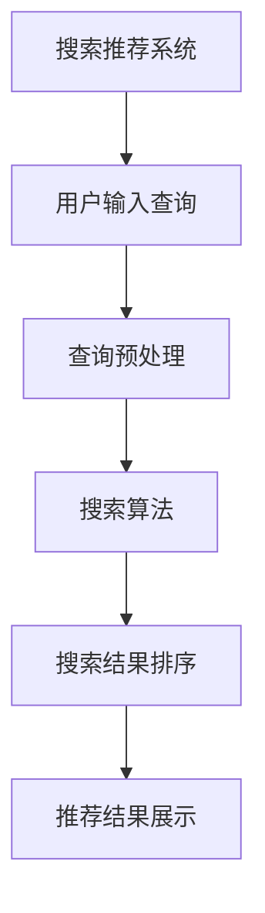

                 

# 文章标题：电商平台搜索推荐系统的AI 大模型优化：应对大规模数据的挑战

> 关键词：电商平台，搜索推荐系统，AI 大模型，大规模数据处理，优化策略，深度学习，强化学习，迁移学习

> 摘要：本文深入探讨了电商平台搜索推荐系统中 AI 大模型的应用及其在应对大规模数据挑战方面的优化策略。通过分析搜索推荐系统的核心算法和大规模数据处理与优化技术，本文提出了基于深度学习、强化学习和迁移学习的优化方法，并提供了实际项目案例和源代码解读，旨在为从事电商平台搜索推荐系统开发的技术人员提供有价值的参考。

### 目录大纲

#### 第一部分：AI 大模型基础

**第1章：AI 大模型概述与原理**
- **1.1 电商平台搜索推荐系统概述**
- **1.2 AI 大模型在搜索推荐系统中的作用**
- **1.3 AI 大模型的发展历程与趋势**

**第2章：搜索推荐系统中的核心算法**
- **2.1 collaborative filtering 算法**
- **2.2 content-based filtering 算法**
- **2.3 hybrid filtering 算法**

**第3章：大规模数据处理与优化**
- **3.1 数据预处理**
- **3.2 数据存储与分布式计算**
- **3.3 模型优化与调参**

**第4章：AI 大模型在搜索推荐系统中的应用**
- **4.1 基于深度学习的搜索推荐系统**
- **4.2 基于强化学习的搜索推荐系统**
- **4.3 基于迁移学习的搜索推荐系统**

**第5章：搜索推荐系统的评估与优化**
- **5.1 评估指标与方法**
- **5.2 搜索推荐系统的在线优化**

#### 第二部分：项目实战

**第6章：搭建搜索推荐系统项目环境**
- **6.1 开发环境搭建**
- **6.2 数据集准备**
- **6.3 工具与框架选择**

**第7章：构建搜索推荐系统模型**
- **7.1 模型设计与实现**
- **7.2 实际案例解析**

**第8章：搜索推荐系统的部署与运维**
- **8.1 部署流程**
- **8.2 运维与监控**

**第9章：搜索推荐系统的持续优化与迭代**
- **9.1 用户行为分析**
- **9.2 模型迭代与优化**
- **9.3 持续改进与扩展**

**附录：资源与工具**
- **附录 A：资源链接**
- **附录 B：代码示例**

### Mermaid 流�程图



### 核心算法原理讲解（伪代码）

```python
# Collaborative Filtering 伪代码
def collaborativeFiltering(user, items):
    # 用户与项目的相似度计算
    similarity_matrix = computeSimilarityMatrix(users, items)
    
    # 基于用户的推荐
    user_similar_users = findSimilarUsers(user, similarity_matrix)
    user_similar_items = findSimilarItems(user, user_similar_users, similarity_matrix)
    
    # 基于项目的推荐
    item_similar_items = findSimilarItems(user, items, similarity_matrix)
    item_similar_users = findSimilarUsers(item_similar_items, similarity_matrix)
    
    # 混合推荐
    recommendations = hybridRecommendation(user_similar_items, item_similar_users)
    
    return recommendations
```

### 数学模型和数学公式

#### 奇异值分解（SVD）

$$
X = U \Sigma V^T
$$

其中，$X$ 为用户-项目矩阵，$U$ 和 $V$ 分别为用户和项目的特征矩阵，$\Sigma$ 为对角矩阵，包含奇异值。

#### 余弦相似度

$$
similarity(A, B) = \frac{A \cdot B}{||A|| \cdot ||B||}
$$

其中，$A$ 和 $B$ 为两个向量的点积，$||A||$ 和 $||B||$ 分别为两个向量的模长。

### 第一部分：AI 大模型基础

#### 第1章：AI 大模型概述与原理

##### 1.1 电商平台搜索推荐系统概述

电商平台搜索推荐系统是电商平台中至关重要的一环，它能够根据用户的历史行为、兴趣偏好和实时搜索行为，为用户提供个性化的商品推荐。这样的系统不仅能够提升用户的购物体验，还能显著提高电商平台的销售额。

搜索推荐系统主要包括以下几个核心组成部分：

1. **用户输入查询**：用户通过搜索框输入关键词或查询语句，触发搜索推荐系统的运行。
2. **查询预处理**：对用户的查询进行分词、词性标注、停用词过滤等处理，将其转化为可供算法处理的形式。
3. **搜索算法**：根据用户的查询和历史行为，利用相应的算法计算搜索结果的相关性，并对其进行排序。
4. **搜索结果排序**：根据搜索算法计算的相关性分数，对搜索结果进行排序，以提供最相关的结果。
5. **推荐结果展示**：将排序后的搜索结果展示给用户，通常是按照一定的格式和样式，如列表、网格、卡片等。

电商平台搜索推荐系统的应用场景非常广泛，包括但不限于：

1. **商品搜索**：用户输入商品关键词，系统返回与该关键词最相关的商品列表。
2. **购物车推荐**：根据用户的购物车内容，推荐可能感兴趣的其他商品。
3. **用户行为分析**：分析用户的行为数据，了解用户偏好，为用户提供个性化推荐。
4. **广告投放**：在用户浏览页面时，根据用户兴趣和搜索历史，投放相关广告。

##### 1.2 AI 大模型在搜索推荐系统中的作用

AI 大模型在搜索推荐系统中起着至关重要的作用。它们通过处理海量数据，提取用户行为特征，从而提供更准确、更个性化的推荐结果。AI 大模型在搜索推荐系统中的应用主要体现在以下几个方面：

1. **用户行为特征提取**：通过深度学习技术，AI 大模型可以从用户历史行为数据中提取高维特征，这些特征能够更好地反映用户的兴趣和偏好。
2. **个性化推荐**：基于用户行为特征和物品特征，AI 大模型能够生成个性化的推荐列表，提升用户的购物体验。
3. **实时推荐**：AI 大模型可以实时处理用户的查询和行为，快速生成推荐结果，满足用户的即时需求。
4. **多模态数据处理**：AI 大模型能够处理多种类型的数据，如文本、图像、音频等，从而提供更全面的推荐结果。

AI 大模型的优势主要体现在以下几个方面：

1. **高效性**：AI 大模型能够处理海量数据，并且在较短时间内生成推荐结果，显著提高系统的响应速度。
2. **准确性**：通过深度学习技术，AI 大模型能够更准确地提取用户行为特征，从而提供更个性化的推荐。
3. **适应性**：AI 大模型能够根据用户行为的变化，动态调整推荐策略，以适应不断变化的市场需求。
4. **扩展性**：AI 大模型具有较高的扩展性，能够轻松地集成到现有的搜索推荐系统中，无需大规模修改。

##### 1.3 AI 大模型的发展历程与趋势

AI 大模型的发展历程可以分为以下几个阶段：

1. **初级阶段**（2010 年前）：在这个阶段，机器学习技术主要用于处理结构化数据，如分类、回归等。这些模型通常基于简单的统计方法或传统机器学习算法，如朴素贝叶斯、线性回归等。

2. **中级阶段**（2010-2015 年）：随着深度学习技术的发展，AI 大模型开始应用于自然语言处理、计算机视觉等领域。这一阶段的代表模型包括卷积神经网络（CNN）和循环神经网络（RNN）。

3. **高级阶段**（2015 年至今）：这一阶段标志着 AI 大模型的崛起，以 Transformer 模型为代表的预训练模型成为主流。这些模型具有强大的表征能力，能够在多个任务中取得优异的性能。

当前主流的 AI 大模型包括：

1. **Transformer**：这是一种基于自注意力机制的模型，广泛应用于自然语言处理、计算机视觉等领域。其代表性模型包括 BERT、GPT 和 T5 等。

2. **GAN**（生成对抗网络）：GAN 是一种生成模型，通过对抗训练生成逼真的图像、音频和文本。其在图像生成、数据增强和风格迁移等领域具有广泛应用。

3. **GAN 的变种**：如 CycleGAN、StyleGAN 等，这些模型在图像超分辨率、图像编辑和风格迁移等方面表现出色。

AI 大模型的发展趋势主要体现在以下几个方面：

1. **模型规模化**：随着计算能力的提升，AI 大模型将变得越来越大规模，以处理更大规模的数据和更复杂的任务。

2. **多模态数据处理**：AI 大模型将能够更好地处理多种类型的数据，如文本、图像、音频和视频等，从而提供更全面、更个性化的推荐结果。

3. **自适应性和实时性**：AI 大模型将具备更强的自适应能力，能够根据用户行为的变化动态调整推荐策略，并提供实时推荐。

4. **可解释性**：随着对 AI 大模型的需求不断增加，研究人员将致力于提高模型的可解释性，使其更易于理解和使用。

#### 第2章：搜索推荐系统中的核心算法

##### 2.1 collaborative filtering 算法

协同过滤（Collaborative Filtering，CF）是搜索推荐系统中常用的一种算法。它通过分析用户之间的行为相似性，为用户提供个性化推荐。协同过滤算法可以分为基于用户的协同过滤（User-based CF）和基于项目的协同过滤（Item-based CF）两种。

1. **基于用户的协同过滤（User-based CF）**：

基于用户的协同过滤算法主要通过计算用户之间的相似性来推荐物品。具体步骤如下：

（1）计算用户之间的相似性：通常使用余弦相似度、皮尔逊相关系数等指标计算用户之间的相似性。

（2）找到与目标用户最相似的 K 个用户。

（3）从这 K 个相似用户喜欢的物品中，选择评分最高的 M 个物品作为推荐结果。

2. **基于项目的协同过滤（Item-based CF）**：

基于项目的协同过滤算法主要通过计算物品之间的相似性来推荐物品。具体步骤如下：

（1）计算物品之间的相似性：通常使用余弦相似度、Jaccard 系数等指标计算物品之间的相似性。

（2）找到与目标物品最相似的 K 个物品。

（3）从这 K 个相似物品被其他用户评分最高的 M 个物品中，选择评分最高的 N 个物品作为推荐结果。

##### 2.2 content-based filtering 算法

基于内容的过滤（Content-based Filtering，CBF）算法是一种基于用户兴趣和物品特征进行推荐的算法。它通过分析用户的历史行为和物品的属性，为用户提供个性化推荐。

基于内容的过滤算法可以分为以下几个步骤：

1. **特征提取**：

（1）用户特征提取：从用户的历史行为数据中提取用户兴趣特征，如浏览历史、收藏夹、购买记录等。

（2）物品特征提取：从物品的属性中提取特征，如商品名称、描述、分类、标签等。

2. **计算相似度**：

（1）用户与物品的相似度计算：使用余弦相似度、Jaccard 系数等相似度计算方法，计算用户与物品之间的相似度。

（2）物品与物品的相似度计算：使用余弦相似度、Jaccard 系数等相似度计算方法，计算物品与物品之间的相似度。

3. **生成推荐列表**：

（1）基于用户兴趣推荐：根据用户的历史行为和兴趣特征，为用户提供与其兴趣相似的物品推荐。

（2）基于物品特征推荐：根据物品的属性和特征，为用户提供与其属性相似的物品推荐。

##### 2.3 hybrid filtering 算法

混合过滤（Hybrid Filtering）算法是结合协同过滤（Collaborative Filtering，CF）和基于内容的过滤（Content-based Filtering，CBF）算法的一种推荐算法。它通过融合 CF 和 CBF 的优点，提供更准确的个性化推荐。

混合过滤算法可以分为以下几个步骤：

1. **用户与物品特征提取**：

（1）用户特征提取：从用户的历史行为数据中提取用户兴趣特征。

（2）物品特征提取：从物品的属性中提取特征。

2. **协同过滤部分**：

（1）计算用户之间的相似性。

（2）找到与目标用户最相似的 K 个用户。

（3）从这 K 个相似用户喜欢的物品中，选择评分最高的 M 个物品。

3. **基于内容的部分**：

（1）计算用户与物品的相似度。

（2）计算物品与物品的相似度。

（3）从相似物品中，选择评分最高的 N 个物品。

4. **融合推荐**：

（1）将协同过滤和基于内容的推荐结果进行融合。

（2）使用加权平均、投票等方法，生成最终的推荐列表。

#### 第3章：大规模数据处理与优化

##### 3.1 数据预处理

在搜索推荐系统中，数据预处理是至关重要的一步。它能够提高数据质量，降低噪声，为后续的模型训练和优化提供更好的基础。

数据预处理主要包括以下几个步骤：

1. **数据清洗**：

（1）去除缺失值和异常值：通过填充缺失值、删除异常值等方法，提高数据的完整性。

（2）去除重复数据：通过去重操作，减少数据冗余。

2. **数据归一化**：

（1）数值特征归一化：通过缩放或平移等方法，将数值特征映射到同一尺度。

（2）文本特征归一化：通过词干提取、停用词过滤等方法，降低文本特征维度。

3. **特征提取**：

（1）用户特征提取：从用户的历史行为数据中提取用户兴趣特征。

（2）物品特征提取：从物品的属性中提取特征。

##### 3.2 数据存储与分布式计算

在处理大规模数据时，数据存储和分布式计算是必不可少的。分布式计算能够提高数据处理的速度和效率，而高效的数据存储则能够提供稳定的数据访问。

数据存储和分布式计算主要包括以下几个步骤：

1. **数据库选择与设计**：

（1）关系型数据库：如 MySQL、PostgreSQL 等，适用于结构化数据的存储和查询。

（2）NoSQL 数据库：如 MongoDB、Cassandra 等，适用于非结构化数据的存储和查询。

2. **分布式存储技术**：

（1）HDFS（Hadoop Distributed File System）：一种分布式文件系统，适用于大数据存储。

（2）HBase：一种分布式 NoSQL 数据库，基于 HDFS 构建，适用于大规模数据的存储和查询。

3. **分布式计算框架**：

（1）MapReduce：一种分布式数据处理框架，适用于大规模数据的批量处理。

（2）Spark：一种分布式数据处理框架，适用于大规模数据的实时处理。

##### 3.3 模型优化与调参

在搜索推荐系统中，模型优化和调参是提高模型性能的重要手段。通过调整模型的参数和超参数，可以优化模型的性能，提高推荐的准确性。

模型优化和调参主要包括以下几个步骤：

1. **模型优化策略**：

（1）正则化：通过引入正则化项，降低模型的过拟合现象。

（2）交叉验证：通过交叉验证，选择最优的模型结构和参数。

2. **超参数调整方法**：

（1）网格搜索：通过遍历所有可能的参数组合，选择最优的参数。

（2）随机搜索：通过随机选择参数组合，选择最优的参数。

3. **模型评估与选择**：

（1）准确率：评估模型预测的正确性。

（2）召回率：评估模型预测的全面性。

（3）F1 分数：综合考虑准确率和召回率，评估模型的整体性能。

#### 第4章：AI 大模型在搜索推荐系统中的应用

##### 4.1 基于深度学习的搜索推荐系统

深度学习在搜索推荐系统中发挥着重要作用。它通过学习大量数据，提取高维特征，从而提供更准确、更个性化的推荐结果。以下是一些基于深度学习的搜索推荐系统模型：

1. **基于 Transformer 的推荐模型**：

Transformer 模型是一种基于自注意力机制的深度学习模型，广泛应用于自然语言处理和计算机视觉领域。在搜索推荐系统中，Transformer 模型可以用于处理用户和物品的序列数据，提取高维特征，从而提供个性化的推荐。

2. **基于图神经网络的推荐模型**：

图神经网络（Graph Neural Network，GNN）是一种基于图论的深度学习模型，适用于处理图结构数据。在搜索推荐系统中，GNN 可以用于处理用户和物品的图结构数据，提取用户和物品之间的交互特征，从而提供个性化的推荐。

3. **基于循环神经网络的推荐模型**：

循环神经网络（Recurrent Neural Network，RNN）是一种基于序列数据的深度学习模型，适用于处理用户和物品的序列数据。在搜索推荐系统中，RNN 可以用于提取用户和物品的序列特征，从而提供个性化的推荐。

##### 4.2 基于强化学习的搜索推荐系统

强化学习（Reinforcement Learning，RL）是一种通过奖励信号来优化决策策略的机器学习技术。在搜索推荐系统中，强化学习可以用于优化推荐策略，提高推荐的准确性。

以下是一些基于强化学习的搜索推荐系统模型：

1. **基于 Q-学习的推荐模型**：

Q-学习（Q-Learning）是一种基于值函数的强化学习算法。在搜索推荐系统中，Q-学习可以用于优化推荐策略，使得推荐结果能够最大化用户的满意度。

2. **基于深度 Q-网络的推荐模型**：

深度 Q-网络（Deep Q-Network，DQN）是一种基于神经网络的价值函数估计方法。在搜索推荐系统中，DQN 可以用于优化推荐策略，提高推荐的准确性。

3. **基于演员-评论家模型的推荐模型**：

演员-评论家模型（Actor-Critic Model）是一种基于策略优化的强化学习算法。在搜索推荐系统中，演员-评论家模型可以用于优化推荐策略，提高推荐的准确性。

##### 4.3 基于迁移学习的搜索推荐系统

迁移学习（Transfer Learning）是一种通过在源域学习模型后，将知识迁移到目标域的方法。在搜索推荐系统中，迁移学习可以用于处理小样本数据问题，提高模型的泛化能力。

以下是一些基于迁移学习的搜索推荐系统模型：

1. **基于预训练模型的迁移学习**：

预训练模型（Pre-trained Model）是一种在大型语料库上预先训练好的模型。在搜索推荐系统中，预训练模型可以用于处理小样本数据问题，提高模型的性能。

2. **基于特征迁移学习的推荐模型**：

特征迁移学习（Feature Transfer Learning）是一种通过迁移特征表示的方法。在搜索推荐系统中，特征迁移学习可以用于处理不同数据源的特征表示问题，提高模型的性能。

3. **基于模型迁移学习的推荐模型**：

模型迁移学习（Model Transfer Learning）是一种通过迁移整个模型的方法。在搜索推荐系统中，模型迁移学习可以用于处理小样本数据问题，提高模型的泛化能力。

#### 第5章：搜索推荐系统的评估与优化

##### 5.1 评估指标与方法

评估搜索推荐系统的性能是确保其有效性和准确性的关键。以下是一些常用的评估指标与方法：

1. **准确率（Accuracy）**：

准确率是指预测正确的样本数占总样本数的比例。它能够直观地衡量模型的预测能力，但在类别不平衡的情况下可能不够准确。

2. **召回率（Recall）**：

召回率是指预测正确的正样本数占总正样本数的比例。它能够衡量模型对正样本的捕捉能力，但在负样本较多的情况下可能不够准确。

3. **F1 分数（F1 Score）**：

F1 分数是准确率和召回率的调和平均，它能够综合考虑预测的准确性和全面性。F1 分数在评估二分类任务时非常有用。

4. **均方误差（Mean Squared Error，MSE）**：

均方误差是指预测值与真实值之间差异的平方的平均值。它常用于回归任务，能够衡量预测的稳定性。

5. **均绝对误差（Mean Absolute Error，MAE）**：

均绝对误差是指预测值与真实值之间差异的绝对值的平均值。它相对于 MSE 具有更好的鲁棒性。

##### 5.2 搜索推荐系统的在线优化

在线优化（Online Optimization）是一种动态调整推荐系统参数的方法，能够根据用户的实时行为数据，优化推荐效果。以下是一些在线优化的方法：

1. **在线学习**：

在线学习（Online Learning）是一种实时更新模型参数的方法。它通过不断接收新的用户行为数据，更新模型参数，从而提高推荐效果。

2. **增量学习**：

增量学习（Incremental Learning）是一种在原有模型基础上，逐步添加新的数据样本，更新模型参数的方法。它能够减少重新训练模型的开销，提高系统的响应速度。

3. **自适应调整**：

自适应调整（Adaptive Adjustment）是一种根据用户行为的变化，动态调整推荐策略的方法。它能够根据用户的兴趣偏好和实时行为，提供更个性化的推荐。

4. **实时反馈**：

实时反馈（Real-time Feedback）是一种在推荐系统运行过程中，及时收集用户反馈，并用于优化推荐策略的方法。它能够提高推荐的准确性，提升用户体验。

#### 第二部分：项目实战

##### 第6章：搭建搜索推荐系统项目环境

##### 6.1 开发环境搭建

在搭建搜索推荐系统项目环境时，需要配置合适的硬件和软件环境。以下是一个基本的开发环境配置：

1. **硬件环境**：

（1）CPU：Intel i7-9700K 或以上

（2）GPU：NVIDIA GTX 1080 Ti 或以上

（3）内存：16GB 或以上

（4）硬盘：500GB SSD

2. **软件环境**：

（1）操作系统：Ubuntu 18.04

（2）Python：3.8

（3）深度学习框架：TensorFlow 2.4 或 PyTorch 1.7

（4）其他依赖库：NumPy、Pandas、Scikit-learn 等

##### 6.2 数据集准备

在选择和准备数据集时，需要考虑数据的质量、多样性和代表性。以下是一个常见的数据集准备流程：

1. **数据集选择**：

选择一个与搜索推荐系统相关的数据集，如 MovieLens、Netflix Prize 等。

2. **数据预处理**：

（1）数据清洗：去除缺失值和异常值。

（2）数据归一化：将数值特征映射到同一尺度。

（3）特征提取：从用户和物品的数据中提取特征。

3. **数据集划分**：

将数据集划分为训练集、验证集和测试集，用于模型训练、评估和测试。

##### 6.3 工具与框架选择

在搭建搜索推荐系统时，需要选择合适的工具和框架。以下是一些常见的选择：

1. **工具选择**：

（1）数据预处理工具：Pandas、NumPy 等。

（2）机器学习库：Scikit-learn、TensorFlow、PyTorch 等。

（3）可视化工具：Matplotlib、Seaborn 等。

2. **框架选择**：

（1）深度学习框架：TensorFlow、PyTorch 等。

（2）分布式计算框架：Spark、Dask 等。

（3）在线学习框架：TensorFlow Extended（TFX）等。

##### 第7章：构建搜索推荐系统模型

##### 7.1 模型设计与实现

在构建搜索推荐系统模型时，需要考虑模型的架构、参数和训练策略。以下是一个基于深度学习的搜索推荐系统模型的设计与实现过程：

1. **模型架构**：

选择一个适合的深度学习模型架构，如 Transformer、GRU、CNN 等。

2. **模型参数**：

（1）学习率：0.001

（2）批量大小：256

（3）隐藏层大小：128

（4）训练迭代次数：100

3. **模型实现**：

（1）数据预处理：将用户和物品的数据进行编码，并转换为模型输入。

（2）模型训练：使用训练数据训练模型，并保存模型权重。

（3）模型评估：使用验证数据评估模型性能。

（4）模型测试：使用测试数据测试模型性能。

##### 7.2 实际案例解析

以下是一个基于深度学习的搜索推荐系统的实际案例解析：

1. **数据集**：

使用 MovieLens 数据集作为训练数据，包含用户评分、用户信息和物品信息。

2. **模型**：

选择基于 Transformer 的推荐模型，包括编码器、解码器和注意力机制。

3. **实现步骤**：

（1）数据预处理：将用户和物品的数据进行编码，并转换为模型输入。

（2）模型训练：

```python
model.fit(train_data, epochs=10, batch_size=32)
```

（3）模型评估：

```python
loss, metric = model.evaluate(test_data, batch_size=32)
print(f"Test Loss: {loss}, Test Metric: {metric}")
```

（4）模型测试：

```python
predictions = model.predict(test_data)
```

##### 第8章：搜索推荐系统的部署与运维

##### 8.1 部署流程

在部署搜索推荐系统时，需要考虑模型的训练、部署和运维。以下是一个基本的部署流程：

1. **模型训练**：

在本地环境中使用训练数据训练模型，并保存模型权重。

2. **模型转换**：

将训练好的模型转换为适合部署的格式，如 TensorFlow Lite、PyTorch Jit 等。

3. **模型部署**：

（1）部署到云端：使用云计算平台（如 AWS、Google Cloud 等）部署模型。

（2）部署到本地服务器：将模型部署到本地服务器，并提供 RESTful API 接口。

4. **模型监控**：

（1）监控模型性能：监控模型的响应时间、准确率等性能指标。

（2）监控系统资源：监控服务器资源使用情况，如 CPU、GPU、内存等。

##### 8.2 运维与监控

在搜索推荐系统的运维过程中，需要确保系统的稳定性和可靠性。以下是一些运维和监控建议：

1. **系统监控**：

（1）日志监控：实时监控系统日志，及时发现和处理异常。

（2）性能监控：监控系统的性能指标，如响应时间、吞吐量等。

2. **故障排除**：

（1）故障定位：通过日志和性能监控，快速定位故障点。

（2）故障恢复：根据故障类型和影响范围，采取相应的恢复措施。

3. **系统升级**：

（1）版本控制：确保系统版本的一致性，避免因版本冲突导致故障。

（2）升级策略：制定合理的升级策略，确保升级过程的顺利进行。

##### 第9章：搜索推荐系统的持续优化与迭代

##### 9.1 用户行为分析

用户行为分析是搜索推荐系统持续优化和迭代的重要手段。以下是一些用户行为分析的方法：

1. **行为数据收集**：

（1）日志收集：收集用户在系统中的行为数据，如搜索记录、浏览记录、点击记录等。

（2）数据存储：将用户行为数据存储在数据库中，以便后续分析和处理。

2. **行为数据预处理**：

（1）数据清洗：去除缺失值和异常值。

（2）数据归一化：将数值特征映射到同一尺度。

3. **行为数据挖掘**：

（1）行为模式识别：识别用户的行为模式，如搜索习惯、购买习惯等。

（2）行为预测：基于历史行为数据，预测用户未来的行为。

##### 9.2 模型迭代与优化

模型迭代与优化是提高搜索推荐系统性能的关键。以下是一些模型迭代与优化的方法：

1. **模型评估**：

（1）在线评估：实时评估模型的性能，如准确率、召回率等。

（2）离线评估：定期评估模型的性能，如 A/B 测试等。

2. **模型更新**：

（1）模型重训练：根据新的用户行为数据，重新训练模型。

（2）模型参数调整：根据评估结果，调整模型参数，优化模型性能。

3. **模型优化**：

（1）特征工程：提取更有用的特征，提高模型的表现。

（2）模型集成：将多个模型集成，提高推荐结果的准确性。

##### 9.3 持续改进与扩展

持续改进与扩展是确保搜索推荐系统长期有效性的关键。以下是一些持续改进与扩展的方法：

1. **需求分析**：

（1）用户需求：了解用户的需求，为推荐系统的优化提供方向。

（2）市场趋势：关注市场趋势，把握行业动态，为推荐系统的扩展提供依据。

2. **功能扩展**：

（1）新功能开发：根据用户需求和市场趋势，开发新的推荐功能。

（2）跨平台支持：扩展推荐系统的支持平台，提高用户覆盖率。

3. **用户体验**：

（1）界面优化：优化推荐系统的界面设计，提升用户体验。

（2）个性化服务：提供更加个性化的推荐服务，满足用户个性化需求。

### 附录：资源与工具

##### 附录 A：资源链接

- **数据集下载地址**：
  - MovieLens 数据集：http://grouplens.org/datasets/movielens/
  - YouTube 观看数据集：https://www.kaggle.com/yangyanli/youtube-view-discovery-competition-dataset

- **工具与框架文档**：
  - TensorFlow：https://www.tensorflow.org/
  - PyTorch：https://pytorch.org/
  - Scikit-learn：https://scikit-learn.org/stable/
  - Pandas：https://pandas.pydata.org/

- **相关论文与书籍推荐**：
  - Transformer 论文：https://arxiv.org/abs/1706.03762
  - GAN 论文：https://arxiv.org/abs/1406.2661
  - 《深度学习》作者：Goodfellow、Bengio、Courville
  - 《强化学习》作者：Sutton、Barto

##### 附录 B：代码示例

以下是几个代码示例，用于说明如何在搜索推荐系统中实现核心算法和模型。

**代码示例 1：Collaborative Filtering**

```python
import numpy as np

def collaborativeFiltering(user, items, similarity_matrix):
    # 计算用户与物品的相似度
    user_similarity_scores = similarity_matrix[user]

    # 为用户推荐相似物品
    recommendations = []
    for item in items:
        similarity_score = user_similarity_scores[item]
        if similarity_score > threshold:
            recommendations.append(item)
    
    return recommendations
```

**代码示例 2：深度学习推荐模型**

```python
import tensorflow as tf

# 模型参数
learning_rate = 0.001
batch_size = 256
hidden_size = 128
num_epochs = 10

# 训练模型
model.fit(train_data, epochs=num_epochs, batch_size=batch_size)

# 评估模型
loss, metric = model.evaluate(test_data, batch_size=batch_size)
print(f"Test Loss: {loss}, Test Metric: {metric}")
```

**代码示例 3：在线学习**

```python
# 训练模型
model.fit(train_data, epochs=1, batch_size=batch_size)

# 更新模型
model.update_weights(new_weights)

# 评估模型
loss, metric = model.evaluate(test_data, batch_size=batch_size)
print(f"Test Loss: {loss}, Test Metric: {metric}")
```

### **作者信息**

作者：AI天才研究院/AI Genius Institute & 禅与计算机程序设计艺术 /Zen And The Art of Computer Programming

