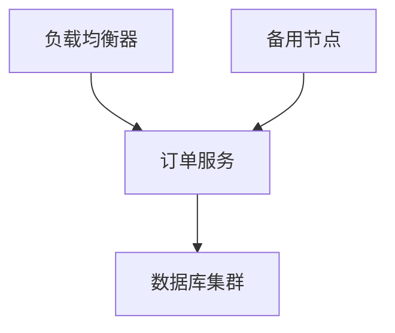
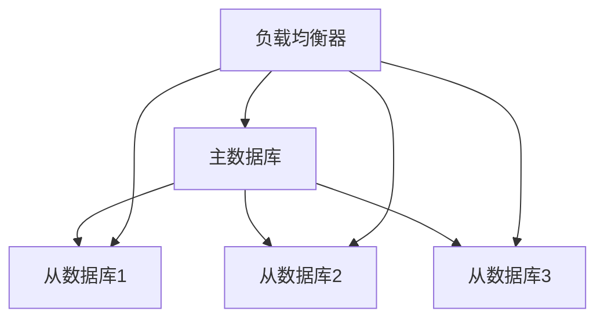
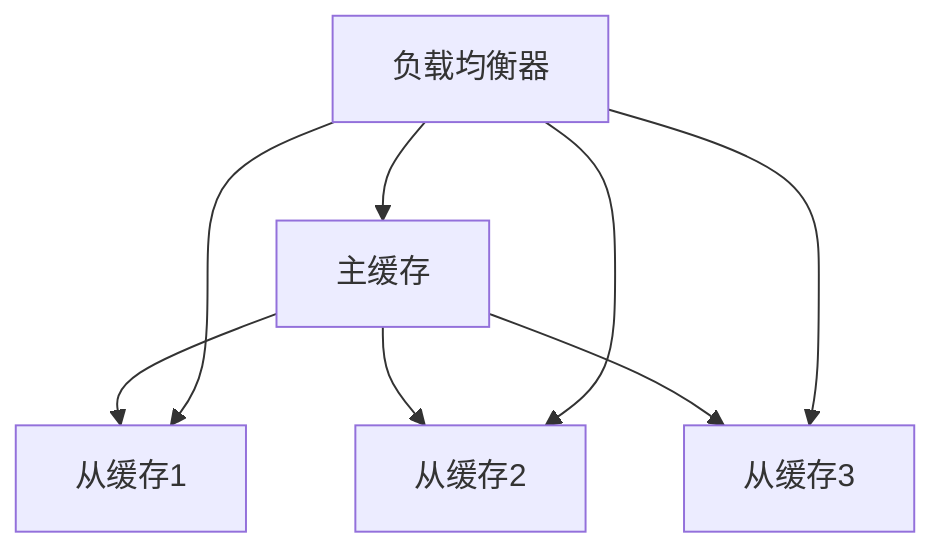
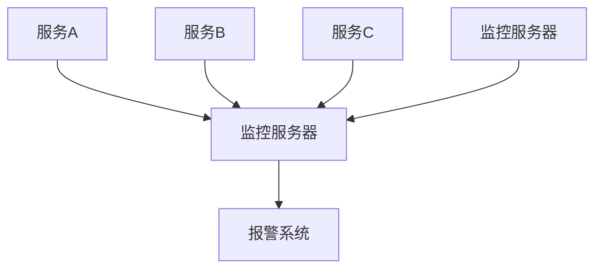
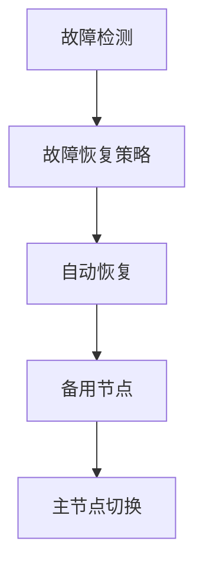
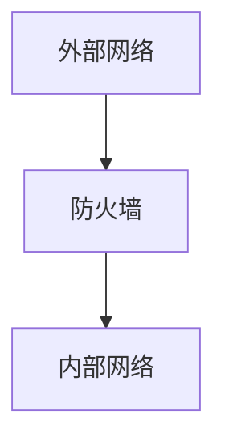
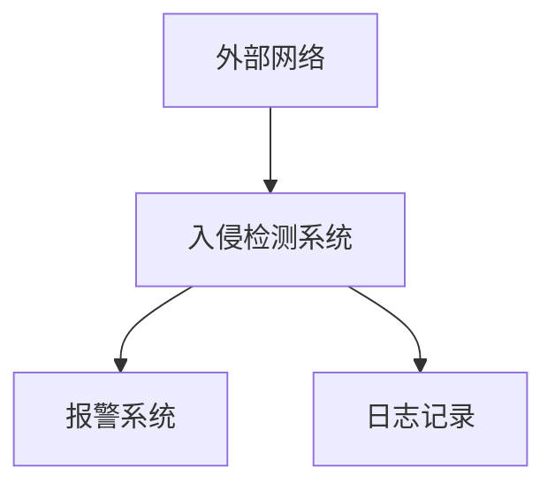

                 

## 文章标题

### 电商系统的高可用、稳定性、安全性、高性能能力保障

> 关键词：电商系统，高可用性，稳定性，安全性，性能优化

> 摘要：本文将深入探讨电商系统在构建过程中所需关注的高可用性、稳定性、安全性和高性能能力。通过理论分析和实战案例，我们将全面解析这些关键能力的保障方法，为电商系统的开发与运维提供有力支持。

## 第一部分：电商系统高可用、稳定性、安全性、高性能基础理论

### 第1章：电商系统概述

#### 1.1 电商系统的发展历程

1. **电商系统的起源**：
    - 电商系统的起源可以追溯到20世纪90年代，随着互联网技术的发展，电子商务逐渐兴起。
    - 早期电商系统主要采用B2B模式，如阿里巴巴的早期业务。
    - 2000年后，随着互联网普及，B2C模式逐渐成为主流，如亚马逊、京东等电商巨头崛起。

2. **传统电商向现代电商的演进**：
    - 电商系统从简单的交易平台演变为包含社交、内容、物流等多功能的生态系统。
    - 移动互联网和大数据技术的应用，使得电商系统能够提供更个性化和智能化的购物体验。
    - 现代电商注重用户互动和社区建设，如直播带货、社交电商等新模式的出现。

3. **电商系统在数字化时代的重要性**：
    - 数字化时代，电商系统成为企业获取客户、拓展市场的重要渠道。
    - 电商系统的性能直接影响企业的业务效率和用户满意度。
    - 高可用性、稳定性、安全性和高性能是电商系统在数字化时代的基本要求。

#### 1.2 电商系统的架构与模块

1. **前端架构设计**：
    - 前端架构需考虑用户体验和性能优化。
    - 常见技术包括HTML/CSS/JavaScript、React/Vue等框架。
    - 前端缓存和懒加载技术可提高页面加载速度。

2. **后端架构设计**：
    - 后端负责处理业务逻辑和数据处理。
    - 常见技术包括Java、Python、Node.js等。
    - 微服务架构可以提高系统的灵活性和可扩展性。

3. **数据库架构设计**：
    - 数据库用于存储和管理商品信息、用户数据等。
    - 常见技术包括MySQL、MongoDB、Redis等。
    - 分库分表和数据库集群可提高数据存储和处理能力。

4. **存储架构设计**：
    - 存储用于存储商品图片、用户头像等静态资源。
    - 常见技术包括对象存储、文件存储等。
    - CDN技术可提高资源访问速度。

### 第2章：高可用性与稳定性保障

#### 2.1 高可用性与稳定性概述

1. **高可用性的定义**：
    - 高可用性（High Availability，简称HA）是指系统在长时间运行中能够持续提供服务的能力。
    - 高可用性通常以系统可用性百分比（如99.9%、99.99%）来衡量。

2. **稳定性的重要性**：
    - 稳定性（Stability）是指系统在运行过程中能够保持稳定状态，不出现故障或崩溃。
    - 稳定性对于用户体验和业务连续性至关重要。

#### 2.2 电商系统的负载均衡

1. **负载均衡的原理**：
    - 负载均衡（Load Balancing）是将请求分配到多个服务器或节点上，以避免单点故障和资源瓶颈。
    - 负载均衡可以基于轮询、最小连接数、源IP哈希等方法。

2. **负载均衡算法**：
    - **轮询（Round Robin）**：依次分配请求到每个服务器。
    - **最小连接数（Least Connections）**：将请求分配到连接数最少的服务器。
    - **源IP哈希（Source IP Hash）**：根据客户端IP地址的哈希值分配请求。

3. **常见的负载均衡技术**：
    - **硬件负载均衡器**：如F5 BIG-IP。
    - **软件负载均衡器**：如Nginx、HAProxy。

#### 2.3 分布式系统的容错机制

1. **容错机制的定义**：
    - 容错（Fault Tolerance）是指系统能够在部分组件或节点出现故障时，仍然能够保持正常运行的能力。

2. **数据一致性保证**：
    - 数据一致性（Data Consistency）是分布式系统中重要的保障。
    - 常见的一致性模型包括强一致性、最终一致性等。

3. **服务恢复策略**：
    - 服务恢复（Service Recovery）是指系统在出现故障时，能够快速恢复到正常状态。
    - 常见策略包括自动重启、人工干预、备用节点切换等。

### 第3章：安全性与隐私保护

#### 3.1 安全性与隐私保护概述

1. **网络安全的重要性**：
    - 网络安全是电商系统的重要保障，关系到用户数据安全和业务连续性。

2. **隐私保护的需求**：
    - 隐私保护是现代社会的重要需求，电商系统需确保用户数据的安全和隐私。

#### 3.2 常见网络安全威胁与防护

1. **DDoS攻击**：
    - DDoS（Distributed Denial of Service）攻击是指通过大量请求使目标服务器瘫痪。
    - 防护措施包括流量清洗、黑名单策略等。

2. **SQL注入**：
    - SQL注入（SQL Injection）是通过在输入字段中注入恶意SQL语句来篡改数据库。
    - 防护措施包括输入验证、使用预编译语句等。

3. **XSS攻击**：
    - XSS（Cross-Site Scripting）攻击是通过在网页中注入恶意脚本，窃取用户信息。
    - 防护措施包括内容安全策略、输出编码等。

4. **XSRF攻击**：
    - XSRF（Cross-Site Request Forgery）攻击是通过伪造请求，欺骗用户执行不希望的操作。
    - 防护措施包括验证码、OAuth等。

#### 3.3 安全策略与安全机制

1. **访问控制**：
    - 访问控制（Access Control）是指根据用户身份和权限限制对资源的访问。
    - 常见策略包括角色基础访问控制（RBAC）、属性基础访问控制（ABAC）等。

2. **数据加密**：
    - 数据加密（Data Encryption）是指通过加密算法保护数据传输和存储过程中的安全性。
    - 常见加密算法包括AES、RSA等。

3. **安全审计**：
    - 安全审计（Security Audit）是指对系统进行安全检查和记录，以发现潜在的安全漏洞。
    - 常见工具包括Wireshark、LogAnalyzer等。

### 第4章：性能优化与扩展

#### 4.1 性能优化策略

1. **缓存机制**：
    - 缓存（Caching）是将常用数据存储在内存中，以提高访问速度。
    - 常见缓存技术包括Redis、Memcached等。

2. **数据库优化**：
    - 数据库优化（Database Optimization）是通过改进数据库配置、索引、查询等提高查询效率。
    - 常见技术包括分区、索引优化、查询缓存等。

3. **网络优化**：
    - 网络优化（Network Optimization）是通过改进网络配置、优化传输协议等提高网络传输效率。
    - 常见技术包括CDN、TCP优化等。

#### 4.2 高性能架构设计

1. **微服务架构**：
    - 微服务架构（Microservices Architecture）是将系统拆分为多个独立服务，以提高系统的灵活性和可扩展性。
    - 常见框架包括Spring Cloud、Kubernetes等。

2. **容器化与云原生**：
    - 容器化（Containerization）是将应用打包在容器中，以提高部署和运维的效率。
    - 云原生（Cloud Native）是指利用云计算和容器化技术构建和运行应用。
    - 常见技术包括Docker、Kubernetes等。

3. **自动化运维**：
    - 自动化运维（Automated Operations）是通过自动化工具和流程提高运维效率。
    - 常见工具包括Ansible、Chef等。

## 第二部分：电商系统高可用、稳定性、安全性、高性能实战案例

### 第5章：高可用性实战案例

#### 5.1 实战项目背景

1. **项目介绍**：
    - 项目名称：某大型电商平台的订单处理系统。
    - 项目目标：提高系统的高可用性，确保订单处理的连续性和稳定性。

2. **项目需求**：
    - 系统需支持百万级订单处理能力。
    - 系统需具备自动故障恢复和负载均衡能力。
    - 系统需具备高可靠性和数据一致性。

#### 5.2 高可用性架构设计

1. **系统架构图**：

2. **高可用性组件介绍**：
    - **订单服务**：处理订单请求，与数据库进行交互。
    - **数据库集群**：存储订单数据，提供高可用性保障。
    - **负载均衡器**：分配订单请求到订单服务，实现负载均衡。
    - **备用节点**：在主节点出现故障时，自动切换到备用节点。

#### 5.3 实现与配置

1. **负载均衡配置**：
    - 使用Nginx作为负载均衡器，配置负载均衡策略为轮询。
    - 配置Nginx的健康检查，确保能够及时检测和切换故障节点。

2. **容错机制实现**：
    - 使用Spring Cloud的断路器（Hystrix）实现服务容错。
    - 配置断路器的阈值和熔断策略，避免系统过载和雪崩。

### 第6章：稳定性实战案例

#### 6.1 实战项目背景

1. **项目介绍**：
    - 项目名称：某电商平台的商品推荐系统。
    - 项目目标：提高系统稳定性，确保推荐结果的准确性和实时性。

2. **项目需求**：
    - 系统需支持实时推荐，响应时间需控制在毫秒级。
    - 系统需具备高并发处理能力，确保在大流量场景下稳定运行。

#### 6.2 稳定性分析

1. **性能监控**：
    - 使用Prometheus和Grafana进行性能监控，实时监控系统各项指标，如CPU、内存、磁盘等。
    - 设置报警阈值，及时发现和处理性能问题。

2. **故障排查**：
    - 使用Docker和Kubernetes进行容器化部署，方便故障排查和问题定位。
    - 使用日志分析工具（如ELK Stack）对系统日志进行实时分析，发现潜在故障。

#### 6.3 稳定性优化措施

1. **系统优化**：
    - 使用Spring Boot和Spring Cloud进行微服务架构设计，提高系统灵活性和可扩展性。
    - 使用Redis进行缓存，降低数据库压力，提高系统响应速度。

2. **架构优化**：
    - 使用分布式缓存（如Redis Cluster）提高缓存系统的性能和可靠性。
    - 使用分布式数据库（如MongoDB Sharding）提高数据库的并发处理能力。

### 第7章：安全性实战案例

#### 7.1 实战项目背景

1. **项目介绍**：
    - 项目名称：某电商平台的用户管理系统。
    - 项目目标：提高系统安全性，确保用户数据和交易安全。

2. **项目需求**：
    - 系统需支持用户身份验证和权限控制。
    - 系统需具备防止SQL注入、XSS攻击等常见安全威胁的能力。

#### 7.2 安全性防护措施

1. **访问控制**：
    - 使用Spring Security进行身份验证和权限控制。
    - 使用JWT（JSON Web Token）实现无状态认证，提高系统安全性。

2. **数据加密**：
    - 使用AES加密算法对用户密码进行加密存储。
    - 使用HTTPS协议进行数据传输加密。

3. **安全审计**：
    - 使用Log4j进行日志记录，确保系统运行过程中的关键操作可被审计。
    - 使用AWS WAF（Web Application Firewall）对Web应用进行安全防护。

#### 7.3 安全性测试与修复

1. **漏洞扫描**：
    - 使用OWASP ZAP进行漏洞扫描，发现系统中的潜在漏洞。
    - 定期进行安全扫描，确保系统安全。

2. **安全测试**：
    - 进行渗透测试，模拟黑客攻击，验证系统安全性。
    - 制定安全测试计划，确保测试全面覆盖系统各个层面。

3. **漏洞修复**：
    - 及时修复发现的安全漏洞，降低系统风险。
    - 建立漏洞修复机制，确保漏洞修复及时、有效。

### 第8章：性能优化实战案例

#### 8.1 实战项目背景

1. **项目介绍**：
    - 项目名称：某电商平台的商品搜索系统。
    - 项目目标：提高系统性能，确保搜索结果的准确性和响应速度。

2. **项目需求**：
    - 系统需支持海量商品数据的快速搜索。
    - 系统需具备高并发处理能力，确保在大流量场景下稳定运行。

#### 8.2 性能瓶颈分析

1. **数据库性能分析**：
    - 使用Explain进行分析，找出查询瓶颈。
    - 优化索引、查询语句等，提高数据库性能。

2. **网络性能分析**：
    - 使用Wireshark进行网络抓包，分析网络传输性能。
    - 优化网络配置、传输协议等，提高网络传输效率。

#### 8.3 性能优化措施

1. **缓存策略**：
    - 使用Redis进行缓存，降低数据库查询次数。
    - 采用缓存预热策略，提高缓存命中率。

2. **数据库优化**：
    - 使用数据库集群，提高并发查询能力。
    - 使用读写分离，降低数据库负载。

3. **网络优化**：
    - 使用CDN（内容分发网络）提高资源访问速度。
    - 优化HTTP请求，降低网络延迟。

### 第三部分：电商系统高可用、稳定性、安全性、高性能架构设计

#### 第9章：高可用、稳定性、安全性、高性能架构设计原则

#### 9.1 架构设计原则

1. **SRE原则**：
    - 运维（Site Reliability Engineering）是一种将系统可靠性作为核心目标的运维理念。
    - SRE原则包括故障预测、自动化运维、持续集成和持续部署等。

2. **12因子法**：
    - 12因子法是一组云原生应用的最佳实践，包括状态无状态、依赖声明等。
    - 12因子法有助于提高系统的可伸缩性和可维护性。

3. **云原生原则**：
    - 云原生（Cloud Native）是指利用云计算和容器化技术构建和运行应用。
    - 云原生原则包括弹性扩展、微服务架构、自动化运维等。

#### 9.2 架构设计方法

1. **微服务架构设计**：
    - 微服务架构（Microservices Architecture）是将系统拆分为多个独立服务，以提高系统的灵活性和可扩展性。
    - 微服务架构设计需考虑服务拆分、服务通信、服务管理等方面。

2. **容器化架构设计**：
    - 容器化（Containerization）是将应用打包在容器中，以提高部署和运维的效率。
    - 容器化架构设计需考虑容器编排、容器网络、容器存储等方面。

3. **云服务架构设计**：
    - 云服务架构（Cloud Service Architecture）是基于云计算技术构建的架构。
    - 云服务架构设计需考虑云服务类型、负载均衡、数据存储等方面。

#### 第10章：高可用架构设计

#### 10.1 高可用架构概述

1. **高可用架构的目标**：
    - 高可用架构（High Availability Architecture）的目标是确保系统在长时间运行中能够持续提供服务。
    - 高可用架构需具备故障转移、负载均衡、容错机制等能力。

2. **高可用架构的关键组件**：
    - **负载均衡器**：实现请求的负载均衡，避免单点故障。
    - **数据库集群**：提高数据存储和处理能力，实现故障转移。
    - **备用节点**：在主节点出现故障时，提供备份能力。

#### 10.2 高可用架构设计案例

1. **分布式数据库设计**：

2. **分布式缓存设计**：

#### 第11章：稳定性架构设计

#### 11.1 稳定性架构概述

1. **稳定性架构的目标**：
    - 稳定性架构（Stability Architecture）的目标是确保系统在运行过程中能够保持稳定状态，不出现故障或崩溃。
    - 稳定性架构需具备性能监控、故障排查、自动化恢复等能力。

2. **稳定性架构的关键组件**：
    - **性能监控**：实时监控系统各项性能指标，及时发现性能瓶颈。
    - **故障排查**：使用日志分析、系统诊断等技术，快速定位故障原因。
    - **自动化恢复**：实现故障自动恢复，降低人工干预成本。

#### 11.2 稳定性架构设计案例

1. **分布式服务监控**：

2. **自动化故障恢复**：

#### 第12章：安全性架构设计

#### 12.1 安全性架构概述

1. **安全性架构的目标**：
    - 安全性架构（Security Architecture）的目标是确保系统的数据和资源安全，防止 unauthorized access 和 malicious attacks。
    - 安全性架构需具备访问控制、数据加密、安全审计等能力。

2. **安全性架构的关键组件**：
    - **访问控制**：通过身份验证和授权机制，确保只有授权用户能够访问系统资源。
    - **数据加密**：对传输和存储的数据进行加密，防止数据泄露和篡改。
    - **安全审计**：记录系统的关键操作和事件，以便进行事后分析和审计。

#### 12.2 安全性架构设计案例

1. **防火墙设计**：

2. **入侵检测系统设计**：

### 附录

#### 附录A：常用工具与框架

1. **高可用性工具**：
    - **keepalived**：用于实现负载均衡和高可用性。
    - **HAProxy**：高性能的负载均衡器。

2. **稳定性工具**：
    - **Nagios**：开源的监控工具。
    - **Zabbix**：企业级的开源监控解决方案。

3. **安全性工具**：
    - **AWS WAF**：AWS提供的Web应用防火墙。
    - **OWASP ZAP**：开源的Web应用程序安全扫描工具。

4. **性能优化工具**：
    - **New Relic**：性能监控和分析工具。
    - **Prometheus**：开源的监控解决方案。

#### 附录B：参考资料

1. **书籍推荐**：
    - 《大话分布式系统》
    - 《高性能MySQL》

2. **文章推荐**：
    - 《分布式数据库实践指南》
    - 《云原生技术与实践》

3. **视频教程**：
    - Coursera《分布式系统设计与实践》
    - Udemy《云计算与大数据技术》

## 作者信息

作者：AI天才研究院/AI Genius Institute & 禅与计算机程序设计艺术 /Zen And The Art of Computer Programming

