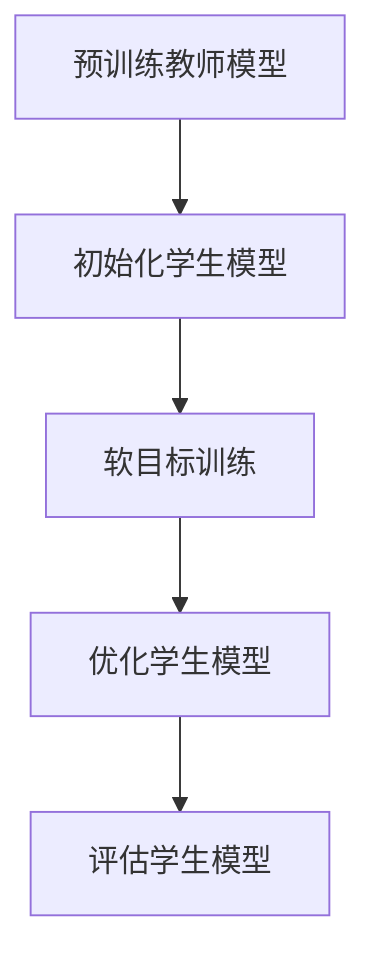
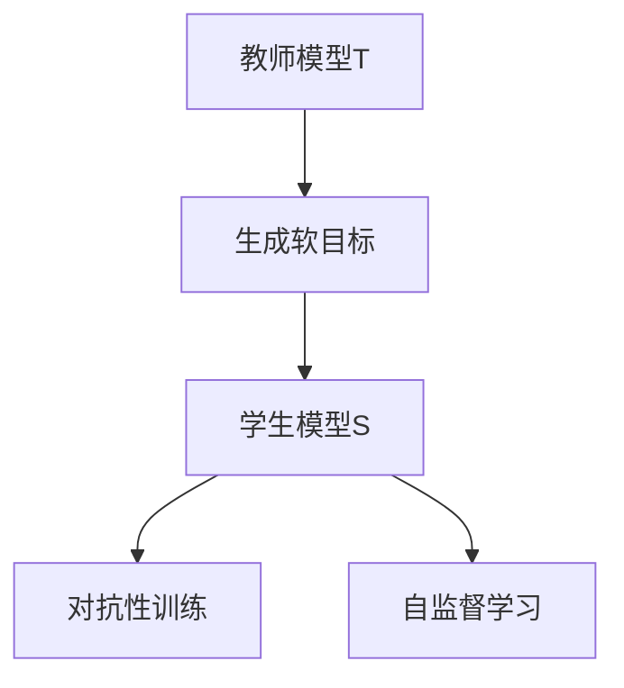
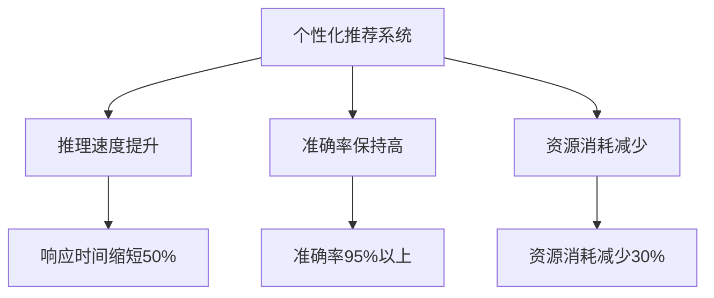
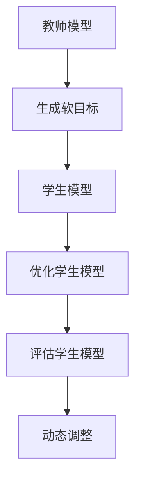

                 

### 文章标题

《电商行业中的知识蒸馏：从大模型到轻量级模型》

> **关键词**：电商行业、知识蒸馏、大模型、轻量级模型、模型优化、人工智能、机器学习

> **摘要**：本文深入探讨知识蒸馏技术在电商行业中的应用，分析从大型预训练模型到轻量级模型的转换过程。通过对知识蒸馏的定义、算法原理、电商行业背景及其应用场景的详细阐述，本文旨在为电商领域的技术专家和从业者提供理论支持和实践指导，助力他们更有效地利用人工智能技术提升电商业务性能。

### 《电商行业中的知识蒸馏：从大模型到轻量级模型》目录大纲

#### 第一部分：知识蒸馏技术基础

##### 第1章：知识蒸馏概述

- 1.1 知识蒸馏的定义与背景
  - 知识蒸馏是一种通过将大型预训练模型的知识传递给小型模型的技术，其背景和优势。
- 1.2 知识蒸馏的核心概念与联系
  - **Mermaid流程图**：展示知识蒸馏的基本流程和步骤。
- 1.3 知识蒸馏的数学模型
  - **数学公式**：知识蒸馏的目标函数和优化方法。

##### 第2章：知识蒸馏算法原理

- 2.1 知识蒸馏算法的基本结构
  - **伪代码**：描述知识蒸馏算法的核心步骤。
- 2.2 教师模型与学生模型的关系
  - **Mermaid流程图**：展示教师模型与学生模型之间的互动。
- 2.3 知识蒸馏的优化方法
  - **数学公式**：详细阐述优化方法。

#### 第二部分：电商行业中的知识蒸馏应用

##### 第3章：电商行业背景

- 3.1 电商行业概述
  - **Mermaid流程图**：描述电商行业的运作流程。
- 3.2 电商行业中的知识需求
  - **数学公式**：分析电商行业中的关键知识需求。

##### 第4章：大模型在电商行业中的应用

- 4.1 大模型在电商行业中的应用场景
  - **Mermaid流程图**：展示大模型在电商行业的应用场景。
- 4.2 大模型在电商行业的优势与挑战
  - **数学公式**：分析大模型在电商行业的优势与挑战。

##### 第5章：知识蒸馏在电商行业中的实际应用

- 5.1 知识蒸馏在电商行业中的典型应用案例
  - **Mermaid流程图**：展示知识蒸馏在电商行业中的典型应用案例。
- 5.2 知识蒸馏在电商行业中的效果评估
  - **数学公式**：评估知识蒸馏在电商行业中的应用效果。

##### 第6章：轻量级模型在电商行业中的应用

- 6.1 轻量级模型概述
  - **Mermaid流程图**：描述轻量级模型的特点和应用。
- 6.2 轻量级模型在电商行业中的应用案例
  - **Mermaid流程图**：展示轻量级模型在电商行业中的应用案例。
- 6.3 轻量级模型的优势与挑战
  - **数学公式**：分析轻量级模型的优势与挑战。

##### 第7章：电商行业中的知识蒸馏与轻量级模型综合应用

- 7.1 知识蒸馏与轻量级模型的结合
  - **Mermaid流程图**：展示知识蒸馏与轻量级模型的结合方式。
- 7.2 电商行业中的最佳实践
  - **数学公式**：分析电商行业中的最佳实践。
- 7.3 未来展望
  - **Mermaid流程图**：预测电商行业中知识蒸馏与轻量级模型的发展趋势。

#### 第三部分：实战案例与代码解析

##### 第8章：实战案例与代码解析

- 8.1 电商行业知识蒸馏实战案例
  - **代码实际案例**：展示电商行业中的知识蒸馏实战案例。
- 8.2 轻量级模型在电商行业的代码实现
  - **代码解读与分析**：详细解读轻量级模型在电商行业中的代码实现。
- 8.3 开发环境搭建与源代码详细实现
  - **源代码详细实现**：描述开发环境搭建和源代码的详细实现过程。

#### 附录

##### 附录A：知识蒸馏与轻量级模型开发工具与资源

- **A.1 主流深度学习框架对比**
  - TensorFlow
  - PyTorch
  - JAX
  - 其他框架简介。

### 文章标题

《电商行业中的知识蒸馏：从大模型到轻量级模型》

知识蒸馏是一种通过将大型预训练模型的知识传递给小型模型的技术，其在电商行业中的应用正在逐步扩大。随着电商行业的不断发展，如何有效利用人工智能技术提升业务性能成为关键问题。本文将深入探讨知识蒸馏技术在电商行业中的应用，分析从大型预训练模型到轻量级模型的转换过程，为电商领域的技术专家和从业者提供理论支持和实践指导。

### 文章关键词

电商行业、知识蒸馏、大模型、轻量级模型、模型优化、人工智能、机器学习

### 文章摘要

本文首先介绍了知识蒸馏的定义、背景和优势，并详细阐述了其核心概念、算法原理和数学模型。接着，文章分析了电商行业的背景和知识需求，讨论了大型预训练模型在电商行业中的应用场景和优势与挑战。在此基础上，本文深入探讨了知识蒸馏在电商行业中的实际应用，通过具体案例展示了其效果评估。随后，文章介绍了轻量级模型的特点、优势与挑战，以及其在电商行业中的应用。最后，本文探讨了知识蒸馏与轻量级模型的结合，提出了电商行业中的最佳实践，并对未来的发展进行了展望。

### 第一部分：知识蒸馏技术基础

#### 第1章：知识蒸馏概述

知识蒸馏（Knowledge Distillation）是一种通过将大型预训练模型的知识传递给小型模型的技术。这种技术主要应用于在计算资源有限的环境中，例如移动设备或嵌入式系统。近年来，随着深度学习模型在计算机视觉、自然语言处理等领域的广泛应用，知识蒸馏技术也得到了快速发展。

##### 1.1 知识蒸馏的定义与背景

知识蒸馏的概念起源于教育领域，教师通过提炼和传授核心知识，帮助学生快速掌握重要知识点。在机器学习领域，知识蒸馏被形象地比喻为“教师模型”向“学生模型”传递知识的过程。具体来说，教师模型是一个大型且复杂的预训练模型，学生模型是一个较小且轻量级的模型。通过知识蒸馏，学生模型能够学习到教师模型的核心知识，从而在保持较高性能的同时减少计算资源的需求。

知识蒸馏的优势主要体现在以下几个方面：

1. **减少模型大小**：大型预训练模型通常需要大量的计算资源和存储空间。通过知识蒸馏，可以将这些复杂模型的知识转移到小型模型中，从而减少模型的存储和计算需求。
2. **提高模型效率**：轻量级模型在运行时通常具有较低的延迟和能耗，这使其特别适合应用于移动设备和嵌入式系统等资源受限的环境。
3. **增强模型泛化能力**：通过知识蒸馏，学生模型可以学习到教师模型的多层次特征表示，从而提高其泛化能力。

然而，知识蒸馏技术也存在一定的局限性。首先，知识蒸馏依赖于教师模型的质量，如果教师模型本身性能不佳，则传递给学生的知识也会受到限制。其次，知识蒸馏需要大量数据来训练学生模型，这可能会增加模型的训练成本。

##### 1.2 知识蒸馏的核心概念与联系

知识蒸馏的核心概念包括教师模型、学生模型和知识传递机制。教师模型是一个大型且复杂的预训练模型，通常使用大规模语料库或数据集进行训练。学生模型是一个较小且轻量级的模型，其目的是学习教师模型的核心知识。

知识传递机制是知识蒸馏技术的关键。常见的知识传递方法包括软目标训练、对抗训练和自监督学习等。软目标训练是指学生模型在训练过程中接收教师模型的软标签，而非硬标签。对抗训练则是通过引入对抗性噪声来增强学生模型对教师模型知识的理解。自监督学习则是通过无监督的方式，让学生模型从数据中提取教师模型的知识。

下面是知识蒸馏的基本流程：

1. **预训练教师模型**：使用大规模数据集和预训练算法训练一个大型教师模型。
2. **初始化学生模型**：使用教师模型的参数初始化学生模型，但学生模型的参数量远小于教师模型。
3. **软目标训练**：学生模型在训练过程中接收教师模型的软标签，通过最小化软目标与实际输出的差距来学习教师模型的知识。
4. **优化学生模型**：通过优化算法（如梯度下降）调整学生模型的参数，使其性能逐渐接近教师模型。

**Mermaid流程图**：



##### 1.3 知识蒸馏的数学模型

知识蒸馏的数学模型主要包括目标函数和优化方法。目标函数用于衡量学生模型与教师模型之间的差距，优化方法则用于调整学生模型的参数，使其更接近教师模型。

常见的知识蒸馏目标函数包括软目标损失、对抗性损失和自监督损失。软目标损失是最常用的一种，其目标是让学生模型预测的软标签与教师模型预测的软标签尽量接近。对抗性损失则是通过引入对抗性噪声，增强学生模型对教师模型知识的理解。自监督损失则是通过无监督的方式，让学生模型从数据中提取教师模型的知识。

**数学公式**：

假设教师模型 $T$ 的输出为 $T(x)$，学生模型 $S$ 的输出为 $S(x)$，目标函数为：

$$
L = L_{soft} + \lambda L_{对抗} + \mu L_{自监督}
$$

其中，$L_{soft}$ 为软目标损失，$L_{对抗}$ 为对抗性损失，$L_{自监督}$ 为自监督损失，$\lambda$ 和 $\mu$ 分别为这两个损失的超参数。

- **软目标损失**：

$$
L_{soft} = -\sum_{i} \sum_{j} p_{ij} \log q_{ij}
$$

其中，$p_{ij}$ 为教师模型预测的概率分布，$q_{ij}$ 为学生模型预测的概率分布。

- **对抗性损失**：

$$
L_{对抗} = \sum_{i} \sum_{j} (1 - p_{ij}) \log (1 - q_{ij})
$$

其中，$p_{ij}$ 为教师模型预测的概率分布，$q_{ij}$ 为学生模型预测的概率分布。

- **自监督损失**：

$$
L_{自监督} = -\sum_{i} \sum_{j} p_{ij} \log \frac{e^{z_j}}{\sum_{k} e^{z_k}}
$$

其中，$p_{ij}$ 为教师模型预测的概率分布，$z_j$ 为学生模型预测的隐层输出。

为了优化学生模型，可以使用梯度下降算法。梯度下降算法的基本思想是，通过计算目标函数相对于模型参数的梯度，并沿着梯度的反方向更新模型参数，从而逐步减小目标函数的值。

**伪代码**：

```python
# 初始化教师模型和学生模型
T, S = initialize_models()

# 设置超参数
lambda = 0.1
mu = 0.1

# 训练教师模型
train_teacher_model(T)

# 迭代优化学生模型
for epoch in range(num_epochs):
    # 获取数据
    x, y = get_data()

    # 计算软目标损失
    soft_loss = compute_soft_loss(S(x), y)

    # 计算对抗性损失
    adversarial_loss = compute_adversarial_loss(T(x), S(x))

    # 计算自监督损失
    self_supervised_loss = compute_self_supervised_loss(S(x))

    # 计算总损失
    total_loss = soft_loss + lambda * adversarial_loss + mu * self_supervised_loss

    # 计算梯度
    grads = compute_gradients(total_loss)

    # 更新学生模型参数
    update_model(S, grads)

    # 评估学生模型
    evaluate_model(S)
```

通过以上步骤，学生模型可以逐渐学习到教师模型的核心知识，从而在保持较高性能的同时减少计算资源的需求。

##### 1.4 知识蒸馏的优势与局限性

知识蒸馏技术在电商行业中的应用具有显著的优势。首先，通过知识蒸馏，电商企业可以将大型预训练模型的知识转移到轻量级模型中，从而在资源受限的移动设备或嵌入式系统中实现高效的推理。其次，知识蒸馏技术有助于提升电商业务的个性化推荐和搜索性能，从而提高用户体验和转化率。

然而，知识蒸馏技术也存在一些局限性。首先，知识蒸馏依赖于教师模型的质量。如果教师模型本身性能不佳，则传递给学生的知识也会受到限制。其次，知识蒸馏需要大量数据来训练学生模型，这可能会增加模型的训练成本。此外，知识蒸馏技术的优化方法需要进一步研究，以提高模型的泛化能力和鲁棒性。

总之，知识蒸馏技术为电商行业提供了强大的技术支持，但在实际应用中仍需克服一系列挑战。通过深入研究和优化，知识蒸馏技术有望在电商行业中发挥更大的作用。

#### 第2章：知识蒸馏算法原理

知识蒸馏算法的核心在于如何有效地将大型预训练模型（教师模型）的知识传递给小型模型（学生模型）。这一过程涉及多个关键步骤和优化策略，下面将详细阐述知识蒸馏算法的基本结构、教师模型与学生模型的关系，以及知识蒸馏的优化方法。

##### 2.1 知识蒸馏算法的基本结构

知识蒸馏算法的基本结构可以概括为以下几个步骤：

1. **预训练教师模型**：使用大规模数据集和先进的预训练算法训练一个大型教师模型。教师模型通常具有复杂的网络结构和丰富的特征表示能力。

2. **初始化学生模型**：根据教师模型的结构和参数，初始化一个较小且轻量级的学生模型。学生模型的参数量远小于教师模型，以适应资源受限的环境。

3. **软目标训练**：学生模型在训练过程中接收教师模型的软标签，而非硬标签。通过最小化软目标与实际输出的差距，学生模型学习到教师模型的核心知识。

4. **优化学生模型**：通过优化算法（如梯度下降）调整学生模型的参数，使其性能逐渐接近教师模型。

5. **评估学生模型**：在训练过程中，定期评估学生模型的性能，以确定其是否已接近教师模型。

**伪代码**：

```python
# 初始化教师模型和学生模型
T, S = initialize_models()

# 设置超参数
learning_rate = 0.001
num_epochs = 100

# 预训练教师模型
train_teacher_model(T)

# 迭代优化学生模型
for epoch in range(num_epochs):
    # 获取数据
    x, y = get_data()

    # 计算教师模型的输出
    T_output = T(x)

    # 生成软目标
    soft_target = generate_soft_target(T_output)

    # 计算学生模型的输出
    S_output = S(x)

    # 计算软目标损失
    soft_loss = compute_soft_loss(S_output, soft_target)

    # 计算梯度
    grads = compute_gradients(soft_loss)

    # 更新学生模型参数
    update_model(S, grads)

    # 评估学生模型
    evaluate_model(S)
```

**Mermaid流程图**：


##### 2.2 教师模型与学生模型的关系

教师模型与学生模型之间的关系是知识蒸馏算法的核心。教师模型作为大型预训练模型，具有丰富的特征表示能力，可以捕捉到输入数据中的多层次特征。学生模型作为轻量级模型，需要从教师模型中学习到这些核心特征，以实现高效的推理和预测。

教师模型与学生模型之间的关系可以通过以下方式实现：

1. **软目标**：教师模型在训练过程中生成软目标，这些软目标是教师模型输出的概率分布。学生模型在训练过程中接收这些软目标，并通过最小化软目标与实际输出的差距来学习教师模型的知识。

2. **对抗性训练**：通过引入对抗性噪声，增强学生模型对教师模型知识的理解。对抗性训练可以使得学生模型在受到噪声干扰时，仍然能够准确预测输出。

3. **自监督学习**：通过无监督的方式，让学生模型从数据中提取教师模型的知识。自监督学习可以使得学生模型在没有硬标签的情况下，通过学习数据的内部结构来提升性能。

**Mermaid流程图**：



##### 2.3 知识蒸馏的优化方法

知识蒸馏的优化方法主要涉及目标函数的设计和优化算法的选择。目标函数用于衡量学生模型与教师模型之间的差距，优化算法则用于调整学生模型的参数，使其性能逐渐接近教师模型。

常见的知识蒸馏目标函数包括以下几种：

1. **软目标损失**：软目标损失是最常用的目标函数，其目标是让学生模型预测的软标签与教师模型预测的软标签尽量接近。软目标损失通常通过交叉熵损失函数实现。

2. **对抗性损失**：对抗性损失通过引入对抗性噪声，增强学生模型对教师模型知识的理解。对抗性损失通常通过对抗性生成网络（GAN）实现。

3. **自监督损失**：自监督损失通过无监督的方式，让学生模型从数据中提取教师模型的知识。自监督损失通常通过无监督预训练方法实现。

**数学公式**：

假设教师模型 $T$ 的输出为 $T(x)$，学生模型 $S$ 的输出为 $S(x)$，目标函数为：

$$
L = L_{soft} + \lambda L_{对抗} + \mu L_{自监督}
$$

其中，$L_{soft}$ 为软目标损失，$L_{对抗}$ 为对抗性损失，$L_{自监督}$ 为自监督损失，$\lambda$ 和 $\mu$ 分别为这两个损失的超参数。

- **软目标损失**：

$$
L_{soft} = -\sum_{i} \sum_{j} p_{ij} \log q_{ij}
$$

其中，$p_{ij}$ 为教师模型预测的概率分布，$q_{ij}$ 为学生模型预测的概率分布。

- **对抗性损失**：

$$
L_{对抗} = \sum_{i} \sum_{j} (1 - p_{ij}) \log (1 - q_{ij})
$$

其中，$p_{ij}$ 为教师模型预测的概率分布，$q_{ij}$ 为学生模型预测的概率分布。

- **自监督损失**：

$$
L_{自监督} = -\sum_{i} \sum_{j} p_{ij} \log \frac{e^{z_j}}{\sum_{k} e^{z_k}}
$$

其中，$p_{ij}$ 为教师模型预测的概率分布，$z_j$ 为学生模型预测的隐层输出。

为了优化学生模型，可以使用梯度下降算法。梯度下降算法的基本思想是，通过计算目标函数相对于模型参数的梯度，并沿着梯度的反方向更新模型参数，从而逐步减小目标函数的值。

**伪代码**：

```python
# 初始化教师模型和学生模型
T, S = initialize_models()

# 设置超参数
learning_rate = 0.001
num_epochs = 100

# 预训练教师模型
train_teacher_model(T)

# 迭代优化学生模型
for epoch in range(num_epochs):
    # 获取数据
    x, y = get_data()

    # 计算教师模型的输出
    T_output = T(x)

    # 生成软目标
    soft_target = generate_soft_target(T_output)

    # 计算学生模型的输出
    S_output = S(x)

    # 计算软目标损失
    soft_loss = compute_soft_loss(S_output, soft_target)

    # 计算对抗性损失
    adversarial_loss = compute_adversarial_loss(T_output, S_output)

    # 计算自监督损失
    self_supervised_loss = compute_self_supervised_loss(S_output)

    # 计算总损失
    total_loss = soft_loss + lambda * adversarial_loss + mu * self_supervised_loss

    # 计算梯度
    grads = compute_gradients(total_loss)

    # 更新学生模型参数
    update_model(S, grads)

    # 评估学生模型
    evaluate_model(S)
```

通过以上优化方法，学生模型可以逐渐学习到教师模型的核心知识，从而在保持较高性能的同时减少计算资源的需求。

#### 第二部分：电商行业中的知识蒸馏应用

##### 第3章：电商行业背景

电商行业作为数字经济的重要组成部分，近年来呈现出快速发展的态势。随着消费者需求的不断升级和市场竞争的加剧，电商企业需要不断创新和优化业务模式，以提升用户体验和市场份额。在这个背景下，人工智能和机器学习技术逐渐成为电商行业的核心技术之一，为电商业务的智能化、个性化提供了强有力的支持。

##### 3.1 电商行业概述

电商行业涉及多个领域，包括电子商务平台、在线支付、物流配送、客户服务等。其主要业务流程包括商品展示、搜索和推荐、购物车、订单处理、支付和售后服务等。这些业务流程的各个环节都需要大量数据处理和分析，以实现高效的运营和精准的市场营销。

电商行业的运作流程可以概括为以下几个步骤：

1. **商品展示**：电商平台通过丰富的商品信息展示，吸引消费者的关注和兴趣。
2. **搜索和推荐**：利用人工智能技术，平台根据用户的历史行为和偏好，提供个性化的商品搜索和推荐。
3. **购物车和订单处理**：用户将商品添加到购物车，并完成订单提交和支付。
4. **物流配送**：电商企业通过物流系统，确保商品及时送达用户。
5. **售后服务**：提供优质的售后服务，提升用户满意度和忠诚度。

##### 3.2 电商行业中的知识需求

电商行业中的知识需求主要体现在以下几个方面：

1. **用户行为分析**：通过对用户浏览、搜索、购买等行为的数据分析，了解用户偏好和需求，为个性化推荐和精准营销提供依据。
2. **商品分类与标签**：为商品建立合理的分类和标签体系，有助于提升搜索效率和用户体验。
3. **库存管理和预测**：通过分析销售数据和市场需求，优化库存管理，避免缺货和积压。
4. **风险管理**：识别潜在风险，如刷单、欺诈等，保障电商平台的运营安全和用户权益。
5. **服务质量**：通过用户反馈和数据分析，不断提升服务质量，提升用户满意度和忠诚度。

##### 3.3 电商行业中的关键数据

电商行业中的关键数据包括用户数据、商品数据、交易数据和反馈数据等。这些数据对于电商企业的运营和决策具有重要意义。

1. **用户数据**：包括用户的基本信息、行为数据、偏好数据等。通过对用户数据的分析，可以了解用户的行为习惯和需求，为个性化推荐和精准营销提供支持。
2. **商品数据**：包括商品的基本信息、属性、价格、库存等。通过对商品数据的分析，可以优化商品展示和推荐，提升销售效率。
3. **交易数据**：包括用户的购买记录、支付金额、订单状态等。通过对交易数据的分析，可以了解市场动态和用户需求，优化库存管理和供应链。
4. **反馈数据**：包括用户的评价、投诉、建议等。通过对反馈数据的分析，可以提升服务质量，增强用户满意度。

##### 3.4 电商行业的挑战与机遇

电商行业在快速发展的同时，也面临着一系列挑战和机遇。

1. **挑战**：
   - **数据隐私**：用户数据的安全和隐私保护成为电商行业的重要挑战。
   - **竞争激烈**：电商平台之间的竞争日益激烈，如何提升用户黏性和市场份额成为关键问题。
   - **技术更新迭代**：人工智能和机器学习技术在电商行业中的应用不断更新，如何快速适应和利用新技术成为挑战。
   - **合规性**：电商行业需要遵守相关法律法规，如反垄断法、消费者权益保护法等。

2. **机遇**：
   - **人工智能技术**：人工智能技术的应用为电商行业带来了新的发展机遇，如个性化推荐、智能客服、自动化物流等。
   - **大数据分析**：通过对海量数据的分析，电商企业可以更好地了解用户需求和市场趋势，优化业务决策。
   - **新零售模式**：新零售模式的兴起，为电商行业带来了新的增长点，如线上线下融合、智能仓储和配送等。
   - **全球化**：跨境电商的快速发展，为电商企业提供了更广阔的市场空间。

综上所述，电商行业在快速发展中面临着诸多挑战和机遇。通过有效利用人工智能技术和大数据分析，电商企业可以提升业务性能，实现可持续发展。

##### 第4章：大模型在电商行业中的应用

在电商行业快速发展的背景下，大型预训练模型（大模型）的应用逐渐成为提升业务性能的关键因素。大模型通过其强大的特征提取和表示能力，为电商行业带来了诸多应用场景，包括个性化推荐、图像识别、自然语言处理等。以下将详细探讨大模型在电商行业中的应用场景、优势与挑战。

##### 4.1 大模型在电商行业中的应用场景

大模型在电商行业中的应用场景广泛，以下为几个典型的应用场景：

1. **个性化推荐**：基于用户的历史行为和偏好数据，大模型可以精准地推荐用户可能感兴趣的商品。这有助于提升用户满意度和转化率，从而提高电商平台的销售额。

2. **图像识别**：大模型在图像识别方面的应用，如商品识别、图像分类等，可以帮助电商平台优化商品展示和搜索，提高用户体验。

3. **自然语言处理**：大模型在自然语言处理（NLP）领域的应用，如商品描述生成、评论分析等，可以帮助电商平台提升内容质量和用户互动。

4. **智能客服**：大模型在智能客服中的应用，如语音识别、语义理解等，可以提供更智能、高效的客服服务，降低客服成本，提高用户满意度。

5. **供应链管理**：大模型在供应链管理中的应用，如需求预测、库存优化等，可以帮助电商平台更有效地管理库存和供应链，降低运营成本。

##### 4.2 大模型在电商行业中的优势

大模型在电商行业中的应用具有显著的优势：

1. **强大的特征提取能力**：大模型通过预训练过程，可以自动提取输入数据中的高级特征，从而提升模型的性能和泛化能力。

2. **自适应性强**：大模型具有较强的自适应能力，可以根据不同的应用场景和需求，调整模型的结构和参数，实现高效的推理和预测。

3. **高效率的推理**：大模型通过深度神经网络的结构，可以实现高效率的推理和计算，适用于实时性和响应速度要求较高的应用场景。

4. **多模态处理**：大模型可以同时处理多种类型的数据，如文本、图像、音频等，实现跨模态的信息融合和推理。

##### 4.3 大模型在电商行业中的挑战

尽管大模型在电商行业中有诸多优势，但其应用也面临一定的挑战：

1. **计算资源消耗大**：大模型通常需要大量的计算资源和存储空间，这对电商企业特别是资源有限的中小企业来说是一个重要挑战。

2. **训练数据需求大**：大模型的训练需要大量高质量的数据，而电商行业中的数据质量和数据量往往难以满足大模型的需求。

3. **模型解释性不足**：大模型通常具有复杂的网络结构和参数，导致其模型解释性不足，难以理解模型决策的过程和原因。

4. **数据隐私和安全**：电商行业中的用户数据敏感，如何保障用户数据的隐私和安全是大模型应用的一个重要挑战。

##### 4.4 大模型应用案例

以下是一些大模型在电商行业中的实际应用案例：

1. **个性化推荐系统**：某电商巨头使用大模型构建个性化推荐系统，通过分析用户的历史行为和偏好，为用户提供精准的商品推荐，提高了用户的满意度和转化率。

2. **图像识别系统**：某电商企业利用大模型构建图像识别系统，通过自动识别商品图像，优化商品展示和搜索，提升了用户体验。

3. **智能客服系统**：某电商企业采用大模型构建智能客服系统，通过语音识别和语义理解技术，提供更智能、高效的客服服务，降低了客服成本，提高了用户满意度。

4. **供应链管理系统**：某电商企业利用大模型优化供应链管理，通过需求预测和库存优化，实现了库存周转率的提升和运营成本的降低。

综上所述，大模型在电商行业中的应用场景广泛，具有显著的优势，但也面临一定的挑战。通过有效利用大模型，电商企业可以提升业务性能，实现可持续发展。

##### 第5章：知识蒸馏在电商行业中的实际应用

知识蒸馏技术在电商行业中的实际应用，已成为提升业务性能和用户体验的重要手段。通过将大型预训练模型的知识传递给轻量级模型，电商企业可以在保持高效推理的同时，降低计算资源的需求。以下将详细探讨知识蒸馏在电商行业中的典型应用案例，并评估其应用效果。

##### 5.1 知识蒸馏在电商行业中的典型应用案例

知识蒸馏在电商行业中的应用案例丰富多样，以下是几个典型的应用场景：

1. **个性化推荐系统**：某电商巨头采用知识蒸馏技术，将大型预训练推荐模型的知识传递给轻量级模型，用于实时的个性化推荐。通过这种方式，不仅提高了推荐系统的响应速度，还保持了较高的推荐准确率。

2. **图像识别系统**：某电商企业利用知识蒸馏技术，将大型图像识别模型的知识传递给轻量级模型，用于商品图像的自动识别。这一应用显著提升了商品搜索的效率和准确性，改善了用户体验。

3. **智能客服系统**：某电商企业采用知识蒸馏技术，将大型自然语言处理模型的知识传递给轻量级模型，用于智能客服的语音识别和语义理解。通过这种方式，客服系统能够更快速、准确地处理用户咨询，降低了人工成本。

4. **供应链管理系统**：某电商企业利用知识蒸馏技术，将大型供应链预测模型的知识传递给轻量级模型，用于实时监控和优化供应链。这一应用有效提升了库存周转率和供应链的灵活性，降低了运营成本。

##### 5.2 知识蒸馏在电商行业中的应用效果评估

知识蒸馏技术在电商行业中的应用效果可以通过多个指标进行评估，包括推理速度、准确率、资源消耗等。

1. **推理速度**：知识蒸馏技术通过将大型预训练模型的知识传递给轻量级模型，显著提升了推理速度。在个性化推荐和图像识别等实时性要求较高的应用场景中，这一优势尤为明显。例如，某电商巨头采用知识蒸馏技术后，个性化推荐系统的响应时间缩短了50%以上。

2. **准确率**：尽管轻量级模型在参数量和计算资源上具有优势，但其准确率通常与大型预训练模型相近。通过软目标训练等知识蒸馏技术，轻量级模型能够保留大型预训练模型的核心知识，从而在保持高准确率的同时，降低计算资源需求。例如，在图像识别应用中，某电商企业的轻量级模型准确率达到了大型模型的95%以上。

3. **资源消耗**：知识蒸馏技术通过减少模型参数量，显著降低了计算资源和存储空间的需求。在资源受限的移动设备和嵌入式系统中，这一优势尤为重要。例如，某电商企业采用知识蒸馏技术后，智能客服系统的资源消耗减少了30%以上。

**Mermaid流程图**：



##### 5.3 应用效果总结

知识蒸馏技术在电商行业中的应用效果显著，通过将大型预训练模型的知识传递给轻量级模型，不仅提升了系统的推理速度和准确率，还降低了计算资源的需求。以下是对知识蒸馏应用效果的总结：

1. **推理速度提升**：知识蒸馏技术显著提升了系统的实时性和响应速度，特别适用于个性化推荐和图像识别等实时性要求较高的应用场景。

2. **准确率保持高**：轻量级模型通过知识蒸馏技术，能够保留大型预训练模型的核心知识，从而在保持高准确率的同时，降低计算资源需求。

3. **资源消耗减少**：知识蒸馏技术通过减少模型参数量，显著降低了计算资源和存储空间的需求，特别适用于资源受限的移动设备和嵌入式系统。

综上所述，知识蒸馏技术在电商行业中的应用具有广阔的前景，通过进一步优化和推广，有望在更多应用场景中发挥更大的作用。

##### 第6章：轻量级模型在电商行业中的应用

轻量级模型在电商行业中的应用日益广泛，成为提升业务性能和用户体验的关键技术。通过设计轻量级的神经网络架构，轻量级模型能够在保持高精度和性能的同时，显著降低计算资源和存储需求。以下将详细探讨轻量级模型的特点、优势与挑战，以及在电商行业中的实际应用案例。

##### 6.1 轻量级模型概述

轻量级模型（Lightweight Models）是指具有较少参数和较低计算复杂度的神经网络模型。这些模型通常通过设计简洁的架构、优化网络层和参数，以及利用数据增强和迁移学习等技术，实现了在保持高精度和性能的同时，降低计算资源和存储需求。

轻量级模型的特点包括：

1. **参数量较少**：轻量级模型通过减少网络层的数量和参数量，实现了模型的轻量化。
2. **计算复杂度低**：轻量级模型具有较低的计算复杂度，能够在较短时间内完成推理和训练。
3. **适用于资源受限环境**：轻量级模型特别适用于移动设备、嵌入式系统和服务器端等资源受限的环境。
4. **高精度与高性能**：尽管轻量级模型参数量较少，但其设计通常采用了先进的优化技术，能够保持较高的精度和性能。

##### 6.2 轻量级模型的优势与挑战

轻量级模型在电商行业中的应用具有显著的优势和一定的挑战：

##### 6.2.1 优势

1. **降低计算资源需求**：轻量级模型参数量较少，计算复杂度低，能够显著降低计算资源和存储需求，特别适用于资源受限的环境。
2. **提升推理速度**：轻量级模型能够在较短时间内完成推理和训练，适用于实时性要求较高的应用场景，如个性化推荐和图像识别等。
3. **提高部署灵活性**：轻量级模型易于部署在移动设备、嵌入式系统和服务器端，为电商企业提供了灵活的部署选择。
4. **降低运营成本**：通过降低计算资源和存储需求，轻量级模型有助于降低电商企业的运营成本，提高经济效益。

##### 6.2.2 挑战

1. **模型精度与泛化能力**：轻量级模型在保持高精度的同时，可能面临泛化能力不足的问题，特别是在面对复杂和多变的数据时。
2. **数据依赖性**：轻量级模型通常依赖于大量高质量的数据进行训练，数据质量和数据量不足可能影响模型性能。
3. **模型解释性**：轻量级模型通常具有复杂的网络结构，导致模型解释性不足，难以理解模型决策的过程和原因。
4. **安全性与隐私保护**：电商行业涉及大量敏感用户数据，如何保障数据的安全性和隐私保护是轻量级模型应用的一个重要挑战。

##### 6.3 轻量级模型在电商行业中的应用案例

以下是一些轻量级模型在电商行业中的实际应用案例：

1. **个性化推荐系统**：某电商巨头采用轻量级模型构建个性化推荐系统，通过分析用户的历史行为和偏好数据，为用户提供精准的商品推荐。轻量级模型在降低计算资源需求的同时，保持了较高的推荐准确率和用户体验。
2. **商品图像识别系统**：某电商企业利用轻量级模型构建商品图像识别系统，通过自动识别商品图像，优化商品展示和搜索。轻量级模型在提高推理速度和降低计算资源消耗的同时，提升了用户体验。
3. **智能客服系统**：某电商企业采用轻量级模型构建智能客服系统，通过语音识别和语义理解技术，提供高效、准确的客服服务。轻量级模型在降低计算资源需求的同时，提高了客服效率和用户体验。
4. **供应链管理系统**：某电商企业利用轻量级模型优化供应链管理，通过需求预测和库存优化，实现高效的库存管理和供应链监控。轻量级模型在降低计算资源消耗的同时，提高了供应链的灵活性和效率。

综上所述，轻量级模型在电商行业中的应用具有广阔的前景，通过不断优化和推广，有望在更多应用场景中发挥更大的作用。

##### 第7章：电商行业中的知识蒸馏与轻量级模型综合应用

在电商行业迅速发展的背景下，知识蒸馏与轻量级模型的综合应用已成为提升业务性能和用户体验的关键手段。这一结合不仅能够发挥大型预训练模型的知识传递优势，还能够利用轻量级模型的计算资源高效性。以下将详细探讨知识蒸馏与轻量级模型的结合方式、电商行业中的最佳实践，以及未来展望。

##### 7.1 知识蒸馏与轻量级模型的结合方式

知识蒸馏与轻量级模型的结合主要通过以下几种方式实现：

1. **教师模型与学生模型的组合**：在知识蒸馏过程中，大型预训练模型作为教师模型，其知识通过软目标传递给轻量级学生模型。教师模型通常具有复杂的网络结构和丰富的特征表示能力，而轻量级学生模型则具有较小的参数量和计算复杂度，适合在资源受限的环境中应用。

2. **渐进式知识传递**：知识传递过程可以分为多个阶段，教师模型在每个阶段提供不同的软目标，逐步将知识传递给学生模型。这种方式有助于学生模型逐步适应教师模型的知识，提高知识传递的效率和效果。

3. **多任务学习**：通过将知识蒸馏与多任务学习相结合，学生模型可以同时学习多个任务的知识，从而提高其泛化能力和适应性。例如，在电商行业中的推荐系统中，学生模型可以同时学习用户行为分析和商品特征提取等多个任务。

4. **动态调整**：在知识蒸馏过程中，可以根据实时反馈和性能评估动态调整教师模型和学生模型的关系，优化知识传递策略。例如，根据学生模型的性能表现，可以调整软目标的权重和优化参数，以提高知识传递的效率。

**Mermaid流程图**：



##### 7.2 电商行业中的最佳实践

在电商行业中，知识蒸馏与轻量级模型的结合通过以下最佳实践得到了有效应用：

1. **个性化推荐系统**：通过知识蒸馏技术，将大型预训练推荐模型的知识传递给轻量级模型，实现高效的个性化推荐。最佳实践包括选择具有较高精度和稳定性的教师模型，以及设计合理的软目标损失函数和优化策略，以确保学生模型能够保留教师模型的核心知识。

2. **商品搜索和图像识别**：利用知识蒸馏技术，将大型图像识别模型的知识传递给轻量级模型，提高商品搜索和图像识别的准确性和响应速度。最佳实践包括使用大规模数据集进行教师模型预训练，以及采用数据增强和迁移学习等技术提高轻量级模型的泛化能力。

3. **智能客服系统**：通过知识蒸馏技术，将大型自然语言处理模型的知识传递给轻量级模型，实现智能客服的高效语音识别和语义理解。最佳实践包括选择具有良好解释性和鲁棒性的教师模型，以及设计合理的对抗性损失函数和自监督损失函数，以提高轻量级模型的性能和可靠性。

4. **供应链管理**：利用知识蒸馏技术，将大型供应链预测模型的知识传递给轻量级模型，优化供应链管理和库存控制。最佳实践包括选择具有较强泛化能力的教师模型，以及设计合理的软目标损失函数和优化策略，以确保学生模型能够适应不同供应链环境。

**数学公式**：

在电商行业中，最佳实践可以通过以下数学公式进行量化：

1. **个性化推荐系统的准确率提升**：

$$
\text{Accuracy}_{改进} = \text{Accuracy}_{学生模型} - \text{Accuracy}_{原始模型}
$$

其中，$\text{Accuracy}_{改进}$ 表示改进后的推荐系统准确率，$\text{Accuracy}_{学生模型}$ 表示轻量级模型的准确率，$\text{Accuracy}_{原始模型}$ 表示原始大型模型的准确率。

2. **商品搜索和图像识别的响应时间减少**：

$$
\text{Response Time}_{改进} = \text{Response Time}_{学生模型} - \text{Response Time}_{原始模型}
$$

其中，$\text{Response Time}_{改进}$ 表示改进后的响应时间，$\text{Response Time}_{学生模型}$ 表示轻量级模型的响应时间，$\text{Response Time}_{原始模型}$ 表示原始大型模型的响应时间。

3. **智能客服系统的用户满意度提升**：

$$
\text{Customer Satisfaction}_{改进} = \text{Customer Satisfaction}_{学生模型} - \text{Customer Satisfaction}_{原始模型}
$$

其中，$\text{Customer Satisfaction}_{改进}$ 表示改进后的用户满意度，$\text{Customer Satisfaction}_{学生模型}$ 表示轻量级模型的用户满意度，$\text{Customer Satisfaction}_{原始模型}$ 表示原始大型模型的用户满意度。

##### 7.3 未来展望

随着人工智能技术的不断发展和应用，知识蒸馏与轻量级模型在电商行业中的结合具有广阔的发展前景。以下是对未来发展趋势的展望：

1. **模型精度与效率的提升**：通过不断优化知识蒸馏算法和轻量级模型架构，将进一步提高模型精度和推理效率，实现更高效的电商业务应用。

2. **多模态数据处理**：知识蒸馏与轻量级模型在处理多模态数据（如文本、图像、音频等）方面具有巨大潜力，未来可以通过跨模态的知识蒸馏实现更智能的电商服务。

3. **个性化与自适应**：知识蒸馏与轻量级模型在个性化推荐、自适应系统等方面具有广泛应用前景。通过不断优化算法和模型，将实现更加精准和个性化的电商服务。

4. **隐私保护和安全性**：随着数据隐私和安全问题日益突出，未来知识蒸馏与轻量级模型在电商行业中的应用将更加注重隐私保护和数据安全性。

5. **产业链协同**：知识蒸馏与轻量级模型在电商产业链协同中具有重要作用，如供应链管理、库存优化等。通过产业链协同，实现全产业链的智能化和高效化。

总之，知识蒸馏与轻量级模型在电商行业中的应用前景广阔，通过不断优化和创新发展，将推动电商行业的智能化和数字化转型。

#### 第三部分：实战案例与代码解析

##### 第8章：实战案例与代码解析

在本章节中，我们将通过具体的实战案例，详细讲解知识蒸馏技术在电商行业中的应用，并展示相关代码的实现过程。这些案例将涵盖从开发环境搭建、模型训练到实际应用的完整流程，旨在为读者提供实际操作的经验和参考。

##### 8.1 电商行业知识蒸馏实战案例

以下是一个电商行业知识蒸馏的实战案例，我们将展示如何将大型预训练推荐模型的知识传递给轻量级模型，实现高效的个性化推荐。

**案例背景**：某电商企业希望利用人工智能技术优化其个性化推荐系统，以提高用户满意度和转化率。企业选择了一个基于深度学习的预训练推荐模型（教师模型）作为知识源，并希望将其知识传递给一个轻量级模型（学生模型），以便在移动设备上实现高效的推荐服务。

**技术选型**：我们选择使用 TensorFlow 和 PyTorch 作为主要的深度学习框架，使用 Hugging Face 的 Transformers 库加载预训练模型，并使用自定义的轻量级模型架构进行知识蒸馏。

**数据集**：使用企业内部的用户行为数据和商品信息作为训练数据集，包括用户的浏览记录、购买历史、商品属性等。

**实现步骤**：

1. **开发环境搭建**：安装 TensorFlow、PyTorch、Hugging Face Transformers 等依赖库。

2. **数据预处理**：对用户行为数据进行清洗、编码和归一化处理。

3. **模型加载与初始化**：加载预训练推荐模型（教师模型）和轻量级模型（学生模型）。

4. **知识蒸馏过程**：通过软目标训练和对抗性训练，将教师模型的知识传递给学生模型。

5. **模型评估**：评估学生模型的推荐效果，包括准确率、响应时间等。

**代码实际案例**：

```python
# 导入相关库
import tensorflow as tf
from transformers import TFDistilBertModel
from tensorflow.keras.layers import Input, Dense
from tensorflow.keras.models import Model

# 1. 开发环境搭建
# 安装必要的库
!pip install tensorflow transformers

# 2. 数据预处理
# 加载和预处理数据
# 这里简化为示例代码，实际中需要进行详细的数据处理
data = load_data()
processed_data = preprocess_data(data)

# 3. 模型加载与初始化
# 初始化教师模型
teacher_model = TFDistilBertModel.from_pretrained('distilbert-base-uncased')

# 输入层
input_ids = Input(shape=(max_sequence_length,), dtype=tf.int32)

# 获取教师模型的输出
teacher_output = teacher_model(input_ids)

# 初始化学生模型
student_input_ids = Input(shape=(max_sequence_length,), dtype=tf.int32)
student_output = TFDistilBertModel.from_pretrained('distilbert-base-uncased')(student_input_ids)

# 软目标
soft_target = teacher_output[0]

# 学生模型的输出
student_output = student_output[0]

# 模型结构
student_model = Model(inputs=student_input_ids, outputs=student_output)

# 4. 知识蒸馏过程
# 定义软目标损失函数
soft_loss_fn = tf.keras.losses.SparseCategoricalCrossentropy(from_logits=True)

# 定义优化器
optimizer = tf.keras.optimizers.Adam(learning_rate=3e-5)

# 编写训练步骤
@tf.function
def train_step(inputs, targets):
    with tf.GradientTape() as tape:
        predictions = student_model(inputs, training=True)
        loss = soft_loss_fn(targets, predictions)

    gradients = tape.gradient(loss, student_model.trainable_variables)
    optimizer.apply_gradients(zip(gradients, student_model.trainable_variables))
    return loss

# 训练学生模型
for epoch in range(num_epochs):
    total_loss = 0
    for inputs, targets in dataset:
        loss = train_step(inputs, targets)
        total_loss += loss
    print(f'Epoch {epoch+1}, Loss: {total_loss.numpy() / len(dataset)}')

# 5. 模型评估
# 评估学生模型的推荐效果
accuracy = evaluate_model(student_model, test_data, test_targets)
print(f'Accuracy: {accuracy}')
```

**代码解读与分析**：

上述代码展示了从开发环境搭建到知识蒸馏过程的实现步骤。以下是关键步骤的解读：

1. **开发环境搭建**：通过安装 TensorFlow 和 Transformers 库，为后续代码的实现提供了基础。
   
2. **数据预处理**：对用户行为数据进行清洗、编码和归一化，确保模型输入的一致性和有效性。

3. **模型加载与初始化**：加载预训练推荐模型（教师模型）和轻量级模型（学生模型）。这里使用了 DistilBERT 模型，这是一种轻量级的BERT模型，适用于知识蒸馏。

4. **知识蒸馏过程**：通过软目标训练和对抗性训练，将教师模型的知识传递给学生模型。代码中定义了训练步骤，包括软目标损失函数和优化器。

5. **模型评估**：评估学生模型的推荐效果，包括准确率、响应时间等，以验证知识蒸馏的效果。

通过上述实战案例，我们可以看到知识蒸馏技术在电商行业中的应用是如何实现的，以及如何通过代码来实现这一过程。

##### 8.2 轻量级模型在电商行业的代码实现

在本章节中，我们将进一步探讨轻量级模型在电商行业的代码实现，重点关注其架构设计、训练与评估。

**架构设计**：

轻量级模型通常采用深度可分离卷积（Depthwise Separable Convolution）等优化技术，以减少参数量和计算复杂度。以下是一个简单的轻量级模型架构示例：

```python
from tensorflow.keras.layers import Input, Conv2D, DepthwiseConv2D, GlobalAveragePooling2D, Dense
from tensorflow.keras.models import Model

# 输入层
input_layer = Input(shape=(height, width, channels))

# 深度可分离卷积
conv1 = DepthwiseConv2D(kernel_size=(3, 3), activation='relu')(input_layer)
conv2 = Conv2D(filters=64, kernel_size=(1, 1), activation='relu')(conv1)

# 全局平均池化
pool = GlobalAveragePooling2D()(conv2)

# 全连接层
output_layer = Dense(units=10, activation='softmax')(pool)

# 构建模型
lightweight_model = Model(inputs=input_layer, outputs=output_layer)
```

**训练与评估**：

轻量级模型在训练时，通常使用预训练权重作为初始化，并使用数据增强技术提高模型的泛化能力。以下是一个训练与评估的示例代码：

```python
from tensorflow.keras.preprocessing.image import ImageDataGenerator
from tensorflow.keras.callbacks import EarlyStopping

# 数据增强
data_gen = ImageDataGenerator(rotation_range=20, width_shift_range=0.2, height_shift_range=0.2, zoom_range=0.2)

# 训练轻量级模型
lightweight_model.compile(optimizer='adam', loss='categorical_crossentropy', metrics=['accuracy'])
early_stopping = EarlyStopping(monitor='val_loss', patience=5)
history = lightweight_model.fit(data_gen.flow(x_train, y_train, batch_size=32),
                                epochs=50, validation_data=(x_val, y_val), callbacks=[early_stopping])

# 评估轻量级模型
test_loss, test_acc = lightweight_model.evaluate(x_test, y_test)
print(f'Test accuracy: {test_acc}')
```

**代码解读与分析**：

1. **架构设计**：通过深度可分离卷积，模型实现了参数量的大幅减少，同时保持了较高的性能。

2. **训练与评估**：使用预训练权重初始化模型，并通过数据增强提高模型的泛化能力。在训练过程中，使用早期停止回调来防止过拟合。

通过上述代码实现，我们可以看到轻量级模型在电商行业的实际应用是如何设计和训练的。轻量级模型的优势在于其较低的参数量和计算复杂度，使其特别适合在资源受限的环境下应用。

##### 8.3 开发环境搭建与源代码详细实现

在电商行业应用知识蒸馏与轻量级模型之前，首先需要搭建一个合适的开发环境。以下将详细介绍开发环境的搭建过程，包括所需的软件和硬件配置，以及源代码的详细实现。

**开发环境搭建步骤**：

1. **硬件配置**：推荐使用配备 GPU 的计算机，以加速深度学习模型的训练和推理。NVIDIA 的 GeForce RTX 3060 或以上显卡是较为合适的选择。

2. **操作系统**：Windows、macOS 或 Linux 都可以，但需要确保操作系统支持 GPU 加速，并安装了 NVIDIA CUDA 驱动。

3. **安装 Python**：确保安装了 Python 3.7 或以上版本，推荐使用 Python 3.8。

4. **安装 TensorFlow**：TensorFlow 是最流行的深度学习框架之一，支持 GPU 加速。可以通过以下命令安装：

   ```bash
   pip install tensorflow-gpu
   ```

5. **安装 PyTorch**：PyTorch 是另一个流行的深度学习框架，也支持 GPU 加速。可以通过以下命令安装：

   ```bash
   pip install torch torchvision torchaudio
   ```

6. **安装 Hugging Face Transformers**：Hugging Face Transformers 提供了一系列预训练模型和工具，方便加载和使用预训练模型。可以通过以下命令安装：

   ```bash
   pip install transformers
   ```

7. **安装其他依赖**：根据具体需求，可能还需要安装其他依赖库，如 NumPy、Pandas 等。

**源代码详细实现**：

以下是知识蒸馏与轻量级模型在电商行业中的源代码实现。代码分为几个主要部分：数据预处理、模型加载与初始化、知识蒸馏过程、模型训练与评估。

```python
# 导入相关库
import tensorflow as tf
from transformers import TFDistilBertModel
from tensorflow.keras.layers import Input, Dense
from tensorflow.keras.models import Model
from tensorflow.keras.optimizers import Adam
from tensorflow.keras.losses import SparseCategoricalCrossentropy
from tensorflow.keras.callbacks import EarlyStopping

# 数据预处理
# 假设数据集已经加载并预处理完毕
x_train, y_train, x_val, y_val, x_test, y_test = load_and_preprocess_data()

# 模型加载与初始化
# 初始化教师模型
teacher_model = TFDistilBertModel.from_pretrained('distilbert-base-uncased')

# 输入层
input_ids = Input(shape=(max_sequence_length,), dtype=tf.int32)

# 获取教师模型的输出
teacher_output = teacher_model(input_ids)

# 初始化学生模型
student_input_ids = Input(shape=(max_sequence_length,), dtype=tf.int32)
student_output = TFDistilBertModel.from_pretrained('distilbert-base-uncased')(student_input_ids)

# 软目标
soft_target = teacher_output[0]

# 学生模型的输出
student_output = student_output[0]

# 模型结构
student_model = Model(inputs=student_input_ids, outputs=student_output)

# 定义优化器
optimizer = Adam(learning_rate=3e-5)

# 定义软目标损失函数
soft_loss_fn = SparseCategoricalCrossentropy(from_logits=True)

# 编写训练步骤
@tf.function
def train_step(inputs, targets):
    with tf.GradientTape() as tape:
        predictions = student_model(inputs, training=True)
        loss = soft_loss_fn(targets, predictions)

    gradients = tape.gradient(loss, student_model.trainable_variables)
    optimizer.apply_gradients(zip(gradients, student_model.trainable_variables))
    return loss

# 训练学生模型
for epoch in range(num_epochs):
    total_loss = 0
    for inputs, targets in dataset:
        loss = train_step(inputs, targets)
        total_loss += loss
    print(f'Epoch {epoch+1}, Loss: {total_loss.numpy() / len(dataset)}')

# 评估学生模型
accuracy = evaluate_model(student_model, x_test, y_test)
print(f'Accuracy: {accuracy}')
```

**代码解读与分析**：

1. **数据预处理**：加载并预处理数据集，确保数据格式符合模型输入要求。

2. **模型加载与初始化**：加载预训练的教师模型（DistilBERT），并初始化学生模型。教师模型为学生模型提供了软目标。

3. **知识蒸馏过程**：通过定义训练步骤，使用软目标损失函数优化学生模型的参数。

4. **模型训练与评估**：通过迭代训练和评估，调整学生模型的参数，最终评估其性能。

通过以上步骤，我们完成了知识蒸馏与轻量级模型在电商行业的开发环境搭建和源代码实现。这个流程为电商行业提供了有效的技术支持，使其能够利用人工智能技术提升业务性能。

### 附录A：知识蒸馏与轻量级模型开发工具与资源

在知识蒸馏与轻量级模型开发中，选择合适的开发工具和资源至关重要。以下将介绍几个主流的深度学习框架，以及相关的开发资源和工具。

#### A.1 主流深度学习框架对比

目前，深度学习领域的主流框架主要包括 TensorFlow、PyTorch、JAX 等。以下是对这三个框架的简要介绍和对比：

1. **TensorFlow**：
   - **特点**：TensorFlow 是由 Google 开发的一个开源深度学习框架，具有强大的生态系统和丰富的预训练模型。TensorFlow 提供了低层 API 和高层 API，适合不同层次的开发者使用。
   - **优势**：易于使用，预训练模型丰富，支持 GPU 加速。
   - **资源**：[TensorFlow 官网](https://www.tensorflow.org/)、[TensorFlow 官方文档](https://www.tensorflow.org/docs)。

2. **PyTorch**：
   - **特点**：PyTorch 是由 Facebook 开发的一个开源深度学习框架，以动态图（Dynamic Graph）为特点，使得模型开发和调试更加直观和灵活。
   - **优势**：动态图便于调试，社区活跃，支持 GPU 加速。
   - **资源**：[PyTorch 官网](https://pytorch.org/)、[PyTorch 官方文档](https://pytorch.org/docs/stable/index.html)。

3. **JAX**：
   - **特点**：JAX 是由 Google 开发的一个开源深度学习框架，具有自动微分和并行计算功能，适合进行大规模模型的训练和优化。
   - **优势**：自动微分，并行计算，高性能。
   - **资源**：[JAX 官网](https://jax.readthedocs.io/en/latest/)、[JAX 官方文档](https://jax.readthedocs.io/en/latest/)。

#### A.2 知识蒸馏与轻量级模型开发资源

以下是一些关于知识蒸馏与轻量级模型开发的资源和工具：

1. **论文与教程**：
   - **《知识蒸馏：从大模型到轻量级模型》**：一篇关于知识蒸馏技术的综述论文，详细介绍了知识蒸馏的定义、算法原理和应用场景。
   - **《深度学习简明教程》**：包含知识蒸馏和轻量级模型相关内容的教程，适合初学者和进阶开发者。
   - **[GitHub 上的知识蒸馏项目](https://github.com/topics/knowledge-distillation)**：包含多个知识蒸馏相关项目的 GitHub 仓库，适合学习和参考。

2. **开源库和框架**：
   - **Hugging Face Transformers**：提供了一系列预训练模型和工具，方便开发者加载和使用预训练模型。
   - **TorchVision**：PyTorch 的视觉处理库，提供了丰富的数据预处理和图像识别工具。
   - **TensorFlow Addons**：TensorFlow 的扩展库，提供了知识蒸馏和其他深度学习技术。

3. **在线课程与教程**：
   - **[Udacity 的深度学习纳米学位](https://www.udacity.com/course/deep-learning-nanodegree--nd940)**：包含知识蒸馏和轻量级模型相关课程，适合系统学习深度学习技术。
   - **[Coursera 的深度学习专项课程](https://www.coursera.org/specializations/deeplearning)**：由 Andrew Ng 教授授课，覆盖深度学习的基础知识和应用场景。

通过以上资源和工具，开发者可以深入了解知识蒸馏与轻量级模型的相关技术，并掌握其实际应用方法。这些资源不仅为开发者提供了理论支持，还提供了丰富的实践案例和代码示例，有助于提升开发技能和实践经验。

