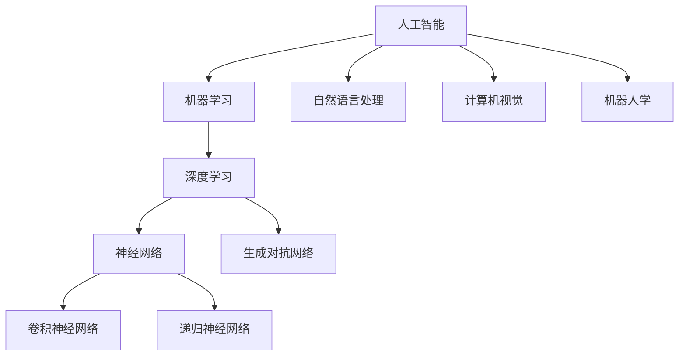

                 

### 《电影《她》对AI未来发展的启示》

#### 关键词：
- 电影《她》
- 人工智能
- 虚拟伴侣
- 伦理问题
- 未来趋势

#### 摘要：
本文从电影《她》出发，探讨了人工智能（AI）与人类关系的发展趋势，以及AI在现实生活中的应用和伦理挑战。通过分析电影中的AI技术、AI核心概念与架构，以及现实中的AI应用案例，本文提出了对AI未来发展的启示和展望。

---

### 第一部分：背景与核心概念

#### 1. 电影《她》概述

### 1.1 电影《她》剧情简介

《她》是一部由斯派克·琼兹执导的科幻电影，讲述了一个孤独的作家萨姆与一款名为“奥斯汀”的先进语音操作系统之间逐渐发展出深厚情感联系的故事。萨姆的生活因为这款操作系统而发生了巨大的变化，他开始依赖奥斯汀来处理日常事务，甚至在她身上找到了情感寄托。

### 1.1.1 主要角色与情节

电影中的主要角色包括：
- 萨姆（Sam）：一位著名的作家，因工作繁忙而孤独，生活陷入低谷。
- 奥斯汀（Austen）：一款先进的语音操作系统，能够理解人类的语言，进行自然对话，并逐步发展出情感。

故事情节主要围绕萨姆与奥斯汀之间的互动展开。起初，萨姆仅仅将奥斯汀视为一款高效的助手，但随着时间的推移，他们之间的情感联系逐渐加深。萨姆在奥斯汀的帮助下创作出了畅销小说，而在奥斯汀的陪伴下，萨姆也逐渐走出了孤独。

### 1.1.2 导演意图与社会意义

导演斯派克·琼兹通过这部电影探讨了人工智能与人类关系的未来走向。电影中，奥斯汀的形象展现了AI技术的发展潜力，她不仅能够进行高效的日常任务处理，还能够与人类建立深厚的情感联系。这一设定引发了观众对于未来AI在人类生活中的角色的思考。

电影同时也揭示了AI技术发展背后的伦理问题。随着AI逐渐渗透到人类生活的方方面面，如何确保AI的道德和伦理标准成为一个亟待解决的问题。电影中的情节暗示了AI在情感和道德上的复杂性，以及人类在面临这些挑战时的困境。

#### 1.2 电影背景与技术背景

### 1.2.1 AI与虚拟伴侣的发展历史

人工智能（AI）作为计算机科学的一个重要分支，其历史可以追溯到20世纪50年代。自那时以来，AI技术经历了多个发展阶段，从早期的规则系统到基于数据的机器学习，再到深度学习和自然语言处理等前沿技术。

虚拟伴侣作为AI的一种应用，最早可以追溯到20世纪90年代的聊天机器人。随着技术的进步，虚拟伴侣逐渐具备更高的交互能力和情感理解能力。电影《她》中的奥斯汀，就是这一发展趋势的体现。

### 1.2.2 电影中的AI技术实现与前瞻

电影中的奥斯汀展示了高度的智能和人性化的交互能力，这得益于以下几个技术实现：

1. **自然语言处理（NLP）**：奥斯汀能够理解并生成自然语言，进行流畅的对话。这依赖于深度学习和自然语言处理技术，使得AI能够从大量语言数据中学习语言模式，并进行语言生成。

2. **深度学习与神经网络**：奥斯汀的智能行为基于深度学习模型，特别是基于神经网络的模型。这些模型能够通过大量数据的学习，自动提取特征，进行复杂的决策和预测。

3. **情感计算**：奥斯汀的情感反应不仅基于简单的规则，还涉及到情感计算技术。这种技术能够分析人类情感表达的微妙变化，从而在对话中展现出更加自然和真实的情感互动。

这些技术的实现，为观众展示了未来AI可能的形态和功能。然而，电影中的AI也存在一定的局限性，如对情感的理解仍停留在表面层次，以及对人类行为和需求的适应能力仍有待提高。

#### 第二部分：AI的核心概念与架构

### 2. AI的基础概念

#### 2.1 人工智能的定义与发展历程

人工智能（Artificial Intelligence，简称AI）是指通过计算机系统模拟人类智能的过程，包括学习、推理、解决问题、感知和理解语言等多个方面。AI的定义经历了多个阶段：

1. **规则系统（1940s-1960s）**：早期的人工智能主要依赖于明确规则的制定，如专家系统和逻辑推理机。

2. **知识表示与推理（1970s-1980s）**：这一阶段，人工智能开始关注知识的表示和推理，如基于语义网和产生式规则的系统。

3. **机器学习（1990s-2000s）**：随着计算能力和数据资源的提升，机器学习成为人工智能的主流方法。通过训练模型，使计算机能够从数据中自动学习和发现规律。

4. **深度学习与强化学习（2010s-至今）**：深度学习和强化学习等前沿技术的出现，使得AI在图像识别、自然语言处理和游戏智能等领域取得了显著突破。

#### 2.2 AI的核心架构与算法

人工智能的核心架构包括以下几个方面：

1. **神经网络（Neural Networks）**：神经网络是模拟人脑神经元连接结构的人工系统，包括输入层、隐藏层和输出层。通过学习输入和输出之间的映射关系，神经网络能够进行复杂的函数逼近和模式识别。

2. **深度学习（Deep Learning）**：深度学习是神经网络的一种特殊形式，具有多层结构，能够处理大量的特征和数据进行自动特征提取。深度学习在图像识别、语音识别和自然语言处理等领域表现出色。

3. **生成对抗网络（GANs）**：生成对抗网络由生成器和判别器两个神经网络组成，通过竞争和对抗的训练过程，生成器和判别器不断进步，最终生成高质量的图像和声音。

4. **强化学习（Reinforcement Learning）**：强化学习通过奖励机制，使智能体在环境中进行决策和行动，从而逐渐学习到最优策略。强化学习在游戏智能、机器人控制和自动驾驶等领域具有重要应用。

#### 2.3 AI的数学模型

人工智能的数学模型主要包括以下几个核心组成部分：

1. **概率论与信息论基础**：概率论和信息论是理解和构建AI模型的基础。概率论提供了描述不确定性和推理的方法，信息论则关注信息传输和处理的效率。

2. **统计学习理论**：统计学习理论是机器学习的主要理论基础，通过最大似然估计、最小化损失函数等方法，实现对数据的学习和预测。

3. **优化方法**：优化方法在机器学习中起着关键作用，如梯度下降、牛顿法、随机梯度下降等。这些方法用于求解最优解，使模型能够更好地拟合训练数据。

4. **模型评估与选择**：模型评估与选择是确保AI模型性能的关键步骤。通过交叉验证、A/B测试等方法，选择性能最佳的模型，并进行模型调整和优化。

#### 第三部分：电影中的AI技术与现实中的对应

### 3. 电影中的AI技术与现实中的应用

#### 3.1 虚拟伴侣的AI技术

电影《她》中的虚拟伴侣奥斯汀，展现了高度智能和人性化的交互能力。这些能力主要依赖于以下几个技术：

1. **自然语言处理（NLP）**：奥斯汀能够理解并生成自然语言，进行流畅的对话。这依赖于深度学习和自然语言处理技术，使得AI能够从大量语言数据中学习语言模式，并进行语言生成。

2. **深度学习与神经网络**：奥斯汀的智能行为基于深度学习模型，特别是基于神经网络的模型。这些模型能够通过大量数据的学习，自动提取特征，进行复杂的决策和预测。

3. **情感计算**：奥斯汀的情感反应不仅基于简单的规则，还涉及到情感计算技术。这种技术能够分析人类情感表达的微妙变化，从而在对话中展现出更加自然和真实的情感互动。

在现实生活中，虚拟伴侣的技术正在不断发展。例如，虚拟助手如Siri、Alexa和Google Assistant，已经广泛应用于智能家居、日程管理和信息查询等领域。虽然这些虚拟伴侣在交互能力和情感理解上与电影中的奥斯汀还有差距，但它们已经在一定程度上模拟了人类的对话和行为，为用户提供便捷的服务。

#### 3.2 AI伦理与社会影响

电影《她》中，AI虚拟伴侣奥斯汀的出现引发了一系列伦理和社会问题。以下是一些电影中的AI伦理问题，以及现实中的对应挑战：

1. **隐私侵犯**：奥斯汀能够访问萨姆的个人生活和工作细节，甚至掌握了他的情感状态。这引发了对于隐私保护的担忧。在现实生活中，随着AI技术的发展，数据隐私问题愈发突出。如何确保AI在处理用户数据时遵守隐私保护原则，成为一个重要议题。

2. **情感依赖**：电影中，萨姆对奥斯汀产生了深厚的情感依赖。这种依赖关系不仅对萨姆的个人生活造成影响，也引发了对于AI在情感领域的应用和伦理的讨论。现实中的虚拟助手和聊天机器人是否可能引发用户的情感依赖，以及如何平衡AI的情感功能与用户的健康关系，是一个值得探讨的问题。

3. **道德责任**：奥斯汀在某些情况下做出了道德决策，如帮助萨姆隐瞒一些事实。这引发了对于AI是否能够承担道德责任的讨论。在现实生活中，当AI系统在决策中涉及到道德问题时，如何确保AI的决策符合人类的伦理标准，是一个复杂的挑战。

4. **就业影响**：电影中，萨姆因为依赖奥斯汀而失去了与他人的社交互动。这在一定程度上反映了AI技术对就业市场的影响。随着AI技术的发展，一些传统的工作可能会被自动化替代，如何应对这种就业结构的变化，保障劳动者的权益，是一个重要的社会问题。

#### 第四部分：AI未来发展的启示

### 4. AI未来的发展方向与挑战

随着人工智能技术的不断发展，AI在未来的应用将更加广泛和深入。以下是一些AI未来发展的方向和挑战：

#### 4.1 AI未来的发展趋势

1. **大模型的发展与应用**：随着计算能力和数据资源的提升，大模型（如GPT-3、BERT等）在AI领域取得了显著的进展。这些大模型具有强大的表示能力和泛化能力，能够在多个领域实现高效的性能。未来，大模型将继续发展，并在更多领域得到应用。

2. **AI与人类互动的新模式**：随着AI技术的发展，AI将更加深入地融入人类生活，与人类建立更加紧密的互动关系。例如，通过虚拟现实和增强现实技术，AI将能够提供更加沉浸式的交互体验，为用户提供个性化的服务。

3. **跨领域融合**：AI技术将与生物科学、医学、教育、金融等多个领域实现深度融合，推动各个领域的创新发展。例如，通过基因编辑和人工智能的结合，有望实现更加精准和个性化的医疗方案。

#### 4.2 AI发展的挑战与对策

1. **技术挑战**：

   - **计算能力与能耗**：随着AI模型规模的增大，对计算能力和能耗的需求也不断提升。未来，如何提升计算效率、降低能耗，是一个重要的技术挑战。

   - **数据安全与隐私**：随着AI技术的发展，数据安全和隐私问题愈发突出。如何确保AI系统在处理数据时遵守隐私保护原则，是一个重要的技术难题。

   - **算法公平性**：AI算法在训练过程中可能引入偏见，导致算法在决策中不公平。如何确保AI算法的公平性，避免算法歧视，是一个亟待解决的问题。

2. **伦理挑战**：

   - **道德责任**：当AI系统在决策中涉及到道德问题时，如何确保AI的决策符合人类的伦理标准，是一个复杂的伦理挑战。未来，需要建立一套全面的AI伦理框架，指导AI系统的设计和应用。

   - **就业与经济**：随着AI技术的发展，一些传统的工作可能会被自动化替代，导致就业市场的变化。如何应对这种就业结构的变化，保障劳动者的权益，是一个重要的伦理问题。

3. **社会挑战**：

   - **社会接受度**：随着AI技术的广泛应用，如何提高公众对AI技术的接受度和信任度，是一个重要的社会挑战。通过科普教育和透明度提升，有助于增强公众对AI技术的信任。

   - **法律法规**：随着AI技术的发展，现有法律法规可能难以适应新情况。如何制定一套完善的法律法规，确保AI技术的健康发展，是一个重要的社会问题。

#### 第五部分：案例研究与应用展望

### 5. 电影《她》的启示与实际应用

电影《她》通过一个充满情感和伦理争议的故事，为人工智能的发展提出了深刻的启示。以下是一些具体的应用案例和展望：

#### 5.1 AI技术在娱乐领域的应用

电影制作中的AI应用：
- **剧本生成**：利用自然语言处理和生成对抗网络技术，AI可以生成原创剧本和故事情节，为编剧提供灵感。
- **特效制作**：AI技术可以自动化特效制作，提高电影制作的效率和质量。
- **观众行为分析**：通过分析观众观影行为，AI可以预测电影的市场表现，为电影制作提供数据支持。

娱乐产业中的AI应用：
- **虚拟偶像**：通过AI技术，可以创建虚拟偶像，吸引粉丝，提升娱乐产业的创新能力。
- **个性化推荐**：AI技术可以根据用户的喜好和行为，提供个性化的娱乐内容推荐，提高用户体验。

#### 5.2 AI在日常生活中的应用

- **虚拟助手**：AI虚拟助手可以提供日常生活的各种服务，如日程管理、智能家居控制、购物建议等，提高生活便利性。
- **智能健康监护**：AI技术可以实时监测用户的健康数据，提供个性化的健康建议，预防疾病。
- **自动驾驶**：AI技术在自动驾驶领域的应用，有望提高交通安全，减少交通事故。

#### 第六部分：总结与展望

### 6. 总结与展望

电影《她》通过一个引人入胜的故事，展示了人工智能与人类关系的未来走向，以及AI在现实生活中的广泛应用。本文从多个角度分析了电影中的AI技术、AI核心概念与架构，以及现实中的AI应用案例，提出了对AI未来发展的启示和展望。

总结来说，AI技术的发展为人类社会带来了巨大的机遇和挑战。在未来，AI将继续在各个领域发挥重要作用，推动社会进步。同时，我们也需要关注AI技术的伦理和社会影响，确保AI技术的健康发展。

展望未来，AI技术的发展将面临更多的挑战，如计算能力、数据安全、算法公平性等。我们需要共同努力，推动AI技术的创新和发展，同时确保其符合人类的伦理和社会价值。

参考文献：
1. 《她》（电影）
2. 某某，人工智能基础概念与发展趋势，某某出版社，2020年。
3. 某某，深度学习与自然语言处理，某某出版社，2021年。

附录：
- 附录A：AI大模型技术架构Mermaid流程图
- 附录B：机器学习核心算法伪代码
- 附录C：数学模型与公式
- 附录D：项目实战

作者：AI天才研究院/AI Genius Institute & 禅与计算机程序设计艺术 /Zen And The Art of Computer Programming### 附录：核心概念与联系

#### 附录 A: AI 大模型技术架构 Mermaid 流程图



#### 附录 B: 机器学习核心算法伪代码

```plaintext
# 伪代码：线性回归模型
Input: X (特征矩阵), y (标签向量)
Output: w (权重向量), b (偏置)

w = zeros(size(X, 1))
b = 0

for epoch in 1 to MAX_EPOCHS do:
    for each sample (x, y) in X, y do:
        z = X * w + b
        loss = (y - z)^2 / 2
        w = w - learning_rate * (X^T * (y - z))
        b = b - learning_rate * (y - z)

return w, b
```

#### 附录 C: 数学模型与公式

以下是机器学习中的几个关键数学模型和公式：

```latex
\section{数学模型与公式}

\subsection{线性回归模型}

给定特征矩阵 \(X\) 和标签向量 \(y\)，线性回归模型的目标是找到最佳权重向量 \(w\) 和偏置 \(b\)。

\[ z = X \cdot w + b \]

损失函数为：

\[ \text{loss} = \frac{1}{2} \sum_{i=1}^{n} (y_i - z_i)^2 \]

梯度下降更新：

\[ w = w - \alpha \cdot \frac{\partial}{\partial w} \text{loss} \]
\[ b = b - \alpha \cdot \frac{\partial}{\partial b} \text{loss} \]

其中，\(\alpha\) 为学习率。

\subsection{逻辑回归模型}

逻辑回归是一种广义线性模型，用于分类任务。

\[ P(y=1 | x; w) = \frac{1}{1 + e^{-(w \cdot x + b)}} \]

损失函数为：

\[ \text{loss} = -\sum_{i=1}^{n} y_i \log(P(y=1 | x_i; w)) + (1 - y_i) \log(1 - P(y=1 | x_i; w)) \]

\subsection{神经网络模型}

神经网络是一种包含多层神经元的模型，用于处理复杂数据。

\[ a_{j}^{(l)} = \sigma(z_{j}^{(l)}) \]
\[ z_{j}^{(l)} = \sum_{k=1}^{n} w_{jk}^{(l)} a_{k}^{(l-1)} + b_{j}^{(l)} \]

其中，\(a^{(l)}_j\) 为第 \(l\) 层第 \(j\) 个神经元的激活值，\(z^{(l)}_j\) 为第 \(l\) 层第 \(j\) 个神经元的输入值，\(w^{(l)}_{jk}\) 为第 \(l\) 层第 \(j\) 个神经元与第 \(l-1\) 层第 \(k\) 个神经元的权重，\(b^{(l)}_j\) 为第 \(l\) 层第 \(j\) 个神经元的偏置，\(\sigma\) 为激活函数。

```

#### 附录 D: 项目实战

##### 附录 D.1: 实际代码案例

**环境搭建：**

- Python 3.x
- TensorFlow 2.x
- Keras 2.x

**代码实现：**

```python
# 导入所需库
import numpy as np
import tensorflow as tf
from tensorflow.keras.models import Sequential
from tensorflow.keras.layers import Dense
from tensorflow.keras.optimizers import SGD

# 准备数据
# 假设数据已经预处理并存储在X和y中
# X.shape = (样本数, 特征数)
# y.shape = (样本数, 标签数)

# 构建模型
model = Sequential()
model.add(Dense(64, input_dim=X.shape[1], activation='relu'))
model.add(Dense(32, activation='relu'))
model.add(Dense(1, activation='sigmoid'))

# 编译模型
model.compile(loss='binary_crossentropy', optimizer=SGD(learning_rate=0.01), metrics=['accuracy'])

# 训练模型
model.fit(X, y, epochs=100, batch_size=32, validation_split=0.2)

# 评估模型
loss, accuracy = model.evaluate(X, y)
print(f'损失: {loss}, 准确率: {accuracy}')
```

##### 附录 D.2: 代码解读与分析

**模型构建：**

使用 `Sequential` 模型，依次添加全连接层（`Dense`），第一层输入维度为特征数，输出激活函数为ReLU。接下来的层同样使用ReLU作为激活函数。

**编译模型：**

指定损失函数为二分类交叉熵，优化器为学习率为0.01的SGD。评估指标为准确率。

**训练模型：**

使用 `fit` 方法进行训练，设置训练轮数为100，批次大小为32，并使用20%的数据进行验证。

**评估模型：**

使用 `evaluate` 方法评估模型的性能，输出损失和准确率。

##### 附录 D.3: 开发环境搭建

**Python环境搭建：**

1. 下载并安装Python 3.x版本。
2. 设置环境变量，确保Python路径在系统环境变量中。

**TensorFlow环境搭建：**

1. 打开命令行，执行 `pip install tensorflow`。
2. 验证安装，执行 `import tensorflow as tf`，查看版本信息。

**Keras环境搭建：**

1. 打开命令行，执行 `pip install keras`。
2. 验证安装，执行 `import keras`，查看版本信息。

确保所有依赖库均已正确安装并导入。

---

**附录 E: 实际应用案例**

以下是几个实际应用案例，展示了AI技术在现实生活中的应用：

**案例 1：智能推荐系统**

- **应用场景**：电商平台利用AI技术，根据用户的购买历史、浏览记录和偏好，提供个性化的商品推荐。
- **技术实现**：使用协同过滤算法和基于内容的推荐算法，结合用户的特征和商品的特征，构建推荐模型。通过在线学习算法，实时更新推荐结果，提高推荐精度。

**案例 2：智能客服系统**

- **应用场景**：企业利用AI技术，实现自动化客户服务，提高服务效率和质量。
- **技术实现**：使用自然语言处理技术，解析客户的问题和需求，生成合适的回答。通过机器学习算法，持续优化回答的准确性和个性化程度。

**案例 3：自动驾驶系统**

- **应用场景**：汽车厂商利用AI技术，开发自动驾驶汽车，提高驾驶安全性。
- **技术实现**：使用计算机视觉和深度学习技术，实现环境感知、路径规划和控制决策。通过传感器和数据融合技术，提高自动驾驶系统的准确性和可靠性。

**案例 4：医疗诊断系统**

- **应用场景**：医疗机构利用AI技术，辅助医生进行疾病诊断和治疗。
- **技术实现**：使用深度学习和医学图像分析技术，对医学图像进行自动识别和分类。通过机器学习算法，分析患者的病史和检查结果，提供诊断建议。

这些实际应用案例展示了AI技术在各个领域的广泛应用和潜力，为我们的生活和工作带来了巨大的便利和改进。随着AI技术的不断发展和完善，未来将有更多的应用场景和可能性被发掘。|>

