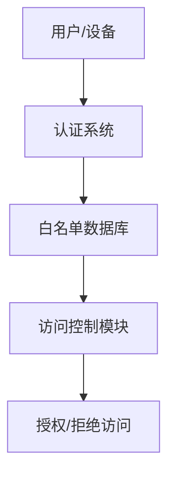
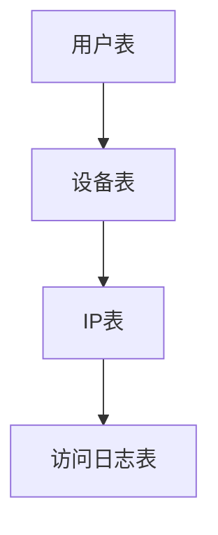
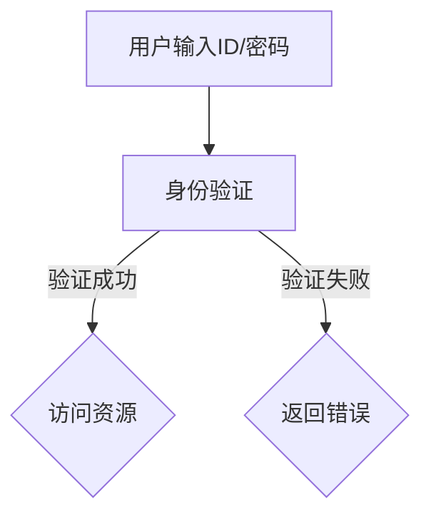

                 

# 白名单的实现细节

白名单（Whitelist）是一种常见的网络安全策略，用于控制对系统或资源的访问，确保只有预授权的用户或实体才能进行操作。本文将深入探讨白名单的实现细节，包括其基本架构、核心算法、加密与安全性、权限管理以及扩展应用。

## 2.1 白名单的基本架构

白名单的基本架构包括用户/设备、认证系统、白名单数据库和访问控制模块。以下是一个简化的架构图：



### 2.1.1 架构概述

用户或设备在尝试访问受保护资源时，首先需要通过认证系统进行身份验证。认证系统会查询白名单数据库，以确认用户或设备是否在白名单中。如果用户或设备在白名单中，访问控制模块将允许其访问资源；否则，拒绝访问。

### 2.1.2 数据库设计

白名单数据库通常包含用户信息、设备信息、IP地址信息等。以下是一个简化的数据库表结构设计：



- **用户表**：存储用户的ID、密码、角色等信息。
- **设备表**：存储设备的ID、型号、所有者等信息。
- **IP表**：存储IP地址、归属地、使用状态等信息。
- **访问日志表**：记录用户访问行为，用于审计和监控。

### 2.1.3 访问控制机制

访问控制模块负责处理用户的访问请求，并根据白名单数据库中的信息进行授权或拒绝访问。以下是一个简化的访问控制流程：



用户输入ID和密码后，认证系统会验证用户身份。如果验证成功，用户将被授权访问资源；如果验证失败，系统会返回错误信息。

## 2.2 白名单的核心算法

白名单的核心算法主要包括用户认证算法、IP地址认证算法和设备认证算法。以下是对每个算法的概述：

### 2.2.1 用户认证算法

用户认证算法的目的是验证用户的身份。以下是一个简化的伪代码：

```python
def authenticate_user(username, password):
    # 从数据库查询用户信息
    user = query_user_by_username(username)
    
    # 验证密码
    if verify_password(user.password, password):
        return "验证成功"
    else:
        return "验证失败"
```

### 2.2.2 IP地址认证算法

IP地址认证算法的目的是验证IP地址是否在白名单中。以下是一个简化的伪代码：

```python
def authenticate_ip(ip_address):
    # 从数据库查询IP地址信息
    ip = query_ip_by_address(ip_address)
    
    # 验证IP地址
    if ip in whitelist:
        return "验证成功"
    else:
        return "验证失败"
```

### 2.2.3 设备认证算法

设备认证算法的目的是验证设备是否在白名单中。以下是一个简化的伪代码：

```python
def authenticate_device(device_id):
    # 从数据库查询设备信息
    device = query_device_by_id(device_id)
    
    # 验证设备
    if device in whitelist:
        return "验证成功"
    else:
        return "验证失败"
```

## 2.3 白名单的加密与安全性

白名单的加密与安全性是确保数据传输和存储安全的关键。以下是一些关键点：

### 2.3.1 数据加密技术

数据加密技术包括对称加密和非对称加密。对称加密使用相同的密钥进行加密和解密，如AES；非对称加密使用一对密钥进行加密和解密，如RSA。

### 2.3.2 密码学基础

密码学基础包括哈希函数（如SHA-256）、数字签名和认证协议（如SSL/TLS）。

### 2.3.3 安全传输协议

安全传输协议如HTTPS和SSH确保数据在传输过程中不被窃听或篡改。

## 2.4 白名单的权限管理

白名单的权限管理包括权限体系设计、权限分配与回收以及权限冲突处理。

### 2.4.1 权限体系设计

权限体系设计包括角色定义、权限分配和权限验证。角色定义是确定用户所属的角色，权限分配是将权限分配给角色，权限验证是在用户尝试访问资源时验证用户是否有相应的权限。

### 2.4.2 权限分配与回收

权限分配是将权限分配给用户或角色，权限回收是将权限从用户或角色中移除。以下是一个简化的伪代码：

```python
def assign_permission(user, permission):
    # 将权限分配给用户
    user.permissions.add(permission)

def revoke_permission(user, permission):
    # 从用户中回收权限
    user.permissions.remove(permission)
```

### 2.4.3 权限冲突处理

权限冲突处理是在多个角色拥有不同权限时如何处理冲突。常见的方法是使用“最小权限原则”，即用户只能拥有执行任务所需的最低权限。

## 2.5 白名单的扩展应用

白名单的应用领域广泛，包括物联网、云服务和企业内部网。

### 2.5.1 白名单在物联网中的应用

在物联网中，白名单可以确保只有经过认证的设备可以连接到物联网平台，从而防止未授权设备访问。

### 2.5.2 白名单在云服务中的应用

在云服务中，白名单可以用于控制用户对云资源的访问，确保云资源的安全性和可靠性。

### 2.5.3 白名单在企业内部网中的应用

在企业内部网中，白名单可以用于控制员工访问内部系统或资源的权限，确保企业数据的安全性。

通过上述内容，我们可以看到白名单在网络安全和控制访问方面的重要性。在下一部分中，我们将探讨白名单在网络安全中的应用，以及如何与黑名单协同工作来提高系统的安全性。


