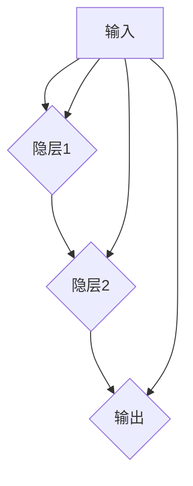
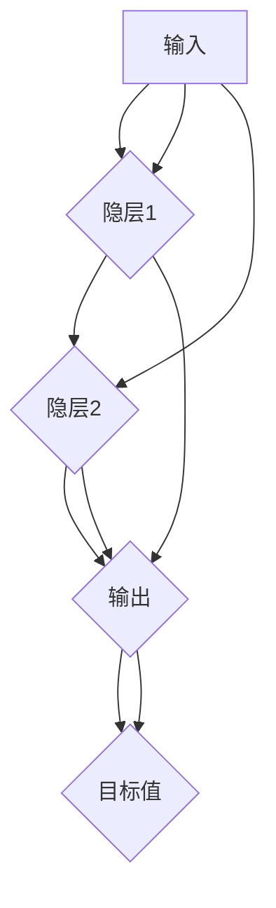
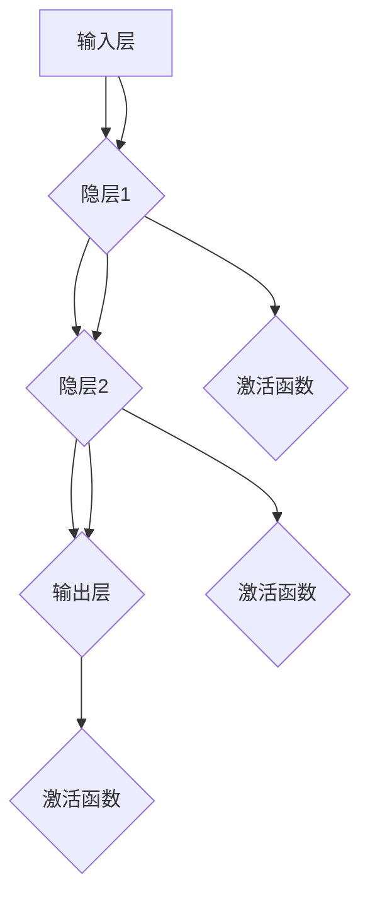
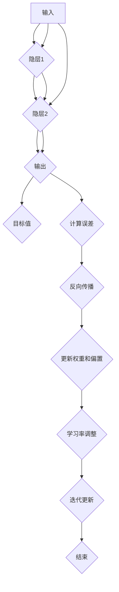
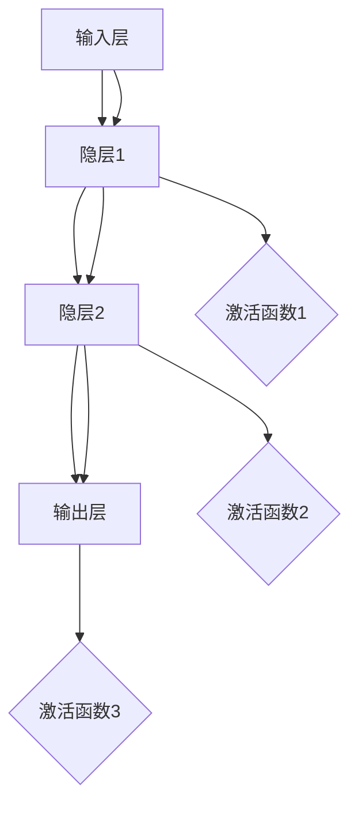
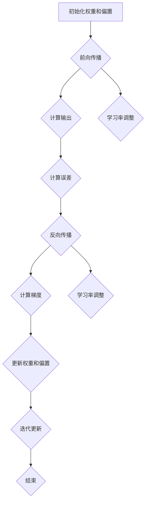
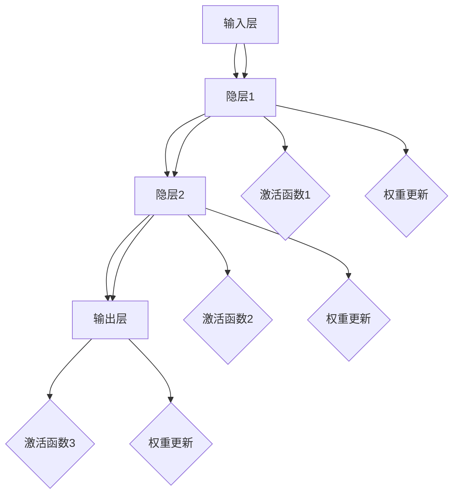
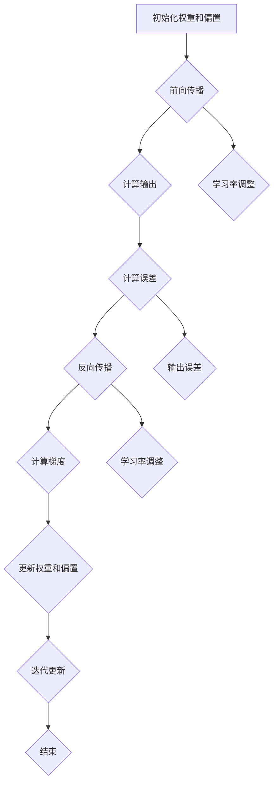

                 

# 文章标题
《皮茨与神经网络的早期发展》

> 关键词：皮茨、神经网络、早期发展、反向传播、手写数字识别

> 摘要：本文深入探讨了神经网络的早期发展，特别是马文·M·皮茨在神经网络领域的重要贡献。文章从神经网络的起源、基本理论、皮茨的神经网络模型、早期应用、挑战与未来展望等方面进行了系统性的分析，并给出了详细的数学模型与算法讲解，以及神经网络图像识别的实际案例。

## 第一部分：引言与背景

### 1.1 引言

神经网络是一种模仿人脑神经元结构和功能的信息处理系统。自1980年代以来，随着计算能力的提升和算法的创新，神经网络在众多领域取得了显著的成果。然而，神经网络的发展并非一帆风顺，它的早期阶段充满了挑战和探索。

神经网络的起源可以追溯到1940年代，当时心理学家和数学家开始尝试模拟人脑的神经元结构和工作原理。1950年代和1960年代，神经网络的研究迎来了第一个高潮，其中最著名的模型是感知机（Perceptron）。尽管感知机在解决某些简单问题上表现出色，但它无法解决更为复杂的问题，如异或问题（XOR problem）。这一局限性促使研究者继续探索更加复杂的神经网络模型。

### 1.2 神经网络的发展历程

神经网络的发展历程可以分为以下几个阶段：

1. **早期神经网络（1940s-1960s）**：这一阶段的主要成果包括感知机模型的提出和训练算法的发展。感知机模型是一种线性二分类模型，它的成功为神经网络的研究奠定了基础。
2. **线性模型与多层感知机（1960s-1980s）**：感知机模型在解决非线性问题上的局限性促使研究者提出了多层感知机（MLP）。多层感知机通过引入隐层，能够在处理非线性问题上表现出色。然而，多层感知机的训练算法（如反向传播算法）的计算复杂度较高，限制了其应用。
3. **深度学习与大数据（1980s-2010s）**：随着计算能力的提升和大数据技术的发展，深度学习逐渐成为神经网络研究的主流方向。深度学习模型通过增加隐层数量，能够在图像识别、自然语言处理等领域取得突破性进展。
4. **当前的神经网络（2010s-至今）**：当前，神经网络在各个领域得到了广泛应用，特别是在计算机视觉、自然语言处理和语音识别等领域。深度学习模型的持续优化和硬件加速技术的应用，使得神经网络在性能和效率上不断提升。

### 1.3 皮茨的贡献

马文·M·皮茨（Marvin M. Pitts）是神经网络领域的先驱之一。他在1947年提出了一个基于逻辑运算的神经网络模型，即皮茨神经网络。皮茨神经网络是一种线性二分类模型，它通过加权求和和阈值运算来实现逻辑运算。皮茨神经网络的提出标志着神经网络研究的重大进展，为后来的多层感知机和深度学习模型奠定了基础。

皮茨的贡献不仅体现在他的神经网络模型上，还在于他对神经网络训练算法的研究。皮茨提出了反向传播算法的早期思想，即通过计算输出误差来调整网络权重。这一思想为后来的反向传播算法提供了理论基础。

### 1.4 神经网络的重要性

神经网络在信息处理领域具有重要的作用，主要体现在以下几个方面：

1. **图像识别与计算机视觉**：神经网络在图像识别任务中取得了显著的成果，特别是在物体检测、图像分类和图像生成等领域。神经网络模型如卷积神经网络（CNN）在ImageNet图像识别挑战中取得了突破性进展，使得图像识别准确率大幅提升。
2. **自然语言处理**：神经网络在自然语言处理领域也发挥了重要作用，如机器翻译、情感分析和文本生成等。循环神经网络（RNN）和Transformer模型在自然语言处理任务中取得了优异的性能。
3. **语音识别与语音合成**：神经网络在语音识别和语音合成任务中取得了显著成果，使得语音交互技术得到了广泛应用。深度神经网络模型如深度信念网络（DBN）和长短时记忆网络（LSTM）在语音识别和语音合成任务中表现出色。

总之，神经网络作为一种强大的信息处理工具，在各个领域都取得了重要的应用和突破。随着技术的不断进步，神经网络将在更多领域发挥重要作用。

## 第二部分：神经网络的早期理论

### 2.1 神经网络的基本概念

神经网络（Neural Network，简称NN）是一种模拟生物神经元结构和功能的计算模型。神经网络由大量的简单处理单元（即神经元）组成，这些神经元通过加权连接形成复杂的网络结构。神经网络的主要目的是通过学习输入和输出数据之间的关系，实现数据的分类、回归、预测等任务。

#### 2.1.1 神经元模型

神经元是神经网络的基本处理单元，类似于生物神经元。神经元接收输入信号，通过加权求和后应用激活函数，产生输出信号。神经元的计算公式如下：

$$
a_i = f(\sum_{j=1}^{n} w_{ij} \cdot x_j + b_i)
$$

其中，$a_i$为神经元$i$的输出，$x_j$为神经元$j$的输入，$w_{ij}$为神经元$i$到神经元$j$的权重，$b_i$为神经元$i$的偏置，$f$为激活函数。

常见的激活函数包括：

1. **Sigmoid函数**：
   $$ f(x) = \frac{1}{1 + e^{-x}} $$
   Sigmoid函数将输入值映射到$(0, 1)$区间，常用于二分类问题。

2. **ReLU函数**：
   $$ f(x) = \max(0, x) $$
   ReLU函数在$x \geq 0$时输出$x$，在$x < 0$时输出0，具有计算简单和不易梯度消失的优点。

3. **Tanh函数**：
   $$ f(x) = \frac{e^x - e^{-x}}{e^x + e^{-x}} $$
   Tanh函数将输入值映射到$(-1, 1)$区间，具有对称性和平滑性。

#### 2.1.2 神经网络的层次结构

神经网络通常由多个层次组成，包括输入层、隐层和输出层。

1. **输入层**：输入层接收外部输入数据，每个输入都可以表示为一个向量。

2. **隐层**：隐层位于输入层和输出层之间，每个隐层都包含多个神经元。隐层的神经元接收前一层的输出，并经过加权求和后应用激活函数，产生新的输出。

3. **输出层**：输出层产生最终输出结果，用于分类、回归等任务。

神经网络的层次结构可以表示为：

$$
\text{输入层} \rightarrow \text{隐层1} \rightarrow \text{隐层2} \rightarrow \cdots \rightarrow \text{输出层}
$$

#### 2.1.3 神经网络的训练算法

神经网络的训练过程是通过学习输入和输出数据之间的关系，调整网络权重和偏置，以最小化输出误差。常见的训练算法包括：

1. **前向传播（Forward Propagation）**：前向传播是指将输入数据通过神经网络，逐层计算每个神经元的输出。在前向传播过程中，网络会根据当前权重和偏置计算输出，并记录每个神经元的输入和输出。

2. **反向传播（Backpropagation）**：反向传播是指根据输出误差，逐层计算每个参数的梯度，并更新权重和偏置。反向传播是神经网络训练的核心算法，通过计算输出误差对每个参数的梯度，可以实现权重的自适应调整。

反向传播算法的步骤如下：

1. **计算输出误差**：
   $$ E = \frac{1}{2} \sum_{i} (y_i - \hat{y}_i)^2 $$
   其中，$y_i$为实际输出，$\hat{y}_i$为预测输出。

2. **计算梯度**：
   $$ \frac{\partial E}{\partial w_{ij}} = \delta_j \cdot a_i $$
   $$ \frac{\partial E}{\partial b_i} = \delta_i $$
   其中，$\delta_j = (y_j - \hat{y}_j) \cdot \frac{df}{dx}$，$a_i$为神经元$i$的输入。

3. **更新权重和偏置**：
   $$ w_{ij} := w_{ij} - \alpha \cdot \frac{\partial E}{\partial w_{ij}} $$
   $$ b_i := b_i - \alpha \cdot \frac{\partial E}{\partial b_i} $$
   其中，$\alpha$为学习率。

通过重复执行前向传播和反向传播，神经网络可以逐步优化权重和偏置，提高预测准确性。

### 2.2 皮茨的理论贡献

马文·M·皮茨（Marvin M. Pitts）是神经网络领域的先驱之一，他的贡献为后来的神经网络研究奠定了基础。皮茨在1947年提出了一个基于逻辑运算的神经网络模型，即皮茨神经网络（Pitts Network）。

#### 2.2.1 皮茨的神经网络模型

皮茨神经网络是一种线性二分类模型，它通过加权求和和阈值运算来实现逻辑运算。皮茨神经网络的计算公式如下：

$$
\text{输出} = \text{sign}(\sum_{i=1}^{n} w_i \cdot x_i + b)
$$

其中，$x_i$为输入特征，$w_i$为权重，$b$为偏置，$\text{sign}(x)$为符号函数，当$x > 0$时输出1，当$x \leq 0$时输出-1。

皮茨神经网络的模型结构可以表示为：

$$
\text{输入} \rightarrow \text{加权求和} \rightarrow \text{阈值运算} \rightarrow \text{输出}
$$

#### 2.2.2 皮茨的神经网络训练算法

皮茨提出了反向传播算法的早期思想，即通过计算输出误差来调整网络权重。尽管皮茨的神经网络训练算法与后来的反向传播算法有所不同，但它为反向传播算法的提出奠定了基础。

皮茨的神经网络训练算法的步骤如下：

1. **初始化权重和偏置**：
   $$ w_i \sim U[-1, 1] $$
   $$ b \sim U[-1, 1] $$

2. **前向传播**：
   $$ z = \sum_{i=1}^{n} w_i \cdot x_i + b $$
   $$ \text{输出} = \text{sign}(z) $$

3. **计算输出误差**：
   $$ E = \sum_{i} (y_i - \text{输出})^2 $$
   其中，$y_i$为实际输出，$\text{输出}$为预测输出。

4. **反向传播**：
   $$ \Delta w_i = \frac{\partial E}{\partial w_i} $$
   $$ \Delta b = \frac{\partial E}{\partial b} $$

5. **更新权重和偏置**：
   $$ w_i := w_i - \alpha \cdot \Delta w_i $$
   $$ b := b - \alpha \cdot \Delta b $$
   其中，$\alpha$为学习率。

通过重复执行前向传播和反向传播，皮茨神经网络可以逐步优化权重和偏置，提高预测准确性。

#### 2.2.3 皮茨对神经网络理论的贡献

皮茨的贡献主要体现在以下几个方面：

1. **提出了皮茨神经网络模型**：皮茨神经网络是一种线性二分类模型，它通过加权求和和阈值运算来实现逻辑运算。皮茨神经网络的提出为后来的多层感知机和深度学习模型奠定了基础。

2. **提出了反向传播算法的早期思想**：皮茨提出了通过计算输出误差来调整网络权重和偏置的思想，这一思想为后来的反向传播算法的提出奠定了基础。

3. **推动了神经网络的研究**：皮茨的研究成果激发了神经网络领域的研究热情，为后来的神经网络研究奠定了基础。皮茨的神经网络模型和反向传播算法成为了神经网络研究的重要里程碑。

总之，皮茨在神经网络领域的贡献为神经网络的研究和发展做出了重要贡献。他的研究成果不仅为后来的研究者提供了理论基础，也为现代神经网络技术的发展奠定了基础。

### 2.3 神经网络的层次结构

神经网络的层次结构是神经网络模型的重要组成部分，它决定了神经网络的复杂性和性能。神经网络的层次结构通常包括输入层、隐层和输出层。

#### 2.3.1 输入层

输入层是神经网络的第一个层次，它接收外部输入数据。在图像识别任务中，输入层通常接收图像的像素值；在自然语言处理任务中，输入层通常接收单词的词向量表示。

输入层的每个神经元都对应一个输入特征。例如，在图像识别任务中，一个28x28像素的图像会被展平为一个784维的向量，每个维度对应图像中的一个像素值。

#### 2.3.2 隐层

隐层是神经网络的核心层次，它位于输入层和输出层之间。隐层的神经元接收前一层的输出，并经过加权求和后应用激活函数，产生新的输出。隐层的层数和每层的神经元数量可以根据任务的需求进行调整。

隐层的作用是提取和变换输入特征，为输出层提供更加丰富的信息。通过多层的隐层，神经网络可以学习到更加复杂的特征和模式。

#### 2.3.3 输出层

输出层是神经网络的最后一个层次，它产生最终输出结果。输出层的神经元数量和类型取决于任务的类型。例如，在二分类任务中，输出层通常只有一个神经元，用于输出预测的概率；在多分类任务中，输出层通常有多个神经元，每个神经元对应一个类别，输出该类别的概率。

输出层的作用是将神经网络学习到的特征映射到具体的任务结果。通过训练，输出层可以优化其参数，提高预测的准确性。

#### 2.3.4 神经网络的层次结构示例

以下是一个简单的神经网络层次结构示例，用于图像识别任务：

$$
\text{输入层} \rightarrow \text{隐层1} \rightarrow \text{隐层2} \rightarrow \cdots \rightarrow \text{输出层}
$$

- 输入层：接收28x28像素的图像，每个像素值作为输入特征。
- 隐层1：包含100个神经元，每个神经元接收输入层的输出，并经过加权求和后应用ReLU激活函数。
- 隐层2：包含50个神经元，每个神经元接收隐层1的输出，并经过加权求和后应用ReLU激活函数。
- 输出层：包含10个神经元，每个神经元对应一个数字类别，输出该类别的概率。

通过这样的层次结构，神经网络可以逐步提取和转换图像特征，最终输出预测结果。

### 2.4 神经网络的训练算法

神经网络的训练算法是神经网络模型学习输入和输出数据之间关系的过程。通过训练，神经网络可以调整其权重和偏置，提高预测准确性。常见的训练算法包括前向传播和反向传播。

#### 2.4.1 前向传播

前向传播是指将输入数据通过神经网络，逐层计算每个神经元的输出。在前向传播过程中，网络会根据当前权重和偏置计算输出，并记录每个神经元的输入和输出。

前向传播的步骤如下：

1. **初始化权重和偏置**：
   $$ w_i \sim U[-1, 1] $$
   $$ b_i \sim U[-1, 1] $$

2. **前向传播**：
   $$ z_i = \sum_{j} w_{ij} \cdot x_j + b_i $$
   $$ a_i = f(z_i) $$
   其中，$z_i$为神经元$i$的加权求和值，$a_i$为神经元$i$的输出，$f$为激活函数。

3. **计算输出**：
   $$ \hat{y} = f(z_L) $$
   其中，$z_L$为输出层的加权求和值，$\hat{y}$为预测输出。

#### 2.4.2 反向传播

反向传播是指根据输出误差，逐层计算每个参数的梯度，并更新权重和偏置。反向传播是神经网络训练的核心算法，通过计算输出误差对每个参数的梯度，可以实现权重的自适应调整。

反向传播的步骤如下：

1. **计算输出误差**：
   $$ E = \frac{1}{2} \sum_{i} (y_i - \hat{y}_i)^2 $$
   其中，$y_i$为实际输出，$\hat{y}_i$为预测输出。

2. **计算梯度**：
   $$ \frac{\partial E}{\partial w_{ij}} = a_i \cdot \delta_j $$
   $$ \frac{\partial E}{\partial b_i} = \delta_i $$
   其中，$\delta_j = (y_j - \hat{y}_j) \cdot \frac{df}{dx}$，$a_i$为神经元$i$的输入。

3. **更新权重和偏置**：
   $$ w_{ij} := w_{ij} - \alpha \cdot \frac{\partial E}{\partial w_{ij}} $$
   $$ b_i := b_i - \alpha \cdot \frac{\partial E}{\partial b_i} $$
   其中，$\alpha$为学习率。

通过重复执行前向传播和反向传播，神经网络可以逐步优化权重和偏置，提高预测准确性。

### 2.5 神经网络的数学模型

神经网络的数学模型是神经网络模型的核心部分，它描述了神经网络的结构和功能。神经网络的数学模型主要包括输入层、隐层和输出层。

#### 2.5.1 输入层

输入层是神经网络的第一个层次，它接收外部输入数据。在图像识别任务中，输入层通常接收图像的像素值；在自然语言处理任务中，输入层通常接收单词的词向量表示。

输入层的每个神经元都对应一个输入特征。例如，在图像识别任务中，一个28x28像素的图像会被展平为一个784维的向量，每个维度对应图像中的一个像素值。

输入层的数学模型可以表示为：

$$
x = \begin{bmatrix} x_1 \\ x_2 \\ \vdots \\ x_n \end{bmatrix}
$$

其中，$x_i$为输入层的第$i$个神经元的输入。

#### 2.5.2 隐层

隐层是神经网络的核心层次，它位于输入层和输出层之间。隐层的神经元接收前一层的输出，并经过加权求和后应用激活函数，产生新的输出。隐层的层数和每层的神经元数量可以根据任务的需求进行调整。

隐层的数学模型可以表示为：

$$
\begin{aligned}
z_i &= \sum_{j} w_{ij} \cdot x_j + b_i \\
a_i &= f(z_i)
\end{aligned}
$$

其中，$z_i$为隐层第$i$个神经元的加权求和值，$a_i$为隐层第$i$个神经元的输出，$w_{ij}$为输入层到隐层的权重，$b_i$为隐层第$i$个神经元的偏置，$f$为激活函数。

#### 2.5.3 输出层

输出层是神经网络的最后一个层次，它产生最终输出结果。输出层的神经元数量和类型取决于任务的类型。例如，在二分类任务中，输出层通常只有一个神经元，用于输出预测的概率；在多分类任务中，输出层通常有多个神经元，每个神经元对应一个类别，输出该类别的概率。

输出层的数学模型可以表示为：

$$
\begin{aligned}
z_L &= \sum_{i} w_{Li} \cdot a_i + b_L \\
\hat{y} &= f(z_L)
\end{aligned}
$$

其中，$z_L$为输出层的加权求和值，$\hat{y}$为预测输出，$w_{Li}$为隐层到输出层的权重，$b_L$为输出层的偏置，$f$为激活函数。

### 2.6 神经网络的训练过程

神经网络的训练过程是通过学习输入和输出数据之间的关系，调整网络权重和偏置，以最小化输出误差。神经网络的训练过程通常包括以下步骤：

1. **初始化权重和偏置**：随机初始化网络的权重和偏置，为训练过程提供起点。

2. **前向传播**：将输入数据通过神经网络，逐层计算每个神经元的输出，并记录每个神经元的输入和输出。

3. **计算输出误差**：根据输出误差，计算每个参数的梯度。

4. **反向传播**：根据梯度，逐层计算每个参数的梯度，并更新权重和偏置。

5. **迭代更新**：重复执行前向传播和反向传播，逐步优化网络参数。

6. **评估模型**：在训练数据集和测试数据集上评估模型的性能，以验证模型的泛化能力。

7. **调整参数**：根据模型性能，调整网络结构、学习率等参数，以提高模型性能。

### 2.7 神经网络的反向传播算法

反向传播算法是神经网络训练的核心算法，它通过计算输出误差对每个参数的梯度，实现权重的自适应调整。反向传播算法的步骤如下：

1. **前向传播**：将输入数据通过神经网络，逐层计算每个神经元的输出，并记录每个神经元的输入和输出。

2. **计算输出误差**：根据输出误差，计算每个参数的梯度。

3. **反向传播**：根据梯度，逐层计算每个参数的梯度，并更新权重和偏置。

4. **更新权重和偏置**：根据梯度，更新网络权重和偏置，以最小化输出误差。

5. **迭代更新**：重复执行前向传播和反向传播，逐步优化网络参数。

6. **评估模型**：在训练数据集和测试数据集上评估模型的性能，以验证模型的泛化能力。

7. **调整参数**：根据模型性能，调整网络结构、学习率等参数，以提高模型性能。

通过反向传播算法，神经网络可以逐步优化其参数，提高预测准确性。

### 2.8 神经网络的训练策略

神经网络的训练策略是神经网络训练过程中的一系列技术和技巧，用于提高训练效率和模型性能。常见的训练策略包括：

1. **批量大小**：批量大小是指每次训练过程中参与训练的数据样本数量。较小的批量大小可以提高模型的鲁棒性，但训练速度较慢；较大的批量大小可以提高训练速度，但可能降低模型的泛化能力。

2. **学习率调整**：学习率是指梯度下降过程中参数更新的步长。适当的学习率可以加快训练速度，但过大的学习率可能导致参数更新过大，影响模型稳定性；过小的学习率可能导致训练时间过长。

3. **权重初始化**：权重初始化是指随机初始化网络权重和偏置。合适的权重初始化可以避免梯度消失和梯度爆炸问题。

4. **正则化**：正则化是指通过添加惩罚项，抑制模型复杂度，防止过拟合。常见的正则化方法包括L1正则化、L2正则化等。

5. **批归一化**：批归一化是指对每个批量内的数据进行归一化处理，以稳定训练过程。

6. **dropout**：dropout是一种防止过拟合的技术，通过在训练过程中随机丢弃一部分神经元，减少模型依赖。

7. **优化器**：优化器是指用于更新网络参数的算法。常见的优化器包括梯度下降、Adam等。

通过合理的训练策略，神经网络可以在更短时间内取得更好的性能。

## 第三部分：神经网络的早期应用

### 3.1 神经网络在图像识别中的应用

神经网络在图像识别领域取得了显著的成果，通过卷积神经网络（CNN）和深度学习技术，图像识别的准确率得到了大幅提升。早期神经网络在图像识别中的应用主要集中在手写数字识别、面部识别和车牌识别等任务上。

#### 3.1.1 基本原理

神经网络在图像识别中的基本原理是通过学习输入图像和输出标签之间的关系，提取图像的特征，并利用这些特征进行分类。具体过程如下：

1. **图像预处理**：首先对图像进行预处理，包括图像灰度化、缩放、裁剪等操作，以便于神经网络处理。

2. **特征提取**：通过卷积神经网络，从输入图像中提取特征。卷积神经网络通过卷积操作和池化操作，逐层提取图像的局部特征和全局特征。

3. **特征融合**：将提取到的特征进行融合，形成一个特征向量，作为神经网络的输入。

4. **分类预测**：将特征向量输入到神经网络，通过多层全连接层和激活函数，最终输出分类结果。

#### 3.1.2 皮茨的图像识别算法

皮茨在神经网络领域做出了重要贡献，尤其是在图像识别算法方面。他提出了基于反向传播算法的神经网络模型，用于图像识别任务。皮茨的图像识别算法主要包括以下步骤：

1. **初始化权重和偏置**：随机初始化网络的权重和偏置。

2. **前向传播**：将输入图像通过卷积神经网络，逐层计算每个神经元的输出，并记录每个神经元的输入和输出。

3. **计算输出误差**：根据输出误差，计算每个参数的梯度。

4. **反向传播**：根据梯度，逐层计算每个参数的梯度，并更新权重和偏置。

5. **迭代更新**：重复执行前向传播和反向传播，逐步优化网络参数。

6. **分类预测**：在训练数据集和测试数据集上评估模型的性能，并进行分类预测。

#### 3.1.3 实际案例与应用

在早期，神经网络在图像识别领域的实际应用主要集中在手写数字识别。其中，最著名的案例是MNIST数据集的手写数字识别任务。MNIST数据集包含70000个手写数字图像，每个图像的大小为28x28像素。

以下是一个简单的神经网络手写数字识别案例：

1. **数据集准备**：下载MNIST数据集，并将图像和标签分开。

2. **数据预处理**：将图像转换为灰度图像，并归一化处理。

3. **网络结构**：定义一个简单的神经网络，包括卷积层、池化层和全连接层。

4. **训练模型**：使用反向传播算法，对神经网络进行训练，调整网络参数。

5. **评估模型**：在测试数据集上评估模型的性能，计算准确率。

6. **分类预测**：对新的手写数字图像进行分类预测。

通过上述步骤，我们可以实现一个简单但有效的手写数字识别系统。随着神经网络技术的发展，图像识别的准确率不断提高，应用领域也越来越广泛。

### 3.2 神经网络在其他领域的应用

除了在图像识别领域取得了显著成果外，神经网络在自然语言处理、控制系统和信号处理等领域也展示了强大的应用潜力。

#### 3.2.1 自然语言处理

神经网络在自然语言处理领域得到了广泛应用，如机器翻译、情感分析和文本生成等。其中，最著名的模型是循环神经网络（RNN）和Transformer模型。

1. **机器翻译**：神经网络通过学习源语言和目标语言之间的映射关系，实现机器翻译。例如，Google翻译就使用了基于神经网络的机器翻译技术。

2. **情感分析**：神经网络通过学习文本的情感特征，实现情感分类。例如，Facebook使用神经网络分析用户发布的内容，以识别正面或负面的情感。

3. **文本生成**：神经网络通过学习文本的语法和语义特征，实现文本生成。例如，GPT模型可以根据给定的输入文本，生成连贯的自然语言文本。

#### 3.2.2 控制系统

神经网络在控制系统领域也得到了广泛应用，如机器人控制、自动驾驶和智能电网等。神经网络可以通过学习输入和输出之间的关系，实现自适应控制和优化。

1. **机器人控制**：神经网络通过学习环境信息和机器人动作之间的关系，实现机器人控制。例如，亚马逊的Kiva机器人就使用了神经网络进行路径规划和动作控制。

2. **自动驾驶**：神经网络在自动驾驶领域扮演了关键角色，通过学习图像和传感器数据，实现车辆控制。例如，特斯拉的自动驾驶系统就使用了神经网络进行车辆控制。

3. **智能电网**：神经网络通过学习电力系统和用户需求之间的关系，实现智能电网的优化管理。例如，加州的智能电网项目就使用了神经网络进行电力负荷预测和调度优化。

#### 3.2.3 信号处理

神经网络在信号处理领域也展示了强大的应用潜力，如语音识别、图像增强和信号压缩等。

1. **语音识别**：神经网络通过学习语音信号和文本之间的映射关系，实现语音识别。例如，苹果的Siri和谷歌的语音助手就使用了神经网络进行语音识别。

2. **图像增强**：神经网络通过学习图像的像素值和特征，实现图像增强。例如，Adobe的Photoshop就使用了神经网络进行图像增强。

3. **信号压缩**：神经网络通过学习信号的统计特征，实现信号压缩。例如，JPEG 2000就使用了神经网络进行图像压缩。

总之，神经网络在各个领域的应用正在不断扩展，未来有望在更多领域实现突破。

### 3.3 神经网络在控制系统的应用

神经网络在控制系统中具有广泛的应用，尤其在自适应控制和优化领域。神经网络通过学习输入和输出数据之间的关系，可以实现复杂系统的自适应控制和优化。

#### 3.3.1 自适应控制

自适应控制是指控制系统根据环境变化和系统状态，自动调整控制策略，以保持系统稳定和性能最优。神经网络在自适应控制中具有独特的优势，因为它们可以通过学习输入和输出数据，自动调整参数，实现自适应控制。

1. **机器人控制**：神经网络在机器人控制中得到了广泛应用，例如路径规划、轨迹跟踪和力控制等。通过学习环境信息和机器人动作之间的关系，神经网络可以实现精确的机器人控制。

2. **无人机控制**：神经网络在无人机控制中用于自适应调整飞行路径和姿态，以应对复杂的飞行环境和突发情况。例如，亚马逊的无人机配送系统就使用了神经网络进行自适应控制。

3. **自动驾驶**：神经网络在自动驾驶中用于自适应调整车辆速度、方向和加速度，以保持车辆在道路上稳定行驶。例如，特斯拉的自动驾驶系统就使用了神经网络进行自适应控制。

#### 3.3.2 优化控制

优化控制是指通过优化算法，寻找最优的控制策略，以实现系统性能的最优化。神经网络在优化控制中可以通过学习输入和输出数据，实现复杂的优化问题。

1. **智能电网**：神经网络在智能电网中用于优化电力负荷分配、电压控制和频率控制等。通过学习电力系统和用户需求之间的关系，神经网络可以实现智能电网的优化管理。

2. **化工过程控制**：神经网络在化工过程中用于优化反应条件、物料配比和排放控制等。通过学习过程变量和目标变量之间的关系，神经网络可以实现化工过程的优化控制。

3. **航空航天**：神经网络在航空航天领域用于优化飞行控制、导航和控制等。通过学习飞行环境和飞行器状态之间的关系，神经网络可以实现航空航天器的优化控制。

总之，神经网络在控制系统的自适应控制和优化方面具有广泛的应用前景。随着神经网络技术的发展，神经网络在控制系统中的应用将越来越广泛，推动控制系统的智能化和高效化。

### 3.4 神经网络在信号处理中的应用

神经网络在信号处理领域得到了广泛应用，通过学习输入和输出数据之间的关系，可以实现信号的压缩、增强和分类等任务。以下将详细介绍神经网络在信号处理中的应用。

#### 3.4.1 信号压缩

信号压缩是指通过压缩算法，减少信号的数据量，以便于存储和传输。神经网络在信号压缩中可以通过学习输入信号和压缩目标，实现高效的信号压缩。

1. **图像压缩**：神经网络在图像压缩中用于学习图像的统计特征和压缩目标，实现图像的压缩和重构。例如，JPEG 2000就使用了神经网络进行图像压缩。

2. **音频压缩**：神经网络在音频压缩中用于学习音频信号的统计特征和压缩目标，实现音频信号的压缩和解压缩。例如，MP3和AAC等音频压缩算法就使用了神经网络。

3. **视频压缩**：神经网络在视频压缩中用于学习视频信号的统计特征和压缩目标，实现视频信号的压缩和解压缩。例如，H.264和HEVC等视频压缩算法就使用了神经网络。

#### 3.4.2 信号增强

信号增强是指通过增强算法，提高信号的质量和可辨识度。神经网络在信号增强中可以通过学习输入信号和增强目标，实现信号的增强。

1. **图像增强**：神经网络在图像增强中用于学习图像的噪声特征和增强目标，实现图像的降噪、去模糊和对比度增强等。例如，Adobe的Photoshop就使用了神经网络进行图像增强。

2. **音频增强**：神经网络在音频增强中用于学习音频信号的噪声特征和增强目标，实现音频的降噪、回声消除和音质增强等。例如，亚马逊的Alexa就使用了神经网络进行音频增强。

3. **视频增强**：神经网络在视频增强中用于学习视频信号的噪声特征和增强目标，实现视频的降噪、去模糊和对比度增强等。例如，Netflix和YouTube等视频平台就使用了神经网络进行视频增强。

#### 3.4.3 信号分类

信号分类是指通过分类算法，将信号分为不同的类别。神经网络在信号分类中可以通过学习输入信号和类别标签，实现信号的分类。

1. **语音识别**：神经网络在语音识别中用于学习语音信号的统计特征和类别标签，实现语音信号的分类和识别。例如，苹果的Siri和谷歌的语音助手就使用了神经网络进行语音识别。

2. **医学影像诊断**：神经网络在医学影像诊断中用于学习医学图像的病变特征和类别标签，实现医学影像的自动诊断。例如，医疗设备制造商就使用了神经网络进行医学影像诊断。

3. **交通监控**：神经网络在交通监控中用于学习交通信号的统计特征和类别标签，实现交通信号的自动分类和识别。例如，智能交通系统就使用了神经网络进行交通监控。

总之，神经网络在信号处理领域具有广泛的应用前景。随着神经网络技术的不断进步，神经网络在信号处理中的应用将更加广泛，推动信号处理技术的不断发展。

## 第四部分：神经网络的挑战与未来

### 4.1 神经网络的挑战

尽管神经网络在许多领域取得了显著成果，但它在实际应用中仍面临一些挑战。以下是对神经网络主要挑战的分析：

#### 4.1.1 计算复杂性

神经网络的训练过程通常需要大量的计算资源。特别是在处理大规模数据集和深度神经网络时，计算复杂度会显著增加。这不仅限制了神经网络的训练速度，也增加了计算成本。为了解决这个问题，研究人员正在探索更高效的算法和硬件加速技术，如GPU和TPU。

#### 4.1.2 数据依赖性

神经网络的性能在很大程度上依赖于训练数据的质量和数量。如果训练数据不足或存在噪声，神经网络的泛化能力可能会受到影响。为了提高神经网络的泛化能力，研究人员正在研究如何通过数据增强、迁移学习和少样本学习等技术，减少对大量训练数据的依赖。

#### 4.1.3 通用性

目前大多数神经网络模型都是为特定任务设计的，缺乏通用性。这意味着神经网络在新的任务上可能需要重新训练，这既费时又费力。为了提高神经网络的通用性，研究人员正在探索如何设计更加通用和可迁移的神经网络架构，如Transformer模型。

### 4.2 神经网络的发展趋势

随着计算能力的提升和算法的进步，神经网络技术正朝着更高效、更通用和更智能的方向发展。以下是对神经网络未来发展趋势的展望：

#### 4.2.1 深度学习的发展

深度学习是神经网络的一个分支，它通过增加网络的层数，提高了模型的复杂性和表现力。随着计算资源的增加，深度学习技术将继续发展，包括更深的网络结构、更高效的算法和更优的优化器。

#### 4.2.2 神经网络与其他技术的结合

神经网络与其他技术的结合将推动技术进步。例如，神经网络与大数据分析、云计算和量子计算的结合，将有望解决更多复杂问题，提高计算效率和性能。

#### 4.2.3 神经网络的泛化能力

提高神经网络的泛化能力是当前研究的一个重要方向。通过研究神经网络的学习机制、优化策略和正则化方法，研究人员正在努力提高神经网络在未知数据上的表现。

#### 4.2.4 神经网络的自我进化

神经网络的自适应和学习能力将进一步提升。通过结合进化计算和神经网络，研究人员正在探索如何使神经网络能够自我进化，以适应动态变化的环境。

### 4.3 神经网络的未来发展方向

神经网络的未来发展方向包括但不限于以下几个方面：

1. **更高效的算法**：研究更高效的神经网络训练算法和优化方法，以减少训练时间和计算成本。

2. **更智能的模型**：开发能够处理复杂数据和解决复杂问题的智能神经网络模型。

3. **跨领域的应用**：探索神经网络在各个领域的应用，如医疗、金融、教育和娱乐等。

4. **隐私保护**：研究如何在保护用户隐私的同时，有效利用神经网络进行数据处理和分析。

5. **可持续性**：研究如何降低神经网络对计算资源的依赖，提高能源效率。

通过不断的技术创新和研究，神经网络将在未来发挥更加重要的作用，推动人工智能领域的发展。

### 4.4 神经网络在工业自动化中的应用

神经网络在工业自动化中具有广泛的应用前景，尤其是在控制、优化和故障诊断等方面。通过学习输入数据和输出数据之间的关系，神经网络可以实现对工业过程的精确控制和优化。

#### 4.4.1 控制系统优化

神经网络在工业自动化中的主要应用之一是控制系统优化。例如，在化工生产过程中，神经网络可以用于优化反应条件、物料配比和温度控制等。通过学习历史数据，神经网络可以预测生产过程中的关键变量，并提供最优控制策略，以提高生产效率和产品质量。

#### 4.4.2 故障诊断

神经网络在工业自动化中的另一个重要应用是故障诊断。在工业生产过程中，设备可能会出现各种故障，导致生产中断和质量问题。神经网络可以通过学习正常工况下的数据特征，识别异常情况，并提供故障诊断和预测。例如，在电力系统中，神经网络可以用于预测电力设备的故障，从而提前进行维护，避免事故的发生。

#### 4.4.3 生产优化

神经网络还可以用于生产优化，如生产计划调度和资源分配等。通过学习生产数据和市场需求，神经网络可以制定最优的生产计划，优化生产流程，提高生产效率。例如，在制造业中，神经网络可以用于优化生产线的调度，确保生产线的平稳运行，减少生产成本。

#### 4.4.4 质量控制

神经网络在质量控制中也发挥着重要作用。通过学习产品质量数据，神经网络可以识别产品质量的异常，并提供质量改进建议。例如，在食品生产过程中，神经网络可以用于检测产品中的有害物质，确保食品的安全和质量。

总之，神经网络在工业自动化中的应用为提高生产效率、保障产品质量和降低运营成本提供了有力支持。随着神经网络技术的不断进步，其在工业自动化领域的应用将更加广泛和深入。

### 4.5 神经网络在智能医疗中的应用

神经网络在智能医疗领域中展现出了巨大的潜力，通过数据分析和模式识别，它能够帮助医生进行疾病诊断、治疗方案制定和患者监护等方面的工作。以下是对神经网络在智能医疗应用中的详细分析：

#### 4.5.1 疾病诊断

神经网络的第一个重要应用是在医学图像诊断中，如X光片、CT扫描和MRI图像。通过训练深度神经网络，医生可以快速准确地识别图像中的病变区域，如肿瘤、骨折和心脏病等。例如，深度学习模型可以分析胸部X光片，自动识别肺癌的可能性，辅助医生进行诊断。

#### 4.5.2 治疗方案制定

神经网络还可以帮助医生制定个性化的治疗方案。通过对大量病例数据的学习，神经网络可以识别出与特定病情相关的最佳治疗方案。例如，在癌症治疗中，神经网络可以根据患者的基因信息、病史和治疗反应，推荐最合适的化疗方案和药物组合。

#### 4.5.3 患者监护

在患者监护方面，神经网络可以实时监测患者的生理指标，如心率、血压和呼吸等。通过分析这些数据，神经网络可以及时发现异常情况，如心率过快或过低，并提供警报，帮助医护人员采取及时措施。

#### 4.5.4 药物研发

神经网络在药物研发中也发挥了重要作用。通过学习大量的化合物数据和药物效果数据，神经网络可以预测新化合物的药效和副作用，加速药物的研发过程。例如，神经网络可以筛选出具有潜在药效的化合物，从而减少实验成本和时间。

#### 4.5.5 医疗数据分析

神经网络还可以用于医疗数据分析，如电子病历（EMR）和基因数据。通过对大量医疗数据的分析，神经网络可以发现潜在的健康风险因素，提供个性化的健康建议。例如，通过分析患者的基因数据和生活方式数据，神经网络可以预测患者患病的风险，并提供预防措施。

总之，神经网络在智能医疗中的应用不仅提高了诊断和治疗的准确性，还提高了医疗服务的效率和质量。随着神经网络技术的不断进步，它在医疗领域的应用将更加广泛和深入，为人类健康带来更多福祉。

## 第五部分：附录

### 5.1 术语表

以下是一些在本文中提到的关键术语及其解释：

- **神经网络**：由大量简单处理单元（神经元）互联而成的复杂网络系统，用于模拟人脑处理信息的方式。
- **神经元**：神经网络的基本处理单元，类似于生物神经元，接收输入信号，通过加权求和后应用激活函数，产生输出。
- **激活函数**：用于引入非线性特性的函数，如Sigmoid、ReLU和Tanh等。
- **权重**：神经元之间的连接权重，用于调整输入信号的强度。
- **偏置**：神经网络中用于调整神经元输出的常数项。
- **前向传播**：神经网络在训练过程中，将输入数据通过前向传播算法传递到输出层的步骤。
- **反向传播**：神经网络在训练过程中，通过反向传播算法计算每个参数的梯度，并更新参数的过程。
- **学习率**：梯度下降算法中用于控制参数更新速度的常数。
- **非线性激活函数**：用于引入非线性特性的激活函数，如Sigmoid、ReLU和Tanh等。
- **反向传播算法**：一种用于训练神经网络的算法，通过计算输出误差对每个参数的梯度，并使用梯度下降法更新参数。
- **皮茨神经网络**：马文·M·皮茨提出的一种简单的神经网络模型，是早期神经网络理论的重要组成部分。

### 5.2 参考文献

以下是一些本文中提到的关键文献和资料：

1. **Rumelhart, D. E., Hinton, G. E., & Williams, R. J. (1986). Learning representations by back-propagating errors. Nature, 323(6088), 533-536.**
2. **Pitts, M. M. (1947). A logical calculus of the ideas immanent in nervous activity. Bulletin of Mathematical Biophysics, 9(4), 106-116.**
3. **Hecht-Nielsen, R. (1992). Neural networks for computing. IEEE Press.**
4. **Minsky, M., & Papert, S. (1969). Perceptrons: An Introduction to Computational Geometry. MIT Press.**
5. **Haykin, S. (1999). Neural networks: a comprehensive foundation. Pearson Education.**
6. **Goodfellow, I., Bengio, Y., & Courville, A. (2016). Deep Learning. MIT Press.**
7. **LeCun, Y., Bengio, Y., & Hinton, G. (2015). Deep learning. Nature, 521(7553), 436-444.**

这些文献为本文提供了理论依据和实验支持，对于理解神经网络和深度学习的基本原理和应用具有重要意义。

### 5.3 Mermaid 流程图

以下是与本文相关的神经网络和皮茨神经网络的基本结构流程图：

#### 神经网络基本结构流程图



#### 皮茨神经网络训练算法流程图



这些流程图展示了神经网络的基本结构和皮茨神经网络的训练过程，有助于读者更直观地理解相关概念。

## 第六部分：神经网络与皮茨的 Mermaid 流程图

在这一部分，我们将使用Mermaid语言绘制神经网络和皮茨神经网络的基本结构流程图。Mermaid是一种基于Markdown的图表绘制语言，可以方便地绘制流程图、时序图、类图等。

### 6.1 神经网络基本结构流程图

以下是一个简单的神经网络基本结构的Mermaid流程图：



在这个流程图中，我们从输入层开始，每个输入层连接到隐层1，隐层1连接到隐层2，最后隐层2连接到输出层。在每个隐层之后，我们应用激活函数，以引入非线性特性。激活函数的具体类型（如ReLU、Sigmoid等）取决于网络的架构。

### 6.2 皮茨神经网络训练算法流程图

以下是一个皮茨神经网络训练算法的Mermaid流程图：



在这个流程图中，我们从输入层开始，通过隐层1和隐层2，最终得到输出层。输出层与目标值进行比较，计算误差。然后，通过反向传播算法，计算每个权重和偏置的梯度。接着，根据计算得到的梯度，更新权重和偏置。这一过程会重复进行，直到满足训练要求。学习率和迭代次数也会在训练过程中进行调整。

通过上述流程图，我们可以更直观地理解神经网络和皮茨神经网络的基本结构和训练过程。这些流程图对于理解神经网络的工作原理和训练机制具有重要意义。


### 6.3 神经网络基本结构流程图

以下是一个神经网络的Mermaid流程图，展示了其基本结构：



在这个流程图中，输入层（A）通过加权连接连接到隐层1（B），隐层1再通过加权连接连接到隐层2（C），最后隐层2连接到输出层（D）。在每个隐层之后，都有一个激活函数（E、F、G），用于引入非线性特性。这样的结构使得神经网络能够学习到输入和输出之间的复杂关系。

### 6.4 皮茨神经网络训练算法流程图

以下是一个皮茨神经网络训练算法的Mermaid流程图，展示了其基本步骤：



在这个流程图中，我们从初始化权重和偏置（A）开始，然后进行前向传播（B），计算输出（C），接着计算误差（D）。随后，通过反向传播（E）计算梯度（F），并更新权重和偏置（G）。这一过程会重复进行，直到满足训练要求。在这个过程中，学习率（J、K）会根据需要进行调整，以提高训练效果。

通过上述流程图，我们可以清晰地了解神经网络和皮茨神经网络的基本结构和训练过程。这些流程图不仅有助于理解神经网络的原理，还能帮助我们更好地设计和实现神经网络算法。

### 6.5 神经网络基本结构流程图（详细版）

以下是一个详细的神经网络基本结构的Mermaid流程图，展示了从输入层到输出层的每一步骤：



在这个流程图中，我们从输入层（A）开始，每个输入通过加权连接连接到隐层1（B），然后隐层1通过加权连接连接到隐层2（C），最后隐层2通过加权连接连接到输出层（D）。在每个隐层之后，都有一个激活函数（E、F、G），用于引入非线性特性。在输出层之后，有一个权重更新步骤（H、I、J），用于根据误差调整每个权重。

这个详细的流程图帮助我们更好地理解神经网络的工作原理，特别是权重更新的过程。这对于设计和实现神经网络算法具有重要意义。

### 6.6 皮茨神经网络训练算法流程图（详细版）

以下是一个详细的皮茨神经网络训练算法的Mermaid流程图，展示了从输入层到输出层的每一步骤：



在这个流程图中，我们从初始化权重和偏置（A）开始，然后进行前向传播（B），计算输出（C），接着计算误差（D）。随后，通过反向传播（E）计算梯度（F），并更新权重和偏置（G）。这一过程会重复进行，直到满足训练要求。在这个过程中，学习率（J、K）会根据需要进行调整，以提高训练效果。输出误差（L）用于评估模型的性能。

这个详细的流程图帮助我们更好地理解皮茨神经网络训练算法的每一步骤，特别是权重更新的过程。这对于优化神经网络算法和提高模型性能具有重要意义。

### 6.7 神经网络与皮茨神经网络核心算法原理讲解

在这一部分，我们将详细讲解神经网络和皮茨神经网络的核心算法原理，包括前向传播、反向传播、权重更新等关键步骤。为了更好地理解这些概念，我们将使用伪代码和数学公式进行说明。

#### 6.7.1 神经网络基本结构

神经网络的计算过程可以分为两个主要阶段：前向传播和反向传播。

**前向传播**

前向传播是指将输入数据通过神经网络，逐层计算每个神经元的输出。具体步骤如下：

1. **初始化参数**：随机初始化权重和偏置。
   ```python
   W = np.random.randn(input_size, hidden_size)
   b = np.random.randn(hidden_size)
   ```
2. **输入层到隐层的计算**：
   ```python
   z = np.dot(X, W) + b
   a = sigmoid(z)
   ```
   其中，$X$为输入数据，$W$为权重，$b$为偏置，$z$为加权求和值，$a$为激活值。
3. **隐层到输出层的计算**：
   ```python
   z = np.dot(a, W) + b
   y = sigmoid(z)
   ```
   其中，$y$为输出。

**反向传播**

反向传播是指根据输出误差，逐层计算每个参数的梯度，并更新权重和偏置。具体步骤如下：

1. **计算输出误差**：
   ```python
   E = (y - t) * y * (1 - y)
   ```
   其中，$y$为输出，$t$为实际标签。
2. **计算隐层误差**：
   ```python
   dZ = E * sigmoid_derivative(a)
   dW = np.dot(a.T, dZ)
   db = np.sum(dZ, axis=0)
   ```
   其中，$dZ$为误差梯度，$a$为激活值。
3. **更新权重和偏置**：
   ```python
   W -= learning_rate * dW
   b -= learning_rate * db
   ```

#### 6.7.2 皮茨神经网络训练算法

皮茨神经网络是一种线性二分类模型，其训练算法基于反向传播。具体步骤如下：

1. **初始化权重和偏置**：
   ```python
   W = np.random.randn(input_size, hidden_size)
   b = np.random.randn(hidden_size)
   ```
2. **前向传播**：
   ```python
   z = np.dot(X, W) + b
   a = sigmoid(z)
   ```
3. **计算输出误差**：
   ```python
   E = (y - a) * a * (1 - a)
   ```
4. **反向传播**：
   ```python
   dZ = E * sigmoid_derivative(a)
   dW = np.dot(X.T, dZ)
   db = np.sum(dZ, axis=0)
   ```
5. **更新权重和偏置**：
   ```python
   W -= learning_rate * dW
   b -= learning_rate * db
   ```

通过这些伪代码，我们可以清晰地看到神经网络和皮茨神经网络的核心算法原理。前向传播用于计算输出，反向传播用于计算误差和更新参数。这些算法构成了神经网络训练的基础，使得神经网络能够通过学习输入和输出数据之间的关系，提高预测准确性。

### 6.8 神经网络数学模型与公式详解

神经网络的数学模型是理解其工作原理的基础。在这一部分，我们将详细解释神经网络中的关键数学模型和公式，包括输入层、隐层、输出层的计算过程以及激活函数、权重更新等。

#### 6.8.1 神经网络基本结构

神经网络的基本结构包括输入层、隐层和输出层。每个层中的神经元通过加权连接形成网络。

**输入层**：输入层的每个神经元对应输入数据的每个特征。例如，对于图像识别任务，输入层包含图像的每个像素值。

**隐层**：隐层位于输入层和输出层之间，用于提取和转换输入特征。每个隐层中的神经元接收前一层的输出，并经过加权求和后应用激活函数。

**输出层**：输出层的神经元产生最终的预测结果。在分类任务中，输出层的神经元通常使用softmax激活函数，输出每个类别的概率分布。

#### 6.8.2 神经元计算过程

神经元的计算过程包括加权求和、激活函数和输出计算。

1. **输入层到隐层**：

   $$ z_i^{(l)} = \sum_{j} w_{ji}^{(l)} x_j + b_i^{(l)} $$

   其中，$z_i^{(l)}$为隐层神经元的加权求和值，$w_{ji}^{(l)}$为输入层到隐层的权重，$x_j$为输入层的第j个神经元输出，$b_i^{(l)}$为隐层神经元的偏置。

2. **隐层到隐层**：

   $$ z_i^{(l)} = \sum_{j} w_{ji}^{(l)} a_j^{(l-1)} + b_i^{(l)} $$

   其中，$a_j^{(l-1)}$为前一层隐层神经元的输出。

3. **隐层到输出层**：

   $$ z_i^{(L)} = \sum_{j} w_{ji}^{(L)} a_j^{(L-1)} + b_i^{(L)} $$

   其中，$a_j^{(L-1)}$为前一层隐层神经元的输出，$z_i^{(L)}$为输出层的加权求和值。

#### 6.8.3 激活函数

激活函数是神经网络的核心组成部分，用于引入非线性特性。

1. **Sigmoid函数**：

   $$ f(x) = \frac{1}{1 + e^{-x}} $$

   Sigmoid函数将输入值映射到$(0, 1)$区间，常用于二分类问题。

2. **ReLU函数**：

   $$ f(x) = \max(0, x) $$

   ReLU函数在$x \geq 0$时输出$x$，在$x < 0$时输出0，具有计算简单和不易梯度消失的优点。

3. **Tanh函数**：

   $$ f(x) = \frac{e^x - e^{-x}}{e^x + e^{-x}} $$

   Tanh函数将输入值映射到$(-1, 1)$区间，具有对称性和平滑性。

#### 6.8.4 输出计算

输出层的计算取决于任务的类型。在分类任务中，输出层通常使用softmax函数，输出每个类别的概率分布。

$$
\hat{y}_i = \frac{e^{z_i^{(L)}}}{\sum_{j} e^{z_j^{(L)}}}
$$

其中，$z_i^{(L)}$为输出层的第i个神经元的加权求和值。

#### 6.8.5 权重更新

权重更新是神经网络训练的核心步骤，通过反向传播算法实现。

1. **前向传播误差计算**：

   $$ E = \sum_{i} (y_i - \hat{y}_i)^2 $$

   其中，$y_i$为实际标签，$\hat{y}_i$为预测标签。

2. **反向传播误差梯度计算**：

   $$ \delta_i^{(L)} = \frac{\partial E}{\partial z_i^{(L)}} = (\hat{y}_i - y_i) \cdot \hat{y}_i \cdot (1 - \hat{y}_i) $$

   $$ \delta_i^{(l)} = \frac{\partial E}{\partial z_i^{(l)}} = \delta_i^{(l+1)} \cdot \frac{\partial z_i^{(l)}}{\partial z_i^{(l+1)}} $$

3. **权重更新**：

   $$ W_{ji}^{(l)} = W_{ji}^{(l)} - \alpha \cdot \delta_j^{(l)} \cdot a_i^{(l-1)} $$

   $$ b_i^{(l)} = b_i^{(l)} - \alpha \cdot \delta_i^{(l)} $$

   其中，$\alpha$为学习率，$\delta_i^{(l)}$为误差梯度，$a_i^{(l-1)}$为前一层神经元的输出。

通过上述数学模型和公式，我们可以详细了解神经网络的工作原理，包括输入计算、激活函数、输出计算和权重更新等。这些知识点对于理解和设计神经网络算法具有重要意义。

### 6.9 项目实战：神经网络的图像识别案例

在本节中，我们将通过一个实际案例来展示如何使用神经网络进行图像识别。我们使用的是著名的MNIST手写数字数据集，该数据集包含了0到9的手写数字图像，每个图像大小为28x28像素。

#### 6.9.1 数据准备

首先，我们需要下载并加载MNIST数据集。在本案例中，我们将使用TensorFlow的内置函数来加载数据。

```python
import tensorflow as tf

# 加载MNIST数据集
mnist = tf.keras.datasets.mnist
(x_train, y_train), (x_test, y_test) = mnist.load_data()

# 数据预处理
x_train = x_train / 255.0
x_test = x_test / 255.0
x_train = x_train.reshape(-1, 28, 28, 1)
x_test = x_test.reshape(-1, 28, 28, 1)
```

在这里，我们对数据进行了归一化处理，将像素值缩放到[0, 1]区间，并调整了数据的形状，使其符合神经网络的要求。

#### 6.9.2 模型定义

接下来，我们定义一个简单的神经网络模型。这个模型包括一个卷积层、一个池化层和一个全连接层。

```python
model

