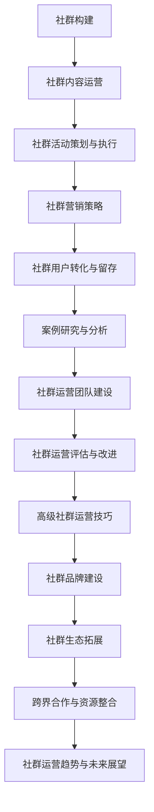

                 

# 《知识付费：程序员的社群运营技巧》

## 关键词
知识付费、社群运营、程序员、技术博客、数据分析、营销策略

## 摘要
本文旨在探讨知识付费背景下，程序员如何利用社群运营技巧提升个人和企业的竞争力。文章首先概述了知识付费的发展历程和类型，接着深入分析了社群运营的基础知识，包括社群的定义、核心要素和运营流程。随后，文章详细介绍了社群构建、内容运营、活动策划、数据分析等高级技巧，最后通过案例研究和未来展望，为程序员提供一套实用的社群运营方法论。

## 目录

### 第一部分：基础知识与理解

#### 第1章：知识付费概述
- **1.1 什么是知识付费**
- **1.2 知识付费的发展历程**
- **1.3 知识付费的类型与模式**
- **1.4 知识付费的价值与挑战**

#### 第2章：社群运营基础
- **2.1 社群运营的定义与作用**
- **2.2 社群运营的核心要素**
- **2.3 社群运营的基本流程**
- **2.4 社群运营的常见问题与对策**

### 第二部分：社群构建与运营

#### 第3章：社群构建策略
- **3.1 社群定位与目标**
- **3.2 社群内容规划**
- **3.3 社群成员招募与管理**
- **3.4 社群生态建设**

#### 第4章：社群内容运营
- **4.1 内容类型与创作**
- **4.2 内容发布与推广**
- **4.3 内容互动与反馈**
- **4.4 内容质量评估与优化**

#### 第5章：社群活动策划与执行
- **5.1 活动类型与目标**
- **5.2 活动策划与组织**
- **5.3 活动执行与监督**
- **5.4 活动效果评估与总结**

#### 第6章：社群运营工具与方法
- **6.1 社群管理工具介绍**
- **6.2 社群运营方法论**
- **6.3 数据分析在社群运营中的应用**
- **6.4 社群运营中的策略优化**

### 第三部分：社群营销与转化

#### 第7章：社群营销策略
- **7.1 社群营销的定义与目的**
- **7.2 社群营销的渠道与工具**
- **7.3 社群营销的内容与形式**
- **7.4 社群营销的效果评估与优化**

#### 第8章：社群用户转化与留存
- **8.1 用户转化的关键因素**
- **8.2 用户留存策略**
- **8.3 社群运营中的用户心理学**
- **8.4 用户反馈与改进**

#### 第9章：案例研究与分析
- **9.1 成功社群运营案例**
- **9.2 案例分析与方法借鉴**
- **9.3 案例中的挑战与解决方案**
- **9.4 案例启示与未来展望**

### 附录

#### 附录A：社群运营资源与工具汇总
- **A.1 常用社群管理工具**
- **A.2 社群运营相关资源**
- **A.3 社群运营书籍推荐**
- **A.4 社群运营社区与论坛**

## 第10章：高级社群运营技巧
- **10.1 社群品牌建设**
- **10.2 社群生态拓展**
- **10.3 跨界合作与资源整合**
- **10.4 社群运营趋势与未来展望**

### 第11章：社群运营团队建设
- **11.1 团队角色与职责**
- **11.2 团队协作与沟通**
- **11.3 团队建设与激励**
- **11.4 团队成长与发展**

### 第12章：社群运营评估与改进
- **12.1 评估指标与方法**
- **12.2 评估结果分析与应用**
- **12.3 改进策略与实践**
- **12.4 持续改进与优化**

## Mermaid 流程图：社群运营流程

### 核心概念与联系
在本文中，核心概念包括知识付费、社群运营、内容运营、用户转化等。这些概念之间存在着紧密的联系。知识付费是社群运营的经济基础，而社群运营则是内容运营和用户转化的载体。通过有效的社群运营，可以促进知识付费的发展，实现用户价值的最大化。

## 第1章：知识付费概述

### 1.1 什么是知识付费

知识付费指的是用户为获取特定的知识、技能或信息而支付的费用。这种模式在互联网时代得到了快速发展，主要源于以下几个原因：

1. **信息爆炸**：互联网时代，信息量呈爆炸式增长，用户获取知识的难度加大，知识付费成为一种有效的筛选机制。
2. **个性化需求**：用户对知识的需求更加个性化和专业化，愿意为高质量的知识内容支付费用。
3. **价值认同**：用户对知识价值的认同感增强，认为付费是获取高质量内容的合理方式。

知识付费的形式多样，包括在线课程、电子书、付费问答、知识星球等。这些形式各有特点，满足了不同用户的需求。

### 1.2 知识付费的发展历程

知识付费的发展可以分为三个阶段：

1. **萌芽阶段**（2000-2010年）：这一阶段以博客、论坛等形式为主，用户通过自愿捐赠或小额付费获取知识。
2. **发展阶段**（2011-2015年）：随着移动互联网的兴起，知识付费开始走向规范化，各大平台如得到、知乎等涌现，提供了丰富的知识内容。
3. **成熟阶段**（2016年至今）：知识付费市场逐步成熟，用户需求更加多样化，平台也开始探索更加精细化的运营模式。

### 1.3 知识付费的类型与模式

知识付费主要可以分为以下几种类型：

1. **在线教育**：通过在线课程、直播等形式提供系统性的知识教育。
2. **电子书**：付费获取电子版书籍，包括专业书籍、小说等。
3. **付费问答**：用户向专家提问，获得专业的解答。
4. **知识星球**：以兴趣或专业为纽带，用户付费加入特定的小社群，进行深度交流。

知识付费的模式主要包括：

1. **订阅模式**：用户按月或按年订阅平台上的内容。
2. **付费课程**：用户为特定课程支付费用。
3. **付费问答**：用户为获取专家解答支付费用。
4. **知识星球**：用户为加入特定社群支付费用。

### 1.4 知识付费的价值与挑战

知识付费的价值主要体现在以下几个方面：

1. **提升个人竞争力**：通过付费获取高质量的知识，提升个人技能和职业素养。
2. **内容创作者收益**：知识付费为内容创作者提供了稳定的收入来源，激发了内容创作的积极性。
3. **平台经济效益**：知识付费为平台带来了可观的收益，促进了知识传播和共享。

然而，知识付费也面临着一些挑战：

1. **内容质量参差不齐**：市场上存在大量低质量的知识内容，用户难以辨别。
2. **用户粘性不足**：知识付费产品往往缺乏长期吸引力，用户容易流失。
3. **数据隐私和安全**：知识付费平台需要处理大量用户数据，数据隐私和安全问题备受关注。

### 1.5 程序员的社群运营优势

程序员在社群运营中具有以下优势：

1. **技术背景**：程序员具备较强的技术背景，能够为社群提供高质量的技术内容。
2. **逻辑思维**：程序员擅长逻辑思维，能够构建清晰的内容架构和运营策略。
3. **创新意识**：程序员具备较强的创新意识，能够探索新的运营模式和工具。

然而，社群运营中也存在一些技术挑战：

1. **平台选择**：程序员需要选择适合自己社群的技术平台，进行高效运营。
2. **内容创作**：程序员需要花费大量时间进行内容创作，确保内容的高质量和吸引力。
3. **数据分析**：程序员需要运用数据分析工具，对运营效果进行实时监控和优化。

## 第2章：社群运营基础

### 2.1 社群运营的定义与作用

社群运营是指通过构建和维护特定的社群，促进成员之间的互动和协作，从而实现共同目标的过程。社群运营的作用主要体现在以下几个方面：

1. **知识共享**：社群为成员提供了一个交流学习的平台，促进了知识的共享和传播。
2. **社交互动**：社群运营有助于成员建立联系，增强社交互动，提高用户粘性。
3. **品牌建设**：通过社群运营，企业可以提升品牌知名度，增强用户忠诚度。
4. **用户转化**：社群运营有助于将潜在用户转化为实际用户，提升业务收益。

### 2.2 社群运营的核心要素

社群运营的核心要素包括：

1. **目标定位**：明确社群的目标和定位，为社群运营提供方向。
2. **内容规划**：制定丰富多样的内容规划，满足成员的知识需求。
3. **用户管理**：建立用户管理体系，确保社群成员的活跃度和满意度。
4. **互动机制**：设计合理的互动机制，促进成员之间的交流和协作。
5. **数据分析**：运用数据分析工具，对社群运营效果进行实时监控和优化。

### 2.3 社群运营的基本流程

社群运营的基本流程包括：

1. **社群构建**：选择合适的平台，搭建社群基础架构，进行成员招募。
2. **内容运营**：制定内容策略，创作和发布高质量的内容，确保内容吸引力。
3. **活动策划**：设计并执行社群活动，提升用户参与度和活跃度。
4. **数据分析**：收集和分析运营数据，评估社群效果，优化运营策略。
5. **用户反馈**：收集用户反馈，不断改进社群运营，提升用户体验。

### 2.4 社群运营的常见问题与对策

社群运营中常见的问题包括：

1. **用户活跃度低**：原因可能是内容缺乏吸引力，对策是优化内容策略，提升内容质量。
2. **用户流失**：原因可能是用户需求得不到满足，对策是深入了解用户需求，提供更有价值的内容。
3. **社群管理困难**：原因可能是管理不规范，对策是建立完善的社群管理制度，提高管理效率。

## 第3章：社群构建策略

### 3.1 社群定位与目标

社群构建的首要任务是明确社群的定位和目标。社群定位决定了社群的核心价值和特色，社群目标则明确了社群运营的方向和期望达到的效果。以下是社群定位和目标设定的步骤：

1. **确定目标受众**：明确社群的服务对象，包括年龄、职业、兴趣爱好等特征。
2. **分析用户需求**：深入了解目标受众的需求，包括他们希望获取的信息、解决的问题等。
3. **确定社群主题**：基于目标受众的需求，明确社群的主题，如技术交流、行业资讯、兴趣爱好等。
4. **设定运营目标**：根据社群主题和用户需求，设定可量化的运营目标，如用户增长、内容发布频率、活动参与率等。

### 3.2 社群内容规划

社群内容规划是确保社群长期吸引力和活跃度的关键。以下是内容规划的具体步骤：

1. **内容类型**：根据社群主题和用户需求，确定内容类型，如技术文章、行业资讯、教程、案例分享、问答等。
2. **内容来源**：确定内容的来源，包括内部创作、外部转载、用户投稿等。
3. **内容发布计划**：制定内容发布的时间表，确保内容持续更新，满足用户的需求。
4. **内容质量**：确保内容的质量，包括准确性、实用性、趣味性等，提高用户的满意度和粘性。

### 3.3 社群成员招募与管理

社群成员的招募和管理是社群运营的重要环节。以下是成员招募和管理的步骤：

1. **渠道选择**：选择合适的招募渠道，如社交媒体、行业论坛、线上活动等。
2. **招募标准**：明确招募标准，包括专业背景、兴趣爱好、活跃度等，确保社群成员的多样性。
3. **成员欢迎与引导**：对新加入的成员进行欢迎和引导，帮助他们融入社群，提高活跃度。
4. **成员激励**：制定激励机制，如积分系统、荣誉榜单等，鼓励成员积极参与社群活动。
5. **成员反馈与沟通**：定期收集成员反馈，及时回应成员的问题和建议，建立良好的沟通机制。

### 3.4 社群生态建设

社群生态建设是确保社群长期健康发展的关键。以下是社群生态建设的步骤：

1. **角色划分**：明确社群中的不同角色，如管理员、志愿者、活跃用户等，发挥各自的作用。
2. **规则制定**：制定社群规则，包括言行规范、内容发布规范等，维护社群秩序。
3. **活动策划**：定期举办各类活动，如线上研讨会、线下聚会、技能比赛等，增强社群凝聚力。
4. **品牌建设**：塑造社群品牌形象，提高社群的知名度和影响力。
5. **资源整合**：整合社群内外部资源，提供更多有价值的内容和服务，满足成员的需求。

## 第4章：社群内容运营

### 4.1 内容类型与创作

社群内容运营的核心是提供有价值的内容，以满足成员的需求。以下是常见的内容类型和创作技巧：

1. **技术文章**：技术文章是程序员社群中常见的类型，包括技术分享、案例分析、技术趋势等。创作技术文章的技巧包括：
   - **选题精准**：选择与社群主题相关且具有针对性的选题。
   - **内容深度**：深入剖析技术原理，提供实用案例。
   - **结构清晰**：合理组织文章结构，使内容易于阅读和理解。

2. **教程**：教程是帮助成员掌握新技能的重要资源。创作教程的技巧包括：
   - **步骤详细**：详细描述操作步骤，确保成员能够跟随执行。
   - **语言简洁**：使用简洁明了的语言，避免冗长复杂的表述。
   - **图表辅助**：使用图表和代码示例，增强内容的可读性。

3. **行业资讯**：行业资讯可以帮助成员了解最新的行业动态和技术趋势。创作行业资讯的技巧包括：
   - **信息准确**：确保信息的准确性和可靠性。
   - **内容更新**：定期更新资讯，保持内容的新鲜度。
   - **观点独到**：提供独到的见解和观点，提升内容的吸引力。

4. **案例分享**：案例分享是分享实际经验和成功故事的好方式。创作案例分享的技巧包括：
   - **真实可靠**：确保案例的真实性和可靠性。
   - **分析深入**：深入分析案例中的关键点和经验教训。
   - **启示明确**：从案例中提炼出有价值的启示和建议。

### 4.2 内容发布与推广

内容发布和推广是确保内容被成员看到和接受的重要环节。以下是内容发布和推广的技巧：

1. **发布时间**：选择成员活跃的时间发布内容，如工作日的早晨或晚上，节假日前后等。
2. **渠道选择**：选择适合的内容发布渠道，如社群平台、博客、微博、微信公众号等。
3. **标题优化**：使用吸引人的标题，提高内容的点击率和阅读量。
4. **内容营销**：结合其他营销手段，如电子邮件营销、社交媒体推广等，扩大内容的影响力。
5. **互动引导**：在内容中引导成员参与互动，如提问、讨论、投票等，提高内容的参与度。

### 4.3 内容互动与反馈

内容互动和反馈是提升社群活跃度和用户满意度的关键。以下是内容互动和反馈的技巧：

1. **互动策略**：设计互动环节，如问答环节、讨论区、投票等，激发成员的参与热情。
2. **及时回应**：及时回复成员的问题和反馈，提高社群的互动性。
3. **用户激励**：通过积分、荣誉等激励措施，鼓励成员积极参与互动。
4. **内容优化**：根据成员的反馈，对内容进行优化，提升内容的实用性和吸引力。
5. **数据监控**：使用数据分析工具，监控内容的互动数据和用户行为，为内容优化提供数据支持。

### 4.4 内容质量评估与优化

内容质量评估和优化是确保社群内容持续提升的重要环节。以下是内容质量评估和优化的技巧：

1. **评估指标**：设定内容评估指标，如阅读量、点赞量、评论量、分享量等。
2. **数据分析**：使用数据分析工具，分析内容的表现和用户行为，找出优化的方向。
3. **用户调研**：定期进行用户调研，了解用户对内容的看法和建议。
4. **内容迭代**：根据评估结果和用户反馈，对内容进行迭代和优化。
5. **质量监控**：建立内容质量监控机制，确保内容持续提升。

## 第5章：社群活动策划与执行

### 5.1 活动类型与目标

社群活动是提升社群活跃度和用户粘性的有效手段。以下是常见活动类型和目标：

1. **线上研讨会**：目标是通过专业讨论提升成员的专业技能和知识水平。
2. **线下聚会**：目标是通过面对面的交流增强成员之间的联系和信任。
3. **技能比赛**：目标是通过竞技提升成员的技能水平和自信心。
4. **知识竞赛**：目标是通过比赛形式加深成员对知识点的理解和掌握。
5. **培训课程**：目标是通过系统性的培训提升成员的专业能力。

### 5.2 活动策划与组织

活动策划和组织是确保活动顺利进行的关键。以下是活动策划与组织的步骤：

1. **活动主题**：明确活动的主题，与社群目标和成员需求相匹配。
2. **活动时间**：选择合适的时间，避免与其他重要活动冲突。
3. **活动内容**：制定详细的活动内容，包括演讲嘉宾、活动流程、互动环节等。
4. **资源准备**：准备必要的资源，如场地、设备、物料等。
5. **宣传推广**：制定宣传推广计划，通过社群、邮件、社交媒体等方式通知成员。

### 5.3 活动执行与监督

活动执行和监督是确保活动顺利进行的重要环节。以下是活动执行与监督的技巧：

1. **分工协作**：明确团队成员的职责和任务，确保活动各个环节有人负责。
2. **现场管理**：确保现场秩序，及时解决突发问题。
3. **实时沟通**：保持团队内部和与成员之间的实时沟通，确保活动顺利进行。
4. **活动记录**：记录活动过程和关键环节，为后续总结和优化提供参考。
5. **用户反馈**：收集用户反馈，了解活动效果，为下一次活动提供改进方向。

### 5.4 活动效果评估与总结

活动效果评估和总结是优化活动的重要环节。以下是活动效果评估与总结的步骤：

1. **数据收集**：收集活动相关的数据，如参与人数、参与时间、互动量等。
2. **用户反馈**：收集用户对活动的反馈，了解用户满意度和活动效果。
3. **效果分析**：分析活动数据和建议，评估活动的成功程度和不足之处。
4. **总结报告**：撰写活动总结报告，总结活动的亮点和不足，为下一次活动提供参考。
5. **优化方案**：根据效果分析和总结报告，制定优化方案，提升下一次活动的效果。

## 第6章：社群运营工具与方法

### 6.1 社群管理工具介绍

社群管理工具是社群运营的重要支撑，以下是几种常见的社群管理工具：

1. **微信群**：微信作为国内最受欢迎的社交媒体平台，微信群是社群运营的重要工具，支持文字、图片、视频等多种形式的互动。
2. **QQ群**：QQ群拥有庞大的用户基础，适合大规模社群的管理，支持文件共享和在线讨论。
3. **知乎Live**：知乎Live是知乎推出的直播工具，适合进行在线讲座和知识分享，支持实时互动和内容回放。
4. **知识星球**：知识星球是一款专为知识付费打造的社群平台，支持付费问答、专栏订阅等多种形式的知识共享。
5. **Discord**：Discord是一款全球流行的游戏社群工具，适合多人群聊和互动，支持语音、文字、视频等多种沟通方式。

### 6.2 社群运营方法论

社群运营方法论是指导社群运营实践的理论框架，以下是几种常见的社群运营方法论：

1. **用户参与式运营**：以用户为中心，鼓励用户参与内容创作和社群活动，提高社群的互动性和活跃度。
2. **内容驱动运营**：通过高质量的内容吸引和留住用户，提升社群的价值和影响力。
3. **社群营销运营**：结合营销策略，通过社群推广产品和品牌，实现商业价值。
4. **社群生态运营**：构建多元化的社群生态，提供多样化的服务和内容，满足不同用户的需求。
5. **数据驱动运营**：运用数据分析工具，对社群运营效果进行实时监控和优化，提高运营效率。

### 6.3 数据分析在社群运营中的应用

数据分析是社群运营的重要工具，以下是数据分析在社群运营中的应用：

1. **用户行为分析**：分析用户在社群中的行为数据，如登录次数、发言次数、互动频率等，了解用户活跃度和需求。
2. **内容效果分析**：分析内容的表现数据，如阅读量、点赞量、分享量等，评估内容的质量和吸引力。
3. **活动效果分析**：分析活动的数据，如参与人数、活动时长、互动量等，评估活动的效果和用户满意度。
4. **用户留存分析**：分析用户的留存数据，如留存率、流失率等，了解用户的留存情况和原因。
5. **用户画像分析**：通过数据分析，构建用户画像，了解用户的特征和需求，为运营策略提供参考。

### 6.4 社群运营中的策略优化

社群运营中的策略优化是提高社群运营效果的关键，以下是策略优化的方法：

1. **数据驱动优化**：根据数据分析的结果，优化社群运营策略，如内容创作、活动策划、用户管理等。
2. **A/B测试**：通过A/B测试，比较不同策略的效果，找出最优的运营方案。
3. **用户反馈优化**：收集用户反馈，了解用户的需求和期望，优化社群运营策略，提高用户满意度。
4. **持续学习与改进**：社群运营是一个不断学习与改进的过程，通过学习行业最佳实践和新技术，不断提升社群运营效果。

## 第7章：社群营销策略

### 7.1 社群营销的定义与目的

社群营销是指通过构建和维护社群，利用社群的互动性和粘性，实现品牌传播和用户转化的营销策略。社群营销的目的主要包括：

1. **品牌传播**：通过社群平台，提高品牌的知名度和影响力。
2. **用户增长**：通过社群吸引潜在用户，增加社群成员数量。
3. **用户转化**：通过社群互动和营销活动，将潜在用户转化为实际用户。
4. **用户留存**：通过社群的持续运营，提高用户的留存率和忠诚度。

### 7.2 社群营销的渠道与工具

社群营销的渠道和工具多种多样，以下是几种常见的渠道和工具：

1. **社交媒体**：如微信、微博、抖音等，通过发布内容、互动评论、直播等形式，吸引潜在用户，提升品牌影响力。
2. **微信群**：通过建立微信群，进行私域流量运营，提高用户互动和转化率。
3. **QQ群**：适合大规模社群的管理和运营，通过文件共享、在线讨论等形式，增强用户粘性。
4. **知识星球**：适合知识付费社群的运营，通过付费问答、专栏订阅等形式，实现用户转化。
5. **电子邮箱**：通过定期发送邮件，进行用户触达和提醒，提升用户活跃度和转化率。

### 7.3 社群营销的内容与形式

社群营销的内容和形式多种多样，以下是几种常见的内容和形式：

1. **内容营销**：通过发布高质量的内容，如技术文章、行业资讯、教程等，吸引用户关注，提高品牌影响力。
2. **互动营销**：通过组织线上互动活动，如问答、投票、抽奖等，激发用户参与热情，增强用户粘性。
3. **活动营销**：通过举办线下或线上活动，如研讨会、聚会、比赛等，提高用户参与度和品牌认知度。
4. **社群运营**：通过社群的持续运营，提供有价值的内容和服务，建立用户信任和忠诚度。
5. **直播营销**：通过直播形式，进行产品展示、技术讲解、互动问答等，实现用户转化和品牌传播。

### 7.4 社群营销的效果评估与优化

社群营销的效果评估与优化是提高营销效果的关键，以下是效果评估与优化的方法：

1. **数据监测**：通过数据分析工具，实时监测社群营销的数据指标，如用户活跃度、内容阅读量、互动量等。
2. **效果分析**：根据数据监测结果，分析不同渠道和策略的效果，找出优势和不足。
3. **A/B测试**：通过A/B测试，比较不同内容和形式的效果，找出最优的营销策略。
4. **用户反馈**：收集用户反馈，了解用户对营销内容和形式的看法和建议，为优化提供参考。
5. **持续优化**：根据效果分析和用户反馈，不断优化社群营销策略，提高营销效果。

## 第8章：社群用户转化与留存

### 8.1 用户转化的关键因素

用户转化是社群运营的重要目标之一，以下是一些关键因素：

1. **内容质量**：高质量的内容能够吸引用户，提高转化率。
2. **互动体验**：良好的互动体验能够增强用户粘性，提高转化率。
3. **用户体验**：良好的用户体验能够提高用户满意度和忠诚度，促进转化。
4. **营销策略**：有效的营销策略能够提高用户参与度和转化率。
5. **激励机制**：合理的激励机制能够激发用户参与热情，提高转化率。

### 8.2 用户留存策略

用户留存是社群运营的重要目标之一，以下是一些用户留存策略：

1. **内容持续更新**：定期发布高质量的内容，保持用户的关注和活跃度。
2. **互动活动**：定期举办互动活动，如问答、投票、比赛等，激发用户参与热情。
3. **用户反馈**：积极收集用户反馈，及时回应用户问题，提高用户满意度。
4. **个性化推荐**：根据用户行为和兴趣，进行个性化推荐，提高用户留存率。
5. **社群生态**：构建多元化的社群生态，提供多样化的内容和服务，满足不同用户的需求。

### 8.3 社群运营中的用户心理学

用户心理学在社群运营中具有重要意义，以下是一些用户心理学的应用：

1. **需求分析**：了解用户需求，提供符合用户期望的内容和服务。
2. **行为分析**：通过用户行为分析，了解用户偏好和行为模式，优化社群运营策略。
3. **情感营销**：通过情感化的内容和互动，建立用户情感连接，提高用户忠诚度。
4. **激励机制**：运用心理学原理，设计合理的激励机制，激发用户参与热情。
5. **用户成长**：通过用户成长体系，激励用户不断学习和进步，提高用户留存率。

### 8.4 用户反馈与改进

用户反馈是社群运营的重要环节，以下是如何收集和利用用户反馈的方法：

1. **直接反馈**：通过问卷调查、在线反馈表等形式，直接收集用户意见和建议。
2. **间接反馈**：通过用户行为数据、社群互动数据等，间接了解用户需求和满意度。
3. **用户访谈**：定期进行用户访谈，深入了解用户的真实想法和需求。
4. **反馈机制**：建立反馈机制，及时回应用户问题，提高用户满意度。
5. **改进措施**：根据用户反馈，制定改进措施，优化社群运营策略。

## 第9章：案例研究与分析

### 9.1 成功社群运营案例

以下是几个成功社群运营的案例：

1. **程序员大会**：程序员大会是一个以技术交流为主题的社群，通过定期举办线下活动，吸引了大量程序员参与。社群运营团队通过高质量的内容、互动活动和用户反馈，成功提升了社群的活跃度和用户满意度。
2. **Python学习社群**：Python学习社群是一个以学习Python编程语言为主题的社群，通过发布教程、举办线上研讨会、提供技术支持等方式，帮助成员快速掌握Python技能。社群运营团队通过数据分析，不断优化内容和活动，成功提高了用户留存率和转化率。
3. **行业资讯社群**：行业资讯社群是一个以行业资讯分享为主题的社群，通过发布行业报告、分析文章、提供行业动态等信息，帮助成员了解最新的行业趋势和技术动态。社群运营团队通过精准的内容推送和互动活动，成功提升了社群的影响力和用户粘性。

### 9.2 案例分析与方法借鉴

通过分析以上成功案例，可以得出以下方法和经验：

1. **内容为王**：成功社群运营的核心是提供高质量的内容，满足用户需求。
2. **用户互动**：通过互动活动和用户反馈，增强社群的活跃度和用户满意度。
3. **数据分析**：通过数据分析，了解用户行为和需求，优化运营策略。
4. **持续优化**：不断改进内容和活动，提高社群的运营效果。
5. **精准定位**：明确社群的定位和目标，吸引目标用户，提高用户转化率。

### 9.3 案例中的挑战与解决方案

在社群运营中，常见的挑战包括：

1. **内容质量参差不齐**：解决方案是建立内容审核机制，确保内容质量。
2. **用户活跃度低**：解决方案是举办互动活动，提高用户参与度。
3. **用户流失**：解决方案是深入了解用户需求，提供更有价值的内容。
4. **资源有限**：解决方案是合理分配资源，优先支持核心内容和活动。

### 9.4 案例启示与未来展望

通过以上案例，我们可以得到以下启示：

1. **社群运营的关键在于满足用户需求**：了解用户需求，提供有价值的内容和服务。
2. **持续优化是成功的关键**：不断改进内容和活动，提高运营效果。
3. **数据分析是优化的工具**：通过数据分析，了解用户行为和需求，优化运营策略。
4. **未来社群运营的趋势**：随着技术的进步和用户需求的多样化，社群运营将更加智能化、个性化。

### 附录A：社群运营资源与工具

#### A.1 常用社群管理工具

1. **微信群**：适用于小规模社群的管理，支持多种沟通方式。
2. **QQ群**：适用于大规模社群的管理，支持文件共享和在线讨论。
3. **知识星球**：适用于知识付费社群的管理，支持付费问答和专栏订阅。
4. **Discord**：适用于游戏社群的管理，支持语音、文字、视频等多种沟通方式。
5. **Slack**：适用于企业级社群的管理，提供多种集成服务和协作功能。

#### A.2 社群运营相关资源

1. **运营笔记**：提供社群运营的实战经验和技巧。
2. **运营派**：运营人的学习社区，分享运营知识和资源。
3. **增长黑客**：专注于增长策略和方法的社区，提供最新的增长案例和趋势。
4. **运营研究社**：运营人的学习和交流平台，分享运营经验和心得。

#### A.3 社群运营书籍推荐

1. **《运营之心》**：详细解析社群运营的核心理念和实践方法。
2. **《社群营销实战手册》**：介绍社群营销的策略和方法，适用于各种类型社群的运营。
3. **《运营之光》**：系统介绍运营的各个方面，包括用户增长、内容运营、活动策划等。

#### A.4 社群运营社区与论坛

1. **运营社区**：运营人的学习和交流平台，提供运营资源和经验分享。
2. **运营派**：运营人的学习社区，分享运营知识和资源。
3. **增长黑客**：专注于增长策略和方法的社区，提供最新的增长案例和趋势。
4. **知乎运营话题**：知乎上的运营话题，聚集了大量运营从业者和爱好者。

## 第10章：高级社群运营技巧

### 10.1 社群品牌建设

社群品牌建设是提升社群价值和影响力的关键，以下是社群品牌建设的方法：

1. **定位明确**：明确社群的品牌定位，包括品牌形象、价值观、目标用户等。
2. **内容策略**：制定有针对性的内容策略，提升社群的专业性和权威性。
3. **用户体验**：优化社群的用户体验，提升用户满意度和忠诚度。
4. **品牌推广**：通过线上线下渠道，推广社群品牌，提高品牌知名度。

### 10.2 社群生态拓展

社群生态拓展是提升社群价值和影响力的有效手段，以下是社群生态拓展的方法：

1. **多元化内容**：提供多元化的内容，满足不同用户的需求。
2. **跨界合作**：与其他社群或企业进行合作，拓展社群的资源和影响力。
3. **线上线下结合**：举办线下活动，增强社群的互动性和凝聚力。
4. **社群电商**：结合社群电商，提供优质的产品和服务，实现社群变现。

### 10.3 跨界合作与资源整合

跨界合作与资源整合是社群运营的重要策略，以下是跨界合作与资源整合的方法：

1. **合作对象选择**：选择与社群主题相关且具有互补性的合作对象。
2. **合作内容设计**：设计有吸引力的合作内容，提升用户参与度和满意度。
3. **资源整合**：整合跨界资源，提供更多有价值的内容和服务。
4. **合作效果评估**：评估合作效果，持续优化合作策略。

### 10.4 社群运营趋势与未来展望

社群运营正朝着智能化、个性化、社区化的方向发展，以下是社群运营的趋势与未来展望：

1. **智能化运营**：借助人工智能技术，实现社群运营的自动化和个性化。
2. **内容生态化**：构建多元化的内容生态，满足不同用户的需求。
3. **社区化运营**：加强社群的互动性和社交性，提升用户的归属感和忠诚度。
4. **数字化转型**：利用数字技术，提升社群运营的效率和质量。

## 第11章：社群运营团队建设

### 11.1 团队角色与职责

社群运营团队的角色和职责明确是高效运营的基础，以下是常见的团队角色和职责：

1. **运营经理**：负责社群的整体运营策略和团队管理。
2. **内容编辑**：负责内容创作和审核，确保内容质量。
3. **活动策划**：负责活动策划和组织，提升社群活跃度。
4. **数据分析**：负责数据分析，优化运营策略。
5. **用户管理**：负责用户管理，提升用户满意度和忠诚度。
6. **技术支持**：负责技术支持和工具开发，确保社群平台稳定运行。

### 11.2 团队协作与沟通

团队协作与沟通是社群运营成功的关键，以下是团队协作与沟通的方法：

1. **明确目标**：确保团队成员对社群运营目标有清晰的认识。
2. **分工合作**：明确团队成员的职责和任务，确保工作高效有序。
3. **定期会议**：定期召开团队会议，分享进展和问题，促进团队协作。
4. **即时沟通**：建立即时沟通渠道，如微信群、钉钉等，确保信息传递高效。
5. **反馈机制**：建立反馈机制，及时收集和回应团队成员的建议和意见。

### 11.3 团队建设与激励

团队建设与激励是提升团队凝聚力和工作效率的关键，以下是团队建设与激励的方法：

1. **团队建设活动**：定期举办团队建设活动，增强团队成员的互信和凝聚力。
2. **激励机制**：设立激励机制，如奖金、晋升等，激发团队成员的工作积极性。
3. **员工培训**：提供员工培训机会，提升团队成员的专业能力和综合素质。
4. **员工关怀**：关注员工工作和生活，提供必要的支持和帮助，提高员工满意度和忠诚度。
5. **企业文化**：塑造积极向上的企业文化，营造良好的工作氛围。

### 11.4 团队成长与发展

团队成长与发展是社群运营长期稳定发展的基础，以下是团队成长与发展的方法：

1. **持续学习**：鼓励团队成员持续学习，提升专业技能和知识水平。
2. **经验分享**：定期进行经验分享，促进团队成员之间的交流和学习。
3. **职业规划**：为团队成员制定职业规划，提供职业发展机会。
4. **团队文化建设**：塑造积极向上的团队文化，促进团队凝聚力和协作。
5. **激励机制**：建立激励机制，激励团队成员为实现团队目标努力奋斗。

## 第12章：社群运营评估与改进

### 12.1 评估指标与方法

社群运营评估是确保运营效果的重要环节，以下是常见的评估指标和方法：

1. **用户活跃度**：通过用户登录次数、发言次数、互动量等指标，评估社群的活跃度。
2. **内容质量**：通过内容阅读量、点赞量、评论量等指标，评估内容的受欢迎程度和质量。
3. **用户满意度**：通过用户调研、问卷调查等手段，收集用户对社群运营的满意度反馈。
4. **用户留存率**：通过用户留存数据，评估社群对用户的吸引力。
5. **营销效果**：通过营销数据，评估营销策略的效果和投入产出比。

### 12.2 评估结果分析与应用

评估结果分析是优化社群运营的重要步骤，以下是评估结果分析的方法：

1. **数据可视化**：通过图表和报告，将评估结果进行可视化展示，便于分析和理解。
2. **问题定位**：根据评估结果，找出运营中的问题和不足之处。
3. **原因分析**：分析问题产生的原因，找到问题的根源。
4. **改进措施**：制定具体的改进措施，优化社群运营策略。

### 12.3 改进策略与实践

改进策略与实践是提升社群运营效果的关键，以下是改进策略和实践的方法：

1. **内容优化**：根据用户反馈和评估结果，优化内容质量和类型，提升用户满意度。
2. **活动创新**：设计新颖的活动形式和内容，提高用户参与度和活跃度。
3. **营销策略调整**：根据评估结果，调整营销策略，提高营销效果和用户转化率。
4. **团队培训**：提升团队成员的专业能力和素质，提高运营效率。
5. **技术升级**：引入新技术和工具，提升社群平台的功能和用户体验。

### 12.4 持续改进与优化

持续改进与优化是社群运营长期稳定发展的基础，以下是持续改进与优化的方法：

1. **定期评估**：定期进行社群运营评估，了解运营效果和用户需求。
2. **用户调研**：定期进行用户调研，收集用户反馈和需求，为改进提供依据。
3. **数据驱动**：运用数据分析，实时监控运营效果，及时调整运营策略。
4. **创新意识**：鼓励团队成员保持创新意识，积极探索新的运营模式和工具。
5. **学习交流**：积极参加行业交流和学习活动，借鉴优秀经验，提升自身能力。

## 附录：社群运营资源与工具

### 附录A：社群运营书籍推荐

**《社交网络营销实战》**：详细介绍了社交网络营销的理论和实践方法，适合社群运营初学者阅读。

**《社群营销实战手册》**：针对社群营销的各个环节，提供了详细的操作指南和案例分析，是社群运营的实用指南。

**《运营之光》**：系统讲解了运营的各个领域，包括用户增长、内容运营、活动策划等，适合运营从业者深入学习。

### 附录B：社群运营工具

**小红书**：一个以图文和视频为主的社交电商平台，适合内容营销和用户互动。

**微博**：一个以微博客形式为主的社交媒体平台，适合品牌推广和用户传播。

**微信公众号**：一个以图文和视频为主的媒体平台，适合内容创作和用户触达。

**抖音**：一个以短视频为主的社交媒体平台，适合内容创作和用户互动。

### 附录C：社群运营社区与论坛

**社群运营社区**：一个专注于社群运营的学习和交流平台，提供运营资源和经验分享。

**运营人论坛**：一个运营从业者的交流社区，分享运营经验和心得。

**社交网络营销论坛**：一个专注于社交网络营销的讨论平台，分享营销策略和案例。

**抖音运营社区**：一个针对抖音平台的运营学习和交流平台，分享抖音运营技巧和经验。

