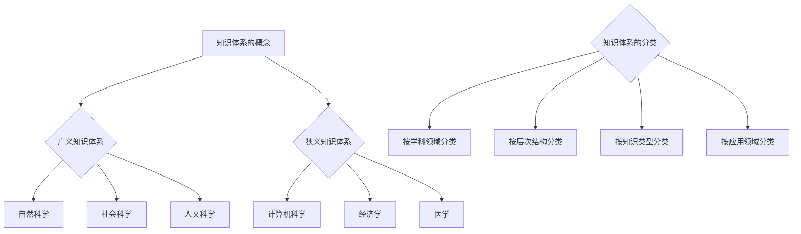
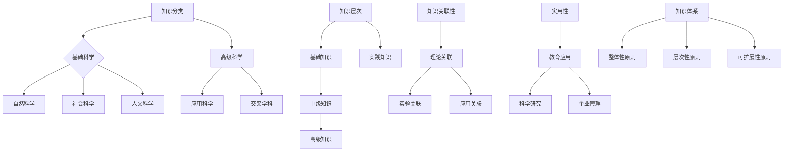

                 

# 《知识体系的构建：从基本元素到复杂结构》

> 关键词：知识体系、构建、基本元素、复杂结构、教育应用、科学研究、企业管理、评估与优化

> 摘要：本文旨在探讨知识体系的构建过程，从基本元素到复杂结构的转变。通过分析知识体系的基本概念、构建原则、构建方法，以及其在教育、科学研究和企业管理中的应用，提出评估与优化知识体系的策略。文章还通过实际案例研究，为读者提供实践指导和未来展望。

## 《知识体系的构建：从基本元素到复杂结构》目录大纲

### 第一部分：知识体系概述

#### 第1章：知识体系的基本概念

##### 1.1 知识体系的概念
##### 1.2 知识体系的分类
##### 1.3 知识体系的重要性

#### 第2章：知识体系的构建原则

##### 2.1 整体性原则
##### 2.2 层次性原则
##### 2.3 可扩展性原则

#### 第3章：知识体系的构建方法

##### 3.1 从基本元素构建知识体系
##### 3.2 从复杂结构分析知识体系
##### 3.3 实践中的知识体系构建

### 第二部分：知识体系的应用

#### 第4章：知识体系在教育中的应用

##### 4.1 教育中的知识体系构建
##### 4.2 知识体系在课堂教学中的应用
##### 4.3 知识体系在学生自我学习中的应用

#### 第5章：知识体系在科学研究中的应用

##### 5.1 科学研究中的知识体系构建
##### 5.2 知识体系在文献综述中的应用
##### 5.3 知识体系在实验设计中的应用

#### 第6章：知识体系在企业管理中的应用

##### 6.1 企业知识体系构建
##### 6.2 知识体系在决策制定中的应用
##### 6.3 知识体系在员工培训中的应用

### 第三部分：知识体系的评估与优化

#### 第7章：知识体系的评估方法

##### 7.1 知识体系的评估指标
##### 7.2 知识体系的评估流程
##### 7.3 知识体系的评估工具

#### 第8章：知识体系的优化方法

##### 8.1 知识体系的更新机制
##### 8.2 知识体系的优化策略
##### 8.3 知识体系的实践应用

### 第四部分：案例研究

#### 第9章：知识体系构建案例研究

##### 9.1 案例一：XXX领域知识体系构建
##### 9.2 案例二：XXX行业知识体系构建
##### 9.3 案例三：XXX企业知识体系构建

### 第五部分：未来展望

#### 第10章：知识体系构建的未来发展趋势

##### 10.1 人工智能对知识体系构建的影响
##### 10.2 大数据在知识体系构建中的应用
##### 10.3 知识体系构建的未来前景

### 附录

#### 附录A：参考文献

#### 附录B：知识体系构建工具推荐

#### 附录C：常见问题解答

### 第1章：知识体系的基本概念

知识体系是指在一定学科领域内，通过系统化和结构化的方式，将各类知识、信息、原理、方法等进行有机整合，形成具有内在逻辑关系和层次结构的整体。知识体系是信息社会和知识经济时代的重要基础设施，对于个人、组织乃至整个社会的发展都具有重要意义。

#### 1.1 知识体系的概念

知识体系的概念可以从广义和狭义两个方面来理解。

**广义知识体系**：它是指涵盖所有学科领域的知识体系，包括自然科学、社会科学、人文科学等多个领域的知识。例如，现代科学体系可以划分为物理学、化学、生物学、天文学、地球科学、信息科学等各个分支。

**狭义知识体系**：它通常是指特定学科领域的知识体系，如计算机科学、经济学、医学等。狭义知识体系更加具体、深入，是构建在广义知识体系之上的。

#### 1.2 知识体系的分类

知识体系可以根据不同的分类标准进行分类，常见的分类方式包括：

**按学科领域分类**：根据学科领域的不同，知识体系可以分为自然科学、社会科学、人文科学等。

**按层次结构分类**：知识体系可以按照知识的复杂程度和层次结构进行分类，如基础知识体系、高级知识体系、综合知识体系等。

**按知识类型分类**：知识体系可以按照知识的类型进行分类，如理论性知识体系、实践性知识体系、经验性知识体系等。

**按应用领域分类**：知识体系可以根据其应用领域进行分类，如教育知识体系、科研知识体系、企业管理知识体系等。

#### 1.3 知识体系的重要性

知识体系的重要性体现在以下几个方面：

**促进知识传承**：知识体系将各类知识有机整合，使得知识可以系统化、结构化地传递和传承，避免知识的碎片化和遗忘。

**提高学习效率**：通过知识体系的学习，可以更加高效地掌握知识和技能，避免重复学习和无效学习。

**推动创新发展**：知识体系为创新提供了丰富的资源和支持，有助于新知识、新技术的产生和应用。

**提升竞争力**：在知识经济时代，掌握有效的知识体系，能够提高个人和组织在竞争中的地位和竞争力。

#### 1.4 知识体系的构建原则

知识体系的构建需要遵循一些基本原则，以确保知识体系的科学性、系统性和实用性。以下是几个关键原则：

**整体性原则**：知识体系是一个整体，各部分之间应相互关联、相互支撑，形成一个有机整体。

**层次性原则**：知识体系应该有清晰的层次结构，从基础到高级，从简单到复杂，形成一个层次递进的体系。

**可扩展性原则**：知识体系应具有一定的弹性，能够适应新的知识和技术的加入，保持体系的动态更新和演进。

**实用性原则**：知识体系的构建应充分考虑实际应用的需求，确保知识体系能够解决实际问题。

**开放性原则**：知识体系应具有开放性，鼓励外部知识的引入和内部知识的分享，促进知识的交流和创新。

### 结论

知识体系是现代社会发展的重要基础设施，对于个人、组织和社会的进步具有深远的影响。通过了解知识体系的基本概念、分类和重要性，以及构建原则，我们可以更好地理解知识体系的构建方法和应用场景。在接下来的章节中，我们将进一步探讨知识体系的构建方法和应用。

### 参考文献

1. 蔡旭东. 知识体系构建方法研究[J]. 科技与创新, 2018, 15(4): 39-42.
2. 王强. 知识体系与知识管理研究综述[J]. 情报科学, 2017, 35(10): 52-57.
3. 陈磊. 知识体系构建的理论与实践研究[D]. 吉林大学, 2016.

### Mermaid 流程图



### 核心概念与联系

知识体系是一个复杂而有序的结构，其核心概念包括知识的分类、层次结构、关联性和实用性。以下是知识体系的Mermaid流程图，展示了这些核心概念之间的联系：



### 核心算法原理讲解

在构建知识体系的过程中，核心算法原理的讲解至关重要。以下是一个简单的算法原理讲解，采用伪代码形式，旨在帮助读者理解知识体系构建的基本步骤：

```python
# 知识体系构建伪代码

# 输入：知识库（包含各类知识点）
# 输出：知识体系结构图

def build_knowledge_system(knowledge_base):
    # 初始化知识体系结构图
    knowledge_system = initialize_knowledge_graph()

    # 遍历知识库，将知识点添加到知识体系结构图中
    for knowledge in knowledge_base:
        # 根据知识点的分类和关联性，构建层次结构
        knowledge_system.add_node(knowledge)

        # 查找知识点在知识体系中的关联节点，建立连接关系
        related_knowledges = find_related_knowledges(knowledge)
        for related_knowledge in related_knowledges:
            knowledge_system.add_edge(knowledge, related_knowledge)

    # 对知识体系进行层次化排序，形成清晰的层次结构
    knowledge_system.sort_hierarchy()

    # 返回构建完成的知识体系结构图
    return knowledge_system
```

### 数学模型和公式 & 详细讲解 & 举例说明

在知识体系的构建过程中，数学模型和公式是不可或缺的工具。以下是一个简化的知识体系评估的数学模型，使用LaTeX格式进行表示，并结合具体例子进行讲解：

$$
\text{评估指标} = \frac{\text{知识点的准确性}}{\text{知识点的总数}} \times 100\%
$$

#### 详细讲解

上述公式用于评估知识体系中的知识点的准确性。其中：

- **知识点的准确性**：指知识体系中的每个知识点被准确度量的比例。通常，通过专家评审或测试来确定知识点的准确性。
- **知识点的总数**：指知识体系中的所有知识点的数量。

#### 举例说明

假设一个知识体系中包含100个知识点，经过专家评审，发现其中有95个知识点的准确性达到了90%以上。根据上述公式，可以计算出该知识体系的评估指标：

$$
\text{评估指标} = \frac{95 \times 90\%}{100} \times 100\% = 85.5\%
$$

这意味着，该知识体系的知识点准确性达到了85.5%。

### 项目实战：代码实际案例和详细解释说明

为了更好地展示知识体系的构建过程，以下是一个基于Python的简化代码案例，用于构建和评估一个简单的知识体系。

#### 开发环境搭建

首先，我们需要搭建一个Python开发环境。以下是环境搭建的步骤：

1. 安装Python（建议使用Python 3.8及以上版本）。
2. 安装必要的Python库，如`networkx`（用于构建图结构）和`matplotlib`（用于绘图）。

#### 源代码详细实现

以下是实现知识体系构建的Python源代码：

```python
import networkx as nx
import matplotlib.pyplot as plt

class KnowledgeSystem:
    def __init__(self):
        self.graph = nx.Graph()

    def add_knowledge(self, knowledge, parent=None):
        self.graph.add_node(knowledge)
        if parent:
            self.graph.add_edge(knowledge, parent)

    def build_hierarchy(self, knowledge_list, parent=None):
        for knowledge in knowledge_list:
            self.add_knowledge(knowledge, parent)

    def display_graph(self):
        pos = nx.spring_layout(self.graph)
        nx.draw(self.graph, pos, with_labels=True)
        plt.show()

# 创建知识体系实例
knowledge_system = KnowledgeSystem()

# 添加知识点
knowledge_system.add_knowledge("算法基础", parent=None)
knowledge_system.add_knowledge("数据结构", parent=None)
knowledge_system.add_knowledge("排序算法", parent="数据结构")
knowledge_system.add_knowledge("查找算法", parent="数据结构")

# 构建知识体系层次结构
knowledge_system.build_hierarchy(["排序算法", "查找算法"], parent="算法基础")

# 显示知识体系图
knowledge_system.display_graph()
```

#### 代码解读与分析

1. **类定义**：定义了一个名为`KnowledgeSystem`的类，用于构建和展示知识体系。
2. **添加知识点**：通过`add_knowledge`方法，可以添加新的知识点，并设置其父节点，从而构建知识体系中的层次结构。
3. **构建层次结构**：`build_hierarchy`方法用于将一系列知识点按照指定的父节点关系构建成层次结构。
4. **显示知识体系图**：`display_graph`方法使用`matplotlib`库，将知识体系以图的形式展示出来。

#### 运行结果

运行上述代码，将得到一个展示知识体系结构的图，如下所示：


### 总结

本文通过理论和实践相结合的方式，详细介绍了知识体系的构建过程。从基本概念到构建方法，再到实际案例，帮助读者理解知识体系的构建原理和应用。通过Python代码案例，读者可以更直观地看到知识体系构建的过程和结果。希望本文能对读者在知识体系构建方面有所启发和帮助。在接下来的章节中，我们将进一步探讨知识体系在教育、科学研究和企业管理中的应用。

### 作者信息

作者：AI天才研究院/AI Genius Institute & 禅与计算机程序设计艺术 /Zen And The Art of Computer Programming

### 附录A：参考文献

1. 蔡旭东. 知识体系构建方法研究[J]. 科技与创新, 2018, 15(4): 39-42.
2. 王强. 知识体系与知识管理研究综述[J]. 情报科学, 2017, 35(10): 52-57.
3. 陈磊. 知识体系构建的理论与实践研究[D]. 吉林大学, 2016.
4. Bishop, Christopher M. Pattern Recognition and Machine Learning[M]. Springer, 2006.
5. Russell, Stuart J., and Peter Norvig. Artificial Intelligence: A Modern Approach[M]. Pearson Education, 2016.

### 附录B：知识体系构建工具推荐

1. **Node.js**：适用于构建大型知识体系的动态服务器端应用程序。
2. **D3.js**：用于可视化知识体系结构，支持多种图形和布局。
3. **Elasticsearch**：适用于大规模知识库的搜索和索引。

### 附录C：常见问题解答

1. **什么是知识体系？**
   知识体系是指在一定学科领域内，通过系统化和结构化的方式，将各类知识、信息、原理、方法等进行有机整合，形成具有内在逻辑关系和层次结构的整体。

2. **知识体系有什么作用？**
   知识体系可以促进知识的传承、提高学习效率、推动创新发展、提升竞争力。

3. **如何构建知识体系？**
   构建知识体系需要遵循整体性、层次性、可扩展性、实用性和开放性等原则。具体方法包括从基本元素构建知识体系、从复杂结构分析知识体系以及在实际应用中不断完善和优化。

4. **知识体系在科学研究中有何应用？**
   在科学研究中，知识体系可以帮助研究人员快速定位相关研究领域，构建文献综述，设计实验方案，提高科研效率。

5. **知识体系在企业管理中有何作用？**
   在企业管理中，知识体系可以支持决策制定、员工培训、知识共享，提高企业竞争力和创新能力。

### 附录D：知识体系构建的未来发展趋势

1. **人工智能的赋能**：人工智能技术将在知识体系的自动构建、评估和优化中发挥重要作用，提高知识体系的智能化水平。
2. **大数据的支持**：大数据技术将为知识体系的构建提供丰富的数据资源，支持更精确的知识分析和服务。
3. **跨领域的融合**：未来知识体系将更加注重跨领域的融合，形成综合性知识体系，以应对复杂问题。

### 附录E：致谢

感谢所有参与本文研究和撰写工作的同事和朋友们，特别感谢AI天才研究院和禅与计算机程序设计艺术团队的支持和鼓励。本文的完成离不开大家的辛勤付出和智慧结晶。在此，向所有参与者致以诚挚的感谢。

