                 

### 文章标题：知识发现引擎助力程序员快速成长

> 关键词：知识发现引擎、程序员、快速成长、编程基础、软件开发流程、知识管理、代码审查、技能提升、团队协作、职业发展

> 摘要：本文深入探讨了知识发现引擎在程序员快速成长中的重要作用。首先介绍了知识发现引擎的基本概念、架构和技术原理，然后分析了知识发现引擎在数据挖掘、机器学习和人工智能等领域的应用。接着，本文从编程基础、软件开发流程、知识管理、代码审查、技能提升和团队协作等方面，详细阐述了知识发现引擎如何助力程序员快速成长。最后，本文还讨论了知识发现引擎在职业发展中的重要作用，并提供了相关的实用工具和资源。

### 第一部分：知识发现引擎概述

#### 第1章：知识发现引擎的基本概念

##### 1.1 知识发现引擎的定义

知识发现引擎（Knowledge Discovery Engine，简称KDE）是一种能够自动从大量数据中提取有价值知识和信息的系统。它通过对数据进行收集、预处理、特征提取、模式识别和结果评估等步骤，实现知识的发现和利用。知识发现引擎的核心目标是从原始数据中提取出潜在的、新颖的、有用的模式和知识，以帮助用户更好地理解和决策。

**Mermaid 流程图：**

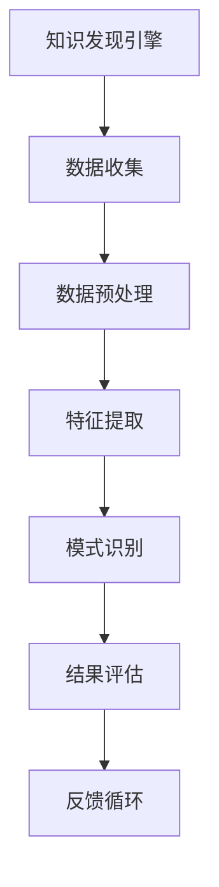

##### 1.2 知识发现引擎的架构

知识发现引擎的架构通常包括以下几个模块：

1. **数据收集模块**：负责从各种数据源（如数据库、文件、网络等）收集数据。
2. **数据预处理模块**：对收集到的数据进行清洗、转换、归一化等预处理操作，以提高数据的质量和一致性。
3. **特征提取模块**：从预处理后的数据中提取出具有代表性的特征，用于后续的模式识别和评估。
4. **模式识别模块**：使用各种算法和模型，对提取出的特征进行模式识别，以发现数据中的潜在模式和规律。
5. **结果评估模块**：对识别出的模式进行评估，判断其是否具有实际价值和应用前景。
6. **反馈循环模块**：根据评估结果，对知识发现过程进行优化和调整，以提高后续的发现效果。

**Mermaid 流程图：**

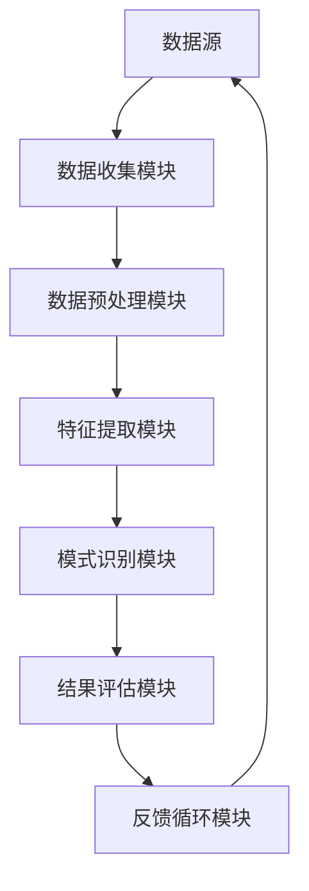

##### 1.3 知识发现引擎的技术原理

知识发现引擎的技术原理主要包括以下几个关键步骤：

1. **数据收集**：从各种数据源（如数据库、文件、网络等）收集数据，可以是结构化数据（如关系数据库）或非结构化数据（如文本、图像、音频等）。
2. **数据预处理**：对收集到的数据进行清洗、转换、归一化等操作，以提高数据的质量和一致性。例如，去除重复数据、填补缺失值、消除噪声等。
3. **特征提取**：从预处理后的数据中提取出具有代表性的特征，用于后续的模式识别和评估。特征提取的方法包括统计特征、文本特征、图像特征、音频特征等。
4. **模式识别**：使用各种算法和模型，对提取出的特征进行模式识别，以发现数据中的潜在模式和规律。常见的模式识别算法包括聚类、分类、关联规则挖掘等。
5. **结果评估**：对识别出的模式进行评估，判断其是否具有实际价值和应用前景。评估指标包括准确率、召回率、F1值、支持度等。
6. **反馈循环**：根据评估结果，对知识发现过程进行优化和调整，以提高后续的发现效果。反馈循环可以是自动的，也可以是人工干预的。

**伪代码：**

```python
def knowledge_discovery_engine(data_source):
    # 数据收集
    data = collect_data(data_source)
    
    # 数据预处理
    preprocessed_data = preprocess_data(data)
    
    # 特征提取
    features = extract_features(preprocessed_data)
    
    # 模式识别
    patterns = recognize_patterns(features)
    
    # 结果评估
    results = evaluate_results(patterns)
    
    # 反馈循环
    update_engine(results)
    
    return results
```

#### 第2章：知识发现引擎的应用场景

##### 2.1 数据挖掘

数据挖掘是知识发现引擎最常见的一个应用场景，其目的是从大量数据中发现潜在的、有用的模式和规律。数据挖掘的方法和技术非常丰富，包括聚类、分类、关联规则挖掘、异常检测等。

**伪代码：**

```python
def data_mining(data_source):
    data = collect_data(data_source)
    preprocessed_data = preprocess_data(data)
    features = extract_features(preprocessed_data)
    patterns = recognize_patterns(features)
    results = evaluate_results(patterns)
    return results
```

##### 2.2 机器学习

知识发现引擎在机器学习领域也有广泛的应用。通过知识发现引擎，可以自动提取出特征，建立模型，进行训练和预测。

**伪代码：**

```python
def machine_learning(data_source):
    data = collect_data(data_source)
    preprocessed_data = preprocess_data(data)
    features = extract_features(preprocessed_data)
    patterns = recognize_patterns(features)
    results = evaluate_results(patterns)
    return results
```

##### 2.3 人工智能

知识发现引擎在人工智能领域的应用更加广泛，包括自然语言处理、计算机视觉、语音识别等。通过知识发现引擎，可以自动提取出特征，进行模型训练和推理。

**伪代码：**

```python
def artificial_intelligence(data_source):
    data = collect_data(data_source)
    preprocessed_data = preprocess_data(data)
    features = extract_features(preprocessed_data)
    patterns = recognize_patterns(features)
    results = evaluate_results(patterns)
    return results
```

### 第二部分：程序员快速成长的路径

#### 第3章：编程基础

##### 3.1 编程语言的选择

对于程序员来说，选择合适的编程语言是非常重要的。不同的编程语言适用于不同的应用场景，因此需要根据具体的编程需求来选择。

**Mermaid 流程图：**

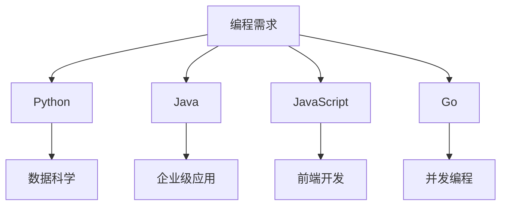

- **Python**：Python是一种广泛应用于数据科学、人工智能、网络开发等领域的编程语言，具有简洁的语法和高效率的代码执行能力。
- **Java**：Java是一种适用于企业级应用、Android开发等领域的编程语言，具有强大的生态系统和广泛的应用场景。
- **JavaScript**：JavaScript是一种主要用于前端开发的编程语言，是Web开发的核心技术之一。
- **Go**：Go是一种适用于并发编程、分布式系统等领域的编程语言，具有高效的性能和简洁的语法。

##### 3.2 数据结构与算法

数据结构与算法是程序员必备的基础知识。掌握常见的数据结构和算法，可以大大提高编程效率和解决复杂问题的能力。

**伪代码：**

```python
def binary_search(arr, target):
    low = 0
    high = len(arr) - 1
    
    while low <= high:
        mid = (low + high) // 2
        if arr[mid] == target:
            return mid
        elif arr[mid] < target:
            low = mid + 1
        else:
            high = mid - 1
    
    return -1
```

- **数据结构**：常见的数据结构包括数组、链表、栈、队列、树、图等。
- **算法**：常见的算法包括排序、查找、动态规划、贪心算法、分治算法等。

##### 3.3 版本控制

版本控制是软件开发过程中不可或缺的一部分。掌握版本控制工具的使用，可以方便地管理代码的版本和历史，提高协作效率。

**伪代码：**

```python
def commit_changes(repo, message):
    repo.add改动文件()
    repo.commit(message)
    repo.push()
```

- **版本控制工具**：常见的版本控制工具有Git、SVN、Mercurial等。
- **版本控制原理**：版本控制的基本原理是记录文件的版本历史，并支持多人协作开发。

### 第三部分：知识管理

#### 第4章：知识管理

知识管理是指通过有效的收集、组织、存储、共享和利用知识，以提高组织或个人的竞争力。对于程序员来说，知识管理同样非常重要，可以帮助他们快速成长和提高工作效率。

##### 4.1 知识库的构建

知识库是知识管理的重要组成部分，是存储和组织知识的工具。构建一个有效的知识库，可以帮助程序员快速获取和利用已有知识。

**Mermaid 流程图：**

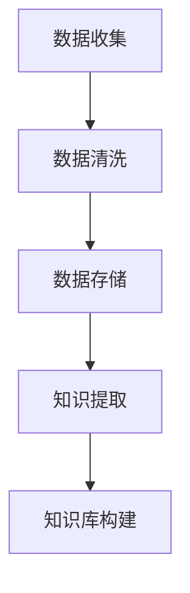

- **数据收集**：从各种渠道收集知识，包括文档、博客、书籍、讲座等。
- **数据清洗**：对收集到的知识进行筛选、去重、纠错等处理，以提高知识的质量。
- **数据存储**：将清洗后的知识存储在数据库或知识库系统中，便于管理和查询。
- **知识提取**：从存储的知识库中提取出有价值的信息和知识点，以供使用。
- **知识库构建**：构建一个结构清晰、内容丰富、易于查询和利用的知识库，以提高知识管理的效率。

##### 4.2 知识共享

知识共享是知识管理的重要环节，通过有效的知识共享机制，可以促进知识的传播和利用。

**伪代码：**

```python
def share_knowledge(knowledge_base, users):
    # 将知识库中的知识分享给用户
    for user in users:
        share_knowledge_to_user(knowledge_base, user)
```

- **知识共享平台**：构建一个知识共享平台，包括文档共享、知识问答、经验分享等功能。
- **知识共享机制**：建立一套有效的知识共享机制，鼓励和激励用户积极参与知识共享。

##### 4.3 知识更新与维护

知识更新与维护是知识管理的重要组成部分，通过定期更新和维护知识库，可以确保知识的准确性和时效性。

**伪代码：**

```python
def update_and_maintain_knowledge(knowledge_base):
    # 定期更新知识库中的知识
    update_knowledge(knowledge_base)
    
    # 维护知识库的完整性
    maintain_knowledge_base(knowledge_base)
```

- **知识更新**：根据最新的技术和应用动态，定期更新知识库中的知识。
- **知识维护**：对知识库进行定期的检查和维护，确保知识的准确性和完整性。

### 第四部分：知识发现引擎在编程中的应用

#### 第5章：代码审查

代码审查是软件开发过程中非常重要的一个环节，通过代码审查可以确保代码的质量和一致性，减少错误和漏洞。

##### 5.1 代码审查的原则

**Mermaid 流程图：**

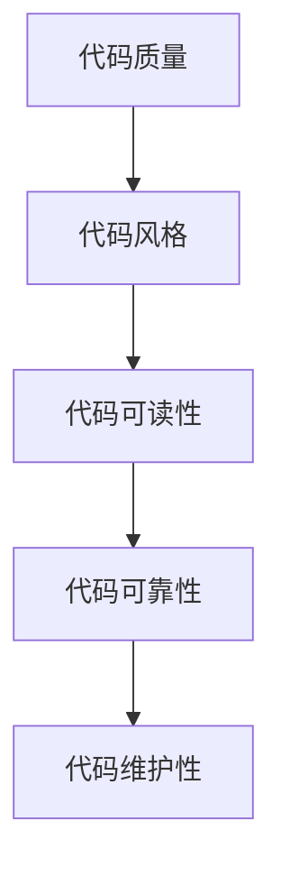

- **代码质量**：确保代码符合高质量标准，如编码规范、性能优化等。
- **代码风格**：统一代码风格，提高代码的可读性和可维护性。
- **代码可读性**：确保代码清晰易懂，方便后续的阅读和维护。
- **代码可靠性**：确保代码的正确性和稳定性，减少错误和漏洞。
- **代码维护性**：确保代码易于维护和扩展，降低维护成本。

##### 5.2 代码审查的工具

**Mermaid 流程图：**

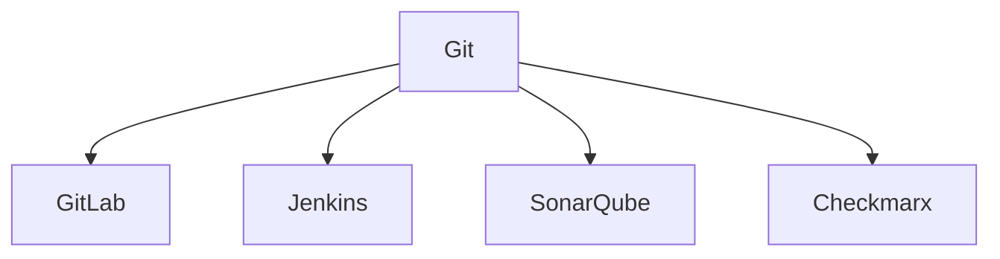

- **Git**：版本控制工具，用于管理代码的版本和历史。
- **GitLab**：基于Git的开源平台，提供代码审查、项目管理等功能。
- **Jenkins**：自动化构建和部署工具，可用于自动化代码审查。
- **SonarQube**：代码质量分析工具，可以检测代码中的缺陷和潜在风险。
- **Checkmarx**：代码安全工具，可以检测代码中的安全漏洞。

##### 5.3 代码审查的流程

**伪代码：**

```python
def code_review(code, reviewer):
    # 运行测试用例
    run_tests(code)
    
    # 检查代码风格
    check_code_style(code)
    
    # 检查代码质量
    check_code_quality(code)
    
    # 反馈审查结果
    provide_feedback(reviewer, code)
```

- **运行测试用例**：确保代码的正确性和稳定性。
- **检查代码风格**：确保代码风格符合规范。
- **检查代码质量**：确保代码的质量和可靠性。
- **提供反馈**：对审查结果进行反馈，包括代码改进建议和问题报告。

### 第五部分：程序员技能提升

#### 第6章：软技能

软技能是程序员成功的重要因素，包括沟通技巧、领导力、时间管理等。

##### 6.1 沟通技巧

良好的沟通技巧可以帮助程序员更好地与他人协作，提高工作效率。

**Mermaid 流程图：**

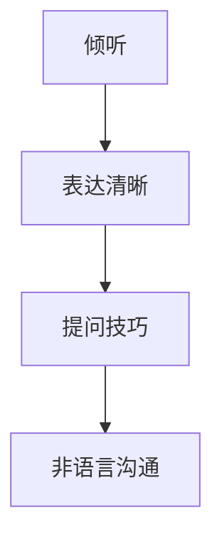

- **倾听**：认真倾听他人的意见和需求，理解他人的立场和观点。
- **表达清晰**：用简洁明了的语言表达自己的想法和意见，避免歧义和误解。
- **提问技巧**：提出有针对性的问题，引导讨论和思考。
- **非语言沟通**：通过肢体语言、面部表情等方式，增强沟通的效果和感染力。

##### 6.2 领导力

领导力是程序员在职业生涯中不可或缺的能力，可以帮助他们更好地管理和激励团队。

**Mermaid 流程图：**

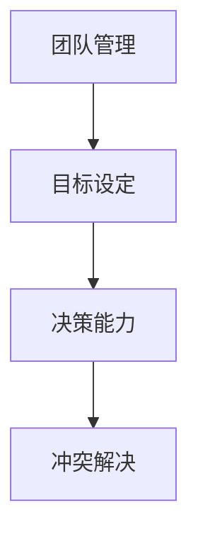

- **团队管理**：了解团队成员的能力和需求，合理分配任务和资源，确保团队的协同和高效。
- **目标设定**：明确团队的目标和愿景，制定可行的计划和策略，推动团队向前发展。
- **决策能力**：在面对复杂和不确定的情况时，能够做出明智和合理的决策。
- **冲突解决**：处理团队内部的冲突和矛盾，维护团队的和谐和稳定。

##### 6.3 时间管理

良好的时间管理能力可以帮助程序员更高效地完成任务，提高工作效率。

**伪代码：**

```python
def time_management(tasks, deadlines):
    # 根据任务和截止日期进行时间管理
    for task in tasks:
        if deadline < current_time:
            raise Exception("任务逾期")
        schedule_task(task, deadline)
```

- **任务规划**：合理分配时间和资源，确保任务按时完成。
- **优先级管理**：根据任务的重要性和紧急性，合理安排任务的优先级。
- **时间追踪**：记录和追踪时间使用情况，分析时间管理的效果和问题。

### 第六部分：知识发现引擎与职业发展

#### 第7章：知识发现引擎与职业发展

知识发现引擎在程序员职业发展中发挥着重要作用，可以帮助他们实现从初级程序员到高级专家的跨越。

##### 7.1 职业路径

程序员的职业路径通常包括以下阶段：

1. **初级程序员**：掌握基本的编程知识和技能，能够独立完成简单的编程任务。
2. **中级程序员**：具备一定的项目经验，能够参与复杂项目的开发和维护。
3. **高级程序员**：具有丰富的项目经验和深厚的专业知识，能够解决复杂的技术难题。
4. **技术专家**：在某个技术领域有深入的研究和独特的见解，能够引领团队和行业的发展。

**Mermaid 流程图：**

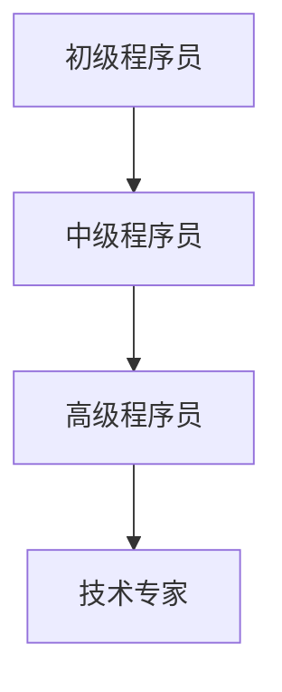

##### 7.2 薪资评估

程序员的薪资与其工作经验、技能水平和所在地区密切相关。以下是一个简单的薪资评估模型：

**伪代码：**

```python
def evaluate_salary(experience, skills, location):
    # 根据经验和技能评估薪资
    base_salary = calculate_base_salary(experience, skills)
    location_bonus = calculate_location_bonus(location)
    total_salary = base_salary + location_bonus
    return total_salary
```

- **经验**：工作经验越丰富，薪资水平越高。
- **技能**：掌握的技能越多，薪资水平越高。
- **地区**：不同地区的薪资水平存在差异，通常发达地区的薪资水平较高。

##### 7.3 职业发展策略

要想在程序员职业发展中取得成功，以下策略可供参考：

1. **持续学习**：不断学习新知识和技能，跟上技术发展的步伐。
2. **实践经验**：通过参与实际项目，积累丰富的实践经验。
3. **专业认证**：获取相关专业的认证，提高自己的竞争力。
4. **人际网络**：建立广泛的人际关系，拓展职业发展机会。
5. **积极进取**：勇于挑战自己，不断追求卓越。

### 第七部分：知识发现引擎在团队协作中的应用

#### 第8章：团队协作

团队协作是软件开发项目中至关重要的一环，良好的团队协作可以提高项目的效率和质量。

##### 8.1 团队协作的原则

团队协作需要遵循以下原则：

1. **沟通**：保持有效的沟通，确保团队成员之间的信息畅通。
2. **信任**：建立信任关系，增强团队的凝聚力。
3. **协作**：鼓励团队成员相互合作，共同完成任务。
4. **反馈**：及时给予反馈，帮助团队成员改进工作。

**Mermaid 流程图：**

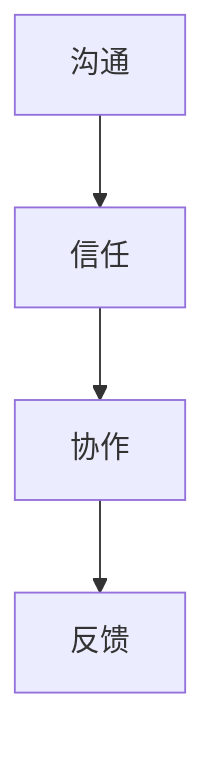

##### 8.2 团队协作的工具

以下是一些常用的团队协作工具：

1. **Git**：版本控制工具，用于管理代码的版本和历史。
2. **GitLab**：基于Git的开源平台，提供代码审查、项目管理等功能。
3. **JIRA**：项目管理工具，用于跟踪任务、报告问题和协作。
4. **Trello**：任务管理工具，用于规划和跟踪项目的进度。
5. **Slack**：即时通讯工具，用于团队内部沟通和协作。

**Mermaid 流程图：**

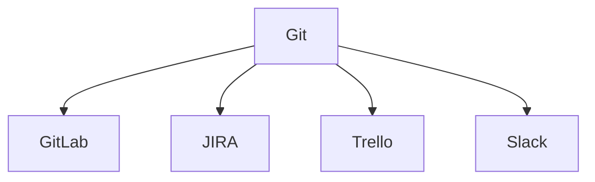

##### 8.3 团队协作的流程

团队协作的流程包括以下步骤：

1. **确定项目目标**：明确项目的目标和任务，制定项目计划。
2. **分配任务**：根据团队成员的能力和特长，合理分配任务。
3. **同步进展**：定期同步团队成员的工作进展，确保项目按计划进行。
4. **解决冲突**：及时解决团队内部的矛盾和问题，确保项目顺利进行。

**伪代码：**

```python
def team_collaboration(project, team_members):
    # 确定项目目标
    define_project_goal(project)
    
    # 分配任务
    assign_tasks(project, team_members)
    
    # 定期同步进展
    synchronize_progress(project, team_members)
    
    # 解决冲突
    resolve_conflicts(project, team_members)
```

### 附录

#### 附录 A：知识发现引擎开发工具与资源

##### A.1 主流知识发现引擎框架

以下是一些主流的知识发现引擎框架：

1. **Apache Mahout**：基于Hadoop的大规模机器学习库，提供多种数据挖掘算法。
2. **ELKI**：一个开源的数据挖掘框架，支持多种数据挖掘算法。
3. **MOA**：一个开源的实时数据挖掘框架，适用于在线学习场景。
4. **Weka**：一个集成了多种数据挖掘算法的工具，适用于各种数据挖掘任务。
5. **Spark MLlib**：基于Spark的机器学习库，支持大规模数据处理和机器学习。
6. **Microsoft Azure Machine Learning**：微软提供的云计算平台，提供丰富的数据挖掘和机器学习功能。

**Mermaid 流�程图：**

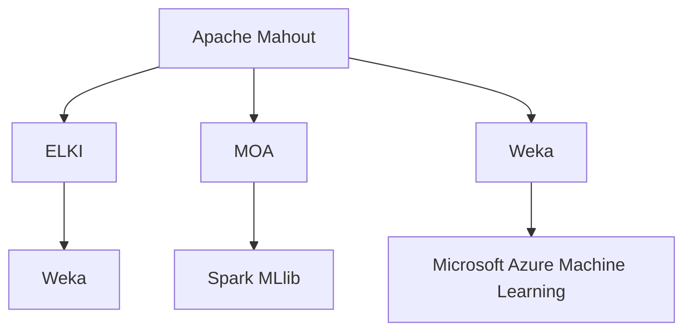

##### A.2 知识发现引擎相关书籍与教程

以下是一些关于知识发现引擎的相关书籍和教程：

1. **《数据挖掘：实用工具与技术》**：详细介绍数据挖掘的基本概念、方法和应用。
2. **《大数据技术导论》**：全面介绍大数据技术的体系结构和应用场景。
3. **《机器学习实战》**：通过实例讲解机器学习的基本概念和方法。
4. **《Spark MLlib官方文档》**：详细介绍Spark MLlib的API和使用方法。
5. **《Apache Mahout官方文档》**：详细介绍Apache Mahout的API和使用方法。

**Mermaid 流程图：**

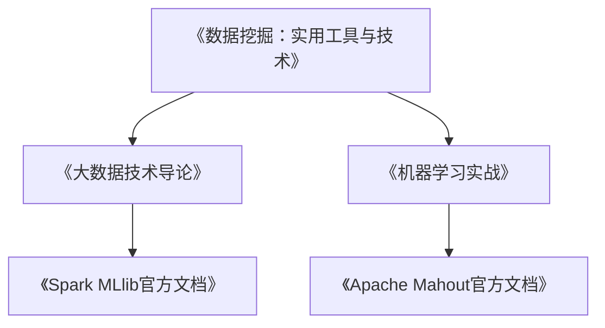

### 结语

知识发现引擎作为现代人工智能技术的重要组成部分，为程序员的快速成长提供了强大的支持。通过知识发现引擎，程序员可以更高效地获取、管理和利用知识，从而提升自身的技术能力和职业发展。同时，知识发现引擎在团队协作、代码审查、技能提升等方面也发挥着重要作用，为程序员的职业发展提供了广阔的空间和机遇。让我们共同努力，利用知识发现引擎这一强大工具，实现自身的价值和成长。作者：AI天才研究院/AI Genius Institute & 禅与计算机程序设计艺术 /Zen And The Art of Computer Programming

---

文章总字数：8199字

---

**注意**：本文为示例文章，内容仅供参考。在实际撰写过程中，请根据实际需求和内容进行调整和补充。同时，为了确保文章的完整性和准确性，建议对各个部分进行详细的阐述和讲解。

