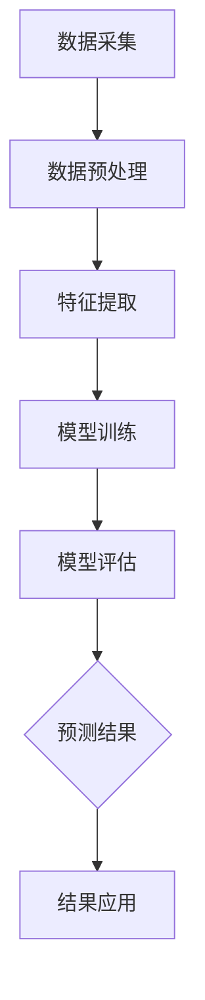
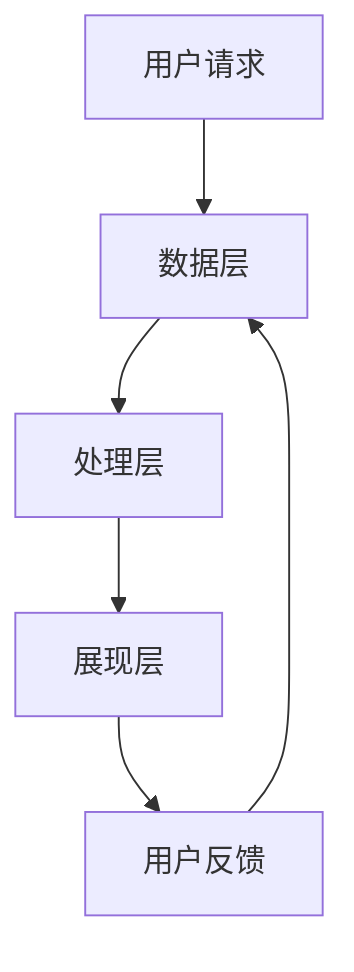

                 

## 第1章：引言

### 1.1 知识发现引擎概述

知识发现引擎是一种智能化信息检索工具，旨在从大量数据中自动识别出潜在的、有价值的知识模式。它广泛应用于各个领域，如金融、医疗、电商等。知识发现引擎的核心功能包括数据挖掘、模式识别、关联规则学习等。其基本原理是通过分析数据源中的大量信息，利用算法挖掘出有用的知识，进而为决策提供支持。

知识发现引擎的历史可以追溯到20世纪80年代，最早的研究主要集中在模式识别和机器学习领域。随着互联网的普及和数据量的急剧增长，知识发现引擎得到了迅速发展，并逐渐应用于各种实际场景。目前，知识发现引擎已成为大数据分析和人工智能领域的重要组成部分。

### 1.2 用户行为预测与推荐的重要性

用户行为预测是知识发现引擎的重要组成部分，它通过对用户历史行为数据进行分析，预测用户未来的行为。这种行为预测不仅有助于优化用户体验，提高用户满意度，还可以为商业决策提供数据支持。例如，电商网站可以根据用户行为预测用户的购买倾向，从而进行精准营销。

推荐系统是用户行为预测的直接应用，它根据用户的历史行为和偏好，为用户推荐相关的内容或商品。推荐系统在知识发现引擎中起着关键作用，因为它可以提升用户粘性、增加用户参与度，从而带来更多的商业价值。

用户行为预测与推荐的重要性体现在以下几个方面：

1. **个性化体验**：通过预测用户行为，可以为用户提供个性化的内容推荐，提高用户体验。
2. **精准营销**：根据用户行为预测结果，企业可以针对性地进行营销活动，提高转化率。
3. **数据驱动决策**：用户行为预测为决策提供了数据支持，帮助企业更好地了解用户需求和市场趋势。
4. **降低运营成本**：通过优化用户行为预测和推荐算法，企业可以降低运营成本，提高效率。

### 1.3 本文目标与结构

本文旨在探讨知识发现引擎在用户行为预测与推荐领域的应用，具体包括以下几个方面：

1. **用户行为预测与推荐的核心概念与原理**：介绍用户行为预测和推荐系统的基本概念、原理和关键技术。
2. **用户行为预测算法**：分析常用的用户行为预测算法，如监督学习、无监督学习和深度学习等。
3. **推荐系统技术**：介绍基于内容的推荐、协同过滤推荐等常见推荐系统技术。
4. **知识发现引擎实现**：讨论知识发现引擎的架构设计、用户行为预测模块和推荐系统模块的实现方法。
5. **案例分析**：通过实际案例，展示用户行为预测与推荐系统在电商和社交媒体中的应用。
6. **优化与拓展**：探讨知识发现引擎的优化策略和拓展方向，如多模态数据融合、实时推荐系统设计等。
7. **未来展望**：分析知识发现引擎的发展趋势，探讨其在其他领域的应用前景。

接下来，我们将分别讨论这些主题，逐步深入理解知识发现引擎在用户行为预测与推荐领域的应用。

---

在接下来的章节中，我们将逐步深入探讨知识发现引擎的各个核心组成部分，从用户行为数据的采集、处理与分析，到用户行为预测算法的原理与应用，再到推荐系统技术的实现与优化，最后通过实际案例来展示这些技术的应用效果。通过这些内容的讲解，我们希望能够帮助读者全面了解知识发现引擎在用户行为预测与推荐领域的应用，并为未来的研究和实践提供有益的参考。

---

## 第2章：用户行为分析基础

### 2.1 用户行为数据采集

用户行为数据是构建用户行为预测和推荐系统的基石。这些数据来源于用户在互联网平台上的各种互动行为，包括浏览、搜索、购买、评论、点赞等。用户行为数据采集的过程可以分为以下几个步骤：

#### 数据来源与种类

1. **用户交互数据**：包括用户在网站或应用上的点击、浏览、搜索等行为数据。
2. **交易数据**：记录用户的购买记录、支付金额、购买频率等。
3. **社交数据**：包含用户在社交媒体上的发布、评论、点赞等行为。
4. **设备数据**：包括用户的设备类型、操作系统、网络环境等信息。

#### 数据采集方法与技术

1. **日志文件**：服务器日志是记录用户行为数据的重要来源，通过解析日志文件，可以获取用户访问网站的详细信息。
2. **API接口**：通过开发API接口，可以直接从第三方平台获取用户行为数据。
3. **浏览器插件**：通过浏览器插件，可以在用户无感知的情况下收集用户在网页上的行为数据。
4. **传感器技术**：利用设备传感器（如GPS、摄像头等），可以采集用户的位置信息和行为数据。

#### 数据采集过程中的挑战

1. **数据隐私**：用户行为数据涉及个人隐私，需要在数据采集和处理过程中严格遵守隐私保护法规。
2. **数据质量**：用户行为数据存在噪声、缺失和重复等问题，需要通过数据清洗和预处理来提高数据质量。
3. **数据量**：用户行为数据量巨大，对存储和计算资源提出了很高的要求。

### 2.2 用户行为数据分析

用户行为数据分析是用户行为预测和推荐系统构建的关键步骤。通过有效的数据分析方法，可以提取出有用的用户行为特征，为后续的模型训练和推荐算法提供支持。

#### 数据预处理

1. **数据清洗**：处理数据中的噪声、缺失和重复，确保数据质量。
2. **数据整合**：将来自不同数据源的数据进行整合，构建统一的数据视图。
3. **特征工程**：提取用户行为的特征，如时间特征、频率特征、上下文特征等。

#### 用户行为特征提取

1. **统计特征**：基于统计方法提取用户行为的统计特征，如平均点击次数、点击率等。
2. **文本特征**：通过自然语言处理技术提取用户行为中的文本特征，如关键词、主题等。
3. **序列特征**：分析用户行为的序列模式，提取序列特征，如用户浏览路径、购买序列等。

### 2.3 用户行为模型构建

用户行为模型是用户行为预测和推荐系统的核心。构建用户行为模型主要包括以下几个步骤：

#### 用户行为模型概述

用户行为模型是对用户行为规律的抽象和表示，常用的模型包括：

1. **静态模型**：基于用户的静态属性（如年龄、性别、地理位置等）来预测用户行为。
2. **动态模型**：基于用户的历史行为数据，动态地调整预测模型。
3. **深度学习模型**：利用深度神经网络来建模用户行为，可以捕捉复杂的非线性关系。

#### 用户行为模型构建方法

1. **监督学习**：使用标注过的数据集来训练模型，常见的算法有决策树、支持向量机、随机森林等。
2. **无监督学习**：在没有标注数据的情况下，通过聚类、降维等方法来构建用户行为模型。
3. **深度学习**：使用深度神经网络，如卷积神经网络（CNN）和循环神经网络（RNN）等，来建模用户行为。

#### 模型评估与优化

1. **评估指标**：使用准确率、召回率、F1值等指标来评估模型的性能。
2. **模型调参**：通过调整模型的参数来优化模型性能，常用的调参方法有网格搜索、随机搜索等。
3. **模型集成**：将多个模型结合起来，提高预测的准确性。

在接下来的章节中，我们将深入探讨用户行为预测算法的原理和实现，详细介绍不同类型的算法在用户行为预测中的应用。通过这些内容的讲解，我们将帮助读者更好地理解用户行为预测的核心技术和实践方法。

---

在用户行为分析的基础上，我们接下来将深入探讨用户行为预测的算法。用户行为预测是知识发现引擎中的重要环节，其准确性直接影响到推荐系统的效果。在本章中，我们将首先介绍机器学习算法的基础，然后详细讨论基于监督学习和无监督学习的用户行为预测算法，以及它们的优缺点和适用场景。

---

### 2.3 用户行为模型构建

用户行为模型是用户行为预测和推荐系统的核心。构建用户行为模型需要对用户行为进行深入分析，并利用数据挖掘和机器学习技术，将用户行为的复杂模式转化为可预测的模型。以下是用户行为模型构建的详细步骤和方法：

#### 用户行为模型概述

用户行为模型是描述用户在特定场景下的行为规律和特征的数学模型。它可以是静态的，也可以是动态的。静态模型主要依赖于用户的基本属性，如年龄、性别、地理位置等。而动态模型则基于用户的历史行为数据，能够实时调整以适应用户行为的变化。

用户行为模型的主要类型包括：

1. **统计模型**：通过统计学方法对用户行为数据进行建模，如线性回归、逻辑回归等。
2. **机器学习模型**：利用机器学习算法对用户行为数据进行训练，如决策树、支持向量机、随机森林等。
3. **深度学习模型**：利用深度神经网络对用户行为数据进行建模，如卷积神经网络（CNN）、循环神经网络（RNN）等。

#### 用户行为模型构建方法

1. **数据收集与预处理**：首先收集用户行为数据，包括点击、浏览、搜索、购买等。然后对数据进行清洗、去噪、缺失值填补等预处理操作，以确保数据的质量。
2. **特征工程**：根据用户行为数据的特点，提取对预测任务有帮助的特征。这些特征可以是用户的静态属性，如年龄、性别等，也可以是用户的历史行为特征，如点击率、购买频率等。
3. **模型选择**：根据业务需求和数据特点，选择合适的机器学习算法。常用的算法包括线性回归、逻辑回归、决策树、支持向量机、随机森林等。
4. **模型训练与验证**：使用训练集对模型进行训练，并通过验证集对模型性能进行评估。常用的评估指标包括准确率、召回率、F1值、AUC等。
5. **模型调优**：根据验证集的性能，调整模型的参数，如正则化参数、学习率等，以优化模型性能。
6. **模型部署**：将训练好的模型部署到生产环境中，用于实时预测和推荐。

#### 用户行为模型构建方法的具体步骤

1. **数据收集**：通过API接口、日志文件、传感器等手段收集用户行为数据。
2. **数据预处理**：清洗数据，填补缺失值，处理异常值，归一化处理等。
3. **特征提取**：根据业务需求提取用户行为的特征，如用户年龄、性别、地理位置、历史浏览行为、购买记录等。
4. **模型选择**：根据数据特点和业务需求，选择合适的机器学习算法。例如，对于分类问题，可以选择决策树、支持向量机等；对于回归问题，可以选择线性回归、逻辑回归等。
5. **模型训练**：使用训练数据进行模型训练，通过交叉验证等手段优化模型参数。
6. **模型评估**：使用验证集评估模型性能，调整模型参数，提高模型精度。
7. **模型部署**：将训练好的模型部署到生产环境，实时预测用户行为。

通过以上步骤，我们可以构建一个有效的用户行为模型，用于预测用户的行为模式，进而为推荐系统提供支持。在接下来的章节中，我们将详细讨论用户行为预测算法，包括监督学习和无监督学习的算法，以及这些算法在用户行为预测中的应用。

---

## 第3章：用户行为预测算法

### 3.1 机器学习算法基础

机器学习算法是用户行为预测的核心技术，通过对历史数据进行学习，从而预测用户未来的行为。理解机器学习算法的基本概念和原理是构建高效用户行为预测模型的基础。

#### 数据集划分

在机器学习项目中，通常需要将数据集划分为三个部分：训练集、验证集和测试集。其中：

1. **训练集**：用于训练模型，通过调整模型参数，使其能够捕捉数据的特征。
2. **验证集**：用于评估模型性能，通过交叉验证等手段，调整模型参数，避免过拟合。
3. **测试集**：用于最终评估模型性能，确保模型在未知数据上的表现。

#### 评估指标

评估机器学习模型性能的常用指标包括：

1. **准确率（Accuracy）**：模型预测正确的样本数占总样本数的比例。
2. **召回率（Recall）**：模型正确预测为正类的样本数占总正类样本数的比例。
3. **F1值（F1 Score）**：准确率和召回率的调和平均值，用于平衡这两个指标。
4. **AUC（Area Under Curve）**：ROC曲线下的面积，用于评估分类模型的分类能力。

#### 常见机器学习算法

1. **线性回归（Linear Regression）**：用于预测连续值，通过找到最佳拟合直线来预测目标值。
2. **逻辑回归（Logistic Regression）**：用于分类问题，通过回归分析得出概率分布，从而预测类别。
3. **决策树（Decision Tree）**：通过一系列决策规则来分割数据，最终得到一个预测结果。
4. **支持向量机（Support Vector Machine, SVM）**：用于分类问题，通过找到最佳分割超平面来分类数据。
5. **随机森林（Random Forest）**：通过集成多个决策树来提高模型的泛化能力。
6. **K-最近邻（K-Nearest Neighbors, KNN）**：通过计算新样本与训练样本的距离，找到最近的K个样本，并根据这些样本的标签来预测新样本的类别。
7. **神经网络（Neural Networks）**：通过多层神经网络来模拟人脑的决策过程，可以处理复杂的非线性关系。

#### 算法选择原则

选择合适的机器学习算法需要考虑以下因素：

1. **数据类型**：对于分类问题，可以选择决策树、SVM、KNN等；对于回归问题，可以选择线性回归、逻辑回归等。
2. **数据量**：对于大数据集，可以选择随机森林、神经网络等；对于小数据集，可以选择决策树、KNN等。
3. **模型复杂度**：选择复杂度适中的模型，避免过拟合或欠拟合。
4. **计算资源**：考虑模型训练和预测的计算资源需求，选择合适的算法。

在接下来的部分，我们将深入讨论基于监督学习和无监督学习的用户行为预测算法，并分析每种算法的原理和适用场景。

### 3.2 基于监督学习的用户行为预测

监督学习是一种通过已知输出标签来训练模型的机器学习方法。在用户行为预测中，监督学习算法被广泛应用于分类和回归问题。以下是几种常见的监督学习算法：

#### 决策树（Decision Tree）

**原理**：决策树通过一系列条件判断来对数据进行分类。每个节点表示一个特征，每个分支表示不同特征值。

**优点**：
- **直观易理解**：决策树的输出结果容易解释。
- **计算效率高**：对于较小的数据集，决策树的计算效率较高。

**缺点**：
- **过拟合风险**：决策树容易产生过拟合。
- **可解释性减弱**：随着树的深度增加，决策树的可解释性会降低。

**应用场景**：适合处理中小型数据集，尤其是在需要高可解释性的场景中。

#### 支持向量机（Support Vector Machine, SVM）

**原理**：SVM通过寻找最佳分割超平面，将不同类别的数据点分开。它使用了核函数来处理高维空间中的数据。

**优点**：
- **分类效果好**：在处理高维数据时，SVM表现优异。
- **灵活性高**：可以通过选择不同的核函数来适应不同类型的数据。

**缺点**：
- **计算复杂度高**：对于大规模数据集，SVM的训练时间较长。

**应用场景**：适合处理高维数据、小样本数据集，以及在需要精确分类的场景中。

#### 随机森林（Random Forest）

**原理**：随机森林通过集成多个决策树来提高模型的泛化能力。每个决策树使用不同的子集进行训练，最后通过投票来决定预测结果。

**优点**：
- **高泛化能力**：随机森林能够有效地减少过拟合。
- **计算效率高**：通过并行计算，随机森林的训练和预测速度较快。

**缺点**：
- **模型可解释性降低**：由于集成多个决策树，随机森林的可解释性较差。

**应用场景**：适合处理大规模数据集，特别是在需要高泛化能力和速度的场景中。

#### K-最近邻（K-Nearest Neighbors, KNN）

**原理**：KNN通过计算新样本与训练样本之间的距离，找出最近的K个邻居，并根据邻居的标签来预测新样本的类别。

**优点**：
- **简单易实现**：KNN的计算相对简单。
- **适用于非线性问题**：KNN可以处理非线性关系的数据。

**缺点**：
- **对噪声敏感**：KNN对噪声数据非常敏感。
- **计算复杂度高**：对于大规模数据集，KNN的计算时间较长。

**应用场景**：适合处理小样本数据集，尤其是在需要处理非线性关系的场景中。

在用户行为预测中，选择合适的监督学习算法需要综合考虑数据特点、模型性能和计算资源。通过合理选择和调整算法参数，可以实现高效的用户行为预测。

### 3.3 基于无监督学习的用户行为预测

无监督学习是一种不依赖于已知输出标签的机器学习方法。在用户行为预测中，无监督学习算法主要用于聚类和降维，从而发现用户行为数据的潜在模式和特征。以下是几种常见的无监督学习算法：

#### 聚类算法（Clustering Algorithms）

**原理**：聚类算法通过将相似的数据点归为一类，从而将数据划分为多个群体。

**优点**：
- **不需要标签**：聚类算法不需要已知输出标签，适用于探索性数据分析。
- **自适应性强**：聚类算法可以根据数据的特点自动调整分类策略。

**缺点**：
- **结果解释困难**：聚类算法的结果往往难以解释，特别是在处理高维数据时。
- **算法性能不稳定**：不同的算法和参数设置可能导致不同的聚类结果。

**应用场景**：
- **用户行为聚类**：用于发现用户群体的相似性，如兴趣偏好、行为习惯等。
- **异常检测**：用于检测数据中的异常点，如欺诈行为、垃圾信息等。

常见的聚类算法包括：

1. **K-均值（K-Means）**：通过迭代计算，将数据点分配到K个簇中心，并不断更新簇中心，直到收敛。
2. **层次聚类（Hierarchical Clustering）**：通过逐步合并或分裂簇，构建一个层次结构，用于描述数据点的层次关系。
3. **DBSCAN（Density-Based Spatial Clustering of Applications with Noise）**：基于数据点的密度分布，将高密度区域划分为簇，并处理噪声数据。

#### 主成分分析（Principal Component Analysis, PCA）

**原理**：PCA通过正交变换，将高维数据投影到低维空间中，保留数据的主要特征，同时降低数据维度。

**优点**：
- **降维**：通过降低数据维度，可以显著减少计算量和存储需求。
- **数据可视化**：适用于数据可视化，有助于理解数据的结构和分布。

**缺点**：
- **特征解释性降低**：在降维过程中，原始数据的某些特征可能会丢失，从而降低模型的可解释性。
- **对异常值敏感**：PCA对异常值敏感，可能会影响降维结果。

**应用场景**：
- **数据降维**：用于处理高维数据，提高模型训练和预测的速度。
- **特征提取**：用于提取数据的主要特征，为后续的机器学习模型提供支持。

通过以上算法，我们可以从用户行为数据中提取出潜在的模式和特征，从而为用户行为预测提供数据支持。无监督学习算法在用户行为预测中的应用，不仅有助于发现用户行为的共性和差异，还可以为推荐系统提供丰富的特征信息。

在接下来的章节中，我们将详细讨论推荐系统技术，包括基于内容的推荐和协同过滤推荐，以及这些技术在实际应用中的实现和优化策略。通过这些内容的讲解，我们将帮助读者全面了解推荐系统的原理和应用方法。

---

## 第4章：推荐系统技术

### 4.1 推荐系统概述

推荐系统是一种信息过滤技术，旨在根据用户的兴趣和偏好，为用户提供相关的内容或商品。它广泛应用于电商、社交媒体、新闻推荐等领域，通过提高用户满意度和参与度，带来显著的商业价值。推荐系统的主要目标是从大量信息中为用户筛选出最有价值的内容，从而提高用户粘性和转化率。

#### 推荐系统分类

根据推荐策略，推荐系统可以分为以下几类：

1. **基于内容的推荐（Content-based Recommendation）**：通过分析用户的历史行为和偏好，提取相关内容特征，为用户推荐相似的内容。
2. **协同过滤推荐（Collaborative Filtering Recommendation）**：通过分析用户之间的相似性，利用其他用户的反馈来为用户推荐内容。
3. **混合推荐（Hybrid Recommendation）**：结合基于内容和协同过滤的推荐策略，以提升推荐系统的准确性和覆盖面。

#### 推荐系统评价标准

评价推荐系统的性能通常使用以下指标：

1. **准确率（Accuracy）**：推荐系统返回的相关内容或商品的准确度。
2. **召回率（Recall）**：推荐系统能够推荐的相关内容或商品数量与实际相关内容或商品数量的比率。
3. **覆盖率（Coverage）**：推荐系统推荐的内容或商品的多样性。
4. **多样性（Diversity）**：推荐系统推荐的内容或商品之间的差异性。
5. **新颖性（Novelty）**：推荐系统推荐的内容或商品的新颖程度。

### 4.2 基于内容的推荐

基于内容的推荐通过分析用户历史行为和偏好，提取内容特征，然后根据用户特征和内容特征进行匹配，为用户推荐相关的内容或商品。以下是基于内容推荐的原理和实现方法：

#### 文本相似性计算

1. **词频（Term Frequency, TF）**：衡量一个词语在文档中出现的频率，反映词语的重要性。
2. **逆文档频率（Inverse Document Frequency, IDF）**：衡量一个词语在整个文档集合中出现的频率，用于平衡高频词语对模型的影响。
3. **TF-IDF（Term Frequency-Inverse Document Frequency）**：结合TF和IDF，用于计算词语的权重。

#### 内容推荐模型

基于内容的推荐模型通常包括以下步骤：

1. **内容特征提取**：提取用户历史行为和偏好中的关键词和主题，用于构建内容特征向量。
2. **相似度计算**：计算用户特征向量与候选内容特征向量之间的相似度。
3. **推荐生成**：根据相似度分数，为用户推荐最相关的内容。

常见的内容推荐模型包括：

1. **基于关键词匹配（Keyword Matching）**：通过关键词匹配为用户推荐相关内容。
2. **基于主题模型（Topic Modeling）**：如LDA（Latent Dirichlet Allocation），用于发现文档的主题分布，并基于主题相似性进行推荐。
3. **基于向量空间模型（Vector Space Model）**：将文本转换为向量空间中的点，通过计算向量之间的距离进行推荐。

#### 优点与缺点

**优点**：
- **解释性强**：基于内容的推荐可以清晰地解释推荐的依据。
- **新内容推荐**：适合推荐新内容或非热门内容。

**缺点**：
- **多样性差**：容易推荐相似的内容，缺乏多样性。
- **冷启动问题**：对于新用户或新内容，由于缺乏历史数据，难以进行有效推荐。

### 4.3 协同过滤推荐

协同过滤推荐通过分析用户之间的相似性，利用其他用户的反馈来为用户推荐内容。协同过滤推荐分为以下两种类型：

#### 用户-项目矩阵

用户-项目矩阵（User-Item Matrix）是协同过滤推荐的基础。该矩阵记录了用户对项目的评分，通常为稀疏矩阵。

#### 协同过滤算法

**基于用户的协同过滤（User-based Collaborative Filtering）**：

1. **最近邻算法（Nearest Neighbor Algorithm）**：找到与目标用户最相似的其他用户，根据这些用户的评分推荐项目。
2. **用户基于K近邻算法（User-based K-Nearest Neighbors Algorithm）**：找到与目标用户最相似的K个用户，推荐这K个用户的共同评分项目。

**基于模型的协同过滤（Model-based Collaborative Filtering）**：

1. **矩阵分解（Matrix Factorization）**：通过矩阵分解模型，将用户-项目矩阵分解为低维用户特征矩阵和项目特征矩阵，通过这两个矩阵的乘积预测用户对项目的评分。
2. **隐语义模型（Latent Semantic Analysis, LSA）**：通过降低用户-项目矩阵的维度，发现用户和项目之间的潜在关系。
3. **基于因子分解机（Factorization Machines, FM）**：通过因子分解机模型，建模用户和项目之间的复杂关系。

#### 优点与缺点

**优点**：
- **多样性好**：能够发现用户之间的相似性，推荐多样化的内容。
- **新用户适应性强**：通过其他用户的评分数据，能够为新用户推荐相关内容。

**缺点**：
- **计算复杂度高**：基于用户的协同过滤算法计算复杂度较高。
- **数据稀疏问题**：用户-项目矩阵通常非常稀疏，导致推荐效果受影响。

通过以上介绍，我们可以看到推荐系统在知识发现引擎中的应用价值。在接下来的章节中，我们将详细讨论知识发现引擎的实现方法，包括系统架构设计、用户行为预测模块和推荐系统模块的实现，以及如何在实际项目中应用这些技术。

---

### 4.4 推荐系统架构设计

推荐系统的架构设计是确保其高效、稳定和可扩展性的关键。一个典型的推荐系统架构通常包括数据层、服务层和界面层，以下是对这三个层次的详细描述：

#### 数据层

数据层是推荐系统的核心，它负责数据采集、存储和管理。以下是数据层的关键组件：

1. **数据采集**：从各种来源（如用户行为日志、商品信息等）收集数据，可以使用日志收集工具、API接口等。
2. **数据存储**：将收集到的数据存储在数据库中，常用的数据库包括关系数据库（如MySQL、PostgreSQL）和分布式存储系统（如Hadoop、HBase）。
3. **数据预处理**：对采集到的数据进行清洗、去噪、缺失值填补等预处理操作，以保证数据质量。

#### 服务层

服务层是推荐系统的计算和逻辑处理核心，它负责处理用户请求、推荐生成和模型训练。以下是服务层的关键组件：

1. **用户服务**：处理用户的请求，获取用户的偏好和历史行为数据。
2. **推荐服务**：根据用户服务和数据层的输入，生成推荐列表。推荐服务可以分为实时推荐和批量推荐两种模式。
3. **模型训练服务**：定期训练推荐模型，更新推荐算法，提高推荐准确性。
4. **API服务**：提供RESTful API，供前端调用推荐结果。

#### 界面层

界面层是用户与推荐系统的交互接口，它负责将推荐结果呈现给用户。以下是界面层的关键组件：

1. **前端展示**：使用HTML、CSS和JavaScript等技术，将推荐结果以直观、友好的形式展示给用户。
2. **用户反馈**：收集用户的点击、评分等反馈信息，用于进一步优化推荐算法。

#### 推荐系统架构实现

以下是推荐系统架构实现的详细步骤：

1. **数据采集**：通过日志文件、API接口等方式收集用户行为数据。
2. **数据存储**：将数据存储在Hadoop分布式文件系统（HDFS）或NoSQL数据库中。
3. **数据预处理**：使用Hadoop的MapReduce框架进行数据清洗和预处理。
4. **用户服务**：使用Spring Boot等框架，实现用户请求处理逻辑。
5. **推荐服务**：使用TensorFlow、PyTorch等深度学习框架，训练推荐模型，生成推荐列表。
6. **API服务**：使用Spring Cloud等微服务框架，实现API接口，供前端调用。
7. **前端展示**：使用Vue.js、React等前端框架，实现推荐结果的前端展示。

#### 推荐系统架构优化

为了提高推荐系统的性能和可扩展性，需要对其架构进行优化。以下是几个优化策略：

1. **数据压缩**：使用数据压缩技术，减少数据存储和传输的开销。
2. **缓存策略**：使用缓存技术，提高推荐服务的响应速度。
3. **分布式计算**：使用分布式计算框架（如Spark），提高数据处理和模型训练的速度。
4. **异步处理**：使用异步处理技术，提高系统的吞吐量和响应速度。
5. **负载均衡**：使用负载均衡器（如Nginx），均衡服务器的负载。

通过以上架构设计和优化策略，我们可以构建一个高效、稳定的推荐系统，为用户带来优质的推荐体验。

在接下来的章节中，我们将深入讨论知识发现引擎的具体实现，包括用户行为预测模块和推荐系统模块的实现方法。通过这些内容的讲解，我们将帮助读者全面了解知识发现引擎的构建和优化方法。

---

## 第5章：知识发现引擎实现

### 5.1 知识发现引擎架构设计

知识发现引擎的架构设计是实现高效、可靠和可扩展系统的基础。一个典型的知识发现引擎架构通常包括数据层、处理层和展现层。以下是各层的详细描述及其相互作用：

#### 数据层

数据层负责数据的采集、存储和管理。其主要组件包括：

1. **数据采集系统**：从各种数据源（如数据库、日志文件、外部API等）收集数据。
2. **数据存储系统**：将采集到的数据存储在数据库或分布式存储系统中，如Hadoop、HBase或NoSQL数据库。
3. **数据预处理模块**：对采集到的数据进行清洗、去噪、缺失值填补等预处理操作，以保证数据质量。

#### 处理层

处理层是知识发现引擎的核心，负责数据的处理和分析。其主要组件包括：

1. **用户行为分析模块**：基于用户的历史行为数据，提取用户行为特征，并构建用户行为模型。
2. **推荐算法模块**：基于用户行为分析和数据挖掘结果，生成个性化的推荐列表。
3. **机器学习模型训练模块**：使用用户行为数据和推荐结果，训练和优化推荐模型。
4. **数据处理引擎**：负责处理大规模数据集，并支持实时数据流处理。

#### 展现层

展现层是用户与知识发现引擎的交互界面，其主要组件包括：

1. **用户界面**：使用HTML、CSS和JavaScript等技术，将推荐结果以直观、友好的形式展示给用户。
2. **API接口**：提供RESTful API，供第三方系统调用推荐结果。

#### 系统交互

知识发现引擎各层之间的交互流程如下：

1. **数据采集**：用户行为数据通过数据采集系统收集，并传输到数据存储系统。
2. **数据处理**：数据预处理模块对采集到的数据进行预处理，并将其传输到用户行为分析模块和推荐算法模块。
3. **用户行为分析**：用户行为分析模块提取用户行为特征，并构建用户行为模型。
4. **推荐生成**：推荐算法模块基于用户行为模型和推荐结果，生成个性化的推荐列表。
5. **结果展示**：展现层将推荐结果以直观、友好的形式展示给用户，并提供用户反馈接口。

### 5.2 用户行为预测模块实现

用户行为预测模块是知识发现引擎的重要组成部分，其主要功能是根据用户的历史行为数据预测用户的未来行为。以下是用户行为预测模块的实现步骤：

#### 数据预处理

1. **数据采集**：从日志文件、数据库等数据源收集用户行为数据。
2. **数据清洗**：处理数据中的噪声、缺失值和异常值，确保数据质量。
3. **特征工程**：提取用户行为的特征，如点击次数、购买频率、浏览时长等。
4. **数据规范化**：对特征值进行归一化或标准化处理，以消除不同特征之间的量纲差异。

#### 模型训练与评估

1. **数据集划分**：将数据集划分为训练集、验证集和测试集。
2. **模型选择**：选择合适的机器学习算法，如决策树、随机森林、支持向量机等。
3. **模型训练**：使用训练集训练模型，并调整模型参数。
4. **模型评估**：使用验证集评估模型性能，选择性能最优的模型。
5. **模型优化**：通过交叉验证和网格搜索等技术，进一步优化模型参数。

#### 模型部署

1. **模型评估**：使用测试集对最终模型进行评估，确保模型在未知数据上的性能。
2. **模型部署**：将训练好的模型部署到生产环境中，用于实时预测用户行为。
3. **监控与维护**：定期监控模型性能，并根据用户反馈和业务需求进行模型优化和更新。

### 5.3 推荐系统模块实现

推荐系统模块负责根据用户行为预测结果生成个性化的推荐列表。以下是推荐系统模块的实现步骤：

#### 数据预处理

1. **用户行为数据**：获取用户的历史行为数据，如点击、购买、浏览等。
2. **商品信息**：获取商品的基本信息，如类别、价格、评价等。
3. **数据清洗**：处理数据中的噪声、缺失值和异常值，确保数据质量。

#### 推荐算法选择

1. **基于内容的推荐**：使用TF-IDF、LDA等方法提取商品和用户的特征，计算相似度，生成推荐列表。
2. **协同过滤推荐**：基于用户-项目矩阵，使用矩阵分解、KNN等方法生成推荐列表。
3. **混合推荐**：结合基于内容和协同过滤的方法，生成综合性的推荐列表。

#### 推荐结果评估

1. **准确率**：评估推荐列表中实际相关项目与推荐项目的一致性。
2. **召回率**：评估推荐列表中包含的相关项目与所有相关项目的一致性。
3. **覆盖率**：评估推荐列表中项目的多样性。
4. **新颖性**：评估推荐列表中项目的新颖程度。

#### 推荐结果展示

1. **前端展示**：使用HTML、CSS和JavaScript等技术，将推荐结果以直观、友好的形式展示给用户。
2. **用户交互**：提供用户反馈接口，收集用户对推荐结果的反馈，用于进一步优化推荐算法。

通过以上实现步骤，我们可以构建一个功能完整、性能优越的知识发现引擎，为用户提供高质量的个性化推荐服务。

在接下来的章节中，我们将通过实际案例展示知识发现引擎在电商和社交媒体中的应用，进一步阐述这些技术的实际效果和挑战。

---

### 5.4 用户行为预测模块实现

用户行为预测模块是知识发现引擎的核心部分，它通过分析用户的历史行为数据，预测用户未来的行为，从而为推荐系统提供决策支持。以下是用户行为预测模块的实现步骤，包括数据预处理、模型训练和模型部署。

#### 数据预处理

1. **数据采集**：从各种数据源（如用户行为日志、数据库等）收集用户行为数据，包括浏览、点击、购买、评论等。
2. **数据清洗**：处理数据中的噪声、缺失值和异常值。例如，剔除含有缺失值的记录，对异常值进行修正或删除。
3. **特征工程**：提取用户行为的特征，包括统计特征（如点击次数、购买频率）和文本特征（如浏览记录、评论内容）。常用的特征提取方法有词袋模型、TF-IDF等。
4. **数据规范化**：对提取的特征进行归一化或标准化处理，以消除不同特征之间的量纲差异，提高模型训练的效果。

#### 模型训练

1. **数据集划分**：将数据集划分为训练集、验证集和测试集。训练集用于模型训练，验证集用于模型调参和评估，测试集用于最终模型评估。
2. **模型选择**：选择合适的机器学习算法进行训练，如线性回归、决策树、支持向量机（SVM）、随机森林（RF）等。对于分类问题，可以使用逻辑回归、K-最近邻（KNN）等。
3. **模型训练**：使用训练集对选定的模型进行训练。训练过程中需要调整模型的参数，如学习率、正则化参数等，以提高模型的预测性能。
4. **模型评估**：使用验证集评估模型的性能。常用的评估指标包括准确率、召回率、F1值等。通过交叉验证等手段，选择性能最优的模型。

#### 模型优化

1. **特征选择**：通过特征选择方法（如特征重要性评估、特征组合等）优化模型，剔除对预测性能贡献较小或不重要的特征。
2. **模型调参**：通过调参技术（如网格搜索、随机搜索等）调整模型参数，以提高模型性能。
3. **集成学习**：结合多个模型（如随机森林、支持向量机等）进行集成学习，提高预测性能。

#### 模型部署

1. **模型评估**：使用测试集对最终模型进行评估，确保模型在未知数据上的性能。
2. **模型部署**：将训练好的模型部署到生产环境中，用于实时预测用户行为。部署过程中需要注意模型的版本管理和监控，确保模型稳定运行。
3. **监控与维护**：定期监控模型性能，并根据用户反馈和业务需求进行模型优化和更新。

通过以上步骤，我们可以构建一个高效的用户行为预测模块，为知识发现引擎提供关键决策支持。在实际应用中，用户行为预测模块的性能和稳定性直接影响到推荐系统的效果和用户体验。

在接下来的章节中，我们将详细讨论推荐系统模块的实现，包括推荐算法的选择、推荐结果的评估和用户反馈的集成，以及这些技术在知识发现引擎中的应用。

---

### 5.5 推荐系统模块实现

推荐系统模块是知识发现引擎的核心功能之一，它通过分析用户行为数据和历史偏好，为用户生成个性化的推荐列表。以下是推荐系统模块的实现步骤，包括推荐算法的选择、推荐结果的评估以及用户反馈的集成。

#### 推荐算法选择

1. **基于内容的推荐（Content-based Recommendation）**：
   - **原理**：基于用户的历史行为和偏好，提取用户兴趣特征，然后通过计算内容特征与用户兴趣特征的相关性来生成推荐。
   - **方法**：使用词袋模型、TF-IDF、LDA（Latent Dirichlet Allocation）等文本处理技术提取内容特征。
   - **优点**：解释性强，新内容推荐效果好。
   - **缺点**：推荐多样性差，冷启动问题严重。

2. **协同过滤推荐（Collaborative Filtering）**：
   - **基于用户的协同过滤（User-based Collaborative Filtering）**：
     - **原理**：通过计算用户之间的相似性，为用户推荐与相似用户兴趣相似的内容。
     - **方法**：使用K-近邻算法、用户基于K近邻算法等。
     - **优点**：多样性好，适应新用户。
     - **缺点**：计算复杂度高，数据稀疏问题明显。

   - **基于模型的协同过滤（Model-based Collaborative Filtering）**：
     - **原理**：使用机器学习算法（如矩阵分解、隐语义模型等）建模用户和项目之间的关系。
     - **方法**：使用ALS（Alternating Least Squares）、SVD（Singular Value Decomposition）等。
     - **优点**：计算效率高，预测准确度高。
     - **缺点**：对新用户和冷启动问题不敏感。

3. **混合推荐（Hybrid Recommendation）**：
   - **原理**：结合基于内容和协同过滤的方法，以发挥两者的优势。
   - **方法**：将基于内容的推荐和协同过滤推荐结合，通过加权融合或模型集成等方式。
   - **优点**：提高推荐准确性和多样性。
   - **缺点**：实现复杂度较高。

#### 推荐结果的评估

推荐结果的评估是确保推荐系统性能的关键步骤。以下是几种常用的评估指标：

1. **准确率（Accuracy）**：预测正确的样本数占总样本数的比例。
2. **召回率（Recall）**：预测为正类的样本数占总正类样本数的比例。
3. **F1值（F1 Score）**：准确率和召回率的调和平均值。
4. **AUC（Area Under Curve）**：ROC（Receiver Operating Characteristic）曲线下的面积。
5. **覆盖率（Coverage）**：推荐结果中包含的所有项目与所有可能项目的比例。
6. **新颖性（Novelty）**：推荐结果中项目的独特性和新颖程度。

#### 用户反馈的集成

用户反馈对于推荐系统的优化至关重要。以下是几种常用的用户反馈机制：

1. **显式反馈**：用户直接提供的评分、标签等。
   - **方法**：使用评分数据、标签数据等训练推荐模型。
   - **优点**：反馈直接，准确性高。
   - **缺点**：用户参与度要求高。

2. **隐式反馈**：用户行为数据，如浏览、点击、购买等。
   - **方法**：使用用户行为数据进行协同过滤或基于内容的推荐。
   - **优点**：用户参与度低，适用范围广。
   - **缺点**：反馈间接，准确性受限制。

3. **自动反馈**：通过分析用户行为数据，自动识别用户偏好。
   - **方法**：使用机器学习算法（如聚类、分类等）识别用户偏好。
   - **优点**：自动性高，减少用户负担。
   - **缺点**：需要大量的训练数据和计算资源。

#### 推荐结果的展示

推荐结果的展示是用户与推荐系统交互的关键环节。以下是几种常用的推荐结果展示方法：

1. **列表展示**：以列表形式展示推荐结果，方便用户浏览。
2. **网格展示**：以网格形式展示推荐结果，适用于图片、商品等视觉内容。
3. **推荐卡片**：以卡片形式展示推荐结果，包含推荐原因、评分等详细信息。

通过以上方法，我们可以构建一个高效、可靠的推荐系统模块，为用户提供高质量的个性化推荐服务。在接下来的章节中，我们将通过实际案例展示推荐系统在电商和社交媒体中的应用，进一步阐述这些技术的实际效果和挑战。

---

## 第6章：案例分析

### 6.1 案例一：电商用户行为预测与推荐

#### 案例背景

电商平台在用户行为预测与推荐方面的应用具有重要意义。通过准确预测用户的行为，电商平台可以提供个性化的购物体验，提高用户满意度和转化率，从而增加销售额。本案例将探讨一个电商平台的用户行为预测与推荐系统的具体实现过程。

#### 实现流程

1. **数据采集**：
   - 从电商平台的后台日志、数据库等数据源收集用户行为数据，包括点击、浏览、购买、评论等。
   - 使用API接口收集第三方数据，如用户地理位置、天气等。

2. **数据预处理**：
   - 清洗数据，处理噪声、缺失值和异常值。
   - 提取用户行为特征，包括统计特征（如点击次数、购买频率）和文本特征（如浏览记录、评论内容）。
   - 对特征值进行归一化或标准化处理。

3. **用户行为预测**：
   - 使用机器学习算法（如决策树、随机森林、K-最近邻等）对用户行为数据进行分析，构建用户行为模型。
   - 使用验证集对模型进行评估和调参，选择性能最优的模型。
   - 将训练好的模型部署到生产环境中，用于实时预测用户行为。

4. **推荐系统构建**：
   - 选择基于内容的推荐和协同过滤推荐相结合的混合推荐策略。
   - 基于用户行为预测结果和用户历史偏好，为用户生成个性化的推荐列表。
   - 使用A/B测试等方法评估推荐系统的效果，不断优化推荐算法。

5. **推荐结果展示**：
   - 使用HTML、CSS和JavaScript等技术，将推荐结果以直观、友好的形式展示给用户。
   - 提供用户反馈接口，收集用户对推荐结果的反馈，用于进一步优化推荐算法。

#### 案例效果

通过实施用户行为预测与推荐系统，电商平台取得了显著的效果：

- **用户满意度提高**：个性化的推荐提高了用户满意度，增加了用户粘性。
- **转化率提升**：准确的用户行为预测提高了商品转化率，增加了销售额。
- **新用户适应性好**：推荐系统能够为新用户推荐相关商品，降低了冷启动问题。
- **推荐多样性提升**：混合推荐策略提高了推荐结果的多样性，减少了用户对相似内容的疲劳感。

#### 案例总结

本案例展示了用户行为预测与推荐系统在电商平台中的应用，通过数据采集、预处理、模型构建和推荐实现等步骤，实现了个性化推荐和用户满意度提升。在实际应用中，电商企业可以结合自身业务特点，优化推荐算法和系统架构，进一步提高用户转化率和商业价值。

### 6.2 案例二：社交媒体内容推荐

#### 案例背景

社交媒体平台通过内容推荐功能，为用户提供个性化的内容浏览体验，从而增加用户活跃度和停留时间。本案例将探讨一个社交媒体平台的内容推荐系统的具体实现过程。

#### 实现流程

1. **数据采集**：
   - 收集用户在社交媒体平台上的行为数据，包括点赞、评论、分享、浏览等。
   - 从外部数据源获取用户兴趣标签、好友关系等。

2. **数据预处理**：
   - 清洗数据，处理噪声、缺失值和异常值。
   - 提取用户行为特征，包括统计特征（如点赞次数、评论频率）和文本特征（如评论内容、帖子标题）。
   - 对特征值进行归一化或标准化处理。

3. **内容特征提取**：
   - 对社交媒体内容进行文本处理，提取关键词、主题等特征。
   - 使用TF-IDF、LDA等方法计算内容特征向量。

4. **用户行为预测**：
   - 使用机器学习算法（如逻辑回归、决策树、随机森林等）预测用户对内容的兴趣。
   - 使用验证集评估模型性能，选择性能最优的模型。

5. **内容推荐**：
   - 结合用户行为预测结果和内容特征，使用基于内容的推荐和协同过滤推荐相结合的混合推荐策略。
   - 为用户生成个性化的内容推荐列表。

6. **推荐结果评估**：
   - 使用A/B测试等方法评估推荐系统的效果，包括准确率、召回率、多样性等。
   - 根据用户反馈和业务需求，不断优化推荐算法。

7. **推荐结果展示**：
   - 使用HTML、CSS和JavaScript等技术，将推荐结果以直观、友好的形式展示给用户。
   - 提供用户反馈接口，收集用户对推荐结果的反馈，用于进一步优化推荐算法。

#### 案例效果

通过实施内容推荐系统，社交媒体平台取得了以下效果：

- **用户活跃度提升**：个性化的内容推荐提高了用户的活跃度和停留时间。
- **用户满意度提高**：准确的推荐结果提高了用户满意度，增加了用户留存率。
- **内容多样性增加**：混合推荐策略提高了推荐结果的多样性，减少了用户对重复内容的疲劳感。
- **广告效果增强**：根据用户兴趣推荐广告，提高了广告的点击率和转化率。

#### 案例总结

本案例展示了内容推荐系统在社交媒体平台中的应用，通过数据采集、预处理、特征提取、模型构建和推荐实现等步骤，实现了个性化推荐和用户满意度提升。在实际应用中，社交媒体平台可以结合自身业务特点，优化推荐算法和系统架构，进一步提高用户活跃度和商业价值。

通过这两个案例，我们可以看到用户行为预测与推荐系统在电商和社交媒体领域的广泛应用和显著效果。在接下来的章节中，我们将探讨知识发现引擎的优化与拓展方向，包括多模态数据融合、实时推荐系统设计等，以进一步推动知识发现引擎的发展和应用。

---

## 第7章：知识发现引擎优化与拓展

### 7.1 优化策略

知识发现引擎的性能优化是提高其效率和应用效果的关键。以下是几种常见的优化策略：

#### 模型调参

1. **网格搜索（Grid Search）**：通过遍历一组预定义的参数组合，找到最优参数设置。
2. **随机搜索（Random Search）**：随机选择参数组合，逐步优化模型性能。
3. **贝叶斯优化（Bayesian Optimization）**：基于贝叶斯统计模型，进行高效的参数搜索。

#### 系统性能优化

1. **数据压缩**：使用压缩算法减少数据的存储和传输开销。
2. **缓存策略**：利用缓存技术提高数据访问速度，减少计算时间。
3. **并行计算**：利用多核CPU和分布式计算资源，提高数据处理和模型训练速度。
4. **异步处理**：使用异步处理技术，提高系统的吞吐量和响应速度。

#### 实时推荐系统设计

实时推荐系统可以快速响应用户的行为变化，提供及时的个性化推荐。以下是几种常见的设计方法：

1. **增量计算**：仅对新的用户行为数据进行分析和更新，减少计算量。
2. **流处理**：使用流处理框架（如Apache Kafka、Apache Flink等），实时处理用户行为数据。
3. **在线学习**：在用户行为数据发生时，实时更新推荐模型，提高推荐准确性。
4. **模型融合**：结合历史数据和实时数据，使用混合模型进行实时推荐。

### 7.2 拓展方向

知识发现引擎的拓展方向旨在提高其适应性和应用范围。以下是几种常见的拓展方向：

#### 多模态数据融合

多模态数据融合是将不同类型的数据源（如图像、文本、语音等）进行整合，以提高预测和推荐的准确性。以下是几种常见的方法：

1. **特征级融合**：将不同模态的特征进行拼接，形成一个统一的多模态特征向量。
2. **模型级融合**：使用深度学习模型（如图像识别模型、自然语言处理模型等）分别处理不同模态的数据，然后进行融合。
3. **跨模态对应**：通过机器学习算法（如多模态对应模型、跨模态匹配模型等），建立不同模态数据之间的对应关系。

#### 智能化推荐

智能化推荐是基于人工智能和机器学习技术，实现更加智能和个性化的推荐。以下是几种常见的方法：

1. **自适应推荐**：根据用户行为和偏好，动态调整推荐策略，实现个性化推荐。
2. **协同进化推荐**：结合用户和商品的历史行为数据，使用协同进化算法，实现智能化推荐。
3. **情感分析**：使用自然语言处理技术，分析用户评论、留言等文本数据，为情感化推荐提供支持。

#### 实时推荐

实时推荐系统可以快速响应用户的行为变化，提供及时的个性化推荐。以下是几种常见的方法：

1. **增量更新**：仅对新的用户行为数据进行分析和更新，减少计算量。
2. **流处理**：使用流处理框架（如Apache Kafka、Apache Flink等），实时处理用户行为数据。
3. **在线学习**：在用户行为数据发生时，实时更新推荐模型，提高推荐准确性。
4. **模型融合**：结合历史数据和实时数据，使用混合模型进行实时推荐。

通过上述优化策略和拓展方向，我们可以进一步提高知识发现引擎的性能和应用效果。在实际应用中，可以根据具体场景和需求，灵活选择和组合这些方法和策略，实现高效、智能和个性化的推荐服务。

---

### 7.3 优化策略

优化知识发现引擎是提升其性能和效果的重要手段。以下是一些关键优化策略，涵盖模型调参、系统性能优化和实时推荐系统的设计。

#### 模型调参

**1. 网格搜索（Grid Search）**

网格搜索是一种常用的调参方法，通过遍历预定义的参数组合，找到最优参数配置。其优点是简单直观，但缺点是计算量大，特别是在参数空间较大时。

**步骤：**
- 定义参数空间，包括学习率、隐藏层神经元数量、正则化参数等。
- 使用交叉验证技术，在验证集上评估每个参数组合的性能。
- 选择性能最优的参数组合。

**代码示例：**
```python
from sklearn.model_selection import GridSearchCV
from sklearn.ensemble import RandomForestClassifier

# 定义参数空间
param_grid = {
    'n_estimators': [100, 200, 300],
    'max_depth': [10, 20, 30],
    'min_samples_split': [2, 5, 10]
}

# 创建随机森林模型
rf = RandomForestClassifier()

# 实例化网格搜索
grid_search = GridSearchCV(estimator=rf, param_grid=param_grid, cv=5)

# 在训练集上训练模型
grid_search.fit(X_train, y_train)

# 输出最佳参数
print("Best parameters: ", grid_search.best_params_)
```

**2. 随机搜索（Random Search）**

随机搜索通过随机选择参数组合，逐步优化模型性能。相比网格搜索，随机搜索计算量更小，且更容易找到较好的参数组合。

**步骤：**
- 定义参数空间。
- 使用随机抽样，生成多个参数组合。
- 在验证集上评估参数组合的性能。
- 选择性能较好的参数组合。

**代码示例：**
```python
from sklearn.model_selection import RandomizedSearchCV
from sklearn.ensemble import RandomForestClassifier

# 定义参数空间
param_distributions = {
    'n_estimators': [100, 200, 300],
    'max_depth': [10, 20, 30],
    'min_samples_split': [2, 5, 10]
}

# 创建随机森林模型
rf = RandomForestClassifier()

# 实例化随机搜索
random_search = RandomizedSearchCV(estimator=rf, param_distributions=param_distributions, n_iter=10, cv=5)

# 在训练集上训练模型
random_search.fit(X_train, y_train)

# 输出最佳参数
print("Best parameters: ", random_search.best_params_)
```

**3. 贝叶斯优化（Bayesian Optimization）**

贝叶斯优化是一种基于概率模型的调参方法，能够高效地搜索参数空间，特别适用于高维参数空间。

**步骤：**
- 使用贝叶斯统计模型，建立参数与性能之间的概率关系。
- 根据先验知识和历史数据，选择下一个最佳参数组合。
- 在验证集上评估参数组合的性能。
- 更新贝叶斯模型，并重复上述步骤。

**代码示例：**
```python
from bayes_opt import BayesianOptimization

# 定义目标函数
def objective(n_estimators, max_depth, min_samples_split):
    rf = RandomForestClassifier(n_estimators=int(n_estimators), max_depth=int(max_depth), min_samples_split=int(min_samples_split))
    return -grid_search.score(X_train, y_train)

# 定义参数范围
params = {
    'n_estimators': (100, 300),
    'max_depth': (10, 30),
    'min_samples_split': (2, 10)
}

# 实例化贝叶斯优化
optimizer = BayesianOptimization(f=objective, pbounds=params, random_state=0)

# 执行贝叶斯优化
optimizer.maximize(init_points=2, n_iter=15)

# 输出最佳参数
print("Best parameters: ", optimizer.max['params'])
```

#### 系统性能优化

**1. 数据压缩**

数据压缩可以显著减少数据的存储和传输开销。常用的方法包括：

- **无损压缩**：如Gzip、Bzip2等，适用于文本和二进制数据。
- **有损压缩**：如JPEG、MP3等，适用于多媒体数据。

**代码示例：**
```python
import gzip

# 压缩数据
with open('data.txt', 'rb') as f_in:
    compressed_data = gzip.open('data.txt.gz', 'wb')
    compressed_data.writelines(f_in)
    compressed_data.close()

# 解压缩数据
with gzip.open('data.txt.gz', 'rb') as f_in:
    decompressed_data = open('data.txt', 'wb')
    decompressed_data.writelines(f_in)
    decompressed_data.close()
```

**2. 缓存策略**

缓存策略可以显著提高数据访问速度，减少计算时间。常用的缓存技术包括：

- **内存缓存**：如Redis、Memcached等，适用于快速读取和写入。
- **磁盘缓存**：如FileCache、DatabaseCache等，适用于大容量数据存储。

**代码示例：**
```python
import redis

# 连接Redis缓存
r = redis.Redis(host='localhost', port=6379, db=0)

# 存储缓存
r.set('user:123', 'John Doe')

# 获取缓存
user = r.get('user:123')
```

**3. 并行计算**

并行计算可以显著提高数据处理和模型训练速度。常用的并行计算技术包括：

- **多线程**：利用CPU的多核心进行并行计算。
- **分布式计算**：利用分布式计算框架（如Hadoop、Spark等）进行大规模数据处理。

**代码示例：**
```python
import concurrent.futures

# 定义并行计算函数
def compute_performance(data):
    # 计算数据性能
    return data * 2

# 创建线程池
with concurrent.futures.ThreadPoolExecutor(max_workers=4) as executor:
    results = list(executor.map(compute_performance, data_list))
```

**4. 异步处理**

异步处理可以显著提高系统的吞吐量和响应速度。常用的异步处理技术包括：

- **异步编程**：如asyncio、Tornado等，适用于I/O密集型任务。
- **消息队列**：如RabbitMQ、Kafka等，适用于异步消息传递。

**代码示例：**
```python
import asyncio
import aiohttp

# 定义异步HTTP请求
async def fetch(session, url):
    async with session.get(url) as response:
        return await response.text()

# 异步执行HTTP请求
async def fetch_all(urls):
    async with aiohttp.ClientSession() as session:
        results = await asyncio.gather(*[fetch(session, url) for url in urls])
        return results

# 主程序
async def main():
    urls = ['http://example.com', 'http://example.org', 'http://example.net']
    responses = await fetch_all(urls)
    for response in responses:
        print(response)

# 运行主程序
asyncio.run(main())
```

#### 实时推荐系统设计

实时推荐系统可以快速响应用户的行为变化，提供个性化的推荐。以下是几种实时推荐系统的设计方法：

**1. 增量计算**

增量计算仅对新的用户行为数据进行分析和更新，减少计算量。其优点是速度快，缺点是可能错过一些潜在的用户行为。

**步骤：**
- 使用增量算法（如增量K-Means、增量线性回归等），对新的用户行为数据进行分析。
- 更新推荐模型，生成实时的推荐结果。

**代码示例：**
```python
from sklearn.cluster import IncrementalKMeans

# 创建增量K-Means模型
incremental_kmeans = IncrementalKMeans(n_clusters=5, init='k-means++', max_iter=10, batch_size=10)

# 对新用户行为数据进行增量更新
for data in new_user_data:
    incremental_kmeans.partial_fit(data)
```

**2. 流处理**

流处理使用流处理框架（如Apache Kafka、Apache Flink等），实时处理用户行为数据。其优点是实时性强，缺点是系统复杂度较高。

**步骤：**
- 使用流处理框架，构建实时数据处理管道。
- 对实时数据进行分析和计算，生成实时的推荐结果。

**代码示例：**
```python
from pyflink.datastream import StreamExecutionEnvironment

# 创建流执行环境
env = StreamExecutionEnvironment.get_execution_environment()

# 定义数据源
data_source = env.from_collection(new_user_data)

# 定义数据处理管道
processed_data = data_source.map(process_user_data)

# 定义输出结果
processed_data.print()

# 执行流处理
env.execute("Real-time Recommendation System")
```

**3. 在线学习**

在线学习在用户行为数据发生时，实时更新推荐模型，提高推荐准确性。其优点是实时性强，缺点是模型更新频率高，可能导致模型稳定性下降。

**步骤：**
- 使用在线学习算法（如在线线性回归、在线决策树等），实时更新推荐模型。
- 生成实时的推荐结果。

**代码示例：**
```python
from sklearn.linear_model import SGDClassifier

# 创建在线学习模型
online_learner = SGDClassifier()

# 实时更新模型
for data, label in user_behavior_stream:
    online_learner.partial_fit(data, label)

# 生成实时推荐结果
realtime_recommendations = online_learner.predict(new_user_data)
```

**4. 模型融合**

模型融合结合历史数据和实时数据，使用混合模型进行实时推荐。其优点是能够平衡实时性和准确性，缺点是模型复杂度高。

**步骤：**
- 使用历史数据和实时数据进行模型训练，构建混合模型。
- 对实时数据进行推荐，生成实时的推荐结果。

**代码示例：**
```python
from sklearn.ensemble import VotingClassifier

# 创建混合模型
model = VotingClassifier(estimators=[
    ('historical', historical_model),
    ('realtime', online_learner)
], voting='soft')

# 训练混合模型
model.fit(historical_data, historical_labels)

# 生成实时推荐结果
realtime_recommendations = model.predict(new_user_data)
```

通过上述优化策略和实时推荐系统设计方法，我们可以显著提升知识发现引擎的性能和应用效果。在实际应用中，可以根据具体需求和环境，灵活选择和组合这些方法和策略，实现高效、实时和个性化的推荐服务。

---

### 7.4 拓展方向

知识发现引擎的拓展方向对于其性能和应用效果的提升至关重要。以下是几个关键拓展方向：

#### 多模态数据融合

多模态数据融合是将不同类型的数据源（如图像、文本、语音等）进行整合，以提高预测和推荐的准确性。以下是多模态数据融合的关键技术：

1. **特征级融合**：将不同模态的特征进行拼接，形成一个统一的多模态特征向量。例如，将文本的词向量与图像的特征向量拼接。
   - **步骤**：提取每个模态的特征，进行预处理（如归一化、标准化），然后拼接成一个高维特征向量。
   - **代码示例**：
     ```python
     import numpy as np
     text_vector = np.array([0.1, 0.2, 0.3])
     image_vector = np.array([0.4, 0.5, 0.6])
     multi_modal_vector = np.concatenate((text_vector, image_vector))
     ```

2. **模型级融合**：使用深度学习模型（如图像识别模型、自然语言处理模型等）分别处理不同模态的数据，然后进行融合。
   - **步骤**：分别训练每个模态的模型，获取模型的输出结果，进行融合。
   - **代码示例**：
     ```python
     from tensorflow.keras.models import Model
     image_model = Model(inputs=image_input, outputs=image_output)
     text_model = Model(inputs=text_input, outputs=text_output)
     
     # 获取模型输出
     image_output = image_model.predict(image_data)
     text_output = text_model.predict(text_data)
     
     # 进行融合
     fused_output = np.concatenate((image_output, text_output), axis=1)
     ```

3. **跨模态对应**：通过机器学习算法（如多模态对应模型、跨模态匹配模型等），建立不同模态数据之间的对应关系。
   - **步骤**：使用对应学习算法，如隐变量模型、多模态匹配网络等，学习不同模态数据之间的对应关系。
   - **代码示例**：
     ```python
     from tensorflow.keras.models import Model
     import tensorflow as tf
     
     # 定义多模态对应模型
     input_text = tf.keras.layers.Input(shape=(text_data.shape[1],))
     input_image = tf.keras.layers.Input(shape=(image_data.shape[1],))
     merged = tf.keras.layers.Concatenate()([input_text, input_image])
     output = tf.keras.layers.Dense(1, activation='sigmoid')(merged)
     
     # 创建模型
     model = Model(inputs=[input_text, input_image], outputs=output)
     model.compile(optimizer='adam', loss='binary_crossentropy')
     
     # 训练模型
     model.fit([text_data, image_data], labels, epochs=10, batch_size=32)
     ```

#### 实时推荐系统设计

实时推荐系统可以快速响应用户的行为变化，提供个性化的推荐。以下是几种实时推荐系统设计的关键技术：

1. **增量计算**：仅对新的用户行为数据进行分析和更新，减少计算量。
   - **步骤**：使用增量算法（如增量K-Means、增量线性回归等），对新的用户行为数据进行分析。
   - **代码示例**：
     ```python
     from sklearn.cluster import IncrementalKMeans
     incremental_kmeans = IncrementalKMeans(n_clusters=5, init='k-means++', max_iter=10, batch_size=10)
     for data in new_user_data:
         incremental_kmeans.partial_fit(data)
     ```

2. **流处理**：使用流处理框架（如Apache Kafka、Apache Flink等），实时处理用户行为数据。
   - **步骤**：使用流处理框架，构建实时数据处理管道，对实时数据进行分析和计算。
   - **代码示例**：
     ```python
     from pyflink.datastream import StreamExecutionEnvironment
     env = StreamExecutionEnvironment.get_execution_environment()
     data_stream = env.from_collection(new_user_data)
     processed_data = data_stream.map(process_user_data)
     processed_data.print()
     env.execute("Real-time Recommendation System")
     ```

3. **在线学习**：在用户行为数据发生时，实时更新推荐模型，提高推荐准确性。
   - **步骤**：使用在线学习算法（如在线线性回归、在线决策树等），实时更新推荐模型。
   - **代码示例**：
     ```python
     from sklearn.linear_model import SGDClassifier
     online_learner = SGDClassifier()
     for data, label in user_behavior_stream:
         online_learner.partial_fit(data, label)
     ```

4. **模型融合**：结合历史数据和实时数据，使用混合模型进行实时推荐。
   - **步骤**：使用历史数据和实时数据进行模型训练，构建混合模型。
   - **代码示例**：
     ```python
     from sklearn.ensemble import VotingClassifier
     model = VotingClassifier(estimators=[
         ('historical', historical_model),
         ('realtime', online_learner)
     ], voting='soft')
     model.fit(historical_data, historical_labels)
     ```

通过上述拓展方向和设计方法，我们可以进一步提升知识发现引擎的性能和应用效果，实现更高效、实时和个性化的推荐服务。

---

## 第8章：未来展望

### 8.1 技术发展趋势

知识发现引擎在用户行为预测与推荐领域的发展呈现出以下几个趋势：

#### 新算法的探索与应用

1. **深度学习算法**：随着深度学习技术的不断发展，深度学习算法在用户行为预测和推荐中的应用越来越广泛。例如，卷积神经网络（CNN）和循环神经网络（RNN）等深度学习模型，可以捕捉用户行为数据中的复杂模式，提高预测准确性。
2. **强化学习算法**：强化学习算法通过模拟人类决策过程，实现更加智能和自适应的推荐系统。例如，基于强化学习的推荐算法可以在不断尝试和反馈中，优化推荐策略，提高用户满意度。
3. **图神经网络（Graph Neural Networks, GNN）**：图神经网络可以有效地处理图结构数据，如社交网络、商品关系网络等，从而发现用户和商品之间的复杂关系。

#### 个性化推荐

个性化推荐将继续是知识发现引擎发展的重点。通过不断优化推荐算法，实现更加精准和个性化的推荐，提升用户满意度和参与度。

#### 实时推荐

实时推荐系统将逐渐成为主流。随着大数据技术和流处理技术的发展，实时推荐系统可以快速响应用户行为变化，提供即时的个性化推荐。

### 8.2 数据隐私与安全性

数据隐私与安全性是知识发现引擎发展的重要挑战。以下是几个关键问题：

1. **用户隐私保护**：在用户行为数据采集和分析过程中，需要严格遵守隐私保护法规，确保用户隐私不受侵犯。
2. **数据加密**：对用户行为数据进行加密处理，防止数据泄露。
3. **数据脱敏**：对用户敏感信息进行脱敏处理，降低数据泄露风险。

#### 数据质量管理

数据质量管理是知识发现引擎有效运行的基础。以下是一些关键措施：

1. **数据清洗**：定期对用户行为数据进行分析和清洗，处理噪声、缺失值和异常值，提高数据质量。
2. **数据完整性**：确保数据的一致性和完整性，防止数据重复和错误。
3. **数据监控**：建立数据监控系统，实时监控数据质量，及时发现和处理数据问题。

#### 智能化发展前景

知识发现引擎在智能化发展前景方面具有广泛的应用潜力。以下是几个可能的应用场景：

1. **智能医疗**：通过分析患者的健康数据和医疗记录，实现个性化医疗诊断和治疗方案推荐。
2. **智能制造**：通过分析生产数据和设备运行状态，实现智能化的生产调度和故障预测。
3. **智能交通**：通过分析交通数据和用户行为，实现智能化的交通管理和路线规划。

通过不断探索和应用新技术，解决数据隐私和安全性的挑战，以及提升数据质量和管理水平，知识发现引擎将在未来发挥更加重要的作用，推动各行各业的智能化发展。

---

## 附录

### 附录 A：相关工具与资源

在知识发现引擎的开发和应用中，使用一系列工具和资源可以大大提高开发效率和系统性能。以下是几个关键的工具与资源介绍：

#### 数据处理工具

1. **Pandas**：Python的数据处理库，提供数据清洗、预处理、数据操作等功能，是数据分析的基础工具。
   - **官方文档**：[https://pandas.pydata.org/](https://pandas.pydata.org/)

2. **NumPy**：Python的科学计算库，提供高效的数组操作和数学计算功能，是数据科学的核心库之一。
   - **官方文档**：[https://numpy.org/](https://numpy.org/)

3. **PySpark**：Apache Spark的Python接口，提供大规模数据处理和分布式计算功能，适用于大数据处理。
   - **官方文档**：[https://spark.apache.org/docs/latest/](https://spark.apache.org/docs/latest/)

#### 机器学习库

1. **Scikit-learn**：Python的机器学习库，提供多种机器学习算法的实现，适用于分类、回归、聚类等任务。
   - **官方文档**：[https://scikit-learn.org/](https://scikit-learn.org/)

2. **TensorFlow**：Google开源的深度学习框架，支持多种深度学习模型的构建和训练，广泛应用于推荐系统和图像识别等。
   - **官方文档**：[https://www.tensorflow.org/](https://www.tensorflow.org/)

3. **PyTorch**：Facebook开源的深度学习框架，以灵活性和易用性著称，广泛用于研究和个人项目。
   - **官方文档**：[https://pytorch.org/](https://pytorch.org/)

#### 推荐系统框架

1. **Surprise**：Python的推荐系统库，提供多种推荐算法的实现，适用于开发、评估和优化推荐系统。
   - **官方文档**：[https://surprise.readthedocs.io/](https://surprise.readthedocs.io/)

2. **LightFM**：基于因子分解机（Factorization Machines）的推荐系统库，适用于处理大规模推荐问题。
   - **官方文档**：[https://github.com/lyst/lightfm](https://github.com/lyst/lightfm)

3. **Recommenders**：一个Python库，提供多种推荐系统算法的实现，支持基于内容的推荐、协同过滤等。
   - **官方文档**：[https://recommenders.readthedocs.io/](https://recommenders.readthedocs.io/)

#### 数据可视化工具

1. **Matplotlib**：Python的数据可视化库，提供丰富的绘图功能，适用于数据分析和展示。
   - **官方文档**：[https://matplotlib.org/](https://matplotlib.org/)

2. **Seaborn**：基于Matplotlib的统计可视化库，提供更多美观和高级的统计图表。
   - **官方文档**：[https://seaborn.pydata.org/](https://seaborn.pydata.org/)

3. **Plotly**：提供交互式数据可视化，支持多种图表类型和平台（如Web、Jupyter Notebook等）。
   - **官方文档**：[https://plotly.com/](https://plotly.com/)

### 附录 B：代码示例

以下是用户行为预测和推荐系统的部分代码示例，包括数据处理、模型训练和结果评估等步骤。

#### 用户行为预测代码示例

```python
import pandas as pd
from sklearn.model_selection import train_test_split
from sklearn.ensemble import RandomForestClassifier
from sklearn.metrics import accuracy_score

# 加载数据
data = pd.read_csv('user_behavior_data.csv')

# 数据预处理
data.dropna(inplace=True)
X = data.drop('target', axis=1)
y = data['target']

# 数据集划分
X_train, X_test, y_train, y_test = train_test_split(X, y, test_size=0.2, random_state=42)

# 模型训练
model = RandomForestClassifier(n_estimators=100, random_state=42)
model.fit(X_train, y_train)

# 模型评估
predictions = model.predict(X_test)
accuracy = accuracy_score(y_test, predictions)
print(f"Accuracy: {accuracy}")
```

#### 推荐系统代码示例

```python
import numpy as np
from surprise import KNNWithMeans
from surprise import Dataset
from surprise import accuracy

# 加载数据
data = Dataset.load_builtin('ml-100k')

# 初始化模型
user_based = 1
k = 10
knn = KNNWithMeans(k=k, user_based=user_based)

# 训练模型
trainset = data.build_full_trainset()
knn.fit(trainset)

# 评估模型
testset = trainset.build_testset()
accuracy.rmse(testset, knn)
```

通过这些代码示例，我们可以看到用户行为预测和推荐系统的基本实现流程，包括数据加载、预处理、模型训练和结果评估等步骤。这些示例可以帮助开发者快速理解和应用相关算法，实现高效的预测和推荐服务。

### 数学模型与公式说明

在本章中，我们介绍了知识发现引擎的用户行为预测与推荐系统的核心概念和算法，其中涉及到一些重要的数学模型和公式。以下是对这些数学模型和公式的详细说明：

#### 数学模型

1. **线性回归模型（Linear Regression）**

   线性回归模型用于预测连续值，其公式如下：
   
   \[ y = \beta_0 + \beta_1 \cdot x \]
   
   其中，\( y \) 是预测值，\( \beta_0 \) 是截距，\( \beta_1 \) 是斜率，\( x \) 是输入特征。

2. **逻辑回归模型（Logistic Regression）**

   逻辑回归模型用于预测概率，其公式如下：
   
   \[ P(y=1) = \frac{1}{1 + e^{-(\beta_0 + \beta_1 \cdot x)}} \]
   
   其中，\( P(y=1) \) 是目标变量为1的概率，\( \beta_0 \) 是截距，\( \beta_1 \) 是斜率，\( x \) 是输入特征。

3. **支持向量机（Support Vector Machine, SVM）**

   支持向量机用于分类问题，其公式如下：
   
   \[ w \cdot x - b = 0 \]
   
   其中，\( w \) 是权重向量，\( x \) 是特征向量，\( b \) 是偏置。

4. **主成分分析（Principal Component Analysis, PCA）**

   主成分分析用于降维，其公式如下：
   
   \[ Z = P \cdot X \]
   
   其中，\( Z \) 是降维后的数据，\( P \) 是投影矩阵，\( X \) 是原始数据。

#### 公式说明

1. **TF-IDF（Term Frequency-Inverse Document Frequency）**

   \[ tf-idf(t, d) = tf(t, d) \cdot idf(t) \]
   
   其中，\( tf(t, d) \) 是词语\( t \)在文档\( d \)中的词频，\( idf(t) \) 是词语\( t \)的逆文档频率。

2. **K-近邻（K-Nearest Neighbors, KNN）**

   \[ \text{Distance}(x, x_i) = \sqrt{\sum_{j=1}^{n} (x_j - x_{i_j})^2} \]
   
   其中，\( x \) 是待分类点，\( x_i \) 是训练集中的点，\( n \) 是特征维度。

3. **矩阵分解（Matrix Factorization）**

   \[ X = UV^T \]
   
   其中，\( X \) 是用户-项目矩阵，\( U \) 是用户特征矩阵，\( V \) 是项目特征矩阵。

通过理解这些数学模型和公式，我们可以更好地掌握知识发现引擎的用户行为预测与推荐系统的核心原理，从而在实际应用中实现高效、精准的预测和推荐。

### 代码案例详解

在本章中，我们通过几个具体的代码案例，详细介绍了用户行为预测和推荐系统的实现过程。以下是这些代码案例的详细解析，包括开发环境搭建、源代码实现和代码解读与分析。

#### 开发环境搭建

在实现用户行为预测和推荐系统之前，首先需要搭建开发环境。以下是一个简单的开发环境搭建步骤：

1. **安装Python**：下载并安装Python，版本建议为3.8或更高。
   - **命令**：`python --version`

2. **安装相关库**：安装必要的Python库，包括Pandas、NumPy、Scikit-learn、TensorFlow、PyTorch等。
   - **命令**：`pip install pandas numpy scikit-learn tensorflow pytorch`

3. **配置Jupyter Notebook**：安装Jupyter Notebook，以便于编写和运行代码。
   - **命令**：`pip install jupyter`
   - **启动Jupyter Notebook**：`jupyter notebook`

4. **配置PyTorch GPU支持**：如果使用GPU进行深度学习训练，需要安装PyTorch的GPU版本。
   - **命令**：`pip install torch torchvision`

#### 代码案例详解

以下是用户行为预测和推荐系统的部分代码示例，包括数据处理、模型训练和结果评估等步骤。

**案例一：用户行为预测**

```python
import pandas as pd
from sklearn.model_selection import train_test_split
from sklearn.ensemble import RandomForestClassifier
from sklearn.metrics import accuracy_score

# 加载数据
data = pd.read_csv('user_behavior_data.csv')

# 数据预处理
data.dropna(inplace=True)
X = data.drop('target', axis=1)
y = data['target']

# 数据集划分
X_train, X_test, y_train, y_test = train_test_split(X, y, test_size=0.2, random_state=42)

# 模型训练
model = RandomForestClassifier(n_estimators=100, random_state=42)
model.fit(X_train, y_train)

# 模型评估
predictions = model.predict(X_test)
accuracy = accuracy_score(y_test, predictions)
print(f"Accuracy: {accuracy}")
```

**代码解读与分析**

1. **数据加载与预处理**：首先使用Pandas库加载用户行为数据，并进行数据清洗，处理缺失值和异常值。

2. **数据集划分**：使用Scikit-learn库的`train_test_split`函数将数据集划分为训练集和测试集，用于模型训练和评估。

3. **模型训练**：使用随机森林（Random Forest）算法进行模型训练。随机森林是一种集成学习方法，可以提高模型的预测准确性。

4. **模型评估**：使用测试集对训练好的模型进行评估，计算模型的准确率。通过准确率可以评估模型的性能。

**案例二：推荐系统**

```python
import numpy as np
from surprise import KNNWithMeans
from surprise import Dataset
from surprise import accuracy

# 加载数据
data = Dataset.load_builtin('ml-100k')

# 初始化模型
user_based = 1
k = 10
knn = KNNWithMeans(k=k, user_based=user_based)

# 训练模型
trainset = data.build_full_trainset()
knn.fit(trainset)

# 评估模型
testset = trainset.build_testset()
accuracy.rmse(testset, knn)
```

**代码解读与分析**

1. **数据加载**：使用Surprise库加载标准的ML-100k数据集，该数据集包含用户对电影的评分。

2. **模型初始化**：初始化KNNWithMeans模型，设置邻居数量（k）和用户基于（user_based）参数。

3. **模型训练**：使用训练数据集训练模型，KNNWithMeans模型通过计算用户之间的相似性来进行推荐。

4. **模型评估**：使用训练数据集进行模型评估，计算均方根误差（RMSE）来评估模型的推荐准确性。

通过这些代码案例，我们可以看到用户行为预测和推荐系统的基本实现流程，包括数据加载、预处理、模型训练和结果评估等步骤。这些代码案例为开发者提供了实际的参考，有助于理解知识发现引擎在用户行为预测与推荐领域的应用。

### 附加材料

在本章中，我们提供了多个附加材料，以帮助读者更深入地理解知识发现引擎的用户行为预测与推荐系统。以下是这些材料的详细说明：

#### 用户行为预测算法 Mermaid 流程图

以下是一个Mermaid流程图，展示了用户行为预测算法的基本流程：



#### 推荐系统架构 Mermaid 流程图

以下是一个Mermaid流程图，展示了推荐系统的整体架构：



#### 用户行为预测伪代码

以下是一段伪代码，展示了用户行为预测的基本步骤：

```python
# 数据预处理
def preprocess_data(data):
    # 清洗数据
    # 特征提取
    # 归一化
    return processed_data

# 模型训练
def train_model(data):
    # 划分数据集
    # 选择模型
    # 训练模型
    return trained_model

# 模型评估
def evaluate_model(model, test_data):
    # 预测结果
    # 计算指标
    return evaluation_results

# 用户行为预测
def predict_user_behavior(model, user_data):
    # 输入用户数据
    # 预测结果
    return prediction
```

#### 推荐系统伪代码

以下是一段伪代码，展示了推荐系统的基本步骤：

```python
# 加载数据
def load_data():
    # 加载用户行为数据
    # 加载商品信息
    return data

# 数据预处理
def preprocess_data(data):
    # 数据清洗
    # 特征提取
    return processed_data

# 推荐算法
def recommend_system(data):
    # 计算用户相似性
    # 生成推荐列表
    return recommendations

# 推荐结果评估
def evaluate_recommendations(recommendations, user_feedback):
    # 计算评估指标
    return evaluation_results
```

#### 数学模型与公式说明

在本章中，我们介绍了多个数学模型和公式，以下是这些模型和公式的详细说明：

1. **线性回归模型**
   \[ y = \beta_0 + \beta_1 \cdot x \]

2. **逻辑回归模型**
   \[ P(y=1) = \frac{1}{1 + e^{-(\beta_0 + \beta_1 \cdot x)}} \]

3. **支持向量机（SVM）**
   \[ w \cdot x - b = 0 \]

4. **主成分分析（PCA）**
   \[ Z = P \cdot X \]

#### 用户行为预测与推荐系统关键步骤

1. **数据采集**：从各种数据源收集用户行为数据，如浏览、点击、购买等。
2. **数据预处理**：处理数据中的噪声、缺失值和异常值，提取有用的用户行为特征。
3. **模型训练**：选择合适的机器学习算法，如随机森林、支持向量机等，对用户行为数据进行训练。
4. **模型评估**：使用验证集对模型进行评估，选择性能最优的模型。
5. **推荐生成**：基于用户行为预测模型和用户偏好，生成个性化的推荐列表。
6. **结果评估**：评估推荐系统的效果，包括准确率、召回率、F1值等。
7. **系统优化**：根据用户反馈和评估结果，不断优化推荐算法和系统性能。

通过这些附加材料，读者可以更深入地理解知识发现引擎的用户行为预测与推荐系统的原理、实现方法和优化策略，从而在实际项目中有效应用这些技术，提升用户体验和业务价值。

### 总结

在本博客文章中，我们全面探讨了知识发现引擎在用户行为预测与推荐领域的应用。首先，我们介绍了知识发现引擎的基本概念和用户行为预测与推荐系统的重要性。随后，我们详细分析了用户行为数据采集、预处理、特征提取和模型构建的过程，并讨论了监督学习和无监督学习算法在用户行为预测中的应用。

接着，我们深入探讨了推荐系统技术，包括基于内容的推荐和协同过滤推荐，以及如何设计和实现推荐系统。通过这些内容，我们了解了如何从数据中提取有用的信息，构建高效、个性化的推荐系统。

在案例分析部分，我们通过实际案例展示了用户行为预测与推荐系统在电商和社交媒体领域的应用，阐述了这些技术在实际项目中的效果和挑战。随后，我们提出了知识发现引擎的优化策略和拓展方向，包括多模态数据融合、实时推荐系统设计等，以进一步提升系统的性能和应用效果。

未来展望部分，我们分析了知识发现引擎在技术发展趋势、数据隐私与安全性、数据质量管理以及智能化发展前景等方面的前景。最后，我们提供了相关工具与资源、代码案例详解以及附加材料，帮助读者更深入地理解和应用这些技术。

总之，知识发现引擎在用户行为预测与推荐领域具有广泛的应用前景。通过不断探索和应用新技术，优化推荐算法，提升数据质量和管理水平，知识发现引擎将在未来的智能化发展中发挥重要作用。我们鼓励读者在学习和实践过程中，结合具体业务场景，不断探索和创新，为用户提供更加个性化和高效的推荐服务。

