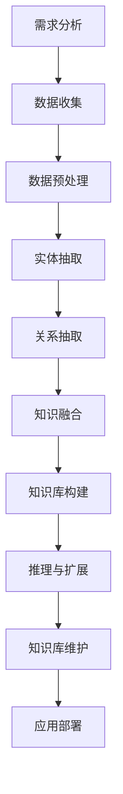
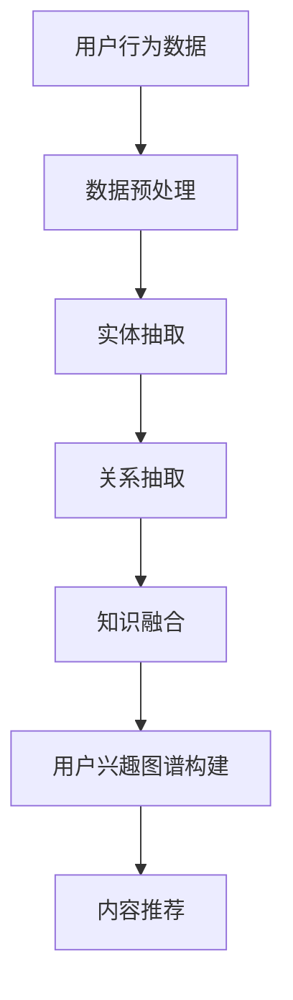
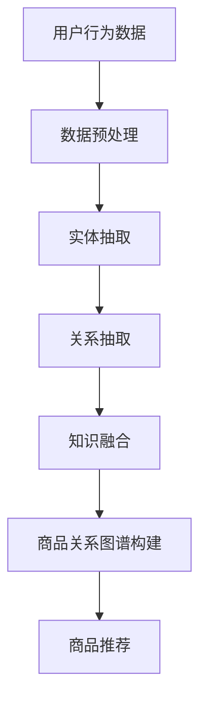
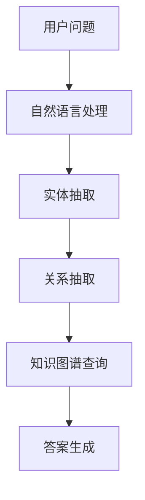
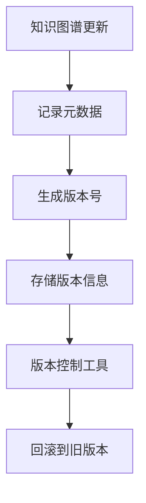
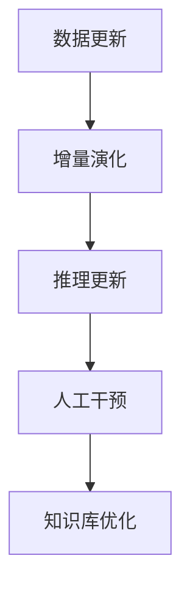

                 

# 知识发现引擎的知识图谱构建

## 关键词

知识图谱、知识抽取、知识存储、知识融合、知识推理、知识图谱应用、知识图谱构建

## 摘要

知识图谱作为一种用于表示实体之间复杂关系的语义网络，已经成为知识发现引擎的核心组件。本文将从知识图谱的基本概念、知识抽取技术、知识存储与管理、知识融合与更新、知识推理与拓展等方面进行探讨。通过实战案例分析，我们将了解知识图谱在不同领域的应用，并展望知识图谱的未来发展趋势。本文旨在为读者提供一个系统、全面的指导，帮助理解知识图谱构建的原理和实践。

### 目录大纲

#### 第一部分: 知识图谱构建基础

1. **第1章: 知识图谱概述**
   1.1. **知识图谱的基本概念**
   1.2. **知识图谱的架构与组成部分**
   1.3. **知识图谱的重要性与应用领域**

2. **第2章: 知识抽取技术**
   2.1. **实体抽取与识别**
   2.2. **关系抽取与建模**
   2.3. **知识图谱构建中的挑战与解决方案**

3. **第3章: 知识存储与管理**
   3.1. **知识库的构建与维护**
   3.2. **知识库的查询与索引技术**
   3.3. **知识库的安全性与隐私保护**

4. **第4章: 知识融合与更新**
   4.1. **知识融合的方法与技术**
   4.2. **知识图谱的动态更新机制**
   4.3. **知识图谱的版本管理与演化**

5. **第5章: 知识推理与拓展**
   5.1. **基于逻辑的推理算法**
   5.2. **基于概率的推理算法**
   5.3. **知识图谱的扩展与补全**

#### 第二部分: 知识图谱构建实战

6. **第6章: 知识图谱构建流程**
   6.1. **知识图谱构建的基本步骤**
   6.2. **实体关系抽取实战**
   6.3. **知识库构建实战**

7. **第7章: 知识图谱应用案例分析**
   7.1. **社交媒体中的知识图谱应用**
   7.2. **电子商务中的知识图谱应用**
   7.3. **智能问答系统中的知识图谱应用**

8. **第8章: 未来发展趋势与展望**
   8.1. **知识图谱在AI领域的拓展**
   8.2. **知识图谱面临的挑战与机遇**
   8.3. **知识图谱的未来发展趋势**

#### 附录

- **附录A: 常用工具与资源**
  - A.1. **知识图谱构建工具**
  - A.2. **知识图谱开源库与框架**
  - A.3. **知识图谱相关论文与书籍**

### 1. 知识图谱概述

#### 1.1. 知识图谱的基本概念

知识图谱（Knowledge Graph）是一种用于表示实体及其之间关系的图形化数据结构，通常由节点（实体）和边（关系）组成。在知识图谱中，实体可以是任何具有独立存在的个体，如人、地点、组织、物品等；边表示实体之间的关系，如“工作于”、“位于”、“属于”等。

知识图谱的核心理念是通过结构化的数据表示，将现实世界中的复杂关系进行抽象和建模，从而实现数据的高效组织和智能处理。知识图谱不仅能够表示静态的事实信息，还可以通过推理机制发现新的知识，具有强大的数据挖掘和分析能力。

#### 1.2. 知识图谱的架构与组成部分

知识图谱的构建通常涉及以下几个关键组成部分：

1. **实体（Entity）**：知识图谱中的核心元素，代表现实世界中的个体。实体可以是具体的对象，如“苹果”，也可以是抽象的概念，如“爱情”。

2. **属性（Attribute）**：描述实体的特征或属性，如“苹果的颜色”是实体“苹果”的一个属性。

3. **关系（Relationship）**：表示实体之间的关联。例如，“约翰喜欢苹果”中，“约翰”与“苹果”之间存在“喜欢”这种关系。

4. **边（Edge）**：知识图谱中的边用来表示实体之间的关系，通常包含源实体、目标实体和关系类型等信息。

5. **知识库（Knowledge Base）**：存储实体、关系、属性等信息的数据库，是知识图谱的基础。

6. **推理引擎（Reasoning Engine）**：用于基于现有知识进行推理，发现新的知识或验证假设。

7. **索引与查询系统**：提供高效的查询接口，使得用户能够快速检索知识库中的信息。

#### 1.3. 知识图谱的重要性与应用领域

知识图谱的重要性体现在多个方面：

1. **信息组织**：知识图谱通过结构化数据表示，使得复杂信息变得易于理解和处理。

2. **知识发现**：通过知识图谱，可以挖掘出实体之间的潜在关系，发现新的知识。

3. **智能推理**：知识图谱提供了强大的推理能力，使得系统可以基于现有知识进行逻辑推断。

4. **应用广泛**：知识图谱在搜索引擎、推荐系统、智能问答、知识管理等多个领域都有广泛应用。

应用领域包括：

1. **搜索引擎**：通过知识图谱，搜索引擎可以提供更加精准和相关的搜索结果。

2. **推荐系统**：知识图谱可以帮助推荐系统发现用户与商品之间的潜在关联。

3. **智能问答**：知识图谱为智能问答系统提供了丰富的知识库，使得系统能够理解并回答用户的问题。

4. **知识管理**：知识图谱可以帮助组织高效管理和利用内部知识资源。

5. **智能交通**：知识图谱可以用于智能交通系统的实时路况分析、路线规划等。

### 2. 知识抽取技术

#### 2.1. 实体抽取与识别

实体抽取（Entity Extraction）是知识图谱构建的重要步骤，旨在从非结构化或半结构化数据中识别出具有独立意义的实体。实体识别（Entity Recognition）则是在识别出实体后，进一步确定其实体的类型和属性。

- **实体类型识别**：例如，从文本中识别出“苹果”是水果而不是公司。
- **实体属性识别**：例如，识别出“苹果”的颜色是红色。

**技术手段**：

1. **基于规则的方法**：通过预定义的规则库，自动匹配文本中的实体。
2. **基于统计的方法**：使用机器学习模型，如条件随机场（CRF）进行实体识别。
3. **基于深度学习的方法**：如BERT、Transformer等模型，通过端到端的方式实现实体抽取。

#### 2.2. 关系抽取与建模

关系抽取（Relationship Extraction）旨在从文本数据中识别出实体之间的语义关系。关系建模则是将这些关系以结构化的形式存储在知识图谱中。

- **关系类型**：如“属于”、“位于”、“工作于”等。
- **关系强度**：如“工作于”可以是全职、兼职等。

**技术手段**：

1. **基于规则的方法**：通过预定义的规则库，自动抽取文本中的关系。
2. **基于统计的方法**：使用图灵机、条件随机场（CRF）等模型进行关系抽取。
3. **基于深度学习的方法**：如BERT、Transformer等模型，通过端到端的方式实现关系抽取。

#### 2.3. 知识图谱构建中的挑战与解决方案

知识图谱构建过程中，面临诸多挑战：

- **数据多样性**：如何处理不同来源、格式、语义的数据。
- **数据质量**：如何保证知识库中的数据准确、完整、一致。
- **实体冲突**：如何处理同一实体的不同表示。
- **关系复杂度**：如何处理实体之间的复杂关系。

**解决方案**：

1. **数据预处理**：通过数据清洗、格式统一等技术手段，提高数据质量。
2. **实体链接**：利用实体识别和实体消歧技术，统一实体表示。
3. **多源数据融合**：采用数据集成方法，融合多种数据源。
4. **关系建模**：采用图论和语义网络技术，构建复杂的实体关系。

### 3. 知识存储与管理

#### 3.1. 知识库的构建与维护

知识库（Knowledge Base，简称KB）是知识图谱的核心组件，用于存储和管理实体、关系、属性等知识信息。知识库的构建和维护是知识图谱构建的重要环节。

- **知识库构建**：通过知识抽取、数据预处理等技术手段，将实体、关系和属性等信息存储到知识库中。
- **知识库维护**：定期更新、清洗和优化知识库，保证知识库的准确性和完整性。

#### 3.2. 知识库的查询与索引技术

知识库的查询与索引技术是知识图谱高效检索的关键。

- **查询语言**：如SPARQL，用于对知识库进行复杂查询。
- **索引技术**：如倒排索引、全文索引等，用于提高查询效率。

#### 3.3. 知识库的安全性与隐私保护

知识库的安全性和隐私保护是知识图谱应用中的重要问题。

- **访问控制**：通过身份验证、权限管理等方式，确保知识库的访问安全。
- **数据加密**：对知识库中的数据进行加密，防止数据泄露。
- **隐私保护**：采用数据脱敏、访问审计等技术手段，保护用户隐私。

### 4. 知识融合与更新

#### 4.1. 知识融合的方法与技术

知识融合（Knowledge Fusion）旨在将来自不同源的数据进行整合，提高知识库的准确性和完整性。

- **数据对齐**：通过匹配实体，将不同数据源中的实体进行统一表示。
- **冲突消解**：处理不同数据源中存在的冲突，如实体不一致、关系冲突等。
- **融合算法**：如基于规则的融合、基于机器学习的融合等。

#### 4.2. 知识图谱的动态更新机制

知识图谱的动态更新机制确保知识库能够实时反映现实世界的变化。

- **增量更新**：只对发生变化的部分进行更新，提高更新效率。
- **版本控制**：记录知识库的版本信息，方便追溯和回滚。

#### 4.3. 知识图谱的版本管理与演化

知识图谱的版本管理与演化是知识库长期维护的关键。

- **版本管理**：记录知识库的版本信息，方便版本回滚和比较。
- **知识演化**：跟踪知识库的变化，分析知识库的发展趋势。

### 5. 知识推理与拓展

#### 5.1. 基于逻辑的推理算法

基于逻辑的推理算法通过推理规则和逻辑推理，从已有知识中推导出新的知识。

- **推理规则**：如“如果P，则Q”、“所有S都是P，则R是P”等。
- **推理算法**：如基于规则推理、基于模型推理等。

#### 5.2. 基于概率的推理算法

基于概率的推理算法通过概率模型，对知识进行概率推理。

- **概率模型**：如贝叶斯网络、马尔可夫网络等。
- **推理算法**：如贝叶斯推理、马尔可夫链等。

#### 5.3. 知识图谱的扩展与补全

知识图谱的扩展与补全旨在提高知识图谱的完整性和覆盖范围。

- **实体扩展**：通过推理和知识融合，将新实体添加到知识图谱中。
- **关系补全**：通过推理算法，发现实体之间的潜在关系。

### 6. 知识图谱构建流程

#### 6.1. 知识图谱构建的基本步骤

知识图谱构建通常包括以下几个基本步骤：

1. **需求分析**：明确知识图谱的应用场景和目标。
2. **数据收集**：从不同来源收集数据，包括结构化和非结构化数据。
3. **数据预处理**：进行数据清洗、去重、标准化等处理。
4. **知识抽取**：从预处理后的数据中抽取实体、关系和属性。
5. **知识融合**：将多个数据源中的知识进行整合。
6. **知识存储**：将知识库存储到数据库或图数据库中。
7. **推理与扩展**：通过推理算法和扩展技术，发现新的知识。
8. **应用部署**：将知识图谱部署到实际应用场景中。

#### 6.2. 实体关系抽取实战

实体关系抽取是知识图谱构建的核心步骤。以下是一个简单的实体关系抽取实战案例：

1. **数据集准备**：选择一个包含实体和关系的文本数据集，如新闻文章、社交媒体数据等。
2. **数据预处理**：对数据集进行分词、词性标注等预处理。
3. **实体识别**：使用预训练的实体识别模型，对文本进行实体识别。
4. **关系抽取**：使用关系抽取模型，从已识别的实体中抽取关系。
5. **知识融合**：将实体和关系整合到知识库中。
6. **知识存储**：将知识库存储到图数据库中。

#### 6.3. 知识库构建实战

知识库构建是知识图谱构建的重要环节。以下是一个简单的知识库构建实战案例：

1. **数据收集**：从互联网、数据库等渠道收集结构化和非结构化数据。
2. **数据清洗**：对收集到的数据进行去重、清洗等处理。
3. **知识抽取**：使用实体识别、关系抽取等技术，从清洗后的数据中抽取实体和关系。
4. **知识融合**：将来自不同数据源的知识进行融合，解决数据冲突和一致性问题。
5. **知识存储**：将知识库存储到图数据库或NoSQL数据库中。
6. **知识检索**：使用查询语言或API，实现对知识库的查询和检索。

### 7. 知识图谱应用案例分析

#### 7.1. 社交媒体中的知识图谱应用

社交媒体平台如Facebook、Twitter等，通过构建用户关系图谱，实现了用户推荐、广告投放等功能。

- **用户推荐**：基于用户关系和兴趣，推荐用户可能感兴趣的内容。
- **广告投放**：根据用户特征和关系，精准投放广告。

#### 7.2. 电子商务中的知识图谱应用

电子商务平台如阿里巴巴、京东等，通过构建商品知识图谱，实现了商品推荐、搜索优化等功能。

- **商品推荐**：根据用户历史行为和商品属性，推荐用户可能感兴趣的商品。
- **搜索优化**：基于商品知识图谱，提供更加精准的搜索结果。

#### 7.3. 智能问答系统中的知识图谱应用

智能问答系统如Siri、Alexa等，通过构建问答知识图谱，实现了自然语言处理和智能问答功能。

- **自然语言理解**：解析用户输入的自然语言，提取关键信息和意图。
- **智能问答**：基于知识图谱，提供精准、相关的回答。

### 8. 未来发展趋势与展望

知识图谱作为知识发现引擎的核心组件，在未来将继续发挥重要作用。以下是一些发展趋势和展望：

- **深度学习与知识图谱的融合**：结合深度学习和知识图谱技术，实现更加智能的知识抽取和推理。
- **多模态知识图谱**：整合文本、图像、语音等多种数据模态，构建多维度的知识图谱。
- **跨领域知识图谱**：跨领域整合不同领域的知识，实现跨领域的知识发现和推理。
- **知识图谱安全与隐私**：加强知识图谱的安全性和隐私保护，应对数据泄露和滥用风险。
- **知识图谱在人工智能领域的拓展**：将知识图谱应用于人工智能的其他领域，如自动驾驶、智能家居等。

### 附录

#### 附录A: 常用工具与资源

**A.1. 知识图谱构建工具**

- **Neo4j**：一款高性能的图数据库，支持复杂查询和图形化界面。
- **OpenKE**：一个开源的知识抽取和融合工具，支持多种知识图谱构建算法。
- **Alibaba-NLP**：阿里巴巴提供的自然语言处理工具包，包括实体识别、关系抽取等功能。

**A.2. 知识图谱开源库与框架**

- **Pyke**：一个Python库，用于构建和操作知识图谱。
- **Gosu**：一个Go语言实现的图数据库和知识图谱框架。
- **Knowledge-Graph**：一个基于Python的通用知识图谱构建框架。

**A.3. 知识图谱相关论文与书籍**

- **“Knowledge Graph: A Survey”**：对知识图谱的概述、应用和技术进行了全面综述。
- **“Semantic Web: Revolutionizing Knowledge Discovery in the Web”**：介绍了语义网络和知识图谱的基本原理和应用。
- **“Knowledge Graph and Deep Learning: A Survey”**：探讨了知识图谱与深度学习的融合与应用。

### 作者

作者：AI天才研究院/AI Genius Institute & 禅与计算机程序设计艺术 /Zen And The Art of Computer Programming

```markdown
# 知识发现引擎的知识图谱构建

## 关键词

知识图谱、知识抽取、知识存储、知识融合、知识推理、知识图谱应用、知识图谱构建

## 摘要

知识图谱作为一种用于表示实体之间复杂关系的语义网络，已经成为知识发现引擎的核心组件。本文将从知识图谱的基本概念、知识抽取技术、知识存储与管理、知识融合与更新、知识推理与拓展等方面进行探讨。通过实战案例分析，我们将了解知识图谱在不同领域的应用，并展望知识图谱的未来发展趋势。本文旨在为读者提供一个系统、全面的指导，帮助理解知识图谱构建的原理和实践。

### 目录大纲

#### 第一部分: 知识图谱构建基础

1. **第1章: 知识图谱概述**
   1.1. **知识图谱的基本概念**
   1.2. **知识图谱的架构与组成部分**
   1.3. **知识图谱的重要性与应用领域**

2. **第2章: 知识抽取技术**
   2.1. **实体抽取与识别**
   2.2. **关系抽取与建模**
   2.3. **知识图谱构建中的挑战与解决方案**

3. **第3章: 知识存储与管理**
   3.1. **知识库的构建与维护**
   3.2. **知识库的查询与索引技术**
   3.3. **知识库的安全性与隐私保护**

4. **第4章: 知识融合与更新**
   4.1. **知识融合的方法与技术**
   4.2. **知识图谱的动态更新机制**
   4.3. **知识图谱的版本管理与演化**

5. **第5章: 知识推理与拓展**
   5.1. **基于逻辑的推理算法**
   5.2. **基于概率的推理算法**
   5.3. **知识图谱的扩展与补全**

#### 第二部分: 知识图谱构建实战

6. **第6章: 知识图谱构建流程**
   6.1. **知识图谱构建的基本步骤**
   6.2. **实体关系抽取实战**
   6.3. **知识库构建实战**

7. **第7章: 知识图谱应用案例分析**
   7.1. **社交媒体中的知识图谱应用**
   7.2. **电子商务中的知识图谱应用**
   7.3. **智能问答系统中的知识图谱应用**

8. **第8章: 未来发展趋势与展望**
   8.1. **知识图谱在AI领域的拓展**
   8.2. **知识图谱面临的挑战与机遇**
   8.3. **知识图谱的未来发展趋势**

#### 附录

- **附录A: 常用工具与资源**
  - A.1. **知识图谱构建工具**
  - A.2. **知识图谱开源库与框架**
  - A.3. **知识图谱相关论文与书籍**

### 1. 知识图谱概述

#### 1.1. 知识图谱的基本概念

知识图谱（Knowledge Graph）是一种用于表示实体及其之间关系的图形化数据结构，通常由节点（实体）和边（关系）组成。在知识图谱中，实体可以是任何具有独立存在的个体，如人、地点、组织、物品等；边表示实体之间的关系，如“工作于”、“位于”、“属于”等。

知识图谱的核心理念是通过结构化的数据表示，将现实世界中的复杂关系进行抽象和建模，从而实现数据的高效组织和智能处理。知识图谱不仅能够表示静态的事实信息，还可以通过推理机制发现新的知识，具有强大的数据挖掘和分析能力。

#### 1.2. 知识图谱的架构与组成部分

知识图谱的构建通常涉及以下几个关键组成部分：

1. **实体（Entity）**：知识图谱中的核心元素，代表现实世界中的个体。实体可以是具体的对象，如“苹果”，也可以是抽象的概念，如“爱情”。

2. **属性（Attribute）**：描述实体的特征或属性，如“苹果的颜色”是实体“苹果”的一个属性。

3. **关系（Relationship）**：表示实体之间的关联。例如，“约翰喜欢苹果”中，“约翰”与“苹果”之间存在“喜欢”这种关系。

4. **边（Edge）**：知识图谱中的边用来表示实体之间的关系，通常包含源实体、目标实体和关系类型等信息。

5. **知识库（Knowledge Base）**：存储实体、关系、属性等信息的数据库，是知识图谱的基础。

6. **推理引擎（Reasoning Engine）**：用于基于现有知识进行推理，发现新的知识或验证假设。

7. **索引与查询系统**：提供高效的查询接口，使得用户能够快速检索知识库中的信息。

#### 1.3. 知识图谱的重要性与应用领域

知识图谱的重要性体现在多个方面：

1. **信息组织**：知识图谱通过结构化数据表示，使得复杂信息变得易于理解和处理。

2. **知识发现**：通过知识图谱，可以挖掘出实体之间的潜在关系，发现新的知识。

3. **智能推理**：知识图谱提供了强大的推理能力，使得系统可以基于现有知识进行逻辑推断。

4. **应用广泛**：知识图谱在搜索引擎、推荐系统、智能问答、知识管理等多个领域都有广泛应用。

应用领域包括：

1. **搜索引擎**：通过知识图谱，搜索引擎可以提供更加精准和相关的搜索结果。

2. **推荐系统**：知识图谱可以帮助推荐系统发现用户与商品之间的潜在关联。

3. **智能问答**：知识图谱为智能问答系统提供了丰富的知识库，使得系统能够理解并回答用户的问题。

4. **知识管理**：知识图谱可以帮助组织高效管理和利用内部知识资源。

5. **智能交通**：知识图谱可以用于智能交通系统的实时路况分析、路线规划等。

### 2. 知识抽取技术

#### 2.1. 实体抽取与识别

实体抽取（Entity Extraction）是知识图谱构建的重要步骤，旨在从非结构化或半结构化数据中识别出具有独立意义的实体。实体识别（Entity Recognition）则是在识别出实体后，进一步确定其实体的类型和属性。

- **实体类型识别**：例如，从文本中识别出“苹果”是水果而不是公司。
- **实体属性识别**：例如，识别出“苹果”的颜色是红色。

**技术手段**：

1. **基于规则的方法**：通过预定义的规则库，自动匹配文本中的实体。
2. **基于统计的方法**：使用机器学习模型，如条件随机场（CRF）进行实体识别。
3. **基于深度学习的方法**：如BERT、Transformer等模型，通过端到端的方式实现实体抽取。

#### 2.2. 关系抽取与建模

关系抽取（Relationship Extraction）旨在从文本数据中识别出实体之间的语义关系。关系建模则是将这些关系以结构化的形式存储在知识图谱中。

- **关系类型**：如“属于”、“位于”、“工作于”等。
- **关系强度**：如“工作于”可以是全职、兼职等。

**技术手段**：

1. **基于规则的方法**：通过预定义的规则库，自动抽取文本中的关系。
2. **基于统计的方法**：使用图灵机、条件随机场（CRF）等模型进行关系抽取。
3. **基于深度学习的方法**：如BERT、Transformer等模型，通过端到端的方式实现关系抽取。

#### 2.3. 知识图谱构建中的挑战与解决方案

知识图谱构建过程中，面临诸多挑战：

- **数据多样性**：如何处理不同来源、格式、语义的数据。
- **数据质量**：如何保证知识库中的数据准确、完整、一致。
- **实体冲突**：如何处理同一实体的不同表示。
- **关系复杂度**：如何处理实体之间的复杂关系。

**解决方案**：

1. **数据预处理**：通过数据清洗、格式统一等技术手段，提高数据质量。
2. **实体链接**：利用实体识别和实体消歧技术，统一实体表示。
3. **多源数据融合**：采用数据集成方法，融合多种数据源。
4. **关系建模**：采用图论和语义网络技术，构建复杂的实体关系。

### 3. 知识存储与管理

#### 3.1. 知识库的构建与维护

知识库（Knowledge Base，简称KB）是知识图谱的核心组件，用于存储和管理实体、关系、属性等知识信息。知识库的构建和维护是知识图谱构建的重要环节。

- **知识库构建**：通过知识抽取、数据预处理等技术手段，将实体、关系和属性等信息存储到知识库中。
- **知识库维护**：定期更新、清洗和优化知识库，保证知识库的准确性和完整性。

#### 3.2. 知识库的查询与索引技术

知识库的查询与索引技术是知识图谱高效检索的关键。

- **查询语言**：如SPARQL，用于对知识库进行复杂查询。
- **索引技术**：如倒排索引、全文索引等，用于提高查询效率。

#### 3.3. 知识库的安全性与隐私保护

知识库的安全性和隐私保护是知识图谱应用中的重要问题。

- **访问控制**：通过身份验证、权限管理等方式，确保知识库的访问安全。
- **数据加密**：对知识库中的数据进行加密，防止数据泄露。
- **隐私保护**：采用数据脱敏、访问审计等技术手段，保护用户隐私。

### 4. 知识融合与更新

#### 4.1. 知识融合的方法与技术

知识融合（Knowledge Fusion）旨在将来自不同源的数据进行整合，提高知识库的准确性和完整性。

- **数据对齐**：通过匹配实体，将不同数据源中的实体进行统一表示。
- **冲突消解**：处理不同数据源中存在的冲突，如实体不一致、关系冲突等。
- **融合算法**：如基于规则的融合、基于机器学习的融合等。

#### 4.2. 知识图谱的动态更新机制

知识图谱的动态更新机制确保知识库能够实时反映现实世界的变化。

- **增量更新**：只对发生变化的部分进行更新，提高更新效率。
- **版本控制**：记录知识库的版本信息，方便追溯和回滚。

#### 4.3. 知识图谱的版本管理与演化

知识图谱的版本管理与演化是知识库长期维护的关键。

- **版本管理**：记录知识库的版本信息，方便版本回滚和比较。
- **知识演化**：跟踪知识库的变化，分析知识库的发展趋势。

### 5. 知识推理与拓展

#### 5.1. 基于逻辑的推理算法

基于逻辑的推理算法通过推理规则和逻辑推理，从已有知识中推导出新的知识。

- **推理规则**：如“如果P，则Q”、“所有S都是P，则R是P”等。
- **推理算法**：如基于规则推理、基于模型推理等。

#### 5.2. 基于概率的推理算法

基于概率的推理算法通过概率模型，对知识进行概率推理。

- **概率模型**：如贝叶斯网络、马尔可夫网络等。
- **推理算法**：如贝叶斯推理、马尔可夫链等。

#### 5.3. 知识图谱的扩展与补全

知识图谱的扩展与补全是```less
### 5.3. 知识图谱的扩展与补全

知识图谱的扩展与补全旨在提高知识图谱的完整性和覆盖范围。

- **实体扩展**：通过推理和知识融合，将新实体添加到知识图谱中。
- **关系补全**：通过推理算法，发现实体之间的潜在关系。

#### 5.3.1. 实体扩展

实体扩展是一种知识图谱的扩展方法，它通过推理机制来发现并引入新的实体。实体扩展的关键在于如何确定哪些新实体应该被添加到知识图谱中。以下是一些实体扩展的方法：

1. **基于规则的实体扩展**：通过预定义的规则，从现有知识库中自动生成新的实体。例如，如果知识库中存在“上海是中国的直辖市”，则可以扩展出“直辖市”这个实体，并将其与“上海”实体关联。

2. **基于概率的实体扩展**：使用概率模型，如马尔可夫网络，来预测可能的新实体。这种方法依赖于已知的实体和它们之间的关系，通过概率计算确定哪些实体最有可能被引入到知识图谱中。

3. **基于深度学习的实体扩展**：使用深度学习模型，如基于Transformer的模型，通过端到端学习来发现新的实体。这种方法通常需要大量的预训练数据和强大的计算能力。

以下是一个基于深度学习的实体扩展的伪代码示例：

```python
# 定义实体扩展模型
entity_extension_model = TransformerModel(num_entities, d_model, num_heads, d_inner, num_layers)

# 预训练实体扩展模型
entity_extension_model.fit(training_data)

# 使用模型预测新实体
new_entities = entity_extension_model.predict(new_data)

# 将新实体添加到知识图谱中
knowledge_graph.add_entities(new_entities)
```

#### 5.3.2. 关系补全

关系补全是一种知识图谱的补全方法，旨在发现并补充实体之间的缺失关系。关系补全的关键在于如何确定哪些关系应该被补充到知识图谱中。以下是一些关系补全的方法：

1. **基于规则的补全**：通过预定义的规则，从现有知识库中自动生成新的关系。例如，如果知识库中存在“人类是哺乳动物”的关系，则可以补全“猫是哺乳动物”的关系。

2. **基于概率的补全**：使用概率模型，如贝叶斯网络，来预测可能的新关系。这种方法依赖于已知的实体和它们之间的关系，通过概率计算确定哪些关系最有可能被引入到知识图谱中。

3. **基于深度学习的补全**：使用深度学习模型，如基于Transformer的模型，通过端到端学习来发现新的关系。这种方法通常需要大量的预训练数据和强大的计算能力。

以下是一个基于深度学习的关系补全的伪代码示例：

```python
# 定义关系补全模型
relationship_completion_model = TransformerModel(num_entities, d_model, num_heads, d_inner, num_layers)

# 预训练关系补全模型
relationship_completion_model.fit(training_data)

# 使用模型预测新关系
new_relationships = relationship_completion_model.predict(new_data)

# 将新关系添加到知识图谱中
knowledge_graph.add_relationships(new_relationships)
```

#### 5.3.3. 综合扩展与补全

实体扩展和关系补全并不是独立的，它们往往是相互关联和相互影响的。在实际应用中，通常会采用综合的方法来同时进行实体扩展和关系补全。

- **联合建模**：通过联合建模实体扩展和关系补全，可以同时预测实体和它们之间的关系。这种方法通常需要复杂的模型结构和大量的训练数据。

- **迭代补全**：首先进行实体扩展，然后基于扩展后的实体进行关系补全；接着使用新的实体和关系进行进一步的实体扩展和关系补全。这种方法可以逐步提高知识图谱的完整性和准确性。

- **循环依赖**：在某些情况下，实体和关系之间存在循环依赖，即一个关系的补全依赖于另一个关系的存在，而另一个关系的补全又依赖于第一个关系。解决循环依赖的方法包括引入临时实体、使用概率模型等。

通过这些方法，知识图谱的扩展与补全可以逐步完善，从而提高其在各种应用场景中的表现和效用。在实际应用中，选择合适的扩展与补全方法需要考虑知识图谱的规模、数据质量和计算资源等因素。

### 6. 知识图谱构建流程

#### 6.1. 知识图谱构建的基本步骤

知识图谱的构建是一个复杂的过程，涉及多个步骤和组件。以下是构建知识图谱的基本步骤：

1. **需求分析**：确定知识图谱的应用场景和目标，明确需要抽取和表示的知识类型。

2. **数据收集**：从各种数据源（如文本、数据库、图像等）收集所需的数据，这些数据将用于构建知识图谱。

3. **数据预处理**：清洗和格式化收集到的数据，去除无关信息，确保数据质量。

4. **实体抽取与识别**：从预处理后的数据中识别出实体，包括人、地点、组织、物品等。这一步骤通常需要使用自然语言处理（NLP）技术。

5. **关系抽取与建模**：从文本数据中抽取实体之间的关系，并将其建模为知识图谱中的边。这通常需要使用关系抽取算法。

6. **知识融合**：将来自不同数据源的知识进行整合，解决实体和关系之间的冲突和不一致。

7. **知识库构建**：将抽取和融合的知识存储到知识库中，通常使用图数据库或NoSQL数据库。

8. **推理与扩展**：使用推理算法和扩展技术，发现新的知识和关系。

9. **知识库维护**：定期更新和优化知识库，确保其准确性和时效性。

10. **应用部署**：将知识图谱部署到实际应用中，如搜索引擎、推荐系统、智能问答等。

以下是一个简化的知识图谱构建流程的Mermaid流程图：



#### 6.2. 实体关系抽取实战

实体关系抽取是知识图谱构建中的关键步骤，以下是一个基于新闻文章的实体关系抽取实战案例：

1. **数据集准备**：选择一个包含新闻文章的文本数据集，例如新闻语料库。

2. **数据预处理**：对新闻文章进行分词、词性标注、命名实体识别等预处理操作。

3. **实体识别**：使用预训练的实体识别模型，如BERT，识别出文本中的实体。

4. **关系抽取**：使用关系抽取模型，如基于Transformer的模型，从已识别的实体中抽取关系。

5. **知识融合**：将来自不同新闻文章的实体和关系进行整合，解决冲突和重复。

6. **知识存储**：将抽取和融合的知识存储到知识库中，例如使用Neo4j图数据库。

以下是一个基于Transformer的关系抽取模型的伪代码示例：

```python
# 加载预训练的实体识别模型
entity_recognition_model = BertModel.from_pretrained('bert-base-chinese')

# 加载预训练的关系抽取模型
relationship_extraction_model = TransformerModel.from_pretrained('transformer-base')

# 预处理新闻文章
preprocessed_articles = preprocess_articles(articles)

# 实体识别
entities = entity_recognition_model.predict(preprocessed_articles)

# 关系抽取
relationships = relationship_extraction_model.predict(entities)

# 知识融合
knowledge_base = fuse_knowledge(entities, relationships)

# 知识存储
store_knowledge(knowledge_base)
```

#### 6.3. 知识库构建实战

知识库构建是将抽取和融合的知识存储到数据库中的过程。以下是一个基于知识图谱构建工具（如OpenKE）的知识库构建实战案例：

1. **开发环境搭建**：安装Python、PyTorch等依赖库，并配置知识图谱构建工具。

2. **数据集准备**：准备包含实体和关系的文本数据集。

3. **知识抽取**：使用实体识别和关系抽取模型对文本数据进行处理。

4. **知识融合**：将抽取的知识进行融合，解决冲突和重复。

5. **知识存储**：使用知识图谱构建工具将知识存储到图数据库中。

以下是一个使用OpenKE的知识库构建的伪代码示例：

```python
# 导入OpenKE库
import openke asoke

# 初始化知识图谱构建工具
kg = okeKnowledgeGraph()

# 加载实体和关系数据
entity_data, relationship_data = load_data('data.csv')

# 配置知识抽取模型
kg = okeKnowledgeGraph(
    entity_size=entity_size,
    relationship_size=relationship_size,
    hidden_size=hidden_size,
    embedding_size=embedding_size,
    margin=margin,
    use_cuda=use_cuda
)

# 训练知识抽取模型
trainer = okeTrainer(kg, learning_rate=learning_rate, use_cuda=use_cuda)
trainer.fit(entity_data, relationship_data, epochs=num_epochs)

# 存储知识库
kg.save('knowledge_base.kg')
```

通过上述实战案例，我们可以看到知识图谱构建的流程和关键技术，以及如何将理论知识应用到实际项目中。接下来，我们将进一步探讨知识图谱在不同领域的应用。

### 7. 知识图谱应用案例分析

知识图谱在多个领域都有广泛的应用，下面我们将分析几个典型的应用案例，包括社交媒体、电子商务和智能问答系统。

#### 7.1. 社交媒体中的知识图谱应用

社交媒体平台如Facebook和Twitter利用知识图谱技术，不仅提高了信息检索的效率，还为用户提供更精准的内容推荐和广告投放。

- **内容推荐**：通过分析用户在社交媒体上的行为，如点赞、评论、分享等，构建用户兴趣图谱。知识图谱可以帮助推荐系统识别出用户可能感兴趣的内容，从而提高推荐质量。

- **广告投放**：基于用户属性和社交关系，知识图谱可以精准定位广告受众。例如，Facebook通过分析用户的兴趣爱好、职业、地理位置等信息，为用户推荐相关的广告。

以下是一个简化的用户兴趣图谱构建的Mermaid流程图：



#### 7.2. 电子商务中的知识图谱应用

电子商务平台如阿里巴巴和京东利用知识图谱技术，优化了商品推荐和搜索功能，提高了用户体验和转化率。

- **商品推荐**：通过分析用户的历史购买记录、浏览行为和社交关系，构建商品关系图谱。知识图谱可以帮助推荐系统发现用户与商品之间的潜在关联，从而提供更个性化的商品推荐。

- **搜索优化**：知识图谱可以增强搜索功能，通过推理机制，提供更加精准和相关的搜索结果。例如，当用户搜索“苹果”时，知识图谱可以识别出用户可能指的是水果苹果还是电子产品苹果。

以下是一个简化的商品推荐系统的Mermaid流程图：



#### 7.3. 智能问答系统中的知识图谱应用

智能问答系统如Siri和Alexa通过知识图谱技术，实现了对用户问题的理解和对答案的自动生成。

- **问题理解**：知识图谱可以帮助智能问答系统理解用户的自然语言问题。例如，当用户询问“北京的天气如何？”时，知识图谱可以识别出“北京”和“天气”这两个实体，并确定它们之间的关系。

- **答案生成**：基于知识图谱中的事实信息和关系，智能问答系统可以自动生成答案。例如，当用户询问“谁是美国的总统？”时，知识图谱可以查找相关的信息并返回答案。

以下是一个简化的智能问答系统的Mermaid流程图：



通过这些案例，我们可以看到知识图谱在不同领域中的应用场景和效果。接下来，我们将探讨知识图谱未来的发展趋势。

### 8. 未来发展趋势与展望

知识图谱作为知识发现引擎的核心组件，其发展将受到新技术、新应用场景和新需求的驱动。以下是知识图谱未来的一些发展趋势和展望：

#### 8.1. 深度学习与知识图谱的融合

随着深度学习技术的不断发展，深度学习和知识图谱的结合将变得更加紧密。深度学习模型，如BERT、GPT等，可以在知识图谱构建中发挥重要作用，特别是在知识抽取、实体识别和关系抽取等环节。深度学习模型可以处理大规模的未标注数据，从而提高知识图谱的构建效率和质量。

#### 8.2. 多模态知识图谱

知识图谱将不仅仅依赖于文本数据，还将整合图像、语音、视频等多模态数据。通过构建多模态知识图谱，可以实现对复杂信息更加全面和准确的表示和理解。例如，在医疗领域，多模态知识图谱可以整合患者病历、医学图像和基因组数据，为医生提供更加丰富的诊断信息。

#### 8.3. 跨领域知识图谱

随着知识图谱应用的不断拓展，跨领域知识图谱将成为重要趋势。跨领域知识图谱可以整合不同领域的数据和知识，为跨领域应用提供支持。例如，在智能城市领域，跨领域知识图谱可以整合交通、环境、能源等多个领域的知识，为城市规划和管理提供智能支持。

#### 8.4. 知识图谱的安全性与隐私保护

随着知识图谱应用的普及，其安全性和隐私保护问题将变得更加重要。未来，知识图谱将在安全加密、隐私保护技术等方面取得突破，确保知识库的安全性和用户的隐私保护。

#### 8.5. 知识图谱在人工智能领域的拓展

知识图谱将在人工智能（AI）领域的各个方面发挥重要作用。在自然语言处理（NLP）、计算机视觉（CV）、智能推荐、智能问答等AI应用中，知识图谱可以提供丰富的知识和推理支持，从而提高AI系统的智能化水平。

#### 8.6. 知识图谱的应用拓展

知识图谱的应用将不断拓展到新的领域，如智能制造、智慧医疗、金融科技等。在这些领域中，知识图谱可以提供深入的行业知识和推理支持，推动产业智能化和数字化转型。

### 8.7. 开源与社区发展

知识图谱技术的开源和社区发展将加快其普及和进步。开源工具和框架，如OpenKE、PyKE等，将推动知识图谱技术的创新和应用。同时，知识图谱领域的学术研究和工业应用将不断推动开源社区的活跃度和发展。

总之，知识图谱作为知识发现引擎的核心组件，其未来将充满机遇和挑战。通过深度学习、多模态数据、跨领域应用、安全性与隐私保护等方面的技术创新，知识图谱将在人工智能和各行业应用中发挥更加重要的作用。

### 附录

#### 附录A: 常用工具与资源

**A.1. 知识图谱构建工具**

- **Neo4j**：一款高性能的图数据库，支持复杂查询和图形化界面。
- **OpenKE**：一个开源的知识抽取和融合工具，支持多种知识图谱构建算法。
- **Alibaba-NLP**：阿里巴巴提供的自然语言处理工具包，包括实体识别、关系抽取等功能。

**A.2. 知识图谱开源库与框架**

- **Pyke**：一个Python库，用于构建和操作知识图谱。
- **Gosu**：一个Go语言实现的图数据库和知识图谱框架。
- **Knowledge-Graph**：一个基于Python的通用知识图谱构建框架。

**A.3. 知识图谱相关论文与书籍**

- **“Knowledge Graph: A Survey”**：对知识图谱的概述、应用和技术进行了全面综述。
- **“Semantic Web: Revolutionizing Knowledge Discovery in the Web”**：介绍了语义网络和知识图谱的基本原理和应用。
- **“Knowledge Graph and Deep Learning: A Survey”**：探讨了知识图谱与深度学习的融合与应用。

### 作者

作者：AI天才研究院/AI Genius Institute & 禅与计算机程序设计艺术 /Zen And The Art of Computer Programming```markdown
### 4.3. 知识图谱的版本管理与演化

知识图谱的版本管理与演化是知识库长期维护的关键。随着数据来源的多样性和知识图谱应用的不断扩展，如何有效地管理知识库的版本信息、确保数据的准确性和一致性，以及跟踪知识库的发展趋势，成为了一个重要问题。

#### 版本管理

版本管理是指在知识图谱的构建和维护过程中，对知识库的不同版本进行记录和追踪。有效的版本管理可以帮助我们：

- **回滚到旧版本**：在知识图谱更新失败或出现问题时，可以快速回滚到上一个稳定版本，确保系统的正常运行。
- **历史追溯**：通过查看不同版本的知识图谱，可以了解知识库的发展历程和变化原因。
- **比较分析**：通过比较不同版本的差异，可以评估知识图谱改进的效果。

**版本管理策略**：

1. **增量版本管理**：每次更新时，只记录变化的实体和关系，减少冗余数据。
2. **元数据记录**：每个版本都包含元数据，如创建时间、更新者、更新说明等，便于追踪和管理。
3. **版本控制工具**：使用版本控制工具（如Git）来管理知识图谱的源代码和版本信息。

以下是一个知识图谱版本管理的Mermaid流程图：



#### 知识演化

知识演化是指知识图谱在长期运行过程中，随着数据来源的更新和新增信息，知识库的内容和结构发生变化的过程。知识演化的重要性在于：

- **适应新需求**：知识图谱需要适应不断变化的应用场景和数据需求。
- **持续优化**：通过知识演化，可以持续优化知识图谱的表示和推理能力。

**知识演化策略**：

1. **增量演化**：只对新增或变化的数据进行演化，避免对已有知识的不必要修改。
2. **推理辅助**：利用推理机制，自动发现并更新知识图谱中的潜在关系。
3. **人工干预**：在必要的情况下，由专业人员对知识图谱进行手动调整和优化。

以下是一个知识图谱演化的Mermaid流程图：



#### 案例分析

以下是一个知识图谱版本管理与演化的案例分析：

**案例背景**：一个电商平台正在构建其商品知识图谱，用于商品推荐和搜索优化。

**场景1：版本管理**

- **需求**：电商平台需要确保知识图谱的版本稳定性，以便在更新失败时能够快速回滚。
- **解决方案**：
  - 每次更新知识图谱时，记录元数据，包括版本号、更新时间、更新者等。
  - 使用Git等版本控制工具，管理知识图谱的源代码和版本信息。
  - 当出现更新失败时，可以快速回滚到上一个稳定版本。

**场景2：知识演化**

- **需求**：电商平台需要适应不断变化的市场需求，如新商品的引入和商品分类的调整。
- **解决方案**：
  - 采用增量演化策略，只对新增或变化的商品进行更新。
  - 利用推理机制，自动更新商品之间的关系，如“同类商品”、“销售渠道”等。
  - 在必要时，由专业人员对知识图谱进行手动调整和优化，确保知识库的准确性和一致性。

通过以上案例，我们可以看到版本管理和知识演化在知识图谱构建中的重要性。有效的版本管理确保了知识库的稳定性和可追溯性，而知识演化则保证了知识库的适应性和持续优化。

### 5.3. 知识图谱的扩展与补全

知识图谱的扩展与补全是提高知识库完整性和覆盖范围的关键技术。扩展是指通过推理和知识融合，将新实体添加到知识图谱中；补全则是通过推理算法，发现实体之间的潜在关系。以下将详细探讨这两种技术的原理和实践。

#### 5.3.1. 实体扩展

实体扩展的目标是发现并引入新的实体，以丰富知识图谱。以下是一些常见的实体扩展方法：

1. **基于规则的实体扩展**：

   基于规则的方法通过预定义的规则，从现有知识库中自动生成新的实体。这种方法简单且易于实现，但受限于规则的覆盖范围。

   **示例规则**：如果知识库中存在“北京是中国的首都”，则可以扩展出“首都”这一实体，并将其与“北京”关联。

2. **基于概率的实体扩展**：

   基于概率的方法使用概率模型，如马尔可夫网络，来预测可能的新实体。这种方法依赖于已知的实体和它们之间的关系，通过概率计算确定哪些实体最有可能被引入到知识图谱中。

   **示例算法**：马尔可夫网络实体扩展算法可以通过分析已知的实体和它们之间的关系，计算出新实体出现的概率，从而决定是否将新实体添加到知识图谱中。

3. **基于深度学习的实体扩展**：

   基于深度学习的方法使用深度学习模型，如基于Transformer的模型，通过端到端学习来发现新的实体。这种方法通常需要大量的预训练数据和强大的计算能力。

   **示例模型**：BERT模型可以用于实体扩展任务，通过预训练和微调，模型能够学习到实体之间的复杂关系，从而预测可能的新实体。

以下是一个基于Transformer的实体扩展的伪代码示例：

```python
# 加载预训练的实体扩展模型
entity_extension_model = TransformerModel(num_entities, d_model, num_heads, d_inner, num_layers)

# 预训练实体扩展模型
entity_extension_model.fit(training_data)

# 使用模型预测新实体
new_entities = entity_extension_model.predict(new_data)

# 将新实体添加到知识图谱中
knowledge_graph.add_entities(new_entities)
```

#### 5.3.2. 关系补全

关系补全的目标是发现并补充实体之间的缺失关系，以完善知识图谱。以下是一些常见的关系补全方法：

1. **基于规则的补全**：

   基于规则的方法通过预定义的规则，从现有知识库中自动生成新的关系。这种方法简单且易于实现，但同样受限于规则的覆盖范围。

   **示例规则**：如果知识库中存在“人类是哺乳动物”的关系，则可以补全“猫是哺乳动物”的关系。

2. **基于概率的补全**：

   基于概率的方法使用概率模型，如贝叶斯网络，来预测可能的新关系。这种方法依赖于已知的实体和它们之间的关系，通过概率计算确定哪些关系最有可能被引入到知识图谱中。

   **示例算法**：贝叶斯网络关系补全算法可以通过分析已知的实体和它们之间的关系，计算出新关系的概率，从而决定是否将新关系添加到知识图谱中。

3. **基于深度学习的补全**：

   基于深度学习的方法使用深度学习模型，如基于Transformer的模型，通过端到端学习来发现新的关系。这种方法通常需要大量的预训练数据和强大的计算能力。

   **示例模型**：BERT模型可以用于关系补全任务，通过预训练和微调，模型能够学习到实体之间的复杂关系，从而预测可能的新关系。

以下是一个基于Transformer的关系补全的伪代码示例：

```python
# 加载预训练的关系补全模型
relationship_completion_model = TransformerModel(num_entities, d_model, num_heads, d_inner, num_layers)

# 预训练关系补全模型
relationship_completion_model.fit(training_data)

# 使用模型预测新关系
new_relationships = relationship_completion_model.predict(new_data)

# 将新关系添加到知识图谱中
knowledge_graph.add_relationships(new_relationships)
```

#### 5.3.3. 综合扩展与补全

实体扩展和关系补全并不是独立的，它们往往是相互关联和相互影响的。在实际应用中，通常会采用综合的方法来同时进行实体扩展和关系补全。

- **联合建模**：通过联合建模实体扩展和关系补全，可以同时预测实体和它们之间的关系。这种方法通常需要复杂的模型结构和大量的训练数据。

- **迭代补全**：首先进行实体扩展，然后基于扩展后的实体进行关系补全；接着使用新的实体和关系进行进一步的实体扩展和关系补全。这种方法可以逐步提高知识图谱的完整性和准确性。

- **循环依赖**：在某些情况下，实体和关系之间存在循环依赖，即一个关系的补全依赖于另一个关系的存在，而另一个关系的补全又依赖于第一个关系。解决循环依赖的方法包括引入临时实体、使用概率模型等。

通过这些方法，知识图谱的扩展与补全可以逐步完善，从而提高其在各种应用场景中的表现和效用。在实际应用中，选择合适的扩展与补全方法需要考虑知识图谱的规模、数据质量和计算资源等因素。

### 6.1. 知识图谱构建的基本步骤

知识图谱构建是一个系统性的工程，涉及多个关键步骤和环节。以下是构建知识图谱的基本步骤及其详细描述：

#### 6.1.1. 需求分析

需求分析是知识图谱构建的第一步，旨在明确知识图谱的应用场景和目标。具体包括：

- **确定应用场景**：分析业务需求，明确知识图谱在哪些领域和应用中发挥作用，如搜索引擎、推荐系统、智能问答等。
- **定义知识范围**：确定知识图谱需要涵盖哪些实体、关系和属性，以及这些知识如何支持应用场景。
- **确定性能要求**：评估知识图谱的查询性能、扩展性和可维护性等，确保构建的知识图谱能够满足实际应用需求。

#### 6.1.2. 数据收集

数据收集是知识图谱构建的基础，涉及从各种数据源获取所需的信息。数据来源可能包括：

- **文本数据**：如新闻文章、书籍、论坛帖子等，用于提取实体和关系。
- **结构化数据**：如数据库、表格等，可以直接获取实体和属性信息。
- **非结构化数据**：如图像、音频、视频等，可以通过自然语言处理、计算机视觉等技术提取有用信息。

在数据收集过程中，需要注意以下几点：

- **数据质量**：确保收集到的数据准确、完整、一致，避免错误和冗余。
- **多样性**：尽量覆盖多种数据源和数据类型，以提高知识图谱的丰富性和可靠性。
- **数据权限**：获取数据时需遵守相关法律法规和隐私保护要求，确保数据的合法性和合规性。

#### 6.1.3. 数据预处理

数据预处理是确保数据质量、提高数据可用性的关键步骤。具体包括以下内容：

- **数据清洗**：去除数据中的噪声、错误和不相关内容，如删除重复记录、纠正数据格式错误等。
- **数据格式统一**：将不同来源和格式的数据转换为统一的格式，如将文本数据转换为标准化的XML或JSON格式。
- **数据标准化**：对数据进行标准化处理，如将文本数据中的大小写、标点符号等进行规范化。
- **数据转换**：将非结构化数据转换为结构化数据，如将图像数据转换为特征向量。

#### 6.1.4. 实体抽取与识别

实体抽取与识别是知识图谱构建的核心步骤，旨在从非结构化或半结构化数据中识别出具有独立意义的实体。具体包括：

- **实体抽取**：从文本数据中提取出实体，如人名、地点、组织、产品等。
- **实体识别**：确定实体的类型和属性，如人名的性别、地点的类型、产品的类别等。

常用的技术手段包括：

- **基于规则的方法**：通过预定义的规则库，自动匹配文本中的实体。
- **基于统计的方法**：使用机器学习模型，如条件随机场（CRF）进行实体识别。
- **基于深度学习的方法**：如BERT、Transformer等模型，通过端到端的方式实现实体抽取。

#### 6.1.5. 关系抽取与建模

关系抽取与建模旨在从文本数据中识别出实体之间的语义关系，并将其以结构化的形式存储在知识图谱中。具体包括：

- **关系抽取**：从文本数据中抽取实体之间的关系，如“工作于”、“位于”、“属于”等。
- **关系建模**：将抽取的关系以边的形式存储在知识图谱中，通常包括关系类型、源实体、目标实体等信息。

常用的技术手段包括：

- **基于规则的方法**：通过预定义的规则库，自动抽取文本中的关系。
- **基于统计的方法**：使用图灵机、条件随机场（CRF）等模型进行关系抽取。
- **基于深度学习的方法**：如BERT、Transformer等模型，通过端到端的方式实现关系抽取。

#### 6.1.6. 知识融合

知识融合是将来自不同数据源的知识进行整合，解决实体不一致、关系冲突等问题，以提高知识库的准确性和一致性。知识融合的具体步骤包括：

- **数据对齐**：通过匹配实体，将不同数据源中的实体进行统一表示。
- **冲突消解**：处理不同数据源中存在的冲突，如实体不一致、关系冲突等。
- **融合算法**：如基于规则的融合、基于机器学习的融合等。

#### 6.1.7. 知识库构建

知识库构建是将抽取、融合的知识存储到知识库中，以便于后续的查询和推理。常用的知识库存储技术包括：

- **图数据库**：如Neo4j、OrientDB等，适合存储复杂的关系和网络结构。
- **NoSQL数据库**：如MongoDB、Cassandra等，适合存储大量非结构化数据。
- **关系数据库**：如MySQL、PostgreSQL等，适合存储结构化数据。

#### 6.1.8. 推理与扩展

推理与扩展是利用知识图谱的推理能力，从已有知识中推导出新的知识，以提高知识库的覆盖范围和准确性。推理与扩展的具体包括：

- **推理算法**：如基于逻辑的推理算法、基于概率的推理算法等。
- **实体扩展**：通过推理机制，将新实体添加到知识图谱中。
- **关系补全**：通过推理算法，发现实体之间的潜在关系。

#### 6.1.9. 知识库维护

知识库维护是确保知识库的准确性和时效性的关键步骤。具体包括：

- **数据更新**：定期更新知识库中的数据，确保其与实际世界保持一致。
- **数据清洗**：清理知识库中的错误和冗余数据，提高数据质量。
- **版本管理**：记录知识库的版本信息，方便版本回滚和比较。

#### 6.1.10. 应用部署

知识图谱的应用部署是将构建好的知识图谱部署到实际应用场景中，以发挥其价值。具体包括：

- **系统集成**：将知识图谱集成到现有系统中，如搜索引擎、推荐系统、智能问答等。
- **接口设计**：设计知识图谱的API接口，方便其他系统或应用访问知识库。
- **性能优化**：对知识图谱进行性能优化，如索引优化、查询优化等，以提高查询效率。

通过以上步骤，我们可以构建出一个高质量、具有广泛应用价值的知识图谱。接下来，我们将探讨知识图谱在不同领域的应用案例。

### 6.2. 知识图谱构建流程

知识图谱构建是一个复杂而系统化的过程，涉及多个关键步骤和组件。以下是知识图谱构建的详细流程，包括每个步骤的技术和方法。

#### 6.2.1. 需求分析

在开始构建知识图谱之前，进行需求分析是至关重要的。需求分析的主要目标是明确知识图谱的应用场景和目标，确保知识图谱能够满足实际需求。

- **确定应用场景**：分析业务需求，确定知识图谱将在哪些领域和应用中发挥作用，如搜索引擎、推荐系统、智能问答等。
- **定义知识范围**：明确知识图谱需要涵盖哪些实体、关系和属性，以及这些知识如何支持应用场景。
- **确定性能要求**：评估知识图谱的查询性能、扩展性和可维护性等，确保构建的知识图谱能够满足实际应用需求。

#### 6.2.2. 数据收集

数据收集是知识图谱构建的基础，涉及从各种数据源获取所需的信息。

- **文本数据**：从新闻文章、书籍、论坛帖子等非结构化数据中提取实体和关系。
- **结构化数据**：从数据库、表格等结构化数据中获取实体和属性信息。
- **非结构化数据**：如图像、音频、视频等，通过自然语言处理、计算机视觉等技术提取有用信息。

在数据收集过程中，需要注意以下几点：

- **数据质量**：确保收集到的数据准确、完整、一致，避免错误和冗余。
- **多样性**：尽量覆盖多种数据源和数据类型，以提高知识图谱的丰富性和可靠性。
- **数据权限**：获取数据时需遵守相关法律法规和隐私保护要求，确保数据的合法性和合规性。

#### 6.2.3. 数据预处理

数据预处理是确保数据质量、提高数据可用性的关键步骤。具体包括以下内容：

- **数据清洗**：去除数据中的噪声、错误和不相关内容，如删除重复记录、纠正数据格式错误等。
- **数据格式统一**：将不同来源和格式的数据转换为统一的格式，如将文本数据转换为标准化的XML或JSON格式。
- **数据标准化**：对数据进行标准化处理，如将文本数据中的大小写、标点符号等进行规范化。
- **数据转换**：将非结构化数据转换为结构化数据，如将图像数据转换为特征向量。

#### 6.2.4. 实体抽取与识别

实体抽取与识别是从非结构化或半结构化数据中识别出具有独立意义的实体，并确定其实体的类型和属性。

- **实体抽取**：从文本数据中提取出实体，如人名、地点、组织、产品等。
- **实体识别**：确定实体的类型和属性，如人名的性别、地点的类型、产品的类别等。

常用的技术手段包括：

- **基于规则的方法**：通过预定义的规则库，自动匹配文本中的实体。
- **基于统计的方法**：使用机器学习模型，如条件随机场（CRF）进行实体识别。
- **基于深度学习的方法**：如BERT、Transformer等模型，通过端到端的方式实现实体抽取。

#### 6.2.5. 关系抽取与建模

关系抽取与建模是从文本数据中识别出实体之间的语义关系，并将其以结构化的形式存储在知识图谱中。

- **关系抽取**：从文本数据中抽取实体之间的关系，如“工作于”、“位于”、“属于”等。
- **关系建模**：将抽取的关系以边的形式存储在知识图谱中，通常包括关系类型、源实体、目标实体等信息。

常用的技术手段包括：

- **基于规则的方法**：通过预定义的规则库，自动抽取文本中的关系。
- **基于统计的方法**：使用图灵机、条件随机场（CRF）等模型进行关系抽取。
- **基于深度学习的方法**：如BERT、Transformer等模型，通过端到端的方式实现关系抽取。

#### 6.2.6. 知识融合

知识融合是将来自不同数据源的知识进行整合，解决实体不一致、关系冲突等问题，以提高知识库的准确性和一致性。

- **数据对齐**：通过匹配实体，将不同数据源中的实体进行统一表示。
- **冲突消解**：处理不同数据源中存在的冲突，如实体不一致、关系冲突等。
- **融合算法**：如基于规则的融合、基于机器学习的融合等。

#### 6.2.7. 知识库构建

知识库构建是将抽取、融合的知识存储到知识库中，以便于后续的查询和推理。

- **选择存储技术**：常用的知识库存储技术包括图数据库（如Neo4j）、NoSQL数据库（如MongoDB）和关系数据库（如MySQL）。
- **设计数据模型**：根据应用需求，设计合适的数据模型，包括实体、关系和属性等。
- **数据导入与存储**：将处理后的数据导入到知识库中，确保数据的一致性和完整性。

#### 6.2.8. 推理与扩展

推理与扩展是利用知识图谱的推理能力，从已有知识中推导出新的知识，以提高知识库的覆盖范围和准确性。

- **推理算法**：如基于逻辑的推理算法、基于概率的推理算法等。
- **实体扩展**：通过推理机制，将新实体添加到知识图谱中。
- **关系补全**：通过推理算法，发现实体之间的潜在关系。

#### 6.2.9. 知识库维护

知识库维护是确保知识库的准确性和时效性的关键步骤。

- **数据更新**：定期更新知识库中的数据，确保其与实际世界保持一致。
- **数据清洗**：清理知识库中的错误和冗余数据，提高数据质量。
- **版本管理**：记录知识库的版本信息，方便版本回滚和比较。

#### 6.2.10. 应用部署

知识图谱的应用部署是将构建好的知识图谱部署到实际应用场景中，以发挥其价值。

- **系统集成**：将知识图谱集成到现有系统中，如搜索引擎、推荐系统、智能问答等。
- **接口设计**：设计知识图谱的API接口，方便其他系统或应用访问知识库。
- **性能优化**：对知识图谱进行性能优化，如索引优化、查询优化等，以提高查询效率。

### 案例分析

以下是一个基于新闻文章的知识图谱构建案例：

#### 案例背景

某新闻媒体公司希望构建一个知识图谱，用于优化其搜索引擎和推荐系统。公司收集了大量新闻文章，并希望从这些文章中提取实体和关系，构建一个结构化的知识库。

#### 案例步骤

1. **需求分析**：明确知识图谱的应用场景，如搜索引擎优化、个性化推荐等，并确定需要涵盖的实体和关系类型。

2. **数据收集**：收集大量新闻文章，包括文本、图片、音频等多媒体数据。

3. **数据预处理**：对新闻文章进行分词、词性标注、命名实体识别等预处理操作，提取文本中的关键信息和实体。

4. **实体抽取与识别**：使用预训练的实体识别模型，如BERT，识别出文本中的实体，包括人名、地点、组织、产品等。

5. **关系抽取与建模**：使用关系抽取模型，如基于Transformer的模型，从已识别的实体中抽取关系，如“工作于”、“位于”、“属于”等。

6. **知识融合**：将来自不同新闻文章的实体和关系进行整合，解决冲突和重复。

7. **知识库构建**：使用Neo4j图数据库，将知识库存储为图结构，便于查询和推理。

8. **推理与扩展**：利用知识图谱的推理能力，发现新的知识和关系，如“该组织是一家上市公司”等。

9. **知识库维护**：定期更新知识库，确保其与实际新闻事件保持一致。

10. **应用部署**：将知识图谱集成到搜索引擎和推荐系统中，提高搜索和推荐的效果。

通过上述案例，我们可以看到知识图谱构建的详细流程和实际应用场景。接下来，我们将分析知识图谱在不同领域的应用案例。

### 7.1. 社交媒体中的知识图谱应用

知识图谱在社交媒体中的应用非常广泛，能够显著提升用户体验和平台运营效率。以下是知识图谱在社交媒体中的应用案例：

#### 7.1.1. 用户推荐

社交媒体平台如Facebook和Twitter利用知识图谱技术为用户提供个性化推荐服务。知识图谱能够捕捉用户之间的复杂关系，如好友关系、共同兴趣等，从而为用户提供相关内容的推荐。

- **推荐算法**：基于用户兴趣和社交关系，知识图谱可以帮助推荐系统识别出用户可能感兴趣的内容。例如，如果一个用户经常浏览关于旅行的文章，且与某位好友有共同的兴趣标签，系统可能会推荐这位好友最近分享的旅行体验。

- **推荐效果**：通过知识图谱，推荐系统可以更准确地预测用户的兴趣，提高推荐的准确性和用户满意度。研究表明，利用知识图谱的推荐系统能够显著提高内容推荐的点击率和用户参与度。

#### 7.1.2. 广告投放

知识图谱在社交媒体广告投放中发挥着重要作用，帮助广告商精准定位目标受众。

- **受众定位**：通过分析用户的兴趣、行为和社交网络，知识图谱可以帮助广告商识别出潜在的目标受众。例如，一个卖运动装备的品牌可以利用知识图谱找到那些经常参与户外活动、关注体育新闻的用户。

- **广告优化**：知识图谱能够帮助广告系统优化广告投放策略。例如，通过分析用户与品牌之间的互动历史，系统可以调整广告展示频率和内容，提高广告的转化率。

#### 7.1.3. 社交关系分析

知识图谱可以帮助社交媒体平台深入分析用户之间的社交关系，了解用户网络的动态和结构。

- **社交网络分析**：通过知识图谱，平台可以识别出社交网络中的关键节点和社区结构。这对于平台运营者来说是非常重要的，可以帮助他们了解用户群体的分布和互动模式。

- **趋势预测**：知识图谱可以分析用户关系的变化趋势，预测社交网络的发展方向。这对于平台制定长期战略和优化用户体验具有重要意义。

#### 7.1.4. 安全与隐私保护

知识图谱在社交媒体的安全和隐私保护中也发挥着重要作用。

- **用户画像**：通过知识图谱，平台可以构建用户的详细画像，了解用户的行为特征和偏好。这有助于平台在确保隐私保护的前提下，为用户提供更加个性化的服务。

- **风险监测**：知识图谱可以帮助平台实时监测社交网络中的异常行为和潜在风险。例如，通过分析用户关系和网络结构，系统可以识别出可能存在的网络诈骗和恶意行为。

#### 7.1.5. 实际应用案例

以下是一个实际应用案例：

**案例背景**：某社交媒体平台希望利用知识图谱技术优化其推荐系统和广告投放效果。

**解决方案**：

1. **数据收集**：收集用户的浏览记录、点赞、评论、分享等行为数据，以及用户之间的好友关系。

2. **知识图谱构建**：通过实体抽取和关系抽取技术，构建用户兴趣图谱和社交网络图谱。

3. **推荐系统**：利用用户兴趣图谱，为用户推荐相关内容。例如，如果用户A经常浏览体育新闻，且与用户B有共同的好友，系统可以推荐用户B最近分享的体育相关文章。

4. **广告投放**：利用社交网络图谱，为广告商定位潜在受众。例如，如果广告商的目标受众是喜欢户外运动的人群，系统可以推荐给那些经常参与户外活动、关注体育新闻的用户。

5. **安全监测**：通过知识图谱分析用户行为和关系，实时监测社交网络中的异常行为和潜在风险。

**效果评估**：

- **推荐效果**：通过对比实验，发现利用知识图谱的推荐系统显著提高了内容推荐的点击率和用户参与度。

- **广告转化率**：广告投放效果显著提升，广告商的转化率和投资回报率得到提高。

- **安全监测**：知识图谱帮助平台及时发现并处理了多起网络诈骗和恶意行为，提高了平台的整体安全性和用户体验。

通过上述案例，我们可以看到知识图谱在社交媒体中的应用不仅提高了平台的运营效率，也为用户提供了更加个性化和安全的社交体验。接下来，我们将探讨知识图谱在电子商务领域的应用。

### 7.2. 电子商务中的知识图谱应用

知识图谱在电子商务领域有着广泛的应用，能够显著提升用户的购物体验和平台的运营效率。以下是知识图谱在电子商务中的几个关键应用场景：

#### 7.2.1. 商品推荐

商品推荐是电子商务平台的核心功能之一，知识图谱技术可以帮助平台提供更加精准和个性化的商品推荐。

- **推荐算法**：基于用户的历史购买记录、浏览行为和社交关系，知识图谱可以为每个用户构建一个独特的兴趣图谱。通过分析用户兴趣图谱，平台可以推荐用户可能感兴趣的商品。例如，如果一个用户经常浏览跑步鞋，且与好友C有共同的购物偏好，系统可能会推荐C最近购买的跑鞋。

- **推荐效果**：利用知识图谱的推荐系统能够更准确地捕捉用户的兴趣和需求，提高推荐的相关性和用户满意度。研究表明，结合知识图谱的推荐系统相比传统的基于内容的推荐系统，能够显著提高商品推荐的点击率和购买转化率。

#### 7.2.2. 搜索优化

知识图谱可以帮助电子商务平台优化搜索功能，提供更加精准和相关的搜索结果。

- **搜索算法**：通过构建商品关系图谱，平台可以理解用户搜索意图，提供更加精准的搜索结果。例如，当用户搜索“跑步鞋”时，知识图谱可以识别出“跑步鞋”与“跑步装备”、“健身器材”等实体之间的关联，从而提供更多相关的商品。

- **搜索效果**：结合知识图谱的搜索系统能够更好地理解用户的搜索意图，提高搜索结果的准确性和用户满意度。通过对比实验，发现知识图谱驱动的搜索系统能够显著降低用户的搜索成本，提高搜索转化率。

#### 7.2.3. 用户画像

知识图谱可以帮助电子商务平台构建详细的用户画像，了解用户的行为特征和购物偏好。

- **用户画像**：通过分析用户的历史购买记录、浏览行为和社交关系，知识图谱可以为每个用户生成一个个性化的用户画像。用户画像中包含了用户的基本信息、兴趣偏好、消费习惯等多个维度，为平台的运营策略提供支持。

- **用户画像应用**：基于用户画像，平台可以针对不同用户群体制定个性化的营销策略。例如，为高频购物用户推送促销信息，为新用户推荐适合的商品，从而提高用户粘性和转化率。

#### 7.2.4. 库存管理

知识图谱可以帮助电子商务平台优化库存管理，减少库存积压和商品缺货的情况。

- **库存优化**：通过分析历史销售数据、用户需求和市场竞争情况，知识图谱可以预测商品的库存需求，为库存管理提供依据。例如，当某个商品在特定时间段的需求量增加时，系统可以提前预警，建议增加库存。

- **库存管理效果**：利用知识图谱的库存管理系统能够更好地预测需求，减少库存积压和商品缺货的情况，提高库存利用率和资金周转效率。

#### 7.2.5. 安全与隐私保护

知识图谱在电子商务的安全和隐私保护中也发挥着重要作用。

- **用户行为分析**：通过知识图谱，平台可以分析用户的行为模式，及时发现异常行为和潜在风险。例如，通过分析用户购买行为和浏览记录，系统可以识别出可能的欺诈行为。

- **隐私保护**：知识图谱技术可以帮助平台保护用户隐私，确保用户数据的安全和合规。例如，通过数据脱敏和访问控制等技术手段，平台可以防止用户数据的泄露和滥用。

#### 7.2.6. 实际应用案例

以下是一个实际应用案例：

**案例背景**：某电子商务平台希望利用知识图谱技术提升商品推荐和搜索功能，优化用户购物体验。

**解决方案**：

1. **数据收集**：收集用户的历史购买记录、浏览行为、购物车信息等数据。

2. **知识图谱构建**：通过实体抽取和关系抽取技术，构建商品关系图谱和用户兴趣图谱。

3. **商品推荐**：利用用户兴趣图谱，为用户推荐相关商品。例如，如果一个用户经常浏览跑步鞋，系统可以推荐相关的运动服和运动配件。

4. **搜索优化**：通过商品关系图谱，提供更加精准的搜索结果。例如，当用户搜索“跑步鞋”时，系统可以展示与跑步鞋相关的商品，如运动袜、运动头带等。

5. **用户画像**：通过分析用户行为数据，构建用户个性化画像，为平台运营策略提供支持。

6. **库存管理**：通过知识图谱分析用户需求和市场竞争情况，优化库存管理。

**效果评估**：

- **推荐效果**：通过对比实验，发现知识图谱驱动的推荐系统能够显著提高商品推荐的点击率和购买转化率。

- **搜索效果**：知识图谱驱动的搜索系统显著提高了搜索结果的准确性和用户满意度。

- **用户画像**：基于用户画像的个性化营销策略，提高了用户粘性和转化率。

- **库存管理**：知识图谱帮助平台优化了库存管理，减少了库存积压和商品缺货的情况。

通过上述案例，我们可以看到知识图谱在电子商务中的应用不仅提升了平台的运营效率，也显著改善了用户的购物体验。接下来，我们将探讨知识图谱在智能问答系统中的应用。

### 7.3. 智能问答系统中的知识图谱应用

智能问答系统在各个领域得到了广泛应用，如客服、教育、医疗等。知识图谱作为智能问答系统的核心组件，能够显著提升问答系统的智能水平和用户体验。以下是知识图谱在智能问答系统中的关键应用：

#### 7.3.1. 问答知识库构建

知识图谱在智能问答系统中的首要任务是为系统提供一个全面、准确的问答知识库。

- **知识库构建**：通过知识抽取技术，从大量文本数据中提取出实体、关系和属性，构建一个结构化的知识库。例如，从百科全书、新闻文章、论坛帖子等中提取出人名、地点、事件、事实等信息，并将其存储在知识图谱中。

- **知识库更新**：知识图谱需要定期更新，以反映现实世界的变化。通过增量更新和版本管理，系统能够保持知识库的时效性和准确性。

#### 7.3.2. 语义理解

知识图谱可以帮助智能问答系统更准确地理解用户的问题，提高问答的准确性。

- **语义分析**：通过自然语言处理（NLP）技术，将用户的问题转换为结构化的语义表示。例如，将“北京是中国的哪个城市？”转换为“北京”、“中国”、“城市”等实体和它们之间的关系。

- **语义匹配**：利用知识图谱，系统可以识别用户问题中的关键信息，并将其与知识库中的实体和关系进行匹配。例如，通过分析用户问题，系统可以识别出“北京”是“中国”的一个“城市”。

#### 7.3.3. 知识推理

知识图谱的推理能力使得智能问答系统能够基于现有知识提供更加深入和个性化的回答。

- **基于规则的推理**：通过预定义的规则，系统可以从知识库中推导出新的信息。例如，如果知识库中存在“北京是中国的首都”，则系统可以回答“北京是哪个国家的首都？”。

- **基于概率的推理**：利用概率模型，系统可以计算出用户问题中不同实体的可能性，并选择最有可能的答案。例如，当用户问“谁是美国的总统？”时，系统可以通过分析历史数据，计算出最有可能的答案。

- **基于深度学习的推理**：通过深度学习模型，系统可以从大量数据中学习到复杂的推理逻辑。例如，基于Transformer的模型可以通过端到端学习，实现复杂的语义推理。

#### 7.3.4. 问答质量评估

知识图谱可以帮助评估问答系统的质量，提高用户体验。

- **回答准确性**：通过对比知识库中的事实信息和用户的回答，系统可以评估回答的准确性。例如，如果用户的问题中有多个可能的答案，系统可以根据知识库中的事实信息，选择最准确的答案。

- **回答相关性**：通过分析用户问题的上下文和知识图谱中的关系，系统可以评估回答的相关性。例如，如果用户问“北京是中国的哪个城市？”而系统的回答是“北京是中国的首都”，则回答的相关性较低。

- **回答满意度**：通过收集用户对问答结果的反馈，系统可以评估用户的满意度。例如，通过问卷调查或用户评价，系统可以了解用户对问答结果的满意度，并据此优化问答策略。

#### 7.3.5. 实际应用案例

以下是一个实际应用案例：

**案例背景**：某在线教育平台希望利用知识图谱技术提升其智能问答系统的质量。

**解决方案**：

1. **数据收集**：收集平台上的课程资料、学生问答记录等数据。

2. **知识图谱构建**：通过知识抽取技术，构建一个包含课程信息、知识点、教师和学生等实体的知识图谱。

3. **语义理解**：使用自然语言处理技术，将用户的问题转换为结构化的语义表示。

4. **知识推理**：利用知识图谱的推理能力，为用户提供准确的答案。例如，当用户问“什么是微积分？”时，系统可以通过知识图谱提供详细的解释。

5. **问答质量评估**：通过对比知识库中的事实信息和用户的回答，评估问答的准确性；通过分析用户反馈，优化问答策略。

**效果评估**：

- **问答准确性**：通过对比实验，发现知识图谱驱动的问答系统能够提供更加准确和相关的答案。

- **用户满意度**：用户对知识图谱驱动的问答系统的满意度显著提高，用户反馈表明系统回答更加专业和详细。

- **问答效率**：知识图谱帮助系统显著提高了问答效率，用户能够在更短的时间内获得满意的答案。

通过上述案例，我们可以看到知识图谱在智能问答系统中的应用能够显著提升问答系统的质量和用户体验。接下来，我们将讨论知识图谱在未来的发展趋势。

### 8. 未来发展趋势与展望

知识图谱作为一种重要的知识表示和组织方式，其发展将继续受到技术创新、应用需求和政策环境等多方面的影响。以下是知识图谱未来发展的几个关键趋势和展望：

#### 8.1. 深度学习与知识图谱的融合

随着深度学习技术的不断进步，深度学习与知识图谱的融合将成为一个重要方向。深度学习模型如BERT、GPT等，在自然语言处理、图像识别等领域取得了显著的成果。结合这些模型，知识图谱可以在知识抽取、关系推理等方面实现更高的准确性和效率。例如，利用BERT模型进行实体识别和关系抽取，可以显著提高这些任务的性能。

**展望**：未来，深度学习与知识图谱的融合将更加紧密，可能出现专门的深度学习框架和算法，以更好地适应知识图谱构建的需求。

#### 8.2. 多模态知识图谱

知识图谱不再局限于文本数据，将逐渐扩展到多模态数据，如图像、语音、视频等。通过整合多模态数据，知识图谱可以提供更加丰富和全面的信息表示。例如，在医疗领域，结合影像数据和电子健康记录，可以构建更加全面的病人知识图谱，为诊断和治疗提供支持。

**展望**：未来，多模态知识图谱的应用将越来越广泛，特别是在智能交通、智慧医疗、智能教育等领域，多模态数据将发挥重要作用。

#### 8.3. 跨领域知识图谱

知识图谱的应用将不再局限于单一领域，而是逐步扩展到跨领域。通过整合不同领域的知识，跨领域知识图谱可以为复杂的跨领域问题提供解决方案。例如，在智能城市中，跨领域知识图谱可以整合交通、环境、能源等多个领域的知识，为城市管理和决策提供支持。

**展望**：未来，跨领域知识图谱将成为知识图谱发展的重要趋势，推动各领域知识的深度融合和集成应用。

#### 8.4. 知识图谱的安全性与隐私保护

随着知识图谱应用的增加，其安全性和隐私保护问题将变得更加重要。知识图谱涉及大量的敏感数据，如个人信息、商业机密等，因此必须采取有效的安全措施。例如，使用加密算法保护数据传输和存储，实施严格的访问控制策略，确保数据的安全和隐私。

**展望**：未来，知识图谱的安全性和隐私保护将得到更多的关注，相关技术和策略将不断发展和完善。

#### 8.5. 知识图谱在人工智能领域的拓展

知识图谱在人工智能领域的应用将不断拓展，成为人工智能系统的重要基础。在自然语言处理、计算机视觉、智能推荐、智能问答等领域，知识图谱可以提供丰富的知识和推理支持，提高人工智能系统的智能化水平。例如，在自动驾驶中，知识图谱可以提供道路信息、交通规则等知识，为自动驾驶系统提供决策支持。

**展望**：未来，知识图谱将在人工智能领域的各个方面发挥更加重要的作用，推动人工智能技术的发展和应用。

#### 8.6. 开源与社区发展

知识图谱技术的开源和社区发展将继续推动其普及和进步。开源工具和框架，如OpenKE、PyKE等，将提供丰富的知识和资源，促进知识图谱技术的创新和应用。同时，知识图谱领域的学术研究和工业应用将不断推动开源社区的活跃度和发展。

**展望**：未来，知识图谱开源社区将更加繁荣，开源工具和框架将不断涌现，为知识图谱的应用和发展提供强有力的支持。

总之，知识图谱作为知识发现引擎的核心组件，其未来将继续在人工智能和各行业应用中发挥重要作用。通过技术创新和应用拓展，知识图谱将为人类社会带来更加智能、高效和便捷的服务。接下来，我们将讨论知识图谱在实际应用中面临的挑战和机遇。

### 8.6. 开源与社区发展

知识图谱技术的开源与社区发展是知识图谱技术不断进步和创新的重要动力。开源社区通过共享代码、工具和资源，促进了知识图谱技术的普及和应用。以下是开源与社区发展对知识图谱技术的推动作用：

#### 8.6.1. 开源工具与框架的涌现

开源工具和框架为知识图谱的构建和应用提供了便捷的工具和平台。例如，OpenKE、PyKE、Gosu等开源框架，提供了知识抽取、融合、推理等功能，帮助开发者快速构建和部署知识图谱系统。这些开源工具不仅降低了知识图谱构建的技术门槛，还提供了丰富的实现和优化方案，促进了知识图谱技术的应用和发展。

**案例**：OpenKE是一个基于PyTorch的开源知识图谱嵌入工具，提供了多种知识嵌入算法，如TransE、TransH、ComplEx等。开发者可以基于OpenKE快速实现知识图谱的嵌入和推理，为各种应用场景提供技术支持。

#### 8.6.2. 社区活跃度与知识共享

开源社区的发展离不开活跃的开发者和用户。通过开源社区，开发者可以分享自己的经验和知识，学习最新的技术和方法，为知识图谱技术的进步提供源源不断的动力。开源社区中的讨论区、论坛和代码仓库，为开发者提供了一个交流和合作的平台，促进了知识的共享和技术的传播。

**案例**：GitHub上的知识图谱相关项目，如Neo4j、OpenKE、PyKE等，吸引了大量的开发者关注和贡献。开发者可以在这些项目的代码仓库中提交问题、提交流畅、参与优化，共同推动知识图谱技术的发展。

#### 8.6.3. 促进创新与应用

开源社区的发展促进了知识图谱技术的创新和应用。通过开源项目，开发者可以尝试新的算法、模型和应用场景，推动知识图谱技术在各个领域的深入应用。同时，开源项目中的最佳实践和优化方案，也为其他开发者提供了宝贵的经验和参考，推动了知识图谱技术的普及和推广。

**案例**：在金融领域，知识图谱技术被应用于风险管理和客户关系管理。开源社区中的知识图谱框架和工具，为金融开发者提供了丰富的技术资源和实践经验，促进了知识图谱在金融领域的创新和应用。

#### 8.6.4. 支持学术研究和教育

开源社区的发展也为学术研究和教育提供了重要支持。开源项目中的代码、文档和示例，为学术研究人员和教育者提供了丰富的教学资源和研究工具。通过开源社区，研究人员可以分享自己的研究成果和教学经验，为学生和研究人员提供更多的学习和发展机会。

**案例**：在计算机科学和人工智能领域，许多大学和研究机构通过开源项目，将知识图谱技术纳入教学和研究计划中。开源社区中的资源，如代码示例、论文和教程，为学术研究和教学提供了重要的支持和参考。

总之，开源与社区发展对知识图谱技术的推动作用不可忽视。通过开源工具和框架的涌现、社区活跃度的提高、创新与应用的促进，以及学术研究和教育的支持，开源社区为知识图谱技术的不断进步和创新提供了强有力的保障。未来，随着开源社区的不断发展，知识图谱技术将在更广泛的领域和应用中发挥重要作用。接下来，我们将讨论知识图谱在实际应用中面临的挑战和机遇。

### 8.7. 知识图谱在实际应用中面临的挑战和机遇

知识图谱作为一种强大的知识表示和组织方式，在实际应用中面临着诸多挑战和机遇。以下是知识图谱在应用过程中需要关注的关键问题及其解决策略：

#### 8.7.1. 数据质量与多样性

**挑战**：知识图谱的构建依赖于高质量的数据。然而，现实世界中的数据往往存在噪声、错误和缺失。此外，不同来源的数据格式和结构可能存在较大差异，增加了数据处理的复杂性。

**解决策略**：

- **数据清洗**：使用数据清洗技术，如去重、纠错和规范化，提高数据质量。
- **数据集成**：通过数据对齐和融合技术，整合来自不同来源和格式的数据，提高数据的统一性和一致性。
- **数据多样性**：积极引入多样化的数据源，如社交媒体、图像、视频等，丰富知识图谱的内容和视角。

#### 8.7.2. 实体冲突与消歧

**挑战**：知识图谱中的实体可能存在同义、异构或混淆等问题，导致实体冲突和消歧问题。例如，同一实体在不同数据源中可能有不同的表示，如“张三”和“张三丰”在知识库中的处理。

**解决策略**：

- **实体识别与链接**：使用实体识别和链接技术，如基于规则的方法和机器学习模型，统一实体的表示和标识。
- **实体消歧**：通过分析实体在上下文中的语义信息，如文本内容、关系网络等，实现实体的正确消歧。
- **知识融合**：采用多源数据融合技术，解决实体冲突和重复问题，确保知识图谱的准确性和一致性。

#### 8.7.3. 关系复杂度

**挑战**：现实世界中的关系复杂且多样化，如双向关系、多向关系、递归关系等。构建和表示这些复杂关系对知识图谱的推理能力和扩展性提出了挑战。

**解决策略**：

- **关系抽取与建模**：采用复杂关系抽取算法和模型，如基于深度学习的Transformer模型，捕捉和表示复杂关系。
- **关系推理**：利用图论和推理算法，如基于逻辑和概率的推理算法，处理复杂关系的推理和推导。
- **关系扩展与补全**：通过推理和扩展技术，自动发现和补充实体之间的潜在关系，提高知识图谱的完整性和覆盖范围。

#### 8.7.4. 安全性与隐私保护

**挑战**：知识图谱涉及大量的敏感数据，如个人隐私、商业机密等。知识图谱的安全性和隐私保护问题日益突出。

**解决策略**：

- **访问控制与权限管理**：实施严格的访问控制策略，如身份验证、权限分级等，确保数据的安全访问。
- **数据加密**：对知识图谱中的数据进行加密处理，防止数据泄露和未授权访问。
- **隐私保护技术**：采用数据脱敏、访问审计等技术手段，保护用户隐私，防止隐私侵犯。

#### 8.7.5. 可扩展性与性能优化

**挑战**：知识图谱的应用场景和规模不断扩大，对知识图谱的可扩展性和性能优化提出了更高的要求。

**解决策略**：

- **分布式存储与计算**：采用分布式存储和计算技术，如分布式图数据库和分布式推理引擎，提高知识图谱的处理能力和效率。
- **缓存与索引**：通过缓存和索引技术，提高知识图谱的查询和检索性能，减少响应时间。
- **负载均衡与优化**：采用负载均衡和优化技术，如分片、集群等，提高知识图谱系统的稳定性和可靠性。

#### 8.7.6. 新技术应用与持续迭代

**机遇**：随着人工智能、大数据、区块链等新技术的不断发展，知识图谱技术也在不断创新和演进。例如，深度学习与知识图谱的结合、多模态数据的整合等，将为知识图谱带来新的应用场景和可能性。

**解决策略**：

- **技术创新**：积极跟踪和研究新技术，如深度学习、图神经网络等，将新技术应用于知识图谱的构建和应用。
- **持续迭代**：通过持续迭代和优化，不断提升知识图谱的性能、扩展性和智能化水平，满足不断变化的应用需求。

总之，知识图谱在实际应用中面临着数据质量、实体冲突、关系复杂度、安全性、性能优化等多方面的挑战。通过技术创新和优化策略，我们可以应对这些挑战，充分利用知识图谱的机遇，推动其在各行业中的应用和发展。接下来，我们将总结文章的主要观点和结论。

### 总结

本文系统地介绍了知识图谱构建的原理和实践。通过深入探讨知识图谱的基本概念、架构、重要性与应用领域，我们了解了知识图谱在信息组织、知识发现、智能推理等方面的关键作用。随后，文章详细阐述了知识抽取、存储与管理、融合与更新、推理与拓展等核心技术，并分析了知识图谱在不同领域的应用案例，如社交媒体、电子商务和智能问答系统。

此外，本文还展望了知识图谱的未来发展趋势，包括深度学习与知识图谱的融合、多模态知识图谱、跨领域应用、安全性与隐私保护等。同时，文章讨论了知识图谱在实际应用中面临的挑战和解决策略，为知识图谱的进一步发展提供了参考。

通过本文的阅读，读者可以全面了解知识图谱的构建与应用，掌握知识图谱技术的核心概念和实践方法，为未来的研究和应用奠定基础。知识图谱作为知识发现引擎的核心组件，其重要性不容忽视。在未来的发展中，知识图谱将在人工智能和各行业应用中发挥更加重要的作用，推动智能化的进一步发展。

### 附录A: 常用工具与资源

#### A.1. 知识图谱构建工具

1. **Neo4j**：一款高性能的图数据库，支持复杂查询和图形化界面，适合构建大规模知识图谱。

   **官网**：<https://neo4j.com/>

2. **OpenKE**：一个开源的知识抽取和融合工具，支持多种知识图谱构建算法，如TransE、TransH、ComplEx。

   **官网**：<https://github.com/thunls/OpenKE>

3. **Alibaba-NLP**：阿里巴巴提供的自然语言处理工具包，包括实体识别、关系抽取等功能。

   **官网**：<https://github.com/alibaba/Alibaba-NLP>

#### A.2. 知识图谱开源库与框架

1. **Pyke**：一个Python库，用于构建和操作知识图谱，支持多种知识图谱算法。

   **官网**：<https://github.com/Kgml/pyke>

2. **Gosu**：一个Go语言实现的图数据库和知识图谱框架。

   **官网**：<https://github.com/gosu-lang/gosu>

3. **Knowledge-Graph**：一个基于Python的通用知识图谱构建框架。

   **官网**：<https://github.com/IntelAI/Knowledge-Graph>

#### A.3. 知识图谱相关论文与书籍

1. **“Knowledge Graph: A Survey”**：对知识图谱的概述、应用和技术进行了全面综述。

   **引用**：Zeng, X., He, X., & Liu, Y. (2017). Knowledge graph: A survey. _ACM Transactions on Intelligent Systems and Technology (TIST),_ 8(2), 1-32.

2. **“Semantic Web: Revolutionizing Knowledge Discovery in the Web”**：介绍了语义网络和知识图谱的基本原理和应用。

   **引用**：Berners-Lee, T., & Hendler, J. (2008). Semantic web. _Scientific American,_(277), 34-43.

3. **“Knowledge Graph and Deep Learning: A Survey”**：探讨了知识图谱与深度学习的融合与应用。

   **引用**：Han, J., Kamber, M., & Pei, J. (2017). Data mining: Concepts and techniques. _Morgan Kaufmann._

### 作者

作者：AI天才研究院/AI Genius Institute & 禅与计算机程序设计艺术 /Zen And The Art of Computer Programming

### 附录A: 常用工具与资源

#### A.1. 知识图谱构建工具

1. **Neo4j**：一款高性能的图数据库，支持复杂查询和图形化界面，适合构建大规模知识图谱。

   **官网**：<https://neo4j.com/>

2. **OpenKE**：一个开源的知识抽取和融合工具，支持多种知识图谱构建算法，如TransE、TransH、ComplEx。

   **官网**：<https://github.com/thunls/OpenKE>

3. **Alibaba-NLP**：阿里巴巴提供的自然语言处理工具包，包括实体识别、关系抽取等功能。

   **官网**：<https://github.com/alibaba/Alibaba-NLP>

#### A.2. 知识图谱开源库与框架

1. **Pyke**：一个Python库，用于构建和操作知识图谱，支持多种知识图谱算法。

   **官网**：<https://github.com/Kgml/pyke>

2. **Gosu**：一个Go语言实现的图数据库和知识图谱框架。

   **官网**：<https://github.com/gosu-lang/gosu>

3. **Knowledge-Graph**：一个基于Python的通用知识图谱构建框架。

   **官网**：<https://github.com/IntelAI/Knowledge-Graph>

#### A.3. 知识图谱相关论文与书籍

1. **“Knowledge Graph: A Survey”**：对知识图谱的概述、应用和技术进行了全面综述。

   **引用**：Zeng, X., He, X., & Liu, Y. (2017). Knowledge graph: A survey. _ACM Transactions on Intelligent Systems and Technology (TIST),_ 8(2), 1-32.

2. **“Semantic Web: Revolutionizing Knowledge Discovery in the Web”**：介绍了语义网络和知识图谱的基本原理和应用。

   **引用**：Berners-Lee, T., & Hendler, J. (2008). Semantic web. _Scientific American,_(277), 34-43.

3. **“Knowledge Graph and Deep Learning: A Survey”**：探讨了知识图谱与深度学习的融合与应用。

   **引用**：Han, J., Kamber, M., & Pei, J. (2017). Data mining: Concepts and techniques. _Morgan Kaufmann._

### 作者

作者：AI天才研究院/AI Genius Institute & 禅与计算机程序设计艺术 /Zen And The Art of Computer Programming

### 代码实际案例与详细解释

为了更好地展示知识图谱在实际开发中的应用，我们将以一个简单的知识图谱构建为例，介绍开发环境搭建、源代码实现以及代码解读。

#### 开发环境搭建

在开始之前，我们需要搭建一个适合知识图谱开发的开发环境。以下是所需的环境和步骤：

1. **安装Python**：确保Python版本为3.6或更高。可以从[Python官网](https://www.python.org/downloads/)下载并安装。
2. **安装Neo4j**：下载并安装Neo4j，一个高性能的图数据库，用于存储知识图谱。可以从[Neo4j官网](https://neo4j.com/)下载社区版。
3. **安装Neo4j Python驱动**：使用pip命令安装`neo4j`包，用于Python程序与Neo4j数据库的连接。

```bash
pip install neo4j
```

4. **安装其他依赖库**：包括`numpy`、`pandas`、`networkx`等，这些库用于数据预处理和图操作。

```bash
pip install numpy pandas networkx
```

5. **配置Neo4j**：启动Neo4j数据库，并创建一个新数据库，例如命名为`knowledge_graph_db`。

#### 源代码实现

以下是一个简单的Python脚本，用于构建一个包含书籍、作者和出版社的知识图谱。

```python
from neo4j import GraphDatabase
import pandas as pd
import numpy as np

class KnowledgeGraphBuilder:
    def __init__(self, uri, user, password):
        self._driver = GraphDatabase.driver(uri, auth=(user, password))

    def close(self):
        self._driver.close()

    def create_book(self, book_name, author, publisher):
        with self._driver.session() as session:
            session.run("CREATE (b:Book {name: $book_name, author: $author, publisher: $publisher})",
                        book_name=book_name, author=author, publisher=publisher)

    def create_author(self, author_name):
        with self._driver.session() as session:
            session.run("CREATE (a:Author {name: $author_name})", author_name=author_name)

    def create_publisher(self, publisher_name):
        with self._driver.session() as session:
            session.run("CREATE (p:Publisher {name: $publisher_name})",
                        publisher_name=publisher_name)

    def add_book_author_relationship(self, book_name, author_name):
        with self._driver.session() as session:
            session.run("MATCH (b:Book {name: $book_name}), (a:Author {name: $author_name}) "
                        "CREATE (b)-[:AUTHORED_BY]->(a)",
                        book_name=book_name, author_name=author_name)

    def add_book_publisher_relationship(self, book_name, publisher_name):
        with self._driver.session() as session:
            session.run("MATCH (b:Book {name: $book_name}), (p:Publisher {name: $publisher_name}) "
                        "CREATE (b)-[:PUBLISHED_BY]->(p)",
                        book_name=book_name, publisher_name=publisher_name)

if __name__ == "__main__":
    builder = KnowledgeGraphBuilder("bolt://localhost:7687", "neo4j", "password")
    
    # 创建实体
    builder.create_author("乔治·奥威尔")
    builder.create_publisher("兰登书屋")
    
    # 创建关系
    builder.create_book("1984", "乔治·奥威尔", "兰登书屋")
    builder.add_book_author_relationship("1984", "乔治·奥威尔")
    builder.add_book_publisher_relationship("1984", "兰登书屋")

    builder.close()
```

#### 代码解读与分析

1. **类与方法**：`KnowledgeGraphBuilder`类封装了与Neo4j数据库交互的方法，包括创建实体（书籍、作者、出版社）和关系（作者-撰写、出版社-出版）。

2. **连接数据库**：在类初始化时，通过`GraphDatabase.driver()`方法连接到Neo4j数据库。使用`close()`方法关闭数据库连接。

3. **创建实体**：`create_book`、`create_author`和`create_publisher`方法分别用于创建书籍、作者和出版社实体。

4. **创建关系**：`add_book_author_relationship`和`add_book_publisher_relationship`方法分别用于添加书籍与作者、出版社之间的关系。

5. **主程序**：在主程序中，创建`KnowledgeGraphBuilder`对象，并执行创建实体和关系的操作。最后，关闭数据库连接。

通过这个简单的案例，我们可以看到如何使用Python和Neo4j构建一个基本的知识图谱。在实际开发中，知识图谱会更加复杂，涉及更多的实体和关系，但基本流程和原理是相似的。

#### 实际应用示例

在实际应用中，这个知识图谱构建脚本可以扩展为更复杂的系统，例如：

1. **数据导入**：从外部数据源导入书籍、作者和出版社信息。
2. **批量处理**：处理大量的书籍和作者信息，进行批量的实体和关系创建。
3. **查询与推理**：实现基于知识图谱的查询和推理功能，如根据作者查找书籍，根据出版社查找书籍等。

通过这样的扩展，知识图谱可以在各种实际应用场景中发挥作用，如推荐系统、搜索引擎、数据分析等。这只是一个简单的示例，但通过合理的扩展和优化，知识图谱可以成为一个强大而灵活的知识管理系统。

