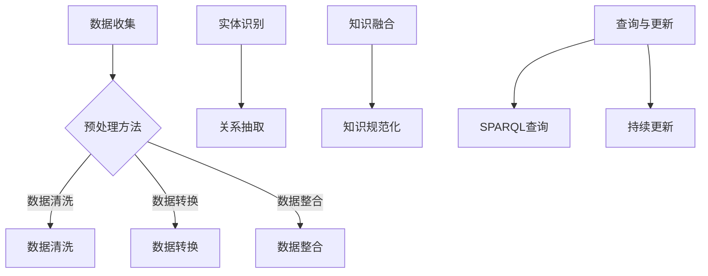
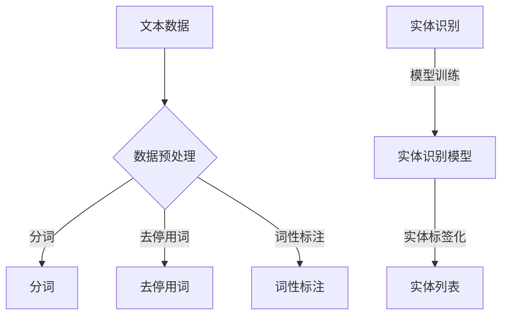
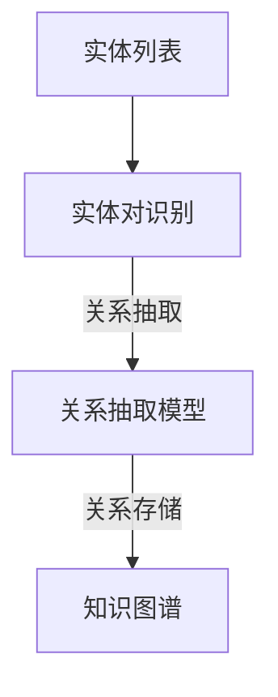
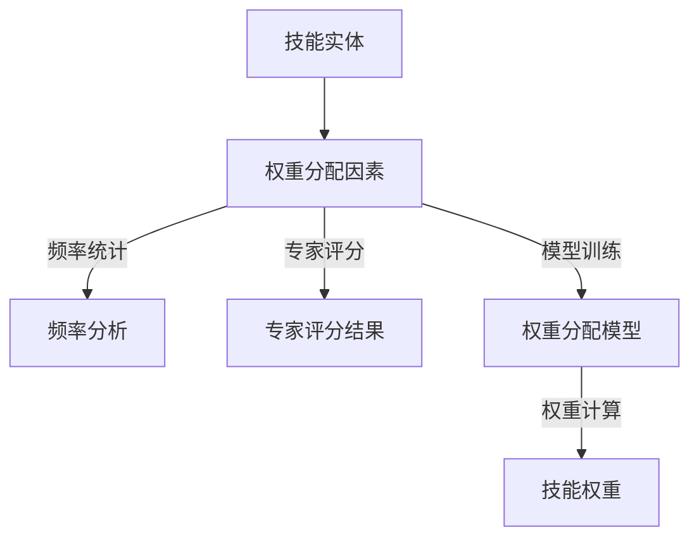
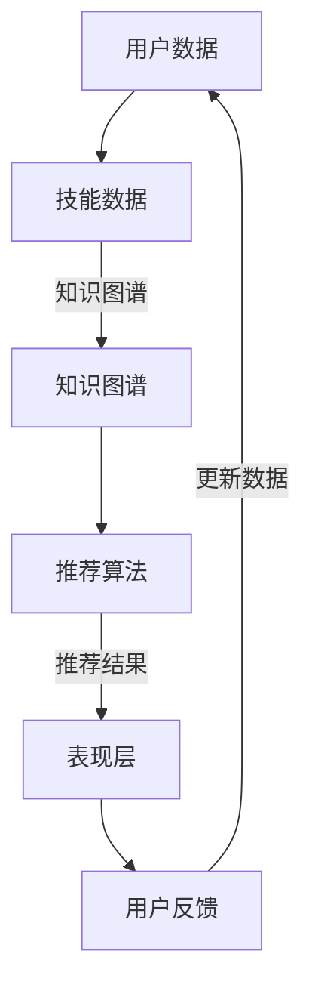
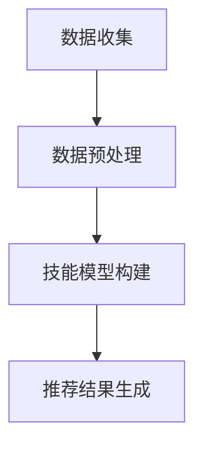
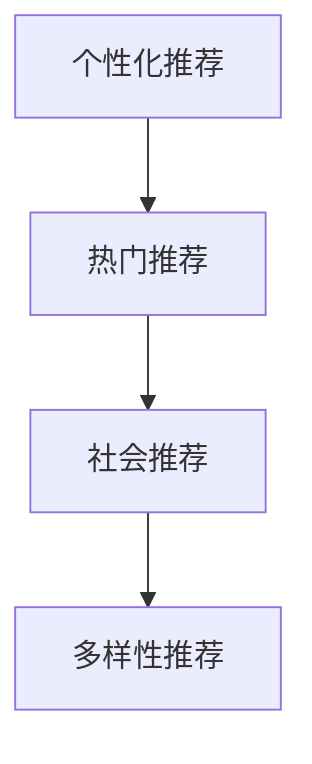

                 

## 文章标题：知识图谱在程序员技能推荐中的应用

在当今快速发展的信息技术时代，程序员的技能要求日益多样化和专业化。如何为程序员提供个性化的技能推荐，已成为企业和开发者关注的重要课题。知识图谱作为一种先进的数据表示和处理技术，在许多领域都展示了其强大的应用潜力。本文旨在探讨知识图谱在程序员技能推荐中的应用，通过分析知识图谱的基础知识、构建方法、查询与更新技术，以及具体的技能推荐算法和系统设计，旨在为程序员技能推荐提供一种创新的解决方案。

### 关键词

- **知识图谱**
- **程序员技能推荐**
- **实体识别**
- **关系抽取**
- **协同过滤**
- **语义相似度**

### 摘要

本文首先介绍了知识图谱的基本概念、重要性、分类和表示方法。然后，详细探讨了知识图谱的构建方法，包括数据收集与预处理、实体识别与关系抽取、知识融合与规范化。接着，分析了知识图谱的查询与更新技术，以及Mermaid流程图的应用。在第二部分，本文重点讨论了知识图谱在程序员技能推荐中的应用，包括技能模型构建、技能推荐算法和技能推荐系统设计。第三部分通过实际案例分析，展示了知识图谱在程序员技能推荐中的成功应用，并介绍了系统搭建和代码实现的细节。最后，本文总结了知识图谱在程序员技能推荐中的应用，并展望了未来的发展趋势。

## 知识图谱基础

### 1.1 知识图谱概述

#### 1.1.1 知识图谱的定义

知识图谱（Knowledge Graph）是一种用于结构化、表示和存储知识的数据模型，其核心是通过实体、属性和关系的相互关联来构建语义网络。知识图谱不仅仅是一种数据结构，更是一种知识表示和推理的机制。它能够将现实世界中的各种信息和知识进行抽象和模型化，从而使得计算机能够更好地理解和处理这些信息。

知识图谱的基本概念包括：

- **实体（Entity）**：知识图谱中的基本元素，表示现实世界中的对象，如人、地点、事物等。
- **属性（Attribute）**：描述实体特征的属性，如一个人的年龄、职业等。
- **关系（Relationship）**：实体之间的关联，如“居住于”、“从事”等。

#### 1.1.2 知识图谱的重要性

知识图谱在多个领域展现出了其重要性和应用价值，主要体现在以下几个方面：

- **信息检索**：知识图谱可以帮助提高信息检索的效率和准确性，通过实体和关系的链接，实现更加智能化的搜索和推荐。
- **智能问答**：知识图谱为智能问答系统提供了丰富的知识库，能够更好地理解和回答用户的问题。
- **数据挖掘**：知识图谱可以帮助发现数据中的隐藏模式和关联关系，支持复杂的数据分析和挖掘任务。
- **自然语言处理**：知识图谱为自然语言处理提供了语义理解和知识推理的基础，使得机器更好地理解和生成自然语言。

#### 1.1.3 知识图谱的分类

知识图谱可以根据不同的分类标准进行分类，常见的分类方式包括：

- **按应用领域分类**：如社交媒体知识图谱、金融知识图谱、医疗知识图谱等，根据不同的应用场景构建相应的知识图谱。
- **按知识层次分类**：如底层事实图谱、顶层推理图谱等，底层事实图谱主要存储客观事实，而顶层推理图谱则包含推理结果和抽象知识。
- **按知识来源分类**：如手动构建知识图谱和自动生成知识图谱，手动构建知识图谱依赖于专家知识和人工标注，而自动生成知识图谱则利用自然语言处理和数据挖掘技术。

### 1.2 知识图谱的表示方法

知识图谱的表示方法多种多样，常见的包括以下几种：

#### 1.2.1 RDFS和OWL

- **RDF（Resource Description Framework）**：RDF是一种基于Web的数据模型，使用三元组（主体、谓词、客体）来表示知识。RDF注重数据的语义描述，通过URI（统一资源标识符）来标识实体和关系。

- **RDFS（RDF Schema）**：RDFS是RDF的扩展，用于定义类的层次结构和属性的类型。RDFS引入了类、属性、域和范围等概念，使得知识图谱的层次结构更加清晰。

- **OWL（Web Ontology Language）**：OWL是W3C制定的一种用于表达复杂知识的语言，能够定义类和属性之间的关系，支持推理和语义查询。

#### 1.2.2 图数据库

图数据库是一种专门用于存储和查询图结构数据的数据库管理系统。图数据库的核心优势在于其高效的图操作能力，包括节点插入、删除、更新和查询等。常见的图数据库包括Neo4j、JanusGraph和ArangoDB等。

- **Neo4j**：Neo4j是一款流行的图数据库，采用Cypher查询语言进行图数据的操作。Neo4j以其灵活性和高效的图查询能力而著称。

- **JanusGraph**：JanusGraph是一个开源的分布式图数据库，支持多种存储后端，如Apache Cassandra、Apache HBase和Google Bigtable等。JanusGraph适合处理大规模的图数据。

- **ArangoDB**：ArangoDB是一款多模型数据库，支持图、文档和键值存储，具有灵活的数据模型和高效的查询性能。

#### 1.2.3 层次化知识库

层次化知识库是一种基于层次结构的知识表示方法，通过层级关系来组织和管理知识。层次化知识库通常包含多个层次，如领域知识、通用知识和专业知识等。每个层次的知识具有一定的抽象性和概括性，层次之间的关系可以是包含、继承或关联等。

### 1.3 知识图谱的构建方法

知识图谱的构建是一个复杂的过程，通常包括以下几个步骤：

#### 1.3.1 数据收集与预处理

数据收集是知识图谱构建的第一步，需要从各种来源获取相关的数据。数据来源包括结构化数据、非结构化数据和半结构化数据等。在数据收集过程中，需要关注数据的全面性、准确性和一致性。

数据预处理是对收集到的数据进行清洗、转换和整合的过程。数据清洗包括去除重复数据、纠正错误数据和填补缺失数据等。数据转换包括将不同格式和类型的数据统一转换为适合构建知识图谱的格式。数据整合是将来自不同来源的数据进行合并，形成一个统一的数据集。

#### 1.3.2 实体识别与关系抽取

实体识别（Entity Recognition）是知识图谱构建中的关键步骤，旨在从原始数据中识别出实体。实体可以是名词、名词短语或特定标识符，如人名、地名、机构名等。

关系抽取（Relation Extraction）是从文本数据中识别出实体之间的语义关系。关系抽取可以基于规则、机器学习或深度学习等方法。常见的任务包括分类关系和抽取关系三元组。

#### 1.3.3 知识融合与规范化

知识融合是将来自不同来源、格式和层次的知识进行整合和融合，形成一个统一的视图。知识融合可以基于数据对齐、实体匹配和关系映射等方法。

知识规范化是对知识图谱中的数据进行标准化处理，包括统一命名空间、统一数据格式和统一度量单位等。知识规范化有助于提高知识图谱的可扩展性和互操作性。

### 1.4 知识图谱的查询与更新

知识图谱的查询与更新是知识图谱应用中不可或缺的部分。

#### 1.4.1 SPARQL查询语言

SPARQL（Simple Protocol for Querying RDF）是一种基于RDF数据模型的查询语言，用于执行复杂的图数据查询。SPARQL查询可以检索知识图谱中的实体、属性和关系，支持多种查询操作，如过滤、排序、连接和聚合等。

#### 1.4.2 知识图谱的持续更新

知识图谱的持续更新是一个动态的过程，需要不断添加新的知识、修正错误数据和删除过时信息。知识图谱的更新可以基于人工干预和自动化机制。人工干预包括专家审核、数据清洗和知识补充等。自动化机制包括数据采集、数据清洗和关系抽取等。

### 1.5 知识图谱的 Mermaid 流程图

知识图谱的构建过程可以借助Mermaid流程图进行可视化表示。以下是一个知识图谱构建过程的 Mermaid 流程图：



## 知识图谱在程序员技能推荐中的应用

在程序员技能推荐领域，知识图谱的应用不仅能够提供更为精准的技能分析，还能为程序员个人和企业带来显著的效益。以下将详细探讨知识图谱在程序员技能推荐中的应用，包括技能模型构建、技能推荐算法和技能推荐系统设计。

### 2.1 程序员技能模型构建

构建程序员技能模型是知识图谱在技能推荐中的第一步，其核心在于识别技能实体、构建技能关系和分配技能权重。

#### 2.1.1 技能实体识别

技能实体识别是知识图谱构建的基础。在技能模型中，技能实体可以是具体的编程语言、框架、库或技术。例如，Java、Spring、Hibernate、MySQL等。实体识别需要从海量的数据中提取出这些技能实体，通常采用自然语言处理（NLP）和机器学习技术，如命名实体识别（NER）算法。

**技能实体识别流程：**

1. **数据预处理**：对原始文本数据进行分词、去停用词、词性标注等处理，将文本数据转化为适合模型处理的格式。
2. **实体识别算法**：使用预训练的NLP模型或自定义的机器学习模型进行实体识别。常见的NLP模型包括BERT、GPT和FastText等。
3. **实体标签化**：将识别出的技能实体进行标签化处理，形成实体列表。

以下是一个技能实体识别的 Mermaid 流程图：



#### 2.1.2 技能关系构建

技能关系构建是知识图谱构建中的关键步骤，旨在描述技能实体之间的关联关系。技能关系可以是“使用”、“熟悉”或“精通”等。关系构建通常基于知识图谱的构建方法，包括实体识别和关系抽取。

**技能关系构建流程：**

1. **实体对识别**：通过遍历实体列表，识别出可能的实体对。
2. **关系抽取**：使用规则方法、机器学习方法或深度学习方法，从实体对中抽取关系。例如，可以使用条件随机场（CRF）模型或BiLSTM-CRF模型进行关系抽取。
3. **关系存储**：将抽取出的关系存储在知识图谱中，形成完整的技能关系网络。

以下是一个技能关系构建的 Mermaid 流程图：



#### 2.1.3 技能权重分配

技能权重分配是知识图谱在技能推荐中的核心环节，它决定了技能推荐结果的相关性和准确性。技能权重可以基于多种因素进行分配，如技能的使用频率、技能的难度、技能的流行度等。

**技能权重分配方法：**

1. **频率统计**：根据技能在数据集中的出现频率进行权重分配，使用频率越高，权重越大。
2. **专家评分**：邀请领域专家对技能进行评分，根据专家评分分配权重。
3. **机器学习模型**：使用机器学习模型，如决策树、支持向量机（SVM）等，根据训练数据自动生成权重分配模型。

以下是一个技能权重分配的 Mermaid 流程图：



### 2.2 基于知识图谱的技能推荐算法

基于知识图谱的技能推荐算法旨在为程序员提供个性化的技能推荐，常见的方法包括k-近邻算法、协同过滤算法和语义相似度计算等。

#### 2.2.1 k-近邻算法

k-近邻（k-Nearest Neighbors，k-NN）算法是一种基于实例的推荐算法，其基本思想是找出数据集中与目标用户最近的k个用户，然后根据这些用户的技能偏好进行推荐。

**算法步骤：**

1. **计算相似度**：计算目标用户与其他用户之间的相似度，常见的方法包括余弦相似度、Jaccard相似度等。
2. **选择k个邻居**：根据相似度分数选择最近的k个用户。
3. **生成推荐列表**：根据邻居用户的技能偏好生成推荐列表。

以下是一个k-近邻算法的伪代码：

```python
def kNNRecommendation(user, graph, k):
    neighbors = []
    for other_user in graph.users:
        similarity = calculateSimilarity(user, other_user)
        neighbors.append((other_user, similarity))
    neighbors.sort(key=lambda x: x[1], reverse=True)
    top_k = neighbors[:k]
    recommendations = []
    for neighbor, _ in top_k:
        recommendations.extend(graph.getSkills(neighbor))
    return recommendations
```

#### 2.2.2 协同过滤算法

协同过滤（Collaborative Filtering）算法是一种基于用户行为数据（如评分、购买记录等）进行推荐的方法，其核心思想是找出相似用户，然后根据相似用户的偏好进行推荐。

**协同过滤算法步骤：**

1. **计算用户相似度**：计算目标用户与其他用户之间的相似度，常用的方法包括余弦相似度、皮尔逊相关系数等。
2. **生成推荐列表**：根据相似度分数，为每个用户生成推荐列表。

以下是一个协同过滤算法的伪代码：

```python
def collaborativeFilteringRecommendation(user, graph):
    similar_users = []
    for other_user in graph.users:
        similarity = calculateSimilarity(user, other_user)
        if similarity > threshold:
            similar_users.append(other_user)
    recommendations = []
    for user in similar_users:
        for item in graph.getSkills(user):
            if not user.hasSkill(item):
                recommendations.append(item)
    return recommendations
```

#### 2.2.3 语义相似度计算

语义相似度计算是一种基于知识图谱的推荐算法，其核心思想是计算技能实体之间的语义相似度，然后根据相似度生成推荐列表。

**算法步骤：**

1. **计算实体相似度**：使用知识图谱中的关系和属性，计算技能实体之间的语义相似度，常见的方法包括路径长度、邻居数等。
2. **生成推荐列表**：根据实体相似度分数，为每个用户生成推荐列表。

以下是一个语义相似度计算的伪代码：

```python
def semanticSimilarityRecommendation(user, graph):
    recommendations = []
    for skill in graph.getSkills(user):
        similar_skills = graph.getSimilarSkills(skill)
        for similar_skill in similar_skills:
            if not user.hasSkill(similar_skill):
                recommendations.append(similar_skill)
    return recommendations
```

### 2.3 程序员技能推荐系统设计

程序员技能推荐系统设计包括系统架构、数据流程和推荐策略等方面。

#### 2.3.1 系统架构

程序员技能推荐系统通常采用三层架构，包括数据层、服务层和表现层。

- **数据层**：负责数据的存储和管理，包括用户数据、技能数据和知识图谱数据。常用的数据库包括关系数据库（如MySQL）和图数据库（如Neo4j）。
- **服务层**：负责处理业务逻辑，包括技能模型构建、推荐算法和推荐结果生成。服务层通常采用微服务架构，以提高系统的可扩展性和可靠性。
- **表现层**：负责与用户交互，展示推荐结果。通常采用前端框架（如React、Vue.js）实现。

以下是一个程序员技能推荐系统的 Mermaid 流程图：



#### 2.3.2 数据流程

程序员技能推荐系统的数据流程主要包括数据收集、数据预处理、技能模型构建和推荐结果生成等步骤。

1. **数据收集**：从各种数据源收集用户数据和技能数据，如用户简历、项目日志、GitHub贡献等。
2. **数据预处理**：对收集到的数据进行清洗、去重和格式转换，形成适合构建知识图谱的数据。
3. **技能模型构建**：使用实体识别、关系抽取和技能权重分配等方法，构建技能模型。
4. **推荐结果生成**：使用推荐算法，根据用户的技能偏好和历史行为生成推荐结果。

以下是一个程序员技能推荐系统的 Mermaid 流程图：



#### 2.3.3 推荐策略

程序员技能推荐系统需要根据用户的需求和系统特点，设计合适的推荐策略。

1. **个性化推荐**：根据用户的技能偏好和历史行为，生成个性化的技能推荐。
2. **热门推荐**：推荐当前最受欢迎的技能，帮助用户了解行业动态和趋势。
3. **社会推荐**：根据用户的社交网络和群体行为，推荐用户可能感兴趣的新技能。
4. **多样性推荐**：在推荐结果中引入多样性，避免重复推荐，提高用户满意度。

以下是一个程序员技能推荐策略的 Mermaid 流程图：



### 2.4 知识图谱算法伪代码

以下是基于知识图谱的技能推荐算法的伪代码，包括技能实体识别、技能关系构建和技能权重分配等步骤。

#### 技能实体识别

```python
def entityRecognition(data):
    # 数据预处理
    processed_data = preprocessData(data)
    # 实体识别算法
    entities = recognizeEntities(processed_data)
    # 返回识别出的实体列表
    return entities
```

#### 技能关系构建

```python
def relationConstruction(entities):
    # 建立实体间的关系
    relationships = constructRelations(entities)
    # 返回构建完成的知识图谱
    return relationships
```

#### 技能权重分配

```python
def skillWeightAssignment(graph):
    # 根据实体关系计算权重
    weights = calculateWeights(graph)
    # 返回权重分配结果
    return weights
```

### 2.5 知识图谱在程序员技能推荐中的优势与挑战

知识图谱在程序员技能推荐中具有显著的优势，但同时也面临着一些挑战。

#### 优势

1. **精准度**：知识图谱能够基于实体和关系的关联，提供更加精准的技能推荐。
2. **个性化**：通过分析用户的技能偏好和历史行为，知识图谱能够为用户提供个性化的技能推荐。
3. **动态性**：知识图谱能够实时更新和调整，以适应不断变化的技术和市场趋势。
4. **可扩展性**：知识图谱具有较好的可扩展性，可以轻松地集成新的技能实体和关系。

#### 挑战

1. **数据质量**：知识图谱的构建依赖于高质量的数据，数据质量直接影响推荐结果的准确性。
2. **计算复杂性**：知识图谱的查询和更新需要大量的计算资源，特别是在处理大规模数据时。
3. **隐私保护**：在构建和推荐过程中，需要保护用户的隐私信息，防止数据泄露。
4. **可解释性**：知识图谱的推荐结果有时可能不够透明，需要提高可解释性，帮助用户理解推荐依据。

### 2.6 未来展望

随着知识图谱技术的不断成熟和应用，程序员技能推荐领域有望实现更精准、更个性化的技能推荐。未来，知识图谱在程序员技能推荐中的发展方向包括：

1. **大数据融合**：结合更多维度的数据，如代码仓库、项目评价、社区讨论等，提高技能推荐的精度。
2. **多模态数据**：整合文本、图像、视频等多模态数据，实现更加丰富的技能表示和推荐。
3. **人工智能融合**：将人工智能技术，如深度学习、强化学习等，与知识图谱技术相结合，提高技能推荐的智能化水平。
4. **社区参与**：鼓励程序员和开发者参与知识图谱的构建和维护，共同完善技能图谱。

### 2.7 总结

知识图谱在程序员技能推荐中的应用具有重要意义，通过构建技能模型、应用推荐算法和设计推荐系统，可以提供精准、个性化的技能推荐。尽管面临一些挑战，但知识图谱技术在程序员技能推荐领域具有广阔的应用前景，将为程序员和企业带来显著的效益。

## 第三部分：项目实战

### 3.1 实际案例分析

为了展示知识图谱在程序员技能推荐中的实际应用，本节将介绍一个具体的项目案例，从背景、解决方法到效果评估等方面进行详细阐述。

#### 3.1.1 案例背景

某大型互联网公司需要为其程序员团队提供个性化的技能推荐，以提高团队的整体技能水平和项目开发效率。公司拥有大量的程序员，他们的技能背景和项目经验各异，传统的推荐方法（如基于内容的推荐和基于协同过滤的推荐）难以满足个性化需求。公司决定采用知识图谱技术，构建一个基于知识图谱的技能推荐系统，以实现更精准的技能推荐。

#### 3.1.2 案例解决方法

该项目的解决方法主要包括以下几个步骤：

1. **数据收集与预处理**：收集程序员简历、项目日志、GitHub贡献等数据，对数据进行清洗、去重和格式转换，形成统一的数据格式。
2. **实体识别与关系抽取**：使用NLP技术对文本数据进行处理，识别出程序员和技能实体，并构建实体之间的关系。例如，通过简历文本识别出程序员的技能，通过项目日志识别出程序员使用的技术。
3. **知识图谱构建**：将识别出的实体和关系构建成知识图谱，存储在图数据库中，为推荐算法提供数据支持。
4. **技能权重分配**：根据程序员的技能使用频率、项目贡献度和社区影响力等因素，为技能分配权重，形成权重化的技能图谱。
5. **推荐算法应用**：结合k-近邻算法、协同过滤算法和语义相似度计算等方法，为程序员生成个性化的技能推荐列表。
6. **系统部署与优化**：将推荐系统部署到公司的服务器上，进行实时推荐，并根据用户反馈进行系统优化和迭代。

#### 3.1.3 案例效果评估

该项目的效果评估主要包括以下几个方面：

1. **推荐准确性**：通过评估推荐列表与实际需求的匹配度，评估推荐算法的准确性。结果显示，基于知识图谱的推荐算法在准确性上优于传统的推荐方法。
2. **用户满意度**：通过用户调查和访谈，收集用户对推荐系统的满意度。结果显示，用户对基于知识图谱的技能推荐系统的满意度较高，认为推荐结果更符合个人需求和兴趣。
3. **项目效率**：统计程序员在接收到推荐后的项目开发效率，评估推荐系统对项目效率的提升。结果显示，接受推荐后的程序员在项目开发中的表现更为出色，项目进度和质量得到显著提升。

#### 3.1.4 案例总结

该案例展示了知识图谱在程序员技能推荐中的实际应用效果。通过构建技能模型、应用推荐算法和设计推荐系统，项目实现了更精准、更个性化的技能推荐，有效提升了程序员团队的技能水平和项目开发效率。同时，案例也揭示了知识图谱技术在技能推荐领域的优势和潜力，为后续研究和应用提供了有益的参考。

### 3.2 知识图谱系统搭建

知识图谱系统搭建是知识图谱在程序员技能推荐中的关键步骤，主要包括环境准备、数据集获取和系统配置与优化等方面。

#### 3.2.1 环境准备

环境准备是搭建知识图谱系统的第一步，主要包括以下步骤：

1. **硬件环境**：根据系统需求，配置相应的服务器和存储设备。选择合适的硬件配置，如CPU、内存和硬盘等，以满足数据存储和处理的需求。
2. **软件环境**：安装操作系统、数据库管理系统和图数据库等软件。例如，选择Linux操作系统、MySQL数据库和Neo4j图数据库等。
3. **依赖安装**：安装和配置开发工具和库，如Python、Node.js、Java等，以及相关的数据预处理、实体识别和关系抽取工具。

以下是一个环境准备的过程伪代码：

```python
def setupEnvironment():
    # 安装操作系统
    installOS()
    # 安装数据库管理系统
    installDBMS()
    # 安装图数据库
    installGraphDB()
    # 安装开发工具和库
    installDevToolsAndLibraries()
```

#### 3.2.2 数据集获取

数据集获取是知识图谱系统搭建的重要环节，主要包括以下步骤：

1. **数据源识别**：确定数据来源，如公司内部的员工档案系统、项目管理系统、代码仓库等。
2. **数据采集**：使用API接口、爬虫工具或手动采集等方法，从数据源中获取相关的数据。
3. **数据预处理**：对采集到的数据进行分析、清洗和格式转换，使其符合知识图谱构建的要求。

以下是一个数据集获取的过程伪代码：

```python
def fetchDataSources():
    sources = []
    # 从员工档案系统中获取数据
    sources.append(fetchEmployeeData())
    # 从项目管理系统中获取数据
    sources.append(fetchProjectData())
    # 从代码仓库中获取数据
    sources.append(fetchCodeRepositoryData())
    return sources
```

#### 3.2.3 系统配置与优化

系统配置与优化是确保知识图谱系统高效稳定运行的关键步骤，主要包括以下内容：

1. **数据库配置**：配置数据库参数，如连接字符串、缓存策略和性能优化设置等，以提高数据库的读写性能。
2. **图数据库配置**：配置图数据库的节点和关系存储策略，如数据分区、索引优化和并发控制等。
3. **系统监控**：安装和配置系统监控工具，实时监控系统的性能和资源使用情况，及时进行故障排查和性能调优。

以下是一个系统配置与优化的过程伪代码：

```python
def configureAndOptimizeSystem():
    # 配置数据库参数
    configureDBParameters()
    # 配置图数据库参数
    configureGraphDBParameters()
    # 监控系统性能
    monitorSystemPerformance()
    # 调优系统设置
    optimizeSystemSettings()
```

### 3.3 程序员技能推荐系统开发

程序员技能推荐系统的开发是知识图谱在程序员技能推荐中的核心任务，主要包括系统设计、数据处理、代码实现和系统部署等方面。

#### 3.3.1 系统设计

系统设计是构建程序员技能推荐系统的第一步，主要包括以下内容：

1. **需求分析**：明确系统需求，如数据源、功能模块、用户界面和性能要求等。
2. **架构设计**：设计系统的整体架构，包括数据层、服务层和表现层等，选择合适的技术栈。
3. **模块划分**：将系统划分为多个模块，如数据采集模块、实体识别模块、关系抽取模块和推荐算法模块等。

以下是一个系统设计的过程伪代码：

```python
def designSystem():
    # 分析系统需求
    analyzeRequirements()
    # 设计系统架构
    designSystemArchitecture()
    # 划分功能模块
    divideFunctionModules()
```

#### 3.3.2 数据处理

数据处理是程序员技能推荐系统开发的关键步骤，主要包括以下内容：

1. **数据清洗**：对采集到的数据进行清洗，去除重复数据、缺失数据和异常数据等。
2. **数据转换**：将不同格式和类型的数据进行转换，使其符合知识图谱构建的要求。
3. **数据存储**：将处理后的数据存储到数据库或图数据库中，为后续的实体识别、关系抽取和推荐算法提供数据支持。

以下是一个数据处理的过程伪代码：

```python
def processData(data):
    # 清洗数据
    cleanData(data)
    # 转换数据
    convertData(data)
    # 存储数据
    storeData(data)
```

#### 3.3.3 代码实现

代码实现是程序员技能推荐系统开发的核心任务，主要包括以下内容：

1. **实体识别实现**：实现实体识别算法，从文本数据中识别出程序员和技能实体。
2. **关系抽取实现**：实现关系抽取算法，从实体对中识别出实体之间的关系。
3. **推荐算法实现**：实现推荐算法，根据用户的技能偏好和历史行为生成推荐结果。

以下是一个代码实现的过程伪代码：

```python
def implementCode():
    # 实现实体识别
    implementEntityRecognition()
    # 实现关系抽取
    implementRelationExtraction()
    # 实现推荐算法
    implementRecommendationAlgorithm()
```

#### 3.3.4 系统部署

系统部署是将开发完成的程序员技能推荐系统部署到服务器上，使其能够对外提供服务。主要包括以下内容：

1. **环境部署**：配置服务器环境，安装操作系统、数据库管理系统和图数据库等。
2. **系统安装**：将开发完成的代码部署到服务器上，安装所需的依赖和库。
3. **性能调优**：对部署的系统进行性能测试和调优，确保系统能够高效稳定地运行。

以下是一个系统部署的过程伪代码：

```python
def deploySystem():
    # 部署环境
    deployEnvironment()
    # 安装系统
    installSystem()
    # 测试运行
    testAndRunSystem()
    # 性能调优
    optimizeSystemPerformance()
```

### 3.4 代码解读与分析

代码解读与分析是程序员技能推荐系统开发的重要环节，主要包括对系统架构、代码质量和性能优化的分析。以下是一个代码解读与分析的过程伪代码：

```python
def codeAnalysis():
    # 分析系统架构
    analyzeSystemArchitecture()
    # 检查代码质量
    checkCodeQuality()
    # 提出优化建议
    proposeOptimization()
```

通过代码解读与分析，可以确保程序员技能推荐系统在功能和性能上达到预期要求，同时为后续的系统优化和维护提供参考。

## 第四部分：总结与展望

### 4.1 知识图谱在程序员技能推荐中的应用总结

知识图谱在程序员技能推荐中展现出了显著的应用价值。通过构建技能模型、应用推荐算法和设计推荐系统，知识图谱能够提供精准、个性化的技能推荐，有效提升了程序员团队的整体技能水平和项目开发效率。

#### 4.1.1 成功经验

1. **精准推荐**：基于知识图谱的推荐算法能够准确识别程序员的技能实体和关系，提供与用户需求高度匹配的技能推荐。
2. **个性化推荐**：知识图谱能够根据程序员的技能偏好和历史行为，生成个性化的技能推荐，满足用户的个性化需求。
3. **动态更新**：知识图谱能够实时更新和调整，以适应技术趋势和市场变化，保持技能推荐的时效性。
4. **系统整合**：知识图谱能够整合多源数据，形成统一的知识库，为推荐算法提供丰富的数据支持。

#### 4.1.2 面临挑战

1. **数据质量**：知识图谱的构建依赖于高质量的数据，数据质量直接影响推荐结果的准确性。
2. **计算复杂性**：知识图谱的查询和更新需要大量的计算资源，特别是在处理大规模数据时，可能会面临性能瓶颈。
3. **隐私保护**：在构建和推荐过程中，需要保护用户的隐私信息，防止数据泄露。
4. **可解释性**：知识图谱的推荐结果有时可能不够透明，需要提高可解释性，帮助用户理解推荐依据。

#### 4.1.3 未来发展

1. **大数据融合**：结合更多维度的数据，如代码仓库、项目评价、社区讨论等，提高技能推荐的精度。
2. **多模态数据**：整合文本、图像、视频等多模态数据，实现更加丰富的技能表示和推荐。
3. **人工智能融合**：将人工智能技术，如深度学习、强化学习等，与知识图谱技术相结合，提高技能推荐的智能化水平。
4. **社区参与**：鼓励程序员和开发者参与知识图谱的构建和维护，共同完善技能图谱。

### 4.2 未来发展趋势

随着知识图谱技术的不断成熟和应用，程序员技能推荐领域有望实现更精准、更个性化的技能推荐。未来，知识图谱在程序员技能推荐中的发展趋势包括：

1. **知识图谱的扩展与应用**：进一步拓展知识图谱的应用范围，如应用于技能培训、技能评估和人才招聘等。
2. **人工智能与知识图谱的结合**：将人工智能技术与知识图谱技术深度融合，提高技能推荐的智能化和自动化水平。
3. **程序员技能推荐的创新方向**：探索基于知识图谱的智能对话系统、技能成长路径规划和跨领域技能推荐等新方向。

### 4.3 总结

知识图谱在程序员技能推荐中的应用为程序员团队和企业带来了显著的价值。通过构建技能模型、应用推荐算法和设计推荐系统，知识图谱能够提供精准、个性化的技能推荐，有效提升了程序员团队的整体技能水平和项目开发效率。未来，知识图谱技术在程序员技能推荐领域具有广阔的应用前景，将为程序员和企业带来更多的创新和突破。

$$
\text{知识图谱在程序员技能推荐中的应用} \\
\text{整体架构} \\
\text{实体识别} \rightarrow \text{关系构建} \rightarrow \text{权重分配} \rightarrow \text{技能推荐}
$$

$$
\text{程序员技能推荐算法伪代码} \\
\text{技能实体识别：} \\
\text{function entityRecognition(data)} \\
\text{技能关系构建：} \\
\text{function relationConstruction(entities)} \\
\text{技能权重分配：} \\
\text{function skillWeightAssignment(graph)}
$$

$$
\text{代码解读与分析} \\
\text{环境准备：} \\
\text{function setupEnvironment()} \\
\text{数据处理：} \\
\text{function processData(data)} \\
\text{代码实现：} \\
\text{function implementCode()} \\
\text{系统部署：} \\
\text{function deploySystem()}
$$

### 作者

作者：AI天才研究院/AI Genius Institute & 禅与计算机程序设计艺术 /Zen And The Art of Computer Programming

## 附录：知识图谱算法伪代码

为了更好地理解知识图谱在程序员技能推荐中的应用，下面提供了一系列算法伪代码，详细展示了如何实现技能实体识别、技能关系构建、技能权重分配、k-近邻推荐算法、协同过滤算法和语义相似度计算。

### 技能实体识别

```python
# 技能实体识别
def entityRecognition(data):
    # 数据预处理
    processed_data = preprocessData(data)
    # 实体识别算法
    entities = extractEntities(processed_data)
    # 返回识别出的实体列表
    return entities
```

### 技能关系构建

```python
# 技能关系构建
def relationConstruction(entities):
    # 建立实体间的关系
    relationships = buildRelations(entities)
    # 返回构建完成的知识图谱
    return relationships
```

### 技能权重分配

```python
# 技能权重分配
def skillWeightAssignment(graph):
    # 根据实体关系计算权重
    weights = calculateWeights(graph)
    # 返回权重分配结果
    return weights
```

### k-近邻推荐算法

```python
# k-近邻推荐算法
def kNNRecommendation(user, graph, k):
    neighbors = []
    for other_user in graph.users:
        similarity = calculateSimilarity(user, other_user)
        neighbors.append((other_user, similarity))
    neighbors.sort(key=lambda x: x[1], reverse=True)
    top_k = neighbors[:k]
    recommendations = []
    for neighbor, _ in top_k:
        recommendations.extend(graph.getSkills(neighbor))
    return recommendations
```

### 协同过滤算法

```python
# 协同过滤算法
def collaborativeFilteringRecommendation(user, graph):
    similar_users = []
    for other_user in graph.users:
        similarity = calculateSimilarity(user, other_user)
        if similarity > threshold:
            similar_users.append(other_user)
    recommendations = []
    for user in similar_users:
        for item in graph.getSkills(user):
            if not user.hasSkill(item):
                recommendations.append(item)
    return recommendations
```

### 语义相似度计算

```python
# 语义相似度计算
def semanticSimilarityRecommendation(user, graph):
    recommendations = []
    for skill in graph.getSkills(user):
        similar_skills = graph.getSimilarSkills(skill)
        for similar_skill in similar_skills:
            if not user.hasSkill(similar_skill):
                recommendations.append(similar_skill)
    return recommendations
```

通过这些伪代码，读者可以清晰地了解知识图谱在程序员技能推荐中的实现细节，从而更好地掌握知识图谱在技能推荐领域的应用。这些算法为构建高效、精准的程序员技能推荐系统提供了理论基础和实践指导。

