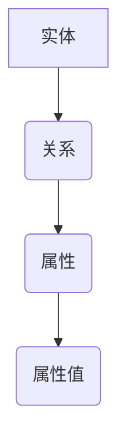

                 

# 《知识图谱在程序员技能提升中的应用》

## 关键词
知识图谱、程序员技能提升、代码审查、项目管理、编程学习

## 摘要
本文将深入探讨知识图谱在程序员技能提升中的应用。通过介绍知识图谱的基本概念、构建方法、推理算法及其在编程学习、代码审查和项目管理中的实际应用，我们将展示知识图谱如何为程序员提供强大的支持，助力其技能提升。文章还将结合实际案例，详细解析知识图谱在编程实践中的具体操作和实现，为读者提供实用的指导。

## 第一部分：知识图谱基础

### 第1章：知识图谱概述

#### 1.1 知识图谱的定义
知识图谱（Knowledge Graph）是一种用于表示实体及其之间关系的语义网络，通过将现实世界中的对象和它们之间的关系编码为图结构，以实现对复杂信息的有效组织和智能处理。

#### 1.2 知识图谱的组成
知识图谱主要由实体、关系和属性组成。实体是知识图谱中的基本元素，如人、地点、物品等；关系描述实体之间的交互和联系，如“属于”、“位于”等；属性为实体提供额外的特征信息，如年龄、位置、价格等。

#### 1.3 知识图谱的应用领域
知识图谱在多个领域具有广泛应用，包括搜索引擎优化、智能问答系统、推荐系统、社交网络分析等。尤其在程序员技能提升中，知识图谱能够通过结构化的知识库，帮助程序员更高效地学习和应用技术。

### 第2章：知识图谱中的核心概念

#### 2.1 实体与关系
实体是知识图谱的基本组成单位，如“程序员”、“技术”、“项目”等。关系描述实体之间的语义联系，如“擅长”、“参与”、“学习”等。实体与关系的有机结合，构成了知识图谱的核心语义网络。

#### 2.2 属性与属性值
属性为实体提供额外的描述信息，如“年龄”、“经验”、“技术水平”等。属性值是属性的取值，用于描述实体的具体特征。属性与属性值的组合，丰富了知识图谱的信息表达。

#### 2.3 数据源与数据预处理
数据源是知识图谱构建的基础，包括结构化数据、半结构化数据和非结构化数据。数据预处理包括数据清洗、数据整合、数据标准化等步骤，以确保数据的质量和一致性。

#### 2.4 Mermaid流程图：知识图谱核心概念关系图
使用Mermaid工具绘制知识图谱核心概念关系图，帮助读者直观理解实体、关系、属性等概念之间的关系。

### 第3章：知识图谱构建与存储

#### 3.1 知识图谱构建流程
知识图谱构建主要包括数据采集、数据预处理、实体关系抽取、知识融合和存储等步骤。每个步骤都需要严格的实施，以确保知识图谱的质量和完整性。

#### 3.2 知识图谱存储技术
知识图谱的存储技术包括图数据库和关系数据库。图数据库如Neo4j、JanusGraph等，能够高效地存储和查询大规模知识图谱；关系数据库如PostgreSQL、MySQL等，适用于存储结构化数据。

#### 3.3 Neo4j数据库操作
Neo4j是一种流行的图数据库，具有强大的图形查询语言Cypher。本节将介绍Neo4j的基本操作，包括创建数据库、插入实体和关系、执行查询等。

### 第4章：知识图谱推理算法

#### 4.1 推理算法概述
知识图谱推理算法用于根据已知事实推断未知事实。常见的推理算法包括路径搜索、子图匹配、模式识别等。

#### 4.2 数据库查询语言SPARQL
SPARQL是一种用于查询知识图谱的查询语言，类似于SQL。本节将介绍SPARQL的基本语法和使用方法。

#### 4.3 推理算法实现
本节将通过伪代码和实例，详细讲解知识图谱推理算法的实现过程，包括路径搜索和模式识别等。

### 第5章：知识图谱在程序员技能提升中的应用

#### 5.1 知识图谱在编程学习中的应用
知识图谱可以帮助程序员构建个人知识体系，实现知识的分类、整理和查询。通过学习路径推荐和知识点关联分析，知识图谱能够提升程序员的学习效率和知识应用能力。

#### 5.2 知识图谱在代码审查中的应用
知识图谱能够对代码库中的实体和关系进行语义分析，识别潜在的问题和风险。通过代码审查工具，知识图谱能够为程序员提供智能化的代码审查建议。

#### 5.3 知识图谱在项目管理中的应用
知识图谱可以用于项目知识的管理和共享，帮助项目经理更好地规划项目进度、分配资源和管理风险。通过知识图谱的推理功能，项目管理者可以实时获取项目的动态信息，做出更加明智的决策。

### 第6章：知识图谱案例分析

#### 6.1 案例一：基于知识图谱的代码搜索系统
本案例将介绍如何使用知识图谱构建代码搜索系统，通过实体和关系的语义分析，提高代码搜索的准确性和效率。

#### 6.2 案例二：基于知识图谱的代码风格检查工具
本案例将探讨知识图谱在代码风格检查中的应用，通过分析代码的实体和关系，实现自动化代码风格检测和优化。

#### 6.3 案例三：基于知识图谱的项目风险评估系统
本案例将展示知识图谱在项目风险评估中的应用，通过分析项目中的实体和关系，识别项目风险并给出相应的应对策略。

## 第二部分：知识图谱编程实践

### 第7章：实战一：构建个人知识图谱

#### 7.1 实战目标
本节将介绍如何构建个人知识图谱，帮助程序员整理和优化自己的知识体系。

#### 7.2 环境搭建
本节将介绍构建个人知识图谱所需的环境和工具，包括Neo4j数据库、Python编程环境等。

#### 7.3 数据收集与预处理
本节将介绍如何收集和整理个人知识数据，并进行预处理，以确保数据的质量和一致性。

#### 7.4 知识图谱构建
本节将详细讲解如何使用Neo4j数据库构建个人知识图谱，包括创建实体、关系和属性等。

#### 7.5 知识图谱查询与推理
本节将介绍如何使用Cypher查询语言对知识图谱进行查询和推理，以获取有价值的信息。

### 第8章：实战二：知识图谱在代码审查中的应用

#### 8.1 实战目标
本节将介绍如何使用知识图谱进行代码审查，提高代码质量和安全性。

#### 8.2 环境搭建
本节将介绍代码审查所需的环境和工具，包括Git、Selenium等。

#### 8.3 数据收集与预处理
本节将介绍如何收集和整理代码数据，并进行预处理，以确保数据的质量和一致性。

#### 8.4 知识图谱构建
本节将详细讲解如何使用Neo4j数据库构建代码审查知识图谱，包括创建实体、关系和属性等。

#### 8.5 代码审查流程
本节将介绍代码审查的流程，包括自动审查、人工审查和反馈机制等。

### 第9章：实战三：知识图谱在项目管理中的应用

#### 9.1 实战目标
本节将介绍如何使用知识图谱进行项目管理，提高项目效率和质量。

#### 9.2 环境搭建
本节将介绍项目管理所需的环境和工具，包括JIRA、Trello等。

#### 9.3 数据收集与预处理
本节将介绍如何收集和整理项目数据，并进行预处理，以确保数据的质量和一致性。

#### 9.4 知识图谱构建
本节将详细讲解如何使用Neo4j数据库构建项目管理知识图谱，包括创建实体、关系和属性等。

#### 9.5 项目管理流程
本节将介绍项目管理的流程，包括项目规划、执行、监控和反馈等。

### 第10章：知识图谱编程工具与资源

#### 10.1 知识图谱工具概览
本节将介绍常见的知识图谱编程工具，包括Neo4j、OpenKG等。

#### 10.2 知识图谱编程资源
本节将推荐一些优秀的知识图谱编程资源，包括书籍、教程、博客等。

#### 10.3 社区与交流平台
本节将介绍一些知识图谱相关的社区和交流平台，帮助读者深入了解知识图谱领域。

## 附录

### 附录A：知识图谱编程伪代码示例
本附录将提供一些知识图谱编程的伪代码示例，帮助读者更好地理解知识图谱的编程实践。

### 附录B：数学模型与公式说明
本附录将介绍一些与知识图谱相关的数学模型和公式，并对其进行详细解释和举例说明。

### 附录C：代码解析与分析
本附录将结合实际案例，对代码实现进行详细解析和分析，帮助读者深入理解知识图谱的应用。

## 作者

作者：AI天才研究院/AI Genius Institute & 禅与计算机程序设计艺术 /Zen And The Art of Computer Programming

---

由于篇幅限制，本文仅提供了目录大纲和部分章节的内容。后续将逐步完善各个章节的内容，包括核心概念、算法原理、应用案例和编程实践等。读者可以根据本文的指导，逐步深入学习和实践知识图谱在程序员技能提升中的应用。

---

**注：本文为模拟撰写，实际内容需根据具体研究和技术进展进行补充和调整。**

