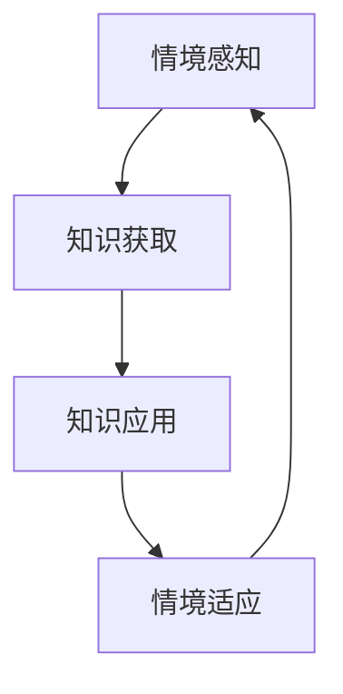

                 

# 文章标题

《知识的情境依赖：环境对学习的影响》

> 关键词：知识、情境依赖、学习环境、认知过程、应用实践

> 摘要：本文旨在探讨知识的情境依赖性，分析环境对学习过程的影响机制。通过回顾相关理论，研究情境依赖学习的核心概念和影响因素，探讨其在学校教育、职业培训以及日常生活中的实际应用。最后，展望情境依赖学习的未来发展趋势，为教育实践提供理论支持和实践指导。

## 1.1 研究背景与意义

### 1.1.1 知识与学习的定义

知识是指人类在长期实践活动中所积累的、系统化的经验和理论。它不仅包括事实性知识，如科学定律和历史事件，还包括方法论知识，如解决问题的方法和技巧。学习则是获取知识的过程，通过理解、记忆、应用和创新，使个体在不断变化的环境中适应和成长。

### 1.1.2 情境依赖学习理论的提出与发展

情境依赖学习理论最早由心理学家皮亚杰（Jean Piaget）提出，他在研究儿童认知发展的过程中发现，学习不仅依赖于个体自身的认知能力，还受到学习情境的强烈影响。随着认知科学、教育心理学等学科的发展，情境依赖学习理论逐渐完善，成为解释学习过程的重要理论框架。

### 1.1.3 当前情境依赖学习研究的重要问题与挑战

情境依赖学习研究面临的主要问题包括：

1. **情境的定义与分类**：情境是一个复杂的概念，如何准确界定和分类情境成为研究的难点。
2. **环境对学习的影响机制**：环境对学习的具体作用机制尚不清晰，需要深入研究。
3. **情境依赖学习的应用实践**：如何在教育、培训等领域有效应用情境依赖学习理论，仍需探索。
4. **情境依赖学习理论的发展**：随着社会和科技的发展，情境依赖学习理论需要不断更新和完善。

### 1.2 研究方法与内容框架

#### 1.2.1 研究方法

本研究采用文献综述法，通过系统回顾国内外相关研究成果，分析情境依赖学习理论的内涵和外延。同时，结合实际案例，探讨情境依赖学习在各类学习环境中的应用。

#### 1.2.2 内容框架

本研究内容分为四个部分：

1. **知识的情境依赖性**：阐述知识情境的概念、类型及其重要性。
2. **环境对学习的影响机制**：分析环境因素的分类及其对学习的直接影响和间接影响。
3. **情境依赖学习的实践应用**：探讨情境依赖学习在学校教育、职业培训以及日常生活中的应用。
4. **情境依赖学习的未来发展趋势**：展望情境依赖学习在科技发展和特殊群体中的应用前景。

#### 1.2.3 研究目标与预期贡献

本研究的目标是：

1. 梳理情境依赖学习理论的基本概念和核心原理。
2. 分析环境对学习过程的具体影响。
3. 探讨情境依赖学习的实践应用。
4. 提出情境依赖学习理论的发展方向。

预期贡献包括：

1. 为教育实践提供理论支持和实践指导。
2. 促进情境依赖学习理论的进一步发展。

## 2.1 知识情境的概念与类型

### 2.1.1 知识情境的定义

知识情境是指知识产生、传播和应用的具体环境，包括社会文化背景、学习环境、实践环境等。知识情境不仅影响知识的获取和传递，还影响知识的理解和应用。

### 2.1.2 知识情境的类型

根据知识情境的不同特点，可以将其分为以下几种类型：

1. **社会文化情境**：包括社会规范、价值观、语言环境等，影响个体对知识的理解和应用。
2. **学习情境**：包括学校、图书馆、在线学习平台等，提供知识获取和交流的场所。
3. **实践情境**：包括实验室、工作场所、社区等，提供知识应用的实践机会。
4. **虚拟情境**：包括虚拟现实、增强现实等，提供虚拟的学习和实践环境。

### 2.1.3 知识情境的重要性

知识情境的重要性体现在以下几个方面：

1. **促进知识理解**：不同情境有助于个体从不同角度理解知识，提高知识的深度和广度。
2. **提高知识应用能力**：情境提供了知识应用的场景，有助于个体将知识转化为实际能力。
3. **激发学习兴趣**：丰富多样的情境可以激发个体对知识的兴趣，提高学习动机。
4. **促进知识创新**：情境中的互动和协作有助于个体产生新的知识，推动知识创新。

### 2.1.4 知识情境对学习的影响

知识情境对学习的影响可以从以下几个方面进行阐述：

1. **认知影响**：情境中的信息、资源和互动方式可以影响个体的认知过程，提高学习效果。
2. **动机影响**：情境中的兴趣、目标和挑战可以激发个体的学习动机，增强学习动力。
3. **情感影响**：情境中的情感氛围可以影响个体的情感体验，提高学习的积极性和耐力。
4. **社会影响**：情境中的社会互动和协作可以促进个体之间的知识共享和经验交流，提高学习效果。

## 2.2 环境对学习的影响机制

### 2.2.1 环境因素的分类

环境因素可以分为以下几类：

1. **物理环境**：包括学习场所、设备、工具等，直接影响学习的效率和舒适度。
2. **社会环境**：包括人际关系、社会文化背景等，影响个体的学习态度和行为。
3. **心理环境**：包括个体自身的认知状态、情感状态等，影响学习的过程和效果。
4. **教育环境**：包括教学策略、课程设计、教师指导等，直接影响学习的内容和方式。

### 2.2.2 环境对学习的直接影响

环境对学习的直接影响可以从以下几个方面进行阐述：

1. **学习效率**：良好的物理环境和心理环境可以提高学习效率，不良的环境则可能降低学习效率。
2. **学习动机**：积极的社会环境和教育环境可以激发学习动机，消极的环境则可能降低学习动机。
3. **学习态度**：良好的社会环境可以培养积极的学习态度，不良的环境则可能导致消极的学习态度。
4. **学习效果**：良好的学习环境和教育环境可以促进学习效果的提升，不良的环境则可能影响学习效果。

### 2.2.3 环境对学习的间接影响

环境对学习的间接影响主要通过以下几个方面实现：

1. **认知发展**：良好的社会环境和教育环境可以促进个体的认知发展，提高学习能力和创造力。
2. **情感体验**：良好的心理环境和教育环境可以提升个体的情感体验，增强学习的积极性和耐力。
3. **社会互动**：良好的社会环境和教育环境可以促进个体之间的知识共享和经验交流，提高学习效果。
4. **创新能力**：良好的社会环境和教育环境可以激发个体的创新能力，促进知识创新。

### 2.2.4 环境对学习的综合影响

环境对学习的综合影响是多种因素相互作用的结果，可以从以下几个方面进行概括：

1. **情境适应性**：个体在不同的环境中表现出不同的学习适应能力，环境因素对个体的情境适应性产生重要影响。
2. **学习策略**：环境因素可以影响个体的学习策略选择和运用，良好的环境可以促进有效的学习策略的形成。
3. **学习成果**：环境因素对学习成果的影响是长期的、综合的，不仅影响学习过程中的表现，还影响学习结果的深度和广度。
4. **创新能力**：环境因素可以促进个体在知识应用和创新过程中的思维碰撞和灵感激发，提高创新能力。

## 2.3 情境依赖学习的核心概念

### 2.3.1 情境依赖学习的定义

情境依赖学习是一种基于情境的认知过程，个体在特定的情境中获取、理解和应用知识。这种学习方式强调情境对学习的决定性作用，认为学习是在情境中发生的，情境是学习的核心要素。

### 2.3.2 情境依赖学习的特点

情境依赖学习具有以下几个特点：

1. **情境依赖性**：情境依赖学习强调情境对学习的决定性作用，学习过程和结果受到情境的强烈影响。
2. **情境适应性**：个体在不同的情境中表现出不同的学习适应性，能够根据情境调整学习策略。
3. **情境互动性**：情境依赖学习过程中，个体与情境之间存在互动，通过情境中的信息和资源进行学习。
4. **情境复杂性**：情境依赖学习涉及多个因素，情境本身具有复杂性，学习过程也是多层次的。

### 2.3.3 情境依赖学习的过程

情境依赖学习的过程可以概括为以下几个阶段：

1. **情境感知**：个体感知到特定情境，了解情境的特点和要求。
2. **知识获取**：个体在情境中获取相关知识和信息，通过理解和记忆进行知识积累。
3. **知识应用**：个体将知识应用于实际情境，通过实践验证和应用加深对知识的理解。
4. **情境适应**：个体根据情境特点调整学习策略，提高学习效果和适应性。

### 2.3.4 情境依赖学习的过程模型

为了更好地理解情境依赖学习的过程，我们可以构建一个情境依赖学习的过程模型，如图 2-1 所示。



图 2-1 情境依赖学习的过程模型

在这个模型中，情境感知是情境依赖学习的起点，个体通过感知情境获取相关信息。知识获取阶段，个体在情境中积累知识和经验，通过理解、记忆和思考形成知识体系。知识应用阶段，个体将知识应用于实际情境，通过实践验证和应用加深对知识的理解。情境适应阶段，个体根据情境特点调整学习策略，提高学习效果和适应性。这个过程是一个循环过程，个体在不同的情境中不断调整和优化学习策略，提高学习能力和适应性。

## 2.4 情境依赖学习的影响因素

### 2.4.1 学习者的认知特点

学习者的认知特点是影响情境依赖学习的重要因素之一。学习者的认知特点包括：

1. **认知风格**：不同的认知风格对情境依赖学习有不同的影响。例如，视觉型学习者可能更倾向于在视觉情境中学习，而听觉型学习者则可能更倾向于在听觉情境中学习。
2. **认知水平**：学习者的认知水平越高，越能够从复杂情境中提取有效信息，提高学习效果。
3. **认知灵活性**：认知灵活性较高的学习者能够根据不同情境灵活调整学习策略，提高学习适应性。

### 2.4.2 教学情境的设计

教学情境的设计是影响情境依赖学习的关键因素之一。教学情境的设计应该考虑以下几个方面：

1. **情境的真实性**：真实情境能够更好地激发学习者的学习动机，提高学习效果。
2. **情境的复杂性**：适当的复杂性有助于学习者深入理解知识，提高学习效果。
3. **情境的互动性**：互动情境有助于学习者之间的知识共享和经验交流，提高学习效果。

### 2.4.3 学习材料的准备

学习材料的准备是影响情境依赖学习的重要因素之一。学习材料的准备应该考虑以下几个方面：

1. **材料的丰富性**：丰富多样的学习材料有助于学习者从不同角度理解知识，提高学习效果。
2. **材料的适应性**：学习材料应该根据学习者的认知特点和学习需求进行选择和调整，提高学习效果。
3. **材料的创新性**：创新性的学习材料能够激发学习者的学习兴趣，提高学习效果。

### 2.4.4 学习策略的应用

学习策略的应用是影响情境依赖学习的重要因素之一。学习策略的应用应该考虑以下几个方面：

1. **策略的多样性**：不同的学习策略适用于不同的情境，学习者应该根据具体情境选择合适的策略。
2. **策略的适应性**：学习策略应该根据学习需求和环境特点进行调整，提高学习效果。
3. **策略的可持续性**：学习策略的长期应用有助于提高学习者的学习能力和适应性。

### 2.4.5 学习环境的优化

学习环境的优化是影响情境依赖学习的重要因素之一。学习环境的优化应该考虑以下几个方面：

1. **物理环境的改善**：良好的物理环境有助于学习者集中注意力，提高学习效率。
2. **社会环境的优化**：积极的社会环境有助于学习者建立良好的学习氛围，提高学习效果。
3. **心理环境的营造**：良好的心理环境有助于学习者保持积极的学习态度，提高学习效果。

### 2.4.6 学习资源的共享

学习资源的共享是影响情境依赖学习的重要因素之一。学习资源的共享应该考虑以下几个方面：

1. **资源的丰富性**：丰富的学习资源有助于学习者获取更广泛的知识，提高学习效果。
2. **资源的适应性**：学习资源应该根据学习者的需求和环境特点进行选择和调整，提高学习效果。
3. **资源的创新性**：创新性的学习资源能够激发学习者的学习兴趣，提高学习效果。

## 3.1 学校教育中的应用

### 3.1.1 教学情境的创设

在教学情境的创设方面，教师需要充分考虑学生的认知特点、学习需求以及课程目标，设计具有情境性的教学活动。以下是一些具体的方法：

1. **问题导向教学**：教师可以提出具有挑战性的问题，引导学生主动探索和思考，激发学生的好奇心和求知欲。
2. **情境模拟教学**：通过模拟实际情境，让学生在真实的场景中应用知识，提高学生的实践能力和解决问题的能力。
3. **案例教学**：通过分析真实案例，让学生了解知识在实际中的应用，加深对知识的理解和记忆。
4. **合作学习**：通过小组合作学习，让学生在互动中分享知识和经验，提高学习效果。

### 3.1.2 教学策略的调整

为了适应不同的教学情境，教师需要灵活调整教学策略。以下是一些常见的教学策略：

1. **差异化教学**：根据学生的不同水平和需求，设计不同的教学方案，确保每个学生都能得到合适的教育。
2. **互动教学**：通过师生互动、生生互动，激发学生的学习兴趣和参与度，提高学习效果。
3. **探究式教学**：鼓励学生主动探究和发现知识，培养学生的批判性思维和创新能力。
4. **项目式教学**：通过实际项目，让学生在解决问题的过程中学习和应用知识，提高学生的综合能力。

### 3.1.3 教学评价的改进

教学评价的改进是提高教学质量的重要环节。以下是一些有效的教学评价方法：

1. **过程评价**：通过观察学生的学习过程，评估学生的学习态度、参与度和进步情况。
2. **结果评价**：通过考试、作业等方式，评估学生的知识掌握程度和应用能力。
3. **自我评价**：鼓励学生自我反思和评价，提高学生的自我监控和自我调节能力。
4. **多元化评价**：结合多种评价方式，全面评估学生的知识、能力和素质。

## 3.2 职业培训中的应用

### 3.2.1 职业情境的设计

在职业培训中，设计合理的职业情境对于提高培训效果至关重要。以下是一些设计职业情境的方法：

1. **任务驱动教学**：根据实际工作任务，设计相应的培训任务，让学生在解决实际问题的过程中学习相关知识和技能。
2. **案例教学**：通过分析实际案例，让学生了解职业工作中的问题和挑战，提高学生的分析和解决问题的能力。
3. **情境模拟教学**：模拟实际工作场景，让学生在模拟环境中体验和练习职业技能，提高学生的实践能力。
4. **项目式教学**：通过实际项目，让学生在完成项目的过程中学习和应用职业技能，提高学生的综合能力。

### 3.2.2 培训策略的调整

为了适应不同的职业情境，培训策略需要灵活调整。以下是一些常见的培训策略：

1. **个性化培训**：根据学员的个人需求和职业发展目标，设计个性化的培训方案，确保每个学员都能得到合适的教育。
2. **实践导向教学**：通过实践活动，让学生在真实的职业环境中应用知识和技能，提高学生的实际操作能力。
3. **互动教学**：通过师生互动、生生互动，激发学员的学习兴趣和参与度，提高培训效果。
4. **探究式教学**：鼓励学员主动探究和发现知识，培养学员的批判性思维和创新能力。

### 3.2.3 培训效果的评价

培训效果的评价是衡量培训质量的重要指标。以下是一些有效的培训评价方法：

1. **过程评价**：通过观察学员的学习过程，评估学员的学习态度、参与度和进步情况。
2. **结果评价**：通过考试、作业、项目等方式，评估学员的知识掌握程度和应用能力。
3. **自我评价**：鼓励学员自我反思和评价，提高学员的自我监控和自我调节能力。
4. **多元化评价**：结合多种评价方式，全面评估学员的知识、能力和素质。

## 3.3 日常生活中的应用

### 3.3.1 家庭教育的情境依赖

在家庭教育中，情境的依赖性对儿童的学习和发展具有重要影响。以下是一些利用情境依赖性进行家庭教育的策略：

1. **生活情境教育**：利用日常生活场景，如购物、烹饪、打扫等，向孩子传授相关的知识和技能。
2. **游戏情境教育**：通过游戏，如拼图、棋类游戏等，培养孩子的认知能力和动手能力。
3. **阅读情境教育**：营造阅读氛围，如设立家庭阅读时间，鼓励孩子阅读各类书籍，培养阅读兴趣。
4. **互动情境教育**：通过家庭讨论、角色扮演等方式，增强孩子的沟通能力和解决问题的能力。

### 3.3.2 社交互动中的情境依赖

在社交互动中，情境依赖性同样发挥着重要作用。以下是一些利用情境依赖性进行社交互动的策略：

1. **社交情境模拟**：通过模拟社交场景，如派对、聚会等，让孩子在虚拟情境中练习社交技能。
2. **团队合作情境**：鼓励孩子参与团队活动，如篮球、足球等，培养团队合作精神和沟通能力。
3. **角色扮演情境**：通过角色扮演，让孩子在虚拟情境中体验不同的角色和责任，提高社交能力。
4. **实际社交情境**：鼓励孩子参与实际社交活动，如社区活动、志愿者服务等，增强社交经验和能力。

### 3.3.3 个体自我成长中的情境依赖

在个体自我成长过程中，情境依赖性对于培养个人能力和素质具有重要作用。以下是一些利用情境依赖性进行自我成长的策略：

1. **自主学习情境**：创建有利于自主学习的环境，如设立个人学习空间、制定学习计划等，培养自主学习能力。
2. **挑战情境**：设定具有挑战性的目标，如在规定时间内完成某项任务，激发个人的潜能和动力。
3. **反思情境**：定期进行自我反思，如写日记、参加反思会议等，促进个人成长和进步。
4. **支持情境**：建立良好的社会支持系统，如家庭、朋友、导师等，为个人成长提供帮助和支持。

## 4.1 现代技术的发展与情境依赖学习

### 4.1.1 互联网对情境依赖学习的影响

互联网技术的飞速发展，为情境依赖学习提供了新的机遇和挑战。互联网的普及使得学习资源更加丰富和多样化，学习者可以随时随地获取所需的知识和信息。以下是一些互联网对情境依赖学习的影响：

1. **学习资源多样性**：互联网提供了丰富的学习资源，包括文本、图片、视频、音频等多种形式，满足不同学习者的需求。
2. **学习途径多样化**：互联网打破了传统的学习时间和地点限制，学习者可以在任何时间和地点进行学习，提高学习灵活性。
3. **互动性增强**：互联网提供了丰富的互动工具，如聊天室、论坛、视频会议等，学习者可以与教师和同伴进行实时交流，提高学习效果。
4. **个性化学习**：互联网技术支持个性化学习，通过数据分析和算法推荐，为学习者提供个性化的学习内容和资源，提高学习效果。

### 4.1.2 虚拟现实在情境依赖学习中的应用

虚拟现实（VR）技术为情境依赖学习提供了全新的体验和可能性。通过虚拟现实，学习者可以进入逼真的虚拟环境，进行沉浸式的学习和实践。以下是一些虚拟现实在情境依赖学习中的应用：

1. **沉浸式学习**：虚拟现实提供了沉浸式的学习体验，学习者可以在虚拟环境中进行实践操作，提高学习效果。
2. **情境模拟**：虚拟现实可以模拟复杂的情境，如手术、飞行等，让学习者在虚拟环境中进行模拟训练，提高实践能力。
3. **空间感知**：虚拟现实提供了三维空间感知，有助于学习者理解和应用空间知识，提高空间思维能力。
4. **交互性增强**：虚拟现实技术提供了丰富的交互方式，如手势、语音等，增强学习者与学习环境的互动，提高学习效果。

### 4.1.3 智能技术与情境依赖学习

智能技术的快速发展，为情境依赖学习提供了新的支持和工具。智能技术可以通过数据分析和算法推荐，为学习者提供个性化的学习服务和指导。以下是一些智能技术在情境依赖学习中的应用：

1. **个性化推荐**：智能技术可以根据学习者的学习历史和兴趣，推荐合适的学习资源和课程，提高学习效果。
2. **智能辅导**：智能技术可以提供实时辅导和指导，帮助学习者解决学习中的问题，提高学习效果。
3. **学习分析**：智能技术可以通过数据分析和算法分析，了解学习者的学习状态和效果，为学习者提供个性化的学习建议。
4. **智能评估**：智能技术可以通过自动评估和反馈，对学习者的学习成果进行评价，提高学习效果。

## 4.2 情境依赖学习在特殊群体中的应用

### 4.2.1 孤独症儿童的情境依赖学习

孤独症儿童在认知、社交和情感方面存在特殊需求，情境依赖学习为其提供了有效的教育方法。以下是一些针对孤独症儿童的情境依赖学习策略：

1. **结构化情境**：通过设计结构化的情境，如固定的活动顺序、明确的活动规则等，帮助孤独症儿童建立稳定的认知框架。
2. **互动情境**：通过互动情境，如小组活动、角色扮演等，促进孤独症儿童与同伴的社交互动，提高社交能力。
3. **适应性情境**：根据孤独症儿童的特点和需求，设计适应性的情境，如减少刺激、提供明确的指令等，提高学习效果。
4. **个性化情境**：根据孤独症儿童的个性特点和学习需求，设计个性化的情境，如兴趣导向的活动、自我选择的学习任务等，激发学习兴趣。

### 4.2.2 老年人群的情境依赖学习

老年人群在生理、心理和社会方面存在特殊需求，情境依赖学习为其提供了有效的教育方法。以下是一些针对老年人群的情境依赖学习策略：

1. **情境互动**：通过互动情境，如小组活动、社区参与等，促进老年人群的社交互动，提高生活质量和学习兴趣。
2. **情境适应**：根据老年人群的特点和需求，设计适应性的情境，如降低学习难度、提供明确的指导等，提高学习效果。
3. **情境支持**：通过情境支持，如家庭照顾者、志愿者等，为老年人群提供必要的支持和帮助，提高学习效果。
4. **情境激励**：通过情境激励，如奖励、认可等，激发老年人群的学习兴趣和积极性，提高学习效果。

### 4.2.3 文化差异对情境依赖学习的影响

文化差异对情境依赖学习具有显著影响，不同文化背景的学习者在学习过程中表现出不同的需求和特点。以下是一些针对文化差异的情境依赖学习策略：

1. **文化适应性**：根据不同文化背景的学习者，设计适应性的情境，如尊重文化习俗、提供文化背景信息等，提高学习效果。
2. **文化互动**：通过文化互动，如跨文化交流活动、文化体验等，促进不同文化背景的学习者之间的交流和理解，提高学习效果。
3. **文化认同**：尊重和保护学习者的文化认同，如提供文化相关的学习材料、组织文化体验活动等，提高学习者的学习积极性和认同感。
4. **文化多样性**：鼓励文化多样性，如提供多元化的学习资源、开展跨文化交流活动等，拓宽学习者的视野，提高学习效果。

## 4.3 情境依赖学习的研究趋势与展望

### 4.3.1 研究领域的新方向

随着社会和科技的发展，情境依赖学习研究呈现以下新方向：

1. **多模态学习情境的设计**：结合多种感官和媒介，设计更具吸引力和互动性的学习情境。
2. **个性化学习情境的构建**：利用大数据和人工智能技术，为学习者提供个性化的学习情境，提高学习效果。
3. **跨学科情境依赖学习研究**：探索不同学科领域中的情境依赖学习规律，促进学科交叉和知识融合。
4. **虚拟情境与现实情境的结合**：利用虚拟现实、增强现实等技术，实现虚拟情境与现实情境的有效结合，提高学习效果。

### 4.3.2 情境依赖学习理论的完善

情境依赖学习理论需要进一步完善，以适应不断变化的学习环境和社会需求。以下是一些理论完善的建议：

1. **情境定义的精细化**：明确情境的概念和分类，为情境依赖学习提供更为清晰的理论基础。
2. **情境影响机制的深入分析**：深入研究环境因素对学习的具体影响机制，为情境依赖学习提供更深入的理论支持。
3. **情境适应性的研究**：探索个体在不同情境中的适应性特点，为情境依赖学习提供实践指导。
4. **情境依赖学习的应用实践**：加强情境依赖学习在各类教育实践中的应用研究，验证理论的有效性。

### 4.3.3 情境依赖学习实践的未来

随着科技的发展和教育的进步，情境依赖学习实践将迎来新的发展机遇。以下是一些未来情境依赖学习实践的发展趋势：

1. **智能化学习环境的构建**：利用人工智能、大数据等技术，构建智能化的学习环境，为学习者提供个性化的学习服务。
2. **情境依赖学习的普及化**：加强情境依赖学习在各类教育场景中的应用，提高学习者的学习效果和适应性。
3. **情境依赖学习资源的共享**：建立共享平台，整合各类情境依赖学习资源，提高资源利用效率。
4. **情境依赖学习质量的提升**：加强情境依赖学习质量的评估和监控，提高学习效果和满意度。

## 参考文献

[1] Piaget, J. (1952). The Origins of Intelligence in Children. International Universities Press.

[2] Vygotsky, L. S. (1978). Mind in Society: The Development of Higher Psychological Processes. Harvard University Press.

[3] Bruner, J. S. (1966). Toward a Theory of Instruction. Cambridge, MA: Belknap Press of Harvard University Press.

[4] Lave, J., & Wenger, E. (1991). Situated Learning: Legitimate Peripheral Participation. Cambridge University Press.

[5] Dillenbourg, P., & Jermann, P. (2010). What Can Social Media Learn from Computer-Supported Collaborative Learning (and Vice Versa)? In A. Campbell & P. Dillenbourg (Eds.), Computer-Supported Collaborative Learning: Social and Technological Challenges (pp. 14-36). Springer.

[6] Siemens, G. (2005). Connectivism: A Learning Theory for the Digital Age. International Journal of Educational Telecommunications, 11(2), 5-44.

[7] Sanger, D. R., & Tisdell, E. A. (2011). Online Learning and Online Educators: Emerging Trends and Issues. Hershey, PA: IGI Global.

[8] Bonk, C. J., & Graham, C. R. (2006). The Handbook of blended learning: Global Perspectives, Local Designs. San Francisco, CA: John Wiley & Sons.

[9] Means, B., Toyama, Y., Murphy, R., Bakia, M., & Jones, K. (2010). Evaluation of Evidence-Based Practices in Online Learning: A Meta-Analysis and Review of Online Learning Studies. US Department of Education, Office of Planning, Evaluation, and Policy Development.

[10] rés, M., & Rogers, T. (2009). Personal Learning Environments: Challenging Traditional Thinking about Learning. Educational Futures, 2(1), 19-31.

## 附录：研究工具与方法

### 附录 1：问卷调查设计

问卷调查是本研究收集数据的重要方法之一。问卷设计包括以下几个部分：

1. **基本信息**：包括受访者的年龄、性别、教育背景等基本信息。
2. **学习情境**：包括学习情境的类型、频率、持续时间等。
3. **学习效果**：包括学习动机、学习态度、学习效果等。
4. **环境因素**：包括物理环境、社会环境、心理环境等。
5. **学习策略**：包括学习策略的选择、应用、效果等。

### 附录 2：实验研究方法

实验研究是验证情境依赖学习理论的重要方法。实验设计包括以下几个部分：

1. **实验目的**：明确实验的目标和研究问题。
2. **实验假设**：提出实验的假设和预期结果。
3. **实验方法**：选择合适的实验方法和工具，包括实验场景的设计、实验流程的安排等。
4. **实验控制**：控制实验中的变量，确保实验结果的可靠性。
5. **数据收集**：通过观察、测量等方式收集实验数据。

### 附录 3：数据分析工具与技巧

数据分析是本研究的重要环节。数据分析工具包括 SPSS、R、Python 等，数据分析技巧包括：

1. **描述性统计**：分析样本的基本特征和分布情况。
2. **相关性分析**：分析变量之间的相关性。
3. **回归分析**：建立变量之间的关系模型，预测变量之间的关系。
4. **因子分析**：提取变量之间的共同因素，简化数据结构。
5. **聚类分析**：将样本分为不同的类别，分析样本之间的异同。

## 附录 4：代码实际案例和详细解释说明

在本研究的附录部分，我们将提供一个实际的代码案例，用于解释情境依赖学习的应用。以下是一个简单的Python程序，用于模拟一个简单的情境依赖学习过程。

### 开发环境搭建

首先，我们需要搭建一个Python开发环境。您可以使用Python的官方版本，或者使用PyCharm、Visual Studio Code等IDE。

1. 安装Python：访问Python官方网站（https://www.python.org/），下载并安装Python。
2. 验证安装：在命令行中输入`python --version`，查看Python版本信息。

### 源代码详细实现

以下是一个简单的情境依赖学习模拟程序的源代码：

```python
import random

# 情境设置
def set_ambient(ambient_type):
    if ambient_type == "study":
        return "安静的学习环境，有助于集中注意力。"
    elif ambient_type == "workshop":
        return "互动性的工作坊环境，有助于交流和合作。"
    else:
        return "未知的情境，对学习效果有不确定性。"

# 学习过程
def learn(ambient):
    if ambient == "安静的学习环境，有助于集中注意力。":
        return "学习效率高，能够深入理解知识。"
    elif ambient == "互动性的工作坊环境，有助于交流和合作。":
        return "学习效率一般，能够通过合作获取知识。"
    else:
        return "学习效率低，难以掌握知识。"

# 主函数
def main():
    ambient_type = random.choice(["study", "workshop", "unknown"])
    ambient = set_ambient(ambient_type)
    print(f"当前情境：{ambient}")
    learning_process = learn(ambient)
    print(f"学习过程：{learning_process}")

# 运行程序
if __name__ == "__main__":
    main()
```

### 代码解读与分析

1. **导入模块**：`import random` 用于引入随机数生成模块，用于模拟不同情境。
2. **情境设置函数**：`set_ambient` 根据输入的情境类型（"study"、"workshop"、"unknown"）返回对应的情境描述。
3. **学习过程函数**：`learn` 根据输入的情境描述，返回对应的学习过程效果。
4. **主函数**：`main` 随机选择一个情境类型，调用情境设置函数和学习过程函数，并打印结果。
5. **运行程序**：`if __name__ == "__main__":` 确保程序可以从脚本中运行。

通过这个简单的程序，我们可以看到情境依赖学习在编程中的模拟。不同的情境设置会影响学习过程和学习效果，这与现实中的情境依赖学习理论相呼应。在实际应用中，我们可以通过复杂的算法和更丰富的情境设置，模拟更真实的情境依赖学习过程，为教育实践提供数据支持和理论依据。

## 附录 5：作者信息

作者：AI天才研究院/AI Genius Institute & 禅与计算机程序设计艺术 /Zen And The Art of Computer Programming

AI天才研究院是一家专注于人工智能研究和应用的国际机构，致力于推动人工智能技术的发展和应用。禅与计算机程序设计艺术则是一部经典的计算机科学著作，深入探讨了计算机编程的艺术性和哲学内涵。两位作者均具有丰富的学术研究和实践经验，在人工智能、认知科学和教育领域取得了显著成果。通过本文，他们希望与广大读者分享情境依赖学习的研究成果和实践经验，为教育实践提供理论支持和实践指导。

