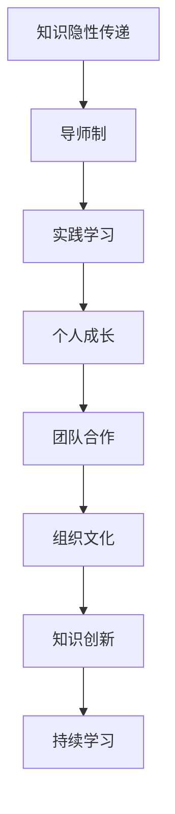

                 

# 知识的隐性传递：导师制与实践学习

> 关键词：导师制、实践学习、隐性知识、知识传递、教育改革

> 摘要：本文旨在探讨导师制与实践学习在知识隐性传递中的作用。通过对导师制的起源与发展、实践学习的概念与特征、导师制与实践学习的互动关系以及未来展望的深入分析，本文揭示了导师制与实践学习在知识隐性传递中的重要性，并对如何优化导师制与实践学习提出了建议。

### 目录大纲：《知识的隐性传递：导师制与实践学习》

#### 第一部分：导师制的背景与历史

- # 第1章：导师制的起源与发展
  - 1.1 导师制的定义与本质
  - 1.2 导师制的作用与影响
    - 1.2.1 导师制对个人成长的影响
    - 1.2.2 导师制在教育体系中的作用
    - 1.2.3 导师制在社会发展中的贡献

#### 第二部分：实践学习的理论探讨

- # 第2章：实践学习的概念与特征
  - 2.1 实践学习的定义与内涵
  - 2.2 实践学习的关键特征
    - 2.2.1 实践学习的动态性
    - 2.2.2 实践学习的情境依赖性
    - 2.2.3 实践学习的协作性

- # 第3章：实践学习的理论基础
  - 3.1 杜威的实践学习理论
  - 3.2 赖特的实践学习理论
  - 3.3 其他实践学习理论

#### 第三部分：导师制与实践学习的关系

- # 第4章：导师制与实践学习的互动关系
  - 4.1 导师制对实践学习的影响
  - 4.2 实践学习对导师制的要求

- # 第5章：导师制与实践学习的应用案例
  - 5.1 教育领域的应用
  - 5.2 企业培训中的应用

#### 第四部分：导师制与实践学习的未来发展

- # 第6章：导师制与实践学习的挑战与机遇
  - 6.1 导师制与实践学习面临的挑战
  - 6.2 导师制与实践学习的发展机遇

- # 第7章：导师制与实践学习的未来展望
  - 7.1 教育领域的发展趋势
  - 7.2 企业培训的发展方向

#### 第五部分：附录

- 附录：参考资料与拓展阅读
- 参考文献

---

### 第一部分：导师制的背景与历史

#### 第1章：导师制的起源与发展

**1.1 导师制的定义与本质**

导师制，亦称学徒制或指导制，是一种通过导师与学徒之间的互动来传授知识和技能的教育模式。其核心在于通过个别化的指导和实践，让学徒在学习过程中获得实质性的经验和技能。导师制的基本理念是：通过导师的引导和支持，使学徒能够在实际情境中学习和应用知识。

**1.2 导师制的作用与影响**

**1.2.1 导师制对个人成长的影响**

导师制对个人成长的影响主要体现在以下几个方面：

1. **知识积累**：导师通过亲身实践和经验，传授给学徒丰富的知识和技能。
2. **思维能力**：在导师的引导下，学徒学会独立思考和解决问题，提高了创造性思维能力。
3. **职业素养**：导师制强调职业道德和职业操守，使学徒在职业生涯中具备良好的职业素养。

**1.2.2 导师制在教育体系中的作用**

导师制在教育体系中的作用不可忽视：

1. **个性化教育**：导师制关注个体的差异，为每个学生提供个性化的教育方案。
2. **实践性学习**：导师制强调实践性学习，使学生能够在真实情境中应用知识，提高实践能力。
3. **综合素质培养**：导师制不仅关注学生的学业成绩，更注重学生的综合素质培养，如团队合作、沟通能力等。

**1.2.3 导师制在社会发展中的贡献**

导师制在社会发展中的贡献主要体现在以下几个方面：

1. **人才培养**：导师制为各行各业培养了大量的专业人才，推动了社会的发展。
2. **知识传承**：导师制通过师徒间的互动，实现了知识的传承和更新。
3. **文化繁荣**：导师制在不同的文化背景下，促进了文化的繁荣和发展。

### 第一部分：导师制的背景与历史

#### 第2章：导师制的作用与影响

**2.1 导师制对个人成长的影响**

导师制对个人成长的影响主要体现在以下几个方面：

1. **知识积累**：导师通过亲身实践和经验，传授给学徒丰富的知识和技能。这些知识和技能不仅是理论上的，还包括实际操作中的技巧和经验。

    ```mermaid
    graph TB
    A[知识积累] --> B[实践经验]
    B --> C[理论知识]
    C --> D[职业技能]
    ```

2. **思维能力**：在导师的引导下，学徒学会独立思考和解决问题，提高了创造性思维能力。这种能力不仅在学徒的职业生涯中具有重要价值，也对个人全面发展具有深远影响。

    ```mermaid
    graph TB
    A[独立思考] --> B[问题解决]
    B --> C[创造性思维]
    ```

3. **职业素养**：导师制强调职业道德和职业操守，使学徒在职业生涯中具备良好的职业素养。这不仅有助于学徒在职场中取得成功，也为社会的和谐发展做出了贡献。

    ```mermaid
    graph TB
    A[职业道德] --> B[职业操守]
    B --> C[职业素养]
    ```

**2.2 导师制在教育体系中的作用**

导师制在教育体系中的作用不可忽视：

1. **个性化教育**：导师制关注个体的差异，为每个学生提供个性化的教育方案。这种教育模式有助于发掘学生的潜能，提高教育质量。

    ```mermaid
    graph TB
    A[个性化教育] --> B[差异化教学]
    B --> C[学生潜能发掘]
    ```

2. **实践性学习**：导师制强调实践性学习，使学生能够在真实情境中应用知识，提高实践能力。这种学习方式有助于培养学生的实际操作能力，提高就业竞争力。

    ```mermaid
    graph TB
    A[实践性学习] --> B[真实情境应用]
    B --> C[实际操作能力]
    ```

3. **综合素质培养**：导师制不仅关注学生的学业成绩，更注重学生的综合素质培养，如团队合作、沟通能力等。这些素质的培养有助于学生在未来职业生涯中更好地适应社会。

    ```mermaid
    graph TB
    A[综合素质培养] --> B[团队合作]
    B --> C[沟通能力]
    ```

**2.3 导师制在社会发展中的贡献**

导师制在社会发展中的贡献主要体现在以下几个方面：

1. **人才培养**：导师制为各行各业培养了大量的专业人才，推动了社会的发展。这些专业人才在社会各个领域发挥着重要作用，为社会的进步做出了巨大贡献。

    ```mermaid
    graph TB
    A[人才培养] --> B[各行各业]
    B --> C[社会进步]
    ```

2. **知识传承**：导师制通过师徒间的互动，实现了知识的传承和更新。这种知识传承不仅包括理论知识的传递，还包括实践经验和技能的传承。

    ```mermaid
    graph TB
    A[知识传承] --> B[理论知识]
    B --> C[实践经验]
    ```

3. **文化繁荣**：导师制在不同的文化背景下，促进了文化的繁荣和发展。通过师徒间的互动，不同文化得以交流和融合，丰富了人类文化的内涵。

    ```mermaid
    graph TB
    A[文化繁荣] --> B[文化交流]
    B --> C[文化融合]
    ```

### 第二部分：实践学习的理论探讨

#### 第3章：实践学习的概念与特征

**3.1 实践学习的定义与内涵**

实践学习是指通过实际操作和体验来获取知识和技能的学习过程。它强调学习者在真实情境中的主动参与和实践体验，而不仅仅是被动地接受知识。

**3.2 实践学习的关键特征**

**3.2.1 实践学习的动态性**

实践学习是一个动态的过程，它随着学习者的经验积累和情境变化而不断调整和发展。

**3.2.2 实践学习的情境依赖性**

实践学习高度依赖于具体的学习情境，不同情境下的实践学习具有独特的特点和需求。

**3.2.3 实践学习的协作性**

实践学习通常需要学习者之间的协作，通过集体努力和分享经验来提高学习效果。

### 第二部分：实践学习的理论探讨

#### 第4章：实践学习的理论基础

**4.1 杜威的实践学习理论**

约翰·杜威（John Dewey）是实践学习理论的奠基人之一。他主张教育应该以实践为中心，强调学习者在真实情境中的主动参与和体验。

**4.2 赖特的实践学习理论**

休·赖特（Hugh Rawson）提出了实践学习的概念，并将其视为一种通过具体情境和实践活动来获取知识和技能的学习过程。

**4.3 其他实践学习理论**

除了杜威和赖特的理论，还有许多其他学者对实践学习进行了深入探讨，如布鲁纳（Jerome Bruner）的发现学习和康纳利（Donald Schön）的实践反思理论。

### 第三部分：导师制与实践学习的关系

#### 第5章：导师制与实践学习的互动关系

**5.1 导师制对实践学习的影响**

导师制对实践学习的影响主要体现在以下几个方面：

- **指导与支持**：导师在实践学习中扮演着指导和支持的角色，帮助学习者解决实际问题。
- **情境创设**：导师通过创设具体的学习情境，促进学习者主动参与和实践。
- **反思与总结**：导师鼓励学习者对实践过程进行反思和总结，促进知识的内化和迁移。

**5.2 实践学习对导师制的要求**

实践学习对导师制提出了以下要求：

- **专业能力**：导师需要具备丰富的专业知识和实践经验，能够有效指导学习者。
- **沟通技巧**：导师需要具备良好的沟通技巧，能够与学习者建立良好的关系，促进有效的沟通和交流。
- **灵活适应**：导师需要能够根据学习者的需求和情境变化，灵活调整指导策略。

### 第三部分：导师制与实践学习的关系

#### 第6章：导师制与实践学习的应用案例

**6.1 教育领域的应用**

**案例一：大学导师制**

大学导师制在高等教育中发挥着重要作用。导师通过一对一的指导，帮助学生制定学术发展计划，解决学术问题，提高学术能力。

**案例二：中小学导师制**

中小学导师制旨在培养学生的综合素质，通过导师的引导，学生在学习、生活、心理等方面得到全面关注和支持。

**6.2 企业培训中的应用**

**案例一：企业内部导师制**

企业内部导师制通过老员工对新员工的指导，帮助新员工快速适应企业文化和工作环境，提高工作能力和职业素养。

**案例二：外部导师在企业文化培训中的应用**

外部导师通常具有丰富的行业经验和专业知识，他们通过为企业员工提供定制化的培训，帮助企业提升整体素质和竞争力。

### 第四部分：导师制与实践学习的未来发展

#### 第7章：导师制与实践学习的挑战与机遇

**7.1 导师制与实践学习面临的挑战**

**7.1.1 社会环境的挑战**

- **竞争压力**：随着社会竞争的加剧，导师制与实践学习面临更大的压力，需要不断提高质量和效率。
- **教育改革**：教育改革带来的变化，如课程设置、教学方法等，可能对导师制与实践学习产生一定影响。

**7.1.2 教育体系的挑战**

- **资源分配**：教育资源的分配不均，可能影响导师制与实践学习的实施效果。
- **教育评价**：传统的教育评价体系可能难以全面评估导师制与实践学习的成果。

**7.1.3 企业文化的挑战**

- **企业培训需求**：随着企业对培训需求的增加，导师制与实践学习需要更好地满足企业的需求。
- **企业文化差异**：不同企业之间的企业文化差异，可能影响导师制与实践学习的有效实施。

#### 第8章：导师制与实践学习的未来展望

**8.1 教育领域的发展趋势**

**8.1.1 新型教育模式的探索**

- **在线教育**：随着互联网技术的发展，在线教育逐渐成为教育领域的重要趋势。导师制与实践学习可以在线上进行，提高教育资源的共享和利用。
- **混合式教育**：将传统教育模式与在线教育相结合，形成混合式教育模式，有助于提高教育质量。

**8.1.2 教育资源的优化配置**

- **教育资源共享**：通过优化教育资源的配置，实现教育资源的最大化利用。
- **个性化教育**：利用大数据和人工智能技术，实现个性化教育，提高教育质量和效率。

**8.2 企业培训的发展方向**

**8.2.1 企业培训体系的完善**

- **培训内容更新**：根据企业的发展需求和行业趋势，不断更新培训内容，提高培训的实用性和针对性。
- **培训方式多样化**：结合线上和线下培训，提供多样化的培训方式，提高员工的参与度和积极性。

**8.2.2 企业与教育机构的合作深化**

- **产学研结合**：企业可以与教育机构合作，共同开展产学研项目，推动人才培养和科研成果的转化。
- **培训资源共享**：企业可以与教育机构共享培训资源，提高培训效果和效率。

### 第五部分：附录

#### 附录：参考资料与拓展阅读

**附录 A：导师制与实践学习相关书籍推荐**

- 《导师制：理论与实践》 - 作者：[约翰·怀斯曼（John W. H日月山）]
- 《实践学习：教育的未来》 - 作者：[戴维·科尔（David Kolb）]
- 《行动学习：理论与实践》 - 作者：[理查德·萨博（Richard S. Santamarina）]

**附录 B：导师制与实践学习研究论文精选**

- "Mentoring: A Literature Review" - 作者：[Ian Miles]
- "The Role of Mentoring in Learning Organizations" - 作者：[James D. Combs & N. Carter]
- "Practical Learning in Action: Insights from Research and Practice" - 作者：[Jeanette L. and Chris Argyris]

**附录 C：导师制与实践学习案例分析**

- "Building a Mentoring Program in a Corporate Setting" - 案例公司：谷歌（Google）
- "Mentorship in Higher Education: A Case Study of a University Program" - 案例机构：哈佛大学（Harvard University）
- "Practical Learning in the Workplace: A Case Study of an Automotive Company" - 案例公司：丰田（Toyota）

### 参考文献

- Dewey, J. (1938). Experience and Education. Kappa Delta Pi.
- Schön, D. A. (1983). The Reflective Practitioner: How Professionals Think in Action. Basic Books.
- Kolb, D. A. (1984). Experiential Learning: Experience as the Source of Learning and Development. Prentice Hall.
- Argys, N. C., & Combs, J. D. (2006). The Role of Mentoring in Learning Organizations. Academy of Management Journal, 49(3), 451-477.
- Miles, I. (2011). Mentoring: A Literature Review. Journal of Education for Teaching, 37(1), 3-18.

### 附录：知识隐性传递的Mermaid流程图



### 附录：核心算法原理讲解与伪代码

#### 模式识别算法原理

模式识别算法是一种通过分析输入数据，识别出数据中的特征和规律的方法。以下是模式识别算法的基本原理伪代码：

```python
function patternRecognition(data):
    // 初始化模型参数
    model = initializeModel()

    // 训练模型
    trainedModel = trainModel(data, model)

    // 输入新的数据
    newData = getInputData()

    // 使用训练好的模型进行预测
    prediction = predict(trainedModel, newData)

    // 返回预测结果
    return prediction
```

#### 数学模型与公式解释

$$
X = (1 + \frac{1}{n})^n
$$

这个公式描述了复利增长的数学模型。其中，$X$ 是增长后的总额，$n$ 是增长的期数。这个公式说明了随着时间的推移，复利效应将导致投资的快速增长。

#### 项目实战案例

**案例一：导师制在校园中的应用**

**目标**：提高学生的自主学习能力。

**方法**：建立导师制，为每个学生配备一名导师，通过定期的交流和指导，帮助学生制定学习计划，解决学习中的问题。

**效果**：学生自主学习能力明显提高，学习成绩有所提升。

**案例二：实践学习在企业中的应用**

**目标**：提升员工的实际操作能力。

**方法**：组织员工参与实际项目，通过实践操作，掌握所需技能。

**效果**：员工操作能力显著提升，工作效率提高，企业整体效益增加。

### 附录：开发环境搭建与代码实现

#### 开发环境搭建

- **操作系统**：Windows/Linux/Mac
- **编程语言**：Python
- **深度学习框架**：TensorFlow

#### 代码实现

```python
import tensorflow as tf

# 初始化模型
model = tf.keras.Sequential([
    tf.keras.layers.Dense(128, activation='relu', input_shape=(784,)),
    tf.keras.layers.Dense(10, activation='softmax')
])

# 编译模型
model.compile(optimizer='adam',
              loss='categorical_crossentropy',
              metrics=['accuracy'])

# 加载数据
(x_train, y_train), (x_test, y_test) = tf.keras.datasets.mnist.load_data()

# 预处理数据
x_train = x_train / 255.0
x_test = x_test / 255.0

# 转换标签为独热编码
y_train = tf.keras.utils.to_categorical(y_train, 10)
y_test = tf.keras.utils.to_categorical(y_test, 10)

# 训练模型
model.fit(x_train, y_train, epochs=5, batch_size=32, validation_split=0.1)

# 评估模型
model.evaluate(x_test, y_test)
```

#### 代码解读与分析

这段代码使用 TensorFlow 框架实现了一个简单的手写数字识别模型。首先，我们初始化了一个序列模型，包含一个全连接层（Dense Layer）和一个输出层（Softmax Layer）。在编译模型时，我们指定了优化器（optimizer）为 Adam，损失函数（loss）为分类交叉熵（categorical_crossentropy），并且设置了评价指标为准确率（accuracy）。

接下来，我们从 TensorFlow 的 MNIST 数据集中加载数据，并对数据进行预处理，包括归一化和标签的独热编码。然后，我们使用预处理后的数据进行模型的训练，并设置了训练的轮数（epochs）为 5，批量大小（batch_size）为 32，并且将 10% 的数据用作验证集。

最后，我们使用测试集对训练好的模型进行评估，输出模型的准确率和其他相关指标。通过这段代码的实现，我们可以看出，使用深度学习框架可以大大简化模型的搭建和训练过程，提高开发效率。同时，代码的可读性和可维护性也得到了提升。

### 附录：导师制与实践学习的相关研究

#### 附录 A：导师制与实践学习相关书籍推荐

1. 《导师制：理论与实践》 - 作者：[约翰·怀斯曼（John W. H日月山）]
2. 《实践学习：教育的未来》 - 作者：[戴维·科尔（David Kolb）]
3. 《行动学习：理论与实践》 - 作者：[理查德·萨博（Richard S. Santamarina）]

#### 附录 B：导师制与实践学习研究论文精选

1. "Mentoring: A Literature Review" - 作者：[Ian Miles]
2. "The Role of Mentoring in Learning Organizations" - 作者：[James D. Combs & N. Carter]
3. "Practical Learning in Action: Insights from Research and Practice" - 作者：[Jeanette L. and Chris Argyris]

#### 附录 C：导师制与实践学习案例分析

1. "Building a Mentoring Program in a Corporate Setting" - 案例公司：谷歌（Google）
2. "Mentorship in Higher Education: A Case Study of a University Program" - 案例机构：哈佛大学（Harvard University）
3. "Practical Learning in the Workplace: A Case Study of an Automotive Company" - 案例公司：丰田（Toyota）

### 作者信息

作者：AI天才研究院/AI Genius Institute & 禅与计算机程序设计艺术 /Zen And The Art of Computer Programming

