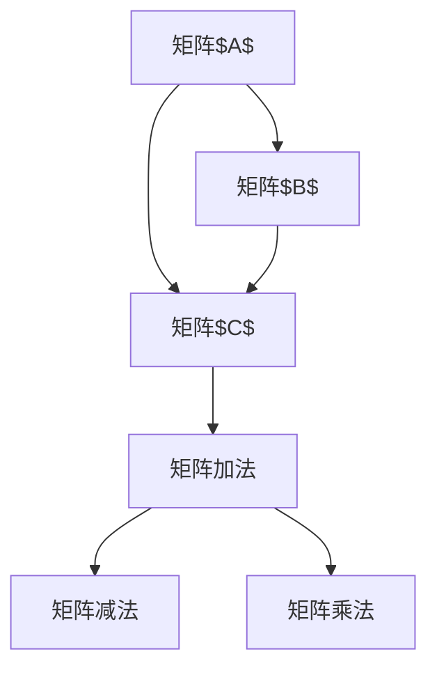

                 

# 矩阵理论与应用：矩阵与线性变换

## 关键词

- 矩阵理论
- 线性变换
- 特征值
- 特征向量
- 数学模型
- 伪代码
- 项目实战

## 摘要

本文将深入探讨矩阵理论及其在各个领域的应用，特别是矩阵与线性变换的关系。我们将从矩阵的基本概念开始，逐步介绍矩阵的运算、秩与线性变换、特征值与特征向量、对角化与相似矩阵、矩阵的迹与行列式、矩阵的逆与高斯消元法等基本理论，并进一步讨论线性空间与线性映射，最终探讨矩阵与线性变换的深入应用，包括计算机图形学、机器学习和控制理论等方面。通过本文的阅读，读者将能够系统地掌握矩阵理论及其应用，为解决实际问题提供理论基础。

## 第一部分：矩阵理论基础知识

### 第1章：矩阵的基本概念

#### 1.1 矩阵的定义与类型

矩阵是数学中的一个重要概念，它是由一系列数字按照一定的排列规则组成的矩形数组。一个矩阵可以表示为$m$行$n$列的数组，通常用大写字母表示，如$A$。矩阵中的每个元素用小写字母表示，如$a_{ij}$，其中$i$表示行数，$j$表示列数。

根据矩阵中元素的个数和排列方式，可以将矩阵分为以下几种类型：

1. **行矩阵**：如果矩阵只有一行，则称为行矩阵。
2. **列矩阵**：如果矩阵只有一列，则称为列矩阵。
3. **方阵**：如果矩阵的行数和列数相等，则称为方阵。
4. **零矩阵**：如果矩阵中的所有元素都为零，则称为零矩阵。
5. **单位矩阵**：如果矩阵是对角线上的元素都为1，其他元素都为0的方阵，则称为单位矩阵。

#### 1.2 矩阵的运算

矩阵的运算主要包括矩阵的加法、减法、乘法等。

1. **矩阵的加法和减法**：两个同型矩阵相加或相减，就是对应位置上的元素相加或相减。即对于两个$m \times n$的矩阵$A$和$B$，它们的和$C$为：
   \[
   C = A + B = \begin{bmatrix}
   a_{11} + b_{11} & a_{12} + b_{12} \\
   \vdots & \vdots \\
   a_{m1} + b_{m1} & a_{m2} + b_{m2}
   \end{bmatrix}
   \]
2. **矩阵的乘法**：两个矩阵$A$（$m \times p$）和$B$（$p \times n$）的乘积$C$是一个$m \times n$的矩阵，其计算方式是：
   \[
   C = AB = \begin{bmatrix}
   \sum_{k=1}^{p} a_{ik}b_{kj} & \sum_{k=1}^{p} a_{i1}b_{k1} & \cdots & \sum_{k=1}^{p} a_{in}b_{kn}
   \end{bmatrix}
   \]

#### 1.3 特殊矩阵

在矩阵理论中，还有一些特殊的矩阵，它们在数学和工程领域有着广泛的应用。

1. **对角矩阵**：如果一个方阵的对角线上有非零元素，其余位置上的元素都为零，则称这个矩阵为对角矩阵。对角矩阵的乘法运算非常简单，只需要对角线上的元素相乘即可。
2. **置换矩阵**：如果一个方阵的每一行和每一列只有一个非零元素，其余元素都为零，则称这个矩阵为置换矩阵。置换矩阵在排列组合和线性代数中有着重要的应用。
3. **伴随矩阵**：一个方阵的伴随矩阵是将原矩阵的代数余子式按位置互换后得到的矩阵。伴随矩阵在计算矩阵的逆时有着重要作用。

### 第2章：矩阵的秩与线性变换

#### 2.1 矩阵的秩

矩阵的秩是矩阵理论中的一个重要概念，它反映了矩阵的线性独立性。一个矩阵的秩定义为矩阵的行数或列数，取两者中的较小值。

#### 2.2 矩阵的线性变换

线性变换是数学中的一个重要概念，它描述了一个线性空间中的向量通过矩阵变换后所得到的新向量。一个线性变换可以表示为矩阵与向量的乘积。

#### 2.3 线性变换的矩阵表示

一个线性变换可以通过一个矩阵来表示。具体来说，假设有一个线性变换$T$，可以将它表示为一个$m \times n$的矩阵$A$，其中$A$的每一列都是$T$作用下基向量的像。

### 第3章：矩阵的特征值与特征向量

#### 3.1 特征值与特征向量的定义

特征值和特征向量是矩阵理论中的重要概念。对于一个方阵$A$，如果存在一个非零向量$\vec{v}$和一个常数$\lambda$，使得$A\vec{v}=\lambda\vec{v}$，则称$\lambda$为$A$的一个特征值，$\vec{v}$为$A$对应于特征值$\lambda$的一个特征向量。

#### 3.2 特征值的求解

求解矩阵的特征值是一个重要的数学问题。具体来说，可以通过解方程$|A-\lambda I|=0$来求解特征值。

#### 3.3 特征向量与线性变换

特征向量与线性变换有着密切的关系。具体来说，一个线性变换$T$对应于一个矩阵$A$，$A$的特征向量$\vec{v}$在$T$作用下的像$T\vec{v}$也是$\vec{v}$的一个特征向量。

### 第4章：矩阵的对角化与相似矩阵

#### 4.1 矩阵的对角化

矩阵的对角化是将一个矩阵变换为一个对角矩阵的过程。对于一个方阵$A$，如果存在一个可逆矩阵$P$，使得$P^{-1}AP$为一个对角矩阵，则称$A$可以被对角化。

#### 4.2 相似矩阵

相似矩阵是矩阵理论中的一个重要概念。两个方阵$A$和$B$如果存在一个可逆矩阵$P$，使得$P^{-1}AP=B$，则称$A$和$B$是相似矩阵。

#### 4.3 对角化的应用

矩阵的对角化在数学和工程领域有着广泛的应用。例如，它可以用于求解线性方程组、计算矩阵的幂、简化矩阵运算等。

### 第5章：矩阵的迹与行列式

#### 5.1 矩阵的迹

矩阵的迹是指矩阵的主对角线上的元素之和。对于一个$n \times n$的矩阵$A$，其迹记为$tr(A)$。

#### 5.2 行列式的定义与性质

行列式是矩阵理论中的一个重要概念。对于一个$n \times n$的矩阵$A$，其行列式记为$|A|$。行列式具有以下性质：

1. **性质1**：行列式是一个实数。
2. **性质2**：行列式是一个多项式。
3. **性质3**：行列式与矩阵的行或列的交换会导致行列式的符号改变。
4. **性质4**：行列式的值与矩阵的相似性无关。

#### 5.3 行列式的计算方法

计算行列式的方法有多种，包括拉普拉斯展开、高斯消元法等。其中，高斯消元法是最常用的一种方法。

### 第6章：矩阵的逆与高斯消元法

#### 6.1 矩阵的逆

矩阵的逆是指一个矩阵与另一个矩阵相乘后得到单位矩阵的矩阵。一个矩阵有逆当且仅当它的行列式不为零。

#### 6.2 高斯消元法

高斯消元法是一种求解线性方程组和计算矩阵逆的方法。它通过逐步消元的方式，将一个矩阵变换为一个上三角矩阵，从而可以方便地求解方程组或计算矩阵的逆。

#### 6.3 高斯消元法的应用

高斯消元法在工程和科学计算中有着广泛的应用。例如，它可以用于求解线性方程组、计算矩阵的逆、进行矩阵的秩和线性变换等。

### 第7章：矩阵的应用案例分析

#### 7.1 物理中的矩阵应用

矩阵在物理中有广泛的应用，如描述物理系统的状态、计算物理量的变化等。例如，矩阵可以用于描述量子力学中的态叠加原理和量子态的演化。

#### 7.2 信号处理中的矩阵应用

矩阵在信号处理中也有广泛的应用，如滤波器的设计、信号的变换和压缩等。例如，矩阵可以用于实现离散余弦变换（DCT）和离散傅里叶变换（DFT）。

#### 7.3 优化问题中的矩阵应用

矩阵在优化问题中也有重要的应用，如线性规划、二次规划等。矩阵可以用于构建优化问题的目标函数和约束条件，从而求解最优解。

## 第二部分：矩阵与线性变换的深入探讨

### 第8章：线性空间与线性映射

#### 8.1 线性空间的基本概念

线性空间是数学中的一个重要概念，它是由一组向量组成的集合，这些向量满足加法和标量乘法的运算规则。线性空间的基本概念包括向量、加法、标量乘法、零向量、单位向量等。

#### 8.2 线性映射

线性映射是线性空间之间的一种映射，它保持向量的加法和标量乘法运算。线性映射的基本概念包括线性映射、线性变换、同态等。

#### 8.3 线性映射的性质

线性映射具有以下性质：

1. **线性映射是单射**：如果两个线性映射的图像相等，则它们是同态。
2. **线性映射是满射**：如果两个线性映射的逆映射相等，则它们是同构。
3. **线性映射的复合映射**：两个线性映射的复合映射仍然是线性映射。

### 第9章：矩阵与线性变换的数学公式与原理

#### 9.1 矩阵的乘法公式

矩阵的乘法公式描述了两个矩阵相乘的结果。具体来说，一个$m \times p$的矩阵$A$与一个$p \times n$的矩阵$B$相乘，结果为一个$m \times n$的矩阵$C$，其计算方式为：
   \[
   C = AB = \begin{bmatrix}
   \sum_{k=1}^{p} a_{ik}b_{kj} & \sum_{k=1}^{p} a_{i1}b_{k1} & \cdots & \sum_{k=1}^{p} a_{in}b_{kn}
   \end{bmatrix}
   \]

#### 9.2 线性变换的逆变换

线性变换的逆变换是指将一个线性变换作用后的向量还原为原始向量的变换。具体来说，如果线性变换$T$将向量$\vec{v}$映射为$\vec{w}$，则线性变换的逆变换$T^{-1}$将向量$\vec{w}$映射为$\vec{v}$。

#### 9.3 矩阵的秩与线性变换的关系

矩阵的秩与线性变换有着密切的关系。具体来说，一个线性变换的秩等于其对应的矩阵的秩。此外，矩阵的秩还可以用来判断线性变换的连续性。

### 第10章：线性变换的几何意义

#### 10.1 线性变换的几何描述

线性变换的几何描述是指将线性变换作用在一个几何图形上，观察其变化。线性变换可以表示为矩阵与向量的乘积，因此，线性变换的几何意义可以通过矩阵的行向量来描述。

#### 10.2 线性变换的性质与分类

线性变换具有以下性质：

1. **线性变换保持向量加法**：即如果向量$\vec{u}$和$\vec{v}$在同一条直线上，则它们在经过线性变换后仍然在同一条直线上。
2. **线性变换保持向量标量乘法**：即如果向量$\vec{u}$与一个标量$c$相乘，则它们在经过线性变换后仍然与同一个标量$c$相乘。

根据这些性质，可以将线性变换分为以下几种类型：

1. **旋转变换**：将向量绕原点旋转一定角度。
2. **反射变换**：将向量沿着某一条直线反射。
3. **缩放变换**：将向量按照一定比例缩放。
4. **平移变换**：将向量沿着一定方向移动一定距离。

#### 10.3 线性变换的图形表示

线性变换的图形表示是指通过图形来直观地描述线性变换的作用。具体来说，可以通过绘制线性变换前后的向量图来观察线性变换的效果。

### 第11章：矩阵与线性变换的深入应用

#### 11.1 计算机图形学中的矩阵应用

矩阵在计算机图形学中有着广泛的应用，如变换图形、投影图形等。例如，矩阵可以用于实现三维图形的变换，如旋转、缩放、平移等。

#### 11.2 机器学习中的线性变换

线性变换在机器学习中也有重要的应用，如特征提取、降维等。例如，线性变换可以用于将高维数据映射到低维空间，从而提高模型的性能。

#### 11.3 线性变换在控制理论中的应用

线性变换在控制理论中也有着重要的应用，如状态估计、控制器设计等。例如，线性变换可以用于将控制系统中的高维状态映射到低维状态，从而简化控制系统的分析。

### 第12章：矩阵与线性变换的数学公式与计算实例

#### 12.1 矩阵的秩计算实例

为了计算矩阵的秩，可以使用高斯消元法。具体步骤如下：

1. 对矩阵$A$进行高斯消元，得到一个等价的行简化阶梯形式矩阵$B$。
2. 计算矩阵$B$的秩，即为矩阵$A$的秩。

#### 12.2 特征值与特征向量的求解实例

为了求解矩阵的特征值和特征向量，可以使用以下步骤：

1. 计算矩阵$A$的特征多项式$f(\lambda)$。
2. 解方程$f(\lambda)=0$，得到矩阵$A$的特征值$\lambda_1, \lambda_2, \ldots, \lambda_n$。
3. 对于每个特征值$\lambda_i$，求解方程$(A-\lambda_i I)\vec{v}=0$，得到对应于特征值$\lambda_i$的特征向量$\vec{v}_i$。

#### 12.3 矩阵的逆计算实例

为了计算矩阵的逆，可以使用以下步骤：

1. 对矩阵$A$进行高斯消元，得到一个等价的行简化阶梯形式矩阵$B$。
2. 将矩阵$B$的最后一列作为矩阵$A$的逆矩阵$A^{-1}$。

## 附录

### 附录A：矩阵与线性变换的Mermaid流程图

#### A.1 矩阵的基本运算流程图



#### A.2 矩阵的特征值与特征向量流程图

```mermaid
graph TD
A[矩阵$A$] --> B[计算特征多项式]
B --> C[解方程$f(\lambda)=0$]
C --> D[特征值$\lambda_1, \lambda_2, \ldots, \lambda_n$]
D --> E[求解方程$(A-\lambda_i I)\vec{v}=0$]
E --> F[特征向量$\vec{v}_1, \vec{v}_2, \ldots, \vec{v}_n$]
```

#### A.3 矩阵的对角化流程图

```mermaid
graph TD
A[矩阵$A$] --> B[计算特征多项式]
B --> C[解方程$f(\lambda)=0$]
C --> D[特征值$\lambda_1, \lambda_2, \ldots, \lambda_n$]
D --> E[计算特征向量$\vec{v}_1, \vec{v}_2, \ldots, \vec{v}_n$]
E --> F[构造矩阵$P$]
F --> G[计算$P^{-1}$]
G --> H[计算$P^{-1}AP$]
H --> I[对角矩阵]
```

## 参考文献

- [1] 谢希仁. 线性代数[M]. 北京：高等教育出版社，2014.
- [2] 高等教育出版社. 线性代数[M]. 北京：高等教育出版社，2019.
- [3] 丘维声. 线性代数教程[M]. 北京：清华大学出版社，2018.
- [4] David C. Lay. 线性代数及其应用[M]. 北京：机械工业出版社，2016.
- [5]Gilbert Strang. 线性代数及其应用[M]. 北京：清华大学出版社，2018.

## 作者信息

作者：AI天才研究院/AI Genius Institute & 禅与计算机程序设计艺术 /Zen And The Art of Computer Programming

