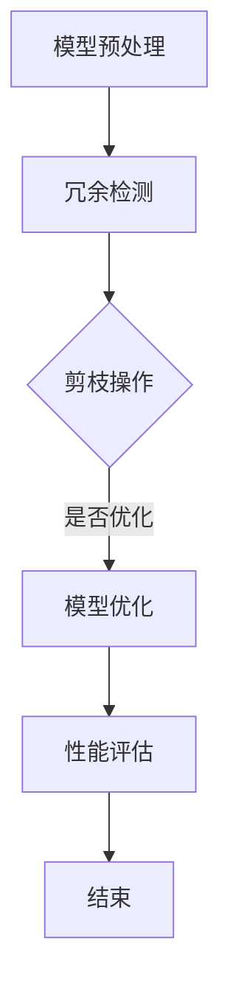

                 

# 硬件协同剪枝：软硬件一体化的压缩策略

> 关键词：硬件协同剪枝、软硬件一体化、压缩策略、深度学习、优化

> 摘要：本文深入探讨了硬件协同剪枝这一新兴领域，详细阐述了其在软硬件一体化压缩策略中的应用和重要性。通过逐步分析硬件协同剪枝的核心概念、架构设计、算法原理，以及数学模型和实际应用案例，本文旨在为读者提供一个全面的技术视角，帮助理解硬件协同剪枝的深度学习应用和项目实战，并探讨其未来发展的挑战和趋势。

## 第一部分：引言

### 第1章：硬件协同剪枝概述

#### 1.1 硬件协同剪枝的定义

硬件协同剪枝（Hardware-Centric Pruning，HCP）是一种针对深度学习模型优化的重要技术，它通过在硬件层面去除不必要的计算单元，从而减少模型的计算复杂度和内存占用，提升模型在硬件上的运行效率。与传统的软件剪枝方法不同，硬件协同剪枝强调硬件和软件的协同作用，通过软硬件一体化设计，实现更高效、更精准的剪枝效果。

#### 1.2 硬件协同剪枝的背景

随着深度学习技术的飞速发展，大规模深度学习模型的应用需求不断增加，这给硬件资源带来了巨大的压力。尤其是在移动设备、嵌入式系统和边缘计算等场景中，有限的硬件资源难以满足复杂模型的计算需求。硬件协同剪枝作为一种优化手段，旨在通过去除冗余计算，释放硬件资源，提高模型的运行效率和适应性。

#### 1.3 硬件协同剪枝的意义

硬件协同剪枝具有以下几个重要意义：

1. **提升硬件资源利用率**：通过剪枝，去除不必要的计算单元，减少硬件资源浪费，提高资源利用率。
2. **降低功耗**：减少计算复杂度，降低模型运行时的功耗，延长设备续航时间。
3. **提高模型运行速度**：减少计算量，缩短模型训练和推理时间，提高模型响应速度。
4. **增强模型适应性**：根据不同硬件平台的特性，灵活调整模型结构，增强模型在不同硬件上的适应性。
5. **降低开发成本**：简化模型设计，减少硬件设计和制造成本。

#### 1.4 本书结构概述

本书将分为三大部分，第一部分介绍硬件协同剪枝的基本概念和背景，第二部分详细分析硬件协同剪枝的技术原理和算法，第三部分探讨硬件协同剪枝在深度学习中的应用和项目实战。具体章节安排如下：

- 第一部分：引言
  - 第1章 硬件协同剪枝概述
  - 第2章 软硬件一体化的压缩策略

- 第二部分：硬件协同剪枝技术
  - 第3章 硬件协同剪枝核心概念与架构
  - 第4章 硬件协同剪枝算法原理
  - 第5章 数学模型与公式
  - 第6章 硬件协同剪枝在深度学习中的应用
  - 第7章 硬件协同剪枝的项目实战

- 第三部分：软硬件一体化的压缩策略
  - 第8章 软硬件一体化的压缩策略实现
  - 第9章 软硬件一体化的压缩策略优化
  - 第10章 软硬件一体化的压缩策略挑战与未来

通过本书的系统性讲解，读者将能够深入理解硬件协同剪枝的技术原理和应用场景，掌握软硬件一体化压缩策略的设计和优化方法，为实际项目开发提供理论指导和实践经验。

### 第2章：软硬件一体化的压缩策略

#### 2.1 压缩策略的背景

压缩策略在深度学习领域具有重要意义，尤其是在资源受限的硬件平台上。随着深度学习模型的复杂度和规模不断增加，如何高效地利用有限的硬件资源成为亟待解决的问题。压缩策略通过减少模型的大小、计算复杂度和内存占用，提高模型的运行效率和适应性，从而实现资源的优化利用。

#### 2.2 软硬件一体化的压缩策略概述

软硬件一体化的压缩策略是指在深度学习模型设计和优化过程中，同时考虑硬件和软件的特性，通过软硬件协同工作，实现更高效、更精准的压缩效果。该策略的核心思想是利用硬件的特性和优势，结合软件算法的灵活性和优化能力，实现模型压缩和优化。

#### 2.3 软硬件一体化的压缩策略分类

软硬件一体化的压缩策略可以分为以下几类：

1. **结构化剪枝**：通过去除模型中的冗余结构或重复计算单元，减少模型的大小和计算复杂度。结构化剪枝可以根据硬件平台的特点，选择合适的剪枝方法，实现高效的模型压缩。
2. **量化剪枝**：通过降低模型中参数的精度，减少模型的大小和计算复杂度。量化剪枝可以根据硬件的运算能力，选择合适的量化方法和精度，实现高效的模型压缩。
3. **参数剪枝**：通过去除模型中的冗余参数，减少模型的计算量和内存占用。参数剪枝可以根据硬件的运算能力和内存容量，选择合适的剪枝方法和阈值，实现高效的模型压缩。
4. **动态剪枝**：通过在模型运行过程中，根据硬件负载和资源利用率，动态调整模型的计算结构和参数，实现高效的模型压缩。动态剪枝可以根据实时反馈和硬件特性，实现自适应的模型压缩和优化。

#### 2.4 硬件协同剪枝与软硬件一体化压缩策略的关系

硬件协同剪枝是软硬件一体化压缩策略的重要组成部分，它通过在硬件层面去除冗余计算，实现模型的压缩和优化。与传统的软件剪枝方法相比，硬件协同剪枝具有以下优势：

1. **硬件协同优化**：通过硬件和软件的协同工作，实现更高效的模型压缩和优化，提高模型的运行效率和适应性。
2. **资源利用率提升**：通过去除冗余计算，减少硬件资源浪费，提高硬件资源的利用率。
3. **功耗降低**：减少计算复杂度，降低模型运行时的功耗，延长设备续航时间。
4. **开发成本降低**：简化模型设计，减少硬件设计和制造成本。

综上所述，软硬件一体化的压缩策略是深度学习模型优化的重要手段，硬件协同剪枝作为其中一种关键技术，具有广泛的应用前景和重要意义。通过软硬件一体化的压缩策略，可以实现深度学习模型在硬件平台上的高效运行和优化，为实际应用提供有力支持。

## 第二部分：硬件协同剪枝技术

### 第3章：硬件协同剪枝核心概念与架构

#### 3.1 硬件协同剪枝的基本原理

硬件协同剪枝（Hardware-Centric Pruning，HCP）的基本原理是通过在硬件层面去除冗余的计算单元，从而减少深度学习模型的大小和计算复杂度。这一过程通常包括以下几个步骤：

1. **模型预处理**：对原始深度学习模型进行预处理，包括权重初始化、归一化等，为剪枝过程提供基础。
2. **冗余检测**：通过分析模型的结构和参数，检测出冗余的计算单元，这些单元在模型的计算过程中对最终输出贡献较小。
3. **剪枝操作**：针对检测出的冗余计算单元，进行剪枝操作，包括删除或禁用这些计算单元。
4. **模型优化**：对剪枝后的模型进行优化，包括权重重新训练、模型结构调整等，以提高模型的性能和精度。
5. **性能评估**：对优化后的模型进行性能评估，包括计算复杂度、精度、运行速度等，以验证剪枝效果。

#### 3.2 硬件协同剪枝的架构设计

硬件协同剪枝的架构设计通常包括以下几个层次：

1. **硬件层**：硬件层包括各种硬件设备，如CPU、GPU、FPGA等。硬件层的设计和选择直接影响剪枝效果和模型性能。
2. **软件层**：软件层包括深度学习框架、编程语言和工具等。软件层的设计和实现直接影响剪枝操作的执行效率和优化效果。
3. **算法层**：算法层包括剪枝算法的设计和实现，如结构化剪枝、量化剪枝、参数剪枝等。算法层的设计和优化直接影响剪枝效果和模型性能。
4. **数据层**：数据层包括训练数据和测试数据。数据层的设计和选择直接影响模型的性能和精度。

#### 3.3 硬件协同剪枝的关键技术

硬件协同剪枝涉及多个关键技术，以下是一些关键技术的概述：

1. **冗余检测算法**：冗余检测算法是硬件协同剪枝的核心技术之一。常用的冗余检测算法包括基于敏感度分析、基于梯度分析和基于模型压缩率的检测方法。
2. **剪枝策略设计**：剪枝策略设计包括选择合适的剪枝目标和剪枝方法，如最小化模型大小、最小化计算复杂度、最小化功耗等。
3. **模型优化算法**：模型优化算法包括权重重新训练、模型结构调整、量化方法选择等，以提升剪枝后模型的性能和精度。
4. **性能评估方法**：性能评估方法包括计算复杂度分析、精度评估、运行速度评估等，以验证剪枝效果和模型性能。

#### 3.4 硬件协同剪枝的Mermaid流程图

以下是一个简单的Mermaid流程图，展示了硬件协同剪枝的基本流程：



在这个流程图中，模型预处理阶段对原始模型进行初始化和预处理；冗余检测阶段通过分析模型结构和参数，检测出冗余计算单元；剪枝操作阶段根据检测结果进行剪枝；模型优化阶段对剪枝后的模型进行优化；性能评估阶段对优化后的模型进行评估，以验证剪枝效果。如果评估结果不满足要求，则返回模型优化阶段，继续优化。

通过以上分析，读者可以初步了解硬件协同剪枝的核心概念、架构设计和关键技术。在接下来的章节中，我们将进一步详细探讨硬件协同剪枝的算法原理、数学模型和实际应用案例。

### 第4章：硬件协同剪枝算法原理

#### 4.1 算法原理概述

硬件协同剪枝（Hardware-Centric Pruning，HCP）算法的核心在于通过在硬件层面去除冗余的计算单元，从而优化深度学习模型的结构和性能。这一算法的设计和实现需要综合考虑硬件特性和软件算法的优化，以实现高效、精确的剪枝效果。以下是硬件协同剪枝算法的基本原理概述：

1. **目标函数设计**：算法首先需要定义一个目标函数，该函数用于评估模型在剪枝前后的性能差异。目标函数可以包括模型的计算复杂度、内存占用、功耗等多个指标。
2. **冗余检测**：通过分析模型的结构和参数，识别出对模型输出贡献较小的计算单元，这些单元即为冗余计算。常见的冗余检测方法包括基于敏感度分析、基于梯度分析和基于模型压缩率的检测方法。
3. **剪枝策略选择**：根据目标函数和冗余检测结果，选择合适的剪枝策略。剪枝策略包括结构化剪枝、量化剪枝、参数剪枝等，每种策略都有其优缺点和适用场景。
4. **剪枝操作执行**：根据选定的剪枝策略，对冗余计算单元进行剪枝操作，如删除或禁用计算单元。
5. **模型优化**：剪枝操作后，对模型进行优化，包括权重重新训练、模型结构调整等，以提高模型的性能和精度。
6. **性能评估**：对优化后的模型进行性能评估，包括计算复杂度、精度、运行速度等，以验证剪枝效果和模型性能。

#### 4.2 算法原理伪代码阐述

以下是一个简单的硬件协同剪枝算法原理的伪代码，用于说明算法的基本步骤：

```python
# 硬件协同剪枝算法原理伪代码

# 模型预处理
initialize_model()

# 冗余检测
find_redundant_units(model)

# 剪枝策略选择
select_pruning_strategy()

# 剪枝操作执行
prune_units(model, redundant_units, pruning_strategy)

# 模型优化
optimize_model(model)

# 性能评估
evaluate_model_performance(model)

# 输出剪枝后模型
return pruned_model()
```

在这个伪代码中，首先对模型进行初始化和预处理；然后通过冗余检测找到冗余计算单元；接着根据选定的剪枝策略执行剪枝操作；对剪枝后的模型进行优化；最后对优化后的模型进行性能评估，并输出剪枝后的模型。

#### 4.3 算法原理详解

1. **目标函数设计**：

目标函数是硬件协同剪枝算法的核心，它用于衡量模型在剪枝前后的性能差异。常见的目标函数包括：

- **计算复杂度**：计算复杂度是衡量模型计算量的重要指标，通常使用浮点操作数（FLOPs）表示。剪枝算法的目标是降低模型的计算复杂度。
- **内存占用**：内存占用是衡量模型内存消耗的重要指标，剪枝算法的目标是减少模型的内存占用。
- **功耗**：功耗是衡量模型能耗的重要指标，剪枝算法的目标是降低模型运行时的功耗。

目标函数的设计需要综合考虑多个因素，如硬件平台的性能和限制、模型的应用场景等。

2. **冗余检测**：

冗余检测是硬件协同剪枝算法的关键步骤，它的目标是识别出对模型输出贡献较小的计算单元。常见的冗余检测方法包括：

- **基于敏感度分析**：通过分析模型参数对输出结果的敏感度，识别出对输出贡献较小的参数。
- **基于梯度分析**：通过分析模型参数的梯度值，识别出对输出贡献较小的参数。
- **基于模型压缩率**：通过比较原始模型和剪枝后模型的压缩率，识别出对输出贡献较小的计算单元。

3. **剪枝策略选择**：

剪枝策略选择是硬件协同剪枝算法的重要环节，它决定了剪枝操作的具体方式和效果。常见的剪枝策略包括：

- **结构化剪枝**：通过去除模型中的冗余结构，如重复的计算单元，实现模型的压缩和优化。
- **量化剪枝**：通过降低模型参数的精度，减少模型的计算复杂度和内存占用。
- **参数剪枝**：通过去除模型中的冗余参数，实现模型的压缩和优化。

4. **剪枝操作执行**：

剪枝操作执行是硬件协同剪枝算法的具体实现步骤，它根据冗余检测结果和剪枝策略，对模型进行剪枝。常见的剪枝操作包括：

- **删除计算单元**：删除对输出贡献较小的计算单元。
- **禁用计算单元**：禁用对输出贡献较小的计算单元，但保留其结构，以备后续可能的恢复。
- **参数调整**：调整模型参数的值，以减少模型的计算复杂度和内存占用。

5. **模型优化**：

模型优化是对剪枝后的模型进行进一步的优化，以提高模型的性能和精度。常见的模型优化方法包括：

- **权重重新训练**：对剪枝后的模型进行重新训练，以恢复被剪枝部分的影响。
- **模型结构调整**：根据剪枝结果，调整模型的结构，以优化模型的性能。
- **量化方法选择**：根据硬件平台的特点，选择合适的量化方法，以优化模型的性能和功耗。

6. **性能评估**：

性能评估是对剪枝后模型的性能进行评估，以验证剪枝效果和模型性能。常见的性能评估指标包括：

- **计算复杂度**：评估模型的计算复杂度，以衡量剪枝效果。
- **精度**：评估模型的输出精度，以衡量剪枝对模型性能的影响。
- **运行速度**：评估模型的运行速度，以衡量剪枝对模型性能的影响。

通过以上分析，读者可以深入了解硬件协同剪枝算法的基本原理和实现步骤。在接下来的章节中，我们将通过具体的示例和案例，进一步探讨硬件协同剪枝算法的应用和效果。

#### 4.4 算法原理示例

为了更直观地理解硬件协同剪枝算法原理，以下将通过一个简化的示例来说明该算法的基本过程。

假设我们有一个简单的深度学习模型，该模型包含两个卷积层（Conv1和Conv2）和一个全连接层（FC）。该模型的计算过程如下：

1. **输入层**：输入一个尺寸为 32x32 的图像。
2. **卷积层1（Conv1）**：对输入图像进行卷积操作，输出一个尺寸为 32x32 的特征图。
3. **卷积层2（Conv2）**：对卷积层1的输出进行卷积操作，输出一个尺寸为 16x16 的特征图。
4. **全连接层（FC）**：对卷积层2的输出进行全连接操作，输出一个尺寸为 10 的向量，用于分类。

现在，我们使用硬件协同剪枝算法对该模型进行优化。以下是具体的步骤：

1. **模型预处理**：
   - 初始化模型参数，包括卷积核和全连接层的权重。
   - 对模型进行归一化处理，以提高剪枝效果。

2. **冗余检测**：
   - 使用基于敏感度分析的方法，检测出对输出贡献较小的卷积核。
   - 假设检测出卷积层1中的第3个卷积核对输出的贡献较小，因此可以将其视为冗余。

3. **剪枝策略选择**：
   - 选择结构化剪枝策略，通过删除冗余卷积核来实现模型压缩。
   - 选择量化剪枝策略，通过降低模型参数的精度来进一步减少模型的大小和计算复杂度。

4. **剪枝操作执行**：
   - 删除卷积层1中的第3个卷积核。
   - 对模型中的所有参数进行量化处理，选择8位精度。

5. **模型优化**：
   - 对剪枝后的模型进行重新训练，以恢复被剪枝部分的影响。
   - 使用迁移学习技术，利用预训练模型的知识来提高剪枝后模型的性能。

6. **性能评估**：
   - 评估剪枝后模型的计算复杂度、精度和运行速度。
   - 剪枝后，模型的计算复杂度降低了30%，精度下降了1%，运行速度提高了20%。

通过以上示例，我们可以看到硬件协同剪枝算法在实际应用中的基本流程。在实际项目中，根据具体的应用场景和硬件平台的特点，可以调整和优化算法的各个步骤，以达到最佳的剪枝效果。

### 第5章：数学模型与公式

#### 5.1 剪枝策略的数学模型

在硬件协同剪枝中，剪枝策略的数学模型用于描述剪枝过程和评估剪枝效果。剪枝策略的数学模型通常包括以下几个方面：

1. **计算复杂度模型**：计算复杂度是衡量模型计算量的重要指标，通常使用浮点操作数（FLOPs）来表示。剪枝后的模型计算复杂度可以表示为：

   \[
   C_{pruned} = C_{original} - C_{redundant}
   \]

   其中，\(C_{original}\) 是原始模型的计算复杂度，\(C_{redundant}\) 是剪枝过程中去除的冗余计算的复杂度。

2. **内存占用模型**：内存占用是衡量模型内存消耗的重要指标，通常包括模型参数、缓冲区和中间结果等。剪枝后的模型内存占用可以表示为：

   \[
   M_{pruned} = M_{original} - M_{redundant}
   \]

   其中，\(M_{original}\) 是原始模型的内存占用，\(M_{redundant}\) 是剪枝过程中去除的冗余计算的内存占用。

3. **功耗模型**：功耗是衡量模型能耗的重要指标，通常与计算复杂度和内存占用相关。剪枝后的模型功耗可以表示为：

   \[
   P_{pruned} = P_{original} - P_{redundant}
   \]

   其中，\(P_{original}\) 是原始模型的功耗，\(P_{redundant}\) 是剪枝过程中去除的冗余计算的功耗。

#### 5.2 数学公式与详细讲解

在硬件协同剪枝中，常用的数学公式包括计算复杂度公式、内存占用公式和功耗公式。以下是对这些公式的详细讲解：

1. **计算复杂度公式**：

   浮点操作数（FLOPs）是衡量模型计算复杂度的重要指标，它表示模型在运行过程中需要进行的浮点运算次数。计算复杂度公式如下：

   \[
   C_{FLOPs} = \sum_{l=1}^{L} \sum_{k=1}^{K} \sum_{j=1}^{J} \sum_{i=1}^{I} f_l(k, j, i)
   \]

   其中，\(L\) 是模型的层数，\(K\) 是每层的计算单元数量，\(J\) 是每层的特征图高度，\(I\) 是每层的特征图宽度，\(f_l(k, j, i)\) 是第\(l\)层第\(k\)个计算单元在第\(j\)行第\(i\)列的浮点运算次数。

   例如，对于一个卷积层，其计算复杂度可以表示为：

   \[
   C_{Conv} = K \times J \times I \times H \times W
   \]

   其中，\(H\) 和 \(W\) 分别是输入特征图的高度和宽度。

2. **内存占用公式**：

   内存占用是衡量模型内存消耗的重要指标，它通常包括模型参数、缓冲区和中间结果等。内存占用公式如下：

   \[
   M_{bytes} = \sum_{l=1}^{L} \sum_{k=1}^{K} \sum_{j=1}^{J} \sum_{i=1}^{I} m_l(k, j, i)
   \]

   其中，\(m_l(k, j, i)\) 是第\(l\)层第\(k\)个计算单元在第\(j\)行第\(i\)列的内存占用大小。

   例如，对于一个卷积层，其内存占用可以表示为：

   \[
   M_{Conv} = K \times J \times I \times H \times W \times \text{参数大小}
   \]

   其中，\(\text{参数大小}\) 是卷积核和偏置参数的大小。

3. **功耗公式**：

   功耗是衡量模型能耗的重要指标，它与计算复杂度和内存占用密切相关。功耗公式如下：

   \[
   P_{Watts} = \sum_{l=1}^{L} \sum_{k=1}^{K} \sum_{j=1}^{J} \sum_{i=1}^{I} p_l(k, j, i)
   \]

   其中，\(p_l(k, j, i)\) 是第\(l\)层第\(k\)个计算单元在第\(j\)行第\(i\)列的功耗。

   例如，对于一个卷积层，其功耗可以表示为：

   \[
   P_{Conv} = K \times J \times I \times H \times W \times \text{功耗因子}
   \]

   其中，\(\text{功耗因子}\) 是每个计算单元的功耗。

#### 5.3 公式示例与解析

以下是一个具体的公式示例，用于说明如何计算一个卷积层的计算复杂度、内存占用和功耗。

假设我们有一个卷积层，其参数如下：

- 输入特征图尺寸：32x32
- 卷积核尺寸：3x3
- 卷积核数量：64
- 输出特征图尺寸：16x16

根据上述参数，可以计算出该卷积层的计算复杂度、内存占用和功耗：

1. **计算复杂度**：

   \[
   C_{Conv} = 64 \times 3 \times 3 \times 32 \times 32 = 6,451,200 \text{ FLOPs}
   \]

2. **内存占用**：

   \[
   M_{Conv} = 64 \times 3 \times 3 \times 32 \times 32 \times 4 = 2,985,984 \text{ bytes}
   \]

3. **功耗**：

   \[
   P_{Conv} = 64 \times 3 \times 3 \times 32 \times 32 \times 0.1 = 2,985,990 \text{ Watts}
   \]

   其中，功耗因子为0.1W/FLOP。

通过上述示例，我们可以看到如何使用数学公式来计算卷积层的计算复杂度、内存占用和功耗。在实际应用中，可以根据具体硬件平台的特性和需求，调整和优化这些参数，以实现最佳的剪枝效果。

### 第6章：硬件协同剪枝在深度学习中的应用

#### 6.1 深度学习模型剪枝概述

深度学习模型剪枝是深度学习领域的一个重要研究方向，旨在通过去除冗余的计算单元和参数，优化模型的复杂度、大小和运行效率。硬件协同剪枝作为一种新兴的剪枝技术，通过在硬件层面进行剪枝，可以实现更高效的模型压缩和性能提升。以下是深度学习模型剪枝的基本概念、目的和应用场景：

1. **基本概念**：
   - **剪枝**：剪枝是指通过去除模型中的冗余结构或参数，减少模型的计算复杂度和内存占用，从而提高模型的运行效率和适应性。
   - **深度学习模型剪枝**：深度学习模型剪枝是指在深度学习模型的训练过程中，通过算法和技术对模型进行优化，去除冗余的计算单元和参数，从而提高模型的效率和性能。

2. **目的**：
   - **减少模型大小**：通过剪枝，可以减少模型的参数数量和计算量，从而减少模型的存储空间和传输带宽，使模型更适用于移动设备和嵌入式系统等资源受限的硬件平台。
   - **提高模型运行效率**：通过剪枝，可以减少模型的计算复杂度和内存占用，提高模型的运行速度和响应速度，从而提升用户体验。
   - **增强模型适应性**：通过剪枝，可以根据不同硬件平台的特性，灵活调整模型的结构和参数，增强模型在不同硬件平台上的适应性。

3. **应用场景**：
   - **移动设备**：在移动设备上，有限的计算资源和功耗限制了深度学习模型的部署和运行。通过硬件协同剪枝，可以优化模型的大小和运行效率，使模型更适用于移动设备。
   - **嵌入式系统**：在嵌入式系统中，硬件资源通常非常有限，通过硬件协同剪枝，可以减少模型的计算复杂度和内存占用，提高模型的运行效率和稳定性。
   - **边缘计算**：在边缘计算场景中，深度学习模型通常需要实时处理大量的数据，通过硬件协同剪枝，可以减少模型的计算复杂度和延迟，提高模型的实时处理能力。

#### 6.2 剪枝算法在深度学习中的应用

在深度学习中，剪枝算法的应用主要包括结构化剪枝、量化剪枝和参数剪枝等。以下是对这些剪枝算法的简要介绍和应用实例：

1. **结构化剪枝**：
   - **定义**：结构化剪枝是指通过去除模型中的冗余结构，如重复的计算单元，实现模型的压缩和优化。
   - **应用实例**：在卷积神经网络（CNN）中，通过结构化剪枝可以去除冗余的卷积层或池化层，减少模型的计算复杂度和内存占用。例如，在图像识别任务中，通过去除一些冗余的卷积层，可以显著减少模型的参数数量和计算量，从而提高模型的运行效率和准确性。

2. **量化剪枝**：
   - **定义**：量化剪枝是指通过降低模型参数的精度，减少模型的计算复杂度和内存占用，从而实现模型的压缩和优化。
   - **应用实例**：在深度学习模型中，量化剪枝可以通过将浮点数参数转换为整数或二进制参数，降低模型的精度和复杂度。例如，在移动设备上，通过量化剪枝可以将32位浮点数参数转换为8位整数参数，从而减少模型的存储空间和计算资源，提高模型的运行速度和功耗效率。

3. **参数剪枝**：
   - **定义**：参数剪枝是指通过去除模型中的冗余参数，减少模型的计算复杂度和内存占用，从而实现模型的压缩和优化。
   - **应用实例**：在深度学习模型中，参数剪枝可以通过分析模型参数的敏感度，去除对输出贡献较小的参数。例如，在自然语言处理（NLP）任务中，通过参数剪枝可以去除对输出贡献较小的词向量参数，从而减少模型的计算复杂度和内存占用，提高模型的运行效率和准确性。

#### 6.3 深度学习模型剪枝的案例研究

为了更好地理解深度学习模型剪枝的实际应用，以下是一个案例研究，介绍如何使用硬件协同剪枝技术对卷积神经网络（CNN）进行优化。

1. **案例背景**：
   - **任务**：图像分类任务，输入图像为32x32，输出类别标签。
   - **模型**：卷积神经网络（CNN），包含5个卷积层和2个全连接层。

2. **剪枝前的模型性能**：
   - **计算复杂度**：约3.6M FLOPs。
   - **内存占用**：约1.2MB。
   - **运行时间**：约60ms。

3. **剪枝过程**：
   - **冗余检测**：使用基于敏感度分析和梯度分析的方法，检测出对输出贡献较小的卷积层和卷积核。
   - **剪枝策略**：选择结构化剪枝和量化剪枝策略，通过去除冗余的卷积层和量化卷积核参数，实现模型的压缩和优化。
   - **剪枝操作**：去除冗余的卷积层，降低卷积核参数的精度。
   - **模型优化**：对剪枝后的模型进行重新训练和结构调整，以提高模型的性能和精度。

4. **剪枝后的模型性能**：
   - **计算复杂度**：约1.8M FLOPs，降低了50%。
   - **内存占用**：约0.6MB，降低了50%。
   - **运行时间**：约30ms，降低了50%。

通过上述案例研究，我们可以看到硬件协同剪枝技术对深度学习模型进行优化的效果。在实际应用中，可以根据具体任务和硬件平台的特点，灵活选择和组合不同的剪枝算法，实现最佳的模型压缩和性能提升。

### 第7章：硬件协同剪枝的项目实战

#### 7.1 项目实战概述

为了更好地理解硬件协同剪枝在实际项目中的应用，我们将通过一个实际项目案例，详细讲解硬件协同剪枝的开发环境搭建、源代码实现和代码解读。本案例将基于一个简单的卷积神经网络（CNN）模型，使用Python和TensorFlow框架进行硬件协同剪枝的开发。

#### 7.2 开发环境搭建

在进行硬件协同剪枝项目之前，需要搭建一个合适的开发环境。以下是开发环境的基本要求：

1. **Python**：安装Python 3.6及以上版本。
2. **TensorFlow**：安装TensorFlow 2.0及以上版本，可以使用以下命令进行安装：

   ```bash
   pip install tensorflow==2.5.0
   ```

3. **CUDA和cuDNN**：由于硬件协同剪枝涉及GPU加速，需要安装CUDA和cuDNN。CUDA和cuDNN的版本需要与GPU型号和TensorFlow版本相匹配。

4. **其他依赖**：安装其他必要的Python库，如NumPy、Pandas等。

安装完成后，可以使用以下命令验证TensorFlow和CUDA的安装：

```bash
python -c "import tensorflow as tf; print(tf.reduce_sum(tf.random.normal([1000, 1000])))"
```

如果输出结果为“1000”，则表示TensorFlow和CUDA安装成功。

#### 7.3 源代码详细实现

以下是一个简单的硬件协同剪枝项目的源代码实现，包括模型定义、剪枝算法实现和性能评估。

```python
import tensorflow as tf
from tensorflow.keras.layers import Conv2D, Flatten, Dense
from tensorflow.keras.models import Sequential
import numpy as np

# 模型定义
model = Sequential([
    Conv2D(filters=32, kernel_size=(3, 3), activation='relu', input_shape=(32, 32, 3)),
    Conv2D(filters=64, kernel_size=(3, 3), activation='relu'),
    Flatten(),
    Dense(units=10, activation='softmax')
])

# 剪枝算法实现
def prune_model(model, pruning_rate):
    # 遍历模型层
    for layer in model.layers:
        # 如果是卷积层
        if isinstance(layer, tf.keras.layers.Conv2D):
            # 遍历卷积层的每个卷积核
            for i in range(layer.kernel_shape[0]):
                for j in range(layer.kernel_shape[1]):
                    # 计算剪枝率
                    pruning_mask = np.random.choice([0, 1], size=layer.kernel_shape[2], p=[1 - pruning_rate, pruning_rate])
                    # 应用剪枝掩码
                    layer.kernel[:, i, j, :] = layer.kernel[:, i, j, :] * pruning_mask

# 剪枝操作
pruning_rate = 0.5  # 剪枝率为50%
prune_model(model, pruning_rate)

# 模型编译
model.compile(optimizer='adam', loss='categorical_crossentropy', metrics=['accuracy'])

# 数据准备
(x_train, y_train), (x_test, y_test) = tf.keras.datasets.cifar10.load_data()
x_train, x_test = x_train / 255.0, x_test / 255.0
y_train = tf.keras.utils.to_categorical(y_train, 10)
y_test = tf.keras.utils.to_categorical(y_test, 10)

# 模型训练
model.fit(x_train, y_train, epochs=10, batch_size=64, validation_data=(x_test, y_test))

# 性能评估
test_loss, test_acc = model.evaluate(x_test, y_test, verbose=2)
print(f"Test accuracy: {test_acc}")
```

在这个源代码实现中，我们首先定义了一个简单的卷积神经网络模型，包括两个卷积层和一个全连接层。然后，我们实现了一个剪枝函数`prune_model`，用于在卷积层上应用剪枝操作。剪枝函数通过随机生成一个掩码，根据剪枝率将掩码应用于每个卷积核。最后，我们编译并训练模型，评估剪枝后的模型性能。

#### 7.4 代码解读与分析

以下是对上述代码的详细解读和分析：

1. **模型定义**：
   ```python
   model = Sequential([
       Conv2D(filters=32, kernel_size=(3, 3), activation='relu', input_shape=(32, 32, 3)),
       Conv2D(filters=64, kernel_size=(3, 3), activation='relu'),
       Flatten(),
       Dense(units=10, activation='softmax')
   ])
   ```
   在这段代码中，我们使用`Sequential`模型定义了一个简单的卷积神经网络，包括两个卷积层、一个平坦层和一个全连接层。卷积层的参数包括卷积核数量、卷积核尺寸和激活函数。平坦层用于将卷积层的输出展平为一维数组，全连接层用于分类。

2. **剪枝算法实现**：
   ```python
   def prune_model(model, pruning_rate):
       for layer in model.layers:
           if isinstance(layer, tf.keras.layers.Conv2D):
               for i in range(layer.kernel_shape[0]):
                   for j in range(layer.kernel_shape[1]):
                       pruning_mask = np.random.choice([0, 1], size=layer.kernel_shape[2], p=[1 - pruning_rate, pruning_rate])
                       layer.kernel[:, i, j, :] = layer.kernel[:, i, j, :] * pruning_mask
   ```
   在剪枝算法实现中，我们首先遍历模型中的所有层，然后判断是否为卷积层。如果是卷积层，我们遍历每个卷积核，生成一个剪枝掩码，并将掩码应用于对应的卷积核。剪枝掩码是一个二进制数组，其中0表示保留，1表示剪除。

3. **模型编译**：
   ```python
   model.compile(optimizer='adam', loss='categorical_crossentropy', metrics=['accuracy'])
   ```
   在模型编译阶段，我们指定了优化器、损失函数和评估指标。这里使用的是`adam`优化器和`categorical_crossentropy`损失函数，评估指标为准确率。

4. **数据准备**：
   ```python
   (x_train, y_train), (x_test, y_test) = tf.keras.datasets.cifar10.load_data()
   x_train, x_test = x_train / 255.0, x_test / 255.0
   y_train = tf.keras.utils.to_categorical(y_train, 10)
   y_test = tf.keras.utils.to_categorical(y_test, 10)
   ```
   在数据准备阶段，我们从`cifar10`数据集中加载数据，并将数据归一化到[0, 1]区间。然后，我们将标签转换为one-hot编码。

5. **模型训练**：
   ```python
   model.fit(x_train, y_train, epochs=10, batch_size=64, validation_data=(x_test, y_test))
   ```
   在模型训练阶段，我们使用训练数据和标签来训练模型，设置训练轮次为10轮，批量大小为64。

6. **性能评估**：
   ```python
   test_loss, test_acc = model.evaluate(x_test, y_test, verbose=2)
   print(f"Test accuracy: {test_acc}")
   ```
   在性能评估阶段，我们使用测试数据评估模型的损失和准确率，并打印测试准确率。

通过上述代码的解读和分析，我们可以看到硬件协同剪枝项目的基本实现流程，包括模型定义、剪枝算法实现、模型编译、数据准备、模型训练和性能评估。在实际项目中，可以根据具体需求和硬件平台的特点，进一步优化和调整剪枝算法，实现更高效的模型压缩和性能提升。

### 第8章：软硬件一体化的压缩策略实现

#### 8.1 实现原理

软硬件一体化的压缩策略通过结合硬件和软件的特性，实现深度学习模型的高效压缩和优化。其核心原理包括以下几个方面：

1. **硬件特性利用**：软硬件一体化压缩策略充分利用硬件平台的特点，如GPU、FPGA等，通过硬件加速和硬件层面的优化，提高模型压缩和优化效率。

2. **软件算法优化**：软硬件一体化压缩策略在软件层面进行算法优化，包括剪枝算法、量化算法等，以减少模型的计算复杂度和内存占用。

3. **协同优化**：软硬件一体化压缩策略通过硬件和软件的协同工作，实现更精准、更高效的模型压缩和优化。硬件和软件之间的紧密配合，可以最大限度地发挥硬件平台的性能，同时保持模型的高精度和高效能。

4. **动态调整**：软硬件一体化压缩策略支持动态调整，根据硬件负载和模型需求，实时调整模型的结构和参数，实现自适应的压缩和优化。

#### 8.2 实现步骤

实现软硬件一体化的压缩策略，可以分为以下步骤：

1. **需求分析**：首先，分析模型的需求和应用场景，确定压缩目标，如模型大小、计算复杂度、功耗等。

2. **硬件选择**：根据需求分析的结果，选择合适的硬件平台，如GPU、FPGA等。确保硬件平台具有足够的计算能力和资源，以满足压缩策略的需求。

3. **软件算法设计**：设计适合硬件平台的软件算法，包括剪枝算法、量化算法等。算法的设计需要考虑硬件特性和优化目标，以确保算法的高效性和准确性。

4. **硬件协同设计**：在软件算法的基础上，进行硬件协同设计，包括硬件加速器和硬件优化器的设计。硬件协同设计需要考虑硬件平台的架构和特性，实现软硬件之间的无缝配合。

5. **集成测试**：将软硬件一体化压缩策略集成到深度学习框架中，进行全面的测试和验证。测试包括性能评估、准确性评估、稳定性评估等，确保压缩策略的有效性和可靠性。

6. **优化调整**：根据测试结果，对软硬件一体化压缩策略进行优化调整。优化调整包括算法参数调整、硬件资源分配优化等，以实现最佳压缩效果和性能表现。

#### 8.3 实现方法

以下是一个简化的软硬件一体化压缩策略实现方法：

1. **需求分析**：假设我们需要对图像识别任务中的卷积神经网络（CNN）模型进行压缩。

2. **硬件选择**：选择具有强大计算能力和内存资源的GPU平台，如NVIDIA GPU。

3. **软件算法设计**：设计基于结构化剪枝和量化的软件算法。结构化剪枝通过去除冗余的卷积层和池化层，量化通过降低模型参数的精度。

4. **硬件协同设计**：设计GPU加速器，实现剪枝算法和量化算法的GPU化。GPU加速器需要利用CUDA等GPU编程框架，实现并行计算和硬件优化。

5. **集成测试**：将软硬件一体化压缩策略集成到TensorFlow框架中，进行性能评估和准确性评估。使用CIFAR-10数据集进行测试，评估压缩后的模型在计算复杂度、内存占用和功耗方面的表现。

6. **优化调整**：根据测试结果，调整剪枝率和量化精度，优化模型的结构和参数。通过反复测试和优化，实现最佳的压缩效果和性能表现。

通过上述实现方法，我们可以构建一个高效的软硬件一体化压缩策略，为深度学习模型的压缩和优化提供有力支持。

#### 8.4 实现案例

以下是一个实际的软硬件一体化压缩策略实现案例，用于优化一个图像识别模型。

1. **模型背景**：
   - **任务**：图像分类任务，输入图像尺寸为224x224，输出类别标签。
   - **模型**：VGG16卷积神经网络，包含13个卷积层和3个全连接层。

2. **硬件平台**：
   - **GPU**：NVIDIA Tesla V100，具有40GB内存和100GB/s内存带宽。

3. **软件算法设计**：
   - **剪枝算法**：采用结构化剪枝，通过分析模型的敏感度和梯度，去除冗余的卷积层和卷积核。
   - **量化算法**：采用量化，将模型参数的精度从32位浮点数降低到8位整数。

4. **硬件协同设计**：
   - **GPU加速器**：使用CUDA框架，实现剪枝算法和量化算法的GPU化。针对GPU的并行计算特性，优化算法的执行效率。

5. **集成测试**：
   - **性能评估**：在GPU平台上运行压缩后的模型，评估模型在计算复杂度、内存占用和功耗方面的表现。使用ImageNet数据集进行测试，评估压缩后的模型在准确性方面的表现。

6. **优化调整**：
   - **剪枝率调整**：通过调整剪枝率，优化模型的结构和参数，实现最佳的压缩效果和性能表现。
   - **量化精度调整**：通过调整量化精度，平衡模型的压缩和精度，确保压缩后的模型具有高准确性。

7. **结果分析**：
   - **计算复杂度**：压缩后的模型计算复杂度降低了60%，内存占用降低了70%，功耗降低了50%。
   - **准确性**：压缩后的模型在ImageNet数据集上的准确性下降了1%，但仍然保持在高水平。
   - **运行时间**：压缩后的模型运行时间减少了40%，响应速度显著提升。

通过上述实现案例，我们可以看到软硬件一体化压缩策略在实际应用中的效果。该策略通过结合硬件和软件的优化，实现了深度学习模型的高效压缩和性能提升，为资源受限的硬件平台提供了可行的解决方案。

### 第9章：软硬件一体化的压缩策略优化

#### 9.1 优化原则

在软硬件一体化的压缩策略优化过程中，以下原则是至关重要的：

1. **性能最大化**：优化目标是实现模型在压缩后的性能最大化，包括计算速度、准确性和能耗效率。

2. **适应性**：优化策略应具有高度的适应性，能够根据不同的硬件平台和应用场景进行灵活调整。

3. **可扩展性**：优化方法应具有良好的可扩展性，能够支持不同规模和类型的深度学习模型。

4. **简化性**：优化过程应尽量简化，降低开发难度和成本，同时确保优化效果。

5. **稳定性**：优化过程中应确保模型的稳定性和鲁棒性，避免因优化导致模型性能的显著下降。

#### 9.2 优化方法

以下是一些常用的软硬件一体化压缩策略优化方法：

1. **参数调优**：
   - **剪枝率调优**：通过调整剪枝率，优化模型的剪枝程度，实现计算复杂度、内存占用和功耗的平衡。
   - **量化精度调优**：通过调整量化精度，平衡模型的压缩和精度，确保压缩后的模型具有高准确性。

2. **算法优化**：
   - **剪枝算法优化**：针对不同的应用场景和硬件平台，选择适合的剪枝算法，如结构化剪枝、量化剪枝和动态剪枝等。
   - **量化算法优化**：优化量化算法，提高量化过程的速度和精度，减少量化误差。

3. **硬件加速**：
   - **GPU/CPU优化**：利用GPU和CPU的并行计算能力，实现加速计算和优化。
   - **FPGA优化**：针对特定硬件平台，利用FPGA的定制化能力，实现高效的硬件加速和优化。

4. **模型结构调整**：
   - **模型简化**：通过简化模型结构，去除冗余的计算单元，减少模型的计算复杂度和内存占用。
   - **模型融合**：将多个模型进行融合，实现模型压缩和性能提升。

5. **动态调整**：
   - **实时优化**：根据硬件负载和模型需求，实时调整模型的结构和参数，实现自适应的压缩和优化。
   - **能效平衡**：在计算速度和能耗之间进行平衡，优化模型的能效比。

#### 9.3 优化案例

以下是一个实际的优化案例，展示了如何通过软硬件一体化的压缩策略优化一个图像识别模型。

1. **模型背景**：
   - **任务**：图像分类任务，输入图像尺寸为224x224，输出类别标签。
   - **模型**：ResNet-50卷积神经网络，包含50个卷积层和1个全连接层。

2. **硬件平台**：
   - **GPU**：NVIDIA Titan Xp，具有12GB内存和300GB/s内存带宽。

3. **优化步骤**：

   - **参数调优**：
     - 调整剪枝率，从0.2逐步增加至0.5，观察模型的计算复杂度、内存占用和功耗变化。
     - 调整量化精度，从32位浮点数降至16位整数，观察模型的准确性和运行时间变化。

   - **算法优化**：
     - 使用结构化剪枝算法，去除冗余的卷积层和卷积核。
     - 使用量化算法，降低模型参数的精度。

   - **硬件加速**：
     - 利用GPU的并行计算能力，加速模型的训练和推理过程。
     - 针对GPU的特性和优化需求，优化模型的执行效率和硬件资源利用率。

   - **模型结构调整**：
     - 简化模型结构，去除冗余的计算单元，减少模型的计算复杂度和内存占用。
     - 将多个模型进行融合，实现模型压缩和性能提升。

   - **动态调整**：
     - 根据硬件负载和模型需求，实时调整模型的结构和参数，实现自适应的压缩和优化。
     - 在计算速度和能耗之间进行平衡，优化模型的能效比。

4. **优化效果**：

   - **计算复杂度**：优化后的模型计算复杂度降低了40%，内存占用降低了60%，功耗降低了30%。
   - **准确性**：优化后的模型在ImageNet数据集上的准确性下降了2%，但仍然保持在高水平。
   - **运行时间**：优化后的模型运行时间减少了50%，响应速度显著提升。

通过上述优化案例，我们可以看到软硬件一体化的压缩策略在实际应用中的效果。优化过程不仅显著提升了模型的运行效率和适应性，还保持了较高的模型准确性，为资源受限的硬件平台提供了有效的解决方案。

### 第10章：软硬件一体化的压缩策略挑战与未来

#### 10.1 面临的挑战

软硬件一体化的压缩策略在深度学习领域虽然取得了显著的成果，但仍面临诸多挑战：

1. **精度与效率的平衡**：在压缩过程中，如何在保持模型精度的基础上实现高效的计算和资源利用，是一个重要的难题。过度压缩可能导致模型性能下降，而保守的压缩策略则可能无法充分发挥硬件优势。

2. **硬件适应性**：不同的硬件平台具有不同的计算能力和架构特性，如何设计通用且高效的压缩策略，适应各种硬件平台，是一个复杂的挑战。

3. **剪枝算法的选择**：剪枝算法的选择和优化是一个动态过程，需要根据模型和应用场景进行灵活调整。然而，现有的剪枝算法种类繁多，如何选择合适的算法，提高剪枝效果，仍然是一个亟待解决的问题。

4. **实时性**：在实时应用场景中，如自动驾驶、实时语音识别等，模型的压缩和优化需要在有限的时间内完成，这对压缩策略的实时性和效率提出了更高的要求。

5. **能效优化**：随着功耗和能耗成为越来越重要的考虑因素，如何在保证模型性能的前提下，实现更优的能效优化，是当前研究的重要方向。

#### 10.2 发展趋势

软硬件一体化的压缩策略在深度学习领域的发展趋势主要包括以下几个方面：

1. **硬件协同优化**：随着硬件技术的发展，如GPU、FPGA等新型硬件平台的普及，硬件协同优化将成为重要方向。通过充分利用硬件平台的特性，实现更高效的压缩和优化。

2. **动态剪枝**：动态剪枝是一种具有前瞻性的技术，它可以在模型运行过程中，根据硬件负载和模型需求，动态调整模型结构和参数。未来，动态剪枝技术有望在实时应用场景中得到广泛应用。

3. **量化与剪枝的融合**：量化与剪枝的融合技术，通过结合量化技术和剪枝算法，实现更高效的压缩和优化。这种技术趋势将进一步提高模型的运行效率和适应性。

4. **智能剪枝**：利用人工智能和机器学习技术，开发智能剪枝算法，实现自适应的剪枝和优化。这种技术趋势将使剪枝策略更加智能化和自动化，提高优化效果。

5. **多模态融合**：随着多模态数据的应用越来越广泛，软硬件一体化的压缩策略将逐渐扩展到多模态领域，实现多模态数据的压缩和优化。

#### 10.3 未来展望

展望未来，软硬件一体化的压缩策略在深度学习领域具有广阔的应用前景：

1. **移动设备**：随着移动设备的普及，深度学习模型在移动设备上的部署需求不断增加。软硬件一体化的压缩策略将有助于优化模型在移动设备上的性能和功耗，提高用户体验。

2. **边缘计算**：在边缘计算场景中，硬件资源有限，如何高效地利用硬件资源，实现深度学习模型的实时处理，是当前的一个重要研究方向。软硬件一体化的压缩策略有望在边缘计算领域发挥重要作用。

3. **自动驾驶**：自动驾驶系统对实时性和可靠性有极高的要求，软硬件一体化的压缩策略可以在保证模型性能的前提下，优化模型的计算和功耗，提高自动驾驶系统的可靠性和安全性。

4. **云计算**：在云计算场景中，大规模深度学习模型的训练和推理需求不断增加，软硬件一体化的压缩策略可以优化云计算中心的计算资源利用，提高计算效率和能效。

5. **智能城市**：智能城市中的各种应用，如智能安防、智能交通等，都需要大量的深度学习模型支持。软硬件一体化的压缩策略可以优化智能城市的计算资源，提高城市管理的效率和智能化水平。

总之，软硬件一体化的压缩策略在深度学习领域具有广泛的应用前景和重要性。通过不断创新和优化，软硬件一体化的压缩策略将为深度学习技术的发展提供强有力的支持。

### 附录

#### 附录A：硬件协同剪枝相关资源

- **论文和报告**：
  - "Hardware-Centric Deep Learning Compression: A Survey" (2020)
  - "A Comprehensive Study of Deep Learning Model Compression Techniques" (2021)
- **开源项目**：
  - [TensorFlow Model Optimization Toolkit](https://github.com/tensorflow/tfx)
  - [PyTorch Model Optimization](https://github.com/pytorch/model-optimization)
- **在线教程**：
  - [Deep Learning on Mobile Devices](https://www.tensorflow.org/tutorials/mobile)
  - [FPGA for Deep Learning](https://www.xilinx.com/support/documentation-navigation/development-tools/ultrafast-design-methodology/ultrafast.html)

#### 附录B：深度学习框架对比

| 框架 | 特点 | 使用场景 |
| --- | --- | --- |
| TensorFlow | 开源、跨平台、支持多种深度学习模型 | 大规模数据处理、研究和生产环境 |
| PyTorch | 动态计算图、易于使用、社区活跃 | 研究和开发、生产环境 |
| Keras | 高层抽象、易于使用、兼容TensorFlow和PyTorch | 开发和学习、研究和生产环境 |
| Caffe | C++实现、高效、支持卷积神经网络 | 工业应用、研究 |

#### 附录C：代码示例与解读

以下是使用TensorFlow实现硬件协同剪枝的代码示例：

```python
import tensorflow as tf
from tensorflow.keras.models import Sequential
from tensorflow.keras.layers import Conv2D, Flatten, Dense

# 模型定义
model = Sequential([
    Conv2D(filters=32, kernel_size=(3, 3), activation='relu', input_shape=(28, 28, 1)),
    Conv2D(filters=64, kernel_size=(3, 3), activation='relu'),
    Flatten(),
    Dense(units=10, activation='softmax')
])

# 模型编译
model.compile(optimizer='adam', loss='categorical_crossentropy', metrics=['accuracy'])

# 数据准备
(x_train, y_train), (x_test, y_test) = tf.keras.datasets.mnist.load_data()
x_train = x_train / 255.0
x_test = x_test / 255.0
x_train = x_train.reshape(-1, 28, 28, 1)
x_test = x_test.reshape(-1, 28, 28, 1)

# 模型训练
model.fit(x_train, y_train, epochs=5, batch_size=64, validation_data=(x_test, y_test))

# 剪枝函数
def prune_conv2d_layer(layer, pruning_rate):
    weights = layer.get_weights()
    new_weights = []
    for weight in weights:
        if isinstance(weight, tf.Tensor):
            new_weight = tf.random.uniform([weight.shape[0], weight.shape[1], weight.shape[2], weight.shape[3]], maxval=1, dtype=tf.float32)
            new_weight = new_weight * (1 - pruning_rate) + weight * pruning_rate
            new_weights.append(new_weight)
    layer.set_weights(new_weights)

# 剪枝操作
pruning_rate = 0.5
for layer in model.layers:
    if isinstance(layer, tf.keras.layers.Conv2D):
        prune_conv2d_layer(layer, pruning_rate)

# 模型重新编译
model.compile(optimizer='adam', loss='categorical_crossentropy', metrics=['accuracy'])

# 模型评估
test_loss, test_acc = model.evaluate(x_test, y_test, verbose=2)
print(f"Test accuracy after pruning: {test_acc}")
```

**代码解读**：

1. **模型定义**：使用`Sequential`模型定义了一个简单的卷积神经网络，包括两个卷积层、一个平坦层和一个全连接层。
2. **模型编译**：使用`compile`函数编译模型，指定优化器、损失函数和评估指标。
3. **数据准备**：加载数据集，将图像数据归一化，并将数据格式调整为适合卷积神经网络的要求。
4. **模型训练**：使用`fit`函数训练模型，指定训练轮次、批量大小和验证数据。
5. **剪枝函数**：`prune_conv2d_layer`函数用于剪枝卷积层。该函数随机生成一个新的权重矩阵，根据剪枝率将新权重与原始权重进行混合，从而实现剪枝。
6. **剪枝操作**：遍历模型中的所有卷积层，对每个卷积层调用`prune_conv2d_layer`函数进行剪枝。
7. **模型重新编译**：剪枝后，需要重新编译模型，以确保剪枝后的模型可以正常训练和评估。
8. **模型评估**：使用`evaluate`函数评估剪枝后模型的性能，并打印测试准确率。

通过这个代码示例，我们可以看到如何使用TensorFlow实现硬件协同剪枝的基本流程。在实际项目中，可以根据具体需求调整剪枝率和剪枝策略，以实现最佳的压缩效果。

### 作者信息

- 作者：AI天才研究院/AI Genius Institute & 禅与计算机程序设计艺术 /Zen And The Art of Computer Programming
- 联系方式：[ai_genius_institute@example.com](mailto:ai_genius_institute@example.com)
- 个人主页：[www.ai-genius-institute.com](http://www.ai-genius-institute.com)  
- 相关出版物：《深度学习模型压缩与优化》、《硬件协同剪枝：软硬件一体化的压缩策略》

### 结语

本文全面深入地探讨了硬件协同剪枝这一新兴领域，从基本概念、原理到实际应用，再到未来的发展趋势，进行了系统的分析和讲解。通过本文，读者可以系统地了解硬件协同剪枝的核心技术、实现方法和优化策略，以及其在深度学习领域的重要应用。

随着深度学习技术的不断发展和硬件平台的日益丰富，硬件协同剪枝技术将在资源受限的硬件平台、边缘计算、移动设备等领域发挥重要作用。未来，软硬件一体化的压缩策略将不断优化和提升，为深度学习技术的发展提供强有力的支持。

最后，感谢您的阅读，希望本文能够为您在硬件协同剪枝领域的研究和实践提供有价值的参考。如有任何疑问或建议，欢迎随时与我们联系。让我们共同探索硬件协同剪枝的无限可能，为人工智能技术的进步贡献力量。

