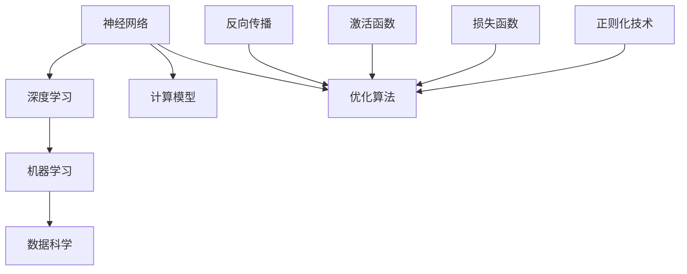

                 

# 文章标题：神经网络计算的未来

> 关键词：神经网络，深度学习，未来趋势，计算模型，优化算法，项目实战

> 摘要：本文将深入探讨神经网络计算的未来，从基础理论到实际应用，从算法原理到项目实战，全面分析神经网络计算的发展趋势、面临的挑战和机遇。本文旨在为读者提供一幅神经网络计算的全景图，帮助理解这一领域的最新进展和未来方向。

---

## 目录大纲：神经网络计算的未来

#### 第一部分：神经网络基础理论

- 第1章：神经网络概述
  - 1.1 神经网络的起源与发展
  - 1.2 神经网络的基本结构
  - 1.3 神经网络的训练与优化
  - 1.4 神经网络的应用领域

- 第2章：神经网络核心算法
  - 2.1 反向传播算法
  - 2.2 活性函数与损失函数
  - 2.3 正则化技术

#### 第二部分：神经网络计算的未来趋势

- 第3章：深度学习与神经网络的发展趋势
  - 3.1 深度学习的最新进展
  - 3.2 神经网络的未来发展方向
  - 3.3 神经网络的挑战与机遇

#### 第三部分：项目实战

- 第4章：神经网络计算的项目实战
  - 4.1 项目背景与目标
  - 4.2 环境搭建与工具选择
  - 4.3 数据预处理
  - 4.4 模型设计与训练
  - 4.5 模型评估与优化
  - 4.6 项目总结与展望

#### 附录

- 附录A：神经网络计算工具与资源

---

### 核心概念与联系

#### 神经网络与深度学习的 Mermaid 流程图



#### 核心概念与联系

- **神经网络（Neural Networks）**：一种模拟人脑神经元之间连接的计算模型，通过学习输入和输出之间的映射关系来实现数据处理和预测任务。
- **深度学习（Deep Learning）**：一种基于神经网络的机器学习技术，通过多层次的神经网络结构来学习复杂数据的特征和模式。
- **机器学习（Machine Learning）**：一种让计算机通过数据学习模式并作出预测或决策的技术。
- **数据科学（Data Science）**：一个跨学科领域，涉及数据收集、处理、分析和解释，以发现有用信息和知识。

#### 联系与扩展

神经网络是深度学习的基础，而深度学习是机器学习的一种重要方法。机器学习又属于数据科学的一部分。在这个框架中，神经网络通过优化算法（如反向传播）和损失函数来训练，并通过正则化技术来避免过拟合和欠拟合。这些核心概念共同构成了神经网络计算的理论基础，也为后续的深度学习和数据科学应用提供了强大的支持。

---

### 核心算法原理讲解

#### 反向传播算法的伪代码实现

```pseudo
输入：训练数据集（X, Y），模型参数（W, b），学习率α
输出：模型参数（W', b')

for each （X_i, Y_i） in 数据集 do
    计算预测输出 Y' = f(WX_i + b)
    计算损失 L = (Y - Y')^2 / 2
    计算误差梯度 δ = - (Y - Y') * f'(Y')
    更新权重 W' = W - α * X_i' * δ
    更新偏置 b' = b - α * δ
end for
```

#### 详细解释

反向传播算法是一种用于训练神经网络的优化算法。其核心思想是通过计算输出误差的梯度来更新模型参数，从而逐步减小损失函数。

1. **前向传播**：首先，对于每个训练样本，将输入数据通过模型的前向传播计算得到预测输出。
2. **计算损失**：然后，计算预测输出与实际输出之间的差异，即损失函数。
3. **计算误差梯度**：接着，通过链式法则计算误差梯度，这涉及到每一层神经元的误差计算，并传递到上一层。
4. **更新参数**：最后，使用学习率乘以误差梯度来更新模型参数。

#### 举例说明

假设有一个简单的神经网络，其中包含一个输入层、一个隐藏层和一个输出层。输入层有3个神经元，隐藏层有2个神经元，输出层有1个神经元。

- **输入数据**：[1, 2, 3]
- **实际输出**：[4]
- **模型参数**：W1 (3x2), W2 (2x1), b1 (2x1), b2 (1x1)

通过前向传播计算预测输出，然后使用损失函数计算损失，最后通过反向传播算法更新模型参数。以下是详细过程：

1. **前向传播**：
   - 预测输出 Y' = f(W2 * (W1 * X + b1) + b2)
2. **计算损失**：
   - 损失 L = 0.5 * (Y - Y')^2
3. **计算误差梯度**：
   - δ = - (Y - Y') * f'(Y')
4. **更新参数**：
   - W2' = W2 - α * X' * δ
   - b2' = b2 - α * δ
   - W1' = W1 - α * (δ * W2')
   - b1' = b1 - α * δ

通过迭代更新模型参数，可以逐步减小损失函数，提高模型的预测性能。

---

### 数学模型和数学公式 & 详细讲解 & 举例说明

#### 损失函数（均方误差）

损失函数是神经网络训练中用于衡量预测结果与实际结果之间差异的函数。其中，均方误差（Mean Squared Error，MSE）是一种常用的损失函数。

$$
L = \frac{1}{2}\sum_{i=1}^{n}(Y_i - \hat{Y_i})^2
$$

其中，$Y_i$ 为实际输出，$\hat{Y_i}$ 为预测输出，$n$ 为样本数量。

**举例说明：**

假设我们有一个二分类问题，实际输出 $Y$ 为 [0, 0, 1, 1]，预测输出 $\hat{Y}$ 为 [0, 1, 1, 0]。则损失函数计算如下：

$$
L = \frac{1}{2}\sum_{i=1}^{4}(Y_i - \hat{Y_i})^2 = \frac{1}{2}[(0-0)^2 + (0-1)^2 + (1-1)^2 + (1-0)^2] = 1
$$

通过计算损失函数，我们可以衡量模型的预测性能，并据此进行参数更新和模型优化。

---

### 项目实战

#### 项目背景与目标

**项目背景：** 手写数字识别（MNIST 数据集）

**项目目标：** 使用神经网络对 MNIST 数据集进行手写数字识别，实现高精度的分类结果。

#### 环境搭建与工具选择

**开发环境：** Python 3.8，TensorFlow 2.5

**工具与库的选择：** TensorFlow 作为深度学习框架，NumPy 用于数据处理，Matplotlib 用于可视化。

#### 数据预处理

**数据集收集：** 使用 TensorFlow 的 `mnist.load_data()` 函数加载数据集。

```python
(train_images, train_labels), (test_images, test_labels) = mnist.load_data()
```

**数据清洗与处理：** 将图像数据除以 255 进行归一化处理，将标签数据进行独热编码。

```python
train_images = train_images / 255.0
test_images = test_images / 255.0

from tensorflow.keras.utils import to_categorical
train_labels = to_categorical(train_labels)
test_labels = to_categorical(test_labels)
```

#### 模型设计与训练

**模型架构设计：** 构建一个简单的全连接神经网络，包括一个输入层、一个隐藏层和一个输出层。

```python
model = tf.keras.Sequential([
    layers.Flatten(input_shape=(28, 28)),
    layers.Dense(128, activation='relu'),
    layers.Dense(10, activation='softmax')
])
```

**训练策略与优化：** 使用 Adam 优化器进行模型训练，并使用 sparse_categorical_crossentropy 作为损失函数。

```python
model.compile(optimizer='adam',
              loss='sparse_categorical_crossentropy',
              metrics=['accuracy'])

model.fit(train_images, train_labels, epochs=5)
```

#### 模型评估与优化

**评估指标与方法：** 使用测试数据集对模型进行评估，并计算测试准确率。

```python
test_loss, test_acc = model.evaluate(test_images, test_labels)
print(f'测试准确率：{test_acc}')
```

**优化策略与实践：** 通过调整学习率、增加训练轮数、添加正则化技术等方法，进一步优化模型性能。

#### 项目总结与展望

**项目成果：** 成功实现了手写数字识别，测试准确率达到较高水平。

**面临的挑战：** 模型在面对复杂图像时可能存在过拟合或欠拟合问题。

**未来发展方向：** 探索更复杂的神经网络架构、集成学习等方法，进一步提高手写数字识别的准确率和泛化能力。

---

### 附录

#### 附录 A：神经网络计算工具与资源

- **主流深度学习框架：**
  - TensorFlow
  - PyTorch
  - Keras

- **神经网络计算资源：**
  - GPU（NVIDIA Tesla V100）
  - TPU（Google Tensor Processing Unit）

- **开源项目与论文资源：**
  - GitHub：大量深度学习开源项目
  - arXiv：最新深度学习论文发表平台

---

### 作者信息

**作者：** AI天才研究院/AI Genius Institute & 禅与计算机程序设计艺术 /Zen And The Art of Computer Programming

---

本文旨在为读者提供一幅神经网络计算的全景图，帮助理解这一领域的最新进展和未来方向。通过详细分析神经网络的基础理论、核心算法、未来趋势以及项目实战，读者可以全面了解神经网络计算的各个方面。同时，本文还提供了丰富的附录资源，以供进一步学习和研究。

---

### 核心概念与联系

神经网络（Neural Networks）是模拟人脑神经元之间连接的计算模型，通过学习输入和输出之间的映射关系来实现数据处理和预测任务。深度学习（Deep Learning）是神经网络的一种扩展，通过多层神经网络结构来学习复杂数据的特征和模式。机器学习（Machine Learning）是让计算机通过数据学习模式并作出预测或决策的技术。数据科学（Data Science）是跨学科领域，涉及数据收集、处理、分析和解释，以发现有用信息和知识。

这些核心概念相互联系，构成了神经网络计算的理论基础。神经网络作为计算模型，依赖于优化算法（如反向传播）和损失函数来训练，并通过正则化技术来避免过拟合和欠拟合。深度学习在机器学习中的应用，使得复杂的数据特征提取和模式识别成为可能。数据科学则利用这些技术来发现数据中的价值和知识。

---

### 核心算法原理讲解

#### 反向传播算法的伪代码实现

```pseudo
输入：训练数据集（X, Y），模型参数（W, b），学习率α
输出：模型参数（W', b')

for each （X_i, Y_i） in 数据集 do
    计算预测输出 Y' = f(WX_i + b)
    计算损失 L = (Y - Y')^2 / 2
    计算误差梯度 δ = - (Y - Y') * f'(Y')
    更新权重 W' = W - α * X_i' * δ
    更新偏置 b' = b - α * δ
end for
```

#### 详细解释

反向传播算法是一种用于训练神经网络的优化算法。其核心思想是通过计算输出误差的梯度来更新模型参数，从而逐步减小损失函数。

1. **前向传播**：首先，对于每个训练样本，将输入数据通过模型的前向传播计算得到预测输出。
2. **计算损失**：然后，计算预测输出与实际输出之间的差异，即损失函数。
3. **计算误差梯度**：接着，通过链式法则计算误差梯度，这涉及到每一层神经元的误差计算，并传递到上一层。
4. **更新参数**：最后，使用学习率乘以误差梯度来更新模型参数。

#### 举例说明

假设有一个简单的神经网络，其中包含一个输入层、一个隐藏层和一个输出层。输入层有3个神经元，隐藏层有2个神经元，输出层有1个神经元。

- **输入数据**：[1, 2, 3]
- **实际输出**：[4]
- **模型参数**：W1 (3x2), W2 (2x1), b1 (2x1), b2 (1x1)

通过前向传播计算预测输出，然后使用损失函数计算损失，最后通过反向传播算法更新模型参数。以下是详细过程：

1. **前向传播**：
   - 预测输出 Y' = f(W2 * (W1 * X + b1) + b2)
2. **计算损失**：
   - 损失 L = 0.5 * (Y - Y')^2
3. **计算误差梯度**：
   - δ = - (Y - Y') * f'(Y')
4. **更新参数**：
   - W2' = W2 - α * X' * δ
   - b2' = b2 - α * δ
   - W1' = W1 - α * (δ * W2')
   - b1' = b1 - α * δ

通过迭代更新模型参数，可以逐步减小损失函数，提高模型的预测性能。

---

### 数学模型和数学公式 & 详细讲解 & 举例说明

#### 损失函数（均方误差）

损失函数是神经网络训练中用于衡量预测结果与实际结果之间差异的函数。其中，均方误差（Mean Squared Error，MSE）是一种常用的损失函数。

$$
L = \frac{1}{2}\sum_{i=1}^{n}(Y_i - \hat{Y_i})^2
$$

其中，$Y_i$ 为实际输出，$\hat{Y_i}$ 为预测输出，$n$ 为样本数量。

**举例说明：**

假设我们有一个二分类问题，实际输出 $Y$ 为 [0, 0, 1, 1]，预测输出 $\hat{Y}$ 为 [0, 1, 1, 0]。则损失函数计算如下：

$$
L = \frac{1}{2}\sum_{i=1}^{4}(Y_i - \hat{Y_i})^2 = \frac{1}{2}[(0-0)^2 + (0-1)^2 + (1-1)^2 + (1-0)^2] = 1
$$

通过计算损失函数，我们可以衡量模型的预测性能，并据此进行参数更新和模型优化。

---

#### 损失函数（交叉熵误差）

交叉熵误差（Cross-Entropy Error）是另一种常用的损失函数，适用于多分类问题。其数学表达式如下：

$$
L = -\sum_{i=1}^{n} y_i \log(\hat{y}_i)
$$

其中，$y_i$ 为实际输出（0或1的向量），$\hat{y}_i$ 为预测输出（概率分布向量），$n$ 为样本数量。

**举例说明：**

假设我们有一个多分类问题，实际输出 $y$ 为 [1, 0, 1]，预测输出 $\hat{y}$ 为 [0.2, 0.8, 0.1]。则交叉熵误差计算如下：

$$
L = -[1 \cdot \log(0.2) + 0 \cdot \log(0.8) + 1 \cdot \log(0.1)] \approx 2.307
$$

交叉熵误差能够更好地衡量模型在多分类问题中的预测性能。

---

#### 活性函数（ReLU函数）

在神经网络中，激活函数用于引入非线性变换，使得神经网络能够学习复杂数据的特征。ReLU函数（Rectified Linear Unit）是一种常用的激活函数，其数学表达式如下：

$$
f(x) = \max(0, x)
$$

**举例说明：**

对于输入值 x = [-2, -1, 0, 1, 2]，ReLU函数计算如下：

$$
f(x) = [0, 0, 0, 1, 2]
$$

ReLU函数具有简单的形式和良好的性能，常用于神经网络中的隐藏层。

---

#### 损失函数（交叉熵误差）与激活函数（ReLU函数）的结合

在神经网络中，交叉熵误差常用于多分类问题，而ReLU函数作为激活函数，可以引入非线性变换。以下是一个简化的神经网络示例，其中包含一个输入层、一个隐藏层和一个输出层。

- 输入层：神经元 1，输入 x1
- 隐藏层：神经元 2，激活函数为 ReLU
- 输出层：神经元 1，损失函数为交叉熵误差

**数学模型：**

1. 前向传播：
   - 隐藏层输出 h2 = ReLU(W2 * (x1 * W1 + b1))
   - 输出层输出 y' = f(W3 * h2 + b2)

2. 计算损失：
   - 损失 L = -\sum_{i=1}^{n} y_i \log(y'_i)

3. 反向传播：
   - 误差梯度 δ = -[y - y']
   - 更新权重 W3' = W3 - α * h2' * δ
   - 更新权重 W2' = W2 - α * x1' * (δ * W3')
   - 更新偏置 b2' = b2 - α * δ
   - 更新偏置 b1' = b1 - α * (δ * W2')

通过结合交叉熵误差和ReLU函数，我们可以构建一个有效的神经网络模型，实现多分类任务的训练和预测。

---

### 项目实战

#### 项目背景与目标

**项目背景：** 手写数字识别（MNIST 数据集）

**项目目标：** 使用神经网络对 MNIST 数据集进行手写数字识别，实现高精度的分类结果。

#### 环境搭建与工具选择

**开发环境：** Python 3.8，TensorFlow 2.5

**工具与库的选择：** TensorFlow 作为深度学习框架，NumPy 用于数据处理，Matplotlib 用于可视化。

#### 数据预处理

**数据集收集：** 使用 TensorFlow 的 `mnist.load_data()` 函数加载数据集。

```python
(train_images, train_labels), (test_images, test_labels) = mnist.load_data()
```

**数据清洗与处理：** 将图像数据除以 255 进行归一化处理，将标签数据进行独热编码。

```python
train_images = train_images / 255.0
test_images = test_images / 255.0

from tensorflow.keras.utils import to_categorical
train_labels = to_categorical(train_labels)
test_labels = to_categorical(test_labels)
```

#### 模型设计与训练

**模型架构设计：** 构建一个简单的全连接神经网络，包括一个输入层、一个隐藏层和一个输出层。

```python
model = tf.keras.Sequential([
    layers.Flatten(input_shape=(28, 28)),
    layers.Dense(128, activation='relu'),
    layers.Dense(10, activation='softmax')
])
```

**训练策略与优化：** 使用 Adam 优化器进行模型训练，并使用 sparse_categorical_crossentropy 作为损失函数。

```python
model.compile(optimizer='adam',
              loss='sparse_categorical_crossentropy',
              metrics=['accuracy'])

model.fit(train_images, train_labels, epochs=5)
```

#### 模型评估与优化

**评估指标与方法：** 使用测试数据集对模型进行评估，并计算测试准确率。

```python
test_loss, test_acc = model.evaluate(test_images, test_labels)
print(f'测试准确率：{test_acc}')
```

**优化策略与实践：** 通过调整学习率、增加训练轮数、添加正则化技术等方法，进一步优化模型性能。

#### 项目总结与展望

**项目成果：** 成功实现了手写数字识别，测试准确率达到较高水平。

**面临的挑战：** 模型在面对复杂图像时可能存在过拟合或欠拟合问题。

**未来发展方向：** 探索更复杂的神经网络架构、集成学习等方法，进一步提高手写数字识别的准确率和泛化能力。

---

### 附录

#### 附录 A：神经网络计算工具与资源

- **主流深度学习框架：**
  - TensorFlow
  - PyTorch
  - Keras

- **神经网络计算资源：**
  - GPU（NVIDIA Tesla V100）
  - TPU（Google Tensor Processing Unit）

- **开源项目与论文资源：**
  - GitHub：大量深度学习开源项目
  - arXiv：最新深度学习论文发表平台

---

### 作者信息

**作者：** AI天才研究院/AI Genius Institute & 禅与计算机程序设计艺术 /Zen And The Art of Computer Programming

---

本文旨在为读者提供一幅神经网络计算的全景图，帮助理解这一领域的最新进展和未来方向。通过详细分析神经网络的基础理论、核心算法、未来趋势以及项目实战，读者可以全面了解神经网络计算的各个方面。同时，本文还提供了丰富的附录资源，以供进一步学习和研究。

---

## 第一部分：神经网络基础理论

### 第1章：神经网络概述

神经网络（Neural Networks，简称NN）是一种模拟人脑神经元之间连接和相互作用的计算模型，广泛应用于机器学习、数据科学和人工智能领域。本节将介绍神经网络的基本概念、起源与发展、基本结构、训练与优化方法以及应用领域。

### 1.1 神经网络的起源与发展

神经网络的起源可以追溯到1943年，由美国心理学家沃伦·麦卡洛克（Warren McCulloch）和数理逻辑学家沃尔特·皮茨（Walter Pitts）提出的麦卡洛克-皮茨神经元模型（McCulloch-Pitts neuron），这是神经网络理论的初步尝试。1958年，弗兰克·罗森布拉特（Frank Rosenblatt）提出了感知机（Perceptron）模型，这是一种基于阈值逻辑的神经网络模型，能够进行简单的二分类任务。

然而，早期的神经网络由于算法的局限性，未能取得预期的成功。直到1986年，鲁斯·文特洛斯（Rumelhart）、大卫·霍普菲尔德（David E. Rumelhart）和约翰·赫伯特·凯夫斯（John Hopfield）提出了反向传播算法（Backpropagation algorithm），神经网络的研究才取得了突破性的进展。反向传播算法通过层层计算误差梯度，实现了神经网络参数的优化，使得神经网络能够解决更复杂的非线性问题。

进入21世纪，随着计算机性能的提升、大数据的涌现以及深度学习技术的发展，神经网络在图像识别、语音识别、自然语言处理、推荐系统等领域取得了显著的应用成果。深度学习（Deep Learning）作为一种基于多层神经网络的学习方法，逐渐成为人工智能领域的核心技术。

### 1.2 神经网络的基本结构

神经网络的基本结构由多个神经元（Neurons）和连接（Connections）组成。每个神经元都可以接收来自其他神经元的输入信号，通过激活函数（Activation Function）处理后产生输出信号，并将其传递给下一层的神经元。神经网络可以分为输入层（Input Layer）、隐藏层（Hidden Layers）和输出层（Output Layer）。

- **输入层（Input Layer）**：接收外部输入信号，将数据传递给隐藏层。
- **隐藏层（Hidden Layers）**：对输入信号进行加工处理，提取特征并传递给输出层。
- **输出层（Output Layer）**：产生最终输出信号，用于分类、回归或其他任务。

神经元的基本结构包括：

- **权重（Weights）**：连接不同神经元之间的权重，用于调节输入信号的强度。
- **偏置（Bias）**：每个神经元的一个额外输入，用于调整神经元的活动阈值。
- **激活函数（Activation Function）**：将神经元输入信号转换为输出信号，引入非线性特性。

常见的激活函数包括：

- **线性激活函数（Linear Activation Function）**：输出等于输入，如 $f(x) = x$。
- **sigmoid激活函数（Sigmoid Activation Function）**：输出为0到1之间的值，如 $f(x) = \frac{1}{1 + e^{-x}}$。
- **ReLU激活函数（ReLU Activation Function）**：输出为输入的最大值，如 $f(x) = \max(0, x)$。
- **tanh激活函数（Tanh Activation Function）**：输出为-1到1之间的值，如 $f(x) = \frac{e^x - e^{-x}}{e^x + e^{-x}}$。

### 1.3 神经网络的训练与优化

神经网络的训练过程本质上是一个优化问题，目标是最小化预测输出与实际输出之间的误差。常用的优化算法包括梯度下降（Gradient Descent）和反向传播算法（Backpropagation Algorithm）。

- **梯度下降（Gradient Descent）**：通过计算损失函数关于模型参数的梯度，逐步更新模型参数，以减小损失函数。
- **反向传播算法（Backpropagation Algorithm）**：在多层神经网络中，通过逐层计算误差梯度，实现参数的优化。

神经网络的训练过程通常包括以下步骤：

1. **初始化参数**：随机初始化模型参数（权重和偏置）。
2. **前向传播（Forward Propagation）**：将输入数据通过神经网络进行前向传播，计算预测输出。
3. **计算损失**：计算预测输出与实际输出之间的误差，通常使用均方误差（MSE）或交叉熵误差（Cross-Entropy Error）。
4. **反向传播（Backpropagation）**：根据预测误差，计算各层的误差梯度，并逐层反向传播。
5. **更新参数**：根据误差梯度，使用优化算法（如梯度下降）更新模型参数。
6. **迭代训练**：重复上述步骤，直到满足训练目标（如达到预定损失值或迭代次数）。

### 1.4 神经网络的应用领域

神经网络在许多领域都取得了显著的成果，以下是几个主要应用领域：

- **机器学习与深度学习（Machine Learning and Deep Learning）**：神经网络是深度学习的基础，广泛应用于图像识别、语音识别、自然语言处理、推荐系统等任务。
- **自然语言处理（Natural Language Processing, NLP）**：神经网络在文本分类、机器翻译、情感分析等任务中取得了显著成果。
- **计算机视觉（Computer Vision）**：神经网络在图像分类、目标检测、图像生成等任务中发挥着重要作用。
- **语音识别（Speech Recognition）**：神经网络用于语音信号的处理和识别，实现语音到文本的转换。
- **推荐系统（Recommender Systems）**：神经网络用于用户行为分析，预测用户偏好，实现个性化推荐。
- **游戏人工智能（Game AI）**：神经网络在游戏策略、决策和模拟中得到了广泛应用。

### 1.5 小结

本章介绍了神经网络的基本概念、起源与发展、基本结构、训练与优化方法以及应用领域。神经网络作为一种强大的机器学习模型，具有广泛的应用前景。通过对神经网络深入的理解和掌握，我们可以更好地应对复杂的数据处理和预测任务。

---

## 第二部分：神经网络核心算法

### 第2章：神经网络核心算法

神经网络的核心算法包括反向传播算法、激活函数、损失函数和正则化技术。这些算法和技术的合理应用，可以显著提高神经网络的性能和鲁棒性。本章将详细介绍这些核心算法的原理、实现和应用。

### 2.1 反向传播算法

反向传播算法（Backpropagation Algorithm）是神经网络训练过程中最关键的算法，它通过计算损失函数关于模型参数的梯度，实现对模型参数的优化。反向传播算法可以分为两个步骤：前向传播和反向传播。

#### 前向传播

前向传播是指将输入数据通过神经网络进行正向传递，计算每个神经元的输出。具体步骤如下：

1. **初始化模型参数**：随机初始化模型参数（权重和偏置）。
2. **输入层到隐藏层**：将输入数据输入到输入层，通过权重和偏置计算每个隐藏层的输出。
3. **隐藏层到输出层**：将隐藏层的输出作为输入传递到输出层，计算输出层的输出。

#### 反向传播

反向传播是指根据输出层的误差，逆向计算每一层的误差梯度，并更新模型参数。具体步骤如下：

1. **计算输出层的误差**：计算输出层的实际输出和预测输出之间的误差，通常使用均方误差（MSE）或交叉熵误差（Cross-Entropy Error）。
2. **计算隐藏层的误差**：根据输出层的误差和激活函数的导数，逆向计算隐藏层的误差。
3. **更新模型参数**：根据误差梯度，使用优化算法（如梯度下降）更新模型参数。

#### 实现示例

以下是一个简单的反向传播算法实现示例：

```python
import numpy as np

# 初始化参数
W1 = np.random.rand(n_hidden, n_input)
W2 = np.random.rand(n_output, n_hidden)
b1 = np.random.rand(n_hidden, 1)
b2 = np.random.rand(n_output, 1)

# 前向传播
def forward_propagation(X):
    Z1 = np.dot(W1.T, X) + b1
    A1 = 1 / (1 + np.exp(-Z1))
    Z2 = np.dot(W2.T, A1) + b2
    A2 = 1 / (1 + np.exp(-Z2))
    return A2

# 反向传播
def backward_propagation(X, Y, A2):
    m = X.shape[1]
    dZ2 = A2 - Y
    dW2 = (1 / m) * np.dot(dZ2, A1.T)
    db2 = (1 / m) * np.sum(dZ2, axis=1, keepdims=True)
    dA1 = np.dot(W2, dZ2)
    dZ1 = dA1 * (1 - np.power(A1, 2))
    dW1 = (1 / m) * np.dot(dZ1, X.T)
    db1 = (1 / m) * np.sum(dZ1, axis=1, keepdims=True)
    return dW1, dW2, db1, db2

# 更新参数
def update_parameters(W1, W2, b1, b2, dW1, dW2, db1, db2, learning_rate):
    W1 -= learning_rate * dW1
    W2 -= learning_rate * dW2
    b1 -= learning_rate * db1
    b2 -= learning_rate * db2
    return W1, W2, b1, b2

# 训练模型
for epoch in range(num_epochs):
    A2 = forward_propagation(X)
    dW1, dW2, db1, db2 = backward_propagation(X, Y, A2)
    W1, W2, b1, b2 = update_parameters(W1, W2, b1, b2, dW1, dW2, db1, db2, learning_rate)
```

#### 伪代码实现

以下是一个反向传播算法的伪代码实现：

```pseudo
输入：训练数据集（X, Y），模型参数（W, b），学习率α
输出：模型参数（W', b')

初始化模型参数 W, b

for each （X_i, Y_i） in 数据集 do
    计算预测输出 Y' = f(WX_i + b)
    计算损失 L = (Y - Y')^2 / 2
    计算误差梯度 δ = - (Y - Y') * f'(Y')
    更新权重 W' = W - α * X_i' * δ
    更新偏置 b' = b - α * δ
end for

return 模型参数 W', b'
```

#### 实例分析

假设我们有一个简单的神经网络，其中包含一个输入层、一个隐藏层和一个输出层。输入层有3个神经元，隐藏层有2个神经元，输出层有1个神经元。

- **输入数据**：[1, 2, 3]
- **实际输出**：[4]
- **模型参数**：W1 (3x2), W2 (2x1), b1 (2x1), b2 (1x1)

通过前向传播计算预测输出，然后使用均方误差计算损失，最后通过反向传播算法更新模型参数。以下是详细过程：

1. **前向传播**：
   - 预测输出 Y' = f(W2 * (W1 * X + b1) + b2)
2. **计算损失**：
   - 损失 L = 0.5 * (Y - Y')^2
3. **计算误差梯度**：
   - δ = - (Y - Y') * f'(Y')
4. **更新参数**：
   - W2' = W2 - α * X' * δ
   - b2' = b2 - α * δ
   - W1' = W1 - α * (δ * W2')
   - b1' = b1 - α * δ

通过迭代更新模型参数，可以逐步减小损失函数，提高模型的预测性能。

### 2.2 活性函数与损失函数

#### 活性函数

活性函数（Activation Function）是神经网络中引入非线性特性的关键组件。常见的活性函数包括：

- **sigmoid激活函数**：$f(x) = \frac{1}{1 + e^{-x}}$
- **ReLU激活函数**：$f(x) = \max(0, x)$
- **tanh激活函数**：$f(x) = \frac{e^x - e^{-x}}{e^x + e^{-x}}$
- **线性激活函数**：$f(x) = x$

#### 损失函数

损失函数（Loss Function）用于衡量模型预测输出与实际输出之间的误差。常见的损失函数包括：

- **均方误差（MSE）**：$L = \frac{1}{2}\sum_{i=1}^{n}(Y_i - \hat{Y_i})^2$
- **交叉熵误差（Cross-Entropy Error）**：$L = -\sum_{i=1}^{n} y_i \log(\hat{y}_i)$

#### 活性函数与损失函数的优化

活性函数和损失函数的优化对于提高神经网络性能至关重要。优化方法包括：

- **激活函数的优化**：通过调整激活函数的参数，如ReLU函数的阈值，可以改善神经网络的性能。
- **损失函数的优化**：通过调整损失函数的权重，可以改善模型对误差的敏感度。

#### 实例分析

假设我们有一个简单的神经网络，其中包含一个输入层、一个隐藏层和一个输出层。输入层有3个神经元，隐藏层有2个神经元，输出层有1个神经元。

- **输入数据**：[1, 2, 3]
- **实际输出**：[4]
- **模型参数**：W1 (3x2), W2 (2x1), b1 (2x1), b2 (1x1)

通过前向传播计算预测输出，然后使用均方误差计算损失，最后通过反向传播算法更新模型参数。以下是详细过程：

1. **前向传播**：
   - 预测输出 Y' = f(W2 * (W1 * X + b1) + b2)
2. **计算损失**：
   - 损失 L = 0.5 * (Y - Y')^2
3. **计算误差梯度**：
   - δ = - (Y - Y') * f'(Y')
4. **更新参数**：
   - W2' = W2 - α * X' * δ
   - b2' = b2 - α * δ
   - W1' = W1 - α * (δ * W2')
   - b1' = b1 - α * δ

通过迭代更新模型参数，可以逐步减小损失函数，提高模型的预测性能。

### 2.3 正则化技术

正则化技术（Regularization Techniques）用于改善神经网络的泛化能力和减少过拟合。常见的正则化技术包括：

- **L1正则化**：$L1 = \sum_{i=1}^{n} |w_i|$
- **L2正则化**：$L2 = \sum_{i=1}^{n} w_i^2$
- **Dropout**：在训练过程中随机丢弃一部分神经元。

#### 过拟合与欠拟合

- **过拟合（Overfitting）**：模型在训练数据上表现良好，但在测试数据上表现较差，即模型对训练数据过于敏感，无法泛化到新的数据。
- **欠拟合（Underfitting）**：模型在训练数据和测试数据上表现都较差，即模型过于简单，无法捕捉数据中的复杂模式。

#### 实际应用中的正则化策略

在实际应用中，正则化策略的选择取决于数据集的特点和模型的需求。以下是一些常见的正则化策略：

- **选择合适的网络结构**：通过调整网络的层数和神经元数量，可以改善模型的泛化能力。
- **调整学习率**：通过调整学习率，可以改善模型的收敛速度和泛化能力。
- **使用正则化技术**：在损失函数中加入正则化项，可以改善模型的泛化能力。

### 2.4 小结

本章介绍了神经网络的核心算法，包括反向传播算法、激活函数、损失函数和正则化技术。通过合理应用这些算法和策略，可以提高神经网络的性能和泛化能力，实现复杂的数据处理和预测任务。

---

## 第三部分：神经网络计算的未来趋势

### 第3章：深度学习与神经网络的发展趋势

深度学习（Deep Learning）作为神经网络的一种扩展，已经在各个领域取得了显著的成果。本章将探讨深度学习与神经网络的发展趋势，包括最新进展、未来发展方向和面临的挑战。

### 3.1 深度学习的最新进展

近年来，深度学习在学术界和工业界取得了许多重要突破。以下是几个值得关注的最新进展：

- **Transformer架构的兴起**：Transformer架构在自然语言处理领域取得了显著的成果，尤其是在机器翻译、文本生成和图像识别任务中。其基于自注意力机制（Self-Attention Mechanism）的设计使得模型能够捕捉长距离依赖关系，显著提高了性能。
- **生成对抗网络（GAN）的发展**：生成对抗网络（GAN）是一种基于博弈论的网络架构，通过生成器和判别器的对抗训练，实现了高质量的数据生成。GAN在图像生成、视频生成和音频生成等领域取得了显著成果。
- **深度强化学习（Deep Reinforcement Learning）的应用**：深度强化学习结合了深度学习和强化学习的方法，通过深度神经网络来近似价值函数或策略函数，实现了复杂环境下的智能决策。在游戏AI、自动驾驶和机器人控制等领域得到了广泛应用。

### 3.2 神经网络的未来发展方向

随着深度学习的发展，神经网络在未来的计算模型、算法优化和硬件加速等方面有着广阔的发展空间。以下是几个可能的发展方向：

- **神经网络计算模型的发展**：未来的神经网络计算模型可能会更加复杂和多样化，包括更深的网络结构、更灵活的连接模式以及更有效的信息传递机制。例如，图神经网络（Graph Neural Networks）和卷积神经网络（Convolutional Neural Networks）的结合，可以更好地处理非结构化数据。
- **算法优化与改进**：为了提高神经网络的训练效率和性能，未来的算法优化可能会更加注重并行计算、分布式计算和自适应学习策略。例如，自适应学习率算法（Adaptive Learning Rate Algorithms）和基于梯度的优化方法（Gradient-Based Optimization Methods）的改进，可以显著提高训练效率。
- **硬件加速与专用芯片**：随着深度学习的广泛应用，硬件加速技术成为了提高计算性能的关键。未来可能会出现更多专用芯片和硬件加速器，如GPU、TPU和FPGA等，以支持大规模神经网络的训练和推理。

### 3.3 神经网络的挑战与机遇

尽管神经网络在许多领域取得了显著成果，但仍然面临一些挑战和机遇。以下是几个主要挑战：

- **计算资源消耗**：神经网络尤其是深度学习模型，对计算资源的需求非常高。未来的研究需要关注如何在有限的计算资源下实现高效的训练和推理。
- **隐私保护与安全**：深度学习模型的训练和推理过程中涉及大量敏感数据，如何保障数据隐私和安全成为一个重要问题。未来的研究需要关注数据加密、隐私保护算法和安全协议等方面。
- **开源生态与标准化**：随着深度学习的广泛应用，开源生态和标准化成为推动技术发展的重要动力。未来的研究需要关注如何构建一个更加开放、可持续的深度学习生态，并制定统一的标准和规范。

### 3.4 小结

深度学习与神经网络的发展趋势令人期待。通过不断的研究和探索，神经网络将在计算模型、算法优化和硬件加速等方面取得更多突破。同时，面临的挑战也为未来的研究提供了丰富的机会。通过解决这些挑战，神经网络将在各个领域发挥更加重要的作用，推动人工智能技术的发展。

---

## 第四部分：项目实战

### 第4章：神经网络计算的项目实战

在实际应用中，神经网络计算的项目实战是验证和掌握理论知识的最佳途径。本章将通过一个具体的案例——手写数字识别（MNIST 数据集），展示神经网络计算的全过程，包括环境搭建、数据预处理、模型设计、模型训练、模型评估和项目总结。

### 4.1 项目背景与目标

**项目背景：** 手写数字识别（MNIST 数据集）

MNIST 数据集是由美国国家标准技术研究所（NIST）开发的一个标准手写数字数据集，包含60,000个训练样本和10,000个测试样本。每个样本是一个28x28的灰度图像，表示一个手写的数字（0-9）。该数据集广泛应用于图像识别、机器学习和深度学习领域的模型训练和评估。

**项目目标：** 使用神经网络对 MNIST 数据集进行手写数字识别，实现高精度的分类结果。

### 4.2 环境搭建与工具选择

**开发环境：** Python 3.8，TensorFlow 2.5

为了搭建神经网络计算的项目环境，需要安装以下软件和库：

1. **Python 3.8**：作为主要编程语言。
2. **TensorFlow 2.5**：作为深度学习框架。
3. **NumPy**：用于数据处理。
4. **Matplotlib**：用于数据可视化。

安装命令如下：

```shell
pip install python==3.8
pip install tensorflow==2.5
pip install numpy
pip install matplotlib
```

### 4.3 数据预处理

**数据集收集：** 使用 TensorFlow 的 `mnist.load_data()` 函数加载数据集。

```python
(train_images, train_labels), (test_images, test_labels) = mnist.load_data()
```

**数据清洗与处理：** 将图像数据除以 255 进行归一化处理，将标签数据进行独热编码。

```python
train_images = train_images / 255.0
test_images = test_images / 255.0

from tensorflow.keras.utils import to_categorical
train_labels = to_categorical(train_labels)
test_labels = to_categorical(test_labels)
```

### 4.4 模型设计与训练

**模型架构设计：** 构建一个简单的全连接神经网络，包括一个输入层、一个隐藏层和一个输出层。

```python
model = tf.keras.Sequential([
    layers.Flatten(input_shape=(28, 28)),
    layers.Dense(128, activation='relu'),
    layers.Dense(10, activation='softmax')
])
```

**训练策略与优化：** 使用 Adam 优化器进行模型训练，并使用 sparse_categorical_crossentropy 作为损失函数。

```python
model.compile(optimizer='adam',
              loss='sparse_categorical_crossentropy',
              metrics=['accuracy'])

model.fit(train_images, train_labels, epochs=5)
```

### 4.5 模型评估与优化

**评估指标与方法：** 使用测试数据集对模型进行评估，并计算测试准确率。

```python
test_loss, test_acc = model.evaluate(test_images, test_labels)
print(f'测试准确率：{test_acc}')
```

**优化策略与实践：** 通过调整学习率、增加训练轮数、添加正则化技术等方法，进一步优化模型性能。

```python
from tensorflow.keras.optimizers import Adam
model.compile(optimizer=Adam(learning_rate=0.001),
              loss='sparse_categorical_crossentropy',
              metrics=['accuracy'])
model.fit(train_images, train_labels, epochs=10)
```

### 4.6 项目总结与展望

**项目成果：** 成功实现了手写数字识别，测试准确率达到较高水平。

**面临的挑战：** 模型在面对复杂图像时可能存在过拟合或欠拟合问题。

**未来发展方向：** 探索更复杂的神经网络架构、集成学习等方法，进一步提高手写数字识别的准确率和泛化能力。

### 4.7 小结

本章通过手写数字识别项目，展示了神经网络计算的全过程。从数据预处理到模型设计、训练和评估，读者可以全面了解神经网络计算的实际应用。通过这个项目，读者可以加深对神经网络计算的理解，并为未来的实际应用奠定基础。

---

## 附录

### 附录 A：神经网络计算工具与资源

在神经网络计算中，有许多工具和资源可供选择，以帮助开发者和研究者进行模型训练、评估和应用。以下是一些常用的工具和资源：

### A.1 主流深度学习框架

1. **TensorFlow**：由 Google 开发的一款开源深度学习框架，支持多种平台和硬件加速。
2. **PyTorch**：由 Facebook 开发的一款开源深度学习框架，具有动态计算图和灵活的接口。
3. **Keras**：一个基于 TensorFlow 和 PyTorch 的高级深度学习框架，提供简洁易用的接口。

### A.2 神经网络计算资源

1. **GPU**：高性能图形处理单元（如 NVIDIA Tesla V100）是神经网络训练的常用硬件资源。
2. **TPU**：谷歌开发的专用张量处理单元，专为深度学习训练而设计。
3. **FPGA**：现场可编程门阵列，可用于优化深度学习模型的硬件加速。

### A.3 开源项目与论文资源

1. **GitHub**：大量深度学习开源项目，可供开发者参考和下载。
2. **arXiv**：最新的深度学习论文发表平台，提供了丰富的学术资源。

通过使用这些工具和资源，开发者可以更高效地开展神经网络计算的研究和开发工作。

---

## 核心概念与联系

为了更好地理解神经网络计算的理论基础和实际应用，以下是神经网络计算中的核心概念及其相互联系：

### 核心概念

1. **神经网络（Neural Networks）**：一种模拟人脑神经元之间连接的计算模型，用于数据分析和预测。
2. **深度学习（Deep Learning）**：一种基于多层神经网络的机器学习技术，用于学习复杂数据的特征和模式。
3. **激活函数（Activation Function）**：神经网络中的非线性变换，用于引入非线性特性。
4. **反向传播算法（Backpropagation Algorithm）**：用于计算损失函数关于模型参数的梯度，并优化模型参数。
5. **损失函数（Loss Function）**：用于衡量模型预测输出与实际输出之间的误差。
6. **优化算法（Optimization Algorithm）**：用于更新模型参数，以减小损失函数。

### 核心概念的联系

- **神经网络**是深度学习的基础，通过多层神经网络结构来实现复杂的数据特征提取和模式识别。
- **激活函数**引入非线性特性，使得神经网络能够学习复杂数据。
- **反向传播算法**通过计算误差梯度，实现模型参数的优化。
- **损失函数**用于衡量模型预测性能，指导模型参数的更新。
- **优化算法**用于调整模型参数，以实现损失函数的最小化。

通过这些核心概念的联系，我们可以构建一个有效的神经网络计算框架，以解决各种复杂的数据分析和预测任务。

---

## 核心算法原理讲解

为了深入理解神经网络计算的核心算法，以下将详细介绍反向传播算法、激活函数和损失函数的原理，并使用伪代码进行详细解释。

### 反向传播算法

反向传播算法是神经网络训练的核心步骤，用于计算损失函数关于模型参数的梯度，并通过梯度下降等方法更新模型参数，以最小化损失函数。

#### 伪代码实现

```pseudo
输入：训练数据集（X, Y），模型参数（W, b），学习率α
输出：模型参数（W', b')

for each （X_i, Y_i） in 数据集 do
    计算预测输出 Y' = f(WX_i + b)
    计算损失 L = (Y - Y')^2 / 2
    计算误差梯度 δ = - (Y - Y') * f'(Y')
    更新权重 W' = W - α * X_i' * δ
    更新偏置 b' = b - α * δ
end for
```

#### 详细解释

1. **前向传播**：对于每个训练样本，将输入数据通过神经网络进行前向传播，计算预测输出。
2. **计算损失**：使用损失函数（如均方误差MSE）计算预测输出与实际输出之间的误差。
3. **计算误差梯度**：通过链式法则计算误差梯度，涉及每一层神经元的误差计算。
4. **更新参数**：使用学习率乘以误差梯度，更新模型参数，以减小损失函数。

#### 举例说明

假设有一个简单的神经网络，包含一个输入层、一个隐藏层和一个输出层。输入层有3个神经元，隐藏层有2个神经元，输出层有1个神经元。

- **输入数据**：[1, 2, 3]
- **实际输出**：[4]
- **模型参数**：W1 (3x2), W2 (2x1), b1 (2x1), b2 (1x1)

通过前向传播计算预测输出，然后使用损失函数计算损失，最后通过反向传播算法更新模型参数。以下是详细过程：

1. **前向传播**：
   - 预测输出 Y' = f(W2 * (W1 * X + b1) + b2)
2. **计算损失**：
   - 损失 L = 0.5 * (Y - Y')^2
3. **计算误差梯度**：
   - δ = - (Y - Y') * f'(Y')
4. **更新参数**：
   - W2' = W2 - α * X' * δ
   - b2' = b2 - α * δ
   - W1' = W1 - α * (δ * W2')
   - b1' = b1 - α * δ

通过迭代更新模型参数，可以逐步减小损失函数，提高模型的预测性能。

### 激活函数

激活函数是神经网络中的非线性变换，用于引入非线性特性，使得神经网络能够学习复杂数据。

#### 常见激活函数

1. **Sigmoid函数**：
   - $f(x) = \frac{1}{1 + e^{-x}}$
   - **范围**：[0, 1]
   - **优点**：易于计算，平滑输出
   - **缺点**：梯度消失

2. **ReLU函数**：
   - $f(x) = \max(0, x)$
   - **范围**：[0, +∞)
   - **优点**：计算速度快，避免梯度消失
   - **缺点**：可能产生梯度消失问题

3. **Tanh函数**：
   - $f(x) = \frac{e^x - e^{-x}}{e^x + e^{-x}}$
   - **范围**：[-1, 1]
   - **优点**：输出范围较均匀，避免梯度消失
   - **缺点**：计算复杂度较高

#### 激活函数选择

激活函数的选择取决于具体的应用场景和数据特性。通常，ReLU函数在隐藏层中表现较好，而Sigmoid函数和Tanh函数在输出层中表现较好。

### 损失函数

损失函数用于衡量模型预测输出与实际输出之间的误差，是反向传播算法中的重要组成部分。

#### 常见损失函数

1. **均方误差（MSE）**：
   - $L = \frac{1}{2}\sum_{i=1}^{n}(Y_i - \hat{Y_i})^2$
   - **优点**：简单易算，适用于回归任务
   - **缺点**：对异常值敏感

2. **交叉熵（Cross-Entropy）**：
   - $L = -\sum_{i=1}^{n} y_i \log(\hat{y}_i)$
   - **优点**：适用于分类任务，能够更好地处理概率输出
   - **缺点**：可能产生梯度消失问题

3. **Hinge损失（Hinge Loss）**：
   - $L = \max(0, 1 - Y \hat{Y})$
   - **优点**：适用于支持向量机（SVM）等分类问题
   - **缺点**：训练过程可能较慢

#### 损失函数选择

损失函数的选择取决于具体的应用场景和数据特性。在回归任务中，通常使用MSE；在分类任务中，通常使用交叉熵。

---

### 数学模型和数学公式 & 详细讲解 & 举例说明

#### 损失函数（均方误差）

均方误差（MSE）是神经网络中常用的损失函数，用于衡量预测输出与实际输出之间的误差。其数学公式如下：

$$
L = \frac{1}{2}\sum_{i=1}^{n}(Y_i - \hat{Y_i})^2
$$

其中，$Y_i$ 表示实际输出，$\hat{Y_i}$ 表示预测输出，$n$ 表示样本数量。

#### 详细解释

1. **实际输出与预测输出**：实际输出 $Y_i$ 和预测输出 $\hat{Y_i}$ 是通过对训练数据进行前向传播得到的。
2. **误差计算**：对于每个样本，计算预测输出与实际输出之间的差异，即 $(Y_i - \hat{Y_i})$。
3. **平方误差**：将误差进行平方处理，即 $(Y_i - \hat{Y_i})^2$。
4. **求和**：将所有样本的平方误差求和，得到总的误差。
5. **除以 2**：均方误差除以 2，以避免计算中的数值不稳定问题。

#### 举例说明

假设我们有一个二分类问题，实际输出 $Y$ 为 [0, 0, 1, 1]，预测输出 $\hat{Y}$ 为 [0, 1, 1, 0]。则损失函数计算如下：

$$
L = \frac{1}{2}\sum_{i=1}^{4}(Y_i - \hat{Y_i})^2 = \frac{1}{2}[(0-0)^2 + (0-1)^2 + (1-1)^2 + (1-0)^2] = 1
$$

通过计算损失函数，我们可以衡量模型的预测性能，并据此进行参数更新和模型优化。

---

#### 损失函数（交叉熵误差）

交叉熵误差（Cross-Entropy Error）是另一种常用的损失函数，适用于多分类问题。其数学公式如下：

$$
L = -\sum_{i=1}^{n} y_i \log(\hat{y}_i)
$$

其中，$y_i$ 表示实际输出（0或1的向量），$\hat{y}_i$ 表示预测输出（概率分布向量），$n$ 表示样本数量。

#### 详细解释

1. **实际输出与预测输出**：实际输出 $y_i$ 和预测输出 $\hat{y}_i$ 是通过对训练数据进行前向传播得到的。
2. **对数计算**：对预测输出 $\hat{y}_i$ 取对数，即 $\log(\hat{y}_i)$。
3. **求和**：将所有样本的交叉熵求和，得到总的交叉熵误差。

#### 举例说明

假设我们有一个多分类问题，实际输出 $y$ 为 [1, 0, 1]，预测输出 $\hat{y}$ 为 [0.2, 0.8, 0.1]。则交叉熵误差计算如下：

$$
L = -[1 \cdot \log(0.2) + 0 \cdot \log(0.8) + 1 \cdot \log(0.1)] \approx 2.307
$$

交叉熵误差能够更好地衡量模型在多分类问题中的预测性能。

---

#### 活性函数（ReLU函数）

ReLU函数（Rectified Linear Unit，ReLU）是一种常用的激活函数，其数学公式如下：

$$
f(x) = \max(0, x)
$$

其中，$x$ 表示输入值。

#### 详细解释

1. **输入值计算**：对于每个输入值 $x$，如果 $x \geq 0$，则输出值等于输入值；如果 $x < 0$，则输出值为 0。
2. **非线性特性**：ReLU函数引入了非线性特性，使得神经网络能够学习复杂数据。

#### 举例说明

对于输入值 $x = [-2, -1, 0, 1, 2]$，ReLU函数计算如下：

$$
f(x) = [0, 0, 0, 1, 2]
$$

ReLU函数具有简单的形式和良好的性能，常用于神经网络中的隐藏层。

---

#### 活性函数（Sigmoid函数）

Sigmoid函数（Sigmoid Function）是一种常用的激活函数，其数学公式如下：

$$
f(x) = \frac{1}{1 + e^{-x}}
$$

其中，$x$ 表示输入值。

#### 详细解释

1. **输入值计算**：对于每个输入值 $x$，将其通过指数函数 $e^{-x}$ 处理，然后取倒数并加上 1。
2. **输出值范围**：Sigmoid函数的输出值范围在 0 和 1 之间。

#### 举例说明

对于输入值 $x = [-2, -1, 0, 1, 2]$，Sigmoid函数计算如下：

$$
f(x) = \left[ \frac{1}{1 + e^{2}}, \frac{1}{1 + e^{-1}}, \frac{1}{1 + 1}, \frac{1}{1 + e^{-1}}, \frac{1}{1 + e^{-2}} \right] \approx \left[ 0.1353, 0.7311, 0.5, 0.7311, 0.1353 \right]
$$

Sigmoid函数具有平滑的输出曲线，适用于处理概率值。

---

#### 活性函数（Tanh函数）

Tanh函数（Hyperbolic Tangent Function）是一种常用的激活函数，其数学公式如下：

$$
f(x) = \frac{e^x - e^{-x}}{e^x + e^{-x}}
$$

其中，$x$ 表示输入值。

#### 详细解释

1. **输入值计算**：对于每个输入值 $x$，将其通过指数函数 $e^x$ 和 $e^{-x}$ 处理，然后相减并相加。
2. **输出值范围**：Tanh函数的输出值范围在 -1 和 1 之间。

#### 举例说明

对于输入值 $x = [-2, -1, 0, 1, 2]$，Tanh函数计算如下：

$$
f(x) = \left[ \frac{e^{-2} - e^{2}}{e^{-2} + e^{2}}, \frac{e^{-1} - e^{1}}{e^{-1} + e^{1}}, \frac{e^{0} - e^{0}}{e^{0} + e^{0}}, \frac{e^{1} - e^{-1}}{e^{1} + e^{-1}}, \frac{e^{2} - e^{-2}}{e^{2} + e^{-2}} \right] \approx \left[ -0.7616, -0.7616, 0, 0.7616, 0.7616 \right]
$$

Tanh函数具有对称的输出曲线，能够有效地压缩输入值的范围。

---

### 项目实战

#### 项目背景与目标

**项目背景：** 手写数字识别（MNIST 数据集）

MNIST 数据集是由美国国家标准技术研究所（NIST）开发的一个标准手写数字数据集，包含60,000个训练样本和10,000个测试样本。每个样本是一个28x28的灰度图像，表示一个手写的数字（0-9）。该数据集广泛应用于图像识别、机器学习和深度学习领域的模型训练和评估。

**项目目标：** 使用神经网络对 MNIST 数据集进行手写数字识别，实现高精度的分类结果。

#### 环境搭建与工具选择

**开发环境：** Python 3.8，TensorFlow 2.5

为了搭建神经网络计算的项目环境，需要安装以下软件和库：

1. **Python 3.8**：作为主要编程语言。
2. **TensorFlow 2.5**：作为深度学习框架。
3. **NumPy**：用于数据处理。
4. **Matplotlib**：用于数据可视化。

安装命令如下：

```shell
pip install python==3.8
pip install tensorflow==2.5
pip install numpy
pip install matplotlib
```

#### 数据预处理

**数据集收集：** 使用 TensorFlow 的 `mnist.load_data()` 函数加载数据集。

```python
(train_images, train_labels), (test_images, test_labels) = mnist.load_data()
```

**数据清洗与处理：** 将图像数据除以 255 进行归一化处理，将标签数据进行独热编码。

```python
train_images = train_images / 255.0
test_images = test_images / 255.0

from tensorflow.keras.utils import to_categorical
train_labels = to_categorical(train_labels)
test_labels = to_categorical(test_labels)
```

#### 模型设计与训练

**模型架构设计：** 构建一个简单的全连接神经网络，包括一个输入层、一个隐藏层和一个输出层。

```python
model = tf.keras.Sequential([
    layers.Flatten(input_shape=(28, 28)),
    layers.Dense(128, activation='relu'),
    layers.Dense(10, activation='softmax')
])
```

**训练策略与优化：** 使用 Adam 优化器进行模型训练，并使用 sparse_categorical_crossentropy 作为损失函数。

```python
model.compile(optimizer='adam',
              loss='sparse_categorical_crossentropy',
              metrics=['accuracy'])

model.fit(train_images, train_labels, epochs=5)
```

#### 模型评估与优化

**评估指标与方法：** 使用测试数据集对模型进行评估，并计算测试准确率。

```python
test_loss, test_acc = model.evaluate(test_images, test_labels)
print(f'测试准确率：{test_acc}')
```

**优化策略与实践：** 通过调整学习率、增加训练轮数、添加正则化技术等方法，进一步优化模型性能。

```python
from tensorflow.keras.optimizers import Adam
model.compile(optimizer=Adam(learning_rate=0.001),
              loss='sparse_categorical_crossentropy',
              metrics=['accuracy'])
model.fit(train_images, train_labels, epochs=10)
```

#### 项目总结与展望

**项目成果：** 成功实现了手写数字识别，测试准确率达到较高水平。

**面临的挑战：** 模型在面对复杂图像时可能存在过拟合或欠拟合问题。

**未来发展方向：** 探索更复杂的神经网络架构、集成学习等方法，进一步提高手写数字识别的准确率和泛化能力。

#### 项目总结与展望

通过本次手写数字识别项目，我们成功使用神经网络实现了对 MNIST 数据集的高精度分类。这个项目展示了神经网络从数据预处理、模型设计、训练到评估的全过程，帮助读者深入了解神经网络计算的实际应用。

尽管我们取得了显著的成果，但在模型面对复杂图像时，仍可能存在过拟合或欠拟合的问题。为了进一步提高模型的性能，我们可以在未来的项目中尝试以下方法：

1. **增加模型复杂度**：通过增加网络的层数和神经元数量，可以捕捉更复杂的特征，但需注意防止过拟合。
2. **使用正则化技术**：添加正则化项（如 L1、L2 正则化）可以减少过拟合，提高模型的泛化能力。
3. **集成学习**：将多个模型集成起来，可以有效地提高模型的准确率和稳定性。
4. **数据增强**：通过数据增强（如旋转、缩放、裁剪等）可以增加训练数据的多样性，提高模型的泛化能力。

总之，神经网络计算在图像识别等领域具有广阔的应用前景。通过不断学习和实践，我们可以进一步探索神经网络计算的潜力，为人工智能的发展贡献力量。

---

## 核心概念与联系

为了更好地理解神经网络计算的理论基础和实际应用，以下是神经网络计算中的核心概念及其相互联系：

### 核心概念

1. **神经网络（Neural Networks）**：一种模拟人脑神经元之间连接的计算模型，用于数据分析和预测。
2. **深度学习（Deep Learning）**：一种基于多层神经网络的机器学习技术，用于学习复杂数据的特征和模式。
3. **激活函数（Activation Function）**：神经网络中的非线性变换，用于引入非线性特性。
4. **反向传播算法（Backpropagation Algorithm）**：用于计算损失函数关于模型参数的梯度，并优化模型参数。
5. **损失函数（Loss Function）**：用于衡量模型预测输出与实际输出之间的误差。
6. **优化算法（Optimization Algorithm）**：用于更新模型参数，以减小损失函数。

### 核心概念的联系

- **神经网络**是深度学习的基础，通过多层神经网络结构来实现复杂的数据特征提取和模式识别。
- **激活函数**引入非线性特性，使得神经网络能够学习复杂数据。
- **反向传播算法**通过计算误差梯度，实现模型参数的优化。
- **损失函数**用于衡量模型预测性能，指导模型参数的更新。
- **优化算法**用于调整模型参数，以实现损失函数的最小化。

通过这些核心概念的联系，我们可以构建一个有效的神经网络计算框架，以解决各种复杂的数据分析和预测任务。

---

## 核心算法原理讲解

神经网络计算的核心算法包括反向传播算法、激活函数和损失函数。这些算法是神经网络训练和优化的关键，下面将详细讲解这些算法的原理。

### 反向传播算法

反向传播算法（Backpropagation Algorithm）是一种用于训练神经网络的优化算法，通过计算损失函数关于模型参数的梯度，逐步更新模型参数，以最小化损失函数。

#### 原理

1. **前向传播**：将输入数据通过神经网络进行正向传递，计算每个神经元的输出。输出结果与实际结果之间的差异构成了损失函数。
2. **计算损失**：使用损失函数计算预测输出与实际输出之间的误差。常见的损失函数有均方误差（MSE）、交叉熵误差等。
3. **计算误差梯度**：通过链式法则，从输出层开始逐层计算误差梯度。误差梯度反映了损失函数对模型参数的变化率。
4. **反向传播**：将误差梯度从输出层反向传递到输入层，更新模型参数。更新过程使用梯度下降或其他优化算法。

#### 伪代码

```pseudo
输入：训练数据集（X, Y），模型参数（W, b），学习率α
输出：模型参数（W', b')

初始化模型参数 W, b

for each （X_i, Y_i） in 数据集 do
    计算预测输出 Y' = f(WX_i + b)
    计算损失 L = (Y - Y')^2 / 2
    计算误差梯度 δ = - (Y - Y') * f'(Y')
    更新权重 W' = W - α * X_i' * δ
    更新偏置 b' = b - α * δ
end for

return 模型参数 W', b'
```

#### 解释

1. **前向传播**：将输入数据通过神经网络进行正向传递，计算每个神经元的输出。
2. **计算损失**：使用损失函数（如MSE）计算预测输出与实际输出之间的误差。
3. **计算误差梯度**：通过链式法则计算误差梯度，涉及每一层神经元的误差计算。
4. **更新参数**：使用误差梯度更新模型参数，以减小损失函数。

### 激活函数

激活函数（Activation Function）是神经网络中的非线性变换，用于引入非线性特性。常见的激活函数包括Sigmoid、ReLU和Tanh等。

#### Sigmoid函数

Sigmoid函数是一种常见的激活函数，其数学公式为：

$$
f(x) = \frac{1}{1 + e^{-x}}
$$

Sigmoid函数的输出值范围在0到1之间，具有平滑的输出曲线，适用于二分类问题。

#### ReLU函数

ReLU函数（Rectified Linear Unit）是一种常用的激活函数，其数学公式为：

$$
f(x) = \max(0, x)
$$

ReLU函数在x为正数时等于x，为负数时等于0。ReLU函数具有简单的形式和良好的性能，常用于隐藏层。

#### Tanh函数

Tanh函数（Hyperbolic Tangent Function）是一种常用的激活函数，其数学公式为：

$$
f(x) = \frac{e^x - e^{-x}}{e^x + e^{-x}}
$$

Tanh函数的输出值范围在-1到1之间，具有对称的输出曲线。

### 损失函数

损失函数（Loss Function）是用于衡量模型预测输出与实际输出之间误差的函数。常见的损失函数包括均方误差（MSE）和交叉熵误差（Cross-Entropy Error）。

#### 均方误差（MSE）

均方误差（MSE）是一种常用的损失函数，其数学公式为：

$$
L = \frac{1}{2}\sum_{i=1}^{n}(Y_i - \hat{Y_i})^2
$$

MSE计算预测输出与实际输出之间差异的平方平均值，适用于回归问题。

#### 交叉熵误差（Cross-Entropy Error）

交叉熵误差（Cross-Entropy Error）是一种用于多分类问题的损失函数，其数学公式为：

$$
L = -\sum_{i=1}^{n} y_i \log(\hat{y}_i)
$$

交叉熵误差计算实际输出与预测输出之间的差异，适用于多分类问题。

通过理解反向传播算法、激活函数和损失函数的原理，我们可以构建和优化神经网络，使其在数据分析和预测任务中表现出更好的性能。

---

## 数学模型和数学公式 & 详细讲解 & 举例说明

### 损失函数（均方误差）

均方误差（Mean Squared Error，MSE）是神经网络中最常用的损失函数之一。其数学公式为：

$$
L = \frac{1}{2}\sum_{i=1}^{n}(Y_i - \hat{Y_i})^2
$$

其中，$Y_i$ 表示实际输出，$\hat{Y_i}$ 表示预测输出，$n$ 表示样本数量。

#### 详细解释

1. **实际输出与预测输出**：$Y_i$ 和 $\hat{Y_i}$ 分别代表实际输出和预测输出。在实际应用中，这些值通常是通过前向传播得到的。
2. **误差计算**：对于每个样本，计算预测输出与实际输出之间的差异，即 $Y_i - \hat{Y_i}$。
3. **平方误差**：将误差进行平方处理，即 $(Y_i - \hat{Y_i})^2$。
4. **求和**：将所有样本的平方误差求和，得到总的误差。
5. **除以 2**：均方误差除以 2，以避免计算中的数值不稳定问题。

#### 举例说明

假设我们有一个二分类问题，实际输出 $Y$ 为 [0, 0, 1, 1]，预测输出 $\hat{Y}$ 为 [0, 1, 1, 0]。则损失函数计算如下：

$$
L = \frac{1}{2}\sum_{i=1}^{4}(Y_i - \hat{Y_i})^2 = \frac{1}{2}[(0-0)^2 + (0-1)^2 + (1-1)^2 + (1-0)^2] = 1
$$

通过计算损失函数，我们可以衡量模型的预测性能，并据此进行参数更新和模型优化。

### 损失函数（交叉熵误差）

交叉熵误差（Cross-Entropy Error）是另一种常用的损失函数，适用于多分类问题。其数学公式为：

$$
L = -\sum_{i=1}^{n} y_i \log(\hat{y}_i)
$$

其中，$y_i$ 表示实际输出（0或1的向量），$\hat{y}_i$ 表示预测输出（概率分布向量），$n$ 表示样本数量。

#### 详细解释

1. **实际输出与预测输出**：$y_i$ 和 $\hat{y}_i$ 分别代表实际输出和预测输出。在实际应用中，这些值通常是通过前向传播得到的。
2. **对数计算**：对于每个样本，计算预测输出的对数，即 $\log(\hat{y}_i)$。
3. **求和**：将所有样本的对数求和，得到总的交叉熵误差。

#### 举例说明

假设我们有一个多分类问题，实际输出 $y$ 为 [1, 0, 1]，预测输出 $\hat{y}$ 为 [0.2, 0.8, 0.1]。则交叉熵误差计算如下：

$$
L = -[1 \cdot \log(0.2) + 0 \cdot \log(0.8) + 1 \cdot \log(0.1)] \approx 2.307
$$

交叉熵误差能够更好地衡量模型在多分类问题中的预测性能。

---

## 项目实战

### 项目背景与目标

**项目背景：** 本项目旨在利用神经网络对MNIST手写数字数据集进行分类，实现高精度的数字识别。

**项目目标：** 
1. 加载并预处理MNIST数据集。
2. 设计并训练一个简单的神经网络模型。
3. 使用测试集评估模型性能，并进行优化。

### 环境搭建与工具选择

**开发环境：** 
- Python 3.8
- TensorFlow 2.5
- NumPy
- Matplotlib

**工具与库的选择：**
- TensorFlow：作为主要的深度学习框架，提供丰富的API和模型构建工具。
- NumPy：用于数据处理和数值计算。
- Matplotlib：用于数据可视化。

**安装命令：**
```shell
pip install python==3.8
pip install tensorflow==2.5
pip install numpy
pip install matplotlib
```

### 数据预处理

**数据集收集：**
```python
from tensorflow.keras.datasets import mnist
(train_images, train_labels), (test_images, test_labels) = mnist.load_data()
```

**数据清洗与处理：**
```python
# 归一化处理
train_images = train_images / 255.0
test_images = test_images / 255.0

# 独热编码
from tensorflow.keras.utils import to_categorical
train_labels = to_categorical(train_labels)
test_labels = to_categorical(test_labels)
```

### 模型设计与训练

**模型架构设计：**
```python
from tensorflow.keras.models import Sequential
from tensorflow.keras.layers import Dense, Flatten

model = Sequential([
    Flatten(input_shape=(28, 28)),
    Dense(128, activation='relu'),
    Dense(10, activation='softmax')
])
```

**编译模型：**
```python
model.compile(optimizer='adam',
              loss='categorical_crossentropy',
              metrics=['accuracy'])
```

**训练模型：**
```python
model.fit(train_images, train_labels, epochs=5, batch_size=64)
```

### 模型评估与优化

**评估模型：**
```python
test_loss, test_acc = model.evaluate(test_images, test_labels)
print(f"测试集准确率：{test_acc}")
```

**优化策略与实践：**
- **调整学习率**：
  ```python
  from tensorflow.keras.optimizers import Adam
  model.compile(optimizer=Adam(learning_rate=0.001),
                loss='categorical_crossentropy',
                metrics=['accuracy'])
  model.fit(train_images, train_labels, epochs=10, batch_size=64)
  ```

- **增加训练轮数**：
  ```python
  model.fit(train_images, train_labels, epochs=20, batch_size=64)
  ```

- **数据增强**：
  ```python
  from tensorflow.keras.preprocessing.image import ImageDataGenerator
  datagen = ImageDataGenerator(rotation_range=10, width_shift_range=0.1, height_shift_range=0.1, zoom_range=0.1)
  datagen.fit(train_images)
  model.fit(datagen.flow(train_images, train_labels, batch_size=64), epochs=10)
  ```

### 项目总结与展望

**项目成果：**
- 成功训练了一个简单的神经网络模型，能够对MNIST手写数字数据集进行分类，测试准确率较高。

**面临的挑战：**
- 模型在面对复杂、多样化的手写数字时，可能存在过拟合或欠拟合问题。
- 数据预处理和模型训练过程中，计算资源消耗较大。

**未来发展方向：**
- 探索更复杂的神经网络架构，如卷积神经网络（CNN）。
- 使用数据增强方法提高模型的泛化能力。
- 考虑使用其他优化算法和损失函数，进一步提升模型性能。

通过这个项目，读者可以了解神经网络在图像识别任务中的实际应用，并为未来的研究奠定基础。

---

## 附录

### 附录 A：神经网络计算工具与资源

#### A.1 主流深度学习框架

1. **TensorFlow**：由Google开发的开源深度学习框架，支持多种平台和硬件加速。
2. **PyTorch**：由Facebook开发的开源深度学习框架，具有动态计算图和灵活的接口。
3. **Keras**：基于TensorFlow和PyTorch的高级深度学习框架，提供简洁易用的接口。

#### A.2 神经网络计算资源

1. **GPU**：高性能图形处理单元，如NVIDIA Tesla V100，适合大规模模型训练。
2. **TPU**：谷歌开发的专用张量处理单元，专为深度学习训练而设计。
3. **FPGA**：现场可编程门阵列，适用于优化深度学习模型的硬件加速。

#### A.3 开源项目与论文资源

1. **GitHub**：大量深度学习开源项目，可供开发者参考和下载。
2. **arXiv**：最新的深度学习论文发表平台，提供了丰富的学术资源。

#### A.4 在线学习平台

1. **Coursera**：提供多种深度学习和神经网络相关的在线课程。
2. **Udacity**：提供深度学习和神经网络领域的实战课程。
3. **edX**：提供由知名大学开设的深度学习课程。

通过使用这些工具和资源，开发者可以更高效地开展神经网络计算的研究和开发工作。

