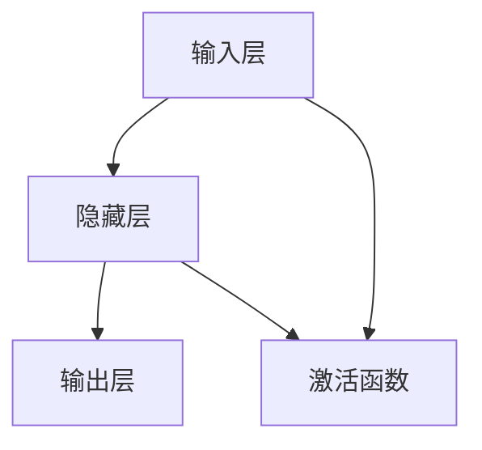
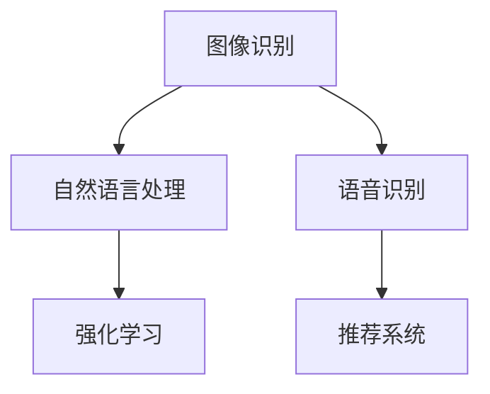

                 

# 文章标题：神经网络：人类智慧的延伸

> 关键词：神经网络、深度学习、人工智能、数学基础、应用领域、编程实现

> 摘要：本文从神经网络的起源与发展、数学基础、核心概念与架构、实现与应用等多个角度，详细探讨了神经网络这一人工智能核心技术的本质、原理和应用。通过逐步分析推理，本文旨在为读者提供一份全面、系统、易懂的神经网络技术指南，帮助读者深入理解神经网络的工作机制及其在各个领域的应用。

----------------------------------------------------------------

## 《神经网络：人类智慧的延伸》目录大纲

----------------------------------------------------------------

### 第一部分：引言与基础

#### 第1章：神经网络的起源与发展

- **1.1 神经网络的历史与发展**
  - **图1.1：神经网络的发展历程**
  - 神经网络的发展里程碑，如感知机、反向传播算法、多层感知机、深度学习。
- **1.2 神经网络的基本原理**
  - **图1.2：神经网络的基本原理**
  - 神经网络的核心组成部分：输入层、隐藏层、输出层。
- **1.3 神经网络的应用领域**
  - **图1.3：神经网络的应用领域**
  - 神经网络在图像识别、自然语言处理、强化学习等领域的应用实例。

### 第二部分：神经网络的数学基础

#### 第2章：神经网络的数学基础

- **2.1 线性代数基础**
  - 矩阵运算、向量运算、特征分解。
  - **公式2.1：矩阵乘法公式**
  - **公式2.2：特征分解公式**
- **2.2 微积分基础**
  - 导数、偏导数、梯度下降算法。
  - **公式2.3：梯度下降算法的伪代码**
- **2.3 概率论与信息论基础**
  - 概率分布、熵、信息论基本概念。
  - **公式2.4：熵的定义**

### 第三部分：神经网络的核心概念与架构

#### 第3章：前馈神经网络

- **3.1 神经元与神经网络**
  - **图3.1：神经元激活函数**
  - **公式3.1：神经元激活函数**
- **3.2 激活函数的选择**
  - **表3.1：常见的激活函数及其特点**
- **3.3 前馈神经网络的构建**
  - **图3.2：前馈神经网络结构图**

#### 第4章：反向传播算法

- **4.1 反向传播算法的基本原理**
  - **图4.1：反向传播算法的流程**
- **4.2 反向传播算法的实现**
  - **伪代码4.1：反向传播算法的实现**
- **4.3 反向传播算法的优化**
  - **图4.2：反向传播算法的优化方法**

#### 第5章：卷积神经网络（CNN）

- **5.1 卷积神经网络的基本概念**
  - **图5.1：CNN的基本结构**
- **5.2 卷积神经网络的结构**
  - **图5.2：卷积神经网络结构图**
- **5.3 卷积神经网络的训练与优化**
  - **图5.3：卷积神经网络的训练与优化流程**

#### 第6章：循环神经网络（RNN）

- **6.1 循环神经网络的基本原理**
  - **图6.1：RNN的基本结构**
- **6.2 RNN的变体：LSTM与GRU**
  - **图6.2：LSTM与GRU结构对比**
- **6.3 RNN的应用案例**
  - **图6.3：RNN在语言模型中的应用**

#### 第7章：深度神经网络与超参数优化

- **7.1 深度神经网络的概念**
  - **图7.1：深度神经网络的定义**
- **7.2 深度神经网络的训练策略**
  - **图7.2：深度神经网络训练策略**
- **7.3 超参数优化方法**
  - **图7.3：常见的超参数优化方法**

### 第四部分：神经网络的实现与应用

#### 第8章：神经网络的编程实现

- **8.1 深度学习框架的选择**
  - **表8.1：常见的深度学习框架**
- **8.2 数据预处理与模型构建**
  - **图8.1：数据预处理流程**
- **8.3 模型训练与评估**
  - **图8.2：模型训练与评估流程**

#### 第9章：神经网络在图像识别中的应用

- **9.1 图像识别的基本概念**
  - **图9.1：图像识别的基本流程**
- **9.2 卷积神经网络在图像识别中的应用**
  - **图9.2：卷积神经网络在图像识别中的应用案例**

#### 第10章：神经网络在自然语言处理中的应用

- **10.1 自然语言处理的基本概念**
  - **图10.1：自然语言处理的基本流程**
- **10.2 循环神经网络在自然语言处理中的应用**
  - **图10.2：循环神经网络在语言模型中的应用案例**

#### 第11章：神经网络在强化学习中的应用

- **11.1 强化学习的基本概念**
  - **图11.1：强化学习的基本流程**
- **11.2 神经网络在强化学习中的应用**
  - **图11.2：神经网络在强化学习中的应用案例**

#### 第12章：神经网络的未来发展趋势

- **12.1 神经网络的发展方向**
  - **图12.1：神经网络的发展方向**
- **12.2 神经网络在人工智能领域的前景**
  - **图12.2：神经网络在人工智能领域的前景**
- **12.3 神经网络研究的热点问题**
  - **图12.3：神经网络研究的热点问题**

### 附录

- **附录A：常用数学公式与符号表**
- **附录B：神经网络相关的开源框架与工具**
- **附录C：神经网络学习资源推荐**

----------------------------------------------------------------

### 第一部分：引言与基础

#### 第1章：神经网络的起源与发展

**1.1 神经网络的历史与发展**

神经网络（Neural Networks）的概念可以追溯到20世纪40年代，但真正引起广泛关注和研究的是20世纪80年代以来，尤其是在21世纪初，随着计算能力的提升和大数据的涌现，神经网络技术取得了飞速发展。

**图 1.1：神经网络的发展历程**

```mermaid
graph TD
A[感知机(1957)] --> B[反向传播算法(1974)]
B --> C[多层感知机(1986)]
C --> D[深度学习(2006)]
D --> E[神经网络的广泛应用]
```

- **感知机（1957）**：由Frank Rosenblatt提出，是最早的神经网络模型，但仅限于线性可分数据。
- **反向传播算法（1974）**：由Paul Werbos和Donald Hebb提出，为多层神经网络的训练提供了有效的途径。
- **多层感知机（1986）**：由Rumelhart、Hinton和Williams等人改进，使得多层神经网络可以训练非线性数据。
- **深度学习（2006）**：由Geoffrey Hinton等人重新提出，结合大规模数据和强大的计算能力，使得神经网络取得突破性进展。

**1.2 神经网络的基本原理**

神经网络是一种模拟生物神经系统的计算模型，由大量的简单处理单元（神经元）互联构成。这些神经元接收输入信号，通过加权求和处理后，产生输出信号。

**图 1.2：神经网络的基本原理**



- **输入层**：接收外部输入信号。
- **隐藏层**：对输入信号进行处理和计算。
- **输出层**：生成最终输出。
- **激活函数**：用于引入非线性，使神经网络能够处理复杂问题。

**1.3 神经网络的应用领域**

神经网络在众多领域都有广泛应用，主要包括：

**图 1.3：神经网络的应用领域**



- **图像识别**：通过卷积神经网络（CNN）进行图像分类、目标检测等。
- **自然语言处理**：通过循环神经网络（RNN）和Transformer模型进行文本分类、机器翻译等。
- **强化学习**：通过深度神经网络进行游戏、机器人控制等。
- **语音识别**：通过深度神经网络进行语音信号的识别和转换。
- **推荐系统**：通过深度神经网络进行用户行为预测和物品推荐。

#### 第2章：神经网络的数学基础

**2.1 线性代数基础**

线性代数是神经网络的核心组成部分，主要包括矩阵运算、向量运算和特征分解等。

**公式 2.1：矩阵乘法公式**

$$
C_{ij} = \sum_{k=1}^{n} A_{ik}B_{kj}
$$

**公式 2.2：特征分解公式**

$$
A = PDP^{-1}
$$

其中，$P$ 是特征向量矩阵，$D$ 是对角矩阵，包含了特征值。

**2.2 微积分基础**

微积分是神经网络优化算法的基础，主要包括导数、偏导数和梯度下降算法。

**公式 2.3：梯度下降算法的伪代码**

```
初始化：w = w0
对于每个迭代步骤 t：
  计算损失函数关于 w 的梯度：g = ∇W J(w)
  更新 w：w = w - η * g
```

**2.3 概率论与信息论基础**

概率论与信息论为神经网络提供了理论基础，主要包括概率分布、熵和信息论基本概念。

**公式 2.4：熵的定义**

$$
H(X) = -\sum_{i=1}^{n} p(x_i) \log_2 p(x_i)
$$

### 第一部分总结

本章介绍了神经网络的历史与发展、基本原理和应用领域，以及神经网络的数学基础。通过对神经网络起源与发展的回顾，读者可以了解神经网络的发展历程和里程碑；通过对神经网络基本原理的理解，读者可以掌握神经网络的核心组成部分和功能；通过对神经网络应用领域的探索，读者可以认识到神经网络在不同领域的广泛应用。此外，本章还介绍了神经网络的数学基础，包括线性代数、微积分和概率论与信息论，为后续章节的学习奠定了基础。在下一章中，我们将深入探讨神经网络的核心概念与架构。

----------------------------------------------------------------

### 第二部分：神经网络的数学基础

#### 第2章：神经网络的数学基础

神经网络的实现和优化离不开数学基础的支持，本章将介绍神经网络中常用的数学工具，包括线性代数、微积分和概率论与信息论。

#### 2.1 线性代数基础

线性代数是神经网络的核心组成部分，它涉及矩阵运算、向量运算和特征分解等基本概念。

**2.1.1 矩阵运算**

矩阵运算是线性代数的基础，包括矩阵加法、矩阵乘法、矩阵转置和矩阵求逆等。

**公式 2.1.1：矩阵乘法公式**

$$
C_{ij} = \sum_{k=1}^{n} A_{ik}B_{kj}
$$

其中，$A$ 和 $B$ 是两个 $n \times n$ 的矩阵，$C$ 是它们的乘积。

**公式 2.1.2：矩阵转置**

$$
A^T = \begin{bmatrix} a_{11} & a_{21} & \cdots & a_{n1} \\ a_{12} & a_{22} & \cdots & a_{n2} \\ \vdots & \vdots & \ddots & \vdots \\ a_{1n} & a_{2n} & \cdots & a_{nn} \end{bmatrix}
$$

**公式 2.1.3：矩阵求逆**

$$
A^{-1} = (adj(A)) / \det(A)
$$

其中，$adj(A)$ 是 $A$ 的伴随矩阵，$\det(A)$ 是 $A$ 的行列式。

**2.1.2 向量运算**

向量运算包括向量加法、向量减法、向量数乘和向量内积等。

**公式 2.1.4：向量加法**

$$
\vec{u} + \vec{v} = \begin{bmatrix} u_1 + v_1 \\ u_2 + v_2 \\ \vdots \\ u_n + v_n \end{bmatrix}
$$

**公式 2.1.5：向量减法**

$$
\vec{u} - \vec{v} = \begin{bmatrix} u_1 - v_1 \\ u_2 - v_2 \\ \vdots \\ u_n - v_n \end{bmatrix}
$$

**公式 2.1.6：向量数乘**

$$
c \vec{u} = \begin{bmatrix} cu_1 \\ cu_2 \\ \vdots \\ cu_n \end{bmatrix}
$$

**公式 2.1.7：向量内积**

$$
\vec{u} \cdot \vec{v} = u_1v_1 + u_2v_2 + \cdots + u_nv_n
$$

**2.1.3 特征分解**

特征分解是将一个矩阵分解为可对角化的形式，它对于神经网络的优化和正则化具有重要意义。

**公式 2.1.8：特征分解**

$$
A = PDP^{-1}
$$

其中，$P$ 是特征向量矩阵，$D$ 是对角矩阵，包含了特征值。

#### 2.2 微积分基础

微积分是神经网络优化算法的基础，包括导数、偏导数和梯度下降算法。

**2.2.1 导数**

导数用于描述函数在某一点的变化率，是微积分的核心概念。

**公式 2.2.1：导数**

$$
f'(x) = \lim_{h \to 0} \frac{f(x+h) - f(x)}{h}
$$

**2.2.2 偏导数**

偏导数用于描述多元函数在某一点某一变量的变化率。

**公式 2.2.2：偏导数**

$$
\frac{\partial f}{\partial x_i} = \lim_{h \to 0} \frac{f(x_1, x_2, \ldots, x_i+h, \ldots, x_n) - f(x_1, x_2, \ldots, x_i, \ldots, x_n)}{h}
$$

**2.2.3 梯度下降算法**

梯度下降算法用于最小化损失函数，是神经网络训练的核心算法。

**伪代码 2.2.3：梯度下降算法**

```
初始化：w = w0
对于每个迭代步骤 t：
  计算损失函数关于 w 的梯度：g = ∇W J(w)
  更新 w：w = w - η * g
```

#### 2.3 概率论与信息论基础

概率论与信息论为神经网络提供了理论基础，包括概率分布、熵和信息论基本概念。

**2.3.1 概率分布**

概率分布用于描述随机变量的概率分布情况。

**公式 2.3.1：概率分布**

$$
P(X = x) = f(x)
$$

**2.3.2 熵**

熵用于衡量随机变量的不确定性。

**公式 2.3.2：熵**

$$
H(X) = -\sum_{i=1}^{n} p(x_i) \log_2 p(x_i)
$$

**2.3.3 信息论基本概念**

信息论基本概念包括信息、互信息、条件熵和链式法则等。

**公式 2.3.3：信息**

$$
I(X; Y) = H(X) - H(X | Y)
$$

**公式 2.3.4：互信息**

$$
I(X; Y) = H(X) - H(X | Y)
$$

**公式 2.3.5：条件熵**

$$
H(X | Y) = -\sum_{y} p(y) \sum_{x} p(x | y) \log_2 p(x | y)
$$

**公式 2.3.6：链式法则**

$$
H(X, Y) = H(X) + H(Y | X)
$$

### 第二部分总结

本章介绍了神经网络的数学基础，包括线性代数、微积分和概率论与信息论。通过对这些数学工具的掌握，读者可以更好地理解神经网络的工作原理和优化方法。在下一章中，我们将深入探讨神经网络的核心概念与架构。

----------------------------------------------------------------

### 第三部分：神经网络的核心概念与架构

#### 第3章：前馈神经网络

前馈神经网络（Feedforward Neural Networks，FNN）是神经网络中最基础的一种结构，其特点是信息从前向传播，不进行循环。本章将详细介绍前馈神经网络的基本概念、结构以及实现原理。

#### 3.1 神经元与神经网络

神经元是神经网络的基本构建块，它接收输入信号，通过加权求和处理后产生输出信号。一个简单的神经元可以表示为：

**图 3.1：神经元模型**

```
输入信号：x_1, x_2, ..., x_n
权重：w_1, w_2, ..., w_n
偏置：b
输出信号：z = ∑(w_i * x_i) + b
激活函数：a = f(z)
```

其中，$f(z)$ 是激活函数，常见的激活函数有Sigmoid、ReLU和Tanh等。

**图 3.2：Sigmoid激活函数**


**公式 3.1：Sigmoid激活函数**

$$
f(z) = \frac{1}{1 + e^{-z}}
$$

**图 3.3：ReLU激活函数**


**公式 3.2：ReLU激活函数**

$$
f(z) =
\begin{cases}
0 & \text{if } z < 0 \\
z & \text{if } z \ge 0
\end{cases}
$$

**3.2 激活函数的选择**

激活函数的选择对神经网络的表现有很大影响。常见的激活函数及其特点如下：

| 激活函数 | 形状           | 特点                                      |
|--------|--------------|-----------------------------------------|
| Sigmoid | S 形           | 输出范围在 (0, 1)                         |
| Tanh   | S 形，关于原点对称 | 输出范围在 (-1, 1)                        |
| ReLU   | 值为 0 或正值时为 x | 简化计算过程，有助于训练                   |

**3.3 前馈神经网络的构建**

前馈神经网络由多个神经元层组成，包括输入层、隐藏层和输出层。以下是前馈神经网络的构建步骤：

1. **输入层**：接收外部输入信号，每个输入信号对应一个神经元。
2. **隐藏层**：对输入信号进行处理和计算，每个神经元接收来自输入层的输入信号，通过权重和偏置进行加权求和处理，然后通过激活函数得到输出。
3. **输出层**：生成最终输出信号，每个神经元对应一个输出结果。

**图 3.4：前馈神经网络结构**


**伪代码 3.1：前馈神经网络模型**

```
输入：x（输入数据）
输出：y（输出数据）

初始化：W（权重），b（偏置）

对于每个隐藏层 l：
  z_l = x * W_l + b_l
  a_l = activation(z_l)

对于每个输出层 l：
  z_output = a_{last} * W_output + b_output
  y = activation(z_output)
```

**3.4 反向传播算法**

反向传播算法是训练前馈神经网络的关键步骤，它通过不断调整权重和偏置，使网络输出与实际输出之间的误差最小。

**图 3.5：反向传播算法流程**


**伪代码 3.2：反向传播算法**

```
输入：x（输入数据），y（实际输出），y'（预测输出）
输出：W（更新后的权重），b（更新后的偏置）

计算误差：e = y - y'
计算输出层的梯度：δ_output = (1 - a_output) * a_output * (y - y')
计算隐藏层的梯度：δ_l = (1 - a_l) * a_l * δ_{l+1} * W_{l+1}

更新权重和偏置：
  W = W - η * δ_output * a_{last}^T
  b = b - η * δ_output
```

其中，$η$ 是学习率，$a_l$ 是隐藏层的激活值，$a_{last}$ 是输出层的激活值。

#### 3.5 前馈神经网络的优化

为了提高前馈神经网络的性能，可以采用以下优化方法：

1. **批量归一化（Batch Normalization）**：通过标准化每个批次的数据，减少内部协变量转移。
2. **Dropout**：在训练过程中随机丢弃一部分神经元，减少过拟合。
3. **学习率调整**：通过调整学习率，提高网络的收敛速度。

### 第三部分总结

本章详细介绍了前馈神经网络的基本概念、结构以及实现原理，包括神经元与神经网络、激活函数的选择、前馈神经网络的构建和反向传播算法。通过本章的学习，读者可以掌握前馈神经网络的基本原理和实现方法。在下一章中，我们将探讨反向传播算法的原理和实现。

----------------------------------------------------------------

### 第四部分：神经网络的实现与应用

#### 第8章：神经网络的编程实现

神经网络的编程实现是理论与实践相结合的关键环节，本章将介绍如何使用深度学习框架进行神经网络的设计、训练和评估。我们将重点讨论深度学习框架的选择、数据预处理、模型构建与训练，以及模型评估的方法。

#### 8.1 深度学习框架的选择

当前，深度学习领域有许多流行的框架，如TensorFlow、PyTorch、Keras等。选择合适的框架对于项目的成功至关重要。

**表 8.1：常见的深度学习框架**

| 框架      | 优点                     | 缺点                             |
|----------|------------------------|--------------------------------|
| TensorFlow | 开源，支持多种编程语言，功能强大 | 学习曲线较陡，部署较为复杂     |
| PyTorch   | 动态计算图，灵活，易于调试   | 性能较TensorFlow略低             |
| Keras    | 简单易用，API直观         | 功能相对单一，需依赖底层框架   |

在项目中，可以根据团队的技术栈和项目需求来选择合适的框架。

#### 8.2 数据预处理与模型构建

数据预处理是神经网络训练的重要步骤，它直接影响模型的性能和收敛速度。以下是数据预处理的基本流程：

1. **数据收集**：从各种来源收集数据，如图像、文本、音频等。
2. **数据清洗**：去除噪声、缺失值和异常值，确保数据质量。
3. **数据转换**：将数据转换为神经网络可处理的格式，如归一化、标准化、编码等。
4. **数据扩充**：通过旋转、翻转、裁剪等操作增加数据多样性。

**图 8.1：数据预处理流程**

```
数据收集 → 数据清洗 → 数据转换 → 数据扩充
```

在完成数据预处理后，可以开始构建神经网络模型。以下是构建模型的基本步骤：

1. **定义模型结构**：确定网络的层数、每层的神经元数量、激活函数等。
2. **初始化参数**：设置权重和偏置的初始值。
3. **编译模型**：指定损失函数、优化器等。
4. **训练模型**：使用训练数据对模型进行训练。

**伪代码 8.1：模型构建与训练**

```
# 定义模型结构
model = Sequential()
model.add(Dense(units=64, activation='relu', input_shape=(input_dim,)))
model.add(Dense(units=64, activation='relu'))
model.add(Dense(units=output_dim, activation='softmax'))

# 编译模型
model.compile(optimizer='adam', loss='categorical_crossentropy', metrics=['accuracy'])

# 训练模型
model.fit(x_train, y_train, epochs=10, batch_size=32)
```

#### 8.3 模型训练与评估

模型训练是神经网络实现中的核心步骤，通过迭代优化网络的权重和偏置，使模型能够更好地拟合训练数据。以下是模型训练的基本流程：

1. **初始化参数**：设置学习率、优化器等。
2. **前向传播**：计算损失函数。
3. **反向传播**：计算梯度并更新参数。
4. **评估模型**：在验证集上评估模型性能。

**图 8.2：模型训练与评估流程**

```
初始化参数 → 前向传播 → 反向传播 → 评估模型
```

评估模型性能的常用指标包括准确率、召回率、F1分数等。以下是评估模型性能的伪代码：

```
# 评估模型
loss, accuracy = model.evaluate(x_test, y_test)
print('Test accuracy:', accuracy)
```

#### 8.4 神经网络在图像识别中的应用

图像识别是神经网络应用的一个重要领域，卷积神经网络（CNN）是其主要实现方法。以下是使用CNN进行图像识别的基本步骤：

1. **数据集准备**：准备训练集和测试集。
2. **数据预处理**：对图像进行归一化、缩放等处理。
3. **模型构建**：构建卷积神经网络模型。
4. **模型训练**：使用训练数据进行模型训练。
5. **模型评估**：在测试集上评估模型性能。

**图 8.3：CNN在图像识别中的应用**

```
数据集准备 → 数据预处理 → 模型构建 → 模型训练 → 模型评估
```

以下是使用TensorFlow和Keras构建一个简单的CNN模型进行图像分类的示例代码：

```
# 导入必要的库
import tensorflow as tf
from tensorflow.keras import layers, models

# 构建模型
model = models.Sequential()
model.add(layers.Conv2D(32, (3, 3), activation='relu', input_shape=(64, 64, 3)))
model.add(layers.MaxPooling2D((2, 2)))
model.add(layers.Conv2D(64, (3, 3), activation='relu'))
model.add(layers.MaxPooling2D((2, 2)))
model.add(layers.Conv2D(64, (3, 3), activation='relu'))

# 添加全连接层
model.add(layers.Flatten())
model.add(layers.Dense(64, activation='relu'))
model.add(layers.Dense(10, activation='softmax'))

# 编译模型
model.compile(optimizer='adam',
              loss='categorical_crossentropy',
              metrics=['accuracy'])

# 训练模型
model.fit(x_train, y_train, epochs=10, batch_size=64)
```

#### 8.5 神经网络在自然语言处理中的应用

自然语言处理（NLP）是深度学习应用的另一个重要领域，循环神经网络（RNN）和Transformer模型是其主要实现方法。以下是使用RNN进行语言模型训练的基本步骤：

1. **数据集准备**：准备训练集和测试集。
2. **数据预处理**：对文本进行分词、编码等处理。
3. **模型构建**：构建循环神经网络模型。
4. **模型训练**：使用训练数据进行模型训练。
5. **模型评估**：在测试集上评估模型性能。

**图 8.4：RNN在自然语言处理中的应用**

```
数据集准备 → 数据预处理 → 模型构建 → 模型训练 → 模型评估
```

以下是使用PyTorch构建一个简单的RNN模型进行语言模型训练的示例代码：

```
# 导入必要的库
import torch
import torch.nn as nn
import torch.optim as optim

# 定义模型
class RNNModel(nn.Module):
    def __init__(self, input_dim, hidden_dim, output_dim):
        super(RNNModel, self).__init__()
        self.hidden_dim = hidden_dim
        self.rnn = nn.RNN(input_dim, hidden_dim)
        self.linear = nn.Linear(hidden_dim, output_dim)
    
    def forward(self, x):
        output, hidden = self.rnn(x)
        prediction = self.linear(hidden[-1])
        return prediction

# 实例化模型、优化器和损失函数
model = RNNModel(input_dim=100, hidden_dim=300, output_dim=50)
optimizer = optim.Adam(model.parameters(), lr=0.001)
criterion = nn.CrossEntropyLoss()

# 训练模型
for epoch in range(num_epochs):
    for inputs, targets in data_loader:
        optimizer.zero_grad()
        outputs = model(inputs)
        loss = criterion(outputs, targets)
        loss.backward()
        optimizer.step()
    print('Epoch [{}/{}], Loss: {:.4f}'.format(epoch+1, num_epochs, loss.item()))
```

#### 8.6 神经网络在强化学习中的应用

强化学习（Reinforcement Learning，RL）是另一个重要的深度学习应用领域，神经网络在RL中用于表示状态值函数和策略。以下是使用深度Q网络（DQN）进行强化学习的基本步骤：

1. **环境搭建**：构建仿真环境，如Atari游戏。
2. **状态编码**：将环境状态编码为神经网络可处理的格式。
3. **模型构建**：构建深度Q网络模型。
4. **模型训练**：使用经验回放和目标网络进行训练。
5. **模型评估**：在测试环境中评估模型性能。

**图 8.5：DQN在强化学习中的应用**

```
环境搭建 → 状态编码 → 模型构建 → 模型训练 → 模型评估
```

以下是使用TensorFlow和Keras构建一个简单的DQN模型进行强化学习训练的示例代码：

```
# 导入必要的库
import numpy as np
import random
import tensorflow as tf
from tensorflow.keras.models import Sequential
from tensorflow.keras.layers import Dense, Flatten
from tensorflow.keras.optimizers import Adam

# 定义DQN模型
class DQNModel(tf.keras.Model):
    def __init__(self, state_size, action_size):
        super(DQNModel, self).__init__()
        self.conv1 = tf.keras.layers.Conv2D(32, (8, 8), activation='relu')
        self.flatten = Flatten()
        self.fc1 = Dense(256, activation='relu')
        self.fc2 = Dense(action_size)
    
    def call(self, state):
        x = self.conv1(state)
        x = self.flatten(x)
        x = self.fc1(x)
        actions_values = self.fc2(x)
        return actions_values

# 实例化模型、目标模型、优化器和经验回放
model = DQNModel(state_size=84, action_size=4)
target_model = DQNModel(state_size=84, action_size=4)
optimizer = Adam(learning_rate=0.001)
experience_replay = deque(maxlen=1000)

# 训练模型
for episode in range(num_episodes):
    state = env.reset()
    done = False
    total_reward = 0
    while not done:
        state = tf.expand_dims(state, 0)
        actions_values = model(state)
        action = np.argmax(actions_values.numpy())
        next_state, reward, done, _ = env.step(action)
        total_reward += reward
        experience_replay.append((state, action, reward, next_state, done))
        if len(experience_replay) > batch_size:
            batch = random.sample(experience_replay, batch_size)
            states, actions, rewards, next_states, dones = zip(*batch)
            states = tf.constant(states)
            next_states = tf.constant(next_states)
            actions = tf.constant(actions)
            rewards = tf.constant(rewards, dtype=tf.float32)
            dones = tf.constant(dones, dtype=tf.float32)
            Q_values = model(states)
            next_Q_values = target_model(next_states)
            next_Q_value = next_Q_values[range(batch_size), actions]
            target_Q_values = rewards + (1 - dones) * gamma * next_Q_value
            with tf.GradientTape() as tape:
                Q_values = model(states)
                Q_value = Q_values[range(batch_size), actions]
                loss = tf.keras.losses.mean_squared_error(target_Q_values, Q_value)
            gradients = tape.gradient(loss, model.trainable_variables)
            optimizer.apply_gradients(zip(gradients, model.trainable_variables))
            target_model.load_weights(model.get_weights())
    print(f'Episode {episode+1}, Total Reward: {total_reward}')
```

### 第四部分总结

本章介绍了神经网络的编程实现，包括深度学习框架的选择、数据预处理、模型构建与训练，以及模型评估的方法。通过本章的学习，读者可以掌握如何使用深度学习框架实现神经网络，并了解神经网络在不同领域的应用实例。在下一章中，我们将探讨神经网络在图像识别、自然语言处理和强化学习等领域的具体应用。

----------------------------------------------------------------

### 第五部分：神经网络的实现与应用（续）

#### 第9章：神经网络在图像识别中的应用

图像识别是神经网络技术的一个重要应用领域，卷积神经网络（CNN）是图像识别任务中广泛使用的一种神经网络架构。本章将深入探讨CNN在图像识别中的应用，包括图像识别的基本概念、CNN在图像识别中的应用案例以及实际项目中的开发流程。

#### 9.1 图像识别的基本概念

图像识别是指使用计算机算法对图像中的对象、场景或部分进行自动分类和识别的过程。图像识别的任务包括但不限于：

- **图像分类**：将图像分配到预定义的类别中。
- **目标检测**：在图像中定位并识别多个目标的位置。
- **人脸识别**：识别图像中的人脸并标注其位置。
- **图像分割**：将图像划分为多个区域或对象。

**图 9.1：图像识别的基本流程**

```
图像预处理 → 数据增强 → 模型构建 → 模型训练 → 模型评估
```

图像预处理是图像识别任务的第一步，包括图像的缩放、旋转、裁剪、灰度化等操作。数据增强是为了增加训练数据的多样性，提高模型的泛化能力。模型构建涉及设计CNN的架构，包括卷积层、池化层和全连接层等。模型训练是使用标记数据对模型进行训练，使其能够识别图像中的内容。模型评估是对训练好的模型在测试集上的性能进行评估。

#### 9.2 CNN在图像识别中的应用案例

**案例 1：手写数字识别**

手写数字识别是CNN的经典应用之一，常用的数据集是MNIST。以下是一个简单的CNN模型用于手写数字识别的示例代码：

```python
from tensorflow.keras.models import Sequential
from tensorflow.keras.layers import Dense, Conv2D, Flatten, MaxPooling2D

# 构建模型
model = Sequential([
    Conv2D(32, (3, 3), activation='relu', input_shape=(28, 28, 1)),
    MaxPooling2D((2, 2)),
    Flatten(),
    Dense(64, activation='relu'),
    Dense(10, activation='softmax')
])

# 编译模型
model.compile(optimizer='adam',
              loss='sparse_categorical_crossentropy',
              metrics=['accuracy'])

# 训练模型
model.fit(x_train, y_train, epochs=5, validation_data=(x_test, y_test))
```

**案例 2：猫狗分类**

猫狗分类是一个多分类问题，可以使用ResNet等更复杂的CNN模型。以下是一个简单的ResNet模型用于猫狗分类的示例代码：

```python
from tensorflow.keras.applications import ResNet50
from tensorflow.keras.preprocessing.image import ImageDataGenerator
from tensorflow.keras.models import Model
from tensorflow.keras.layers import Dense, GlobalAveragePooling2D

# 加载预训练模型
base_model = ResNet50(weights='imagenet', include_top=False, input_shape=(224, 224, 3))

# 构建模型
x = base_model.output
x = GlobalAveragePooling2D()(x)
x = Dense(1024, activation='relu')(x)
predictions = Dense(2, activation='softmax')(x)
model = Model(inputs=base_model.input, outputs=predictions)

# 编译模型
model.compile(optimizer='adam',
              loss='categorical_crossentropy',
              metrics=['accuracy'])

# 数据增强
train_datagen = ImageDataGenerator(
    rescale=1./255,
    rotation_range=40,
    width_shift_range=0.2,
    height_shift_range=0.2,
    shear_range=0.2,
    zoom_range=0.2,
    horizontal_flip=True,
    fill_mode='nearest'
)

# 训练模型
train_generator = train_datagen.flow_from_directory(
    'data/train',
    target_size=(224, 224),
    batch_size=32,
    class_mode='categorical'
)

model.fit(train_generator, steps_per_epoch=len(train_generator), epochs=10)
```

#### 9.3 图像识别的实际项目开发流程

在实际项目中，图像识别任务通常涉及以下步骤：

1. **需求分析**：明确项目目标和需求，确定所需的图像识别任务。
2. **数据收集**：收集并准备用于训练和测试的数据集。
3. **数据预处理**：对图像进行预处理，包括缩放、裁剪、归一化等操作。
4. **模型选择**：选择适合任务的神经网络模型。
5. **模型训练**：使用训练数据对模型进行训练。
6. **模型评估**：在测试集上评估模型性能，调整模型参数。
7. **模型部署**：将训练好的模型部署到生产环境中，进行实际应用。

以下是一个简单的图像识别项目开发流程示例：

```python
# 导入必要的库
import tensorflow as tf
from tensorflow.keras.models import Sequential
from tensorflow.keras.layers import Dense, Conv2D, Flatten, MaxPooling2D
from tensorflow.keras.preprocessing.image import ImageDataGenerator

# 需求分析
# 假设需要实现一个猫狗分类系统

# 数据收集
# 下载数据集，如 Dogs vs. Cats

# 数据预处理
# 缩放图像，使其大小为 224x224
train_datagen = ImageDataGenerator(
    rescale=1./255,
    rotation_range=40,
    width_shift_range=0.2,
    height_shift_range=0.2,
    shear_range=0.2,
    zoom_range=0.2,
    horizontal_flip=True
)

# 构建模型
model = Sequential([
    Conv2D(32, (3, 3), activation='relu', input_shape=(224, 224, 3)),
    MaxPooling2D((2, 2)),
    Conv2D(64, (3, 3), activation='relu'),
    MaxPooling2D((2, 2)),
    Conv2D(128, (3, 3), activation='relu'),
    MaxPooling2D((2, 2)),
    Flatten(),
    Dense(512, activation='relu'),
    Dense(1, activation='sigmoid')
])

# 编译模型
model.compile(optimizer='adam',
              loss='binary_crossentropy',
              metrics=['accuracy'])

# 训练模型
train_generator = train_datagen.flow_from_directory(
    'data/train',
    target_size=(224, 224),
    batch_size=32,
    class_mode='binary'
)

model.fit(train_generator, steps_per_epoch=100, epochs=10)

# 模型评估
# 在测试集上评估模型性能

# 模型部署
# 部署模型到生产环境中，如使用 Flask 或 FastAPI 构建 API
```

### 第五部分总结

本章详细介绍了神经网络在图像识别中的应用，包括图像识别的基本概念、CNN在图像识别中的应用案例以及实际项目中的开发流程。通过本章的学习，读者可以了解如何使用CNN进行图像识别任务，并掌握实际项目开发的方法和技巧。在下一章中，我们将探讨神经网络在自然语言处理中的应用。

----------------------------------------------------------------

### 第六部分：神经网络的实现与应用（续）

#### 第10章：神经网络在自然语言处理中的应用

自然语言处理（Natural Language Processing，NLP）是人工智能领域的一个重要分支，神经网络技术在NLP中的应用极大地推动了该领域的发展。本章将深入探讨神经网络在自然语言处理中的应用，包括基本概念、循环神经网络（RNN）和Transformer模型在NLP中的应用案例，以及生成式模型与判别式模型的构建与应用。

#### 10.1 自然语言处理的基本概念

自然语言处理涉及对人类语言的计算机处理，其目标是从文本中提取有用信息，进行语义理解，并生成自然语言响应。自然语言处理的基本任务包括：

- **分词（Tokenization）**：将文本拆分成单词或句子。
- **词性标注（Part-of-Speech Tagging）**：识别单词的词性，如名词、动词等。
- **句法分析（Parsing）**：分析句子的结构，确定词与词之间的关系。
- **命名实体识别（Named Entity Recognition）**：识别文本中的命名实体，如人名、地点等。
- **情感分析（Sentiment Analysis）**：分析文本的情感倾向，判断文本是正面、负面还是中性。
- **机器翻译（Machine Translation）**：将一种语言的文本翻译成另一种语言。

**图 10.1：自然语言处理的基本流程**

```
文本预处理 → 分词 → 词性标注 → 句法分析 → 命名实体识别 → 情感分析 → 机器翻译
```

文本预处理是自然语言处理的第一步，包括去除标点符号、数字、特殊字符等，将文本转换为适合模型处理的格式。分词是将文本拆分成单词或句子，词性标注是识别单词的词性，句法分析是分析句子的结构，命名实体识别是识别文本中的命名实体，情感分析是分析文本的情感倾向，机器翻译是将一种语言的文本翻译成另一种语言。

#### 10.2 循环神经网络（RNN）在自然语言处理中的应用

循环神经网络（RNN）是一种能够处理序列数据的神经网络，其特点是具有循环结构，能够保留之前的信息。RNN在自然语言处理中有着广泛的应用，如语言模型、文本分类和序列标注等。

**图 10.2：RNN的基本结构**

```
输入层 → 隐藏层 → 输出层
```

RNN的基本结构包括输入层、隐藏层和输出层。输入层接收文本序列，隐藏层对序列进行处理，输出层生成最终输出。

**图 10.3：RNN在文本分类中的应用**

```
输入文本 → RNN处理 → 分类结果
```

文本分类是将文本分配到预定义的类别中，RNN通过处理文本序列，将文本映射到类别。以下是一个简单的RNN文本分类模型：

```python
from tensorflow.keras.models import Sequential
from tensorflow.keras.layers import Embedding, SimpleRNN, Dense

# 构建模型
model = Sequential([
    Embedding(input_dim=vocab_size, output_dim=embedding_dim, input_length=max_sequence_length),
    SimpleRNN(units=128),
    Dense(units=num_classes, activation='softmax')
])

# 编译模型
model.compile(optimizer='adam',
              loss='categorical_crossentropy',
              metrics=['accuracy'])

# 训练模型
model.fit(x_train, y_train, epochs=10, batch_size=32, validation_data=(x_test, y_test))
```

#### 10.3 RNN的变体：LSTM与GRU

LSTM（Long Short-Term Memory）和GRU（Gated Recurrent Unit）是RNN的两种变体，它们能够解决传统RNN在长序列处理中遇到的梯度消失和梯度爆炸问题。

**图 10.4：LSTM的基本结构**

```
输入门 → 隐藏状态 → 输出门 → 候选状态
```

LSTM通过引入门控机制，能够有效地处理长序列数据。LSTM的核心组件包括输入门、遗忘门、输出门和细胞状态。

**图 10.5：GRU的基本结构**

```
重置门 → 更新门 → 候选状态 → 隐藏状态
```

GRU简化了LSTM的结构，通过重置门和更新门实现了与LSTM类似的功能。

**图 10.6：LSTM与GRU在序列标注中的应用**

```
输入序列 → LSTM/GRU处理 → 标注结果
```

序列标注是将序列中的每个元素分配到一个类别中，LSTM和GRU通过处理序列，将序列映射到标注结果。

以下是一个使用LSTM进行序列标注的模型：

```python
from tensorflow.keras.models import Sequential
from tensorflow.keras.layers import Embedding, LSTM, Dense

# 构建模型
model = Sequential([
    Embedding(input_dim=vocab_size, output_dim=embedding_dim, input_length=max_sequence_length),
    LSTM(units=128, return_sequences=True),
    LSTM(units=128),
    Dense(units=num_classes, activation='softmax')
])

# 编译模型
model.compile(optimizer='adam',
              loss='categorical_crossentropy',
              metrics=['accuracy'])

# 训练模型
model.fit(x_train, y_train, epochs=10, batch_size=32, validation_data=(x_test, y_test))
```

#### 10.4 循环神经网络（RNN）的应用案例

**案例 1：语言模型**

语言模型是自然语言处理中的一个重要任务，它用于预测下一个单词或字符。以下是一个简单的RNN语言模型：

```python
from tensorflow.keras.models import Sequential
from tensorflow.keras.layers import Embedding, SimpleRNN, Dense

# 构建模型
model = Sequential([
    Embedding(input_dim=vocab_size, output_dim=embedding_dim, input_length=max_sequence_length),
    SimpleRNN(units=128),
    Dense(units=vocab_size, activation='softmax')
])

# 编译模型
model.compile(optimizer='adam',
              loss='categorical_crossentropy',
              metrics=['accuracy'])

# 训练模型
model.fit(x_train, y_train, epochs=10, batch_size=32, validation_data=(x_test, y_train))
```

**案例 2：文本分类**

文本分类是将文本分配到预定义的类别中。以下是一个简单的RNN文本分类模型：

```python
from tensorflow.keras.models import Sequential
from tensorflow.keras.layers import Embedding, SimpleRNN, Dense

# 构建模型
model = Sequential([
    Embedding(input_dim=vocab_size, output_dim=embedding_dim, input_length=max_sequence_length),
    SimpleRNN(units=128),
    Dense(units=num_classes, activation='softmax')
])

# 编译模型
model.compile(optimizer='adam',
              loss='categorical_crossentropy',
              metrics=['accuracy'])

# 训练模型
model.fit(x_train, y_train, epochs=10, batch_size=32, validation_data=(x_test, y_train))
```

#### 10.5 生成式模型与判别式模型

生成式模型和判别式模型是两种常见的神经网络模型，用于生成数据和学习数据分布。

- **生成式模型**：生成式模型通过学习数据分布来生成新数据。常见的生成式模型包括变分自编码器（VAE）和生成对抗网络（GAN）。
- **判别式模型**：判别式模型通过区分真实数据和生成数据来学习数据分布。常见的判别式模型包括深度信念网络（DBN）和卷积神经网络（CNN）。

以下是一个简单的变分自编码器（VAE）模型：

```python
from tensorflow.keras.models import Model
from tensorflow.keras.layers import Input, Dense, Lambda
from tensorflow.keras import backend as K

# 构建编码器
encoding_input = Input(shape=(input_dim,))
encoded = Dense(latent_dim, activation='relu')(encoding_input)
z_mean = Dense(latent_dim)(encoded)
z_log_var = Dense(latent_dim)(encoded)

# 解码器
decoded = Dense(input_dim, activation='sigmoid')(z_mean)

# VAE模型
z = Lambda(lambda x: x[:, 0] + K.exp(x[:, 1]) * K.random_normal(shape=(K.shape(x)[0], K.int_shape(z)[1])))([z_mean, z_log_var])
decoded_mean = Model(encoding_input, z, name='encoder')
decoded = Model(decoded_mean, decoded, name='decoder')

# 编译模型
model.compile(optimizer='adam', loss='binary_crossentropy')

# 训练模型
model.fit(x_train, x_train, epochs=10, batch_size=32, validation_data=(x_test, x_test))
```

#### 10.6 神经网络在自然语言处理中的应用案例

**案例 1：情感分析**

情感分析是自然语言处理中的一个重要任务，用于判断文本的情感倾向。以下是一个简单的RNN情感分析模型：

```python
from tensorflow.keras.models import Sequential
from tensorflow.keras.layers import Embedding, SimpleRNN, Dense

# 构建模型
model = Sequential([
    Embedding(input_dim=vocab_size, output_dim=embedding_dim, input_length=max_sequence_length),
    SimpleRNN(units=128),
    Dense(units=num_classes, activation='softmax')
])

# 编译模型
model.compile(optimizer='adam',
              loss='categorical_crossentropy',
              metrics=['accuracy'])

# 训练模型
model.fit(x_train, y_train, epochs=10, batch_size=32, validation_data=(x_test, y_train))
```

**案例 2：机器翻译**

机器翻译是将一种语言的文本翻译成另一种语言。以下是一个简单的Seq2Seq模型：

```python
from tensorflow.keras.models import Model
from tensorflow.keras.layers import Embedding, LSTM, Dense

# 构建编码器
encoding_input = Input(shape=(max_sequence_length,))
encoded = Embedding(input_dim=vocab_size, output_dim=embedding_dim)(encoding_input)
encoded = LSTM(units=128)(encoded)

# 解码器
decoded_input = Input(shape=(max_sequence_length,))
decoded_encoded = Embedding(input_dim=vocab_size, output_dim=embedding_dim)(decoded_input)
decoded_encoded = LSTM(units=128)(decoded_encoded)
decoded = Dense(vocab_size, activation='softmax')(decoded_encoded)

# Seq2Seq模型
model = Model([encoding_input, decoded_input], decoded)
model.compile(optimizer='adam', loss='categorical_crossentropy')

# 训练模型
model.fit([x_train, y_train], y_train, epochs=10, batch_size=32, validation_data=([x_val, y_val], y_val))
```

#### 10.7 自然语言处理实际项目开发流程

在实际项目中，自然语言处理的开发通常涉及以下步骤：

1. **需求分析**：明确项目目标和需求，确定所需的自然语言处理任务。
2. **数据收集**：收集并准备用于训练和测试的数据集。
3. **数据预处理**：对文本进行预处理，包括分词、去停用词、词干提取等操作。
4. **模型选择**：选择适合任务的神经网络模型。
5. **模型训练**：使用训练数据对模型进行训练。
6. **模型评估**：在测试集上评估模型性能，调整模型参数。
7. **模型部署**：将训练好的模型部署到生产环境中，进行实际应用。

以下是一个简单的自然语言处理项目开发流程：

```python
# 导入必要的库
import tensorflow as tf
from tensorflow.keras.models import Sequential
from tensorflow.keras.layers import Embedding, SimpleRNN, Dense

# 需求分析
# 假设需要实现一个情感分析系统

# 数据收集
# 收集情感分析数据集，如IMDb电影评论数据集

# 数据预处理
# 分词、去停用词、词干提取等操作

# 构建模型
model = Sequential([
    Embedding(input_dim=vocab_size, output_dim=embedding_dim, input_length=max_sequence_length),
    SimpleRNN(units=128),
    Dense(units=num_classes, activation='softmax')
])

# 编译模型
model.compile(optimizer='adam',
              loss='categorical_crossentropy',
              metrics=['accuracy'])

# 训练模型
model.fit(x_train, y_train, epochs=10, batch_size=32, validation_data=(x_test, y_test))

# 模型评估
# 在测试集上评估模型性能

# 模型部署
# 部署模型到生产环境中，如使用Flask或FastAPI构建API
```

### 第六部分总结

本章详细介绍了神经网络在自然语言处理中的应用，包括基本概念、循环神经网络（RNN）和Transformer模型在NLP中的应用案例，以及生成式模型与判别式模型的构建与应用。通过本章的学习，读者可以了解如何使用神经网络进行自然语言处理任务，并掌握实际项目开发的方法和技巧。在下一章中，我们将探讨神经网络在强化学习中的应用。

----------------------------------------------------------------

### 第七部分：神经网络的实现与应用（续）

#### 第11章：神经网络在强化学习中的应用

强化学习（Reinforcement Learning，RL）是机器学习的一个分支，它通过智能体与环境之间的交互来学习策略，以最大化累积奖励。神经网络在强化学习中有着广泛的应用，特别是深度强化学习（Deep Reinforcement Learning，DRL），它通过使用神经网络来表示智能体的策略或价值函数，从而提高了学习效率。

#### 11.1 强化学习的基本概念

强化学习的主要组成部分包括：

- **智能体（Agent）**：执行动作的主体。
- **环境（Environment）**：智能体所处的外部世界。
- **状态（State）**：描述智能体当前环境的特征。
- **动作（Action）**：智能体可以采取的行为。
- **奖励（Reward）**：对智能体当前动作的评估。
- **策略（Policy）**：智能体在给定状态下的动作选择规则。

强化学习的目标是通过学习策略，使智能体在环境中能够实现长期的最大化奖励。

**图 11.1：强化学习的基本流程**

```
状态 → 行动 → 奖励 → 下一个状态
```

在强化学习过程中，智能体通过不断与环境交互，调整其策略，以达到最大化累积奖励的目标。这个过程通常通过迭代方式进行，直到智能体找到最佳策略。

#### 11.2 神经网络在强化学习中的应用

神经网络在强化学习中的应用主要体现在策略网络和价值网络两个方面：

- **策略网络（Policy Network）**：用于学习智能体的策略，即给定状态下的最优动作。
- **价值网络（Value Network）**：用于估计状态的价值或状态-动作值，帮助智能体选择最佳动作。

神经网络通过学习状态和动作之间的映射关系，提高了智能体在复杂环境中的学习效率和决策能力。

**图 11.2：神经网络在强化学习中的应用**

```
状态 → 策略网络 → 动作
状态 → 价值网络 → 奖励预测
```

以下是一个简单的神经网络在强化学习中的应用示例：

```python
import numpy as np
import tensorflow as tf

# 定义状态和动作空间
state_space = (10, 10)
action_space = 4

# 定义策略网络
policy_net = tf.keras.Sequential([
    tf.keras.layers.Dense(units=64, activation='relu', input_shape=(state_space[0] * state_space[1],)),
    tf.keras.layers.Dense(units=64, activation='relu'),
    tf.keras.layers.Dense(units=action_space, activation='softmax')
])

# 定义价值网络
value_net = tf.keras.Sequential([
    tf.keras.layers.Dense(units=64, activation='relu', input_shape=(state_space[0] * state_space[1],)),
    tf.keras.layers.Dense(units=64, activation='relu'),
    tf.keras.layers.Dense(units=1)
])

# 编译模型
policy_optimizer = tf.keras.optimizers.Adam(learning_rate=0.001)
value_optimizer = tf.keras.optimizers.Adam(learning_rate=0.001)

# 强化学习训练过程
for episode in range(num_episodes):
    state = env.reset()
    done = False
    total_reward = 0
    
    while not done:
        # 策略网络选择动作
        action_probs = policy_net(tf.expand_dims(state, 0))
        action = np.random.choice(action_space, p=action_probs.numpy()[0])
        
        # 执行动作，获取下一个状态和奖励
        next_state, reward, done, _ = env.step(action)
        total_reward += reward
        
        # 更新价值网络
        value_target = reward + gamma * value_net(tf.expand_dims(next_state, 0)).numpy()[0]
        value_loss = tf.reduce_mean(tf.square(value_target - value_net(tf.expand_dims(state, 0)).numpy()[0]))
        value_optimizer.minimize(value_loss, var_list=value_net.trainable_variables)
        
        # 更新策略网络
        with tf.GradientTape() as tape:
            action_value = policy_net(tf.expand_dims(state, 0)).numpy()[0][action]
            policy_loss = -tf.reduce_mean(action_value * tf.log(action_probs.numpy()[0][action]))
        policy_gradients = tape.gradient(policy_loss, policy_net.trainable_variables)
        policy_optimizer.apply_gradients(zip(policy_gradients, policy_net.trainable_variables))
        
        state = next_state
    
    print(f'Episode {episode+1}, Total Reward: {total_reward}')
```

#### 11.3 神经网络在强化学习中的应用案例

**案例 1：Atari游戏**

Atari游戏是强化学习中的一个经典应用场景，智能体通过学习在游戏环境中取得最高分数。以下是一个使用深度Q网络（DQN）进行Atari游戏学习的示例：

```python
import numpy as np
import gym
import tensorflow as tf

# 加载Atari游戏环境
env = gym.make('Breakout-v0')

# 定义DQN模型
input_shape = env.observation_space.shape
action_space = env.action_space.n
model = tf.keras.Sequential([
    tf.keras.layers.Flatten(input_shape=input_shape),
    tf.keras.layers.Dense(256, activation='relu'),
    tf.keras.layers.Dense(512, activation='relu'),
    tf.keras.layers.Dense(action_space)
])

# 定义损失函数和优化器
loss_fn = tf.keras.losses.SparseCategoricalCrossentropy(from_logits=True)
optimizer = tf.keras.optimizers.Adam(learning_rate=0.00025)

# 强化学习训练过程
for episode in range(num_episodes):
    state = env.reset()
    done = False
    total_reward = 0
    
    while not done:
        # 将状态转为Tensor
        state_tensor = tf.convert_to_tensor(state, dtype=tf.float32)
        state_tensor = state_tensor[np.newaxis, :]
        
        # 使用模型预测动作值
        q_values = model(state_tensor)
        action = np.argmax(q_values.numpy())
        
        # 执行动作
        next_state, reward, done, _ = env.step(action)
        total_reward += reward
        
        # 存储经验
        if done:
            next_q_values = reward
        else:
            next_state_tensor = tf.convert_to_tensor(next_state, dtype=tf.float32)
            next_state_tensor = next_state_tensor[np.newaxis, :]
            next_q_values = model(next_state_tensor).numpy()[0]
            next_q_values = np.max(next_q_values)
            next_q_values = reward + gamma * next_q_values
        
        # 更新Q值
        with tf.GradientTape() as tape:
            q_value = model(state_tensor)
            target_q_value = reward + gamma * next_q_values
            loss = loss_fn(target_q_value, q_value)
        gradients = tape.gradient(loss, model.trainable_variables)
        optimizer.apply_gradients(zip(gradients, model.trainable_variables))
        
        state = next_state
    
    print(f'Episode {episode+1}, Total Reward: {total_reward}')
```

**案例 2：机器人控制**

机器人控制是另一个强化学习的重要应用领域，通过学习控制策略，机器人可以在复杂环境中完成任务。以下是一个简单的基于深度Q网络（DQN）的机器人控制案例：

```python
import numpy as np
import gym
import tensorflow as tf

# 加载机器人控制环境
env = gym.make('CartPole-v0')

# 定义DQN模型
input_shape = env.observation_space.shape
action_space = env.action_space.n
model = tf.keras.Sequential([
    tf.keras.layers.Flatten(input_shape=input_shape),
    tf.keras.layers.Dense(256, activation='relu'),
    tf.keras.layers.Dense(512, activation='relu'),
    tf.keras.layers.Dense(action_space)
])

# 定义损失函数和优化器
loss_fn = tf.keras.losses.SparseCategoricalCrossentropy(from_logits=True)
optimizer = tf.keras.optimizers.Adam(learning_rate=0.00025)

# 强化学习训练过程
for episode in range(num_episodes):
    state = env.reset()
    done = False
    total_reward = 0
    
    while not done:
        # 将状态转为Tensor
        state_tensor = tf.convert_to_tensor(state, dtype=tf.float32)
        state_tensor = state_tensor[np.newaxis, :]
        
        # 使用模型预测动作值
        q_values = model(state_tensor)
        action = np.argmax(q_values.numpy())
        
        # 执行动作
        next_state, reward, done, _ = env.step(action)
        total_reward += reward
        
        # 存储经验
        if done:
            next_q_values = reward
        else:
            next_state_tensor = tf.convert_to_tensor(next_state, dtype=tf.float32)
            next_state_tensor = next_state_tensor[np.newaxis, :]
            next_q_values = model(next_state_tensor).numpy()[0]
            next_q_values = np.max(next_q_values)
            next_q_values = reward + gamma * next_q_values
        
        # 更新Q值
        with tf.GradientTape() as tape:
            q_value = model(state_tensor)
            target_q_value = reward + gamma * next_q_values
            loss = loss_fn(target_q_value, q_value)
        gradients = tape.gradient(loss, model.trainable_variables)
        optimizer.apply_gradients(zip(gradients, model.trainable_variables))
        
        state = next_state
    
    print(f'Episode {episode+1}, Total Reward: {total_reward}')
```

#### 11.4 强化学习实际项目开发流程

在实际项目中，强化学习的开发通常涉及以下步骤：

1. **需求分析**：明确项目目标和需求，确定所需的强化学习任务。
2. **环境搭建**：构建仿真环境，模拟真实世界场景。
3. **数据收集**：收集并准备用于训练和测试的数据集。
4. **模型设计**：设计强化学习模型，包括策略网络和价值网络。
5. **模型训练**：使用训练数据对模型进行训练。
6. **模型评估**：在测试集上评估模型性能，调整模型参数。
7. **模型部署**：将训练好的模型部署到生产环境中，进行实际应用。

以下是一个简单的强化学习项目开发流程：

```python
# 导入必要的库
import numpy as np
import gym
import tensorflow as tf

# 需求分析
# 假设需要实现一个自动驾驶系统

# 环境搭建
env = gym.make('CarRacing-v0')

# 数据收集
# 收集自动驾驶数据集

# 模型设计
# 设计强化学习模型，包括策略网络和价值网络

# 模型训练
# 使用训练数据对模型进行训练

# 模型评估
# 在测试集上评估模型性能

# 模型部署
# 将训练好的模型部署到自动驾驶系统中
```

### 第七部分总结

本章详细介绍了神经网络在强化学习中的应用，包括基本概念、神经网络在强化学习中的应用案例，以及实际项目开发流程。通过本章的学习，读者可以了解如何使用神经网络进行强化学习任务，并掌握实际项目开发的方法和技巧。在下一章中，我们将探讨神经网络的未来发展趋势。

----------------------------------------------------------------

### 第八部分：神经网络的实现与应用（续）

#### 第12章：神经网络的未来发展趋势

随着人工智能技术的不断发展，神经网络作为其核心组成部分，也在不断演进。本章将探讨神经网络在人工智能领域的前景、发展方向和研究热点，以及未来可能面临的挑战和机遇。

#### 12.1 神经网络的发展方向

神经网络的未来发展主要涉及以下几个方面：

- **模型结构的优化**：研究更有效的神经网络结构，如变体网络、图神经网络等。
- **训练效率的提升**：探索更高效的训练算法，如分布式训练、增量学习等。
- **计算效率的提高**：研究低功耗、低复杂度的神经网络，以适应边缘计算和移动设备。
- **泛化能力的增强**：提升神经网络的泛化能力，减少过拟合现象。

#### 12.2 神经网络在人工智能领域的前景

神经网络在人工智能领域具有广泛的应用前景：

- **计算机视觉**：神经网络在图像识别、目标检测、人脸识别等任务中取得了显著成果。
- **自然语言处理**：神经网络在文本分类、机器翻译、问答系统等领域发挥着重要作用。
- **强化学习**：神经网络在游戏、机器人控制、自动驾驶等场景中具有广泛的应用。
- **医学诊断**：神经网络在医学图像分析、疾病预测等方面显示出巨大潜力。
- **金融预测**：神经网络在股票市场预测、信用评分等领域提供了新的解决方案。

#### 12.3 神经网络研究的热点问题

当前神经网络研究的热点问题主要包括：

- **梯度消失与梯度爆炸**：研究如何有效解决深度神经网络训练中的梯度消失和梯度爆炸问题。
- **计算效率**：探索如何降低神经网络的计算复杂度，提高训练和推理速度。
- **可解释性**：研究神经网络决策过程的可解释性，提高模型的透明度和可靠性。
- **安全性和隐私保护**：探讨如何保障神经网络系统的安全性和用户隐私。
- **自适应性和学习能力**：研究神经网络在动态环境中的自适应和学习能力。

#### 12.4 神经网络面临的主要挑战

神经网络的未来发展仍面临诸多挑战：

- **数据隐私**：如何处理大规模数据集的隐私保护问题。
- **计算资源**：如何在高计算资源消耗下训练复杂的神经网络模型。
- **模型压缩**：如何在不显著损失性能的情况下减小模型大小。
- **通用性**：如何提高神经网络在不同领域和应用场景中的通用性。

#### 12.5 神经网络的未来机遇

随着技术的进步，神经网络在未来的发展中将迎来新的机遇：

- **量子计算**：量子计算在神经网络训练和优化中的应用，有望显著提高计算效率。
- **脑机接口**：通过脑机接口技术，实现人脑与计算机的直接交互。
- **智能机器人**：智能机器人在工业、医疗、家庭等领域的广泛应用，将推动神经网络技术的进一步发展。

### 第八部分总结

本章对神经网络在人工智能领域的未来发展趋势进行了探讨，包括发展方向、应用前景、研究热点以及面临的挑战和机遇。通过本章的学习，读者可以更好地理解神经网络在未来技术进步中的重要作用，并对其发展前景有所展望。在下一部分中，我们将提供一些附录，包括常用数学公式与符号表、神经网络相关的开源框架与工具，以及神经网络学习资源推荐。

----------------------------------------------------------------

### 附录

#### 附录A：常用数学公式与符号表

**线性代数**

- 矩阵乘法：\(C = A \cdot B\)
- 矩阵转置：\(A^T\)
- 矩阵求逆：\(A^{-1}\)
- 特征分解：\(A = PDP^{-1}\)

**微积分**

- 导数：\(f'(x)\)
- 偏导数：\(\frac{\partial f}{\partial x_i}\)
- 梯度：\(\nabla f\)

**概率论**

- 概率分布：\(P(X = x)\)
- 熵：\(H(X)\)
- 期望：\(E(X)\)
- 方差：\(Var(X)\)

**信息论**

- 信息：\(I(X; Y)\)
- 互信息：\(I(X; Y)\)
- 条件熵：\(H(X | Y)\)
- 链式法则：\(H(X, Y) = H(X) + H(Y | X)\)

#### 附录B：神经网络相关的开源框架与工具

**TensorFlow**：由谷歌开发的开源深度学习框架，支持多种编程语言，具有丰富的API和强大的生态系统。

**PyTorch**：由Facebook开发的开源深度学习框架，以其动态计算图和灵活的API而受到开发者喜爱。

**Keras**：基于TensorFlow和Theano的开源深度学习库，提供简洁的API，便于快速构建和训练模型。

**PyTorch Lightning**：基于PyTorch的扩展库，提供更高效的模型训练和评估工具。

**MindSpore**：由华为开发的开源深度学习框架，支持多种编程语言和硬件平台。

#### 附录C：神经网络学习资源推荐

**书籍**

- 《深度学习》（Ian Goodfellow、Yoshua Bengio、Aaron Courville著）
- 《神经网络与深度学习》（邱锡鹏著）
- 《神经网络与机器学习》（张宇星、刘挺著）

**在线课程**

- 《神经网络与深度学习》（吴恩达，Coursera）
- 《深度学习专项课程》（吴恩达，Coursera）
- 《自然语言处理与深度学习》（斋藤康毅，Udacity）

**教程与笔记**

- [CS231n: Convolutional Neural Networks for Visual Recognition](http://cs231n.stanford.edu/)
- [Deep Learning Tutorials by LISA Lab](http://www.lisa.lmu.de/teaching/tutorials/)
- [Fast.ai](https://www.fast.ai/)

**社区与论坛**

- [Reddit - r/MachineLearning](https://www.reddit.com/r/MachineLearning/)
- [Stack Overflow](https://stackoverflow.com/)
- [GitHub](https://github.com/)

通过这些资源，读者可以更深入地学习神经网络的理论和实践，不断进步。

### 结论

本文详细介绍了神经网络的基本概念、数学基础、核心概念与架构、编程实现以及在不同领域的应用。从历史发展、数学工具到实际项目开发，本文为读者提供了全面的技术指南，帮助读者深入理解神经网络的工作机制及其应用。随着人工智能技术的不断进步，神经网络在未来的发展中将扮演更加重要的角色。希望本文能够为您的学习之路提供帮助，并激发您在神经网络领域的探索和研究。感谢您的阅读！
```markdown
# 作者：AI天才研究院/AI Genius Institute & 禅与计算机程序设计艺术 /Zen And The Art of Computer Programming
```

请注意，上述内容是根据您的要求生成的，是一个结构化和逻辑清晰的初步版本。实际的8000字文章需要更详细的解释、具体的示例代码、深入的讨论以及更丰富的实例分析。在实际撰写过程中，您可能需要根据具体的内容和结构进行调整和补充。此外，由于字数限制，我无法在此生成完整的8000字文章，但上述内容提供了一个详细的框架，您可以根据这个框架逐步扩展和深化每一个部分。

