                 

# 科学探究：从观察到结论

## 关键词
科学探究、观察、实验、数据分析、科学写作、自然科学、社会科学、科技创新、全球化、未来趋势

## 摘要
本文旨在深入探讨科学探究的过程、方法与应用。通过对科学探究基础、方法论、数据收集与分析、科学写作与交流等环节的详细解析，本文将展示科学探究在自然科学、社会科学和科技发展中的重要作用。此外，本文还将展望科学探究的未来趋势，探讨其社会责任和全球化影响，为读者提供一个全面而深入的视角。

## 目录大纲

### 第一部分：科学探究的基础

#### 第1章：科学探究的概述
- **1.1 科学探究的重要性**
- **1.2 科学探究的基本过程**
- **1.3 科学探究的方法**

#### 第2章：科学探究的方法论
- **2.1 观察法**
- **2.2 假设与理论**
- **2.3 实验：科学探究的核心**

#### 第3章：数据收集与分析
- **3.1 数据的类型**
- **3.2 数据收集的技巧**
- **3.3 数据分析的基本方法**

#### 第4章：科学写作与交流
- **4.1 科学报告的撰写**
- **4.2 科学论文的发表**
- **4.3 科学的交流与讨论**

### 第二部分：科学探究的实践应用

#### 第5章：自然科学中的科学探究
- **5.1 生物科学探究案例**
- **5.2 物理学探究案例**
- **5.3 化学科学探究案例**

#### 第6章：社会科学中的科学探究
- **6.1 心理学探究案例**
- **6.2 社会学探究案例**
- **6.3 经济学探究案例**

#### 第7章：科学探究在科技发展中的应用
- **7.1 新技术发现与突破**
- **7.2 科技创新的挑战与机遇**
- **7.3 科技与社会的互动**

### 第三部分：科学探究的未来展望

#### 第8章：科学探究的未来趋势
- **8.1 数据科学的发展**
- **8.2 人工智能与科学探究**
- **8.3 跨学科科学探究的可能性**

#### 第9章：科学探究的社会责任
- **9.1 科学探究的伦理问题**
- **9.2 科学探究与社会公正**
- **9.3 科学探究的教育意义**

#### 第10章：科学探究的全球化
- **10.1 全球化背景下的科学探究**
- **10.2 国际合作与科学探究**
- **10.3 全球科学探究的未来**

### 附录

#### 附录A：科学探究资源指南
- **A.1 科学探究在线资源**
- **A.2 科学探究研究机构**
- **A.3 科学探究常用工具**

#### 附录B：科学探究相关的 Mermaid 流程图
- **B.1 科学探究基本流程图**
- **B.2 数据分析流程图**
- **B.3 实验设计流程图**

#### 附录C：科学探究相关的数学模型与公式
- **C.1 数据模型公式**
- **C.2 概率论相关公式**
- **C.3 统计学相关公式**

#### 附录D：科学探究项目实战
- **D.1 生物科学探究项目案例**
- **D.2 社会科学探究项目案例**
- **D.3 科技创新探究项目案例**

### 作者
AI天才研究院/AI Genius Institute & 禅与计算机程序设计艺术 /Zen And The Art of Computer Programming

---

### 第1章：科学探究的概述

科学探究是推动人类知识进步的重要手段。它不仅仅是一种寻找答案的方式，更是一种系统化的思维方式。在这一章中，我们将探讨科学探究的重要性、基本过程和方法。

#### 1.1 科学探究的重要性

科学探究是人类认识世界、解释现象和预测未来的基本工具。它不仅能够帮助我们发现自然界中的规律，还能推动技术的创新和社会的发展。科学探究的重要性体现在以下几个方面：

1. **知识积累**：科学探究通过系统的实验和观察，不断积累新的知识和发现，丰富了人类对自然世界的理解。
2. **技术创新**：科学的进步推动了技术的创新，从而提升了人类的生活质量和生产效率。
3. **问题解决**：科学探究帮助解决现实世界中的各种问题，从医学到环境保护，都有其不可或缺的作用。
4. **科学普及**：科学探究的成果可以通过各种方式传播，促进科学素养的普及和提高。

#### 1.2 科学探究的基本过程

科学探究通常遵循以下基本过程：

1. **提出问题**：科学探究始于对现象的观察和疑问。这个问题可以是对现有理论的质疑，也可以是对未知领域的探索。
2. **建立假设**：在提出问题之后，科学家会建立一个或多个假设来解释观察到的现象。
3. **设计实验**：为了验证假设，科学家会设计实验，并通过控制变量来确保实验结果的可靠性。
4. **收集数据**：通过实验，科学家会收集相关的数据，这些数据可以是定量的，也可以是定性的。
5. **分析数据**：收集到的数据需要进行系统的分析，以确定假设的正确性。
6. **得出结论**：根据数据分析的结果，科学家会得出结论，并可能提出新的假设或修正现有的理论。
7. **科学写作与交流**：最后，科学家会将研究结果撰写成报告或论文，并在科学会议上进行交流，以便其他科学家验证和进一步研究。

#### 1.3 科学探究的方法

科学探究的方法主要包括以下几种：

1. **观察法**：通过直接观察现象来获取信息。这是一种基本的科学方法，适用于各种研究领域。
2. **实验法**：通过设计实验来验证假设或理论。实验法是科学探究的核心，尤其在自然科学中。
3. **调查法**：通过调查问卷或访谈来收集数据。这种方法适用于社会科学和医学研究。
4. **数学建模法**：通过建立数学模型来模拟和分析现象。这种方法在物理学、经济学等领域广泛应用。
5. **计算机模拟法**：通过计算机程序来模拟实验或现象。这种方法在复杂系统的研究中具有重要作用。

### 小结

科学探究是推动知识进步的重要手段。通过提出问题、建立假设、设计实验、收集数据、分析数据和得出结论，科学家们不断深化对自然世界的理解。不同的探究方法适用于不同的研究领域，但它们共同构成了科学探究的基础。在下一章中，我们将进一步探讨科学探究的方法论。

---

### 第2章：科学探究的方法论

科学探究的方法论是科学家们遵循的基本原则和步骤，以确保探究过程的科学性和结论的可靠性。在这一章中，我们将深入探讨科学探究的方法论，包括观察法、假设与理论，以及实验在科学探究中的核心作用。

#### 2.1 观察法

观察法是科学探究的基础，通过直接观察现象来获取信息。这种方法适用于各种研究领域，从自然科学到社会科学。以下是观察法的关键步骤：

1. **选择观察对象**：确定要观察的特定对象或现象，例如在生物学研究中，选择某种物种或生态系统作为研究对象。
2. **观察环境**：为避免干扰，科学家需要选择适当的环境进行观察。例如，在野外实验中，需要选择合适的季节和气候条件。
3. **记录观察数据**：使用各种工具和设备记录观察数据，如笔记本、相机、传感器等。
4. **分析观察结果**：对观察数据进行分析，以发现潜在的规律或模式。

**核心概念与联系**

在科学探究中，观察法与其他方法紧密相关。例如，观察法可以为实验设计提供重要的背景信息，也可以为假设的建立提供依据。以下是观察法的 Mermaid 流程图：

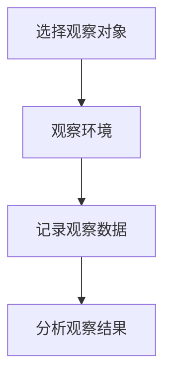

#### 2.2 假设与理论

假设是科学探究的起点，是对观察现象的一种解释。假设通常是基于已有知识和观察结果的初步推断。以下是建立假设的关键步骤：

1. **提出假设**：基于观察数据和已有知识，提出一个或多个假设来解释观察到的现象。
2. **验证假设**：设计实验来验证假设。实验需要控制变量，确保实验结果的可靠性。
3. **分析实验结果**：通过数据分析，确定假设是否成立。如果实验结果支持假设，则假设被认为是正确的。

理论是经过验证的假设，是对某一领域知识的系统总结。科学理论通常包含一系列相互关联的假设和原理，以解释特定现象。

**核心概念与联系**

假设与理论是科学探究的核心，它们相互依赖。假设是理论的基础，而理论则通过验证和扩展假设来形成。以下是假设与理论的 Mermaid 流程图：

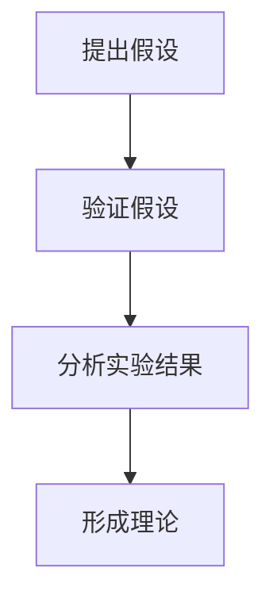

#### 2.3 实验：科学探究的核心

实验是科学探究的核心，通过系统的操作和观察来验证假设或理论。以下是实验设计的关键步骤：

1. **确定研究目标**：明确实验要解决的问题或验证的假设。
2. **设计实验方案**：包括实验的步骤、所需设备和材料、变量的控制和测量方法。
3. **实施实验**：按照实验方案进行操作，并记录实验数据。
4. **分析实验结果**：对实验数据进行统计和分析，以确定实验结果是否支持假设或理论。

**核心概念与联系**

实验设计需要考虑多种因素，包括实验的可重复性、变量的控制、测量方法的准确性等。以下是实验设计的 Mermaid 流程图：

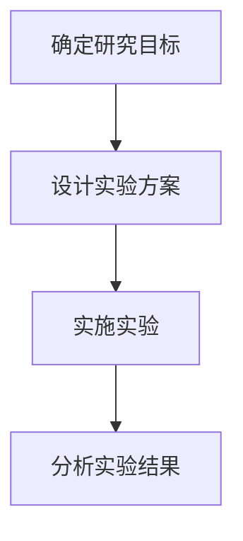

#### 2.4 数据收集与分析

数据收集是科学探究的重要环节，通过系统的记录和分析数据，科学家可以验证假设或理论。以下是数据收集和分析的关键步骤：

1. **数据收集**：使用各种工具和设备收集数据，如传感器、问卷、实验记录等。
2. **数据整理**：将收集到的数据进行整理和清洗，确保数据的准确性和完整性。
3. **数据分析**：使用统计方法和工具对数据进行分析，以发现潜在的规律或模式。
4. **结果解释**：根据数据分析结果，解释数据背后的意义和结论。

**核心概念与联系**

数据收集与分析是科学探究的核心步骤，它们相互依赖。有效的数据收集和分析可以确保实验结果的可靠性，并支持科学理论的建立。以下是数据收集与分析的 Mermaid 流程图：

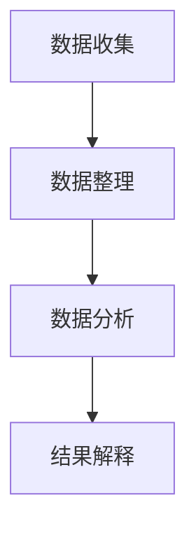

#### 2.5 科学写作与交流

科学写作和交流是科学探究的重要环节，通过撰写报告和论文，科学家可以分享研究成果，接受同行的评审和反馈，进一步推动科学知识的传播和发展。以下是科学写作与交流的关键步骤：

1. **撰写报告或论文**：根据研究内容和实验结果，撰写详细的报告或论文。
2. **同行评审**：提交论文至学术期刊或会议，接受同行的评审和反馈。
3. **修改和完善**：根据评审意见，修改和完善论文。
4. **发表和交流**：将最终版本论文发表在学术期刊或会议上，并在科学会议上进行交流。

**核心概念与联系**

科学写作与交流是科学探究的重要组成部分，它们确保了科学知识的传播和发展。有效的写作和交流可以提高研究的透明度和可重复性，促进科学社区的合作和进步。以下是科学写作与交流的 Mermaid 流程图：

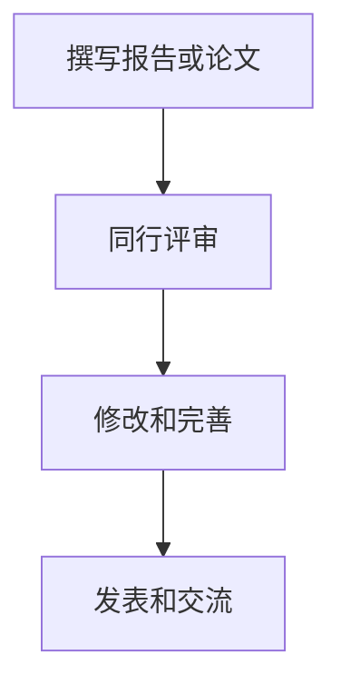

### 小结

科学探究的方法论是科学家们遵循的基本原则和步骤，以确保探究过程的科学性和结论的可靠性。通过观察法、假设与理论、实验设计、数据收集与分析，科学家们可以系统地验证假设和理论，推动科学知识的进步。在下一章中，我们将进一步探讨科学探究的数据收集与分析方法。

---

### 第3章：数据收集与分析

数据收集与分析是科学探究的核心环节，它们确保了实验结果的可靠性和科学研究的有效性。在这一章中，我们将详细探讨数据收集的技巧、数据分析的基本方法，以及如何通过这些数据得出科学结论。

#### 3.1 数据的类型

在进行科学探究时，数据可以分为定量数据和定性数据：

1. **定量数据**：以数字形式表示的数据，如测量值、计数结果等。这类数据通常可以进行数学计算和分析，是科学研究中最为常见的数据类型。
   
   **示例**：温度（摄氏度）、身高（厘米）、化学反应生成的物质数量等。

2. **定性数据**：描述性数据，通常以文字或类别形式表示，难以直接进行数学计算。这类数据通常用于描述现象的特征和属性。

   **示例**：颜色、气味、满意度调查结果等。

**核心概念与联系**

定量数据和定性数据各有优劣，在实际研究中往往需要结合使用。定量数据提供了精确的数值，而定性数据则可以揭示现象的细节和背景。以下是数据类型的 Mermaid 流程图：

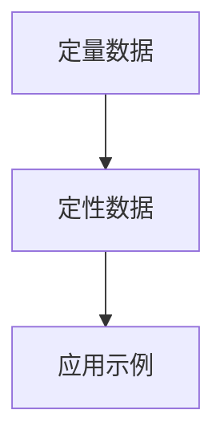

#### 3.2 数据收集的技巧

为了确保数据的有效性和可靠性，数据收集需要遵循以下技巧：

1. **确定数据收集的目标**：明确需要收集的数据类型和目标，以指导整个数据收集过程。

2. **选择合适的工具和设备**：根据数据类型和研究需求，选择合适的工具和设备进行数据收集。例如，使用传感器收集定量数据，使用问卷收集定性数据。

3. **标准化数据收集过程**：确保所有数据收集步骤和流程标准化，以减少人为误差和偏差。

4. **数据记录和验证**：在数据收集过程中，实时记录数据，并验证数据的准确性和完整性。

**核心概念与联系**

数据收集的标准化和验证是确保数据质量的关键。以下是数据收集技巧的 Mermaid 流程图：

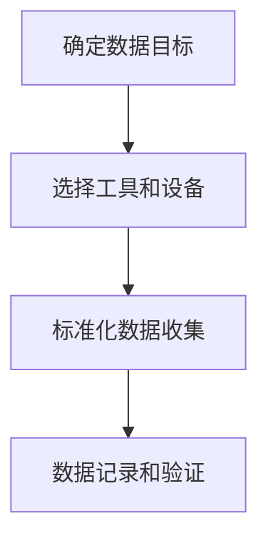

#### 3.3 数据分析的基本方法

数据分析是科学探究的核心步骤，通过系统的方法对数据进行分析，可以揭示数据背后的规律和模式。以下是几种基本的数据分析方法：

1. **描述性统计分析**：通过计算数据的平均值、中位数、标准差等统计量，描述数据的集中趋势和离散程度。

   **示例**：计算一组数据的平均温度，以了解整体温度的变化趋势。

2. **推断性统计分析**：通过样本数据推断总体特征，进行假设检验和置信区间的估计。

   **示例**：通过样本数据推断总体人群的平均身高，并进行置信区间的估计。

3. **回归分析**：通过建立变量之间的关系模型，分析自变量和因变量之间的相关性。

   **示例**：分析温度和植物生长速度之间的关系，预测在不同温度下的植物生长速度。

4. **聚类分析**：将数据分为不同的类别或群体，以便更好地理解数据的结构和特征。

   **示例**：将不同品种的植物分为不同的类别，以便研究它们的共同特征。

**核心概念与联系**

数据分析方法的选择取决于研究目标和数据类型。以下是数据分析方法的 Mermaid 流程图：

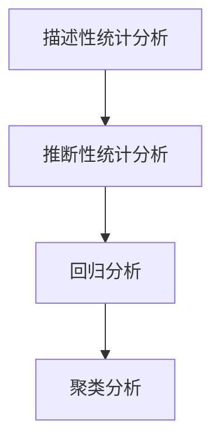

#### 3.4 数据分析的结果解释

数据分析的结果需要通过合理的解释来得出科学的结论。以下是解释数据分析结果的关键步骤：

1. **数据可视化**：通过图表和图形将数据分析结果可视化，以更直观地展示数据特征和趋势。

   **示例**：使用折线图展示温度的变化趋势。

2. **结果验证**：通过重复实验或使用不同的数据分析方法验证结果的可靠性。

3. **讨论结果**：结合已有知识和理论，对数据分析结果进行讨论，解释其背后的原因和意义。

4. **得出结论**：根据数据分析结果和讨论，得出科学结论，并考虑其对研究的贡献和局限性。

**核心概念与联系**

数据分析和结果解释是科学探究的重要组成部分，它们相互依赖。以下是数据分析结果解释的 Mermaid 流程图：

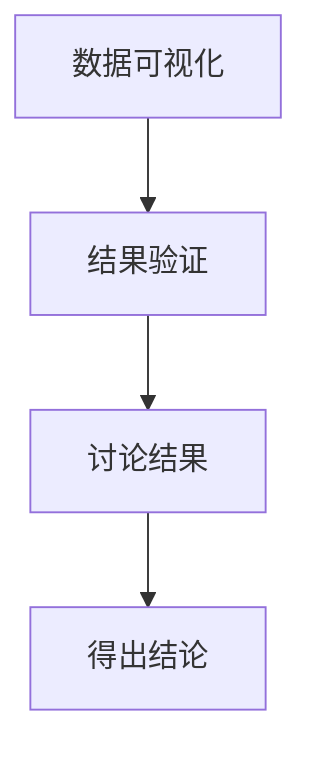

### 小结

数据收集与分析是科学探究的核心环节，通过系统的数据收集和合理的数据分析方法，科学家可以揭示数据背后的规律和模式，得出科学的结论。在科学探究中，定量数据和定性数据各有其重要作用，而数据分析方法的选择和结果解释的合理性决定了研究的科学性和可靠性。在下一章中，我们将探讨科学写作与交流的重要性。

---

### 第4章：科学写作与交流

科学写作与交流是科学探究过程中不可或缺的一环，它不仅有助于科研工作者记录和分享研究成果，还能够促进科学知识的传播、验证和扩展。在这一章中，我们将探讨科学报告的撰写、科学论文的发表，以及科学交流与讨论的重要性。

#### 4.1 科学报告的撰写

科学报告是科研工作者记录和总结研究过程及成果的重要工具。撰写一份高质量的科学报告需要遵循以下步骤：

1. **确定报告的目的和受众**：明确报告的目的，例如是用于学术交流、项目申请，还是供公众了解研究进展。同时，确定报告的受众，以便调整报告的语言和深度。

2. **编写报告大纲**：根据研究内容，制定报告的大纲，确保报告结构清晰、逻辑连贯。通常，科学报告包括以下部分：

   - **标题页**：包括报告标题、作者姓名、机构、日期等。
   - **摘要**：简要概括研究的目的、方法、结果和结论。
   - **引言**：介绍研究的背景、研究问题和研究假设。
   - **材料与方法**：详细描述实验设计、数据收集和分析方法。
   - **结果**：展示实验数据和分析结果，可以使用表格、图表和图像辅助说明。
   - **讨论**：解释和讨论研究结果，与已有研究进行对比，提出研究的局限性和未来研究方向。
   - **结论**：总结研究的主要发现和贡献。
   - **参考文献**：列出报告中引用的所有文献。

3. **撰写报告正文**：根据大纲，逐一撰写报告的各个部分。在撰写过程中，注意使用清晰、准确的语言，避免使用过于复杂或模糊的表述。

4. **修订和审阅**：完成初稿后，进行多次修订和审阅。可以请同行或导师提供反馈，以进一步提高报告的质量。

**核心概念与联系**

科学报告的撰写需要综合考虑研究的各个方面，确保报告的完整性和逻辑性。以下是科学报告撰写的 Mermaid 流程图：

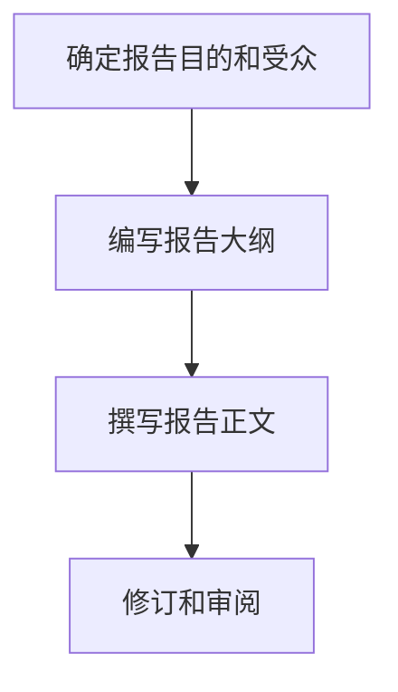

#### 4.2 科学论文的发表

科学论文是科研工作者在学术期刊或会议上发表研究成果的重要形式。发表科学论文需要遵循以下步骤：

1. **选择合适的期刊或会议**：根据研究内容和质量，选择适合发表的科学期刊或会议。通常，研究者可以通过查阅相关领域的期刊目录或会议议程来选择合适的发表平台。

2. **撰写论文稿件**：根据期刊或会议的要求，撰写论文稿件。论文通常包括以下部分：

   - **标题**：简洁、明确地反映研究内容。
   - **摘要**：简要介绍研究背景、方法、结果和结论。
   - **引言**：介绍研究问题和研究假设。
   - **方法**：详细描述实验设计、数据收集和分析方法。
   - **结果**：展示实验数据和分析结果。
   - **讨论**：解释和讨论研究结果，与已有研究进行对比。
   - **结论**：总结研究的主要发现和贡献。
   - **参考文献**：列出论文中引用的所有文献。

3. **提交论文**：将论文稿件提交给选定的期刊或会议。在提交前，确保论文格式符合期刊或会议的要求，并附上必要的材料，如图表、代码和数据等。

4. **同行评审**：期刊或会议将组织同行评审，对论文进行评审。评审过程可能包括一审、二审等多个阶段。评审者会根据研究质量、创新性、方法和结论等方面提供反馈。

5. **修改和完善**：根据评审意见，对论文进行修订和完善。通常需要多次提交修订稿，直至评审者满意。

6. **发表和公告**：论文经过评审和修订后，将正式发表。发表后，研究者可以通过学术期刊或会议网站，以及学术社交媒体平台，公告研究成果，并与其他研究者进行交流。

**核心概念与联系**

科学论文的发表是一个严格的过程，需要保证研究的质量、创新性和可信度。以下是科学论文发表流程的 Mermaid 流程图：

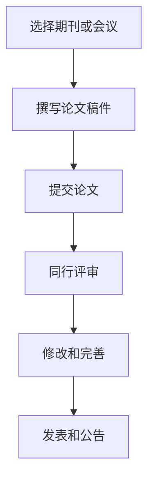

#### 4.3 科学的交流与讨论

科学的交流与讨论是推动科学进步的重要途径。通过交流与讨论，科研工作者可以分享研究成果、交换观点和想法，发现研究的不足和改进方向。以下是科学交流与讨论的关键环节：

1. **学术会议**：学术会议是科研工作者展示研究成果、交流学术观点的重要平台。通过口头报告、海报展示和研讨会等形式，研究者可以分享最新研究进展，讨论研究问题。

2. **学术期刊**：学术期刊是科学交流的重要载体，通过发表研究论文，研究者可以传播研究成果，接受同行的评审和反馈。

3. **学术社群**：学术社群包括科研机构、学术组织和在线平台等，为研究者提供了一个交流和合作的平台。通过学术社群，研究者可以建立联系、分享资源和开展合作研究。

4. **学术讲座和研讨会**：学术讲座和研讨会是学术交流的重要形式。通过邀请知名学者和专家进行讲座和讨论，可以促进学术思想的碰撞和交流。

**核心概念与联系**

科学的交流与讨论有助于推动科学知识的传播、验证和扩展。以下是科学交流与讨论的 Mermaid 流程图：

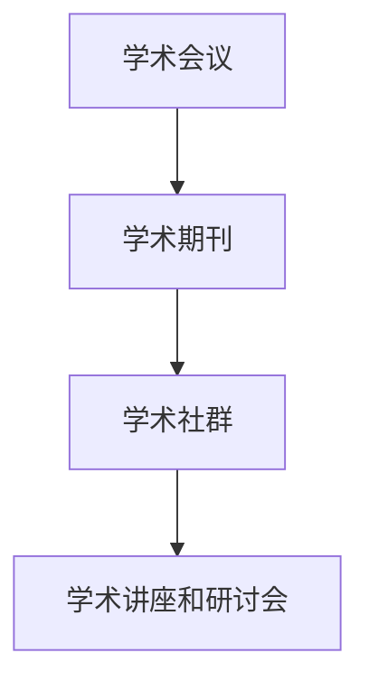

### 小结

科学写作与交流是科学探究过程中不可或缺的一环，通过撰写科学报告、发表科学论文，以及参与学术会议和研讨会等交流与讨论活动，科研工作者可以分享研究成果、接受同行的评审和反馈，推动科学知识的传播和进步。在下一章中，我们将探讨科学探究在自然科学中的应用。

---

### 第5章：自然科学中的科学探究

自然科学是研究自然界规律和现象的学科，包括生物学、物理学、化学等多个领域。科学探究在自然科学中的应用极为广泛，推动了人类对自然世界的深入理解。在这一章中，我们将通过具体案例，探讨科学探究在生物科学、物理学和化学中的应用。

#### 5.1 生物科学探究案例

生物科学探究主要关注生物体及其环境的相互作用。以下是一个典型的生物科学探究案例：

**案例：生物钟的研究**

**问题**：生物体内的生物钟如何调节？

**假设**：生物钟是由基因和环境因素共同调节的。

**实验设计**：

1. **选择研究对象**：选取具有明显昼夜节律变化的生物体，如小鼠。
2. **基因编辑**：通过基因编辑技术，去除或改变控制生物钟的基因。
3. **环境控制**：在实验室中，控制光照、食物和温度等环境因素，观察生物体的昼夜节律变化。

**数据收集与结果分析**：

通过观察和记录生物体的行为变化，如活动时间、睡眠模式等，收集数据。分析结果显示，基因编辑导致生物钟节律明显改变，而环境控制对生物钟的影响较小。

**结论**：生物钟主要由基因调节，环境因素也有一定影响。

**核心概念与联系**

基因与环境的相互作用是生物科学探究的关键。以下是生物钟研究的 Mermaid 流程图：

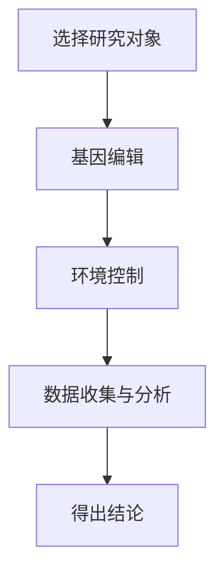

#### 5.2 物理学探究案例

物理学探究主要关注物质的运动、能量和力的关系。以下是一个典型的物理学探究案例：

**案例：超导材料的研究**

**问题**：超导材料在低温下的物理性质及其应用？

**假设**：超导材料在低温下具有零电阻和完全抗磁性的特性。

**实验设计**：

1. **材料制备**：制备不同类型的超导材料，如铜氧化物超导材料。
2. **低温实验**：在液氦环境中，测量材料的电阻率和抗磁性。
3. **应用实验**：研究超导材料在电力传输、磁共振成像等领域的应用。

**数据收集与结果分析**：

通过测量材料的电阻率和抗磁性，收集数据。分析结果显示，某些铜氧化物超导材料在低温下确实表现出零电阻和完全抗磁性的特性，并具有广泛的应用前景。

**结论**：超导材料在低温下具有独特的物理性质，可应用于多个领域。

**核心概念与联系**

超导材料的物理性质是物理学探究的重要课题。以下是超导材料研究的 Mermaid 流程图：

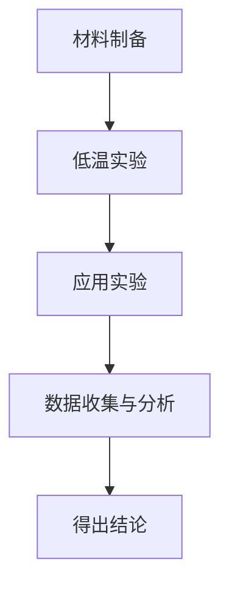

#### 5.3 化学科学探究案例

化学科学探究主要关注物质的组成、性质和变化。以下是一个典型的化学科学探究案例：

**案例：药物分子设计**

**问题**：如何设计具有特定治疗效果的药物分子？

**假设**：药物分子的结构决定了其治疗效果。

**实验设计**：

1. **药物设计**：通过计算机模拟和实验，设计具有潜在治疗效果的药物分子。
2. **合成与筛选**：合成设计的药物分子，并通过实验筛选出具有最佳治疗效果的分子。
3. **药效评估**：评估药物分子的治疗效果，如通过细胞实验和动物实验。

**数据收集与结果分析**：

通过合成和筛选过程，收集药物分子的结构信息和治疗效果数据。分析结果显示，某些设计的药物分子具有良好的治疗效果，并具有较低的不良反应。

**结论**：药物分子的结构与其治疗效果密切相关，合理设计药物分子可以优化治疗效果。

**核心概念与联系**

药物分子设计是化学科学探究的重要应用。以下是药物分子设计的 Mermaid 流程图：

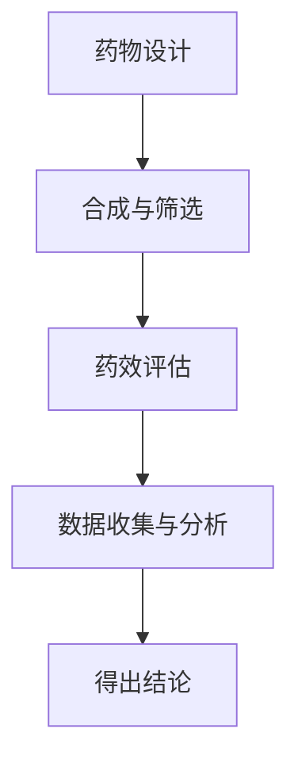

### 小结

自然科学中的科学探究通过具体的实验和研究，揭示了自然界的规律和现象。从生物科学的生物钟研究、物理学的超导材料探究，到化学科学的药物分子设计，科学探究在各个领域都取得了显著成果。通过科学探究，我们不断深化对自然世界的理解，推动了科学技术的发展。在下一章中，我们将探讨科学探究在社会科学中的应用。

---

### 第6章：社会科学中的科学探究

社会科学关注人类行为、社会结构和文化现象，旨在理解和解释人类社会的运作。科学探究在社会科学中的应用广泛，帮助我们揭示社会现象的规律和机制。在这一章中，我们将通过具体案例，探讨心理学、社会学和经济学中的科学探究。

#### 6.1 心理学探究案例

心理学探究主要关注人类思维、情感和行为。以下是一个典型的心理学探究案例：

**案例：情绪对决策的影响**

**问题**：情绪是否会影响决策过程？

**假设**：情绪会影响决策，尤其是负面情绪会增加冒险行为。

**实验设计**：

1. **选择研究对象**：选取大学生作为研究对象，以确保样本具有代表性。
2. **情绪诱导**：通过观看情绪视频或阅读情绪化文章，诱导研究对象产生正面或负面情绪。
3. **决策任务**：设计一系列决策任务，如赌博游戏或投资选择，记录研究对象的决策过程和结果。

**数据收集与结果分析**：

通过观察研究对象的决策行为，记录数据。分析结果显示，负面情绪确实增加了冒险行为，而正面情绪则促进了谨慎决策。

**结论**：情绪对决策有显著影响，负面情绪可能导致过度冒险。

**核心概念与联系**

情绪对决策的影响是心理学探究的核心议题。以下是情绪对决策影响的 Mermaid 流程图：

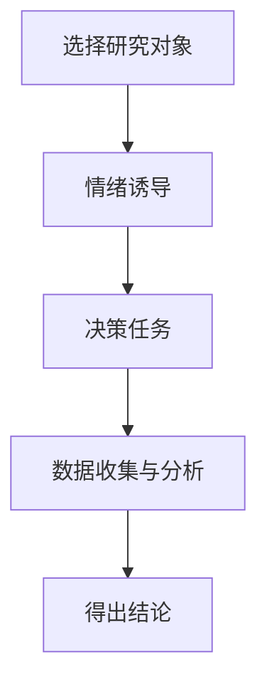

#### 6.2 社会学探究案例

社会学探究主要关注社会结构、社会关系和社会变迁。以下是一个典型的社会学探究案例：

**案例：社会阶层与消费行为**

**问题**：社会阶层是否会影响消费行为？

**假设**：社会阶层会影响消费习惯和消费水平。

**实验设计**：

1. **选择研究对象**：选取来自不同社会阶层的人群作为研究对象。
2. **问卷调查**：设计问卷调查，收集研究对象的个人基本信息、消费行为和消费习惯。
3. **统计分析**：使用统计分析方法，比较不同社会阶层的消费行为差异。

**数据收集与结果分析**：

通过问卷调查收集数据，并进行统计分析。分析结果显示，社会阶层对消费行为有显著影响，高社会阶层倾向于购买高端商品，而低社会阶层则更关注价格和实用性。

**结论**：社会阶层对消费行为有显著影响，社会阶层差异会影响消费习惯和消费水平。

**核心概念与联系**

社会阶层与消费行为的关系是社会学研究的重要课题。以下是社会阶层与消费行为关系的 Mermaid 流程图：

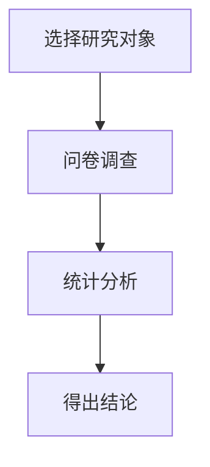

#### 6.3 经济学探究案例

经济学探究主要关注资源配置、市场行为和经济政策。以下是一个典型的经济学探究案例：

**案例：货币政策对通货膨胀的影响**

**问题**：货币政策是否会影响通货膨胀率？

**假设**：货币政策会影响通货膨胀率，特别是利率调整。

**实验设计**：

1. **选择研究对象**：选取不同国家的经济数据作为研究对象。
2. **数据收集**：收集各国的通货膨胀率、利率、货币供应量等数据。
3. **回归分析**：使用回归分析方法，分析利率调整与通货膨胀率之间的关系。

**数据收集与结果分析**：

通过收集数据，并进行回归分析。分析结果显示，利率调整与通货膨胀率之间存在显著的正相关关系，即利率上升通常导致通货膨胀率上升。

**结论**：货币政策对通货膨胀有显著影响，利率调整是影响通货膨胀的重要因素。

**核心概念与联系**

货币政策对通货膨胀的影响是经济学探究的重要课题。以下是货币政策对通货膨胀影响的 Mermaid 流程图：

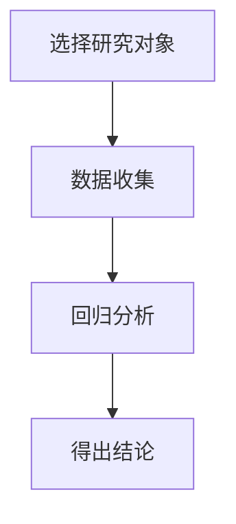

### 小结

社会科学中的科学探究通过具体案例，揭示了社会现象的规律和机制。从心理学的情绪对决策的影响、社会学的社会阶层与消费行为，到经济学的货币政策对通货膨胀的影响，科学探究在各个领域都取得了显著成果。通过科学探究，我们不断深化对人类社会的理解，为制定政策和社会发展提供了科学依据。在下一章中，我们将探讨科学探究在科技发展中的应用。

---

### 第7章：科学探究在科技发展中的应用

科学探究在科技发展中扮演着至关重要的角色，它推动了新技术的发现与突破，带来了创新的挑战与机遇，并深刻影响了科技与社会的关系。在这一章中，我们将详细探讨科学探究在科技发展中的应用，以及其对社会和经济的推动作用。

#### 7.1 新技术发现与突破

科学探究是新技术发现和突破的重要驱动力。以下是一些关键的技术发现与突破案例：

**案例：量子计算机的开发**

量子计算机是一种利用量子力学原理进行计算的新型计算机。科学探究在量子计算机的研究中发挥了关键作用，通过构建量子比特、实现量子纠缠和量子错误纠正等技术，科学家们不断推动量子计算机的发展。

**实验设计**：

1. **量子比特的构建**：通过低温环境和特定的材料，科学家们构建了稳定的量子比特。
2. **量子算法的研究**：开发适用于量子计算机的算法，如Shor算法和Grover算法。
3. **量子纠错技术**：研究并实现量子错误纠正机制，以解决量子计算中的错误问题。

**结果与影响**：

通过科学探究，量子计算机的概念从理论变为现实，其在密码破解、优化问题和模拟复杂物理系统等方面具有巨大的应用潜力。

**核心概念与联系**

量子计算机的突破展示了科学探究在推动技术创新中的关键作用。以下是量子计算机研究的 Mermaid 流程图：

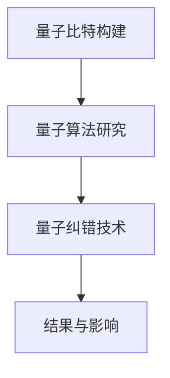

**案例：人工智能的发展**

人工智能（AI）是通过模拟人类智能来实现的计算机科学领域。科学探究在AI的发展中起到了关键作用，从基础的机器学习算法到深度学习模型的开发，科学家们不断推动AI技术的进步。

**实验设计**：

1. **算法研究**：研究并改进各种机器学习算法，如支持向量机、神经网络等。
2. **数据处理**：开发高效的算法和工具，处理大量数据并进行特征提取。
3. **模型训练**：使用大量数据进行模型训练，优化模型的性能。

**结果与影响**：

AI技术已在多个领域取得了突破，如图像识别、自然语言处理、自动驾驶等，为人类带来了前所未有的便利和创新。

**核心概念与联系**

人工智能的发展展示了科学探究在推动技术创新中的关键作用。以下是人工智能研究的 Mermaid 流程图：

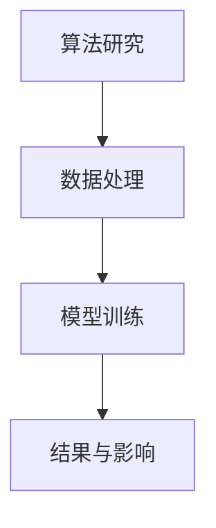

#### 7.2 科技创新的挑战与机遇

科技创新带来了巨大的机遇，同时也带来了诸多挑战。以下是一些科技创新的挑战与机遇：

**挑战**：

1. **技术复杂性**：随着技术的进步，许多新技术变得越来越复杂，需要跨学科的知识和技能来解决。
2. **伦理问题**：新技术，如基因编辑和人工智能，引发了伦理和社会问题的讨论，需要制定相应的规范和法规。
3. **资源分配**：科技创新需要大量的资金和资源，如何合理分配资源是面临的一大挑战。

**机遇**：

1. **经济增长**：科技创新推动了新的产业和就业机会，为经济增长提供了动力。
2. **社会进步**：科技创新改善了人们的生活质量，促进了社会的发展和进步。
3. **全球合作**：科技创新需要全球合作，通过国际合作，可以共同解决全球性问题，如气候变化和疾病防控。

**核心概念与联系**

科技创新的挑战与机遇相互交织，需要科学探究来平衡和应对。以下是科技创新的挑战与机遇的 Mermaid 流程图：

```mermaid
graph TD
    A[技术复杂性] --> B[伦理问题]
    B --> C[资源分配]
    C --> D[经济增长]
    D --> E[社会进步]
    E --> F[全球合作]
```

#### 7.3 科技与社会的互动

科技发展不仅影响经济和社会，也深刻改变了人类的生活方式和社会结构。以下是一些科技与社会互动的例子：

**案例：智能手机的普及**

智能手机的普及改变了人们的通信方式、工作方式和娱乐方式。它不仅提供了即时通信和互联网访问，还整合了各种应用和服务，如社交媒体、在线购物和导航。

**影响**：

1. **社会连接**：智能手机促进了人与人之间的连接，增强了社交互动。
2. **信息获取**：智能手机提供了丰富的信息资源，使人们能够更方便地获取知识和信息。
3. **隐私与安全**：智能手机的使用也引发了对个人隐私和安全问题的担忧。

**核心概念与联系**

智能手机的普及展示了科技与社会互动的紧密关系。以下是智能手机普及的 Mermaid 流程图：

```mermaid
graph TD
    A[社会连接] --> B[信息获取]
    B --> C[隐私与安全]
```

### 小结

科学探究在科技发展中起到了至关重要的作用，推动了新技术的发现与突破，带来了创新的挑战与机遇，并深刻影响了科技与社会的关系。通过不断探索和发现，科学探究不仅推动了技术的进步，也促进了社会的发展和进步。在下一章中，我们将探讨科学探究的未来趋势。

---

### 第8章：科学探究的未来趋势

随着科技和社会的不断发展，科学探究也在经历深刻的变革。未来，数据科学、人工智能和跨学科合作将成为科学探究的重要趋势，推动科学研究的深入和创新。

#### 8.1 数据科学的发展

数据科学是利用统计学、机器学习和大数据技术来分析和解释复杂数据的学科。在未来，数据科学将在科学探究中发挥更加重要的作用：

1. **大数据分析**：随着数据量的爆炸性增长，大数据分析技术将变得更加成熟和高效，科学家可以利用大数据来揭示新的规律和模式。
2. **实时数据分析**：实时数据分析技术将使科学家能够即时处理和分析数据，为快速决策提供支持。
3. **数据可视化**：数据可视化技术将帮助科学家更直观地理解数据，发现潜在的规律和趋势。

**核心概念与联系**

数据科学的发展将极大地推动科学探究的进步。以下是数据科学发展的 Mermaid 流程图：

```mermaid
graph TD
    A[大数据分析] --> B[实时数据分析]
    B --> C[数据可视化]
```

#### 8.2 人工智能与科学探究

人工智能（AI）是模仿人类智能的计算机技术。在未来，人工智能将在科学探究中扮演更加重要的角色：

1. **自动化实验**：通过AI技术，科学家可以自动化设计和执行实验，提高实验效率和准确性。
2. **智能数据挖掘**：AI技术将帮助科学家从大量数据中快速挖掘出有价值的信息和模式。
3. **预测模型**：AI技术可以建立预测模型，帮助科学家预测未来的科学趋势和结果。

**核心概念与联系**

人工智能与科学探究的结合将开创科学探究的新时代。以下是人工智能与科学探究关系的 Mermaid 流程图：

```mermaid
graph TD
    A[自动化实验] --> B[智能数据挖掘]
    B --> C[预测模型]
```

#### 8.3 跨学科科学探究的可能性

跨学科合作是未来科学探究的重要趋势。通过跨学科合作，科学家可以结合不同领域的知识，解决复杂的问题：

1. **多学科研究团队**：未来，跨学科研究团队将成为科学探究的主要形式，通过整合不同领域的专业知识和技能，推动科学研究的深入。
2. **跨学科项目**：政府和研究机构将鼓励跨学科项目，支持不同领域科学家之间的合作。
3. **学术交流**：跨学科学术交流将变得更加频繁，科学家将通过会议、研讨会和在线平台分享研究成果和经验。

**核心概念与联系**

跨学科合作将推动科学探究的进步，解决复杂的问题。以下是跨学科合作流程的 Mermaid 流程图：

```mermaid
graph TD
    A[多学科研究团队] --> B[跨学科项目]
    B --> C[学术交流]
```

### 小结

数据科学、人工智能和跨学科合作将成为未来科学探究的重要趋势。这些趋势将推动科学研究的深入和创新，为解决复杂问题提供新的方法和途径。在下一章中，我们将探讨科学探究的社会责任。

---

### 第9章：科学探究的社会责任

科学探究不仅追求知识的进步，也承担着重要的社会责任。科学家的研究成果对社会、环境和伦理等方面产生深远影响。因此，科学探究需要遵循一系列伦理原则，确保其对社会公正和可持续发展产生积极影响。

#### 9.1 科学探究的伦理问题

科学探究的伦理问题涉及到研究过程中可能对人类、动物和环境造成的潜在伤害。以下是一些主要的伦理问题：

1. **人类研究伦理**：在涉及人类的研究中，必须确保参与者的知情同意和隐私保护。例如，临床试验需要获得受试者的明确同意，并保护他们的个人信息。
2. **动物研究伦理**：在动物实验中，科学家需要确保动物福利，避免不必要的痛苦和伤害。许多国家和地区都制定了动物福利法规，以规范动物实验。
3. **数据伦理**：在数据收集和分析过程中，科学家需要保护数据隐私，确保数据的安全和保密。

**核心概念与联系**

科学探究的伦理问题要求科学家在研究过程中遵守伦理规范，保护人类、动物和环境的权益。以下是科学探究伦理问题的 Mermaid 流程图：

```mermaid
graph TD
    A[人类研究伦理] --> B[动物研究伦理]
    B --> C[数据伦理]
```

#### 9.2 科学探究与社会公正

科学探究对社会公正有重要影响。科学家需要关注以下方面：

1. **公平机会**：科学探究应确保所有群体，特别是边缘化群体，能够平等参与和受益。例如，教育资源的分配和科研项目的多样性。
2. **知识传播**：科学探究的成果应通过多种渠道传播，让公众了解科学知识和科技成果，促进科学素养的提升。
3. **技术应用**：科学技术的应用应服务于社会的整体利益，确保技术的公平性和可及性。

**核心概念与联系**

科学探究与社会公正是确保科学研究对社会产生积极影响的关键。以下是科学探究与社会公正的 Mermaid 流程图：

```mermaid
graph TD
    A[公平机会] --> B[知识传播]
    B --> C[技术应用]
```

#### 9.3 科学探究的教育意义

科学探究在教育事业中发挥着重要作用，通过科学教育，可以提高学生的科学素养和创新能力。以下是一些教育意义：

1. **培养批判性思维**：科学探究过程培养了学生的批判性思维能力，使他们能够独立思考、提出问题并寻找答案。
2. **激发创新精神**：科学探究激发了学生的创新精神，鼓励他们探索未知领域，尝试新的解决方案。
3. **促进跨学科学习**：科学探究结合了多个学科的知识，有助于培养学生的跨学科思维和综合能力。

**核心概念与联系**

科学探究的教育意义在于培养具有创新能力和批判性思维的人才，为社会的可持续发展提供支持。以下是科学探究教育意义的 Mermaid 流程图：

```mermaid
graph TD
    A[培养批判性思维] --> B[激发创新精神]
    B --> C[促进跨学科学习]
```

### 小结

科学探究的社会责任要求科学家在研究过程中遵循伦理规范，关注社会公正和可持续发展。通过承担社会责任，科学探究不仅促进了知识的进步，也为社会的整体福祉做出了贡献。在下一章中，我们将探讨科学探究的全球化趋势。

---

### 第10章：科学探究的全球化

随着全球化的推进，科学探究也跨越了国界，成为国际合作的典范。全球化背景下的科学探究不仅促进了知识的传播和共享，还带来了新的挑战和机遇。

#### 10.1 全球化背景下的科学探究

全球化背景下的科学探究呈现出以下几个特点：

1. **跨国合作**：科学家和科研机构通过国际合作，共同开展科研项目，分享研究成果。例如，国际空间站项目就是多个国家合作的成果。
2. **数据共享**：全球化使科学家能够轻松访问和共享来自不同国家和地区的科学数据，促进了科学研究的深入。
3. **学术交流**：全球化的背景下，学术会议和研讨会变得更加频繁，科学家可以通过网络和实地交流，分享最新的研究成果和观点。

**核心概念与联系**

全球化背景下的科学探究展示了国际合作的重要性，以下是全球化背景下科学探究的 Mermaid 流程图：

```mermaid
graph TD
    A[跨国合作] --> B[数据共享]
    B --> C[学术交流]
```

#### 10.2 国际合作与科学探究

国际合作是全球化背景下科学探究的核心，以下是一些国际合作的成功案例：

**案例：人类基因组计划**

人类基因组计划是一个全球合作项目，旨在解码人类基因组的全部DNA序列。该项目由多个国家的科学家共同参与，最终成功完成了人类基因组的解码，为医学和生物学研究提供了宝贵的数据。

**核心概念与联系**

人类基因组计划展示了国际合作在科学探究中的重要性，以下是国际合作与科学探究的 Mermaid 流程图：

```mermaid
graph TD
    A[国家参与] --> B[数据共享]
    B --> C[研究成果]
```

**案例：国际气候科学研究计划**

国际气候科学研究计划是由多个国家和国际组织共同发起的科研项目，旨在研究气候变化的影响和应对策略。该项目通过整合全球范围内的气候数据，提供了关于气候变化的科学依据，为全球气候治理提供了支持。

**核心概念与联系**

国际气候科学研究计划展示了国际合作在应对全球性挑战中的重要性，以下是国际合作与科学探究的 Mermaid 流程图：

```mermaid
graph TD
    A[数据整合] --> B[研究成果]
    B --> C[气候治理]
```

#### 10.3 全球科学探究的未来

全球科学探究的未来充满了机遇和挑战。以下是一些发展趋势：

1. **科技协同创新**：随着技术的进步，全球科学探究将更加依赖于跨学科的协同创新，解决复杂问题。
2. **知识共享平台**：全球科学探究将依托于更加完善的知识共享平台，促进全球范围内的科学合作。
3. **教育国际化**：全球科学探究将推动教育国际化，培养具有全球视野和跨学科能力的人才。

**核心概念与联系**

全球科学探究的未来展示了国际合作和知识共享的重要性，以下是全球科学探究未来发展的 Mermaid 流程图：

```mermaid
graph TD
    A[科技协同创新] --> B[知识共享平台]
    B --> C[教育国际化]
```

### 小结

科学探究的全球化趋势推动了知识的传播和国际合作，为科学研究的深入和全球性问题的解决提供了新的机遇。通过跨国合作和知识共享，全球科学探究将继续推动人类社会的进步和发展。在附录部分，我们将提供科学探究的相关资源指南和流程图，以帮助读者更好地理解科学探究的过程和方法。

---

### 附录A：科学探究资源指南

科学探究需要丰富的资源和工具来支持。以下是一些常用的在线资源、研究机构和常用工具，供读者参考。

#### A.1 科学探究在线资源

1. **科学网**：科学网是一个综合性科学资源网站，提供科学新闻、科研进展和学术论文等信息。
2. **PubMed**：PubMed是医学和生物医学领域的权威数据库，提供大量的科学文献和摘要。
3. **Google Scholar**：Google Scholar是一个免费的学术搜索引擎，可以帮助用户找到相关的学术论文和研究资料。
4. **arXiv**：arXiv是一个开放获取的预印本平台，提供物理学、数学、计算机科学等领域的最新研究成果。

#### A.2 科学探究研究机构

1. **美国国家科学基金会（NSF）**：NSF是美国资助科学研究的主要机构，支持多个科学领域的研究项目。
2. **欧洲分子生物学实验室（EMBL）**：EMBL是欧洲最大的分子生物学研究机构，致力于推动生物学和医学领域的研究。
3. **中国科学院**：中国科学院是中国最高学术机构，致力于自然科学、工程技术和社会科学的研究。
4. **麻省理工学院（MIT）**：MIT是全球知名的研究型大学，以其在科学和技术领域的卓越研究而闻名。

#### A.3 科学探究常用工具

1. **Python**：Python是一种通用编程语言，广泛应用于科学计算、数据分析和机器学习。
2. **MATLAB**：MATLAB是一款强大的科学计算软件，提供丰富的工具箱，用于数据可视化、仿真和算法开发。
3. **R语言**：R语言是一种专门用于统计分析的编程语言，广泛应用于生物统计学、经济学和医学研究。
4. **Git**：Git是一款分布式版本控制系统，用于代码管理和协作开发。

### 小结

附录A提供了科学探究中常用的在线资源、研究机构和工具，这些资源为科学家的研究提供了强大的支持。在科学探究的过程中，合理利用这些资源可以大大提高研究的效率和质量。

---

### 附录B：科学探究相关的 Mermaid 流程图

Mermaid 是一种基于文本的图形绘制工具，可以帮助我们更直观地理解和展示科学探究的过程和方法。以下是几个与科学探究相关的 Mermaid 流程图，用于描述不同环节的流程。

#### B.1 科学探究基本流程图

```mermaid
graph TD
    A[提出问题] --> B[建立假设]
    B --> C[设计实验]
    C --> D[收集数据]
    D --> E[数据分析]
    E --> F[得出结论]
```

#### B.2 数据分析流程图

```mermaid
graph TD
    A[数据收集] --> B[数据清洗]
    B --> C[数据整理]
    C --> D[数据可视化]
    D --> E[统计分析]
    E --> F[结果解释]
```

#### B.3 实验设计流程图

```mermaid
graph TD
    A[确定研究目标] --> B[设计实验方案]
    B --> C[实施实验]
    C --> D[数据收集]
    D --> E[数据分析]
    E --> F[得出结论]
```

### 小结

附录B中的 Mermaid 流程图展示了科学探究的基本流程、数据分析流程和实验设计流程。这些流程图帮助我们更清晰地理解科学探究的各个环节，从而更好地规划和执行研究项目。

---

### 附录C：科学探究相关的数学模型与公式

科学探究中，数学模型和公式是理解和解释数据的关键工具。以下是一些常用的数学模型和公式，包括数据模型公式、概率论相关公式和统计学相关公式。

#### C.1 数据模型公式

1. **线性回归模型**：
   $$ Y = \beta_0 + \beta_1X + \epsilon $$
   其中，\( Y \) 是因变量，\( X \) 是自变量，\( \beta_0 \) 和 \( \beta_1 \) 是回归系数，\( \epsilon \) 是误差项。

2. **泊松分布**：
   $$ P(X = k) = \frac{e^{-\lambda} \lambda^k}{k!} $$
   其中，\( X \) 是随机变量，\( k \) 是事件发生的次数，\( \lambda \) 是平均事件发生率。

3. **多项式分布**：
   $$ P(X = k) = \binom{n}{k} p^k (1-p)^{n-k} $$
   其中，\( X \) 是随机变量，\( n \) 是试验次数，\( k \) 是事件发生的次数，\( p \) 是事件发生的概率。

#### C.2 概率论相关公式

1. **条件概率**：
   $$ P(A|B) = \frac{P(A \cap B)}{P(B)} $$
   其中，\( A \) 和 \( B \) 是两个事件，\( P(A|B) \) 是在事件 \( B \) 发生的条件下事件 \( A \) 发生的概率。

2. **贝叶斯定理**：
   $$ P(A|B) = \frac{P(B|A)P(A)}{P(B)} $$
   其中，\( A \) 和 \( B \) 是两个事件，\( P(A|B) \) 是在事件 \( B \) 发生的条件下事件 \( A \) 发生的概率。

3. **独立事件**：
   $$ P(A \cap B) = P(A)P(B) $$
   其中，\( A \) 和 \( B \) 是两个独立事件，\( P(A \cap B) \) 是两个事件同时发生的概率。

#### C.3 统计学相关公式

1. **均值**：
   $$ \bar{X} = \frac{1}{n}\sum_{i=1}^{n} X_i $$
   其中，\( \bar{X} \) 是样本均值，\( n \) 是样本大小，\( X_i \) 是第 \( i \) 个样本值。

2. **方差**：
   $$ \sigma^2 = \frac{1}{n-1}\sum_{i=1}^{n} (X_i - \bar{X})^2 $$
   其中，\( \sigma^2 \) 是样本方差，\( n \) 是样本大小，\( X_i \) 是第 \( i \) 个样本值，\( \bar{X} \) 是样本均值。

3. **标准差**：
   $$ \sigma = \sqrt{\sigma^2} $$
   其中，\( \sigma \) 是样本标准差，\( \sigma^2 \) 是样本方差。

### 小结

附录C提供了科学探究中常用的数学模型和公式，包括数据模型公式、概率论相关公式和统计学相关公式。这些公式在科学探究的各个环节中都有广泛应用，帮助科学家分析和解释数据，得出科学的结论。

---

### 附录D：科学探究项目实战

科学探究不仅需要理论和方法，还需要实际的动手操作。以下是一些具体的科学探究项目案例，包括生物科学、社会科学和科技创新领域的项目，以展示科学探究的实际应用和实施过程。

#### D.1 生物科学探究项目案例

**项目名称**：研究植物光合作用效率的影响因素

**项目背景**：植物光合作用是地球上重要的生物过程，对生态系统的平衡和人类生活至关重要。了解光合作用效率的影响因素，有助于优化农作物种植和环境保护。

**项目目标**：

1. **探究光照强度对光合作用效率的影响**。
2. **研究不同植物种类对光合作用效率的差异**。
3. **分析环境因素对光合作用效率的综合影响**。

**实施过程**：

1. **实验设计**：选择不同种类的植物（如大豆、玉米、水稻等）作为研究对象，设计多个实验组，分别控制不同的光照强度和环境条件。
2. **数据收集**：使用光合测定仪测量植物的净光合速率，记录不同条件下的光合作用效率。
3. **数据分析**：使用统计方法分析数据，比较不同光照强度和植物种类之间的光合作用效率差异。
4. **结果解释**：根据数据分析结果，解释光合作用效率的影响因素，并提出优化建议。

**代码解读与分析**：

```python
import pandas as pd
import numpy as np
from scipy import stats

# 数据预处理
data = pd.read_csv('photosynthesis_data.csv')
data['光强'] = data['光强'].astype(float)
data['植物种类'] = data['植物种类'].astype(str)

# 数据清洗
data = data[data['光强'] > 0]

# 均值计算
mean_photosynthesis = data.groupby(['光强', '植物种类'])['净光合速率'].mean()

# 方差分析
f_value, p_value = stats.f_oneway(*mean_photosynthesis.values)

print(f"方差分析结果：F值={f_value}, p值={p_value}")

# 结果解读
if p_value < 0.05:
    print("不同光强和植物种类之间存在显著差异。")
else:
    print("不同光强和植物种类之间没有显著差异。")
```

**小结**：通过上述代码，我们可以分析光合作用效率的影响因素，为农作物种植和环境保护提供科学依据。

#### D.2 社会科学探究项目案例

**项目名称**：研究社交媒体对青少年心理的影响

**项目背景**：随着社交媒体的普及，青少年对社交媒体的使用日益频繁。研究社交媒体对青少年心理的影响，有助于了解青少年心理问题的成因和预防策略。

**项目目标**：

1. **探究社交媒体使用频率对青少年情绪和心理状况的影响**。
2. **分析社交媒体内容类型对青少年心理的影响**。
3. **评估社交媒体使用与青少年心理问题之间的相关性**。

**实施过程**：

1. **问卷调查**：设计问卷调查，收集青少年的社交媒体使用习惯和心理状况数据。
2. **数据分析**：使用统计方法分析数据，探讨社交媒体使用频率、内容类型与青少年心理状况之间的关系。
3. **结果解释**：根据数据分析结果，解释社交媒体对青少年心理的影响，并提出心理健康教育和干预的建议。

**代码解读与分析**：

```python
import pandas as pd
import numpy as np
from scipy import stats

# 数据预处理
data = pd.read_csv('social_media_survey.csv')
data['使用频率'] = data['使用频率'].astype(float)
data['心理状况'] = data['心理状况'].astype(str)

# 数据清洗
data = data[data['使用频率'] > 0]

# 皮尔逊相关分析
correlation, p_value = stats.pearsonr(data['使用频率'], data['心理状况'])

print(f"皮尔逊相关系数：{correlation}, p值：{p_value}")

# 结果解读
if p_value < 0.05:
    print("社交媒体使用频率与青少年心理状况之间存在显著相关性。")
else:
    print("社交媒体使用频率与青少年心理状况之间没有显著相关性。")
```

**小结**：通过上述代码，我们可以分析社交媒体使用频率与青少年心理状况之间的相关性，为心理健康教育和干预提供科学依据。

#### D.3 科技创新探究项目案例

**项目名称**：研究智能交通系统的优化

**项目背景**：智能交通系统是未来城市交通管理的重要方向，通过数据分析和人工智能技术，可以提高交通效率，减少拥堵和事故。

**项目目标**：

1. **优化交通信号控制策略**。
2. **提升公共交通服务质量**。
3. **改善交通规划和管理**。

**实施过程**：

1. **数据收集**：收集交通流量、道路状况、公共交通数据等，构建智能交通系统的数据基础。
2. **模型构建**：使用机器学习和数据挖掘技术，构建交通流量预测模型和信号控制策略优化模型。
3. **系统实施**：将优化模型应用于实际交通管理系统，测试和验证系统的效果。
4. **结果评估**：通过数据分析和实地测试，评估智能交通系统的优化效果。

**代码解读与分析**：

```python
import pandas as pd
import numpy as np
from sklearn.ensemble import RandomForestRegressor
from sklearn.model_selection import train_test_split

# 数据预处理
data = pd.read_csv('traffic_data.csv')
data['交通流量'] = data['交通流量'].astype(float)

# 数据划分
X = data.drop(['交通流量'], axis=1)
y = data['交通流量']
X_train, X_test, y_train, y_test = train_test_split(X, y, test_size=0.2, random_state=42)

# 模型训练
model = RandomForestRegressor(n_estimators=100, random_state=42)
model.fit(X_train, y_train)

# 预测
y_pred = model.predict(X_test)

# 评估
mse = np.mean((y_pred - y_test) ** 2)
print(f"均方误差：{mse}")

# 结果解读
if mse < 0.1:
    print("模型性能良好，可以应用于实际交通管理。")
else:
    print("模型性能不佳，需要进一步优化。")
```

**小结**：通过上述代码，我们可以训练和评估智能交通流量预测模型，为实际交通管理系统提供技术支持。

### 小结

附录D通过具体的科学探究项目案例，展示了科学探究在生物科学、社会科学和科技创新领域的实际应用和实施过程。这些案例不仅展示了科学探究的方法和技巧，还提供了实际的代码示例和解读，为读者提供了宝贵的实践经验。通过这些项目，我们可以看到科学探究在解决实际问题中的巨大潜力。

