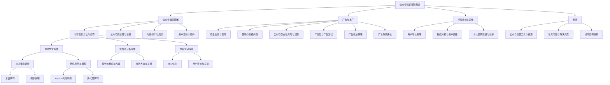

                 

# 文章标题：程序员如何利用公众号进行知识变现

> 关键词：公众号，知识变现，程序员，内容创作，广告与推广，商业合作

> 摘要：本文旨在探讨程序员如何利用微信公众号这一平台进行知识变现。文章将详细解析公众号知识变现的概述、公众号运营基础、内容创作方法与技巧、技术文章写作、报告与分析写作、广告与推广、商业合作与变现以及持续成长与优化等方面的内容。通过逐步分析，帮助程序员更好地理解和实践公众号知识变现的过程。

## 第一部分：知识变现概述

### 1.1 公众号知识变现概述

#### 公众号知识变现的定义

公众号知识变现是指通过微信公众号这一平台，将个人的知识、技能、经验等转化为经济收益的过程。具体来说，就是通过撰写技术文章、发布视频教程、进行在线咨询等方式，吸引粉丝关注，进而通过广告、赞助、付费内容等形式实现收入。

#### 公众号知识变现的优势

1. **低成本**：公众号注册和运营成本相对较低，适合广大程序员进行知识变现。
2. **高曝光**：微信公众号拥有广泛的用户基础，可以快速提高个人知名度。
3. **多样化**：公众号支持多种内容形式，如文字、图片、视频等，有利于程序员展示自己的多样化技能。
4. **持续收益**：通过公众号积累的粉丝和影响力，程序员可以持续获得广告收入和付费内容收益。

#### 程序员在公众号知识变现中的角色

1. **内容创作者**：程序员可以利用自己的技术背景，撰写高质量的技术文章，提供专业的技术见解。
2. **知识分享者**：程序员可以通过公众号分享自己的学习经验和技术心得，帮助他人提高技能。
3. **商业合作者**：程序员可以与相关企业合作，进行广告投放、赞助等商业活动，实现知识变现。

### 1.2 公众号知识变现的生态

#### 公众号平台的规则与特点

1. **平台规则**：公众号平台有严格的发布审核机制，确保内容质量。
2. **平台特点**：公众号支持多种内容形式，包括文字、图片、视频等，便于程序员展示自己的多样化技能。

#### 内容创作者的生态角色

1. **内容生产者**：程序员作为内容创作者，负责生产高质量的技术文章、视频教程等。
2. **用户引导者**：程序员通过内容引导，吸引粉丝关注，提高公众号影响力。
3. **商业合作者**：程序员可以与相关企业合作，实现知识变现。

#### 广告和商业合作模式

1. **广告收入**：通过公众号平台投放广告，根据广告展示量或点击量获取收益。
2. **赞助收入**：与相关企业合作，进行品牌推广或产品宣传，获取赞助费用。
3. **付费内容**：提供高质量的技术教程或咨询服务，向用户收取费用。

### 1.3 程序员在公众号知识变现中的角色

1. **内容创作者**：程序员可以利用自己的技术背景，撰写高质量的技术文章，提供专业的技术见解。
2. **知识分享者**：程序员可以通过公众号分享自己的学习经验和技术心得，帮助他人提高技能。
3. **商业合作者**：程序员可以与相关企业合作，进行广告投放、赞助等商业活动，实现知识变现。

## 第二部分：公众号运营基础

### 2.1 公众号的注册与设置

#### 注册流程

1. 访问公众号平台官网，点击“立即注册”。
2. 选择注册类型（订阅号或服务号），并填写相关信息。
3. 验证手机号码，并完成注册。

#### 基本设置

1. **头像和名字**：设置公众号头像和名字，以便用户识别。
2. **功能介绍**：简要介绍公众号的功能和定位。
3. **联系方式**：添加公众号的联系方式，如邮箱、电话等。

### 2.2 内容创作与规划

#### 内容创作原则

1. **针对性**：根据目标用户的需求，提供有价值的内容。
2. **专业性**：确保内容的专业性和准确性，提高可信度。
3. **原创性**：尽量原创，避免抄袭，保护知识产权。

#### 内容规划与发布

1. **内容规划**：制定内容发布计划，包括发布时间、频率和主题。
2. **内容发布**：定期发布高质量内容，与用户保持互动。

### 2.3 用户互动与维护

#### 用户互动策略

1. **回复评论**：及时回复用户评论，增加互动。
2. **开展活动**：定期举办活动，如问答、抽奖等，提高用户参与度。

#### 用户分类与维护

1. **用户分类**：根据用户行为和需求，将用户分为不同类别。
2. **用户维护**：针对不同类别的用户，提供个性化的服务和内容。

## 第二部分：公众号内容创作

### 第3章：内容创作方法与技巧

#### 3.1 内容类型选择

1. **技术文章**：适合程序员分享技术心得、案例解析等。
2. **报告与分析**：适合发布行业报告、数据分析等。
3. **视频教程**：适合讲解复杂的技术知识点，提高用户学习效果。

#### 3.2 内容创作流程

##### 研究与选题

1. **关注热点**：关注行业热点，选择热门话题。
2. **用户需求**：了解用户需求，提供有价值的内容。

##### 内容创作工具

1. **文本编辑器**：如Markdown编辑器，便于撰写和排版。
2. **图片处理工具**：如Photoshop，用于编辑图片。
3. **视频剪辑工具**：如Adobe Premiere，用于剪辑和制作视频。

##### 编辑与校对

1. **内容编辑**：对文章进行结构调整、内容补充等。
2. **校对**：检查文章中的语法错误、拼写错误等。

#### 3.3 内容营销策略

##### SEO优化

1. **关键词选择**：选择与文章主题相关的高搜索量关键词。
2. **关键词布局**：在文章中合理布局关键词，提高搜索排名。

##### 用户评论与互动

1. **鼓励评论**：鼓励用户在文章下方评论，增加互动。
2. **回复评论**：及时回复用户评论，增加用户粘性。

### 第4章：技术文章写作

#### 4.1 技术文章的结构与风格

##### 标题党与实际内容

1. **标题党**：避免使用夸张、不实的标题，确保标题与实际内容相符。
2. **实际内容**：确保文章内容充实、有价值，满足用户需求。

##### 结构清晰，逻辑严密

1. **引言**：简要介绍文章主题和目的。
2. **正文**：按照逻辑顺序，逐步展开论述。
3. **结论**：总结文章要点，给出建议或展望。

#### 4.2 技术概念讲解

##### 术语解释

1. **术语**：明确文章中涉及的专业术语，避免用户困惑。
2. **解释**：对术语进行详细解释，帮助用户理解。

##### 例子说明

1. **例子**：通过实际案例，说明技术概念的应用。
2. **分析**：对例子进行深入分析，展示技术原理。

#### 4.3 代码示例与解释

##### Python代码示例

1. **示例**：提供Python代码示例，展示技术实现。
2. **注释**：对代码进行注释，说明代码功能。

##### 伪代码解释

1. **伪代码**：提供伪代码，展示算法框架。
2. **解释**：对伪代码进行详细解释，说明算法原理。

### 第5章：报告与分析写作

#### 5.1 报告的格式与内容

##### 文字内容

1. **引言**：简要介绍报告主题和目的。
2. **正文**：按照逻辑顺序，逐步展开论述。
3. **结论**：总结报告要点，给出建议或展望。

##### 数据可视化

1. **图表**：使用图表展示数据，提高报告的可读性。
2. **注释**：对图表进行注释，解释数据含义。

#### 5.2 分析方法与工具

##### 统计学基础

1. **描述性统计**：使用均值、中位数等指标描述数据特征。
2. **推断性统计**：使用假设检验等方法，分析数据差异。

##### 数据分析工具

1. **Excel**：用于数据清洗、整理和分析。
2. **Python**：用于复杂数据分析，如机器学习等。

#### 5.3 报告撰写与发布

1. **撰写**：按照报告格式，撰写报告内容。
2. **修改**：多次修改，确保报告内容准确、完整。
3. **发布**：通过公众号或其他渠道，发布报告内容。

## 第三部分：公众号商业变现

### 第6章：广告与推广

#### 6.1 广告位与广告形式

##### 广告位介绍

1. **文章顶部**：在文章顶部展示广告。
2. **文章底部**：在文章底部展示广告。
3. **文章内嵌**：在文章内容中嵌入广告。

##### 广告形式分析

1. **图片广告**：展示图片广告，吸引用户点击。
2. **视频广告**：播放视频广告，提高用户关注度。
3. **文字广告**：展示文字广告，简洁明了。

#### 6.2 广告投放策略

##### 定位目标用户

1. **用户画像**：分析用户特征，定位目标用户。
2. **广告内容**：根据目标用户需求，提供有价值的内容。

##### 营销策略制定

1. **广告投放时间**：选择用户活跃时间，提高广告曝光率。
2. **广告投放频率**：合理控制广告投放频率，避免用户反感。

#### 6.3 广告效果评估

1. **点击量**：统计广告点击量，评估广告效果。
2. **转化率**：统计广告带来的转化率，评估广告收益。

### 第7章：商业合作与变现

#### 7.1 商业合作模式

##### 独立品牌合作

1. **品牌推广**：与品牌方合作，推广品牌产品。
2. **产品销售**：与品牌方合作，销售产品。

##### 联合推广

1. **内容合作**：与其他公众号或平台合作，共同推广内容。
2. **活动合作**：与品牌方或其他公众号合作，举办活动。

#### 7.2 赞助与付费内容

##### 赞助内容

1. **广告赞助**：品牌方提供广告赞助，公众号提供广告位。
2. **内容赞助**：品牌方提供内容赞助，公众号发布相关内容。

##### 付费内容

1. **付费专栏**：提供高质量的技术专栏，向用户收取费用。
2. **在线咨询**：提供在线咨询服务，向用户收取费用。

#### 7.3 公众号商业化风险与规避

1. **内容风险**：确保内容合规，避免违规内容。
2. **用户风险**：关注用户反馈，避免用户流失。
3. **法律风险**：了解相关法律法规，避免法律纠纷。

## 第四部分：持续成长与优化

### 第8章：用户增长策略

#### 8.1 内容优化

1. **选题优化**：关注用户需求，选择热门话题。
2. **内容质量**：提高内容质量，满足用户需求。

#### 8.2 用户增长工具

1. **SEO优化**：优化文章标题、关键词等，提高搜索排名。
2. **社交媒体推广**：利用社交媒体平台，扩大公众号影响力。

### 8.3 数据分析与用户画像

#### 数据分析工具

1. **微信公众号后台数据**：分析公众号后台数据，了解用户行为。
2. **第三方数据分析工具**：如百度统计、谷歌分析等。

#### 用户画像构建

1. **用户特征**：分析用户年龄、性别、地域等特征。
2. **用户需求**：了解用户需求，提供有价值的内容。

### 8.4 个人品牌建设与维护

#### 个人品牌建设

1. **专业形象**：树立专业形象，提高个人知名度。
2. **持续输出**：保持内容输出，建立个人品牌。

#### 个人品牌维护

1. **互动与反馈**：与用户保持互动，关注用户反馈。
2. **内容更新**：定期更新内容，保持活跃度。

## 附录

### 附录 A：公众号运营工具与资源

1. **内容创作工具**：Markdown编辑器、Photoshop、Adobe Premiere等。
2. **数据分析工具**：微信公众号后台数据、百度统计、谷歌分析等。
3. **广告投放平台**：广点通、朋友圈广告等。

### 附录 B：常见问题与解决方案

1. **注册与认证问题**：了解注册流程和认证要求，按要求操作。
2. **内容发布与审核问题**：熟悉平台规则，遵守相关规定。
3. **广告与商业合作问题**：了解合作模式，合理规划广告投放。

### 附录 C：成功案例解析

1. **成功案例介绍**：介绍公众号的成功案例，分析成功原因。
2. **案例分析与启示**：从成功案例中汲取经验，为自身公众号运营提供启示。

## Mermaid 流程图

## 作者

作者：AI天才研究院/AI Genius Institute & 禅与计算机程序设计艺术 /Zen And The Art of Computer Programming

[END] 

