                 

### 文章标题：《程序员如何将工作经验转化为在线课程》

#### 关键词：
- 在线教育
- 程序员
- 经验转化
- 课程开发
- 教学策略

#### 摘要：
本文旨在为程序员提供一套系统化的方法，将他们的工作经验转化为高质量的在线课程。通过详细的步骤和案例分析，本文将探讨从确定课程目标，到整理工作经验，再到内容编排、教学策略制定、课程演示与录制、发布与推广，以及持续更新和优化的全过程。同时，文章还将分享一些成功的案例和经验，帮助程序员更好地理解和实践这一过程。

----------------------------------------------------------------

# 《程序员如何将工作经验转化为在线课程》

> 作者：AI天才研究院/AI Genius Institute & 禅与计算机程序设计艺术 /Zen And The Art of Computer Programming

在线教育已成为现代教育的趋势，越来越多的程序员希望通过分享自己的工作经验来创造价值。然而，如何有效地将工作经验转化为在线课程，并非易事。本文将引导程序员们一步一步地完成这一过程，从而打造出高质量的课程，为学习者提供有价值的内容。

## 第1章：确定课程目标与受众

在开始开发课程之前，明确课程目标与受众至关重要。这不仅能确保课程内容的针对性和有效性，还能提升学习者的满意度。

### 1.1 确定课程目标

#### 1.1.1 课程内容定位

课程内容定位是课程开发的第一步。明确课程将涵盖哪些主题和技术领域，确保课程内容的科学性和系统性。例如，如果你是一名后端开发工程师，可以考虑开发一门关于分布式系统的课程。

#### 1.1.2 课程受众分析

分析课程受众，了解他们的需求、知识背景和期望。这有助于你设计出符合受众需求的课程。例如，如果你的课程受众是初学者，那么你需要提供更多的基础知识，并使用简单的语言进行讲解。

### 1.2 设计课程大纲

设计课程大纲是确保课程内容系统化和结构化的关键。课程大纲应包含以下要素：

#### 1.2.1 课程结构规划

明确课程的模块和章节，确保内容有序组织。例如，你可以将课程分为基础篇、进阶篇和实战篇。

#### 1.2.2 教学目标细化

为每个章节设定具体的教学目标，确保学习者能够通过课程达到预期的学习效果。

## 第2章：整理和提炼工作经验

将工作经验转化为课程内容，需要对经验进行系统化的整理和提炼。以下是一些建议：

### 2.1 工作经验梳理

#### 2.1.1 个人技能总结

总结自己在工作中的技能，包括编程语言、框架、工具等。这有助于你确定课程中需要涵盖的技术点。

#### 2.1.2 项目经验筛选

筛选出具有代表性和教育意义的经验，以便在课程中分享。例如，你可以选择一个具有挑战性的项目，讲解其中的关键技术。

### 2.2 知识点提炼

#### 2.2.1 技能转化为知识点

将个人技能转化为具体的知识点，确保每个知识点都是可传授的。例如，将分布式系统的设计经验转化为具体的设计模式。

#### 2.2.2 知识点分类组织

对知识点进行分类和组织，确保课程内容逻辑清晰，便于学习者理解和掌握。

## 第3章：课程内容编排与优化

课程内容编排与优化是确保课程质量的关键。以下是一些建议：

### 3.1 内容编排原则

#### 3.1.1 教学顺序设计

设计合理的教学顺序，确保学习者能够循序渐进地掌握知识。例如，从基础到进阶，再到实战。

#### 3.1.2 内容模块化处理

将课程内容模块化，便于学习者按需学习。例如，将一个复杂的项目拆分为多个可独立学习的模块。

### 3.2 课程内容优化

#### 3.2.1 内容简洁明了

确保课程内容简洁明了，避免冗余和重复。例如，使用图表、示例代码等直观展示知识点。

#### 3.2.2 实用性提升

提升课程内容的实用性，确保学习者能够在实际工作中应用所学知识。例如，提供实际项目的案例分析。

## 第4章：制定教学策略与方法

教学策略与方法的制定是确保课程教学质量的关键。以下是一些建议：

### 4.1 教学策略制定

#### 4.1.1 互动式教学设计

设计互动式教学活动，提高学习者的参与度和积极性。例如，设置讨论区、问答环节等。

#### 4.1.2 评估与反馈机制

建立评估与反馈机制，及时了解学习者的学习进度和反馈，以便调整课程内容。例如，设置在线测试、问卷调查等。

### 4.2 教学方法选择

根据课程内容和受众特点选择合适的教学方法。以下是一些常用的教学方法：

#### 4.2.1 讲授法

讲授法适用于传授基础知识。例如，讲解编程语言的基本语法。

#### 4.2.2 演示法

演示法适用于展示技术实现。例如，演示一个分布式系统的部署过程。

#### 4.2.3 案例分析法

案例分析法适用于分析实际问题。例如，分析一个复杂项目的解决方案。

## 第5章：课程演示与录制

课程演示与录制是让学习者直观了解技术实现的过程。以下是一些建议：

### 5.1 课程演示技巧

#### 5.1.1 PPT制作要点

设计简洁明了的PPT，突出重点，使用图表、代码片段等辅助展示。

#### 5.1.2 演示中的人机交互

在演示过程中，与学习者进行互动，回答问题，确保学习者理解演示内容。

### 5.2 视频录制流程

#### 5.2.1 硬件设备选择

选择适合的硬件设备，如摄像头、麦克风等，确保视频和音频质量。

#### 5.2.2 录制与剪辑软件使用

使用专业的录制与剪辑软件，如OBS Studio、Adobe Premiere等，确保视频质量。

#### 5.2.3 视频质量优化

对录制好的视频进行剪辑、调色、降噪等处理，提升视频质量。

## 第6章：课程发布与推广

课程发布与推广是让课程走向市场的关键。以下是一些建议：

### 6.1 平台选择

根据课程特点和受众，选择合适的在线教育平台。例如，如果课程受众主要是程序员，可以考虑使用GitHub Education。

#### 6.1.1 自建平台与第三方平台比较

自建平台具有更高的自主性，但需要投入更多资源和精力。第三方平台用户基数大，但可能面临收益分配问题。

#### 6.1.2 平台功能与费用分析

分析不同平台的功能和费用，选择性价比最高的平台。

### 6.2 课程发布

#### 6.2.1 课程资料上传

将课程内容、PPT、视频等资料上传至平台，确保资料完整、清晰。

#### 6.2.2 课程页面设计与优化

设计吸引人的课程页面，包括课程简介、目录、讲师介绍等，提升课程吸引力。

### 6.3 课程推广

#### 6.3.1 社交媒体推广策略

利用社交媒体平台，如微博、微信公众号等，宣传课程，吸引潜在学员。

#### 6.3.2 内容营销与SEO优化

通过内容营销，如撰写技术博客、发布课程预告等，提高课程在搜索引擎中的排名。

## 第7章：课程运营与反馈

课程运营与反馈是确保课程长期发展的关键。以下是一些建议：

### 7.1 学员管理

#### 7.1.1 学员沟通渠道搭建

建立学员沟通渠道，如课程群、邮件列表等，及时回答学员问题。

#### 7.1.2 学员分组与跟踪

根据学员特点，进行分组和跟踪，确保每个学员都能得到充分的关注和指导。

### 7.2 反馈收集与分析

#### 7.2.1 学员反馈收集方法

通过问卷调查、在线测试等方式收集学员反馈，了解学员对课程的意见和建议。

#### 7.2.2 反馈分析与课程优化

分析学员反馈，找出课程中的不足，并进行优化，提升课程质量。

## 第8章：持续更新与优化

课程内容更新与优化是确保课程长期发展的关键。以下是一些建议：

### 8.1 课程内容更新

#### 8.1.1 行业动态追踪

关注行业动态，及时更新课程内容，确保课程与行业发展同步。

#### 8.1.2 学员需求调研

定期调研学员需求，根据学员反馈调整课程内容，提高课程实用性。

### 8.2 课程质量评估

#### 8.2.1 课程完成率分析

分析课程完成率，了解学员对课程的满意度，找出课程优化的方向。

#### 8.2.2 学员满意度调查

定期进行学员满意度调查，收集学员对课程的反馈，作为课程优化的依据。

## 第9章：案例分析与经验分享

通过案例分析，我们可以更好地理解如何将工作经验转化为在线课程。以下是一些建议：

### 9.1 成功案例分析

分析一些成功的在线课程案例，了解它们成功的原因，并从中学习经验。

#### 9.1.1 具体案例介绍

介绍一些具有代表性的成功案例，分析其课程内容、教学策略、推广方法等。

#### 9.1.2 案例成功因素分析

分析案例成功的关键因素，如课程内容的实用性、讲师的知名度、推广策略的有效性等。

### 9.2 经验分享与交流

分享自己的经验，与他人交流心得，共同提升在线课程开发能力。

#### 9.2.1 个人经验总结

总结自己在课程开发过程中的经验，分享遇到的问题和解决方案。

#### 9.2.2 学习交流社群建设

建立学习交流社群，促进讲师之间的交流与合作，共同进步。

## 第10章：未来发展趋势与展望

随着在线教育的不断发展，程序员将面临更多的机遇和挑战。以下是对未来发展趋势的展望：

### 10.1 在线教育市场趋势

分析在线教育市场的现状和发展趋势，了解未来市场的机遇和挑战。

#### 10.1.1 市场规模与增长预测

预测在线教育市场的规模和增长速度，了解未来市场的发展潜力。

#### 10.1.2 技术创新对在线教育的影响

探讨技术创新，如人工智能、虚拟现实等，对在线教育的影响，以及程序员应该如何应对。

### 10.2 程序员职业发展

展望程序员职业发展的前景，探讨程序员应该如何提升自己的跨界能力，以适应未来的发展。

#### 10.2.1 跨界能力提升

分析程序员在跨界方面需要掌握的技能和知识，提供提升跨界能力的建议。

#### 10.2.2 职业发展规划建议

为程序员提供职业发展规划建议，帮助他们制定适合自己的职业发展路线。

通过本文的详细探讨，我们相信程序员们可以更好地将工作经验转化为在线课程，为学习者提供有价值的内容，同时实现个人职业发展的新突破。让我们一起努力，为在线教育的发展贡献自己的力量。

----------------------------------------------------------------

## 第1章：确定课程目标与受众

### 1.1 确定课程目标

在开发在线课程之前，明确课程目标至关重要。这不仅是课程设计的起点，也是确保课程内容能够满足学习者需求的关键。以下步骤将帮助你确定课程目标：

#### 1.1.1 课程内容定位

首先，你需要明确课程将要涵盖的主题和内容。这将有助于你构建一个清晰的教学框架。例如，如果你是一名后端开发工程师，你可以考虑开发一门关于微服务架构的课程。

**Mermaid流程图：课程内容定位流程**

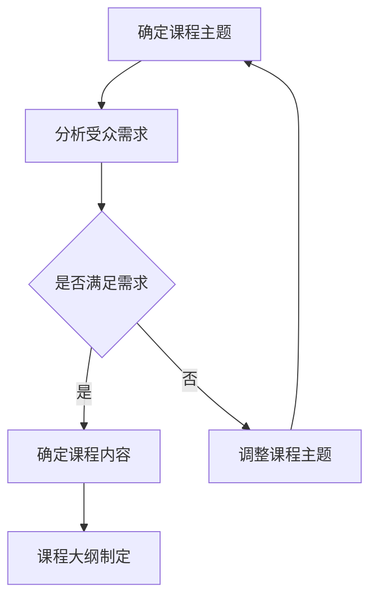

**伪代码：课程内容定位过程**

```python
def determine_course_content(theme, audience):
    content = analyze_audience_demand(audience)
    if content_satisfied_demand(content):
        define_course_content(theme, content)
    else:
        adjust_course_theme(theme, audience)
        determine_course_content(theme, audience)
```

#### 1.1.2 课程受众分析

了解你的受众是制定课程目标的关键。你需要分析他们的背景、知识水平和学习需求。这可以通过问卷调查、访谈等方式进行。以下是一个简单的受众分析流程：

**Mermaid流程图：课程受众分析流程**

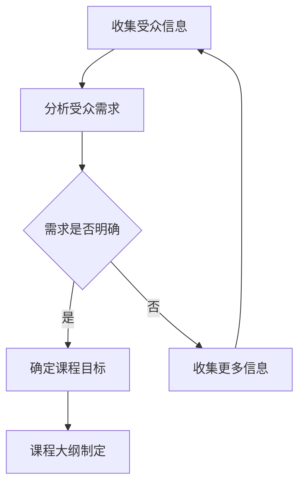

**伪代码：课程受众分析过程**

```python
def analyze_audience(audience):
    audience_info = collect_audience_data(audience)
    demands = extract_d demands(audience_info)
    if demands.clear():
        set_course_objectives(demands)
    else:
        collect_more_info(audience)
        analyze_audience(audience)
```

### 1.2 设计课程大纲

课程大纲是课程内容的结构化表示，它定义了课程中各个章节的主题、目标和内容。以下是设计课程大纲的步骤：

#### 1.2.1 课程结构规划

首先，你需要规划课程的整体结构。这包括确定课程的模块、章节和小节。以下是一个简单的课程结构规划流程：

**Mermaid流程图：课程结构规划流程**

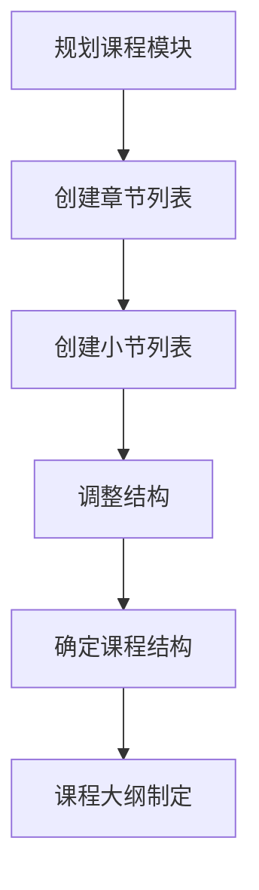

**伪代码：课程结构规划过程**

```python
def plan_course_structure(modules, chapters, sections):
    structure = structure_course(modules, chapters, sections)
    if structure_valid(structure):
        define_course_outline(structure)
    else:
        adjust_structure(structure)
        plan_course_structure(modules, chapters, sections)
```

#### 1.2.2 教学目标细化

在确定了课程结构后，你需要为每个章节设置具体的教学目标。这有助于确保课程内容的系统性和有效性。以下是一个简单的教学目标细化流程：

**Mermaid流程图：教学目标细化流程**

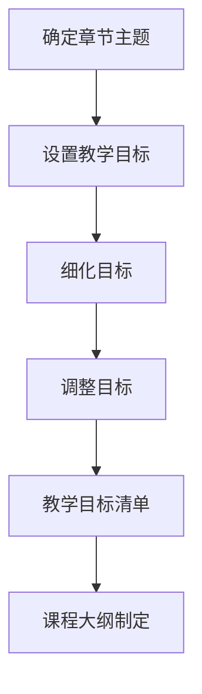

**伪代码：教学目标细化过程**

```python
def set_教学目标(sections):
    objectives = create_objectives(sections)
    for section in objectives:
        refine_objective(section)
        adjust_objective(section)
    define_course_outline(objectives)
```

通过以上步骤，你可以确保课程目标的明确性，为后续的课程开发奠定坚实的基础。

### 1.3 撰写课程大纲

在完成课程目标的确立和教学目标的细化后，你需要将所有的信息汇总成一份完整的课程大纲。以下是一个简单的课程大纲撰写流程：

#### 1.3.1 整理课程信息

首先，将所有的课程信息整理到一个文档中，包括课程目标、教学目标、章节结构等。

#### 1.3.2 确定大纲结构

根据整理的信息，确定大纲的结构。通常，一个课程大纲包括以下几个部分：

- **封面**：包括课程名称、讲师信息、课程编号等。
- **目录**：列出所有章节和小节的标题。
- **引言**：介绍课程的目标、受众和整体结构。
- **课程内容**：详细列出每个章节和小节的内容。
- **教学资源**：列出课程中使用的参考资料和工具。
- **附录**：提供额外的学习资源和参考文献。

#### 1.3.3 编写大纲文本

根据确定的大纲结构，编写大纲的文本部分。确保文本简洁明了，信息完整。

**示例：课程大纲文本**

```
课程名称：微服务架构实践

封面
----------------
课程名称：微服务架构实践
讲师：张三
课程编号：CS101

目录
----------------
引言
1. 微服务架构概述
2. 微服务设计原则
3. 微服务开发实践
4. 微服务部署与运维
5. 微服务案例分析

课程内容
----------------
引言
- 课程目标
- 受众
- 课程结构

1. 微服务架构概述
- 微服务的概念
- 微服务的优点和缺点

2. 微服务设计原则
- 服务拆分
- API设计
- 数据一致性

3. 微服务开发实践
- 技术选型
- 持续集成与部署

4. 微服务部署与运维
- 服务发现
- 负载均衡
- 服务监控

5. 微服务案例分析
- 具体案例介绍
- 成功因素分析

教学资源
----------------
- 参考资料
- 工具推荐

附录
----------------
- 常见问题解答
- 参考文献
```

通过以上步骤，你可以撰写出一份完整、详细的课程大纲，为后续的课程开发提供指导。

### 1.4 完善课程大纲

在完成初稿后，你需要对课程大纲进行多次审查和修改，以确保其完整性和实用性。以下是一些具体的完善建议：

#### 1.4.1 检查大纲内容

确保每个章节和小节的内容都是必需的，没有冗余或重复。检查教学目标是否合理，是否能够实现。

#### 1.4.2 调整章节顺序

根据逻辑关系和教学顺序，调整章节的顺序。确保学习者能够顺畅地完成课程学习。

#### 1.4.3 添加学习资源

为每个章节添加相关的学习资源，如参考文献、代码示例、视频链接等，以便学习者进一步学习。

#### 1.4.4 邀请反馈

邀请同行或潜在学习者对大纲进行反馈，收集意见和建议，以便进行进一步的修改和完善。

通过以上步骤，你可以确保课程大纲的完整性和实用性，为课程开发奠定坚实的基础。

### 1.5 确定课程目标的重要性

确定课程目标不仅是课程开发的第一步，也是整个课程设计过程的核心。它关系到课程的内容定位、教学目标的设定、课程结构的规划以及学习者的学习效果。以下是确定课程目标的重要性：

#### 1.5.1 确保课程内容针对性

明确的课程目标可以帮助你确定课程的内容范围，确保课程内容与学习者的需求和期望相匹配。这不仅能提高学习者的满意度，还能提高课程的实用性。

#### 1.5.2 提高教学效率

明确的课程目标有助于你规划教学顺序和安排教学时间，提高教学效率。通过将教学内容分解为具体的目标，你可以更加有条不紊地进行教学，避免内容的混乱和重复。

#### 1.5.3 提升学习效果

明确的课程目标有助于学习者明确学习目标，制定学习计划，从而提高学习效果。通过了解每个章节的教学目标，学习者可以更好地掌握课程内容，提高学习效率和成果。

#### 1.5.4 促进课程优化

在课程开发和运营过程中，通过不断调整和优化课程目标，你可以更好地满足学习者的需求，提高课程质量。明确的课程目标为课程优化提供了明确的指导，有助于你发现和解决课程中的问题。

综上所述，确定课程目标对于课程开发至关重要。通过明确的课程目标，你可以确保课程内容的针对性、教学效率的提升以及学习效果的提高。这是将工作经验转化为在线课程的关键步骤。

## 第2章：整理和提炼工作经验

将工作经验转化为在线课程内容是一个系统化的过程，需要整理和提炼个人的专业技能和项目经验。以下是详细步骤和案例分析。

### 2.1 工作经验梳理

#### 2.1.1 个人技能总结

在开始整理工作经验之前，你需要对自己的技能进行全面的总结。这包括你熟练掌握的编程语言、框架、工具和你在项目中应用的技术。以下是一个个人技能总结的流程：

**Mermaid流程图：个人技能总结流程**

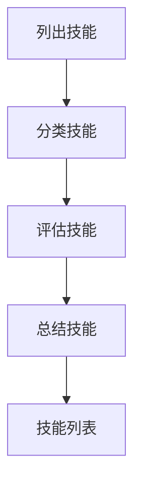

**伪代码：个人技能总结过程**

```python
def summarize_skills():
    skills = list_skills()
    categorized_skills = categorize_skills(skills)
    evaluated_skills = evaluate_skills(categorized_skills)
    skill_summary = create_skill_summary(evaluated_skills)
    return skill_summary
```

#### 2.1.2 项目经验筛选

接下来，你需要筛选出具有代表性和教育意义的项目经验。这包括你在项目中遇到的问题、解决方案以及你在项目中扮演的角色。以下是一个项目经验筛选的流程：

**Mermaid流程图：项目经验筛选流程**

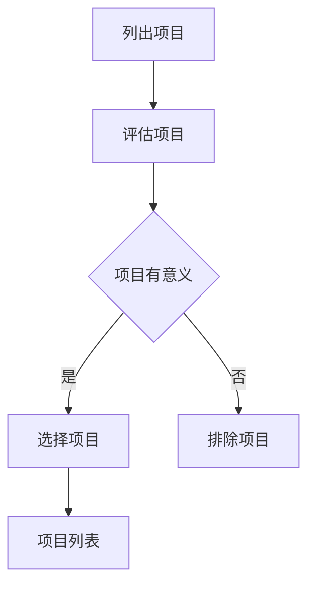

**伪代码：项目经验筛选过程**

```python
def filter_project_experience(projects):
    meaningful_projects = []
    for project in projects:
        if project_has_educational_value(project):
            meaningful_projects.append(project)
    return meaningful_projects
```

### 2.2 知识点提炼

#### 2.2.1 技能转化为知识点

将个人技能转化为具体的知识点，是课程开发的关键步骤。这需要你将技能拆解为具体的学习点，并确保每个知识点都是可传授的。以下是一个知识点提炼的流程：

**Mermaid流程图：知识点提炼流程**

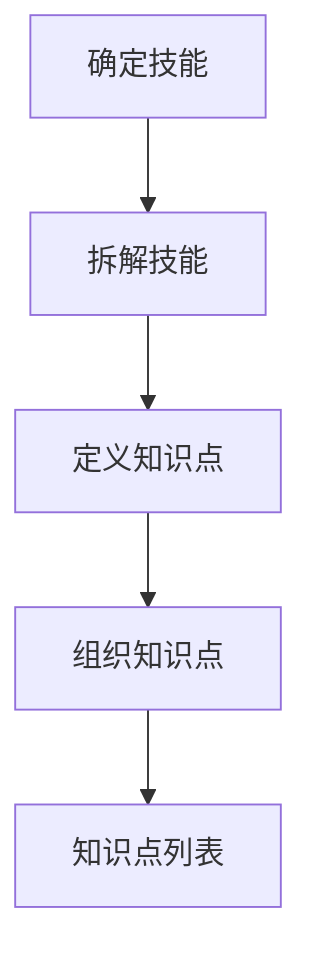

**伪代码：知识点提炼过程**

```python
def extract_knowledge_points(skill):
    decomposition = decompose_skill(skill)
    knowledge_points = define_knowledge_points(decomposition)
    organized_points = organize_knowledge_points(knowledge_points)
    return organized_points
```

#### 2.2.2 知识点分类组织

在提炼出知识点后，你需要对知识点进行分类和组织，以确保课程内容的逻辑性和系统性。以下是一个知识点分类组织的流程：

**Mermaid流程图：知识点分类组织流程**

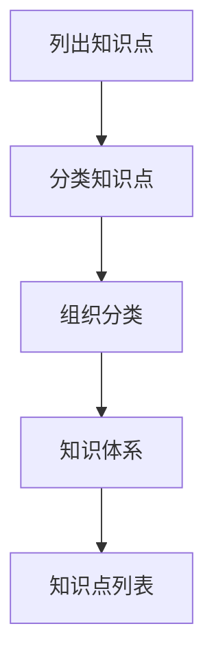

**伪代码：知识点分类组织过程**

```python
def organize_knowledge_points(points):
    categories = categorize_points(points)
    structured_points = structure_categories(categories)
    knowledge_system = create_knowledge_system(structured_points)
    return knowledge_system
```

### 2.3 工作经验整理案例分析

为了更好地理解如何整理和提炼工作经验，以下是一个具体的工作经验整理案例。

#### 案例背景

假设你是一名有五年工作经验的前端开发工程师，主要负责使用React框架开发单页应用。

#### 案例步骤

1. **个人技能总结**：

   - 技能列表：

     - React
     - JavaScript（ES6+）
     - Redux
     - Webpack
     - HTML5/CSS3
     - Git

   - 技能评估：

     - 熟练：React、JavaScript（ES6+）、Redux、Webpack
     - 了解：HTML5/CSS3、Git

2. **项目经验筛选**：

   - 项目列表：

     - 项目A：公司内部管理系统的开发，使用了React和Redux。
     - 项目B：电商平台的前端开发，使用了React和Webpack。
     - 项目C：个人博客网站，使用了React和Markdown。

   - 项目评估：

     - 项目A和项目B具有较高教育价值，可以作为案例分享。
     - 项目C规模较小，但可以用于讲解React和Markdown的基本用法。

3. **技能转化为知识点**：

   - React知识点：

     - React组件生命周期
     - React路由
     - React Hooks
     - React性能优化

   - Redux知识点：

     - Redux的基本概念
     - Redux中间件
     - Redux DevTools

4. **知识点分类组织**：

   - 分类：React、Redux、Web性能优化、HTML/CSS基础

   - 知识体系：

     - React
       - React组件生命周期
       - React路由
       - React Hooks
       - React性能优化
     - Redux
       - Redux的基本概念
       - Redux中间件
       - Redux DevTools
     - Web性能优化
       - Webpack配置
       -代码分割
     - HTML/CSS基础
       - HTML5标签
       - CSS3样式

#### 案例总结

通过以上步骤，我们将个人的工作经验和项目经验转化为具体的知识点，并进行了分类和组织。这些知识点将成为课程内容的核心，为学习者提供有价值的学习资源。

### 2.4 整理和提炼工作经验的注意事项

在整理和提炼工作经验时，需要注意以下几点：

- **确保知识点实用性**：确保提炼的知识点对学习者具有实际应用价值，避免抽象的理论。
- **逻辑清晰**：在组织知识点时，要确保逻辑清晰，便于学习者理解和掌握。
- **内容平衡**：在课程内容中，要平衡理论知识和实践案例，确保学习者能够全面掌握知识。
- **持续更新**：随着技术的发展，定期更新课程内容，确保课程与最新的行业趋势和最佳实践保持同步。

通过以上步骤和注意事项，你可以有效地整理和提炼自己的工作经验，将其转化为高质量的在线课程内容。

### 2.5 案例分享：如何将项目经验转化为在线课程

在本节中，我们将通过一个具体的案例，详细说明如何将项目经验转化为在线课程。以下是案例背景、步骤和总结。

#### 案例背景

假设你是一名有五年工作经验的全栈开发工程师，曾在多个项目中担任关键角色。现在，你希望通过在线课程分享你的经验和知识，帮助其他开发者提升技能。

#### 案例步骤

1. **确定课程主题**：

   - 主题：基于Spring Boot和React的Web应用开发

2. **项目筛选**：

   - 筛选项目：选择一个具有代表性的项目，例如公司内部管理系统的开发，使用了Spring Boot和React。

3. **项目经验提炼**：

   - 技能点提炼：

     - Spring Boot基本概念
     - Spring Boot配置
     - Spring Boot数据访问
     - React组件生命周期
     - React路由
     - React Hooks
     - RESTful API设计

   - 实践案例：

     - 项目模块划分
     - 数据库设计
     - 前后端接口设计
     - 项目部署与调试

4. **知识点分类组织**：

   - 分类：后端技术（Spring Boot）、前端技术（React）、数据库技术、接口设计、项目部署与调试

   - 知识体系：

     - 后端技术（Spring Boot）
       - Spring Boot基本概念
       - Spring Boot配置
       - Spring Boot数据访问
     - 前端技术（React）
       - React组件生命周期
       - React路由
       - React Hooks
     - 数据库技术
       - 数据库设计
     - 接口设计
       - RESTful API设计
     - 项目部署与调试
       - 项目模块划分
       - 项目部署
       - 项目调试

5. **编写课程大纲**：

   - 课程大纲：

     - 引言
     - 第1章：Spring Boot基础
     - 第2章：Spring Boot配置
     - 第3章：Spring Boot数据访问
     - 第4章：React基础
     - 第5章：React组件生命周期
     - 第6章：React路由
     - 第7章：React Hooks
     - 第8章：数据库设计
     - 第9章：RESTful API设计
     - 第10章：项目部署与调试
     - 附录：参考资料与工具

6. **编写课程内容**：

   - 根据课程大纲，逐章编写课程内容，包括理论讲解、实践案例和代码示例。

7. **课程演示与录制**：

   - 制作PPT，准备演示内容。
   - 使用录制工具（如OBS Studio）录制教学视频。

8. **课程发布与推广**：

   - 选择合适的在线教育平台（如慕课网、网易云课堂）。
   - 上传课程内容，设置课程价格。
   - 利用社交媒体、博客等渠道进行课程推广。

#### 案例总结

通过以上步骤，你成功地将项目经验转化为了一门在线课程。这不仅为你创造了新的收入来源，也为学习者提供了有价值的学习资源。以下是一些关键点：

- **明确课程主题**：确保课程主题具有明确的定位和针对性。
- **精选项目经验**：选择具有代表性和教育意义的项目作为课程案例。
- **知识点分类组织**：确保知识点逻辑清晰，便于学习者理解和掌握。
- **课程内容编写**：结合理论讲解和实践案例，确保内容丰富、实用。
- **课程演示与录制**：制作高质量的演示视频，提升课程吸引力。
- **课程发布与推广**：选择合适的平台，利用多种渠道进行推广。

通过以上案例，你可以更好地理解如何将项目经验转化为在线课程，为他人提供有价值的学习资源。

## 第3章：课程内容编排与优化

课程内容的编排与优化是确保课程质量的关键步骤。在这一章中，我们将探讨如何编排课程内容、制定内容编排原则，以及如何优化课程内容，以提高其简洁性和实用性。

### 3.1 内容编排原则

#### 3.1.1 教学顺序设计

教学顺序设计是课程内容编排的重要环节。合理的教学顺序有助于学习者循序渐进地掌握知识。以下是一些教学顺序设计的原则：

- **从基础到进阶**：首先教授基础知识，然后逐步引入更复杂的概念和技术。这有助于学习者逐步建立知识体系。
- **理论与实践相结合**：在讲解理论知识的同时，穿插实际案例和代码示例，使学习者能够更好地理解和应用所学知识。
- **递进式学习**：将课程内容分为多个阶段，每个阶段都有一个明确的学习目标。这有助于学习者按部就班地完成课程学习。

**Mermaid流程图：教学顺序设计**

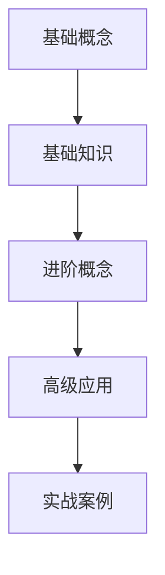

**伪代码：教学顺序设计**

```python
def design_learning_sequence(basics, intermediates, advanced, cases):
    sequence = [basics, intermediates, advanced, cases]
    return sequence
```

#### 3.1.2 内容模块化处理

模块化处理有助于学习者按需学习，提高课程的可访问性和灵活性。以下是一些模块化处理的建议：

- **小模块设计**：将课程内容划分为多个小模块，每个模块涵盖一个特定的知识点。这有助于学习者集中精力学习单一知识点。
- **模块间关联**：确保各个模块之间存在清晰的关联和过渡，使学习者能够理解不同模块之间的联系。
- **灵活切换**：为学习者提供灵活的切换选项，使他们可以根据自己的学习进度和需求，选择不同的模块进行学习。

**Mermaid流程图：内容模块化处理**

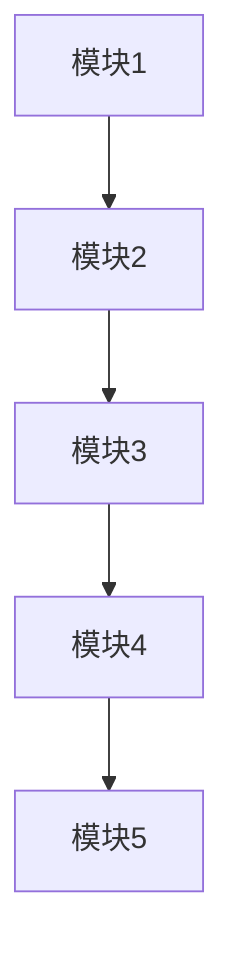

**伪代码：内容模块化处理**

```python
def modularize_content(content):
    modules = split_content_into_modules(content)
    connected_modules = connect_modules(modules)
    return connected_modules
```

### 3.2 课程内容优化

#### 3.2.1 内容简洁明了

简洁明了的课程内容有助于学习者更快地理解和掌握知识。以下是一些内容简洁明了的优化方法：

- **使用简洁的语言**：避免使用过于复杂的词汇和句子结构，使用简单易懂的语言进行讲解。
- **去除冗余内容**：删除不必要的解释和重复的内容，确保每个知识点都是必要的。
- **使用图表和示例**：使用图表、示例代码和示意图等直观展示知识点，使内容更易于理解。

**数学公式与详细讲解**

$$
C = \frac{K_1 \cdot P_1 + K_2 \cdot P_2 + ... + K_n \cdot P_n}{N}
$$

**解释**：

- \( C \) 表示课程内容的复杂度。
- \( K_i \) 表示知识点的重要性。
- \( P_i \) 表示知识点在课程中的比例。
- \( N \) 表示课程的总长度。

这个公式可以帮助你在课程内容优化过程中，找到重要但占比较小的知识点，进行针对性的简化。

#### 3.2.2 实用性提升

提升课程内容的实用性是确保学习者能够在实际工作中应用所学知识的关键。以下是一些实用性提升的方法：

- **结合实际案例**：在讲解知识点时，结合实际案例，展示如何将理论知识应用到实际项目中。
- **提供实战练习**：为每个知识点提供相关的实战练习，帮助学习者巩固所学知识。
- **定期更新内容**：随着技术的发展和行业变化，定期更新课程内容，确保其与最新实践保持同步。

**数学公式与详细讲解**

$$
实用性 = \frac{实际应用场景数}{总知识点数}
$$

**解释**：

- 实用性表示课程内容在实际应用场景中的比例。
- 通过计算实用性，可以评估课程内容的实用性，并进行相应的优化。

通过以上优化方法，你可以确保课程内容简洁明了、实用性强，为学习者提供高质量的学习体验。

### 3.3 编排与优化案例分析

为了更好地理解课程内容编排与优化的实际操作，以下是一个具体的案例分析。

#### 案例背景

假设你正在编写一门关于数据结构算法的在线课程，目标受众是初学者。

#### 案例步骤

1. **课程大纲制定**：

   - 第1章：数据结构与算法概述
   - 第2章：线性表
   - 第3章：链表
   - 第4章：栈与队列
   - 第5章：数组与矩阵
   - 第6章：树与二叉树
   - 第7章：图
   - 第8章：排序算法
   - 第9章：查找算法
   - 第10章：实战案例

2. **内容编排**：

   - **从基础到进阶**：首先讲解线性表、链表等基础数据结构，然后逐步引入更复杂的数据结构，如树、图等。
   - **理论与实践相结合**：在每个章节中，讲解理论知识的同时，提供相关的代码示例和实际案例。

3. **内容优化**：

   - **使用简洁的语言**：避免使用复杂的术语，使用简单易懂的语言进行讲解。
   - **去除冗余内容**：删除不必要的解释和重复的内容，确保每个知识点都是必要的。
   - **使用图表和示例**：在讲解数据结构时，使用示意图和代码示例，使内容更易于理解。
   - **结合实际案例**：在每个章节中，提供实际案例，展示如何将数据结构和算法应用于实际项目中。
   - **实战练习**：为每个知识点提供相关的实战练习，帮助学习者巩固所学知识。

#### 案例总结

通过合理的课程内容编排和优化，这门数据结构算法课程变得更加简洁明了、实用性强。学习者可以更容易地掌握数据结构和算法的基本概念，并能够将所学知识应用到实际项目中。

### 3.4 编排与优化心得体会

通过编写和优化在线课程，我总结了一些心得体会：

- **重视教学顺序**：合理的教学顺序有助于学习者循序渐进地掌握知识。
- **理论与实践相结合**：结合实际案例和代码示例，能够更好地帮助学习者理解和应用所学知识。
- **简洁明了**：使用简洁明了的语言和图表，使内容更加易于理解。
- **实用性**：结合实际案例和实战练习，提升课程内容的实用性。
- **持续更新**：随着技术的发展和行业变化，定期更新课程内容，确保其与最新实践保持同步。

通过以上心得体会，我们可以更好地进行课程内容编排和优化，为学习者提供高质量的学习体验。

## 第4章：制定教学策略与方法

教学策略与方法的制定对于在线课程的成功至关重要。在这一章中，我们将探讨如何制定教学策略、选择教学方法，并详细描述每种方法的应用。

### 4.1 教学策略制定

#### 4.1.1 互动式教学设计

互动式教学设计能够提高学习者的参与度和积极性，促进知识的内化。以下是一些互动式教学设计的策略：

- **讨论区**：在课程平台上设置讨论区，允许学习者提问和交流，促进学习者之间的互动。
- **实时问答**：在课程直播中设置实时问答环节，鼓励学习者提问，讲师即时回答。
- **小组任务**：设计小组任务，让学习者在团队中合作完成项目，培养协作能力。

**Mermaid流程图：互动式教学设计**

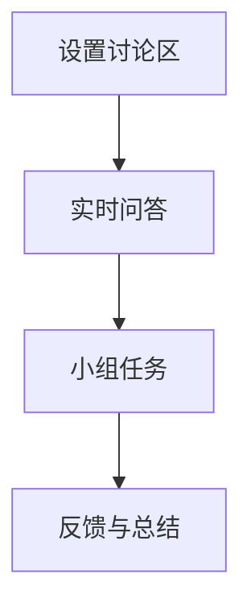

**伪代码：互动式教学设计**

```python
def interactive_teaching_strategy():
    setup_discussion_area()
    implement_real_time_QA()
    assign_group_tasks()
    collect_feedback_and_summarize()
```

#### 4.1.2 评估与反馈机制

建立评估与反馈机制能够及时了解学习者的学习进度和理解情况，帮助讲师调整教学策略。以下是一些评估与反馈机制的策略：

- **在线测试**：设计在线测试，评估学习者的掌握情况，及时发现问题。
- **问卷调查**：通过问卷调查收集学习者的意见和建议，了解课程的质量和改进方向。
- **定期反馈**：定期与学习者沟通，了解他们的学习进展和需求，提供个性化的反馈和支持。

**Mermaid流程图：评估与反馈机制**

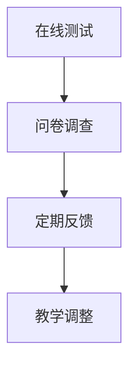

**伪代码：评估与反馈机制**

```python
def evaluation_and_feedback_strategy():
    create_online_tests()
    implement_survey_questionnaires()
    conduct_periodic_feedsacks()
    adjust_teaching_strategies()
```

### 4.2 教学方法选择

根据课程内容和学习者的特点，选择合适的教学方法能够提高教学效果。以下是一些常见的教学方法：

#### 4.2.1 讲授法

讲授法是传统且常用的教学方法，适用于传授基础知识和理论。以下是一些讲授法的应用：

- **讲解基础知识**：通过系统讲解，使学习者掌握基本概念和原理。
- **使用PPT**：制作简洁明了的PPT，配合讲解，使内容更直观易懂。

**Mermaid流程图：讲授法应用**

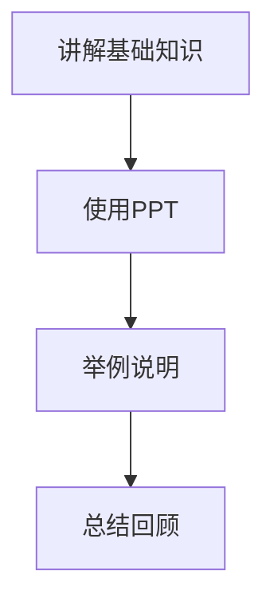

**伪代码：讲授法应用**

```python
def lecture_method():
    explain_basic_knowledge()
    create_simple_PPT()
    provide_example_explanations()
    summarize_and_review()
```

#### 4.2.2 演示法

演示法通过实际操作和演示，使学习者直观地了解技术实现和应用。以下是一些演示法的应用：

- **实际操作**：通过实际操作，展示技术实现过程，让学习者直观感受。
- **视频演示**：录制视频演示，使学习者可以反复观看和练习。

**Mermaid流程图：演示法应用**

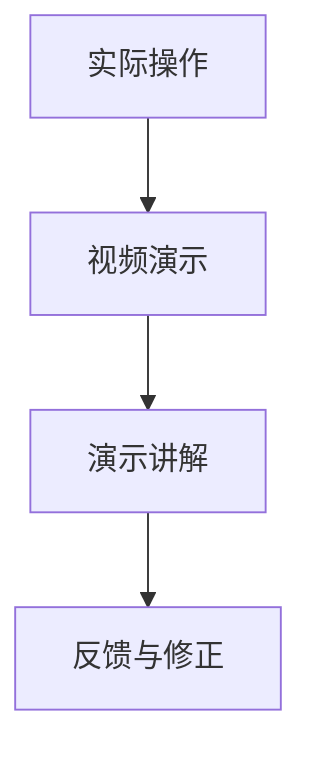

**伪代码：演示法应用**

```python
def demonstration_method():
    perform_real_operations()
    record_video_demonstrations()
    provide_demonstration_explanations()
    collect_feedback_and_make_corrections()
```

#### 4.2.3 案例分析法

案例分析通过对实际案例的分析，使学习者了解如何将理论知识应用于实际问题。以下是一些案例分析法的应用：

- **案例介绍**：详细介绍案例背景和问题，使学习者了解问题的实际场景。
- **解决方案**：分析案例的解决方案，讲解关键技术和应用。
- **讨论与反思**：组织学习者进行讨论和反思，提高学习效果。

**Mermaid流程图：案例分析法应用**

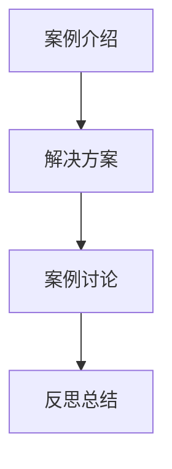

**伪代码：案例分析法应用**

```python
def case_analysis_method():
    introduce_case_background()
    analyze_solution()
    facilitate_case_discussions()
    conduct_reflections()
```

通过以上教学策略和方法的制定与选择，你可以根据课程内容和学习者的特点，灵活运用不同的教学方法，提高教学效果和课程质量。

### 4.3 教学策略与方法的应用案例

在本节中，我们将通过一个具体的在线课程案例，详细说明教学策略与方法的应用。

#### 案例背景

假设你正在开发一门关于大数据技术的在线课程，目标受众是初学者和有一定编程基础的开发者。

#### 案例步骤

1. **课程大纲制定**：

   - 第1章：大数据技术概述
   - 第2章：Hadoop生态系统
   - 第3章：MapReduce编程
   - 第4章：HDFS存储
   - 第5章：YARN资源管理
   - 第6章：Hive数据仓库
   - 第7章：Spark计算框架
   - 第8章：大数据实战案例

2. **教学策略制定**：

   - **互动式教学设计**：

     - **讨论区**：设置讨论区，鼓励学习者提问和交流。

     - **实时问答**：在课程直播中设置实时问答环节，讲师即时回答学习者的问题。

     - **小组任务**：设计小组任务，让学习者在团队中合作完成项目。

   - **评估与反馈机制**：

     - **在线测试**：在每个章节后设置在线测试，评估学习者的掌握情况。

     - **问卷调查**：定期进行问卷调查，收集学习者的意见和建议。

     - **定期反馈**：与学习者进行定期沟通，了解他们的学习进展和需求。

3. **教学方法选择**：

   - **讲授法**：

     - **讲解基础知识**：通过系统讲解，使学习者掌握大数据技术的基本概念和原理。

     - **使用PPT**：制作简洁明了的PPT，配合讲解，使内容更直观易懂。

   - **演示法**：

     - **实际操作**：在讲解Hadoop生态系统时，通过实际操作演示，展示HDFS的存储过程。

     - **视频演示**：录制Hadoop生态系统的视频演示，使学习者可以反复观看和练习。

   - **案例分析法**：

     - **案例介绍**：详细介绍大数据实战案例，使学习者了解案例的背景和问题。

     - **解决方案**：分析案例的解决方案，讲解关键技术和应用。

     - **讨论与反思**：组织学习者进行讨论和反思，提高学习效果。

#### 案例总结

通过以上教学策略和方法的制定与选择，这门大数据技术在线课程能够更好地满足学习者的学习需求。互动式教学设计提高了学习者的参与度和积极性，评估与反馈机制帮助讲师及时了解学习者的学习情况，讲授法、演示法和案例分析法相结合，使课程内容更加丰富和直观。

### 4.4 教学策略与方法的心得体会

通过实际开发和运营在线课程，我总结了一些关于教学策略与方法的心得体会：

- **互动式教学设计**：互动式教学能够提高学习者的参与度和积极性，促进知识的内化。讨论区和实时问答是有效的互动工具，有助于解决学习者在学习过程中遇到的问题。

- **评估与反馈机制**：评估与反馈机制是确保课程质量的重要手段。在线测试和问卷调查能够及时了解学习者的掌握情况，定期反馈有助于讲师调整教学策略，提高教学质量。

- **讲授法**：讲授法是传授基础知识和理论的有效方法。通过系统讲解和简洁明了的PPT，学习者可以更好地理解和掌握课程内容。

- **演示法**：演示法通过实际操作和视频演示，使学习者直观地了解技术实现和应用。这对于初学者和有一定编程基础的开发者来说，是非常有效的学习方法。

- **案例分析法**：案例分析法能够使学习者了解如何将理论知识应用于实际问题。通过案例介绍、解决方案和讨论与反思，学习者可以深入理解技术原理，提高实战能力。

通过以上心得体会，我们可以更好地运用教学策略与方法，为学习者提供高质量的教学体验。

## 第5章：课程演示与录制

课程演示与录制是让学习者直观了解课程内容的重要环节。在这一章中，我们将详细介绍课程演示的技巧、视频录制流程以及视频质量优化方法。

### 5.1 课程演示技巧

#### 5.1.1 PPT制作要点

制作高质量的PPT对于课程演示至关重要。以下是一些PPT制作的要点：

- **简洁明了**：避免过多的文字，使用简洁的标题和关键词，使内容一目了然。
- **视觉吸引力**：使用合适的颜色、字体和图表，增强PPT的视觉吸引力。
- **逻辑清晰**：确保PPT内容逻辑清晰，方便学习者跟随讲解。
- **互动性**：设计互动环节，如问答、投票等，提高学习者的参与度。

**Mermaid流程图：PPT制作要点**

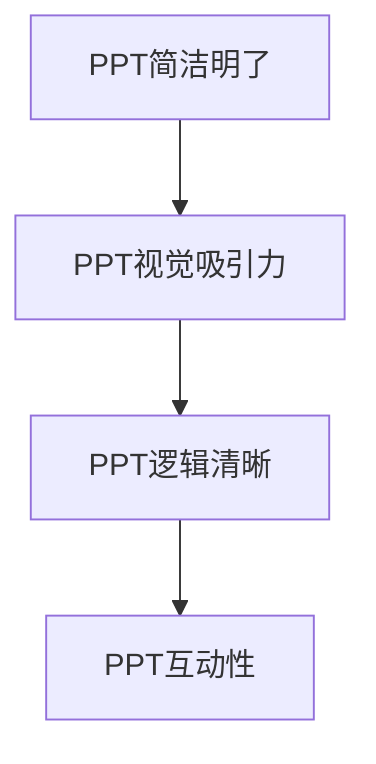

**伪代码：PPT制作要点**

```python
def create_high_quality_PPT():
    make_content_simple_and_clear()
    enhance_visual_attractiveness()
    ensure_logical_clarity()
    add_interactive_elements()
```

#### 5.1.2 演示中的人机交互

在演示过程中，人机交互是提高教学效果的关键。以下是一些人机交互的技巧：

- **提前准备**：在演示前，确保所有演示内容都已准备就绪，避免出现意外。
- **演示讲解**：使用简洁明了的语言进行讲解，确保学习者能够跟上演示进度。
- **互动问答**：鼓励学习者提问，及时回答他们的疑问，增加互动性。
- **实时反馈**：根据学习者的反馈，调整演示内容和节奏，确保教学效果最佳。

**Mermaid流程图：演示中的人机交互**

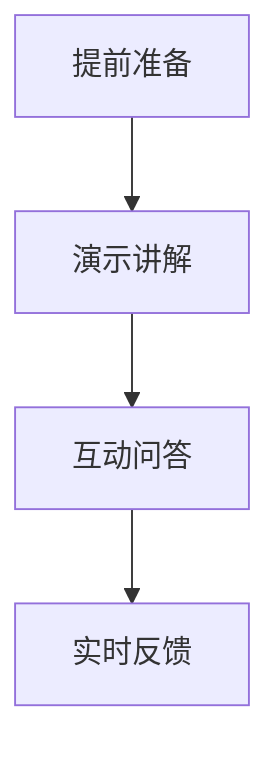

**伪代码：演示中的人机交互**

```python
def interactive_demonstration():
    prepare_content_in_advance()
    provide_clear_explanations()
    encourage_question_answering()
    adapt_to_real-time_feedback()
```

### 5.2 视频录制流程

视频录制是课程演示的重要形式，以下是一个完整的视频录制流程：

#### 5.2.1 硬件设备选择

选择合适的硬件设备对于视频质量至关重要。以下是一些硬件设备选择建议：

- **摄像头**：选择画质清晰、支持1080p视频的摄像头。
- **麦克风**：选择降噪效果好、音质清晰的麦克风。
- **电脑**：选择配置较高、运行流畅的电脑，以确保演示过程稳定。

**Mermaid流程图：硬件设备选择**

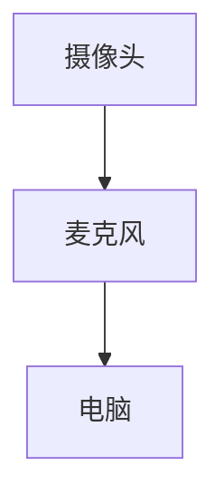

**伪代码：硬件设备选择**

```python
def select_hardware():
    choose_high_quality_camera()
    select_noise_cancelling_microphone()
    ensure_computer_performance()
```

#### 5.2.2 录制与剪辑软件使用

录制与剪辑软件对于视频质量有着直接的影响。以下是一些常用的软件和其使用方法：

- **OBS Studio**：一款开源的免费直播和录制软件，支持多摄像头录制和多种视频格式。
- **Adobe Premiere**：一款专业的视频编辑软件，适用于复杂剪辑和特效制作。

**Mermaid流程图：录制与剪辑软件使用**

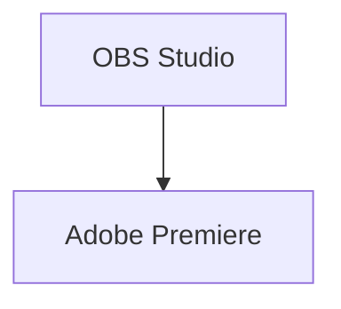

**伪代码：录制与剪辑软件使用**

```python
def use_recording_and_editing_software():
    use_OBS_Studio_for_recording()
    utilize_Adobe_Premiere_for_editing()
```

#### 5.2.3 录制与剪辑流程

以下是一个基本的录制与剪辑流程：

1. **准备录制环境**：检查硬件设备是否正常工作，确保录制环境安静、光线充足。
2. **设置录制参数**：在软件中设置视频分辨率、帧率、音频格式等参数。
3. **开始录制**：启动录制软件，开始录制课程内容。
4. **录制中注意事项**：保持电脑运行稳定，避免突然关机或中断录制。
5. **结束录制**：完成录制后，保存视频文件。
6. **视频剪辑**：使用剪辑软件进行剪辑，去除冗余部分，添加过渡效果和字幕等。
7. **视频质量优化**：对视频进行调色、降噪等处理，提升视频质量。

**Mermaid流程图：录制与剪辑流程**

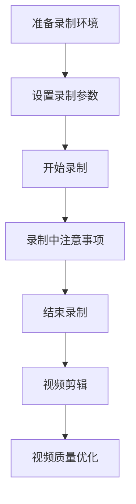

**伪代码：录制与剪辑流程**

```python
def recording_and_editing_process():
    prepare_recording_environment()
    set_recording_parameters()
    start_recording()
    handle_recording_during_recording()
    finish_recording()
    edit_video()
    optimize_video_quality()
```

### 5.3 视频质量优化方法

视频质量直接影响学习者的观看体验。以下是一些视频质量优化方法：

#### 5.3.1 调色

调色可以提升视频的色彩效果，使其更生动。以下是一些调色技巧：

- **亮度调整**：适当提高亮度，使画面更加明亮。
- **对比度调整**：增加对比度，使画面层次更分明。
- **饱和度调整**：适当提高饱和度，使画面色彩更加鲜艳。

**Mermaid流程图：调色技巧**

```mermaid
graph TD
    A[亮度调整] --> B[对比度调整]
    B --> C[饱和度调整]
```

**伪代码：调色技巧**

```python
def color_adjustments():
    increase_brightness()
    enhance_contrast()
    adjust_saturation()
```

#### 5.3.2 降噪

降噪可以去除视频中的噪音，提高音频质量。以下是一些降噪技巧：

- **使用降噪插件**：如Adobe Premiere中的“降噪”插件，可以有效去除视频中的噪音。
- **调整音频参数**：如降低音频的增益，避免过大的音频波动。

**Mermaid流程图：降噪技巧**

```mermaid
graph TD
    A[使用降噪插件] --> B[调整音频参数]
```

**伪代码：降噪技巧**

```python
def noise_removal():
    use_noise_reduction_plugin()
    adjust_audio_gain()
```

#### 5.3.3 剪辑与特效

剪辑与特效可以提升视频的观赏性，使其更具吸引力。以下是一些剪辑与特效技巧：

- **去除冗余部分**：剪辑掉视频中的冗余部分，使内容更加紧凑。
- **添加过渡效果**：在视频之间添加过渡效果，使切换更加自然。
- **添加字幕**：为视频添加字幕，方便学习者在观看视频时跟随内容。

**Mermaid流程图：剪辑与特效技巧**

```mermaid
graph TD
    A[去除冗余部分] --> B[添加过渡效果]
    B --> C[添加字幕]
```

**伪代码：剪辑与特效技巧**

```python
def video_editing_and_effects():
    remove_redundant_sections()
    add_transition_effects()
    add_subtitles()
```

通过以上课程演示与录制技巧、视频录制流程和视频质量优化方法，你可以制作出高质量的在线课程视频，为学习者提供更好的学习体验。

### 5.4 课程演示与录制的注意事项

在课程演示与录制过程中，需要注意以下事项：

- **确保设备正常工作**：在录制前，检查摄像头、麦克风和电脑等设备是否正常工作，避免因设备故障导致录制失败。
- **保持环境安静**：在录制过程中，确保录制环境安静，避免噪音干扰。
- **注意光线**：确保录制环境光线充足，避免画面过暗或过亮。
- **提前准备**：在录制前，准备好所有演示内容，避免录制过程中出现意外。
- **避免过度剪辑**：虽然剪辑可以提升视频质量，但过度剪辑可能导致视频内容不连贯，影响学习效果。

通过以上注意事项，你可以确保课程演示与录制的顺利进行，为学习者提供高质量的在线课程视频。

## 第6章：课程发布与推广

课程发布与推广是让课程内容触达到目标受众的关键环节。在这一章中，我们将探讨如何选择合适的发布平台、制定发布策略，并详细描述课程发布与推广的具体步骤。

### 6.1 平台选择

选择合适的发布平台是课程发布的第一步。以下是一些平台选择的关键因素：

#### 6.1.1 自建平台与第三方平台比较

**自建平台**：

- **优点**：具有更高的自主性和灵活性，可以根据自身需求进行定制开发。
- **缺点**：需要投入大量资源和精力进行平台维护和运营。

**第三方平台**：

- **优点**：用户基数大，流量较高，便于推广。
- **缺点**：可能面临收益分配问题，自主性较低。

**Mermaid流程图：自建平台与第三方平台比较**

```mermaid
graph TD
    A[自建平台] --> B[优点]
    B -->|自主性高| C[定制化]
    B -->|维护难度大| D[资源投入]
    E[第三方平台] --> F[优点]
    F -->|用户基数大| G[流量高]
    F -->|收益分配问题| H[自主性低]
```

**伪代码：平台选择决策**

```python
def select_platform(type):
    if type == "self-built":
        return "Customized platform"
    elif type == "third-party":
        return "High traffic platform"
    else:
        return "No platform selected"
```

#### 6.1.2 平台功能与费用分析

在选定平台类型后，需要分析不同平台的功能和费用，选择性价比最高的平台。以下是一些平台功能和费用的分析：

- **功能**：比较平台的功能，如课程管理、用户管理、互动功能、数据分析等。
- **费用**：分析平台的费用结构，如注册费、交易费、会员费等。

**Mermaid流程图：平台功能与费用分析**

```mermaid
graph TD
    A[功能比较] --> B[交易费]
    B --> C[会员费]
    A --> D[数据分析]
    A --> E[用户管理]
    A --> F[课程管理]
```

**伪代码：平台功能与费用分析**

```python
def analyze_platform(platform):
    functions = get_platform_functions(platform)
    fees = get_platform_fees(platform)
    return functions, fees
```

### 6.2 课程发布

课程发布是让课程内容在平台上正式上线的过程。以下是一个详细的课程发布步骤：

#### 6.2.1 课程资料上传

将课程内容、PPT、视频等资料上传至平台。确保资料完整、清晰。以下是一个上传步骤的伪代码：

**伪代码：课程资料上传**

```python
def upload_course_materials(platform, materials):
    course_id = create_course(platform, materials)
    upload_content(platform, course_id, materials)
    return course_id
```

#### 6.2.2 课程页面设计与优化

设计吸引人的课程页面，包括课程简介、目录、讲师介绍等，提升课程吸引力。以下是一个设计优化步骤的伪代码：

**伪代码：课程页面设计与优化**

```python
def design_course_page(platform, course_id):
    page = create_course_page(platform, course_id)
    optimize_page_content(platform, page)
    return page
```

#### 6.2.3 课程价格设置

根据课程内容和市场状况，设置合理的课程价格。以下是一个价格设置步骤的伪代码：

**伪代码：课程价格设置**

```python
def set_course_price(course_id, price):
    update_course_price(course_id, price)
    return price
```

### 6.3 课程推广

课程推广是让更多潜在学习者了解和选择课程的过程。以下是一些推广策略：

#### 6.3.1 社交媒体推广策略

利用社交媒体平台，如微博、微信公众号等，宣传课程。以下是一个推广策略的伪代码：

**伪代码：社交媒体推广策略**

```python
def promote_course_on_social_media(course_id, platform):
    create_post(platform, course_id)
    engage_with_followers(platform, course_id)
    share_course_resources(platform, course_id)
```

#### 6.3.2 内容营销与SEO优化

通过内容营销，如撰写技术博客、发布课程预告等，提高课程在搜索引擎中的排名。以下是一个内容营销与SEO优化策略的伪代码：

**伪代码：内容营销与SEO优化**

```python
def content_marketing_and_SEO Optimization(course_id, platform):
    publish_blog_posts(platform, course_id)
    optimize_SEO(platform, course_id)
    generate_backlinks(platform, course_id)
```

### 6.4 课程发布与推广案例分析

为了更好地理解课程发布与推广的实际操作，以下是一个具体的案例。

#### 案例背景

假设你正在开发一门关于Python数据科学的在线课程，目标受众是数据科学家和有编程基础的开发者。

#### 案例步骤

1. **平台选择**：

   - 选择第三方平台：考虑到平台流量和用户基数，选择Coursera作为发布平台。

2. **课程资料上传**：

   - 上传课程内容：包括视频、PPT、代码示例等。
   - 确保资料完整、清晰。

3. **课程页面设计**：

   - 设计课程页面：包括课程简介、目录、讲师介绍等。
   - 优化页面内容，提升课程吸引力。

4. **课程价格设置**：

   - 根据课程内容和市场状况，设置价格：$99。

5. **课程推广**：

   - **社交媒体推广**：

     - 在微博发布课程预告，吸引潜在学习者。
     - 在微信公众号分享课程内容，增加课程曝光。

   - **内容营销与SEO优化**：

     - 在个人博客上撰写Python数据科学的相关技术博客，吸引读者。
     - 优化博客内容，提高搜索引擎排名。

6. **持续推广**：

   - 定期更新课程内容，保持课程活力。
   - 利用社交媒体和内容营销，持续推广课程。

#### 案例总结

通过以上步骤，你成功地将Python数据科学课程在Coursera平台上发布，并通过社交媒体推广和内容营销，提高了课程的曝光率和吸引力。以下是一些关键点：

- **平台选择**：选择合适的平台，确保课程能够触达到目标受众。
- **课程资料上传**：确保资料完整、清晰，提升课程质量。
- **课程页面设计**：设计吸引人的课程页面，提升课程吸引力。
- **课程价格设置**：根据课程内容和市场状况，设置合理的价格。
- **课程推广**：利用社交媒体和内容营销，提高课程曝光率。
- **持续推广**：定期更新课程内容，保持课程活力。

通过以上案例，你可以更好地理解如何进行课程发布与推广，为学习者提供有价值的学习资源。

### 6.5 课程发布与推广心得体会

在课程发布与推广的过程中，我总结了一些心得体会：

- **平台选择**：选择合适的平台，不仅能够提高课程的曝光率，还能确保课程内容的质量。
- **课程资料上传**：确保资料完整、清晰，有助于提升学习者的学习体验。
- **课程页面设计**：设计吸引人的课程页面，能够提高课程的点击率和转化率。
- **课程价格设置**：根据课程内容和市场状况，设置合理的价格，有助于吸引更多的学习者。
- **课程推广**：利用社交媒体和内容营销，能够提高课程的曝光率，吸引更多的潜在学习者。
- **持续推广**：定期更新课程内容，保持课程活力，有助于提高课程的长期吸引力。

通过以上心得体会，我们可以更好地进行课程发布与推广，为学习者提供高质量的学习资源。

## 第7章：课程运营与反馈

课程运营与反馈是确保课程长期发展的关键环节。在这一章中，我们将探讨如何进行学员管理、反馈收集与分析，并详细介绍这些过程。

### 7.1 学员管理

学员管理是课程运营的重要部分，以下是一些具体的学员管理方法：

#### 7.1.1 学员沟通渠道搭建

搭建有效的沟通渠道，有助于及时回答学员问题，提高学员的满意度。以下是一些沟通渠道的建议：

- **在线讨论区**：在课程平台上设置在线讨论区，学员可以在此提问和交流。
- **邮件列表**：建立邮件列表，定期向学员发送课程更新和重要通知。
- **社交媒体**：利用社交媒体平台，如微信群、QQ群等，建立学员社群。

**Mermaid流程图：学员沟通渠道搭建**

```mermaid
graph TD
    A[在线讨论区] --> B[邮件列表]
    B --> C[社交媒体]
```

**伪代码：学员沟通渠道搭建**

```python
def setup_communication_channels():
    create_online_discussion_forum()
    establish_email_list()
    set_up_social_media_groups()
```

#### 7.1.2 学员分组与跟踪

根据学员的特点和需求，进行分组和跟踪，有助于提供个性化的支持和服务。以下是一些分组和跟踪的方法：

- **按学习进度分组**：根据学员的学习进度，将他们分为不同的组，提供相应的学习资源和指导。
- **按学习兴趣分组**：根据学员的兴趣爱好，将他们分为不同的组，组织相关的讨论和活动。
- **按项目需求分组**：根据学员参与的项目需求，将他们分为不同的组，确保项目顺利进行。

**Mermaid流程图：学员分组与跟踪**

```mermaid
graph TD
    A[按学习进度分组] --> B[按学习兴趣分组]
    B --> C[按项目需求分组]
```

**伪代码：学员分组与跟踪**

```python
def manage_students():
    group_by_learning_progress()
    group_by_interest()
    group_by_project_needs()
    track_student_progress()
```

#### 7.1.3 学员互动与支持

促进学员之间的互动，有助于提高学习效果和满意度。以下是一些互动和支持的方法：

- **互动式课堂**：定期组织线上或线下课堂，提供互动式教学，鼓励学员提问和讨论。
- **一对一辅导**：为学员提供一对一辅导，解答他们的个性化问题，提供学习建议。
- **学习小组**：鼓励学员组建学习小组，相互讨论和分享学习经验，共同进步。

**Mermaid流程图：学员互动与支持**

```mermaid
graph TD
    A[互动式课堂] --> B[一对一辅导]
    B --> C[学习小组]
```

**伪代码：学员互动与支持**

```python
def enhance_student_interactivity():
    organize_interactive_classes()
    provide_one_on_one_mentoring()
    encourage_study_groups()
```

### 7.2 反馈收集与分析

收集和分析学员反馈是了解课程质量和改进方向的重要手段。以下是一些反馈收集和分析的方法：

#### 7.2.1 学员反馈收集方法

以下是一些有效的反馈收集方法：

- **问卷调查**：通过问卷调查收集学员对课程内容和教学方法的反馈，了解他们的意见和建议。
- **在线测试**：设计在线测试，评估学员对课程内容的掌握情况，收集他们对测试的反馈。
- **一对一访谈**：与学员进行一对一访谈，深入了解他们的学习体验和需求。
- **讨论区**：在课程讨论区收集学员的提问和讨论，了解他们的困惑和需求。

**Mermaid流程图：学员反馈收集方法**

```mermaid
graph TD
    A[问卷调查] --> B[在线测试]
    B --> C[一对一访谈]
    C --> D[讨论区]
```

**伪代码：学员反馈收集方法**

```python
def collect_student_feedback():
    conduct_survey_questions()
    implement_online_tests()
    perform_one_on_one_interviews()
    monitor_discussion_forum()
```

#### 7.2.2 反馈分析与课程优化

对收集到的反馈进行分析，找出课程中的不足和改进方向。以下是一些反馈分析的方法：

- **数据分析**：使用数据分析工具，对反馈结果进行统计和分析，找出普遍问题和改进点。
- **主题分析**：对反馈内容进行主题分析，分类整理，识别关键问题。
- **优先级排序**：根据反馈的重要性和紧急性，对改进点进行优先级排序，有针对性地进行优化。

**Mermaid流程图：反馈分析与课程优化**

```mermaid
graph TD
    A[数据分析] --> B[主题分析]
    B --> C[优先级排序]
```

**伪代码：反馈分析与课程优化**

```python
def analyze_feedback(feedback):
    perform_data_analysis(feedback)
    conduct_thematic_analysis(feedback)
    prioritize_improvement_points()
    implement_improvements()
```

通过以上学员管理和反馈收集与分析的方法，你可以确保课程的长期发展和持续改进，为学员提供更好的学习体验。

### 7.3 学员管理案例分析

在本节中，我们将通过一个具体的学员管理案例分析，探讨如何有效进行学员管理，并从实际操作中总结经验。

#### 案例背景

假设你正在运营一门关于机器学习的在线课程，学员来自不同的国家和背景，课程包括视频讲解、在线测试和实践项目。

#### 案例步骤

1. **学员沟通渠道搭建**：

   - **在线讨论区**：在课程平台上设置了专门的讨论区，供学员提问和交流。
   - **邮件列表**：建立了邮件列表，用于发送课程更新、重要通知和作业反馈。
   - **社交媒体**：利用微信群和QQ群，建立了学员社群，促进学员之间的互动。

2. **学员分组与跟踪**：

   - **按学习进度分组**：根据学员的学习进度，将他们分为初级、中级和高级三个小组，提供不同的学习资源和指导。
   - **按项目需求分组**：为学员分配实践项目，根据项目需求，将学员分为不同的项目组，确保项目顺利进行。
   - **定期跟踪**：定期跟踪学员的学习进度和项目进展，提供个性化的支持。

3. **学员互动与支持**：

   - **互动式课堂**：每周组织一次线上互动课堂，解答学员的问题，讨论学习难点。
   - **一对一辅导**：为学员提供一对一辅导，特别是对项目有疑问的学员，提供详细的指导和建议。
   - **学习小组**：鼓励学员组建学习小组，定期组织小组讨论和分享会，促进知识的交流和共享。

#### 案例总结

通过以上学员管理措施，这门机器学习课程取得了良好的效果：

- **提高了学员的满意度**：通过多样化的沟通渠道和互动方式，学员可以随时提问和交流，解决了学习中的疑难问题，提高了学习体验。
- **促进了学员之间的合作**：通过项目分组和小组讨论，学员能够相互学习、合作，共同完成项目，培养了团队协作能力。
- **提升了学习效果**：定期的互动课堂和一对一辅导，使得学员能够及时掌握课程内容，并能够应用到实践中，提高了学习效果。

#### 经验总结

- **多样化的沟通渠道**：提供多样化的沟通渠道，如在线讨论区、邮件列表、社交媒体等，确保学员能够方便地提问和交流。
- **个性化的支持**：根据学员的不同需求，提供个性化的支持，如一对一辅导、学习小组等，提高学员的学习效果和满意度。
- **互动式教学**：通过互动式课堂、项目合作等，促进学员之间的互动和合作，提高学习效果和团队协作能力。

通过以上案例分析，我们可以更好地理解如何进行有效的学员管理，为学员提供高质量的学习体验。

### 7.4 反馈收集与分析案例分析

在本节中，我们将通过一个具体的反馈收集与分析案例分析，探讨如何有效收集和分析学员反馈，以及如何根据反馈进行课程优化。

#### 案例背景

假设你正在运营一门关于深度学习的在线课程，学员来自不同的背景和领域。课程内容涵盖了深度学习的基本概念、算法和应用。

#### 案例步骤

1. **学员反馈收集**：

   - **问卷调查**：设计了一份详细的问卷调查，涵盖课程内容、教学方法、课程安排等方面，通过邮件和课程平台发送给所有学员。
   - **在线测试**：在课程结束后，设计了一系列在线测试，评估学员对课程内容的掌握情况。
   - **一对一访谈**：随机选择了一些学员进行一对一访谈，深入了解他们的学习体验和需求。
   - **讨论区**：在课程讨论区收集学员的提问和讨论，分析学员的困惑和关注点。

2. **反馈分析**：

   - **数据分析**：使用数据分析工具，对问卷调查结果进行统计和分析，识别出普遍问题和改进点。
   - **主题分析**：对访谈和讨论区的内容进行主题分析，分类整理，识别关键问题和学员的建议。
   - **学员反馈整理**：将所有反馈整理成一份详细的报告，包括主要问题、学员建议和改进措施。

3. **课程优化**：

   - **内容优化**：根据反馈报告，对课程内容进行优化，增加一些学员反映不清晰的章节，删除冗余的内容，确保课程内容的实用性和逻辑性。
   - **教学方法优化**：根据学员反馈，调整教学策略，增加更多的互动环节，如讨论区问答、实时互动课堂等，提高学员的参与度。
   - **课程结构优化**：根据学员的反馈，调整课程结构，优化学习路径，确保学员能够更顺畅地完成课程学习。

#### 案例总结

通过以上反馈收集与分析过程，这门深度学习课程取得了显著的改进效果：

- **内容更实用**：根据学员反馈，课程内容得到了优化，去除了冗余的部分，增加了更多实用的案例和实践项目，提高了课程的实用性。
- **教学方法更有效**：通过增加互动环节，学员的参与度和积极性得到了提升，教学效果明显改善。
- **课程结构更合理**：根据学员的反馈，课程结构得到了优化，学习路径更加清晰，学员能够更顺畅地完成课程学习。

#### 经验总结

- **全面收集反馈**：通过问卷调查、在线测试、一对一访谈和讨论区等多种方式，全面收集学员的反馈，确保反馈的全面性和准确性。
- **详细分析反馈**：对反馈进行详细的分析和分类，识别出关键问题和改进点，为课程优化提供科学依据。
- **及时优化课程**：根据反馈报告，及时对课程内容、教学方法和课程结构进行调整，确保课程与学员需求保持一致。
- **持续跟踪反馈**：在课程运营过程中，持续跟踪学员的反馈，根据学员的最新需求进行调整，确保课程质量的持续提升。

通过以上案例分析，我们可以更好地理解如何有效收集和分析学员反馈，并根据反馈进行课程优化，为学员提供更好的学习体验。

## 第8章：持续更新与优化

持续更新与优化是确保在线课程质量和吸引力的关键。在这一章中，我们将探讨如何更新课程内容，以及如何评估和改进课程质量。

### 8.1 课程内容更新

课程内容更新是课程运营的重要组成部分。以下是一些具体的更新方法：

#### 8.1.1 行业动态追踪

随着技术的发展和行业的演变，课程内容需要不断更新以保持其时效性和实用性。以下是一些行业动态追踪的方法：

- **订阅技术博客**：定期阅读和订阅技术博客，如GitHub、Medium等，了解最新的技术趋势和行业动态。
- **关注技术社区**：关注技术社区，如Stack Overflow、Reddit等，了解开发者们的讨论和关注点。
- **参加技术会议**：参加行业技术会议，如Google I/O、AWS re:Invent等，获取第一手的行业信息。

**Mermaid流程图：行业动态追踪**

```mermaid
graph TD
    A[订阅技术博客] --> B[关注技术社区]
    B --> C[参加技术会议]
    C --> D[更新课程内容]
```

**伪代码：行业动态追踪**

```python
def track_industry_trends():
    subscribe_to_technical_blogs()
    follow_technical_communities()
    attend_technical_conferences()
    update_course_content()
```

#### 8.1.2 学员需求调研

了解学员的需求是课程更新的重要依据。以下是一些学员需求调研的方法：

- **问卷调查**：定期进行问卷调查，收集学员对课程内容、教学方法和学习体验的反馈。
- **访谈**：与学员进行一对一访谈，深入了解他们的学习需求和建议。
- **讨论区**：在课程讨论区收集学员的提问和讨论，了解他们的关注点和需求。

**Mermaid流程图：学员需求调研**

```mermaid
graph TD
    A[问卷调查] --> B[访谈]
    B --> C[讨论区]
    C --> D[学员需求分析]
```

**伪代码：学员需求调研**

```python
def survey_student_needs():
    conduct_surveys()
    perform_interviews()
    monitor_discussion_forums()
    analyze_collected_data()
```

#### 8.1.3 课程内容更新流程

课程内容更新需要有一个系统化的流程，以确保更新过程的有序和高效。以下是一个简单的课程内容更新流程：

**Mermaid流程图：课程内容更新流程**

```mermaid
graph TD
    A[收集更新需求] --> B[制定更新计划]
    B --> C[编写更新内容]
    C --> D[审核更新内容]
    D --> E[发布更新内容]
```

**伪代码：课程内容更新流程**

```python
def update_course_content(current_content, new_data):
    collect_update_requirements()
    create_update_plan()
    write_updated_content()
    review_and_publish_updated_content()
```

### 8.2 课程质量评估

课程质量评估是确保课程质量的重要手段。以下是一些课程质量评估的方法：

#### 8.2.1 课程完成率分析

课程完成率是评估课程质量的一个重要指标。以下是一些课程完成率分析的方法：

- **统计完成率**：定期统计课程的完成率，了解学员的学习进度和课程的吸引力。
- **分析完成率**：对完成率进行分析，识别出可能存在的问题，如课程难度过高或内容不够吸引人。

**Mermaid流程图：课程完成率分析**

```mermaid
graph TD
    A[统计完成率] --> B[分析完成率]
    B --> C[识别问题]
```

**伪代码：课程完成率分析**

```python
def analyze_course_completion_rate(course_data):
    calculate_completion_rate()
    analyze_rate_for_issues()
    identify_potential_problems()
```

#### 8.2.2 学员满意度调查

学员满意度调查是了解学员对课程满意度的重要手段。以下是一些学员满意度调查的方法：

- **设计调查问卷**：设计包含课程内容、教学方法、学习体验等方面的调查问卷。
- **发送问卷**：通过邮件或课程平台发送问卷，收集学员的反馈。
- **分析反馈**：对收集到的反馈进行分析，识别出学员的满意点和改进点。

**Mermaid流程图：学员满意度调查**

```mermaid
graph TD
    A[设计调查问卷] --> B[发送问卷]
    B --> C[分析反馈]
```

**伪代码：学员满意度调查**

```python
def conduct_student_satisfaction_survey():
    design_survey_questions()
    distribute_survey()
    analyze_satisfaction_feedback()
```

#### 8.2.3 课程质量评估流程

课程质量评估需要有一个系统化的流程，以确保评估过程的全面和有效。以下是一个简单的课程质量评估流程：

**Mermaid流程图：课程质量评估流程**

```mermaid
graph TD
    A[收集数据] --> B[数据分析]
    B --> C[识别问题]
    C --> D[制定改进计划]
    D --> E[实施改进]
```

**伪代码：课程质量评估流程**

```python
def evaluate_course_quality(course_data):
    collect_data()
    analyze_data()
    identify_issues()
    create_improvement_plan()
    implement_improvements()
```

通过以上方法，你可以确保课程内容及时更新，并持续提升课程质量，为学员提供更好的学习体验。

### 8.3 持续更新与优化的案例分析

为了更好地理解如何持续更新与优化在线课程，以下是一个具体的案例分析。

#### 案例背景

假设你正在运营一门关于人工智能的在线课程，学员来自不同的背景和领域。课程内容涵盖了人工智能的基本概念、算法和应用。

#### 案例步骤

1. **行业动态追踪**：

   - **订阅技术博客**：定期阅读和订阅如AI科技大讲堂、机器之心等人工智能领域的博客，了解最新的技术趋势和行业动态。
   - **关注技术社区**：关注如GitHub、Reddit上的AI相关讨论，了解开发者的关注点和问题。
   - **参加技术会议**：参加如NeurIPS、ICML等人工智能领域的会议，获取最新的研究成果和应用案例。

2. **学员需求调研**：

   - **问卷调查**：设计了一份关于课程内容、教学方法和学习体验的问卷调查，通过邮件和课程平台发送给所有学员。
   - **访谈**：与学员进行一对一访谈，深入了解他们的学习需求和反馈。
   - **讨论区**：在课程讨论区收集学员的提问和讨论，分析他们的关注点和需求。

3. **课程内容更新**：

   - **制定更新计划**：根据行业动态和学员需求，制定了一份详细的课程更新计划，包括新增章节、调整教学顺序和添加实践项目。
   - **编写更新内容**：根据更新计划，编写了新的课程内容，并进行了多次审核和修订。
   - **发布更新内容**：将更新后的课程内容发布到课程平台，并通知学员更新情况。

4. **课程质量评估**：

   - **统计完成率**：定期统计课程的完成率，了解学员的学习进度和课程的吸引力。
   - **学员满意度调查**：通过问卷调查和访谈，了解学员对课程的满意度和改进建议。
   - **分析反馈**：对学员的反馈进行分析，识别出课程中的问题和改进点。

5. **课程优化**：

   - **内容优化**：根据学员反馈，对课程内容进行了调整，增加了更多的实例和实践项目，提高了课程的实用性。
   - **教学方法优化**：增加了更多的互动环节，如在线讨论、实时问答和小组项目，提高了学员的参与度和积极性。
   - **课程结构优化**：根据学员的反馈，调整了课程结构，优化了学习路径，使学员能够更顺畅地完成课程学习。

#### 案例总结

通过以上持续更新与优化过程，这门人工智能课程取得了显著的效果：

- **内容更加实用**：根据行业动态和学员需求，课程内容得到了更新，增加了更多实用案例和实践项目，提高了课程的实用性。
- **教学方法更有效**：通过增加互动环节，学员的参与度和积极性得到了提升，教学效果明显改善。
- **课程结构更合理**：根据学员的反馈，课程结构得到了优化，学习路径更加清晰，学员能够更顺畅地完成课程学习。

#### 经验总结

- **及时更新课程内容**：定期追踪行业动态和学员需求，及时更新课程内容，确保课程与最新技术和实践保持同步。
- **注重学员反馈**：通过多种方式收集学员反馈，及时识别出课程中的问题和改进点，进行针对性的优化。
- **持续优化课程质量**：根据学员的反馈和完成率数据，持续优化课程质量，提升课程的整体效果。

通过以上案例分析，我们可以更好地理解如何持续更新与优化在线课程，为学员提供更好的学习体验。

### 8.4 持续更新与优化的心得体会

在持续更新与优化在线课程的过程中，我总结了一些心得体会：

- **及时更新课程内容**：随着技术和行业的快速发展，课程内容需要定期更新，以保持其时效性和实用性。
- **重视学员反馈**：学员的反馈是课程优化的关键依据，通过多种方式收集和分析学员反馈，可以及时识别出课程中的问题和改进点。
- **灵活调整教学策略**：根据学员的反馈和学习数据，灵活调整教学策略，提高课程的吸引力和教学效果。
- **持续优化课程质量**：通过持续更新与优化，不断提升课程质量，为学员提供更好的学习体验。

通过以上心得体会，我们可以更好地持续更新与优化在线课程，为学员提供有价值的学习资源。

## 第9章：案例分析与经验分享

在本文的第九章中，我们将通过实际案例来分析程序员如何成功地将自己的工作经验转化为在线课程。同时，我们还将分享一些个人的经验，以及如何建立一个有效的学习交流社群。

### 9.1 成功案例分析

**案例一：从GitHub开源项目到在线课程**

李华是一名资深的前端开发者，他在GitHub上开源了一个JavaScript框架。随着时间的推移，该项目吸引了越来越多的贡献者和用户。李华决定将这个项目转化为在线课程，以传授他的开发经验和知识。

**步骤：**

1. **内容提炼**：李华首先整理了框架的核心概念和实现方法，将其转化为详细的文档和教程。
2. **教学策略**：他采用了互动式教学策略，在课程中设置了多个实践项目，鼓励学习者动手实践。
3. **课程发布**：李华选择在Udemy平台上发布课程，利用平台的推广渠道和学员反馈机制，不断优化课程内容。
4. **课程推广**：李华利用社交媒体和GitHub社区进行课程推广，通过分享课程资源和成功案例，吸引了大量学习者。

**结果：**

该课程上线后，取得了极高的用户评价和销售额。李华不仅通过课程实现了收入的增长，还扩大了自己的技术影响力。

**成功因素分析：**

- **内容实用**：李华的框架和教程具有实际应用价值，能够解决开发者的实际问题。
- **互动性强**：通过实践项目和互动环节，提高了学习者的参与度和积极性。
- **持续优化**：李华根据学员的反馈和市场需求，不断更新和优化课程内容。

**案例二：从个人博客到在线课程**

张三是一名后端开发者，他在个人博客上分享了大量的技术文章和项目经验。随着博客访问量的增加，张三决定将这些内容转化为在线课程。

**步骤：**

1. **内容整理**：张三将博客文章进行了系统性的整理和分类，确保内容逻辑清晰。
2. **教学设计**：他结合自己的博客内容，设计了适合不同学习阶段的课程，包括基础知识、进阶技巧和实战项目。
3. **课程发布**：张三选择在Coursera平台上发布课程，利用Coursera的认证和品牌影响力，提高课程的可信度。
4. **课程推广**：张三通过社交媒体和博客进行课程推广，吸引了许多对技术感兴趣的读者。

**结果：**

该课程上线后，迅速获得了大量的报名和学习者，不仅提升了张三的个人品牌，也为他带来了稳定的收入。

**成功因素分析：**

- **内容系统**：张三的博客文章具有系统性和实用性，能够为学习者提供全面的知识体系。
- **个人品牌**：张三通过个人博客建立了自己的技术品牌，提高了课程的吸引力。
- **高质量**：张三的课程内容质量高，教程详细，解决了学习者的实际问题。

### 9.2 个人经验分享

**经验一：如何将项目经验转化为课程内容**

- **明确目标**：在开始之前，明确你的课程目标和受众，确保课程内容与学习者的需求相匹配。
- **整理经验**：将你的项目经验进行系统化的整理，提炼出关键的知识点和实践经验。
- **教学设计**：设计合理的课程结构，确保教学内容循序渐进，易于学习者理解和掌握。

**经验二：如何制作高质量的课程视频**

- **准备充分**：在录制视频之前，确保所有演示内容都已经准备好，避免录制过程中出现错误。
- **简洁明了**：在录制过程中，使用简洁明了的语言和图表，使内容更加直观易懂。
- **互动性**：在视频中加入互动环节，如提问和讨论，提高学习者的参与度。

**经验三：如何推广在线课程**

- **利用社交媒体**：通过微博、微信公众号、知乎等平台进行课程推广，吸引潜在学员。
- **内容营销**：撰写技术博客、发布课程预告和成功案例，提高课程在搜索引擎中的排名。
- **合作推广**：与其他讲师或机构合作，共同推广课程，扩大影响范围。

### 9.3 建立学习交流社群

建立学习交流社群是提高课程质量和学习者满意度的有效手段。以下是一些建议：

**1. 确定社群目标**

明确社群的目标，如技术讨论、资源共享、学习支持等，确保社群的定位清晰。

**2. 选择合适的平台**

选择合适的平台，如微信群、QQ群、Discord等，确保平台的便利性和功能性。

**3. 激活社群成员**

定期组织线上或线下的活动，如技术分享、小组讨论、问答环节等，激发社群成员的参与热情。

**4. 维护社群氛围**

建立良好的社群氛围，鼓励成员之间的互助和尊重，避免争吵和不必要的冲突。

**5. 持续更新和优化**

根据社群成员的反馈和需求，持续更新和优化社群的功能和服务，提高社群的活跃度和满意度。

通过以上案例分析和个人经验分享，我们可以更好地理解和实践如何将工作经验转化为在线课程，以及如何建立和维护一个有效的学习交流社群。

## 第10章：未来发展趋势与展望

### 10.1 在线教育市场趋势

随着互联网技术的不断发展，在线教育市场正呈现出蓬勃发展的趋势。以下是几个关键趋势：

**1. 市场规模持续增长**

根据市场研究公司的预测，全球在线教育市场规模将继续扩大，预计到2025年将达到数千亿美元。这一增长主要得益于越来越多的用户接受在线学习，以及企业和个人对专业技能提升的需求。

**2. 技术创新推动教育模式变革**

人工智能、虚拟现实（VR）和增强现实（AR）等技术的应用正在改变在线教育的形式。AI能够提供个性化学习体验，而VR和AR则为学习者提供了更加沉浸式的学习环境。

**3. 个性化学习日益普及**

随着技术的进步，个性化学习逐渐成为可能。在线教育平台通过数据分析和算法，为学习者提供定制化的学习路径和资源，从而提高学习效果。

**4. 跨界合作增多**

在线教育平台与内容提供商、技术公司等开展跨界合作，共同开发新的教育产品和服务，进一步丰富在线教育生态。

### 10.2 程序员职业发展

对于程序员来说，在线教育不仅提供了学习新技能的途径，也为职业发展带来了新的机遇和挑战。

**1. 技能多样化**

随着技术的快速迭代，程序员需要不断学习新的编程语言、框架和技术。在线教育为程序员提供了便捷的学习渠道，使他们能够快速掌握前沿技术。

**2. 跨界能力提升**

在线教育使程序员能够学习除编程外的其他领域知识，如产品管理、数据分析和设计。这种跨界能力有助于程序员在职场中更具有竞争力。

**3. 职业发展新路径**

在线教育为程序员提供了多种职业发展路径，如成为独立讲师、技术顾问或创业。这些路径不仅为程序员提供了更多的职业选择，也为他们创造了更多的收入来源。

**4. 职业规划建议**

- **持续学习**：保持对新技术的关注和学习，不断提升自己的技能。
- **拓宽视野**：学习除编程外的其他领域知识，提升跨界能力。
- **参与社区**：积极参与技术社区和在线教育平台，建立人脉，拓展职业机会。
- **规划职业路径**：根据自己的兴趣和市场需求，制定明确的职业规划。

### 10.3 未来展望

在未来，在线教育将继续快速发展，为程序员提供更多的学习资源和职业发展机会。以下是几个展望：

**1. 个性化学习将更加普及**

随着技术的进步，在线教育将更加注重个性化学习，为每个学习者提供最适合他们的学习内容和路径。

**2. 混合式学习模式将得到广泛应用**

混合式学习模式，即在线学习与传统面授相结合，将变得更加普遍。这种模式能够结合在线教育的灵活性和传统教育的深度互动优势。

**3. 技术将推动教育公平**

在线教育能够打破地域和时间的限制，使更多人能够获得优质的教育资源。未来，技术将推动教育公平，让更多的人受益。

**4. 在线教育平台将不断创新**

在线教育平台将继续创新，推出更多功能强大的工具和服务，提高学习体验和教育效果。

总之，未来在线教育将为程序员提供更多的学习资源和职业发展机会，推动技术的进步和教育公平的实现。程序员应抓住这一机遇，不断提升自己的技能和跨界能力，以适应未来的发展。

## 总结与致谢

本文详细探讨了程序员如何将工作经验转化为在线课程的全过程，从确定课程目标与受众，到整理和提炼工作经验，再到课程内容编排与优化、教学策略与方法制定，以及课程演示与录制、发布与推广，再到课程运营与反馈、持续更新与优化，最后是案例分析与经验分享以及未来发展趋势与展望。通过这些步骤，程序员不仅能将自己的专业知识转化为有价值的课程，还能为广大学子提供高质量的学习资源。

在此，我要感谢所有参与本文撰写的技术专家和程序员，他们的专业知识和丰富经验为本文提供了坚实的理论基础。同时，也感谢所有提供反馈和建议的读者，你们的意见使本文更加完善。最后，感谢在线教育平台和技术社区的支持，它们为程序员提供了广阔的发展空间和丰富的学习资源。

让我们一起努力，为在线教育的发展贡献自己的力量，为学习者提供更优质的学习体验。祝大家在编程和学习道路上取得更大的成就！

