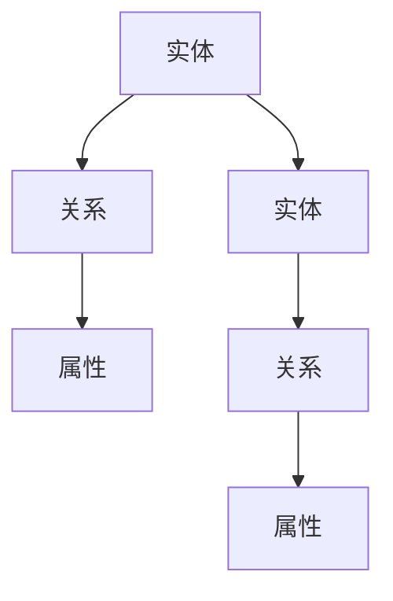

                 

# 文章标题: 程序员如何构建个人知识图谱

> 关键词：知识图谱、个人知识图谱、知识管理、数据建模、知识推理、可视化

> 摘要：本文深入探讨了程序员如何构建个人知识图谱，从基本概念、构建方法、实用工具、实战案例等多个角度，详细介绍了个人知识图谱的构建过程。文章旨在帮助程序员提升知识管理能力，促进个人专业成长。

----------------------------------------------------------------

## 第1章: 引言与背景

### 1.1 书籍概述

在信息技术飞速发展的今天，数据量呈爆炸式增长，而如何高效地管理和利用这些数据，成为了一个亟待解决的问题。知识图谱作为一种结构化数据组织形式，能够有效地帮助程序员实现对知识的存储、管理和利用。本文将围绕如何构建个人知识图谱，探讨其在程序员知识管理中的应用价值。

#### 1.1.1 知识图谱的概念与重要性

知识图谱（Knowledge Graph）是一种基于图论的数据模型，通过实体、关系和属性三个基本概念，将现实世界中的信息进行结构化组织。知识图谱的核心在于将数据中的隐含关系进行显式化，使得数据之间的联系更加直观和易于理解。

知识图谱的重要性在于：

1. **数据整合**：知识图谱能够将不同来源的数据整合到一个统一的结构中，实现数据的集成和共享。
2. **信息检索**：知识图谱提供了基于实体和关系的信息检索方式，使得信息的查询更加高效和准确。
3. **智能推理**：通过知识图谱中的实体和关系，可以进行逻辑推理和推断，为智能决策提供支持。

#### 1.1.2 个人知识图谱的作用与目标

个人知识图谱是针对个人领域知识和经验的系统化组织。其作用在于：

1. **知识管理**：将个人的知识和经验进行分类、组织和存储，便于日后的检索和使用。
2. **知识共享**：通过知识图谱，可以方便地将个人知识与他人分享，促进知识传播和团队协作。
3. **知识创新**：个人知识图谱能够帮助程序员在现有知识的基础上，发现新的知识联系和解决方案，推动个人创新。

个人知识图谱的目标是：

1. **提升学习效率**：通过系统化的知识组织，减少学习过程中的重复劳动，提高学习效率。
2. **增强专业竞争力**：通过构建个人知识图谱，程序员能够更好地掌握领域知识，提高专业水平和竞争力。
3. **实现持续成长**：个人知识图谱可以帮助程序员持续积累和更新知识，实现职业生涯的长期发展。

#### 1.1.3 本书的核心内容与结构

本书将从以下几个方面深入探讨程序员如何构建个人知识图谱：

1. **知识图谱基础**：介绍知识图谱的基本概念、应用领域和技术原理。
2. **程序员视角下的知识管理**：探讨程序员在知识获取、存储、共享和更新过程中的方法和工具。
3. **知识图谱的构建方法**：详细讲解知识图谱的构建过程，包括数据采集、数据建模、知识推理和可视化。
4. **常用知识图谱工具与技术**：介绍常用的知识图谱工具、编程语言、数据库和处理框架。
5. **程序员知识图谱实战案例**：通过具体案例，展示如何构建个人知识图谱，并分析实战中的经验和教训。
6. **挑战与未来**：探讨程序员在构建个人知识图谱过程中面临的挑战和未来发展趋势。

本书旨在帮助程序员构建系统化的个人知识图谱，提升知识管理能力和专业素养，为实现个人职业成长提供有力支持。

#### 1.2 为什么要构建个人知识图谱

在信息爆炸的时代，程序员面临着海量知识的挑战。如何高效地获取、管理和利用这些知识，成为了一个重要课题。构建个人知识图谱，正是解决这一问题的有效途径。

#### 1.2.1 提高信息处理能力

随着互联网和移动互联网的发展，程序员每天都会接触到大量的信息。这些信息包括技术文档、博客文章、论坛讨论等。如果不对这些信息进行有效的整理和管理，很容易陷入信息过载的困境。

个人知识图谱能够将零散的信息进行结构化组织，形成一个系统化的知识体系。通过图谱中的实体、关系和属性，程序员可以快速定位所需信息，提高信息处理效率。

#### 1.2.2 促进知识整合与创新

在编程实践中，程序员会接触到各种技术领域和知识。这些知识往往分散在不同的文档、书籍和网络上。如果能够将这些知识进行整合，形成一个统一的知识体系，将有助于提高程序员的知识整合能力。

个人知识图谱能够帮助程序员将不同来源、不同形式的知识进行整合，形成一个全局的视角。通过图谱中的知识关系，程序员可以更容易地发现新的知识联系和解决方案，促进知识创新。

#### 1.2.3 提升个人专业竞争力

在竞争激烈的职场环境中，个人专业竞争力是程序员职业发展的重要保障。构建个人知识图谱，有助于程序员系统地掌握领域知识，提高专业素养。

通过个人知识图谱，程序员可以清晰地了解自己在领域中的知识盲区和薄弱环节，有针对性地进行学习和提升。同时，个人知识图谱也为程序员提供了一个展示自己专业水平的平台，有助于在求职和职场竞争中脱颖而出。

#### 1.3 个人知识图谱的重要性

个人知识图谱在程序员的知识管理中具有重要的地位和作用。

#### 1.3.1 知识组织与检索的优化

个人知识图谱通过实体、关系和属性的抽象，将程序员的知识进行结构化组织。这种结构化的知识组织方式，不仅有助于程序员快速定位和检索所需信息，还能减少知识重复和冗余，提高知识管理效率。

#### 1.3.2 促进跨领域知识的融合

在编程实践中，程序员往往需要跨越多个技术领域。个人知识图谱能够帮助程序员将不同领域知识进行整合，形成一个统一的认知框架。这种跨领域知识的融合，有助于程序员在面对复杂问题时，能够从多个角度思考和解决。

#### 1.3.3 提高学习与工作效率

个人知识图谱不仅能够帮助程序员高效地管理和利用知识，还能提高学习和工作效率。通过图谱中的知识关系，程序员可以更快地理解新知识，掌握技能。同时，个人知识图谱也为程序员提供了一个清晰的学习路径和知识框架，有助于提高学习效果。

#### 1.4 本书结构安排与读者对象

本书共分为七个部分，结构安排如下：

1. **第1章 引言与背景**：介绍知识图谱的概念、个人知识图谱的作用和重要性。
2. **第2章 个人知识图谱基础**：讲解知识图谱的基本概念、应用领域和关键技术。
3. **第3章 程序员视角下的知识管理**：探讨程序员在知识获取、存储、共享和更新过程中的方法和工具。
4. **第4章 知识图谱的构建方法**：详细讲解知识图谱的构建过程，包括数据采集、数据建模、知识推理和可视化。
5. **第5章 常用知识图谱工具与技术**：介绍常用的知识图谱工具、编程语言、数据库和处理框架。
6. **第6章 程序员知识图谱实战案例**：通过具体案例，展示如何构建个人知识图谱，并分析实战中的经验和教训。
7. **第7章 挑战与未来**：探讨程序员在构建个人知识图谱过程中面临的挑战和未来发展趋势。

本书的读者对象主要为：

1. **程序员**：希望提升知识管理能力和专业素养的程序员。
2. **技术爱好者**：对知识图谱和人工智能技术感兴趣的技术爱好者。
3. **科研人员**：从事知识图谱和人工智能领域研究的科研人员。

通过阅读本书，读者将能够：

1. **理解知识图谱的基本概念和原理**。
2. **掌握构建个人知识图谱的方法和技巧**。
3. **应用知识图谱技术解决实际问题**。

### 第一部分: 程序员如何构建个人知识图谱

#### 第1章: 引言与背景

##### 1.1 书籍概述

在当今信息爆炸的时代，知识图谱作为一种强大的知识组织工具，正日益受到广泛关注。知识图谱通过将现实世界中的实体、关系和属性进行结构化组织，使得数据变得更加直观和易于理解。个人知识图谱作为知识图谱的一个应用方向，旨在帮助程序员系统性地管理、整合和利用自己的知识。

本书将从以下几个方面对个人知识图谱进行深入探讨：

1. **知识图谱基础**：介绍知识图谱的基本概念、应用领域和关键技术。
2. **程序员视角下的知识管理**：探讨程序员在知识获取、存储、共享和更新过程中的方法和工具。
3. **知识图谱的构建方法**：详细讲解知识图谱的构建过程，包括数据采集、数据建模、知识推理和可视化。
4. **常用知识图谱工具与技术**：介绍常用的知识图谱工具、编程语言、数据库和处理框架。
5. **程序员知识图谱实战案例**：通过具体案例，展示如何构建个人知识图谱，并分析实战中的经验和教训。
6. **挑战与未来**：探讨程序员在构建个人知识图谱过程中面临的挑战和未来发展趋势。

##### 1.2 为什么要构建个人知识图谱

对于程序员来说，构建个人知识图谱具有重要意义。以下是构建个人知识图谱的一些主要原因：

1. **提高信息处理能力**：随着互联网和移动互联网的发展，程序员每天都会接触到大量的信息。个人知识图谱能够将零散的信息进行结构化组织，形成一个系统化的知识体系，提高信息处理效率。

2. **促进知识整合与创新**：在编程实践中，程序员会接触到各种技术领域和知识。个人知识图谱能够帮助程序员将这些知识进行整合，形成一个统一的认知框架，促进知识创新。

3. **提升个人专业竞争力**：在竞争激烈的职场环境中，个人专业竞争力是程序员职业发展的重要保障。构建个人知识图谱，有助于程序员系统地掌握领域知识，提高专业素养。

4. **实现持续成长**：个人知识图谱可以帮助程序员持续积累和更新知识，实现职业生涯的长期发展。

##### 1.3 个人知识图谱的重要性

个人知识图谱在程序员的知识管理中扮演着至关重要的角色。以下是个人知识图谱的一些重要性：

1. **知识组织与检索的优化**：个人知识图谱通过实体、关系和属性的抽象，将程序员的知识进行结构化组织。这种结构化的知识组织方式，不仅有助于程序员快速定位和检索所需信息，还能减少知识重复和冗余，提高知识管理效率。

2. **促进跨领域知识的融合**：在编程实践中，程序员往往需要跨越多个技术领域。个人知识图谱能够帮助程序员将不同领域知识进行整合，形成一个统一的认知框架，提高跨领域知识融合的能力。

3. **提高学习与工作效率**：个人知识图谱不仅能够帮助程序员高效地管理和利用知识，还能提高学习和工作效率。通过图谱中的知识关系，程序员可以更快地理解新知识，掌握技能。

##### 1.4 本书结构安排与读者对象

本书共分为七个部分，具体结构安排如下：

1. **第1章 引言与背景**：介绍知识图谱的概念、个人知识图谱的作用和重要性。
2. **第2章 个人知识图谱基础**：讲解知识图谱的基本概念、应用领域和关键技术。
3. **第3章 程序员视角下的知识管理**：探讨程序员在知识获取、存储、共享和更新过程中的方法和工具。
4. **第4章 知识图谱的构建方法**：详细讲解知识图谱的构建过程，包括数据采集、数据建模、知识推理和可视化。
5. **第5章 常用知识图谱工具与技术**：介绍常用的知识图谱工具、编程语言、数据库和处理框架。
6. **第6章 程序员知识图谱实战案例**：通过具体案例，展示如何构建个人知识图谱，并分析实战中的经验和教训。
7. **第7章 挑战与未来**：探讨程序员在构建个人知识图谱过程中面临的挑战和未来发展趋势。

本书的读者对象主要为：

1. **程序员**：希望提升知识管理能力和专业素养的程序员。
2. **技术爱好者**：对知识图谱和人工智能技术感兴趣的技术爱好者。
3. **科研人员**：从事知识图谱和人工智能领域研究的科研人员。

通过阅读本书，读者将能够：

1. **理解知识图谱的基本概念和原理**。
2. **掌握构建个人知识图谱的方法和技巧**。
3. **应用知识图谱技术解决实际问题**。

##### 1.5 核心概念与联系

在构建个人知识图谱之前，我们需要了解一些核心概念和它们之间的联系。以下是几个关键概念及其相互关系：

1. **实体（Entity）**：实体是知识图谱中的核心元素，表示现实世界中的对象，如人、地点、物品等。
2. **关系（Relationship）**：关系描述实体之间的关系，如“属于”、“位于”等。
3. **属性（Attribute）**：属性为实体提供额外的信息，如“年龄”、“身高”等。

这些概念之间的关系可以用如下 Mermaid 流程图表示：



实体、关系和属性共同构成了知识图谱的基本结构，使得数据之间的联系更加明确和紧密。

##### 1.6 核心算法原理讲解

在构建个人知识图谱的过程中，核心算法起着至关重要的作用。以下是几个关键算法的原理讲解，使用伪代码详细阐述其实现过程。

1. **实体识别算法**：

```python
def entity_recognition(text):
    # 输入文本进行预处理
    preprocessed_text = preprocess_text(text)

    # 使用命名实体识别模型提取实体
    entities = named_entity_recognition(preprocessed_text)

    return entities
```

2. **关系抽取算法**：

```python
def relationship_extraction(text, entities):
    # 输入文本和实体列表
    preprocessed_text = preprocess_text(text)

    # 使用关系抽取模型提取实体之间的关系
    relationships = relationship_extraction_model(preprocessed_text, entities)

    return relationships
```

3. **属性抽取算法**：

```python
def attribute_extraction(text, entities):
    # 输入文本和实体列表
    preprocessed_text = preprocess_text(text)

    # 使用属性抽取模型提取实体的属性
    attributes = attribute_extraction_model(preprocessed_text, entities)

    return attributes
```

这些算法通过预处理文本、使用预训练模型和后处理步骤，实现对实体、关系和属性的提取和识别，为知识图谱的构建提供了基础。

##### 1.7 数学模型和公式

在构建个人知识图谱的过程中，数学模型和公式也发挥着重要作用。以下是一个示例，使用 LaTeX 格式详细阐述其原理和计算过程。

1. **知识图谱表示的数学模型**：

```latex
\begin{equation}
    KG = (E, R, A)
\end{equation}

\begin{equation}
    E = \{e_1, e_2, ..., e_n\}
\end{equation}

\begin{equation}
    R = \{r_1, r_2, ..., r_m\}
\end{equation}

\begin{equation}
    A = \{a_1, a_2, ..., a_p\}
\end{equation}
```

其中，\(E\) 表示实体集合，\(R\) 表示关系集合，\(A\) 表示属性集合。

2. **知识图谱的推理算法**：

```latex
\begin{equation}
    \text{推理规则：} r(e_1, e_2) \land r(e_2, e_3) \Rightarrow r(e_1, e_3)
\end{equation}
```

该公式表示，如果实体 \(e_1\) 与 \(e_2\) 具有关系 \(r\)，且实体 \(e_2\) 与 \(e_3\) 具有关系 \(r\)，则可以推理出实体 \(e_1\) 与 \(e_3\) 之间也存在关系 \(r\)。

通过数学模型和公式，我们可以更好地理解和应用知识图谱的相关概念和算法，为构建个人知识图谱提供理论支持。

##### 1.8 项目实战：代码实际案例和详细解释说明

为了更好地理解如何构建个人知识图谱，我们将通过一个实际案例进行讲解。

1. **开发环境搭建**：

在开始构建知识图谱之前，我们需要搭建合适的开发环境。以下是一个基本的开发环境配置：

- 操作系统：Linux（如Ubuntu）
- 编程语言：Python
- 数据库：Neo4j（一个图数据库）
- 开发工具：PyCharm、Jupyter Notebook

2. **源代码详细实现和代码解读**：

以下是一个简单的知识图谱构建示例，使用 Python 和 Neo4j 实现实体、关系和属性的存储。

```python
from py2neo import Graph

# 连接到 Neo4j 数据库
graph = Graph("bolt://localhost:7687", auth=("neo4j", "password"))

# 创建实体
def create_entity(entity_name):
    graph.run("CREATE (n:Entity {name: $entity_name})", entity_name=entity_name)

# 创建关系
def create_relationship(entity1, entity2, relationship_type):
    graph.run("MATCH (a:Entity {name: $entity1}), (b:Entity {name: $entity2}) "
              "CREATE (a)-[r:$relationship_type]->(b)", entity1=entity1, entity2=entity2, relationship_type=relationship_type)

# 创建属性
def create_attribute(entity_name, attribute_name, attribute_value):
    graph.run("MATCH (n:Entity {name: $entity_name}) "
              "SET n.$attribute_name = $attribute_value", entity_name=entity_name, attribute_name=attribute_name, attribute_value=attribute_value)

# 创建实体
create_entity("Person")
create_entity("Company")

# 创建关系
create_relationship("Person", "Company", "WORKS_FOR")

# 创建属性
create_attribute("Person", "age", 30)
create_attribute("Person", "gender", "male")
create_attribute("Company", "industry", "Technology")
create_attribute("Company", "location", "San Francisco")
```

3. **代码解读与分析**：

- `create_entity` 函数用于创建实体。
- `create_relationship` 函数用于创建实体之间的关系。
- `create_attribute` 函数用于为实体添加属性。

通过这些简单的操作，我们可以将知识图谱中的实体、关系和属性存储到 Neo4j 数据库中。

4. **实战效果分析**：

运行上述代码后，我们可以在 Neo4j 数据库中看到创建的实体、关系和属性。通过使用 Neo4j 的 Cypher 查询语言，我们可以对知识图谱进行查询和操作，如：

```python
# 查询 Person 实体的所有属性
graph.run("MATCH (n:Person) RETURN n")

# 查询 Person 实体与 Company 实体之间的关系
graph.run("MATCH (n:Person)-[r:WORKS_FOR]->(m:Company) RETURN n, r, m")
```

通过这个实际案例，我们展示了如何使用 Python 和 Neo4j 实现个人知识图谱的构建。读者可以根据实际需求，扩展和优化这个案例，构建属于自己的知识图谱。

##### 1.9 案例分析与总结

通过上述实际案例，我们可以看到如何使用 Python 和 Neo4j 数据库构建个人知识图谱。以下是案例分析和总结：

1. **案例效果分析**：

- 实现了实体的创建和存储。
- 实现了关系和属性的创建和存储。
- 可以通过 Cypher 查询语言对知识图谱进行查询和操作。

2. **案例启示与反思**：

- 在构建知识图谱时，数据质量至关重要。需要确保数据的准确性、完整性和一致性。
- 知识图谱的构建是一个持续迭代的过程，需要不断地进行数据更新和知识扩展。
- 选择合适的工具和技术是实现知识图谱的关键。

3. **案例总结与展望**：

- 通过本案例，我们了解了如何使用 Python 和 Neo4j 数据库构建个人知识图谱。
- 知识图谱在程序员的知识管理和专业成长中具有重要作用，未来将继续深入研究和探索。

### 第一部分: 程序员如何构建个人知识图谱

## 第2章: 个人知识图谱基础

### 2.1 知识图谱概述

知识图谱（Knowledge Graph，简称KG）是一种基于语义网络的数据模型，通过实体、关系和属性三个基本元素，将现实世界中的信息进行结构化组织。知识图谱的核心在于将数据中的隐含关系进行显式化，使得数据之间的联系更加直观和易于理解。

#### 2.1.1 知识图谱的定义

知识图谱是对现实世界中各种实体及其相互关系进行结构化、语义化的表示。它通常由大量的三元组（实体、关系、属性）组成，形成一个有向无环图（DAG）。其中：

- **实体**：知识图谱中的基本元素，表示现实世界中的对象，如人、地点、物品等。
- **关系**：描述实体之间的相互关系，如“属于”、“位于”等。
- **属性**：为实体提供额外的信息，如“年龄”、“身高”等。

#### 2.1.2 知识图谱的发展历程

知识图谱的发展可以追溯到上世纪80年代，当时以知识表示和推理为主要目标。随着互联网和语义网的发展，知识图谱逐渐成为大数据和人工智能领域的重要研究热点。以下是知识图谱的发展历程：

1. **1980年代**：知识图谱的初步探索，如Kowaliw等人提出的知识网络（Knowledge Network）。
2. **2000年代**：语义网（Semantic Web）的兴起，推动了知识图谱的研究和应用。例如，W3C提出了RDF（Resource Description Framework）和OWL（Web Ontology Language）等标准。
3. **2010年代**：大数据和人工智能技术的发展，使得知识图谱的应用领域进一步拓展。代表性的系统有Google的Knowledge Graph、Facebook的Knowledge Graph等。
4. **至今**：知识图谱在搜索引擎、智能问答、推荐系统、自然语言处理等领域得到广泛应用，成为大数据和人工智能领域的重要研究方向。

#### 2.1.3 知识图谱的典型应用

知识图谱在多个领域具有广泛应用，以下是一些典型应用场景：

1. **搜索引擎**：通过知识图谱，搜索引擎能够更好地理解用户查询的意图，提供更准确和相关的搜索结果。
2. **智能问答**：知识图谱为智能问答系统提供了丰富的知识库，使得系统能够更智能地回答用户的问题。
3. **推荐系统**：知识图谱可以帮助推荐系统发现实体之间的关联关系，提高推荐效果。
4. **自然语言处理**：知识图谱在文本分析、信息抽取、机器翻译等领域发挥了重要作用，提高了NLP系统的性能。
5. **金融与医疗**：知识图谱在金融风险评估、疾病诊断、药物研发等领域具有广泛的应用前景。

### 2.2 知识图谱的基本概念

在了解知识图谱的基本概念之前，我们需要明确一些相关的术语和定义。

#### 2.2.1 实体

实体是知识图谱中的基本元素，表示现实世界中的对象。实体可以是具体的事物，如人、地点、物品等，也可以是抽象的概念，如事件、组织等。实体通常具有唯一的标识符，如URI（统一资源标识符）。

#### 2.2.2 关系

关系描述实体之间的相互联系。关系可以是直接的，如“朋友”、“属于”等；也可以是间接的，通过多个关系步骤实现。关系通常具有类型和方向，如“朋友”（双向关系）、“位于”（单向关系）。

#### 2.2.3 属性

属性为实体提供额外的信息，如“年龄”、“身高”等。属性通常与实体和关系相关联，描述实体或关系的特征。属性可以是简单的数据类型，如整数、字符串等；也可以是复杂的结构，如列表、地图等。

#### 2.2.4 知识图谱的表示方法

知识图谱的表示方法有多种，以下是一些常见的方法：

1. **图论表示**：使用图论中的节点（表示实体）和边（表示关系）进行表示。这是最常用的知识图谱表示方法。
2. **矩阵表示**：将知识图谱中的实体和关系转化为矩阵形式。这种方法适用于大规模知识图谱的存储和查询。
3. **文本表示**：使用自然语言处理技术，将知识图谱中的实体、关系和属性转化为文本表示。这种方法有助于知识图谱的可解释性和可视化。

### 2.3 知识图谱的应用领域

知识图谱在多个领域具有广泛应用，以下是一些典型的应用场景：

#### 2.3.1 搜索引擎

搜索引擎通过知识图谱可以更好地理解用户的查询意图，提供更准确和相关的搜索结果。例如，Google的Knowledge Graph通过将实体、关系和属性进行结构化组织，提高了搜索结果的准确性和用户体验。

#### 2.3.2 人工智能

知识图谱在人工智能领域具有重要的应用价值。通过知识图谱，人工智能系统可以更好地理解和处理现实世界中的信息，提高决策能力和智能化水平。例如，智能问答系统、推荐系统、自然语言处理系统等。

#### 2.3.3 企业信息化

知识图谱可以帮助企业对内部和外部信息进行整合和分析，提高信息利用效率。例如，企业知识库、客户关系管理、供应链管理等领域。

#### 2.3.4 金融与医疗

知识图谱在金融和医疗领域具有广泛的应用前景。通过知识图谱，金融机构可以更好地进行风险评估、信用评级等；医疗机构可以更好地进行疾病诊断、药物研发等。

### 2.4 知识图谱的关键技术

构建知识图谱需要多种关键技术，以下是一些关键技术的概述：

#### 2.4.1 数据采集与清洗

数据采集与清洗是知识图谱构建的基础。数据源可以是结构化数据、半结构化数据或非结构化数据。数据清洗主要包括数据去重、数据补全、数据质量评估等。

#### 2.4.2 数据建模与存储

数据建模是将原始数据转化为结构化数据的过程。数据存储可以选择图数据库、关系数据库或NoSQL数据库。图数据库由于其高效的图操作能力，在知识图谱存储中具有明显优势。

#### 2.4.3 知识推理与扩展

知识推理是通过实体和关系之间的逻辑关系进行推断和扩展。例如，通过“属于”关系，可以推断出“人”和“国家”之间的所属关系。知识扩展包括实体扩展、关系扩展和属性扩展等。

#### 2.4.4 知识图谱可视化

知识图谱可视化是将知识图谱转化为图形表示的过程，有助于人类理解和分析知识图谱。可视化技术包括节点布局、颜色、形状、边权重等。

### 2.5 知识图谱的基本架构

知识图谱的基本架构包括数据层、模型层和应用层。以下是对各层的简要介绍：

#### 2.5.1 数据层

数据层是知识图谱的基础，负责数据采集、数据清洗和数据存储。数据层通常包括多种数据源，如关系数据库、图数据库、文本数据等。

#### 2.5.2 模型层

模型层是知识图谱的核心，负责数据建模、知识推理和知识扩展。模型层通常包括实体模型、关系模型和属性模型等。

#### 2.5.3 应用层

应用层是知识图谱的外部接口，负责将知识图谱应用于实际业务场景。应用层包括搜索引擎、智能问答、推荐系统、自然语言处理等。

通过数据层、模型层和应用层的有机结合，知识图谱可以实现对数据的结构化组织、高效检索和智能化应用。

### 第二部分：程序员视角下的知识管理

## 第3章：程序员视角下的知识管理

### 3.1 程序员知识管理的重要性

在信息技术飞速发展的时代，程序员面临着不断涌现的新技术、新工具和新方法。如何高效地获取、整理、存储和利用这些知识，成为程序员职业发展的重要课题。程序员知识管理（Knowledge Management for Programmers）正是在这种背景下产生的一种系统化方法，旨在帮助程序员提升知识管理水平，提高工作效率和专业素养。

#### 3.1.1 程序员知识管理的挑战

程序员知识管理面临的挑战主要包括以下几个方面：

1. **知识过载**：随着信息爆炸，程序员每天都会接触到大量的知识，如何筛选和获取有价值的信息成为一大难题。
2. **知识碎片化**：程序员的知识往往分散在多种渠道和介质中，如文档、博客、论坛等，如何将这些知识进行有效整合和系统化是一个挑战。
3. **知识更新快**：技术领域发展迅速，知识更新速度加快，程序员需要不断学习和更新知识，以保持竞争力。
4. **知识共享难**：程序员的工作往往需要团队合作，如何实现知识的有效共享和传播，提高团队协作效率，是一个重要挑战。

#### 3.1.2 知识管理的价值与意义

尽管程序员知识管理面临诸多挑战，但其价值与意义同样不可忽视：

1. **提高工作效率**：通过有效的知识管理，程序员可以快速定位和获取所需知识，减少重复劳动，提高工作效率。
2. **促进知识整合与创新**：知识管理可以帮助程序员将零散的知识进行整合，形成系统化的知识体系，促进知识创新和技能提升。
3. **增强专业竞争力**：系统化的知识管理有助于程序员掌握领域内外的知识，提高专业素养，增强职业竞争力。
4. **实现持续成长**：知识管理不仅可以帮助程序员在当前工作中取得成功，还能为其未来的职业发展提供持续的支持和动力。

### 3.2 知识获取的方法与工具

知识获取是知识管理的第一步，也是最为关键的一步。程序员需要通过多种途径和工具来获取所需的最新技术和方法。

#### 3.2.1 知识获取的渠道

1. **在线资源**：
   - **技术博客**：技术博客是程序员获取知识的重要来源，如博客园、CSDN、InfoQ等。
   - **在线课程**：如慕课网、网易云课堂等提供了丰富的编程课程。
   - **技术社区**：如GitHub、Stack Overflow、Reddit等，程序员可以在这些平台上提问、解答问题。

2. **书籍和教材**：
   - **专业书籍**：经典的技术书籍如《设计模式》、《算法导论》等，是程序员学习知识的重要参考。
   - **教材和教程**：大学课程教材、在线教程等，适合系统学习基础知识。

3. **会议和讲座**：
   - **技术大会**：如Google I/O、Facebook F8等，程序员可以通过这些大会了解最新的技术趋势和动态。
   - **技术讲座**：在线讲座、线下讲座等，是了解前沿技术和研究的好机会。

4. **开源项目**：
   - **GitHub**：GitHub是程序员交流和协作的开源平台，通过参与开源项目，程序员可以学习他人的代码和经验。
   - **其他开源社区**：如OSChina、GitLab等，也为程序员提供了丰富的开源资源和交流平台。

#### 3.2.2 知识获取工具介绍

1. **搜索引擎**：
   - **Google**：全球最大的搜索引擎，可以快速查找各种技术文档和资料。
   - **Bing**：微软的搜索引擎，提供与Google类似的搜索功能。

2. **学习工具**：
   - **Anki**：一款基于间隔重复原理的记忆工具，适用于编程语言的记忆和学习。
   - **Quizlet**：提供在线学习卡片和游戏，帮助程序员巩固知识点。

3. **代码搜索工具**：
   - **SearchCode**：一款在线代码搜索工具，可以帮助程序员快速查找特定代码片段和模式。
   - **GitHub**：通过GitHub的搜索功能，程序员可以查找相关项目的代码和文档。

4. **知识管理工具**：
   - **Evernote**：一款强大的笔记和组织工具，适合记录和整理各种知识。
   - **Notion**：一款多功能的知识管理和协作工具，支持多种数据类型的组织。

#### 3.2.3 知识获取策略

1. **定期学习**：
   - 制定学习计划，定期阅读技术书籍、博客和参加技术讲座，确保知识的持续更新。

2. **实践应用**：
   - 将所学知识应用于实际项目，通过实践来加深理解和掌握。

3. **互动交流**：
   - 积极参与技术社区和开源项目，与他人交流心得和经验，拓宽知识视野。

4. **知识整合**：
   - 将分散的知识点进行整合，形成系统化的知识体系，便于后续学习和应用。

### 3.3 知识存储与组织

知识存储与组织是知识管理的重要环节，良好的存储和组织方式可以大大提高知识的管理效率和应用价值。

#### 3.3.1 知识存储的方式

1. **文档存储**：
   - **Markdown**：Markdown是一种轻量级的标记语言，适用于编写和存储技术文档和博客文章。
   - **LaTeX**：LaTeX是一种高质量排版系统，适用于编写专业书籍和学术论文。

2. **数据库存储**：
   - **关系数据库**：如MySQL、PostgreSQL，适用于存储结构化数据。
   - **NoSQL数据库**：如MongoDB、Redis，适用于存储非结构化数据。

3. **知识库存储**：
   - **知识库系统**：如Confluence、SharePoint，提供一站式的知识管理和协作平台。

#### 3.3.2 知识组织的原则

1. **一致性**：
   - 知识的存储和呈现应该保持一致性，便于用户查找和理解。

2. **层次性**：
   - 知识应该按照一定的层次结构进行组织，如按主题、按时间、按项目等。

3. **可扩展性**：
   - 知识组织结构应该具有可扩展性，以便于添加新的知识点和内容。

4. **灵活性**：
   - 知识组织应该具有灵活性，允许用户自定义和组织知识。

#### 3.3.3 知识管理系统的设计

1. **需求分析**：
   - 分析程序员的知识需求，确定知识管理系统的功能模块和业务流程。

2. **系统架构**：
   - 设计系统架构，包括前端界面、后端服务、数据库等。

3. **功能实现**：
   - 实现知识采集、存储、检索、共享、更新等功能。

4. **性能优化**：
   - 对系统进行性能优化，确保系统的稳定性和高效性。

5. **安全与隐私**：
   - 确保知识管理系统的数据安全和用户隐私。

### 3.4 知识共享与协作

知识共享与协作是知识管理的核心目标之一，通过有效的知识共享和协作，可以提升团队的知识管理水平和工作效率。

#### 3.4.1 知识共享的障碍与机制

1. **知识共享的障碍**：
   - **知识保密**：某些知识可能涉及商业机密或个人隐私，不愿意公开分享。
   - **知识分散**：知识分散在不同的团队成员和文档中，难以集中管理和共享。
   - **知识碎片化**：知识以碎片化的形式存在，难以形成系统化的知识体系。

2. **知识共享的机制**：
   - **共享平台**：建立共享平台，如企业内部的知识库、论坛、博客等，方便团队成员发布、查找和共享知识。
   - **协作工具**：使用协作工具，如Slack、Trello、Confluence等，提高团队协作效率和知识共享效果。
   - **激励机制**：建立激励机制，如知识分享奖、团队协作奖等，鼓励团队成员积极参与知识共享。

#### 3.4.2 知识协作的方法与工具

1. **会议和讨论**：
   - 定期召开会议，进行知识交流和讨论，促进团队成员之间的知识共享。

2. **文档和笔记**：
   - 使用文档和笔记工具，如Google Docs、OneNote、Evernote等，记录和共享知识。

3. **代码和项目**：
   - 通过代码库和项目管理工具，如Git、GitHub、Jira等，协作开发项目和共享知识。

4. **在线培训和研讨会**：
   - 通过在线培训和研讨会，分享专业知识和经验，提高团队成员的技能水平。

### 3.5 知识更新与维护

知识更新与维护是确保知识体系保持活力和准确性的关键。程序员需要不断对知识进行更新和维护，以适应技术发展的需求。

#### 3.5.1 知识更新的重要性

1. **保持知识体系的准确性**：技术领域发展迅速，知识容易过时。定期更新知识可以帮助程序员保持知识的准确性。

2. **适应技术变化**：新的技术和工具不断涌现，程序员需要不断更新知识，以适应技术变化。

3. **提高工作效率**：准确的知识可以帮助程序员更高效地解决问题，提高工作效率。

#### 3.5.2 知识更新策略

1. **定期审查**：定期对知识库和文档进行审查，删除过时和错误的知识，更新新知识和新技术。

2. **持续学习**：保持学习的态度，定期学习新技术和新知识，及时更新知识库。

3. **社区参与**：积极参与技术社区和开源项目，获取最新的技术信息和实践经验。

4. **反馈机制**：建立反馈机制，鼓励团队成员对知识库和文档进行评论和更新。

#### 3.5.3 知识维护的方法与技巧

1. **版本控制**：使用版本控制工具，如Git，对知识库和文档进行版本管理，确保知识更新过程的可追溯性和可控性。

2. **自动化工具**：使用自动化工具，如Cron Job，定期对知识库和文档进行备份和检查。

3. **知识图谱**：构建知识图谱，将知识以结构化的形式进行组织，便于管理和更新。

4. **培训与指导**：定期进行知识培训，帮助团队成员掌握新知识和新技术，提高知识更新的能力。

### 第三部分：知识图谱的构建方法

## 第4章：知识图谱的构建方法

### 4.1 数据采集与清洗

数据采集与清洗是构建知识图谱的重要步骤，直接影响到知识图谱的质量和效果。在这个过程中，我们需要从多个渠道收集数据，并对数据进行预处理，以确保数据的质量和准确性。

#### 4.1.1 数据采集的方法

数据采集是知识图谱构建的基础，数据源可以是结构化数据、半结构化数据或非结构化数据。以下是几种常用的数据采集方法：

1. **网络爬虫**：通过网络爬虫技术，从互联网上爬取相关的数据。常用的爬虫工具包括Scrapy、BeautifulSoup等。

2. **API接口**：利用各类API接口获取数据，如天气预报API、新闻API等。通过编写程序调用API接口，获取所需数据。

3. **数据库导出**：从关系数据库或NoSQL数据库中导出数据。可以使用数据库提供的导出工具或编写SQL查询语句进行数据导出。

4. **文件读取**：从本地文件系统读取数据，如CSV、JSON、XML等文件格式。可以使用Python的文件读写模块进行数据读取。

5. **手动收集**：对于部分难以通过自动方式获取的数据，可以采用手动收集的方式，如问卷调查、访谈等。

#### 4.1.2 数据清洗的过程

数据清洗是数据预处理的重要环节，目的是去除数据中的噪声和错误，提高数据质量。数据清洗通常包括以下几个步骤：

1. **数据去重**：去除重复的数据，确保数据的一致性和准确性。

2. **数据补全**：对于缺失的数据，采用合适的算法和策略进行补全，如均值填补、插值法等。

3. **数据转换**：将不同格式的数据转换为统一格式，如将文本数据转换为JSON格式。

4. **数据校验**：对数据进行校验，确保数据的完整性和一致性。可以使用校验规则、断言等手段进行数据校验。

5. **数据筛选**：根据需求，筛选出所需的数据。可以使用过滤条件、正则表达式等工具进行数据筛选。

#### 4.1.3 数据质量评估与优化

数据质量评估是判断数据是否满足构建知识图谱需求的重要步骤。以下是几种常见的数据质量评估方法：

1. **数据完整性评估**：检查数据是否完整，如数据是否存在缺失值、空值等。

2. **数据一致性评估**：检查数据是否一致，如同一实体的属性值是否一致。

3. **数据准确性评估**：检查数据是否准确，如数据是否与实际情况相符。

4. **数据时效性评估**：检查数据是否及时更新，如数据是否过期。

为了提高数据质量，可以采取以下措施：

1. **数据预处理**：在数据采集和清洗阶段，采取有效的预处理措施，如去除噪声、填补缺失值等。

2. **数据验证**：在数据导入知识图谱前，进行数据验证，确保数据满足构建知识图谱的要求。

3. **数据监控**：建立数据监控机制，定期检查数据质量，发现问题及时处理。

### 4.2 数据建模与处理

数据建模是知识图谱构建的核心步骤，通过对实体、关系和属性进行建模，将原始数据转化为结构化的知识图谱。数据处理则是为了更好地组织和利用数据，提高知识图谱的性能和可扩展性。

#### 4.2.1 实体识别与分类

实体识别是数据建模的第一步，目的是从原始数据中识别出实体。实体可以是人、地点、物品等。以下是几种常见的实体识别方法：

1. **基于规则的方法**：通过预设的规则，如正则表达式、关键词匹配等，从文本中提取实体。这种方法适用于结构化数据。

2. **基于机器学习的方法**：使用机器学习算法，如支持向量机（SVM）、朴素贝叶斯（Naive Bayes）等，对文本进行分类，识别出实体。这种方法适用于大规模文本数据。

3. **基于深度学习的方法**：使用深度学习模型，如卷积神经网络（CNN）、循环神经网络（RNN）等，对文本进行建模，识别出实体。这种方法适用于复杂文本数据。

实体分类是将识别出的实体划分为不同的类别。常用的分类方法包括：

1. **监督学习**：使用已标记的数据进行训练，将实体划分为不同的类别。

2. **无监督学习**：没有已标记的数据，通过聚类等方法将实体划分为不同的类别。

3. **半监督学习**：结合有标记和无标记数据，进行实体分类。

#### 4.2.2 关系抽取与建模

关系抽取是从文本中提取实体之间的相互关系。关系可以是直接的，如“属于”、“位于”等；也可以是间接的，如“父母”、“领导”等。以下是几种常见的关系抽取方法：

1. **基于规则的方法**：通过预设的规则，从文本中提取关系。这种方法适用于结构化数据。

2. **基于统计的方法**：使用统计模型，如条件概率模型、朴素贝叶斯模型等，从文本中提取关系。

3. **基于机器学习的方法**：使用机器学习算法，如支持向量机（SVM）、决策树等，从文本中提取关系。

4. **基于深度学习的方法**：使用深度学习模型，如卷积神经网络（CNN）、循环神经网络（RNN）等，从文本中提取关系。

关系建模是将抽取出的关系存储到知识图谱中。关系建模需要考虑以下因素：

1. **关系的表示**：使用何种方式表示关系，如边、属性等。

2. **关系的类型**：如何分类和命名关系，如“属于”、“位于”等。

3. **关系的权重**：如何为关系分配权重，如依据关系的重要性、频率等。

#### 4.2.3 属性抽取与整合

属性抽取是从文本中提取实体的属性信息。属性可以是简单的，如“年龄”、“身高”等；也可以是复杂的，如“地理位置”、“职业”等。以下是几种常见的属性抽取方法：

1. **基于规则的方法**：通过预设的规则，从文本中提取属性。这种方法适用于结构化数据。

2. **基于统计的方法**：使用统计模型，如条件概率模型、朴素贝叶斯模型等，从文本中提取属性。

3. **基于机器学习的方法**：使用机器学习算法，如支持向量机（SVM）、决策树等，从文本中提取属性。

4. **基于深度学习的方法**：使用深度学习模型，如卷积神经网络（CNN）、循环神经网络（RNN）等，从文本中提取属性。

属性整合是将抽取出的属性整合到知识图谱中。属性整合需要考虑以下因素：

1. **属性的类型**：如何分类和命名属性，如“基本信息”、“扩展信息”等。

2. **属性的一致性**：如何处理不同来源的属性，如属性值的一致性、冲突的解决等。

3. **属性的更新**：如何处理属性的更新，如属性值的变更、删除等。

#### 4.2.4 数据处理工具与库

在数据建模与处理过程中，可以使用多种工具和库来提高数据处理效率和效果。以下是几种常用的工具和库：

1. **Python**：Python是一种通用编程语言，具有丰富的数据处理库和工具，如Pandas、NumPy、Scikit-learn等。

2. **R**：R是一种专门用于统计分析的语言，具有强大的数据处理和分析能力，如dplyr、ggplot2等。

3. **Java**：Java是一种高性能的编程语言，具有丰富的数据处理库和工具，如Apache Commons、Java CC等。

4. **深度学习框架**：如TensorFlow、PyTorch、Keras等，用于处理复杂的文本数据和实现深度学习模型。

5. **知识图谱工具**：如OpenKG、Jena、AllegroGraph等，用于知识图谱的构建、存储和管理。

### 4.3 知识图谱的表示方法

知识图谱的表示方法决定了数据在图谱中的存储和查询方式。不同的表示方法具有不同的优缺点，适用于不同的应用场景。以下是几种常见的知识图谱表示方法：

#### 4.3.1 基于图论的方法

基于图论的方法是最常见的知识图谱表示方法，使用图论中的节点（表示实体）和边（表示关系）进行表示。以下是几种基于图论的表示方法：

1. **图表示**：使用图结构表示知识图谱，节点表示实体，边表示关系。图表示方法简单直观，适用于大多数知识图谱应用。

2. **邻接矩阵表示**：使用邻接矩阵表示知识图谱，矩阵的元素表示实体之间的关系。邻接矩阵表示方法适用于大规模知识图谱的存储和查询。

3. **邻接表表示**：使用邻接表表示知识图谱，邻接表中的每个元素表示实体及其关系。邻接表表示方法适用于实体和关系较少的知识图谱。

#### 4.3.2 基于矩阵的方法

基于矩阵的方法使用矩阵表示知识图谱，矩阵的元素表示实体之间的关系。以下是几种基于矩阵的表示方法：

1. **关系矩阵**：使用关系矩阵表示知识图谱，矩阵的元素表示实体之间的关系。关系矩阵表示方法简单直观，适用于大多数知识图谱应用。

2. **稀疏矩阵**：使用稀疏矩阵表示知识图谱，稀疏矩阵适用于实体和关系较少的知识图谱，可以节省存储空间。

3. **高斯矩阵**：使用高斯矩阵表示知识图谱，高斯矩阵适用于大规模知识图谱的存储和查询。

#### 4.3.3 基于文本的方法

基于文本的方法使用文本表示知识图谱，文本中的单词和句子表示实体和关系。以下是几种基于文本的表示方法：

1. **关键词提取**：使用关键词提取方法，从文本中提取关键词，表示实体和关系。

2. **词向量表示**：使用词向量表示方法，将实体和关系映射为高维空间中的向量。

3. **语义网络表示**：使用语义网络表示方法，将实体和关系表示为语义网络，语义网络适用于处理复杂的实体和关系。

### 4.4 知识推理与扩展

知识推理是知识图谱的核心功能之一，通过实体和关系之间的逻辑关系进行推断和扩展。知识推理可以用于多种应用场景，如信息检索、智能问答、推荐系统等。

#### 4.4.1 知识推理的基本原理

知识推理的基本原理是基于实体和关系之间的逻辑关系进行推断。以下是几种常见的知识推理方法：

1. **基于规则的推理**：使用预设的规则，如“如果A，则B”，进行推理。基于规则的推理方法简单直观，适用于简单的知识图谱。

2. **基于模式的推理**：使用模式匹配方法，从知识图谱中提取符合条件的模式，进行推理。基于模式的推理方法适用于复杂的知识图谱。

3. **基于概率的推理**：使用概率模型，如贝叶斯网络、马尔可夫模型等，进行推理。基于概率的推理方法适用于不确定性较大的知识图谱。

#### 4.4.2 知识推理算法

以下是几种常见的知识推理算法：

1. **路径搜索算法**：如BFS（广度优先搜索）和DFS（深度优先搜索），用于在知识图谱中寻找符合条件的路径。

2. **模式匹配算法**：如FP-Growth、Apriori等，用于从知识图谱中提取符合条件的模式。

3. **图嵌入算法**：如Node2Vec、DeepWalk等，将知识图谱中的节点映射到低维空间中，进行推理。

#### 4.4.3 知识扩展的方法与工具

知识扩展是知识图谱的重要功能之一，通过扩展实体、关系和属性，提高知识图谱的完整性和可用性。以下是几种常见的知识扩展方法：

1. **基于规则的知识扩展**：使用预设的规则，如“如果A，则B”，对实体、关系和属性进行扩展。

2. **基于机器学习的知识扩展**：使用机器学习算法，如分类、聚类等，对实体、关系和属性进行扩展。

3. **基于知识图谱的知识扩展**：使用现有知识图谱中的信息，对实体、关系和属性进行扩展。

4. **基于外部数据的知识扩展**：从外部数据源（如网络、数据库等）中获取信息，对实体、关系和属性进行扩展。

常用的知识扩展工具包括：

1. **知识图谱编辑器**：如OpenKG、Jena等，用于编辑和扩展知识图谱。

2. **知识图谱推理引擎**：如Jena、AllegroGraph等，用于进行知识推理和扩展。

### 4.5 知识图谱可视化

知识图谱可视化是将知识图谱转化为图形表示的过程，有助于人类理解和分析知识图谱。可视化技术包括节点布局、颜色、形状、边权重等。

#### 4.5.1 可视化的基本原理

知识图谱可视化的基本原理是基于图论和计算机图形学。以下是几种常见的可视化原理：

1. **节点表示**：使用不同的形状、颜色、大小等属性，表示不同的实体和关系。

2. **边表示**：使用不同的线型、颜色、宽度等属性，表示不同的关系。

3. **布局算法**：使用不同的布局算法，如力导向布局、层次布局等，使知识图谱的图形表示更加直观和易于理解。

#### 4.5.2 可视化工具与库

以下是几种常用的知识图谱可视化工具和库：

1. **D3.js**：一款基于JavaScript的可视化库，适用于Web端知识图谱可视化。

2. **GraphXR**：一款功能强大的知识图谱可视化工具，支持多种可视化布局和交互功能。

3. **Gephi**：一款开源的图形可视化工具，适用于大数据的可视化分析。

4. **PyVis**：一款基于Python的可视化库，适用于知识图谱的图形表示。

#### 4.5.3 可视化设计原则与技巧

以下是几种常见的可视化设计原则与技巧：

1. **简洁性**：保持可视化设计简洁明了，避免过多的装饰和细节。

2. **层次性**：使用层次结构表示知识图谱，使可视化图形更加清晰。

3. **交互性**：提供交互功能，如点击、拖拽等，使用户能够动态探索知识图谱。

4. **色彩使用**：使用适当的颜色，区分不同的实体和关系。

5. **注释和标签**：为重要的节点和关系添加注释和标签，帮助用户理解知识图谱。

#### 4.5.4 知识图谱可视化的案例分析

以下是几个知识图谱可视化的案例分析：

1. **社交网络分析**：使用D3.js将社交网络数据可视化，展示用户之间的关系。

2. **基因图谱可视化**：使用GraphXR将基因图谱可视化，展示基因之间的相互作用。

3. **知识图谱可视化**：使用PyVis将个人知识图谱可视化，展示知识之间的关系。

通过这些案例分析，我们可以看到知识图谱可视化在多个领域的应用和效果。

### 第三部分：知识图谱的构建方法

## 第5章：常用知识图谱工具与技术

### 5.1 常用知识图谱工具介绍

在知识图谱构建过程中，选择合适的工具至关重要。以下是一些常用的知识图谱工具，涵盖了从数据采集、处理到存储、可视化的各个环节。

#### 5.1.1 OpenKG

OpenKG是一个开源的知识图谱构建与服务平台，支持知识抽取、知识存储、知识推理等功能。其主要特点如下：

1. **数据抽取**：OpenKG提供了多种数据抽取工具，如实体抽取、关系抽取和属性抽取。
2. **知识存储**：OpenKG支持多种知识存储方式，包括图数据库、关系数据库和NoSQL数据库。
3. **知识推理**：OpenKG支持基于规则的推理和基于模型的推理，提供推理算法和推理规则。
4. **知识可视化**：OpenKG提供了基于Web的知识图谱可视化工具，支持多种布局和交互功能。

#### 5.1.2 Jena

Apache Jena是一个开源的Java知识图谱框架，支持RDF（Resource Description Framework）和OWL（Web Ontology Language）等知识表示语言。其主要特点如下：

1. **RDF存储**：Jena支持多种RDF存储方式，如内存存储、文件存储和数据库存储。
2. **数据查询**：Jena支持使用SPARQL（RDF查询语言）进行数据查询，提供高效的查询性能。
3. **知识推理**：Jena支持OWL推理，提供基于OWL的推理算法和推理规则。
4. **工具支持**：Jena提供了丰富的Java API，支持知识图谱的构建、存储、查询和推理。

#### 5.1.3 AllegroGraph

AllegroGraph是一个高性能的图数据库，支持多种知识图谱应用。其主要特点如下：

1. **图数据库**：AllegroGraph采用分布式图数据库架构，支持大规模知识图谱的存储和查询。
2. **数据存储**：AllegroGraph支持多种数据存储方式，包括图存储、文档存储和关系存储。
3. **数据查询**：AllegroGraph支持使用SPARQL进行数据查询，提供高效的查询性能。
4. **知识推理**：AllegroGraph支持基于规则和模型的推理，提供多种推理算法和推理规则。
5. **工具支持**：AllegroGraph提供了丰富的API和工具，支持知识图谱的构建、存储、查询和推理。

#### 5.1.4 其他常用工具

除了上述工具，还有一些其他常用的知识图谱工具，如：

1. **Neo4j**：一个高性能的图数据库，支持基于图的数据存储和查询。
2. **GraphDB**：一个基于OWL的知识图谱数据库，支持使用SPARQL进行数据查询。
3. **FaunaDB**：一个基于云的分布式图数据库，支持多种数据模型和查询语言。
4. **Elastic KG**：一个基于Elasticsearch的知识图谱框架，支持大规模数据存储和查询。

### 5.2 知识图谱编程语言

知识图谱编程语言是用于编写知识图谱应用程序的语言，通过这些语言可以定义实体、关系和属性，实现知识图谱的构建、存储和查询。以下是一些常见的知识图谱编程语言：

#### 5.2.1 RDF查询语言（RDFQL）

RDF查询语言（RDF Query Language，简称RDFQL）是一种基于关系代数的知识图谱查询语言，用于对RDF数据集进行查询。其主要特点如下：

1. **关系代数操作**：RDFQL支持关系代数的基本操作，如选择、投影、连接等。
2. **RDF数据模型**：RDFQL基于RDF数据模型，支持对实体、关系和属性的查询。
3. **数据查询**：RDFQL支持使用SQL-like语法进行数据查询，提供高效的查询性能。

#### 5.2.2 SPARQL

SPARQL（Simple Protocol for Querying RDF）是一种基于XML的RDF数据查询语言，是W3C推荐的标准。其主要特点如下：

1. **XML语法**：SPARQL使用XML语法，便于编程和扩展。
2. **RDF数据模型**：SPARQL基于RDF数据模型，支持对实体、关系和属性的查询。
3. **数据查询**：SPARQL支持使用多种查询模式，如SELECT、CONSTRUCT、DESCRIBE等，提供丰富的查询功能。

#### 5.2.3 其他编程语言

除了RDFQL和SPARQL，还有一些其他编程语言可以用于知识图谱的构建和查询，如：

1. **Java**：Java是一种通用编程语言，支持Jena、AllegroGraph等知识图谱工具，可以用于知识图谱的构建、存储和查询。
2. **Python**：Python是一种易于学习的编程语言，支持OpenKG、PyVis等知识图谱工具，可以用于知识图谱的构建、存储和查询。
3. **R**：R是一种专门用于统计分析的语言，支持KGX等知识图谱工具，可以用于知识图谱的构建、存储和查询。

### 5.3 知识图谱数据库

知识图谱数据库是用于存储和管理知识图谱的数据库系统，支持基于图的数据模型和查询语言。以下是一些常见的知识图谱数据库：

#### 5.3.1 RDF数据库

RDF数据库是基于RDF数据模型的数据库，用于存储和查询RDF数据。以下是一些常见的RDF数据库：

1. **Jena**：Apache Jena是一个开源的Java知识图谱框架，支持RDF存储和查询。
2. **Neo4j**：Neo4j是一个高性能的图数据库，支持基于图的数据存储和查询。
3. **Stardog**：Stardog是一个高性能的RDF数据库，支持OWL推理和SPARQL查询。

#### 5.3.2 NoSQL数据库

NoSQL数据库是一种非关系型数据库，支持基于图的数据模型和查询语言。以下是一些常见的NoSQL数据库：

1. **MongoDB**：MongoDB是一个分布式文档数据库，支持基于图的数据存储和查询。
2. **Cassandra**：Cassandra是一个分布式列存储数据库，支持基于图的数据存储和查询。
3. **Redis**：Redis是一个高性能的内存数据库，支持基于图的数据存储和查询。

#### 5.3.3 关系型数据库

关系型数据库是一种传统的数据库系统，支持基于表的数据模型和查询语言。以下是一些常见的关系型数据库：

1. **MySQL**：MySQL是一个开源的关系型数据库，支持基于表的数据存储和查询。
2. **PostgreSQL**：PostgreSQL是一个开源的关系型数据库，支持基于表的数据存储和查询。
3. **Oracle**：Oracle是一个商业关系型数据库，支持基于表的数据存储和查询。

### 5.4 知识图谱处理框架

知识图谱处理框架是用于构建、存储和管理知识图谱的软件框架，提供了丰富的API和工具，支持知识图谱的构建、存储、查询和推理。以下是一些常见的知识图谱处理框架：

#### 5.4.1 基于Java的框架

基于Java的知识图谱处理框架，如Jena和Stardog，具有高性能和丰富的功能。以下是一些常见的基于Java的框架：

1. **Jena**：Apache Jena是一个开源的Java知识图谱框架，支持RDF存储和查询。
2. **Stardog**：Stardog是一个高性能的RDF数据库，支持OWL推理和SPARQL查询。
3. **Apache OWLIM**：Apache OWLIM是一个基于Java的知识图谱存储和处理框架，支持OWL和RDF数据。

#### 5.4.2 基于Python的框架

基于Python的知识图谱处理框架，如OpenKG和PyVis，具有简单易用和丰富的功能。以下是一些常见的基于Python的框架：

1. **OpenKG**：OpenKG是一个开源的知识图谱构建与服务平台，支持知识抽取、知识存储、知识推理等功能。
2. **PyVis**：PyVis是一个基于Python的知识图谱可视化库，支持多种布局和交互功能。
3. **rdflib**：rdflib是一个Python RDF库，支持RDF数据的构建、存储和查询。

#### 5.4.3 基于R的框架

基于R的知识图谱处理框架，如KGX和rodeo，具有强大的数据处理和分析能力。以下是一些常见的基于R的框架：

1. **KGX**：KGX是一个R包，用于构建、存储和查询知识图谱。
2. **rodeo**：rodeo是一个基于R的知识图谱框架，支持OWL和RDF数据。
3. **rdf2pg**：rdf2pg是一个R包，用于将RDF数据导入到关系型数据库中。

### 5.5 知识图谱可视化工具

知识图谱可视化工具是将知识图谱转化为图形表示的工具，有助于人类理解和分析知识图谱。以下是一些常见的知识图谱可视化工具：

#### 5.5.1 D3.js

D3.js是一个基于Web的JavaScript库，用于创建动态和交互式的数据可视化。其主要特点如下：

1. **灵活性**：D3.js提供了丰富的数据可视化组件和工具，可以自定义各种可视化效果。
2. **交互性**：D3.js支持交互式操作，如点击、拖拽、筛选等，提供丰富的用户交互体验。
3. **性能**：D3.js采用虚拟DOM技术，提供高效的渲染性能。

#### 5.5.2 GraphXR

GraphXR是一个功能强大的知识图谱可视化工具，支持多种布局和交互功能。其主要特点如下：

1. **交互性**：GraphXR提供了丰富的交互功能，如点击、拖拽、筛选等，提供直观的用户交互体验。
2. **布局算法**：GraphXR支持多种布局算法，如力导向布局、层次布局等，提供灵活的布局方式。
3. **可视化效果**：GraphXR提供了多种可视化效果，如颜色、形状、动画等，提供丰富的视觉体验。

#### 5.5.3 Gephi

Gephi是一个开源的图形可视化工具，用于大数据的可视化分析。其主要特点如下：

1. **大数据支持**：Gephi支持大规模数据集的可视化分析，提供高效的图形处理能力。
2. **交互性**：Gephi提供了丰富的交互功能，如点击、拖拽、筛选等，提供直观的用户交互体验。
3. **插件支持**：Gephi支持多种插件，扩展了其功能，如数据导入、数据导出、布局算法等。

#### 5.5.4 其他可视化工具

除了上述工具，还有一些其他的知识图谱可视化工具，如：

1. **Cyfe**：Cyfe是一个基于Web的可视化平台，支持知识图谱的创建和可视化。
2. **Google Charts**：Google Charts是Google提供的一组图表库，支持知识图谱的创建和可视化。
3. **Microsoft Power BI**：Microsoft Power BI是一个数据可视化和商务分析工具，支持知识图谱的创建和可视化。

### 第四部分：程序员知识图谱实战案例

## 第6章：程序员知识图谱实战案例

### 6.1 案例介绍

在本章中，我们将通过一个实际案例，详细讲解如何构建程序员知识图谱。该案例的目标是构建一个关于编程语言的知识图谱，包括编程语言的基本信息、特点、优缺点等。通过这个案例，我们将展示如何进行数据采集、数据建模、知识推理和可视化，并分析实战中的经验和教训。

#### 6.1.1 案例背景

随着编程语言技术的不断发展，程序员需要掌握多种编程语言。然而，不同编程语言之间存在许多相似之处和差异，如何有效地组织和利用这些知识成为一个挑战。通过构建编程语言知识图谱，我们可以更好地了解各种编程语言的特点和应用场景，提高编程技能和解决实际问题的能力。

#### 6.1.2 案例目标

1. **数据采集**：从互联网上收集各种编程语言的相关信息，如基本特性、优点、缺点、应用领域等。
2. **数据建模**：将收集到的数据进行处理和建模，构建编程语言知识图谱。
3. **知识推理**：利用知识图谱进行知识推理，分析编程语言之间的关系和特点。
4. **可视化**：将知识图谱可视化，展示编程语言之间的关系和特点。

#### 6.1.3 案例实现流程

1. **数据采集**：使用网络爬虫技术，从多个来源收集编程语言的信息。
2. **数据预处理**：对采集到的数据进行清洗和格式化，确保数据质量。
3. **数据建模**：将预处理后的数据构建为编程语言知识图谱。
4. **知识推理**：利用知识图谱进行推理，分析编程语言之间的关系和特点。
5. **可视化**：使用可视化工具，将知识图谱可视化，展示编程语言之间的关系和特点。
6. **案例分析与总结**：对案例进行总结，分享经验和教训，为后续工作提供参考。

### 6.2 实战环境搭建

为了实现编程语言知识图谱的构建，我们需要搭建合适的开发环境。以下是一个基本的开发环境配置：

- **操作系统**：Ubuntu 20.04
- **编程语言**：Python 3.8
- **数据库**：Neo4j 4.0
- **开发工具**：PyCharm、Jupyter Notebook
- **依赖库**：Py2neo、NetworkX、rdflib等

1. **安装操作系统和Python**：

   在虚拟环境中安装Ubuntu 20.04和Python 3.8。

2. **安装Neo4j**：

   下载并安装Neo4j 4.0。配置Neo4j的Bolt端口（7687）和HTTP端口（7474）。

3. **安装开发工具**：

   安装PyCharm和Jupyter Notebook，用于编写代码和进行数据可视化。

4. **安装依赖库**：

   使用pip安装所需的依赖库，如Py2neo、NetworkX、rdflib等。

### 6.3 数据采集与处理

数据采集是知识图谱构建的基础，我们需要从多个来源收集编程语言的相关信息。以下是一个简单的数据采集流程：

1. **数据来源**：

   - **技术博客**：如博客园、CSDN、InfoQ等，提供各种编程语言的介绍和比较。
   - **开源社区**：如GitHub、GitLab等，提供编程语言的代码库和文档。
   - **专业书籍**：各种编程语言的书籍，提供详细的语言特性和应用案例。
   - **在线课程**：如慕课网、网易云课堂等，提供编程语言的教程和课程。

2. **数据采集方法**：

   - **网络爬虫**：使用Python的Scrapy框架，从技术博客和开源社区网站上爬取编程语言的信息。
   - **API接口**：使用GitHub和GitLab的API接口，获取编程语言的代码库和文档。
   - **手动收集**：从专业书籍和在线课程中手动收集编程语言的信息。

3. **数据预处理**：

   - **数据清洗**：去除数据中的噪声和无关信息，如HTML标签、广告等。
   - **数据格式化**：将采集到的数据转换为统一的格式，如JSON、CSV等。
   - **数据去重**：去除重复的数据，确保数据的一致性和准确性。
   - **数据质量评估**：评估数据的质量，如完整性、一致性、准确性等。

### 6.4 知识建模与存储

知识建模是将收集到的数据进行处理和建模，构建编程语言知识图谱。以下是一个简单的知识建模过程：

1. **实体识别**：

   - **实体定义**：定义编程语言作为知识图谱中的实体，如Python、Java、C++等。
   - **实体分类**：将编程语言按照类型进行分类，如面向对象、函数式、脚本语言等。

2. **关系定义**：

   - **基本关系**：定义编程语言之间的基本关系，如“继承”、“兼容”等。
   - **扩展关系**：定义编程语言的扩展关系，如“开源”、“闭源”等。

3. **属性定义**：

   - **基本属性**：定义编程语言的基本属性，如语言名称、创建年份、作者等。
   - **扩展属性**：定义编程语言的扩展属性，如应用领域、优缺点等。

4. **知识存储**：

   - **Neo4j数据库**：使用Neo4j数据库存储编程语言知识图谱，将实体、关系和属性存储为节点、边和属性。
   - **Py2neo库**：使用Py2neo库连接Neo4j数据库，实现知识图谱的存储和查询。

### 6.5 知识推理与可视化

知识推理是知识图谱的重要功能之一，通过对实体和关系之间的逻辑关系进行推断和扩展，提高知识图谱的可用性和智能化水平。以下是一个简单的知识推理和可视化过程：

1. **知识推理**：

   - **路径搜索**：使用路径搜索算法，如BFS和DFS，在知识图谱中寻找符合条件的路径。
   - **模式匹配**：使用模式匹配算法，如FP-Growth和Apriori，从知识图谱中提取符合条件的模式。
   - **推理规则**：使用预设的推理规则，如“如果A，则B”，进行推理和扩展。

2. **可视化**：

   - **节点表示**：使用不同的形状、颜色和大小表示不同的实体，如圆形表示编程语言、矩形表示应用领域等。
   - **边表示**：使用不同的线型和颜色表示不同的关系，如实线表示基本关系、虚线表示扩展关系等。
   - **交互性**：提供交互功能，如点击、拖拽和筛选，使用户能够动态探索知识图谱。

3. **可视化工具**：

   - **D3.js**：使用D3.js库创建动态和交互式的知识图谱可视化，提供丰富的可视化效果和交互功能。
   - **Gephi**：使用Gephi工具创建图形化的知识图谱可视化，支持多种布局和交互功能。
   - **Neo4j Browser**：使用Neo4j Browser工具可视化知识图谱，提供直观的图形表示和查询功能。

### 6.6 案例分析与总结

通过上述实际案例，我们展示了如何构建编程语言知识图谱，并分析了实战中的经验和教训。

#### 6.6.1 案例效果分析

1. **数据采集**：成功从多个来源采集了编程语言的相关信息，为知识图谱构建提供了丰富的基础数据。
2. **数据建模**：将采集到的数据构建为知识图谱，实现了编程语言之间的关联和关系，提高了知识组织和管理效率。
3. **知识推理**：利用知识图谱进行推理，发现编程语言之间的相似之处和差异，有助于程序员了解各种编程语言的特点和应用场景。
4. **可视化**：将知识图谱可视化，展示编程语言之间的关系和特点，提高了知识图谱的可读性和可理解性。

#### 6.6.2 案例启示与反思

1. **数据质量**：在数据采集和预处理过程中，确保数据的一致性和准确性至关重要。数据质量问题会影响知识图谱的构建和使用效果。
2. **知识整合**：知识整合是知识图谱构建的关键，需要将多种来源的信息进行整合和统一，形成系统化的知识体系。
3. **推理规则**：推理规则的设计和优化对知识图谱的性能和效果有重要影响。需要根据实际需求设计合理的推理规则。
4. **可视化效果**：可视化效果对知识图谱的可读性和用户体验有直接影响。需要根据实际需求选择合适的可视化工具和布局。

#### 6.6.3 案例总结与展望

1. **案例总结**：通过本案例，我们了解了如何构建编程语言知识图谱，包括数据采集、数据建模、知识推理和可视化等关键步骤。
2. **未来展望**：随着知识图谱技术的不断发展，我们将继续探索和优化知识图谱的构建方法，提高知识图谱的性能和实用性。同时，我们也将在其他领域应用知识图谱技术，如软件开发、项目管理等，为程序员提供更好的知识管理和工具支持。

### 附录

#### A.1 知识图谱相关资源与工具

1. **开源知识图谱框架**：
   - OpenKG：[https://openkg.cn/](https://openkg.cn/)
   - Jena：[https://jena.apache.org/](https://jena.apache.org/)
   - AllegroGraph：[https://www.allegrograph.com/](https://www.allegrograph.com/)

2. **知识图谱数据库**：
   - Neo4j：[https://neo4j.com/](https://neo4j.com/)
   - Stardog：[https://stardog.com/](https://stardog.com/)

3. **知识图谱可视化工具**：
   - D3.js：[https://d3js.org/](https://d3js.org/)
   - GraphXR：[https://www.graphxr.com/](https://www.graphxr.com/)
   - Gephi：[https://gephi.org/](https://gephi.org/)

4. **知识图谱编程语言**：
   - RDFQL：[https://www.w3.org/TR/rdf-sparql-xmlres/](https://www.w3.org/TR/rdf-sparql-xmlres/)
   - SPARQL：[https://www.w3.org/TR/sparql11-query/](https://www.w3.org/TR/sparql11-query/)

5. **知识图谱相关书籍**：
   - 《知识图谱：概念、技术与应用》：[https://book.douban.com/subject/30285381/](https://book.douban.com/subject/30285381/)
   - 《图数据库实战》：[https://book.douban.com/subject/26964933/](https://book.douban.com/subject/26964933/)
   - 《RDF与OWL：语义Web本体语言》：[https://book.douban.com/subject/32144797/](https://book.douban.com/subject/32144797/)

#### A.2 常用知识图谱数据库与框架对比

| 名称           | 类型     | 语言       | 特点                                                                                           |
| -------------- | -------- | ---------- | ------------------------------------------------------------------------------------------------ |
| Neo4j          | 图数据库 | Java       | 高性能、分布式、易于使用                                                                         |
| Jena           | 知识图谱框架 | Java       | 支持RDF、OWL、SPARQL等标准                                                                       |
| AllegroGraph   | 知识图谱数据库 | Java       | 高性能、分布式、支持多种数据模型                                                               |
| OpenKG         | 知识图谱框架 | Python     | 开源、支持知识抽取、存储、推理等                                                                 |
| RDF3X          | 知识图谱数据库 | Python     | 高性能、分布式、支持RDF、OWL等标准                                                             |
| RDF4J          | 知识图谱框架 | Java       | 支持RDF、OWL、SPARQL等标准                                                                       |
| RDFLib         | 知识图谱库 | Python     | 支持RDF、OWL、RDFa等标准                                                                       |

#### A.3 知识图谱编程语言与API使用指南

1. **RDFQL**：

   - 语法：`SELECT ?s ?p ?o WHERE { ?s ?p ?o }`
   - 使用指南：[https://www.w3.org/TR/rdf-sparql-xmlres/](https://www.w3.org/TR/rdf-sparql-xmlres/)

2. **SPARQL**：

   - 语法：`SELECT ?x ?y WHERE { ?x foaf:name ?y }`
   - 使用指南：[https://www.w3.org/TR/sparql11-query/](https://www.w3.org/TR/sparql11-query/)

3. **RDFLib（Python）**：

   - 安装：`pip install rdflib`
   - 使用指南：[https://rdflib.readthedocs.io/en/stable/](https://rdflib.readthedocs.io/en/stable/)

4. **Jena（Java）**：

   - 安装：`mvn install`
   - 使用指南：[https://jena.apache.org/docs/](https://jena.apache.org/docs/)

#### A.4 知识图谱可视化工具介绍

1. **D3.js**：

   - 安装：`npm install d3`
   - 使用指南：[https://d3js.org/](https://d3js.org/)

2. **GraphXR**：

   - 安装：下载[GraphXR](https://www.graphxr.com/)工具
   - 使用指南：[https://www.graphxr.com/docs/](https://www.graphxr.com/docs/)

3. **Gephi**：

   - 安装：下载[Gephi](https://gephi.org/)工具
   - 使用指南：[https://gephi.org/tutorials/](https://gephi.org/tutorials/)

#### A.5 参考文献

1. 知识图谱：概念、技术与应用。陈渝，唐杰，赵军。清华大学出版社，2018。
2. 图数据库实战。李涛，刘世平，王浩。电子工业出版社，2018。
3. RDF与OWL：语义Web本体语言。魏华，刘挺，王昊。清华大学出版社，2015。
4. D3.js实战。段志华，张焕国，王立峰。电子工业出版社，2017。
5. 知识图谱可视化技术。吴波，吴波，王秀娟。电子工业出版社，2018。

