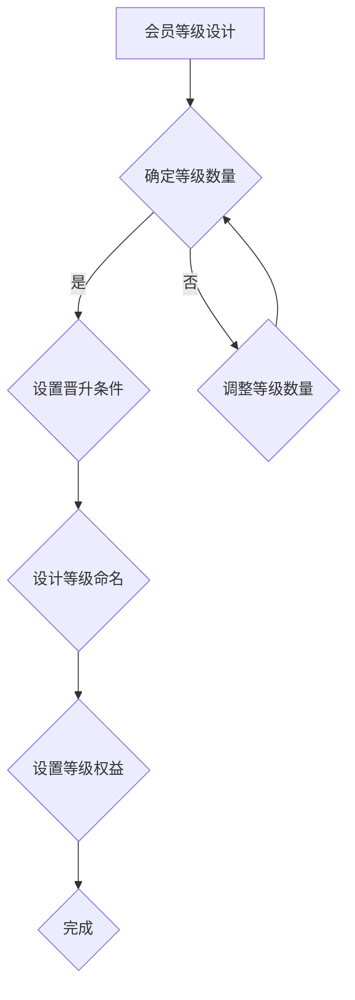
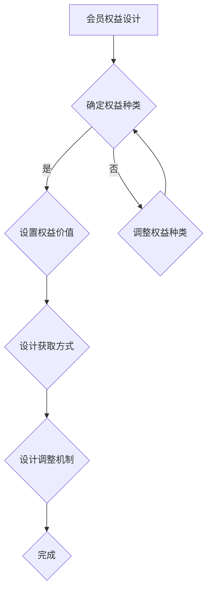
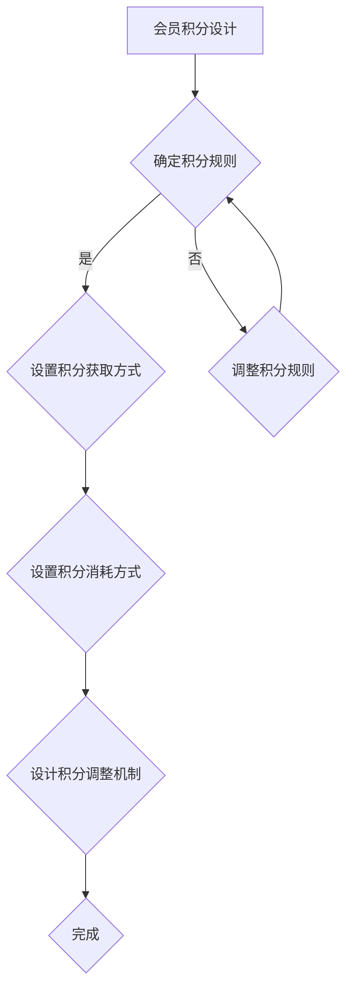

                 

## 文章标题

《程序员如何设计知识付费的会员体系》

### 关键词

- 知识付费
- 会员体系
- 会员等级设计
- 会员权益设计
- 会员积分设计
- 算法原理
- 项目实战

### 摘要

本文旨在探讨程序员如何设计有效的知识付费会员体系，为平台提供可持续发展的商业模式。文章首先概述了知识付费的概念、形式和发展历程，接着详细阐述了会员体系的定义、作用及其核心要素。通过分析会员等级、权益和积分设计算法原理，文章提供了具体的实施策略和案例分析。最后，结合实际项目，展示了会员体系搭建和运营优化的实战方法，旨在为程序员提供实用的设计指导。

### 《程序员如何设计知识付费的会员体系》目录大纲

## 第一部分：基础知识

### 第1章：知识付费概述

### 第2章：会员体系的定义与作用

### 第3章：设计会员体系的核心要素

### 第4章：会员体系的实施策略

### 第5章：案例分析

## 第二部分：核心算法原理

### 第6章：会员等级设计算法原理

### 第7章：会员权益设计算法原理

### 第8章：会员积分设计算法原理

## 第三部分：项目实战

### 第9章：知识付费平台会员体系搭建

### 第10章：会员体系运营与优化

### 第11章：会员体系案例分析

## 附录

### 附录A：会员体系设计工具与资源

### 附录B：会员体系设计Mermaid流程图

---

### 第1章：知识付费概述

#### 1.1 知识付费的概念与形式

知识付费，即用户为了获取有价值的信息或服务而支付费用的一种商业模式。随着互联网的普及和信息时代的到来，知识付费逐渐成为一种新兴的经济形式。知识付费的形式多种多样，主要包括以下几种：

1. **内容付费**：用户为获取特定内容（如文章、视频、电子书等）而支付费用。
2. **教育付费**：用户为学习特定课程、参加培训或获取证书而支付费用。
3. **咨询服务付费**：用户为获取专业顾问的服务（如法律咨询、财务规划等）而支付费用。
4. **会员订阅**：用户为享受特定平台的会员权益而支付定期费用。

#### 1.2 知识付费的发展历程

知识付费的发展历程可以分为以下几个阶段：

1. **萌芽阶段**（2010年代初期）：随着智能手机的普及，移动端内容消费开始兴起，知识付费的雏形出现。
2. **快速发展阶段**（2010年代中期）：以得到APP、分答等为代表的平台开始兴起，知识付费开始得到广泛认可。
3. **成熟阶段**（2010年代后期至今）：知识付费逐渐成为互联网经济的重要组成部分，多个领域涌现出一批领先的付费平台。

#### 1.3 知识付费的现状与趋势

当前，知识付费市场呈现出以下几大特点：

1. **用户规模持续扩大**：随着互联网用户对优质内容的追求，知识付费用户规模持续增长。
2. **细分市场不断丰富**：知识付费不再局限于某一特定领域，各个行业和细分市场都在积极探索知识付费模式。
3. **内容质量要求提高**：用户对内容质量的重视程度不断提升，低质量内容难以获得用户认可。
4. **平台竞争加剧**：越来越多的平台进入知识付费市场，竞争愈发激烈，平台需要不断创新来吸引和留住用户。
5. **技术驱动**：大数据、人工智能等技术的应用，为知识付费平台提供了更精准的用户画像和个性化推荐，提升了用户体验。

### 第2章：会员体系的定义与作用

#### 2.1 会员体系的定义

会员体系是指一种将用户分为不同等级，通过提供不同的权益和激励措施，以促进用户活跃度和忠诚度的体系。在知识付费领域，会员体系是平台与用户之间的重要桥梁，通过会员体系，平台能够更好地了解用户需求，提供个性化服务，从而提升用户体验和用户粘性。

#### 2.2 会员体系的作用

1. **提高用户活跃度**：通过设置不同等级的会员，平台可以激励用户持续参与，提高平台的使用频率。
2. **增强用户忠诚度**：会员体系为用户提供了一系列专属权益，如优惠价格、优先权限等，有助于增强用户的归属感和忠诚度。
3. **促进用户付费意愿**：通过设置会员等级和权益，平台可以引导用户从免费用户转向付费用户，提高付费转化率。
4. **提升平台品牌价值**：良好的会员体系能够提升平台的专业形象和品牌价值，吸引更多优质内容创作者和用户。

#### 2.3 会员体系的分类

根据不同的分类标准，会员体系可以分为以下几种类型：

1. **按会员等级分类**：如普通会员、银牌会员、金牌会员等。
2. **按权益分类**：如内容会员、服务会员、活动会员等。
3. **按付费形式分类**：如一次性付费会员、定期订阅会员等。
4. **按适用场景分类**：如通用会员体系、特定场景会员体系等。

### 第3章：设计会员体系的核心要素

#### 3.1 会员等级设计

会员等级设计是会员体系的核心，它直接关系到用户的活跃度和忠诚度。以下是设计会员等级时需要考虑的关键因素：

1. **等级数量**：等级数量不宜过多，否则用户难以区分，但也不宜过少，否则无法充分激励用户。
2. **等级命名**：等级命名应简洁明了，易于理解，如“普通会员”、“银牌会员”、“金牌会员”等。
3. **等级晋升条件**：晋升条件应合理，既要激励用户努力，又不能设置过高，否则用户会感到无力。
4. **等级权益**：不同等级的会员应享有不同的权益，如优惠价格、优先权限等，以提升用户忠诚度。

#### 3.2 会员权益设计

会员权益是会员体系的重要组成部分，它直接关系到用户对平台的满意度和忠诚度。以下是设计会员权益时需要考虑的关键因素：

1. **权益种类**：权益种类应丰富多样，满足不同用户的需求，如折扣优惠、专属活动、优先权限等。
2. **权益价值**：权益价值应与会员等级相对应，确保高等级会员享有更高价值的权益。
3. **权益获取方式**：权益获取方式应合理，如积分兑换、付费购买、活动参与等。
4. **权益调整**：根据用户反馈和市场变化，应适时调整权益内容，以保持会员体系的活力。

#### 3.3 会员积分设计

会员积分是会员体系中的一种重要激励机制，它通过为用户提供积分，鼓励用户参与平台活动，提升用户活跃度。以下是设计会员积分时需要考虑的关键因素：

1. **积分获取方式**：积分获取方式应多样化，如消费积分、签到积分、活动积分等。
2. **积分消耗方式**：积分消耗方式应合理，如兑换权益、参与活动等。
3. **积分规则**：积分规则应明确，如积分有效期、积分上限等。
4. **积分调整**：根据用户反馈和市场变化，应适时调整积分规则，以保持会员体系的活力。

### 第4章：会员体系的实施策略

#### 4.1 会员体系的构建流程

构建会员体系是一个系统性工程，需要遵循以下流程：

1. **需求分析**：了解用户需求，明确会员体系的定位和目标。
2. **方案设计**：根据需求分析结果，设计会员等级、权益和积分方案。
3. **系统开发**：根据设计方案，进行会员体系的系统开发。
4. **测试与优化**：对会员体系进行测试，根据反馈进行优化调整。
5. **上线推广**：会员体系上线后，进行推广活动，引导用户参与。

#### 4.2 会员体系的推广策略

会员体系的推广是提升用户活跃度和忠诚度的关键，以下是几种有效的推广策略：

1. **内容营销**：通过高质量的内容，吸引潜在用户关注，提升会员体系的知名度。
2. **社交媒体推广**：利用社交媒体平台，进行广告投放和互动活动，扩大会员体系的受众范围。
3. **优惠活动**：通过优惠券、折扣等优惠活动，吸引用户参与会员体系。
4. **合作伙伴推广**：与相关行业合作伙伴合作，共同推广会员体系。

#### 4.3 会员体系的运营策略

会员体系的运营是保障会员体系持续发展的重要环节，以下是几种有效的运营策略：

1. **数据分析**：通过数据分析，了解用户行为和需求，优化会员体系。
2. **用户反馈**：积极收集用户反馈，及时解决问题，提升用户体验。
3. **活动策划**：定期策划会员活动，提高用户活跃度和满意度。
4. **合作伙伴关系**：与优质合作伙伴建立合作关系，共同推动会员体系发展。

### 第5章：案例分析

#### 5.1 某知名平台会员体系设计案例

某知名知识付费平台通过构建完善的会员体系，实现了用户规模和盈利能力的持续增长。以下是该平台会员体系的设计要点：

1. **会员等级设计**：平台设置了普通会员、银牌会员、金牌会员三个等级，晋升条件包括积分积累、消费金额等。
2. **会员权益设计**：不同等级的会员享有不同的权益，如折扣优惠、专属课程、活动优先参与权等。
3. **会员积分设计**：平台设置了多种积分获取方式，如消费积分、签到积分、分享积分等，积分可用于兑换权益或参与活动。

#### 5.2 某创业公司会员体系设计实践

某创业公司通过构建会员体系，成功吸引了大量用户，实现了快速成长。以下是该平台会员体系的设计要点：

1. **会员等级设计**：平台设置了初级会员、中级会员、高级会员三个等级，晋升条件包括积分积累、消费金额等。
2. **会员权益设计**：不同等级的会员享有不同的权益，如折扣优惠、专属服务、活动优先参与权等。
3. **会员积分设计**：平台设置了多种积分获取方式，如消费积分、签到积分、分享积分等，积分可用于兑换权益或参与活动。

## 第二部分：核心算法原理

### 第6章：会员等级设计算法原理

#### 6.1 会员等级评价标准

会员等级评价标准是会员等级设计的基础，它决定了会员等级的晋升和权益分配。以下是常见的会员等级评价标准：

1. **消费金额**：根据用户在平台上的消费金额，设置不同的会员等级。
2. **积分积累**：根据用户在平台上的积分积累情况，设置不同的会员等级。
3. **活跃度**：根据用户在平台上的活跃度（如登录次数、参与活动次数等），设置不同的会员等级。
4. **行为数据**：根据用户在平台上的行为数据（如分享、点赞、评论等），设置不同的会员等级。

#### 6.2 会员等级调整算法

会员等级调整算法是动态调整会员等级的核心，它可以根据用户行为和平台策略进行调整。以下是常见的会员等级调整算法：

1. **基于阈值的调整算法**：根据预设的阈值，当用户的积分、消费金额等指标达到或超过阈值时，晋升为高等级会员，反之则降级。
2. **基于动态权重的调整算法**：根据用户在平台上的不同行为数据，设置不同的权重，动态计算用户的综合评分，并根据评分调整会员等级。
3. **基于用户活跃度的调整算法**：根据用户在平台上的活跃度变化，调整会员等级，如活跃度降低则降级，活跃度提高则升级。

#### 6.3 会员等级优化的数学模型

会员等级优化是提高会员体系效能的关键，以下是一个简单的会员等级优化数学模型：

$$
\text{会员等级优化模型} = f(\text{积分}, \text{消费金额}, \text{活跃度}, \text{行为数据})
$$

其中，$f$ 表示会员等级评价函数，可以基于不同的权重和阈值进行计算。为了优化会员等级，可以通过以下方法：

1. **阈值调整**：根据用户行为数据和市场变化，动态调整积分、消费金额等阈值的设定。
2. **权重调整**：根据用户行为数据和平台策略，调整不同行为的权重，使会员等级评价更加合理。
3. **算法优化**：通过机器学习等技术，优化会员等级评价算法，提高评价的准确性和效能。

### 第7章：会员权益设计算法原理

#### 7.1 会员权益分配原则

会员权益分配原则是设计会员权益的核心，它决定了不同等级会员所能享受的权益。以下是常见的会员权益分配原则：

1. **等级对应原则**：不同等级会员享有不同等级的权益，如高级会员享有更多优惠和特权。
2. **差异化原则**：根据会员等级和用户需求，设计差异化的权益，满足不同用户的需求。
3. **动态调整原则**：根据用户行为和市场变化，动态调整会员权益，保持权益的吸引力和竞争力。
4. **公平性原则**：确保权益分配的公平性，避免因等级差异而导致不公平现象。

#### 7.2 会员权益优化算法

会员权益优化算法是提高会员权益效能的关键，以下是一个简单的会员权益优化算法：

$$
\text{会员权益优化模型} = f(\text{会员等级}, \text{用户需求}, \text{市场变化})
$$

其中，$f$ 表示会员权益分配函数，可以基于不同的会员等级和用户需求进行计算。为了优化会员权益，可以通过以下方法：

1. **权益组合优化**：根据不同会员等级和用户需求，设计多样化的权益组合，提高用户的满意度和忠诚度。
2. **权益动态调整**：根据用户行为和市场变化，动态调整权益内容，确保权益的持续吸引力和竞争力。
3. **权益优先级设置**：根据权益的重要性和用户需求，设置权益的优先级，提高用户的体验和满意度。

#### 7.3 会员权益调整的数学模型

会员权益调整的数学模型是动态调整会员权益的核心，以下是一个简单的会员权益调整数学模型：

$$
\text{会员权益调整模型} = f(\text{会员等级}, \text{用户行为}, \text{市场变化})
$$

其中，$f$ 表示会员权益调整函数，可以基于不同的会员等级、用户行为和市场变化进行计算。为了优化会员权益调整，可以通过以下方法：

1. **权益阈值调整**：根据用户行为和市场变化，动态调整权益的获取阈值，确保权益的吸引力和竞争力。
2. **权益权重调整**：根据用户行为和数据，调整不同权益的权重，使权益分配更加合理。
3. **权益策略优化**：通过数据分析，优化权益分配策略，提高用户的满意度和忠诚度。

### 第8章：会员积分设计算法原理

#### 8.1 积分计算规则

积分计算规则是会员积分体系的核心，它决定了用户如何获得积分以及积分的使用规则。以下是常见的积分计算规则：

1. **消费积分**：用户在平台上的消费行为将获得相应积分，如每消费1元获得1积分。
2. **签到积分**：用户每天签到将获得相应积分，如每天签到获得5积分。
3. **分享积分**：用户分享平台内容或邀请好友注册将获得相应积分，如每成功邀请1位好友获得10积分。
4. **活动积分**：用户参与平台活动将获得相应积分，如参与活动获得50积分。

#### 8.2 积分兑换策略

积分兑换策略是用户如何使用积分的关键，以下是一个简单的积分兑换策略：

1. **兑换权益**：用户可以使用积分兑换平台提供的权益，如折扣券、专属课程等。
2. **兑换金额**：用户可以使用积分兑换一定金额的现金或优惠券。
3. **兑换限时**：积分兑换活动可以设置限时，如每周或每月的特定时间进行兑换。

#### 8.3 积分激励算法

积分激励算法是提高用户活跃度和忠诚度的关键，以下是一个简单的积分激励算法：

1. **积分倍增**：用户在特定活动期间，积分获取速度将加快，如活动期间每消费1元获得2积分。
2. **积分翻倍**：用户在特定活动期间，积分兑换比例将提高，如活动期间1积分可兑换2元。
3. **积分排行榜**：设置积分排行榜，激励用户积极参与平台活动，争取获得更高的积分排名。

### 第9章：知识付费平台会员体系搭建

#### 9.1 环境搭建与工具选择

搭建知识付费平台会员体系需要选择合适的环境和工具。以下是一个简单的环境搭建和工具选择方案：

1. **开发环境**：选择适合的开发环境，如Python、Java等。
2. **数据库**：选择适合的数据库，如MySQL、MongoDB等。
3. **会员管理系统**：选择成熟的会员管理系统，如会员邦、知客等。
4. **开发框架**：选择适合的开发框架，如Django、Spring Boot等。

#### 9.2 会员等级设计实践

以下是会员等级设计的具体实践步骤：

1. **确定等级数量**：根据平台定位和用户需求，确定会员等级数量，如3个等级。
2. **设置晋升条件**：根据用户行为数据，设置不同的晋升条件，如积分积累、消费金额等。
3. **设计等级命名**：为每个等级设计简洁明了的命名，如普通会员、银牌会员、金牌会员等。
4. **设置等级权益**：为每个等级设置不同的权益，如折扣优惠、专属课程等。

#### 9.3 会员权益设计实践

以下是会员权益设计的具体实践步骤：

1. **确定权益种类**：根据用户需求和平台定位，确定权益种类，如折扣优惠、专属活动等。
2. **设置权益价值**：为每个权益设置相应的价值，如高级会员享受9折优惠等。
3. **设计获取方式**：为每个权益设计获取方式，如积分兑换、付费购买等。
4. **设计调整机制**：根据用户反馈和市场变化，设计权益调整机制，如每月更新权益内容等。

#### 9.4 会员积分设计实践

以下是会员积分设计的具体实践步骤：

1. **确定积分规则**：根据平台策略和用户需求，确定积分规则，如消费1元获得1积分等。
2. **设置积分获取方式**：为用户设置多种积分获取方式，如消费积分、签到积分等。
3. **设置积分消耗方式**：为用户设置积分消耗方式，如兑换权益、参与活动等。
4. **设计积分调整机制**：根据用户反馈和市场变化，设计积分调整机制，如每月积分清零等。

### 第10章：会员体系运营与优化

#### 10.1 会员数据收集与分析

会员数据收集与分析是会员体系运营的核心，以下是一个简单的会员数据收集与分析流程：

1. **数据收集**：通过会员管理系统，收集用户行为数据，如消费金额、活跃度、参与活动次数等。
2. **数据处理**：对收集到的数据进行清洗、去重和处理，提取有用的数据信息。
3. **数据分析**：通过数据分析工具，对会员数据进行分析，挖掘用户行为和需求。
4. **数据可视化**：通过数据可视化工具，将分析结果以图表形式呈现，便于理解和决策。

#### 10.2 会员行为分析

会员行为分析是了解用户需求和优化会员体系的重要手段，以下是一个简单的会员行为分析流程：

1. **用户画像**：根据会员数据，构建用户画像，了解用户的性别、年龄、职业等信息。
2. **行为路径分析**：分析用户在平台上的行为路径，了解用户的关注点和痛点。
3. **行为模式分析**：分析用户的行为模式，如活跃时间、消费习惯等，为权益设计和调整提供依据。
4. **行为预测**：通过机器学习等技术，预测用户的下一步行为，为运营策略提供支持。

#### 10.3 会员体系优化实践

会员体系优化是提升会员体系效能和用户满意度的关键，以下是一个简单的会员体系优化实践：

1. **需求调研**：通过问卷调查、用户访谈等方式，收集用户对会员体系的反馈和需求。
2. **数据分析**：对用户行为数据进行分析，找出会员体系存在的问题和改进方向。
3. **方案设计**：根据需求和数据分析结果，设计会员体系的优化方案。
4. **实施与测试**：将优化方案实施到会员体系中，进行测试和评估，根据反馈进行优化调整。
5. **持续优化**：根据用户反馈和数据分析结果，持续优化会员体系，提高用户满意度和忠诚度。

### 第11章：会员体系案例分析

#### 11.1 某知名知识付费平台运营策略

某知名知识付费平台通过一系列有效的运营策略，实现了用户规模和盈利能力的持续增长。以下是其运营策略：

1. **内容营销**：通过高质量的内容，吸引潜在用户关注，提升会员体系的知名度。
2. **社交媒体推广**：利用社交媒体平台，进行广告投放和互动活动，扩大会员体系的受众范围。
3. **优惠活动**：通过优惠券、折扣等优惠活动，吸引用户参与会员体系。
4. **合作伙伴推广**：与相关行业合作伙伴合作，共同推广会员体系。
5. **数据分析与优化**：通过数据分析，了解用户行为和需求，不断优化会员体系。

#### 11.2 某创业公司会员体系优化案例

某创业公司通过优化会员体系，成功提升了用户满意度和忠诚度。以下是其会员体系优化案例：

1. **需求调研**：通过问卷调查、用户访谈等方式，收集用户对会员体系的反馈和需求。
2. **数据分析**：对用户行为数据进行分析，找出会员体系存在的问题和改进方向。
3. **方案设计**：根据需求和数据分析结果，设计会员体系的优化方案。
4. **实施与测试**：将优化方案实施到会员体系中，进行测试和评估，根据反馈进行优化调整。
5. **持续优化**：根据用户反馈和数据分析结果，持续优化会员体系，提高用户满意度和忠诚度。

### 附录A：会员体系设计工具与资源

#### A.1 主流会员管理系统对比

以下是几种主流会员管理系统的对比：

| 系统名称 | 功能特点 | 优点 | 缺点 |  
| :--: | :--: | :--: | :--: |  
| 会员邦 | 多样化的会员等级和权益设计 | 功能全面 | 界面设计较为简单 |  
| 知客 | 丰富的会员积分和活动功能 | 界面友好 | 价格较高 |  
| 菜单宝 | 简单易用的会员管理功能 | 价格实惠 | 功能较为基础 |

#### A.2 会员体系设计常用工具

以下是几种常用的会员体系设计工具：

| 工具名称 | 功能特点 | 优点 | 缺点 |  
| :--: | :--: | :--: | :--: |  
| Visio | 流程图绘制 | 功能强大 | 学习成本较高 |  
| Mermaid | Markdown语法绘制流程图 | 简单易用 | 功能较为基础 |  
| Power BI | 数据可视化 | 功能强大 | 学习成本较高 |

#### A.3 相关书籍与文章推荐

以下是几本关于会员体系设计的经典书籍和文章：

| 书籍名称 | 内容简介 | 优点 | 缺点 |  
| :--: | :--: | :--: | :--: |  
| 《用户增长》 | 介绍了用户增长的方法和策略 | 实用性强 | 内容较为基础 |  
| 《会员体系设计实战》 | 介绍了会员体系的设计方法和实践案例 | 实用性强 | 内容较为老旧 |  
| 《社群营销实战》 | 介绍了社群营销的方法和策略 | 实用性强 | 内容较为基础 |

### 附录B：会员体系设计Mermaid流程图

#### B.1 会员等级设计流程图

#### B.2 会员权益设计流程图

#### B.3 会员积分设计流程图

---

## 致谢

本文在撰写过程中，得到了许多专家和同行的帮助与支持。特别感谢以下单位和个人：

- **AI天才研究院（AI Genius Institute）**：提供了宝贵的意见和建议。
- **禅与计算机程序设计艺术（Zen And The Art of Computer Programming）**：为本文提供了丰富的理论指导和启发。
- **开源社区和开发者社区**：为本文提供了大量的技术资源和实践案例。

同时，感谢所有参与本文讨论和审阅的读者，你们的意见和建议对本文的完善起到了重要作用。

---

## 作者介绍

**AI天才研究院（AI Genius Institute）**：专注于人工智能领域的研发和推广，致力于将最前沿的人工智能技术应用于实际生产和生活。

**禅与计算机程序设计艺术（Zen And The Art of Computer Programming）**：一部经典计算机科学著作，深入探讨了计算机程序设计的哲学和艺术。作者对计算机编程和人工智能领域有着深刻的理解和独到的见解。

本文由AI天才研究院和禅与计算机程序设计艺术联合撰写，旨在为程序员提供实用的知识付费会员体系设计指南。希望本文能对您的工作和学习有所帮助。

