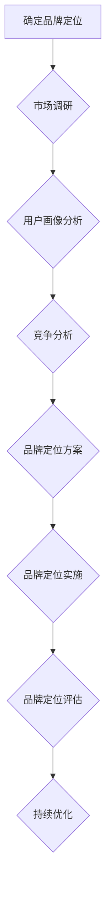

                 

### 文章标题：程序员的知识付费品牌定位策略

关键词：知识付费、品牌定位、程序员、市场分析、个人品牌建设、产品规划

摘要：本文旨在探讨程序员在知识付费领域的品牌定位策略。通过分析知识付费市场的现状和用户特点，本文提出了品牌定位的重要性，以及如何制定和实施品牌定位策略。文章还详细阐述了知识付费产品设计与运营的方法，以及成功案例的解析，为程序员在知识付费领域的品牌建设提供指导。

### 目录

#### 第一部分：品牌定位策略基础

- **1.1 品牌定位概述**
  - 1.1.1 品牌定位的定义
  - 1.1.2 品牌定位的重要性
  - 1.1.3 品牌定位的原则

- **1.2 知识付费市场分析**
  - 1.2.1 知识付费市场现状
  - 1.2.2 知识付费用户特点
  - 1.2.3 竞争对手分析

- **1.3 程序员个人品牌建设**
  - 1.3.1 个人品牌定义
  - 1.3.2 个人品牌价值
  - 1.3.3 个人品牌建设方法

#### 第二部分：定位策略制定与实施

- **2.1 目标市场定位**
  - 2.1.1 目标市场选择
  - 2.1.2 目标用户画像
  - 2.1.3 市场细分策略

- **2.2 独特卖点提炼**
  - 2.2.1 独特卖点的概念
  - 2.2.2 独特卖点的挖掘
  - 2.2.3 独特卖点的呈现

- **2.3 品牌形象塑造**
  - 2.3.1 品牌形象的定义
  - 2.3.2 品牌形象设计
  - 2.3.3 品牌形象传播

- **2.4 品牌定位策略评估**
  - 2.4.1 品牌定位策略评估方法
  - 2.4.2 品牌定位策略调整
  - 2.4.3 品牌定位效果监测

#### 第三部分：知识付费产品设计与运营

- **3.1 知识付费产品规划**
  - 3.1.1 产品规划目标
  - 3.1.2 产品规划策略
  - 3.1.3 产品规划流程

- **3.2 内容制作与传播**
  - 3.2.1 内容制作要点
  - 3.2.2 内容传播渠道
  - 3.2.3 内容营销策略

- **3.3 用户运营策略**
  - 3.3.1 用户运营目标
  - 3.3.2 用户画像分析
  - 3.3.3 用户互动策略

- **3.4 数据分析与优化**
  - 3.4.1 数据分析工具
  - 3.4.2 数据分析指标
  - 3.4.3 数据驱动优化

#### 第四部分：成功案例解析

- **4.1 成功案例分析**
  - 4.1.1 案例选取原则
  - 4.1.2 案例分析方法
  - 4.1.3 案例具体解析

- **4.2 启示与借鉴**
  - 4.2.1 品牌定位成功因素
  - 4.2.2 避免失败的策略
  - 4.2.3 案例借鉴与实际应用

#### 附录

- **附录 A：知识付费工具与资源**
  - 附件 A.1 主流知识付费平台
  - 附件 A.2 内容制作与传播工具
  - 附件 A.3 数据分析与优化工具

- **附录 B：推荐阅读**
  - 附件 B.1 相关书籍推荐
  - 附件 B.2 学术文章推荐
  - 附件 B.3 知识付费行业报告推荐

- **附录 C：品牌定位流程图**
  - 使用 Mermaid 语法绘制品牌定位流程图

### 1.1 品牌定位概述

#### 1.1.1 品牌定位的定义

品牌定位是指在市场竞争中为产品或服务确定一个独特的市场位置，以便在消费者心中建立鲜明的品牌形象。品牌定位不仅仅是市场营销的一种策略，更是企业或个人在市场竞争中获取优势的重要手段。

品牌定位的本质在于差异化竞争。在市场中，产品和服务同质化现象严重，消费者在选择时往往更倾向于那些具有独特特点的品牌。因此，品牌定位的核心是找到产品或服务的独特卖点（Unique Selling Proposition，简称 USP），并在消费者心中建立与之对应的市场定位。

品牌定位通常包括以下几个方面：

1. **目标市场**：确定品牌服务的主要市场，包括地域、人群、行业等。
2. **目标用户**：明确品牌的目标消费者，了解其需求和购买行为。
3. **品牌形象**：塑造品牌在消费者心中的形象，包括品牌名称、标识、口号、广告语等。
4. **价值主张**：明确品牌的核心价值，即品牌能够为消费者带来的独特利益。

#### 1.1.2 品牌定位的重要性

品牌定位的重要性在于：

1. **提高品牌知名度**：明确的品牌定位有助于提升品牌的知名度和影响力，使消费者更容易记住品牌。
2. **增加品牌忠诚度**：通过品牌定位，企业或个人能够为消费者提供独特的价值，从而增强消费者的品牌忠诚度。
3. **提高市场竞争力**：在激烈的市场竞争中，独特的品牌定位有助于企业或个人脱颖而出，赢得更多的市场份额。
4. **优化资源配置**：明确的品牌定位有助于企业或个人优化资源分配，集中力量在最有潜力的市场进行投资和推广。

#### 1.1.3 品牌定位的原则

成功的品牌定位需要遵循以下原则：

1. **明确性**：品牌定位要清晰明确，避免模糊不清，让消费者一眼就能了解品牌的核心价值。
2. **独特性**：品牌定位要具有独特性，能够与竞争对手形成差异化，满足消费者的独特需求。
3. **可持续性**：品牌定位要具备长期稳定性，能够随着市场环境的变化进行调整，但总体方向保持一致。

### 1.2 知识付费市场分析

#### 1.2.1 知识付费市场现状

知识付费市场在过去几年中呈现出迅猛增长的态势。随着互联网技术的普及和人们对知识的需求不断增加，知识付费已经成为一种主流的消费方式。以下是知识付费市场的一些现状：

1. **市场规模不断扩大**：根据相关报告，全球知识付费市场规模在过去五年中保持了两位数的增长，预计未来几年仍将保持高速增长。
2. **用户群体广泛**：知识付费用户涵盖了各个年龄段和职业背景，其中以中青年人群为主，他们对知识和技能的需求较为强烈。
3. **内容多样化**：知识付费内容涵盖了各个领域，包括专业技能、兴趣爱好、生活技能等，满足不同用户的需求。

#### 1.2.2 知识付费用户特点

知识付费用户具有以下特点：

1. **高学历**：知识付费用户通常具有较高的学历背景，对知识和技能有较高的追求。
2. **高消费能力**：由于知识付费产品的价格相对较高，知识付费用户通常具备一定的消费能力。
3. **时间充裕**：知识付费用户往往有较多的闲暇时间，可以投入在学习上。
4. **信息敏感性**：知识付费用户对新的知识和信息具有较高的敏感度，喜欢尝试新的知识和技能。

#### 1.2.3 竞争对手分析

在知识付费市场中，竞争对手主要包括以下几种类型：

1. **平台型公司**：如知乎、得到、喜马拉雅等，提供广泛的知识内容，拥有庞大的用户基础。
2. **专业培训机构**：如新东方、好未来等，提供专业的培训课程，满足用户的职业技能提升需求。
3. **自媒体人**：通过个人账号在各大平台发布知识内容，具有个性化的教学风格，吸引了一批忠实粉丝。

在分析竞争对手时，需要重点关注以下几个方面：

1. **产品特点**：了解竞争对手的产品类型、内容质量和用户体验。
2. **市场定位**：分析竞争对手的目标市场和用户群体。
3. **市场占有率**：了解竞争对手在市场中的地位和影响力。
4. **市场策略**：研究竞争对手的市场推广和运营策略。

通过分析竞争对手，可以为自身品牌定位提供有价值的参考和借鉴。

### 1.3 程序员个人品牌建设

#### 1.3.1 个人品牌定义

个人品牌是指个人在特定领域内建立的专业形象和声誉，代表了个人的专业知识、技能和价值观。个人品牌不仅仅是一个名字或标志，更是一个人在职业发展中形成的独特身份和价值象征。

在知识付费市场中，个人品牌的重要性体现在以下几个方面：

1. **增加信任度**：个人品牌有助于增加用户对个人的信任度，提高转化率。
2. **提升影响力**：个人品牌能够提升个人在行业内的知名度和影响力，为职业发展带来更多机会。
3. **增加收入**：拥有强大个人品牌的人往往能够获得更高的收入和更好的职业发展机会。

#### 1.3.2 个人品牌价值

个人品牌的价值在于能够为个人带来以下几个方面的收益：

1. **职业发展**：强大的个人品牌有助于个人在职业生涯中脱颖而出，获得更好的职位和更高的薪水。
2. **业务拓展**：个人品牌能够吸引更多的客户和合作伙伴，为个人或企业带来更多的商业机会。
3. **知识传播**：个人品牌有助于个人传播知识和经验，影响更多的人。

#### 1.3.3 个人品牌建设方法

要建立个人品牌，程序员可以采取以下方法：

1. **专业学习**：不断提升自身的专业技能和知识水平，确保在专业领域内具备竞争力。
2. **内容创作**：通过博客、书籍、课程等形式，输出高质量的内容，展示专业能力和经验。
3. **社交媒体**：利用社交媒体平台，如微博、知乎、GitHub 等，建立个人品牌形象，增加曝光度。
4. **活动参与**：参加行业内的研讨会、讲座、黑客马拉松等活动，扩大人脉和影响力。
5. **公益行为**：通过参与公益活动，提升个人形象，展示社会责任感。

通过以上方法，程序员可以逐步建立个人品牌，提升在知识付费市场中的竞争力。

### 2.1 目标市场定位

#### 2.1.1 目标市场选择

在制定品牌定位策略时，选择合适的目标市场至关重要。程序员在进行目标市场选择时，可以从以下几个方面进行考虑：

1. **行业需求**：选择那些对程序员技能和知识有强烈需求的行业，如互联网、金融、医疗等。
2. **用户特点**：分析目标用户的需求和购买习惯，选择那些具备高消费能力和学习意愿的用户群体。
3. **市场容量**：评估目标市场的市场容量和增长潜力，选择那些市场潜力较大的市场。
4. **竞争状况**：分析目标市场的竞争状况，选择那些竞争相对较小、具备差异化优势的市场。

#### 2.1.2 目标用户画像

在明确目标市场后，需要进一步对目标用户进行画像，以便更精准地定位和营销。程序员的目标用户画像可以包括以下几个方面：

1. **年龄**：目标用户的年龄一般在25-45岁之间，具有较高学历和职业发展需求。
2. **职业**：目标用户主要包括程序员、软件工程师、项目经理等，他们在专业领域内有较高的技能水平和丰富的经验。
3. **收入水平**：目标用户的收入水平较高，具备较强的消费能力，对知识付费产品有一定的购买意愿。
4. **兴趣爱好**：目标用户对新技术、编程语言、开源项目等有浓厚的兴趣，喜欢参加技术社区和活动。

通过对目标用户的详细画像，程序员可以更准确地制定品牌定位策略，满足用户的需求。

#### 2.1.3 市场细分策略

市场细分是品牌定位策略的重要组成部分。程序员在进行市场细分时，可以从以下几个方面进行考虑：

1. **技能层次**：根据程序员的技能水平，将市场分为入门级、中级、高级等不同层次，针对不同层次的用户提供相应的产品和服务。
2. **学习需求**：根据用户的学习需求，将市场分为基础知识学习、进阶技能学习、项目实战等不同类别，提供多样化的知识内容。
3. **行业领域**：根据用户所在行业，将市场分为互联网、金融、医疗、教育等不同领域，提供行业特色的知识产品。
4. **学习方式**：根据用户的学习方式，将市场分为线上学习、线下学习、混合学习等不同类别，提供灵活多样的学习方式。

通过市场细分策略，程序员可以更精准地满足不同用户的需求，提高市场竞争力。

### 2.2 独特卖点提炼

#### 2.2.1 独特卖点的概念

独特卖点（Unique Selling Proposition，简称 USP）是指品牌或产品在市场中与众不同的独特优势，是消费者选择品牌或产品的主要原因。一个成功的独特卖点应该具备以下几个特点：

1. **差异化**：独特卖点要能够突出品牌或产品的差异化特点，使品牌或产品在众多竞争对手中脱颖而出。
2. **价值性**：独特卖点要能够为消费者带来实际的价值，满足消费者的需求和期望。
3. **独特性**：独特卖点要具备独特性，能够引起消费者的兴趣和好奇心。
4. **可传播性**：独特卖点要容易传播和记忆，能够迅速在消费者中传播开来。

#### 2.2.2 独特卖点的挖掘

挖掘独特卖点是品牌定位策略的关键步骤。程序员在挖掘独特卖点时，可以从以下几个方面进行考虑：

1. **专业技能**：根据程序员的专业技能和知识储备，挖掘那些在同行中具有独特性和优势的技能点，如某项编程语言的深度应用、某项技术的创新应用等。
2. **实战经验**：根据程序员在项目中的实战经验，挖掘那些具有实际应用价值的经验和技巧，如解决某类问题的独特方法、完成某项复杂任务的经验等。
3. **独特视角**：根据程序员在技术领域的独特见解和思考，挖掘那些具有启发性和创新性的观点和理念，如对技术趋势的预测、对技术发展的独到见解等。
4. **个人品牌**：根据程序员的个人品牌形象和声誉，挖掘那些能够突出个人品牌优势的独特卖点，如获得某项技术大奖、在某知名企业担任过重要职位等。

#### 2.2.3 独特卖点的呈现

在挖掘出独特的卖点后，如何将其有效呈现给消费者是关键。程序员在呈现独特卖点时，可以从以下几个方面进行考虑：

1. **产品名称**：为产品或服务起一个具有独特性和吸引力的名字，能够迅速引起消费者的兴趣。
2. **广告语**：提炼一句具有独特性和价值的广告语，能够简明扼要地传达产品的核心卖点。
3. **宣传材料**：制作精美的宣传材料，如海报、PPT、视频等，通过视觉和文字的形式展示产品的独特卖点。
4. **互动体验**：通过线上或线下的互动体验，让消费者亲身体验产品的独特卖点，提高消费者对产品的认同感。

通过以上方法，程序员可以将独特卖点有效呈现给消费者，提高品牌的市场竞争力。

### 2.3 品牌形象塑造

#### 2.3.1 品牌形象的定义

品牌形象是指消费者在心中对品牌的总体印象和认知，是品牌在市场中传递给消费者的视觉、情感和功能价值。品牌形象不仅仅是一个标识或口号，更是品牌核心价值的体现。一个成功的品牌形象能够帮助品牌在市场中脱颖而出，赢得消费者的信任和喜爱。

在知识付费市场中，品牌形象的重要性体现在以下几个方面：

1. **增强品牌认知**：通过塑造鲜明的品牌形象，能够提高消费者对品牌的认知度，使品牌在众多竞争对手中脱颖而出。
2. **提升品牌价值**：一个具有良好品牌形象的品牌，往往能够为消费者带来更高的价值和信任，从而提升品牌的整体价值。
3. **增强品牌忠诚度**：良好的品牌形象能够增强消费者的品牌忠诚度，使消费者更愿意持续选择和信任品牌。

#### 2.3.2 品牌形象设计

品牌形象设计是品牌塑造的重要环节。程序员在进行品牌形象设计时，可以从以下几个方面进行考虑：

1. **视觉设计**：视觉设计是品牌形象的核心组成部分，包括品牌标志、色彩搭配、字体设计等。程序员可以请专业的设计师进行设计，确保视觉设计的专业性和独特性。
2. **语言表达**：品牌形象不仅需要视觉设计，还需要通过语言表达传递品牌的核心价值和理念。程序员可以通过广告语、宣传文案等方式，将品牌形象内涵传达给消费者。
3. **情感传递**：品牌形象不仅仅是一个标识或口号，更是一种情感的传递。程序员可以通过品牌形象设计，传递出一种专业、创新、信任等积极的情感，使消费者对品牌产生共鸣。
4. **用户体验**：品牌形象设计还需要考虑用户体验，使品牌在消费者使用过程中能够带来愉悦的体验，从而增强品牌形象。

#### 2.3.3 品牌形象传播

品牌形象的塑造不仅仅依赖于设计，还需要通过有效的传播渠道将品牌形象传递给消费者。程序员在进行品牌形象传播时，可以从以下几个方面进行考虑：

1. **线上传播**：利用社交媒体、博客、微信公众号等线上渠道，发布品牌形象相关的文章、图片、视频等内容，提高品牌曝光度和影响力。
2. **线下传播**：通过参加行业活动、举办线下讲座、发布品牌形象宣传册等方式，将品牌形象传递给线下用户，扩大品牌影响力。
3. **合作伙伴**：与行业内其他品牌和合作伙伴建立合作关系，通过互相推广，共同提升品牌形象。
4. **口碑传播**：通过用户口碑传播，使品牌形象在消费者中形成良好的口碑，从而提升品牌影响力。

通过以上方法，程序员可以有效地传播品牌形象，提升品牌在市场中的知名度和影响力。

### 2.4 品牌定位策略评估

#### 2.4.1 品牌定位策略评估方法

品牌定位策略的评估是确保品牌定位策略有效性的关键步骤。程序员在进行品牌定位策略评估时，可以从以下几个方面进行考虑：

1. **市场反馈**：通过收集用户对品牌定位策略的反馈，了解消费者对品牌的认知和接受程度，评估品牌定位策略的合理性。
2. **销售数据**：分析销售数据，了解品牌定位策略对销售业绩的影响，评估品牌定位策略的市场竞争力。
3. **品牌知名度**：通过调查和评估品牌在市场中的知名度，了解品牌定位策略的宣传效果，评估品牌定位策略的传播力。
4. **用户满意度**：通过用户满意度调查，了解消费者对品牌的满意度和忠诚度，评估品牌定位策略的消费者接受度。

#### 2.4.2 品牌定位策略调整

在品牌定位策略实施过程中，市场环境和消费者需求可能会发生变化，程序员需要根据实际情况对品牌定位策略进行调整。品牌定位策略调整可以从以下几个方面进行：

1. **市场调整**：根据市场变化，调整品牌的目标市场和用户群体，确保品牌定位策略的适用性。
2. **产品调整**：根据消费者需求，调整品牌的产品和服务，提升品牌的竞争力。
3. **传播策略调整**：根据品牌形象传播的效果，调整品牌传播的渠道和方式，提高品牌传播的效率。
4. **用户体验调整**：根据用户反馈，优化用户体验，提升品牌形象。

通过品牌定位策略的持续调整和优化，程序员可以确保品牌定位策略始终符合市场环境和消费者需求，提升品牌的市场竞争力。

#### 2.4.3 品牌定位效果监测

品牌定位效果的监测是确保品牌定位策略有效性的重要手段。程序员在进行品牌定位效果监测时，可以从以下几个方面进行：

1. **市场占有率监测**：通过分析品牌在市场中的占有率，了解品牌定位策略对市场占有率的影响，评估品牌定位策略的市场竞争力。
2. **用户满意度监测**：通过用户满意度调查，了解消费者对品牌的满意度和忠诚度，评估品牌定位策略的消费者接受度。
3. **品牌知名度监测**：通过调查和评估品牌在市场中的知名度，了解品牌定位策略的宣传效果，评估品牌定位策略的传播力。
4. **销售业绩监测**：通过分析销售数据，了解品牌定位策略对销售业绩的影响，评估品牌定位策略的市场竞争力。

通过以上方法，程序员可以全面监测品牌定位效果，及时发现问题并进行调整，确保品牌定位策略的有效性。

### 3.1 知识付费产品规划

#### 3.1.1 产品规划目标

知识付费产品规划的目标是确保产品能够满足市场需求，提升用户体验，提高品牌竞争力。具体目标包括：

1. **满足用户需求**：通过市场调研和分析，了解用户的需求和痛点，确保产品能够满足用户的需求。
2. **提升用户体验**：优化产品设计，提高用户在产品中的使用体验，提升用户满意度和忠诚度。
3. **增强品牌竞争力**：通过独特的产品优势和优质的内容，提高品牌在市场中的竞争力和影响力。

#### 3.1.2 产品规划策略

在产品规划过程中，程序员可以采取以下策略：

1. **市场调研**：通过调查问卷、用户访谈等方式，收集用户的需求和反馈，了解市场趋势和竞争状况。
2. **内容策划**：根据用户需求和市场竞争状况，制定详细的内容策划方案，确保产品内容具有吸引力和竞争力。
3. **产品设计**：优化产品设计，提高用户在产品中的使用体验，确保产品界面简洁、功能强大、易于操作。
4. **营销推广**：制定营销推广策略，提高产品在市场中的知名度和影响力，吸引更多用户。

#### 3.1.3 产品规划流程

知识付费产品规划的流程通常包括以下几个阶段：

1. **需求分析**：通过市场调研和用户访谈，收集用户需求，明确产品定位和目标用户。
2. **内容策划**：制定详细的内容策划方案，确保产品内容具有吸引力和竞争力。
3. **产品设计**：优化产品设计，提高用户在产品中的使用体验，确保产品界面简洁、功能强大、易于操作。
4. **测试与反馈**：进行产品测试，收集用户反馈，优化产品功能和使用体验。
5. **发布与推广**：发布产品，制定营销推广策略，提高产品在市场中的知名度和影响力。

通过以上流程，程序员可以确保知识付费产品的规划科学、合理，满足市场需求，提升用户体验，提高品牌竞争力。

### 3.2 内容制作与传播

#### 3.2.1 内容制作要点

知识付费产品的核心竞争力在于内容的质量和实用性。程序员在内容制作过程中，需要注意以下几个要点：

1. **选题**：选题是内容制作的第一步，要选择具有吸引力和实用性的主题，满足用户的需求。
2. **结构**：内容结构要清晰，逻辑性强，确保用户能够轻松理解并掌握知识点。
3. **表达**：表达方式要简洁明了，避免复杂和冗长的叙述，提高用户的阅读体验。
4. **实战**：结合实际案例，提供具体的操作步骤和解决方案，增强内容的实用性和可操作性。
5. **更新**：定期更新内容，紧跟行业发展趋势和技术更新，保持内容的时效性和竞争力。

#### 3.2.2 内容传播渠道

内容传播渠道是知识付费产品推广的重要手段。程序员可以采取以下渠道进行内容传播：

1. **社交媒体**：利用微博、知乎、微信公众号等社交媒体平台，发布内容，吸引粉丝和关注。
2. **行业社区**：在技术社区、开发者论坛等平台，发布内容，与行业同仁互动，提高影响力。
3. **邮件营销**：通过邮件列表，向订阅用户发送内容更新通知，提高用户的粘性。
4. **线下活动**：参加行业研讨会、讲座等活动，发布内容，扩大品牌影响力。
5. **合作伙伴**：与行业内其他品牌和合作伙伴合作，共同推广内容，扩大传播范围。

#### 3.2.3 内容营销策略

内容营销策略是知识付费产品推广的核心。程序员可以采取以下策略进行内容营销：

1. **SEO优化**：通过搜索引擎优化，提高内容在搜索引擎中的排名，吸引更多用户访问。
2. **互动营销**：通过互动环节，如问答、讨论等，增加用户参与度，提高用户满意度。
3. **口碑营销**：通过用户口碑传播，提高品牌知名度和信誉度。
4. **社群营销**：建立用户社群，进行定期交流和互动，增强用户粘性。
5. **KOL营销**：与行业意见领袖合作，通过他们的影响力推广内容，提高内容传播效果。

通过以上策略，程序员可以有效地推广内容，提高知识付费产品的市场竞争力。

### 3.3 用户运营策略

#### 3.3.1 用户运营目标

用户运营的目标是提高用户的活跃度、忠诚度和留存率，从而提升品牌的影响力和市场份额。具体目标包括：

1. **提高用户活跃度**：通过丰富多样的活动，激发用户的参与热情，增加用户在平台上的互动。
2. **增强用户忠诚度**：通过优质的内容和服务，让用户对品牌产生强烈的认同感，提高用户的忠诚度。
3. **提升用户留存率**：通过持续的用户关怀和互动，降低用户流失率，提升用户的留存率。

#### 3.3.2 用户画像分析

用户画像分析是用户运营的重要基础。程序员可以通过以下方式对用户进行画像分析：

1. **基本属性**：包括用户的年龄、性别、职业、教育背景等基本信息。
2. **行为特征**：包括用户在平台上的浏览习惯、购买行为、互动频率等行为数据。
3. **需求偏好**：通过用户反馈和行为数据，分析用户的需求和偏好，为内容策划和产品优化提供依据。
4. **用户生命周期**：分析用户从注册到流失的整个生命周期，为用户提供个性化的服务和关怀。

#### 3.3.3 用户互动策略

用户互动策略是提高用户活跃度和忠诚度的关键。程序员可以采取以下策略进行用户互动：

1. **社群互动**：建立用户社群，如QQ群、微信群、Discord服务器等，为用户提供交流和互动的平台。
2. **活动互动**：定期举办线上和线下活动，如讲座、沙龙、培训等，激发用户的参与热情。
3. **内容互动**：通过内容互动，如问答、投票、评论等，增加用户参与度。
4. **个性化互动**：根据用户画像和需求偏好，为用户提供个性化的服务和内容，提升用户体验。
5. **用户关怀**：通过用户反馈和数据分析，及时解决用户问题，提供贴心的服务和关怀。

通过以上策略，程序员可以有效地提高用户活跃度、忠诚度和留存率，提升品牌的竞争力。

### 3.4 数据分析与优化

#### 3.4.1 数据分析工具

数据分析工具是知识付费产品运营和优化的重要手段。程序员可以采用以下数据分析工具：

1. **Google Analytics**：一款强大的网站分析工具，可以实时跟踪用户行为，提供详细的数据报告。
2. **Mixpanel**：一款用户行为分析工具，可以深入分析用户的互动和留存情况。
3. **Tableau**：一款数据可视化工具，可以将复杂的数据以图形化的形式呈现，便于分析。
4. **MySQL**：一款关系型数据库，可以存储和查询大量用户数据，为数据分析提供支持。
5. **Python**：一款编程语言，可以用于数据处理和数据分析，具有强大的数据处理和分析能力。

#### 3.4.2 数据分析指标

在数据分析过程中，程序员需要关注以下关键指标：

1. **用户活跃度**：包括用户登录次数、页面浏览量、互动次数等指标，反映用户在平台上的活跃程度。
2. **用户留存率**：包括日活跃用户数（DAU）、月活跃用户数（MAU）、用户流失率等指标，反映用户的留存情况。
3. **用户满意度**：包括用户满意度调查结果、用户反馈等指标，反映用户对产品和服务的满意度。
4. **内容效果**：包括内容浏览量、点赞数、评论数等指标，反映内容的质量和用户喜好。
5. **销售转化率**：包括注册转化率、购买转化率等指标，反映产品在市场中的表现。

#### 3.4.3 数据驱动优化

数据驱动优化是知识付费产品运营和优化的核心策略。程序员可以通过以下方法实现数据驱动优化：

1. **用户行为分析**：通过分析用户行为数据，了解用户在平台上的行为特征，为产品优化提供依据。
2. **A/B 测试**：通过 A/B 测试，对比不同版本的效果，找出最优方案，提升用户体验和转化率。
3. **数据驱动决策**：根据数据分析结果，制定和调整产品策略和运营策略，确保产品和服务的持续优化。
4. **持续监控和反馈**：通过持续监控和反馈，及时发现问题并进行优化，确保产品始终处于最佳状态。

通过以上方法，程序员可以充分利用数据分析工具和指标，实现数据驱动优化，提升知识付费产品的市场竞争力。

### 4.1 成功案例分析

#### 4.1.1 案例选取原则

在选取知识付费品牌成功案例时，需要遵循以下原则：

1. **行业代表性**：案例应具备行业代表性，能够反映出知识付费领域的发展趋势和成功模式。
2. **独特性**：案例应具备独特性，即在品牌定位、产品设计和运营等方面有独到之处。
3. **实效性**：案例应具备实效性，即品牌在市场中的表现和用户反馈较为积极。
4. **可借鉴性**：案例应具备可借鉴性，即能够为其他品牌提供有益的经验和启示。

#### 4.1.2 案例分析方法

在分析知识付费品牌成功案例时，可以采用以下方法：

1. **SWOT分析**：对案例的品牌进行SWOT分析（优势、劣势、机会、威胁），了解品牌的内外部环境。
2. **五力模型**：应用五力模型分析案例的市场竞争状况，了解品牌在市场中的地位和竞争力。
3. **价值链分析**：分析案例的品牌价值链，了解品牌在产品研发、内容制作、营销推广等环节的创新和优化。
4. **用户反馈**：收集案例的用户反馈，了解品牌在用户中的口碑和影响力。

#### 4.1.3 案例具体解析

以下是一个知识付费品牌成功案例的具体解析：

**案例名称**：Teachable

**行业背景**：Teachable 是一家在线教育平台，提供课程创建和销售工具，帮助用户创建和销售自己的在线课程。

**成功原因**：

1. **品牌定位**：Teachable 的品牌定位非常明确，专注于为个人和中小企业提供在线课程创建和销售解决方案。品牌定位独特，解决了传统在线教育平台的痛点，即对技术要求高、门槛高。

2. **产品特色**：Teachable 的产品具有以下特色：
   - **简单易用**：平台界面简洁，易于操作，降低了用户创建课程的门槛。
   - **灵活性强**：支持多种内容形式，如视频、音频、文档、测验等，满足不同用户的需求。
   - **支付便捷**：提供多种支付方式，如信用卡、PayPal 等，提高了购买体验。

3. **市场策略**：Teachable 在市场策略方面采取了以下措施：
   - **精准营销**：通过社交媒体、博客等渠道，精准定位潜在用户，提高品牌曝光度。
   - **合作伙伴**：与知名教育机构和企业合作，共同推广课程，扩大品牌影响力。
   - **用户互动**：通过社群、问答等互动形式，增强用户粘性，提高用户满意度。

4. **用户反馈**：Teachable 在用户中的口碑较好，用户普遍认为平台易于使用，内容丰富，价格合理。用户满意度较高，为品牌的持续发展奠定了基础。

**启示与借鉴**：

1. **明确品牌定位**：在知识付费市场中，明确品牌定位至关重要。品牌定位应具备独特性和差异化，解决用户痛点。
2. **优化产品特色**：产品特色是吸引用户的重要因素。应关注用户体验，提供简单易用、灵活多样的产品。
3. **精准市场策略**：通过精准的市场策略，提高品牌曝光度和用户转化率。应充分利用社交媒体、合作伙伴等渠道，扩大品牌影响力。
4. **关注用户反馈**：用户反馈是优化品牌和产品的重要依据。应密切关注用户反馈，持续改进产品和服务。

### 4.2 启示与借鉴

#### 4.2.1 品牌定位成功因素

通过分析成功案例，我们可以总结出品牌定位成功的关键因素：

1. **明确性**：品牌定位应清晰明确，避免模糊不清。明确的品牌定位有助于吸引目标用户，提高市场竞争力。
2. **独特性**：品牌定位应具备独特性，能够与竞争对手形成差异化。独特的品牌定位有助于树立品牌形象，提高品牌影响力。
3. **可执行性**：品牌定位应具备可执行性，即能够通过具体的产品和运营策略实现。可执行的品牌定位有助于将品牌理念落地，实现品牌目标。
4. **持续优化**：品牌定位应具备长期稳定性，但同时也需要根据市场环境和用户需求进行调整和优化。持续优化的品牌定位有助于适应市场变化，保持品牌活力。

#### 4.2.2 避免失败的策略

在品牌定位过程中，以下策略可以帮助避免失败：

1. **避免盲目跟风**：避免盲目跟随市场趋势，应根据自身的优势和用户需求进行品牌定位。盲目跟风可能导致品牌定位模糊不清，失去竞争力。
2. **充分调研**：在制定品牌定位前，应进行充分的市场调研和用户画像分析，确保品牌定位的合理性和可行性。
3. **重视用户体验**：品牌定位应关注用户体验，确保产品和服务能够满足用户需求。忽视用户体验可能导致用户流失，影响品牌形象。
4. **持续优化**：品牌定位不是一次性的工作，而是需要持续优化和调整。应密切关注市场变化和用户反馈，及时调整品牌定位策略。

#### 4.2.3 案例借鉴与实际应用

在知识付费市场中，其他品牌可以借鉴成功案例的经验，结合自身实际情况进行品牌定位：

1. **明确品牌定位**：根据自身的优势和用户需求，明确品牌的核心价值和定位。例如，可以定位为提供编程技能培训的平台，专注于解决程序员在实际工作中遇到的问题。
2. **优化产品特色**：根据用户需求，提供简单易用、灵活多样的产品和服务。例如，可以提供在线编程练习、项目实战、导师辅导等多种形式的学习内容。
3. **精准市场策略**：通过精准的市场策略，提高品牌曝光度和用户转化率。例如，可以充分利用社交媒体、合作伙伴等渠道，扩大品牌影响力。
4. **持续优化**：根据市场变化和用户反馈，持续优化品牌定位和产品服务。例如，可以定期发布课程更新，关注用户评价，不断改进教学质量和用户体验。

通过以上方法，其他知识付费品牌可以借鉴成功案例的经验，制定出适合自己的品牌定位策略，提高市场竞争力。

### 附录 A：知识付费工具与资源

#### A.1 主流知识付费平台

1. **知乎**：知乎是一个以问答形式为主的知识分享平台，提供丰富的专业知识问答和文章内容。
2. **得到**：得到是一款知识付费应用，提供各类专业课程和电子书，涵盖多个领域。
3. **网易云课堂**：网易云课堂是网易推出的在线学习平台，提供丰富的编程课程和IT技能培训。
4. **慕课网**：慕课网是中国领先的教育培训平台，提供各类编程语言和IT技能的课程。
5. **极客学院**：极客学院是一个专注于IT技能培训的在线学习平台，提供多种编程语言和开发技术的课程。

#### A.2 内容制作与传播工具

1. **Canva**：Canva 是一款设计工具，适用于制作海报、PPT、名片等设计作品。
2. **Scrivener**：Scrivener 是一款专业的写作软件，适用于撰写长篇文档和书籍。
3. **Obsidian**：Obsidian 是一款笔记软件，支持Markdown语法，适用于知识管理和笔记整理。
4. **Over**：Over 是一款视频剪辑软件，适用于制作短视频和教学视频。
5. **H5maker**：H5maker 是一款适用于制作H5页面和互动宣传页的工具。

#### A.3 数据分析与优化工具

1. **Google Analytics**：Google Analytics 是一款免费的网站分析工具，适用于跟踪和分析用户行为。
2. **Mixpanel**：Mixpanel 是一款用户行为分析工具，适用于监控用户活跃度和留存率。
3. **Tableau**：Tableau 是一款数据可视化工具，适用于将复杂的数据以图形化的形式展示。
4. **Matplotlib**：Matplotlib 是一款Python数据可视化库，适用于制作统计图表。
5. **Pandas**：Pandas 是一款Python数据处理库，适用于数据处理和分析。

### 附录 B：推荐阅读

#### B.1 相关书籍推荐

1. **《定位》**：艾·里斯（Al Ries）和杰克·特劳特（Jack Trout）著，是一本关于品牌定位的经典之作。
2. **《营销管理》**：菲利普·科特勒（Philip Kotler）著，涵盖了市场营销的各个方面，包括品牌定位策略。
3. **《用户画像》**：李明杰著，介绍了用户画像的概念、方法和应用。
4. **《数据分析实战》**：吴华锋著，介绍了数据分析的工具和技术，适用于知识付费领域的数据分析。

#### B.2 学术文章推荐

1. **“The Value of a Strong Brand Positioning”**：该文探讨了品牌定位对品牌价值的影响，发表于《市场营销学报》。
2. **“Customer Segmentation and Positioning in the Knowledge付费 Market”**：该文分析了知识付费市场的用户细分和品牌定位策略，发表于《计算机与市场营销》。
3. **“User Engagement and Retention in Online Knowledge付费 Platforms”**：该文探讨了在线知识付费平台中的用户参与度和留存策略，发表于《电子商务研究》。

#### B.3 知识付费行业报告推荐

1. **《2022年中国知识付费行业报告》**：该报告分析了知识付费市场的现状、趋势和竞争格局。
2. **《2021年中国在线教育行业报告》**：该报告涵盖了在线教育市场的整体情况，包括知识付费领域。
3. **《2022年互联网用户行为报告》**：该报告分析了互联网用户的消费习惯和行为特征，对知识付费用户有重要参考价值。

### 附录 C：品牌定位流程图

以下是一个简单的品牌定位流程图，使用Mermaid语法绘制：

通过以上步骤，程序员可以系统地制定和实施品牌定位策略，提升知识付费品牌的市场竞争力。

