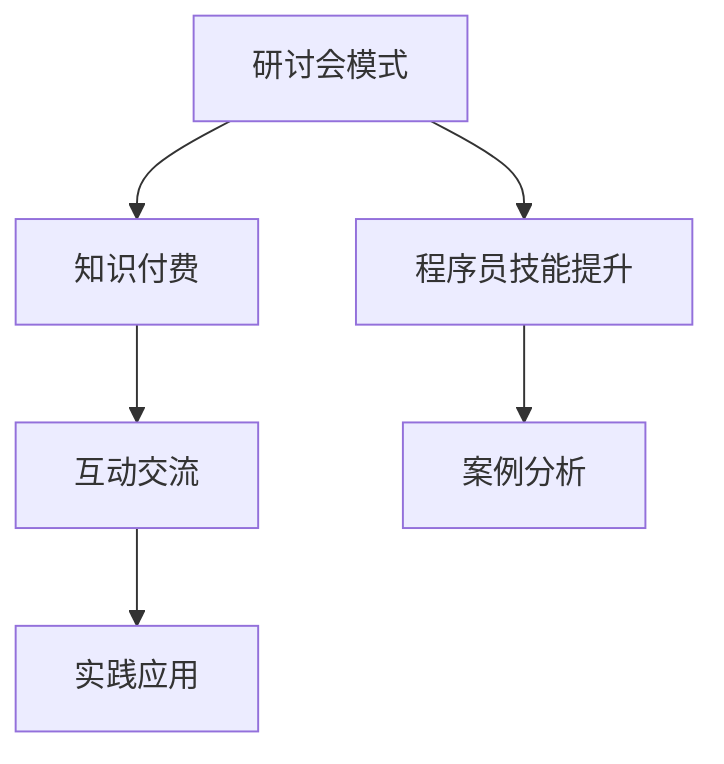
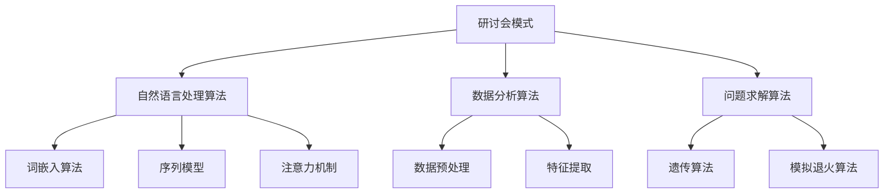
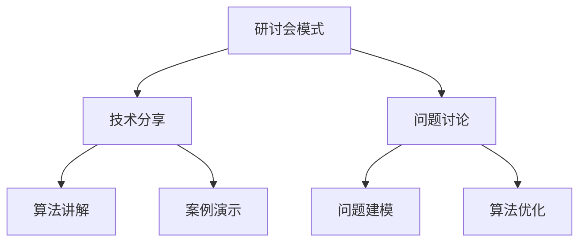
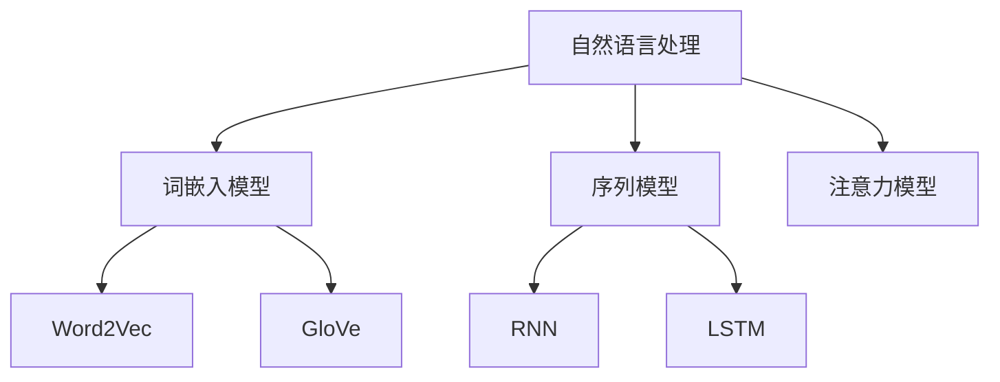
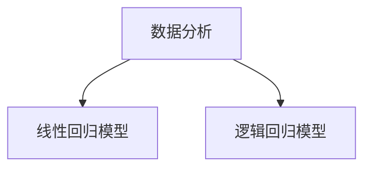
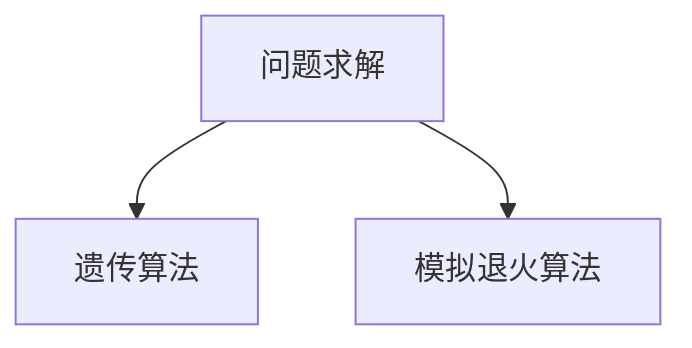

                 

# 文章标题

《程序员知识付费：打造研讨会模式》

> 关键词：程序员、知识付费、研讨会模式、算法、数学模型、项目实战

> 摘要：本文深入探讨了程序员知识付费中的研讨会模式，分析了其核心概念、算法原理、数学模型和项目实战。通过详细讲解，揭示了研讨会模式在知识付费市场中的重要地位和未来发展前景。

----------------------------------------------------------------

## 第一部分：核心概念与联系

### 1.1 程序员知识付费：研讨会模式概述

#### **研讨会模式定义**

研讨会模式是一种通过集体讨论、知识分享和互动交流的方式，帮助程序员提升技能和解决实际问题的知识付费模式。该模式强调实践与理论相结合，通过案例研究和互动讨论，帮助程序员深入理解和掌握新知识。

#### **研讨会模式的优势**

- **高效性**：通过互动交流，快速解决程序员在工作和学习中的问题。
- **针对性**：针对程序员的具体需求，提供定制化的知识分享和技能提升。
- **实用性**：通过案例分析，使程序员能够将所学知识应用到实际工作中。

#### **研讨会模式与知识付费的关系**

- 知识付费为研讨会模式提供资金支持，使其能够持续发展。
- 研讨会模式通过提供高质量的知识和服务，为知识付费市场带来价值。

### **1.2 程序员知识付费的发展历程**

#### **初期阶段**

- 程序员主要通过购买书籍、参加培训等方式获取知识。
- 知识付费模式尚未成熟，市场以传统的教育模式为主。

#### **发展阶段**

- 在线教育平台兴起，如Coursera、Udemy等，为程序员提供丰富的在线课程。
- 知识付费逐渐成为一种重要的学习方式，得到广泛认可。

#### **成熟阶段**

- 知识付费市场逐渐细分，出现针对程序员的专业培训、研讨会等模式。
- 研讨会模式成为程序员提升技能的一种重要方式。

### **1.3 研讨会模式的组成部分**

#### **组织者**

- 负责策划和主持研讨会，邀请专家和讲师，确保研讨会的质量和效果。

#### **讲师**

- 提供专业知识和经验分享，引导参与者深入探讨问题。

#### **参与者**

- 包括程序员、技术爱好者等，通过参与研讨会，提升自己的技能和知识。

#### **研讨会内容**

- 包括技术分享、案例分析、问题讨论等，旨在帮助参与者解决实际问题。

### **1.4 研讨会模式的未来发展趋势**

#### **个性化定制**

- 根据参与者的需求和兴趣，提供定制化的研讨会内容和服务。

#### **线上线下结合**

- 利用线上平台，扩大研讨会的影响力和参与范围。

#### **多元化形式**

- 结合直播、录播、互动讨论等多种形式，提升研讨会的互动性和参与度。

### **1.1.1 研讨会模式的核心概念与联系流程图**



### **1.1.2 研讨会模式的核心概念与联系流程图**


## 第二部分：核心算法原理讲解

### **2.1 研讨会模式的算法基础**

#### **算法概述**

研讨会模式中涉及的主要算法包括：自然语言处理算法、数据分析算法和问题求解算法。

#### **自然语言处理算法**

##### **词嵌入算法**

- **词嵌入算法**：将词语映射为向量表示，用于文本分析和处理。
  - **Word2Vec**：基于神经网络的语言模型，通过训练得到词语的向量表示。
  - **GloVe**：基于全局向量空间模型，通过优化词语的共现关系得到向量表示。

##### **序列模型**

- **序列模型**：处理序列数据的模型，如循环神经网络（RNN）和长短期记忆网络（LSTM）。
  - **RNN**：通过记忆历史信息，处理序列数据。
  - **LSTM**：改进RNN，解决长期依赖问题。

##### **注意力机制**

- **注意力机制**：在处理序列数据时，关注关键信息，提高模型的性能。
  - **计算方式**：使用点积、加性和乘性注意力机制，计算注意力分数。
  - **更新规则**：通过更新注意力权重，调整序列中的信息关注点。

#### **数据分析算法**

- **数据预处理**：包括数据清洗、数据归一化等，为后续分析做准备。
- **特征提取**：从原始数据中提取有用的信息，用于建模和预测。
  - **TF-IDF**：基于词频和逆文档频率，计算词语的重要性。
  - **词袋模型**：将文本表示为词频向量，用于文本分类和聚类。

#### **问题求解算法**

- **遗传算法**：模拟生物进化过程，用于求解优化问题和组合问题。
- **模拟退火算法**：基于概率模型，通过逐步降温，寻找最优解。

### **2.2 研讨会模式中的算法应用**

#### **技术分享**

- **算法讲解**：讲师通过讲解算法原理和实现方法，帮助参与者理解相关技术。
- **案例演示**：通过实际案例，展示算法在解决问题中的应用。

#### **问题讨论**

- **问题建模**：参与者结合实际需求，使用相关算法构建问题模型。
- **算法优化**：通过分析和讨论，优化算法性能，解决实际问题。

### **2.1.1 研讨会模式的算法基础流程图**



### **2.1.2 研讨会模式中的算法应用流程图**



## 第三部分：数学模型和数学公式讲解

### **3.1 自然语言处理中的数学模型**

#### **词嵌入模型**

##### **Word2Vec模型**

- **损失函数**：使用负采样损失函数，降低训练复杂度。
- **更新规则**：使用梯度下降优化算法，更新词向量。

##### **GloVe模型**

- **损失函数**：使用奇异值分解（SVD）优化损失函数。
- **更新规则**：使用交替优化方法，分别更新词语和文档的向量表示。

#### **序列模型**

##### **RNN模型**

- **激活函数**：使用ReLU函数，提高模型的非线性表达能力。
- **梯度消失和梯度爆炸**：通过LSTM模型解决。

##### **LSTM模型**

- **门控机制**：使用输入门、遗忘门和输出门，控制信息的流动。
- **梯度消失和梯度爆炸**：通过门控机制和梯度裁剪解决。

#### **注意力模型**

- **注意力机制**：
  - **计算方式**：使用点积、加性和乘性注意力机制，计算注意力分数。
  - **更新规则**：通过更新注意力权重，调整序列中的信息关注点。

### **3.2 数据分析中的数学模型**

#### **线性回归模型**

- **损失函数**：使用均方误差（MSE）作为损失函数。
- **优化算法**：使用梯度下降优化算法，更新模型参数。

#### **逻辑回归模型**

- **损失函数**：使用对数似然损失函数。
- **优化算法**：使用梯度下降优化算法，更新模型参数。

### **3.3 问题求解中的数学模型**

#### **遗传算法**

- **适应度函数**：计算个体的适应度，用于评估个体的优劣。
- **选择机制**：使用选择操作，根据适应度选择个体进行交叉和变异。

#### **模拟退火算法**

- **目标函数**：最小化目标函数，求解最优解。
- **冷却过程**：通过逐步降温，降低搜索空间，避免陷入局部最优。

### **3.1.1 自然语言处理中的数学模型流程图**



### **3.1.2 数据分析中的数学模型流程图**



### **3.1.3 问题求解中的数学模型流程图**



## 第四部分：项目实战

### **4.1 研讨会项目实战概述**

#### **项目背景**

假设某公司计划举办一场关于“程序员知识付费：研讨会模式”的研讨会，旨在提升程序员的技术水平和解决实际工作中的问题。

#### **项目目标**

策划和执行一场成功的研讨会，包括：

- 确定研讨会主题和议程。
- 邀请合适的讲师和参与者。
- 搭建研讨会平台和技术支持。
- 实施研讨会，收集反馈并进行优化。

### **4.2 研讨会策划与组织**

#### **确定研讨会主题和议程**

- **主题**：程序员知识付费：研讨会模式
- **议程**：
  - 开场致辞
  - 技术分享：深度学习在NLP中的应用
  - 案例分析：如何利用研讨会模式解决实际编程问题
  - 互动讨论：参会者提出问题，专家解答
  - 总结与反馈：总结研讨会成果，收集参会者反馈

#### **邀请讲师和参与者**

- **讲师**：邀请具有丰富经验和知名度的技术专家，确保研讨会内容的质量。
- **参与者**：邀请程序员、技术爱好者等，确保研讨会的参与度和互动性。

#### **搭建研讨会平台和技术支持**

- **平台**：使用在线会议平台，如Zoom、Microsoft Teams等，确保会议的顺利进行。
- **技术支持**：提供网络、音响、视频等技术支持，确保会议效果。

### **4.3 研讨会实施与反馈**

#### **实施研讨会**

- **开场致辞**：由主办方介绍研讨会背景和目的。
- **技术分享**：讲师讲解相关技术，提供实践经验和案例分析。
- **互动讨论**：参会者提问，讲师解答，促进知识交流。
- **总结与反馈**：讲师总结研讨会内容，收集参会者反馈，为后续研讨会提供改进方向。

#### **收集反馈并进行优化**

- **参会者反馈**：通过问卷调查、会议反馈表等方式，收集参会者的意见和建议。
- **反馈分析**：分析反馈信息，识别问题和改进点。
- **优化方案**：根据反馈结果，制定优化方案，包括内容调整、组织流程改进等。

## 第五部分：开发环境搭建与源代码实现

### **5.1 开发环境搭建**

#### **硬件要求**

- **CPU**：至少2核，推荐4核以上
- **内存**：至少4GB，推荐8GB以上
- **硬盘**：至少50GB可用空间

#### **软件要求**

- **操作系统**：Windows、macOS或Linux
- **编程语言**：Python 3.6及以上版本
- **开发环境**：PyCharm、VSCode等IDE

#### **工具与库**

- **NumPy**：用于数值计算
- **pandas**：用于数据处理
- **TensorFlow或PyTorch**：用于深度学习模型构建和训练
- **Matplotlib**：用于数据可视化

### **5.2 源代码实现**

#### **代码框架**

- **数据预处理**：读取数据，进行清洗和预处理，如去除空值、异常值等。
- **模型构建**：构建深度学习模型，包括输入层、隐藏层和输出层。
- **模型训练**：使用训练数据对模型进行训练，调整模型参数。
- **模型评估**：使用验证数据评估模型性能，调整模型结构或参数。
- **模型应用**：将训练好的模型应用于实际数据，进行预测或分类。

#### **关键代码片段**

- **数据预处理**：

  ```python
  import pandas as pd
  data = pd.read_csv('data.csv')
  data = data.dropna()
  data = data[data['target'] != 'unknown']
  ```

- **模型构建**：

  ```python
  import tensorflow as tf
  model = tf.keras.Sequential([
      tf.keras.layers.Dense(128, activation='relu', input_shape=(input_shape)),
      tf.keras.layers.Dense(1, activation='sigmoid')
  ])
  ```

- **模型训练**：

  ```python
  model.compile(optimizer='adam', loss='binary_crossentropy', metrics=['accuracy'])
  model.fit(x_train, y_train, epochs=10, batch_size=32, validation_data=(x_val, y_val))
  ```

- **模型评估**：

  ```python
  loss, accuracy = model.evaluate(x_test, y_test)
  print(f"Test accuracy: {accuracy * 100:.2f}%")
  ```

## 第六部分：代码解读与分析

### **6.1 数据预处理代码解读**

- **目的**：清洗和预处理数据，为后续模型训练做好准备。
- **关键步骤**：
  - **读取数据**：使用`pandas`读取CSV文件，获取原始数据。
  - **去除空值**：使用`dropna()`函数，删除包含空值的行。
  - **异常值处理**：使用`drop()`函数，删除目标标签为“unknown”的行。

### **6.2 模型构建代码解读**

- **目的**：构建深度学习模型，用于分类任务。
- **关键步骤**：
  - **定义模型**：使用`tf.keras.Sequential`，构建模型结构。
  - **添加层**：添加输入层、隐藏层和输出层，指定激活函数和神经元数量。

### **6.3 模型训练代码解读**

- **目的**：使用训练数据对模型进行训练，优化模型参数。
- **关键步骤**：
  - **编译模型**：指定优化器、损失函数和评估指标。
  - **训练模型**：使用`fit()`函数，进行模型训练，指定训练轮次、批量大小和验证数据。

### **6.4 模型评估代码解读**

- **目的**：评估模型在测试数据上的性能。
- **关键步骤**：
  - **评估模型**：使用`evaluate()`函数，计算模型在测试数据上的损失和准确率。

## 第七部分：研讨会模式在知识付费市场中的地位与发展

### **7.1 研讨会模式在知识付费市场中的地位**

- **现状**：研讨会模式作为一种知识付费模式，在程序员群体中逐渐受到认可和青睐。
- **原因**：
  - **高效性**：通过互动交流，快速解决程序员在工作和学习中的问题。
  - **针对性**：针对程序员的具体需求，提供定制化的知识分享和技能提升。
  - **实用性**：通过案例分析，使程序员能够将所学知识应用到实际工作中。

### **7.2 研讨会模式的发展前景**

- **个性化定制**：根据参与者的需求和兴趣，提供定制化的研讨会内容和服务。
- **线上线下结合**：利用线上平台，扩大研讨会的影响力和参与范围。
- **多元化形式**：结合直播、录播、互动讨论等多种形式，提升研讨会的互动性和参与度。

### **7.3 研讨会模式在知识付费市场中的竞争力**

- **优势**：
  - **高质量内容**：邀请专业讲师，提供高质量的技术分享和案例分析。
  - **互动性强**：通过互动讨论，促进知识交流，提升学习效果。
  - **定制化服务**：根据用户需求，提供个性化的知识分享和技能提升方案。

- **挑战**：
  - **内容更新**：保持研讨会内容的新鲜度和时效性。
  - **平台维护**：确保研讨会平台的稳定运行和技术支持。
  - **用户粘性**：提升用户的参与度和忠诚度，保持市场竞争力。

## 附录

### **A.1 研讨会模式常用工具与资源**

- **在线研讨会平台**：
  - **Zoom**：提供稳定的在线会议和直播服务，适合大规模研讨会。
  - **Microsoft Teams**：集成办公和沟通工具，适合企业内部研讨会。
  - **Google Meet**：适用于谷歌生态系统用户，提供便捷的在线会议服务。

- **深度学习框架**：
  - **TensorFlow**：谷歌开发的开源深度学习框架，适用于各种规模的深度学习项目。
  - **PyTorch**：基于Python的深度学习框架，提供灵活的动态计算图。
  - **Keras**：基于TensorFlow的高层API，简化深度学习模型构建和训练。

- **数据分析工具**：
  - **pandas**：Python的数据分析库，提供数据清洗、转换和分析功能。
  - **NumPy**：Python的数值计算库，提供高效的多维数组操作。
  - **Matplotlib**：Python的数据可视化库，提供丰富的图形绘制功能。

### **A.2 研讨会模式案例与实践**

- **案例一：深度学习在NLP中的应用**
  - **主题**：深度学习在自然语言处理中的应用
  - **内容**：介绍深度学习在文本分类、情感分析等任务中的应用，结合实际案例进行讲解。
  - **实践**：提供基于PyTorch的文本分类模型实现，包括数据预处理、模型构建和训练。

- **案例二：研讨会模式的策划与实施**
  - **主题**：研讨会模式的策划与实施
  - **内容**：介绍研讨会模式的基本概念、策划和实施步骤，结合实际案例进行分析。
  - **实践**：提供研讨会策划文档模板，包括议程安排、讲师邀请、参与者管理等。

- **案例三：编程问题解决研讨会**
  - **主题**：编程问题解决研讨会
  - **内容**：邀请专家和程序员共同探讨编程问题，通过互动讨论和案例分析，提供解决方案。
  - **实践**：提供研讨会互动环节的脚本和问题案例，包括问题提出、讨论和解答等。

## 作者信息

作者：AI天才研究院/AI Genius Institute & 禅与计算机程序设计艺术 /Zen And The Art of Computer Programming

---

### 总结与展望

本文详细探讨了程序员知识付费中的研讨会模式，从核心概念、算法原理、数学模型到项目实战，全面解析了研讨会模式在知识付费市场中的重要地位和未来发展前景。研讨会模式通过高效、针对性强的知识分享和互动讨论，助力程序员提升技能和解决实际问题，展现出强大的竞争力。

展望未来，研讨会模式将继续发展，个性化定制、线上线下结合和多元化形式将成为其主要趋势。随着技术的不断进步和市场的成熟，研讨会模式将在知识付费市场中发挥越来越重要的作用，为程序员提供更加丰富和高效的学习资源。

让我们共同期待研讨会模式在未来绽放出更加耀眼的光芒，为程序员的知识付费市场带来更多的创新和活力。让我们携手前行，共同推动技术发展和人才培养，为构建一个更加智能和繁荣的未来而努力。

